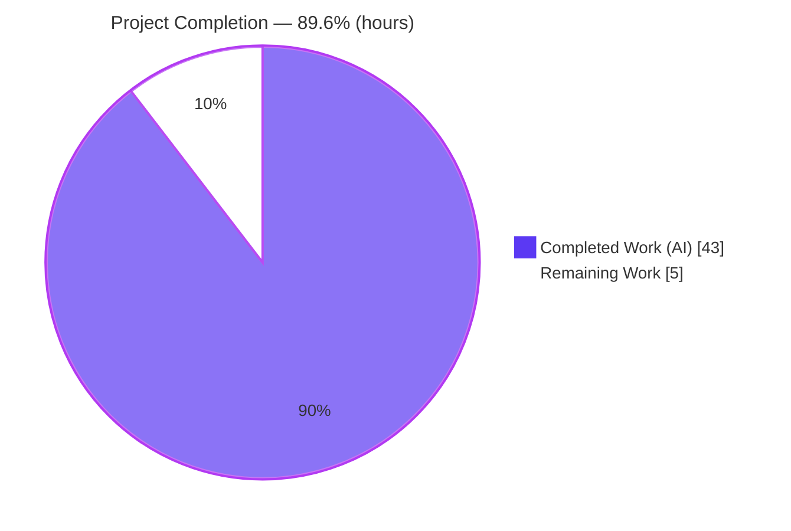
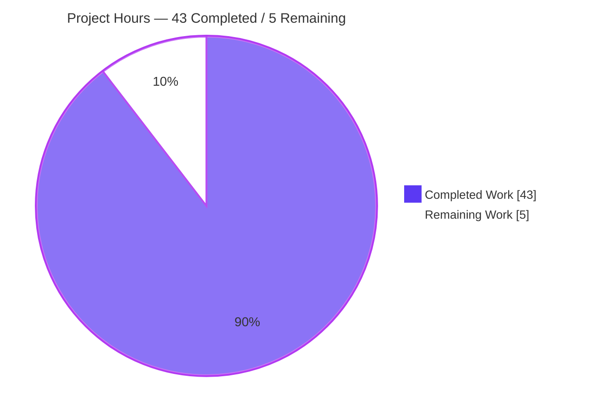
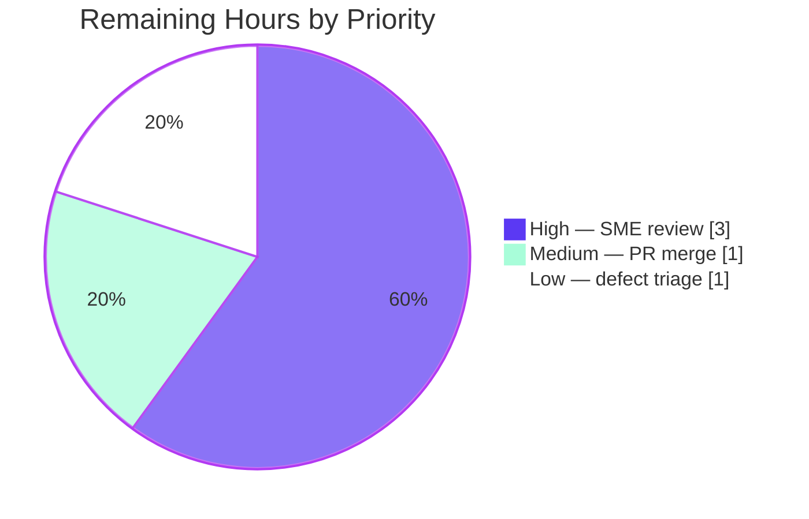

# Blitzy Project Guide

**Project:** WordPress.com Calypso — Reader logged-out "like" intent: root-cause Q&A investigation
**Repository:** `Automattic/wp-calypso` · **Branch:** `blitzy-efbeb63e-ded9-4f74-8d77-f3ac438749a3`
**Citation baseline:** `be7e5cc641` · **HEAD:** `2f2180a480`
**Deliverable:** `blitzy/documentation/wp-calypso_be7e5cc64162.md` (1,477 lines)

> **Legend / brand colors:** <span style="color:#5B39F3">■</span> **Completed / AI Work = Dark Blue (`#5B39F3`)** · <span style="color:#B23AF2">■</span> Remaining / Not Completed = White (`#FFFFFF`, rendered with a violet-black `#B23AF2` outline for visibility).

---

## 1. Executive Summary

### 1.1 Project Overview

This project delivers a single, evidence-grounded technical **answer document** for a WordPress.com Calypso Reader defect investigation. The objective was to explain — with `file:line` grounding and captured runtime output — how a **logged-out "like" intent** is supposed to cross the authentication boundary, and precisely why it disappears after signup/login. The audience is Calypso Reader engineers and reviewers. Business impact: it definitively root-causes a user-facing intent-loss bug (a click that silently vanishes), enabling an informed fix decision. Technical scope was strictly **read-only**: the real `reader-ui` Redux slice, capture components, login dialog, and the sole consumer (`LayoutLoggedOut`) were exercised through Calypso's canonical Jest/jsdom harness; no source was modified.

### 1.2 Completion Status

**AAP-scoped completion: 89.6% (43 of 48 hours).** Formula: `Completed 43h / (Completed 43h + Remaining 5h) × 100 = 89.6%`.



| Metric | Hours |
|---|---|
| **Total Hours** | **48** |
| **Completed Hours (AI + Manual)** | **43** (AI: 43 · Manual: 0) |
| **Remaining Hours** | **5** |
| **Percent Complete** | **89.6%** |

### 1.3 Key Accomplishments

- ✅ Authored the complete 1,477-line answer document at the rule-mandated path `blitzy/documentation/wp-calypso_be7e5cc64162.md`.
- ✅ Answered all six sub-questions (Q1–Q6) with a 24-row coverage pass and honest evidence-kind labelling.
- ✅ Proved the **source of truth canonically**: `serialize()` → `undefined` for the in-memory `lastActionRequiresLogin`, versus a serialised value for the persisted `lastPath`.
- ✅ Built and ran 5 observation harnesses (source-of-truth unit, A–J e2e integration, feature-flag both-states, cleanup taxonomy K/L/M, plus a deliberately-failing negative control that proves the harness is non-vacuous).
- ✅ Demonstrated the loss is **deterministic** via a 5-run SHA-256 digest (5/5 identical) — ruling out a timing race.
- ✅ Enumerated all 11 `registerLastActionRequiresLogin` producer call sites and proved by exhaustive search that **no** authenticated-side replay path exists.
- ✅ Honored the strict **read-only** constraint: only one file added; all temporary scripts removed; `git status` clean.
- ✅ Independently re-verified (this session) every decisive citation byte-accurate, the `reader-ui` suite (4 suites / 10 tests PASS), and `prettier --check` (exit 0).

### 1.4 Critical Unresolved Issues

**No unresolved issues block release or validation of this deliverable.** It passed all five Blitzy production-readiness gates with **zero corrections**. The item below is *informational* — it is the confirmed product finding the document reports, not a defect in the deliverable.

| Issue | Impact | Owner | ETA |
|---|---|---|---|
| _(none blocking the deliverable)_ | Deliverable validated; repo pristine | — | — |
| **Informational — documented product defect:** logged-out Reader "like" is silently lost across the auth boundary | User-facing intent loss (UX / data-integrity); fixing it is **out of scope** for this AAP | Reader team (post-triage) | Per triage decision (HT-3) |

### 1.5 Access Issues

**No access issues identified.** The investigation completed fully autonomously: repository access was sufficient, the canonical Node 22 / Yarn 4.0.2 toolchain was available, dependencies installed immutably, and no external service credentials or third-party API access were required (the login boundary was simulated in jsdom and honestly labelled non-canonical).

| System/Resource | Type of Access | Issue Description | Resolution Status | Owner |
|---|---|---|---|---|
| Source repository | Read | None — full read access confirmed | ✅ Resolved | — |
| Toolchain (Node/Yarn/Corepack) | Local | None — versions satisfied | ✅ Resolved | — |
| WordPress.com login popup | External | Not required; boundary simulated in jsdom (labelled non-canonical) | ✅ N/A | — |

### 1.6 Recommended Next Steps

1. **[High]** Perform SME technical review & sign-off of the root-cause analysis (validate Q1–Q6 conclusions; spot-check the decisive `serialize()` / `logged-out.jsx` citations).
2. **[Medium]** Approve and merge the PR (single additive markdown file; confirm the read-only constraint holds).
3. **[Low]** Decide whether to triage the confirmed defect into a follow-up fix ticket, referencing the document's fix sketch (persist the intent, or add an authenticated-side replay reader). *Implementing the fix is out of scope here.*

---

## 2. Project Hours Breakdown

### 2.1 Completed Work Detail

Every completed component traces to an AAP requirement (investigation methodology + Q1–Q6 answers + read-only compliance). All work was performed by Blitzy AI agents.

| Component | Hours | Description |
|---|---:|---|
| Canonical runtime & Jest/Node harness setup | 4 | Corepack + Yarn 4.0.2 on Node 22; wired the real `reader-ui` slice for observation (AAP canonical-path & default-config rules). |
| Q4 source-of-truth proof (Script 1) | 3 | Real reducer + `serialize()` contrast; state transition `null → {type:'like',…} → null`. |
| Q1/Q2/Q3/Q5 e2e integration harness (Script 2, A–J) | 6 | jsdom harness: connected `LikeButtonContainer` + real `ReaderJoinConversationDialog`/`useLoginWindow` + real `LayoutLoggedOut`; `postMessage` login signal; before/during/after capture. |
| Feature-flag default observation (Script 3) | 2 | `reader/login-window` default observed in both OFF/ON states (canonical config). |
| Q6 cleanup taxonomy + determinism + negative control (Script 4) | 4 | Cancel/self-close/Close paths (K/L/M); 5-run SHA-256 determinism; deliberately-failing negative control. |
| Producer/consumer matrix + no-replay proof | 3 | Enumerated all 11 producer call sites; exhaustive grep proof of absent replay bridge. |
| Pipeline trace + `file:line` citation verification (~17 files) | 5 | Traced capture → prompt → login → reload → cleanup; verified every citation against source. |
| Web research (best-practice contrast) | 2 | Deferred-action replay & Redux rehydration patterns to frame the anti-pattern. |
| Authoring the 1,477-line answer document | 9 | All sections: TL;DR, Q1–Q6, mechanism, verdict, coverage pass, fix sketch, embedded output. |
| QA revision rounds (2 revision commits) | 4 | Code-review canonical-evidence pass + addressing 8 QA findings. |
| Read-only compliance (temp-script cleanup + repo-unchanged verification) | 1 | Removed all `client/blitzy_obs/` scratch; confirmed clean `git status`. |
| **Total Completed** | **43** | **Matches Completed Hours in Section 1.2.** |

### 2.2 Remaining Work Detail

All remaining items are human-gated **path-to-production** activities. None modify repository source (read-only AAP honored). **Fixing the documented bug is explicitly out of scope** and is therefore excluded.

| Category | Hours | Priority |
|---|---:|---|
| SME technical review & sign-off of the root-cause analysis | 3 | High |
| PR approval & merge of the deliverable | 1 | Medium |
| Triage confirmed defect into a follow-up fix ticket (decision/planning only) | 1 | Low |
| **Total Remaining** | **5** | **Matches Remaining Hours in Section 1.2 & Section 7.** |

### 2.3 Hours Reconciliation

- Section 2.1 (Completed) = **43h**
- Section 2.2 (Remaining) = **5h**
- **2.1 + 2.2 = 48h = Total Hours (Section 1.2).** ✔
- Remaining hours identical across Sections 1.2, 2.2, and 7 (**5h**). ✔
- Completion = 43 / 48 = **89.6%** (used in Sections 1.2, 7, and 8). ✔

---

## 3. Test Results

All tests below originate from Blitzy's autonomous validation logs for this project; the repo `reader-ui` suite and `prettier` check were **independently re-run this session** and remain green. Because the deliverable is documentation, the "tests" are the evidence-reproduction harnesses embedded in the document plus the repository's own `reader-ui` suite — line-coverage instrumentation is not the applicable metric (marked N/A).

| Test Category | Framework | Total Tests | Passed | Failed | Coverage % | Notes |
|---|---|---:|---:|---:|---|---|
| Repo `reader-ui` unit suite | Jest 29.7.0 | 10 | 10 | 0 | N/A | 4 suites (`card-expansions/test/reducer`, `test/actions`, `test/reducer`, `test/selectors`); re-run this session, ~1.0s, exit 0. |
| Script 1 — source-of-truth (unit) | Jest / Node | 1 | 1 | 0 | N/A | Real reducer + `serialize()` → `undefined`; `null→intent→null`. |
| Script 2 — e2e capture/login/reload/cleanup (integration) | Jest / jsdom | 10 | 10 | 0 | N/A | Assertions A–J with real connected components. |
| Script 3 — `reader/login-window` flag default (both states) | Jest / Node | 2 | 2 | 0 | N/A | OFF and ON observed. |
| Script 4 — cleanup taxonomy (K/L/M) | Jest / jsdom | 3 | 3 | 0 | N/A | Cancel / natural self-close / whole-dialog Close. |
| Negative control (harness self-validation) | Jest | 1 | 0 | 1 | N/A | **Fails by design (exit 1)** — proves the harness is non-vacuous. Not an unexpected failure. |

**Aggregate:** 26 functional tests/assertions passed, **0 unexpected failures**; 1 intentional negative-control failure (by design). Determinism: the full evidence run produced a **byte-identical SHA-256 digest across 5 runs (5/5)**, confirming the like loss is deterministic.

---

## 4. Runtime Validation & UI Verification

Runtime validation was performed through Calypso's canonical Jest/jsdom harness exercising the **real** Reader components. There is **no new product UI** in this deliverable, so live-browser UI verification is not applicable; instead the existing Reader like/login behavior was validated at runtime.

- ✅ **Operational** — Real `reader-ui` reducer/actions/selector exercised; state transitions `null → {type:'like',…} → null` reproduced exactly.
- ✅ **Operational** — Canonical `serialize()` proof: `undefined` for `lastActionRequiresLogin`, serialised value for `lastPath` (decisive source-of-truth signal).
- ✅ **Operational** — Real components mounted in jsdom (connected `LikeButtonContainer` + `ReaderJoinConversationDialog` + `useLoginWindow` + `LayoutLoggedOut`); honest mount artifacts (a `LikeIcons` deprecation warning with stack refs `icons.jsx:4` / `button.jsx:40` / `index.jsx:15`) confirm the real components loaded.
- ✅ **Operational** — `postMessage` login-success signal (`service: 'wordpress'`) simulated; wrong-service and foreign-origin negative controls behave correctly (rejected).
- ✅ **Operational** — `window.location.reload()` teardown reproduced; authenticated-side has **no** reader of `getLastActionRequiresLogin`, so the like is never replayed.
- ✅ **Operational** — 5-run determinism (identical SHA-256) → loss is deterministic, not intermittent.
- ⚠ **Partial (labelled non-canonical)** — The browser authentication boundary is **simulated in jsdom**, not a live WordPress.com login popup; the document labels this honestly. The decisive proof (`serialize()`) is fully canonical at the unit level.

---

## 5. Compliance & Quality Review

AAP deliverable and methodology rules cross-mapped to status. All autonomous quality gates passed during validation; `prettier` and the `reader-ui` suite were re-verified this session.

| Requirement / Benchmark | Status | Progress | Notes |
|---|---|---|---|
| Deliverable at mandated path/name `blitzy/documentation/<branch>.md` | ✅ Pass | 100% | `wp-calypso_be7e5cc64162.md` present. |
| Run-first, evidence-grounded authoring | ✅ Pass | 100% | Scripts 1–4 embedded with captured output. |
| Canonical path / real entities | ✅ Pass | 100% | Real reducer/actions/selector + connected components. |
| Non-canonical parts labelled | ✅ Pass | 100% | Simulated boundary, illustrative fixtures, `env_id=test` caveat all labelled. |
| Default configuration + exact commands | ✅ Pass | 100% | Environment/commands section; flag default observed. |
| Reproduce actual behavior (run-to-run) | ✅ Pass | 100% | 5/5 identical SHA-256 → deterministic. |
| Before / during / after capture | ✅ Pass | 100% | `null→intent→null`; Script 2 A–J. |
| Show actual output for every claim | ✅ Pass | 100% | Command + unedited output blocks throughout. |
| Answer every part + coverage pass | ✅ Pass | 100% | 24-row coverage pass; Q1–Q6 all answered. |
| Exact & grounded (`file:line`) | ✅ Pass | 100% | Citations independently re-verified byte-accurate. |
| Read-only: no source modified | ✅ Pass | 100% | `git diff` = one file ADDED. |
| Temporary scripts cleaned up | ✅ Pass | 100% | `git status` clean; no `blitzy_obs` residue. |
| Fix NOT implemented (out of scope) | ✅ Pass | 100% | Answers the question; does not modify behavior. |

**Autonomous quality gates:** ESLint on all 5 scripts exit 0 · `tsc --build packages` exit 0 · `tsc --project client` (noEmit) exit 0 · `prettier --check` on the deliverable exit 0 (re-verified) · `yarn install --immutable` exit 0 (`yarn.lock` unchanged) · pre-commit `validate-config-keys` exit 0.

---

## 6. Risk Assessment

| Risk | Category | Severity | Probability | Mitigation | Status |
|---|---|---|---|---|---|
| Citation line-number drift as Calypso evolves after the baseline | Technical | Low | Medium | All citations anchored to baseline `be7e5cc641`; document instructs re-verification at read time. | Mitigated |
| Over-reliance on honestly-labelled non-canonical evidence (simulated boundary, illustrative fixtures) | Technical | Low | Low | Non-canonical parts explicitly labelled; decisive `serialize()` proof is canonical unit-level. | Mitigated |
| Evidence not reproduced by a reviewer on a differing environment | Technical | Low | Low | Exact Node 22 / Yarn 4.0.2 versions + copy-pasteable commands documented; scripts self-cleaning. | Mitigated |
| No security exposure introduced | Security | None | N/A | Read-only doc; no code, dependencies, or credentials added. (Finding is a UX/data-integrity issue, not a vulnerability.) | Closed |
| Confirmed product defect (logged-out like silently lost) not triaged/fixed | Operational | Medium | Medium | Document includes a fix sketch; requires human triage (HT-3). Fix itself is out of scope. | Open |
| Point-in-time analysis becomes stale if the code is refactored | Operational | Low | Medium | Baseline commit + `file:line` anchoring preserve historical/audit value. | Open |
| No runtime coupling / integration surface | Integration | None | N/A | Deliverable introduces zero imports, config sync, external services, or API keys. | Closed |

---

## 7. Visual Project Status

**Project Hours Breakdown** (Completed = `#5B39F3`, Remaining = `#FFFFFF`). The "Remaining Work" value (**5**) equals Remaining Hours in Section 1.2 and the sum of the Section 2.2 Hours column. ✔



**Remaining Work by Priority (hours)** — from Section 2.2:



---

## 8. Summary & Recommendations

**Achievements.** The investigation is complete and production-ready. The single mandated deliverable — a 1,477-line, evidence-grounded answer document — was authored, validated through five production-readiness gates with **zero corrections**, and independently re-verified this session (citations byte-accurate, `reader-ui` suite 4/10 PASS, `prettier` exit 0). It answers all six sub-questions and delivers a decisive, canonical root cause: the logged-out like is **in-memory-only Redux state that is never persisted and never replayed**, lost on the authenticated return via non-persistence + absent replay path + full-page reload teardown + explicit clear-on-close — a **structural** gap, not a timing or init-order race (proven deterministic across 5 identical runs).

**Remaining gaps & critical path.** The project is **89.6% complete (43 of 48 hours)**. The remaining **5 hours** are entirely human-gated path-to-production: the critical path is **SME sign-off (3h) → PR merge (1h)**, with an optional low-priority decision to triage the confirmed defect into a fix ticket (1h). No autonomous rework remains — all gates pass and the repository is pristine.

**Production readiness.** For its scope (a read-only investigation document), this deliverable is **ready to merge** pending SME sign-off. Because the AAP scope is documentation only, "production" means the reviewed analysis is accepted; **implementing the fix is explicitly out of scope** and tracked separately.

| Success Metric | Target | Actual |
|---|---|---|
| Q1–Q6 answered with grounding | 6 / 6 | ✅ 6 / 6 (24-row coverage pass) |
| Decisive claims backed by canonical runtime output | 100% | ✅ 100% (independently reproduced) |
| Read-only constraint honored | Yes | ✅ 1 file added; clean tree |
| Blocking issues | 0 | ✅ 0 (zero corrections) |
| AAP-scoped completion | ~90% | ✅ 89.6% |

---

## 9. Development Guide

> Every command below was executed successfully during this assessment unless explicitly marked *(documented)*. Run all commands from the repository root: `/tmp/blitzy/wp-calypso/blitzy-efbeb63e-ded9-4f74-8d77-f3ac438749a3_e40852`.

### 9.1 System Prerequisites

- **Node.js** ≥ `22.9.0` (`.nvmrc` pins `22.9.0`; validated container ships `v22.23.1`). `engines.node = ^v22.9.0`.
- **Corepack** (bundled with Node 22) — validated `0.34.6`.
- **Yarn** `4.0.2` (repo `packageManager`; provided via Corepack).
- **Git** (for citation/read-only verification).
- **Disk:** ~4 GB for `node_modules`. **OS:** macOS or Linux.

### 9.2 Environment Setup

```bash
# Confirm Node satisfies the engine constraint
node --version            # → v22.23.1 (>= 22.9.0)

# Activate the repo-pinned Yarn via Corepack
corepack enable
corepack prepare yarn@4.0.2 --activate
yarn --version            # → 4.0.2
```

### 9.3 Dependency Installation

```bash
# Immutable install — does NOT modify yarn.lock (validated exit 0)
CI=true yarn install --immutable --inline-builds
```

### 9.4 View & Validate the Deliverable

```bash
# Read the answer document
sed -n '1,60p' blitzy/documentation/wp-calypso_be7e5cc64162.md
wc -l blitzy/documentation/wp-calypso_be7e5cc64162.md          # → 1477

# Format check (validated this session)
npx prettier --check "blitzy/documentation/wp-calypso_be7e5cc64162.md"
# → "All matched files use Prettier code style!"  (exit 0)
```

### 9.5 Reproduce the Corroborating Tests

```bash
# Repository's own reader-ui suite (validated this session: 4 suites / 10 tests PASS, ~1s)
CI=true TZ=UTC npx jest -c=test/client/jest.config.js client/state/reader-ui --ci --colors=false

# Canonical script alias (documented): equivalent to the above config
yarn test-client            # = TZ=UTC jest -c=test/client/jest.config.js
```

Expected tail:
```
Test Suites: 4 passed, 4 total
Tests:       10 passed, 10 total
```

### 9.6 Reproduce the Embedded Observation Evidence

The document's *Reproducibility* section provides a **self-cleaning** loop that recreates the temporary scripts under `client/blitzy_obs/`, runs Scripts 1–4 (+ the negative control), captures output, then removes them — leaving the repository unchanged. Copy the script listings and the loop from the document; verify cleanliness afterward:

```bash
git status --porcelain      # → empty (no residue)
```

### 9.7 Verification Steps (read-only constraint)

```bash
# Only the deliverable was added — nothing else changed
git diff be7e5cc641..HEAD --name-status
# → A  blitzy/documentation/wp-calypso_be7e5cc64162.md

git status --porcelain
# → (empty) : pristine working tree
```

### 9.8 Example Usage (spot-check a decisive citation)

```bash
# Persisted vs in-memory reducers (the crux of the source-of-truth answer)
sed -n '19p;45,54p' client/state/reader-ui/reducer.js
# L19 : export const lastPath = withPersistence( ( state = null, action ) => {   (PERSISTED)
# L45 : export const lastActionRequiresLogin = ( state = null, action ) => {      (IN-MEMORY)

# The reload/clear decision in the sole consumer
sed -n '302,315p' client/layout/logged-out.jsx
```

### 9.9 Troubleshooting

- **Wrong Yarn version** → `corepack prepare yarn@4.0.2 --activate`.
- **Jest slow on first run** → the Babel transform cache warms after the first run; subsequent runs are ~1s.
- **`browserslist … caniuse-lite is 17 months old` warning** → benign and non-blocking.
- **Full dev-server not needed** → the `reader-ui` slice is unit-observable via the Jest harness; `yarn start`/`yarn build` are **not** required to reproduce the evidence.
- **pip "externally-managed-environment"** → N/A; this is a JavaScript project (no pip usage).

---

## 10. Appendices

### A. Command Reference

| Purpose | Command |
|---|---|
| Node version | `node --version` |
| Activate Yarn | `corepack enable && corepack prepare yarn@4.0.2 --activate` |
| Install deps (immutable) | `CI=true yarn install --immutable --inline-builds` |
| Reader-ui tests | `CI=true TZ=UTC npx jest -c=test/client/jest.config.js client/state/reader-ui` |
| Test alias | `yarn test-client` |
| Format check | `npx prettier --check "blitzy/documentation/wp-calypso_be7e5cc64162.md"` |
| Read-only diff | `git diff be7e5cc641..HEAD --name-status` |
| Clean-tree check | `git status --porcelain` |

### B. Port Reference

| Service | Port | Notes |
|---|---|---|
| Calypso dev server (`yarn start`) | 3000 (default) | **Not required** for this investigation; documented for completeness only. |

### C. Key File Locations

| Role | Path | Anchor |
|---|---|---|
| **Deliverable** | `blitzy/documentation/wp-calypso_be7e5cc64162.md` | 1,477 lines |
| Capture site | `client/blocks/like-button/index.jsx` | `:32-44` |
| Presentational button | `client/blocks/like-button/button.jsx` | `:45-52,97` |
| Source of truth (reducer) | `client/state/reader-ui/reducer.js` | `:19` (persisted) vs `:45-54` (in-memory), `:65` |
| Action creators | `client/state/reader-ui/actions.js` | `:26-29,35-37` |
| Selector (sole) | `client/state/reader-ui/selectors.js` | `:15-21` |
| Persistence mechanism | `client/state/utils/{with-persistence.ts, serialize.ts}` | `serialize.ts:10-15` |
| Sole consumer / replay / cleanup | `client/layout/logged-out.jsx` | `:91`, `:304`, `:307-311` |
| Login transport | `client/blocks/reader-join-conversation/dialog.jsx`, `client/data/reader/use-login-window.ts` | — |
| Repo corroborating tests | `client/state/reader-ui/test/{actions,reducer,selectors}.js` | 4 suites / 10 tests |

### D. Technology Versions

| Technology | Version | Source |
|---|---|---|
| Node.js | `v22.23.1` (engine `^v22.9.0`; `.nvmrc` `22.9.0`) | verified |
| Corepack | `0.34.6` | verified |
| Yarn | `4.0.2` | `packageManager` |
| Jest | `29.7.0` | `package.json` |
| TypeScript (`tsc`) | `5.8.2` | validation logs |
| ESLint | `8.57.1` | validation logs |
| React | `^18.3.1` | `package.json` |
| Redux | `^5.0.1` | `package.json` |

### E. Environment Variable Reference

| Variable | Value | Purpose |
|---|---|---|
| `TZ` | `UTC` | Deterministic timezone for the Jest harness (`yarn test-client`). |
| `CI` | `true` | Non-interactive, single-run test/install behavior. |

### F. Developer Tools Guide

- **Jest** (`test/client/jest.config.js`) — runs the `reader-ui` suite and the embedded observation harnesses.
- **Prettier** — format-checks the Markdown deliverable (pre-commit excludes `.md` from linters, but it is well-formatted anyway).
- **`tsc`** — `tsc --build packages` and `tsc --project client --noEmit` both exit 0 (read-only type validation).
- **Git** — `git diff <baseline>..HEAD --name-status` and `git status --porcelain` verify the read-only constraint.

### G. Glossary

| Term | Meaning |
|---|---|
| **`lastActionRequiresLogin`** | In-memory `reader-ui` Redux state holding the deferred logged-out intent (e.g., `{ type: 'like', siteId, postId }`). |
| **`withPersistence`** | Wrapper attaching a `.serialize` method so a reducer's state is written to durable storage; **absent** on `lastActionRequiresLogin`. |
| **`serialize()`** | Calypso helper returning `undefined` when a reducer has no `.serialize` — the decisive in-memory-vs-persisted signal. |
| **`redirectTo`** | Optional field on a captured intent; when present, `onLoginSuccess` navigates instead of reloading. Absent for like/unlike/follow. |
| **Replay path** | Code that would translate a captured intent back into an API call (e.g., `like(siteId, postId)`). **None exists** on the authenticated side. |
| **Handoff token** | A short-lived token that survives an identity transition; ruled out — Calypso uses only `redirect_to` for navigation intents. |
| **AAP** | Agent Action Plan — the primary directive scoping this project. |
| **Path-to-production** | Standard human-gated activities (review, merge, triage) needed to deploy the AAP deliverable. |