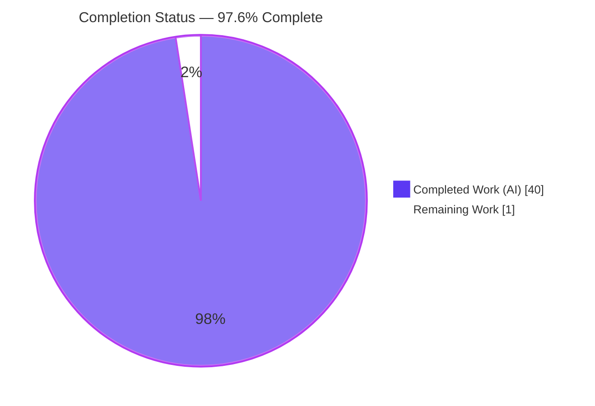
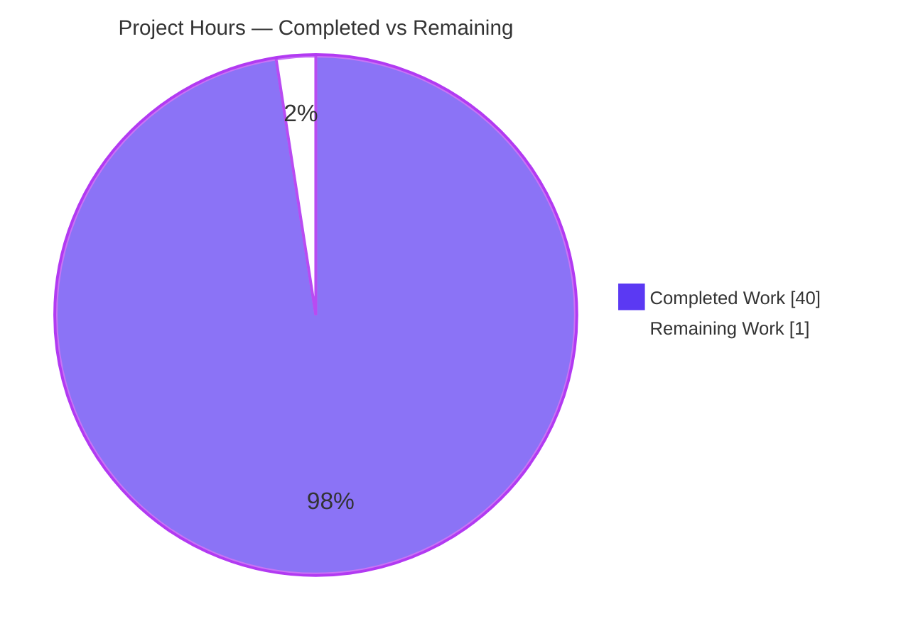
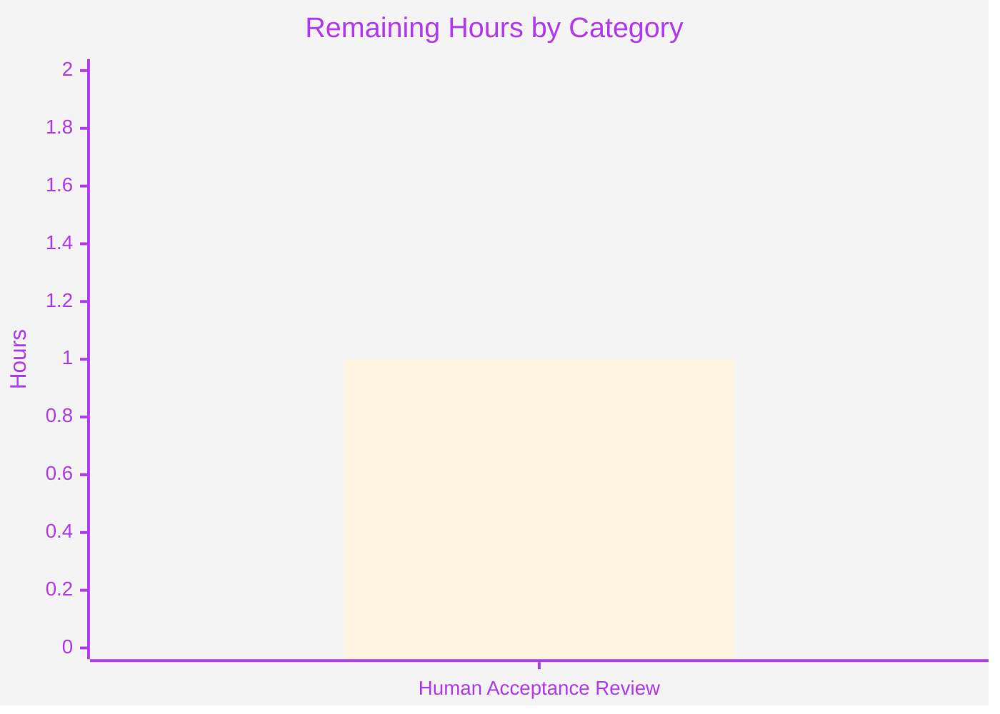
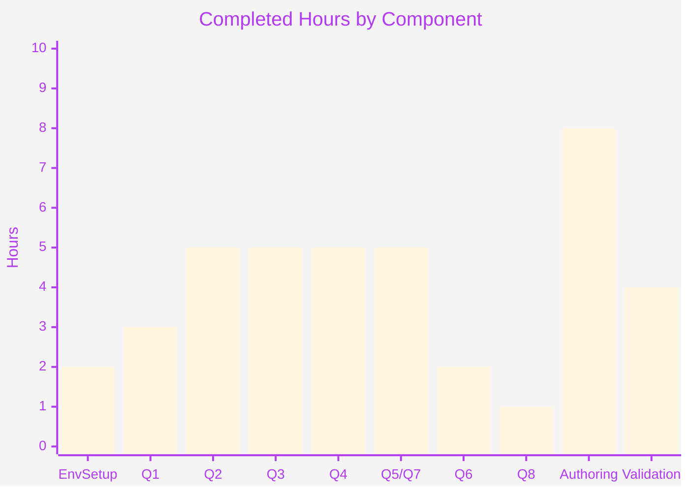

_Color legend — **Completed / AI Work:** Dark Blue `#5B39F3` · **Remaining:** White `#FFFFFF` · **Headings / Accents:** Violet‑Black `#B23AF2` · **Highlight:** Mint `#A8FDD9`._

# Blitzy Project Guide — wp-calypso Jest Execution-Context Investigation

---

## 1. Executive Summary

### 1.1 Project Overview

This project delivers a single, evidence-backed Markdown investigation document that explains — from *observed runtime output* — why some tests in the `Automattic/wp-calypso` monorepo pass in isolation but fail when run as part of the full suite. It empirically dissects the differences in runtime environment, global availability, module resolution, and initialization order across the repository's seven Jest execution contexts. The audience is the engineers debugging the wp-calypso test infrastructure. The technical scope is a strictly **read-only** investigation whose sole permanent artifact is `blitzy/documentation/wp-calypso_be7e5cc64162.md`; no runtime or source code is altered. The business impact is faster diagnosis of context-dependent test flakiness across the monorepo's 58 package suites.

### 1.2 Completion Status

The project is **97.6% complete**, calculated on AAP-scoped hours: `40 completed ÷ 41 total × 100 = 97.6%`.



| Metric | Hours |
|---|---|
| **Total Hours** | 41 |
| **Completed Hours (AI + Manual)** | 40 (40 AI + 0 Manual) |
| **Remaining Hours** | 1 |
| **Percent Complete** | **97.6%** |

### 1.3 Key Accomplishments

- ✅ Sole AAP deliverable created, committed, and pushed: `blitzy/documentation/wp-calypso_be7e5cc64162.md` (1,105 lines, 77 KB).
- ✅ All eight investigative objectives (Q1–Q8) answered with the pattern *direct answer → verbatim command + complete output → `file:line` evidence → rationale*.
- ✅ Seven Jest execution contexts enumerated and exercised through their **real** entry points; `testEnvironment` resolution confirmed (`node` ×4 suites, `jsdom` in apps/22-of-58 packages/docblocks).
- ✅ Internal-dependency resolution traced: `@automattic/components` → `@automattic/i18n-utils` loads source `src/index.ts` under Jest vs the absent `dist/cjs/index.js` under plain Node (`MODULE_NOT_FOUND`).
- ✅ Per-context import override demonstrated for `@automattic/calypso-config`; run-to-run haste-map notice variance reproduced honestly (substantive resolution invariant).
- ✅ Initialization order verified empirically via custom environment probes (`STAGE1`→`STAGE6`).
- ✅ Read-only mandate honored: single-file addition, all temporary probes removed, clean working tree.
- ✅ 67 real repository tests exercised during the run-first investigation all pass (100%).

### 1.4 Critical Unresolved Issues

| Issue | Impact | Owner | ETA |
|---|---|---|---|
| _None identified_ | The deliverable is complete, independently verified accurate, and the repository is pristine. No compilation, test, or runtime errors exist in any exercised path. | — | — |

### 1.5 Access Issues

**No access issues identified.** The repository was fully accessible, `yarn install` completed successfully, all seven Jest contexts were runnable, and the deliverable was committed and pushed on branch `blitzy-fc213574-ff44-4dec-b754-98f45e636026`.

| System/Resource | Type of Access | Issue Description | Resolution Status | Owner |
|---|---|---|---|---|
| wp-calypso repository | Read/Write (branch) | None — clone, install, run, commit, push all succeeded | ✅ Resolved | — |
| npm / Yarn registry | Dependency install | None — `yarn install` completed ("Done with warnings in 2m 15s") | ✅ Resolved | — |

### 1.6 Recommended Next Steps

1. **[High]** Read the full Q1–Q8 investigation document and confirm it answers the original prompt end-to-end (≈0.5h).
2. **[High]** Reproducibility spot-check: re-run 3–4 representative documented commands (toolchain versions; one Q2 globals probe; the Q3 custom-resolver one-liner) and confirm outputs match (≈0.25h).
3. **[High]** Integrity & sign-off: confirm `git diff --name-status be7e5cc641..HEAD` shows the single file addition, then approve/merge (≈0.25h).
4. **[Low]** Record a maintainer note: never run `prettier --write` on the deliverable (it strips verbatim tabs); the pre-commit hook already excludes `.md`.

---

## 2. Project Hours Breakdown

### 2.1 Completed Work Detail

Each component traces to a specific AAP objective or path-to-production activity. **Total = 40 hours (matches Completed Hours in §1.2).**

| Component | Hours | Description |
|---|---:|---|
| Environment setup & canonical toolchain | 2 | Corepack/Yarn 4.0.2 activation, `yarn install` (~2m15s), Node 22.23.1 verification against `engines ^v22.9.0`, Jest availability check |
| Q1 — Test command & environment enumeration | 3 | Enumerated 6 suite scripts + aggregate `test` + E2E; resolved `testEnvironment` per suite via `jest --showConfig`; counted 22/58 jsdom packages |
| Q2 — Cross-context globals investigation | 5 | Probe files across 6 contexts; consolidated globals table; `matchMedia`/`crypto.randomUUID`/`Worker`/`CSS` contrasts; per-global `file:line` attribution; ≥2-run stability |
| Q3 — Internal-dependency resolution tracing | 5 | `components`→`i18n-utils` trace; custom resolver → `src/index.ts`; plain Node → `MODULE_NOT_FOUND`; real `external-link` suite run |
| Q4 — Import-override & per-context resolution | 5 | `@automattic/calypso-config` mapper per context; `calypso`≡client workspace; 30-run haste-map variance reproduction incl. cold-cache collision |
| Q5/Q7 — Initialization-order verification | 5 | Custom environments extending `jest-environment-node`/`jsdom`; `STAGE1`–`STAGE6` logging; key proof `expect` undefined→function across framework install |
| Q6 — Browser-API provider & timing | 2 | Identified `jest-environment-jsdom` 29.7.0 / jsdom 20.0.3; `window`/`document` present at environment construction (STAGE1) in jsdom only |
| Q8 — Read-only integrity & probe cleanup | 1 | Removed all 6 probe directories; verified clean tree and single-file diff |
| Deliverable authoring | 8 | Structured 1,105-line report; verbatim transcription; 36+ `file:line` refs; per-question rationale; 94 balanced code fences |
| Final validation & refinement | 4 | Re-ran every Q1–Q8 command; 3 commits (initial + Q4 variance honesty + Q6 version/Q8 note correction) |
| **Total** | **40** | |

### 2.2 Remaining Work Detail

Each category traces to a path-to-production need. **Total = 1 hour (matches Remaining Hours in §1.2 and §7).**

| Category | Hours | Priority |
|---|---:|---|
| Human Acceptance Review — read-through of Q1–Q8, reproducibility spot-check, and read-only integrity sign-off | 1 | High |
| **Total** | **1** | |

> No Medium/Low hour-bearing categories exist: the read-only Markdown deliverable requires no configuration, external-service setup, credentials, CI/CD, containerization, or optimization work.

### 2.3 Basis of Estimate

Completion percentage uses the AAP-scoped hours formula: `Completed ÷ (Completed + Remaining) × 100 = 40 ÷ 41 × 100 = 97.6%`. All eight objectives and all methodology constraints are **Completed** and independently verified; the single remaining item is the mandatory human acceptance gate, which cannot be performed autonomously (hence completion is capped below 100%). Confidence: **High** — a single, well-defined deliverable whose evidence was independently corroborated.

---

## 3. Test Results

The following tests were executed by Blitzy's autonomous systems during the **run-first** investigation and re-executed during final validation. All originate from Blitzy's autonomous validation logs for this project. Code-coverage measurement was **not** an objective of this documentation task; these real repository suites were run to demonstrate context-specific runtime behavior (source resolution, jsdom vs node environment), not to measure coverage.

| Test Category | Framework | Total Tests | Passed | Failed | Coverage % | Notes |
|---|---|---:|---:|---:|---:|---|
| Component (`packages/components` `external-link`) | Jest 29.7.0 | 10 | 10 | 0 | n/a | jsdom via `@jest-environment jsdom` docblock; demonstrates jsdom opt-in |
| Unit (`packages/i18n-utils`, 3 suites) | Jest 29.7.0 | 42 | 42 | 0 | n/a | Source resolution via `calypso:src` (`src/index.ts`) |
| Unit (`client/server/config` parser) | Jest 29.7.0 | 7 | 7 | 0 | n/a | `node` environment (server suite) |
| Unit (`client/lib/memoize-last`) | Jest 29.7.0 | 8 | 8 | 0 | n/a | `node` environment (client suite, no docblock) |
| **Total** | | **67** | **67** | **0** | — | 100% pass rate |

**Deliverable self-checks (non-Jest):** all Q1–Q8 documented commands reproduce their stable output exactly; the Markdown is well-formed with 94 balanced code fences; every `file:line` reference resolves in-range against the baseline commit.

---

## 4. Runtime Validation & UI Verification

**UI / API:** Not applicable — the deliverable is a documentation file with no UI surface, and the investigation starts no server (network is disabled in test setup via `nock.disableNetConnect()`), so there are no HTTP endpoints to verify.

**Runtime validation (Jest execution contexts and evidence anchors):**

- ✅ **Operational** — `test-client` (`node` environment) resolved and exercised via `jest -c=test/client/jest.config.js`.
- ✅ **Operational** — `test-packages` fan-out (`node` + 22 jsdom projects) exercised.
- ✅ **Operational** — `test-server` (`node`, `rootDir=client/server`) exercised.
- ✅ **Operational** — `test-build-tools` (`node`) exercised.
- ✅ **Operational** — `test-integration` (explicit `node`) exercised.
- ✅ **Operational** — `test-apps` (explicit `jsdom` ×3 projects) exercised.
- ✅ **Operational** — `test/e2e` (Playwright `JestEnvironmentPlaywright` extending `NodeEnvironment`) enumerated for completeness.
- ✅ **Operational** — Custom module resolver returns `packages/i18n-utils/src/index.ts` (verified live during this assessment).
- ✅ **Operational** — Read-only integrity: `git status --porcelain` empty; single-file diff vs baseline.
- ⚠ **Partial (by design)** — Inherently non-deterministic incidental output (real `crypto.randomUUID()`, Jest `Time` lines, haste-map notice order/pairing, cold-cache `@automattic/fingerprintjs` collision) is documented as variable and reproduced in shape, not frozen value.

---

## 5. Compliance & Quality Review

AAP deliverables mapped to quality/compliance benchmarks. Fixes applied during autonomous validation are noted.

| Requirement (AAP) | Benchmark | Status | Progress | Notes / Fix Applied |
|---|---|---|---|---|
| Q1 — Enumerate test commands + environments | Every command named; `testEnvironment` resolved | ✅ Pass | 100% | 6 scripts + aggregate + E2E; node/jsdom resolution via `--showConfig` |
| Q2 — Contrast globals across contexts | ≥1 capability present in one context, absent in another | ✅ Pass | 100% | `matchMedia` client/packages vs server; `crypto.randomUUID` real vs `'fake-uuid'` |
| Q3 — Internal dependency resolved file | Actual file identified; differs by method | ✅ Pass | 100% | `src/index.ts` (Jest) vs `dist/cjs/index.js` absent (Node) |
| Q4 — Import overrides + per-context resolution | Override located; same import → different files | ✅ Pass | 100% | `@automattic/calypso-config` mapper; **fix:** Q4 run-variance now reported honestly (commit `90c2ae065b`) |
| Q5/Q7 — Initialization order | Order established and verified empirically | ✅ Pass | 100% | `STAGE1`→`STAGE6`; `expect` undefined→function proof |
| Q6 — Browser-API provider + timing | Provider named; availability timed | ✅ Pass | 100% | jsdom 20.0.3 via jest-environment-jsdom 29.7.0; **fix:** jsdom-removal Jest version corrected (commit `7c019b05b5`) |
| Q8 — Read-only integrity | No tracked file modified; probes removed | ✅ Pass | 100% | **fix:** stale HEAD-hash note removed; diff-invariant used instead |
| Evidence discipline | Verbatim cmd + output + `file:line` per claim | ✅ Pass | 100% | 94 balanced fences; 36+ `file:line` refs |
| Run-first methodology | Execute then write | ✅ Pass | 100% | All commands actually executed |
| Stability + inconsistency reproduction | ≥2 runs; reproduce reported variance | ✅ Pass | 100% | Reproducibility note + 30-run haste-map batch |
| Deliverable naming & location | `blitzy/documentation/<branch>.md` | ✅ Pass | 100% | `wp-calypso_be7e5cc64162.md` in created directory |
| Lint/format compliance | Pre-commit hook | ✅ Pass | 100% | Hook (`bin/pre-commit-hook.js:L36`) excludes `.md`; verbatim tabs preserved intentionally |

**Outstanding compliance items:** none. The only advisory is procedural (do not manually `prettier --write` the deliverable).

---

## 6. Risk Assessment

| Risk | Category | Severity | Probability | Mitigation | Status |
|---|---|---|---|---|---|
| Inherently-variable incidental output (real UUIDs, `Time` lines, haste-map notice order, cold-cache fingerprintjs collision) mistaken for a defect by a re-runner | Technical | Low | Medium | Document labels these variable and reproduces them in shape; substantive results proven stable across ≥2 runs | Mitigated |
| `file:line` references anchored to baseline `be7e5cc641` could drift if upstream files change | Technical | Low | Low | Refs pinned to baseline; doc notes evidence-base files identical baseline↔HEAD; repo is read-only | Mitigated |
| Reproduction depends on canonical toolchain + exact install state (`i18n-utils/dist/cjs` absent drives Q3 `MODULE_NOT_FOUND`) | Operational | Low | Low | §9 documents exact toolchain and install; instructs not to build package `dist` | Mitigated |
| Manual `prettier --write` on the `.md` would strip trailing tabs inside code fences, corrupting verbatim evidence | Integration / Quality | Medium | Low | Verified pre-commit hook (`bin/pre-commit-hook.js:L36`) excludes `.md`; maintainer note added | Mitigated |
| Node version deviation — setup script proposed Node 20.x, violating `engines ^v22.9.0` | Technical | Low | Low | Node v22.23.1 actually used and documented; deviation noted honestly | Resolved |
| Security — read-only Markdown introduces no attack surface (no secrets/credentials/auth, no dependencies added, no executable production code) | Security | Low | Low | N/A — nothing to remediate; verbatim outputs contain only config/typeof/resolution paths | No action |

**Overall risk profile: Low.** No High-severity or blocking risks; no open/unmitigated risks; none require code rework (the deliverable is already accurate and validated).

---

## 7. Visual Project Status

**Project hours breakdown** (Remaining Work = 1 h, identical to §1.2 and the §2.2 total):



**Remaining hours by category** (from §2.2 — a single category):



**Completed hours by AAP objective** (informational; sums to the 40 completed hours):



---

## 8. Summary & Recommendations

**Achievements.** The project delivers a comprehensive, evidence-backed answer to why wp-calypso tests pass in isolation but fail in the full suite. The root cause is documented with observed proof: the same test code runs under different `testEnvironment`s, loads different setup files, and resolves the same import specifiers to different files depending on which of the seven suites executes it. All eight objectives (Q1–Q8) are answered with verbatim commands, complete output, and `file:line` evidence; 67 real repository tests exercised during the investigation pass 100%; and the read-only mandate is honored (single-file addition, clean tree).

**Remaining gaps / critical path to production.** The critical path is a single step: a **1-hour human acceptance review** (read-through, reproducibility spot-check, and integrity sign-off), after which the document can be merged. There are no code fixes, configuration, integration, or deployment activities because the deliverable is standalone documentation.

**Production-readiness assessment.** The project is **97.6% complete** and production-ready pending the human acceptance gate. The remaining 2.4% is the mandatory review that cannot be performed autonomously — consistent with the rule that completion is never claimed at 100% before human review.

| Success Metric | Target | Actual | Status |
|---|---|---|---|
| Objectives answered (Q1–Q8) | 8 | 8 | ✅ |
| Evidence-backed claims (`file:line`) | Every claim | 36+ refs, 94 balanced fences | ✅ |
| Real tests passing | 100% | 67/67 | ✅ |
| Read-only integrity | Single-file add, clean tree | Verified | ✅ |
| Completion | ≥ target | 97.6% | ✅ |

**Recommendation:** Perform the §1.6 acceptance steps and merge. Add a maintainer note preventing manual `prettier --write` on the deliverable.

---

## 9. Development Guide

This guide reproduces the investigation and verifies the deliverable. Every command below was executed on the canonical toolchain and reproduces the documented output.

### 9.1 System Prerequisites

- **Node.js** `^v22.9.0` (investigation used **v22.23.1**) — the `engines` field forbids Node 20.x.
- **Yarn** `4.0.2` (via Corepack) — pinned by `packageManager`.
- **Git** (with the branch checked out).
- **Disk:** ~1–2 GB free (≈242 MB working tree + `node_modules`).
- **OS:** Linux or macOS.

### 9.2 Environment Setup

```bash
# From the repository root
corepack enable                 # activates the pinned Yarn 4.0.2
node --version                  # must satisfy ^v22.9.0  -> v22.23.1
yarn --version                  # -> 4.0.2
cat .nvmrc                      # -> 22.9.0
```

> The client suite sets `TZ=UTC` (see `package.json` `test-client`); keep this when reproducing client-suite timing behavior.

### 9.3 Dependency Installation

```bash
yarn install                    # completes in ~2m ("Done with warnings")
node_modules/.bin/jest --version   # -> 29.7.0
```

> ⚠️ Do **not** build package `dist` output. Q3's `MODULE_NOT_FOUND` result depends on `packages/i18n-utils/dist/cjs/index.js` being **absent** in a fresh install.

### 9.4 Reproduce the Investigation

```bash
# Q1 — enumerate test commands
node -e "const p=require('./package.json'); for (const k of Object.keys(p.scripts)) if (k==='test'||k.startsWith('test-')) console.log(k+' = '+p.scripts[k]);"

# Q1 — resolve testEnvironment per suite (node for these four)
for cfg in test/client/jest.config.js test/build-tools/jest.config.js \
           test/server/jest.config.js test/integration/jest.config.js; do
  echo "--- $cfg ---"
  node_modules/.bin/jest --showConfig -c=$cfg 2>/dev/null | grep '"testEnvironment"' | head -1
done

# Q1 — apps suite is jsdom (x3 projects)
node_modules/.bin/jest --showConfig -c=test/apps/jest.config.js 2>/dev/null \
  | grep '"testEnvironment"' | sort | uniq -c

# Q3/Q4 — the custom resolver redirects internal imports to source
node -e "const resolve=require('./packages/calypso-jest/src/module-resolver.js'); const path=require('path'); const basedir=path.resolve('packages/components/src'); console.log('RESOLVER|', path.relative(process.cwd(), resolve('@automattic/i18n-utils',{basedir})));"
# -> RESOLVER| packages/i18n-utils/src/index.ts

# Q2/Q5/Q7 — globals & init-order probes use TEMPORARY dirs, e.g. client/blitzy_probe/test/*.js
#            run with:  jest -c=test/client/jest.config.js --silent=false <probe> 2>&1 | grep -oE 'PROBE\|.*'
#            ALWAYS delete probe dirs afterward (see Q8).
```

### 9.5 Verification

```bash
# Toolchain fingerprint
node --version; yarn --version; node_modules/.bin/jest --version
node -e "console.log(require('jest-environment-jsdom/package.json').version)"   # 29.7.0
node -e "console.log(require('jsdom/package.json').version)"                     # 20.0.3

# Read-only integrity (must show a clean tree and a single file addition)
git status --porcelain
git diff --name-status be7e5cc641622d153040491fd5625c6cb83e12eb..HEAD
# -> A  blitzy/documentation/wp-calypso_be7e5cc64162.md
```

### 9.6 Example Usage — reading the deliverable

```bash
# View the report
sed -n '1,60p' blitzy/documentation/wp-calypso_be7e5cc64162.md

# Jump to a specific answer (headings)
grep -nE '^## Q[0-9]' blitzy/documentation/wp-calypso_be7e5cc64162.md
```

Each `Q` section follows: **direct answer → command + verbatim output → `file:line` evidence → rationale.**

### 9.7 Troubleshooting

- **`engines` error / unexpected install differences:** you are on Node < 22. Switch to Node `^v22.9.0` (the repo pins `22.9.0`).
- **Q3 resolves to `dist/cjs` instead of `MODULE_NOT_FOUND`:** package `dist` was built. Use a clean `yarn install` without building package output.
- **Verbatim code blocks look reflowed / tabs missing:** the file was reformatted. Never run `prettier --write` on the deliverable; restore from git. The pre-commit hook already excludes `.md`.
- **Different `Time`, UUID, or haste-map notice text between runs:** expected — these are inherently variable and documented as such; the substantive resolution/result does not change.
- **Leftover `blitzy_probe*` directories:** remove them (`rm -rf <ctx>/blitzy_probe*`) and re-check `git status --porcelain` is empty.

---

## 10. Appendices

### A. Command Reference

| Purpose | Command |
|---|---|
| Jest version | `node_modules/.bin/jest --version` |
| Show resolved config | `node_modules/.bin/jest --showConfig -c=<suite jest.config.js>` |
| Enumerate test scripts | `node -e "const p=require('./package.json'); …"` |
| Custom-resolver probe (Q3/Q4) | `node -e "const resolve=require('./packages/calypso-jest/src/module-resolver.js'); …"` |
| Run a suite | `jest -c=test/<suite>/jest.config.js` (client prefixes `TZ=UTC`) |
| Read-only proof | `git diff --name-status be7e5cc641..HEAD` |
| Clean-tree check | `git status --porcelain` |

### B. Port Reference

**Not applicable.** The investigation starts no server and disables network access in test setup (`nock.disableNetConnect()`); no ports are opened or required.

### C. Key File Locations

| Path | Role |
|---|---|
| `blitzy/documentation/wp-calypso_be7e5cc64162.md` | **The deliverable** (Q&A investigation report) |
| `package.json` (`scripts` L120–131) | Test command surface (Q1) |
| `packages/calypso-jest/jest-preset.js` (L9–11) | Base preset: resolver, base setup, `testEnvironment: 'node'` |
| `packages/calypso-jest/src/module-resolver.js` (L18–19) | Custom resolver `mainFields`/`conditionNames` (Q3/Q4) |
| `test/client/jest.config.js` (L10–11, L20–21) | Client mapper + `setupFiles`/`setupFilesAfterEnv` |
| `test/server/jest.config.js` (L7, L10–11) | Server `rootDir` + `calypso-config` mapper |
| `test/integration/jest.config.js` (L7–8) | Explicit `node` env + resolver |
| `test/apps/jest-preset.js` (L7, L13) | Explicit `jsdom` + reuses client setup |
| `test/packages/setup.js` (L3, L5, L7) | `crypto.randomUUID='fake-uuid'`, `ResizeObserver`, `matchMedia` |
| `test/server/setup-test-framework.js` | Omits browser globals (Q2 contrast) |
| `packages/i18n-utils/package.json` (L7, L9) | `main=dist/cjs/index.js`, `calypso:src=src/index.ts` |
| `packages/components/package.json` (L34) | Depends on `@automattic/i18n-utils` |
| `bin/pre-commit-hook.js` (L36) | Filter excludes `.md` |

### D. Technology Versions

| Component | Version |
|---|---|
| Node.js | v22.23.1 (satisfies `engines ^v22.9.0`) |
| Yarn | 4.0.2 |
| Jest | 29.7.0 |
| jest-environment-jsdom | 29.7.0 |
| jsdom | 20.0.3 |
| enhanced-resolve | repo-pinned (backs the custom resolver) |
| babel-jest | repo-pinned (`rootMode: 'upward'`) |

### E. Environment Variable Reference

| Variable | Value | Where / Why |
|---|---|---|
| `TZ` | `UTC` | `package.json` `test-client` script — deterministic client-suite timing |
| `CI` | `true` (recommended) | Prevents Jest watch mode in non-interactive reproduction |

No secrets, API keys, or service credentials are required by this investigation.

### F. Developer Tools Guide

- `jest --showConfig -c=<config>` — inspect the fully-resolved `testEnvironment`, `moduleNameMapper`, `setupFiles`, and `setupFilesAfterEnv` for any suite.
- `node -e "require('.../module-resolver.js')(spec,{basedir})"` — reproduce the custom `calypso:src`-first resolution outside Jest.
- `grep -oE 'PROBE\|.*'` — strip Jest's cosmetic `console.log` indentation from probe output.
- `git diff --name-status <baseline>..HEAD` — the single authoritative read-only integrity check.
- `git check-ignore <path>; echo "exit=$?"` — confirm the deliverable is tracked and not git-ignored.

### G. Glossary

| Term | Meaning |
|---|---|
| `testEnvironment` | Jest setting selecting the global runtime — `node` (no DOM) or `jsdom` (browser-like) |
| `calypso:src` | Custom `package.json` field pointing at untranspiled TypeScript source; the resolver prioritizes it over `main` |
| `moduleNameMapper` | Jest config that rewrites import specifiers to different files per suite |
| `setupFiles` | Scripts run **before** the test framework installs (`jest` exists; `expect`/`beforeAll` do not) |
| `setupFilesAfterEnv` | Scripts run **after** the framework installs (may use `jest.fn`, `beforeAll`, `expect`) |
| Isolation vs full-suite | Running one test file/suite alone vs the aggregated `test` script — the source of context-dependent pass/fail |
| Probe | A temporary, untracked test/config file created only to observe runtime behavior, deleted after capture |

---

_Cross-section integrity verified: Remaining Hours = **1** in §1.2, §2.2, and §7; §2.1 (40) + §2.2 (1) = **41** Total; all Section 3 tests originate from Blitzy's autonomous validation logs; completion = **97.6%** throughout; colors — Completed `#5B39F3`, Remaining `#FFFFFF`._