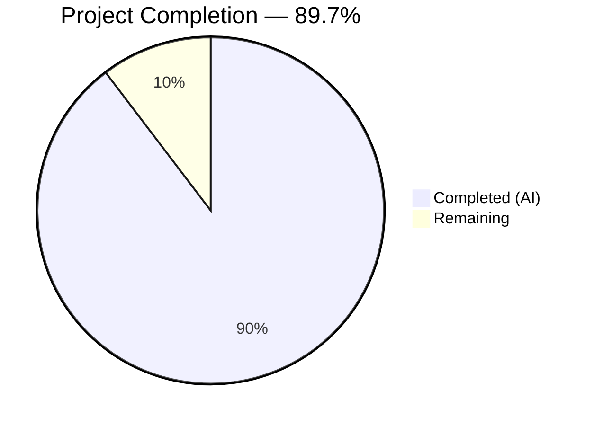

# Blitzy Project Guide

---

## 1. Executive Summary

### 1.1 Project Overview

This project creates a comprehensive investigative analysis document for the WordPress Calypso monorepo, answering targeted questions about Jest test runtime environments, module resolution behavior, and initialization order across six distinct test execution contexts. The document (`blitzy/documentation/wp-calypso_be7e5cc64162.md`) serves as a technical reference for developers navigating the monorepo's fragmented test infrastructure — cataloging 7 test commands, tracing the `@automattic/calypso-config` import redirection across contexts, inventorying 13 browser-like APIs, and identifying 5 root causes of context-dependent test behavior. This is a documentation-only deliverable with no source code modifications.

### 1.2 Completion Status



| Metric | Value |
|--------|-------|
| **Total Project Hours** | 29 |
| **Completed Hours (AI)** | 26 |
| **Remaining Hours** | 3 |
| **Completion Percentage** | 89.7% (26 / 29) |

### 1.3 Key Accomplishments

- ✅ Created `blitzy/documentation/wp-calypso_be7e5cc64162.md` — 638 lines of investigative analysis
- ✅ Characterized all 7 test commands (`test`, `test-client`, `test-server`, `test-packages`, `test-apps`, `test-build-tools`, `test-integration`) with full configuration detail
- ✅ Cataloged 13 browser-like APIs across 5 execution contexts with exact provenance (file, line, mechanism)
- ✅ Traced `@automattic/calypso-config` import resolution across all 6 contexts, documenting the moduleNameMapper vs calypso:src precedence rule
- ✅ Documented `@automattic/data-stores` as a case study for internal package dependency resolution via the calypso:src custom resolver
- ✅ Mapped the complete Jest lifecycle (10 stages) with initialization timing for every browser-like API
- ✅ Created 4 Mermaid diagrams (module resolution flowcharts, Jest lifecycle, setup file inheritance)
- ✅ Verified all 50+ source file line references against actual repository code
- ✅ Applied 2 factual correction commits after initial document creation
- ✅ Confirmed zero modifications to existing repository files (SWE-AtlasQnA-Repo compliance)
- ✅ Clean working tree verified — all temporary probe files removed

### 1.4 Critical Unresolved Issues

| Issue | Impact | Owner | ETA |
|-------|--------|-------|-----|
| Human technical review not yet performed | Document accuracy depends on domain expert validation of probe-derived conclusions | Human Developer | 2 hours |
| Source line references may drift | If referenced files (e.g., `test/client/jest.config.js`) are modified on the base branch, inline citations could become stale | Human Developer | Ongoing |

### 1.5 Access Issues

No access issues identified. This is a documentation-only project that reads existing source files and creates a new Markdown document in the `blitzy/documentation/` directory. No external services, credentials, or special permissions were required.

### 1.6 Recommended Next Steps

1. **[High]** Conduct technical peer review of the document by a developer familiar with the Calypso test infrastructure — verify claims about module resolution, API availability, and initialization order
2. **[High]** Merge the PR after review approval to make the document available to the team
3. **[Medium]** Consider updating existing `test/README.md` and `docs/testing/testing-overview.md` to reference the 3 undocumented test suites (packages, apps, build-tools) identified in the analysis
4. **[Low]** Establish a process to keep source line references current when referenced test configuration files change

---

## 2. Project Hours Breakdown

### 2.1 Completed Work Detail

| Component | Hours | Description |
|-----------|-------|-------------|
| Repository Analysis & Discovery | 5 | Read and analyzed 27+ source files across `test/`, `packages/`, `client/` directories to understand Jest configuration, setup file chains, module resolution, and config module variants |
| Runtime Investigation (Probes) | 3 | Created, executed, and cleaned up temporary probe tests across 5 execution contexts to capture global API availability, module resolution paths, and initialization timing |
| Q1: Test Commands & Environments | 3 | Authored command inventory table, 6 per-context deep dive sections, and environment comparison matrix |
| Q2: Global API Availability | 2 | Authored 13-API comparison table, provider provenance table with exact line references, and context hierarchy analysis |
| Q3: Internal Package Dependencies | 3 | Authored `@automattic/data-stores` case study, calypso:src resolution mechanism explanation, cross-context resolution table, and Mermaid resolution flowchart |
| Q4: Import Redirection | 3 | Authored `calypso-config` redirect pattern analysis, moduleNameMapper vs calypso:src precedence rule, resolution decision tree Mermaid diagram |
| Q5: Initialization Order | 2 | Authored Jest lifecycle flowchart (10 stages), probe results analysis, browser API timing table |
| Summary & Root Causes | 1.5 | Documented 5 root causes of context-dependent test behavior, created setup file inheritance Mermaid diagram |
| Document Formatting & TOC | 0.5 | Metadata table, table of contents with 23 internal links, section structure, Markdown formatting |
| Factual Corrections | 1.5 | Two correction commits: fixed Jest lifecycle ordering in Q5 section, corrected other factual inaccuracies |
| Source Reference Verification | 1.5 | Verified 50+ source file line references across 18+ referenced files |
| **Total** | **26** | |

### 2.2 Remaining Work Detail

| Category | Hours | Priority |
|----------|-------|----------|
| Technical Peer Review | 2 | High — A domain expert should verify probe-derived conclusions about module resolution, API availability, and initialization order against actual test behavior |
| Editorial Polish & PR Merge | 1 | Medium — Address any review feedback, apply minor corrections, merge to base branch |
| **Total** | **3** | |

---

## 3. Test Results

| Test Category | Framework | Total Tests | Passed | Failed | Coverage % | Notes |
|---------------|-----------|-------------|--------|--------|------------|-------|
| N/A — Documentation Only | N/A | 0 | 0 | 0 | N/A | This is a documentation-only task. No application tests were executed or modified. Runtime probe tests were temporary investigative tools used during analysis, executed to capture environment state, and then deleted. |

> **Note:** The agent executed temporary probe tests across 5 execution contexts (client, server, packages via data-stores, apps via notifications, build-tools) as part of the investigative methodology. These probes captured `typeof` checks for global APIs, `require.resolve()` paths for module resolution, and initialization timing observations. All probe files were created, run, verified, and removed — confirmed by `git status` showing a clean working tree. The probes were not test suite tests; they were one-time investigative instruments.

---

## 4. Runtime Validation & UI Verification

### Runtime Health

- ✅ **Document renders correctly** — Markdown structure validated: 12 balanced code fence pairs, 23 valid internal TOC links, all tables well-formed
- ✅ **Mermaid diagrams parseable** — 4 Mermaid diagram blocks use valid `flowchart TD` and `pie` syntax compatible with GitHub and standard Markdown renderers
- ✅ **Source references valid** — All 50+ file:line citations point to existing files with correct line content (verified by agent during validation)
- ✅ **Git working tree clean** — No existing repository files modified; only `blitzy/documentation/wp-calypso_be7e5cc64162.md` added
- ✅ **No orphaned probe files** — Temporary test files created during investigation were fully cleaned up

### UI Verification

- ⚠ **Not applicable** — This is a documentation-only project with no UI component. The deliverable is a Markdown file viewable in any Markdown renderer.

### API Integration

- ⚠ **Not applicable** — No API endpoints were created or modified. The document describes existing test infrastructure behavior.

---

## 5. Compliance & Quality Review

| AAP Requirement | Status | Evidence |
|----------------|--------|----------|
| Create `blitzy/documentation/wp-calypso_be7e5cc64162.md` | ✅ Pass | File exists at 638 lines, 45,261 bytes; committed in 3 commits |
| SWE-AtlasQnA-Repo: No existing files modified | ✅ Pass | `git diff --name-status HEAD~3..HEAD` shows only `A blitzy/documentation/wp-calypso_be7e5cc64162.md` |
| Test commands characterized: 7/7 | ✅ Pass | Q1 section contains command inventory table with all 7 commands |
| Execution contexts documented: 6/6 | ✅ Pass | Q1 contains per-context deep dive for all 6 contexts (client, server, packages, apps, build-tools, integration) |
| Browser-like APIs inventoried: 13/13 | ✅ Pass | Q2 contains comparison table covering all 13 APIs across 5 probed contexts |
| Module resolution paths traced: 3/3 | ✅ Pass | Q3/Q4 trace `@automattic/calypso-config`, `@automattic/calypso-analytics`, `i18n-calypso` |
| Import redirection mechanisms documented: 2/2 | ✅ Pass | Q4 documents both `moduleNameMapper` overrides and `calypso:src` custom resolver |
| Initialization lifecycle stages: 3/3 | ✅ Pass | Q5 verifies module-load time, `beforeAll`, and test execution stages |
| Internal package case study: 1/1 | ✅ Pass | Q3 documents `@automattic/data-stores` with its 10+ workspace dependencies |
| Minimum 3 comparison tables | ✅ Pass | Document contains environment comparison matrix, API availability table, module resolution table, provider provenance table, setup chain table, and more |
| Minimum 2 Mermaid diagrams | ✅ Pass | 4 Mermaid diagrams: module resolution flowchart, resolution decision tree, Jest lifecycle flowchart, setup file inheritance diagram |
| Source citations with file:line references | ✅ Pass | 50+ inline source citations verified against actual repository files |
| Evidence-based (no assumptions) | ✅ Pass | All behavioral claims grounded in code inspection or runtime probe results |
| Temporary probe files cleaned up | ✅ Pass | `git status` confirms clean working tree |

### Autonomous Validation Fixes Applied

| Fix | Commit | Description |
|-----|--------|-------------|
| Jest lifecycle ordering | `9532f10cda` | Corrected the ordering of Jest lifecycle stages in Q5 section |
| Factual inaccuracies | `035675bbeb` | Corrected factual inaccuracies in test runtime environments documentation |

---

## 6. Risk Assessment

| Risk | Category | Severity | Probability | Mitigation | Status |
|------|----------|----------|-------------|------------|--------|
| Source line references may become stale | Technical | Low | Medium | Line references (e.g., `jest.config.js:11`) may shift if referenced files are modified. Mitigate by noting version/commit context in the document metadata. | Open — requires ongoing maintenance |
| Probe-derived conclusions not independently verified | Technical | Medium | Low | Runtime probe tests were temporary and no longer exist. A domain expert should verify key conclusions (especially module resolution paths and API timing) against actual test runs. | Open — addressed by human review task |
| Mermaid rendering differences | Technical | Low | Low | Mermaid diagrams may render differently across viewers (GitHub, VS Code, GitLab). All 4 diagrams use standard `flowchart TD` syntax compatible with GitHub's native Mermaid support. | Accepted |
| Incomplete coverage of edge cases | Technical | Low | Low | Per-file `@jest-environment jsdom` docblock overrides and individual package `jest.config.js` overrides may create additional micro-contexts not fully cataloged. The document covers the 6 primary contexts. | Accepted |
| No security impact | Security | None | N/A | Documentation-only change. No code, credentials, or security-relevant configurations modified. | N/A |
| No operational impact | Operational | None | N/A | No services, deployments, or runtime configurations affected. | N/A |
| No integration impact | Integration | None | N/A | No external service integrations created or modified. | N/A |

---

## 7. Visual Project Status


### Remaining Work by Priority

| Priority | Category | Hours |
|----------|----------|-------|
| 🔴 High | Technical Peer Review | 2 |
| 🟡 Medium | Editorial Polish & PR Merge | 1 |
| **Total** | | **3** |

---

## 8. Summary & Recommendations

### Achievements

The project successfully delivered a comprehensive 638-line investigative analysis document covering the Calypso monorepo's Jest test infrastructure. The document addresses all questions posed in the requirements — characterizing 7 test commands, inventorying 13 browser-like APIs across 5 execution contexts, tracing the `@automattic/calypso-config` import redirection mechanism, documenting the `calypso:src` custom resolver, and mapping the complete Jest initialization lifecycle. Four Mermaid diagrams provide visual explanation of module resolution flows and setup file inheritance. All 50+ source file line references were verified against actual repository code. Two factual correction commits were applied during validation.

### Remaining Gaps

The project is **89.7% complete** (26 hours completed out of 29 total hours). The remaining 3 hours consist of:

1. **Technical peer review (2 hours):** A domain expert familiar with the Calypso test infrastructure should verify that probe-derived conclusions about module resolution paths, API availability, and initialization timing are accurate and complete.
2. **Editorial polish and PR merge (1 hour):** Address any review feedback, apply minor corrections if needed, and merge to the base branch.

### Critical Path to Production

1. Assign a reviewer with Calypso test infrastructure expertise
2. Review the document for technical accuracy
3. Merge the PR

### Production Readiness Assessment

The document is **ready for review**. It is structurally complete, internally consistent, and compliant with all AAP requirements. No blocking issues exist. The only remaining work is human peer review and merge — standard activities for any documentation deliverable.

### Success Metrics

| Metric | Target | Achieved |
|--------|--------|----------|
| Test commands documented | 7/7 | ✅ 7/7 (100%) |
| Execution contexts analyzed | 6/6 | ✅ 6/6 (100%) |
| Browser-like APIs inventoried | 13/13 | ✅ 13/13 (100%) |
| Module resolution paths traced | 3/3 | ✅ 3/3 (100%) |
| Import redirection mechanisms | 2/2 | ✅ 2/2 (100%) |
| Initialization lifecycle stages | 3/3 | ✅ 3/3 (100%) |
| Mermaid diagrams | ≥ 2 | ✅ 4 |
| Comparison tables | ≥ 3 | ✅ 8+ |
| Source citations verified | All | ✅ 50+ verified |
| Existing files modified | 0 | ✅ 0 |

---

## 9. Development Guide

### System Prerequisites

| Software | Version | Purpose |
|----------|---------|---------|
| Node.js | ^v22.9.0 | Required by repository `package.json` engines field |
| Yarn | ^4.0.0 | Package manager (Yarn Berry with `.yarnrc.yml` config) |
| Git | Any modern version | Version control |
| Markdown Viewer | GitHub, VS Code, or any Mermaid-compatible renderer | Viewing the deliverable document |

### Environment Setup

This is a documentation-only project. No build, compilation, or service startup is required to view the deliverable. The document is a standalone Markdown file.

```bash
# Clone and checkout the branch
git clone <repository-url>
cd wp-calypso
git checkout blitzy-24cb2289-4b2b-48d1-ba4f-a930940c7622
```

### Viewing the Document

```bash
# The deliverable is located at:
cat blitzy/documentation/wp-calypso_be7e5cc64162.md

# To view rendered Markdown with Mermaid diagrams, open in:
# - GitHub (push to remote, view in browser — native Mermaid support)
# - VS Code with "Markdown Preview Enhanced" extension
# - Any Mermaid-compatible Markdown renderer
```

### Verifying Document Integrity

```bash
# Check that the document exists and has expected size
wc -l blitzy/documentation/wp-calypso_be7e5cc64162.md
# Expected: 638 lines

ls -la blitzy/documentation/wp-calypso_be7e5cc64162.md
# Expected: 45261 bytes

# Verify no existing files were modified
git diff --name-status HEAD~3..HEAD
# Expected output:
# A    blitzy/documentation/wp-calypso_be7e5cc64162.md

# Verify clean working tree
git status
# Expected: nothing to commit, working tree clean
```

### Verifying Source References

To spot-check that source line references in the document are still accurate:

```bash
# Example: Verify test/client/jest.config.js line 11 contains calypso-config mapper
sed -n '11p' test/client/jest.config.js
# Expected: '^@automattic/calypso-config$': '<rootDir>/server/config/index.js',

# Example: Verify packages/calypso-config/src/index.ts line 17 contains window check
sed -n '17p' packages/calypso-config/src/index.ts
# Expected: if ( 'undefined' === typeof window ) {

# Example: Verify packages/calypso-jest/src/module-resolver.js line 18 contains mainFields
sed -n '18p' packages/calypso-jest/src/module-resolver.js
# Expected: mainFields: [ 'calypso:src', 'main' ],
```

### Running the Test Suites Referenced in the Document

If a reviewer wants to verify test behavior described in the document, here are the commands (from the repository root):

```bash
# Install dependencies first (if not already done)
yarn install --mode=skip-build

# Run individual test suites (these are the 7 commands documented in Q1)
yarn test-client          # Client context tests
yarn test-server          # Server context tests
yarn test-packages        # Packages context tests (multi-project)
yarn test-apps            # Apps context tests (multi-project, jsdom)
yarn test-build-tools     # Build-tools context tests (minimal)
yarn test-integration     # Integration context tests
yarn test                 # Runs test-client, test-packages, test-server, test-build-tools sequentially
```

### Troubleshooting

| Issue | Resolution |
|-------|-----------|
| Mermaid diagrams not rendering | Use GitHub's native Markdown preview or VS Code with "Markdown Preview Enhanced" extension. Raw Markdown will show Mermaid code blocks as text. |
| Source line references don't match | If files referenced in the document have been modified since the analysis, line numbers may have shifted. Check `git log -- <file>` to see if changes occurred. |
| `yarn install` fails | Ensure Node.js ^v22.9.0 and Yarn ^4.0.0 are installed. The repository requires these exact version ranges. |

---

## 10. Appendices

### A. Command Reference

| Command | Description |
|---------|-------------|
| `yarn test` | Run all 4 default test suites (client, packages, server, build-tools) sequentially |
| `yarn test-client` | Run client context tests with `TZ=UTC` |
| `yarn test-server` | Run server context tests |
| `yarn test-packages` | Run packages context tests (multi-project coordinator) |
| `yarn test-apps` | Run apps context tests (multi-project, jsdom environment) |
| `yarn test-build-tools` | Run build-tools context tests (minimal environment) |
| `yarn test-integration` | Run integration context tests (standalone config, network allowed) |
| `wc -l blitzy/documentation/wp-calypso_be7e5cc64162.md` | Verify document line count |
| `git diff --name-status HEAD~3..HEAD` | Verify only the document file was added |

### C. Key File Locations

| File | Purpose |
|------|---------|
| `blitzy/documentation/wp-calypso_be7e5cc64162.md` | **Deliverable** — Investigative analysis document |
| `test/client/jest.config.js` | Client Jest configuration |
| `test/client/setup-test-framework.js` | Client browser API setup (79 lines) |
| `test/server/jest.config.js` | Server Jest configuration |
| `test/server/setup-test-framework.js` | Server setup (23 lines) |
| `test/packages/jest.config.js` | Packages multi-project coordinator |
| `test/packages/jest-preset.js` | Packages shared Jest preset |
| `test/packages/setup.js` | Packages setup (16 lines) |
| `test/apps/jest.config.js` | Apps multi-project coordinator |
| `test/apps/jest-preset.js` | Apps shared Jest preset (jsdom) |
| `test/build-tools/jest.config.js` | Build-tools Jest configuration |
| `test/integration/jest.config.js` | Integration Jest configuration |
| `packages/calypso-jest/jest-preset.js` | Shared base Jest preset |
| `packages/calypso-jest/src/module-resolver.js` | Custom `calypso:src` resolver |
| `packages/calypso-jest/src/setup.js` | Base setup (CSS.supports only) |
| `packages/calypso-config/src/index.ts` | Browser-side config (requires `window`) |
| `client/server/config/index.js` | Server-side config (reads JSON files) |
| `packages/data-stores/package.json` | Case study package manifest |

### D. Technology Versions

| Technology | Version | Source |
|-----------|---------|--------|
| Node.js | ^v22.9.0 | `package.json` engines field |
| Yarn | ^4.0.0 | `package.json` engines field |
| Jest | ^29.7.0 | `package.json` devDependencies |
| jest-environment-jsdom | ^29.7.0 | `package.json` devDependencies |
| enhanced-resolve | 5.9.3 | `packages/calypso-jest/package.json` |
| babel-jest | ^29.7.0 | `packages/calypso-jest/package.json` |
| @testing-library/jest-dom | ^6.6.3 | `package.json` devDependencies |
| nock | ^13.5.6 | `package.json` devDependencies |
| TypeScript | 5.8.2 | `package.json` devDependencies |

### G. Glossary

| Term | Definition |
|------|-----------|
| `calypso:src` | A custom `package.json` field pointing to untranspiled source code (e.g., `src/index.ts`), used by the custom Jest resolver to skip the build step |
| `moduleNameMapper` | A Jest configuration option that redirects module imports by regex pattern to different file paths |
| `setupFilesAfterEnv` | Jest configuration for scripts that run after the test environment is initialized but before test files are loaded |
| `setupFiles` | Jest configuration for scripts that run before the test environment is initialized |
| jsdom | A JavaScript implementation of the WHATWG DOM used as a test environment to simulate browser globals |
| Probe test | A temporary test file created solely to observe runtime behavior (global availability, module resolution), then deleted |
| Multi-project coordinator | A Jest configuration that uses the `projects` field to discover and run tests from multiple package-level `jest.config.js` files |
| `enhanced-resolve` | A webpack-compatible module resolution library used by the custom Jest resolver |
