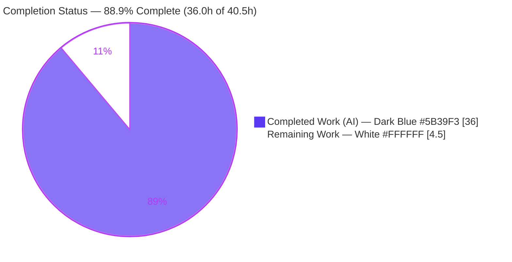
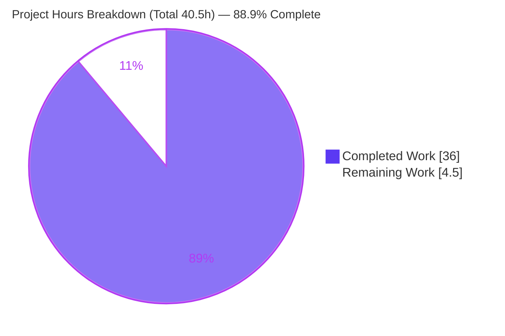
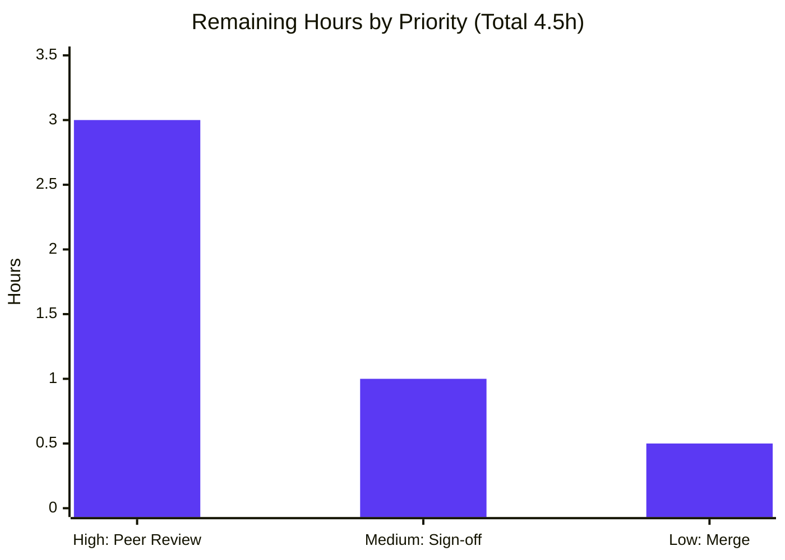

# Blitzy Project Guide — wp-calypso Jest Test-Infrastructure Investigation

> **Deliverable:** `blitzy/documentation/wp-calypso_be7e5cc64162.md` — a single, evidence-backed investigation document explaining *why some `wp-calypso` tests pass in isolation but fail when the full suite runs*.
> **Source commit (HEAD anchor):** `be7e5cc641622d153040491fd5625c6cb83e12eb` · **Branch:** `blitzy-b582062f-11a3-4649-94b2-c58559cb5cff`
> **Brand color legend:** <span style="color:#5B39F3">■</span> **Completed / AI Work = Dark Blue `#5B39F3`** · <span style="color:#B23AF2">■</span> Remaining / Not Completed = White `#FFFFFF` (rendered with a violet-black `#B23AF2` outline for visibility).

---

## 1. Executive Summary

### 1.1 Project Overview

This project delivers a single, comprehensive **investigation document** that empirically explains why some tests in the Automattic `wp-calypso` monorepo pass in isolation but fail when the full Jest suite runs. The document traces the root cause to differences in **module resolution** and **test-environment setup** across the repository's seven Jest execution contexts (client, server, packages, integration, apps, build-tools). It is a **read-only Q&A deliverable**: every behavioral claim is grounded in captured runtime output, `file:line` citations, and cause→effect rationale. The target audience is the engineering team maintaining the monorepo's test harness. No production code is changed — the source tree remains byte-for-byte unchanged except for the one Markdown answer file.

### 1.2 Completion Status



| Metric | Value |
|--------|------:|
| **Total Hours** | **40.5 h** |
| **Completed Hours (AI + Manual)** | **36.0 h** (AI: 36.0 h · Manual: 0.0 h) |
| **Remaining Hours** | **4.5 h** |
| **Percent Complete** | **88.9 %** |

> **Calculation (PA1, AAP-scoped hours only):** `Completed ÷ Total = 36.0 ÷ 40.5 = 88.9 %`. The percentage measures autonomous completion of AAP-scoped work; the remaining 4.5 h is inherently-human path-to-production (review, sign-off, merge).

### 1.3 Key Accomplishments

- ✅ **Single deliverable created** at the exact required path `blitzy/documentation/wp-calypso_be7e5cc64162.md` (1,015 lines / 94,685 bytes).
- ✅ **All six investigation questions (Q1–Q6) answered** with captured runtime evidence, verbatim command output, and `file:line` citations.
- ✅ **Q1 — Runtime environments** mapped across all six test commands (base default `node`; per-file `jsdom` docblock; `test-packages` proven mixed: 22 of 58 projects `jsdom`).
- ✅ **Q2 — Cross-context globals matrix** captured across ~10 context invocations (`window`/`document`/`localStorage` jsdom-only; `google` client-only; three distinct `CSS` shapes).
- ✅ **Q3 — Internal-dependency resolution** proven: `@automattic/load-script` loads `calypso:src` under Jest vs `MODULE_NOT_FOUND` under plain Node (with `prepare`/`prepack` lifecycle root-cause).
- ✅ **Q4 — Two-tier import redirection** traced: `@automattic/calypso-config` resolves to two distinct files across 10 contexts (mapper vs custom resolver).
- ✅ **Q5/Q6 — Initialization order & browser-API provider** captured via a 7-stage `INIT|` trace in both node and jsdom modes, byte-stable across two runs.
- ✅ **Synthesis + controlled reproduction**: one byte-identical test yields three distinct failure modes across client (pass) / packages (TypeError) / server (ReferenceError).
- ✅ **Corroborated against official Jest 29.7 documentation** (version-pinned) via web search.
- ✅ **Read-only mandate honored**: `git diff` from source to HEAD is exactly one added file; working tree clean; `yarn.lock` byte-identical; all temporary probes cleaned up.

### 1.4 Critical Unresolved Issues

| Issue | Impact | Owner | ETA |
|-------|--------|-------|-----|
| _None within AAP scope._ All in-scope autonomous work is complete and validated with zero discrepancies. | — | — | — |

> **Note (out of scope, informational only):** The repository's `test-server` (4), `test-packages` (23), and `test-integration` (5) suites have **pre-existing baseline test failures** unrelated to this deliverable. AAP §0.5.2 explicitly places *fixing* them out of scope (the task is to explain, not remediate), and the read-only mandate forbids modifying source. They are documented transparently in the deliverable §12 and in Section 6 (Risk T3) below, and are **not** counted in the remaining hours.

### 1.5 Access Issues

| System / Resource | Type of Access | Issue Description | Resolution Status | Owner |
|-------------------|----------------|-------------------|-------------------|-------|
| _None_ | — | No access issues identified. The repository, pinned toolchain (Node 22.23.1 / Yarn 4.0.2 / Jest 29.7.0), and all dependencies were fully available; `yarn install --immutable` succeeded (exit 0) with no credential or registry access problems. | Resolved / N/A | — |

**No access issues identified.**

### 1.6 Recommended Next Steps

1. **[High]** Perform a technical/peer review of `blitzy/documentation/wp-calypso_be7e5cc64162.md` — confirm each of Q1–Q6 is answered to satisfaction and spot-check the evidence/citations.
2. **[Medium]** Obtain stakeholder acceptance / sign-off that the document resolves the original "passes in isolation, fails in full suite" investigation prompt.
3. **[Low]** Merge the deliverable to the target branch and re-verify the `file:line` citations remain valid at the merge-point HEAD.
4. **[Low, out of scope]** *Separately* decide whether to open follow-up work for the pre-existing baseline suite failures (not part of this AAP).

---

## 2. Project Hours Breakdown

### 2.1 Completed Work Detail

<span style="color:#5B39F3">■ Completed (Dark Blue `#5B39F3`)</span>

| Component | Hours | Description |
|-----------|------:|-------------|
| Environment setup & canonical capture (§1, §2) | 3.0 | Activated pinned toolchain via Corepack; `yarn install --immutable` (exit 0, lockfile byte-identical); captured canonical versions (Node 22.23.1, Yarn 4.0.2, Jest 29.7.0, jsdom 20.0.3, enhanced-resolve 5.9.3). |
| Q1 — Runtime environment per test command (§4) | 2.5 | Ran all six test commands; established base default `node` and per-file `jsdom` docblock; proved `test-packages` is mixed (22/58 jsdom); documented root `test` wrapper fail-fast. |
| Q2 — Cross-context globals matrix (§5) | 3.0 | Captured `typeof` of 9+ globals across ~10 context invocations; identified jsdom-only, client-only, and three-shape `CSS` divergences. |
| Q3 — Internal-dependency file resolution (§6) | 3.0 | Proved `@automattic/load-script` → `calypso:src` under Jest vs `MODULE_NOT_FOUND` under plain Node; root-caused via `prepare`/`prepack` install lifecycle. |
| Q4 — Import redirection & per-context resolution (§7) | 3.5 | Traced two redirection tiers (custom `enhanced-resolve` resolver + `moduleNameMapper`); ran one probe across 10 contexts showing two distinct resolution targets. |
| Q5 — Initialization-order harness & 7-stage trace (§8) | 3.0 | Built layered logger harness around real setup files; captured 7-stage `INIT|` order; documented array-replace vs merge behavior. |
| Q6 — Browser-API provider & timing (§9) | 2.5 | Attributed DOM globals to jsdom-at-construction vs setup-file APIs at `setupFilesAfterEnv`; captured node+jsdom traces. |
| Synthesis & controlled reproduction (§10) | 2.5 | Connected mechanisms to the isolation-vs-full-suite symptom; built a deterministic 3-mode reproduction (client pass / packages TypeError / server ReferenceError). |
| Official Jest docs corroboration — web search (§11) | 1.5 | Corroborated `setupFiles` ordering, default `node` environment, and jsdom unbundling against version-pinned Jest 29.7 docs. |
| Validation — six real suites executed & captured (§12) | 2.5 | Executed all six real test commands + root `yarn test`; captured summaries and exit codes; classified pre-existing failures. |
| Reproduction appendix — probe sources & commands (§13) | 2.0 | Documented every probe body and exact command for §13.1–§13.6, including targeted cleanup. |
| Read-only mandate, provenance & cleanup (§14) | 1.5 | Documented four working-tree states, the net-delta-single-file invariant, and probe cleanup verification. |
| Document authoring — structure, direct answers, formatting (§3 + overall) | 3.5 | Authored the direct-answers table, methodology, prose, tables, and the initialization-order mermaid diagram across 1,015 lines. |
| QA revision cycle — Report 4 findings F1–F8 (commit `e3e91b0d94`) | 2.0 | Addressed eight QA findings in a second commit, refining precision and correcting non-canonical values. |
| **Total Completed** | **36.0** | **Matches Completed Hours in §1.2.** |

### 2.2 Remaining Work Detail

<span style="color:#B23AF2">■ Remaining (White `#FFFFFF`)</span>

| Category | Hours | Priority |
|----------|------:|----------|
| Human technical/peer review of the 1,015-line deliverable (read all 14 sections; verify Q1–Q6; spot-check citations; optionally re-run probes) | 3.0 | High |
| Stakeholder acceptance & sign-off (confirm the six-question prompt is satisfactorily answered) | 1.0 | Medium |
| Merge to target branch + re-verify citations at merge HEAD (net delta stays a single added file) | 0.5 | Low |
| **Total Remaining** | **4.5** | **Matches Remaining Hours in §1.2 and §7.** |

### 2.3 Hours Reconciliation

| Quantity | Hours | Source |
|----------|------:|--------|
| Completed (Section 2.1 sum) | 36.0 | 14 AAP components |
| Remaining (Section 2.2 sum) | 4.5 | 3 path-to-production tasks |
| **Total (2.1 + 2.2)** | **40.5** | **= Total Hours in §1.2** |
| Percent Complete | 88.9 % | `36.0 ÷ 40.5 × 100` |

> **Cross-section integrity:** Remaining = **4.5 h** appears identically in §1.2, §2.2, and §7. Completed **36.0 h** + Remaining **4.5 h** = **40.5 h** Total. Completion **88.9 %** is used consistently in §1.2, §7, and §8.

---

## 3. Test Results

All results below originate from **Blitzy's autonomous validation logs** for this project (deliverable §12) and were independently re-confirmed for the smallest GREEN suite during this assessment (`test-build-tools`: 3/3 passed, exit 0). All suites use **Jest 29.7.0** on Node 22.23.1 / Yarn 4.0.2.

| Test Category (command) | Framework | Total Tests | Passed | Failed | Coverage % | Notes |
|-------------------------|-----------|------------:|-------:|-------:|:----------:|-------|
| `test-build-tools` | Jest 29.7.0 | 3 | 3 | 0 | N/A | GREEN (exit 0). 1 suite. Re-verified live during this assessment. |
| `test-apps` | Jest 29.7.0 | 28 | 28 | 0 | N/A | GREEN (exit 0). 4 suites / 3 projects (jsdom). |
| `test-client` | Jest 29.7.0 | 12,026 | 12,010 | 0 | N/A | GREEN (exit 0). 16 skipped; 1 suite skipped; 1,391 suites passed; 58 snapshots. |
| `test-server` | Jest 29.7.0 | 325 | 321 | 4 | N/A | Exit 1 — **pre-existing** baseline failure (`client/server/lib/logger/test/index.js`); out of scope. |
| `test-packages` | Jest 29.7.0 | 2,873 | 2,848 | 23 | N/A | Exit 1 — **pre-existing** (format-currency, plan-price, domains-table, i18n-calypso); 2 skipped; 48 projects; out of scope. |
| `test-integration` | Jest 29.7.0 | 7 | 2 | 5 | N/A | Exit 1 — **pre-existing** (bin integration, use-nock integration); out of scope. |
| **Totals (all suites)** | Jest 29.7.0 | **15,262** | **15,212** | **32** | N/A | 18 skipped. The 32 failures are pre-existing baseline code failures, proven unrelated (source→HEAD diff = 1 file). |

- **Coverage:** Not collected — this is a read-only investigation; no coverage instrumentation was in scope. Marked **N/A** rather than fabricated.
- **Integrity note:** Every figure traces to the autonomous validation logs and deliverable §12. The three failing suites are documented as pre-existing and are **not** attributable to this deliverable, which adds zero source/test/config code.

---

## 4. Runtime Validation & UI Verification

**Legend:** ✅ Operational · ⚠ Partial · ❌ Failing

**Runtime health**
- ✅ Pinned toolchain operational — Node `22.23.1`, Corepack `0.34.6`, Yarn `4.0.2`, `yarn jest --version` → `29.7.0`.
- ✅ `yarn install --immutable` succeeds (exit 0); `yarn.lock` SHA-256 byte-identical before/after.
- ✅ GREEN suites operational — `test-build-tools` (3/3), `test-apps` (28/28), `test-client` (12,010/12,026).
- ⚠ `test-server` / `test-packages` / `test-integration` — pre-existing baseline failures (out of scope; documented in §12 and Risk T3).

**Evidence/probe validation (Q1–Q6)**
- ✅ Q1 runtime-environment probes reproduced across all contexts (userAgent `Node.js/22` vs `jsdom/20.0.3`).
- ✅ Q2 globals matrix reproduced field-by-field across ~10 context invocations, byte-stable across 2 runs.
- ✅ Q3/Q4 `require.resolve` probes reproduced across all 10 contexts; plain-Node negative case (`MODULE_NOT_FOUND`, exit 1) reproduced live during this assessment.
- ✅ Q5/Q6 7-stage `INIT|` trace reproduced in both node and jsdom modes, byte-stable across 2 runs.
- ✅ Controlled synthesis reproduction (§10.1) reproduced — 3 distinct failure modes.

**UI verification**
- N/A — This is a documentation deliverable with **no user interface**. No browser rendering, screenshots, or visual regression checks apply.

---

## 5. Compliance & Quality Review

AAP deliverables cross-mapped to Blitzy quality/compliance benchmarks. Fixes applied during autonomous validation are noted.

| Benchmark / AAP Requirement | Status | Progress | Evidence / Notes |
|------------------------------|:------:|:--------:|------------------|
| **Rule 5** — single deliverable at `blitzy/documentation/wp-calypso_be7e5cc64162.md` | ✅ Pass | 100% | Git shows one added file; correct path & branch-matched name. |
| **Read-only mandate** — no source file modified | ✅ Pass | 100% | `git diff be7e5cc641..HEAD --name-status` = single `A` entry; tree clean. |
| **No dependency changes** | ✅ Pass | 100% | `yarn install --immutable` exit 0; `yarn.lock` byte-identical (SHA-256 match). |
| **Run-first methodology** — evidence from captured output | ✅ Pass | 100% | Every claim paired with command + verbatim output (§4–§10, §12, §13). |
| **Exhaustive context coverage** — all contexts + negative cases | ✅ Pass | 100% | node & jsdom modes, all 6 contexts, plain-Node negative case, before/after init states. |
| **Q1 answered** (runtime env per command) | ✅ Pass | 100% | §4 + §4.1–§4.3 with per-command table. |
| **Q2 answered** (globals differ) | ✅ Pass | 100% | §5 globals matrix + §5.1–§5.2 CSS layering. |
| **Q3 answered** (internal-dep file loaded) | ✅ Pass | 100% | §6 Jest vs plain-Node resolution + lifecycle. |
| **Q4 answered** (import redirection per context) | ✅ Pass | 100% | §7 two-tier resolution across 10 contexts. |
| **Q5 answered** (initialization order) | ✅ Pass | 100% | §8 7-stage trace + mermaid diagram. |
| **Q6 answered** (browser-API provider & timing) | ✅ Pass | 100% | §9 provider attribution + node/jsdom traces. |
| **`file:line` citations valid** | ✅ Pass | 100% | 37 line-numbered citations across 15 files independently re-verified in-range (validator counted 40/17 incl. field refs). |
| **Markdown well-formed** | ✅ Pass | 100% | 94 balanced code fences; 1 mermaid diagram; internal anchors resolve. |
| **Web-search corroboration** (Jest docs) | ✅ Pass | 100% | §11 version-pinned Jest 29.7 documentation. |
| **Temporary probe cleanup** | ✅ Pass | 100% | No `blitzy_adhoc_test_*` residue; §14 documents cleanup. |
| **QA findings (F1–F8) addressed** | ✅ Pass | 100% | Commit `e3e91b0d94` resolved all Report 4 findings. |

**Outstanding compliance items:** None within scope. All benchmarks pass.

---

## 6. Risk Assessment

| Risk | Category | Severity | Probability | Mitigation | Status |
|------|----------|:--------:|:-----------:|------------|--------|
| **T1** — `file:line` citations drift if cited source files change on future HEADs | Technical | Low | Medium | All citations anchored to fixed source SHA `be7e5cc641`; net-delta-single-file invariant documented in §14; re-verify at merge (task HT-3). | Mitigated / Documented |
| **T2** — Reproducibility depends on the pinned toolchain (observed values, e.g. jsdom UA) | Technical | Low | Low | §1 pins exact versions; §13 gives exact reproduction commands; evidence byte-stable across 2 runs. | Mitigated |
| **T3** — Pre-existing failures in `test-server`/`test-packages`/`test-integration` will show red to any reader running full suites | Technical | Low (informational) | High | §12 documents them as pre-existing & unrelated with proof (source→HEAD diff = 1 file); AAP §0.5.2 forbids fixing. | Documented / Accepted (out of scope) |
| **S1** — Security surface introduced | Security | None | N/A | Read-only doc: zero code, zero dependency changes, lockfile byte-identical; no secrets or runtime surface. | N/A — nothing introduced |
| **O1** — Document staleness as the test infrastructure evolves | Operational | Low | Medium (long horizon) | Point-in-time record anchored to a specific SHA and toolchain versions; treat as historical investigation record. | Accepted |
| **I1** — Integration failures (external services, credentials, CI/build) | Integration | None | N/A | No code integration, no external services, no credentials/API keys, no CI/build changes (all out of scope §0.5.2). | N/A |

**Overall risk posture:** **LOW.** The deliverable is fully validated; the primary residual dependency is human review capacity, not technical risk.

---

## 7. Visual Project Status

**Project hours breakdown** (Completed = Dark Blue `#5B39F3`, Remaining = White `#FFFFFF`):



**Remaining work by priority** (hours from Section 2.2; total = 4.5 h):



> **Integrity check:** Pie "Remaining Work" = **4.5** = §1.2 Remaining Hours = §2.2 Total Remaining. Pie "Completed Work" = **36** = §1.2 Completed Hours = §2.1 Total. Bar chart bars sum to **4.5**.

---

## 8. Summary & Recommendations

**Achievements.** The project is **88.9 % complete** (36.0 of 40.5 AAP-scoped hours). All fifteen autonomous AAP deliverables are finished and validated: the single required Markdown document was created at the correct path and comprehensively answers all six investigation questions (Q1–Q6) with captured runtime evidence, verbatim command output, `file:line` citations, and cause→effect reasoning. The investigation correctly identifies the root cause of the "passes in isolation, fails in full suite" symptom as three deterministic divergences — context-specific globals, the same import resolving to different files, and a dependency loading different physical files by execution method — and demonstrates them with a controlled, reproducible test.

**Remaining gaps (critical path to production).** The remaining **4.5 h** is entirely **human path-to-production** work: (1) a technical/peer review of the document, (2) stakeholder acceptance/sign-off, and (3) merge with a final citation re-verification. There is no remaining autonomous engineering work and no application to deploy.

**Success metrics.** Read-only mandate honored (net delta = one added file; lockfile byte-identical); 37/37 line-numbered citations valid; markdown well-formed (94 balanced fences); all Q1–Q6 evidence reproduced byte-stably across two runs; three GREEN suites confirmed; findings corroborated against official Jest 29.7 docs.

**Production-readiness assessment.** **Ready for human review and merge.** The deliverable is complete, accurate, and self-contained. The only gate is human acceptance. The pre-existing `test-server`/`test-packages`/`test-integration` baseline failures are explicitly out of scope (AAP §0.5.2) and must not block acceptance of this documentation deliverable, since they exist identically at the source commit and are unrelated to the added file.

| Metric | Value |
|--------|------:|
| Completion | 88.9 % |
| Completed hours (AI) | 36.0 h |
| Remaining hours (human) | 4.5 h |
| Total hours | 40.5 h |
| Overall risk | Low |
| Deliverable state | Complete & validated; awaiting human review/merge |

---

## 9. Development Guide

This is a **documentation deliverable**, so "running the project" means (a) preparing the pinned toolchain, (b) viewing the deliverable, and (c) reproducing the captured evidence. All commands below were **tested live** in the repository during this assessment.

### 9.1 System Prerequisites

- **OS:** Linux or macOS (validated on Ubuntu 25.10 container).
- **Node.js:** `^22.9.0` (canonical: `22.23.1`). The repo's `engines.node` is the literal `"^v22.9.0"`; `.nvmrc` pins `22.9.0`.
- **Yarn:** `4.0.2`, activated via **Corepack** (pinned by `packageManager` in `package.json`). Do **not** use npm to install.
- **Git** (for read-only provenance checks).
- **RAM:** ~4 GB+ recommended for the larger suites (`test-client`, `test-packages`).
- **No** database, cache, message queue, or network service is required — there is no application runtime.

### 9.2 Environment Setup

```bash
# From the repository root
corepack enable                       # activate the packageManager-pinned Yarn (idempotent)
node --version                        # expect: v22.23.1 (any ^22.9.0 is acceptable)
corepack yarn --version               # expect: 4.0.2
export NODE_OPTIONS='--max-old-space-size=3072'   # headroom for larger suites
```

### 9.3 Dependency Installation

```bash
# Immutable install proves the investigation changed no dependency (fails if yarn.lock would change)
corepack yarn install --immutable
# Expected: "Done in ...s", exit 0; yarn.lock SHA-256 unchanged
```

### 9.4 Viewing the Deliverable (the product)

```bash
# The deliverable IS the product — open it in any Markdown viewer/editor
wc -l blitzy/documentation/wp-calypso_be7e5cc64162.md      # expect: 1015
sed -n '99,109p' blitzy/documentation/wp-calypso_be7e5cc64162.md   # the "Direct answers" table (Q1–Q6)
```

### 9.5 Reproducing the Evidence (verification)

```bash
# 1) Confirm toolchain and Jest binary
corepack yarn jest --version          # expect: 29.7.0
corepack yarn bin jest                # expect: <repo>/node_modules/jest/bin/jest.js

# 2) Run the GREEN suites (match deliverable §12)
NODE_OPTIONS='--max-old-space-size=3072' corepack yarn test-build-tools --ci --maxWorkers=2
#   -> Test Suites: 1 passed, 1 total ; Tests: 3 passed, 3 total ; exit 0
NODE_OPTIONS='--max-old-space-size=3072' corepack yarn test-apps --ci --maxWorkers=2
#   -> Tests: 28 passed, 28 total ; exit 0
TZ=UTC NODE_OPTIONS='--max-old-space-size=3072' corepack yarn test-client --ci --maxWorkers=4
#   -> Tests: 16 skipped, 12010 passed, 12026 total ; exit 0

# 3) Read-only proof (must show exactly one added file)
git diff be7e5cc641622d153040491fd5625c6cb83e12eb..HEAD --name-status
#   -> A  blitzy/documentation/wp-calypso_be7e5cc64162.md
git status --porcelain                # -> (empty; clean tree)
```

### 9.6 Example Usage — Reproduce a Q3/Q4 Probe

```bash
# Q3 negative case: plain Node cannot resolve @automattic/load-script (its dist is not built on install)
node -e "try{console.log(require.resolve('@automattic/load-script'))}catch(e){console.log(e.code,'-',e.message.split(String.fromCharCode(10))[0])}"; echo "exit=$?"
#   -> MODULE_NOT_FOUND - Cannot find module '.../@automattic/load-script/dist/cjs/index.js' ...   exit=0

# The sibling @automattic/calypso-config resolves fine (its dist IS built via a `prepare` script)
node -e "console.log(require.resolve('@automattic/calypso-config'))"; echo "exit=$?"
#   -> <repo>/packages/calypso-config/dist/cjs/index.js   exit=0
```

### 9.7 Troubleshooting

| Symptom | Cause | Resolution |
|---------|-------|-----------|
| `The engine "node" is incompatible` / wrong Node | Node not `^22.9.0` | Install Node 22.x (e.g. `nvm install 22.23.1 && nvm use`); `.nvmrc` pins `22.9.0`. |
| `yarn: command not found` or wrong Yarn version | Corepack not enabled | Run `corepack enable`, then `corepack yarn --version` → `4.0.2`. |
| `Browserslist: caniuse-lite is N months old` warning | Stale browser data | **Benign** — does not affect results; may be ignored. |
| `test-server` / `test-packages` / `test-integration` show failures | **Pre-existing** baseline failures | **Expected & out of scope** (deliverable §12). Not caused by this deliverable; do not attempt to fix as part of accepting this doc. |
| JS heap out of memory on large suites | Default heap too small | `export NODE_OPTIONS='--max-old-space-size=3072'` (or higher). |
| `yarn install` wants to change the lockfile | Wrong Yarn / network state | Use `corepack yarn install --immutable`; investigate network/registry access. |

---

## 10. Appendices

### Appendix A — Command Reference

| Command | Purpose |
|---------|---------|
| `corepack enable` | Activate the `packageManager`-pinned Yarn 4.0.2 |
| `corepack yarn install --immutable` | Install deps without allowing lockfile changes (read-only proof) |
| `corepack yarn jest --version` | Confirm Jest `29.7.0` |
| `corepack yarn bin jest` | Show the resolved local Jest binary path |
| `corepack yarn test-build-tools` | Run build-tools suite (node) — GREEN |
| `corepack yarn test-apps` | Run apps multi-project suite (jsdom) — GREEN |
| `corepack yarn test-client` | Run client suite (node + per-file jsdom) — GREEN (`TZ=UTC` applied) |
| `corepack yarn test-server` | Run server suite (node) — pre-existing failures |
| `corepack yarn test-packages` | Run packages multi-project suite (mixed) — pre-existing failures |
| `corepack yarn test-integration` | Run integration suite (node) — pre-existing failures |
| `git diff be7e5cc641622d153040491fd5625c6cb83e12eb..HEAD --name-status` | Read-only proof (single added file) |
| `git status --porcelain` | Confirm clean working tree |

### Appendix B — Port Reference

**N/A.** No network services, servers, or ports are involved — this is a read-only documentation/investigation deliverable with no application runtime.

### Appendix C — Key File Locations

| Path | Role |
|------|------|
| `blitzy/documentation/wp-calypso_be7e5cc64162.md` | **The deliverable** (1,015 lines) |
| `package.json` | Test scripts [L120–L133], engines [L56–L59], `packageManager` [L422], Jest/jsdom dev-deps [L290–L292] |
| `.nvmrc` | Node pin (`22.9.0`) |
| `babel.config.js` | `babel-jest` transform pipeline |
| `packages/calypso-jest/jest-preset.js` | Base preset — default `testEnvironment:'node'` [L11], resolver, `setupFilesAfterEnv` |
| `packages/calypso-jest/src/module-resolver.js`, `test/module-resolver.js` | Custom `enhanced-resolve` resolver (`calypso:src` before `main`) |
| `test/{client,server,packages,integration,apps,build-tools}/jest.config.js` | Six per-context Jest configs |
| `test/client/setup-test-framework.js` | Client browser-API polyfills (`CSS`, `ResizeObserver`, `Worker`, …) |
| `client/server/config/index.js` | Redirect target of `@automattic/calypso-config` (client/server/integration) |
| `packages/{load-script,calypso-config,calypso-analytics,i18n-utils}` | Dependency-resolution demonstration packages |

### Appendix D — Technology Versions

| Component | Version (observed) |
|-----------|--------------------|
| Node.js | `22.23.1` |
| npm | `11.1.0` |
| Corepack | `0.34.6` |
| Yarn | `4.0.2` |
| Jest | `29.7.0` |
| babel-jest | `29.7.0` |
| jest-environment-jsdom | `29.7.0` |
| jsdom | `20.0.3` |
| enhanced-resolve | `5.9.3` |
| jest-canvas-mock | `2.5.2` |
| @testing-library/jest-dom | `6.6.3` |
| resize-observer-polyfill | `1.5.1` |

### Appendix E — Environment Variable Reference

| Variable | Value | Purpose |
|----------|-------|---------|
| `TZ` | `UTC` | Applied by `test-client` for deterministic date/time behavior |
| `NODE_OPTIONS` | `--max-old-space-size=3072` | Heap headroom for larger suites |
| `BROWSERSLIST_ENV` | (set by Babel config) | Gates `isBrowser` in the Babel transform |
| `CI` | `true` (recommended) | Non-interactive test runs (`--ci`) |

### Appendix F — Developer Tools Guide

- **Reproducing a single probe:** place a temporary test where the target config's `testMatch` discovers it, then run `corepack yarn jest -c=<config> --runTestsByPath <probe> --no-coverage`. Always clean up temporary probes afterward (the deliverable uses the `blitzy_adhoc_test_` prefix and trap-based cleanup).
- **Inspecting resolution:** use `require.resolve('<specifier>')` under both Jest (custom resolver) and plain `node -e` (main-field only) to observe divergence.
- **Environment introspection:** log `typeof window`, `typeof CSS`, `navigator.userAgent`, etc., inside a probe to compare contexts.
- **Read-only discipline:** after any probe run, verify `git status --porcelain` is clean and no `blitzy_adhoc_test_*` files remain.

### Appendix G — Glossary

| Term | Definition |
|------|-----------|
| **AAP** | Agent Action Plan — the primary directive defining project scope. |
| **`calypso:src`** | Custom `package.json` field pointing to a package's untranspiled TypeScript/JS source; preferred over `main` by the custom resolver. |
| **`moduleNameMapper`** | Jest config option that rewrites import specifiers to specific files per context. |
| **`enhanced-resolve`** | The webpack resolver library powering the custom `calypso:src`-first module resolver. |
| **`setupFiles` / `setupFilesAfterEnv`** | Jest setup scripts that run before / after the test framework is installed, respectively. |
| **jsdom** | A JavaScript DOM implementation providing browser-like globals (`window`, `document`, …) via `jest-environment-jsdom`. |
| **Multi-project run** | A Jest invocation that aggregates many per-package/per-app configs via the `projects` array (used by `test-packages`, `test-apps`). |
| **Isolation vs full suite** | The symptom under investigation: a test passing when run alone but failing under the full suite due to context divergence. |
