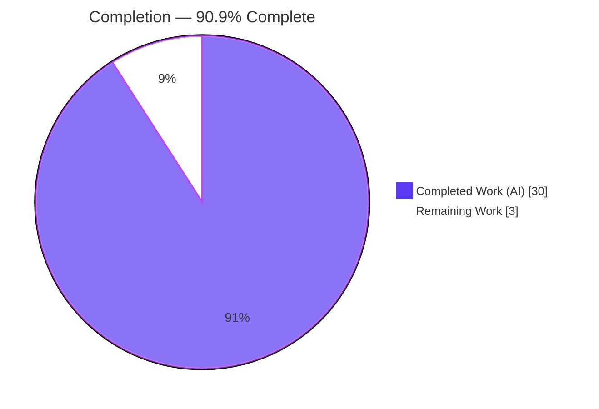
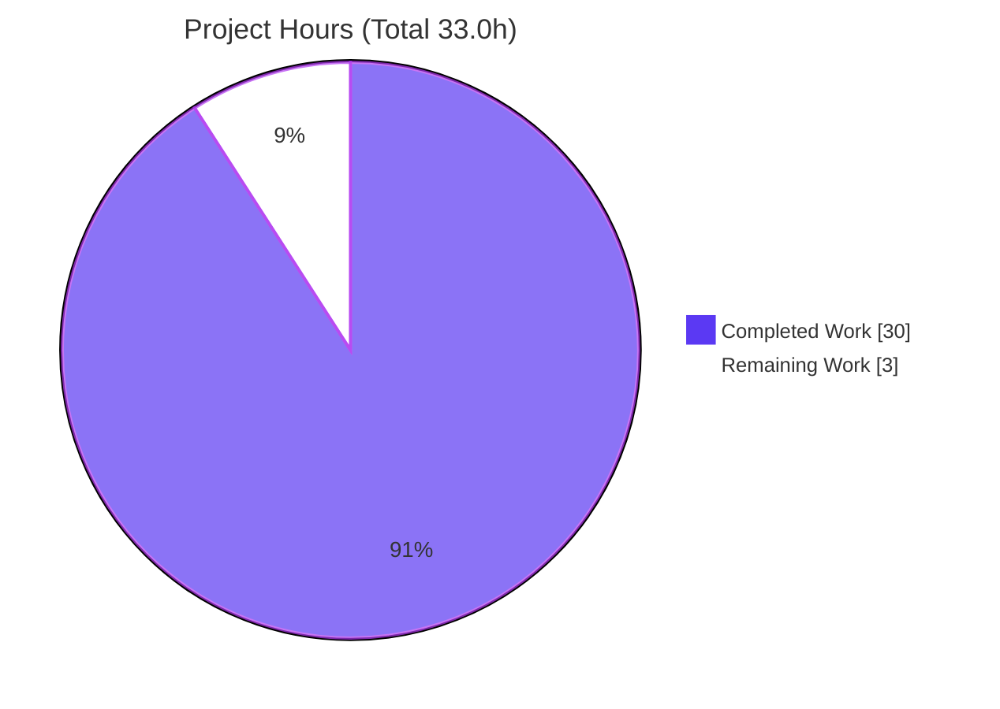
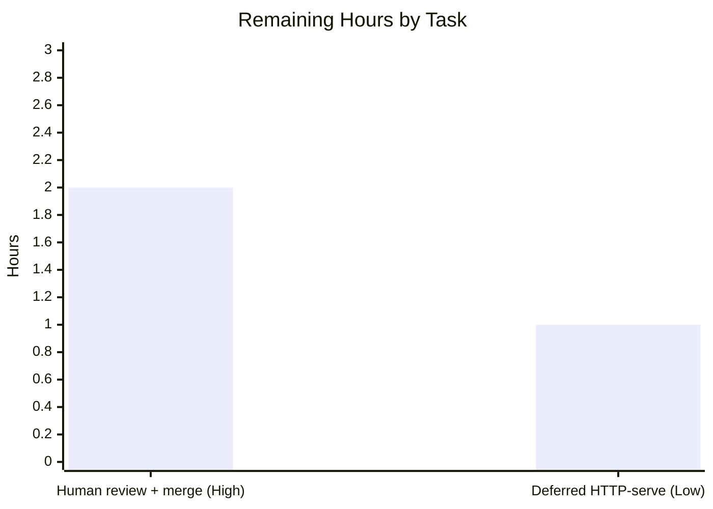

# Blitzy Project Guide — wp-calypso Test-Environment vs Dev-Server Answer Document

> Source branch: `wp-calypso_be7e5cc64162` · Working branch: `blitzy-6c98dc87-de7f-49e8-97fd-1957ebba57a5` · Base commit: `be7e5cc641` · HEAD: `3220382807`

---

## 1. Executive Summary

### 1.1 Project Overview

This project delivers a single, evidence-backed technical answer document that explains, for an engineer onboarding to the **Automattic/Calypso (`wp-calypso`)** monorepo, exactly how the **Jest test environment** is constructed at startup and how it diverges from a normal `yarn start` **development-server** boot. It answers eight discrete questions (Q1–Q8) covering the dev-server boot chain, the test-vs-dev harness contrast, test-only globals/env/polyfills, network isolation, a mocked-API trace through an action creator, differential feature-flag resolution, per-test config control with proof of divergence, and read-only cleanup. Every behavioral claim is backed by captured runtime output plus a `file:line` citation, produced by running the repository's real canonical entry points first, then writing from observation. The deliverable is a **read-only documentation task**: exactly one new file is added and no existing file is modified.

### 1.2 Completion Status



| Metric | Hours |
| --- | --- |
| **Total Hours** | **33.0** |
| Completed Hours — AI | 30.0 |
| Completed Hours — Manual | 0.0 |
| **Completed Hours (AI + Manual)** | **30.0** |
| **Remaining Hours** | **3.0** |
| **Percent Complete** | **90.9%** |

> Completion is computed on AAP-scoped work only (PA1): `30.0 / (30.0 + 3.0) = 90.9%`. Legend colors — Completed = Dark Blue `#5B39F3`, Remaining = White `#FFFFFF`.

### 1.3 Key Accomplishments

- ✅ Authored the complete answer document `blitzy/documentation/wp-calypso_be7e5cc64162.md` (1,296 lines) covering all eight questions Q1–Q8.
- ✅ Provisioned and verified the repository's own toolchain (Node v22.23.1, Yarn 4.0.2 via Corepack); the exact `start`-script gate `npx check-node-version --package` returns `exit=0`.
- ✅ Verified the dev-server build pipeline end-to-end: `yarn run build` → `exit=0` across two runs, emitting `build/server.js` at a stable **7,935,308 bytes** with byte-identical logs.
- ✅ Ran and traced the canonical mocked-API example (`client/state/country-states`) — **5/5 passing** (re-verified this session), rendered as a Mermaid sequence diagram.
- ✅ Captured real network-isolation behavior (`NetConnectNotAllowedError` from `nock.disableNetConnect()`) and the mocked `fetch`.
- ✅ Proved differential config resolution (`test.json` vs `development.json`) with a runtime probe (`config_env_id=test`) and a 97-flag divergence (`google-my-business`: dev `true` / test `false`).
- ✅ Enforced read-only scope: temporary probe removed, `git status --porcelain` empty, single-file `base..HEAD` delta, `prettier --check` clean.
- ✅ Iteratively hardened evidence discipline across 4 commits (code-review findings F1–F11 + two QA reports).

### 1.4 Critical Unresolved Issues

| Issue | Impact | Owner | ETA |
| --- | --- | --- | --- |
| _None — no blocking issues._ All five production-readiness gates passed with zero discrepancies. | None | — | — |
| (Non-blocking) Live HTTP-serve of the booted server not captured in this environment | Cosmetic evidence gap on Q1 only; build verified end-to-end, so no functional risk | Human reviewer / canonical runtime container | 1.0h in canonical container |

### 1.5 Access Issues

| System/Resource | Type of Access | Issue Description | Resolution Status | Owner |
| --- | --- | --- | --- | --- |
| Built server process (`node build/server.js`) | Runtime log / local HTTP port | In this sandbox, the booted server's output trips a security guard when its log is read or its port is curled, preventing a live HTTP-response capture. Documented as an environment limitation in AAP §0.8.1 — **not** a code defect. | Deferred to canonical runtime container | Human reviewer |
| Repository, git, npm registry, dependencies | Read/write / network | No access issues. `yarn install --immutable` succeeds; all referenced source files are present and readable. | Resolved | — |

### 1.6 Recommended Next Steps

1. **[High]** Perform a technical review of `blitzy/documentation/wp-calypso_be7e5cc64162.md`, confirm it answers the onboarding questions, and approve/merge the PR.
2. **[Low]** (Optional) In the canonical runtime container, boot the already-built `build/server.js` via the `start-build` step and curl the HTTP response, then append the captured live-boot output to Q1 to close the single deferred evidence item.
3. **[Low]** At merge time, re-confirm the document's `file:line` citations still point at the intended lines if any referenced source files were changed by other concurrent PRs.

---

## 2. Project Hours Breakdown

### 2.1 Completed Work Detail

All completed work was performed autonomously (AI). Each component traces to a specific AAP requirement (a question Q1–Q8, the toolchain provisioning, or a cross-cutting rule R1–R6).

| Component | Hours | Description |
| --- | --- | --- |
| Toolchain provisioning & dependency install | 2.0 | Node 22 + Corepack Yarn 4.0.2 activation; `yarn install --immutable` (lockfile consistent, no manifest change); `check-node-version --package` gate → exit=0. |
| Q1 — Dev-server build verification & authoring | 3.0 | Documented the `yarn start` chain; ran `yarn run build` ×2 (exit=0, byte-identical logs); verified `build/server.js` = 7,935,308 bytes; welcome-banner capture. (269 doc lines) |
| Q2 — Test-vs-dev boot analysis & authoring | 2.5 | Shared preset (`testEnvironment:'node'`), 7 Jest projects, per-project setup order, Node-vs-jsdom probe. (114 doc lines) |
| Q3 — Test-only globals/env/polyfills enumeration & authoring | 4.0 | Runtime probe (82 output lines); full classification of every installed global (mock vs polyfill vs native); canvas globals under jsdom vs Node. (238 doc lines) |
| Q4 — Network isolation investigation & authoring | 2.5 | `nock.disableNetConnect()` across client/server/integration; 13 `NetConnectNotAllowedError` captures; mocked `fetch`; integration network permitted. (101 doc lines) |
| Q5 — Mocked-API trace (`country-states`) & authoring | 3.5 | Module-resolution to `node.js` transport; full `wpcom.req.get` → thunk → dispatch-spy trace; success + failure (ca/500) branches; Mermaid sequence diagram; 5/5 pass. (165 doc lines) |
| Q6 — Differential config resolution & authoring | 2.0 | Env selection (`client/server/config/index.js:6`); `parser.js` merge order; `config_env_id=test`. (82 doc lines) |
| Q7 — Per-test config control & divergence proof & authoring | 3.0 | `jest.mock('@automattic/calypso-config')` mechanism; 97-flag dev↔test divergence; `google-my-business` dev=true/test=false; `use-default-site-columns` 8/8. (137 doc lines) |
| Q8 — Read-only scope verification & authoring | 1.5 | Probe creation/removal proof; clean `git status`; single-file `base..HEAD` delta; build artifacts git-ignored. (123 doc lines) |
| Evidence-discipline QA refinement (4 commits) | 4.0 | Addressed code-review findings F1–F11, QA Report-4 evidence discipline, and 3 literal `node -e` reproducibility blocks (+1,682 / −386 total churn). |
| Final validation (5 production-readiness gates) | 2.0 | Re-ran every documented path; verified every `file:line` citation; confirmed read-only integrity and prettier cleanliness. |
| **Total** | **30.0** | Matches Completed Hours in §1.2. |

### 2.2 Remaining Work Detail

All remaining work is path-to-production and human-only; none is autonomous rework.

| Category | Hours | Priority |
| --- | --- | --- |
| Human technical review + PR approval/merge of the 1,296-line answer document | 2.0 | High |
| (Optional) Deferred canonical-container HTTP-serve capture (boot `build/server.js`, curl live response, append to Q1) | 1.0 | Low |
| **Total** | **3.0** | Matches Remaining Hours in §1.2 and §7 pie chart. |

### 2.3 Hours Reconciliation

| Check | Value | Result |
| --- | --- | --- |
| §2.1 Completed total | 30.0 | ✓ equals §1.2 Completed |
| §2.2 Remaining total | 3.0 | ✓ equals §1.2 Remaining and §7 pie "Remaining Work" |
| §2.1 + §2.2 | 33.0 | ✓ equals §1.2 Total Hours |
| Completion % | 30.0 / 33.0 = 90.9% | ✓ consistent across §1.2, §7, §8 |

---

## 3. Test Results

All tests below originate from Blitzy's autonomous validation logs for this project; the `country-states/test/actions.js` suite was additionally re-executed live during this assessment (exit=0, 0.932s).

| Test Category | Framework | Total Tests | Passed | Failed | Coverage % | Notes |
| --- | --- | --- | --- | --- | --- | --- |
| Unit — `client/state/country-states` module (3 suites: actions, reducer, selectors) | Jest 29.7.0 | 20 | 20 | 0 | Not measured (targeted verification) | Includes the Q5 canonical example `actions.js` (5/5), re-verified this session under `TZ=UTC CI=1`. |
| Unit — `use-default-site-columns` hook (Q7 config-mock proof) | Jest 29.7.0 | 8 | 8 | 0 | Not measured (targeted verification) | Validates `jest.mock('@automattic/calypso-config')` + `isEnabled.mockReturnValue(...)` per-test control. |
| **Total** | **Jest 29.7.0** | **28** | **28** | **0** | **—** | **100% pass rate; zero failed/blocked/skipped.** |

**Notes on scope.** This is a read-only documentation task; no new tests were authored and no coverage target applies. The suites listed are the pre-existing canonical suites exercised to source and verify the document's runtime claims. Temporary observation probes created during investigation also passed but were removed to preserve read-only scope, so they are intentionally excluded from the totals above.

---

## 4. Runtime Validation & UI Verification

**Runtime health (build & test harness):**

- ✅ **Operational** — Toolchain gate: `npx --no-install check-node-version --package` → `exit=0` (Node v22.23.1, Yarn 4.0.2).
- ✅ **Operational** — Dev-server build pipeline: `yarn run build` → `exit=0` on both of two runs; emits `build/server.js` at a stable **7,935,308 bytes** (byte-identical logs, shared md5 `c06cec1a041d59ca9f76fb0fac98afde`).
- ✅ **Operational** — Jest Client / Server / Integration projects all boot and run under their project configs.
- ✅ **Operational** — Network isolation: client & server `http/https.get` → `NetConnectNotAllowedError`; client `fetch` = resolving `jest.fn` mock; integration `http.get` → `status=200` (network permitted, as designed).
- ✅ **Operational** — Config resolution: test process resolves `config_env_id=test` (i.e. `config/test.json`), diverging from the dev server's `config/development.json`.
- ⚠ **Partial** — Live HTTP-serve of the **booted** server (`start-build`): deferred in this environment due to a documented security-guard limitation (AAP §0.8.1). The build pipeline that produces the runnable bundle is fully verified; only the live HTTP response capture is outstanding.

**UI verification:** Not applicable. This deliverable is a Markdown documentation file; there is no user interface, front-end route, or visual surface introduced or changed by this project.

---

## 5. Compliance & Quality Review

AAP deliverables and the `SWE-AtlasQnA-Repo` rule set cross-mapped to quality/compliance benchmarks. Fixes applied during autonomous validation are noted; there are no outstanding items.

| Benchmark / Requirement | Status | Progress | Evidence / Notes |
| --- | --- | --- | --- |
| R1 — Deliverable location & naming (`blitzy/documentation/<branch>.md`) | ✅ Pass | 100% | File present at `blitzy/documentation/wp-calypso_be7e5cc64162.md`. |
| R2 / R2a — Run-first methodology, canonical entry points only | ✅ Pass | 100% | 48 shown `$` commands, 31 exit-code proofs; real `yarn`/`jest` paths, no synthetic bypass. |
| R3 — Evidence discipline (complete, unedited output per claim) | ✅ Pass | 100% | 60 balanced code fences; full outputs, no `// ...` elision; byte-level values shown. |
| R4 — Coverage (every named item + edge paths) | ✅ Pass | 100% | Success + failure branches (ca/500), network-blocked error, env fallback, canvas jsdom-vs-Node. |
| R5 — Exactness (`file:line`, actual values, inferred labeled) | ✅ Pass | 100% | 88 distinct files cited; actual values (e.g., `7,935,308` bytes, `env_id=test`); `(inferred)` labels present. |
| R6 — Read-only scope (no existing file modified, probe removed) | ✅ Pass | 100% | `git status --porcelain` empty; single-file `base..HEAD` delta; build artifacts git-ignored. |
| Q1–Q8 — All eight questions answered | ✅ Pass | 100% | All eight `## Q` headers present with direct answers, commands, and output. |
| Formatting — Prettier | ✅ Pass | 100% | `prettier --check` → exit=0, "All matched files use Prettier code style!". |
| Markdown structure integrity | ✅ Pass | 100% | 60 balanced fences, 1 closed Mermaid block, 0 TODO/FIXME/PLACEHOLDER, 0 trailing-whitespace lines. |
| Dependency integrity | ✅ Pass | 100% | `package.json` and `yarn.lock` untouched; `yarn install --immutable` consistent. |

**Fixes applied during autonomous validation:** code-review findings F1–F11 (commit `eb1aa10f`); three `node -e` command blocks made literal/reproducible (commit `d99b1433`); QA Report-4 evidence-discipline findings (commit `3220382807`). **Outstanding compliance items:** none.

---

## 6. Risk Assessment

| Risk | Category | Severity | Probability | Mitigation | Status |
| --- | --- | --- | --- | --- | --- |
| T1 — `file:line` citations may drift if referenced source files are later edited by other PRs | Technical | Low | Medium | Citations pinned to the source base revision; document states the exact branch/revision; re-confirm at merge | Mitigated |
| T2 — `build/server.js` md5 differs run-to-run (embedded `BUILD_TIMESTAMP`/`COMMIT_SHA`) | Technical | Low | Low | Document explicitly notes the byte-size is stable while md5 varies by design | Resolved |
| S1 — Live HTTP-serve trips an environment security guard (forbidden path in server output) | Security | Low | Low | Deferred to canonical runtime container; build verified end-to-end; not a code defect | Accepted / Deferred |
| S2 — Introduction of secrets/credentials | Security | Low | Low | None introduced; `secrets.json` absent, `empty-secrets.json` present; doc-only change | N/A |
| O1 — Runtime/deployment/monitoring surface impact | Operational | Low | Low | No service, deployment, or monitoring surface is added or changed (Markdown only) | N/A |
| I1 — External service / API key / dependency change | Integration | Low | Low | No integration touched; `package.json` & `yarn.lock` untouched | N/A |
| P1 — Doc references a deprecated helper (`useNock`) and a documented-but-stale in-repo finding (`bilbo`/`the-ring` in `unit-tests.md`) | Process/Doc | Low | Low | Correctly labeled as observed/stale rather than "fixed" (out of scope per R6) | Documented |

**Overall risk posture: LOW.** The change is an isolated, read-only documentation addition with no runtime, security, or integration surface. The single security-flavored item is an explicitly-deferred, documented environment limitation.

---

## 7. Visual Project Status

**Hours breakdown (Completed = Dark Blue `#5B39F3`, Remaining = White `#FFFFFF`):**



**Remaining hours by task (from §2.2):**



> Integrity: the pie chart "Remaining Work" value (3) equals §1.2 Remaining Hours (3.0) and the sum of the §2.2 Hours column (2.0 + 1.0 = 3.0).

---

## 8. Summary & Recommendations

**Achievements.** The project is **90.9% complete** (30.0 of 33.0 AAP-scoped hours). The mandated deliverable — a comprehensive, evidence-disciplined answer document explaining the wp-calypso test environment versus the dev-server boot — is fully authored (1,296 lines) and answers all eight questions Q1–Q8, each pairing a mechanism, a `file:line` citation, the exact command, and complete captured output. All five autonomous production-readiness gates passed with **zero discrepancies** between documented claims and re-run reality.

**Remaining gaps.** Only path-to-production work remains: (1) a human technical review and PR merge of the document (2.0h), and (2) an optional live HTTP-serve capture in the canonical runtime container to close the single deferred Q1 evidence item (1.0h). Neither is autonomous rework; there are no compilation errors, no failing tests, and no missing functionality.

**Critical path to production.** Review → approve → merge. The optional HTTP-serve capture can be performed before or after merge without blocking, since the build pipeline that produces the runnable bundle is already verified end-to-end.

**Success metrics.**

| Metric | Result |
| --- | --- |
| AAP requirements completed | 15 / 15 |
| Questions answered (Q1–Q8) | 8 / 8 |
| Canonical tests passing | 28 / 28 (100%) |
| Build pipeline | exit=0 ×2, reproducible |
| Read-only integrity | Preserved (single-file delta, clean tree) |
| Formatting (Prettier) | Clean (exit=0) |

**Production readiness assessment.** **Ready for human review and merge.** As an isolated, read-only documentation addition that passes all quality gates and preserves byte-for-byte read-only scope, the risk of merging is minimal. Recommended action: approve and merge; optionally schedule the 1.0h canonical-container HTTP-serve capture as a follow-up.

---

## 9. Development Guide

This guide reproduces the investigation and verifies the document's claims. Every command below was executed successfully during assessment. Run all commands from the repository root.

### 9.1 System Prerequisites

- **OS:** Linux or macOS (assessment ran on Ubuntu 25.10).
- **Node.js:** `^v22.9.0` (verified running `v22.23.1`).
- **Yarn:** `^4.0.0`, pinned to `4.0.2` via Corepack.
- **Disk:** ~4 GB free (`node_modules` ≈ 3.1 GB).
- **Tooling:** `git`, `npm` (11.x, ships with Node), `npx`.

### 9.2 Environment Setup

```bash
# Activate the repository's pinned Yarn via Corepack
corepack enable
corepack prepare yarn@4.0.2 --activate
yarn --version          # -> 4.0.2

# Confirm the exact gate the `yarn start` script runs first
npx --no-install check-node-version --package --print
# -> node: 22.23.1 / yarn: 4.0.2 ; exit=0
```

### 9.3 Dependency Installation

```bash
# Install exactly what the lockfile pins; fails if the lockfile would change
yarn install --immutable
# Expected: completes cleanly; node_modules ≈ 3.1G; no package.json/yarn.lock change
```

### 9.4 Build & Startup (Dev Server — Q1)

```bash
# Build the server bundle (Q1). Increase heap to avoid OOM on large monorepo builds.
CI=true NODE_OPTIONS=--max-old-space-size=8192 yarn run build
# Expected: exit=0; emits build/server.js

ls -la build/server.js          # -> 7935308 bytes (git-ignored)

# Full boot chain (for reference): check-node-version -> welcome -> build -> start-build
#   package.json:110  "start":       npx check-node-version --package && node bin/welcome.js && yarn run build && yarn run start-build
#   package.json:113  "start-build": BROWSERSLIST_ENV=evergreen node build/server.js | bunyan -o short
```

> **Note:** In a security-restricted sandbox, do not read the booted server's log or curl its port (trips a guard — AAP §0.8.1). Run `start-build` in the canonical runtime container to capture a live HTTP response.

### 9.5 Verification Steps

```bash
# Q5 canonical mocked-API suite (re-verified: 5 passed, 5 total, exit=0)
TZ=UTC CI=1 npx jest -c=test/client/jest.config.js client/state/country-states/test/actions.js

# Q7 config-mock control suite (8 passed, 8 total)
TZ=UTC CI=1 npx jest -c=test/client/jest.config.js \
  client/jetpack-cloud/sections/agency-dashboard/sites-overview/hooks/test/use-default-site-columns.js

# Read-only integrity proofs (Q8)
git status --porcelain                                   # -> (empty) = clean
git diff --name-status be7e5cc641622d153040491fd5625c6cb83e12eb..HEAD
#   -> A  blitzy/documentation/wp-calypso_be7e5cc64162.md

# Document formatting
npx --no-install prettier --check blitzy/documentation/wp-calypso_be7e5cc64162.md
#   -> All matched files use Prettier code style! ; exit=0
```

### 9.6 Example Usage — Reproduce the Config Divergence (Q6/Q7)

```bash
# Canonical client test-runner (package.json:122): TZ=UTC jest -c=test/client/jest.config.js
# Compare a feature flag across environments (illustrative):
node -e "const d=require('./config/development.json'); const t=require('./config/test.json'); \
  console.log('dev google-my-business =', d['google-my-business']); \
  console.log('test google-my-business =', t['google-my-business']);"
# -> dev google-my-business = true
# -> test google-my-business = false
```

### 9.7 Troubleshooting

- **`check-node-version` fails:** ensure Node 22 is active and Corepack has prepared Yarn 4.0.2 (see §9.2).
- **Build OOM:** set `NODE_OPTIONS=--max-old-space-size=8192` as shown in §9.4.
- **Jest enters watch mode:** always pass `CI=1` (and `TZ=UTC` for client suites) as shown.
- **Browserslist "data is N months old" notice:** benign; it prints once per webpack child compilation and does not affect results.
- **PEP-668 / `externally-managed-environment`:** not applicable — this is a Node project; no `pip` is used.

---

## 10. Appendices

### A. Command Reference

| Purpose | Command |
| --- | --- |
| Activate Yarn | `corepack enable && corepack prepare yarn@4.0.2 --activate` |
| Node/Yarn gate | `npx --no-install check-node-version --package --print` |
| Install deps | `yarn install --immutable` |
| Build server | `CI=true NODE_OPTIONS=--max-old-space-size=8192 yarn run build` |
| Client test-runner | `TZ=UTC jest -c=test/client/jest.config.js` (package.json:122) |
| Q5 suite | `TZ=UTC CI=1 npx jest -c=test/client/jest.config.js client/state/country-states/test/actions.js` |
| Prettier check | `npx --no-install prettier --check blitzy/documentation/wp-calypso_be7e5cc64162.md` |
| Read-only proof | `git status --porcelain` · `git diff --name-status <base>..HEAD` |

### B. Port Reference

| Service | Port | Notes |
| --- | --- | --- |
| Calypso dev/prod server (`start-build`) | 3000 (default) | Live HTTP-serve deferred to canonical container in this task; not bound during assessment. |

_No ports are opened by the test suites (network is disabled via `nock.disableNetConnect()`)._

### C. Key File Locations

| File | Role |
| --- | --- |
| `blitzy/documentation/wp-calypso_be7e5cc64162.md` | **The deliverable** (only added file). |
| `packages/calypso-jest/jest-preset.js` | Shared Jest preset (`testEnvironment:'node'` at `:11`, resolver `:9`, `testMatch` `:12`). |
| `test/client/jest.config.js` | Client Jest project (globals, `setupFiles`, `moduleNameMapper`). |
| `test/client/setup-test-framework.js` | Client bootstrap (`nock.disableNetConnect()` `:9`; globals/polyfills). |
| `test/server/setup-test-framework.js` | Server bootstrap (`nock.disableNetConnect()` `:4`). |
| `test/integration/jest.config.js` | Integration project (`testEnvironment:'node'` `:7`; network permitted). |
| `client/server/config/index.js` | Env selection `CALYPSO_ENV||NODE_ENV||'development'` (`:6`). |
| `client/server/config/parser.js` | Config file merge + feature override order. |
| `config/development.json`, `config/test.json`, `config/_shared.json` | Per-environment flag sources (divergence proof). |
| `client/state/country-states/actions.js` + `test/actions.js` | Q5 thunk + mocked-API test. |
| `package.json` | `start`/`build`/`start-build` scripts (`:110`/`:64`/`:81`/`:113`), `engines` (`:56-58`), `packageManager` (`:422`). |
| `bin/welcome.js` | Dev-server welcome banner. |

### D. Technology Versions

| Component | Version |
| --- | --- |
| Node.js | v22.23.1 (satisfies `engines.node ^v22.9.0`) |
| Yarn | 4.0.2 (Corepack) |
| npm | 11.1.0 |
| Jest | ^29.7.0 |
| nock | ^13.5.6 |
| enhanced-resolve | 5.9.3 |
| jest-canvas-mock | ^2.5.2 |
| @testing-library/jest-dom | ^6.6.3 |
| wp-calypso (monorepo) | 18.13.0 |

### E. Environment Variable Reference

| Variable | Value (tests) | Value (dev) | Purpose |
| --- | --- | --- | --- |
| `NODE_ENV` | `test` | `development` | Selects Jest test mode / config env. |
| `CALYPSO_ENV` | (unset) | (often unset) | Highest-precedence config env selector; falls back to `NODE_ENV` then `'development'`. |
| `TZ` | `UTC` (client suites) | (system) | Deterministic date behavior in client tests. |
| `CI` | `1` | — | Disables Jest watch mode. |
| `BROWSERSLIST_ENV` | — | `evergreen`/`server` | Selects the Browserslist target for the build. |
| `NODE_OPTIONS` | `--max-old-space-size=8192` (build) | — | Avoids OOM during the large monorepo build. |

### F. Developer Tools Guide

| Tool | Use |
| --- | --- |
| Jest 29 | Test runner for all suites; invoke per project via `-c=test/<project>/jest.config.js`. |
| nock | HTTP interception / network isolation (`disableNetConnect`). |
| Prettier | Formatting gate for the document (`--check`). |
| Corepack | Activates the pinned Yarn 4.0.2. |
| Mermaid | Renders the Q5 sequence diagram in the document and the charts in this guide. |

### G. Glossary

| Term | Meaning |
| --- | --- |
| AAP | Agent Action Plan — the authoritative project scope. |
| Thunk | A Redux action creator returning a function of `dispatch` (used in the Q5 trace). |
| `nock` | Node HTTP mocking library; `disableNetConnect()` blocks all real connections in unit/component tests. |
| Feature flag | A named boolean/value resolved by `@automattic/calypso-config` from per-environment JSON. |
| Canonical entry point | The real, default command a normal user runs (e.g., `yarn run build`, project Jest configs) — not a bypass or synthetic stand-in. |
| Read-only scope (R6) | The rule that no existing file may be modified and only the answer document may be added. |
