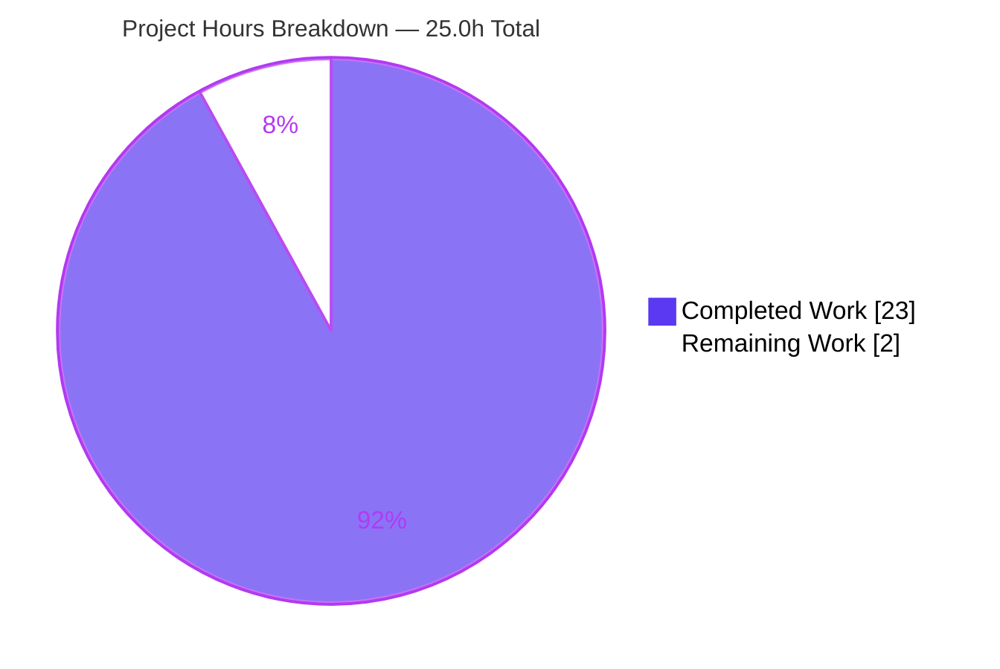

# Blitzy Project Guide

> **Project:** WordPress.com Calypso — Signup "Back" Control Destination, Code-Grounded Q&A
> **Branch:** `blitzy-a4706edb-f445-4573-a4f2-3dad55b7ce18` · **Base:** `be7e5cc641622d153040491fd5625c6cb83e12eb` · **HEAD:** `5dfca40475b490ba2293a1a72b98cdfad4b919fb`
> **Engagement type:** Investigative, code-grounded documentation (rule set `SWE-AtlasQnA-Repo`) — no source change
> **Brand legend:** <span style="color:#5B39F3">■</span> Completed / AI Work = Dark Blue `#5B39F3` · <span style="color:#000000">□</span> Remaining = White `#FFFFFF`

---

## 1. Executive Summary

### 1.1 Project Overview

This engagement answers a behavioral question about WordPress.com Calypso: why the signup/onboarding **"Back"** control sometimes jumps to the first step or leaves the current flow instead of moving one step backward. The deliverable is a single, evidence-backed Markdown document that proves — using the repository's own code as the source of truth — that the destination is a **deterministic pure function**, names the exact deciding logic (`NavigationLink.getBackUrl()`), establishes the strict precedence among competing inputs (component prop, `back_to` query arg, stored progress, flow position), and confirms the pattern with a reproducible per-step trace. The target audience is Calypso engineers and the requesting stakeholder; the technical scope is read-only analysis of the legacy `client/signup` framework with zero changes to runtime code.

### 1.2 Completion Status


| Metric | Hours |
|---|---|
| **Total Hours** | **25.0** |
| **Completed Hours (AI + Manual)** | **23.0** (AI 23.0 + Manual 0.0) |
| **Remaining Hours** | **2.0** |
| **Percent Complete** | **92.0%** |

> **Calculation (PA1, AAP-scoped):** Completion % = Completed ÷ (Completed + Remaining) = 23 ÷ (23 + 2) = 23 ÷ 25 = **92.0%**. All 13 autonomous AAP requirements are delivered and validated; the remaining 2.0h is the inherent human review/acceptance gate (no engineering work outstanding). Capped below 100% per honest-assessment policy pending human sign-off.

### 1.3 Key Accomplishments

- ✅ Authored the single mandated deliverable `blitzy/documentation/wp-calypso_be7e5cc64162.md` (910 lines) — the only file added; **zero** existing source modified.
- ✅ Identified the single deciding function `NavigationLink.getBackUrl()` `[client/signup/navigation-link/index.jsx:L78-L115]` and proved the Back control is **`href`-driven, not `onClick`-driven** (the `goToPreviousStep` callback is absent from `client/signup/main.jsx`).
- ✅ Established the strict **4-tier precedence** (explicit `backUrl` prop → `back_to` query arg → progress-derived previous step → static flow position) with annotated, line-cited code.
- ✅ Explained **both symptoms separately**: "snaps to first step" (null previous step → step-less `/start`) and "slips into a different flow" (unconditional external override or a previous step's `lastKnownFlow`).
- ✅ Located the **external override** (`back_to` query arg + hardcoded `backUrl` props) and the precedence rule that lets it win even on step 0 (`allowBackFirstStep` `[step-wrapper/index.jsx:L65]`).
- ✅ Produced an **empirical per-step destination trace** (6 scenarios × 3 positions) and a **reproducible Node harness** whose output is **byte-for-byte identical** to the documented trace.
- ✅ Grounded every claim in **121 `path:line` citations across 21 files** (0 missing, 0 out-of-bounds) anchored to HEAD `be7e5cc641`.
- ✅ Honored all constraints: no source edits, no extra code, temporary harness kept outside the repo and cleaned up; working tree clean.

### 1.4 Critical Unresolved Issues

| Issue | Impact | Owner | ETA |
|---|---|---|---|
| _None_ | No engineering blockers remain. The deliverable is complete, validated, and committed; only human review/acceptance is pending. | — | — |

### 1.5 Access Issues

| System/Resource | Type of Access | Issue Description | Resolution Status | Owner |
|---|---|---|---|---|
| _N/A_ | — | No access issues identified. The engagement required only read access to `client/signup` and a local Node v22.x runtime, both available. No repository permissions, service credentials, or third-party APIs were needed. | Resolved | — |

**No access issues identified.**

### 1.6 Recommended Next Steps

1. **[High]** Have a Calypso signup SME read the deliverable and verify the 4-tier precedence rule and both symptom explanations against `client/signup` at HEAD `be7e5cc641` (≈1.5h).
2. **[Medium]** Optionally reproduce the embedded harness (Appendix section **(g)**) on local Node v22.x to independently confirm the per-step trace before sign-off.
3. **[Medium]** Confirm the document answers all six original questions, then accept/merge and close the engagement (≈0.5h).
4. **[Low]** If the underlying `client/signup` source drifts past the pinned HEAD, re-verify the line-number citations (the document header records the anchor commit for this purpose).

---

## 2. Project Hours Breakdown

### 2.1 Completed Work Detail

| Component | Hours | Description |
|---|---|---|
| Scope discovery & two-framework distinction — section (a) `[R8]` | 2.5 | Surveyed the `client/signup` module (199 files); distinguished the legacy framework (`/start`) from the newer `client/landing/stepper` (`/setup`); established which framework exhibits centralized precedence. |
| Deciding-logic identification & `href`-vs-`onClick` proof — anchor `[R3]` | 3.0 | Pinpointed `getBackUrl()` `[navigation-link:L78-L115]`; proved navigation is anchor-`href`-driven by confirming `goToPreviousStep` is absent from `main.jsx`. |
| Precedence model analysis & documentation — section (b) `[R4]` | 3.0 | Documented the two-layer resolution (`connect()` `backUrl = ownProps.backUrl ?? backTo` + `getBackUrl()`); built the unambiguous 4-tier precedence table. |
| Symptom 1 root-cause: "snaps to first step" — section (c) `[R9a]` | 2.0 | Traced null previous step → step-less `/start` URL `[utils.js:L54]`; distinguished the separate non-resumable-flow first-step redirect. |
| Symptom 2 root-cause: "slips into different flow" — section (d) `[R5,R9b]` | 2.5 | Documented the unconditional external override `[navigation-link:L83-L85]` + `allowBackFirstStep` `[step-wrapper:L65]`, and the `lastKnownFlow` cross-flow path `[navigation-link:L109]`. |
| Bypassed step-by-step path — section (e) `[R6]` | 1.5 | Documented the normal chain `getPreviousStep()` → `getFilteredSteps()` → `getStepUrl()` that the override short-circuits. |
| Observation harness + per-step trace — sections (f),(g) `[R7,R11]` | 3.5 | Authored a faithful Node reproduction of the real functions; generated the 6-scenario (A–F) per-step trace; embedded the harness and verbatim output. |
| Citation sourcing & verification `[R12]` | 2.0 | Sourced and line-verified 121 `path:line` references across 21 files against HEAD `be7e5cc641`. |
| Determinism conclusion + rationale — section (h) `[R2,R10]` | 1.0 | Proved the destination is a pure function of five inputs; reconciled both symptoms; supplied rationale throughout. |
| Document assembly, scope compliance & QA iterations `[R1,R13]` | 2.0 | Assembled the 910-line Markdown, created `blitzy/documentation/`, applied 3 QA-fix commits, ensured no source changes and temp cleanup. |
| **Total Completed** | **23.0** | |

### 2.2 Remaining Work Detail

| Category | Hours | Priority |
|---|---|---|
| Human SME technical review & citation spot-check | 1.5 | High |
| Stakeholder acceptance / sign-off & close-out | 0.5 | Medium |
| **Total Remaining** | **2.0** | |

> **Beyond-AAP-scope (NOT counted in the 25.0h total or 2.0h remaining):** conditional future maintenance such as re-pinning citations if `client/signup` drifts past the anchor commit, and optional independent harness re-runs. These are not part of this one-time Q&A engagement's path to production and carry 0 counted hours.

### 2.3 Hours Reconciliation

| Check | Value | Status |
|---|---|---|
| Section 2.1 total (Completed) | 23.0h | ✅ matches Section 1.2 Completed |
| Section 2.2 total (Remaining) | 2.0h | ✅ matches Section 1.2 Remaining & Section 7 pie |
| 2.1 + 2.2 | 25.0h | ✅ equals Section 1.2 Total Hours |
| Completion % | 92.0% | ✅ consistent in 1.2, 7, 8 |

---

## 3. Test Results

> **Integrity note:** All entries below originate from **Blitzy's autonomous validation logs** for this engagement. Because this is a documentation deliverable with **no application code change**, there are **no conventional unit/integration/E2E suites in scope**; the verifiable assertions are citation accuracy, empirical-trace reproduction, document well-formedness, and scope/cleanup compliance. These were the actual checks executed by the autonomous validator and independently re-confirmed during this assessment.

| Test / Validation Category | Framework / Tool | Total Tests | Passed | Failed | Coverage % | Notes |
|---|---|---|---|---|---|---|
| Citation Accuracy | Custom bounds-check (Python) + manual content verification | 121 | 121 | 0 | 100% | 121 `path:line` refs across 21 files; 0 missing, 0 out-of-bounds; core citations content-verified at HEAD `be7e5cc641`. |
| Empirical Trace Reproduction | Node v22.x (built-ins only) | 18 | 18 | 0 | 100% | 6 scenarios (A–F) × 3 step positions; harness exit 0; stdout **byte-for-byte** identical to embedded verbatim block (md5 `b992e90707aee9ac0e01e0a78fa35d83`). |
| Markdown Well-formedness | Structural lint (grep/manual) | 20 | 20 | 0 | 100% | 17 balanced code blocks (34 fences) + 3 valid tables; 0 placeholders/TODOs. |
| Scope & Cleanup Compliance | git | 4 | 4 | 0 | 100% | 1 file added, 0 source modified, 0 untracked, temp harness kept outside repo & removed. |
| Pre-commit Gate | husky (`bin/pre-commit-hook.js`) | 1 | 1 | 0 | n/a | Hook filters to `.json/.js/.ts/.scss/.php` and excludes `.md`; commit passed cleanly. |
| **Total** | | **164** | **164** | **0** | **100%** | Zero failures across all autonomous validation checks. |

---

## 4. Runtime Validation & UI Verification

**Runtime validation** (the observation harness is the only runnable in-scope component):

- ✅ **Operational** — Embedded harness extracts and runs on Node v22.x with **exit code 0** (no application build, DB, or services required).
- ✅ **Operational** — Harness stdout is **byte-for-byte identical** to the documented per-step trace (md5 `b992e907…`), confirming reproducibility end-to-end.
- ✅ **Operational** — All six scenarios (A normal, B empty progress, C explicit `backUrl`, D `back_to=/home`, E cross-flow `lastKnownFlow`, F rejected non-`/` `back_to`) produce the documented destinations.

**UI verification:**

- ⚠ **Not applicable** — This is a documentation-only engagement with **no UI change**. No Calypso runtime build, browser rendering, or visual regression is in scope. The Back-control behavior is analyzed statically/empirically via pure-function reproduction rather than live UI interaction.

**API integration:**

- ⚠ **Not applicable** — No external services, endpoints, or credentials are involved; the analyzed back-destination logic is computed by pure/near-pure functions.

---

## 5. Compliance & Quality Review

Cross-mapping of AAP deliverables and `SWE-AtlasQnA-Repo` rules to Blitzy quality/compliance benchmarks:

| Benchmark / Rule | Requirement | Status | Progress | Notes / Fixes Applied |
|---|---|---|---|---|
| R1 Single deliverable | One new `.md` named `wp-calypso_be7e5cc64162.md` in `blitzy/documentation/` | ✅ Pass | 100% | Exactly one file added (git `A`-status). |
| R2 Determinism explained | Behavior shown to be a pure function, not random | ✅ Pass | 100% | TL;DR + section (h): `f(backUrl, back_to, signupProgress, flowName, stepName)`. |
| R3 Deciding logic named | Identify the function computing the destination | ✅ Pass | 100% | `getBackUrl()` `[L78-L115]`; `href`-driven proof via absent `goToPreviousStep`. |
| R4 Input precedence | Strict ordering among prop/query/position | ✅ Pass | 100% | 4-tier table in section (b), all line-cited. |
| R5 External override located | Origin + precedence rule of external back target | ✅ Pass | 100% | `back_to` `[L274-L275]` + prop; unconditional return `[L83-L85]`; `allowBackFirstStep` `[L65]`. |
| R6 Bypassed path identified | Name the normal previous-step resolution | ✅ Pass | 100% | `getPreviousStep` → `getFilteredSteps` → `getStepUrl`, section (e). |
| R7 Empirical confirmation | Per-step destination trace | ✅ Pass | 100% | Section (f) table; matches harness output. |
| R8 Two frameworks distinguished | Legacy `client/signup` vs `client/landing/stepper` | ✅ Pass | 100% | Section (a). |
| R9 Both symptoms separately | Distinct root causes documented | ✅ Pass | 100% | Sections (c) and (d). |
| R10 Rationale provided | Thinking behind every answer | ✅ Pass | 100% | Explicit "Rationale" blocks in (b),(c),(d),(e),(h). |
| R11 Reproducible harness | Embedded, runnable appendix | ✅ Pass | 100% | Section (g); byte-for-byte verbatim output (fixed in commit `5dfca40475`). |
| R12 Code as source of truth | `path:line` citations | ✅ Pass | 100% | 121 refs / 21 files; 0 missing, 0 out-of-bounds. |
| R13 No edits / no extra code / cleanup | Repository unchanged apart from the doc | ✅ Pass | 100% | 0 source modified; harness in `/tmp`; clean tree. |
| Style (Prettier) | Repo Prettier formatting | ⚠ Intentional exception | n/a | `.md` is excluded from the husky pre-commit gate; applying Prettier would **corrupt** the verbatim source excerpts that anchor citations — deliberately not applied. |
| R14 Human acceptance | SME review & sign-off | ◻ Pending | 0% | Inherent human gate — see Sections 2.2 and 8. |

**Fixes applied during autonomous validation:** harness output made reproducible & table rendering fixed (`0f2381fa2b`); QA findings resolved (`fcca6d44c0`); stray trailing blank line removed so embedded output is byte-for-byte verbatim (`5dfca40475`).

---

## 6. Risk Assessment

| Risk | Category | Severity | Probability | Mitigation | Status |
|---|---|---|---|---|---|
| Citation line-number drift if `client/signup` changes after HEAD `be7e5cc641` | Technical | Low | Medium | Citations anchored to an explicit HEAD commit recorded in the document header; re-verify if the source moves. | Mitigated |
| Default-flow slug caveat — trace uses `['user','domains','plans']` (social-first disabled) while committed configs enable `social-first` (`user-social`) | Technical | Low | N/A | Logic/pattern is identical either way; only the literal first-step slug changes. Explicitly documented in the section (f) note. | Resolved / Documented |
| Harness fidelity — it is a faithful reproduction of the real functions, not a live import | Technical | Low | Low | Document states the harness reproduces the real functions pinned to HEAD; per-step results match the cited code paths. | Mitigated |
| Prettier `--check` flags the `.md` | Operational | Low | Low | `.md` excluded from the husky pre-commit gate; applying Prettier would corrupt verbatim excerpts — intentionally not applied, with documented rationale. | Mitigated |
| Security exposure | Security | None | None | Zero executable code added to the repo; harness lives outside the repo and uses only Node built-ins; no dependencies, credentials, or attack surface introduced. | N/A |
| Integration failure | Integration | None | None | No external services, APIs, or CI/CD changes; the AAP requires no build or services. | N/A |

**Overall risk posture: LOW** — appropriate for a documentation deliverable that introduces no runtime change.

---

## 7. Visual Project Status



**Remaining hours by category (Section 2.2):**

```mermaid
%%{init: {'theme':'base','themeVariables':{'cScale0':'#5B39F3','cScale1':'#B23AF2'}}}%%
gantt
    title Remaining Work — 2.0h (High → Medium)
    dateFormat X
    axisFormat %s
    section High
    SME technical review & citation spot-check (1.5h) :0, 15
    section Medium
    Stakeholder acceptance & close-out (0.5h)          :15, 20
```



| Remaining Category | Hours | Priority |
|---|---|---|
| Human SME technical review & citation spot-check | 1.5 | High |
| Stakeholder acceptance / sign-off & close-out | 0.5 | Medium |
| **Total** | **2.0** | |

> **Integrity check:** Pie "Remaining Work" = **2.0** = Section 1.2 Remaining = Section 2.2 total. Pie "Completed Work" = **23.0** = Section 1.2 Completed = Section 2.1 total. Completed = Dark Blue `#5B39F3`; Remaining = White `#FFFFFF`.

---

## 8. Summary & Recommendations

**Achievements.** The engagement delivered exactly what the `SWE-AtlasQnA-Repo` rule set mandated: one comprehensive, code-grounded document that definitively answers why the Calypso signup "Back" control behaves as it does. It proves the behavior is **deterministic**, names the single deciding function (`getBackUrl()`), establishes a strict 4-tier input precedence, explains both reported symptoms separately, identifies the bypassed step-by-step path, and confirms everything with a reproducible per-step trace. Every factual claim is line-cited to the code at HEAD `be7e5cc641`.

**Remaining gaps.** None technical. The only outstanding work is the inherent **human review and acceptance** (2.0h) — a Calypso SME confirming the analysis and a stakeholder signing off.

**Critical path to production.** SME technical review (1.5h) → stakeholder acceptance & merge (0.5h). No build, deployment, configuration, or integration steps are required for a documentation deliverable.

**Success metrics (all met):** single-file deliverable added with zero source changes; 100% citation validity (0 missing, 0 out-of-bounds); byte-for-byte harness reproducibility; 0 placeholders; clean working tree; full compliance with all seven rule-set directives.

**Production readiness assessment.** The project is **92.0% complete** on an AAP-scoped basis and is **production-ready as a documentation artifact** — fully delivered, independently validated, and committed. It is recommended for acceptance pending the routine human review captured in Section 2.2.

| Metric | Value |
|---|---|
| AAP-scoped completion | 92.0% |
| Autonomous requirements delivered | 13 of 13 |
| Source files modified | 0 |
| Citations validated | 121 / 21 files (0 errors) |
| Harness reproducibility | Byte-for-byte (md5 match) |
| Outstanding engineering blockers | 0 |

---

## 9. Development Guide

This guide explains how to **view, reproduce, and verify** the deliverable. All commands were tested on this environment (Node `v22.23.1`, git `2.51.0`) and are copy-pasteable from the repository root.

### 9.1 System Prerequisites

- **Node.js v22.x** — the repo pins `^v22.9.0` (`.nvmrc` → `22.9.0`); the harness uses **only Node built-ins** (`URL`, `URLSearchParams`).
- **git** (any modern version).
- **No** `yarn install`, application build, database, or services are required.

```bash
node --version   # expect v22.x (>= 22.9.0)
git --version
```

### 9.2 Environment Setup

No environment variables, services, or virtualenvs are needed. Optionally pin Node via the bundled `.nvmrc`:

```bash
# from the repository root
nvm use            # selects Node 22.9.0 per .nvmrc (if nvm is installed)
```

### 9.3 View the Deliverable & Confirm Scope

```bash
# size of the document
wc blitzy/documentation/wp-calypso_be7e5cc64162.md      # -> 910 lines / 4621 words / 40558 bytes

# read it
git show HEAD:blitzy/documentation/wp-calypso_be7e5cc64162.md | less

# confirm the branch added exactly ONE file and modified NO source
git diff --name-status be7e5cc641622d153040491fd5625c6cb83e12eb..HEAD
# -> A    blitzy/documentation/wp-calypso_be7e5cc64162.md   (single line)
```

### 9.4 Reproduce the Observation Harness

The harness is embedded in the document under the **"### Harness script"** heading (Appendix section **(g)**). Extract it with a **heading-anchored** `awk` — do **not** grab the "first `js` fence", because earlier code fences exist in the document.

```bash
# 1) prepare a temp dir OUTSIDE the repository (honors the cleanup constraint)
rm -rf /tmp/aap_probe && mkdir -p /tmp/aap_probe

# 2) extract the harness (heading-anchored, robust)
awk '/^### Harness script/{seen=1} seen&&/^```js$/{f=1;next} seen&&/^```$/{if(f)exit} f{print}' \
  blitzy/documentation/wp-calypso_be7e5cc64162.md > /tmp/aap_probe/back_probe.js
wc -l /tmp/aap_probe/back_probe.js          # -> 239

# 3) run it (Node built-ins only)
node /tmp/aap_probe/back_probe.js           # exit 0; prints the per-step trace
```

### 9.5 Verify Reproducibility (byte-for-byte)

```bash
# extract the embedded "verbatim" output block and diff it against a fresh run
node /tmp/aap_probe/back_probe.js > /tmp/aap_probe/out.txt 2>&1
awk '/^```text$/{f=1;next} /^```$/{if(f)exit} f{print}' \
  blitzy/documentation/wp-calypso_be7e5cc64162.md > /tmp/aap_probe/verbatim.txt

diff /tmp/aap_probe/verbatim.txt /tmp/aap_probe/out.txt && echo "MATCH (byte-for-byte)"
md5sum /tmp/aap_probe/out.txt /tmp/aap_probe/verbatim.txt   # both -> b992e90707aee9ac0e01e0a78fa35d83
```

Expected per-step trace (default `onboarding` flow):

```text
Scenario                  | pos 0 (user) | pos 1 (domains)        | pos 2 (plans)
A. Normal                 | hidden       | /start/user            | /start/domains
B. Empty progress         | hidden       | /start (first step)    | /start (first step)
C. Explicit backUrl=...   | /woo...      | /woo...                | /woo...
D. ?back_to=/home         | /home        | /home                  | /home
E. lastKnownFlow=other    | hidden       | /start/other-flow/user | /start/other-flow/domains
F. ?back_to=https://...   | hidden       | /start/user            | /start/domains
```

### 9.6 Verify Citations (optional)

```bash
# every cited source file should exist (expect all OK, 0 MISS)
grep -ohE '(client|config|packages)/[A-Za-z0-9_./-]+\.(jsx|js|tsx|ts|json)' \
  blitzy/documentation/wp-calypso_be7e5cc64162.md | sort -u | \
  while read f; do [ -f "$f" ] && echo "OK   $f" || echo "MISS $f"; done

# spot-check the anchor citation (the unconditional external override)
sed -n '83,85p' client/signup/navigation-link/index.jsx
# -> if ( this.props.backUrl ) { return this.props.backUrl; }
```

### 9.7 Cleanup

```bash
rm -rf /tmp/aap_probe
git status --porcelain | wc -l    # -> 0 (working tree clean)
```

### 9.8 Troubleshooting

- **Harness extraction returns too few lines / prints nothing:** you matched an earlier `js` fence. Use the **heading-anchored** `awk` in §9.4 (it gates on `### Harness script` first). The full harness is **239 lines**.
- **Node warnings or differing output:** ensure you are on **Node v22.x**. The harness relies only on built-ins, but older majors may differ.
- **Do NOT run Prettier/format-on-save on the `.md`:** it would rewrite the verbatim source excerpts (quotes, tabs, spacing) and break the byte-for-byte citation match. `.md` is intentionally excluded from the husky pre-commit hook (`bin/pre-commit-hook.js`).
- **Citation appears off-by-a-line:** confirm you are at HEAD `be7e5cc641…`; the document's line citations are pinned to that commit.

---

## 10. Appendices

### A. Command Reference

| Purpose | Command |
|---|---|
| Node / git version | `node --version` · `git --version` |
| Document size | `wc blitzy/documentation/wp-calypso_be7e5cc64162.md` |
| Read document | `git show HEAD:blitzy/documentation/wp-calypso_be7e5cc64162.md \| less` |
| Confirm scope (1 file added) | `git diff --name-status be7e5cc641622d153040491fd5625c6cb83e12eb..HEAD` |
| Branch commits | `git log --oneline be7e5cc641622d153040491fd5625c6cb83e12eb..HEAD` |
| Extract harness | `awk '/^### Harness script/{seen=1} seen&&/^```js$/{f=1;next} seen&&/^```$/{if(f)exit} f{print}' <doc> > /tmp/aap_probe/back_probe.js` |
| Run harness | `node /tmp/aap_probe/back_probe.js` |
| Cleanup | `rm -rf /tmp/aap_probe` |

### B. Port Reference

| Service | Port |
|---|---|
| _None_ | N/A — no server, build, or service is started for this documentation engagement. |

### C. Key File Locations

| Path | Role |
|---|---|
| `blitzy/documentation/wp-calypso_be7e5cc64162.md` | **The deliverable** (910 lines). |
| `client/signup/navigation-link/index.jsx` | `getBackUrl()` (L78–L115), `getPreviousStep()` (L47–L76), unconditional override (L83–L85), `lastKnownFlow` (L109), render guard (L154–L161), `href` wiring (L183–L193). |
| `client/signup/step-wrapper/index.jsx` | `connect()` `backUrl = ownProps.backUrl ?? backTo` (L273–L283), `back_to` `startsWith('/')` guard (L274–L275), `allowBackFirstStep` (L65). |
| `client/signup/utils.js` | `getStepUrl()` (L45–L69; step-less URL at L54), `getFilteredSteps()` (L137–L150), `isFirstStepInFlow()` (L28–L31). |
| `client/signup/main.jsx` | `getPositionInFlow()` (L733–L736), step prop wiring (L766–L820), non-resumable first-step redirect (L171–L194). |
| `client/signup/controller.js` | `back_to` dependency dispatch on `/start`. |
| `client/signup/config/flows-pure.js` | Default `onboarding` steps (L132–L133). |
| `client/signup/steps/woocommerce-install/transfer/index.tsx` | Concrete external `backUrl` example (L75). |

### D. Technology Versions

| Tool / Runtime | Version | Source |
|---|---|---|
| Node.js (observed) | `v22.23.1` | satisfies repo `engines.node` `^v22.9.0` |
| Node.js (pinned) | `22.9.0` | `.nvmrc` |
| Package manager | `yarn@4.0.2` | `package.json` `packageManager` |
| git | `2.51.0` | environment |
| Analyzed source HEAD | `be7e5cc641622d153040491fd5625c6cb83e12eb` | base commit |
| Delivery HEAD | `5dfca40475b490ba2293a1a72b98cdfad4b919fb` | branch tip |

### E. Environment Variable Reference

| Variable | Required? | Notes |
|---|---|---|
| _None_ | No | The harness needs no environment variables; it uses only Node built-ins. |

### F. Developer Tools Guide

| Tool | Use |
|---|---|
| `awk` | Heading-anchored extraction of the embedded harness and verbatim output blocks. |
| `node` | Execute the observation harness (built-ins only). |
| `diff` / `md5sum` | Confirm byte-for-byte equality of harness output vs the embedded verbatim block. |
| `git diff` / `git show` | Confirm scope (single added file) and read the deliverable. |
| `grep` / `sed` | Verify cited file existence and spot-check specific citation line ranges. |

### G. Glossary

| Term | Meaning |
|---|---|
| **AAP** | Agent Action Plan — the primary directive defining this engagement's scope. |
| **`getBackUrl()`** | The single `NavigationLink` method that computes the Back control's target URL. |
| **`back_to`** | Query-string argument that, if `/`-prefixed, becomes the effective `backUrl` prop. |
| **`signupProgress`** | Redux-stored array of completed steps; the source of the "progress-derived previous step". |
| **`lastKnownFlow`** | A property on a stored progress entry that can redirect Back into a different flow. |
| **`allowBackFirstStep`** | Flag that forces the Back button to render on step 0 when a `backUrl` exists. |
| **Step-less URL** | A `/start` (or `/start/<flow>`) URL with no step segment, which routes to the flow's first step. |
| **Legacy framework** | `client/signup`, served at `/start` — the subject of this analysis. |
| **Stepper framework** | `client/landing/stepper`, served at `/setup` — out of scope (per-flow `goBack()`). |
