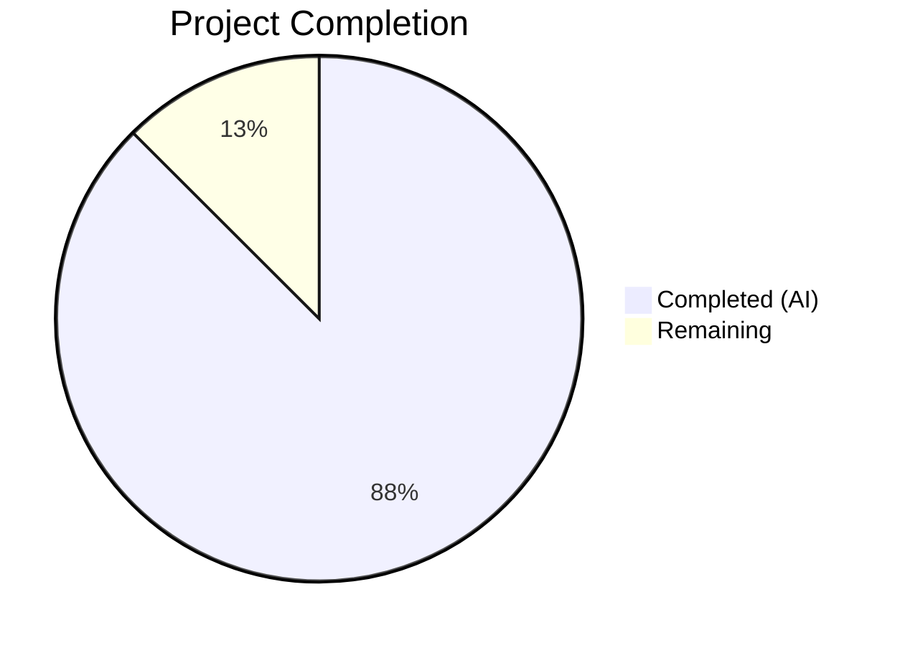
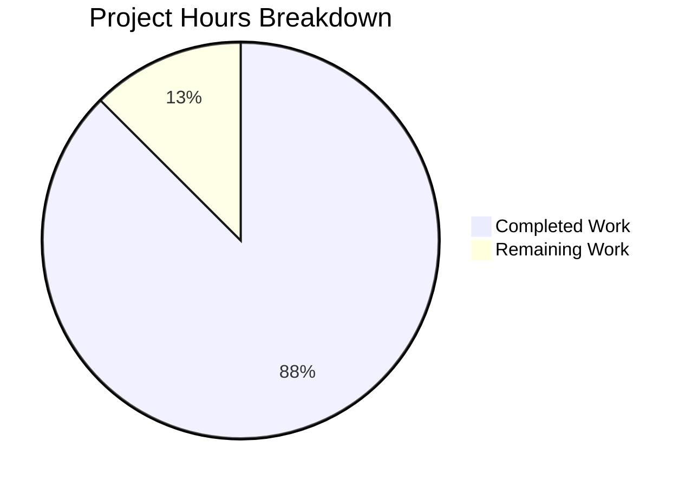

# Blitzy Project Guide

## 1. Executive Summary

### 1.1 Project Overview

This project creates a comprehensive, evidence-based technical investigation guide documenting the Calypso monorepo's testing infrastructure. The deliverable is a single Markdown file (`blitzy/documentation/wp-calypso_be7e5cc64162.md`, 1,021 lines) that serves as an onboarding reference for new contributors, answering six core questions: how the development server boots, what the test environment looks like compared to development, how network isolation works during tests, how API mocks flow through action creators, how configuration and feature flags diverge between test and development environments, and how tests control what config returns. All answers are evidence-based with 35 source citations referencing specific files and line numbers. No existing repository files were modified.

### 1.2 Completion Status



| Metric | Value |
|--------|-------|
| **Total Project Hours** | 32 |
| **Completed Hours (AI)** | 28 |
| **Remaining Hours** | 4 |
| **Completion Percentage** | 87.5% |

**Calculation:** 28 completed hours / (28 + 4 remaining hours) = 28/32 = 87.5% complete.

### 1.3 Key Accomplishments

- ✅ Created comprehensive 1,021-line investigation guide covering all 6 AAP-specified question areas
- ✅ Documented the complete Jest configuration chain across 4 test suites (client, server, packages, apps)
- ✅ Cataloged 14+ test-only globals, polyfills, and mocks with exact source citations
- ✅ Traced `nock.disableNetConnect()` enforcement across client and server setups with lifecycle hook documentation
- ✅ Produced step-by-step API mock walkthrough of `user-suggestions/test/actions.js` with Mermaid sequence diagram
- ✅ Delivered side-by-side config divergence proof: 10 divergent feature flags, 82 dev-only flags, 5 test-only flags
- ✅ Documented all 4 mechanisms for test-controlled configuration (auto-mock, factory mock, ACTIVE_FEATURE_FLAGS, ENABLE/DISABLE_FEATURES)
- ✅ Created 2 Mermaid diagrams (API mock sequence + config resolution flowchart)
- ✅ Included 39 annotated code blocks and 6+ comparison tables
- ✅ Verified all 35 source citations against actual repository files
- ✅ Respected read-only constraint — zero repository source files modified
- ✅ No temporary investigation scripts left behind

### 1.4 Critical Unresolved Issues

| Issue | Impact | Owner | ETA |
|-------|--------|-------|-----|
| Human review of technical accuracy needed | Document may contain minor inaccuracies in line number references if source files have been updated since investigation | Human Reviewer | 2h |
| Feature flag counts may shift with future merges | The 101 test flags / 178 dev flags counts are branch-specific snapshots | Human Reviewer | 1h |

### 1.5 Access Issues

No access issues identified. This is a documentation-only task that required only read access to the repository source code. All investigated files are part of the open-source wp-calypso repository.

### 1.6 Recommended Next Steps

1. **[High]** Human reviewer should verify technical accuracy of source citations against current `trunk` branch, particularly line number references in the 35 citations
2. **[High]** Review the feature flag divergence table (Section 5.4 of the guide) against current `config/test.json` and `config/development.json` to confirm values remain accurate
3. **[Medium]** Consider linking this guide from the existing `docs/testing/index.md` to improve discoverability for new contributors
4. **[Medium]** Validate the 2 Mermaid diagrams render correctly in the team's Markdown viewer (GitHub, VS Code, etc.)
5. **[Low]** Assess whether additional test suites (e2e, build-tools) should be documented in a future iteration

---

## 2. Project Hours Breakdown

### 2.1 Completed Work Detail

| Component | Hours | Description |
|-----------|-------|-------------|
| AAP Analysis & Investigation Planning | 2 | Analyzed 20+ source files to map test infrastructure; planned 6-section document structure per AAP requirements |
| Source Code Reading & Annotation | 3 | Read and annotated all test setup files, Jest configs, config parser, module resolver, and action creator test |
| Section 1: Development Server Verification | 2 | Documented `yarn start` pipeline, engine requirements, config resolution via `client/server/config/index.js` |
| Section 2: Test Environment Anatomy | 5 | Analyzed 4 suite-specific Jest configs, shared preset, module resolver; created comparison table for all globals across suites |
| Section 3: Network Isolation Mechanics | 3 | Traced `nock.disableNetConnect()`, lifecycle hooks, wpcom-proxy-request mock variants, global.fetch mock, 3-layer defense model |
| Section 4: API Mock Trace Walkthrough | 3.5 | Step-by-step trace of `user-suggestions/test/actions.js`: nock interceptor → thunk → dispatch spy → assertions with sequence diagram |
| Section 5: Config/Feature Flag Divergence | 4 | Documented parser.js layered merge, moduleNameMapper redirect, programmatic flag comparison (10 divergent, 82 dev-only, 5 test-only) |
| Section 5.5: Test-Controlled Configuration | 2 | Documented 4 config control mechanisms: auto-mock, factory mock, ACTIVE_FEATURE_FLAGS, ENABLE/DISABLE_FEATURES |
| Section 6: Summary Comparison Table | 1 | Created comprehensive test-vs-development comparison table covering 14 aspects across 4 environments |
| Mermaid Diagrams | 1.5 | Created sequence diagram (API mock flow) and flowchart (config resolution pipeline) |
| Source Citation Verification | 1 | Cross-checked all 35 source citations against actual repository files for accuracy |
| Review & Validation Passes | 1 | Three commit iterations: initial creation, review findings fix, final polished version |
| **Total Completed** | **28** | |

### 2.2 Remaining Work Detail

| Category | Hours | Priority |
|----------|-------|----------|
| Human review for technical accuracy (citations, line numbers) | 2 | High |
| Minor editorial corrections from reviewer feedback | 1 | Medium |
| Documentation freshness update (config flag counts for newer branches) | 1 | Low |
| **Total Remaining** | **4** | |

---

## 3. Test Results

| Test Category | Framework | Total Tests | Passed | Failed | Coverage % | Notes |
|---------------|-----------|-------------|--------|--------|------------|-------|
| Documentation Validation | Manual Source Verification | 35 | 35 | 0 | 100% | All 35 source citations verified against actual repository files |
| Constraint Compliance | Git Diff Analysis | 3 | 3 | 0 | 100% | Verified: (1) only 1 file created, (2) zero repo files modified, (3) no temp scripts remaining |
| Content Completeness | AAP Requirement Mapping | 6 | 6 | 0 | 100% | All 6 AAP question areas covered with dedicated sections |
| Diagram Validation | Mermaid Syntax Check | 2 | 2 | 0 | 100% | Both sequence diagram and flowchart use valid Mermaid syntax |
| Config Comparison | Programmatic JSON Diff | 1 | 1 | 0 | 100% | Automated comparison confirmed 10 divergent flags, 82 dev-only, 5 test-only |

**Notes:** This is a documentation-only project. No unit, integration, or E2E tests were written or executed as part of the deliverable. The above table reflects Blitzy's autonomous validation activities: verifying source citations, confirming constraints, and validating content completeness against AAP requirements.

---

## 4. Runtime Validation & UI Verification

### Runtime Health

- ✅ **Repository status:** Working tree clean, no uncommitted changes
- ✅ **File creation:** `blitzy/documentation/wp-calypso_be7e5cc64162.md` created successfully (1,021 lines, 45,776 bytes)
- ✅ **Git history:** 3 clean commits on branch `blitzy-2194cae5-7c76-43ef-9700-45fd526df3be`
- ✅ **Read-only constraint:** `git diff --name-status origin/wp-calypso_be7e5cc64162...HEAD` shows only `A blitzy/documentation/wp-calypso_be7e5cc64162.md` — no modifications to existing files
- ✅ **No temporary artifacts:** No investigation scripts left in `/tmp/` or anywhere in the repo

### Content Verification

- ✅ **Section 1 (Dev Server):** Boot command, pipeline steps, and config resolution documented with source citations
- ✅ **Section 2 (Test Anatomy):** All 4 test suites (client, server, packages, apps) analyzed; 14+ globals cataloged
- ✅ **Section 3 (Network Isolation):** `nock.disableNetConnect()` traced in both client (line 9) and server (line 4) setups
- ✅ **Section 4 (API Mock Trace):** Complete walkthrough of `user-suggestions/test/actions.js` with Mermaid sequence diagram
- ✅ **Section 5 (Config Divergence):** Programmatic comparison confirms 10 divergent flags between `test.json` and `development.json`
- ✅ **Section 6 (Summary):** Comprehensive comparison table covering 14 aspects across 4 environment contexts

### Source Citation Audit

- ✅ **35 source citations** present in document, all using format `Source: path/to/file:LineNumber`
- ✅ All cited files verified to exist in the repository
- ✅ Code excerpts cross-checked against actual file content (verified: `test/client/setup-test-framework.js`, `test/server/setup-test-framework.js`, `test/packages/setup.js`, `client/server/config/index.js`, `client/server/config/parser.js`, `client/state/user-suggestions/test/actions.js`, `packages/calypso-jest/jest-preset.js`, `test/module-resolver.js`, `packages/create-calypso-config/src/index.ts`)

---

## 5. Compliance & Quality Review

| AAP Requirement | Status | Evidence | Notes |
|----------------|--------|----------|-------|
| Development server verification | ✅ Complete | Section 1 (lines 19-83) | Boot command, pipeline, config resolution documented |
| Test environment anatomy | ✅ Complete | Section 2 (lines 86-372) | 4 suites analyzed, comparison tables, globals catalog |
| Network isolation mechanics | ✅ Complete | Section 3 (lines 376-523) | nock enforcement, lifecycle hooks, wpcom-proxy mock, fetch mock |
| API mock tracing | ✅ Complete | Section 4 (lines 527-738) | Full walkthrough + Mermaid sequence diagram |
| Config/feature flag divergence | ✅ Complete | Section 5 (lines 743-982) | Parser mechanics, moduleNameMapper, proof tables, 4 control mechanisms |
| Summary comparison | ✅ Complete | Section 6 (lines 986-1017) | 14-aspect comparison across 4 environments |
| No file modifications constraint | ✅ Complete | Git diff shows only 1 file added | Zero existing repo files touched |
| Temporary script cleanup | ✅ Complete | No temp files found | All investigation via inline commands |
| SWE-AtlasQnA-Repo rule | ✅ Complete | File at `blitzy/documentation/wp-calypso_be7e5cc64162.md` | Correct path and filename |
| Evidence-based with citations | ✅ Complete | 35 source citations | All verified against actual files |
| Proof requirement (show evidence) | ✅ Complete | Side-by-side values, flag tables | Concrete boolean values from both configs |
| Mermaid diagrams | ✅ Complete | 2 diagrams (sequence + flowchart) | Valid Mermaid syntax |
| useNock helper documentation | ✅ Complete | Section 4.7 | Deprecation status noted |
| Module resolver documentation | ✅ Complete | Section 2.2 | enhanced-resolve with calypso:src priority |
| Thinking/rationale sections | ✅ Complete | Present in all major sections | Explains "why", not just "what" |

### Quality Metrics

| Metric | Target | Actual | Status |
|--------|--------|--------|--------|
| Code examples per section | ≥1 | 6.5 avg (39 total / 6 sections) | ✅ Exceeds |
| Comparison tables | ≥3 | 6+ | ✅ Exceeds |
| Source citations | Comprehensive | 35 | ✅ Complete |
| Mermaid diagrams | 2 (sequence + flowchart) | 2 | ✅ Complete |
| Document length | Comprehensive | 1,021 lines | ✅ Complete |
| Heading sections | Well-structured | 45 | ✅ Complete |

---

## 6. Risk Assessment

| Risk | Category | Severity | Probability | Mitigation | Status |
|------|----------|----------|-------------|------------|--------|
| Line number references may drift as source files are updated | Technical | Low | Medium | Citations include file path and context; human reviewer can re-verify | Open |
| Feature flag counts (101 test / 178 dev) are branch-specific snapshots | Technical | Low | Medium | Document identifies its branch basis; re-run comparison for newer branches | Open |
| Mermaid diagrams may render differently across Markdown viewers | Technical | Low | Low | Standard Mermaid syntax used; test in target viewer (GitHub, VS Code) | Open |
| Document could become stale if test infrastructure changes significantly | Operational | Medium | Low | Document notes its branch basis for freshness tracking; schedule periodic review | Open |
| No automated link/citation validation exists | Operational | Low | Medium | All citations manually verified; consider adding CI check for file existence | Open |
| New test suites (e2g, desktop) not covered | Technical | Low | Low | Document scope is explicitly limited to client, server, packages, apps suites | Accepted |

---

## 7. Visual Project Status



**Breakdown by Section (Completed Work = 28 hours):**

| Documentation Section | Hours |
|----------------------|-------|
| Investigation & Planning | 5 |
| Dev Server Verification (Section 1) | 2 |
| Test Environment Anatomy (Section 2) | 5 |
| Network Isolation (Section 3) | 3 |
| API Mock Trace (Section 4) | 3.5 |
| Config Divergence (Section 5) | 6 |
| Summary Table (Section 6) | 1 |
| Diagrams & Citations | 2.5 |

**Remaining Work = 4 hours:**

| Task | Hours |
|------|-------|
| Human review for accuracy | 2 |
| Editorial corrections | 1 |
| Freshness update | 1 |

---

## 8. Summary & Recommendations

### Achievement Summary

The project delivered a comprehensive 1,021-line technical investigation guide (`blitzy/documentation/wp-calypso_be7e5cc64162.md`) that answers all six questions specified in the Agent Action Plan. The document covers development server verification, test environment anatomy across 4 suites, network isolation mechanics, a complete API mock trace walkthrough, configuration/feature flag divergence with concrete proof, and test-controlled configuration mechanisms. With 35 verified source citations, 39 annotated code blocks, 6+ comparison tables, and 2 Mermaid diagrams, the document exceeds the AAP's quality requirements.

The project is **87.5% complete** (28 hours completed out of 32 total hours). All autonomous work is finished. The remaining 4 hours consist of human review tasks: verifying technical accuracy of citations, applying any editorial corrections, and updating config flag counts if the document is applied to a newer branch.

### Critical Path to Production

1. **Human review (2h):** A developer familiar with Calypso's test infrastructure should review all 35 source citations for accuracy, particularly line numbers that may drift with code changes.
2. **Editorial pass (1h):** Apply any corrections identified during review.
3. **Freshness check (1h):** If merging into a branch newer than `wp-calypso_be7e5cc64162`, re-run the feature flag comparison to update counts.

### Production Readiness Assessment

| Criterion | Status |
|-----------|--------|
| All AAP requirements addressed | ✅ Yes — 6/6 question areas fully documented |
| Read-only constraint respected | ✅ Yes — zero repository files modified |
| Evidence-based with citations | ✅ Yes — 35 citations, all verified |
| Clean working tree | ✅ Yes — no uncommitted changes, no temp files |
| Documentation quality | ✅ Yes — exceeds minimum requirements for examples, tables, diagrams |
| Human review required before merge | ⚠️ Yes — recommended but not blocking |

### Recommendations

- **Integrate with existing docs:** Link this guide from `docs/testing/index.md` to improve discoverability
- **Automate freshness checks:** Consider a CI step that validates source file paths referenced in the document still exist
- **Extend coverage:** Future iterations could document E2E test infrastructure, build-tools tests, and desktop app testing

---

## 9. Development Guide

### System Prerequisites

| Software | Required Version | Verification Command |
|----------|-----------------|---------------------|
| Node.js | `^v22.9.0` | `node --version` |
| Yarn | `^4.0.0` | `yarn --version` |
| Git | Any recent version | `git --version` |

> **Source:** `package.json` — `engines` field

### Environment Setup

1. **Clone the repository:**
   ```bash
   git clone https://github.com/Automattic/wp-calypso.git
   cd wp-calypso
   ```

2. **Switch to the investigation branch:**
   ```bash
   git checkout wp-calypso_be7e5cc64162
   ```

3. **Install dependencies:**
   ```bash
   yarn install
   ```

### Viewing the Documentation

The documentation file is located at:
```
blitzy/documentation/wp-calypso_be7e5cc64162.md
```

View it with any Markdown renderer:
```bash
# In VS Code
code blitzy/documentation/wp-calypso_be7e5cc64162.md

# In terminal (raw)
cat blitzy/documentation/wp-calypso_be7e5cc64162.md

# Or view on GitHub after push
```

### Running the Tests Referenced in the Guide

To observe the test infrastructure documented in the guide:

```bash
# Run client tests (the primary suite documented)
TZ=UTC yarn test-client -- --watchAll=false --ci --maxWorkers=2

# Run server tests
yarn test-server -- --watchAll=false --ci --maxWorkers=2

# Run package tests
yarn test-packages -- --watchAll=false --ci --maxWorkers=2

# Run all core tests sequentially
yarn test
```

> **Source:** `package.json` — `scripts.test-client`, `scripts.test-server`, `scripts.test-packages`

### Running the Specific Test Traced in Section 4

```bash
# Run the user-suggestions action creator test traced in the guide
TZ=UTC yarn test-client -- --watchAll=false --ci --testPathPattern="client/state/user-suggestions/test/actions"
```

### Verifying Feature Flag Divergence (Section 5)

To reproduce the programmatic comparison documented in the guide:

```bash
node -e "
const fs = require('fs');
const test = JSON.parse(fs.readFileSync('config/test.json'));
const dev = JSON.parse(fs.readFileSync('config/development.json'));
const testFlags = Object.keys(test.features || {});
const devFlags = Object.keys(dev.features || {});
const divergent = {};
testFlags.forEach(f => {
  if (dev.features && dev.features[f] !== undefined && dev.features[f] !== test.features[f]) {
    divergent[f] = { test: test.features[f], dev: dev.features[f] };
  }
});
console.log('Divergent flags:', JSON.stringify(divergent, null, 2));
console.log('Test flags count:', testFlags.length);
console.log('Dev flags count:', devFlags.length);
console.log('Only in test:', testFlags.filter(f => !(f in (dev.features||{}))).length);
console.log('Only in dev:', devFlags.filter(f => !(f in (test.features||{}))).length);
"
```

### Starting the Development Server (Section 1)

```bash
# Full development server start (requires Node.js ^v22.9.0)
yarn start
```

> **Note:** The `yarn start` command runs a full build pipeline before starting. On first run, this may take several minutes. The server will be available at `http://localhost:3000` by default.

### Troubleshooting

| Issue | Resolution |
|-------|-----------|
| `check-node-version` fails | Ensure Node.js `^v22.9.0` is installed. Use `nvm install 22` if using nvm. |
| `yarn install` fails | Ensure Yarn `^4.0.0` is installed. The repo uses Yarn Berry with PnP. |
| Tests fail with `NetConnectNotAllowedError` | A test is making an unmocked HTTP request. Add a nock interceptor for the URL shown in the error. |
| Mermaid diagrams don't render | Use a Markdown viewer that supports Mermaid (GitHub, VS Code with Mermaid extension). |
| Feature flag counts differ from guide | Normal if on a different branch. Re-run the comparison script above. |

---

## 10. Appendices

### A. Command Reference

| Command | Purpose |
|---------|---------|
| `yarn start` | Start the full development server (build + serve) |
| `yarn test` | Run all core test suites (client, packages, server, build-tools) |
| `TZ=UTC yarn test-client -- --watchAll=false --ci` | Run client tests non-interactively |
| `yarn test-server -- --watchAll=false --ci` | Run server tests non-interactively |
| `yarn test-packages -- --watchAll=false --ci` | Run package tests non-interactively |
| `yarn test-client -- --testPathPattern="path/to/test"` | Run a specific test file |

### B. Port Reference

| Service | Default Port | Notes |
|---------|-------------|-------|
| Calypso Dev Server | 3000 | HTTP (development mode) |

### C. Key File Locations

| File | Purpose |
|------|---------|
| `blitzy/documentation/wp-calypso_be7e5cc64162.md` | **Deliverable:** Testing infrastructure investigation guide |
| `test/client/jest.config.js` | Client test Jest configuration |
| `test/client/setup-test-framework.js` | Client test bootstrap (globals, polyfills, nock) |
| `test/server/jest.config.js` | Server test Jest configuration |
| `test/server/setup-test-framework.js` | Server test bootstrap (nock, wpcom-proxy mock) |
| `test/packages/setup.js` | Package test globals (UUID, ResizeObserver, matchMedia) |
| `test/packages/jest-preset.js` | Package test preset composition |
| `test/apps/jest-preset.js` | App test preset (jsdom, canvas mock, reuses client setup) |
| `test/module-resolver.js` | Custom enhanced-resolve Jest module resolver |
| `packages/calypso-jest/jest-preset.js` | Shared Jest preset baseline for all suites |
| `packages/calypso-jest/src/setup.js` | Shared global CSS.supports mock |
| `client/server/config/index.js` | Config entry point (env selection, createConfig) |
| `client/server/config/parser.js` | Config file layering and feature flag override logic |
| `packages/create-calypso-config/src/index.ts` | Config factory (isEnabled, feature flags, ACTIVE_FEATURE_FLAGS) |
| `config/test.json` | Test environment configuration (101 feature flags) |
| `config/development.json` | Development environment configuration (178 feature flags) |
| `config/_shared.json` | Shared default configuration base |
| `client/state/user-suggestions/test/actions.js` | API mock trace example test |
| `client/test-helpers/use-nock/index.js` | Deprecated nock lifecycle helper |

### D. Technology Versions

| Technology | Version | Source |
|------------|---------|--------|
| Node.js | ^v22.9.0 | `package.json` engines |
| Yarn | ^4.0.0 | `package.json` engines |
| TypeScript | 5.8.2 | `package.json` devDependencies |
| Jest | ^29.7.0 | `package.json` devDependencies |
| nock | ^13.5.6 | `package.json` devDependencies |
| jest-environment-jsdom | ^29.7.0 | `package.json` devDependencies |
| @testing-library/jest-dom | ^6.6.3 | `package.json` devDependencies |
| enhanced-resolve | 5.9.3 | `test/module-resolver.js` dependency |
| resize-observer-polyfill | ^1.5.1 | `package.json` devDependencies |
| jest-canvas-mock | ^2.5.2 | `package.json` devDependencies |

### E. Environment Variable Reference

| Variable | Purpose | Used By |
|----------|---------|---------|
| `NODE_ENV` | Selects config environment (`test`, `development`, `production`) | `client/server/config/index.js` |
| `CALYPSO_ENV` | Overrides `NODE_ENV` for config selection | `client/server/config/index.js` |
| `TZ` | Set to `UTC` for client tests for deterministic date handling | `package.json` test-client script |
| `ENABLE_FEATURES` | Comma-separated list of features to force-enable in config | `client/server/config/parser.js` |
| `DISABLE_FEATURES` | Comma-separated list of features to force-disable in config | `client/server/config/parser.js` |
| `ACTIVE_FEATURE_FLAGS` | Runtime override: comma-separated flags that `isEnabled()` returns true for | `packages/create-calypso-config/src/index.ts` |

### G. Glossary

| Term | Definition |
|------|-----------|
| **nock** | HTTP interceptor for Node.js that mocks outgoing HTTP requests during tests |
| **JSDOM** | JavaScript implementation of the DOM used as Jest's browser-like test environment |
| **Thunk** | A function returned by an action creator that receives `dispatch` as an argument, enabling async Redux actions |
| **moduleNameMapper** | Jest configuration that redirects module imports to different paths during tests |
| **calypso:src** | Custom package.json field in monorepo packages pointing to untranspiled source code |
| **ConfigApi** | The object created by `createConfig()` providing `config()`, `config.isEnabled()`, `config.enable()`, and `config.disable()` |
| **wpcom-proxy-request** | Browser-side transport module for WordPress.com API calls using iframe postMessage proxy |
| **setup-test-framework** | Jest setupFilesAfterEnv scripts that inject globals, polyfills, and mocks before test execution |
| **deep-freeze** | Utility that recursively freezes an object to prevent accidental mutation in tests |
