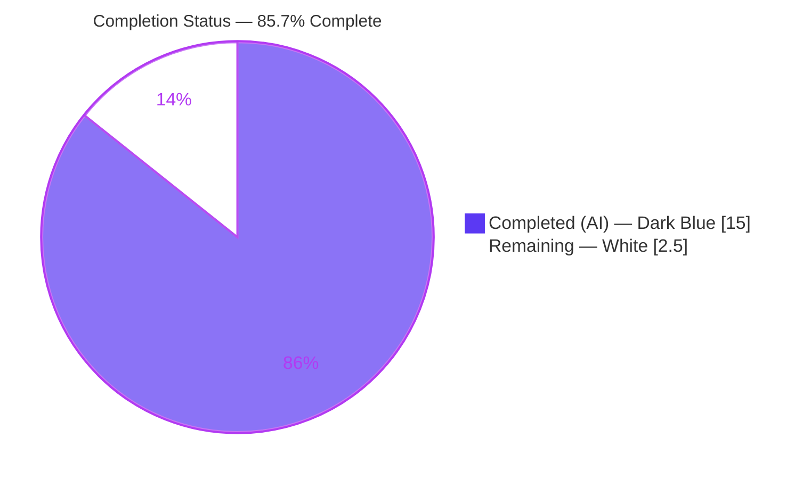
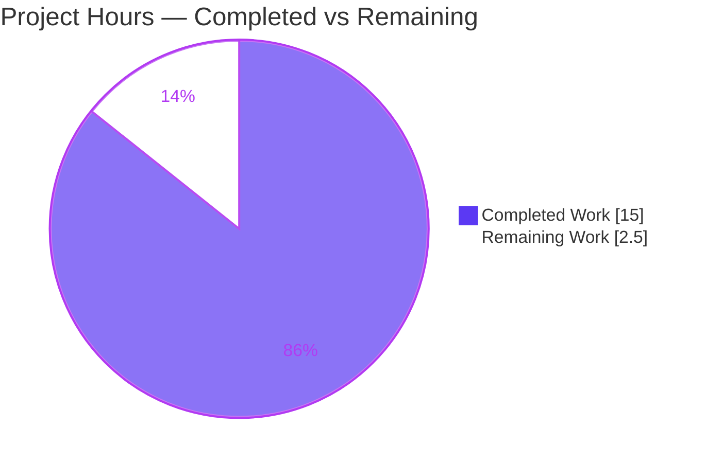
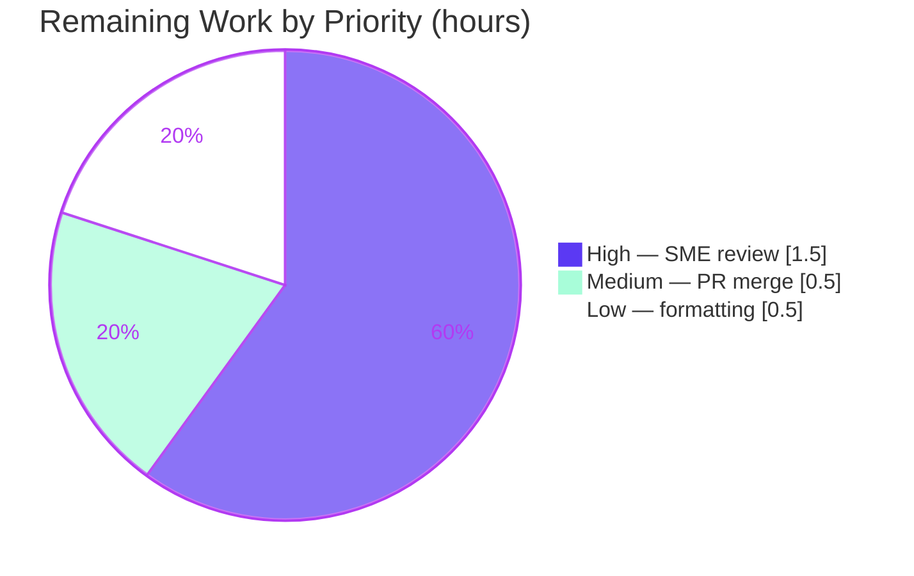

# Blitzy Project Guide

> **Deliverable:** `blitzy/documentation/wp-calypso_be7e5cc64162.md` — an investigative Q&A / root-cause analysis of the `@automattic/tree-select` memoized-selector layer.
> **Task class:** Documentation-only, strictly read-only investigation (ruleset **SWE-AtlasQnA-Repo**).
> **Brand color legend:** <span style="color:#5B39F3">■</span> **Completed / AI Work = Dark Blue `#5B39F3`** &nbsp;•&nbsp; <span style="color:#B23AF2">■</span> Headings/Accents = Violet-Black `#B23AF2` &nbsp;•&nbsp; □ **Remaining = White `#FFFFFF`** &nbsp;•&nbsp; <span style="color:#A8FDD9">■</span> Highlight = Mint `#A8FDD9`

---

## 1. Executive Summary

### 1.1 Project Overview

This project investigates and definitively explains the caching behavior of the Automattic/wp-calypso monorepo's memoized-selector primitive, `@automattic/tree-select`, to diagnose a reported bug where a component reading filtered data from the central Redux store returns **stale results even after the underlying data changed**. The work answers six precise sub-questions (comparison mechanism, invocation counts, per-argument entries, cache clearing, nullish-vs-primitive dependents, and custom cache keys) by **executing the real code** and capturing verbatim output. The sole deliverable is one branch-named markdown document; no production source, tests, configuration, or dependencies were modified. The target audience is the wp-calypso engineering team maintaining the `client/state/**` selector layer.

### 1.2 Completion Status



| Metric | Value |
| --- | --- |
| **Total Hours** | **17.5 h** |
| **Completed Hours (AI + Manual)** | **15.0 h** (AI = 15.0 h · Manual = 0.0 h) |
| **Remaining Hours** | **2.5 h** |
| **Percent Complete** | **85.7 %** — computed as 15.0 ÷ 17.5 × 100 (PA1, AAP-scoped) |

> **Interpretation:** 100 % of the AAP-scoped autonomous work is delivered and independently verified. The remaining 2.5 h is human path-to-production (technical review + merge + optional formatting decision). Per policy, completion never reaches 100 % before human review.

### 1.3 Key Accomplishments

- ✅ **All six sub-questions (Q1–Q6) answered** with observed output and exact `file:line` citations.
- ✅ **Root cause identified and experimentally validated** — a nullish dependent collapses distinct states onto a single shared `NULLISH_KEY`, returning a stale cached object (`packages/tree-select/src/index.ts:L107`, `L121`).
- ✅ **Run-then-write methodology honored** — a Node type-stripping probe executed `src/index.ts`; its 27-line stdout is quoted verbatim in the doc.
- ✅ **Independently reproduced** — the probe output matches the doc **byte-for-byte** (`diff` exit 0); the package **Jest suite passes 17/17**.
- ✅ **Read-only scope preserved** — exactly 1 file added (`+546 / -0`), 0 source files modified, working tree clean, temp scripts removed.
- ✅ **README argument-order discrepancy reported** as a caveat (not fixed, per the read-only directive).
- ✅ **Citation exactness verified** — ~26 unique `src/index.ts` citations plus test/README/package citations checked; the AAP's "18 tests" corrected to the true **17**.

### 1.4 Critical Unresolved Issues

| Issue | Impact | Owner | ETA |
| --- | --- | --- | --- |
| Root-cause hypothesis (nullish collapse) not yet confirmed against the user's actual runtime state | Low — the doc frames it as the *most-likely* cause and documents a secondary in-place-mutation path; no code depends on it | wp-calypso Redux SME (human) | 1.5 h |
| No net-new tests written | None — task is read-only; the pre-existing 17-test Jest suite already covers the behaviors and passes | N/A (by design) | N/A |

> **No blocking issues.** The deliverable compiles-equivalently (runs), reproduces, and is byte-identical to its commit. All items above are verification/sign-off, not defects.

### 1.5 Access Issues

**No access issues identified.**

| System/Resource | Type of Access | Issue Description | Resolution Status | Owner |
| --- | --- | --- | --- | --- |
| Git repository (branch `blitzy-8b313489-…`) | Read/Write | None — branch present, clean, in sync with origin | ✅ Resolved | — |
| Node runtime (type-stripping) | Execute | None — Node v22.23.1 satisfies engine `^v22.9.0`; `--experimental-strip-types` available | ✅ Resolved | — |
| Workspace `node_modules` (for optional Jest) | Read/Execute | None — installed; Jest suite ran 17/17 | ✅ Resolved | — |
| External services / APIs / credentials | — | None required — investigation runs fully offline | ✅ N/A | — |

### 1.6 Recommended Next Steps

1. **[High]** Have a wp-calypso Redux SME review the six answers and confirm the nullish-collapse root cause against actual consumer usage (e.g., `getSiteStatsPostStreakData` nullable dependents) — **1.5 h**.
2. **[Medium]** Approve the PR and merge the documentation artifact — **0.5 h**.
3. **[Low]** Decide the markdown formatting policy: leave the file verbatim (recommended) or add a `prettier-ignore`; **do not** run `prettier --write` (it corrupts the verbatim fenced blocks) — **0.5 h**.
4. **[Low]** Optionally file a follow-up ticket to correct the README's reversed argument order in `packages/tree-select/README.md` (out of scope here — read-only).

---

## 2. Project Hours Breakdown

### 2.1 Completed Work Detail

Every completed component traces to an AAP requirement (investigation + authoring of the read-only answer document).

| Component | Hours | Description |
| --- | --- | --- |
| Ground-truth code study | 2.5 | Read & trace `packages/tree-select/src/index.ts` (131-line WeakMap-tree memoization), `test/index.js` (266 lines, 17 tests), README, `package.json`, `jest.config.js`, and all **10** `client/state/**` consumers. |
| Runtime observation harness | 3.0 | Authored a 159-line instrumented probe (selector call counters), exercised all six code paths via `node --experimental-strip-types` under `NODE_ENV=development`, and captured verbatim stdout. |
| Q1–Q4 grounded answers | 3.0 | Comparison mechanism (Q1), invocation counts 1/2/3 (Q2), per-argument coexistence (Q3), and `clearCache()` (Q4) — each with observed output, reasoning, and citations. |
| Q5 root-cause analysis | 2.5 | Nullish → shared `NULLISH_KEY` collapse (stale) and non-nullish primitive → `TypeError`; the core diagnosis of the reported symptom. |
| Q6 custom cache-key answer | 1.0 | `options.getCacheKey` replaces default key generation **and** bypasses the object-argument dev guard. |
| Symptom mapping, remediation & README caveat | 1.5 | Mapped "central store / filtered data / stale results" across 10 consumers; documented read-only remediation options; flagged reversed-arg README caveat; package facts. |
| Validation & citation-exactness pass | 1.5 | R5 fix commit; byte-for-byte probe reproduction; Jest 17/17; ~26 `src` + test/README/package citation checks; cleanup and git-clean confirmation. |
| **Total** | **15.0** | **= Completed Hours in §1.2** |

### 2.2 Remaining Work Detail

Every remaining category is human path-to-production (the AAP-scoped autonomous work is fully delivered).

| Category | Hours | Priority |
| --- | --- | --- |
| Human SME technical review of Q1–Q6 answers & root-cause diagnosis | 1.5 | High |
| PR approval & merge of the documentation artifact | 0.5 | Medium |
| Optional markdown formatting decision (leave verbatim / add `prettier-ignore`) | 0.5 | Low |
| **Total** | **2.5** | **= Remaining Hours in §1.2 and §7 pie** |

> **Cross-section check:** §2.1 (15.0) + §2.2 (2.5) = **17.5 h** = Total Hours in §1.2. ✔

---

## 3. Test Results

All tests below were executed by Blitzy's autonomous validation for this project and **independently re-run this session**. Because the task is read-only, no net-new tests were authored; the pre-existing package suite serves as corroboration of the documented behaviors.

| Test Category | Framework | Total Tests | Passed | Failed | Coverage % | Notes |
| --- | --- | --- | --- | --- | --- | --- |
| Package behavioral / unit suite | Jest | 17 | 17 | 0 | Not measured | Pre-existing `packages/tree-select/test/index.js`. Ran `CI=true TZ=UTC yarn jest -c=test/packages/jest.config.js packages/tree-select --ci` → "Test Suites: 1 passed, 1 total", "Tests: 17 passed, 17 total". |
| Runtime behavioral probe | Node `--experimental-strip-types` | 6 scenarios (Q1–Q6) | 6 | 0 | N/A | Instrumented probe over `src/index.ts`; every scenario's observed values matched the expected values embedded in the probe; stdout matches the doc appendix **byte-for-byte** (`diff` exit 0). |

**Test coverage notes:** Coverage instrumentation was not run (read-only task; no coverage requirement in the AAP). The Jest suite exercises cache hits, multi-dependent trees, `clearCache()`, nullish memoization, non-nullish primitive rejection, primitive-argument acceptance, and the `getCacheKey` option — the same behaviors the deliverable documents.

---

## 4. Runtime Validation & UI Verification

**Runtime health**
- ✅ **Operational** — `packages/tree-select/src/index.ts` executes under Node type-stripping (`node --experimental-strip-types`), exit code **0**.
- ✅ **Operational** — All six behavioral scenarios (Q1–Q6) produce the expected observed values (counts, referential-identity results, and thrown error messages).
- ✅ **Operational** — Package Jest suite green (**17/17**), corroborating the documented behaviors.

**Deliverable integrity**
- ✅ **Operational** — `blitzy/documentation/wp-calypso_be7e5cc64162.md` present (546 lines, 24 second-level headings), byte-identical to its commit (`git diff HEAD` empty).
- ✅ **Operational** — Read-only scope: `git status --porcelain` returns **0** entries after both probe and Jest runs; exactly 1 file added versus base.

**UI verification**
- ⚠ **Not applicable** — this project has **no user interface**. The subject is a headless memoization library and the deliverable is a markdown document. No browser/UI verification was in scope.

**API integration**
- ⚠ **Not applicable** — no external services, APIs, network calls, or credentials are involved; the investigation runs fully offline.

---

## 5. Compliance & Quality Review

Cross-mapping the AAP / SWE-AtlasQnA-Repo directives to quality benchmarks:

| Benchmark (AAP / Ruleset) | Status | Progress | Notes |
| --- | --- | --- | --- |
| Run-then-write (execute code first) | ✅ Pass | ▰▰▰▰▰ | Probe executed and output captured before authoring. |
| Quote observed output verbatim | ✅ Pass | ▰▰▰▰▰ | 27-line captured block; reproduced byte-for-byte. |
| Exact `file:line` grounding | ✅ Pass | ▰▰▰▰▰ | ~26 unique `src/index.ts` citations + test/README/package citations verified. |
| Coverage — every sub-question answered | ✅ Pass | ▰▰▰▰▰ | Q1–Q6 each addressed; explicit coverage-check section present. |
| Root cause identified & validated by experiment | ✅ Pass | ▰▰▰▰▰ | Nullish collapse proven (`executions = 1`, `res1 === res2` true). |
| README discrepancy flagged (not fixed) | ✅ Pass | ▰▰▰▰▰ | Reversed argument order reported as a caveat. |
| Read-only scope (no source modified) | ✅ Pass | ▰▰▰▰▰ | 0 source files changed; only the deliverable added. |
| Temp-script cleanup | ✅ Pass | ▰▰▰▰▰ | No `/tmp` scripts remain; working tree clean. |
| Branch-named deliverable under `blitzy/documentation/` | ✅ Pass | ▰▰▰▰▰ | `wp-calypso_be7e5cc64162.md` created. |
| Reasoning / rationale ("why", not just "what") | ✅ Pass | ▰▰▰▰▰ | Each answer explains the underlying mechanism. |

**Fixes applied during autonomous validation**
- Commit `2cda8eaefe` — R5 citation/literal exactness corrections in the Q&A.
- Corrected the AAP's stated "18 tests" to the actual **17** within the document (with citation).

**Outstanding compliance items**
- Human SME sign-off on the technical conclusions (verification, not a defect) — tracked as HT-1 in §2.2 / §6.

---

## 6. Risk Assessment

| Risk | Category | Severity | Probability | Mitigation | Status |
| --- | --- | --- | --- | --- | --- |
| Root cause is the *most-likely* explanation but the user's real runtime state was not observed | Technical | Low | Medium | Doc presents primary (nullish collapse) **and** secondary (in-place mutation) paths and labels the diagnosis "most likely"; HT-1 SME review confirms against real usage | Open |
| `prettier --check` flags the `.md`; `prettier --write` would corrupt verbatim fenced blocks | Operational | Low | Low | Do **not** reformat; markdown is excluded from pre-commit gates (`bin/pre-commit-hook.js:36`); optional `prettier-ignore` | Open |
| Cosmetic runtime warnings (`MODULE_TYPELESS_PACKAGE_JSON`, `jest-haste-map` duplicate mock, Browserslist "17 months old") | Operational | Info | Low | Documented as harmless in the appendix; no action taken (read-only) | Documented |
| AAP stated "18 tests"; actual is 17 | Technical | Low | Low | Deliverable corrects to 17 with a citation | Resolved |
| Security surface | Security | None | — | No code, dependency, credential, or config changes; no attack surface introduced | N/A |
| Integration surface | Integration | None | — | No external services/APIs/network; type-strip runs offline; Jest uses workspace `node_modules` only | N/A |

**Overall risk posture: MINIMAL.** An isolated, read-only documentation deliverable with no production-code impact and no security or integration surface. The only substantive open item is human confirmation of the (transparently framed) root-cause hypothesis.

---

## 7. Visual Project Status

**Project hours breakdown** (values in hours; must match §1.2 and §2.2):



**Remaining hours by priority** (from §2.2; sums to 2.5 h):



> **Integrity:** "Remaining Work" = **2.5 h**, identical to §1.2 Remaining Hours and the §2.2 total. "Completed Work" = **15 h**, identical to §1.2 Completed Hours and the §2.1 total. ✔

---

## 8. Summary & Recommendations

**Achievements.** The investigation delivers a single, publication-quality, evidence-backed answer document that resolves all six sub-questions about `@automattic/tree-select` and pinpoints the reported "stale results" to a concrete, reproducible root cause: nullish dependents collapsing onto a shared `NULLISH_KEY`. Every factual claim is grounded in an exact `file:line` citation or verbatim captured output, and the entire investigation was conducted read-only (0 source files changed).

**Remaining gaps.** Only human path-to-production work remains (2.5 h): SME technical review, PR merge, and an optional markdown-formatting decision. There are no code defects, no failing tests, and no blocking issues.

**Critical path to production.** Human SME review (HT-1) → PR approval & merge (HT-2). The optional formatting decision (HT-3) is non-blocking.

**Success metrics.**

| Metric | Result |
| --- | --- |
| AAP sub-questions answered (Q1–Q6) | 6 / 6 |
| Package Jest suite | 17 / 17 passed |
| Probe output reproduced vs. doc | Byte-for-byte identical (`diff` exit 0) |
| Source files modified | 0 (read-only honored) |
| Citations verified | ~26 `src` + test/README/package, all accurate |

**Production-readiness assessment.** The project is **85.7 % complete** on an AAP-scoped basis. The deliverable is complete, accurate, and independently verified; it is ready for human review and merge. The residual 14.3 % is the standard human review-and-merge tail that, by policy, cannot be closed autonomously.

---

## 9. Development Guide

This guide explains how to reproduce the investigation and verify the deliverable. Every command was tested in this environment.

### 9.1 System Prerequisites

- **Operating system:** Linux/macOS (any POSIX shell). Verified on Ubuntu.
- **Node.js:** `^v22.9.0` (root `package.json:L56-L58`). Verified with **v22.23.1**. Type stripping requires Node **≥ 22.6**.
- **(Optional, for Jest corroboration only):** Corepack **0.34.6** + Yarn **4.0.2** (`engines.yarn ^4.0.0`) and an installed workspace `node_modules`.
- **Hardware:** negligible — the lightweight path is a single short-lived Node process.

```bash
# Verify prerequisites
node --version          # -> v22.23.1 (must satisfy ^v22.9.0)
corepack --version      # -> 0.34.6 (only needed for the optional Jest path)
```

### 9.2 Environment Setup

```bash
# From the repository root
cd /path/to/wp-calypso            # this checkout: /tmp/blitzy/wp-calypso/blitzy-8b313489-...
git rev-parse --abbrev-ref HEAD   # -> blitzy-8b313489-28bd-4da5-b611-7ecdf8f97932
```

- **No install is required** for the primary (type-stripping) reproduction path: `@automattic/tree-select` has only `tslib ^2.3.0` as a runtime dependency and the source is pure erasable TypeScript.
- `NODE_ENV=development` (i.e., not `production`) keeps the package's development guards active so the object-argument and primitive-dependent throws are observable.

### 9.3 Reproduce the Investigation (primary path — no install)

Create a temporary probe **outside** the repository (e.g., under `/tmp`) so the working tree stays clean, then run it with type stripping:

```bash
cat > /tmp/ts_probe.mjs <<'EOF'
import treeSelect from '/tmp/blitzy/wp-calypso/blitzy-8b313489-28bd-4da5-b611-7ecdf8f97932_a86fa3/packages/tree-select/src/index.ts';
let runs = 0;
const getDeps = ( state ) => [ state.data ];
const selector = ( deps ) => { runs++; return { computed: deps[ 0 ] }; };
const cached = treeSelect( getDeps, selector );
const state = { data: { x: 1 } };
cached( state ); cached( state ); cached( state );
console.log( 'selector executions after 3 identical calls =', runs, '(expect 1)' );
console.log( 'typeof cached.clearCache =', typeof cached.clearCache );
EOF

NODE_ENV=development node --experimental-strip-types /tmp/ts_probe.mjs
```

**Expected output:**

```text
selector executions after 3 identical calls = 1 (expect 1)
typeof cached.clearCache = function
```

> The full six-scenario probe and its 27-line captured output are embedded in the deliverable's "Reproduction appendix" (`blitzy/documentation/wp-calypso_be7e5cc64162.md`).

**Clean up (mandatory to keep the tree read-only):**

```bash
rm -f /tmp/ts_probe.mjs
git status --porcelain          # -> (empty) = clean, read-only scope honored
```

### 9.4 Corroborate with the Jest Suite (optional — requires node_modules)

```bash
CI=true TZ=UTC yarn jest -c=test/packages/jest.config.js packages/tree-select --ci
```

**Expected tail:**

```text
PASS packages/tree-select/test/index.js
Test Suites: 1 passed, 1 total
Tests:       17 passed, 17 total
Snapshots:   0 total
```

### 9.5 Verify the Deliverable

```bash
wc -l blitzy/documentation/wp-calypso_be7e5cc64162.md   # -> 546
grep -c '^##' blitzy/documentation/wp-calypso_be7e5cc64162.md  # -> 24 second-level headings
git diff --stat HEAD -- blitzy/documentation/wp-calypso_be7e5cc64162.md  # -> (empty) identical to commit
```

### 9.6 Troubleshooting

- **`--experimental-strip-types` unrecognized / TypeScript not stripped** → Node is older than 22.6. Upgrade Node to satisfy `^v22.9.0`.
- **`[MODULE_TYPELESS_PACKAGE_JSON]` stderr warning** → harmless; Node reparses the `.ts` as ESM because the package has no `"type": "module"`. Do **not** add that field (read-only directive).
- **`prettier --check` reports the `.md` needs formatting** → expected and non-blocking. Markdown is excluded from the repo's pre-commit gates (`bin/pre-commit-hook.js:36`). **Never run `prettier --write`** on this file — it rewrites quotes/indentation inside the verbatim fenced blocks and breaks the exact match with `src/index.ts`.
- **A temporary probe shows up in `git status`** → you created it inside the repo. Move probes to `/tmp` and re-run cleanup.
- **`Error: Do not pass objects as arguments to a treeSelector`** → expected behavior when passing an object argument without a custom `getCacheKey` (see Q6). Supply `options.getCacheKey` to enable object arguments.

---

## 10. Appendices

### A. Command Reference

| Purpose | Command |
| --- | --- |
| Check Node version | `node --version` |
| Run primary probe (type-strip) | `NODE_ENV=development node --experimental-strip-types /tmp/ts_probe.mjs` |
| Run package Jest suite | `CI=true TZ=UTC yarn jest -c=test/packages/jest.config.js packages/tree-select --ci` |
| Confirm read-only/clean tree | `git status --porcelain` |
| Diff vs. base branch | `git diff --stat origin/wp-calypso_be7e5cc64162...HEAD` |
| Confirm deliverable line count | `wc -l blitzy/documentation/wp-calypso_be7e5cc64162.md` |
| List `tree-select` consumers | `grep -rl "@automattic/tree-select" client/state` |

### B. Port Reference

**Not applicable** — no server, daemon, or network listener is started at any point. The investigation is a short-lived offline Node process.

### C. Key File Locations

| Path | Role |
| --- | --- |
| `blitzy/documentation/wp-calypso_be7e5cc64162.md` | **Deliverable** — the investigative Q&A document (created) |
| `packages/tree-select/src/index.ts` | Primary subject — 131-line memoization implementation (reference) |
| `packages/tree-select/test/index.js` | 17-test behavioral spec (reference / corroboration) |
| `packages/tree-select/README.md` | Public docs; source of the reversed-arg caveat (reference) |
| `packages/tree-select/package.json` | v2.0.0, `tslib ^2.3.0` (reference) |
| `packages/tree-select/jest.config.js` | Test harness preset (reference) |
| `client/state/**/*selectors*` | 10 consumer modules grounding the "central store" framing (reference) |
| `bin/pre-commit-hook.js` | Pre-commit filter (`:36`) — confirms markdown is excluded from gates |

### D. Technology Versions

| Component | Version | Source |
| --- | --- | --- |
| Node.js | v22.23.1 | runtime (satisfies engine `^v22.9.0`) |
| Corepack | 0.34.6 | runtime |
| Yarn | 4.0.2 | `engines.yarn ^4.0.0` |
| `@automattic/tree-select` | 2.0.0 | `packages/tree-select/package.json` |
| `tslib` | ^2.3.0 | sole runtime dependency |
| TypeScript | ^5.8.2 | dev dependency |
| Jest | via `@automattic/calypso-jest` preset | `packages/tree-select/jest.config.js` |

### E. Environment Variable Reference

| Variable | Value used | Purpose |
| --- | --- | --- |
| `NODE_ENV` | `development` | Keeps the package's dev guards active (object-argument rejection at `src/index.ts:L75-L79`; invalid-argument checks at `L57-L63`) so the throws are observable. `production` disables them. |
| `CI` | `true` | Forces non-interactive Jest (no watch mode). |
| `TZ` | `UTC` | Deterministic timestamps for the Jest run. |

### F. Developer Tools Guide

- **Node type stripping (`--experimental-strip-types`)** — runs `.ts` directly without a build step; the primary, zero-install evidence path. Requires Node ≥ 22.6.
- **Jest (`test/packages/jest.config.js`)** — the monorepo's package test runner; target a single package by appending its path (`packages/tree-select`). Use `--ci` to prevent watch mode.
- **Git diff/status** — used to prove the read-only scope (`git diff --stat origin/wp-calypso_be7e5cc64162...HEAD` shows exactly one added file; `git status --porcelain` is empty).

### G. Glossary

| Term | Meaning |
| --- | --- |
| **`treeSelect`** | The default export of `@automattic/tree-select`; builds a tree of caches keyed by dependent identity (WeakMap) and a leaf `Map` keyed by a string cache key. |
| **`getDependents`** | First argument to `treeSelect`; returns the array of state slices a selector depends on. Interior cache nodes are keyed by these by reference. |
| **`getCacheKey`** | Optional hook that generates the leaf string key from the selector's arguments (default `args.join()`); supplying it also unlocks object arguments (Q6). |
| **`NULLISH_KEY`** | A single module-level `{}` used as the WeakMap key for any nullish dependent — the mechanism behind the stale-result root cause (Q5). |
| **`clearCache()`** | Method on the returned selector that swaps the root `WeakMap` wholesale (O(1)), dropping all cached branches (Q4). |
| **Cache hit / miss** | Hit = leaf `Map` already has the key → selector **not** called; miss = selector runs and the result is stored (Q1, Q2). |
| **Type stripping** | Node's removal of TypeScript type annotations at runtime, enabling execution of `.ts` without compilation. |

---

*Cross-section integrity verified before submission — Rule 1 (§1.2 ↔ §2.2 ↔ §7 remaining = 2.5 h), Rule 2 (§2.1 15.0 + §2.2 2.5 = 17.5 Total), Rule 3 (all tests from Blitzy's autonomous validation logs), Rule 4 (no access issues), Rule 5 (Completed = `#5B39F3`, Remaining = `#FFFFFF`). Completion = 85.7 % (15.0 ÷ 17.5), consistent across §1.2, §7, and §8.*