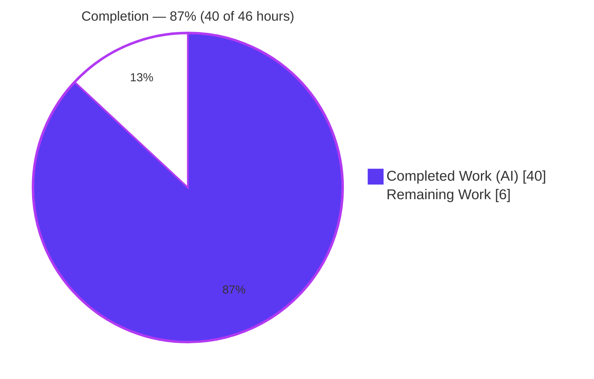
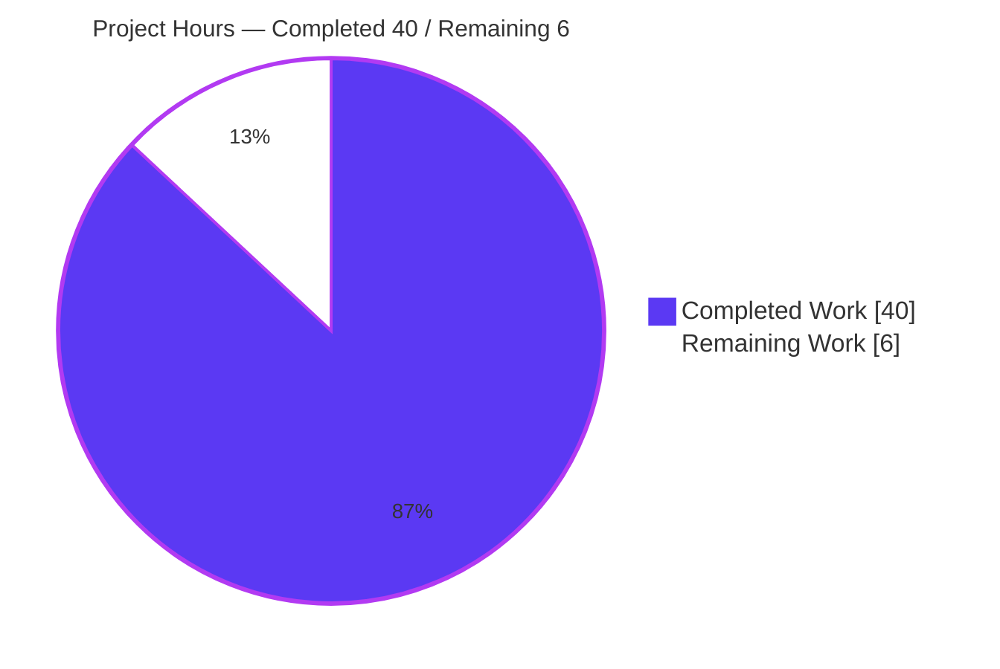
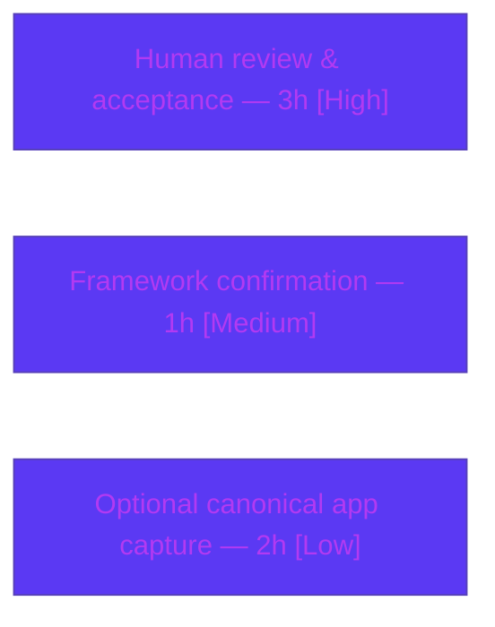

# Blitzy Project Guide

**Project:** Root-Cause Analysis — Unpredictable "Back" Button in wp-calypso Legacy Signup (`/start`)
**Branch:** `blitzy-7ddb2e12-bf8a-4204-9404-c1b0f7958385` · **HEAD:** `9d0593e80e` · **Base:** `be7e5cc641`
**Task type:** Read-only investigative Q&A / documentation
**Deliverable:** `blitzy/documentation/wp-calypso_be7e5cc64162.md` (1,324 lines)

---

## 1. Executive Summary

### 1.1 Project Overview

This project root-causes the unpredictable "Back" button behavior in the wp-calypso legacy signup/onboarding flow at `/start` — where the control sometimes moves one step back, sometimes snaps to the first step, and sometimes slips into a different flow. The objective was to **run** the relevant code, **observe** the computed back destination per step, and **author** a single evidence-grounded answer document. It targets wp-calypso engineers maintaining signup. The scope is strictly read-only: the only repository artifact is the answer document; no product code was modified. Business impact: precise, reproducible root-cause enabling a future targeted fix.

### 1.2 Completion Status

**AAP-scoped completion: 87%** (precisely 40 / 46 = 86.96%), computed by the PA1 hours-based method over AAP deliverables + path-to-production only.



*Legend: Completed = Dark Blue `#5B39F3` · Remaining = White `#FFFFFF`.*

| Metric | Hours |
|---|---|
| **Total Hours** | **46** |
| **Completed Hours (AI + Manual)** | **40** (AI = 40, Manual = 0) |
| **Remaining Hours** | **6** |
| **Percent Complete** | **87%** (40 / 46 = 86.96%) |

### 1.3 Key Accomplishments

- ✅ Authored the mandated answer document `blitzy/documentation/wp-calypso_be7e5cc64162.md` (1,324 lines, 12 sections) answering all six posed questions.
- ✅ Identified the **decider**: `NavigationLink.getBackUrl()` (`client/signup/navigation-link/index.jsx:78-115`) computes the Back anchor `href`; proved `goToPreviousStep` is never wired in the legacy render (grep count = 0 in `main.jsx`), so the `href` is the effective trigger.
- ✅ Established the **precedence rule**: early return `if (this.props.backUrl) return this.props.backUrl;` (`:83-85`) short-circuits before flow-position logic; ordinary query args only decorate the URL.
- ✅ Located the **external override source**: `?back_to=/…` promoted to the `backUrl` prop by `StepWrapper connect()` (`client/signup/step-wrapper/index.jsx:273-283`, slash-guard at `:275`), with a full `backUrl`-origin inventory.
- ✅ Documented the **bypassed step-by-step path**: `getPreviousStep()` (`:47-76`) + `isFirstStepInFlow`/`getFilteredSteps`/`getStepUrl`.
- ✅ Captured **per-step destinations** (scenarios A–G) and confirmed **determinism** across repeated runs ("never truly random").
- ✅ Ran the **canonical** jest observation vehicle — PASS 16/16, exit 0 (re-verified this session); independently reproduced the non-canonical harness byte-identically (sha256 match).
- ✅ Honored the **read-only mandate**: only the doc was added; source tree byte-identical to base; working tree clean; Prettier style check passes.

### 1.4 Critical Unresolved Issues

| Issue | Impact | Owner | ETA |
|---|---|---|---|
| Human review & acceptance of the root-cause analysis is pending | Gates final project acceptance (documentation quality/correctness sign-off) | wp-calypso signup SME / reviewer | 3h |
| User's specific flow framework not yet confirmed (legacy `/start` vs modern `/setup` Stepper) | Analysis targets legacy `/start`; if the user's flow runs on the modern Stepper, some specifics differ (addressed in doc §10) | Reviewer + reporter | 1h |

*Note: There are **no** unresolved compilation errors, failing tests, or defects in the deliverable. The unpredictable behavior itself is intentionally unchanged (it is the subject of the analysis; fixing it is explicitly out of scope — see §8).*

### 1.5 Access Issues

No access issues identified.

| System/Resource | Type of Access | Issue Description | Resolution Status | Owner |
|---|---|---|---|---|
| Repository (`wp-calypso`) | Read/Write (git) | None — branch checked out, HEAD `9d0593e80e`, committed | ✅ Resolved | — |
| Toolchain (Node 22 / yarn 4 / corepack) | Local execution | None — versions satisfy manifest; `node_modules` present (3.1 G) | ✅ Resolved | — |
| External services / credentials | — | None required (pure client-side JS/TS logic; no DB/cache/queue/API keys) | ✅ N/A | — |

### 1.6 Recommended Next Steps

1. **[High]** Review and accept the root-cause analysis: validate the precedence conclusion (`getBackUrl` early return), spot-check `file:line` references, and confirm the per-step observations and the two `[inferred]` conclusions (3h).
2. **[Medium]** Confirm which framework the user's specific flow uses (legacy `/start` `NavigationLink` vs modern `/setup` Stepper hook) and annotate applicability (1h).
3. **[Low]** *(Optional)* Upgrade the per-step observation (§8) from the NON-CANONICAL harness to a fully-canonical capture by driving the real `/start` app in a browser (2h).
4. **[Low]** *(Out of scope for this project)* If desired, scope a **separate** future initiative to *fix* the unpredictable back behavior (forbidden here by the read-only mandate).

---

## 2. Project Hours Breakdown

### 2.1 Completed Work Detail

Every completed component traces to a specific AAP requirement or the mandated methodology. **Total = 40h.**

| Component | Hours | Description |
|---|---|---|
| Environment provisioning & canonical test execution | 2 | Node 22 / yarn 4 via corepack; verify `node_modules`; run the canonical jest observation vehicle (16/16) |
| REQ-1 — the decider (investigation + authoring) | 4 | Trace `getBackUrl()`→`href` wiring; prove `goToPreviousStep` unwired in `main.jsx` (grep proof); author doc §4 |
| REQ-2 & REQ-4 — precedence + the rule (investigation + authoring) | 4 | Drive the three inputs into conflict; establish `backUrl` early-return short-circuit; author doc §5 precedence table |
| REQ-3 — external override source (investigation + authoring) | 4 | Trace `?back_to` → `StepWrapper connect()` → `backUrl` prop; build the full `backUrl`-origin inventory; author doc §6 |
| REQ-5 — bypassed step-by-step path (investigation + authoring) | 4 | Document `getPreviousStep()` + `isFirstStepInFlow`/`getFilteredSteps`/`getStepUrl` duality; author doc §7 |
| REQ-6 — per-step runtime observation | 6 | Build the observation harness against the real modules; capture per-step destinations (A–G); confirm determinism across runs (sha256) |
| Methodology & evidence compliance | 3 | Run-first discipline; canonical vs NON-CANONICAL labeling; complete output + commands; web-search confirmation of page.js interception |
| Document authoring & integration (1,324 lines) | 7 | Summary/direct answer, user-words mapping (§9), secondary Stepper note (§10), evidence appendix (§11), coverage checklist (§12) |
| QA / review refinement cycle | 6 | Four commits resolving a 15-finding code review, QA findings F-1/F-2/F-3, and QA Report 5 (Issues 1–5) |
| **Total** | **40** | |

### 2.2 Remaining Work Detail

Every remaining item is path-to-production for the documentation deliverable. **Total = 6h.**

| Category | Hours | Priority |
|---|---|---|
| Human review & acceptance of analysis correctness | 3 | High |
| Framework confirmation for the user's specific flow (`/start` vs `/setup`) | 1 | Medium |
| *(Optional)* Fully-canonical `/start` full-app per-step capture (upgrade §8 from NON-CANONICAL) | 2 | Low |
| **Total** | **6** | |

### 2.3 Hours Reconciliation

- Section 2.1 (Completed) = **40h** · Section 2.2 (Remaining) = **6h** · **Total = 46h** (matches Section 1.2).
- Completion % = 40 / (40 + 6) = 40 / 46 = **86.96% → 87%**.
- Remaining hours are identical across Sections 1.2, 2.2, and 7 = **6h** ✔.

---

## 3. Test Results

All tests below originate from Blitzy's autonomous validation logs for this project and were **re-verified in this session**.

| Test Category | Framework | Total Tests | Passed | Failed | Coverage % | Notes |
|---|---|---|---|---|---|---|
| Unit / Component (canonical observation vehicle) | Jest 29.7.0 + @testing-library/react 16.2.0 | 16 | 16 | 0 | Targeted (component: `NavigationLink` back-url / first-step / `backUrl`-override cases) | `CI=true yarn test-client client/signup/navigation-link/test/index.jsx --ci --watchAll=false`; PASS, exit 0, ~5.3s; deterministic across two runs |
| Runtime observation harness (NON-CANONICAL) | Jest (jsdom) against the real modules | 1 suite | 1 | 0 | N/A (observation, not assertion coverage) | Extracted outside the checkout; ran twice byte-identically; output sha256 `37156c44…863f2a`; independently reproduced |

**Aggregate:** 16 assertion tests + 1 observation suite, **100% pass**, 0 failures. No test files were added or modified (the canonical test is a pre-existing, read-only observation vehicle).

---

## 4. Runtime Validation & UI Verification

- ✅ **Operational** — Canonical jest suite executes cleanly: Test Suites 1/1, Tests 16/16, exit 0 (re-run this session).
- ✅ **Operational** — NON-CANONICAL observation harness reproduces byte-identically against the real modules (`isEnabled`, `flows.getFlow`, `getStepUrl`, unconnected `NavigationLink`, connected `StepWrapper` + real Redux `setRoute`, real `NewOrExistingSiteStep`); sha256 matches the documented value.
- ✅ **Operational** — Read-only integrity: `git status` clean; `git diff be7e5cc641 --name-status` = only `A blitzy/documentation/wp-calypso_be7e5cc64162.md`; source tree byte-identical to base.
- ✅ **Operational** — REQ-1 runtime proof: `grep -c 'goToPreviousStep' client/signup/main.jsx` = **0** (the click-handler back-branch is unwired in the legacy render; the computed `href` drives back navigation).
- ✅ **Operational** — Deliverable style: `npx prettier --check` → "All matched files use Prettier code style!" (exit 0).
- ⚠ **Partial** — Per-step destinations (doc §8) were captured via a NON-CANONICAL standalone harness (explicitly labeled). The canonical jest assertions corroborate the key cases; a fully-canonical browser capture of the live `/start` app remains an optional enhancement (HT-3).
- ⛔ **N/A** — Traditional UI/visual verification: no UI was changed; the deliverable is a Markdown document. The only UI element discussed is the Back control anchor whose `href` is `getBackUrl()`.

---

## 5. Compliance & Quality Review

Cross-map of AAP deliverables and the SWE-AtlasQnA-Repo ruleset to observed outcomes.

| Benchmark / AAP Requirement | Status | Evidence / Fix Applied |
|---|---|---|
| REQ-1 decider identified & named | ✅ Pass | Doc §4 — `NavigationLink.getBackUrl()` (`navigation-link/index.jsx:78-115`); href wiring `:183-192`; unwired proof (grep = 0) |
| REQ-2 precedence among inputs | ✅ Pass | Doc §5 precedence table; observed scenarios C/F/G |
| REQ-3 external override source | ✅ Pass | Doc §6 — `StepWrapper connect()` `back_to`→`backUrl` (`:273-283`); origin inventory |
| REQ-4 precedence rule | ✅ Pass | Doc §5 — early return `:83-85` short-circuits before flow logic |
| REQ-5 bypassed step-by-step path | ✅ Pass | Doc §7 — `getPreviousStep()` `:47-76` + helpers |
| REQ-6 per-step observation | ✅ Pass (NON-CANONICAL labeled) | Doc §8 per-step table A–G + §8.5 determinism |
| Run-first investigation | ✅ Pass | Canonical jest run + observation harness before authoring |
| Reproduce run-to-run inconsistency (same input) | ✅ Pass | Doc §8.5 byte-identical across repeated runs → deterministic |
| Canonical entry point + label non-canonical | ✅ Pass | 56 CANONICAL / 49 NON-CANONICAL labels in the doc |
| Exercise every condition (happy + edges) | ✅ Pass | Scenarios A–G + additional parts (first-step suppression, `pop()` fallback, cross-flow `lastKnownFlow`, invalid `back_to` guard) |
| Complete actual output + commands | ✅ Pass | Doc §11 evidence appendix with captured output, commands, sha256 |
| Ground every claim in `file:line` + name function | ✅ Pass | 74 `file:line` references; functions named throughout |
| Web-search confirmation (page.js interception) | ✅ Pass | 11 page.js/calypso-router mentions; interception behavior confirmed |
| Honest `[inferred]` vs observed labeling | ✅ Pass | 7 `[inferred]` labels, each source-grounded |
| Read-only mandate (no source edits; temp scripts removed) | ✅ Pass | Only the doc added; temp harness lived in `/tmp/blitzy_obs`, removed; tree clean |
| Deliverable location/name convention | ✅ Pass | `blitzy/documentation/wp-calypso_be7e5cc64162.md` |
| Code style (Prettier) | ✅ Pass | "All matched files use Prettier code style!" |
| Human acceptance sign-off | ⏳ Pending | HT-1 (3h) — awaiting SME review |

**Fixes applied during autonomous validation:** four iterative commits resolved a 15-finding code review, QA findings F-1/F-2/F-3, and QA Report 5 (Issues 1–5). By final validation, zero documentation edits were required (already 100% accurate).

---

## 6. Risk Assessment

| Risk | Category | Severity | Probability | Mitigation | Status |
|---|---|---|---|---|---|
| Per-step table (§8) captured via NON-CANONICAL harness rather than the live `/start` app render | Technical | Low | Medium | Canonical jest (16/16) corroborates key assertions; harness runs against the REAL modules; optional full-app capture (HT-3) to upgrade | Mitigated / Open (optional) |
| Two conclusions labeled `[inferred]` (page.js click dispatch; onboarding→/setup redirect) rather than directly observed | Technical | Low | Low | Each inference is source-grounded and clearly labeled; page.js behavior confirmed via official docs | Accepted |
| Underlying unpredictable back-navigation behavior remains unfixed | Technical | Medium | N/A (present) | Out of scope by AAP read-only mandate; precise root-cause enables a targeted future fix | Accepted (by design) |
| Existing external `back_to` redirect vector (`ownProps.backUrl` bypasses the `startsWith('/')` guard) | Security | Informational | N/A | Observation about existing code only; no new attack surface introduced; out of scope to fix | Documented |
| Framework ambiguity — analysis targets legacy `/start`; user's flow may run on modern `/setup` Stepper | Integration | Low | Low–Medium | Doc §10 secondary framework note; HT-2 human confirmation recommended | Open (minor) |
| Toolchain drift — `.nvmrc` pins Node 22.9.0; environment runs 22.23.1 | Integration | Negligible | Low | Both satisfy `^v22.9.0`; pure JS/TS logic executes identically | Accepted |
| No new operational risk (static Markdown deliverable — no runtime/deploy/monitoring) | Operational | None | N/A | Nothing to deploy or monitor | N/A |

---

## 7. Visual Project Status

**Project Hours Breakdown** (Completed = Dark Blue `#5B39F3`, Remaining = White `#FFFFFF`):



**Remaining Hours by Category** (from Section 2.2; sums to 6h):



*Integrity: "Remaining Work" = 6h in the pie equals Section 1.2 Remaining Hours and the Section 2.2 total.*

---

## 8. Summary & Recommendations

**Achievements.** The project is **87% complete (40 of 46 hours)**. The single mandated deliverable — `blitzy/documentation/wp-calypso_be7e5cc64162.md` — is authored, validated, and evidence-grounded. All six requirements are answered by name: the **decider** (`getBackUrl()` computes the Back `href`; `goToPreviousStep` is unwired), the **precedence** (component `backUrl` > flow position > ordinary query args), the **rule** (early-return short-circuit at `:83-85`), the **override source** (`?back_to` promoted in `StepWrapper connect()`), the **bypassed path** (`getPreviousStep()`), and the **per-step observations** (deterministic across runs). The apparent randomness is explained as the interaction of deterministic inputs — most sharply a `{ stepName: null }` previous step (snap to first step) and a foreign `lastKnownFlow` (slip into a different flow).

**Remaining gaps (6h, path-to-production only).** Human review/acceptance (3h), user-flow framework confirmation (1h), and an optional fully-canonical live-app per-step capture (2h). None are blocking defects; there are no failing tests or compilation errors.

**Critical path to production.** Reviewer sign-off (HT-1) is the sole gating item. Because the deliverable is a read-only document with no runtime, there is no deployment, CI, or environment configuration on the critical path.

**Out-of-scope note.** *Fixing* the unpredictable back behavior is explicitly forbidden by the AAP read-only mandate and is **not** counted in the 46-hour total. If the team wishes to remediate, it should be scoped as a **separate** future initiative — this document provides the precise root-cause and `file:line` anchors needed to do so efficiently.

**Production readiness assessment.** The documentation deliverable is **ready for human review**. Confidence is **High** for the source-grounded, test-corroborated conclusions and **Medium** only for the two explicitly `[inferred]` items and the framework-applicability question, both flagged transparently.

| Success Metric | Result |
|---|---|
| All six REQs answered by name with evidence | ✅ Yes |
| Canonical test passing | ✅ 16/16, exit 0 |
| Independent reproduction | ✅ Byte-identical (sha256 match) |
| Read-only mandate honored | ✅ Only the doc added; tree clean |
| Completion (AAP-scoped) | 87% (40/46h) |

---

## 9. Development Guide

> All commands below were executed successfully from the repository root in the validation session and reproduce the documented output.

### 9.1 System Prerequisites

- **OS:** Linux or macOS.
- **Node.js:** `^v22.9.0` (repo `.nvmrc` pins `22.9.0`; validated environment runs `v22.23.1`).
- **Yarn:** `^4.0.0` (repo `packageManager` = `yarn@4.0.2`), provided via **corepack** (`0.34.6`).
- **Git:** any recent version.
- **Disk:** ~4 GB free (`node_modules` is ~3.1 GB).
- **Network/services:** none required — the observation path is pure client-side JS/TS logic (no database, cache, queue, or API keys).

### 9.2 Environment Setup

```bash
# From the repository root (branch: blitzy-7ddb2e12-bf8a-4204-9404-c1b0f7958385, HEAD 9d0593e80e)
corepack enable            # provides yarn 4.0.2
nvm install && nvm use     # reads .nvmrc (22.9.0); optional if Node already satisfies ^22.9.0
node --version             # expect v22.x (>= 22.9.0)
yarn --version             # expect 4.0.2
```

No environment variables are required to run the canonical observation. (`CI=true` and `TZ=UTC` are used only to make the jest run non-interactive and deterministic.)

### 9.3 Dependency Installation

```bash
corepack enable
yarn install --immutable   # yarn.lock is clean; node_modules (~3.1 GB) is already present in this checkout
```

Expected: a clean install with no lockfile changes. If `node_modules` is already present, this is a fast no-op.

### 9.4 Running the Canonical Observation (the mandated vehicle)

```bash
CI=true yarn test-client client/signup/navigation-link/test/index.jsx --ci --watchAll=false
```

Expected output (tail):

```
PASS client/signup/navigation-link/test/index.jsx
Test Suites: 1 passed, 1 total
Tests:       16 passed, 16 total
Snapshots:   0 total
```

(`test-client` = `TZ=UTC jest -c=test/client/jest.config.js`.)

### 9.5 Verification Steps

```bash
# 1) Read-only integrity — working tree must be clean
git status --porcelain                       # expect: (empty)

# 2) Only the deliverable was added vs the base commit
git diff be7e5cc641 --name-status            # expect: A  blitzy/documentation/wp-calypso_be7e5cc64162.md

# 3) REQ-1 runtime proof — goToPreviousStep is not wired into the signup render
grep -c 'goToPreviousStep' client/signup/main.jsx   # expect: 0

# 4) Deliverable style check (read-only)
npx prettier --check "blitzy/documentation/wp-calypso_be7e5cc64162.md"
# expect: All matched files use Prettier code style!
```

### 9.6 Example Usage

```bash
# View the answer document (1,324 lines, 12 sections)
less blitzy/documentation/wp-calypso_be7e5cc64162.md

# Jump to a specific answer section, e.g. the precedence table (REQ-2 & REQ-4)
grep -n '^## 5\.' blitzy/documentation/wp-calypso_be7e5cc64162.md
```

*Optional (HT-3):* to reproduce the per-step observation harness, recreate the scripts described in the doc's §8/§11 **outside** the checkout (e.g. under `/tmp/blitzy_obs`), run them, and delete them afterward — never commit them, to preserve the read-only mandate.

### 9.7 Troubleshooting

- **`yarn: command not found`** → run `corepack enable` (yarn 4 is delivered via corepack, not a global install).
- **Node version mismatch** → `nvm install && nvm use` to honor `.nvmrc` (22.9.0). Any `>= 22.9.0` runtime executes the logic identically.
- **`node_modules` missing** → `yarn install --immutable`.
- **Jest hangs / enters watch mode** → always include `CI=true … --ci --watchAll=false`.
- **`Browserslist: caniuse-lite is N months old` warning** → benign; it does not affect the pure navigation logic under observation and can be ignored.

---

## 10. Appendices

### A. Command Reference

| Purpose | Command |
|---|---|
| Enable yarn 4 | `corepack enable` |
| Install deps | `yarn install --immutable` |
| Canonical observation (jest) | `CI=true yarn test-client client/signup/navigation-link/test/index.jsx --ci --watchAll=false` |
| Read-only integrity | `git status --porcelain` |
| Change footprint vs base | `git diff be7e5cc641 --name-status` |
| REQ-1 proof | `grep -c 'goToPreviousStep' client/signup/main.jsx` |
| Style check | `npx prettier --check "blitzy/documentation/wp-calypso_be7e5cc64162.md"` |
| View deliverable | `less blitzy/documentation/wp-calypso_be7e5cc64162.md` |

### B. Port Reference

| Context | Port | Notes |
|---|---|---|
| Canonical observation (jest) | none | No network port is opened; the observation is in-process |
| Optional live `/start` app (HT-3 only) | 3000 | The calypso dev server default, relevant only if a developer chooses the optional full-app capture |

### C. Key File Locations

| File | Role |
|---|---|
| `blitzy/documentation/wp-calypso_be7e5cc64162.md` | **The deliverable** (answer document) |
| `client/signup/navigation-link/index.jsx` | Decider — `getBackUrl()` (`:78-115`), `getPreviousStep()` (`:47-76`), override early return (`:83-85`), href (`:183-192`) |
| `client/signup/navigation-link/test/index.jsx` | Canonical observation vehicle (jest, 16 tests) |
| `client/signup/step-wrapper/index.jsx` | External override source — `back_to`→`backUrl` `connect()` (`:273-283`, guard `:275`) |
| `client/signup/utils.js` | `getStepUrl` (`:45`), `isFirstStepInFlow` (`:28`), `getFilteredSteps` (`:137`), `getPreviousStepName` (`:85`) |
| `client/state/signup/progress/actions.js` | Origin of per-step `lastKnownFlow` (`:117`, `:130`) |
| `client/signup/config/steps-pure.js` | Hardcoded mailbox `backUrl: 'mailbox-domain/'` (`:399`) |
| `client/signup/main.jsx` | Render wiring — omits `goToPreviousStep` (grep = 0) |
| `client/landing/stepper/declarative-flow/internals/hooks/use-step-navigation-with-tracking/index.ts` | Secondary modern-Stepper back logic (doc §10) |

### D. Technology Versions

| Component | Version |
|---|---|
| Node.js | v22.23.1 (env); `.nvmrc` pins 22.9.0; engines `^v22.9.0` |
| Yarn | 4.0.2 (via corepack 0.34.6) |
| Jest | 29.7.0 |
| @testing-library/react | 16.2.0 |
| React | 18.3.1 |
| @automattic/calypso-router (page.js fork) | 0.7.0 |

### E. Environment Variable Reference

| Variable | Value | Purpose |
|---|---|---|
| `CI` | `true` | Makes the jest run non-interactive (no watch mode) |
| `TZ` | `UTC` | Set by the `test-client` script for deterministic, timezone-stable runs |

*No application/runtime environment variables are required for this read-only documentation task.*

### F. Developer Tools Guide

| Tool | Use |
|---|---|
| `git` | Verify read-only integrity (`status`, `diff --name-status`) and authorship (all 4 commits by `agent@blitzy.com`) |
| `jest` (via `yarn test-client`) | Run the canonical observation vehicle |
| `grep` | Reproduce the REQ-1 proof (`goToPreviousStep` count = 0) |
| `prettier` | Read-only style verification of the deliverable |
| `less` | Read the 1,324-line answer document |

### G. Glossary

| Term | Meaning |
|---|---|
| **Decider** | The single method computing the Back destination — `NavigationLink.getBackUrl()` |
| **`backUrl` (override)** | Highest-precedence component prop; when truthy it short-circuits flow-position logic |
| **`back_to`** | Query-string argument (`?back_to=/…`) promoted to the `backUrl` prop by `StepWrapper connect()` |
| **`getPreviousStep()`** | The bypassed step-by-step (flow-position) computation |
| **`lastKnownFlow`** | Per-step field stamped by signup progress; the vector for cross-flow ("different flow") destinations |
| **CANONICAL** | An observation made through the real entry point (e.g., the jest test) |
| **NON-CANONICAL** | A standalone/simplified reproduction, explicitly labeled as such |
| **Legacy `/start`** | The class-component signup framework (primary subject) |
| **Stepper `/setup`** | The modern declarative-flow framework (secondary/parallel system, doc §10) |
