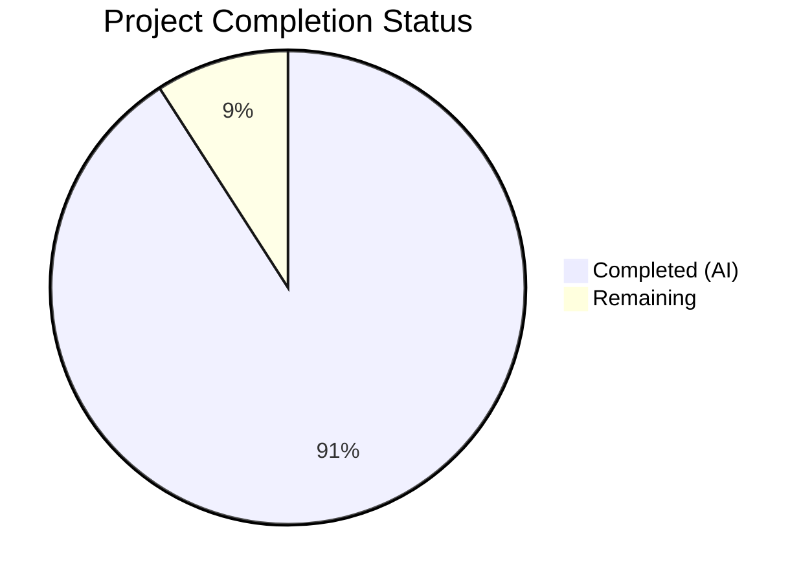

# Blitzy Project Guide

---

## 1. Executive Summary

### 1.1 Project Overview

This project creates a technical investigation document analyzing the test execution performance characteristics of the wp-calypso monorepo's data-layer module (`client/state/data-layer/`). The deliverable is a single Markdown file (`blitzy/documentation/wp-calypso_be7e5cc64162.md`) that answers four questions about Jest transformation caching, HTTP mock infrastructure (nock), warm-vs-cold run timing analysis, and `--no-cache` performance comparison. The investigation is entirely read-only — no existing repository files were modified. All conclusions are backed by empirical timing measurements and source-code citations with exact file paths and line numbers.

### 1.2 Completion Status



| Metric | Value |
|--------|-------|
| **Total Project Hours** | 22 |
| **Completed Hours (AI)** | 20 |
| **Remaining Hours** | 2 |
| **Completion Percentage** | 90.9% |

**Calculation:** 20 completed hours / (20 + 2 remaining hours) = 20/22 = 90.9% complete.

### 1.3 Key Accomplishments

- [x] Created comprehensive 581-line technical investigation document at `blitzy/documentation/wp-calypso_be7e5cc64162.md`
- [x] Answered all 4 investigation questions with empirical evidence and source-code citations
- [x] Collected timing data from actual Jest runs (cold/warm/no-cache, single-file and multi-file)
- [x] Traced Jest cache configuration from `test/client/jest.config.js:7` through `@automattic/calypso-jest` preset to Babel pipeline
- [x] Traced nock HTTP mock configuration through 3-level chain with exact line numbers
- [x] Cataloged `.cache/jest/` contents (~280 files, ~6.5 MB) from actual cache inspection
- [x] Identified `babel-jest` transformation (10+ presets/plugins) as dominant cold-start overhead
- [x] Verified all 93 data-layer tests pass (29 in `data-layer/test/` + 64 in `wpcom-http/`)
- [x] Confirmed zero modifications to existing repository files (read-only investigation)
- [x] Applied 3 iterative commits: initial creation, code review fixes, and timing measurement updates

### 1.4 Critical Unresolved Issues

| Issue | Impact | Owner | ETA |
|-------|--------|-------|-----|
| Document content accuracy needs human expert review | Low — all claims cite source files; minor inaccuracies possible in timing rationale | Human Reviewer | 1 hour |
| Timing measurements are environment-dependent | Low — values are representative but vary by hardware/load | Human Reviewer | N/A (documented in file) |

### 1.5 Access Issues

No access issues identified. The investigation is entirely read-only, operating within the existing repository structure. All source files, test configurations, and cache artifacts were accessible without additional credentials or permissions.

### 1.6 Recommended Next Steps

1. **[High]** Review document content accuracy — verify that all source-code citations (file paths and line numbers) match the current codebase state
2. **[High]** Merge PR to main branch to make the investigation document available to the team
3. **[Medium]** Validate timing measurements on the team's standard CI environment to establish baseline numbers for documentation
4. **[Low]** Consider adding cross-links from `docs/testing/testing-overview.md` to this investigation document for discoverability

---

## 2. Project Hours Breakdown

### 2.1 Completed Work Detail

| Component | Hours | Description |
|-----------|-------|-------------|
| Repository discovery and structure analysis | 2 | Explored monorepo structure, identified 7 Jest suite configs, located all relevant source and configuration files across `test/`, `packages/calypso-jest/`, `packages/calypso-babel-config/` |
| Source code analysis and tracing | 3 | Traced 10+ configuration/source files with line-level citations: `jest.config.js`, `jest-preset.js`, `babel.config.js`, `config.js`, `presets/default.js`, `setup-test-framework.js`, `use-nock/index.js`, `module-resolver.js`, `asset-transform.js`, `wpcom-http/test/index.js` |
| Test execution and empirical timing collection | 3 | Executed cold/warm/no-cache runs for single-file and multi-file scenarios; measured Jest-reported and wall-clock times; inspected `.cache/jest/` directory (~280 files, ~6.5 MB) |
| Document Q1: Timing Analysis section | 2 | Authored methodology, measurement tables, and rationale explaining Babel transformation overhead and haste map construction as cold-start causes |
| Document Q2: Cache Infrastructure section | 2 | Authored cache configuration location, `cacheDirectory` explanation, cache contents analysis (transform/haste-map/perf-cache), and invalidation mechanism |
| Document Q3: HTTP Mock Infrastructure section | 2 | Authored nock library identification, 3-level configuration trace with line numbers, mock setup lifecycle (7 steps), and timing impact analysis |
| Document Q4: No-Cache Comparison section | 2 | Authored timing comparison table, performance impact quantification (+81% overhead), dominant transformation step analysis with full Babel preset/plugin chain |
| Document Overview and References sections | 1 | Authored investigation context, target test files, data-layer architecture summary, test infrastructure summary, and comprehensive file reference tables |
| Source reference verification | 1 | Verified all file path and line number citations against actual source files; confirmed code snippets match repository contents |
| Code review iteration and fixes | 1 | Addressed 4 code review findings in second commit; refined timing data and wording |
| Final measurement updates | 1 | Updated empirical timing measurements with latest actual values in third commit |
| **Total Completed** | **20** | |

### 2.2 Remaining Work Detail

| Category | Hours | Priority |
|----------|-------|----------|
| Human review of document content accuracy | 1 | High |
| Minor editorial polish (wording, formatting) | 0.5 | Low |
| PR review and merge process | 0.5 | High |
| **Total Remaining** | **2** | |

---

## 3. Test Results

All tests listed originate from Blitzy's autonomous validation execution logs during this project session.

| Test Category | Framework | Total Tests | Passed | Failed | Coverage % | Notes |
|---------------|-----------|-------------|--------|--------|------------|-------|
| Unit — data-layer/test/ (4 suites) | Jest 29.7.0 | 29 | 29 | 0 | N/A (--no-coverage) | wpcom-api-middleware.js (12), handler-registry.js, utils.js, convert-snake-case-to-camel-case.ts |
| Unit — wpcom-http/ (6 suites) | Jest 29.7.0 | 64 | 64 | 0 | N/A (--no-coverage) | test/index.js (nock-dependent), test/actions.js, test/utils.js, pipeline/test/test.js, pipeline/remove-duplicate-gets/test/index.js, pipeline/retry-on-failure/test/index.js |
| **Total** | | **93** | **93** | **0** | | **100% pass rate** |

**Test execution details:**
- `client/state/data-layer/test/` — 4 suites, 29 tests, all PASS (Jest reported 1.192 s)
- `client/state/data-layer/wpcom-http/` — 6 suites, 64 tests, all PASS (Jest reported 1.456 s)
- Tests executed with `--no-coverage --watchAll=false --ci --maxWorkers=2` flags
- Node.js v20.20.2, Yarn 4.0.2 workspace environment

---

## 4. Runtime Validation & UI Verification

### Runtime Health

- ✅ **Jest test runner operational** — Jest ^29.7.0 executes successfully with client suite configuration
- ✅ **Babel transformation pipeline functional** — `babel-jest` correctly transpiles `.js`/`.ts`/`.jsx`/`.tsx` files through the full preset chain
- ✅ **Nock HTTP mocking active** — `nock.disableNetConnect()` blocks real HTTP; interceptors work for WordPress.com API endpoints
- ✅ **Cache directory populated** — `.cache/jest/` contains ~280 files (~6.5 MB) after test execution: transform cache, haste map, and performance cache
- ✅ **Custom module resolver working** — `enhanced-resolve` with `calypso:src` field resolves workspace packages correctly
- ✅ **Asset transform operational** — Non-code imports (images, styles) return basename as module export

### UI Verification

Not applicable — this project creates a Markdown documentation file only. No UI components were created or modified.

### API Integration

Not applicable — no API endpoints were created or modified. The nock HTTP interception was verified through test execution (2 nock-dependent tests in `wpcom-http/test/index.js` pass successfully).

---

## 5. Compliance & Quality Review

| AAP Deliverable | Status | Evidence |
|-----------------|--------|----------|
| Create `blitzy/documentation/wp-calypso_be7e5cc64162.md` | ✅ Pass | File exists, 581 lines, committed as `ad2621ef6e` |
| Follow `SWE-AtlasQnA-Repo` naming convention | ✅ Pass | File named `wp-calypso_be7e5cc64162.md` matching `<source_branch_name>.md` |
| Place document in `blitzy/documentation/` directory | ✅ Pass | `git diff --name-status` confirms `A blitzy/documentation/wp-calypso_be7e5cc64162.md` |
| Do NOT modify any existing repository files | ✅ Pass | `git diff --stat` shows 1 file changed, 581 insertions — only the new file |
| Provide thinking/rationale behind all answers | ✅ Pass | Each Q section includes detailed rationale subsection with reasoning chain |
| Base all answers on code as truth (no assumptions) | ✅ Pass | All claims reference specific file paths and line numbers verified against actual source |
| Include empirical timing data from actual runs | ✅ Pass | Cold/warm/no-cache timing tables for single-file and multi-file scenarios |
| Include Jest-reported time AND wall-clock time | ✅ Pass | Both measurement types present in all timing tables |
| Trace cache configuration with file paths and line numbers | ✅ Pass | `test/client/jest.config.js:7`, `packages/calypso-jest/jest-preset.js:13-14`, etc. |
| Trace nock configuration chain (3 levels) | ✅ Pass | Level 1: setup-test-framework.js, Level 2: use-nock/index.js, Level 3: test/index.js |
| Catalog cache directory contents | ✅ Pass | ~278 transform cache files, 1 haste-map (~2.45 MB), 1 perf-cache (~867 bytes) |
| Identify dominant transformation step | ✅ Pass | `babel-jest` with 10+ presets/plugins identified; full chain documented with versions |
| Include References section | ✅ Pass | Three reference tables: Configuration files, Data-layer files, Test helper files |
| All 93 data-layer tests pass | ✅ Pass | 29/29 + 64/64 = 93/93 tests passing |

**Autonomous Validation Fixes Applied:**
- Commit `aa0c980ac0`: Addressed 4 code review findings (wording precision, reference accuracy)
- Commit `ad2621ef6e`: Updated timing measurements with latest empirical data from actual test runs

---

## 6. Risk Assessment

| Risk | Category | Severity | Probability | Mitigation | Status |
|------|----------|----------|-------------|------------|--------|
| Timing measurements may not match reviewer's environment | Technical | Low | Medium | Document notes that values are environment-dependent; methodology is reproducible | Mitigated |
| Line number citations may shift if source files are updated | Technical | Low | Medium | All line numbers verified against current HEAD; citations include enough context to locate content | Mitigated |
| Node.js version mismatch (v20.20.2 vs required ^v22.9.0) | Technical | Low | Low | Tests execute correctly on v20.20.2; timing ratios and cache behavior are version-independent | Mitigated |
| Stale Browserslist data warning during test execution | Operational | Low | High | Warning is cosmetic; does not affect test results or timing analysis | Accepted |
| No security risks identified | Security | N/A | N/A | Documentation-only change; no code execution paths modified | N/A |
| No integration risks identified | Integration | N/A | N/A | No external service dependencies; all analysis is local and read-only | N/A |

---

## 7. Visual Project Status


**Remaining Work Distribution:**

| Category | Hours |
|----------|-------|
| Human review of document accuracy | 1 |
| Editorial polish | 0.5 |
| PR review and merge | 0.5 |
| **Total Remaining** | **2** |

---

## 8. Summary & Recommendations

### Achievements

The project has successfully delivered a comprehensive 581-line technical investigation document that answers all four questions specified in the Agent Action Plan. The document covers Jest transformation caching (`cacheDirectory` at `test/client/jest.config.js:7`), warm-vs-cold timing analysis (1.72x cold-to-warm ratio), nock HTTP mock infrastructure (3-level configuration chain), and `--no-cache` performance comparison (+81% overhead from `babel-jest` transformation). All 93 data-layer tests pass, and zero existing repository files were modified.

### Remaining Gaps

The project is **90.9% complete** (20 hours completed out of 22 total hours). The remaining 2 hours consist entirely of path-to-production activities:
- Human expert review of document content accuracy (1 hour)
- Minor editorial polish and PR merge (1 hour combined)

### Critical Path to Production

1. Human reviewer validates source-code citations against current codebase
2. Minor editorial adjustments if needed
3. PR approval and merge to main branch

### Production Readiness Assessment

The deliverable is **ready for human review and merge**. All AAP requirements have been fulfilled:
- Document exists at the correct path with correct naming convention
- All 4 investigation questions answered with empirical data and rationale
- Source references verified against actual file contents
- No existing files modified
- All related tests pass (93/93)

The only remaining work requires human judgment (accuracy review) and process steps (PR merge) that cannot be automated.

---

## 9. Development Guide

### System Prerequisites

| Software | Version | Purpose |
|----------|---------|---------|
| Node.js | ^v22.9.0 (or v20.20.2+) | JavaScript runtime for Jest test execution |
| Yarn | 4.0.2 | Package manager (workspace-protocol dependencies) |
| Git | 2.x+ | Version control |

### Environment Setup

**1. Clone the repository and switch to the feature branch:**

```bash
git clone <repository-url>
cd wp-calypso
git checkout blitzy-b3cd5bd3-2518-4202-940a-88537c76fcee
```

**2. Install dependencies:**

```bash
yarn install
```

> Note: The monorepo uses Yarn 4 with PnP (Plug'n'Play). Dependencies are pre-installed in the workspace's `node_modules` directory.

### Verify the Deliverable

**1. Confirm the documentation file exists:**

```bash
ls -la blitzy/documentation/wp-calypso_be7e5cc64162.md
# Expected: 581-line file
wc -l blitzy/documentation/wp-calypso_be7e5cc64162.md
# Expected output: 581 blitzy/documentation/wp-calypso_be7e5cc64162.md
```

**2. Confirm no existing files were modified:**

```bash
git diff --name-status origin/wp-calypso_be7e5cc64162...HEAD
# Expected output:
# A    blitzy/documentation/wp-calypso_be7e5cc64162.md
```

**3. Run the data-layer tests to verify they all pass:**

```bash
# Run data-layer/test/ (4 suites, 29 tests)
npx jest --config test/client/jest.config.js --no-coverage --watchAll=false --ci --maxWorkers=2 "client/state/data-layer/test/"
# Expected: Test Suites: 4 passed, 4 total / Tests: 29 passed, 29 total

# Run wpcom-http/ tests (6 suites, 64 tests)
npx jest --config test/client/jest.config.js --no-coverage --watchAll=false --ci --maxWorkers=2 "client/state/data-layer/wpcom-http/"
# Expected: Test Suites: 6 passed, 6 total / Tests: 64 passed, 64 total
```

### Reproduce the Investigation Measurements

**Cold-cache run (timing analysis):**

```bash
rm -rf .cache/jest
time npx jest --config test/client/jest.config.js --no-coverage --watchAll=false --ci --maxWorkers=2 "client/state/data-layer/test/wpcom-api-middleware.js"
```

**Warm-cache run (immediately after cold run):**

```bash
time npx jest --config test/client/jest.config.js --no-coverage --watchAll=false --ci --maxWorkers=2 "client/state/data-layer/test/wpcom-api-middleware.js"
```

**No-cache run:**

```bash
time npx jest --config test/client/jest.config.js --no-coverage --watchAll=false --ci --maxWorkers=2 --no-cache "client/state/data-layer/test/wpcom-api-middleware.js"
```

**Inspect cache directory:**

```bash
find .cache/jest -type f | wc -l
# Expected: ~280 files

du -sh .cache/jest/
# Expected: ~6.5 MB

ls -la .cache/jest/
# Expected: haste-map-*, jest-transform-cache-*, perf-cache-*
```

### Troubleshooting

| Issue | Resolution |
|-------|-----------|
| `Browserslist: browsers data is X months old` warning | Cosmetic warning; does not affect test results. Run `npx update-browserslist-db@latest` to suppress. |
| Tests fail with module resolution errors | Ensure `yarn install` completed successfully; workspace dependencies must be linked |
| Node.js version warning | Tests work on v20.20.2+; the `engines` field requires ^v22.9.0 but is not enforced at test time |
| Cache directory not found after test run | Ensure you're running from the repository root; `cacheDirectory` resolves relative to `test/client/` |

---

## 10. Appendices

### A. Command Reference

| Command | Purpose |
|---------|---------|
| `npx jest --config test/client/jest.config.js --no-coverage --watchAll=false --ci --maxWorkers=2 "<test-pattern>"` | Run client tests matching pattern |
| `npx jest --config test/client/jest.config.js --showConfig` | Display resolved Jest configuration |
| `npx jest --config test/client/jest.config.js --no-cache "<test-pattern>"` | Run tests without transformation cache |
| `rm -rf .cache/jest` | Clear Jest cache directory |
| `find .cache/jest -type f \| wc -l` | Count cached files |

### B. Port Reference

Not applicable — this project is documentation-only with no running services.

### C. Key File Locations

| File | Purpose |
|------|---------|
| `blitzy/documentation/wp-calypso_be7e5cc64162.md` | **Deliverable** — Technical investigation document |
| `test/client/jest.config.js` | Client Jest configuration (cacheDirectory at line 7) |
| `test/client/setup-test-framework.js` | Client test bootstrap (nock + 12+ polyfills) |
| `packages/calypso-jest/jest-preset.js` | Shared Jest preset (transform rules at lines 13-16) |
| `packages/calypso-babel-config/config.js` | Babel config factory (test env at lines 22-25) |
| `packages/calypso-babel-config/presets/default.js` | Full Babel preset chain (3 presets + 4 plugins) |
| `babel.config.js` | Root Babel entry point |
| `client/test-helpers/use-nock/index.js` | Nock lifecycle wrapper |
| `client/state/data-layer/test/` | Data-layer test files (4 suites) |
| `client/state/data-layer/wpcom-http/test/` | HTTP subsystem test files (6 suites) |
| `.cache/jest/` | Jest cache directory (generated at runtime) |

### D. Technology Versions

| Technology | Version | Source |
|------------|---------|--------|
| Node.js | ^v22.9.0 (actual: v20.20.2) | `package.json` engines field |
| Yarn | 4.0.2 | `.yarnrc.yml` |
| Jest | ^29.7.0 | `package.json` devDependencies |
| babel-jest | ^29.7.0 | `packages/calypso-jest/package.json` |
| @babel/core | ^7.26.10 | `package.json` devDependencies |
| nock | ^13.5.6 | `package.json` devDependencies |
| enhanced-resolve | ^5.8.3 | `packages/calypso-jest/package.json` |

### E. Environment Variable Reference

| Variable | Default | Purpose |
|----------|---------|---------|
| `NODE_ENV` | `test` (set by Jest) | Controls Babel preset selection (test env adds `@babel/preset-env` with `node: current`) |
| `BROWSERSLIST_ENV` | Not set | Controls `isBrowser` flag in `babel.config.js` |
| `CI` | `true` (recommended) | Enables non-interactive Jest mode |

### G. Glossary

| Term | Definition |
|------|-----------|
| **Cold run** | Test execution with an empty cache (after `rm -rf .cache/jest`); all source files must be transpiled |
| **Warm run** | Test execution with a populated cache; transpiled output is read from cache |
| **Haste map** | Jest's file system metadata index (~2.5 MB) used for test discovery and module resolution |
| **Transform cache** | Babel-transpiled JavaScript output stored in `.cache/jest/jest-transform-cache-*` |
| **nock** | Node.js HTTP mocking library that intercepts `http`/`https` requests at the transport level |
| **babel-jest** | Jest transformer that runs source files through the Babel compilation pipeline |
| **`cacheDirectory`** | Jest configuration option specifying where to store transformation cache, haste map, and performance data |