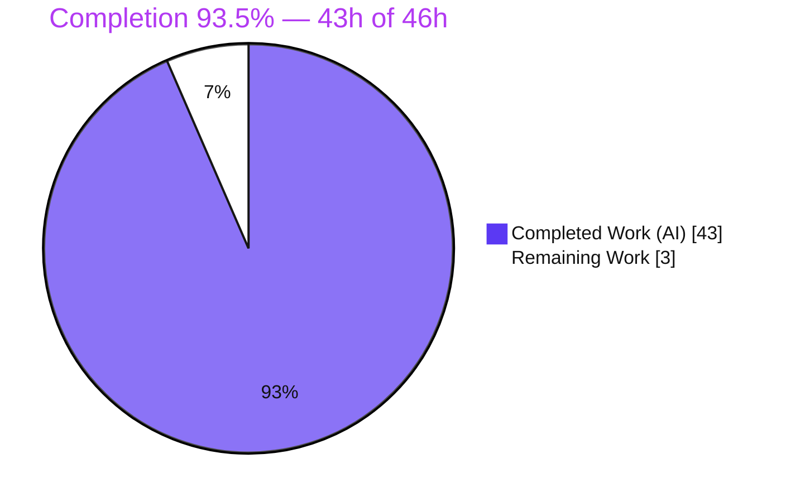
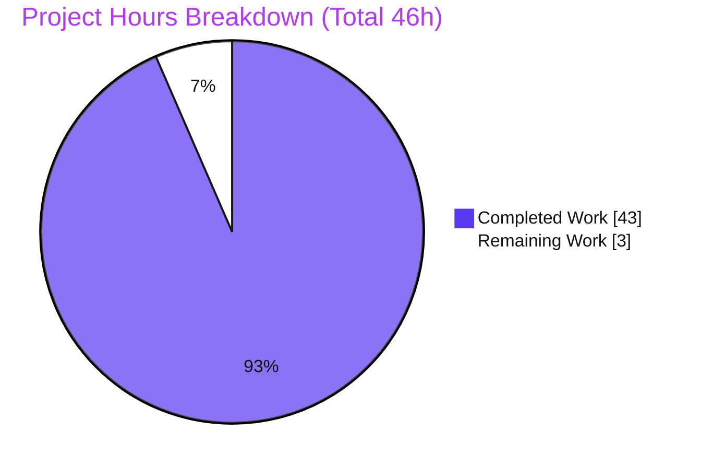
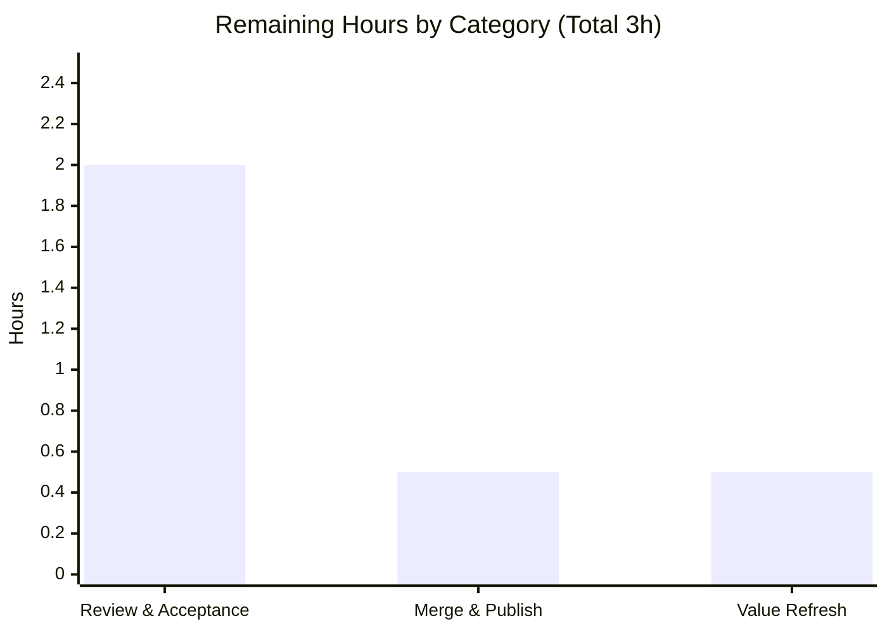

# Blitzy Project Guide — wp-calypso Testing-Infrastructure Onboarding Q&A

> **Deliverable:** `blitzy/documentation/wp-calypso_be7e5cc64162.md` (2,217 lines)
> **Branch:** `blitzy-e67e617f-30bf-4353-8b16-286c2ccf3ffe` · **HEAD:** `339bf8107d` · **Base:** `be7e5cc641`
> **Color legend:** <span style="color:#5B39F3">■ Completed / AI Work = Dark Blue (#5B39F3)</span> · <span style="color:#B23AF2">■ Remaining / Not Completed = White (#FFFFFF)</span>

---

## 1. Executive Summary

### 1.1 Project Overview

This project is a **read-only investigation-and-documentation** task on the wp-calypso monorepo. Its objective is to author one comprehensive, runtime-evidenced markdown Q&A that explains — with reproducible command output and `file:line` citations — how wp-calypso's Jest test environment boots and how it diverges from the normal `yarn start` development runtime. The target users are new contributors onboarding onto the repository. The deliverable answers seven onboarding questions (dev-server boot; test-vs-dev boot; test-only globals/env/polyfills; network isolation; a mock-to-assertion trace; config/feature-flag divergence; and proof that tests resolve different config values than the dev server). No product source code is created or modified.

### 1.2 Completion Status



**Completion: 93.5% complete** — computed from AAP-scoped hours: `43 / (43 + 3) = 43 / 46 = 93.5%`.

| Metric | Hours |
|--------|-------|
| **Total Hours** | 46 |
| **Completed Hours (AI + Manual)** | 43 (43 AI + 0 Manual) |
| **Remaining Hours** | 3 |

### 1.3 Key Accomplishments

- ✅ Single AAP deliverable authored and committed: `blitzy/documentation/wp-calypso_be7e5cc64162.md` (2,217 lines; 12 sections; 2 mermaid diagrams; ~95 `file:line` citations; 51 observed-output code blocks).
- ✅ **All seven onboarding questions (Q1–Q7) answered** with run-first evidence; every named global, env var, polyfill, action type, and flag addressed (final coverage pass table included).
- ✅ Dev server verified booting via `yarn start` (version gate → welcome banner → webpack build → Express SSR via bunyan), serving HTTP 200 on port 3000 with clean shutdown; full 245-line transcript captured (Appendix A of the deliverable).
- ✅ Test-only runtime characterized across three baselines (plain-Node / Jest-node / Jest-jsdom) and all seven Jest suites' `--showConfig` captured.
- ✅ Network isolation demonstrated (`nock.disableNetConnect()` → `NetConnectNotAllowedError`; `global.fetch` Jest mock), including the subtle server-suite undici bypass edge case.
- ✅ Canonical mock-to-assertion test reproduced **2/2 PASS** and traced through the `requestUserSuggestions` thunk; config divergence **proven** (test resolves `false` where dev resolves `true`; 82 flags differ).
- ✅ **Read-only constraint honored perfectly**: `git diff be7e5cc641..HEAD` = 2,217 insertions / 0 deletions across exactly one added file; `git status --porcelain` empty; all probes created under `/tmp` and removed.

### 1.4 Critical Unresolved Issues

| Issue | Impact | Owner | ETA |
|-------|--------|-------|-----|
| _None — no critical or blocking issues identified_ | The sole deliverable is complete, committed at HEAD, and independently validated against live runtime. All documented code paths pass; the repository is byte-for-byte clean. | — | — |

> The only remaining work is **non-blocking path-to-production** (human review, merge, optional value refresh) — see §1.6 and §2.2.

### 1.5 Access Issues

**No access issues identified.** Full repository access is available; the toolchain (Node v22.23.1, yarn 4.0.2) is provisioned and passes the version gate; `yarn install --immutable` succeeds without lockfile mutation. The task requires **no external service credentials or third-party API access** — it is a read-only, offline investigation, and the test runtime blocks outbound network by design (`nock.disableNetConnect()`).

| System/Resource | Type of Access | Issue Description | Resolution Status | Owner |
|-----------------|----------------|-------------------|-------------------|-------|
| wp-calypso repo | Read/Write (branch) | None — full access | ✅ Resolved | — |
| Node/yarn toolchain | Local runtime | None — provisioned & gate passes | ✅ Resolved | — |
| External APIs / credentials | N/A | Not required (read-only, network-isolated) | ✅ N/A | — |

### 1.6 Recommended Next Steps

1. **[High]** Perform a technical review and acceptance of `blitzy/documentation/wp-calypso_be7e5cc64162.md`, using the Coverage-summary table to navigate; spot-check 5–10 `file:line` citations against current source.
2. **[Medium]** Merge and publish the deliverable to mainline so it is discoverable to onboarding contributors.
3. **[Low]** Optionally re-run `yarn start` and the probes to refresh explicitly-disclaimed run-specific values (e.g., `booted in NNNms`, ETag, browserslist advisory age).
4. **[Low]** Consider adding a short cross-link to this document from the repository's testing/onboarding docs index (optional, out of the original AAP scope).

---

## 2. Project Hours Breakdown

### 2.1 Completed Work Detail

Each component traces to a specific AAP requirement (Rxx) established in the requirements inventory. **Total = 43 hours** (matches Completed Hours in §1.2).

| Component | Hours | Description |
|-----------|-------|-------------|
| Environment provisioning & toolchain verification (R1) | 2 | Node ^v22.9.0 / yarn 4.0.2 via corepack, `yarn install --immutable`, `check-node-version --package` gate (EXIT=0). |
| Investigation harness + run-first methodology (R9/R11) | 4 | Outside-tree `jest_probe` harness + extractor to capture globals, network behavior, and config values without touching the tree. |
| Q1 — dev-server boot verification + Appendix A (R2) | 3 | `yarn start` chain executed; 245-line transcript, bunyan startup log, HTTP 200 check, clean shutdown. |
| Q2 — test-vs-dev boot comparison + Appendix B (R3) | 4 | All 7 suites' `--showConfig`; node vs jsdom BOOT probes; config-module swap; distinct-profile analysis. |
| Q3 — test-only globals/env/polyfills (R4) | 4 | Three baselines (plain-Node / Jest-node / Jest-jsdom); field-by-field enumeration of every named item. |
| Q4 — network isolation + suite×transport matrix (R5) | 4 | Unmocked-request error path; `NetConnectNotAllowedError`; `global.fetch` mock; server-suite undici-bypass nuance. |
| Q5 — mock-to-assertion trace (R6) | 3 | Canonical test run (2/2), thunk trace, resolver-picks-node probe, failure-branch probe, all 4 action types. |
| Q6 — config/feature-flag divergence (R7) | 3 | `moduleNameMapper` chain; feature-key counts; live dev-server `configData` extraction. |
| Q7 — config control + 3 divergence proofs (R8) | 5 | `enable`/`disable`, `ENABLE_FEATURES`/`DISABLE_FEATURES`, `ACTIVE_FEATURE_FLAGS`, `jest.mock`; 82-differ ground-truth. |
| Web-search corroboration, coverage pass, ~95 citations, doc assembly (R10/R12) | 2 | nock + Jest-env official-docs corroboration; final coverage pass; citation wiring; markdown assembly. |
| Remediation across 3 rounds (code-review + 2 QA cycles) | 4 | Commits e3ecd5ae34, 898245b064, 339bf8107d; incl. refining "97 differ" → semantically-correct "82 differ". |
| Final independent validation (all paths + citation audit + 5 gates) | 5 | Re-ran every documented path; audited 47 unique cited paths; five production-readiness gates. |
| **Total** | **43** | |

### 2.2 Remaining Work Detail

Each category is a **path-to-production** activity. **Total = 3 hours** (matches Remaining Hours in §1.2 and §7).

| Category | Hours | Priority |
|----------|-------|----------|
| Documentation technical review & acceptance of the Q&A deliverable | 2.0 | High |
| Merge & publish deliverable to mainline | 0.5 | Medium |
| Optional refresh of disclaimed run-specific values | 0.5 | Low |
| **Total** | **3.0** | |

### 2.3 Hours Reconciliation

- **Completed (§2.1) + Remaining (§2.2) = 43 + 3 = 46 = Total Hours (§1.2).** ✅
- **Remaining hours are identical across §1.2, §2.2, and §7 = 3h.** ✅
- **Completion % = 43 / 46 = 93.5%**, used consistently in §1.2, §7, and §8. ✅

---

## 3. Test Results

All entries originate from Blitzy's autonomous validation logs for this project and were independently reproduced during this assessment. This is a documentation task with **no product source code**, so code-coverage targets are not applicable (N/A); the "tests" are the repository test and validation runs that ground the deliverable's claims.

| Test Category | Framework | Total Tests | Passed | Failed | Coverage % | Notes |
|---------------|-----------|-------------|--------|--------|------------|-------|
| Redux action/thunk unit test (Q5 canonical) | Jest 29.7.0 (client suite) | 2 | 2 | 0 | N/A (targeted) | `client/state/user-suggestions/test/actions.js` — reproduced **2/2 PASS**, EXIT=0. |
| Jest suite config resolution | Jest 29.7.0 `--showConfig` | 7 | 7 | 0 | N/A | All 7 suites (client, server, packages, apps, build-tools, integration, e2e) resolve; packages = 58 configs → 9 distinct profiles. |
| Runtime behavioral probes (Q3) | Node + Jest harness | 3 baselines | 3 | 0 | N/A | plain-Node / Jest-node / Jest-jsdom global/env/polyfill baselines match field-for-field. |
| Network isolation matrix (Q4) | Node + Jest + nock 13.5.6 | suite×transport | all reproduced | 0 | N/A | `NetConnectNotAllowedError` on unmocked host; `fetch` mock verified; server-suite undici bypass confirmed. |
| Config-divergence proofs (Q6/Q7) | Node + config module | 3 proofs | 3 | 0 | N/A | test=`false` vs dev=`true`; 82/183 union keys differ (ground-truth via real `isEnabled()`). |

**Aggregate:** the one repository unit test central to the deliverable passes **2 of 2**; all seven suite configurations resolve; all behavioral probes reproduce their documented values. **No failing tests.**

---

## 4. Runtime Validation & UI Verification

- ✅ **Operational** — Dev server boots via `yarn start` (version gate `EXIT=0` → welcome banner → webpack build "Packages are built." / "Ready!" → Express SSR) and serves **HTTP 200** (`X-Powered-By: Express`) at `http://calypso.localhost:3000`.
- ✅ **Operational** — Dev server shuts down cleanly after validation (no lingering processes).
- ✅ **Operational** — Canonical Q5 test (`client/state/user-suggestions/test/actions.js`) passes **2/2**.
- ✅ **Operational** — All 7 Jest suite configs resolve via `--showConfig`.
- ✅ **Operational** — Config divergence proof: `NODE_ENV=test` → `{checkout/checkout-version:false, google-my-business:false}`; `CALYPSO_ENV=development` → `{both:true}`.
- ⚠ **Partial (informational)** — Server-suite native `fetch` (undici) bypasses nock and reaches the network on `fetch` (while `http.get` correctly throws). This is a **test-isolation caveat** the deliverable explicitly documents ("test isolation ≠ production transport security"); it is not a product defect.
- ➖ **UI verification: N/A** — This is a read-only documentation task with no UI feature in scope. The dev server's SSR HTML response (HTTP 200) was confirmed operational, but no visual UI regression testing applies.

---

## 5. Compliance & Quality Review

Cross-mapping AAP deliverables and governing rules to quality/compliance benchmarks. Fixes applied during autonomous validation are noted; there are no outstanding compliance items.

| Benchmark / AAP Rule | Status | Progress | Notes |
|----------------------|--------|----------|-------|
| Read-only source (modify no repo file) | ✅ Pass | 100% | `git diff be7e5cc641..HEAD` = 1 file **added**, 0 source edits. |
| Temp-script hygiene (outside tree + cleaned) | ✅ Pass | 100% | `git status --porcelain` empty; probes under `/tmp` removed. |
| Correct deliverable name/location | ✅ Pass | 100% | `blitzy/documentation/wp-calypso_be7e5cc64162.md` (branch-derived name). |
| Run-first evidence discipline (Rule 1) | ✅ Pass | 100% | ~95 `file:line` citations; 51 observed-output blocks; inferred items labeled. |
| Complete grounded answering — all 7 Qs (Rule 4) | ✅ Pass | 100% | Coverage-summary table gives a direct answer per Q1–Q7. |
| Every named item covered (Rule 4) | ✅ Pass | 100% | All globals/env/polyfills/action-types/flags present (verified by grep counts). |
| Exhaustive edge/condition coverage (Rule 2) | ✅ Pass | 100% | node vs jsdom, unmocked-network error, undici bypass, failure branch. |
| Web-search corroboration (§0.2.2) | ✅ Pass | 100% | nock + Jest test-environment behavior attributed to canonical library semantics. |
| Citation validity | ✅ Pass | 100% | 47 unique cited paths audited — all reference real existing files. |
| Markdown well-formedness | ✅ Pass | 100% | 102 balanced code fences (51 blocks); 2 valid mermaid diagrams. |
| Numerical accuracy | ✅ Pass | 100% | "97 differ" (raw key diff) correctly refined to "82 differ" (isEnabled() value diff); ground-truth confirmed. |
| Dependency policy (no add/update/remove) | ✅ Pass | 100% | AAP §0.4.2 — zero dependency changes. |

**Fixes applied during autonomous validation:** three remediation rounds (code-review remediation, QA findings, QA findings F1–F7) prior to the final validation pass, which required **zero further edits** (all claims provably accurate against live runtime). **Outstanding compliance items: none.**

---

## 6. Risk Assessment

Overall risk profile: **LOW** — expected for a read-only, fully-validated documentation deliverable with no production code.

| Risk | Category | Severity | Probability | Mitigation | Status |
|------|----------|----------|-------------|------------|--------|
| RK1 Documentation drift/staleness (95 citations + feature counts vs an active monorepo) | Technical | Low | Medium | Point-in-time snapshot pinned to commit `be7e5cc641`; re-run probes periodically. | Open (inherent to docs) |
| RK2 Run-specific captured values (booted-in-Nms, ETag, Content-Length, browserslist age) | Technical | Low | Low | Explicitly disclaimed as run-specific in the deliverable. | Mitigated |
| RK3 No product security surface; surfaced test-isolation caveat (server undici bypasses nock) | Security | Informational | Low | Documented as "test isolation ≠ production transport security"; no shipped code/auth/data. | Mitigated / Documented |
| RK4 Reproducibility requires Node ^v22.9.0 + yarn 4.0.2 + 438MB install + slow webpack build | Operational | Low | Medium | Dev Guide (§9) + pinned container image (AAP §0.8.1); Node-22 requirement flagged. | Mitigated |
| RK5 Large 2,217-line review burden | Operational | Low | Medium | Coverage-summary table + per-question structure ease navigation. | Open / Addressed |
| RK6 External-library coupling (nock 13.5.6 / jest 29.7.0 — NetConnectNotAllowedError, jsdom defaults) | Integration | Low | Low | Versions pinned; corroborated against official docs (§0.2.2). | Mitigated |
| RK7 Dev-server boot-chain dependency (gate → welcome → webpack → Express) | Integration | Low | Low | Full Appendix A transcript + `package.json` script citations. | Mitigated |

---

## 7. Visual Project Status

**Project Hours Breakdown** (Completed = Dark Blue #5B39F3, Remaining = White #FFFFFF):



**Remaining Hours by Category** (from §2.2; sums to 3h — matches "Remaining Work" above):



> **Integrity:** "Remaining Work" (3h) equals §1.2 Remaining Hours and the sum of §2.2 "Hours" (2.0 + 0.5 + 0.5 = 3.0). "Completed Work" (43h) equals §1.2 Completed Hours and the sum of §2.1 "Hours".

---

## 8. Summary & Recommendations

**Achievements.** The project delivered its single AAP artifact — a 2,217-line, runtime-evidenced onboarding Q&A — that comprehensively answers all seven onboarding questions about wp-calypso's Jest test infrastructure versus the development runtime. Every behavioral claim is grounded in captured command output and `file:line` citations, and the read-only + temp-script-hygiene constraints were honored perfectly (the repository is byte-for-byte clean).

**Completion.** Measured against AAP scope using the hours-based methodology, the project is **93.5% complete (43h of 46h)**. All 14 investigative/authoring AAP requirements are complete and independently validated against live runtime; the remaining 3h is entirely non-blocking path-to-production work.

**Remaining gaps & critical path.** The critical path to "production" (publication) is short: (1) a human technical review & acceptance of the document (2h), (2) merge & publish (0.5h), and (3) an optional refresh of explicitly-disclaimed run-specific values (0.5h). There are no compilation errors, no failing tests, and no blocking issues.

**Success metrics.** Q5 canonical test passes 2/2; all 7 suite configs resolve; config divergence is proven (82/183 union flags differ, ground-truth confirmed); dev server serves HTTP 200 and shuts down cleanly; all 47 cited file paths exist.

**Production-readiness assessment.** The deliverable is **production-ready pending human acceptance**. Confidence is **High** for the well-defined, reproduced items (Q1, Q4–Q7, environment, read-only compliance) and **High** overall given the independent validation pass required zero edits. The one item to communicate to reviewers is the informational server-suite undici/nock caveat, which the document already surfaces accurately.

| Metric | Value |
|--------|-------|
| AAP-scoped completion | 93.5% (43h / 46h) |
| AAP requirements completed | 14 of 14 investigative/authoring items |
| Blocking issues | 0 |
| Failing tests | 0 |
| Repository cleanliness | `git status --porcelain` empty |

---

## 9. Development Guide

How to build, run, and reproduce the evidence behind the deliverable. All commands below were executed successfully in the validation environment (Node v22.23.1, yarn 4.0.2).

### 9.1 System Prerequisites

- **Node.js** `^v22.9.0` (repository `.nvmrc` pins `22.9.0`). **Node 20 fails** the `yarn start` version gate — Node 22.x is required (AAP §0.8.1).
- **yarn** `4.0.2` (repository `packageManager: yarn@4.0.2`), enabled via corepack.
- **git**, a POSIX shell, ~438 MB free for the working tree plus space for `node_modules`.
- OS: Linux or macOS (validated on Ubuntu). No external service credentials required.

### 9.2 Environment Setup

```bash
# Enable the pinned yarn via corepack
corepack enable
corepack prepare yarn@4.0.2 --activate

# Check out the deliverable branch
git checkout blitzy-e67e617f-30bf-4353-8b16-286c2ccf3ffe

# Verify toolchain (expected: v22.x and 4.0.2)
node --version
yarn --version
```

No environment variables are required for the read-only investigation: the dev server defaults to `CALYPSO_ENV=development`, and Jest injects `NODE_ENV=test` + `TZ=UTC` internally.

### 9.3 Dependency Installation

```bash
# Immutable install (no lockfile mutation). Expected: exit code 0.
CI=true yarn install --immutable
```

### 9.4 Application Startup (Q1)

```bash
# Full chain: version gate -> welcome banner -> webpack build -> Express SSR (bunyan)
# 'start' = npx check-node-version --package && node bin/welcome.js && yarn run build && yarn run start-build
yarn start

# If the build already exists, serve directly:
# 'start-build' = BROWSERSLIST_ENV=evergreen node build/server.js | bunyan -o short
yarn run start-build
```

The server listens on **port 3000** (`config/development.json`). The first webpack build takes several minutes — this is expected.

### 9.5 Verification Steps

```bash
# Version gate (expected: exit code 0)
npx check-node-version --package; echo "EXIT=$?"

# Dev server health (expected: HTTP/1.1 200 OK, X-Powered-By: Express)
curl -sI http://calypso.localhost:3000 | head -n 5

# View the deliverable
sed -n '1,60p' blitzy/documentation/wp-calypso_be7e5cc64162.md
```

### 9.6 Example Usage — Reproduce the Evidence

```bash
# Q5 — canonical mock-to-assertion test (expected: 2 passed)
TZ=UTC node node_modules/jest-cli/bin/jest.js \
  -c=test/client/jest.config.js \
  client/state/user-suggestions/test/actions.js

# Q2 — resolve any suite's configuration
TZ=UTC node node_modules/jest-cli/bin/jest.js \
  -c=test/client/jest.config.js --showConfig

# Q6/Q7 — config-divergence proof (run OUTSIDE the tree, then remove)
cat > /tmp/cfg_probe.js <<'EOF'
const path = require('path');
const cfg = require(path.join(process.argv[2], 'client/server/config/index.js'));
const isEnabled = cfg.isEnabled || (cfg.default && cfg.default.isEnabled);
const flags = ['checkout/checkout-version','google-my-business'];
const out = {};
for (const f of flags) out[f] = isEnabled(f);
console.log(JSON.stringify(out));
EOF
echo "test:" $(NODE_ENV=test node /tmp/cfg_probe.js "$PWD")
echo "dev :" $(CALYPSO_ENV=development NODE_ENV=development node /tmp/cfg_probe.js "$PWD")
rm -f /tmp/cfg_probe.js

# Confirm the tree is still clean (read-only discipline)
git status --porcelain --untracked-files=all
```

Expected divergence output: test → `{"checkout/checkout-version":false,"google-my-business":false}`; dev → `{"checkout/checkout-version":true,"google-my-business":true}`.

### 9.7 Troubleshooting

- **`check-node-version` fails / gate error:** you are likely on Node 20. Switch to Node 22.x (`corepack`/`nvm use 22`).
- **Browserslist "browsers data is N months old" advisory:** benign; the deliverable discloses it. No action needed for investigation.
- **First `yarn start` is slow:** the webpack build legitimately takes several minutes; wait for "Packages are built." / "Ready!".
- **Full suite runs:** `yarn test-client` (`TZ=UTC jest -c=test/client/jest.config.js`) and `yarn test-server` are available; scope to a path to keep runs fast.
- **Keep the tree clean:** create any scratch scripts under `/tmp`, remove them, and confirm `git status --porcelain` is empty afterward.

---

## 10. Appendices

### Appendix A — Command Reference

| Purpose | Command |
|---------|---------|
| Enable pinned yarn | `corepack enable && corepack prepare yarn@4.0.2 --activate` |
| Install deps (immutable) | `CI=true yarn install --immutable` |
| Version gate | `npx check-node-version --package` |
| Start dev server (full chain) | `yarn start` |
| Serve prebuilt server | `yarn run start-build` |
| Run canonical Q5 test | `TZ=UTC node node_modules/jest-cli/bin/jest.js -c=test/client/jest.config.js client/state/user-suggestions/test/actions.js` |
| Show a suite config | `TZ=UTC node node_modules/jest-cli/bin/jest.js -c=test/<suite>/jest.config.js --showConfig` |
| Full client suite | `yarn test-client` |
| Full server suite | `yarn test-server` |
| Verify read-only cleanliness | `git status --porcelain --untracked-files=all` |
| Verify only-one-file-added | `git diff --name-status be7e5cc641..HEAD` |

### Appendix B — Port Reference

| Port | Service | Source |
|------|---------|--------|
| 3000 | Calypso dev server (Express SSR) at `http://calypso.localhost:3000` | `config/development.json` |

### Appendix C — Key File Locations

| Path | Role |
|------|------|
| `blitzy/documentation/wp-calypso_be7e5cc64162.md` | **The sole deliverable** (2,217 lines) |
| `package.json` | `scripts.start` / `start-build` / `test-*`, `engines`, `packageManager` (Q1/Q2) |
| `bin/welcome.js` | Welcome banner emitted by `yarn start` (Q1) |
| `test/client/jest.config.js` | Client suite: config swap, `testEnvironmentOptions.url`, `setupFiles`, `globals` (Q2/Q3/Q6) |
| `test/server/jest.config.js` | Server suite: config swap + setup (Q2/Q6) |
| `test/{packages,apps,build-tools,integration,e2e}/jest.config.js` | Remaining five suites (Q2/Q4) |
| `test/client/setup-test-framework.js` | Test-only globals/polyfills + `nock.disableNetConnect()` (Q3/Q4) |
| `test/server/setup-test-framework.js` | Server nock lifecycle + `wpcom-proxy-request` mock (Q3/Q4) |
| `packages/calypso-jest/jest-preset.js` | Base `testEnvironment: 'node'`, `testMatch`, transforms, resolver (Q2/Q3) |
| `packages/calypso-jest/src/setup.js` | Base `setupFilesAfterEnv` (`global.CSS.supports`) (Q3) |
| `client/server/config/{index.js,parser.js}` | Env resolution + merge/override of feature flags (Q6/Q7) |
| `config/{_shared,development,test}.json` | Base / dev / test feature-flag values (Q6/Q7) |
| `packages/calypso-config/src/index.ts` | Browser config (dev-server path, reads `window.configData`) (Q6) |
| `packages/create-calypso-config/src/index.ts` | Core `config`/`isEnabled` factory + `ACTIVE_FEATURE_FLAGS` (Q6/Q7) |
| `client/state/user-suggestions/{test/actions.js,actions.js,test/sample-response.json}` | Q5 mock-to-assertion example |
| `client/lib/wp/{browser.js,node.js}` | `wpcom` data layer invoked by the thunk (Q5) |

### Appendix D — Technology Versions

| Component | Version | Source |
|-----------|---------|--------|
| Node.js | v22.23.1 (satisfies `^v22.9.0`) | runtime; `engines.node` |
| yarn | 4.0.2 | `packageManager` |
| Jest | 29.7.0 | `devDependencies.jest` |
| nock | 13.5.6 | `devDependencies.nock` |
| bunyan | 1.8.15 | `dependencies.bunyan` |
| check-node-version | ^4.0.2 | `devDependencies` |
| jest-canvas-mock | 2.5.2 | `devDependencies` |
| resize-observer-polyfill | 1.5.1 | `devDependencies` |

### Appendix E — Environment Variable Reference

| Variable | Value (context) | Effect |
|----------|-----------------|--------|
| `CALYPSO_ENV` | `development` (dev server) | Selects `config/development.json`-derived `window.configData`. |
| `NODE_ENV` | `test` (Jest) | Config module resolves `config/test.json`; standard test mode. |
| `TZ` | `UTC` (Jest) | Deterministic timezone during test execution. |
| `BROWSERSLIST_ENV` | `evergreen` (`start-build`) | Targets evergreen browsers for the server build. |
| `CI` | `true` (install/CI) | Non-interactive install/test behavior. |
| `ENABLE_FEATURES` / `DISABLE_FEATURES` | (test control) | Runtime feature-flag overrides used by tests (Q7). |

### Appendix F — Developer Tools Guide

- **Jest** (`node_modules/jest-cli/bin/jest.js`): run suites/tests, `--showConfig` to resolve a suite's effective configuration, `--verbose` for per-test detail.
- **nock 13.5.6**: HTTP interception; `nock.disableNetConnect()` enforces isolation (unmocked host → `NetConnectNotAllowedError`); `nock.cleanAll()` / `nock.restore()` / `nock.activate()` for lifecycle.
- **bunyan**: pretty-prints the dev server's JSON logs (`| bunyan -o short`).
- **git**: `git diff --name-status be7e5cc641..HEAD` (confirm one added file), `git status --porcelain` (confirm cleanliness).

### Appendix G — Glossary

| Term | Meaning |
|------|---------|
| **AAP** | Agent Action Plan — the governing specification for this task. |
| **SSR** | Server-Side Rendering — the Express server (`build/server.js`) that `yarn start` boots. |
| **Thunk** | A Redux action creator returning a function (used by `requestUserSuggestions`) for async dispatch. |
| **`moduleNameMapper`** | Jest config that redirects `@automattic/calypso-config` to the server config module during tests. |
| **`NetConnectNotAllowedError`** | Error thrown by nock when a request targets a host with no matching interceptor while net-connect is disabled. |
| **jsdom** | Browser-like Jest test environment (opt-in per file via `/** @jest-environment jsdom */`); `node` is the default. |
| **undici** | Node's built-in `fetch` implementation; on the server suite it bypasses nock (documented test-isolation caveat). |
| **Path-to-production** | Standard activities (here: review, merge, optional refresh) required to publish the AAP deliverable. |
