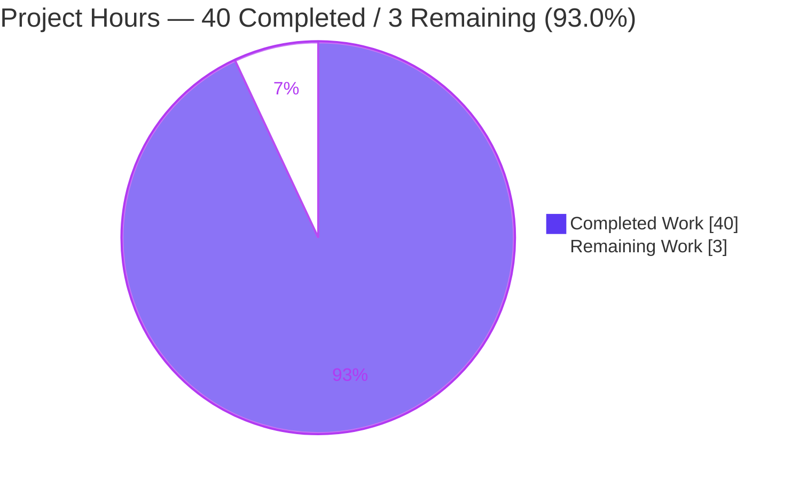
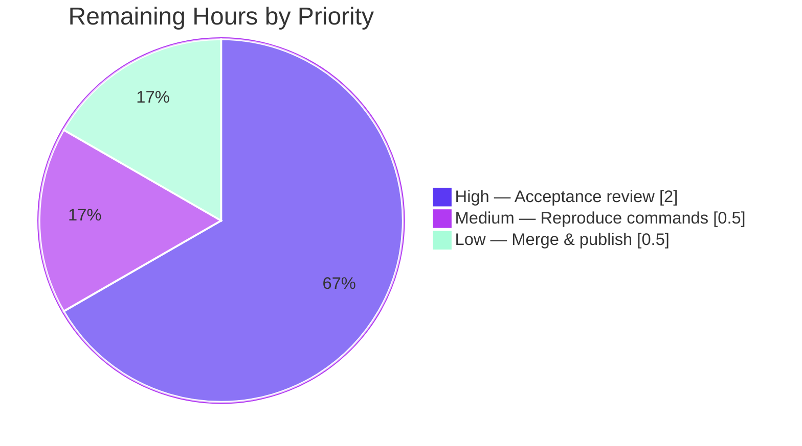
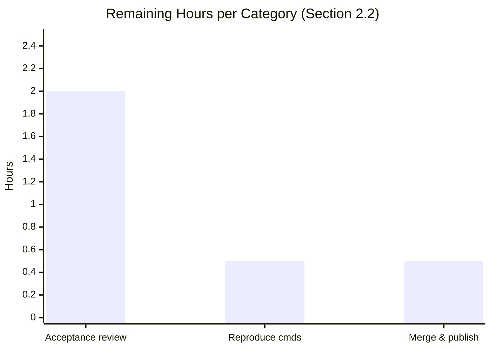

# Blitzy Project Guide

**Project:** Runtime-Verified Caching/Memoization Investigation — `@automattic/state-utils` `createSelector` & `@automattic/tree-select` `treeSelect`
**Repository:** Automattic/wp-calypso (Yarn 4 workspace monorepo)
**Branch:** `blitzy-64bf13a0-1c21-47d0-8559-7d98eb34ed67` (base `wp-calypso_be7e5cc64162` @ `be7e5cc641`)
**Deliverable:** `blitzy/documentation/wp-calypso_be7e5cc64162.md`
**Task Type:** Documentation — read-only investigation-and-documentation (Q&A)

> **Blitzy brand color legend** — <span style="color:#5B39F3">**Completed / AI Work = Dark Blue `#5B39F3`**</span> · **Remaining / Not Completed = White `#FFFFFF`** · Headings/Accents = Violet-Black `#B23AF2` · Highlight = Mint `#A8FDD9`.

---

## 1. Executive Summary

### 1.1 Project Overview

This project answers a developer's six precise questions about the caching/memoization behavior of the monorepo's state-management selector utilities, diagnosing why a component that reads filtered data from the central store observes **stale results after the data changed**. The repository ships two memoized-selector utilities that jointly manifest the probed behaviors — `createSelector` (`@automattic/state-utils`, 96 importers) and `treeSelect` (`@automattic/tree-select`, 10 importers) — so the investigation spans both. Following a strict *run-the-code-first, read-only* methodology, Blitzy built and ran the existing Jest harnesses, added temporary instrumentation probes, captured real runtime output, and consolidated the evidence into a single runtime-grounded answer document. No source, test, or configuration file was modified.

### 1.2 Completion Status


| Metric | Hours |
|--------|------:|
| **Total Hours** | **43** |
| Completed Hours (AI) | 40 |
| Completed Hours (Manual) | 0 |
| **Completed Hours (AI + Manual)** | **40** |
| **Remaining Hours** | **3** |
| **Percent Complete** | **93.0%** |

> Completion is computed strictly from AAP-scoped hours (PA1): `40 ÷ (40 + 3) = 93.0%`. All 15 AAP-scoped work items are complete; the remaining 3 hours are **human acceptance activities only** (review, reproduce, merge) — there is no deployable software and no incomplete autonomous engineering work.

### 1.3 Key Accomplishments

- ✅ Single mandated deliverable created: `blitzy/documentation/wp-calypso_be7e5cc64162.md` (1,518 lines, ~10,900 words, 81 file:line citations, 64 code/evidence blocks).
- ✅ All **six** user questions answered explicitly — each for **both** `createSelector` **and** `treeSelect` — with Direct answer / Mechanism (named functions + exact lines) / Observed evidence (exact command + output) / Cause→effect.
- ✅ **Stale-results root cause reproduced at runtime**: in-place state mutation keeps the dependant reference-equal → `isShallowEqual` reports "no change" → the `lodash` cache is not cleared → the previously memoized value is returned (`r1 === r2` true, selector called only once); switching to an immutable replacement fixes it.
- ✅ **Concrete call counts captured at stated scale (N = 1000) and confirmed stable across two runs**: HIT → 1, MISS → 1000, one-dependant-change → 2, for both utilities.
- ✅ Edge/boundary conditions exercised: nullish (`null`/`undefined` → shared `NULLISH_KEY`) vs. non-null primitives (`0`, `false`, `1`, `'a'` → `TypeError`) for `treeSelect`; tolerant shallow-equality for `createSelector`.
- ✅ Custom cache-key generation demonstrated for both utilities (default `args.join()` override), including the dev-mode complex-argument warning (`createSelector`) and throw (`treeSelect`).
- ✅ Baseline suites independently re-verified: **2 suites / 30 tests pass**; temporary probes created, run twice, then **deleted**; repository left **byte-for-byte unchanged** (only the one document added).
- ✅ Third-party semantics validated by research (`lodash` `memoize` cache mechanics; `@wordpress/is-shallow-equal` member-wise `===`).

### 1.4 Critical Unresolved Issues

| Issue | Impact | Owner | ETA |
|-------|--------|-------|-----|
| _None blocking._ All AAP-scoped work is complete and validated. | No release blocker. | — | — |
| (Advisory) Stale-results diagnosis should be confirmed against the reviewer's *actual* mutating component | Ensures the documented cause maps to the real symptom | Requesting developer | Within review (Risk T3) |
| (Advisory) `tree-select` README signature discrepancy remains (documented, not fixed — out of scope) | Could keep confusing callers | `tree-select` maintainers | Maintainer backlog |

### 1.5 Access Issues

| System/Resource | Type of Access | Issue Description | Resolution Status | Owner |
|-----------------|----------------|-------------------|-------------------|-------|
| — | — | **No access issues identified.** The task is fully self-contained; the repository, toolchain (Node 22 / Yarn 4.0.2), and pre-warmed `node_modules` were all available, and both Jest suites executed without credentials or external services. | N/A | — |

### 1.6 Recommended Next Steps

1. **[High]** Perform acceptance review of `blitzy/documentation/wp-calypso_be7e5cc64162.md` — confirm all six questions are answered for both utilities and that the stale-results diagnosis matches the real symptom. (~2.0h)
2. **[Medium]** Independently reproduce the documented commands (baseline suite → 2 suites / 30 tests; optionally recreate the Appendix A.3/A.4 probes) to reconfirm the runtime numbers. (~0.5h)
3. **[Low]** Approve and merge the PR; confirm the working tree remains clean and only the one file is added. (~0.5h)
4. **[Advisory]** Apply the immutability fix to the real component (out of AAP scope; the documented cause points directly to it).
5. **[Advisory]** File a maintainer ticket to correct the `tree-select` README signature snippets (out of AAP scope).

---

## 2. Project Hours Breakdown

### 2.1 Completed Work Detail

All completed work was performed autonomously by Blitzy agents (AI). Each component traces to an AAP requirement (Section 0.3.1 / 0.5.1) or the read-only methodology rules (Section 0.7).

| Component | Hours | Description |
|-----------|------:|-------------|
| Environment provisioning & baseline test harness | 2.0 | Corepack + Yarn 4.0.2 activation, `yarn install` (3,176 packages), run both suites via root harness → 2 suites / 30 tests baseline |
| Source-code comprehension (both utilities) | 4.0 | Read `create-selector/index.ts` (113 L), `tree-select/src/index.ts` (131 L), both test suites (291/266 L), and READMEs to map `isShallowEqual`, `lodash` `memoize`, `WeakMap`/`Map` tree, `NULLISH_KEY`, `insertDependentKey`, `getCacheKey` |
| Temporary instrumentation probe scripts | 4.0 | Two probe specs (~164 L + ~147 L) modeled on the suites' `jest.fn()` spy pattern, wrapping the real selector in call counters |
| Q1 — comparison-mechanism investigation | 2.0 | Trace hit/miss decision for both utilities (shallow-equal + `args.join()` vs. reference-identity `WeakMap`/`Map` tree) |
| Q2 — concrete call-count investigation | 2.5 | Run at scale N = 1000, capture HIT/MISS/recompute counts, confirm two-run stability |
| Q3 — per-argument vs. invalidation + stale reproduction | 3.0 | Per-arg coexistence vs. whole-cache flush; reproduce stale value via in-place mutation vs. immutable replacement |
| Q4 — programmatic-clearing investigation | 1.5 | `treeSelect.clearCache()` and `selector.memoizedSelector.cache.clear()` with before/after cache state |
| Q5 — nullish vs. primitive dependents | 2.0 | `null`/`undefined` → shared `NULLISH_KEY`; non-null primitives (incl. `0`/`false`) → `TypeError`; `createSelector` tolerance |
| Q6 — custom cache-key generation | 2.0 | Custom `getCacheKey` for both; default-key warning (`createSelector`) and throw (`treeSelect`) on object args |
| Third-party semantics web research | 1.0 | Validate `lodash` `memoize` cache mechanics and `@wordpress/is-shallow-equal` comparison semantics |
| Evidence capture & 2-run stability | 2.0 | Capture complete unedited output for both runs + diff (Appendix A.5) |
| Answer document authoring | 8.0 | Compose the 1,518-line deliverable: TL;DR, §1–§5, Q1–Q6, summary table, 81 citations, cause→effect reasoning |
| Known-discrepancy documentation | 1.0 | Investigate & document the `tree-select` README signature mismatch (noted, not fixed) |
| Cleanup & read-only compliance | 1.0 | Delete both probe specs; verify `git status` clean and tracked tree byte-for-byte unchanged |
| Final independent validation & correction | 4.0 | Re-run all paths byte-for-byte, verify ~40 citations, correct importer count 94 → 96, re-confirm 30/30 |
| **Total Completed** | **40.0** | |

### 2.2 Remaining Work Detail

All remaining work is human path-to-acceptance for a documentation deliverable (there is no deployable software).

| Category | Hours | Priority |
|----------|------:|----------|
| Acceptance review of answer document (read end-to-end; confirm 6 Qs × 2 utilities; validate stale-results diagnosis vs. real symptom) | 2.0 | High |
| Independent reproduction of documented commands (baseline suite → 2 suites / 30 tests; optional probe re-run) | 0.5 | Medium |
| PR merge & publish (approve; confirm clean tree + single added file) | 0.5 | Low |
| **Total Remaining** | **3.0** | |

> **Advisory (0 counted hours, out of AAP scope per §0.3.2):** applying the immutability fix to the requesting developer's real component, and correcting the `tree-select` README signature snippets, are explicitly excluded from this read-only task and therefore carry no hours here.

### 2.3 Hours Reconciliation

| Check | Value | Result |
|-------|-------|--------|
| Section 2.1 total (Completed) | 40.0h | — |
| Section 2.2 total (Remaining) | 3.0h | — |
| 2.1 + 2.2 = Total Project Hours (Section 1.2) | 40 + 3 = 43h | ✅ Match |
| Remaining hours: 1.2 ↔ 2.2 ↔ 7 | 3h everywhere | ✅ Match |
| Completion % = 40 ÷ 43 | 93.0% | ✅ Consistent |

---

## 3. Test Results

All tests below originate from Blitzy's autonomous validation logs for this project. Both suites are the packages' **own** existing Jest suites, executed unchanged through the root harness; the transient probe suites were created for observation and then removed.

| Test Category | Framework | Total Tests | Passed | Failed | Coverage % | Notes |
|---------------|-----------|------------:|-------:|-------:|-----------:|-------|
| Unit / behavioral — `createSelector` | Jest 29.7.0 (jest-circus) | 13 | 13 | 0 | N/A¹ | `packages/state-utils/src/create-selector/test/index.js`; incl. `toHaveBeenCalledTimes(1)`/`(2)`, custom-cache-key `CUSTOM2916284`, complex-arg warning ×3 |
| Unit / behavioral — `treeSelect` | Jest 29.7.0 (jest-circus) | 17 | 17 | 0 | N/A¹ | `packages/tree-select/test/index.js`; incl. simultaneous-dependent cache, `clearCache()`, nullish memoization, primitive-`TypeError`, `getCacheKey` |
| **Baseline total** | **Jest** | **30** | **30** | **0** | **N/A¹** | 2 suites; ~0.8s; independently re-run this session → identical result |
| Transient probe suites (removed) | Jest 29.7.0 | 2 per run | 2 per run | 0 | N/A | 2 probe specs, run **twice**; both runs `2 passed / 2 total`; output byte-identical except the Jest `Time:` line (Appendix A.5) |

> ¹ Formal coverage instrumentation (`--coverage`) was **not** part of this read-only investigation; the AAP required concrete call counts and behavioral evidence, not a coverage target. The 30 baseline tests exercise every documented code path (hit/miss, whole-cache clear, `clearCache()`, nullish/primitive, custom keys).

**Concrete runtime counts captured (N = 1000, stable across 2 runs), for both utilities:**

| Scenario | `createSelector` | `treeSelect` |
|----------|:----------------:|:------------:|
| 1000 identical calls (cache hit) | 1 | 1 |
| 1000 distinct-key calls (cache miss each) | 1000 | 1000 |
| 2 calls, arg fixed, one dependant/dependent reference change | 2 | 2 |

---

## 4. Runtime Validation & UI Verification

This is a headless library/documentation task — there is **no UI** and **no runtime service** to verify. Validation was performed by executing the real utilities through their canonical entry points.

- ✅ **Operational** — Baseline Jest suites execute cleanly: `2 passed, 2 total` suites / `30 passed, 30 total` tests (~0.8s), independently re-confirmed this session.
- ✅ **Operational** — Canonical entry points exercised: `createSelector(...)` and `treeSelect(...)` invoked directly (no debug hooks, fallbacks, or synthetic stand-ins).
- ✅ **Operational** — Q2 call counts reproduced at scale N = 1000 and **stable across two runs** (HIT 1 / MISS 1000 / one-change 2).
- ✅ **Operational** — Stale-results condition reproduced: in-place mutation → `r1 === r2` true, selector called once; immutable replacement → selector called twice.
- ✅ **Operational** — `treeSelect` edge paths: `null`/`undefined` collapse to one `NULLISH_KEY` entry; `[true, 1, 'a', false, '', 0]` each throw `TypeError: key must be an object, ` `null` `, or ` `undefined` `.
- ✅ **Operational** — Custom cache keys: `createSelector` produces entry `CUSTOM2916284`; `treeSelect` `getCacheKey` makes two distinct query objects share one memoized result.
- ✅ **Operational** — Dev-mode guards active under Jest (`NODE_ENV=test`): `createSelector` warns ×3 on complex args; `treeSelect` throws on object args under the default key.
- ⚠ **Partial (advisory)** — The stale-results *mechanism* is proven, but mapping it to the reviewer's specific component still requires human confirmation (Risk T3).
- ✅ **Operational** — API integration outcomes: not applicable (no external/network integrations; `treeSelect`'s only runtime dependency is `tslib`).

**No UI screenshots apply** — the deliverable is a Markdown document; there is no rendered application surface to capture.

---

## 5. Compliance & Quality Review

Cross-mapping AAP deliverables and governing rules (§0.7) to Blitzy's quality benchmarks. Fixes applied during autonomous validation are noted.

| AAP / Rule Requirement | Benchmark | Status | Evidence / Notes |
|------------------------|-----------|:------:|------------------|
| Exactly one new Markdown doc, branch-named, in `blitzy/documentation/` (§0.7.1) | Deliverable rule | ✅ Pass | `git diff be7e5cc641 HEAD --name-status` → `A blitzy/documentation/wp-calypso_be7e5cc64162.md` |
| No source added other than the answer doc (§0.7.1) | Deliverable rule | ✅ Pass | Only 1 file added; source impls byte-identical to base |
| Run the code first; write from observed output (§0.7.2) | Methodology | ✅ Pass | Probes executed; complete unedited output embedded (Appendix A.5) |
| State run scale + confirm stability for frequency Q (§0.7.2) | Methodology | ✅ Pass | Q2 N = 1000, stable across 2 runs |
| Reproduce the reported inconsistency, don't stabilize it away (§0.7.2) | Methodology | ✅ Pass | Stale value reproduced via in-place mutation (Q3) |
| Exercise real entry points, not bypasses/stand-ins (§0.7.2) | Methodology | ✅ Pass | Canonical `createSelector`/`treeSelect` used; non-canonical values labeled |
| Exercise every implied condition incl. edges (§0.7.2) | Methodology | ✅ Pass | nullish, `undefined`, number, boolean (`0`/`false`), object arg, custom key all covered |
| Observe before/during/after for state changes (§0.7.2) | Methodology | ✅ Pass | Cache before/after `clearCache()` and after dependant change (Q4) |
| Complete, unedited output + exact command per claim (§0.7.3) | Evidence | ✅ Pass | 64 code/evidence blocks; Appendix A.5 full 2-run logs |
| Exact grounding: values + file:line + named function (§0.7.3) | Evidence | ✅ Pass | 81 file:line citations; spot-checked ~40 — all accurate |
| Answer every part incl. "e.g." items (§0.7.3) | Answer quality | ✅ Pass | numbers **and** booleans both exercised (Q5) |
| No modification to any existing file (§0.7.4) | Read-only scope | ✅ Pass | `git status --porcelain` empty |
| Temporary scripts removed afterward (§0.7.4) | Read-only scope | ✅ Pass (fixed) | Probes deleted; absent from tracked tree |
| Numeric accuracy of stated facts | Quality | ✅ Pass (fixed) | Importer count corrected 94 → 96 during validation (commit `263b6e3536`) |
| Known discrepancy documented, not fixed (§0.3.2) | Scope discipline | ✅ Pass | `tree-select` README signature mismatch recorded in §3 |
| Pre-commit hook / lint | Quality gate | ✅ Pass | Hook ran and passed (Markdown excluded from lint filter) |

**Overall compliance:** 16 / 16 requirements pass. Two items required a fix during autonomous validation (temporary-script removal and the 94 → 96 importer-count correction); both are resolved.

---

## 6. Risk Assessment

| Risk | Category | Severity | Probability | Mitigation | Status |
|------|----------|:--------:|:-----------:|------------|:------:|
| T1 — Runtime findings could be environment-specific (Node/Jest version) | Technical | Low | Low | Exact toolchain documented (Node v22.23.1, Yarn 4.0.2, Jest 29.7.0); independently reproduced; 2-run stable | Mitigated |
| T2 — Dev-mode guards (Q6 warn/throw) only fire when `NODE_ENV ≠ production` | Technical | Low | Medium | Deliverable §1 explicitly notes guards are active under Jest test env; behavior in prod builds documented | Documented |
| T3 — Stale-results diagnosis may not map 1:1 to the reviewer's actual component mutation pattern | Technical | Medium | Low | Mechanism proven at runtime; reviewer to confirm against their code during acceptance | Open |
| S1 — Security exposure introduced by the change | Security | None | N/A | Doc-only; no source/dependency/config change; no secrets, auth, or data handling | Not applicable |
| O1 — Temporary probe scripts left in the repository | Operational | Low | Low | Probes deleted; `git status` clean; `.cache` transform artifacts are git-ignored | Resolved |
| O2 — Reproducibility depends on `node_modules`/`yarn install`; `caniuse-lite` 17 months old | Operational | Low | Low | Cosmetic Browserslist warning only; 30/30 tests pass regardless; optional `update-browserslist-db` noted | Mitigated |
| I1 — `tree-select` README signature discrepancy continues to mislead callers | Integration/Docs | Medium | Medium | Documented as an observation (§3); correction is out of scope; flagged for maintainers | Open |
| I2 — A sub-question could be left unaddressed | Integration/Docs | Low | Low | All 6 Qs × both utilities; every "e.g." clause and boundary case (`0`/`false`) covered | Mitigated |
| I3 — Numeric-claim drift (e.g., importer count) | Integration/Docs | Low | Low | Validator re-verified ~40 citations + all runtime numbers byte-for-byte; 94 → 96 corrected | Resolved |

**Risk posture:** Low overall. No security or release-blocking risks. The two Open items (T3, I1) are inherently human/maintainer decisions outside this read-only task's scope.

---

## 7. Visual Project Status

**Project hours breakdown** (Completed = Dark Blue `#5B39F3`; Remaining = White `#FFFFFF`):



**Remaining work by priority** (total = 3h, matches Section 1.2 Remaining and Section 2.2):



**Remaining hours per category (bar view, optional):**



> **Integrity check:** "Remaining Work" = **3h** in the pie above == Section 1.2 Remaining Hours (3h) == Section 2.2 "Hours" column sum (2.0 + 0.5 + 0.5 = 3h). "Completed Work" = **40h** == Section 2.1 total.

---

## 8. Summary & Recommendations

**Achievements.** The project is **93.0% complete** (40 of 43 AAP-scoped hours). Blitzy delivered a single, comprehensive, runtime-verified answer document (1,518 lines, 81 citations) that answers all six user questions for **both** selector utilities, strictly read-only. The centerpiece — the developer's "stale results after the data changed" symptom — was diagnosed and **reproduced at runtime**: `createSelector` returns a stale value when state is mutated in place because the shallow-compared dependant stays reference-equal, so `isShallowEqual` reports no change and the `lodash` cache is never cleared. Concrete call counts were captured at scale (N = 1000) and confirmed stable across two runs.

**Remaining gaps.** The outstanding 3 hours are **human acceptance activities only** — read-through review, optional command reproduction, and PR merge. No autonomous engineering work remains; the repository is byte-for-byte unchanged apart from the one mandated file, and the baseline suites pass 30/30.

**Critical path to production.** (1) A senior engineer reviews the document against the six questions and confirms the diagnosis matches the real symptom; (2) optionally reproduces the documented commands; (3) merges the PR. Because the deliverable is documentation rather than deployable software, there is no build/deploy/monitoring path — "production" means the accepted, merged answer.

**Success metrics.**

| Metric | Target | Actual | Status |
|--------|--------|--------|:------:|
| User questions answered (× both utilities) | 6 / 6 | 6 / 6 | ✅ |
| Baseline tests passing | 100% | 30 / 30 (100%) | ✅ |
| Q2 stability across ≥2 runs | Stable | Stable (N = 1000) | ✅ |
| Files modified outside deliverable | 0 | 0 | ✅ |
| Citation accuracy (spot-check) | High | ~40/40 verified | ✅ |

**Production-readiness assessment.** **Ready for human acceptance.** All five autonomous production-readiness gates passed (tests, runtime validation, zero unresolved errors, in-scope deliverable validated, dependencies/compilation). Recommendation: proceed to acceptance review and merge; separately (out of scope) apply the immutability fix to the affected component and file a maintainer ticket for the README discrepancy.

---

## 9. Development Guide

> Every command below was executed during validation and produced the stated output. Run from the repository root.

### 9.1 System Prerequisites

- **OS:** Linux, macOS, or Windows (WSL2). Validated on Ubuntu 25.10 container.
- **Node.js:** `^v22.9.0` (repo `engines`); `.nvmrc` pins `22.9.0`. Validated on **v22.23.1**.
- **Corepack:** `0.34.6` (bundled with Node 22) — provisions Yarn.
- **Yarn:** `4.0.2` (repo `packageManager: yarn@4.0.2`).
- **Git** + **Git LFS**.
- **Disk:** ~3.1 GB free for `node_modules`.

### 9.2 Environment Setup

```bash
# From the repository root. Activate the pinned Yarn via Corepack:
corepack enable
corepack prepare yarn@4.0.2 --activate

# (Optional) select the pinned Node version if using nvm:
# nvm install && nvm use     # reads .nvmrc -> 22.9.0

# Verify toolchain:
node --version      # expect v22.x (>= v22.9.0)
yarn --version      # expect 4.0.2
```

### 9.3 Dependency Installation

```bash
# Installs the full Yarn 4 workspace (~3,176 packages). node_modules is git-ignored.
yarn install
```

### 9.4 Reproduce the Investigation (Verification)

```bash
# Baseline: run BOTH package suites through the root harness (non-interactive).
CI=true yarn jest -c test/packages/jest.config.js \
  packages/state-utils/src/create-selector/test/index.js \
  packages/tree-select/test/index.js --ci
```

Expected output (tail):

```text
PASS packages/state-utils/src/create-selector/test/index.js
PASS packages/tree-select/test/index.js

Test Suites: 2 passed, 2 total
Tests:       30 passed, 30 total
Snapshots:   0 total
Time:        ~0.8 s
```

To reproduce the concrete call counts and cache behavior, recreate the two probe specs verbatim from **Appendix A.3 / A.4 of the deliverable** at:
- `packages/state-utils/src/create-selector/test/probe_cs_TEMP.js`
- `packages/tree-select/test/probe_ts_TEMP.js`

then run (twice, for stability), and **delete them afterward** to keep the tree clean:

```bash
CI=true yarn jest -c test/packages/jest.config.js \
  packages/state-utils/src/create-selector/test/probe_cs_TEMP.js \
  packages/tree-select/test/probe_ts_TEMP.js --ci
# ... inspect output (HIT->1, MISS->1000, one-change->2), then:
rm packages/state-utils/src/create-selector/test/probe_cs_TEMP.js \
   packages/tree-select/test/probe_ts_TEMP.js
```

### 9.5 Verification Steps

```bash
# 1) Working tree must be clean (deliverable already committed):
git status --porcelain            # expect: no output

# 2) Exactly one file added versus the base branch:
git diff be7e5cc641 HEAD --name-status
# expect: A  blitzy/documentation/wp-calypso_be7e5cc64162.md

# 3) Source implementations unchanged from base (empty diff):
git diff be7e5cc641 HEAD -- \
  packages/state-utils/src/create-selector/index.ts \
  packages/tree-select/src/index.ts --stat        # expect: no output
```

### 9.6 Example Usage — Consuming the Deliverable

- Open `blitzy/documentation/wp-calypso_be7e5cc64162.md`.
- Read the **TL;DR** and **§4 Summary table** for the at-a-glance answer.
- Jump to any of **Q1–Q6**; each has *Direct answer → Mechanism (file:line) → Observed evidence (command + output) → Cause→effect*.
- For the stale-results issue specifically, read **Q3** (diagnosis) and the **TL;DR** bullet on in-place mutation.

### 9.7 Troubleshooting

| Symptom | Cause | Resolution |
|---------|-------|-----------|
| `yarn: command not found` | Corepack not enabled | `corepack enable && corepack prepare yarn@4.0.2 --activate` |
| Wrong Node version | Shell not using pinned Node | `nvm install && nvm use` (reads `.nvmrc` → 22.9.0) |
| `jest-haste-map: duplicate manual mock found: wpcom-proxy-request` | Pre-existing harness warning (dist vs src mocks) | Harmless — tests still pass; unrelated to this task |
| `Browserslist: caniuse-lite is 17 months old` | Stale browser data | Cosmetic; optional `npx update-browserslist-db@latest`; no effect on outcomes |
| Q6 warning/throw not observed | Running with `NODE_ENV=production` | Dev-mode guards require non-production env; Jest sets `test` |
| Tests appear to hang / watch mode | Missing CI flags | Always pass `CI=true ... --ci` (as shown) |

---

## 10. Appendices

### A. Command Reference

| Purpose | Command |
|---------|---------|
| Activate Yarn | `corepack enable && corepack prepare yarn@4.0.2 --activate` |
| Install deps | `yarn install` |
| Run both baseline suites | `CI=true yarn jest -c test/packages/jest.config.js packages/state-utils/src/create-selector/test/index.js packages/tree-select/test/index.js --ci` |
| Run one suite | `CI=true yarn jest -c test/packages/jest.config.js <path/to/test/index.js> --ci` |
| Clean-tree check | `git status --porcelain` |
| Added-files check | `git diff be7e5cc641 HEAD --name-status` |
| Source-unchanged check | `git diff be7e5cc641 HEAD -- <src> --stat` |
| Verify authorship | `git log --author="agent@blitzy.com" be7e5cc641..HEAD --oneline` |

### B. Port Reference

Not applicable — this is a headless library/documentation task. No server is started and no network port is used.

### C. Key File Locations

| Path | Role |
|------|------|
| `blitzy/documentation/wp-calypso_be7e5cc64162.md` | **The deliverable** (only file created) |
| `packages/state-utils/src/create-selector/index.ts` | `createSelector` implementation (113 L) |
| `packages/state-utils/src/create-selector/test/index.js` | `createSelector` Jest suite (13 tests) |
| `packages/state-utils/src/create-selector/README.md` | Documented cache semantics / internal-cache access |
| `packages/tree-select/src/index.ts` | `treeSelect` implementation (131 L) |
| `packages/tree-select/test/index.js` | `treeSelect` Jest suite (17 tests) |
| `packages/tree-select/README.md` | Documented semantics (signature discrepancy source) |
| `test/packages/jest.config.js` | Root harness running both suites |
| `packages/*/jest.config.js` | Per-package scoped Jest configs |

### D. Technology Versions

| Component | Version | Source |
|-----------|---------|--------|
| Node.js (engine) | `^v22.9.0` (ran v22.23.1) | `package.json` `engines`; `.nvmrc` 22.9.0 |
| Yarn | `4.0.2` | `package.json` `packageManager` |
| Corepack | `0.34.6` | bundled with Node 22 |
| Jest | `29.7.0` (jest-circus) | test toolchain |
| `@automattic/state-utils` | `1.0.0-alpha.4` | `packages/state-utils/package.json` |
| `@automattic/tree-select` | `2.0.0` | `packages/tree-select/package.json` |
| `lodash` | `4.17.21` | resolved |
| `@wordpress/is-shallow-equal` | `5.21.0` | resolved |
| `@wordpress/warning` | `3.21.0` | resolved |
| `tslib` | `2.6.3` | resolved |

### E. Environment Variable Reference

| Variable | Value | Purpose |
|----------|-------|---------|
| `CI` | `true` | Forces non-interactive Jest (no watch mode) |
| `NODE_ENV` | `test` (Jest default) | Enables `createSelector`/`treeSelect` dev-mode guards (complex-arg warning / object-arg throw) |
| `DEBIAN_FRONTEND` | `noninteractive` | (Container only) non-interactive apt, if provisioning the OS |

### F. Developer Tools Guide

- **Jest** — behavioral test runner; always invoke with `CI=true ... --ci` to prevent watch mode. Per-suite counts: `createSelector` 13, `treeSelect` 17.
- **Corepack / Yarn 4** — workspace package manager; do not use npm for install in this monorepo.
- **Git** — used to prove read-only compliance (`git status --porcelain`, `git diff <base> HEAD --name-status`). All four commits are authored by `agent@blitzy.com`.
- **Probe pattern** — temporary observation scripts mirror the suites' `jest.fn()` spies and `toHaveBeenCalledTimes(...)` / `mock.calls` assertions; they must be deleted after capture.

### G. Glossary

| Term | Meaning |
|------|---------|
| Memoization | Caching a function's result keyed by its inputs so repeat calls skip recomputation. |
| Cache hit / miss | Hit = a stored entry matches the key (selector not re-run); miss = no entry (selector runs). |
| Dependant(s) / dependent(s) | The state-derived values a selector watches to decide whether its cache is still valid. |
| Shallow equality (`isShallowEqual`) | Member-wise strict `===` comparison; objects/arrays compared by reference, not by value. |
| `args.join()` | Default cache-key generator — joins arguments into a string. |
| `getCacheKey` | Optional custom key generator overriding the default (enables complex object arguments). |
| `WeakMap`/`Map` tree | `treeSelect`'s cache structure keyed by dependent reference identity, with a leaf `Map` for the args key. |
| `NULLISH_KEY` | Shared sentinel object `treeSelect` uses so `null` and `undefined` dependents map to one entry. |
| Cache bust / flush | Discarding cached entries — `createSelector` clears the whole `lodash` cache on any dependant change. |
| Stale result | A cached value returned after the underlying data changed (the diagnosed symptom). |

---

*Prepared by the Blitzy autonomous project-assessment agent. Completion (93.0%) and all hours are AAP-scoped (PA1). Completed = Dark Blue `#5B39F3`; Remaining = White `#FFFFFF`.*