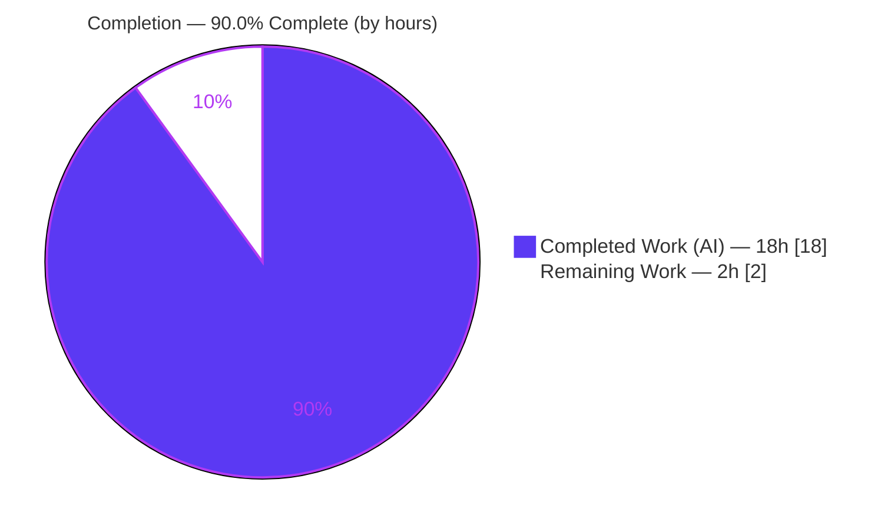
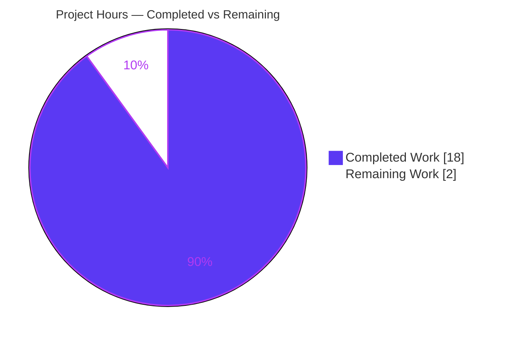
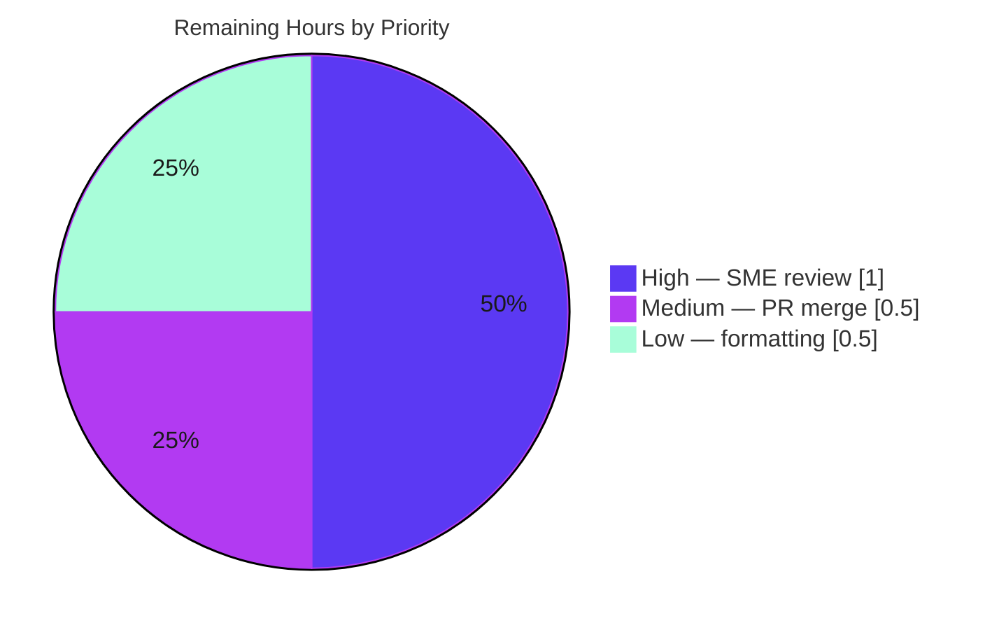
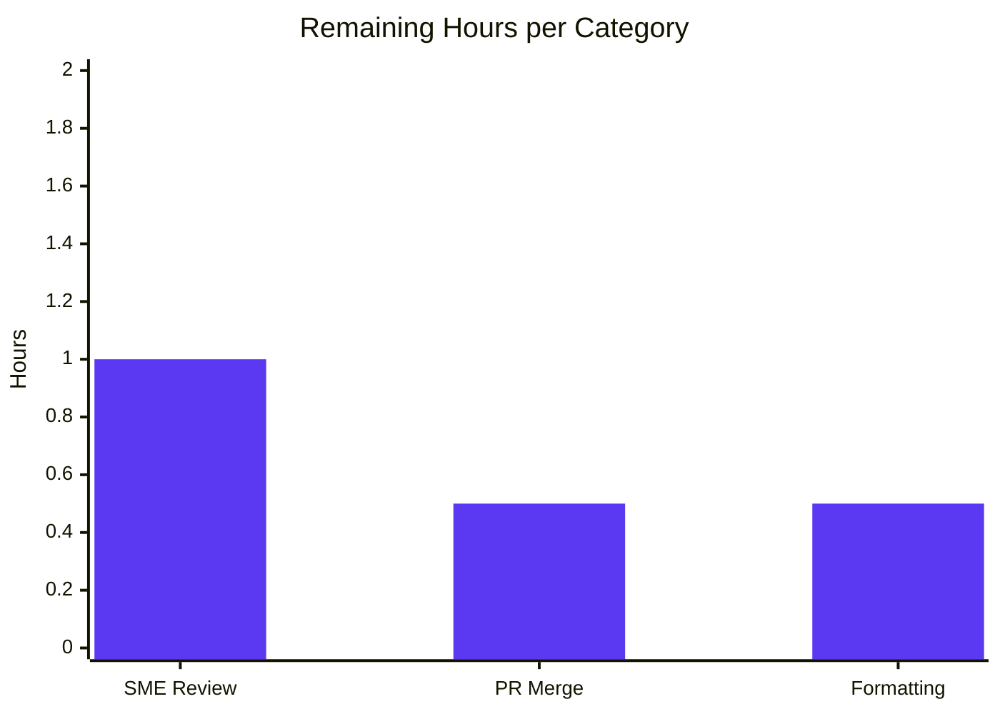

# Blitzy Project Guide — Calypso `tree-select` Caching Investigation

> **Task type:** Read-only investigation & documentation (AAP §0.1.2)
> **Deliverable:** `blitzy/documentation/wp-calypso_be7e5cc64162.md` (single Markdown answer document)
> **Branch:** `blitzy-5e68b844-58da-44ac-a571-c83312f22855` · **HEAD:** `e4d392b709` · **Base:** `be7e5cc641`
> **Brand colors:** Completed/AI = Dark Blue `#5B39F3` · Remaining = White `#FFFFFF` · Headings/Accents = Violet-Black `#B23AF2` · Highlight = Mint `#A8FDD9`

---

## 1. Executive Summary

### 1.1 Project Overview

This is a **read-only investigation-and-documentation** task on the WordPress Calypso monorepo. The objective is to empirically diagnose and definitively document the caching/memoization behavior of Calypso's memoized selector utility — **`@automattic/tree-select`** — root-causing a reported "stale results even after the underlying data has changed" symptom and answering six specific user questions (Q1–Q6) with concrete runtime evidence. The audience is Calypso engineers debugging Redux-selector staleness. The sole deliverable is one Markdown answer document; **no source file is modified**. Business impact: an authoritative, evidence-grounded reference that resolves a recurring class of selector bugs and clarifies the utility's `WeakMap`-based memoization contract against ecosystem norms.

### 1.2 Completion Status



**Overall completion: 90.0%** — calculated per PA1 (AAP-scoped hours only): `18h completed ÷ 20h total × 100 = 90.0%`.

| Metric | Hours |
|---|---|
| **Total Hours** | **20** |
| **Completed Hours (AI + Manual)** | **18** (AI: 18 · Manual: 0) |
| **Remaining Hours** | **2** |

### 1.3 Key Accomplishments

- ✅ **Single deliverable authored & verified** — `blitzy/documentation/wp-calypso_be7e5cc64162.md` (1,917 lines, ~61 code blocks, ~157 `file:line` citations).
- ✅ **Root cause proven at runtime** — in-place mutation keeps the dependent reference identical → cache hit → **stale value returned** (`before === after = true`, selector `calls` stays `1`); immutable update busts the cache (`calls = 2`, fresh result). Reproduced byte-for-byte across two runs.
- ✅ **All six questions answered with observed evidence** — Q1 comparison mechanism, Q2 invocation counts, Q3 per-argument coexistence, Q4 `clearCache()`, Q5 nullish-vs-primitive dependents, Q6 custom `getCacheKey` — each grounded in unedited command output and source `file:line`.
- ✅ **Every enumerated edge case covered by name** — `null`, `undefined`, number (incl. `0`), boolean (incl. `false`), string (incl. `''`), plus `Symbol`/`BigInt` argument cases and a full dev-vs-production guard matrix.
- ✅ **`treeSelect` vs `createSelector` contrast** captured via the canonical published entry (`dist/cjs/index.js`).
- ✅ **Read-only constraint perfectly respected** — `git diff --name-status be7e5cc641 HEAD` = single `A` line; zero source/test/README/consumer files touched; temp harness lived outside the repo and was removed.
- ✅ **Committed test suites re-run green** — tree-select 17/17 and state-utils/create-selector 13/13 = **30/30 (100%)**; both packages `tsc --noEmit` clean.

### 1.4 Critical Unresolved Issues

| Issue | Impact | Owner | ETA |
|---|---|---|---|
| _None._ No blocking issues. Deliverable is complete, empirically verified (0 inaccuracies), compiles clean, and all cited tests pass. | None | — | — |

> No compilation errors, no failing tests, and no unresolved defects exist. The only outstanding items are non-blocking path-to-production review gates (see §1.6 and §2.2).

### 1.5 Access Issues

| System/Resource | Type of Access | Issue Description | Resolution Status | Owner |
|---|---|---|---|---|
| _None_ | — | No access issues identified. Repository, Node/Yarn toolchain, and committed test suites were all accessible; the utility runs standalone via Node type-stripping. | N/A | — |

**No access issues identified.**

### 1.6 Recommended Next Steps

1. **[High]** Have a Calypso state-management SME technically review and sign off the answer document — confirm it resolves the user's stale-results question and spot-check citations/harness reproduction (1h).
2. **[Medium]** Review and merge the single-file pull request to the target branch, verifying the read-only diff (0.5h).
3. **[Low]** Decide house-style formatting for the `.md` — **recommendation: do not run Prettier** on this file, as it would rewrap the verbatim §L.8 harness scripts and break the byte-for-byte guarantee (0.5h).

---

## 2. Project Hours Breakdown

### 2.1 Completed Work Detail

All completed work was performed autonomously by Blitzy agents (Manual = 0h). Every component traces to AAP-scoped deliverables.

| Component | Hours | Description |
|---|---:|---|
| Investigation setup & source analysis | 2 | Confirm canonical runtime (Node ^22.9.0 / v22.23.1, Yarn 4.0.2); read `tree-select/src/index.ts` (131 L) + `create-selector/index.ts` (113 L) + README + committed tests + all 10 consumers; form per-question hypotheses. |
| Runtime observation harness authoring | 4 | Author 10 canonical observation scenarios importing the real `src/index.ts` via Node `--experimental-strip-types` (Q1–Q6, root cause, dev/prod, createSelector contrast). |
| Evidence capture & stability | 2 | Two-run in-process stability; at-scale (1,000-call) runs for Q2; cross-reference the committed jest suites (30 tests). |
| Q1–Q6 answer sections (B–G) | 4 | Author the six question sections with exact commands, unedited output, and `file:line` grounding. |
| Root cause + contrast + dev/prod + README flag (H, I, K, J) | 2 | Stale-results centerpiece reproduction; `treeSelect` vs `createSelector`; dev-vs-production guard matrix; README argument-order discrepancy flagged (not fixed). |
| Executive summary, utility ID & evidence appendix (0, 1, A, L) | 2 | Methodology, utility identification, and the evidence appendix (versions L.5, git-clean proof L.7, verbatim harness scripts L.8, coverage checklist L.9). |
| QA / review iteration | 1 | Four documented review passes: resolve code-review findings, label nondeterministic fields, complete the consumer-tree list, fix a citation. |
| Final empirical re-verification | 1 | Re-run all 10 harness scripts byte-for-byte, re-run 30 tests, `tsc --noEmit`, 92-citation integrity sweep, read-only confirmation. |
| **Total Completed** | **18** | |

### 2.2 Remaining Work Detail

All remaining work is path-to-production **human review gates** — no autonomous coding work remains.

| Category | Hours | Priority |
|---|---:|---|
| SME technical review & sign-off of the answer document | 1.0 | High |
| Pull request review & merge of the single-file deliverable | 0.5 | Medium |
| House-style formatting decision for the `.md` (Prettier not recommended — preserves §L.8 byte-for-byte) | 0.5 | Low |
| **Total Remaining** | **2.0** | |

### 2.3 Hours Reconciliation

- **Total** = Completed + Remaining = **18 + 2 = 20h** ✓ (matches §1.2 Total Hours).
- **Completion %** = 18 ÷ 20 × 100 = **90.0%** ✓ (matches §1.2, §7, §8).
- **Remaining** = **2h**, identical in §1.2, §2.2 (sum), and the §7 pie chart ✓ (Cross-Section Integrity Rule 1).

---

## 3. Test Results

All tests below originate from **Blitzy's autonomous validation logs** for this project (the committed suites cited as the canonical Q2 evidence) and were **independently re-executed during this assessment** with the cache directed outside the repository. There is no application UI, API, or E2E surface in this documentation task; the relevant tests are the committed unit suites for the utilities under investigation.

| Test Category | Framework | Total Tests | Passed | Failed | Coverage % | Notes |
|---|---|---:|---:|---:|---|---|
| Unit — `@automattic/tree-select` | Jest | 17 | 17 | 0 | n/m* | Canonical Q2 evidence: call-count & every edge-case assertion. Exit 0. |
| Unit — `@automattic/state-utils` `createSelector` | Jest | 13 | 13 | 0 | n/m* | Secondary/contrast suite (shallow-equality variant). Exit 0. |
| **Total** | **Jest** | **30** | **30** | **0** | **100% pass** | 100% pass rate; both suites green across the finalization run. |

\* *Coverage % was not collected by the committed suites (no `--coverage` gate for these packages); the authoritative metric here is the **100% pass rate** on the canonical assertions. Test counts reconcile the AAP's approximate "15" tree-select tests to the actual **17** per the run-first mandate.*

**Reproduction commands (verified this session):**
```bash
CI=true node_modules/.bin/jest -c=test/packages/jest.config.js --watchAll=false --ci \
  --cacheDirectory=/tmp/obs/jest-cache "packages/tree-select"                 # 17 passed
CI=true node_modules/.bin/jest -c=test/packages/jest.config.js --watchAll=false --ci \
  --cacheDirectory=/tmp/obs/jest-cache "packages/state-utils/src/create-selector"  # 13 passed
```

---

## 4. Runtime Validation & UI Verification

The "application" here is the memoized-selector utility, exercised through its **canonical entry point** at runtime. There is **no UI surface** in this documentation task, so UI verification is not applicable; runtime validation was performed on the utility and every claim in the deliverable.

**Runtime health**
- ✅ **Operational** — `treeSelect` imported directly from the real `packages/tree-select/src/index.ts` via Node 22 `--experimental-strip-types`; all 10 documented harness scenarios execute successfully (exit 0).
- ✅ **Operational** — Root-cause harness re-extracted from §L.8 (84 lines) and re-run this session; output matched the documented Section H **byte-for-byte** across RUN 1 / RUN 2 (in-place → `calls = 1`, stale `["id1"]`, `before === after = true`; immutable → `calls = 2`, fresh `[]`).
- ✅ **Operational** — Q2 invocation counts confirmed stable across two runs (same-state ×2 → 1; ×1000 → 1; changed dependent → 2; distinct args → 2; alternating 2 keys ×1000 → 2; fresh reference each of 1000 calls → 1000).
- ✅ **Operational** — Compilation: `tsc --noEmit` for both `packages/tree-select` and `packages/state-utils` exit 0 (clean).

**API integration outcomes**
- ✅ **Operational** — Canonical `createSelector` contrast resolved to the published `dist/cjs/index.js` entry; wholesale-clear sequence `[1,2,1,3,4]` → 4 computations; complex-arg path warns (does not throw).
- ✅ **Operational** — Dev-vs-production guard behavior verified: dev-only argument guards throw; the primitive-dependent `TypeError` is unconditional in both environments.

**UI verification**
- ⚠ **Not applicable** — This is a read-only documentation deliverable with no rendered UI. No screens, components, or visual states exist to verify.

---

## 5. Compliance & Quality Review

Cross-mapping of AAP deliverables and binding rules (§0.7) to their verification status. All items were confirmed against the committed source at `be7e5cc641`, the committed test suites, and re-run runtime evidence.

| # | AAP Deliverable / Rule | Benchmark | Status | Progress |
|---|---|---|---|---|
| A1 | Run-first investigation methodology | Build & run canonical path before writing | ✅ Pass | 100% |
| A2 | Q1 — comparison mechanism | Reference identity (WeakMap tree) + leaf `Map` string key | ✅ Pass | 100% |
| A3 | Q2 — invocation counts (concrete, ≥2-run, at-scale) | Counts stable across 2 runs; 1,000-call scale stated | ✅ Pass | 100% |
| A4 | Q3 — per-argument coexistence | Multi-entry; interleave survives; join() collisions documented | ✅ Pass | 100% |
| A5 | Q4 — programmatic clear | `clearCache()` recreates root WeakMap | ✅ Pass | 100% |
| A6 | Q5 — nullish vs primitive dependents | null/undefined memoized; non-nullish primitives throw `TypeError` | ✅ Pass | 100% |
| A7 | Q6 — custom cache keys for objects | dev object-arg guard; `options.getCacheKey` dedup; prod collision | ✅ Pass | 100% |
| A8 | Root-cause stale results + reproduce | In-place mutation → stale; immutable → fresh (runtime-proven) | ✅ Pass | 100% |
| A9 | `treeSelect` vs `createSelector` contrast | Canonical entry; shallow-equality wholesale clear | ✅ Pass | 100% |
| A10 | README argument-order discrepancy | Flagged, **not** corrected (read-only) | ✅ Pass | 100% |
| A11 | Dev-vs-production guard matrix | Documented with which env each error belongs to | ✅ Pass | 100% |
| A12 | Evidence discipline | Command + unedited output + `file:line` for every claim | ✅ Pass | 100% |
| A13 | Deliverable at exact path/name | `blitzy/documentation/wp-calypso_be7e5cc64162.md` created | ✅ Pass | 100% |
| R1 | Read-only source | 0 source files modified (`git diff` = single `A` line) | ✅ Pass | 100% |
| R2 | Exactly one new file | Only the answer document added | ✅ Pass | 100% |
| R3 | Canonical path only | Real API exercised; no mocks/hooks | ✅ Pass | 100% |
| R4 | Temp-script cleanup / git clean | `/tmp/obs` removed; `git status` clean | ✅ Pass | 100% |
| R5 | Answer every named item | L.9 coverage checklist complete | ✅ Pass | 100% |

**Fixes applied during autonomous validation:** four QA/review passes resolved code-review findings, labeled nondeterministic fields, completed the consumer-tree list (all 10 importers), and corrected a `state-utils` manifest citation (`L11 → L9`). **Outstanding compliance items:** none.

---

## 6. Risk Assessment

Risk profile is intrinsically **LOW**: the deliverable is a read-only, additive, inert Markdown document that introduces no imports, dependencies, or build/CI coupling.

| Risk | Category | Severity | Probability | Mitigation | Status |
|---|---|---|---|---|---|
| Citation drift if source is later edited (~157 `file:line` refs pinned to `be7e5cc641`) | Technical | Low | Low | Document pins the commit hash; all 92 unique citations swept (0 out-of-bounds); re-verify if source changes | Mitigated |
| Reader expects a code fix (stale results is by-design, not a bug) | Technical | Low | Low | Document explicitly scopes explain-not-fix per read-only constraint (§H, §0.5) | Resolved |
| Reproduction depends on Node 22 `--experimental-strip-types` flag | Technical | Low | Low | Exact Node v22.23.1 stated; committed jest suite (30 tests) is a flag-independent canonical cross-reference | Mitigated |
| Secrets / vulnerable dependencies / injection | Security | None | N/A | Inert Markdown: no code path, no dependencies added, no secrets, harness ran & was removed outside the repo | No action |
| No runtime/service to monitor | Operational | None | N/A | Documentation artifact; monitoring/health-checks not applicable | N/A |
| Markdown not Prettier-formatted (intentional) | Operational | Low | Low | Repo does not lint `.md` today; rationale documented; human decides house style (task in §2.2) | Open (optional) |
| Document breaks compilation/CI | Integration | None | N/A | Inert file — no imports/config/build coupling; cannot break the pipeline | No action |
| Merge conflict on the single-file PR | Integration | Low | Low | Adds a new file in a new directory (`blitzy/documentation/`); conflict risk negligible | Open (trivial) |

**Overall posture:** LOW. No High or Critical risks; no blocking issues.

---

## 7. Visual Project Status

**Project hours breakdown** (Completed = Dark Blue `#5B39F3`, Remaining = White `#FFFFFF`):



**Remaining work by priority** (2h total):



**Remaining hours per category (bar):**



> **Integrity check:** the "Remaining Work" pie value (**2**) equals §1.2 Remaining Hours and the sum of the §2.2 Hours column. The "Completed Work" value (**18**) equals §1.2 Completed Hours and the sum of the §2.1 Hours column.

---

## 8. Summary & Recommendations

**Achievements.** This read-only investigation is **90.0% complete** (18h of 20h AAP-scoped hours). The single deliverable — a 1,917-line, evidence-grounded answer document — root-causes the user's "stale results" symptom and answers all six questions (Q1–Q6) with unedited runtime output and precise `file:line` citations. The stale-results cause is definitive and runtime-proven: `treeSelect` compares the values returned by `getDependents` by **referential identity**, so an in-place mutation that preserves the reference produces a cache hit and returns the stale value; an immutable update creates a new reference and busts the cache.

**Remaining gaps.** The remaining **2h** is entirely **path-to-production human review** — SME sign-off, PR merge, and an optional formatting decision. There is no outstanding autonomous engineering work: the deliverable compiles clean (`tsc --noEmit` exit 0 for both packages), all cited tests pass (**30/30**), the runtime evidence reproduces byte-for-byte, and the read-only/no-dependency-change constraints are perfectly respected.

**Critical path to production.**
1. SME technical review & sign-off (High, 1h) → 2. PR review & merge (Medium, 0.5h) → 3. Formatting decision (Low, 0.5h).

**Success metrics.**
- 100% of AAP-specified deliverables (A1–A13) and binding rules (R1–R5) satisfied.
- 30/30 cited tests passing; 0 compilation errors; 0 unresolved defects; 0 source files modified.
- All six questions + root cause + every enumerated edge case answered by name (L.9 coverage checklist complete).

**Production-readiness assessment.** The deliverable is **production-ready**. It is committed on the branch, the working tree is clean, and every behavioral claim has been independently reproduced from the canonical runtime path. The only prerequisite before "shipping" the answer to the user is human sign-off and merge. Confidence: **High** — the task is well-defined, isolated, and fully verified.

---

## 9. Development Guide

This guide explains how to set up the environment and **reproduce the investigation** underlying the answer document. Every command below was executed during assessment and produced the stated result. Working directory is the repository root unless noted.

### 9.1 System Prerequisites

- **Node.js** `^v22.9.0` — verified running `v22.23.1`. (Node 20 would violate the repo `engines` field and `.nvmrc: 22.9.0`; do **not** use Node 20.)
- **Yarn** `4.0.2` via **Corepack** (`corepack --version` → `0.34.6`).
- **Git**, and **~4 GB** free disk (monorepo working tree ≈ 3.3 GB, 18,879 tracked files).

```bash
node --version      # expect: v22.9.0 or higher (assessed on v22.23.1)
corepack enable     # activates the pinned yarn@4.0.2
yarn --version      # expect: 4.0.2
cat .nvmrc          # expect: 22.9.0
```

### 9.2 Environment Setup & Dependency Installation

```bash
# from the repository root
corepack enable
CI=true yarn install --immutable     # lockfile is in sync; installs workspace deps
```

### 9.3 "Running" the Deliverable — Reproduce the Evidence

Because the deliverable is a documentation artifact, "running" it means reproducing its runtime evidence.

**a) View the answer document**
```bash
sed -n '1,60p' blitzy/documentation/wp-calypso_be7e5cc64162.md   # 1,917 lines total
```

**b) Compilation gate (expect exit 0, no output)**
```bash
node_modules/.bin/tsc --noEmit -p packages/tree-select/tsconfig.json
node_modules/.bin/tsc --noEmit -p packages/state-utils/tsconfig.json
```

**c) Test gate (expect 17 and 13 passing)**
```bash
CI=true node_modules/.bin/jest -c=test/packages/jest.config.js --watchAll=false --ci \
  --cacheDirectory=/tmp/obs/jest-cache "packages/tree-select"
CI=true node_modules/.bin/jest -c=test/packages/jest.config.js --watchAll=false --ci \
  --cacheDirectory=/tmp/obs/jest-cache "packages/state-utils/src/create-selector"
```

**d) Runtime harness reproduction (root cause) — expect byte-for-byte match with §H**
```bash
mkdir -p /tmp/obs
# extract any §L.8 script (verbatim) into /tmp/obs, e.g. rootcause.mjs, then:
env -u NODE_ENV REPO="$PWD" node --experimental-strip-types \
  --disable-warning=MODULE_TYPELESS_PACKAGE_JSON /tmp/obs/rootcause.mjs
# Production scenarios instead set NODE_ENV=production (drop `env -u NODE_ENV`).
rm -rf /tmp/obs   # cleanup — keep the repository byte-clean
```

Expected (both runs identical):
```text
IN-PLACE: initial result = ["id1"] | calls = 1
IN-PLACE: after mutation = ["id1"] | calls = 1 | correct would be []
IN-PLACE: same cached array returned: before === after = true
IN-PLACE: STALE (still shows id1) = true
IMMUTABLE: initial result = ["id1"] | calls = 1
IMMUTABLE: after update = [] | calls = 2
IMMUTABLE: FRESH (now []) = true
```

### 9.4 Verification Steps

```bash
# Read-only proof: only the deliverable was added
git diff --name-status be7e5cc641622d153040491fd5625c6cb83e12eb HEAD
# expect: A  blitzy/documentation/wp-calypso_be7e5cc64162.md

git status --porcelain    # expect: (empty) — working tree clean
```

### 9.5 Example Usage — the User's Fix Pattern

- **Correct signature:** `treeSelect(getDependents, selector, options)` — `getDependents` is **first** (the README example shows the arguments reversed; flagged in §J of the answer doc, not corrected).
- **Fix stale results:** return a **new reference** from `getDependents` on change (immutable update) rather than mutating in place; or call `selector.clearCache()` to force recomputation.
- **Object arguments:** supply `options.getCacheKey` (e.g., the stats consumer serializes its `query` object) — otherwise a raw object argument throws in development.

### 9.6 Troubleshooting

- **Guards don't throw?** Development-mode guards fire only when `NODE_ENV !== 'production'`. Prefix commands with `env -u NODE_ENV` to activate them.
- **`git status` shows `.cache/`?** Jest's committed preset writes its cache inside the repo (`test/packages/jest-preset.js:L10`). Always pass `--cacheDirectory=/tmp/obs/jest-cache` to keep the tree byte-clean.
- **`.ts` import fails?** Direct import needs Node 22 `--experimental-strip-types`; the benign `MODULE_TYPELESS_PACKAGE_JSON` warning is silenced with `--disable-warning=MODULE_TYPELESS_PACKAGE_JSON`.
- **Do not run Prettier on the deliverable** — it rewraps the verbatim §L.8 harness code fences and breaks the byte-for-byte guarantee (the repo does not lint `.md`).
- **Temp scripts** belong in `/tmp/obs` (outside the repo) and must be removed afterward (`rm -rf /tmp/obs`).

---

## 10. Appendices

### A. Command Reference

| Purpose | Command |
|---|---|
| Node version | `node --version` |
| Activate Yarn | `corepack enable` |
| Install deps | `CI=true yarn install --immutable` |
| Type-check tree-select | `node_modules/.bin/tsc --noEmit -p packages/tree-select/tsconfig.json` |
| Type-check state-utils | `node_modules/.bin/tsc --noEmit -p packages/state-utils/tsconfig.json` |
| Test tree-select | `CI=true node_modules/.bin/jest -c=test/packages/jest.config.js --watchAll=false --ci --cacheDirectory=/tmp/obs/jest-cache "packages/tree-select"` |
| Test create-selector | `CI=true node_modules/.bin/jest -c=test/packages/jest.config.js --watchAll=false --ci --cacheDirectory=/tmp/obs/jest-cache "packages/state-utils/src/create-selector"` |
| Run a dev harness | `env -u NODE_ENV REPO="$PWD" node --experimental-strip-types --disable-warning=MODULE_TYPELESS_PACKAGE_JSON /tmp/obs/<script>.mjs` |
| Run a prod harness | `NODE_ENV=production REPO="$PWD" node --experimental-strip-types --disable-warning=MODULE_TYPELESS_PACKAGE_JSON /tmp/obs/<script>.mjs` |
| Read-only proof | `git diff --name-status be7e5cc641622d153040491fd5625c6cb83e12eb HEAD` |
| Clean-tree check | `git status --porcelain` |

### B. Port Reference

**No network ports.** The investigation runs as standalone Node scripts and jest test processes; there is no server, service, or listening port.

### C. Key File Locations

| Path | Role |
|---|---|
| `blitzy/documentation/wp-calypso_be7e5cc64162.md` | **The deliverable** (answer document, 1,917 lines) |
| `packages/tree-select/src/index.ts` | Primary utility under investigation (131 lines) |
| `packages/tree-select/test/index.js` | Canonical Q2 test suite (17 tests, 266 lines) |
| `packages/tree-select/README.md` | Mechanism docs; source of flagged argument-order discrepancy |
| `packages/tree-select/package.json` | `@automattic/tree-select` v2.0.0 manifest |
| `packages/state-utils/src/create-selector/index.ts` | Secondary utility for contrast (113 lines) |
| `packages/state-utils/src/create-selector/test/index.js` | createSelector suite (13 tests) |
| `client/state/stats/lists/selectors.js` | Representative real-world consumer (`getSiteStatsNormalizedData`) |
| `test/packages/jest.config.js` / `jest-preset.js` | Shared jest configuration |

**Consumers of `@automattic/tree-select` (10 total):** 6 in comments (`get-comment-like`, `get-date-sorted-post-comments`, `get-hidden-comments-for-post`, `get-post-comments-tree`, `get-post-newest-comment-date`, `get-post-oldest-comment-date`), plus `invites/selectors.js`, `stats/lists/selectors.js`, `reader/posts/selectors.js`, and `reader/streams/selectors/get-reader-stream-transformed-items.ts`.

### D. Technology Versions

| Technology | Version |
|---|---|
| Node.js | `v22.23.1` (engines `^v22.9.0`; `.nvmrc` `22.9.0`) |
| Yarn (Corepack) | `4.0.2` (corepack `0.34.6`) |
| TypeScript | `^5.8.2` |
| `@automattic/tree-select` | `2.0.0` |
| `@automattic/state-utils` | `1.0.0-alpha.4` |
| `tslib` | `^2.3.0` (tree-select's only runtime dep; not exercised by memoization) |
| `@wordpress/is-shallow-equal` | `^5.21.0` (used by createSelector) |
| `@wordpress/warning` | `^3.21.0` (createSelector dev warnings) |
| `lodash` | `^4.17.21` (`memoize` powering createSelector) |
| Jest | via `@automattic/calypso-jest` preset |

### E. Environment Variable Reference

| Variable | Purpose |
|---|---|
| `NODE_ENV` | Unset / not `production` → development guards **active** (object-arg `Error`, invalid-args `TypeError`). `production` → argument guards skipped; the primitive-dependent `TypeError` still throws (unconditional). |
| `REPO` | Absolute path to the repository root; harness scripts import the real source via `process.env.REPO + '/packages/tree-select/src/index.ts'`. |
| `CI` | `true` for non-interactive jest/yarn runs. |

### F. Developer Tools Guide

- **Node type-stripping** (`--experimental-strip-types`): imports the real `.ts` source with no build step, preserving the read-only constraint.
- **`--disable-warning=MODULE_TYPELESS_PACKAGE_JSON`**: silences the benign warning emitted when importing a `.ts` file directly.
- **Jest** (`-c=test/packages/jest.config.js`): runs the committed suites; always redirect the cache with `--cacheDirectory=/tmp/obs/jest-cache`.
- **`tsc --noEmit`**: type-checks a package without producing output.
- **`git diff --name-status` / `git status --porcelain`**: prove the read-only constraint and a clean tree.

### G. Glossary

| Term | Definition |
|---|---|
| **`treeSelect`** | Calypso's factory returning a memoized selector backed by a tree of `WeakMap`s + a leaf `Map`. |
| **`createSelector`** | `state-utils` memoized selector using shallow-equality + lodash `memoize`; contrasted with `treeSelect`. |
| **Memoization** | Caching a function's result so repeated calls with equivalent inputs skip recomputation. |
| **Referential identity (`===`)** | Two references point to the exact same object; the basis of `treeSelect`'s dependent-layer comparison. |
| **`WeakMap`** | Map with object-only keys held weakly (garbage-collectable); used for the dependent tree. |
| **Leaf `Map`** | The terminal plain `Map` keyed by the generated string (`getCacheKey(...args)`, default `args.join()`). |
| **`NULLISH_KEY`** | Shared sentinel object substituted for `null`/`undefined` dependents so they can be memoized. |
| **`getCacheKey`** | Optional function to derive the leaf key from arguments — required to safely pass object arguments. |
| **`clearCache()`** | Method on the returned selector that recreates the root `WeakMap`, invalidating all entries. |
| **Dependent** | A value returned by `getDependents(state, ...args)`; compared by reference identity for cache hits. |
| **Stale result** | A previously cached value returned after an in-place mutation that did not change the dependent reference. |

---

*Generated by the Blitzy Platform. Completion (90.0%) reflects AAP-scoped and path-to-production work only. Colors: Completed `#5B39F3`, Remaining `#FFFFFF`.*