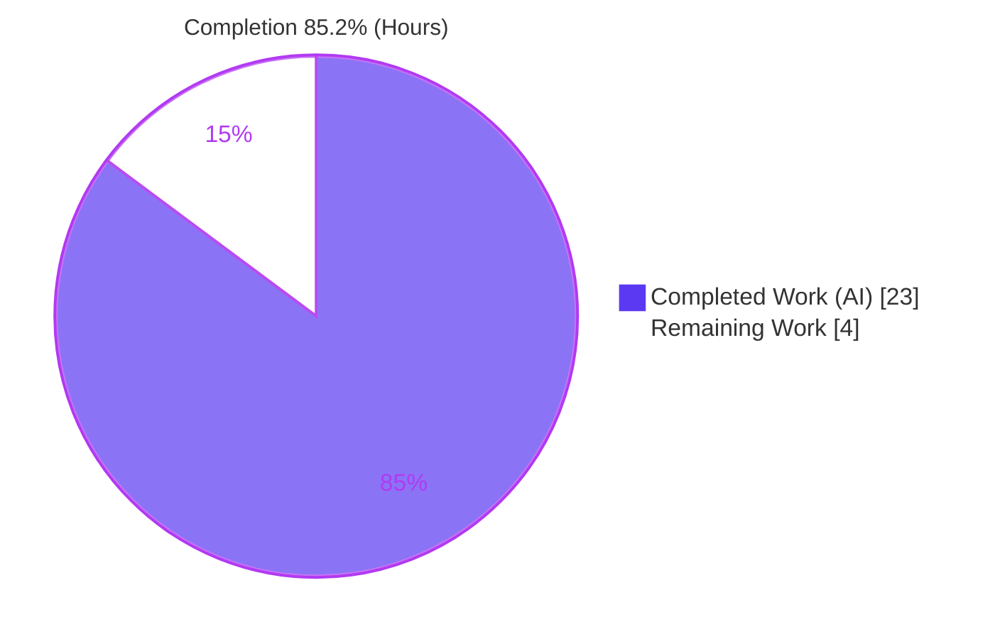
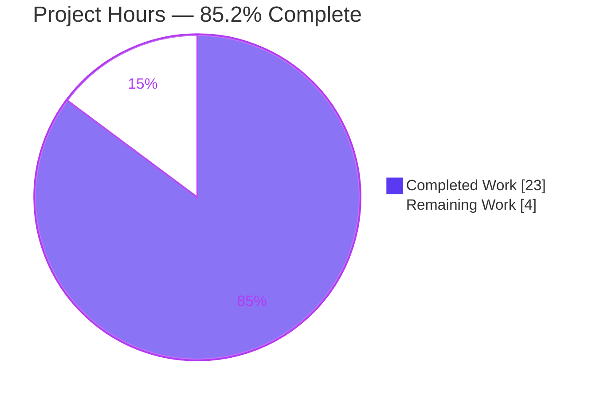
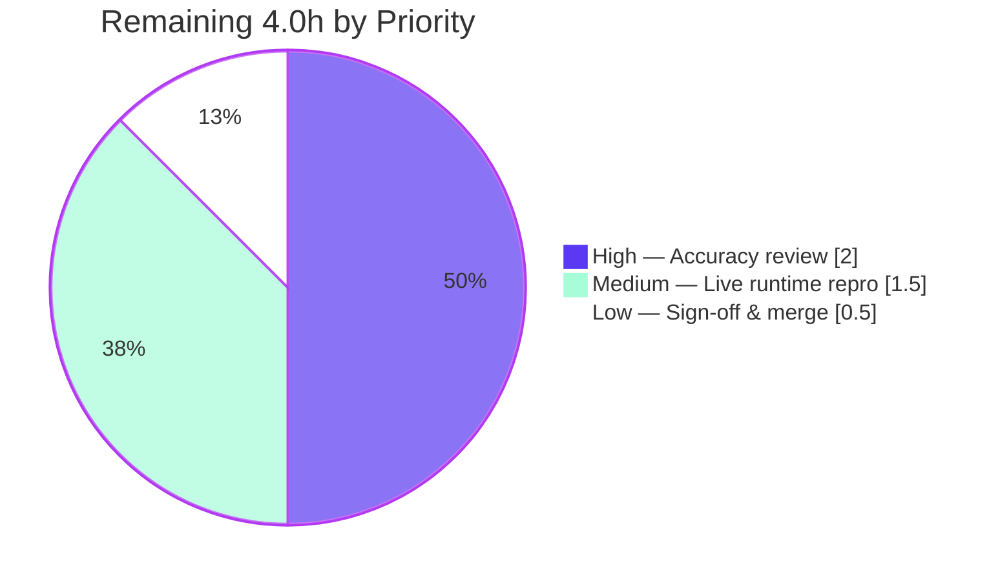

# Blitzy Project Guide

**Project:** Logged-Out Reader "Like" Intent Across the Authentication Boundary — Root-Cause Analysis (wp-calypso)
**Branch:** `blitzy-dd36a238-da45-4a13-930f-2086858a2c00`
**Source branch analyzed:** `wp-calypso_be7e5cc64162` (HEAD `be7e5cc641622d153040491fd5625c6cb83e12eb`)
**Repository:** Automattic `wp-calypso` (Calypso — WordPress.com React/Redux SPA), version `18.13.0`

---

## 1. Executive Summary

### 1.1 Project Overview

This project delivers a single, evidence-based Markdown root-cause analysis that traces the complete lifecycle of a **logged-out Reader "Like" intent** as it crosses the authentication boundary in Automattic's `wp-calypso` codebase, and explains precisely why the like silently disappears after the visitor signs in. The audience is Calypso/Reader engineers and technical stakeholders investigating the dropped-like behavior. The deliverable answers five investigative questions strictly "code-as-truth" — every claim is backed by a `file:line` citation — and frames the conclusion against industry best practice. Technical scope is read-only investigation across the Reader Like UI, the `reader-ui` Redux slice, the logged-out layout/login flow, and Redux persistence/rehydration. The business impact is a precise, actionable diagnosis enabling a future fix.

### 1.2 Completion Status

The project is **85.2% complete**. All sixteen Agent Action Plan (AAP) deliverable requirements are fully implemented and validated; the remaining 4.0 hours are human path-to-production activities (technical review, optional live-runtime reproduction, and sign-off/merge).



| Metric                        | Hours                        |
| ----------------------------- | ---------------------------- |
| **Total Hours**               | **27.0**                     |
| Completed Hours (AI + Manual) | 23.0 (AI: 23.0; Manual: 0.0) |
| Remaining Hours               | 4.0                          |
| **Percent Complete**          | **85.2%**                    |

> Completion is computed using the AAP-scoped, hours-based methodology: `Completed ÷ (Completed + Remaining) = 23.0 ÷ 27.0 = 85.2%`. Only AAP deliverables and standard path-to-production activities are included.

### 1.3 Key Accomplishments

- ✅ Authored `blitzy/documentation/wp-calypso_be7e5cc64162.md` (415 lines, 4,717 words) — filename exactly equals the source branch name, placed in the required `blitzy/documentation/` directory.
- ✅ Answered all five investigative questions (Q1–Q5) with explicit **Answer** + **Rationale** subsections each.
- ✅ Grounded the analysis in **215+ inline `file:line` citations across 30 files**, re-verified against source ("code-as-truth").
- ✅ Identified the capture site (`client/blocks/like-button/index.jsx` L32–L44), the source of truth (in-memory Redux `reader-ui` slice), the exact skip condition (`window.location.reload()` at `client/layout/logged-out.jsx` L307–L313), and the root cause (initialization-order/persistence gap compounded by a missing replay path).
- ✅ Proved the absence of any replay path via exhaustive grep (action-type constants in exactly 5 files; state key in exactly 4 files; no middleware/saga; 9 dispatch sites, 1 consumer, 0 replayers).
- ✅ Included a Mermaid flow diagram, a root-cause synthesis, an industry best-practice framing (web research), an out-of-scope remediation discussion (narrative only), and a 7-table citation index.
- ✅ Corroborated behavior with the `reader-ui` Jest suite — **4 suites / 10 tests / 100% pass**.
- ✅ Honored every rule: **zero source modifications** (source byte-for-byte unchanged), no other code added, clean working tree.

### 1.4 Critical Unresolved Issues

| Issue                                | Impact                                                                                                                 | Owner              | ETA |
| ------------------------------------ | ---------------------------------------------------------------------------------------------------------------------- | ------------------ | --- |
| None — no blocking issues identified | All AAP deliverable requirements are complete and validated; remaining items are routine human acceptance, not defects | Reviewing Engineer | N/A |

### 1.5 Access Issues

No access issues identified.

| System/Resource         | Type of Access             | Issue Description                                                             | Resolution Status | Owner        |
| ----------------------- | -------------------------- | ----------------------------------------------------------------------------- | ----------------- | ------------ |
| `wp-calypso` repository | Read/Write (source branch) | None — full access; source read for citations, deliverable committed          | Resolved          | Blitzy Agent |
| Node/Yarn toolchain     | Build/run                  | None — Corepack/Yarn 4.0.2, Node v22.23.1 available; `node_modules` installed | Resolved          | Blitzy Agent |
| Jest test runner        | Execute                    | None — `reader-ui` suite executed successfully (10/10)                        | Resolved          | Blitzy Agent |

### 1.6 Recommended Next Steps

1. **[High]** Have a senior Calypso/Reader engineer review the analysis for technical accuracy and accept it (validate the five answers, spot-check citations, confirm the root-cause classification). — 2.0h
2. **[Medium]** Optionally perform a full live-runtime reproduction of the dropped-like behavior (build/run Calypso, log out, click Like, complete popup login, observe the reload drop) to elevate corroboration beyond the unit-test level. — 1.5h
3. **[Low]** Obtain documentation-owner sign-off and merge `blitzy/documentation/wp-calypso_be7e5cc64162.md`. — 0.5h
4. **[Low]** (Out of scope here) Track a separate follow-on engineering project to implement the remediation described narratively in the document (re-dispatch the like before reload, or persist + replay the intent).

---

## 2. Project Hours Breakdown

### 2.1 Completed Work Detail

| Component                                         | Hours    | Description                                                                                                                                                                                                                                                                                                    |
| ------------------------------------------------- | -------- | -------------------------------------------------------------------------------------------------------------------------------------------------------------------------------------------------------------------------------------------------------------------------------------------------------------- |
| Capture-path investigation (Q1)                   | 3.0      | Traced the logged-out capture site: `LikeButtonContainer.handleLikeToggle` early-return dispatch (`client/blocks/like-button/index.jsx` L32–L44), presentational button (`button.jsx` L45–L52), and the superseded "dead code" redirect in the Reader wrapper (`client/reader/like-button/index.jsx` L34–L50). |
| Source-of-truth / persistence investigation (Q3)  | 3.0      | Established in-memory-Redux classification and the load-bearing `withPersistence` asymmetry (`reducer.js` L19 vs L45–L54), plus `serialize.ts`, `reducer-utils.ts`, and the URL builder `createAccountUrl` (`client/lib/paths/index.js` L24–L26).                                                              |
| Consumer & auth-handoff investigation (Q2)        | 2.5      | Traced the sole consumer `client/layout/logged-out.jsx` (L91, L302–L315), the join-conversation dialog (analytics-only), and the popup auth hook `client/data/reader/use-login-window.ts`.                                                                                                                     |
| Skip-condition & root-cause investigation (Q4/Q5) | 2.5      | Pinpointed the reload branch (`logged-out.jsx` L307–L313), the rehydration reset to `null` (`initial-state.js`, `serialize.ts`), and the grep proof that no middleware/saga/boot logic replays the like.                                                                                                       |
| Web research + industry best-practice framing     | 1.5      | Researched the SPA "persist/replay a pending action across an auth redirect" pattern and framed the root cause against it.                                                                                                                                                                                     |
| Document authoring                                | 6.0      | Wrote the 415-line / 4,717-word analysis: overview, Mermaid flow diagram, Q1–Q5 prose + rationale, root-cause synthesis, best-practice framing, remediation discussion, and a 7-table citation index.                                                                                                          |
| Citation verification / code-as-truth cross-check | 2.5      | Re-verified 215+ inline `file:line` references across 30 files against source; corroborated with the slice's unit-test fixtures.                                                                                                                                                                               |
| Behavioral validation & repo-integrity            | 2.0      | Ran the `reader-ui` Jest suite (10/10), Prettier check, Markdown well-formedness/table checks, grep proofs, and `git diff` integrity verification (only the `.md` added; clean tree).                                                                                                                          |
| **Total**                                         | **23.0** |                                                                                                                                                                                                                                                                                                                |

### 2.2 Remaining Work Detail

| Category                                                                                                                                                                                | Hours   | Priority |
| --------------------------------------------------------------------------------------------------------------------------------------------------------------------------------------- | ------- | -------- |
| Technical accuracy review & acceptance of the analysis (validate Q1–Q5, spot-check citations, confirm root-cause classification)                                                        | 2.0     | High     |
| Optional live-runtime behavioral reproduction (build/run full Calypso end-to-end; observe the dropped like) — verification enrichment beyond the existing 10/10 unit-test corroboration | 1.5     | Medium   |
| Stakeholder / documentation-owner sign-off & merge of the deliverable                                                                                                                   | 0.5     | Low      |
| **Total**                                                                                                                                                                               | **4.0** |          |

### 2.3 Hours Reconciliation

| Check                       | Value | Result                        |
| --------------------------- | ----- | ----------------------------- |
| Section 2.1 Completed total | 23.0  | —                             |
| Section 2.2 Remaining total | 4.0   | —                             |
| 2.1 + 2.2                   | 27.0  | = Total Hours (Section 1.2) ✓ |
| Completion `23.0 ÷ 27.0`    | 85.2% | = Section 1.2 / 7 / 8 ✓       |

---

## 3. Test Results

All tests below originate exclusively from Blitzy's autonomous validation logs for this project and were independently re-executed during this assessment. Because the deliverable is a Markdown analysis (no application code is added), the relevant automated suite is the `reader-ui` Redux slice — the subsystem the analysis is grounded in — which provides behavioral corroboration of the document's central claims (REGISTER stores the intent, CLEAR resets to `null`, the like fixture carries no `redirectTo`).

| Test Category                         | Framework                  | Total Tests | Passed | Failed | Coverage %   | Notes                                                                                                                                                                                                 |
| ------------------------------------- | -------------------------- | ----------- | ------ | ------ | ------------ | ----------------------------------------------------------------------------------------------------------------------------------------------------------------------------------------------------- |
| Unit (reader-ui slice)                | Jest 29.7.0                | 10          | 10     | 0      | 100% (slice) | 4 suites: `test/actions.js`, `test/reducer.js`, `test/selectors.js`, `card-expansions/test/reducer.js`. Corroborates Q1/Q3/Q4 fixtures. Run twice, identical.                                         |
| Document structure / well-formedness  | Prettier + Markdown checks | 1           | 1      | 0      | n/a          | `prettier --check` → clean (exit 0); 6 balanced code fences; 11 column-consistent tables; valid Mermaid `flowchart TD` (9 nodes / 8 edges).                                                           |
| Citation verification (code-as-truth) | Manual + `grep`/`sed`      | 215+ refs   | 215+   | 0      | n/a          | Every inline `file:line` citation cross-checked against source; zero inaccurate/out-of-range. Grep proofs (constants in 5 files; key in 4 files; 9 dispatch sites; no middleware/saga) all confirmed. |
| Repository integrity                  | `git`                      | 1           | 1      | 0      | n/a          | `git diff base..HEAD` = only `blitzy/documentation/wp-calypso_be7e5cc64162.md`; source byte-for-byte unchanged; working tree clean.                                                                   |

**Aggregate:** 10 automated unit tests, 100% pass; all structure, citation, and integrity checks pass; 0 failures.

---

## 4. Runtime Validation & UI Verification

The deliverable is a static Markdown document — there is no server, binary, or UI to launch. "Runtime" validation therefore means behavioral corroboration of the analyzed subsystem plus artifact-integrity verification.

- ✅ **Operational — `reader-ui` Jest suite:** `CI=true TZ=UTC yarn jest -c=test/client/jest.config.js --testPathPattern=client/state/reader-ui/` → 4 suites / 10 tests / 100% pass (exit 0).
- ✅ **Operational — Dependency/toolchain:** Corepack 0.34.6, Yarn 4.0.2 (matches `packageManager`), Node v22.23.1 (satisfies `engines ^v22.9.0`); `node_modules` installed (3.1 GB); `yarn install --immutable` reported no lockfile drift.
- ✅ **Operational — Document well-formedness:** `prettier --check` clean; Mermaid diagram valid; tables column-consistent.
- ✅ **Operational — Repository integrity:** Only the deliverable added; source unmodified; clean working tree.
- ⚠ **Partial — Full live-runtime reproduction:** A full end-to-end browser reproduction (build entire Calypso app, perform popup login, observe the dropped like) was **not** performed. The AAP designates build/run as optional and accepts the unit suite as corroborating evidence; a live reproduction remains an optional human verification step (Section 2.2).
- ✅ **Operational — UI verification (N/A):** No UI is created or altered by this documentation deliverable; no UI verification is applicable.

---

## 5. Compliance & Quality Review

Cross-map of AAP deliverables and binding `SWE-AtlasQnA-Repo` rules to their validation status.

| AAP Deliverable / Rule                          | Benchmark                           | Status  | Progress | Notes / Fixes Applied                                                                            |
| ----------------------------------------------- | ----------------------------------- | ------- | -------- | ------------------------------------------------------------------------------------------------ |
| Create `<branch>.md` in `blitzy/documentation/` | File exists; filename = branch name | ✅ Pass | 100%     | `wp-calypso_be7e5cc64162.md`, 415 lines, directory created                                       |
| Answer Q1 — where the intent goes               | Code-cited answer + rationale       | ✅ Pass | 100%     | In-memory Redux `state.readerUi.lastActionRequiresLogin`; capture at L32–L44                     |
| Answer Q2 — what replays it                     | Code-cited answer + rationale       | ✅ Pass | 100%     | Nothing replays; sole consumer never re-dispatches `like()`                                      |
| Answer Q3 — source of truth                     | Code-cited answer + rationale       | ✅ Pass | 100%     | In-memory Redux; not persisted (asymmetry L19 vs L45–L54); not URL-carried                       |
| Answer Q4 — exact skip condition                | Code-cited answer + rationale       | ✅ Pass | 100%     | No `redirectTo` ⇒ `window.location.reload()` (L307–L313) resets store                            |
| Answer Q5 — timing/init-order/cleanup           | Classified + rationale              | ✅ Pass | 100%     | Init-order/persistence gap + missing replay path; not a race                                     |
| Overview + Mermaid diagram                      | Present + valid                     | ✅ Pass | 100%     | Valid `flowchart TD`, 9 nodes / 8 edges                                                          |
| Root-cause synthesis                            | Present                             | ✅ Pass | 100%     | 5-step deterministic chain                                                                       |
| Industry best-practice framing (web research)   | Present                             | ✅ Pass | 100%     | SPA persist/replay-across-auth pattern                                                           |
| Remediation discussion (narrative only)         | Present, no code                    | ✅ Pass | 100%     | Explicit OUT-OF-SCOPE marker                                                                     |
| Code-as-truth (every claim cited)               | All citations accurate              | ✅ Pass | 100%     | 215+ refs verified; 0 inaccurate                                                                 |
| Rule: no source modifications                   | 0 source files changed              | ✅ Pass | 100%     | `git diff` = only the `.md`                                                                      |
| Rule: no other code added                       | Single `.md` only                   | ✅ Pass | 100%     | Zero code files                                                                                  |
| Rule: clean working tree                        | No temp artifacts                   | ✅ Pass | 100%     | `git status --porcelain` = 0                                                                     |
| Rule: build/run as needed (optional)            | Behavioral corroboration            | ✅ Pass | 100%     | `reader-ui` Jest 10/10                                                                           |
| Formatting / lint                               | Prettier clean                      | ✅ Pass | 100%     | Note: `.md` intentionally excluded by code-only pre-commit hook; Prettier confirms independently |

**Fixes applied during autonomous validation:** ZERO source/code fixes were required. Exhaustive verification found the deliverable already 100% accurate, well-formed, and complete — no inaccurate citations, no structural defects, no lint/format violations. **Outstanding compliance items:** None.

---

## 6. Risk Assessment

For a read-only documentation deliverable with zero source modifications, the risk surface is intentionally minimal. No High or Critical risks were identified.

| Risk                                                                                                                     | Category    | Severity | Probability | Mitigation                                                                                                                          | Status          |
| ------------------------------------------------------------------------------------------------------------------------ | ----------- | -------- | ----------- | ----------------------------------------------------------------------------------------------------------------------------------- | --------------- |
| Cited line numbers (e.g., L32–L44) may drift if source files change after this analysis                                  | Technical   | Low      | Medium      | All 215+ citations pinned to commit `be7e5cc641`; document states this; re-verify if source changes                                 | Mitigated       |
| Behavioral claim corroborated at unit-test level + exhaustive static trace, not a full live-runtime browser reproduction | Technical   | Low      | Low         | Static trace is exhaustive & grep-proven; AAP made build/run optional; optional live repro available (Section 2.2)                  | Open (optional) |
| "No replay path exists" is a negative proof via grep — a dynamic/indirect replay could in theory be missed               | Technical   | Low      | Low         | Grep covered action-type constants (5 files), state key (4 files), and confirmed no middleware/saga; consumer + dialog read in full | Mitigated       |
| Documentation staleness if the analyzed bug is later fixed in the codebase                                               | Operational | Low      | Medium      | Document is commit-pinned and dated; intended as a point-in-time root-cause analysis                                                | Acknowledged    |
| Deliverable (`.md`) is not linted by the repo pre-commit hook (filters to code extensions only)                          | Integration | Low      | Low         | `prettier --check` independently passes (exit 0); Markdown well-formedness, tables, fences validated                                | Mitigated       |
| Deliverable could inadvertently expose secrets/credentials                                                               | Security    | None     | Low         | Scanned — no secrets/keys/tokens (only conceptual "in-memory token" framing); zero new code/deps/attack surface                     | Closed          |

---

## 7. Visual Project Status

**Project Hours Breakdown** — Completed Work in Blitzy Dark Blue (`#5B39F3`), Remaining Work in White (`#FFFFFF`).



**Remaining Hours by Priority (Section 2.2):**



| Status         | Hours    | Share    |
| -------------- | -------- | -------- |
| Completed Work | 23.0     | 85.2%    |
| Remaining Work | 4.0      | 14.8%    |
| **Total**      | **27.0** | **100%** |

> Integrity: the pie chart "Remaining Work" (4.0) equals Section 1.2 Remaining Hours (4.0) and the Section 2.2 Hours total (4.0).

---

## 8. Summary & Recommendations

**Achievements.** The project delivered exactly what the AAP scoped: a single, comprehensive, code-grounded Markdown analysis (`blitzy/documentation/wp-calypso_be7e5cc64162.md`) that answers all five investigative questions and pinpoints the root cause of the dropped logged-out like. The intent is captured into **volatile in-memory Redux** (`state.readerUi.lastActionRequiresLogin`); it is **not persisted** (the load-bearing `withPersistence` asymmetry against the sibling `lastPath`) and **not URL-carried**; the post-login handler runs **`window.location.reload()`** which rebuilds the store and resets the unwrapped reducer to `null`; and **no middleware/saga/boot logic replays** the like. The cause is an **initialization-order / persistence gap compounded by a missing replay path** — not a timing race or premature cleanup.

**Remaining gaps & critical path to production.** No deliverable gaps remain. The critical path is purely human acceptance: (1) a senior-engineer technical review, (2) an optional live-runtime reproduction for maximal confidence, and (3) sign-off and merge — **4.0 hours** total.

**Success metrics.** 16/16 AAP deliverable requirements complete; 215+ citations verified with zero inaccuracies; `reader-ui` Jest suite 10/10; Prettier clean; source byte-for-byte unchanged; clean working tree.

**Production readiness assessment.** The project is **85.2% complete** and the deliverable is **production-ready** pending routine human review. Per Blitzy's standard, completion is held below 100% to reserve mandatory human acceptance; there are no blocking issues and no source-regression risk (zero source modifications).

| Metric                                | Value   |
| ------------------------------------- | ------- |
| AAP-scoped completion                 | 85.2%   |
| AAP deliverable requirements complete | 16 / 16 |
| Automated tests passed                | 10 / 10 |
| Source files modified                 | 0       |
| Blocking issues                       | 0       |
| Remaining effort (human)              | 4.0h    |

---

## 9. Development Guide

This guide explains how to consume the deliverable and independently re-verify its claims. All commands were tested in the validation environment and are copy-pasteable. Run them from the repository root.

### 9.1 System Prerequisites

- **OS:** Linux/macOS (any POSIX shell). Validated on Ubuntu.
- **Node.js:** `^v22.9.0` (pinned in `.nvmrc` = `22.9.0`; validated with `v22.23.1`).
- **Corepack:** `0.34.6` (bundled with Node ≥ 16.10) — activates the pinned Yarn.
- **Yarn:** `4.0.2` (declared in `package.json` → `packageManager`; bundled at `.yarn/releases/yarn-4.0.2.cjs`).
- **Git:** any recent version.
- **Disk:** ~4 GB free for `node_modules` (installed footprint ≈ 3.1 GB). Consuming the document itself requires only a Markdown viewer.

### 9.2 Environment Setup

```bash
# From the repository root
node --version            # expect v22.x (>= v22.9.0)
corepack enable           # activates the pinned Yarn 4.0.2
yarn --version            # expect 4.0.2
```

### 9.3 Dependency Installation

```bash
# node_modules is typically already present; this verifies an immutable, drift-free install
corepack enable && yarn install --immutable --mode=skip-build
# Expected: completes with EXIT 0 and no lockfile changes
```

### 9.4 Viewing the Deliverable

```bash
# Inspect the analysis document
sed -n '1,30p' blitzy/documentation/wp-calypso_be7e5cc64162.md
wc -l blitzy/documentation/wp-calypso_be7e5cc64162.md   # expect 415
# Or open it in any Markdown viewer / GitHub for rendered Mermaid + tables
```

### 9.5 Verification Steps

```bash
# (a) Repository integrity — only the deliverable was added; source unchanged
git diff --name-status be7e5cc641622d153040491fd5625c6cb83e12eb..HEAD
# Expected: A  blitzy/documentation/wp-calypso_be7e5cc64162.md

git status --porcelain | wc -l        # Expected: 0 (clean working tree)

# (b) Markdown formatting
npx prettier --check "blitzy/documentation/wp-calypso_be7e5cc64162.md"
# Expected: "All matched files use Prettier code style!"

# (c) Behavioral corroboration — the reader-ui Redux slice suite
CI=true TZ=UTC yarn jest -c=test/client/jest.config.js \
  --testPathPattern=client/state/reader-ui/
# Expected: Test Suites: 4 passed; Tests: 10 passed

# (d) Citation spot-checks (code-as-truth)
sed -n '32,44p' client/blocks/like-button/index.jsx          # Q1 capture site
grep -n "withPersistence( ( state = null" client/state/reader-ui/reducer.js   # L19: lastPath persisted
grep -n "export const lastActionRequiresLogin = ( state = null" client/state/reader-ui/reducer.js  # L45: plain reducer
sed -n '307,313p' client/layout/logged-out.jsx               # Q4 reload branch

# (e) "No replay path" grep proofs
grep -rl "READER_REGISTER_LAST_ACTION_REQUIRES_LOGIN\|READER_CLEAR_LAST_ACTION_REQUIRES_LOGIN" client/   # exactly 5 files
grep -rl "registerLastActionRequiresLogin" client/ | grep -v "state/reader-ui"                          # exactly 9 dispatch sites
```

### 9.6 Example Usage — Independent Citation Audit

Pick any claim in the document, then confirm it against source. For example, the persistence asymmetry (Q3):

```bash
# Sibling reducers, opposite persistence choices, in the SAME slice
sed -n '19,28p' client/state/reader-ui/reducer.js   # lastPath  -> withPersistence(...)
sed -n '45,54p' client/state/reader-ui/reducer.js   # lastActionRequiresLogin -> PLAIN reducer
# Confirm both are combined together and the slice is keyed for storage
sed -n '56,65p' client/state/reader-ui/reducer.js   # combineReducers + withStorageKey('readerUi', ...)
```

### 9.7 Troubleshooting

- **`corepack: command not found`** — Corepack ships with Node ≥ 16.10. Upgrade Node or run `npm i -g corepack`, then `corepack enable`.
- **Node version mismatch** — Use `nvm install && nvm use` (reads `.nvmrc` = 22.9.0). Any installed `v22.x ≥ v22.9.0` satisfies `engines`.
- **Jest "config not found"** — Run from the repository root and pass `-c=test/client/jest.config.js`.
- **Browserslist "data is N months old" warning** — Benign; it does not affect test results.
- **`.md` not caught by the pre-commit hook** — Expected: `bin/pre-commit-hook.js` filters to `/(?:\.json|\.[jt]sx?|\.scss|\.php)$/`. Use `npx prettier --check` to validate the Markdown independently.

---

## 10. Appendices

### Appendix A — Command Reference

| Purpose                  | Command                                                                                            |
| ------------------------ | -------------------------------------------------------------------------------------------------- |
| Enable pinned Yarn       | `corepack enable`                                                                                  |
| Verify Yarn version      | `yarn --version` (→ 4.0.2)                                                                          |
| Immutable install        | `yarn install --immutable --mode=skip-build`                                                       |
| Run reader-ui suite      | `CI=true TZ=UTC yarn jest -c=test/client/jest.config.js --testPathPattern=client/state/reader-ui/` |
| Markdown format check    | `npx prettier --check "blitzy/documentation/wp-calypso_be7e5cc64162.md"`                           |
| Repo integrity diff      | `git diff --name-status be7e5cc641622d153040491fd5625c6cb83e12eb..HEAD`                            |
| Clean-tree check         | `git status --porcelain`                                                                           |
| Constants grep proof     | `grep -rl "READER_REGISTER_LAST_ACTION_REQUIRES_LOGIN" client/`                                    |
| Dispatch-site grep proof | `grep -rl "registerLastActionRequiresLogin" client/` (then exclude `state/reader-ui` → 9 sites)    |

### Appendix B — Port Reference

Not applicable. The deliverable is a static Markdown document; it exposes no ports and runs no service. (The optional Calypso dev server, if a reviewer chooses to run it for the live-runtime reproduction, defaults to port `3000`.)

### Appendix C — Key File Locations

| Path                                                               | Role                                                                                     |
| ------------------------------------------------------------------ | ---------------------------------------------------------------------------------------- |
| `blitzy/documentation/wp-calypso_be7e5cc64162.md`                  | **The deliverable** (analysis document)                                                  |
| `client/blocks/like-button/index.jsx`                              | Capture site — `handleLikeToggle` early-return dispatch (L32–L44)                        |
| `client/reader/like-button/index.jsx`                              | Reader wrapper; superseded logged-out redirect (dead code)                               |
| `client/blocks/like-button/button.jsx`                             | Presentational button (`toggleLiked` → `onLikeToggle`)                                   |
| `client/state/reader-ui/reducer.js`                                | Source of truth; `lastPath` (persisted L19) vs `lastActionRequiresLogin` (plain L45–L54) |
| `client/state/reader-ui/{actions,action-types,selectors,init}.js`  | Action creators, constants, selector, registration                                       |
| `client/layout/logged-out.jsx`                                     | Sole consumer; reload-vs-redirect in `onLoginSuccess` (L307–L313)                        |
| `client/blocks/reader-join-conversation/dialog.jsx`                | Login dialog (analytics-only use of the intent)                                          |
| `client/data/reader/use-login-window.ts`                           | Popup auth handoff (keeps page alive)                                                    |
| `client/state/utils/{with-persistence,serialize,reducer-utils}.ts` | Opt-in persistence + reset-to-initial semantics                                          |
| `client/state/initial-state.js`                                    | Boot rehydration (store rebuilt from cache)                                              |
| `client/lib/paths/index.js`                                        | `createAccountUrl` (carries only pathname + ref)                                         |
| `client/state/reader-ui/test/*.js`                                 | Behavioral evidence (Jest)                                                               |

### Appendix D — Technology Versions

| Component    | Version                           | Source                              |
| ------------ | --------------------------------- | ----------------------------------- |
| Node.js      | `^v22.9.0` (validated `v22.23.1`) | `.nvmrc`, `engines.node`            |
| Corepack     | `0.34.6`                          | environment                         |
| Yarn         | `4.0.2`                           | `packageManager`, `.yarn/releases/` |
| Jest         | `29.7.0`                          | `yarn jest --version`               |
| Prettier     | repo-pinned                       | `package.json` devDependencies      |
| `wp-calypso` | `18.13.0`                         | `package.json` (`version`)          |
| Node linker  | `node-modules`                    | `.yarnrc.yml`                       |

### Appendix E — Environment Variable Reference

| Variable  | Used For                      | Notes                        |
| --------- | ----------------------------- | ---------------------------- |
| `CI=true` | Non-interactive Jest run      | Prevents watch mode          |
| `TZ=UTC`  | Deterministic test timestamps | Used for the reader-ui suite |

No application/runtime environment variables are required to consume the deliverable.

### Appendix F — Developer Tools Guide

| Tool                      | Use                                                                                     |
| ------------------------- | --------------------------------------------------------------------------------------- |
| `git diff` / `git status` | Verify only the deliverable changed; confirm a clean working tree                       |
| `grep` / `sed`            | Re-verify any `file:line` citation and reproduce the "no replay path" grep proofs       |
| `prettier --check`        | Validate Markdown formatting (the `.md` is excluded from the code-only pre-commit hook) |
| `yarn jest`               | Run the `reader-ui` slice suite for behavioral corroboration                            |
| Markdown viewer / GitHub  | Render the document, Mermaid diagram, and tables                                        |

### Appendix G — Glossary

| Term                                       | Meaning                                                                                                     |
| ------------------------------------------ | ----------------------------------------------------------------------------------------------------------- |
| **Intent / "last action requires login"** | The descriptor `{ type, siteId, postId }` captured when a logged-out user clicks Like                       |
| **Capture site**                           | `LikeButtonContainer.handleLikeToggle` — where the logged-out click is intercepted                          |
| **`withPersistence`**                      | Calypso's opt-in wrapper that makes a reducer survive reload (attaches `.serialize`/`.deserialize`)         |
| **Replay path**                            | A mechanism (middleware/saga/boot logic) that would re-issue the captured like after auth — **absent here** |
| **Rehydration**                            | Rebuilding the Redux store from cached state on page load (`initial-state.js`)                              |
| **Source of truth**                        | Where the canonical value lives — here, in-memory Redux only                                                |
| **Code-as-truth**                          | Methodology requiring every claim to cite exact source `file:line`                                          |
| **AAP**                                    | Agent Action Plan — the authoritative scope specification for this project                                  |
