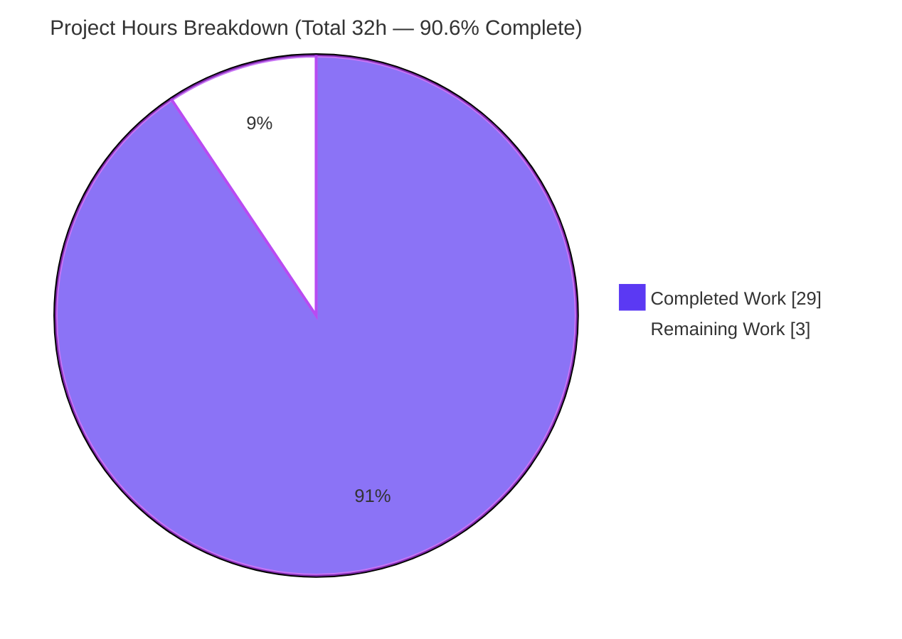
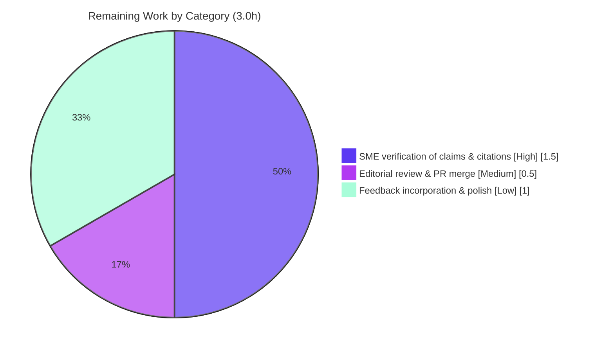

# Blitzy Project Guide

> **Project:** Code-grounded investigation — *Why wp-calypso tests pass in isolation but fail in the full suite (per-context Jest environments & module resolution)*
> **Repository:** `Automattic/wp-calypso` &nbsp;•&nbsp; **Branch:** `blitzy-2666b70d-5b97-48ce-9b72-88ce27e83c18` &nbsp;•&nbsp; **Source HEAD:** `be7e5cc641622d153040491fd5625c6cb83e12eb` &nbsp;•&nbsp; **Branch HEAD:** `2b65a8103c`
> **Task type:** Read-only Documentation / Investigation (rule set *SWE-AtlasQnA-Repo*)
> **Brand legend:** <span style="color:#5B39F3">■ Completed / AI Work (Dark Blue `#5B39F3`)</span> &nbsp;|&nbsp; <span style="color:#B23AF2">■ Remaining / Not Completed (White `#FFFFFF`, shown bordered)</span>

---

## 1. Executive Summary

### 1.1 Project Overview

This project authored one comprehensive, code-grounded Markdown document that explains why certain tests in the `Automattic/wp-calypso` monorepo pass when run in isolation yet fail in the full suite. The audience is wp-calypso maintainers and platform engineers debugging flaky tests. The investigation demonstrates that the repository deliberately splits Jest into several independent execution contexts — each with its own config, preset, setup files, globals, and a custom `calypso:src`-preferring resolver — so the same test source can run under a different environment (`node` vs `jsdom`), see a different global surface, and resolve the same import to a different file. The sole deliverable is `blitzy/documentation/wp-calypso_be7e5cc64162.md`; no source code is changed.

### 1.2 Completion Status


> **Completion: 90.6%** &nbsp;—&nbsp; computed via the PA1 AAP-scoped, hours-based method: `Completed ÷ (Completed + Remaining) = 29 ÷ 32 = 90.6%`.

| Metric | Hours |
| --- | --- |
| **Total Hours** | **32.0** |
| Completed Hours (AI + Manual) | 29.0 |
| &nbsp;&nbsp;↳ AI (autonomous) | 29.0 |
| &nbsp;&nbsp;↳ Manual (human, to date) | 0.0 |
| **Remaining Hours** | **3.0** |

*The deliverable is complete and independently validated (zero corrections required). The remaining 3.0h is path-to-production for a knowledge artifact — human SME review/acceptance and minor polish — not unfinished autonomous work. Per Blitzy honest-assessment policy, completion is capped below 100% pending human review.*

### 1.3 Key Accomplishments

- ✅ **Single deliverable authored & committed** — `blitzy/documentation/wp-calypso_be7e5cc64162.md` (395 lines / ~60 KB), the only file added versus source HEAD.
- ✅ **All five investigative questions answered with rationale + empirical evidence** (Q1 environments, Q2 globals, Q3 internal-package resolution, Q4 redirected imports, Q5 initialization order) plus a synthesis connecting every divergence to the isolation-vs-suite failure mode.
- ✅ **Grounded in code-as-truth** — every claim verified by building the repo and running its real test commands plus disposable probes (not inferred from config).
- ✅ **Empirically verified figures** — 7 test scripts; `test-packages` = 58 projects (36 `node` / 22 `jsdom`); a 12×8 `typeof` global matrix; `--listTests` = 1,628 **disjoint** files; real package test (explat) **5/5 passed**.
- ✅ **Source tree fully pristine** — no existing file modified, no extra code; all 12 temporary probes + temp config removed; `git status --porcelain` empty.
- ✅ **Independently re-validated** — the Final Validator re-grounded every claim with zero corrections; all `path:Lnn` citations and `test/module-resolver.js` byte-identity confirmed.

### 1.4 Critical Unresolved Issues

| Issue | Impact | Owner | ETA |
| --- | --- | --- | --- |
| *(None blocking)* — the deliverable is complete and validated | No release/validation blockers | — | — |
| Human SME acceptance of the document not yet performed | Process gate before sign-off; low risk (validator found zero corrections) | Reviewing engineer / maintainer | ~2.0h (HT-1 + HT-2) |
| Underlying test flakiness remains (diagnosed, **not fixed** — out of scope) | Operational; teams must act on the document's recommendations to remediate | wp-calypso test owners | Out of scope for this task |

### 1.5 Access Issues

**No access issues identified.** The repository was fully accessible, dependencies installed successfully (`yarn install --immutable`, exit 0, ~3.1 GB `node_modules`), and every test command executed without permission, credential, or network barriers.

| System/Resource | Type of Access | Issue Description | Resolution Status | Owner |
| --- | --- | --- | --- | --- |
| Source repository (`Automattic/wp-calypso`) | Read/Write (branch) | None | ✅ Resolved (no issue) | — |
| npm / Yarn registry (dependency install) | Network/Read | None — install completed | ✅ Resolved (no issue) | — |
| External services / APIs | N/A | None required (suite disables network via `nock`) | ✅ N/A | — |

### 1.6 Recommended Next Steps

1. **[High]** SME spot-check the empirical claims — reproduce a representative sample (e.g. `--showConfig` 36/22 split; a few `path:Lnn` citations; Q3 `require.resolve`; Q4 mapping) to confirm code-grounding (~1.5h).
2. **[Medium]** Editorial read-through of the 395-line document for clarity/completeness against the five questions, then **approve & merge** the PR (~0.5h).
3. **[Low]** Incorporate any review feedback and re-verify Markdown rendering (mermaid diagram + tables) in the target viewer (~0.75h).
4. **[Low]** Add a HEAD-pin "drift-refresh" maintenance note so the document is re-validated if wp-calypso's Jest configs change upstream (~0.25h).
5. **[Low / separate effort]** If desired, open a follow-up *remediation* task (out of scope here) to fix the flaky tests using the document's failure-mode mapping.

---

## 2. Project Hours Breakdown

### 2.1 Completed Work Detail

Every completed component traces to an AAP requirement (Q1–Q5, synthesis, deliverable authoring, rule compliance) or a path-to-production prerequisite (environment provisioning).

| Component | Hours | Description |
| --- | --- | --- |
| Environment provisioning & pinned toolchain | 2.0 | Provision Node `v22.23.1` (satisfies `^v22.9.0`), Yarn `4.0.2` via Corepack; `yarn install` into ~3.1 GB `node_modules` (lone non-fatal `YN0066` warning). [Path-to-production] |
| Q1 — Test commands & runtime environments | 3.0 | Enumerate 7 `test*` scripts; map each to its per-context config and effective environment; confirm base `node` default, apps `jsdom` override, and `test-packages` = 58 projects (36 `node` / 22 `jsdom`) via `--showConfig`. |
| Q2 — Per-context global surface (incl. §3.5 variants) | 5.0 | Build a 12×8 `typeof` matrix across contexts; identify one-context-only globals (`google`); document the intra-`test-packages` `fetch` flip and the four per-package setup variants (A/B/C/D). |
| Q3 — Internal-package resolution | 2.5 | `explat-client-react-helpers → explat-client`; capture runtime `require.resolve` → `src/index.ts` (`calypso:src`); confirm absent `dist/cjs`; outside-Jest `MODULE_NOT_FOUND` contrast. |
| Q4 — Redirected imports | 2.5 | Trace `@automattic/calypso-config` `moduleNameMapper` across six contexts; runtime resolution to the app shim vs the real package source. |
| Q5 — Initialization order & browser-API provenance | 3.0 | Lifecycle marker probe (27-cell matrix); two-provider model (jsdom env vs `setup-test-framework.js`); `setupFilesAfterEnv` replace-vs-merge nuance; mermaid diagram. |
| Synthesis — isolation-vs-suite failure analysis | 2.5 | `--listTests` across six contexts (1,628 **disjoint** files); fresh-env-per-file probe; map each Q1–Q5 divergence to a concrete failure mode. |
| Document authoring & references | 5.5 | Compose the 395-line Markdown deliverable: 8 sections, evidence tables, mermaid diagram, `path:Lnn` citations, and the references section (§8.1 repo evidence, §8.2 Jest semantics). |
| Autonomous code-review & QA correction cycles | 2.0 | Commits 2 & 3: correct `test-packages` accuracy & synthesis claims; align the intro failure mechanism with runtime evidence (QA-critical). |
| Probe hygiene & pristine-tree verification | 1.0 | Remove all 12 disposable probes + temp lifecycle config; confirm `git status --porcelain` empty; commit the deliverable. |
| **Total Completed** | **29.0** | |

### 2.2 Remaining Work Detail

Each category is path-to-production for a knowledge artifact; there is **no** deployment/CI/integration/env-config work for a read-only document.

| Category | Hours | Priority |
| --- | --- | --- |
| Human SME verification of empirical claims & citations | 1.5 | High |
| Editorial review & PR merge approval | 0.5 | Medium |
| Review-feedback incorporation & final polish | 1.0 | Low |
| **Total Remaining** | **3.0** | — |

### 2.3 Basis of Estimate & Confidence

- **Method:** PA1/PA2 AAP-scoped, hours-based. `Completion % = 29 ÷ (29 + 3) = 90.6%`.
- **Confidence — High** for completed work: the deliverable exists, is committed, and every claim was independently re-grounded against runtime with zero corrections; several figures were re-confirmed live during this assessment.
- **Confidence — High** for remaining work: the scope is a bounded human review/acceptance gate, not open-ended engineering.
- **Integrity:** Section 2.1 (29.0) + Section 2.2 (3.0) = 32.0 Total Hours (matches §1.2). Section 2.2 sum (3.0) = §1.2 Remaining = §7 "Remaining Work".

---

## 3. Test Results

All entries below originate from **Blitzy's autonomous validation logs** for this project (the Final Validator's grounding runs; several were independently re-confirmed during this assessment). Because the AAP is a **read-only investigation that adds no test code**, "tests" here are the grounding/verification executions that prove the document's claims. Framework: **Jest 29.7.0** (per-context configs), executed via the repository-pinned Yarn 4.0.2.

| Test Category | Framework | Total | Passed | Failed | Coverage % | Notes |
| --- | --- | --- | --- | --- | --- | --- |
| Context execution (all 6 Jest contexts run successfully) | Jest 29.7.0 | 6 | 6 | 0 | N/A | client, server, packages, apps, build-tools, integration — all execute (transforms/babel-jest work). |
| Real internal-dependency package test (Q3) | Jest 29.7.0 | 5 | 5 | 0 | N/A | `packages/explat-client-react-helpers/src/test/index.tsx` — `Test Suites: 1 passed`, `Tests: 5 passed`. Re-confirmed live in this assessment. |
| Disposable probe tests (Q1–Q5 grounding) | Jest 29.7.0 | 12 | 12 | 0 | N/A | Placed under each context's `testMatch`; printed `typeof`/`require.resolve`; all passed; all removed afterward. |
| Initialization-order lifecycle probe (Q5) | Jest 29.7.0 (temp config) | 1 | 1 | 0 | N/A | 27-cell lifecycle matrix reproduced exactly (env→setupFiles→framework→setupFilesAfterEnv→test). |
| Empirical-claim verification (programmatic diffs) | Custom (Node/scripts) | 123 cells | 123 | 0 | N/A | Q2 12×8 `typeof` matrix (96 cells, 0 mismatches) + Q5 27-cell matrix; 100% agreement with the document. |
| Configuration/topology verification | Jest `--showConfig` / `--listTests` | — | — | — | N/A | `test-packages` = 58 projects (36 `node` / 22 `jsdom`); `--listTests` = 1,628 files (client 1392, server 12, build-tools 1, integration 3, packages 216, apps 4), **disjoint**. All re-confirmed live. |

> **Coverage %** is **N/A**: the deliverable is a documentation artifact, not new application code, so no coverage target applies. The relevant quality bar — *every empirical claim matches observed runtime behavior* — was met at **100%** (zero discrepancies).

---

## 4. Runtime Validation & UI Verification

**Runtime health (build & execution):**
- ✅ **Operational** — Repository builds/installs cleanly (`yarn install --immutable`, exit 0; ~3.1 GB `node_modules`).
- ✅ **Operational** — All six Jest contexts execute (TS/JSX transforms via `babel-jest` work; tests run).
- ✅ **Operational** — Real package test (`explat-client-react-helpers`) passes 5/5.
- ✅ **Operational** — Deliverable is **well-formed Markdown**: 395 lines, balanced code fences (count = 2), one valid mermaid flowchart, 58 well-formed table rows.
- ✅ **Operational** — Source tree pristine after all validation (`git status --porcelain` empty).

**API integration:**
- ⚠ **N/A** — No APIs or external services are part of this task; the test suite explicitly **disables network** via `nock.disableNetConnect()`. No credentials or endpoints required.

**UI verification:**
- ⚠ **N/A** — This is a **documentation/investigation deliverable**; no web UI or frontend component was produced or is in scope. No Figma frames or design references were provided (AAP §0.9). Consequently, no screenshots, responsive checks, or visual-fidelity verification apply. The artifact's "UI" is its rendered Markdown, validated for structural well-formedness above.

---

## 5. Compliance & Quality Review

This matrix cross-maps each AAP deliverable/rule to its verification status. All "Fixes applied" reflect Blitzy's autonomous code-review/QA cycles (commits 2 & 3).

| # | AAP Deliverable / Rule (SWE-AtlasQnA-Repo) | Benchmark | Status | Evidence / Notes |
| --- | --- | --- | --- | --- |
| 1 | Deliverable is a new Markdown file named `<branch>.md` in `blitzy/documentation/` | Correct name & location | ✅ Pass | `blitzy/documentation/wp-calypso_be7e5cc64162.md` present & committed |
| 2 | Answer Q1 — test commands & runtime environments | Complete + rationale | ✅ Pass | Doc §2; 7 scripts; 36/22 split verified |
| 3 | Answer Q2 — per-context globals; name a one-context-only global | Complete + rationale | ✅ Pass | Doc §3; `google` client-only; §3.5 variants |
| 4 | Answer Q3 — internal-package resolution; vary by execution? | Complete + rationale | ✅ Pass | Doc §4; `→ src/index.ts`; outside-Jest `MODULE_NOT_FOUND` |
| 5 | Answer Q4 — redirected import resolves differently per context | Complete + rationale | ✅ Pass | Doc §5; shim vs real source |
| 6 | Answer Q5 — initialization order & browser-API provenance | Complete + rationale + empirical | ✅ Pass | Doc §6; 27-cell lifecycle; mermaid |
| 7 | Synthesis — connect divergences to isolation-vs-suite failures | Coherent explanation | ✅ Pass | Doc §7; 1,628 disjoint; fresh-env confirmed |
| 8 | Ground every answer in observed behavior (code-as-truth, not inference) | Build & run the repo | ✅ Pass | All claims from probes/runs; re-validated, zero corrections |
| 9 | Provide reasoning/rationale, not just conclusions | Evidence + rationale pairing | ✅ Pass | Each Q pairs evidence with config/preset rationale; §1.4 "how to read" |
| 10 | Do **not** modify any existing source file | Pristine tree | ✅ Pass | `git status --porcelain` empty; only 1 file added vs source HEAD |
| 11 | Do **not** add code beyond the one document | Single artifact | ✅ Pass | `blitzy/` contains exactly one file |
| 12 | Clean up all temporary probe files | No residual probes | ✅ Pass | 12 probes + temp config removed; `find` returns empty |
| 13 | Citations accurate (`path:Lnn`) | 100% correct | ✅ Pass | Independently spot-checked byte-for-byte; resolver copy byte-identical |
| 14 | Markdown well-formed (renders correctly) | Balanced fences, valid mermaid/tables | ✅ Pass | 395 lines; fences = 2; 1 mermaid; 58 table rows |

**Outstanding compliance items:** none. **Human acceptance** (a process gate, not a defect) remains — see §2.2.

---

## 6. Risk Assessment

| Risk | Category | Severity | Probability | Mitigation | Status |
| --- | --- | --- | --- | --- | --- |
| **R1** Documentation staleness — findings/citations are pinned to HEAD `be7e5cc641`; upstream Jest-config churn could drift specific line numbers/counts | Technical | Low | Medium | Document explicitly pins HEAD + toolchain versions; treat as a point-in-time snapshot; add a drift-refresh note (HT-4) | Mitigated |
| **R2** Reproduction requires a heavy environment (~3.1 GB `node_modules`, Node 22, Yarn 4) | Technical | Low | Low | Development Guide (§9) documents exact toolchain and tested commands | Open (informational) |
| **R3** Security exposure | Security | Low | Low | Read-only doc; **zero** dependency changes; no secrets; no added code. Lone `YN0066` install warning (TS compat-patch hunk) is non-fatal and affects no finding | No action needed |
| **R4** Underlying test flakiness remains — the document **diagnoses/explains but does not fix** it | Operational | Medium | N/A (by design) | Synthesis (§7) maps each failure mode → root cause to enable targeted human remediation; remediation is an explicit AAP scope boundary | Accepted (out of scope) |
| **R5** No automated drift detection for the document | Operational | Low | Low | HEAD pin + optional maintenance note/issue (HT-4) | Accepted |
| **R6** External-integration failure | Integration | None | None | No external services/APIs/credentials/network; suite disables net via `nock` | No action needed |
| **R7** Human acceptance pending — autonomously validated (zero corrections) but not yet SME-reviewed | Process | Low | Low | SME spot-check of a sample of `path:Lnn` citations and reproduction commands (HT-1) | Open (= the 3.0h remaining) |

**Overall risk posture: LOW.** The only Medium-severity item (R4) is an explicit, intentional scope boundary — the task was to *diagnose*, not *fix*.

---

## 7. Visual Project Status

**Project hours — completed vs remaining** (Blitzy brand colors: Completed `#5B39F3`, Remaining `#FFFFFF`):



**Remaining hours by category** (from §2.2 — sums to 3.0h):



> **Integrity check:** the pie chart "Remaining Work" (3) equals §1.2 Remaining Hours (3.0) and the §2.2 "Hours" column sum (3.0). "Completed Work" (29) equals §1.2 Completed Hours and the §2.1 total (29.0).

---

## 8. Summary & Recommendations

**Achievements.** The project is **90.6% complete (29h of 32h)**. It delivered exactly what the AAP scoped: one rigorous, code-grounded Markdown document that answers all five questions — with explicit rationale — about why wp-calypso tests pass in isolation but fail in the full suite. The explanation is anchored in verifiable runtime facts: a base `node` environment with `jsdom` opt-ins, a 58-project `test-packages` runner (36 `node` / 22 `jsdom`), a `google`-style one-context-only global, a custom `calypso:src`-preferring resolver that loads untranspiled source inside Jest, a `moduleNameMapper` that redirects `@automattic/calypso-config` to different files per context, and an empirically observed initialization lifecycle with two distinct browser-API providers. The synthesis ties these to the failure pattern and proves (via 1,628 disjoint `--listTests` files and a fresh-env probe) that the operative cause is command-vs-command context differences, not cross-file leakage.

**Remaining gaps & critical path to production.** No autonomous work remains. The critical path is purely human: (1) SME spot-check of a representative sample of the empirical claims (~1.5h), (2) editorial review and PR merge (~0.5h), and (3) optional feedback-driven polish plus a drift-refresh note (~1.0h) — **3.0h total**.

**Success metrics (all met).** All 5 questions answered with rationale ✅; every claim code-grounded and independently re-validated with zero corrections ✅; source tree pristine ✅; all probes cleaned up ✅; deliverable well-formed and committed ✅.

**Production-readiness assessment.** The deliverable is **production-ready pending human acceptance**. For a knowledge artifact, "production" means review, approval, and merge — there is no deployment, CI, or integration surface. Risk is **LOW**; the only Medium item (R4) is the intentional decision to diagnose rather than fix. Recommendation: proceed with the §1.6 next steps; separately, consider a follow-up remediation task that uses this document's failure-mode mapping to actually stabilize the flaky tests.

| Metric | Value |
| --- | --- |
| Completion | 90.6% |
| Completed / Total hours | 29.0 / 32.0 |
| Remaining hours | 3.0 |
| AAP requirements completed | 12 of 14 (2 remaining are human path-to-production gates) |
| Autonomous corrections required by validator | 0 |
| Overall risk | Low |

---

## 9. Development Guide

This guide explains how to provision the environment, reproduce the investigation's findings, and view the deliverable. **All commands below were tested during this assessment.** Run everything from the repository root.

### 9.1 System Prerequisites

- **OS:** Linux/macOS (validated on Ubuntu 25.10 container).
- **Node.js:** must satisfy `engines.node = "^v22.9.0"`. `.nvmrc` pins `22.9.0`; container used `v22.23.1` (in range). Use `nvm` to match the pin if needed.
- **Yarn:** `4.0.2`, provided via **Corepack** (`packageManager: "yarn@4.0.2"`). Do **not** use a global Yarn 1.x.
- **Disk:** ≥ ~4 GB free (the `node_modules/` install is ~3.1 GB).
- **Git:** for status/diff verification.

### 9.2 Environment Setup

```bash
# 1) Match the pinned Node version (optional but recommended)
nvm install            # reads .nvmrc (22.9.0)
nvm use

# 2) Enable Corepack so the repo-pinned Yarn 4.0.2 is used
corepack enable

# 3) Verify the toolchain (expected values shown)
node --version         # v22.x (>= v22.9.0)   e.g. v22.23.1
corepack --version     # e.g. 0.34.6
yarn --version         # 4.0.2
```

### 9.3 Dependency Installation

```bash
# Standard install into the untracked node_modules/ (~3.1 GB)
yarn install

# CI / verification variant — fails if the lockfile would change (tested: exit 0)
yarn install --immutable
```

> A single **non-fatal** warning `YN0066` (a TypeScript compat-patch hunk, "Cannot apply hunk #1") may appear. It does **not** affect test execution or any finding.

Confirm Jest is wired up:

```bash
yarn jest --version    # 29.7.0
```

### 9.4 Running the Test Contexts

```bash
# Each context maps to a per-context Jest config under test/
yarn test-client          # TZ=UTC jest -c=test/client/jest.config.js   (large: ~1392 files)
yarn test-server          # jest -c=test/server/jest.config.js
yarn test-packages        # jest -c=test/packages/jest.config.js        (58-project runner)
yarn test-apps            # jest -c=test/apps/jest.config.js
yarn test-build-tools     # jest -c=test/build-tools/jest.config.js
yarn test-integration     # jest -c=test/integration/jest.config.js

# Aggregate (NOT watch mode):
yarn test                 # run-s -s test-client test-packages test-server test-build-tools
```

### 9.5 Verification — Reproduce the Document's Key Findings

```bash
# Keep the tree pristine: redirect Jest cache to /tmp during reproduction
export JEST_CACHE=/tmp/jest_cache_probe

# Q1 — confirm the test-packages node/jsdom split (expected: 36 node + 22 jsdom = 58 projects)
yarn jest -c=test/packages/jest.config.js --showConfig 2>/dev/null \
  | grep -o '"testEnvironment": *"[^"]*"' | sort | uniq -c

# Synthesis — per-context test file counts (filter to ABSOLUTE PATHS to avoid warning pollution)
for ctx in server build-tools integration apps packages; do
  n=$(yarn jest -c=test/$ctx/jest.config.js --listTests 2>/dev/null | grep -c '^/')
  echo "listTests $ctx = $n"
done
# Expected: server 12, build-tools 1, integration 3, apps 4, packages 216 (client = 1392)

# Q3 — run the real internal-dependency package test (expected: 5 passed, 5 total)
yarn jest -c=test/packages/jest.config.js packages/explat-client-react-helpers

# Cleanup the probe cache, then confirm the tree is still pristine
rm -rf /tmp/jest_cache_probe
git status --porcelain      # expected: empty (0 lines)
```

### 9.6 Viewing the Deliverable

```bash
# Read the investigation document
less blitzy/documentation/wp-calypso_be7e5cc64162.md

# Quick structural sanity (expected: lines=395, fences=2 (balanced), mermaid=1)
wc -l blitzy/documentation/wp-calypso_be7e5cc64162.md
grep -c '```' blitzy/documentation/wp-calypso_be7e5cc64162.md
grep -c 'mermaid' blitzy/documentation/wp-calypso_be7e5cc64162.md
```

Render the Markdown (including the mermaid diagram) in any GitHub-flavored Markdown viewer or an editor with a mermaid preview.

### 9.7 Troubleshooting

- **`--listTests` count looks too high (e.g. integration shows 7 not 3):** the output is being polluted by `jest-haste-map: duplicate manual mock found: wpcom-proxy-request` warning lines (they contain `.js` substrings and print to stdout). **Always filter to absolute paths:** `... --listTests 2>/dev/null | grep -c '^/'`. (This is a known counting pitfall; the document's figures are correct.)
- **`yarn` resolves to v1.x:** run `corepack enable` so the repo-pinned `yarn@4.0.2` is used. Confirm with `yarn --version` → `4.0.2`.
- **Node version errors / engine warnings:** ensure Node satisfies `^v22.9.0` (`nvm install && nvm use` reads `.nvmrc`).
- **Out-of-memory on the client context:** it is large (~1392 files); bound workers with `yarn test-client --maxWorkers=2`. Never use watch mode in CI.
- **Tree shows changes after running tests:** ensure the Jest cache is redirected (`export JEST_CACHE=/tmp/...`) — the in-repo `.cache/jest` is git-ignored, but redirecting avoids any doubt; remove any stray temp files and re-check `git status --porcelain`.

---

## 10. Appendices

### Appendix A — Command Reference

| Purpose | Command |
| --- | --- |
| Enable pinned Yarn | `corepack enable` |
| Toolchain versions | `node --version` • `yarn --version` • `yarn jest --version` |
| Install dependencies | `yarn install` |
| Verify lockfile (CI) | `yarn install --immutable` |
| Run a context | `yarn test-<client\|server\|packages\|apps\|build-tools\|integration>` |
| Aggregate test run | `yarn test` |
| Inspect packages config | `yarn jest -c=test/packages/jest.config.js --showConfig` |
| List tests (robust count) | `yarn jest -c=test/<ctx>/jest.config.js --listTests 2>/dev/null \| grep -c '^/'` |
| Run one package's tests | `yarn jest -c=test/packages/jest.config.js packages/explat-client-react-helpers` |
| Pristine check | `git status --porcelain` |
| View deliverable | `less blitzy/documentation/wp-calypso_be7e5cc64162.md` |

### Appendix B — Port Reference

**Not applicable.** This task starts no long-running services and exposes no ports. The Jest suite disables network access via `nock.disableNetConnect()`.

### Appendix C — Key File Locations

| Path | Role |
| --- | --- |
| `blitzy/documentation/wp-calypso_be7e5cc64162.md` | **The deliverable** (only file added) |
| `package.json` | `test*` scripts (`L120`–`L131`), `engines.node` (`L57`), `packageManager` (`L422`), `workspaces` |
| `packages/calypso-jest/jest-preset.js` | Base preset: `testEnvironment: 'node'` (`L11`), `resolver` (`L9`), base `setupFilesAfterEnv` (`L10`) |
| `packages/calypso-jest/src/module-resolver.js` | Custom resolver — `mainFields: ['calypso:src','main']` (`L18`) |
| `packages/calypso-jest/src/setup.js` | Base setup — `global.CSS = { supports: jest.fn() }` |
| `test/module-resolver.js` | Byte-identical copy of the calypso-jest resolver |
| `test/client/jest.config.js` | Client: `calypso-config` map (`L11`), `globals.google` (`L23`), `__i18n_text_domain__` (`L24`) |
| `test/server/jest.config.js` | Server: `calypso-config` map (`L10`–`L11`), minimal setup |
| `test/packages/jest.config.js` + `jest-preset.js` + `setup.js` | Packages multi-project runner; preset globals; polyfills |
| `test/apps/jest-preset.js` | Apps preset — `testEnvironment: 'jsdom'` override (`L7`) |
| `test/build-tools/jest.config.js` • `test/integration/jest.config.js` | Build-tools (`node`) • Integration (`node`, explicit resolver) |
| `test/client/setup-test-framework.js` • `test/server/setup-test-framework.js` | Browser-API polyfills (client) • minimal (server) |
| `packages/explat-client-react-helpers/**` • `packages/explat-client/package.json` | Q3 internal-dependency pair (`calypso:src` vs `main`) |
| `packages/calypso-config/package.json` | Q4 redirected-import package |
| `.nvmrc` • `.yarnrc.yml` | Node pin (`22.9.0`) • Yarn pin (`4.0.2`, `nodeLinker: node-modules`) |

### Appendix D — Technology Versions

| Component | Version | Source of truth |
| --- | --- | --- |
| Node.js | `v22.23.1` (range `^v22.9.0`; pin `22.9.0`) | `package.json:L57`, `.nvmrc` |
| Yarn | `4.0.2` (via Corepack) | `package.json:L422`, `.yarnrc.yml` |
| Corepack | `0.34.6` | runtime |
| Jest | `29.7.0` | `package.json` devDependencies |
| babel-jest | `29.7.0` | `packages/calypso-jest` |
| enhanced-resolve | `5.9.3` | resolver engine |
| TypeScript | `5.8.2` | devDependencies (source of lone `YN0066` warning) |

### Appendix E — Environment Variable Reference

| Variable | Value / Example | Purpose |
| --- | --- | --- |
| `TZ` | `UTC` | Set by `test-client` for deterministic time-based tests |
| `JEST_CACHE` | `/tmp/jest_cache_probe` | (Reproduction only) redirect Jest cache off-tree to keep the repo pristine |
| `CI` | `true` | (Optional) force non-interactive Jest behavior in automation |

*No secrets or service credentials are required by this task.*

### Appendix F — Developer Tools Guide

**Not applicable.** No browser/web-application surface is involved, so browser DevTools, Lighthouse, performance traces, and screenshots do not apply. The only "tooling" is the Jest CLI introspection used above (`--showConfig`, `--listTests`), documented in Appendix A and §9.5.

### Appendix G — Glossary

| Term | Meaning |
| --- | --- |
| **Execution context** | One of the six per-context Jest configurations (client, server, packages, apps, build-tools, integration), each with its own environment, globals, setup files, and resolver. |
| **`testEnvironment`** | Jest's environment per test file — `node` (no DOM) or `jsdom` (provides `window`/`document`). |
| **`calypso:src`** | A `package.json` field pointing at untranspiled `src/`; the custom resolver prefers it so Jest loads source directly without a build. |
| **`moduleNameMapper`** | Jest config that rewrites an import request string *before* the resolver runs (used to redirect `@automattic/calypso-config`). |
| **`setupFiles` / `setupFilesAfterEnv`** | Setup hooks that run *before* / *after* the test framework is installed, respectively. |
| **Docblock opt-in** | A `/** @jest-environment jsdom */` comment that switches a single file to `jsdom`. |
| **Probe** | A disposable test file used to observe runtime behavior, then deleted. |
| **Pristine tree** | Working tree with no tracked changes (`git status --porcelain` empty) apart from the single intended deliverable. |
| **PA1 / PA2** | Blitzy AAP-scoped completion methodology / engineering-hours estimation framework. |

---

*Cross-section integrity verified before submission — Rule 1: Remaining hours = 3.0 across §1.2, §2.2, §7 ✅ · Rule 2: §2.1 (29.0) + §2.2 (3.0) = 32.0 Total ✅ · Rule 3: all §3 tests originate from Blitzy autonomous validation logs ✅ · Rule 4: access issues validated (none) ✅ · Rule 5: Completed `#5B39F3` / Remaining `#FFFFFF` applied ✅. Completion 90.6% consistent across §1.2, §7, §8.*