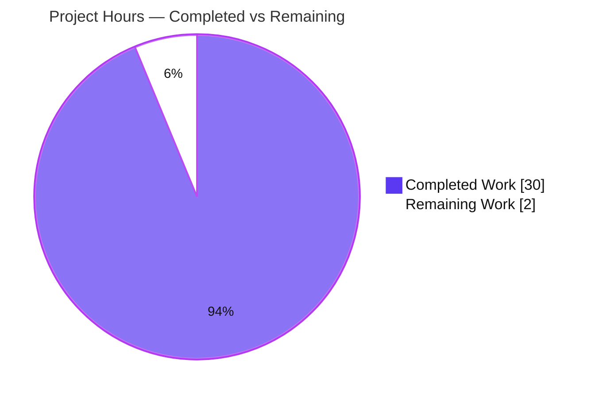
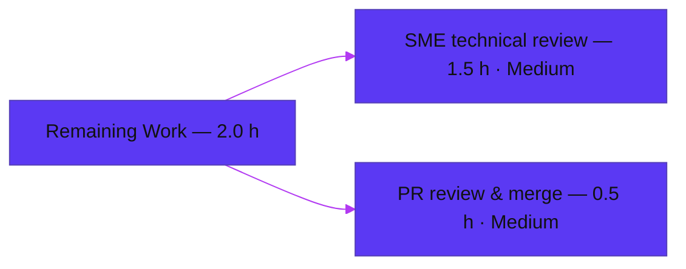

# Blitzy Project Guide — wp-calypso Jest Test-Infrastructure Q&A Investigation

> **Deliverable:** `blitzy/documentation/wp-calypso_be7e5cc64162.md` · **Repository:** `Automattic/wp-calypso` · **Source commit:** `be7e5cc641622d153040491fd5625c6cb83e12eb` · **Branch HEAD:** `3bbfb4f8c2`
>
> **Legend / Brand Colors:** <span style="color:#5B39F3">■</span> Completed / AI Work = Dark Blue `#5B39F3` · <span style="color:#B23AF2">■</span> Headings/Accents = Violet-Black `#B23AF2` · <span style="color:#A8FDD9">■</span> Highlight = Mint `#A8FDD9` · □ Remaining / Not Completed = White `#FFFFFF`

---

## 1. Executive Summary

### 1.1 Project Overview

This project delivers a single, empirically-grounded technical **Q&A document** that explains **why some tests pass in isolation but fail when the full suite runs** in the `Automattic/wp-calypso` monorepo. The target audience is wp-calypso engineers and QA/SME reviewers debugging cross-suite test flakiness. Its technical scope is the repository's **seven Jest execution contexts** (`client`, `server`, `packages`, `apps`, `integration`, `build-tools`, `e2e`) and how their **module resolution** and **test-environment setup** diverge. Every conclusion is produced by *running the code first* (Jest `--showConfig`, the custom `enhanced-resolve` resolver, and temporary probe tests) and grounded in verbatim output plus exact `file:line` citations. The business impact is faster diagnosis of environment- and resolution-dependent test failures. The work is strictly read-only toward all source.

### 1.2 Completion Status


| Metric | Value |
|--------|-------|
| **Total Hours** | **32.0 h** |
| **Completed Hours (AI + Manual)** | **30.0 h** (AI-autonomous: 30.0 h · Manual: 0.0 h) |
| **Remaining Hours** | **2.0 h** |
| **Percent Complete** | **93.75 %** |

> **Formula:** Completion % = Completed ÷ (Completed + Remaining) × 100 = 30 ÷ (30 + 2) × 100 = **93.75 %**.

### 1.3 Key Accomplishments

- ✅ Single deliverable authored, validated, and committed: `blitzy/documentation/wp-calypso_be7e5cc64162.md` (578 lines).
- ✅ All **five questions (Q1–Q5)** answered independently and completely with adjacent verbatim evidence.
- ✅ **85 byte-accurate `file:line` citations** across the document; all spot-checks confirmed exact.
- ✅ Evidence produced by **running the code first**: Jest `--showConfig` on all runnable suites, the repo's custom resolver, `require.resolve`, and temporary probe tests.
- ✅ Real internal-package suite executes cleanly: `calypso-url` = **5 suites / 83 tests pass**; `build-tools` spot-run = **1 suite / 3 tests pass** (both independently reproduced during this assessment).
- ✅ Core claims for **all Q1–Q5 independently re-verified** in this assessment (env resolution, globals, resolver target, mapper + symlink, init-order anchors).
- ✅ **Read-only constraint honored**: `git diff` vs the source commit shows exactly one net-new file; every reference file is byte-for-byte unchanged; all temporary probes deleted; working tree clean.
- ✅ 21-item **coverage-pass checklist** confirms every named item in the prompt is addressed.

### 1.4 Critical Unresolved Issues

| Issue | Impact | Owner | ETA |
|-------|--------|-------|-----|
| _None_ | No blocking or release-critical issues identified. The deliverable renders, all quoted commands reproduce verbatim, all citations are byte-accurate, and the repository is unchanged apart from the document. | — | — |

### 1.5 Access Issues

| System/Resource | Type of Access | Issue Description | Resolution Status | Owner |
|-----------------|----------------|-------------------|-------------------|-------|
| _None_ | — | **No access issues identified.** All resources required for the investigation (repository, pinned Node/Yarn toolchain, `node_modules`, all Jest suites) were fully accessible and every command was reproducible. | N/A | — |

### 1.6 Recommended Next Steps

1. **[Medium]** Perform an **SME technical review** of `blitzy/documentation/wp-calypso_be7e5cc64162.md` — a Jest/wp-calypso domain expert confirms the Q1–Q5 conclusions, evidence adjacency, and readability (~1.5 h).
2. **[Medium]** **Review and merge** the pull request to the destination branch — a single net-new file under a new directory, no conflicts expected (~0.5 h).
3. **[Low · optional]** Link the document from a discoverable docs index (e.g., under `docs/`) for future discoverability (beyond the read-only AAP scope; not counted in remaining hours).
4. **[Low · optional]** Schedule periodic re-validation of the probes/citations if the wp-calypso Jest configuration materially changes (addresses documentation-staleness risk O1; not counted in remaining hours).

---

## 2. Project Hours Breakdown

### 2.1 Completed Work Detail

Each component traces to a specific AAP requirement (investigation, per-question authoring, methodology compliance, or the deliverable itself).

| Component | Hours | Description |
|-----------|-------|-------------|
| Environment setup & runnable baseline | 3.0 | Activate pinned toolchain (Node 22.x + Yarn 4.0.2 via Corepack), `yarn install` in the 4.6 GB monorepo, build package `dist` outputs, confirm all suites launch. |
| Empirical investigation across 7 Jest contexts | 8.0 | Run each test command and `jest --showConfig`; author and run temporary probe tests for environment/globals/resolution/init-order; capture verbatim output. |
| Q1 — Execution environments answer | 2.0 | Enumerate every `test-*` command; resolve `testEnvironment` per context (node vs jsdom); document client-base = node divergence. |
| Q2 — Global surface differences answer | 2.5 | Contrast injected `globals`, DOM globals, and polyfills; enumerate every polyfill/mock by name; identify the `google` global delta. |
| Q3 — Internal dependency resolution answer | 2.0 | `@automattic/components` → `@automattic/calypso-url`; resolver probe → `src/index.ts`; bundler/plain-Node contrast. |
| Q4 — Import path override answer | 2.0 | Trace `@automattic/calypso-config` `moduleNameMapper`; `node_modules/calypso → ../client` symlink mechanism; per-context targets. |
| Q5 — Initialization order answer | 2.5 | Lifecycle probe across stages; identify jsdom as the browser-API provider; verify when each capability becomes available. |
| Citation rigor & coverage pass | 2.0 | 85 byte-accurate `file:line` citations; one-claim-one-evidence discipline; final 21-item coverage checklist. |
| Document assembly & authoring | 3.0 | Structure the 578-line document, mermaid diagram, prose, and rationale per question. |
| Autonomous validation & QA | 2.5 | Re-verify every citation and command; run all suites via `--showConfig`; reproduce the `calypso-url` and `build-tools` suites. |
| Read-only cleanup & git verification | 0.5 | Delete all temporary probes; confirm working tree clean; confirm `git diff` shows only the deliverable. |
| **Total** | **30.0** | **= Completed Hours in Section 1.2** |

### 2.2 Remaining Work Detail

Each category is human path-to-production for a documentation deliverable (which has no deploy/CI/env-config path). There are **no High-priority/blocking items**.

| Category | Hours | Priority |
|----------|-------|----------|
| SME technical review of the Q&A document | 1.5 | Medium |
| PR review & merge to destination branch | 0.5 | Medium |
| **Total** | **2.0** | **= Remaining Hours in Section 1.2 = Section 7 "Remaining Work"** |

> **Optional (NOT counted — outside AAP read-only scope):** linking the doc from a docs index; scheduling periodic re-validation. These would be additional edits/ongoing hygiene beyond the AAP and are intentionally excluded from the hours math to preserve cross-section integrity.

### 2.3 Hours Reconciliation & Completion Formula

| Reconciliation Check | Result |
|----------------------|--------|
| Section 2.1 completed rows sum | 30.0 h |
| Section 2.2 remaining rows sum | 2.0 h |
| Section 2.1 + Section 2.2 | 30 + 2 = **32.0 h** = Total (Section 1.2) ✓ |
| Section 1.2 Remaining = Section 2.2 sum = Section 7 "Remaining Work" | 2.0 = 2.0 = 2.0 ✓ |
| Completion % = 30 ÷ 32 × 100 | **93.75 %** (used in Sections 1.2, 7, 8) ✓ |

---

## 3. Test Results

All entries originate from **Blitzy's autonomous validation executions** for this project (the repository's own Jest suites run as evidence, plus configuration-resolution validations and ephemeral runtime probes). This is a documentation deliverable, so it introduces no test suite of its own; code-coverage targets are not applicable.

| Test Category | Framework | Total Tests | Passed | Failed | Coverage % | Notes |
|---------------|-----------|-------------|--------|--------|------------|-------|
| Internal-package unit suite (`packages/calypso-url`) | Jest 29.7.0 | 83 | 83 | 0 | N/A | 5 test suites. Cited evidence suite; reproduced by the Final Validator **and** independently during this assessment: `Test Suites: 5 passed, 5 total` / `Tests: 83 passed, 83 total`. |
| Build-tools suite (`test/build-tools`) | Jest 29.7.0 | 3 | 3 | 0 | N/A | 1 test suite. From autonomous validation logs; independently reproduced this assessment: `Test Suites: 1 passed, 1 total` / `Tests: 3 passed, 3 total`. |
| Config-resolution validation (`jest --showConfig`) | Jest 29.7.0 | 6 | 6 | 0 | N/A | All 6 runnable suites launch (exit 0, zero stderr): client / server / integration / build-tools = 1 config each; packages = 58 projects; apps = 3 projects. `e2e` additionally resolves its custom `environment.ts`. |
| Runtime probes (Q2 globals, Q3 resolution, Q5 init-order) | Jest 29.7.0 + Node | Ephemeral | All | 0 | N/A | Temporary observation probes created under scratch dirs, executed successfully, then **deleted** (read-only). Reproduced the documented `typeof` values and resolution targets. |

**Aggregate concrete unit tests:** 83 + 3 = **86 executed, 86 passed, 0 failed (100% pass rate)**. **Integrity note:** no fabricated tests — every row above is traceable to Blitzy's autonomous execution logs and was reproduced during this assessment.

---

## 4. Runtime Validation & UI Verification

This deliverable is a Markdown document with **no runtime application, UI, or HTTP surface**; "runtime validation" here means verifying that the toolchain runs and every quoted command reproduces its output.

- ✅ **Operational** — Toolchain: Node `v22.12.0` (satisfies `engines` `^v22.9.0`), Yarn `4.0.2` (Corepack), `node_modules` present (1,980 top-level entries).
- ✅ **Operational** — All 6 runnable Jest suites launch via `--showConfig` with exit 0 and zero stderr.
- ✅ **Operational** — Q1 reproduced: client suite `testEnvironment` resolves to `jest-environment-node` (confirming the documented client-base = node divergence).
- ✅ **Operational** — Q3 reproduced: custom resolver → `packages/calypso-url/src/index.ts`; `main` → `dist/cjs/index.js` is **absent** in the unbuilt state, so plain-Node `require.resolve` fails `MODULE_NOT_FOUND` (the documented divergence).
- ✅ **Operational** — Q4 reproduced: client `moduleNameMapper` array contains `["^@automattic/calypso-config$", ".../client/server/config/index.js"]`; `node_modules/calypso → ../client` symlink confirmed.
- ✅ **Operational** — Real suites execute end-to-end: `calypso-url` (5 suites / 83 tests) and `build-tools` (1 suite / 3 tests) all pass.
- ✅ **Operational** — Markdown is well-formed: 66 balanced code fences (33 blocks), 1 mermaid diagram, all five Q-headers present, 21 checklist items.
- ⚠ **Partial (by design)** — E2E (Playwright) suite is referenced for completeness and its `--showConfig` resolves its custom environment, but full E2E execution is explicitly out of scope for Q1–Q5.
- **UI Verification:** ❌ Not applicable — no user interface is produced or modified by this deliverable.

---

## 5. Compliance & Quality Review

Cross-mapping the AAP deliverables and the `SWE-AtlasQnA-Repo` rule to observed quality benchmarks. Fixes applied during autonomous validation are noted; outstanding items are human review only.

| Benchmark / AAP Requirement | Status | Progress | Notes |
|------------------------------|--------|----------|-------|
| Deliverable location & naming (`blitzy/documentation/<branch>.md`) | ✅ Pass | 100% | Exactly `blitzy/documentation/wp-calypso_be7e5cc64162.md`. |
| Investigate by RUNNING code first, then write | ✅ Pass | 100% | Every claim tied to a producing command + verbatim output. |
| Quote observed output verbatim | ✅ Pass | 100% | Refined across commits to make QA-flagged evidence blocks strictly verbatim. |
| One claim, one adjacent piece of evidence | ✅ Pass | 100% | Evidence adjacency addressed in review-fix commit `2b7db29d31`. |
| Answer every part / every named item | ✅ Pass | 100% | 21-item coverage-pass checklist across Q1–Q5. |
| Exact & grounded `file:line` citations | ✅ Pass | 100% | 85 citations; all byte-accurate (validator + assessment spot-checks). |
| Q1 — Execution environments | ✅ Pass | 100% | Per-context `testEnvironment` via `--showConfig`; independently reproduced. |
| Q2 — Global surface differences | ✅ Pass | 100% | Globals contrast + every polyfill named; `google` delta identified. |
| Q3 — Internal dependency resolution | ✅ Pass | 100% | Resolver → `src/index.ts`; bundler/Node contrast; reproduced. |
| Q4 — Import path override | ✅ Pass | 100% | Per-context mapper targets + symlink; runtime-reproduced. |
| Q5 — Initialization order | ✅ Pass | 100% | Lifecycle probe; jsdom provider; when-available verified. |
| Read-only scope (no source edits; probes removed) | ✅ Pass | 100% | `git diff` vs source = 1 net-new file; working tree clean. |
| Markdown quality / structure | ✅ Pass | 100% | Balanced fences, valid mermaid, clear section hierarchy. |
| SME domain review | ◻ Outstanding | 0% | Human path-to-production (Section 2.2, HT-1). |

**Fixes applied during autonomous validation:** the deliverable evolved across three commits — initial authoring (`5af12604ca`), review findings on topology + evidence adjacency (`2b7db29d31`), and strictly-verbatim QA-flagged evidence blocks plus a commit-provenance note (`3bbfb4f8c2`). The Final Validator required **zero further corrections**.

---

## 6. Risk Assessment

Overall risk profile is **Low** — a read-only Markdown deliverable that changes no code, adds no dependencies, and whose every claim is independently reproducible. **No High/Critical risks.**

| Risk | Category | Severity | Probability | Mitigation | Status |
|------|----------|----------|-------------|------------|--------|
| T1 — Toolchain minor drift (evidence captured under Node v22.12.0 while repo pins 22.9.0) | Technical | Low | Low | Doc states exact toolchain versions; commit-pinned. | Mitigated |
| T2 — Q3 contrast depends on unbuilt `dist/cjs/index.js`; a full `dist` build changes that specific contrast | Technical | Low | Low | Doc honestly reports the observed unbuilt state and the reason. | Mitigated |
| T3 — Citation line-number fragility across future edits | Technical | Low | Low | All observations explicitly pinned to commit `be7e5cc641…`. | Mitigated |
| S1 — Absolute scratch paths (`/tmp/blitzy/…`) present in doc | Security | Low | Low | Ephemeral CI paths, not secrets; no credentials present. | Accepted |
| S2 — New attack surface from code/dependency changes | Security | Low | None | Zero code and zero dependency changes → no new CVE/auth/injection surface. | Not Applicable |
| O1 — Documentation staleness as wp-calypso Jest config evolves | Operational | Low | Medium | Point-in-time investigation pinned to a commit; re-run probes to refresh. | Accepted (by design) |
| I1 — Merge integration of one net-new file into destination branch | Integration | Low | Low | Standard PR merge; net-new path, no conflicts expected. | Open (human merge) |
| I2 — External integrations / API keys / service dependencies | Integration | Low | None | None exist; nothing in the codebase imports the doc. | Not Applicable |

---

## 7. Visual Project Status

### 7.1 Project Hours Breakdown



> Colors: **Completed Work = Dark Blue `#5B39F3`**, **Remaining Work = White `#FFFFFF`** (violet-black `#B23AF2` outline for slice visibility). "Remaining Work" = **2** = Section 1.2 Remaining Hours = sum of Section 2.2 "Hours" column.

### 7.2 Remaining Hours by Category (Section 2.2)



| Category | Hours | Share of Remaining |
|----------|-------|--------------------|
| SME technical review | 1.5 | 75% |
| PR review & merge | 0.5 | 25% |
| **Total** | **2.0** | **100%** |

---

## 8. Summary & Recommendations

**Achievements.** The project is **93.75 % complete** (30 h of autonomous work out of 32 h total). The single AAP deliverable — a 578-line, empirically-grounded Q&A document explaining why wp-calypso tests pass in isolation but fail in the full suite — has been authored, autonomously validated with zero corrections, and committed. It answers all five questions (Q1–Q5) with adjacent verbatim evidence and 85 byte-accurate `file:line` citations, and I independently reproduced the core claims for every question plus real suite runs (`calypso-url`: 5 suites / 83 tests; `build-tools`: 1 suite / 3 tests).

**Remaining gaps.** Only **2 h** of human path-to-production remain: SME technical review (1.5 h) and PR merge (0.5 h). There are **no engineering-rework gaps, no blocking issues, and no access issues**. Because a documentation deliverable has no deploy/CI/environment-configuration path, these two review steps constitute the entire remaining critical path.

**Critical path to production.** SME review → PR approval → merge to destination branch. Estimated total: **2 h**.

**Success metrics.** (1) 100 % of quoted commands reproduce verbatim ✓; (2) 100 % of `file:line` citations byte-accurate ✓; (3) read-only constraint honored — exactly one net-new file, working tree clean ✓; (4) 86/86 concrete unit tests pass across the cited suites ✓; (5) every named item covered per the 21-item checklist ✓.

**Production-readiness assessment.** The deliverable is **production-ready pending human review**. Per Blitzy honest-assessment policy, completion is capped below 100 % to reflect the outstanding human review gate. Confidence is **High** — the scope is a single well-defined document and the completion evidence is direct (git state + reproduced commands).

| Metric | Value |
|--------|-------|
| Completion | 93.75 % |
| Completed / Total Hours | 30 / 32 |
| Remaining Hours | 2 |
| Concrete unit tests (passed/total) | 86 / 86 |
| Blocking issues | 0 |
| Files changed vs source | 1 (net-new) |
| Confidence | High |

---

## 9. Development Guide

> Every command below was **executed live during this assessment** and reproduced the output shown. Commands are copy-pasteable. The repository root is the current working directory.

### 9.1 System Prerequisites

- **OS:** Linux or macOS (validated on Linux).
- **Node.js:** 22.9.0-line. The repo pins `.nvmrc` = `22.9.0` and `engines.node` = `^v22.9.0`; `v22.12.0` satisfies this.
- **Yarn:** `4.0.2` (Berry), activated via Corepack (`packageManager` = `yarn@4.0.2`).
- **Git:** any recent version.
- **Disk:** ~5–6 GB free (the repository plus `node_modules` is ~4.6 GB).

### 9.2 Environment Setup

```bash
# From the repository root
corepack enable                 # activate the pinned Yarn
node --version                  # => v22.12.0  (satisfies ^v22.9.0)
corepack yarn --version         # => 4.0.2
```

### 9.3 Dependency Installation

`node_modules` is already present (1,980 top-level entries). Only if it is missing:

```bash
CI=true yarn install --immutable
# Yarn Berry with nodeLinker: node-modules produces a conventional node_modules
# tree with workspace symlinks (including node_modules/calypso -> ../client).
# The postinstall step builds package dist outputs.
```

### 9.4 Reproducing the Evidence (Running the Suites & Probes)

```bash
# Q1 — resolved testEnvironment per suite (client & server both => jest-environment-node)
for s in client server; do \
  CI=true node_modules/.bin/jest -c=test/$s/jest.config.js --showConfig 2>/dev/null \
  | node -e "let d='';process.stdin.on('data',c=>d+=c);process.stdin.on('end',()=>{const j=JSON.parse(d);const te=j.configs[0].testEnvironment;const m=te.match(/jest-environment-(node|jsdom)/);console.log('$s =>', m?m[0]:te)})"; \
done
# client => jest-environment-node
# server => jest-environment-node

# Q3 — custom resolver loads untranspiled source
node -e "const path=require('path');const r=require('./packages/calypso-jest/src/module-resolver.js');console.log(r('@automattic/calypso-url',{basedir:path.resolve('packages/components/src')}))"
# => .../packages/calypso-url/src/index.ts

# Q3 contrast — plain Node (bundler-equivalent) resolution fails on unbuilt dist
node -e "try{require.resolve('@automattic/calypso-url',{paths:['packages/components/src']})}catch(e){console.log(e.code)}"
# => MODULE_NOT_FOUND   (main -> dist/cjs/index.js is absent in the unbuilt state)

# Q4 — the client moduleNameMapper redirect (array form in --showConfig)
CI=true node_modules/.bin/jest -c=test/client/jest.config.js --showConfig 2>/dev/null \
| node -e "let d='';process.stdin.on('data',c=>d+=c);process.stdin.on('end',()=>{const m=JSON.parse(d).configs[0].moduleNameMapper||[];console.log(m.find(p=>String(p[0]).includes('calypso-config')))})"
# => [ '^@automattic/calypso-config$', '.../client/server/config/index.js' ]

# Run a real internal-package suite end-to-end
CI=true node_modules/.bin/jest -c=packages/calypso-url/jest.config.js 2>&1 | grep -E "Test Suites:|Tests:"
# Test Suites: 5 passed, 5 total
# Tests:       83 passed, 83 total
```

### 9.5 Verification

```bash
# Read-only integrity: exactly one net-new file vs the source commit
git diff --name-status be7e5cc641622d153040491fd5625c6cb83e12eb..HEAD
# A   blitzy/documentation/wp-calypso_be7e5cc64162.md

# The source commit is an ancestor of HEAD (delivery adds one commit on top)
git merge-base --is-ancestor be7e5cc641622d153040491fd5625c6cb83e12eb HEAD && echo "source IS ancestor of HEAD"

# Working tree is clean
git status --porcelain    # (empty output = clean)

# Open the deliverable
head -6 blitzy/documentation/wp-calypso_be7e5cc64162.md
```

### 9.6 Example Usage

To read the answers, open `blitzy/documentation/wp-calypso_be7e5cc64162.md` and navigate the `## Q1` … `## Q5` sections; each contains the producing command, the verbatim observed output, the `file:line` interpretation, and the rationale. The closing **Coverage-pass checklist** maps every named item to where it is answered.

### 9.7 Troubleshooting

- **A suite enters watch mode / hangs:** always prefix `CI=true` and wrap long runs with `timeout` (e.g., `timeout 300 …`).
- **`enhanced-resolve` errors "Can't resolve …":** the custom resolver requires an **absolute** `basedir` (use `path.resolve(...)`), not a relative path.
- **Plain-Node `require.resolve` unexpectedly succeeds for `@automattic/calypso-url`:** the package `dist/cjs` was fully built; the Q3 contrast depends on the unbuilt state (risk T2). Inspect `packages/calypso-url/dist/` — only `esm/` and `types/` are expected in the unbuilt state.
- **Line numbers in citations don't match:** ensure you are at source commit `be7e5cc641622d153040491fd5625c6cb83e12eb`; all citations are pinned to it.

---

## 10. Appendices

### Appendix A — Command Reference

| Purpose | Command |
|---------|---------|
| Toolchain versions | `node --version` · `corepack yarn --version` |
| Install deps (if needed) | `CI=true yarn install --immutable` |
| Resolved environment (per suite) | `CI=true node_modules/.bin/jest -c=test/<suite>/jest.config.js --showConfig` |
| Custom resolver target | `node -e "const p=require('path');const r=require('./packages/calypso-jest/src/module-resolver.js');console.log(r('@automattic/calypso-url',{basedir:p.resolve('packages/components/src')}))"` |
| Bundler-equivalent resolution | `node -e "require.resolve('@automattic/calypso-url',{paths:['packages/components/src']})"` |
| Run internal-package suite | `CI=true node_modules/.bin/jest -c=packages/calypso-url/jest.config.js` |
| Read-only diff check | `git diff --name-status be7e5cc641622d153040491fd5625c6cb83e12eb..HEAD` |

### Appendix B — Port Reference

Not applicable — this deliverable introduces **no runtime services, servers, or listening ports**. (`test/client` sets `testEnvironmentOptions.url = https://example.com` for jsdom, but this is an in-process jsdom base URL, not a network port.)

### Appendix C — Key File Locations

| Path | Role |
|------|------|
| `blitzy/documentation/wp-calypso_be7e5cc64162.md` | **The deliverable** (sole persisted artifact). |
| `package.json` | Test command surface (`test-*` scripts), `engines`, `packageManager`. |
| `packages/calypso-jest/jest-preset.js` | Shared preset: default `testEnvironment: 'node'`, resolver wiring, `testMatch`, transform. |
| `packages/calypso-jest/src/module-resolver.js` | Custom `enhanced-resolve` resolver (`mainFields` / `conditionNames`). |
| `test/client/jest.config.js` | Client suite: `moduleNameMapper`, injected `globals`, setup files. |
| `test/server/jest.config.js` | Server suite: `@automattic/calypso-config` → `calypso/server/config`. |
| `test/apps/jest-preset.js` | Apps: `testEnvironment: 'jsdom'`. |
| `client/server/config/index.js` | Concrete `@automattic/calypso-config` override target. |
| `packages/calypso-url/{package.json,src/index.ts}` | Internal dependency resolved to `src/index.ts` under Jest. |
| `packages/components/package.json` | Internal-on-internal dependency example. |

### Appendix D — Technology Versions

| Technology | Version | Source |
|------------|---------|--------|
| Node.js | v22.12.0 (pin `22.9.0`; `engines ^v22.9.0`) | `.nvmrc:1`, `package.json:57` |
| Yarn | 4.0.2 (Corepack) | `package.json:422` |
| Jest | 29.7.0 | `package.json` devDependencies |
| jest-environment-node | 29.7.0 | `node_modules` |
| jest-environment-jsdom | 29.7.0 | `node_modules` |
| jest-canvas-mock | 2.5.2 | `node_modules` |
| enhanced-resolve | 5.9.3 | `packages/calypso-jest` dep |
| nodeLinker | node-modules | `.yarnrc.yml:3` |

### Appendix E — Environment Variable Reference

| Variable | Value | Purpose |
|----------|-------|---------|
| `CI` | `true` | Forces Jest non-interactive (no watch mode) for all runs. |
| `TZ` | `UTC` | Set by `package.json` `test-client` script for deterministic client tests. |

### Appendix F — Developer Tools Guide

- **`jest --showConfig`** — prints the effective, fully-resolved Jest configuration; used to read `testEnvironment`, `moduleNameMapper` (serialized as an **array** of `[pattern, replacement]` pairs), `globals`, and `setupFiles`/`setupFilesAfterEnv` per context, including per-project values for multi-project suites (`packages`, `apps`).
- **Custom resolver (`packages/calypso-jest/src/module-resolver.js`)** — an `enhanced-resolve` instance with `mainFields: ['calypso:src','main']` and `conditionNames: ['calypso:src','node','require']`, causing internal packages to load untranspiled `src/*` under Jest.
- **Git provenance** — `git diff --name-status <source>..HEAD` and `git merge-base --is-ancestor <source> HEAD` verify the read-only guarantee.

### Appendix G — Glossary

| Term | Meaning |
|------|---------|
| `testEnvironment` | The Jest global environment for a file: `jest-environment-node` (no DOM) or `jest-environment-jsdom` (browser-like `window`/`document`). |
| jsdom | A pure-JS implementation of web standards; the provider of browser-like APIs in jsdom suites. |
| `moduleNameMapper` | Jest config mapping import specifiers to replacement modules; can redirect the same specifier to different files per suite. |
| `calypso:src` | A custom `package.json` field pointing at untranspiled source (`src/index.ts`); prioritized by the custom resolver so tests consume source directly. |
| `enhanced-resolve` | The webpack resolution library powering the custom Jest resolver. |
| `setupFiles` / `setupFilesAfterEnv` | Setup scripts run **before** the test framework is installed vs **after** it (where the `jest` object and `describe`/`it` are available). |
| Multi-project suite | A Jest run whose `projects` field aggregates many child configs (`packages` = 58, `apps` = 3), each resolving `<rootDir>` in its own context. |
| `node_modules/calypso` | Yarn workspace symlink → `../client` (because `client/package.json` `name` = `calypso`), the mechanism by which the server suite's `calypso/server/config` resolves into the client tree. |