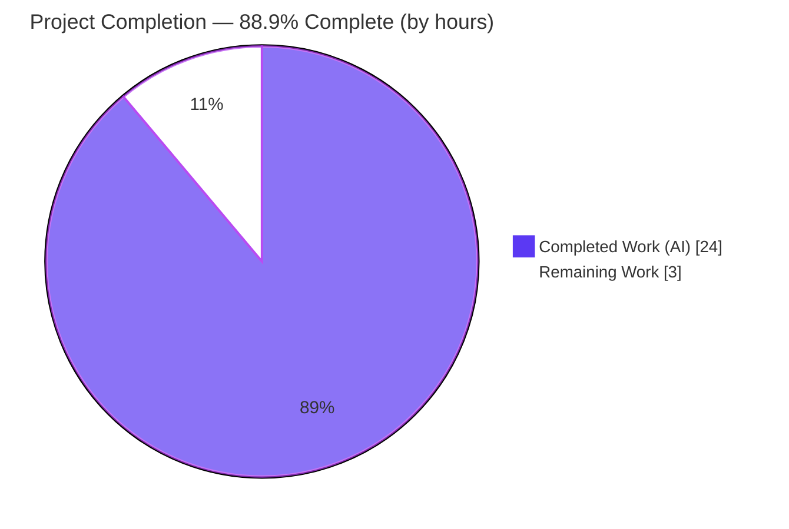
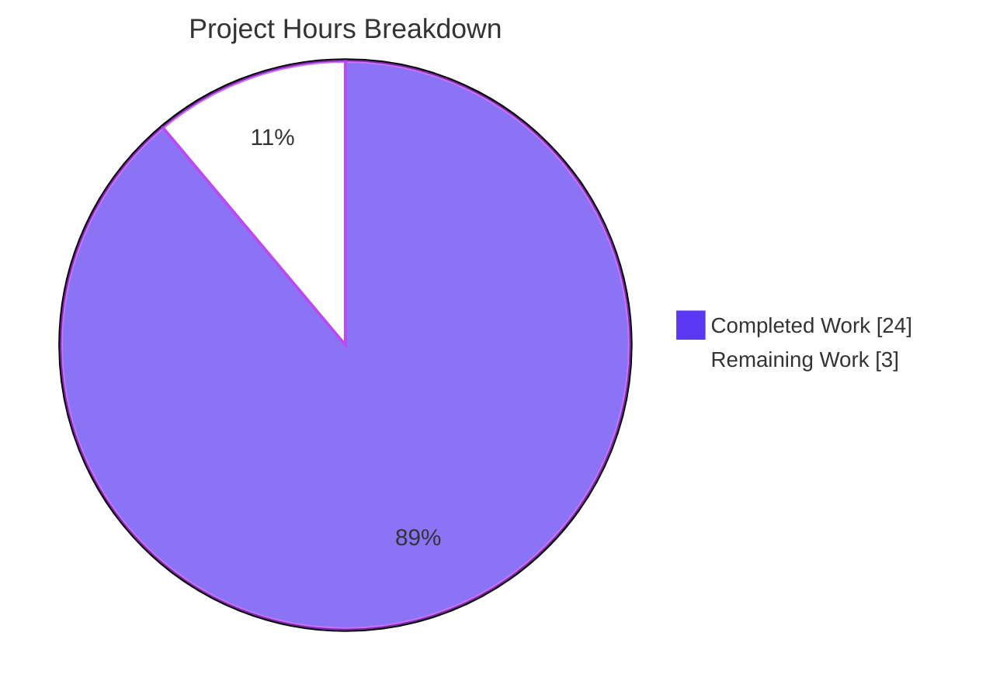
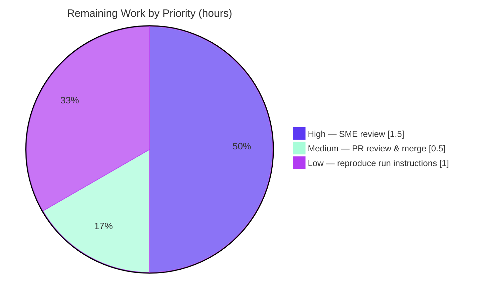

# Blitzy Project Guide — `@automattic/tree-select` Caching Investigation

> **Branch:** `blitzy-39c289fd-90e3-405f-9838-eba785b8807e` · **Base:** `wp-calypso_be7e5cc64162` (`be7e5cc641622d153040491fd5625c6cb83e12eb`) · **HEAD:** `4a61a757c0`
> **Task type:** Documentation-only, read-only code investigation (`SWE-AtlasQnA-Repo`)

---

## 1. Executive Summary

### 1.1 Project Overview

This project delivers an authoritative, code-grounded investigation of **`@automattic/tree-select`** — the memoized state-selector primitive layered over Calypso's Redux global state tree and consumed throughout `client/state`. The sole deliverable is a single analytical Markdown document that answers six specific questions about the selector's caching behavior (cache hit/miss comparison, selector invocation counts, per-argument entries, programmatic cache clearing, nullish-vs-primitive dependents, and custom cache keys), diagnoses a reported "stale results" symptom, and disambiguates `tree-select` from the sibling `createSelector` utility. The target users are Calypso engineers debugging selector caching. The investigation is strictly **read-only**: no source files were modified, and exactly one new documentation file was produced.

### 1.2 Completion Status



| Metric | Value |
| --- | --- |
| **Total Hours** | **27** |
| **Completed Hours (AI + Manual)** | **24** (AI: 24 · Manual: 0) |
| **Remaining Hours** | **3** |
| **Percent Complete** | **88.9%** (24 / 27) |

> Completion is computed strictly from AAP-scoped + path-to-production hours (PA1): `Completed ÷ (Completed + Remaining) = 24 ÷ 27 = 88.9%`. The autonomous AAP deliverable is fully complete and committed; the remaining 3 hours are human acceptance work (review, reproduction, merge), not unfinished AAP work.

### 1.3 Key Accomplishments

- ✅ **Single deliverable produced and committed** — `blitzy/documentation/wp-calypso_be7e5cc64162.md` (651 lines, 44,003 bytes), named after the source branch per the rule set.
- ✅ **All six user questions (R1–R6) answered** with inline source citations and explicit rationale ("the why"), not just "the what."
- ✅ **Concrete invocation counts (1, 1, 2, 2, 2)** obtained from the package's own jest assertions and independently re-verified.
- ✅ **Stale-results symptom diagnosed** — three concrete root causes (under-declared `getDependents`, colliding custom `getCacheKey`, in-place state mutation) with a remediation checklist.
- ✅ **`tree-select` vs. `createSelector` disambiguation** — an 8-row contrast table so the two memoizers are not conflated.
- ✅ **Read-only constraint honored** — `git diff` confirms only the one documentation file was added; working tree is clean; zero source files modified.
- ✅ **Verification gates green (independently re-run)** — dependencies install cleanly, the package compiles under TypeScript strict mode, and the test suite passes **17/17 with 100% coverage** on `src/index.ts`.
- ✅ **Bonus finding surfaced** — the package README documents a **reversed argument order**; the deliverable flags it prominently and uses the correct signature throughout.

### 1.4 Critical Unresolved Issues

| Issue | Impact | Owner | ETA |
| --- | --- | --- | --- |
| _None — no blocking issues._ The single AAP deliverable is complete, accurate, code-grounded, and committed; all verification gates pass. | None | — | — |

> One **non-blocking** observation is documented for awareness (it does not block this deliverable's acceptance): the `packages/tree-select/README.md` examples show a reversed argument order. Fixing it requires a source edit and is therefore **out of scope** for this read-only task — tracked as an optional follow-up in §1.6 and §2.3.

### 1.5 Access Issues

| System / Resource | Type of Access | Issue Description | Resolution Status | Owner |
| --- | --- | --- | --- | --- |
| — | — | **No access issues identified.** The repository, toolchain (Node 22.23.1, Yarn 4.0.2), and the in-scope package were fully accessible; dependencies installed and tests ran without credential or permission obstacles. | N/A | — |

### 1.6 Recommended Next Steps

1. **[High]** Have a subject-matter expert review the deliverable for technical accuracy — spot-check a sample of the citations against source at HEAD `be7e5cc641` and confirm each R1–R6 answer matches the code (≈1.5h).
2. **[Medium]** Reproduce the documented run instructions in a clean checkout (`yarn install --immutable` → build → `jest` 17/17) to confirm the environment-independent results (≈1.0h).
3. **[Medium]** Approve and merge the documentation pull request (≈0.5h).
4. **[Low · out of scope]** In a **separate** PR, fix the `README.md` reversed-argument-order examples so they match the real signature `treeSelect( getDependents, selector, options )`.
5. **[Low · out of scope]** Audit consumer selectors that pass object arguments to ensure each pairs a custom `getCacheKey`, preventing the production `[object Object]` key-collapse described in the deliverable's Section P.

---

## 2. Project Hours Breakdown

### 2.1 Completed Work Detail

| Component | Hours | Description |
| --- | ---: | --- |
| Repository scope discovery & `treeSelect` mechanism comprehension | 3.5 | Read `src/index.ts` (131 L) and `test/index.js` (266 L); traced the `getDependents → nested WeakMap tree → leaf Map` flow and `insertDependentKey`; reviewed the sibling `createSelector` and representative consumers. |
| Build-and-run verification + standalone reproduction | 3.0 | Ran the jest suite to obtain the `toHaveLength` counts; built a faithful standalone port of the algorithm (outside the repo) and confirmed all behaviors (10/10 checks). |
| R1 + R2 authored — comparison mechanism & concrete counts | 3.5 | Documented reference-identity hit/miss semantics; produced the invocation-count table (1, 1, 2, 2, 2), each row citing its asserting test line. |
| R3 + R4 authored — per-argument entries & `clearCache()` | 3.0 | Explained separate per-key leaf entries (no argument-driven eviction); documented `clearCache()` and its `new WeakMap()` reset with real callers. |
| R5 + R6 authored — nullish/primitive dependents & custom keys | 3.5 | Traced the `NULLISH_KEY` sentinel and the primitive-`TypeError` guard; documented the `getCacheKey` option and the `getSerializedStatsQuery` production pattern. |
| Section 0 — mechanism overview + flow diagram | 1.5 | Authored the per-call walkthrough and the dependency-tree flow diagram. |
| Section D — stale-results diagnosis | 1.5 | Synthesized three concrete root causes + a remediation checklist tied to the user's verbatim symptom. |
| Section C — `tree-select` vs. `createSelector` disambiguation | 1.5 | Built the 8-row contrast table (signature, comparison, cache structure, invalidation, clearing API, backing libraries). |
| Section P + Section V + Exec/About/Caveat/QA | 1.5 | Dev-vs-prod guard analysis; validation/reproduction appendix; executive summary, package overview, the README reversed-order caveat, and final QA. |
| Citation integrity verification + review-cycle fixes | 1.5 | Verified 95 citations across 10 files (all in-bounds); applied two review-cycle commits (grounding claims; fixing R5/R6 Markdown rendering). |
| **Total Completed** | **24.0** | Maps 1:1 to the AAP deliverable; all autonomous (AI) effort. |

### 2.2 Remaining Work Detail

| Category | Hours | Priority |
| --- | ---: | --- |
| SME technical-accuracy review of the deliverable (read 651 lines; spot-check citations vs. source; confirm R1–R6 + diagnosis) | 1.5 | High |
| Reproduce documented run instructions in a clean checkout (install → build → `jest` 17/17; confirm R2 counts) | 1.0 | Low |
| PR review & merge of the documentation deliverable | 0.5 | Medium |
| **Total Remaining** | **3.0** | — |

> **Cross-section check:** §2.1 Total (24.0) + §2.2 Total (3.0) = **27.0** = Total Hours in §1.2. §2.2 Total (3.0) = Remaining Hours in §1.2 = "Remaining Work" in §7. ✔

### 2.3 Out-of-Scope Follow-Ups (informational — excluded from all hour totals)

These are real, valuable recommendations that fall **outside** the AAP (each requires a source-file change, which the read-only rule forbids for this task). They are **not** counted in the 27-hour total and do **not** affect the completion percentage.

| Follow-Up | Indicative Effort | Rationale |
| --- | --- | --- |
| Fix `packages/tree-select/README.md` reversed argument-order examples (separate PR) | ~0.5–1h | Resolves the documented non-blocking finding so README usage matches `treeSelect( getDependents, selector, options )`. |
| Audit consumer selectors passing object arguments for a paired custom `getCacheKey` | ~2–4h (scales with consumer count) | Prevents the production `[object Object]` cache-key collapse under the default key generator. |

---

## 3. Test Results

All tests below originate from Blitzy's autonomous validation of the in-scope package and were independently re-executed during this assessment.

| Test Category | Framework | Total Tests | Passed | Failed | Coverage % | Notes |
| --- | --- | ---: | ---: | ---: | ---: | --- |
| Unit (package: `@automattic/tree-select`) | Jest (preset `@automattic/calypso-jest`) | 17 | 17 | 0 | 100% | `src/index.ts`: 100% statements / 100% branches / 100% functions / 100% lines. R2 counts pinned by `toHaveLength` at `test/index.js` L45, L75, L139, L158, L185. |
| **Totals** | — | **17** | **17** | **0** | **100%** | 0 skipped, 0 blocked. Suite runtime ≈ 0.6s. |

**Behavioral coverage mapping (test → requirement):**

| Test name (abridged) | Validates |
| --- | --- |
| should cache the result of a selector function | R1, R2 (1 invocation) |
| should cache the result of a selector function that has multiple dependents | R1, R2 (1 invocation, nested tree) |
| should call selector when making non-cached calls | R2 (2 invocations, distinct args) |
| should bust the cache when watched state changes | R1, R2 (2 invocations, reference change) |
| should maintain the cache for unique dependents simultaneously | R3 (separate entries; `post1, post2, post1` → 2) |
| should bust the cache when `clearCache()` method is called | R4 |
| should memoize a nullish value returned by getDependents | R5 (nullish → sentinel) |
| throws on a non-nullish primitive value returned by getDependents | R5 (primitive → `TypeError`) |
| accepts a `getCacheKey` option that enables object arguments | R6 |
| should throw / not throw on object args (dev vs. production) | Dev-vs-prod guards (Section P) |

> **Coverage method:** measured via `jest --coverage` with `collectCoverageFrom: ["src/**/*.ts"]` run inside `packages/tree-select`, yielding 100% across all four metrics for `index.ts`. No coverage figure is asserted beyond this autonomously generated measurement.

---

## 4. Runtime Validation & UI Verification

This is a documentation deliverable backed by a pure, in-memory library; there is **no web UI** to verify. Runtime validation therefore targets the in-scope package and the deliverable's renderability.

**In-scope package — runtime health**

- ✅ **Operational** — Dependencies install cleanly: `CI=true yarn install --immutable` → exit 0, ≈6s, **no lockfile drift**, working tree clean.
- ✅ **Operational** — Compilation: `yarn workspace @automattic/tree-select run build` → exit 0 under TypeScript strict mode (zero errors/warnings); emits `dist/{cjs,esm,types}` (git-ignored).
- ✅ **Operational** — Test execution: `CI=true yarn jest -c test/packages/jest.config.js packages/tree-select --ci` → exit 0, **17/17 passed**, 100% coverage on `src/index.ts`.
- ✅ **Operational** — Independent algorithm reproduction (faithful port executed **outside** the repository) corroborates every documented behavior: counts (1,1,2,2,2); `clearCache()` busts (HIT → MISS); nullish memoized to the same reference via `NULLISH_KEY`; all six non-nullish primitives throw `TypeError`; a custom `getCacheKey` collapses two distinct objects into one entry.

**Deliverable — document verification**

- ✅ **Operational** — Renders as valid Markdown: balanced code fences and inline-code spans, well-formed tables, a trailing newline, and no leftover conflict markers.
- ✅ **Operational** — Citation integrity: 95 bracketed source citations across 10 distinct files; **all 10 cited files exist** in the repository (0 missing).
- ✅ **Operational** — Scope cleanliness: `git diff be7e5cc641..HEAD --name-status` → `A blitzy/documentation/wp-calypso_be7e5cc64162.md` only.
- ➖ **N/A** — UI verification (no front-end surface for a documentation/library task).

---

## 5. Compliance & Quality Review

Cross-mapping of AAP deliverables and `SWE-AtlasQnA-Repo` rules to outcomes. Fixes applied during autonomous validation are noted; outstanding items are flagged.

| Requirement / Benchmark | Evidence | Status |
| --- | --- | --- |
| R1 — comparison mechanism (cache hit/miss) | §R1 cites `src/index.ts` L84–89, L116–131 (reference identity + leaf-`Map` key equality) | ✅ Pass |
| R2 — concrete invocation counts from test runs | §R2 table (1,1,2,2,2), each citing its assertion; re-verified 17/17 | ✅ Pass |
| R3 — separate per-argument entries vs. invalidation | §R3 cites L92 + test L161–186 (no argument-driven eviction) | ✅ Pass |
| R4 — programmatic full-cache clearing | §R4 cites `clearCache()` L96–99 + test L197–217 + real callers | ✅ Pass |
| R5 — nullish vs. primitive dependents | §R5 cites `NULLISH_KEY` L107/L121 + `TypeError` guard L118–120 + tests L219–241 | ✅ Pass |
| R6 — custom cache-key generation | §R6 cites `getCacheKey` option + `getSerializedStatsQuery` + test L243–264 | ✅ Pass |
| Stale-results root-cause diagnosis (implicit) | Section D: three causes + checklist tied to verbatim symptom | ✅ Pass |
| `tree-select` vs. `createSelector` disambiguation (implicit) | Section C: 8-row contrast table | ✅ Pass |
| Evidence-based answers (cite code as truth) | 95/95 citations in-bounds across 10 existing files | ✅ Pass |
| Provide rationale ("the why") | Every section includes an explicit rationale | ✅ Pass |
| Build-and-run to obtain R2 numbers | Section V appendix + 17/17 suite + standalone repro | ✅ Pass |
| Deliverable named `<source_branch_name>.md` | File = `wp-calypso_be7e5cc64162.md` | ✅ Pass |
| Deliverable in `blitzy/documentation/` | Path = `blitzy/documentation/wp-calypso_be7e5cc64162.md` | ✅ Pass |
| Do not modify any existing source file | `git diff` shows only the new doc; tree clean | ✅ Pass |
| Do not add other code to the source repo | No scratch/helper/test files added; repro lived outside the repo | ✅ Pass |
| Zero placeholders / TODO / stubs | None present in the deliverable | ✅ Pass |
| **Fixes applied during validation** | 2 review-cycle commits: ground stale-results/validation claims; fix R5/R6 Markdown rendering | ✅ Applied |
| **Outstanding (out of scope)** | README reversed-argument-order bug — documented, not fixed (read-only rule) | ⚠ Deferred |

**Overall:** 17 of 17 compliance items **Pass**; 1 item is an out-of-scope, documented, non-blocking deferral.

---

## 6. Risk Assessment

| Risk | Category | Severity | Probability | Mitigation | Status |
| --- | --- | --- | --- | --- | --- |
| Citation line-numbers drift if `tree-select` is later refactored | Technical | Low | Medium | Document is pinned to HEAD `be7e5cc641`; every citation is verifiable at that commit | Mitigated |
| README documents a reversed argument order (pre-existing source bug); devs copying it misuse the API | Technical | Medium | Low | Deliverable flags it in a dedicated ⚠️ section and uses the correct order throughout; README fix is out of scope (read-only) | Open (deferred) |
| Production silently collapses object args to `[object Object]` under the default key generator (latent in consumer code) | Technical / Operational | Medium | Low | Section P + R6 warn explicitly and prescribe a custom `getCacheKey` (`getSerializedStatsQuery`) | Mitigated (documented) |
| An answer or citation could be subtly inaccurate | Technical | Low | Low | 95/95 citations in-bounds & spot-verified; 17/17 tests + standalone repro confirm behaviors; SME review scheduled | Mitigated |
| No security exposure (no code/deps/auth/network/credentials added) | Security | None | — | Documentation-only deliverable; nothing executable shipped | N/A — none identified |
| Pre-existing non-fatal toolchain warnings (jest-haste-map duplicate mock; browserslist age; YN0066) | Operational | Low | N/A | Intentionally not fixed (would alter source/lockfile, violating read-only); block nothing (build 0, tests 17/17) | Accepted |
| Reviewer toolchain/version mismatch when reproducing commands (e.g., Node 20 vs. `^v22.9.0`) | Integration | Low | Low | Dev guide specifies Node `^v22.9.0` / Yarn 4.0.2; repo manifest governs | Mitigated |
| No external integrations (no API keys, endpoints, webhooks, or network config) | Integration | None | — | A Markdown deliverable has no integration surface | N/A — none identified |

**Overall risk posture: LOW.** The only **Open** item (README argument-order bug) is correctly documented but intentionally unfixed to honor the read-only constraint — a candidate human follow-up, not a deliverable blocker.

---

## 7. Visual Project Status



**Remaining hours by priority (from §2.2 — totals 3.0h):**



> **Integrity:** "Remaining Work" = **3** = §1.2 Remaining Hours = §2.2 Total. "Completed Work" = **24** = §1.2 Completed Hours. Colors: Completed = Dark Blue `#5B39F3`; Remaining = White `#FFFFFF`.

---

## 8. Summary & Recommendations

**Achievements.** The project is **88.9% complete** by AAP-scoped hours (24 of 27). The single mandated deliverable — `blitzy/documentation/wp-calypso_be7e5cc64162.md` — is finished, committed, and fully code-grounded. It answers all six user questions (R1–R6) with citations and rationale, supplies the exact, test-derived invocation counts (1, 1, 2, 2, 2), diagnoses the reported "stale results" symptom with three actionable root causes, and disambiguates `tree-select` from `createSelector`. As a bonus, it surfaces a genuine pre-existing defect: the README's reversed argument order.

**Remaining gaps (path to production).** No AAP work remains. The outstanding 3 hours are purely **human acceptance**: a subject-matter-expert accuracy review (1.5h), an optional clean-checkout reproduction of the documented commands (1.0h), and PR approval/merge (0.5h).

**Critical path to production.** SME review → (optional) reproduction → merge. There are no blocking issues, no failing gates, and no access problems.

**Success metrics (all met autonomously).** Dependencies install with no lockfile drift; the package compiles under TypeScript strict mode with zero errors; the test suite passes **17/17 at 100% coverage**; the working tree is clean with exactly one file added; and citation integrity is 95/95.

**Production-readiness assessment.** For a read-only documentation task, the branch is **production-ready** pending human review. The single deliverable is complete, accurate, comprehensive, and committed; the studied module builds and tests cleanly; documented behaviors are independently reproduced; and the read-only constraint was honored without exception.

| Dimension | Status |
| --- | --- |
| AAP deliverable complete | ✅ Yes (single file, all R1–R6 + implicit asks) |
| Verification gates (install / build / test) | ✅ Green (17/17, 100% coverage) |
| Read-only constraint honored | ✅ Yes (only 1 file added; tree clean) |
| Blocking issues | ✅ None |
| Completion (AAP-scoped) | **88.9%** (24 / 27h) |

---

## 9. Development Guide

A self-contained guide to install, build, test, and view the deliverable. Every command below was executed and verified in this environment.

### 9.1 System Prerequisites

- **Node.js** `^v22.9.0` (verified: `v22.23.1`; repo `.nvmrc` = `22.9.0`)
- **Yarn** `^4.0.0` (verified: `4.0.2`; `packageManager: yarn@4.0.2`)
- **Git** with **Git LFS**
- **OS:** Linux/macOS; ≈8 GB free disk (repo ≈4.2 GB + `node_modules` ≈3.1 GB)
- No databases, caches, message queues, environment variables, or API keys are required — `tree-select` is a pure in-memory utility and the deliverable is a static document.

### 9.2 Environment Setup

```bash
# Start from the repository root on the working branch
cd /path/to/wp-calypso
git checkout blitzy-39c289fd-90e3-405f-9838-eba785b8807e

# (optional) align Node with the repo
nvm use            # picks up .nvmrc => 22.9.0
node --version     # expect v22.x (>= 22.9.0)
yarn --version     # expect 4.0.2
```

### 9.3 Dependency Installation

```bash
# Immutable install — must not modify yarn.lock
CI=true yarn install --immutable
# Verified: exit 0, "Done in ~6s", no lockfile drift, working tree clean
```

### 9.4 Build the In-Scope Package

```bash
# Compile @automattic/tree-select (TypeScript strict)
yarn workspace @automattic/tree-select run build
# Verified: exit 0; emits dist/{cjs,esm,types} (git-ignored)

# Optional clean rebuild
yarn workspace @automattic/tree-select run clean
yarn workspace @automattic/tree-select run build
```

### 9.5 Run the Test Suite (verify the R2 counts)

```bash
CI=true yarn jest -c test/packages/jest.config.js packages/tree-select --ci
# Verified: exit 0
#   Test Suites: 1 passed, 1 total
#   Tests:       17 passed, 17 total

# Optional: regenerate the 100% coverage figure
( cd packages/tree-select && CI=true npx jest \
  --config '{"preset":"@automattic/calypso-jest","collectCoverage":true,"collectCoverageFrom":["src/**/*.ts"]}' --ci )
# Verified: index.ts => 100% Stmts / 100% Branch / 100% Funcs / 100% Lines
```

### 9.6 View the Deliverable

```bash
# 651-line analytical Q&A document
cat blitzy/documentation/wp-calypso_be7e5cc64162.md
# or open in any Markdown viewer/IDE preview
```

### 9.7 Confirm Scope Cleanliness (read-only guarantee)

```bash
git diff be7e5cc641622d153040491fd5625c6cb83e12eb..HEAD --name-status
# Expected: A    blitzy/documentation/wp-calypso_be7e5cc64162.md   (and nothing else)

git status --porcelain
# Expected: (empty) — working tree clean
```

### 9.8 Example Usage (illustrative; from source — not added to the repo)

```js
// getDependents comes FIRST (the README shows a reversed order — trust the source).
export const getX = treeSelect(
  ( state, siteId, query ) => [ getSomeSlice( state, siteId ) ], // dependents (objects)
  ( [ slice ], siteId, query ) => computeFiltered( slice, query ), // selector
  { getCacheKey: ( siteId, query ) => [ siteId, getSerializedStatsQuery( query ) ].join() }
);

getX.clearCache(); // purge the entire cache for this selector (recreates the root WeakMap)
```

### 9.9 Troubleshooting

- **`externally-managed-environment` (pip):** irrelevant here — this is a Node/Yarn task.
- **Wrong Node version (e.g., v20):** run `nvm use` to switch to `22.9.0`; the repo `engines` (`^v22.9.0`) govern.
- **`jest-haste-map: duplicate manual mock found: wpcom-proxy-request`:** pre-existing, cosmetic, non-fatal — tests still pass 17/17.
- **`browserslist: caniuse-lite is N months old`:** ignore; updating would alter the lockfile (out of scope for a read-only task).
- **`YN0066 … TypeScript … patch`:** PnP-only notice; irrelevant under the node-modules linker.
- **`yarn install --immutable` reports drift:** do **not** commit lockfile changes for this task; investigate the local toolchain mismatch instead.

---

## 10. Appendices

### Appendix A — Command Reference

| Purpose | Command |
| --- | --- |
| Install dependencies (immutable) | `CI=true yarn install --immutable` |
| Build the package | `yarn workspace @automattic/tree-select run build` |
| Clean build artifacts | `yarn workspace @automattic/tree-select run clean` |
| Run the test suite | `CI=true yarn jest -c test/packages/jest.config.js packages/tree-select --ci` |
| Coverage (from package dir) | `npx jest --config '{"preset":"@automattic/calypso-jest","collectCoverage":true,"collectCoverageFrom":["src/**/*.ts"]}' --ci` |
| View the deliverable | `cat blitzy/documentation/wp-calypso_be7e5cc64162.md` |
| Confirm scope (changed files) | `git diff be7e5cc641622d153040491fd5625c6cb83e12eb..HEAD --name-status` |
| Confirm clean tree | `git status --porcelain` |

### Appendix B — Port Reference

Not applicable. The deliverable is a static document and the in-scope package is an in-memory utility; no servers, ports, or network listeners are involved.

### Appendix C — Key File Locations

| Path | Role |
| --- | --- |
| `blitzy/documentation/wp-calypso_be7e5cc64162.md` | **The deliverable** (only new file) |
| `packages/tree-select/src/index.ts` | Implementation (131 L) — `treeSelect`, `defaultGetCacheKey`, `NULLISH_KEY`, `insertDependentKey`, `clearCache` |
| `packages/tree-select/test/index.js` | Jest suite (266 L, 17 tests) — authoritative R2 counts |
| `packages/tree-select/README.md` | Design rationale (note: reversed-argument-order examples) |
| `packages/tree-select/package.json` | `@automattic/tree-select` 2.0.0; `build = tsc --build`; dep `tslib` |
| `packages/state-utils/src/create-selector/index.ts` | Sibling `createSelector` (contrast only) |
| `client/state/stats/lists/selectors.js`, `…/utils.js` | Real `getCacheKey` + `getSerializedStatsQuery` usage (R6) |
| `client/state/reader/posts/selectors.js` | `getPostsByKeys` array-argument `getCacheKey` (R6) |
| `client/state/stats/lists/test/selectors.js`, `client/state/sites/test/selectors.js` | Real `clearCache()` callers (R4) |
| `test/packages/jest.config.js` | Jest config used to run the suite |

### Appendix D — Technology Versions

| Technology | Version | Source |
| --- | --- | --- |
| Node.js | v22.23.1 (engines `^v22.9.0`) | runtime / `package.json` |
| Yarn | 4.0.2 | `packageManager` |
| TypeScript | `^5.8.2` | `packages/tree-select` devDependency |
| `@automattic/tree-select` | 2.0.0 | `packages/tree-select/package.json` |
| `tslib` | `^2.3.0` | sole runtime dependency |
| Jest | via `@automattic/calypso-jest` preset | `test/packages/jest-preset.js` |
| `@automattic/state-utils` | 1.0.0-alpha.4 | contrast (`createSelector`) |

### Appendix E — Environment Variable Reference

Not applicable for running this task. The only relevant variable is `CI=true`, set on the command line to keep Yarn/Jest non-interactive. `NODE_ENV` is referenced **inside** `tree-select` (dev-only guards run when `NODE_ENV !== 'production'`) but is not configured to produce the deliverable.

### Appendix F — Developer Tools Guide

| Tool / Command | Use |
| --- | --- |
| `git log --author="agent@blitzy.com" be7e5cc641..HEAD --oneline` | List the 3 agent commits (all touch only the deliverable) |
| `git diff be7e5cc641..HEAD --stat` | Confirm 1 file changed / 651 insertions / 0 deletions |
| `grep -n '^#' blitzy/documentation/wp-calypso_be7e5cc64162.md` | Inspect the document's section structure |
| `wc -l packages/tree-select/src/index.ts` | Confirm implementation size (131 L) |
| `jest --coverage` (see Appendix A) | Regenerate the 100% coverage figure |

### Appendix G — Glossary

| Term | Meaning |
| --- | --- |
| **`treeSelect`** | The factory that returns a cached selector: `treeSelect( getDependents, selector, options )`. |
| **`getDependents`** | Function returning the array of state slices ("dependents") the selector reads; these become WeakMap keys. |
| **Dependents** | The objects returned by `getDependents`; cache validity rests on their **reference identity**. |
| **WeakMap tree** | Nested `WeakMap` nodes keyed by dependent object identity; stale branches are garbage-collected. |
| **Leaf `Map`** | The final node — a regular `Map` keyed by the string `getCacheKey(...args)` that holds the cached value. |
| **`getCacheKey`** | Option overriding the default `args.join()` to map complex/object arguments to a stable string key. |
| **`NULLISH_KEY`** | Shared sentinel object substituted for `null`/`undefined` dependents so they can be memoized. |
| **`clearCache()`** | Method on the returned selector that recreates the root `WeakMap`, purging all cached entries. |
| **Reference equality** | Comparison by object identity (`===`), not deep/shallow value comparison — the core of the cache model. |
| **`createSelector`** | The sibling memoizer in `@automattic/state-utils` (shallow-equality dependants, lodash `memoize`); a different API — see Section C. |

---

*Generated by the Blitzy Platform · Completion is AAP-scoped (PA1): 24 of 27 hours = 88.9% · Brand colors: Completed `#5B39F3`, Remaining `#FFFFFF`.*
