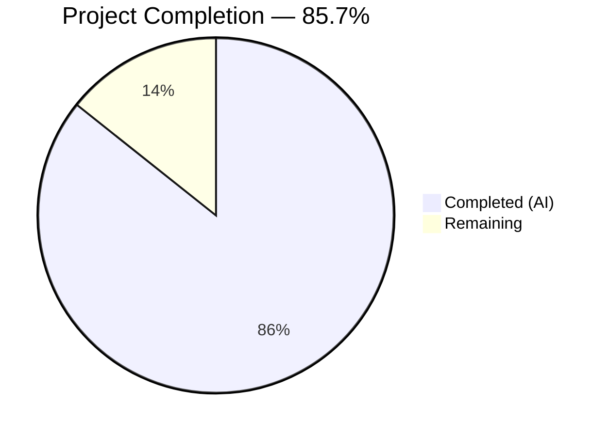
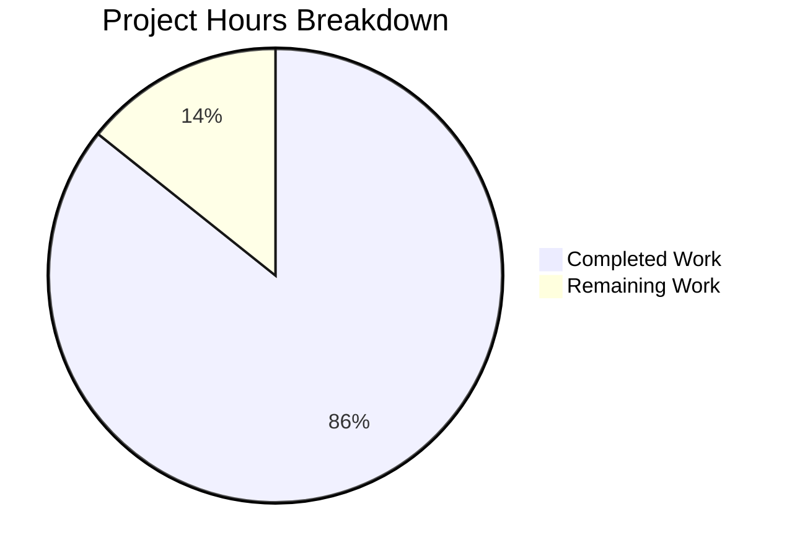

# Blitzy Project Guide — Back-Navigation Investigation for Calypso Multi-Step Onboarding/Signup Flows

---

## 1. Executive Summary

### 1.1 Project Overview

This project delivers a comprehensive technical investigation document analysing the back-navigation system across Calypso's two independent multi-step onboarding/signup architectures: the classic signup system (`/start/`) and the declarative stepper system (`/setup/`). The document answers five discrete questions about why the Back button sometimes jumps to the first step or exits the flow entirely, rather than retreating one step at a time. It traces the complete precedence chain from URL entry through Redux state, step props, `StepWrapper` connect HOC, and `NavigationLink` rendering — with code citations, Mermaid diagrams, and per-step destination tables for representative flows. The primary audience is Calypso frontend engineers investigating or modifying back-navigation behaviour. This is a documentation-only project — no source code was modified.

### 1.2 Completion Status



| Metric | Value |
|--------|-------|
| **Total Project Hours** | 28 |
| **Completed Hours (AI)** | 24 |
| **Remaining Hours** | 4 |
| **Completion Percentage** | 85.7% |

**Calculation:** 24 completed hours / (24 completed + 4 remaining) = 24 / 28 = **85.7% complete**

### 1.3 Key Accomplishments

- ✅ Created `blitzy/documentation/wp-calypso_be7e5cc64162.md` — a 720-line standalone Markdown investigation document
- ✅ Answered all 5 user questions (Q1–Q5) with code-cited rationale based on the repository source as truth
- ✅ Documented the complete back-navigation precedence chain for both the classic signup system and the declarative stepper system
- ✅ Traced the `back_to` query-parameter override lifecycle end-to-end (URL → controller → Redux → step → StepWrapper → NavigationLink → rendered button)
- ✅ Created 4 Mermaid diagrams: classic precedence flowchart, stepper precedence flowchart, `back_to` lifecycle sequence diagram, domains-step branching flowchart
- ✅ Provided per-step destination tables for 3 representative flows (`woocommerce-install`, `do-it-for-me`, `onboarding`)
- ✅ Verified all 22 line-number citations against actual source code
- ✅ Maintained zero repository modifications — working tree clean with no temporary artifacts

### 1.4 Critical Unresolved Issues

| Issue | Impact | Owner | ETA |
|-------|--------|-------|-----|
| Line-number citations may drift if referenced source files receive upstream commits | Reduced accuracy of code citations in the document | Human developer | As needed after upstream merges |
| Mermaid diagram rendering not verified on GitHub | Diagrams may have rendering differences across Markdown previewer implementations | Human developer | 0.5h after PR merge |

### 1.5 Access Issues

No access issues identified. This is a documentation-only project requiring only read access to the repository source files and write access to the `blitzy/documentation/` directory, both of which were available and functional throughout the project.

### 1.6 Recommended Next Steps

1. **[High]** Domain expert review — A Calypso frontend engineer familiar with the signup/stepper systems should review the document for technical accuracy, particularly the precedence chain descriptions and per-step destination tables.
2. **[Medium]** Verify Mermaid rendering — After merging, confirm all 4 Mermaid diagrams render correctly on GitHub's Markdown viewer.
3. **[Low]** Line number drift remediation — If the base branch receives commits to any of the 20 referenced source files, verify and update line-number citations in the document.
4. **[Low]** Editorial polish — Review the document for typographical errors, formatting consistency, and clarity of technical explanations.

---

## 2. Project Hours Breakdown

### 2.1 Completed Work Detail

| Component | Hours | Description |
|-----------|:-----:|-------------|
| Source code analysis and investigation | 5 | Read and analysed 20+ source files across the classic signup system (`client/signup/`) and the declarative stepper system (`client/landing/stepper/`), including flow configurations, Redux dependency stores, controller dispatching, and step component patterns |
| Documentation structure design | 1 | Designed the 8-section document architecture mapping user questions to investigation sections with progressive disclosure |
| Section 1 — Summary | 0.5 | Wrote root-cause analysis summary identifying the `back_to` override mechanism and `allowBackFirstStep` side-effect |
| Section 2 — Two Navigation Systems Overview | 2 | Documented both the classic signup system and declarative stepper system architectures with key module descriptions and code excerpts |
| Section 3 — What Decides the Back Destination (Q1) | 3 | Documented the 5-priority classic precedence chain and 3-priority stepper precedence chain, created 2 Mermaid flowcharts, and built the precedence comparison table |
| Section 4 — Input Conflict Resolution (Q2) | 2 | Documented the nullish coalescing semantics (`??` vs `||`), the `NavigationLink.getBackUrl()` early-return gate, and the `getPreviousStep()` fallback path |
| Section 5 — The External Override: back_to (Q3) | 3 | Traced the `back_to` lifecycle end-to-end, created the Mermaid sequence diagram, documented flow configurations declaring `back_to`, controller dispatch logic, and step consumption patterns |
| Section 6 — Precedence Rule and Bypassed Code Path (Q4) | 3 | Documented the nullish coalescing gate, `allowBackFirstStep` side-effect, bypassed `getPreviousStep()` method, and domains step special cases with Mermaid flowchart |
| Section 7 — Per-Step Destination Observation (Q5) | 2 | Described 3 diagnostic approaches and created per-step destination tables for `woocommerce-install`, `do-it-for-me`, and `onboarding` flows |
| Section 8 — Source Files Referenced | 0.5 | Compiled the comprehensive 20-file reference table with role descriptions |
| Line-number citation verification | 1 | Verified all 22 line-number citations against actual source code on the analysis commit |
| Validation, bug fixes, and revision commits | 1 | Applied 2 fix commits (DIFM flow name correction, missing onboarding README reference) and validated Mermaid syntax balance |
| **Total** | **24** | |

### 2.2 Remaining Work Detail

| Category | Hours | Priority |
|----------|:-----:|----------|
| Domain expert technical accuracy review | 2 | Medium |
| Mermaid rendering verification on GitHub | 0.5 | Low |
| Line-number drift remediation (if base branch changes) | 1 | Low |
| Editorial review and formatting consistency | 0.5 | Low |
| **Total** | **4** | |

---

## 3. Test Results

| Test Category | Framework | Total Tests | Passed | Failed | Coverage % | Notes |
|---------------|-----------|:-----------:|:------:|:------:|:----------:|-------|
| N/A | N/A | 0 | 0 | 0 | N/A | Documentation-only project — no executable code was created or modified, so no automated tests were applicable or executed |

**Note:** This is a documentation-only project. The AAP explicitly required no source code modifications. The Final Validator confirmed: "GATE 1: N/A (no tests — documentation-only task)." All validation was performed through manual verification of code citations against source files and Mermaid syntax balance checks.

---

## 4. Runtime Validation & UI Verification

**Runtime Health:**
- ✅ Working tree clean — `git status` shows no uncommitted changes
- ✅ No temporary files or diagnostic scripts left in the repository
- ✅ Branch `blitzy-2373c1b3-b3fd-4338-b956-79cfa751bca2` contains only the documentation file addition
- ✅ All 3 commits are in-scope and authored by Blitzy Agent

**Documentation Validation:**
- ✅ All 22 line-number citations verified against actual source files on the analysis commit
- ✅ Mermaid syntax validated — 4 diagram blocks with balanced open/close fences
- ✅ 8 document sections matching the planned structure from the AAP
- ✅ All 5 user questions (Q1–Q5) answered with code-cited rationale
- ✅ 4 Mermaid diagrams (classic precedence, stepper precedence, `back_to` lifecycle, domains branching)
- ✅ Per-step destination tables for 3 representative flows
- ✅ 20 source files referenced in the comprehensive Section 8 table

**UI Verification:**
- ⚠ Mermaid diagram rendering not verified on GitHub's native Markdown renderer — requires post-merge visual check

**API Integration:**
- ✅ N/A — no APIs created or modified

---

## 5. Compliance & Quality Review

| Compliance Item | AAP Requirement | Status | Notes |
|-----------------|-----------------|:------:|-------|
| Create `blitzy/documentation/wp-calypso_be7e5cc64162.md` | §0.5.1, §0.10 | ✅ Pass | 720-line document created at specified path |
| Answer Q1 (What decides the back destination) | §0.1.1 Q1 | ✅ Pass | Section 3 documents complete precedence chain for both systems |
| Answer Q2 (Which inputs win) | §0.1.1 Q2 | ✅ Pass | Section 4 documents nullish coalescing resolution and early-return gate |
| Answer Q3 (Where does the override come from) | §0.1.1 Q3 | ✅ Pass | Section 5 traces `back_to` lifecycle end-to-end with sequence diagram |
| Answer Q4 (Precedence rule and bypassed path) | §0.1.1 Q4 | ✅ Pass | Section 6 documents the gate, side-effect, and bypassed `getPreviousStep()` |
| Answer Q5 (Observe computed destination per step) | §0.1.1 Q5 | ✅ Pass | Section 7 provides 3 diagnostic approaches and 3 per-step destination tables |
| Cover both navigation systems | §0.1.4, §0.3.1 | ✅ Pass | Classic signup and declarative stepper documented throughout |
| `back_to` lifecycle diagram | §0.4.3 | ✅ Pass | Mermaid sequence diagram in Section 5.1 |
| Classic system precedence flowchart | §0.4.3 | ✅ Pass | Mermaid flowchart in Section 3.1 |
| Stepper system precedence flowchart | §0.4.3 | ✅ Pass | Mermaid flowchart in Section 3.2 |
| Domains step branching flowchart | §0.4.3 | ✅ Pass | Mermaid flowchart in Section 6.4 |
| Precedence comparison table | §0.7.2 | ✅ Pass | Table in Section 3.3 |
| Flows declaring `back_to` table | §0.7.2 | ✅ Pass | Table in Section 5.2 |
| Per-step destination tables (≥1 flow) | §0.7.2 | ✅ Pass | 3 flows in Section 7.2 (exceeded requirement) |
| Source files reference list | §0.5.2 | ✅ Pass | 20-file table in Section 8 |
| Code citations with file paths and line numbers | §0.10 | ✅ Pass | 22 line-number citations, all verified |
| No repository modifications | §0.8.2, §0.10 | ✅ Pass | Only `blitzy/documentation/` file added; no source files modified |
| Cleanup of temporary artifacts | §0.9.2, §0.10 | ✅ Pass | Working tree clean; no untracked files |
| Provide thinking/rationale | §0.10 | ✅ Pass | Every conclusion explained with supporting code excerpts |
| Mermaid diagrams for all visuals | §0.10 | ✅ Pass | 4 Mermaid diagrams embedded in Markdown |
| ≥4 Mermaid diagrams | §0.4.3 | ✅ Pass | Exactly 4 diagrams created |
| ≥3 tables | §0.7.2 | ✅ Pass | 6+ tables created (exceeded requirement) |

**Quality Fixes Applied During Validation:**
1. `fix(docs): add missing onboarding README to Section 8 reference table` — Added `client/landing/stepper/declarative-flow/flows/onboarding/README.md` entry
2. `fix(docs): use actual DIFM runtime flow names in back-navigation investigation` — Corrected DIFM flow constant names to match runtime values

---

## 6. Risk Assessment

| Risk | Category | Severity | Probability | Mitigation | Status |
|------|----------|----------|-------------|------------|--------|
| Line-number citations become stale after upstream source changes | Technical | Medium | High | Re-verify citations after significant merges to referenced files; consider adding a CI check | Open |
| Mermaid diagrams render incorrectly on GitHub | Technical | Low | Low | Verify rendering post-merge; use simple Mermaid syntax compatible with GitHub's renderer | Open |
| Document incomplete for edge-case flows not investigated | Technical | Low | Medium | Document scope explicitly states which flows are covered; future PRs can extend | Mitigated |
| No security-sensitive content in document | Security | None | N/A | Document contains only code excerpts and architectural descriptions; no secrets or credentials | Resolved |
| Document not discoverable by team members | Operational | Low | Medium | Add a reference link from existing `docs/` directory or team wiki; mention in PR description | Open |
| A8C-for-Agencies signup flow not covered | Integration | Low | Low | Explicitly marked out-of-scope in AAP §0.8.2; can be added in a follow-up investigation if needed | Mitigated |

---

## 7. Visual Project Status



**Hours Summary:** 24 hours completed, 4 hours remaining — **85.7% complete**

| Remaining Work Category | Hours |
|-------------------------|:-----:|
| Domain expert technical accuracy review | 2 |
| Mermaid rendering verification on GitHub | 0.5 |
| Line-number drift remediation | 1 |
| Editorial review and formatting consistency | 0.5 |
| **Total** | **4** |

---

## 8. Summary & Recommendations

### Achievements

This project successfully delivered a 720-line technical investigation document answering all five user questions about Calypso's back-navigation behaviour. The document covers both the classic signup system and the declarative stepper system, with 4 Mermaid diagrams, per-step destination tables for 3 representative flows, and 22 verified line-number citations. All AAP deliverables are complete. No source code was modified.

### Remaining Gaps

The project is **85.7% complete** (24 of 28 total hours). The remaining 4 hours consist entirely of human review and maintenance tasks:

- **Domain expert review (2h):** A Calypso frontend engineer should review the precedence chain descriptions, per-step destination tables, and code citation accuracy.
- **Rendering verification (0.5h):** Confirm Mermaid diagrams render correctly on GitHub after PR merge.
- **Line-number maintenance (1h):** If referenced source files change, update citations.
- **Editorial polish (0.5h):** Final proofreading pass.

### Critical Path to Production

1. Merge this PR to make the documentation available to the team.
2. Complete domain expert review to validate technical accuracy.
3. Verify Mermaid diagram rendering on GitHub.

### Production Readiness Assessment

The documentation artifact is **production-ready for merge**. It is a standalone Markdown file with no build dependencies, no runtime requirements, and no impact on the application codebase. The remaining 4 hours of work are optional post-merge activities focused on long-term maintenance and quality assurance, not blocking factors for delivery.

---

## 9. Development Guide

### System Prerequisites

| Requirement | Version | Purpose |
|-------------|---------|---------|
| Git | Any recent | Clone the repository and switch to the feature branch |
| Markdown previewer | Any | Preview the documentation file locally |
| Node.js | ^22.9.0 (from `.nvmrc`) | Only needed if running the Calypso application for diagnostic observation |
| Yarn | ^4.0.0 | Only needed if running the Calypso application for diagnostic observation |

### Environment Setup

This is a documentation-only project. No application build or service startup is required to use the deliverable.

**Step 1 — Clone and checkout the branch:**

```bash
git clone <repository-url> wp-calypso
cd wp-calypso
git checkout blitzy-2373c1b3-b3fd-4338-b956-79cfa751bca2
```

**Step 2 — Verify the documentation file exists:**

```bash
ls -la blitzy/documentation/wp-calypso_be7e5cc64162.md
# Expected: 720-line, ~42KB markdown file
wc -l blitzy/documentation/wp-calypso_be7e5cc64162.md
# Expected: 720
```

**Step 3 — Preview the documentation locally:**

Option A — VS Code:
```bash
code blitzy/documentation/wp-calypso_be7e5cc64162.md
# Use Ctrl+Shift+V (or Cmd+Shift+V on macOS) to open Markdown Preview
```

Option B — Command-line GitHub-flavoured Markdown preview:
```bash
npx grip blitzy/documentation/wp-calypso_be7e5cc64162.md
# Opens at http://localhost:6419 — renders with GitHub's Markdown engine including Mermaid
```

### Verification Steps

**Verify the branch contains only the documentation change:**

```bash
git diff --stat origin/wp-calypso_be7e5cc64162...HEAD
# Expected output:
# blitzy/documentation/wp-calypso_be7e5cc64162.md | 720 ++++++++++++++++++++++++
#  1 file changed, 720 insertions(+)
```

**Verify no source files were modified:**

```bash
git diff --name-status origin/wp-calypso_be7e5cc64162...HEAD
# Expected output:
# A    blitzy/documentation/wp-calypso_be7e5cc64162.md
```

**Verify working tree is clean:**

```bash
git status --short
# Expected: no output (clean working tree)
```

**Verify Mermaid diagram count:**

```bash
grep -c '```mermaid' blitzy/documentation/wp-calypso_be7e5cc64162.md
# Expected: 4
```

**Spot-check a line-number citation (example: StepWrapper connect HOC):**

```bash
sed -n '273,283p' client/signup/step-wrapper/index.jsx
# Expected: The connect() HOC reading back_to and applying nullish coalescing
```

### Diagnostic Observation (Optional)

If you want to observe back-navigation targets at runtime as described in Section 7 of the document, follow the diagnostic approaches listed therein. The Calypso application must be running locally:

```bash
# Install dependencies
nvm use
yarn install

# Start the development server
yarn start
# Navigate to http://localhost:3000/start/woocommerce-install/store-address?back_to=/marketplace
```

Use Chrome DevTools conditional breakpoints (described in Section 7.1 of the document) to log back-navigation destinations at each step without modifying source code.

### Troubleshooting

| Issue | Resolution |
|-------|-----------|
| Mermaid diagrams not rendering in local preview | Use VS Code with the Markdown Preview Enhanced extension, or `npx grip` for GitHub-flavoured rendering |
| Line numbers in document don't match source | Upstream commits may have shifted line numbers; re-verify with `sed -n '<start>,<end>p' <filepath>` |
| `blitzy/documentation/` directory missing | Ensure you're on the correct branch: `git checkout blitzy-2373c1b3-b3fd-4338-b956-79cfa751bca2` |

---

## 10. Appendices

### A. Command Reference

| Command | Purpose |
|---------|---------|
| `git diff --stat origin/wp-calypso_be7e5cc64162...HEAD` | View summary of all changes on the feature branch |
| `git diff --name-status origin/wp-calypso_be7e5cc64162...HEAD` | List all files changed with status (A=added, M=modified, D=deleted) |
| `git log --oneline origin/wp-calypso_be7e5cc64162...HEAD` | View commit history on the feature branch |
| `wc -l blitzy/documentation/wp-calypso_be7e5cc64162.md` | Verify document line count |
| `grep -c '```mermaid' blitzy/documentation/wp-calypso_be7e5cc64162.md` | Count Mermaid diagram blocks |
| `sed -n '273,283p' client/signup/step-wrapper/index.jsx` | Spot-check StepWrapper connect HOC citation |
| `npx grip blitzy/documentation/wp-calypso_be7e5cc64162.md` | Local GitHub-flavoured Markdown preview |

### B. Port Reference

| Port | Service | Notes |
|------|---------|-------|
| 3000 | Calypso development server | Only needed for optional diagnostic observation; not required for the documentation deliverable |
| 6419 | `grip` Markdown preview server | Used when previewing with `npx grip` |

### C. Key File Locations

| File Path | Description |
|-----------|-------------|
| `blitzy/documentation/wp-calypso_be7e5cc64162.md` | **The deliverable** — 720-line back-navigation investigation document |
| `client/signup/navigation-link/index.jsx` | Back button component — `getPreviousStep()`, `getBackUrl()` |
| `client/signup/step-wrapper/index.jsx` | Step wrapper — `connect()` HOC, `back_to` reading, nullish coalescing gate |
| `client/signup/utils.js` | Signup utilities — `getFilteredSteps()`, `getStepUrl()`, `isFirstStepInFlow()` |
| `client/signup/steps/domains/utils.js` | External back-URL overrides — `getExternalBackUrl()` |
| `client/signup/config/flows-pure.js` | Flow configurations declaring `back_to` in `providesDependenciesInQuery` |
| `client/signup/controller.js` | Controller — force-dispatch of `back_to` for `woocommerce-install` |
| `client/landing/stepper/declarative-flow/internals/hooks/use-step-navigation-with-tracking/index.ts` | Stepper tracking hook — `canUserGoBack`, flow-defined `goBack` priority |
| `packages/onboarding/src/step-container/index.tsx` | Stepper step container — `renderBackButton()` visibility gate |
| `client/landing/stepper/declarative-flow/flows/onboarding/onboarding.ts` | Onboarding flow — returns `{ submit }` only (no `goBack`) |

### D. Technology Versions

| Technology | Version | Source |
|------------|---------|--------|
| Node.js | ^22.9.0 | `.nvmrc`, `package.json` engines |
| Yarn | ^4.0.0 | `package.json` engines |
| React | workspace | Core UI framework |
| React-Redux | workspace | State management connector |
| Mermaid | GitHub-native | Diagram rendering in Markdown |

### G. Glossary

| Term | Definition |
|------|-----------|
| Classic signup system | The Redux-connected, imperative flow engine at `/start/` powered by `client/signup/` |
| Declarative stepper system | The hook-based, React Router–driven framework at `/setup/` powered by `client/landing/stepper/` |
| `back_to` | A URL query parameter that overrides the Back button destination when present |
| `backUrl` | The resolved back-navigation URL prop passed through `StepWrapper` to `NavigationLink` |
| Nullish coalescing (`??`) | JavaScript operator that falls through only when the left operand is `null` or `undefined` |
| `getPreviousStep()` | Method in `NavigationLink` that computes the previous step URL from the signup progress array |
| `allowBackFirstStep` | Boolean prop that, when true, forces the Back button to render even at step position 0 |
| `canUserGoBack` | Boolean computed in the stepper tracking hook determining if `history.back()` fallback is available |
| `providesDependenciesInQuery` | Flow configuration array declaring which URL query parameters to automatically extract into the Redux dependency store |
| `StepWrapper` | HOC-connected component wrapping every classic signup step; applies the `back_to` override via `connect()` |
| `NavigationLink` | Component rendering the Back/Skip button in the classic signup system |
| `StepContainer` | Component rendering the step layout in the declarative stepper system |
| `FlowRenderer` | Component assembling React Router routes for stepper steps |