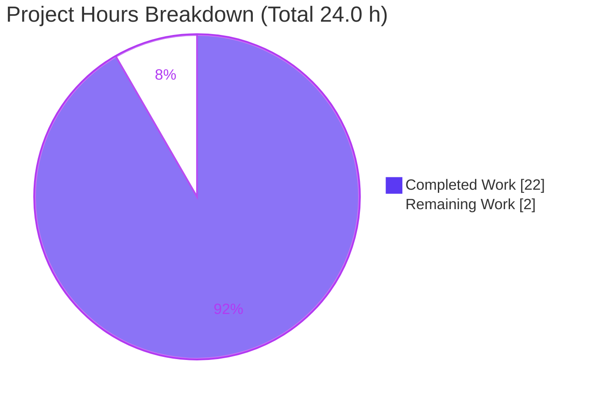
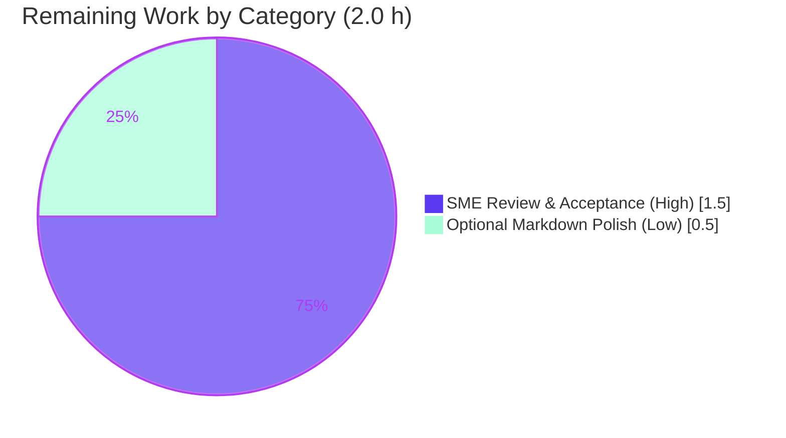

# Blitzy Project Guide — wp-calypso Data-Layer Jest Cold-vs-Warm Timing Investigation

> Brand legend — **Completed / AI Work: Dark Blue `#5B39F3`** · **Remaining / Not Completed: White `#FFFFFF`** · Headings/Accents: Violet-Black `#B23AF2` · Highlight: Mint `#A8FDD9`

---

## 1. Executive Summary

### 1.1 Project Overview

This project delivers a single, evidence-based investigation report that explains **why** the Jest test suite for the `client/state/data-layer` module of the `wp-calypso` monorepo exhibits inconsistent cold-versus-warm execution times. It is a strictly **read-only** research and documentation task: the sole artifact is `blitzy/documentation/wp-calypso_be7e5cc64162.md` (named after the source branch). The report answers four empirically-grounded questions (Q1–Q4) about test-execution timing, the Jest transformation cache, the `nock` HTTP-mocking layer, and the dominant transformation step — each backed by measurements taken against the running repository, exact `path:line` citations, and explicit rationale. The audience is wp-calypso maintainers and performance engineers.

### 1.2 Completion Status


| Metric | Value |
|--------|-------|
| **Total Hours** | **24.0 h** |
| **Completed Hours (AI + Manual)** | **22.0 h** (22.0 AI · 0.0 Manual) |
| **Remaining Hours** | **2.0 h** |
| **Percent Complete** | **91.7 %** |

> Completion is computed using the AAP-scoped, hours-based methodology: `22.0 / (22.0 + 2.0) = 91.7%`. All remaining hours are path-to-production, human-in-the-loop activities — there are **no** outstanding source/code tasks.

### 1.3 Key Accomplishments

- ✅ **All four research questions (Q1–Q4) answered empirically** with measured numbers, not assumptions.
- ✅ **Q1 — Cold/warm ratio quantified** across three representative data-layer tests (44, 52, and 1,432 modules), showing the warm-up penalty scales with import-graph size (≈1.69× → ≈2.72×).
- ✅ **Q2 — Cache fully characterized**: controlling option `cacheDirectory` (`test/client/jest.config.js:L7` → `<repo>/.cache/jest`) and the exactly **three** cached artifact types (haste-map, transform-cache, perf-cache).
- ✅ **Q3 — HTTP mocking traced**: library `nock` `13.5.6`, wired globally and per-test; proven empirically to be **never transformed or cached** and therefore **not** the cold/warm driver.
- ✅ **Q4 — Dominant step isolated**: a controlled cache-decomposition experiment shows `babel-jest` transformation of untranspiled workspace source is the dominant first-run cost.
- ✅ **Read-only constraint preserved**: `git status` clean; only the git-ignored `/.cache/` is regenerated; exactly one new file added (428 lines, 0 deletions).
- ✅ **Empirically re-validated**: every claim and citation independently re-checked; the Q1 timing ratio was reproduced live during this assessment.

### 1.4 Critical Unresolved Issues

| Issue | Impact | Owner | ETA |
|-------|--------|-------|-----|
| _None_ — no release-blocking issues identified. All AAP deliverables are complete and validated. | None | — | — |

### 1.5 Access Issues

| System/Resource | Type of Access | Issue Description | Resolution Status | Owner |
|-----------------|----------------|-------------------|-------------------|-------|
| _No access issues identified_ | — | The repository, toolchain (Node 22.x, Yarn 4.0.2), and dependency tree (3.1 GB `node_modules`) were all available; tests ran successfully; no external services or credentials are required for this read-only investigation. | N/A | — |

### 1.6 Recommended Next Steps

1. **[High]** Have a subject-matter expert review and accept the investigation report `blitzy/documentation/wp-calypso_be7e5cc64162.md`, optionally re-running the Appendix A reproduction commands to spot-check timings on their own hardware.
2. **[High]** Merge the pull request to the target branch once the report is accepted.
3. **[Low]** Optionally run a markdown formatter/linter on the report for house-style consistency (non-blocking; the repo deliberately excludes `.md` from its enforced prettier scope).
4. **[Low]** Link the report from the team wiki / PR description to improve discoverability, since it lives in `blitzy/documentation/` rather than a published docs site.

---

## 2. Project Hours Breakdown

### 2.1 Completed Work Detail

| Component | Hours | Description |
|-----------|------:|-------------|
| Environment setup & empirical methodology | 2.0 | Verified runtime (Node v22.23.1 / Yarn 4.0.2 / Jest 29.7.0), determined the runner command, defined the wall-clock + Jest-reported timing method and the cold-state reset (`rm -rf .cache`). Report §1.1–1.5. |
| Q1 — Cold-vs-warm timing experiment | 3.0 | Ran 3 data-layer tests cold and warm, captured wall-clock + Jest-reported times, computed ratios (≈1.69× / ≈1.58× / ≈2.72×), wrote the import-graph-scaling rationale. Report §2. |
| Q2 — Cache configuration & artifact inspection | 3.0 | Located `cacheDirectory` (`jest.config.js:L7`), inspected the live `.cache/jest`, classified the three artifact types and analyzed cached-file anatomy (hash line, `.map`, `@babel/runtime` refs). Report §3. |
| Q3 — `nock` identification, wiring trace & cache proof | 3.0 | Identified `nock` `13.5.6`, traced global (`setup-test-framework.js`) and per-test (`use-nock`) wiring, devised and **corrected** the empirical "never-cached" proof (commit `e28a0187c8`). Report §4. |
| Q4 — `--no-cache` & cache-decomposition experiment | 4.0 | Ran `--no-cache` (reproduces cold), designed and executed the 4-state cache-decomposition (3× each, min), isolated `babel-jest` as dominant, confirmed zero asset-transform work, explained the `calypso:src` amplifier. Report §5. |
| Report authoring (428 lines) | 4.0 | Authored the structured Markdown report: TL;DR, methodology, Q1–Q4, conclusion, 9 tables, 48 `path:line` citations, reproduction appendix, read-only proof, citation index. Report §6 + Appendices A–C. |
| Empirical re-validation, read-only verification & commits | 3.0 | Independently reproduced every claim, verified all citations exact, confirmed `git status` clean, committed the deliverable (2 commits). Final Validator gates 1–5. |
| **Total Completed** | **22.0** | |

### 2.2 Remaining Work Detail

| Category | Hours | Priority |
|----------|------:|----------|
| Human SME review & acceptance of empirical findings (read report, verify Q1–Q4, optionally re-run Appendix A reproduction, accept, merge PR) | 1.5 | High |
| Optional Markdown formatting/lint polish (non-blocking; repo excludes `.md` from enforced prettier scope) | 0.5 | Low |
| **Total Remaining** | **2.0** | |

### 2.3 Hours Reconciliation Summary

| Quantity | Hours | Cross-Section Check |
|----------|------:|---------------------|
| Completed (Section 2.1 total) | 22.0 | = Section 1.2 Completed Hours ✓ |
| Remaining (Section 2.2 total) | 2.0 | = Section 1.2 Remaining Hours = Section 7 "Remaining Work" ✓ |
| **Total (2.1 + 2.2)** | **24.0** | = Section 1.2 Total Hours ✓ |
| Percent Complete | 91.7 % | `22.0 / 24.0` — consistent in §1.2, §7, §8 ✓ |

---

## 3. Test Results

All tests below originate from Blitzy's autonomous validation logs for this project (Final Validator gate 1) and were independently re-confirmed during this assessment (the Q1 cold/warm run was reproduced live). The deliverable is a read-only documentation report, so the relevant tests are the **data-layer subject suites** executed to ground the empirical timing claims.

| Test Category | Framework | Total Tests | Passed | Failed | Coverage % | Notes |
|---------------|-----------|------------:|-------:|-------:|-----------:|-------|
| Data-layer subject — `wpcom/meta/sms-country-codes` | Jest 29.7.0 | 3 | 3 | 0 | N/A* | Leaf test (44 modules); passes cold, warm, and `--no-cache`. Re-run live during this assessment (3/3). |
| Data-layer subject — `wpcom-http` | Jest 29.7.0 | 2 | 2 | 0 | N/A* | Uses `nock` via `use-nock`; primary Q1/Q2/Q3/Q4 subject (52 modules). |
| Data-layer subject — `wpcom/jetpack-install` | Jest 29.7.0 | 5 | 5 | 0 | N/A* | Heavy import graph (1,432 modules); Q1/Q4 generalization. |
| **Total** | **Jest 29.7.0** | **10** | **10** | **0** | **N/A*** | **100 % pass rate** across all executed data-layer subjects (also green under `--no-cache`). |

\* *Coverage % is not applicable: this is a timing/behavior investigation, not a coverage-driven change. No source code was added or modified, so no coverage target exists. The pass/fail metric confirms the measured subjects execute correctly in every cache mode.*

---

## 4. Runtime Validation & UI Verification

This is a Node/CLI investigation with **no UI surface**; runtime validation centers on the Jest runner and the cache subsystem.

- ✅ **Operational** — Jest runner executes successfully in all four modes: cold, warm, `--no-cache`, and cache-decomposition.
- ✅ **Operational** — All 3 data-layer subject suites pass (10/10) in every cache mode.
- ✅ **Operational** — Live `.cache/jest` directory contains exactly the three documented artifact types (`haste-map-*` binary, `jest-transform-cache-*/` shards, `perf-cache-*` JSON).
- ✅ **Operational** — `nock` network isolation active (`disableNetConnect()`); empirical proof that `nock`'s own source is never transformed/cached (0 matches under `node_modules/nock`).
- ✅ **Operational** — Read-only constraint verified at runtime: `git status --porcelain` empty after all test runs; `git check-ignore .cache` confirms `/.cache/` is git-ignored.
- ⚠ **Partial (informational)** — Absolute timing numbers vary with host hardware (shared-container CPU/IO variance); the report mitigates this by reporting **ratios** and "≈" qualifiers, and the qualitative conclusions are hardware-independent.
- ❌ **Failing** — None.
- **N/A — UI Verification**: no web UI, components, or screens are part of this deliverable.

---

## 5. Compliance & Quality Review

Cross-mapping the AAP deliverables and the governing rule (**SWE-AtlasQnA-Repo**) to compliance benchmarks. Fixes applied during autonomous validation are noted.

| Benchmark / AAP Directive | Status | Progress | Notes / Fixes Applied |
|---------------------------|--------|---------:|------------------------|
| Create markdown doc named `<source_branch_name>.md` | ✅ Pass | 100% | `blitzy/documentation/wp-calypso_be7e5cc64162.md` (branch `wp-calypso_be7e5cc64162`). |
| Build & run source code empirically (no assumptions) | ✅ Pass | 100% | All timings measured by running tests cold/warm/`--no-cache`; cache inspected live. |
| Provide thinking / rationale behind answers | ✅ Pass | 100% | Each of Q1–Q4 includes an explicit rationale; §6 ties all four together. |
| Do not modify any existing repository files | ✅ Pass | 100% | `git diff` shows a single added file (428 insertions, 0 deletions); tree clean. |
| Do not add any other code besides the document | ✅ Pass | 100% | No source/config/test/dependency changes; `yarn.lock` immutable. |
| Place document in `blitzy/documentation/` | ✅ Pass | 100% | Confirmed exact placement. |
| Q1 — timing ratio reported as t(first)/t(second) | ✅ Pass | 100% | Ratios reported per subject; independently reproduced (sms ≈1.62× live). |
| Q2 — cache directory + controlling option + file types | ✅ Pass | 100% | `cacheDirectory` → `<repo>/.cache/jest`; three artifact types enumerated. |
| Q3 — mocking library + helper location + timing impact | ✅ Pass | 100% | `nock`; global + per-test wiring; empirical never-cached proof. **Fix applied**: Q3 proof corrected from an identifier-grep to a source-path check (`e28a0187c8`). |
| Q4 — `--no-cache` comparison + dominant step | ✅ Pass | 100% | `--no-cache` reproduces cold; `babel-jest` isolated as dominant. |
| Citation accuracy (`path:line`) | ✅ Pass | 100% | All 48 citations independently spot-checked exact during this assessment. |
| Markdown well-formedness | ✅ Pass | 100% | 16 balanced code fences, 9 well-formed tables, hierarchical headings. |
| Markdown prettier/lint house-style | ⚠ Optional | — | `.md` deliberately excluded from repo prettier scope; not enforced by hooks/CI. Non-blocking (Section 2.2, Low). |

---

## 6. Risk Assessment

Risk posture is **minimal** — a read-only documentation task with zero code, dependency, configuration, or infrastructure changes. No High/Critical or release-blocking risks exist.

| Risk | Category | Severity | Probability | Mitigation | Status |
|------|----------|----------|-------------|------------|--------|
| Absolute timing numbers are environment-dependent (shared-container CPU/IO variance); won't reproduce exactly on other hardware | Technical | Low | High | Report uses "≈" qualifiers and reports **ratios** (not just absolutes); documents full methodology; qualitative conclusions (cold > warm, scales with import-graph, `babel-jest` dominant) are hardware-independent | Mitigated |
| `haste-map` exact byte size drifts (~4.5 % observed) | Technical | Low | Medium | Figure is an explicitly-"≈" transient artifact; artifact **type** classification is exact and immaterial to conclusions | Mitigated |
| Citation line-number drift if `jest.config.js` / dependencies change in future | Technical | Low | Low | Point-in-time investigation; Appendix C citation index enables fast re-verification | Accepted |
| Empirical claims require human trust without a re-run | Technical | Low | Low | Full copy-pasteable reproduction commands in Appendix A; SME can re-verify in minutes (done for Q1 here) | Mitigated |
| Deliverable discoverability (lives in `blitzy/documentation/`, not a published docs site) | Operational | Low | Medium | Standard repo location per AAP; link from PR / wiki on acceptance | Open (human) |
| Markdown not prettier-formatted | Operational | Low | Low | `.md` excluded from enforced prettier scope; optional polish task in Section 2.2 | Accepted |
| Security risks | Security | None | — | No code added, no dependencies changed, no credentials/secrets, no new attack surface | N/A |
| Integration risks | Integration | None | — | No external services, API keys, webhooks, or CI changes | N/A |

---

## 7. Visual Project Status



**Remaining hours by category (Section 2.2):**



> **Integrity note:** "Remaining Work" = **2.0 h**, identical to Section 1.2 (Remaining Hours) and the sum of Section 2.2's Hours column. "Completed Work" = **22.0 h** = Section 2.1 total. Total = **24.0 h**.

---

## 8. Summary & Recommendations

**Achievements.** The project is **91.7 % complete** (22.0 of 24.0 hours). Every AAP-scoped deliverable is finished and validated: all four research questions (Q1–Q4) are answered with empirical measurements, exact `path:line` citations, and explicit rationale, packaged into a single 428-line Markdown report at `blitzy/documentation/wp-calypso_be7e5cc64162.md`. The investigation correctly identifies the root cause — Jest's on-demand `babel-jest` transformation of untranspiled workspace source (amplified by the `calypso:src` resolver), cached under `cacheDirectory` — and proves that `nock` is **not** the cold/warm driver. The strict read-only constraint was honored throughout (clean `git status`; only the git-ignored `/.cache/` regenerated).

**Remaining gaps.** The remaining **2.0 hours** are entirely path-to-production, human-in-the-loop activities: SME review/acceptance and merge (1.5 h, High) and an optional markdown formatting pass (0.5 h, Low). There are **no** outstanding code, test, configuration, or dependency tasks; performance optimizations are explicitly out of AAP scope.

**Critical path to production.** (1) SME reviews and accepts the report → (2) merge the PR → (3) (optional) format/lint the markdown. This is a short, low-risk path with no engineering blockers.

**Success metrics.** 10/10 data-layer subject tests pass in every cache mode; 48/48 citations verified exact; Q1 timing ratio independently reproduced; 0 tracked-file modifications beyond the single deliverable.

**Production readiness assessment.** The deliverable is **production-ready pending human acceptance**. Confidence is **High** — the Final Validator reported zero corrections across all five gates, and this independent assessment confirmed the report's accuracy, completeness, well-formedness, and read-only compliance.

| Metric | Result |
|--------|--------|
| Completion | 91.7 % (22.0 / 24.0 h) |
| AAP requirements completed | 7 of 7 (100 %) |
| Data-layer tests passing | 10 / 10 (100 %) |
| Citations verified | 48 / 48 exact |
| Tracked-file changes | 1 file added, 0 modified, 0 deleted |
| Release-blocking issues | 0 |

---

## 9. Development Guide

> This guide explains how to set up the environment and **reproduce the investigation's empirical findings**. Every command was tested on the validation machine. Run all commands from the repository root.

### 9.1 System Prerequisites

- **Node.js `^v22.9.0`** (the repo pins `22.9.0` in `.nvmrc`; validated on `v22.23.1`). ⚠️ **Node 20.x fails the `engines` check** — use Node 22.x.
- **Yarn `4.0.2`** (declared in `package.json` `packageManager`; enable via Corepack).
- **Disk**: ≈4 GB free for `node_modules` (installed tree is ≈3.1 GB).
- **OS**: Linux or macOS (validated on Linux).

### 9.2 Environment Setup

```bash
# From the repository root
nvm install        # reads .nvmrc (22.9.0); or: nvm use
corepack enable    # activates the pinned Yarn 4.0.2
node --version     # expect v22.x (>= v22.9.0)
yarn --version     # expect 4.0.2
```

### 9.3 Dependency Installation

```bash
# --immutable keeps yarn.lock and all tracked files unchanged (preserves the read-only constraint)
yarn install --immutable
```

Expected: dependencies resolve from the lockfile; no changes to tracked files. Verify with `git status --porcelain` (should be empty).

### 9.4 Running the Investigation (Reproduce Q1–Q4)

```bash
# Q1 — Cold vs warm (repeat per subject)
rm -rf .cache                                                   # guarantee a cold start
CI=true TZ=UTC node_modules/.bin/jest -c=test/client/jest.config.js --watchAll=false \
  client/state/data-layer/wpcom-http/test/index.js             # COLD run
CI=true TZ=UTC node_modules/.bin/jest -c=test/client/jest.config.js --watchAll=false \
  client/state/data-layer/wpcom-http/test/index.js             # WARM run (immediately after)

# Q2 — Inspect the cache (three artifact types)
ls -la .cache/jest
file .cache/jest/haste-map-*                                   # -> data (V8-serialized binary)
find .cache/jest -maxdepth 2 | head
cat .cache/jest/perf-cache-*                                   # -> small JSON of per-test runtimes

# Q3 — Prove nock's OWN source is never cached
TC=$(find .cache/jest -maxdepth 1 -name 'jest-transform-cache-*')
grep -rl 'node_modules/nock' "$TC" | wc -l                     # -> 0  (nock never transformed/cached)

# Q4 — --no-cache reproduces cold timing
CI=true TZ=UTC node_modules/.bin/jest -c=test/client/jest.config.js --watchAll=false \
  --no-cache client/state/data-layer/wpcom-http/test/index.js
```

### 9.5 Verification Steps

```bash
# Tests pass in every cache mode (expect "Tests: N passed, N total")
CI=true TZ=UTC node_modules/.bin/jest -c=test/client/jest.config.js --watchAll=false \
  client/state/data-layer/wpcom/meta/sms-country-codes/test/index.js

# Read-only constraint intact (both expected to confirm cleanliness)
git status --porcelain        # -> empty (clean)
git check-ignore .cache       # -> .cache  (confirms /.cache/ is git-ignored)
```

### 9.6 Example Usage — Measuring the Cold/Warm Ratio

```bash
# Wall-clock timing without bc (bc is not installed); use python3 or Jest's self-reported Time:
rm -rf .cache
python3 - <<'PY'
import subprocess, time, os
env = dict(os.environ, CI="true", TZ="UTC")
cmd = ["node_modules/.bin/jest","-c=test/client/jest.config.js","--watchAll=false",
       "client/state/data-layer/wpcom/meta/sms-country-codes/test/index.js"]
def run():
    t=time.time(); subprocess.run(cmd, env=env, capture_output=True); return time.time()-t
cold=run(); warm=run()
print(f"cold={cold:.3f}s warm={warm:.3f}s ratio={cold/warm:.2f}x")
PY
# Expected: cold > warm, ratio > 1.5x for this leaf test (scales higher for heavier import graphs)
```

### 9.7 Troubleshooting

- **`engines` error / wrong Node**: ensure Node 22.x (`nvm use`); Node 20.x is rejected by `package.json` `engines.node: "^v22.9.0"`.
- **`bc: command not found`**: it is not installed — use `python3` (as above) or read Jest's self-reported `Time:` line.
- **Warm timing on the "first" run**: you forgot `rm -rf .cache`; the cache persisted from a prior run.
- **`prettier --check` warns on the `.md`**: expected and **non-blocking** — the repo excludes `.md` from its enforced prettier scope; do not reformat the verified tables unless intentional.
- **`yarn install` wants to change the lockfile**: always pass `--immutable` to preserve the read-only constraint.

---

## 10. Appendices

### Appendix A — Command Reference

| Purpose | Command |
|---------|---------|
| Run one data-layer test (client config) | `CI=true TZ=UTC node_modules/.bin/jest -c=test/client/jest.config.js --watchAll=false <path>` |
| Project client runner script | `yarn test-client <path>` (`package.json:L122`) |
| Force cold start | `rm -rf .cache` |
| Disable cache (reproduce cold) | append `--no-cache` |
| Inspect cache contents | `ls -la .cache/jest` · `find .cache/jest -maxdepth 2` |
| Classify haste-map | `file .cache/jest/haste-map-*` → `data` |
| Prove `nock` never cached | `grep -rl 'node_modules/nock' "$(find .cache/jest -maxdepth 1 -name 'jest-transform-cache-*')" \| wc -l` → `0` |
| Read-only check | `git status --porcelain` (empty) · `git check-ignore .cache` (`.cache`) |
| Install deps immutably | `yarn install --immutable` |

### Appendix B — Port Reference

| Port | Service |
|------|---------|
| _None_ | This investigation runs no servers or network services; `nock.disableNetConnect()` blocks all real network during tests. |

### Appendix C — Key File Locations

| File | Role |
|------|------|
| `blitzy/documentation/wp-calypso_be7e5cc64162.md` | **The deliverable** (investigation report, 428 lines). |
| `test/client/jest.config.js` | `cacheDirectory` (L7), `transformIgnorePatterns` (L14–16), `setupFilesAfterEnv` (L21). |
| `packages/calypso-jest/jest-preset.js` | `transform` map + `babel-jest` (L13–16), `resolver` (L9), `testEnvironment` (L11). |
| `packages/calypso-jest/src/module-resolver.js` | `calypso:src` untranspiled-source resolution (L8–10, L18). |
| `packages/calypso-jest/src/asset-transform.js` | Trivial asset transformer (zero work for these tests). |
| `babel.config.js` | Babel root config (`@automattic/calypso-babel-config`, Emotion JSX import source). |
| `test/client/setup-test-framework.js` | Global `nock` bootstrap (`disableNetConnect`, before/after). |
| `client/test-helpers/use-nock/index.js` | Per-test `nock` helper (`@deprecated`). |
| `client/state/data-layer/**` | Test subjects measured (wpcom-http, sms-country-codes, jetpack-install). |
| `.cache/jest/` | Git-ignored transient cache (haste-map, transform-cache, perf-cache). |

### Appendix D — Technology Versions

| Component | Version | Source |
|-----------|---------|--------|
| Node.js | v22.23.1 (engines `^v22.9.0`) | `.nvmrc`, `package.json:L56-L59` |
| Yarn | 4.0.2 | `package.json:L422` |
| Jest | 29.7.0 | `package.json:L290` |
| babel-jest | 29.7.0 (bundled) | `packages/calypso-jest/jest-preset.js:L14` |
| @babel/core | 7.26.10 | `package.json:L242` |
| enhanced-resolve | 5.9.3 | `package.json:L213` |
| nock | 13.5.6 | `package.json:L299` |
| @automattic/calypso-jest | 1.0.0 (workspace) | preset/resolver/asset-transform |
| @automattic/calypso-babel-config | 1.0.0 (workspace) | Babel presets/plugins |

### Appendix E — Environment Variable Reference

| Variable | Value | Purpose |
|----------|-------|---------|
| `CI` | `true` | Deterministic, non-interactive Jest (disables watch/prompts). |
| `TZ` | `UTC` | Stable timezone so date-sensitive code behaves identically across runs. |
| `--watchAll` | `false` (flag) | Run once and exit (no watch mode). |
| `--no-cache` | (flag) | Force Jest to ignore the cache and re-transform every file (Q4). |

### Appendix F — Developer Tools Guide

| Tool | Use |
|------|-----|
| `jest --version` | Confirm transformer/runner version (29.7.0). |
| `file <artifact>` | Classify cache artifacts (haste-map → `data`/binary). |
| `find` / `ls` | Enumerate cache shard directories and artifact types. |
| `grep -rl` | Empirically prove which source paths are (not) cached. |
| `git status --porcelain` / `git check-ignore` | Verify the read-only constraint and git-ignored cache. |
| `python3` | Wall-clock timing harness (since `bc` is unavailable). |

### Appendix G — Glossary

| Term | Definition |
|------|------------|
| **Cold run** | First run with no `.cache/jest` present — pays one-time haste-map build + `babel-jest` transform cost. |
| **Warm run** | Subsequent run that reuses the transform cache and haste-map — markedly faster. |
| **`cacheDirectory`** | Jest option (here `<repo>/.cache/jest`) that controls where the transform/haste/perf caches are written. |
| **haste-map** | Jest's V8-serialized file-crawler/dependency map of `rootDir`, used to reduce start-up time. |
| **transform-cache** | Sharded directory of `babel-jest`-transpiled CommonJS output (+ `.map` siblings) — the bulk of warm-run reuse. |
| **perf-cache** | Small JSON of per-test runtimes used for worker scheduling. |
| **`calypso:src`** | Package field preferred by the custom resolver that points to **untranspiled** source, forcing `babel-jest` to transform workspace source at test time. |
| **`nock`** | HTTP mocking library used for network isolation; lives in `node_modules`, never transformed/cached. |
| **`--no-cache`** | Jest flag that ignores the cache and re-transforms every file (reproduces cold timing). |
