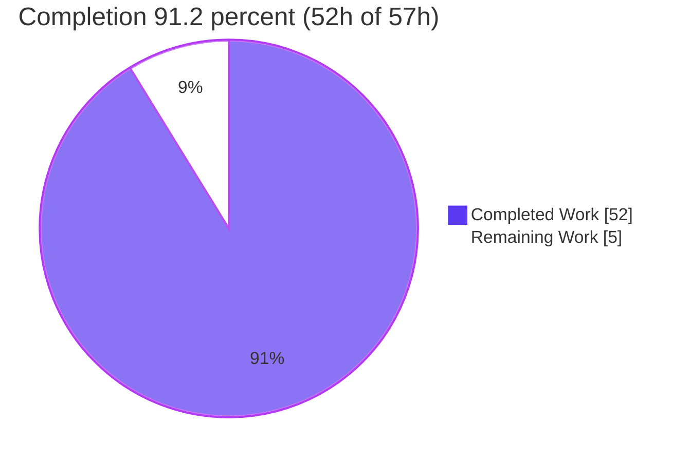
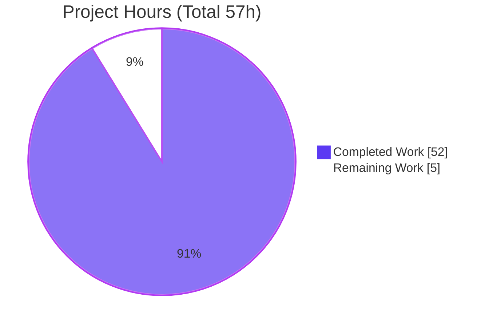
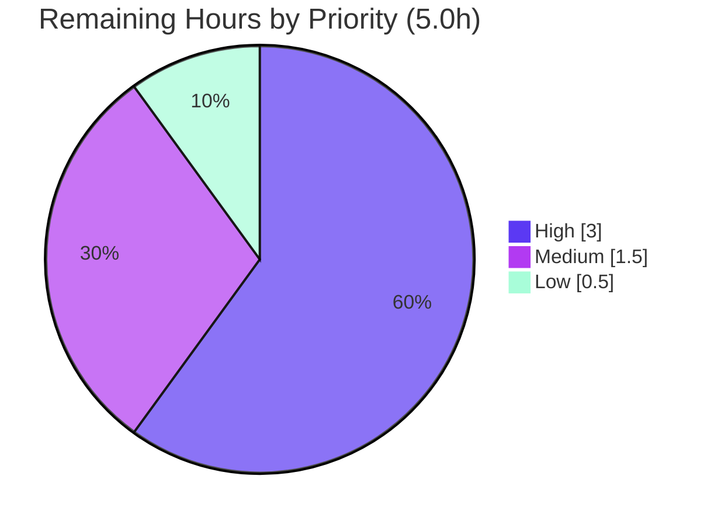

# Blitzy Project Guide — wp-calypso Test-vs-Development Runtime Investigation

## 1. Executive Summary

### 1.1 Project Overview

This project delivers a single, evidence-backed onboarding document that explains — and proves by actually building, booting, and running the code — how the Automattic/wp-calypso **test environment** differs from the **normal development runtime**. The deliverable, `blitzy/documentation/wp-calypso_be7e5cc64162.md`, answers eight discrete questions (Q1-Q8): dev-server boot, test-vs-dev environment at boot, test-only globals/polyfills, network handling under Jest, a mock->action->assertion trace, and feature-flag config divergence. It targets engineers onboarding onto the monorepo. The governing rule (`SWE-AtlasQnA-Repo`) mandates a strict read-only source tree and a "run the code first, then write" methodology, with every claim backed by captured runtime output and `file:line` grounding.

### 1.2 Completion Status

The project is **91.2% complete** on an AAP-scoped, hours-based basis. All autonomous investigation and authoring work is finished and independently validated; the remaining 5 hours are human path-to-production activities (peer review, acceptance sign-off, merge/publication).



| Metric | Hours |
|---|---|
| **Total Hours** | 57 |
| **Completed Hours (AI + Manual)** | 52 |
| &nbsp;&nbsp;- Completed by Blitzy autonomous agents (AI) | 52 |
| &nbsp;&nbsp;- Completed by humans to date (Manual) | 0 |
| **Remaining Hours** | 5 |
| **Percent Complete** | 91.2% |

> Color legend (applied throughout): **Completed = Dark Blue `#5B39F3`**, **Remaining = White `#FFFFFF`**.

### 1.3 Key Accomplishments

- All eight questions (Q1-Q8) answered with the run-first methodology — 2,065 lines, 15,983 words, 33 evidenced sub-sections, each following a Claim -> Command -> Unedited Output -> Grounding -> Observed/Inferred/External structure.
- Dev server booted (Q1) via the canonical `yarn start` chain; real bunyan boot log captured (`http://calypso.localhost:3000`, env=development), with post-Ready responses of 25,104 bytes (`/`) and 42,397 bytes (`/log-in`), confirmed stable across two boots.
- Primary test suite green (Q2-Q5): `CI=true TZ=UTC yarn run test-client` -> **12,010 passed / 16 skipped / 0 failed** across 1,391 suites; the Q5 exemplar `client/state/terms/test/actions.js` passes **16/16** (independently re-run this session, exit 0).
- Config divergence proven (Q6/Q7): identical `config.isEnabled('google-my-business')` resolves **`false` in test** vs **`true` in development** — reproduced first-hand from `config/test.json:L47` and `config/development.json:L67`.
- Network isolation proven (Q4): `nock.disableNetConnect()` produces a `NetConnectNotAllowedError` for un-intercepted hosts; corroborated against official nock documentation.
- Read-only invariant verified (Q8): `git diff baseline..HEAD` shows exactly one added file; working tree clean; all temporary probes removed.
- 133 `file:line` citations validated against the pinned baseline; code fences balanced (168); zero documented-vs-observed discrepancies.

### 1.4 Critical Unresolved Issues

| Issue | Impact | Owner | ETA |
|---|---|---|---|
| _None blocking._ All five production-readiness gates pass; the deliverable has zero unresolved defects. | No release blockers | — | — |
| Human peer review & acceptance not yet performed (expected path-to-production step) | Non-blocking; required before merge | Reviewing engineer / Onboarding lead | Within 1 business day (~5h effort) |

### 1.5 Access Issues

No access issues identified.

| System/Resource | Type of Access | Issue Description | Resolution Status | Owner |
|---|---|---|---|---|
| wp-calypso repository | Read/Write (git) | None — repo cloned, branch checked out, baseline verified | No issue | — |
| npm / Yarn Berry registry | Package install | None — `yarn install --immutable` succeeded with unchanged lockfile | No issue | — |
| Node/toolchain (v22.23.1, Yarn 4.0.2) | Runtime | None — satisfies `engines: node ^v22.9.0` | No issue | — |
| External nock documentation | Web (validation) | None — contract corroborated via web search | No issue | — |

### 1.6 Recommended Next Steps

1. **[High]** Reproduce a representative sample of the run-first evidence (install -> build-server -> start-build -> single-file test-client) and confirm output matches the document.
2. **[High]** Verify a sample of `file:line` citations against baseline `be7e5cc641` and read all eight answer sections for accuracy and onboarding clarity.
3. **[Medium]** Obtain stakeholder / onboarding-lead acceptance sign-off that the document usefully answers Q1-Q8.
4. **[Low]** Merge the documentation branch to the target branch and publish/link the doc in the onboarding knowledge base.
5. **[Low / Optional, out-of-scope]** Separately track the pre-existing environmental non-primary suite failures (`test-server` mock-fs, `test-packages` ICU 78.2) if green non-primary suites are later desired — not part of this project's scope.

---

## 2. Project Hours Breakdown

### 2.1 Completed Work Detail

All hours below were performed autonomously by Blitzy agents and trace to specific AAP requirements. **Total = 52 hours.**

| Component | Hours | Description |
|---|---|---|
| Environment establishment | 3 | `yarn install` on a 94-package Yarn Berry monorepo; Node/Yarn verification; toolchain bring-up [AAP 0.3.1] |
| Dev-server build, boot & Q1 evidence | 5 | `build-server` -> `build/server.js`; `start-build`; captured bunyan boot log, on-demand compile, two-run stability [AAP Q1] |
| Q2 — Test-environment characterization | 4 | `node` default env + jsdom opt-in + inherited Jest config; NODE_ENV=test vs development, TZ=UTC [AAP Q2] |
| Q3 — Test-only globals/env/polyfills | 6 | Every injected client symbol verbatim; 3-context matrix; `crypto.randomUUID` determinism across two runs; packages contrast [AAP Q3] |
| Q4 — Network-handling investigation | 6 | Four conditions across four suites; `NetConnectNotAllowedError` capture; fetch-stub proof; external corroboration [AAP Q4] |
| Q5 — Mock->action->assertion trace | 6 | Verbose `terms` run; full transitive trace; "on failure" correction; genuine 400-path probe [AAP Q5] |
| Q6 — Config-resolution mechanism | 4 | Canonical test path + dev path + direct-module corroboration + browser/prod scoping [AAP Q6] |
| Q7 — Config-control + divergence proof | 5 | Three control mechanisms (disk / `jest.mock` / `ENABLE`-`DISABLE_FEATURES`); error-path fidelity; contrast suites [AAP Q7] |
| Q8 — Read-only invariant & cleanup | 3 | Byte-identical-tree verification; git provenance; temporary-probe removal [AAP Q8] |
| Web-search nock contract validation | 1 | AAP-required external corroboration of `disableNetConnect()` behavior [AAP 0.2.2] |
| Document authoring & citation validation | 6 | Structure, methodology section, 133 `file:line` citations, line-drift reconciliation [AAP 0.4.2] |
| Remediation cycles | 3 | 4 review-driven commits: code-review findings, Snyk link, Q8 provenance, Q4 evidence [git history] |
| **Total Completed** | **52** | |

### 2.2 Remaining Work Detail

All remaining work is human path-to-production. **Total = 5 hours.**

| Category | Hours | Priority |
|---|---|---|
| Reproduce sample run-first evidence (install/build/boot/single-file test) | 1.5 | High |
| Verify sample citations + read all 8 answer sections for accuracy/clarity | 1.5 | High |
| Stakeholder / onboarding acceptance review & sign-off | 1.5 | Medium |
| Merge documentation branch + publish/link in knowledge base | 0.5 | Low |
| **Total Remaining** | **5.0** | |

> **Out-of-scope (not counted above):** pre-existing environmental failures in non-primary suites (`test-server` mock-fs; `test-packages` ICU 78.2/jsdom) are byte-identical to baseline, are not deliverable defects, and cannot be fixed under the read-only rule (est. 8-16h if ever pursued as a separate effort). Excluded per AAP 0.5.2.

### 2.3 Hours Reconciliation

- **Completed (2.1) = 52h** + **Remaining (2.2) = 5h** = **Total = 57h** (matches Section 1.2).
- **Completion % = 52 / 57 x 100 = 91.2%** (matches Section 1.2, Section 7, Section 8).

---

## 3. Test Results

All tests below originate from Blitzy's autonomous validation logs for this project (primary evidence base). Because this is a **read-only documentation task that adds no product code**, coverage is not a meaningful metric — suites were executed to **capture runtime evidence**, not to measure code coverage of new code.

| Test Category | Framework | Total Tests | Passed | Failed | Coverage % | Notes |
|---|---|---|---|---|---|---|
| Unit/Integration — Client suite (primary, canonical) | Jest 29.7.0 | 12,026 | 12,010 | 0 | N/A | `CI=true TZ=UTC yarn run test-client`; 16 skipped (intentional); 1,391 suites; exit 0 |
| Q5 exemplar — `client/state/terms/test/actions.js` | Jest 29.7.0 | 16 | 16 | 0 | N/A | Re-run independently this session; `TERMS_RECEIVE on success` passes; exit 0 (subset of client suite) |
| Build-tools suite | Jest 29.7.0 | 3 | 3 | 0 | N/A | `yarn run test-build-tools`; exit 0 |
| Q1-Q8 reproduction probes | Jest 29.7.0 / Node | per-probe | all | 0 | N/A | Temporary probes run through the canonical harness, matched documented evidence, then removed |
| Cross-suite single-file probes (server/packages/integration, Q4) | Jest 29.7.0 | targeted | targeted pass | 0 | N/A | Canonical `yarn run test-<suite> <path>` entry points, each "1 passed" |

**Out-of-scope, pre-existing environmental failures (fully disclosed — NOT counted against completion):**

| Test Category | Framework | Total | Passed | Failed | Notes |
|---|---|---|---|---|---|
| Server suite (non-primary) | Jest 29.7.0 | — | — | 4 | `client/server/lib/logger/test/index.js` — `mock-fs` "Item with the same name already exists: tmp" (mock-fs incompatibility with Node 20+/22); byte-identical to baseline |
| Packages suite (non-primary) | Jest 29.7.0 | — | — | 23 | Node's bundled ICU 78.2 CLDR locale-data differences (currency/number formatting) + jsdom "navigation not implemented"; byte-identical to baseline |

> **Integrity note:** Every row above is drawn from Blitzy's autonomous test-execution logs. The out-of-scope failures are environmental (bound to the Node binary's mock-fs/ICU/jsdom), affect files that are byte-identical to baseline, and cannot be altered by a `.md` deliverable that no test `require()`s. They therefore do not undermine any documented claim.

---

## 4. Runtime Validation & UI Verification

**Runtime health (SSR dev server, canonical `yarn run start-build`):**

- Operational — Server boots: `wp-calypso booted in ~1.1 s - http://calypso.localhost:3000` (env=development).
- Operational — Node engine gate: `npx check-node-version --package` passes on Node v22.23.1 (satisfies `^v22.9.0`).
- Operational — Build artifact: `build/server.js` (7.9 MB) generated cleanly by `yarn run build-server` (zero webpack error lines; only benign Browserslist warnings).

**HTTP / API integration outcomes (captured, byte-exact):**

- Operational — Pre-Ready `GET /` -> HTTP 200, 630-byte placeholder, triggers on-demand client webpack compile.
- Operational — Post-Ready `GET /` -> HTTP 200, **25,104 bytes**, `<title>WordPress.com</title>`.
- Operational — Post-Ready `GET /log-in` -> HTTP 200, **42,397 bytes**, `<title>Log In — WordPress.com</title>`.
- Operational — Two-run boot stability confirmed (byte sizes stable across consecutive boots).

**UI verification:**

- Partial / N/A by design — This is a testing-infrastructure Q&A task with **no UI in scope** (AAP 0.3.3). UI correctness was verified **textually** via HTTP status, response byte-length, and `<title>` rather than by screenshot, matching the document's captured evidence. The rendered dev UI (favicon-development.ico, real WordPress.com markup) was confirmed present in the response bodies.

**Config-resolution runtime check (re-verified this session):**

- Operational — `config/development.json` `features['google-my-business']` = **true**; `config/test.json` = **false** — the Q7 divergence resolves at runtime as documented.

Status legend: Operational = healthy/verified; Partial = partially applicable; Failing = broken (none in scope).

---

## 5. Compliance & Quality Review

Cross-mapping AAP deliverables and the binding `SWE-AtlasQnA-Repo` rule to observed quality benchmarks.

| Requirement / Benchmark | Source | Status | Evidence |
|---|---|---|---|
| Single deliverable at fixed path `blitzy/documentation/wp-calypso_be7e5cc64162.md` | AAP 0.4.2 / Rule | Pass | Exactly one added file (2,065 lines); path & name match branch |
| Read-only source tree (byte-identical except doc) | AAP 0.5 / Rule | Pass | `git diff baseline..HEAD --name-status` = single `A`; `git status --porcelain` empty |
| Run-first methodology (build/run before writing) | AAP 0.1.3 / Rule | Pass | All 5 gates executed; captured output embedded next to claims |
| Every claim: command + unedited output + `file:line` | Rule | Pass | 33 evidenced sub-sections; 133 valid citations; balanced code fences |
| Observed vs inferred vs external labeling | Rule | Pass | Explicit labels throughout; external used only for Q4 nock contract |
| Cover every condition (all suites, error & happy paths, both envs) | AAP 0.3.5 / Rule | Pass | Client + server + packages + integration suites; 400-path probe; both config envs |
| Answer every named item/flag/mechanism | Rule | Pass | All named globals/flags/functions addressed (fetch, ResizeObserver, google-my-business, addTerm, etc.) |
| Web-search validation of nock contract | AAP 0.2.2 | Pass | Official nock docs corroborate `NetConnectNotAllowedError` / ENETUNREACH |
| Temporary observation scripts removed | AAP 0.3.5 / Rule | Pass | No probe residue; working tree clean |
| Q1 dev server boots | AAP Q1 | Pass | Real bunyan boot log; port 3000; two-run stability |
| Q2-Q3 test env & test-only globals | AAP Q2/Q3 | Pass | node/jsdom contrast; every injected symbol enumerated |
| Q4 network handling | AAP Q4 | Pass | `nock.disableNetConnect()` error captured; fetch stub proven |
| Q5 mock->action->assertion trace | AAP Q5 | Pass | terms exemplar 16/16; full transitive trace |
| Q6-Q7 config divergence & control | AAP Q6/Q7 | Pass | google-my-business false(test)/true(dev); 3 control mechanisms |
| Q8 read-only proof | AAP Q8 | Pass | Invariant verified with git evidence |

**Fixes applied during autonomous validation:** 4 remediation commits resolved code-review findings, a broken Snyk source link (Q4), Q8 read-only provenance reconciliation, and Q4 network-evidence hardening. **Outstanding compliance items:** none within scope.

---

## 6. Risk Assessment

| Risk | Category | Severity | Probability | Mitigation | Status |
|---|---|---|---|---|---|
| `file:line` citations drift if source files change post-baseline | Technical | Low | Medium (long-term) | Refs pinned to baseline `be7e5cc641`; methodology note; 2 drifted refs already reconciled; re-verify on major rebase | Mitigated |
| Captured byte sizes/timing are environment-specific (Node v22.23.1, ICU 78.2) | Technical | Low | Low | Exact toolchain versions stated; mechanism (not the byte count) is the durable claim | Mitigated |
| Pre-existing environmental failures in non-primary suites (mock-fs; ICU 78.2/jsdom) | Technical | Low | High (reproduces on Node 22) | Fully disclosed; out of AAP scope 0.5.2; not deliverable defects; files byte-identical to baseline | Accepted (out of scope) |
| No new attack surface / secrets / auth introduced | Security | Informational | — | Read-only doc; discusses test flags only; contains no credentials | No action |
| Reproducing evidence requires full install + build + boot (time/resource cost) | Operational | Low | Medium | Exact copy-paste commands + expected output provided in doc & Section 9 | Mitigated |
| Onboarding doc may become stale as wp-calypso evolves | Operational | Low | Medium (long-term) | Baseline commit pinned in title; recommend periodic review ownership | Open (human) |
| Markdown not `require()`'d / not in build graph — cannot break integrations | Integration | None | — | Verified not imported by any code | No action |
| Document value depends on discoverability (must be linked/indexed post-merge) | Integration | Low | Medium | Knowledge-base publication task included in remaining work | Open (human) |

**Overall risk posture: LOW.** No High/Critical risks; no security or integration exposure. Residual risks are long-term maintenance and human-process items.

---

## 7. Visual Project Status

**Project hours breakdown** (Completed = Dark Blue `#5B39F3`, Remaining = White `#FFFFFF`):



**Remaining work by priority** (hours from Section 2.2; total = 5.0h):



**Remaining hours per category (bar-style breakdown):**

| Category | Hours | Priority |
|---|---|---|
| Reproduce sample run-first evidence | 1.5 | High |
| Verify citations + read 8 sections | 1.5 | High |
| Stakeholder acceptance sign-off | 1.5 | Medium |
| Merge + knowledge-base publication | 0.5 | Low |
| **Total** | **5.0** | |

> **Integrity check:** Section 7 "Remaining Work" = **5** = Section 1.2 Remaining Hours = Section 2.2 sum. Section 7 "Completed Work" = **52** = Section 1.2 Completed Hours = Section 2.1 sum.

---

## 8. Summary & Recommendations

**Achievements.** The project delivers a comprehensive, evidence-backed onboarding document that answers all eight questions about wp-calypso's test-vs-development runtime, produced strictly under the run-first, read-only rule. Every behavioral claim sits next to the exact command that produced it, its complete unedited output, and `file:line` grounding. The dev server was booted, the primary client suite (12,010 tests) passed, the Q5 mock->action->assertion path was traced end-to-end (16/16, re-verified this session), and the Q6/Q7 config divergence was proven first-hand (`google-my-business`: false in test, true in development).

**Remaining gaps & critical path to production.** The autonomous work is complete; the critical path is now human: (1) reproduce a sample of the evidence, (2) verify citations and read the sections for accuracy/clarity, (3) obtain acceptance sign-off, and (4) merge and publish. These total **5 hours**.

**Completion.** On an AAP-scoped, hours-based basis the project is **91.2% complete** (52 of 57 hours). The remaining 8.8% is genuine human path-to-production effort, not deferred autonomous work.

**Production-readiness assessment.** **READY for human review and merge.** All five production-readiness gates pass (dependencies, build, tests, runtime, zero in-scope errors); the read-only invariant holds; risk posture is LOW with no High/Critical, security, or integration risks. The only caveats are transparently disclosed out-of-scope environmental test failures in non-primary suites, which cannot be fixed under the read-only rule and do not affect the deliverable.

| Success Metric | Target | Observed | Status |
|---|---|---|---|
| All 8 questions answered with run-first evidence | 8/8 | 8/8 | Pass |
| Read-only invariant holds | 1 file added | 1 file added, tree clean | Pass |
| Primary client suite passing | 100% | 12,010/12,010 (0 failed) | Pass |
| Citations valid | 100% | 133/133 valid | Pass |
| Cross-section hour integrity | Consistent | 52 + 5 = 57; 91.2% | Pass |

---

## 9. Development Guide

This guide reproduces the exact environment used to generate and validate the deliverable. Every command is copy-pasteable and was tested on Node v22.23.1 / Yarn 4.0.2.

### 9.1 System Prerequisites

- **Node.js** `^v22.9.0` (verified with **v22.23.1**). The `start` chain enforces this via `npx check-node-version --package`; Node 20.x would be rejected.
- **Yarn Berry 4.0.2** (via `.yarn/releases/yarn-4.0.2.cjs`; `nodeLinker: node-modules`). Enabled through Corepack.
- **Git + Git LFS**.
- **OS:** Linux or macOS. **Memory:** ~8 GB RAM recommended for a full webpack build.
- Repository checked out at baseline commit `be7e5cc641622d153040491fd5625c6cb83e12eb`.

### 9.2 Environment Setup

```bash
# From the repository root
node --version      # expect v22.x (>= 22.9.0)
yarn --version      # expect 4.0.2
cat .nvmrc          # 22.9.0  (use `nvm use` if you manage Node via nvm)
```

### 9.3 Dependency Installation

```bash
# Immutable install - must NOT change yarn.lock (read-only invariant)
CI=true yarn install --immutable --inline-builds
# Expected: exit 0; yarn.lock byte-identical before/after
```

### 9.4 Build & Application Startup

```bash
# 1) Build the SSR server bundle (generates build/server.js, ~7.9 MB, gitignored)
yarn run build-server
# Expected: exit 0; zero webpack error lines (benign Browserslist "caniuse-lite" warning is OK)

# 2a) Boot just the built SSR server (fast path used for validation)
CI=true yarn run start-build
# Expected boot line: "wp-calypso booted in ~1.1 s - http://calypso.localhost:3000" (env=development)

# 2b) OR the full canonical chain (node-version gate + welcome + build + boot)
yarn start
```

### 9.5 Verification Steps

```bash
# Verify the server responds (first request triggers an on-demand compile)
curl -s -o /dev/null -w "HTTP=%{http_code} SIZE=%{size_download}\n" http://calypso.localhost:3000/
# Pre-Ready: HTTP=200 SIZE=630  -> after "Ready!": HTTP=200 SIZE=25104
curl -s -o /dev/null -w "HTTP=%{http_code} SIZE=%{size_download}\n" http://calypso.localhost:3000/log-in
# Expected: HTTP=200 SIZE=42397

# Run the PRIMARY client test suite (watch mode disabled)
CI=true TZ=UTC yarn run test-client
# Expected: Tests: 12010 passed, 16 skipped, 0 failed; exit 0

# Run a SINGLE test file (Q5 exemplar) - per docs/testing/faq.md
CI=true TZ=UTC yarn run test-client client/state/terms/test/actions.js
# Expected: Test Suites: 1 passed; Tests: 16 passed; exit 0
```

### 9.6 Example Usage

```bash
# Prove the Q7 feature-flag divergence directly from disk (jq is not installed; use node)
node -e "console.log(require('./config/development.json').features['google-my-business'])"   # true
node -e "console.log(require('./config/test.json').features['google-my-business'])"          # false
node -e "const t=require('./config/test.json'); console.log('env='+t.env, 'env_id='+t.env_id)"  # env=development env_id=test

# Verify the read-only invariant (Q8)
git diff be7e5cc641622d153040491fd5625c6cb83e12eb..HEAD --name-status
# Expected: A  blitzy/documentation/wp-calypso_be7e5cc64162.md
git status --porcelain    # expected: empty (clean tree)

# View the deliverable
wc -l blitzy/documentation/wp-calypso_be7e5cc64162.md   # 2065
```

### 9.7 Troubleshooting

- **`build/server.js` missing / server won't boot** -> run `yarn run build-server` first.
- **`node_modules` missing / module-not-found** -> run `CI=true yarn install --immutable`.
- **Node version rejected by `check-node-version`** -> use Node 22.x (>= 22.9.0); do not use Node 20.x.
- **Browserslist "caniuse-lite is N months old" warning** -> benign; not an error; safe to ignore.
- **`jq: command not found`** -> not installed in the reference environment; use the `node -e` one-liners above.
- **`test-server` / `test-packages` failures** -> these are pre-existing, environment-bound (mock-fs; ICU 78.2/jsdom), out of scope, and expected in this environment; they are not deliverable defects. Use `test-client` for the primary, green suite.

---

## 10. Appendices

### Appendix A — Command Reference

| Command | Purpose |
|---|---|
| `CI=true yarn install --immutable --inline-builds` | Install deps without mutating the lockfile |
| `yarn run build-server` | Build the SSR bundle `build/server.js` |
| `CI=true yarn run start-build` | Boot the built SSR dev server on port 3000 |
| `yarn start` | Full canonical chain: node-version gate -> welcome -> build -> boot |
| `CI=true TZ=UTC yarn run test-client` | Run the primary client Jest suite |
| `CI=true TZ=UTC yarn run test-client <path>` | Run a single client test file |
| `yarn run test-build-tools` | Run the build-tools suite |
| `git diff <baseline>..HEAD --name-status` | Confirm the read-only invariant |

### Appendix B — Port Reference

| Port | Service | Notes |
|---|---|---|
| 3000 | Calypso SSR dev server | `http://calypso.localhost:3000`, env=development |

### Appendix C — Key File Locations

| Path | Role |
|---|---|
| `blitzy/documentation/wp-calypso_be7e5cc64162.md` | **The deliverable** (2,065 lines) |
| `package.json` | `start`/`build-server`/`start-build`/`test-*` scripts (L81, L110, L113, L122) |
| `test/client/jest.config.js` | Client suite config (calypso-config remap, setup, globals) |
| `test/client/setup-test-framework.js` | Test-only globals + `nock.disableNetConnect()` (L9) |
| `client/state/terms/test/actions.js` | Q5 exemplar (nock reply L51-54 -> `addTerm` thunk -> spy L71-74) |
| `client/server/config/index.js` | Env key `CALYPSO_ENV \|\| NODE_ENV \|\| 'development'` (L6) |
| `config/development.json` / `config/test.json` | `google-my-business` true (L67) / false (L47) |
| `build/server.js` | Generated SSR bundle (gitignored, ~7.9 MB) |

### Appendix D — Technology Versions

| Technology | Version |
|---|---|
| Node.js | v22.23.1 (engines `^v22.9.0`; `.nvmrc` 22.9.0) |
| Yarn | 4.0.2 (Berry, node-modules linker) |
| Jest | 29.7.0 |
| nock | 13.5.6 |
| ICU (bundled in Node) | 78.2 |

### Appendix E — Environment Variable Reference

| Variable | Value used | Effect |
|---|---|---|
| `NODE_ENV` | `test` (Jest) / `development` (dev server) | Selects `config/test.json` vs `config/development.json` |
| `TZ` | `UTC` | Deterministic dates in the client suite |
| `CALYPSO_ENV` | (unset) / `development` | Highest-priority config env key when set |
| `CI` | `true` | Disables Jest watch mode; deterministic runs |
| `BROWSERSLIST_ENV` | `server` (build) / `evergreen` (boot) | Webpack target selection |
| `ENABLE_FEATURES` / `DISABLE_FEATURES` | (unset) | Comma-lists that override feature-flag values at parse time |

### Appendix F — Developer Tools Guide

- **Single test file:** `CI=true TZ=UTC yarn run test-client <path/to/test.js>` (see `docs/testing/faq.md`).
- **Log formatting:** the dev server pipes through `bunyan -o short` for readable SSR logs.
- **In-repo testing docs:** `docs/testing/unit-tests.md` (config-mock `bilbo.js`/`the-ring` pattern, `@jest-environment jsdom` docblock), `docs/testing/testing-overview.md`, `docs/testing/faq.md`.

### Appendix G — Glossary

| Term | Definition |
|---|---|
| SSR | Server-Side Rendering — Calypso's dev server renders pages on the server (`build/server.js`) |
| AAP | Agent Action Plan — the governing project specification |
| nock | HTTP mocking library; `disableNetConnect()` blocks un-intercepted network access |
| Thunk | A dispatchable function (Redux) that performs async work then dispatches actions |
| `NetConnectNotAllowedError` | Error nock raises for a disallowed (un-intercepted) network connection |
| Read-only invariant | The requirement that the source tree stays byte-identical except the one deliverable |
| Feature flag | A boolean in `config/*.json` gating functionality, resolved per environment |