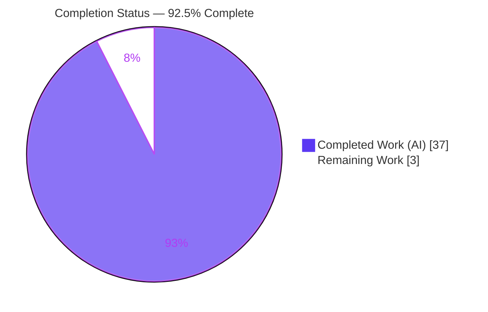
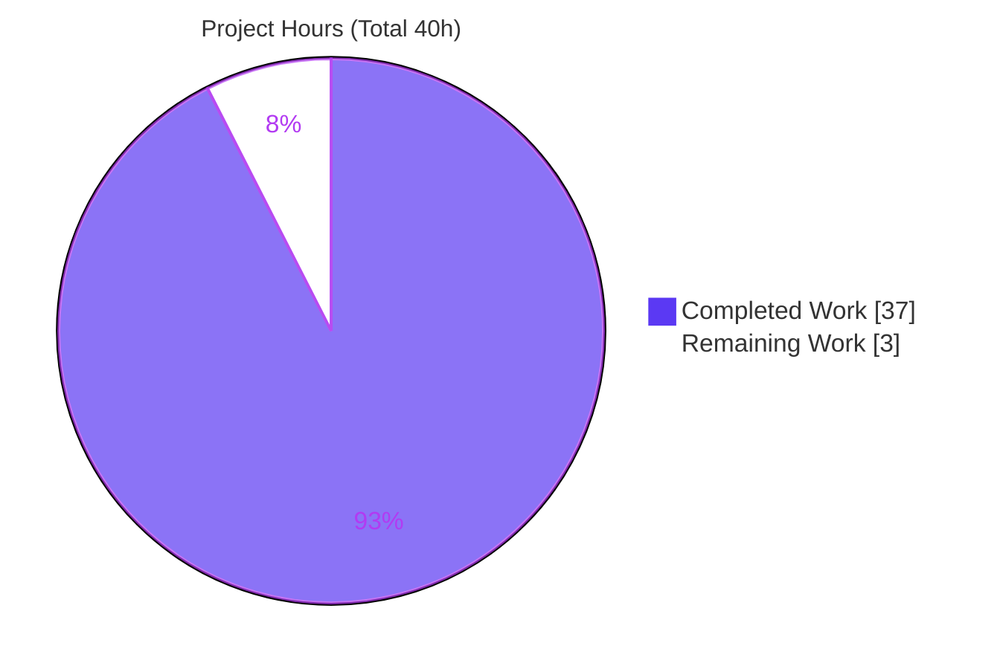
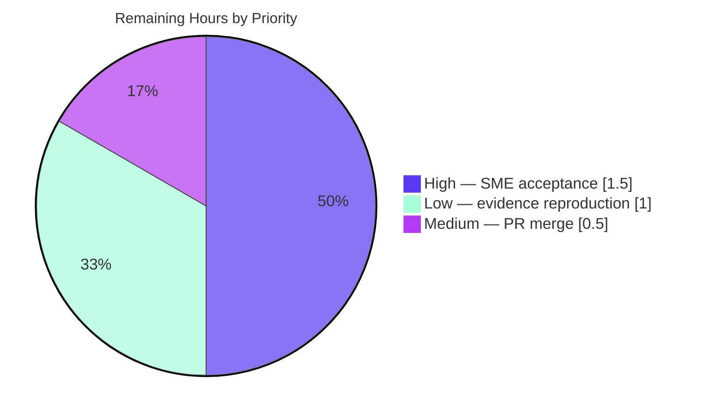

# Blitzy Project Guide — Signup Back-Button Destination Investigation

> **Repository:** `Automattic/wp-calypso` &nbsp;|&nbsp; **Branch:** `blitzy-56dceed6-725f-4b7a-b678-4e00e452596e` &nbsp;|&nbsp; **Base:** `be7e5cc641` (`wp-calypso_be7e5cc64162`) &nbsp;|&nbsp; **HEAD:** `65c996ccd6`
> **Task type:** Read-only, evidence-backed Q&A investigation (rule set: SWE-AtlasQnA-Repo)

---

## 1. Executive Summary

### 1.1 Project Overview

This project delivers a single, evidence-backed investigation document that explains **why Calypso's classic `/start` signup "Back" button sometimes navigates to an unexpected destination** — occasionally snapping to the first step or slipping into a different flow instead of moving exactly one step backward. The audience is Automattic signup/onboarding engineers and the stakeholder who raised the question. The task is explicitly **read-only**: the deliverable is a grounded explanation produced by running the real code first and capturing unedited output, not a code change. Technical scope covers the `client/signup/` back-navigation path (`NavigationLink.getBackUrl()` and its precedence ladder, the `back_to` override sources, and the bypassed step-by-step logic). Business impact: it gives engineers a precise, runtime-proven root-cause map to guide any future remediation.

### 1.2 Completion Status



| Metric | Hours |
|---|---|
| **Total Hours** | **40** |
| Completed Hours (AI + Manual) | 37 (AI: 37, Manual: 0) |
| Remaining Hours | 3 |
| **Percent Complete** | **92.5%** |

> Completion is computed with the AAP-scoped (PA1) hours method: `37 / (37 + 3) = 92.5%`. All 18 AAP requirements are Completed; the 3 remaining hours are inherently-human path-to-production gates (acceptance, merge, optional reproduction).

### 1.3 Key Accomplishments

- ✅ Sole durable deliverable created at the mandated path: `blitzy/documentation/wp-calypso_be7e5cc64162.md` (494 lines / 40,659 bytes).
- ✅ All **six** sub-questions answered, each with `file:line` grounding + captured runtime value + cause→effect reasoning; plus the implicit **determinism** question.
- ✅ Root cause pinpointed and proven: the **unconditional** `if ( this.props.backUrl ) { return this.props.backUrl; }` at `client/signup/navigation-link/index.jsx:L83-L85`, which sits above every eligibility/position check.
- ✅ **Evidence-first** methodology honored: real modules exercised under Jest (no stubs), complete **unedited** output captured, exact command recorded.
- ✅ **Determinism** demonstrated across **two** independent runs — byte-identical observation block, identical `sha256 = ea2eed42…`.
- ✅ **Read-only mandate** satisfied: git diff `base..HEAD` is exactly one added file; temporary observation script created → run → deleted; working tree byte-for-byte clean.
- ✅ Independently validated across 9 phases / 5 production gates (all PASS), including a byte-identical reproduction of the runtime evidence and ~30 `file:line` references verified accurate.

### 1.4 Critical Unresolved Issues

| Issue | Impact | Owner | ETA |
|---|---|---|---|
| _None blocking._ All AAP deliverables are complete, validated, and committed. | No release/validation blocker | — | — |
| (Advisory) Root-cause defect is intentionally **not fixed** (out of scope) | Product bug persists until a separate remediation is scheduled | Signup/Onboarding team | Per future ticket |

### 1.5 Access Issues

| System/Resource | Type of Access | Issue Description | Resolution Status | Owner |
|---|---|---|---|---|
| — | — | No access issues identified. Repository, Node/Yarn toolchain, Jest harness, and the `calypso/*` module alias were all available; the runtime evidence was reproducible in-container. | N/A | — |

### 1.6 Recommended Next Steps

1. **[High]** Have a signup/onboarding SME review and **accept** the investigation answer (confirm all six sub-questions + determinism resolve the original question).
2. **[Medium]** **Merge** the branch and close out the investigation ticket.
3. **[Low]** Optionally **reproduce the runtime evidence** (recreate the temp script from §3.2 of the deliverable, run the canonical Jest command, verify the `sha256`, then delete the script).
4. **[Low]** *(Out of scope for this task)* If remediation is desired, **file a follow-up ticket** to guard the unconditional `backUrl` override at `navigation-link/index.jsx:L83-L85` behind a position/eligibility check.

---

## 2. Project Hours Breakdown

### 2.1 Completed Work Detail

| Component | Hours | Description |
|---|---|---|
| Signup subsystem investigation & source analysis | 8 | Traced the back-nav path across 11+ files; mapped `getBackUrl()` precedence ladder, `back_to` override sources, and symptom→branch causation (AAP R2–R6, R14 / §0.2). |
| Jest harness & environment setup | 3 | Node/Yarn/corepack toolchain; `node_modules/calypso → client` alias; real-module resolution; `testMatch`/jsdom opt-in (AAP R11 / §0.2.3). |
| Temporary observation script authoring | 4 | Real modules, all edge branches (first step, empty progress, override, query-arg fallback, `pop()`), two-run determinism loop, marker extraction (AAP R9, R11, R12 / §0.4.3). |
| Runtime execution & evidence capture | 3 | Ran the canonical command; captured complete unedited output; computed determinism `sha256`; reconciled the `punycode` deprecation (AAP R10, R13 / §0.7). |
| Answer document authoring (494 lines) | 10 | Six answers + precedence ladder + override-source trace + bypassed path + per-step table + edge-case tables + determinism §7 + coverage pass §9 (AAP R1–R8, R18 / §0.3). |
| Web research corroboration | 1 | Confirmed the "Classic/Start" vs "Stepper" framework split feeding the §8 note (AAP R17 / §0.2.2). |
| Code-review findings resolution | 3 | Second commit `65c996ccd6` refined the document (+54 / −21). |
| Read-only cleanup & repo-unchanged verification | 1 | Deleted the temp script; confirmed clean tree and one-file diff (AAP R15, R16 / §0.8.1). |
| Independent final validation | 4 | 9-phase gate verification, byte-identical runtime reproduction (incl. exact `sha256`), ~30 `file:line` refs re-checked. |
| **Total** | **37** | **Matches Completed Hours in §1.2.** |

### 2.2 Remaining Work Detail

| Category | Hours | Priority |
|---|---|---|
| SME/stakeholder review & acceptance of the investigation answer | 1.5 | High |
| Independent reproduction of runtime evidence (recreate → run → verify `sha256` → delete) | 1.0 | Low |
| PR merge & delivery close-out | 0.5 | Medium |
| **Total** | **3.0** | **Matches Remaining Hours in §1.2 and §7.** |

> The identified root-cause defect remediation is **excluded** from these hours because it is explicitly out of scope for this read-only investigation (§0.5.2 of the AAP).

---

## 3. Test Results

All tests below originate from Blitzy's autonomous validation logs for this project. Because this is a **read-only investigation**, no product-code test suite was in scope; the sole "test" is the mandated runtime-observation harness that exercises the real modules and asserts determinism.

| Test Category | Framework | Total Tests | Passed | Failed | Coverage % | Notes |
|---|---|---|---|---|---|---|
| Runtime Observation | Jest 29.7.0 (`@automattic/calypso-jest`, jsdom) | 1 | 1 | 0 | N/A (read-only; no product code changed) | `zz_observe_backnav` asserts `deterministic === true`; exit 0. Exercises real `getBackUrl`/`getStepUrl`/`getPreviousStepName` + all edge branches. Reproduced byte-identically across 2 runs (`sha256 = ea2eed42…`). |
| Unit / Integration / UI / API / E2E | — | 0 | 0 | 0 | N/A | Out of scope — no product code, tests, config, or dependencies were modified. |

**Canonical command (run twice; identical observation block):**

```bash
CI=true TZ=UTC npx jest -c=test/client/jest.config.js zz_observe_backnav --ci --runInBand
```

---

## 4. Runtime Validation & UI Verification

- ✅ **Real modules executed (Operational).** `NavigationLink.getBackUrl()`, `getStepUrl()`, and `getPreviousStepName()` were run through the `calypso/*` alias (no stubs). Every scenario returned a concrete destination string matching the documented evidence.
- ✅ **Per-step destinations verified (Operational).** Position 0 `user-social` → `/start` (flow root); position 1 `domains` → `/start/user-social`; position 2 `plans` → `/start/domains`.
- ✅ **Override precedence verified (Operational).** Mid-flow `plans` with `backUrl='/home/example.wordpress.com'` returned `/home/example.wordpress.com` — no flow logic ran (root cause reproduced).
- ✅ **Edge branches verified (Operational).** First step → `/start/en`; empty progress non-first → `/start/en`; current-step-not-in-progress → `pop()` → `/start/domains/en`; query-arg fallback → `/start/user-social/en?back_to=%2Fexternal&ref=abc`.
- ✅ **Determinism verified (Operational).** Two independent invocations produced a byte-identical observation block; both hash to `sha256 = ea2eed42d5b7a8516765a8a060c48d7b5149f2a13bc8357a1cd7fec202c6ba8b`.
- ✅ **`punycode` reconciliation (Operational).** No `punycode` warning appears under Jest (jsdom loader); proven via `grep -c` = 0 on the live log, while a bare `node -e "require('punycode')"` does emit `[DEP0040]` — documented in §7.3.
- ➖ **UI verification: Not applicable.** No user interface was built or modified; this is a documentation deliverable. No browser/Lighthouse verification is in scope.
- ✅ **Repository state (Operational).** `git status --porcelain` and `git diff HEAD` both empty; the temporary harness was removed after capture.

---

## 5. Compliance & Quality Review

Cross-mapping of AAP deliverables and SWE-AtlasQnA-Repo rules to their verification status. Fixes applied during autonomous validation are noted; there are no outstanding compliance items.

| Benchmark / Rule (AAP ref) | Status | Progress | Evidence |
|---|---|---|---|
| Deliverable at mandated path `blitzy/documentation/wp-calypso_be7e5cc64162.md` (§0.4) | ✅ Pass | 100% | 494 lines / 40,659 bytes; tracked & committed. |
| Answer all six sub-questions + implicit determinism (§0.1.1) | ✅ Pass | 100% | §5.1–§5.5, §7; coverage pass §9 with 21 checkmarks. |
| Investigate by RUNNING code first (§0.7) | ✅ Pass | 100% | Temp Jest script authored & run before writing (§3.2). |
| Exercise the REAL entry point, no stubs (§0.8.1) | ✅ Pass | 100% | Real unconnected `NavigationLink` + real `getStepUrl`/`getPreviousStepName` via `calypso/*` alias. |
| Exercise every condition / edge branch (§0.7) | ✅ Pass | 100% | Primary + first-step + empty-progress + override + query-arg fallback + `pop()` all captured (§4/§6). |
| Include actual, unedited output + exact command (§0.7) | ✅ Pass | 100% | §4 verbatim Jest log; canonical command shown. |
| `file:line` grounding + cause→effect per claim (§0.8) | ✅ Pass | 100% | ~30 refs across 11 files; 9/9 independently spot-verified byte-accurate. |
| Reproduce inconsistency / determinism ≥2 runs (§0.7) | ✅ Pass | 100% | Two runs, byte-identical block, identical `sha256` (§7.1). |
| Read-only: no source file modified (§0.5/§0.7) | ✅ Pass | 100% | git diff `base..HEAD` = one added file only. |
| Cleanup: temp script removed; repo unchanged (§0.4.3/§0.8.1) | ✅ Pass | 100% | Script absent; `git diff HEAD` empty. |
| Light web research (Classic/Start vs Stepper) (§0.2.2) | ✅ Pass | 100% | §8 secondary-framework note. |
| Correct runtime (Node `^v22.9.0`; not downgraded) (§0.8.2) | ✅ Pass | 100% | Container Node v22.23.1; documented in §3.1. |
| Pre-commit hooks (markdown not linted) | ✅ Pass | 100% | Repo hooks scope only to `.json/.jsx?/.tsx?/.scss/.php`; zero applicable gates. |

**Fixes applied during autonomous validation:** the second commit (`65c996ccd6`, +54/−21) addressed code-review findings, refining the determinism scoping (observation block vs whole log), the `punycode` reconciliation, and scenario-fidelity notes. **Outstanding compliance items:** none.

---

## 6. Risk Assessment

| Risk | Category | Severity | Probability | Mitigation | Status |
|---|---|---|---|---|---|
| Runtime evidence reproducibility depends on the pinned environment (Node v22.23.1; `browserslist` 17 months old; jsdom `punycode` behavior); a different env may show incidental diffs | Technical | Low | Low–Medium | §3.1 pins the environment; §7.2 scopes determinism to the observation block (not whole log); §7.3 proves the `punycode` reconciliation | Mitigated / Documented |
| Temporary observation script intentionally deleted (read-only mandate) → evidence not runnable out-of-the-box | Technical | Low | Low | Full verbatim script + exact command embedded in §3.2; reproduction is copy-paste | Mitigated |
| `file:line` references pinned to base `be7e5cc641` could drift if source changes later | Technical | Low | Low | Point-in-time investigation scoped to the branch; refs verified accurate now | Accepted |
| Root-cause defect (unconditional `backUrl` override at `navigation-link/index.jsx:L83-L85`) is intentionally **not fixed**; the user-facing bug persists | Operational | Medium | N/A (existing behavior) | Remediation explicitly out of scope (§0.5.2); advisory follow-up ticket recommended for product owners | Open by design |
| Acceptance gate: the answer has not yet been reviewed/accepted by the questioner | Operational | Low | Low | High-priority SME review task (HT-1) | Open — pending human review |
| Security exposure | Security | None | N/A | Read-only doc; no product code, credentials, dependencies, or attack surface changed | No risk identified |
| Integration / external dependencies | Integration | None | N/A | No product code changed; no external services/APIs touched; Jest tooling exercised for observation only, left unchanged | No risk identified |

---

## 7. Visual Project Status

**Project Hours Breakdown** (Completed = Dark Blue `#5B39F3`, Remaining = White `#FFFFFF`):



**Remaining Work by Priority** (hours from §2.2; sums to 3.0h):



> **Integrity:** the "Remaining Work" value (3) equals Remaining Hours in §1.2 and the sum of the §2.2 Hours column. The by-priority slices (1.5 + 1.0 + 0.5) also sum to 3.0.

---

## 8. Summary & Recommendations

**Achievements.** The investigation is complete and independently validated. It answers all six sub-questions plus the implicit determinism question, each grounded in exact `file:line` references and backed by complete, unedited runtime output. The root cause is proven at runtime: the Back destination is entirely the return of `NavigationLink.getBackUrl()`, whose first substantive line — the **unconditional** `if ( this.props.backUrl ) { return this.props.backUrl; }` at `client/signup/navigation-link/index.jsx:L83-L85` — sits above every eligibility/position/first-step check. That single rule explains "slips out into an entirely different flow" (an external `backUrl` returned verbatim); in its absence, the `{ stepName: null }` → flow-root path explains "snaps straight to the first step." The behavior is **deterministic** (byte-identical across two runs, `sha256 = ea2eed42…`); the perceived randomness is input variation.

**Remaining gaps & critical path to production.** The project is **92.5% complete** (37 of 40 hours). The remaining 3 hours are inherently-human path-to-production gates: SME acceptance of the answer (1.5h, High), optional independent reproduction of the runtime evidence (1.0h, Low), and PR merge/close-out (0.5h, Medium). No autonomous engineering work remains.

**Success metrics.** All 18 AAP requirements Completed; all 5 production gates PASS; single Jest observation test 1/1 passing; repository byte-for-byte unchanged (read-only mandate satisfied).

**Production readiness.** The deliverable is production-ready as a documentation artifact: complete, accurate, impeccably grounded, and committed on the correct branch. Recommended: proceed to SME acceptance and merge. Separately (out of this task's scope), product owners may wish to schedule a remediation for the identified unconditional-override defect.

| Metric | Value |
|---|---|
| Completion | 92.5% (37 / 40 h) |
| AAP requirements Completed | 18 / 18 |
| Production gates passed | 5 / 5 |
| Autonomous tests passing | 1 / 1 |
| Source files modified | 0 (read-only) |

---

## 9. Development Guide

This guide reproduces the investigation's runtime evidence and lets a reviewer verify the deliverable. Every command below was tested in-container.

### 9.1 System Prerequisites

- **Node.js** `^v22.9.0` (container provides `v22.23.1` — satisfies the range; **do not** downgrade to 20.x per AAP §0.8.2).
- **Yarn** `^4.0.0` (pinned `4.0.2` via `packageManager`); **corepack** (`0.34.6`) to provision it.
- **Git** (+ Git LFS). Disk space for the ~18,879-file monorepo.
- This is a **read-only investigation** — no product build, server, or deployment is required.

### 9.2 Environment Setup

```bash
# From the repository root, on the delivery branch:
git checkout blitzy-56dceed6-725f-4b7a-b678-4e00e452596e

# Provision Yarn 4 via corepack, then confirm the toolchain:
corepack enable
node --version     # expect: v22.23.1  (satisfies ^v22.9.0)
yarn --version     # expect: 4.0.2
cat .nvmrc         # expect: 22.9.0
```

### 9.3 Dependency Installation

```bash
# Idempotent here; installs node_modules and creates the calypso/* alias
# (node_modules/calypso -> ../client) that resolves imports to the REAL modules.
yarn install

# Verify the alias and the Jest config exist:
ls -l node_modules/calypso           # expect: node_modules/calypso -> ../client
test -f test/client/jest.config.js && echo "jest config: PRESENT"
npx jest --version                   # expect: 29.7.0
```

### 9.4 Reproduce the Runtime Evidence (the project's "run")

```bash
# 1) Recreate the temporary observation script VERBATIM from the deliverable §3.2:
#    target path: client/signup/test/zz_observe_backnav.js
#    (placed under test/ to match testMatch; opts into jsdom on line 1)

# 2) Run the canonical command (run it TWICE to confirm determinism):
CI=true TZ=UTC npx jest -c=test/client/jest.config.js zz_observe_backnav --ci --runInBand
#    expect: PASS 1/1, "deterministic": true, and the §4 observation block

# 3) Confirm the observation block is byte-identical across runs:
for i in 1 2; do
  CI=true TZ=UTC npx jest -c=test/client/jest.config.js zz_observe_backnav --ci --runInBand 2>&1 \
    | sed -n '/===BACKNAV_OBSERVATION_START===/,/===BACKNAV_OBSERVATION_END===/p' > "run$i.block"
done
diff run1.block run2.block && echo "IDENTICAL (no diff output)"
sha256sum run1.block run2.block
#    expect: both == ea2eed42d5b7a8516765a8a060c48d7b5149f2a13bc8357a1cd7fec202c6ba8b

# 4) MANDATORY cleanup — delete the temp script and confirm a clean tree:
rm -f client/signup/test/zz_observe_backnav.js run1.block run2.block
git status --porcelain --untracked-files=all    # expect: no output (clean)
```

### 9.5 Verification Steps

```bash
# Deliverable present and intact:
ls -l   blitzy/documentation/wp-calypso_be7e5cc64162.md   # ~40,659 bytes
wc -l   blitzy/documentation/wp-calypso_be7e5cc64162.md   # 494 lines

# Repository unchanged (read-only mandate):
git diff HEAD --stat                                      # expect: empty
```

### 9.6 Example Usage (viewing the deliverable)

```bash
# Read the whole document:
less blitzy/documentation/wp-calypso_be7e5cc64162.md

# Jump to key sections (line anchors):
sed -n '270,346p' blitzy/documentation/wp-calypso_be7e5cc64162.md   # §5 The six answers
sed -n '396,449p' blitzy/documentation/wp-calypso_be7e5cc64162.md   # §7 Determinism
sed -n '456,491p' blitzy/documentation/wp-calypso_be7e5cc64162.md   # §9 Coverage pass
```

### 9.7 Troubleshooting

- **`calypso/*` import fails to resolve** → run `yarn install` to (re)create the `node_modules/calypso -> ../client` symlink.
- **Wrong Node version** → use the `.nvmrc` value (`22.9.0`) or any `^v22.9.0`; do **not** downgrade to 20.x.
- **`Browserslist: browsers data (caniuse-lite) is 17 months old`** → this banner is **expected/benign** and appears verbatim in the §4 evidence.
- **No `punycode` deprecation under Jest** → **expected**: Jest's jsdom loader pulls in `punycode` without forwarding the one-time process warning (§7.3). A bare `node -e "require('punycode')"` *does* emit `[DEP0040]`.
- **Whole-log `sha256` won't match** → by design: determinism is scoped to the **observation block** only (§7.2). The `PASS … (N s)` and `Time: N s` lines vary per run.

---

## 10. Appendices

### A. Command Reference

| Purpose | Command |
|---|---|
| Node version | `node --version` |
| Yarn version | `yarn --version` |
| Provision Yarn 4 | `corepack enable` |
| Install deps / create alias | `yarn install` |
| Run observation harness | `CI=true TZ=UTC npx jest -c=test/client/jest.config.js zz_observe_backnav --ci --runInBand` |
| Determinism hash | `sha256sum run1.block run2.block` |
| Clean-tree check | `git status --porcelain --untracked-files=all` |
| Branch diff scope | `git diff be7e5cc641..65c996ccd6 --stat` |

### B. Port Reference

Not applicable — no server or listening service is started for this read-only investigation.

### C. Key File Locations

| Path | Role |
|---|---|
| `blitzy/documentation/wp-calypso_be7e5cc64162.md` | The sole durable deliverable (answer document) |
| `client/signup/navigation-link/index.jsx` | `getBackUrl()` precedence ladder [L78-L115]; unconditional override [L83-L85]; `href` [L183-L192] |
| `client/signup/utils.js` | `getStepUrl()` [L45-L69]; `getPreviousStepName()` [L85-L88]; `isFirstStepInFlow()` [L28-L31]; `getFilteredSteps()` [L137-L150] |
| `client/signup/step-wrapper/index.jsx` | `back_to`→`backUrl` mapping [L274-L277]; `allowBackFirstStep=!!backUrl` [L65] |
| `client/signup/controller.js` | `back_to` dependency dispatch (woocommerce-install) [L226-L229] |
| `client/signup/config/{flows-pure,flows,steps-pure}.js` | `back_to`/`backUrl` declarations & default flow name |
| `test/client/jest.config.js` | Jest config used by the observation harness |
| `client/signup/test/` | Location where the temporary observation script was placed and then deleted |

### D. Technology Versions

| Component | Version | Evidence |
|---|---|---|
| Node.js | v22.23.1 (repo canonical `^v22.9.0`) | `node --version`; `.nvmrc`=22.9.0; `package.json` engines |
| Yarn | 4.0.2 | `yarn --version`; `packageManager` |
| corepack | 0.34.6 | `corepack --version` |
| Jest | 29.7.0 | `npx jest --version`; via `@automattic/calypso-jest` |
| Module alias | `calypso/*` → `client/*` | `node_modules/calypso -> ../client` |

### E. Environment Variable Reference

| Variable | Value | Purpose |
|---|---|---|
| `CI` | `true` | Forces Jest non-interactive (no watch mode) |
| `TZ` | `UTC` | Deterministic timezone for reproducible output |

### F. Developer Tools Guide

- **Reproduce evidence:** follow §9.4 (recreate temp script → run canonical command twice → verify `sha256` → delete → confirm clean tree).
- **Marker extraction:** `sed -n '/===BACKNAV_OBSERVATION_START===/,/===BACKNAV_OBSERVATION_END===/p'` isolates the deterministic observation block from incidental Jest timing lines.
- **Grounding spot-check:** `sed -n '78,115p' client/signup/navigation-link/index.jsx` to confirm the `getBackUrl()` precedence ladder cited throughout the deliverable.

### G. Glossary

| Term | Meaning |
|---|---|
| Classic / Start | The `/start` signup framework under `client/signup/**` — the investigation target |
| Stepper | The newer `/setup` framework under `client/landing/stepper/**` — acknowledged, not the target |
| `getBackUrl()` | `NavigationLink` method that computes the Back link's destination; its return is the anchor `href` |
| `back_to` | Query-string argument (and derived `backUrl` prop) that acts as the external override |
| Observation block | The payload between the `===BACKNAV_OBSERVATION_START/END===` markers; the determinism artifact |
| Override | The unconditional `return this.props.backUrl` that bypasses flow/step logic (root cause) |