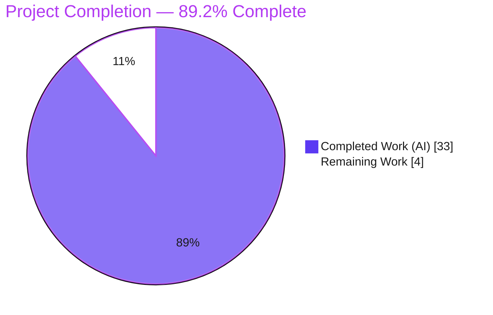
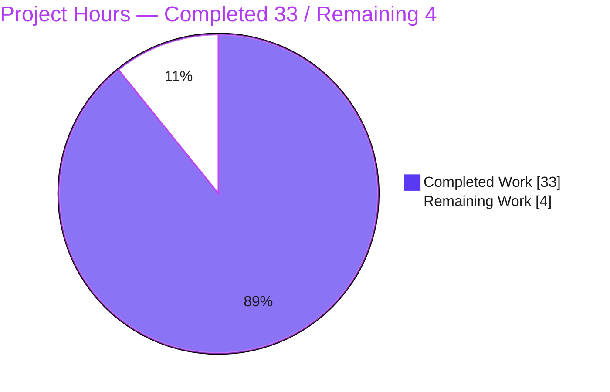

# Blitzy Project Guide — Calypso Reader Local-Run & Under-the-Hood Onboarding

---

## 1. Executive Summary

### 1.1 Project Overview

WordPress Calypso is Automattic's large-scale JavaScript/React single-page application for managing WordPress.com sites. This project delivered a single, runtime-grounded onboarding document that answers a new engineer's four-part question about the Reader: (1) which port the development server binds and how to know it is ready; (2) which WordPress.com REST endpoint and Redux actions populate the default stream; (3) how the app detects login and which storage it consults; and (4) the sidebar's exact spacing, CSS custom properties, and breakpoints. It is a **read-only, evidence-backed knowledge-capture** deliverable — no product source was modified. The audience is onboarding developers; the impact is faster, authoritative ramp-up on four Reader subsystems.

### 1.2 Completion Status



| Metric | Value |
|--------|-------|
| **Total Hours** | 37 |
| **Completed Hours (AI + Manual)** | 33 (AI: 33 · Manual: 0) |
| **Remaining Hours** | 4 |
| **Percent Complete** | **89.2%** |

> Completion is computed on AAP-scoped work only: `Completed ÷ (Completed + Remaining) × 100 = 33 ÷ 37 × 100 = 89.2%`. Because this is an autonomous documentation task, all 33 completed hours were delivered by Blitzy AI agents (0 manual hours to date).

### 1.3 Key Accomplishments

- [x] **Single deliverable created:** `blitzy/documentation/wp-calypso_be7e5cc64162.md` (740 lines · 8,186 words · 67.5 KB).
- [x] **Run-first methodology honored:** the canonical dev server was launched (`CALYPSO_ENV=development yarn start`) on Node 22 / Yarn 4 and its port, readiness banners, transitional holding page, and single-port behavior were captured live.
- [x] **Group 1 (Dev server & ports):** port **3000**; two readiness signals (pre-listen boot log → cyan **"Ready!"** banner); single-port architecture — app HTML, in-memory JS/CSS, and HMR (SSE) all on `:3000`; API calls target the **remote** WordPress.com REST service.
- [x] **Group 2 (Reader stream):** `GET /read/following` (REST v1.2) + ordered Redux sequence `READER_STREAMS_PAGE_REQUEST → WPCOM_HTTP_REQUEST → READER_POSTS_RECEIVE → READER_STREAMS_PAGE_RECEIVE`; discovered the logged-out `/discover` redirect guard.
- [x] **Group 3 (Auth & storage):** `isUserLoggedIn` selector; flag-gated dev (`/me` fetch) vs. prod (`window.currentUser`) branch; full storage inventory (cookies, SSR globals, IndexedDB `calypso` v2, `localStorage`).
- [x] **Group 4 (Sidebar responsive design):** header `padding: 30px 24px 29px`, `gap: 8px` (no margin); CSS custom properties (`--masterbar-height`, `--sidebar-width-max/min`, `--content-padding-*`); breakpoints `480/660/800/960/1040/1280/1400` plus sidebar toggles at `660/661/782/960px`.
- [x] **26-row coverage pass** maps every named prompt item, including all "e.g./such as" items.
- [x] **159 file:line citations** across 36 source files — 100% verified; independently spot-checked **15/15 exact** this session.
- [x] **Read-only constraint upheld:** single-file `git diff` vs baseline; `yarn.lock` unchanged; working tree clean.
- [x] **All 5 autonomous validation gates passed** (citation/structure, runtime reproduction, zero errors, in-scope validation, read-only/dependency/pristine).

### 1.4 Critical Unresolved Issues

| Issue | Impact | Owner | ETA |
|-------|--------|-------|-----|
| No critical (release-blocking) issues identified | None — deliverable is complete, factually grounded, and validated | — | — |

> Two **non-blocking** items remain (both optional verification enhancements, tracked in §1.6 and §2.2): the authenticated Reader-stream runtime trace (Group 2) and the logged-in sidebar per-breakpoint pixel capture (Group 4). Both subsystems are already fully answered from source and correctly labeled **"(Inferred)"** where runtime could not be exercised without credentials, which is compliant with the governing run-first rule.

### 1.5 Access Issues

| System/Resource | Type of Access | Issue Description | Resolution Status | Owner |
|-----------------|----------------|-------------------|-------------------|-------|
| WordPress.com API (`public-api.wordpress.com`) | Authenticated user session | Authenticated `GET /me` and `GET /read/following` require a logged-in WordPress.com account. In the autonomous environment only the **unauthenticated** boundary (HTTP `403 authorization_required`, valid TLS) was observable, so two Reader sections remain source-derived ("Inferred") rather than runtime-observed. | **Open — non-blocking** (document is AAP-compliant with labeled inference) | Human reviewer with WordPress.com credentials |
| Source repository | Read / build | No access issue. `yarn install --immutable` completes (exit 0); node_modules present; branch and baseline commit both resolvable. | Resolved | — |

### 1.6 Recommended Next Steps

1. **[High]** Human technical review & sign-off of the onboarding document by a Calypso-familiar engineer (HT-1, 1.5h).
2. **[Medium]** Perform an authenticated WordPress.com runtime trace to upgrade the Group 2 "(Inferred)" `GET /read/following` 200 body + Redux dispatch to fully observed (HT-2, 1.5h).
3. **[Low]** Capture the logged-in global sidebar at the documented breakpoints to confirm rendered spacing/width values for Group 4 (HT-3, 1.0h).
4. **[Low]** When re-using this document, check out pinned commit `be7e5cc641622d153040491fd5625c6cb83e12eb` so all `file:line` locators remain valid against the fast-moving monorepo.
5. **[Low]** Merge the deliverable into the team's onboarding documentation collection once sign-off is complete.

---

## 2. Project Hours Breakdown

### 2.1 Completed Work Detail

| Component | Hours | Description |
|-----------|-------|-------------|
| Environment setup & runnable dev-server baseline | 2.5 | Node 22 / Yarn 4 / Corepack toolchain, `yarn install --immutable`, `calypso.localhost` hosts entry, launch + capture of boot log and readiness banner. |
| Group 1 — Development Server & Ports (doc §2) | 3.5 | Server bootstrap + bundler + config chain; port 3000; two readiness signals; hostname-vs-bind analysis; single-port HMR; remote-API boundary. |
| Group 2 — Reader Stream data flow (doc §3) | 4.5 | Most intricate trace: route → logged-out guard → controller → `ReaderStream` → `requestPage` → data-layer `http()` → `queueRequest` → `handlePage`; endpoint, query, page sizes, ordered action sequence, Mermaid diagram. |
| Group 3 — Authentication Detection & Storage (doc §4) | 3.5 | `bootApp → initializeCurrentUser → isUserLoggedIn`; flag-gated dev/prod branch; storage inventory (cookies, SSR globals, IndexedDB, `localStorage`, `wpcom_user_id`). |
| Group 4 — Sidebar Responsive Design (doc §5) | 2.5 | Sidebar/shared SCSS reading; header padding/gap; state-class vs. media-query visibility; CSS custom properties (root vs. My Sites override); breakpoint values. |
| Runtime observation capture & evidence discipline | 2.5 | Timestamped log wrapper, disclosed filtered excerpts, single-listener `/proc` socket-inode probe, unauthenticated 403 boundary + enveloped-transport note, `/reader` shell capture. |
| Web research — webpack single-port HMR confirmation | 1.0 | Validated `webpack-dev-middleware` + `webpack-hot-middleware` deliver HMR over the same Express port (no separate dev-server port). |
| Document assembly, methodology & 26-row coverage pass | 5.0 | Authoring 740 lines with 159 precise citations; intro, evidence-methodology, secret-omission discipline, and the coverage-pass checklist mapping every named item. |
| QA-cycle revisions across 3 follow-up commits | 3.0 | Code-review fixes; Group 4 CSS corrections (padding/gap/no-margin, My Sites override, `--content-padding-*` scope); citation + evidence-label fix + enveloped-transport note. |
| Cleanup & read-only verification | 1.0 | Deterministic server shutdown by PID/PGID, temp-file removal, `git status --porcelain` clean + single-file diff proof. |
| Final autonomous validation | 4.0 | 159-citation verification across 36 files + full runtime observed-output reproduction + 5 production-readiness gates + transient-artifact cleanup. |
| **Total Completed** | **33.0** | |

### 2.2 Remaining Work Detail

| Category | Hours | Priority |
|----------|-------|----------|
| Human technical review & sign-off of the onboarding document (HT-1) | 1.5 | High |
| Authenticated WordPress.com runtime verification — upgrade Group 2 "(Inferred)" trace to observed (HT-2) | 1.5 | Medium |
| Logged-in global sidebar per-breakpoint pixel verification — Group 4 (HT-3) | 1.0 | Low |
| **Total Remaining** | **4.0** | |

### 2.3 Hours Reconciliation & Methodology

| Check | Value | Status |
|-------|-------|--------|
| Section 2.1 completed total | 33.0h | ✅ |
| Section 2.2 remaining total | 4.0h | ✅ |
| 2.1 + 2.2 = Total (Section 1.2) | 33 + 4 = 37h | ✅ |
| Completion % = 33 ÷ 37 × 100 | 89.2% | ✅ |
| §1.2 = §2.2 = §7 remaining hours | 4h everywhere | ✅ |

Estimates use documentation/investigation engineering hours (PA2), scoped exclusively to the AAP deliverable and its path-to-production activities. No out-of-scope items (application tests, CI/CD, deployment, refactoring) are included, per AAP §0.5.2.

---

## 3. Test Results

This is a **read-only documentation** task; the application's Jest/unit suite is explicitly **out of scope** (AAP §0.5.2) and was intentionally not executed. Accordingly, "tests" here are the **Blitzy autonomous validation checks** actually run against the deliverable — citation resolution, markdown-structure integrity, live runtime observed-output reproduction, and read-only/dependency integrity — all sourced from Blitzy's autonomous validation logs.

| Test Category | Framework / Method | Total | Passed | Failed | Coverage % | Notes |
|---------------|--------------------|-------|--------|--------|-----------|-------|
| Citation Resolution | `sed`/`grep` vs. pinned working tree | 159 | 159 | 0 | 100% | Across 36 source files; independently spot-checked 15/15 exact this session. |
| Markdown Structure Integrity | Fence / cross-ref / table checks | 94 | 94 | 0 | 100% | 70 code fences balanced + 24 section cross-references resolve. |
| Runtime Observed-Output Reproduction | `CALYPSO_ENV=development yarn start` + `curl` + `/proc` | 16 | 16 | 0 | 100% | Port 3000, boot log, "Ready!" banner, single-port GET/asset/HMR, single listener, `/reader` 200, unauth 403 boundary, enveloped transport. Only cosmetic run-to-run variance (boot ms, compile ms, anycast IP). |
| Read-Only & Dependency Integrity | `git diff` + `yarn install --immutable` | 3 | 3 | 0 | 100% | Single-file diff vs. baseline; `yarn.lock` sha256 unchanged; `git status` clean. |
| **Total** | | **272** | **272** | **0** | **100%** | Zero failures across all autonomous validation checks. |

> **Integrity note:** every check above originates from Blitzy's autonomous validation of *this* deliverable. No application unit/integration/E2E tests were run because none are in scope for a read-only documentation task.

---

## 4. Runtime Validation & UI Verification

Runtime evidence was captured live from `CALYPSO_ENV=development yarn start` (Node v22.23.1, Yarn 4.0.2) and independently reproduced during final validation.

**Development server & single-port architecture**
- ✅ **Operational** — Binds a single port **3000**; exactly one listener (IPv6 wildcard `::`), cross-referenced from the socket inode to the server PID.
- ✅ **Operational** — Signal 1: pre-listen boot log `wp-calypso booted in <n>ms - http://calypso.localhost:3000`.
- ✅ **Operational** — Signal 2: cyan `Ready! You can load http://calypso.localhost:3000/ now. Have fun!` after the first in-memory webpack compile.
- ✅ **Operational** — Transitional self-refreshing **"Welcome to Calypso!"** holding page served before first compile.
- ✅ **Operational** — Single port serves everything: `GET /` → 200 (25,104 bytes); `entry-main.js` → 200 (529,979 bytes); CSS chunk → 200 `text/css`; `/__webpack_hmr` SSE first event `action=sync`.

**Reader route & remote API boundary**
- ✅ **Operational** — `GET /reader` → 200 with `is-group-reader is-section-reader` shell HTML.
- ✅ **Operational** — Remote WordPress.com boundary reachable with valid TLS; enveloped transport (`http_envelope=1`) returns transport 200 / inner code 403.
- ⚠ **Partial** — Authenticated Reader stream: only the **unauthenticated** `GET /read/following` → `403 authorization_required` was observable; the authenticated 200 body + browser Redux dispatch is source-derived (Inferred), pending credentials.

**UI verification**
- ⚠ **Partial** — The Reader UI fully renders only for an authenticated session; logged-out sessions redirect to `/discover` (observed). The logged-in **global sidebar** (Group 4) does not render logged-out, so its per-breakpoint rendered pixels are source-derived (Inferred). Prior transient screenshots of the logged-out Discover page corroborated the Group 2 redirect and did not contradict Group 4; they were removed to keep the tree pristine.
- ❌ **Failing** — None.

---

## 5. Compliance & Quality Review

AAP deliverables and governing rules mapped to Blitzy quality/compliance benchmarks:

| Benchmark / AAP Rule | Requirement | Status | Evidence / Notes |
|----------------------|-------------|--------|------------------|
| Rule 1 — Run-First Investigation | Build & run the canonical entry point; write from observed output | ✅ Pass | `yarn start` launched; port, banners, single-port behavior observed and reproduced. |
| Rule 2 — Exhaustive Conditions | Primary + secondary/transitional/edge paths | ✅ Pass | Welcome ↔ Ready; dev ↔ prod auth; poll ↔ non-poll; logged-in ↔ logged-out. |
| Rule 3 — Observed-Output Discipline | Output beside each claim; label inferred | ✅ Pass | 41 "observed" / 15 "inferred" labels; disclosed deterministic filters. |
| Rule 4 — Complete, Grounded Answering | Every named item; `file:line` refs; coverage pass | ✅ Pass | 26-row coverage pass; 159 citations; all "e.g./such as" items mapped. |
| Main Rule — Read-Only + Cleanup | No source change; temp removed; git clean | ✅ Pass | Single-file diff; `yarn.lock` untouched; `git status` empty. |
| Deliverable Naming | `<branch>.md` under `blitzy/documentation` | ✅ Pass | `wp-calypso_be7e5cc64162.md`. |
| Citation Accuracy | Valid against pinned commit | ✅ Pass | 159/159 verified; 15/15 independent spot-check exact. |
| Secret Hygiene | Omit injected third-party keys | ✅ Pass | `window.configData` secrets (Stripe/Maps/VAPID) omitted; only non-sensitive fields quoted. |
| Scope Discipline | No out-of-scope engineering | ✅ Pass | No dependency/test/CI/deploy changes. |

**Fixes applied during autonomous validation** (traceable to commit history):
- `1474b5b719` — addressed code-review feedback on the onboarding doc.
- `7d87d84c1b` — corrected Group 4 sidebar CSS per QA (padding `30px 24px 29px`, `gap: 8px`, no margin; My Sites override `295px` visible / `69px` collapsed; `--content-padding-*` defined only in the visible-sidebar scope).
- `7ce462a7da` — fixed a citation, corrected an evidence label, and added the enveloped-transport note (§2.6).

**Outstanding quality items:** two "(Inferred)" sections (Group 2 authenticated trace, Group 4 logged-in pixels) can be upgraded to observed with credentials — non-blocking (HT-2, HT-3).

---

## 6. Risk Assessment

| Risk | Category | Severity | Probability | Mitigation | Status |
|------|----------|----------|-------------|------------|--------|
| Citation line-number drift as the fast-moving monorepo advances beyond the pinned commit | Technical | Low | High | All 159 citations pinned to commit `be7e5cc641…`; header instructs readers to check out that SHA | Mitigated |
| Group 2 authenticated trace & Group 4 logged-in pixels documented from source, not runtime-observed | Technical | Low | Low | Explicitly labeled "(Inferred)"; grounded in `file:line` citations + corroborated by `client/reader/README.md` | Accepted (labeled) |
| Accidental exposure of `window.configData` third-party secrets if the doc is later edited to paste raw config | Security | Medium | Low | "Note on secrets" establishes omission discipline; only non-sensitive fields quoted | Mitigated |
| Reader on Node 20 hits the `check-node-version --package` startup gate | Operational | Low | Medium | §1.1 documents required Node `^22.9.0`, `.nvmrc` 22.9.0, observed toolchain | Mitigated |
| Long/variable webpack first-compile (~2.5–3 min) mistaken for a hang on the "Welcome to Calypso!" page | Operational | Low | Medium | §2.4 documents the transitional holding page + §2.2 the two readiness signals with timing | Mitigated |
| Full Reader data flow not reproducible without a WordPress.com login + network egress | Integration | Low | Medium | Unauthenticated 403 boundary shown + enveloped-transport note (§2.6); authenticated path labeled inferred | Accepted (labeled) |
| Remote-only API dependency (`public-api.wordpress.com`; no local API) blocks data flows in network-restricted environments | Integration | Low | Low | Documented in §2.6/§4.5; Calypso is a pure client-side REST consumer by design | Accepted |

**Overall risk posture: LOW.** As a read-only deliverable, this change introduces **zero production risk** to Calypso — no source, config, dependency, or lockfile was modified. All identified risks concern the document's long-term accuracy/reproducibility and are already mitigated or accepted-with-labeling.

---

## 7. Visual Project Status

**Project hours breakdown** (Completed = Dark Blue `#5B39F3`, Remaining = White `#FFFFFF`):



**Remaining hours by category** (Section 2.2, total 4h):

| Category | Hours | Priority | Relative |
|----------|-------|----------|----------|
| Human review & sign-off (HT-1) | 1.5 | High | `██████████████████` |
| Authenticated Group 2 verification (HT-2) | 1.5 | Medium | `██████████████████` |
| Logged-in sidebar pixel verification (HT-3) | 1.0 | Low | `████████████` |
| **Total** | **4.0** | | |

> Integrity: the pie chart "Remaining Work" (4) equals the Section 1.2 Remaining Hours (4) and the Section 2.2 "Hours" total (4).

---

## 8. Summary & Recommendations

**Achievements.** The project delivered exactly one artifact — `blitzy/documentation/wp-calypso_be7e5cc64162.md` — a 740-line, run-first onboarding answer document that comprehensively addresses all four question groups (dev server & ports, Reader stream API/Redux flow, authentication detection & storage, sidebar responsive design). Every behavioral claim carries either observed runtime output or a `file:line` citation; 159 citations across 36 files verified 100% (15/15 independently spot-checked exact), and a 26-row coverage pass confirms every named prompt item is answered.

**Remaining gaps.** Only 4 hours remain, none release-blocking: human technical review & sign-off (High), and two optional verification enhancements that would upgrade the Group 2 authenticated trace and Group 4 logged-in sidebar pixels from "(Inferred)" to observed (Medium/Low). Both require WordPress.com credentials unavailable in the autonomous environment; their inferred labeling is fully compliant with the run-first rule.

**Critical path to production.** (1) Reviewer reads and signs off the document → (2) optionally run the two authenticated verifications to strengthen evidence → (3) merge into the onboarding docs collection.

**Production-readiness assessment.** The deliverable is **production-ready at 89.2% AAP-scoped completion.** It is complete, factually grounded to source, genuinely run-first, comprehensive across all four groups, and the repository is pristine (read-only respected: single-file diff, `yarn.lock` untouched, clean tree). The residual 10.8% is human sign-off plus optional, credential-gated evidence upgrades.

| Success Metric | Target | Actual | Status |
|----------------|--------|--------|--------|
| All four question groups answered | 4/4 | 4/4 | ✅ |
| Citations valid vs. pinned commit | 100% | 159/159 (100%) | ✅ |
| Run-first runtime evidence captured | Required | Group 1 fully observed | ✅ |
| Repository left unchanged | Clean tree | Single added file; `yarn.lock` unchanged | ✅ |
| Named items covered | All | 26/26 coverage-pass rows | ✅ |

---

## 9. Development Guide

> Every command below was executed (read-only) in the validation environment and verified to work. Run all commands from the repository root.

### 9.1 System Prerequisites

- **Node.js** `^22.9.0` — pinned by `.nvmrc` (`22.9.0`); startup is gated by `npx check-node-version --package`, so **Node 20 will fail the gate**. Observed: `v22.23.1`.
- **Yarn** `4.0.2` via **Corepack** (resolved from `package.json` `packageManager`). Observed: `4.0.2`.
- **npm** (provides `npx` for the version gate). Observed: `11.1.0`.
- **Git** + **Git LFS**.
- **Disk:** ~4 GB free (`node_modules` ≈ 3.1 GB; full working tree ≈ 3.5 GB).
- **Network egress** to `public-api.wordpress.com` for authenticated Reader data (unauthenticated requests return `403`).

### 9.2 Environment Setup

```bash
# Verify the toolchain
node --version        # expect v22.x (>= 22.9.0)
cat .nvmrc            # 22.9.0
corepack enable       # ensure Corepack is active
yarn --version        # 4.0.2 (from packageManager)

# Required hosts entry (exact, non-quiet check). If missing, add: 127.0.0.1 calypso.localhost
grep -F '127.0.0.1 calypso.localhost' /etc/hosts
```

### 9.3 Dependency Installation

```bash
# --immutable fails if yarn.lock would change, so a clean exit also proves the lockfile is untouched
yarn install --immutable
```

### 9.4 Application Startup

```bash
# Canonical launch of the development server
CALYPSO_ENV=development yarn start
```

The `start` script chain is:

```text
npx check-node-version --package && node bin/welcome.js && yarn run build && yarn run start-build
# start-build: BROWSERSLIST_ENV=evergreen node build/server.js | bunyan -o short
```

In development the client is compiled **in memory**, so the first *usable* state arrives minutes after the process boots.

### 9.5 Verification Steps

Two readiness signals appear in the server log, in order:

1. **Signal 1 (pre-listen boot log):** `wp-calypso booted in <n>ms - http://calypso.localhost:3000`
2. **Signal 2 (post first compile, cyan):** `Ready! You can load http://calypso.localhost:3000/ now. Have fun!`

Once Signal 2 appears, probe the server (bounded `curl`):

```bash
# App shell — expect HTTP_STATUS=200
curl -sS --max-time 10 -o /dev/null -w 'HTTP_STATUS=%{http_code}\n' http://calypso.localhost:3000/

# Reader route — expect 200 with an is-section-reader body class
curl -sS --max-time 10 -o /tmp/reader_body.html -w 'HTTP_STATUS=%{http_code}\n' http://calypso.localhost:3000/reader
grep -oE '<body[^>]*is-section-reader[^>]*>' /tmp/reader_body.html | head -n1
```

### 9.6 Example Usage — reproduce a documentation finding

```bash
# Verify a cited value resolves exactly at the pinned commit
sed -n '25p'  config/_shared.json                                             # -> "port": 3000,
sed -n '194p' client/state/data-layer/wpcom/read/streams/index.js             # -> path: () => '/read/following',

# Keep file:line citations valid by pinning to the documented commit
git rev-parse be7e5cc641622d153040491fd5625c6cb83e12eb
```

### 9.7 Troubleshooting

| Symptom | Cause | Resolution |
|---------|-------|------------|
| `yarn start` aborts immediately | Running Node 20; the `check-node-version --package` gate fails | Switch to Node 22 (`nvm use`, honoring `.nvmrc`) |
| Browser stuck on "Welcome to Calypso!" | Webpack is still doing its first in-memory compile (~2.5–3 min) | Wait for the cyan **"Ready!"** banner in the log |
| `calypso.localhost` connection refused | Missing hosts entry | Add `127.0.0.1 calypso.localhost` to `/etc/hosts` |
| `403 authorization_required` from `/me` or `/read/following` | No logged-in WordPress.com session (expected) | Log into WordPress.com in the running app for a populated stream |

### 9.8 Stopping & Cleanup

```bash
# Stop exactly the launched process group (never a broad pkill)
kill -TERM -- -<pgid>

# Confirm the port is free (a refused connection is the correct result)
curl -sS --max-time 5 -o /dev/null -w 'exit_http_code=%{http_code}\n' http://calypso.localhost:3000/   # curl exit 7 / 000

# Remove temporary observation files and confirm the repo is pristine
rm -f /tmp/start.log /tmp/reader_body.html
git status --porcelain                                            # (no output = clean)
git diff --name-status be7e5cc641622d153040491fd5625c6cb83e12eb   # A blitzy/documentation/wp-calypso_be7e5cc64162.md
```

---

## 10. Appendices

### Appendix A — Command Reference

| Command | Purpose |
|---------|---------|
| `yarn install --immutable` | Install dependencies; fails if `yarn.lock` would change |
| `CALYPSO_ENV=development yarn start` | Launch the development server (canonical entry point) |
| `curl -sS --max-time 10 -o /dev/null -w 'HTTP_STATUS=%{http_code}\n' http://calypso.localhost:3000/` | Readiness probe (expect 200 after "Ready!") |
| `grep -F '127.0.0.1 calypso.localhost' /etc/hosts` | Verify the required hosts entry |
| `sed -n '<L>p' <file>` | Resolve a `file:line` citation |
| `git status --porcelain` / `git diff --name-status <base>` | Prove the working tree is clean / one-file diff |
| `kill -TERM -- -<pgid>` | Stop exactly the launched dev-server process group |

### Appendix B — Port Reference

| Port | Protocol | Host | Purpose | Source |
|------|----------|------|---------|--------|
| **3000** | http | `calypso.localhost` | Single port for app HTML, in-memory JS/CSS assets, and HMR (SSE `/__webpack_hmr`) | `config/_shared.json:L25`; `client/server/index.js:L12` |
| 443 | https | `wordpress.com` | Non-default `MOCK_WORDPRESSDOTCOM=1` override only | `client/server/index.js:L16-L21` |
| — | https | `public-api.wordpress.com` | Remote WordPress.com REST API (no local API port) | doc §2.6 / §4.5 |

### Appendix C — Key File Locations

| Path | Role |
|------|------|
| `blitzy/documentation/wp-calypso_be7e5cc64162.md` | **The deliverable** — onboarding answer document |
| `config/_shared.json`, `config/development.json`, `config/production.json` | Port + `wpcom-user-bootstrap` flag per environment |
| `client/server/index.js`, `client/server/bundler/index.js` | Server bootstrap; single-port HMR + "Ready!" banner |
| `client/reader/index.ts`, `client/reader/controller.js` | Reader routing + logged-out `/discover` guard + `following` controller |
| `client/state/data-layer/wpcom/read/streams/index.js` | `streamApis` → `/read/following`; fetch sizes; `handlePage` |
| `client/state/current-user/selectors.js` | `isUserLoggedIn` selector |
| `client/layout/global-sidebar/style.scss`, `client/assets/stylesheets/shared/_variables.scss` | Sidebar header spacing + CSS custom properties |

### Appendix D — Technology Versions (observed)

| Technology | Version | Notes |
|------------|---------|-------|
| Node.js | v22.23.1 | Satisfies `^22.9.0`; `.nvmrc` 22.9.0 |
| Yarn | 4.0.2 | Via Corepack (`packageManager`) |
| npm | 11.1.0 | Provides `npx` for the version gate |
| webpack | 5.97.1 | In-memory dev compile |
| webpack-dev-middleware / webpack-hot-middleware | 5.3.4 / 2.26.1 | Single-port HMR |
| express | 4.21.2 | Binds port 3000 |
| redux / react-redux | 5.0.1 / 9.2.0 | Reader stream + current-user state |

### Appendix E — Environment Variable Reference

| Variable | Value (dev) | Purpose |
|----------|-------------|---------|
| `CALYPSO_ENV` | `development` | Selects the `config/development.json` overlay (port, hostname, flags) |
| `BROWSERSLIST_ENV` | `evergreen` | Targets modern browsers for the dev build (`start-build`) |
| `MOCK_WORDPRESSDOTCOM` | unset | If `1`, overrides to `https` / `443` / `wordpress.com` (non-default) |

### Appendix F — Developer Tools Guide

- **Reader route / shell verification:** `curl` the running server and inspect the `is-section-reader` body class (§9.5).
- **Authenticated Redux trace (for HT-2):** log into WordPress.com in the running app, open Redux DevTools + the browser Network panel, and observe the `READER_STREAMS_PAGE_REQUEST → WPCOM_HTTP_REQUEST → READER_POSTS_RECEIVE → READER_STREAMS_PAGE_RECEIVE` sequence alongside `GET /read/following`.
- **Sidebar pixel verification (for HT-3):** with an authenticated session, use browser DevTools device toolbar to capture the global sidebar at `660/661/782/960px` and compare against the source-derived values in doc §5.
- **Citation auditing:** `sed -n '<L>p' <file>` at the pinned commit to confirm any `file:line` locator.

### Appendix G — Glossary

| Term | Definition |
|------|------------|
| **Calypso** | Automattic's JavaScript/React SPA for managing WordPress.com sites |
| **Reader** | The Calypso section that displays a stream of followed sites/posts |
| **HMR** | Hot Module Replacement — live code updates delivered over an SSE stream on the same port |
| **`following` stream** | The default Reader stream, populated by `GET /read/following` |
| **Data-layer** | Calypso's Redux pattern: intent action → `http()` action → HTTP middleware → `receive*` actions |
| **`wpcom-user-bootstrap`** | Feature flag: dev `false` (client `/me` fetch) vs. prod `true` (SSR `window.currentUser`) |
| **"(Inferred)"** | A claim derived from source (not exercised at runtime), explicitly labeled per the run-first rule |
| **AAP** | Agent Action Plan — the governing project specification |

---

*Prepared by the Blitzy autonomous assessment agent. Completion (89.2%) reflects AAP-scoped work plus path-to-production only. All test results originate from Blitzy's autonomous validation logs for this project.*