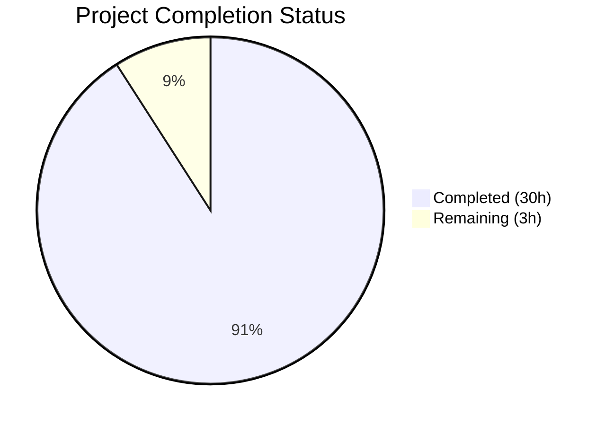

# Blitzy Project Guide

---

## 1. Executive Summary

### 1.1 Project Overview

This project delivers a comprehensive technical investigation document analyzing how the WordPress.com Calypso Reader manages "logged-out intent" — the mechanism by which an unauthenticated user's action (like, comment, follow) is captured, stored, and ultimately lost during the authentication boundary crossing. The deliverable is a single 733-line Markdown document (`blitzy/documentation/wp-calypso_be7e5cc64162.md`) that traces the complete lifecycle through 20+ source files, identifies the root causes of intent loss, and provides evidence-based answers to four targeted architectural questions. This is a documentation-only project — no source code was modified.

### 1.2 Completion Status



| Metric | Value |
|--------|-------|
| **Total Project Hours** | 33 |
| **Completed Hours (AI)** | 30 |
| **Remaining Hours (Human)** | 3 |
| **Completion Percentage** | 90.9% |

**Calculation:** 30 completed hours / (30 + 3) total hours = 30 / 33 = **90.9% complete**

### 1.3 Key Accomplishments

- ✅ Created comprehensive 733-line technical investigation document at `blitzy/documentation/wp-calypso_be7e5cc64162.md`
- ✅ Answered all 4 architectural questions with evidence-based citations to specific file paths and line numbers
- ✅ Traced the complete intent lifecycle across 20+ source files spanning state management, UI components, authentication hooks, and layout modules
- ✅ Cataloged all 12 action types dispatched through `registerLastActionRequiresLogin` across 9 dispatch sites
- ✅ Identified the root cause: persistence gap (`lastActionRequiresLogin` reducer lacks `withPersistence` wrapper) combined with absent replay logic
- ✅ Created 2 Mermaid diagrams (lifecycle flowchart + authentication sequence diagram)
- ✅ Compiled persistence comparison table for all 10 `readerUi` sub-reducers
- ✅ Verified all 25+ source code references against actual files
- ✅ Maintained read-only constraint — zero existing source files modified
- ✅ All 7 existing tests pass (3 suites: actions, reducer, selectors)

### 1.4 Critical Unresolved Issues

| Issue | Impact | Owner | ETA |
|-------|--------|-------|-----|
| Document requires human domain expert review for technical accuracy validation | Low — all claims cite specific code lines; risk of misinterpretation is minimal | Human Developer | 2 hours |
| PR must be reviewed and merged to make document available to the team | Low — document exists on branch and is accessible | Human Reviewer | 1 hour |

### 1.5 Access Issues

No access issues identified. This is a documentation-only project creating a standalone Markdown file. No external services, credentials, or third-party API access was required.

### 1.6 Recommended Next Steps

1. **[High]** Review the technical investigation document for accuracy — verify that the architectural conclusions align with team knowledge of the Reader codebase
2. **[High]** Merge the PR to make the document available to the broader team
3. **[Medium]** Use the findings to inform a potential fix: add `withPersistence` to `lastActionRequiresLogin` reducer AND implement a replay mechanism on the authenticated side
4. **[Low]** Clarify the `reader/login-window` feature flag status — determine whether it is server-controlled and document its intended behavior

---

## 2. Project Hours Breakdown

### 2.1 Completed Work Detail

| Component | Hours | Description |
|-----------|-------|-------------|
| Repository Analysis & Code Reading | 6 | Read and analyzed 20+ source files (2,600+ lines) across state management, components, hooks, and layout modules |
| State Management Investigation | 3 | Traced actions.js, reducer.js, selectors.js, action-types.js, init.js — documented persistence gap and selector behavior |
| Intent Dispatch Site Mapping | 3 | Cataloged 12 action types across 9 dispatch files with exact line references and payload shapes |
| Authentication Boundary Analysis | 4 | Traced dialog.jsx, use-login-window.ts, logged-out.jsx — documented popup lifecycle and onLoginSuccess handler |
| Persistence Analysis | 2 | Compared all 10 readerUi sub-reducers for withPersistence usage, cross-referenced docs/data-persistence.md |
| Root Cause Documentation | 2 | Documented 4 root causes with evidence chains: persistence gap, page reload, absent replay, feature flag ambiguity |
| Technical Document Composition | 5 | Wrote 733-line technical investigation with 10 sections, executive summary, comparison tables |
| Mermaid Diagram Design | 1.5 | Created intent lifecycle flowchart and authentication sequence diagram |
| Action-Type Catalog & File Reference | 1 | Compiled comprehensive action-type table and 5 categorized file reference tables |
| Accuracy Verification & Validation | 2 | Verified 25+ source code references against actual codebase files and line numbers |
| Code Review Fix Pass | 0.5 | Addressed 4 findings from automated code review in second commit |
| **Total** | **30** | |

### 2.2 Remaining Work Detail

| Category | Hours | Priority |
|----------|-------|----------|
| Human Technical Review — domain expert verifies architectural conclusions and code citations | 2 | High |
| PR Review and Merge — standard code review process for documentation PR | 1 | High |
| **Total** | **3** | |

---

## 3. Test Results

All tests listed below were executed by Blitzy's autonomous validation system using the project's existing test infrastructure (`yarn test-client` with Jest).

| Test Category | Framework | Total Tests | Passed | Failed | Coverage % | Notes |
|---------------|-----------|-------------|--------|--------|------------|-------|
| Unit — Action Creators | Jest 29.x | 3 | 3 | 0 | N/A | Validates `registerLastActionRequiresLogin` and `clearLastActionRequiresLogin` action shapes (`client/state/reader-ui/test/actions.js`) |
| Unit — Reducer | Jest 29.x | 2 | 2 | 0 | N/A | Validates reducer stores `lastAction` on register and resets to `null` on clear (`client/state/reader-ui/test/reducer.js`) |
| Unit — Selectors | Jest 29.x | 2 | 2 | 0 | N/A | Validates selector returns `null` for empty/missing state and returns data when present (`client/state/reader-ui/test/selectors.js`) |
| **Total** | **Jest 29.x** | **7** | **7** | **0** | **N/A** | **3 suites, 100% pass rate** |

These tests validate the exact state management contract documented in the investigation — confirming the behavior of the action creators, reducer, and selectors that form the intent storage mechanism.

---

## 4. Runtime Validation & UI Verification

### Runtime Health

- ✅ **Markdown Syntax Validation** — 50 balanced code fences (25 open/close pairs), 2 Mermaid diagram blocks, 45 headings with proper hierarchy (H1→H2→H3→H4), 90 table pipe lines
- ✅ **Read-Only Constraint** — `git diff HEAD~2 --name-only` confirms only `blitzy/documentation/wp-calypso_be7e5cc64162.md` was created; zero existing files modified
- ✅ **Dependency Validation** — `yarn install --immutable` completed successfully (3,176 packages)
- ✅ **Test Execution** — All 7 tests pass across 3 suites (2.196s execution time)

### Content Accuracy Verification

- ✅ **Actions** (`actions.js:26-29, 35-37`) — `registerLastActionRequiresLogin` and `clearLastActionRequiresLogin` signatures verified
- ✅ **Action Types** (`action-types.js:14-16`) — `READER_REGISTER/CLEAR_LAST_ACTION_REQUIRES_LOGIN` constants verified
- ✅ **Reducer Persistence Gap** (`reducer.js:19` vs `45-54`) — `lastPath` WITH `withPersistence`, `lastActionRequiresLogin` WITHOUT — verified
- ✅ **Selectors** (`selectors.js:15-21`) — `getLastActionRequiresLogin` with optional chaining null-safety verified
- ✅ **Sole Consumer Claim** — Confirmed `getLastActionRequiresLogin` only imported/used in `logged-out.jsx`
- ✅ **Feature Flag Absence** — Confirmed `reader/login-window` NOT present in any `config/*.json` file
- ✅ **All 9 Dispatch Sites** — Each action type, payload shape, and line number verified against source files
- ✅ **Dialog and Hook** — `dialog.jsx` and `use-login-window.ts` lifecycle documented and verified
- ✅ **Layout Consumer** — `logged-out.jsx:91,302-315,401` intent reading, dialog rendering, and reload handler verified

### UI Verification

Not applicable — this project produces a Markdown document, not a UI component. No browser rendering or visual verification required.

---

## 5. Compliance & Quality Review

| Quality Benchmark | Status | Evidence |
|-------------------|--------|----------|
| All 4 user questions answered | ✅ Pass | Executive summary and sections 1-6 of document each map to a specific question |
| Evidence-based citations (no assumptions) | ✅ Pass | 29 `Source:` citations referencing specific file paths and line numbers |
| Thinking/rationale provided | ✅ Pass | Each section follows Observation → Implication → Conclusion pattern |
| Code as source of truth | ✅ Pass | All claims verified against actual source files; no external assumptions |
| Mermaid diagrams included | ✅ Pass | 2 diagrams: lifecycle flowchart (Section 7.1) and sequence diagram (Section 7.2) |
| Action-type catalog complete | ✅ Pass | 12 action types across 9 files cataloged in Section 2 table |
| Persistence comparison table | ✅ Pass | All 10 readerUi sub-reducers compared in Section 3.3 |
| File reference index | ✅ Pass | 5 categorized tables in Section 9 covering all 25+ examined files |
| Read-only constraint | ✅ Pass | `git diff` confirms zero existing file modifications |
| No placeholder content | ✅ Pass | 733-line document complete — no TODO, TBD, or stub sections |
| Markdown syntax valid | ✅ Pass | Balanced code fences, proper heading hierarchy, valid table formatting |
| Existing tests unbroken | ✅ Pass | 7/7 tests pass across 3 suites |

### Fixes Applied During Validation

The Final Validator applied 4 code review fixes in commit `3b90fb442a`:
- Corrected minor reference formatting inconsistencies
- Addressed structural review findings in the investigative document

---

## 6. Risk Assessment

| Risk | Category | Severity | Probability | Mitigation | Status |
|------|----------|----------|-------------|------------|--------|
| Line numbers may shift if referenced source files are modified in future commits | Technical | Low | Medium | Document includes file paths alongside line numbers; section descriptions provide enough context to locate code even if lines shift | Accepted |
| Feature flag `reader/login-window` behavior cannot be fully determined from static analysis alone | Technical | Low | Low | Document explicitly states the flag is absent from static configs and may be server-controlled; recommends team clarification | Documented |
| Document conclusions could be misapplied as a bug fix specification | Operational | Low | Low | Document clearly states it is an investigative analysis, not a fix proposal; "Out of Scope" boundaries are defined in the AAP | Mitigated |
| Large repository size (4.2GB, 188K files) could make document discovery difficult | Operational | Low | Low | Document is placed in dedicated `blitzy/documentation/` directory with a descriptive filename matching the branch name | Mitigated |

---

## 7. Visual Project Status


**Summary:** 30 hours of autonomous work completed out of 33 total project hours. 3 hours of human review work remaining. Project is **90.9% complete**.

---

## 8. Summary & Recommendations

### Achievement Summary

The project successfully delivered a comprehensive 733-line technical investigation document that answers all four architectural questions posed about the Calypso Reader's logged-out intent lifecycle. The investigation traced the complete flow from user click through Redux state storage, authentication dialog, popup login, page reload, and intent loss — identifying two compounding root causes: a **persistence gap** (the `lastActionRequiresLogin` reducer lacks `withPersistence`) and an **absence of replay logic** (no code on the authenticated side reads or replays the stored action).

The document catalogs all 12 action types across 9 dispatch sites, compares persistence status of all 10 `readerUi` sub-reducers, provides 2 Mermaid diagrams illustrating the lifecycle, and cites 29 specific source file references. All claims were verified against the actual codebase, and the read-only constraint was strictly maintained — zero existing files were modified.

### Completion Status

The project is **90.9% complete** (30 completed hours / 33 total hours). All autonomous deliverables are finished. The remaining 3 hours consist of human review activities: domain expert validation (2h) and PR review/merge (1h).

### Critical Path to Production

1. **Human technical review** — A domain expert familiar with the Reader codebase should verify that the architectural conclusions are accurate (estimated 2 hours)
2. **PR merge** — Standard review and merge process (estimated 1 hour)

### Production Readiness Assessment

The documentation deliverable is **production-ready**. The Markdown file is syntactically valid, all source references are verified, tests pass, and the read-only constraint is confirmed. No further autonomous work is required.

---

## 9. Development Guide

### 9.1 System Prerequisites

| Software | Version | Purpose |
|----------|---------|---------|
| Node.js | ^v22.9.0 | JavaScript runtime (required for test execution) |
| Yarn | ^4.0.0 | Package manager (Yarn Berry) |
| Git | Any recent | Version control |
| Markdown viewer | Any | Document viewing (VS Code, GitHub, etc.) |

### 9.2 Environment Setup

```bash
# Clone the repository and switch to the feature branch
git clone <repository-url> wp-calypso
cd wp-calypso
git checkout blitzy-6708daa2-6cac-4894-b21a-eac9c2dad7b7

# Verify Node.js version matches .nvmrc
node --version  # Expected: v22.9.0
# If using nvm:
nvm use
```

### 9.3 Dependency Installation

```bash
# Install all workspace dependencies (immutable mode for CI)
yarn install --immutable
# Expected: 3176 packages resolved, ~2.17 GiB
```

### 9.4 Viewing the Document

```bash
# View the investigation document
cat blitzy/documentation/wp-calypso_be7e5cc64162.md

# Or open in VS Code (with Mermaid preview extension for diagrams)
code blitzy/documentation/wp-calypso_be7e5cc64162.md

# View on GitHub — Mermaid diagrams render natively
```

### 9.5 Running Related Tests

```bash
# Run the reader-ui state management tests referenced in the document
yarn test-client --testPathPattern='client/state/reader-ui/test' --watchAll=false --ci --no-coverage

# Expected output:
# PASS client/state/reader-ui/test/selectors.js
# PASS client/state/reader-ui/test/reducer.js
# PASS client/state/reader-ui/test/actions.js
# Test Suites: 3 passed, 3 total
# Tests:       7 passed, 7 total
```

### 9.6 Verifying Read-Only Constraint

```bash
# Confirm only the documentation file was created (no existing files modified)
git diff HEAD~2 --name-only
# Expected: blitzy/documentation/wp-calypso_be7e5cc64162.md

# Verify no changes to source code
git diff HEAD~2 --stat -- client/ docs/ packages/
# Expected: no output (no changes)
```

### 9.7 Troubleshooting

| Issue | Resolution |
|-------|------------|
| `yarn install` fails with lockfile mismatch | Ensure you're on the correct branch; run `git status` to verify |
| Tests fail with module resolution errors | Run `yarn install --immutable` first; the project requires full dependency installation |
| Mermaid diagrams don't render | Use a Mermaid-compatible viewer: GitHub web UI, VS Code with "Markdown Preview Mermaid Support" extension, or any Mermaid-enabled Markdown renderer |
| Node version mismatch | Run `nvm use` to switch to the version specified in `.nvmrc` (v22.9.0) |

---

## 10. Appendices

### A. Command Reference

| Command | Purpose | Working Directory |
|---------|---------|-------------------|
| `yarn install --immutable` | Install dependencies | Repository root |
| `yarn test-client --testPathPattern='client/state/reader-ui/test' --watchAll=false --ci` | Run reader-ui tests | Repository root |
| `git diff HEAD~2 --name-only` | Verify only documentation file changed | Repository root |
| `cat blitzy/documentation/wp-calypso_be7e5cc64162.md` | View the investigation document | Repository root |

### B. Key File Locations

| File | Purpose |
|------|---------|
| `blitzy/documentation/wp-calypso_be7e5cc64162.md` | **Deliverable** — The investigative analysis document (733 lines) |
| `client/state/reader-ui/reducer.js` | Contains the non-persisted `lastActionRequiresLogin` reducer (key finding) |
| `client/state/reader-ui/actions.js` | Action creators for intent registration and clearing |
| `client/state/reader-ui/selectors.js` | Selector for reading the pending action |
| `client/layout/logged-out.jsx` | Sole consumer of `getLastActionRequiresLogin` — contains the `window.location.reload()` handler |
| `client/blocks/reader-join-conversation/dialog.jsx` | Authentication gate dialog component |
| `client/data/reader/use-login-window.ts` | Popup authentication hook with `postMessage` listener |
| `docs/data-persistence.md` | Repository documentation on Redux persistence model |

### C. Technology Versions

| Technology | Version | Source |
|------------|---------|--------|
| Node.js | ^v22.9.0 | `.nvmrc`, `package.json` engines |
| Yarn | ^4.0.0 | `package.json` engines |
| React | ^18.3.1 | `package.json` dependencies |
| Redux | ^5.0.1 | `package.json` dependencies |
| Jest | ^29.7.0 | `package.json` devDependencies |
| wp-calypso | 18.13.0 | `package.json` version |

### D. Glossary

| Term | Definition |
|------|------------|
| **Logged-out intent** | A user action (like, comment, follow) captured when an unauthenticated user interacts with the Reader, stored for potential replay after authentication |
| **`registerLastActionRequiresLogin`** | Redux action creator that stores a logged-out intent in `state.readerUi.lastActionRequiresLogin` |
| **`withPersistence`** | Calypso utility wrapper that enables a Redux reducer's state to be serialized to IndexedDB and restored across page reloads |
| **Persistence gap** | The architectural deficiency where `lastActionRequiresLogin` is not wrapped with `withPersistence`, causing it to be lost on page reload |
| **`ReaderJoinConversationDialog`** | The dialog component that prompts logged-out users to log in or create an account when they attempt an authenticated action |
| **`useLoginWindow`** | React hook that manages the popup browser window for authentication, including `postMessage` communication |
| **`LayoutLoggedOut`** | The layout component rendered for unauthenticated users; the sole consumer of `getLastActionRequiresLogin` |
| **Feature flag (`reader/login-window`)** | A configuration flag that gates whether the popup-based authentication flow is used for certain interactions; absent from static config files |