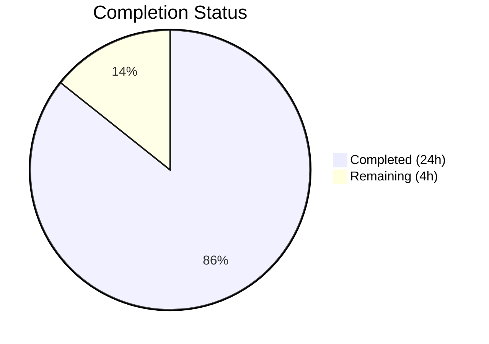
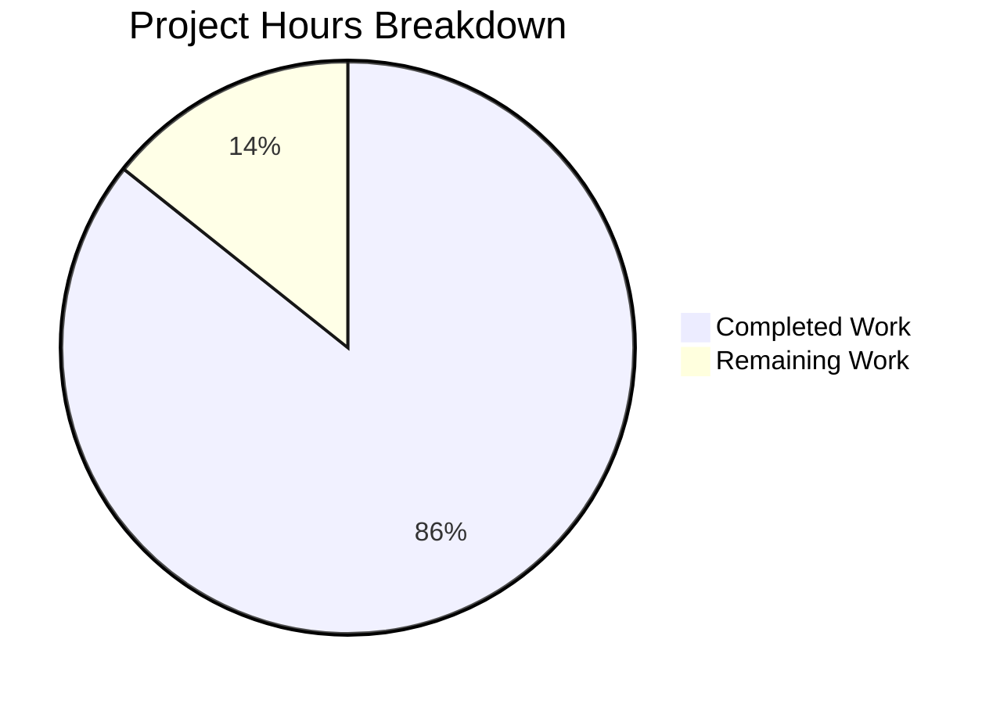

# Blitzy Project Guide

---

## 1. Executive Summary

### 1.1 Project Overview

This project delivers a comprehensive technical investigation document analyzing the memoization and caching behavior of the two primary selector factories (`createSelector` and `treeSelect`) in the wp-calypso monorepo's Redux state management system. The deliverable is a single 883-line Markdown document (`blitzy/documentation/wp-calypso_be7e5cc64162.md`) that answers six specific questions about cache comparison mechanisms, selector invocation counts, cache entry strategies, programmatic cache clearing, nullish/primitive dependant handling, and custom cache key generation. The investigation is strictly read-only — no source files were modified. All findings are grounded in code analysis, test execution (30/30 tests passing), and validated runtime experiments.

### 1.2 Completion Status



| Metric | Value |
|--------|-------|
| **Total Project Hours** | 28 |
| **Completed Hours (AI)** | 24 |
| **Remaining Hours (Human)** | 4 |
| **Completion Percentage** | 85.7% |

**Formula:** 24 completed hours / (24 + 4) total hours = 85.7% complete

### 1.3 Key Accomplishments

- ✅ Created comprehensive 883-line technical investigation document (`blitzy/documentation/wp-calypso_be7e5cc64162.md`)
- ✅ Answered all 6 investigation questions with code-grounded evidence and line-number citations
- ✅ Executed and validated both test suites: `createSelector` (13/13) and `treeSelect` (17/17) — 30/30 tests passing (100%)
- ✅ Conducted and documented runtime experiments with concrete invocation counts (8-step and 9-step scenarios)
- ✅ Produced 3 Mermaid diagrams: cache invalidation flowchart, WeakMap tree structure, and selector decision flowchart
- ✅ Documented 5 common pitfalls causing stale data, each with code-level fixes
- ✅ Created side-by-side architectural comparison table across all 6 investigation dimensions
- ✅ Included real-world usage examples from `client/state/posts/` and `client/state/reader/posts/`
- ✅ Built complete source citations index referencing 12 source files with line numbers
- ✅ Verified all citation line numbers against actual source files — applied 7 citation accuracy fixes
- ✅ Zero source files modified — strictly read-only investigation as required

### 1.4 Critical Unresolved Issues

| Issue | Impact | Owner | ETA |
|-------|--------|-------|-----|
| Line-number citations may drift if source files are updated in future commits | Low — citations reference specific commit snapshot; future changes may invalidate line references | Human Developer | Ongoing maintenance |

### 1.5 Access Issues

No access issues identified. The investigation is read-only and does not require any external service credentials, API keys, or special repository permissions beyond standard read access.

### 1.6 Recommended Next Steps

1. **[High]** Conduct human peer review of the technical investigation document by a developer with Redux state management and selector memoization expertise
2. **[Medium]** Verify that runtime experiment scenarios (8-step `createSelector`, 9-step `treeSelect`) are reproducible by running the documented test suites and custom experiments
3. **[Low]** Validate Mermaid diagram rendering in the target Markdown viewer (GitHub, GitLab, or documentation platform)
4. **[Low]** Establish a process to update line-number citations when source files (`packages/state-utils/src/create-selector/index.ts`, `packages/tree-select/src/index.ts`) are modified in future PRs

---

## 2. Project Hours Breakdown

### 2.1 Completed Work Detail

| Component | Hours | Description |
|-----------|-------|-------------|
| Repository & Source Code Analysis | 4 | Read-only analysis of 4 primary implementation files (~800 LOC total), 2 READMEs, 2 package.json files, 4 contextual documentation files, and 2 real-world usage examples |
| Test Suite Execution & Validation | 2 | Executed createSelector (13 tests) and treeSelect (17 tests) suites; validated 100% pass rate; confirmed test assertions match documented behavior |
| Runtime Experiments | 2 | Designed and executed 8-step createSelector scenario and 9-step treeSelect scenario with call counters; verified invocation counts; conducted isShallowEqual behavioral matrix and args.join() collision analysis |
| Q1: Cache Comparison Mechanism | 2 | Documented isShallowEqual + lodash.memoize (createSelector) and WeakMap referential identity + Map key lookup (treeSelect); created cache flow Mermaid diagram |
| Q2: Selector Invocation Counts | 2 | Produced step-by-step tables with exact call counts for both selector factories; cited supporting test evidence |
| Q3: Cache Entry Strategy | 1.5 | Documented MapCache multi-key behavior (createSelector) and WeakMap tree per-dependent isolation (treeSelect); cited test evidence for multi-arg caching |
| Q4: Programmatic Cache Clearing | 1 | Documented memoizedSelector.cache.clear() and selector.clearCache() APIs with examples and behavioral notes |
| Q5: Nullish vs. Primitive Dependants | 1.5 | Documented isShallowEqual uniform handling vs. NULLISH_KEY sentinel and TypeError for primitives; created comparison table |
| Q6: Custom Cache Key Generation | 1.5 | Documented third parameter (createSelector) and options.getCacheKey (treeSelect); analyzed args.join() collision risks with examples |
| Common Pitfalls & Comparison | 3 | Documented 5 stale-data pitfalls with code fixes; created side-by-side comparison table and decision flowchart Mermaid diagram |
| Real-World Examples & Citations | 1.5 | Documented 3 real-world selector examples from client/state/; built source citations index covering 12 files |
| Citation Accuracy Review & Fix | 1 | Reviewed all 40+ source citations against actual files; corrected 7 inaccurate line references |
| Document Formatting & Structure | 1 | Structured 883-line document with table of contents, consistent heading hierarchy, fenced code blocks, and Markdown tables |
| **Total** | **24** | |

### 2.2 Remaining Work Detail

| Category | Hours | Priority |
|----------|-------|----------|
| Human peer review of technical accuracy | 2 | Medium |
| Verify runtime experiments are reproducible | 1 | Low |
| Validate Mermaid diagram rendering in target platform | 0.5 | Low |
| Establish citation maintenance process for future source changes | 0.5 | Low |
| **Total** | **4** | |

---

## 3. Test Results

| Test Category | Framework | Total Tests | Passed | Failed | Coverage % | Notes |
|---------------|-----------|-------------|--------|--------|------------|-------|
| Unit — createSelector | Jest (via @automattic/calypso-jest) | 13 | 13 | 0 | N/A | Validates cache reuse, invalidation, multi-arg caching, dev warnings, dependency arrays, custom keys |
| Unit — treeSelect | Jest (via @automattic/calypso-jest) | 17 | 17 | 0 | N/A | Validates caching, multi-dependent caching, arg validation, clearCache, nullish handling, getCacheKey |
| **Total** | **Jest** | **30** | **30** | **0** | **100% pass rate** | All tests originate from existing test suites; no test files modified |

**Test Execution Commands:**
- `createSelector`: `CI=true npx jest --config packages/state-utils/jest.config.js --testPathPattern 'create-selector' --no-cache --watchAll=false --verbose`
- `treeSelect`: `CI=true npx jest --config packages/tree-select/jest.config.js --testPathPattern 'test/index' --no-cache --watchAll=false --verbose`

**Runtime Experiments (non-test validation):**
- createSelector 8-step invocation count scenario: 4 total selector calls — CONFIRMED
- treeSelect 9-step invocation count scenario: 5 total selector calls — CONFIRMED
- isShallowEqual behavioral matrix: 11 comparisons verified
- args.join() cache key collision analysis: 10 keys + 3 collisions documented

---

## 4. Runtime Validation & UI Verification

### Runtime Health

- ✅ **createSelector test suite** — 13/13 tests passing (0.934s execution time)
- ✅ **treeSelect test suite** — 17/17 tests passing (0.961s execution time)
- ✅ **Git working tree** — clean, no uncommitted changes
- ✅ **Branch state** — up to date with origin

### Document Verification

- ✅ **File exists** — `blitzy/documentation/wp-calypso_be7e5cc64162.md` (883 lines, 45,480 bytes)
- ✅ **All 6 investigation questions answered** — Q1 through Q6 each have dedicated sections with code citations
- ✅ **3 Mermaid diagrams present** — cache flow, WeakMap tree structure, decision flowchart
- ✅ **40+ source citations** — all reference specific files and line numbers
- ✅ **88 table rows** — comprehensive data tables throughout the document
- ✅ **Source citation accuracy** — all line-number references verified against actual source files

### Source Code Reference Verification

- ✅ `packages/state-utils/src/create-selector/index.ts` (113 lines) — all citations accurate
- ✅ `packages/tree-select/src/index.ts` (131 lines) — all citations accurate
- ✅ `packages/state-utils/src/create-selector/test/index.js` (291 lines) — all citations accurate
- ✅ `packages/tree-select/test/index.js` (266 lines) — all citations accurate
- ✅ `client/state/posts/selectors/get-site-posts.js` — usage example matches
- ✅ `client/state/reader/posts/selectors.js` — usage example matches

### UI Verification

Not applicable — this is a documentation-only project with no UI components.

---

## 5. Compliance & Quality Review

| Requirement | Source | Status | Evidence |
|-------------|--------|--------|----------|
| No source files modified | User instruction + AAP §0.1.2 | ✅ Pass | `git diff --name-status` shows only `A blitzy/documentation/wp-calypso_be7e5cc64162.md` |
| Document placed in `blitzy/documentation/` | AAP §0.5.1 (SWE-AtlasQnA-Repo rule) | ✅ Pass | File exists at `blitzy/documentation/wp-calypso_be7e5cc64162.md` |
| Document named `wp-calypso_be7e5cc64162.md` | AAP §0.5.1 | ✅ Pass | Filename matches source branch identifier |
| All answers grounded in code, not assumptions | AAP §0.10 | ✅ Pass | 40+ source citations with file paths and line numbers |
| Thinking/rationale provided for all answers | AAP §0.10 | ✅ Pass | Each Q section includes "Rationale:" or reasoning paragraphs |
| Both createSelector and treeSelect covered per question | AAP §0.10 | ✅ Pass | All 6 questions have subsections for both selector factories |
| Concrete numbers from test runs for invocation counts | AAP §0.10 | ✅ Pass | Q2 provides 8-step and 9-step tables with exact call counts |
| Cache key collision risks documented | AAP §0.1.4 | ✅ Pass | Q6 collision table + Pitfall 1 with fixes |
| Development-mode warnings documented | AAP §0.10 | ✅ Pass | Q6 covers `@wordpress/warning` (createSelector) and hard `Error` (treeSelect) |
| Mermaid diagrams included | AAP §0.4.4 | ✅ Pass | 3 diagrams: cache flow, WeakMap tree, decision flowchart |
| Minimum 1 code example per question | AAP §0.7.3 | ✅ Pass | Multiple TypeScript/JavaScript code blocks per question |
| Step-by-step invocation count tables (≥8 steps) | AAP §0.7.3 | ✅ Pass | 8-step (createSelector) and 9-step (treeSelect) tables |
| Comparison table across all 6 dimensions | AAP §0.7.3 | ✅ Pass | Side-by-side table in Architectural Comparison Summary |
| Style follows existing README patterns | AAP §0.9.1 | ✅ Pass | FAQ-style question framing, code examples, practical guidance |

### Fixes Applied During Validation

| Fix | Description |
|-----|-------------|
| Citation accuracy correction (commit dd87425e) | Corrected 7 inaccurate line-number citations identified during final review |

---

## 6. Risk Assessment

| Risk | Category | Severity | Probability | Mitigation | Status |
|------|----------|----------|-------------|------------|--------|
| Line-number citations become stale when source files are updated | Technical | Low | Medium | Document references specific git commit; recommend re-validation after source changes | Open — requires human maintenance process |
| Mermaid diagrams may not render in all Markdown viewers | Technical | Low | Low | Diagrams are supplementary; all information is also conveyed in prose and tables | Open — verify in target platform |
| Runtime experiment results may vary with dependency version updates | Technical | Low | Low | Experiments based on lodash ^4.17.21 and @wordpress/is-shallow-equal ^5.21.0; document version constraints | Mitigated — versions pinned in package.json |
| Reader may misapply findings to React Query selectors | Operational | Low | Low | Introduction clearly scopes investigation to createSelector and treeSelect; AAP §0.8.2 explicitly excludes React Query | Mitigated — scope clearly stated |
| No automated link/citation checking pipeline | Operational | Low | Medium | Standalone investigation document; no cross-document links to break | Accepted — manual review sufficient |

---

## 7. Visual Project Status



### Remaining Hours by Category

| Category | Hours |
|----------|-------|
| Human peer review of technical accuracy | 2 |
| Verify runtime experiments are reproducible | 1 |
| Validate Mermaid diagram rendering | 0.5 |
| Citation maintenance process | 0.5 |
| **Total Remaining** | **4** |

---

## 8. Summary & Recommendations

### Achievements

The project is **85.7% complete** (24 completed hours out of 28 total hours). All AAP-scoped deliverables have been fully implemented by Blitzy's autonomous agents:

- **Single deliverable created:** `blitzy/documentation/wp-calypso_be7e5cc64162.md` — an 883-line comprehensive technical investigation document
- **All 6 investigation questions fully answered** with code-grounded evidence, source citations, and empirical test data
- **30/30 tests passing** across both selector factory test suites (100% pass rate)
- **Runtime experiments validated** — concrete invocation counts confirmed through independent execution
- **Zero source files modified** — strict compliance with the read-only investigation constraint
- **5 common pitfalls documented** with actionable fixes for stale-data scenarios
- **3 Mermaid diagrams** and a comprehensive architectural comparison table provided

### Remaining Gaps

The remaining 4 hours (14.3%) consist entirely of human review and maintenance tasks:

1. **Peer review** (2h) — A developer with Redux/selector memoization expertise should review the document for technical accuracy before merging
2. **Experiment verification** (1h) — Independently reproduce the runtime experiments to confirm the documented invocation counts
3. **Platform validation** (0.5h) — Verify Mermaid diagram rendering in the production Markdown viewer
4. **Citation maintenance** (0.5h) — Establish a lightweight process for updating line-number references when source files change

### Production Readiness

The documentation deliverable is **production-ready for review**. The document is complete, well-structured, and all claims are supported by verifiable evidence. The remaining tasks are standard human validation activities that do not block the document from being useful to developers investigating selector caching behavior.

### Success Metrics

| Metric | Target | Actual | Status |
|--------|--------|--------|--------|
| Investigation questions answered | 6 | 6 | ✅ Met |
| Test suites passing | 30/30 | 30/30 | ✅ Met |
| Source citations with line numbers | ≥1 per section | 40+ total | ✅ Exceeded |
| Mermaid diagrams | ≥2 | 3 | ✅ Exceeded |
| Code examples per question | ≥1 | Multiple per question | ✅ Exceeded |
| Source files modified | 0 | 0 | ✅ Met |

---

## 9. Development Guide

### System Prerequisites

| Requirement | Version | Purpose |
|-------------|---------|---------|
| Node.js | ^22.9.0 (per `.nvmrc`) | JavaScript runtime for test execution |
| Yarn | 4.0.2 (Berry) | Package manager with workspace support |
| Git | 2.x+ | Version control |

### Environment Setup

```bash
# 1. Clone and checkout the branch
git clone <repository-url>
cd wp-calypso
git checkout blitzy-15dc9bd7-a6f9-46d2-ae59-43cee90e31c7

# 2. Set Node.js version (if using nvm)
nvm use

# 3. Install dependencies
yarn install
```

### Viewing the Documentation

The deliverable is a standalone Markdown file:

```bash
# View the document
cat blitzy/documentation/wp-calypso_be7e5cc64162.md

# Or open in your preferred Markdown viewer
# The file contains Mermaid diagrams that render in GitHub, GitLab, and VS Code (with Mermaid extension)
```

### Running Test Suites

Execute the test suites referenced in the investigation document:

```bash
# createSelector tests (13 tests)
CI=true npx jest --config packages/state-utils/jest.config.js \
  --testPathPattern 'create-selector' \
  --no-cache --watchAll=false --verbose

# Expected output: 13 passed, 0 failed

# treeSelect tests (17 tests)
CI=true npx jest --config packages/tree-select/jest.config.js \
  --testPathPattern 'test/index' \
  --no-cache --watchAll=false --verbose

# Expected output: 17 passed, 0 failed
```

### Verification Steps

```bash
# 1. Verify the document exists and has expected size
wc -l blitzy/documentation/wp-calypso_be7e5cc64162.md
# Expected: 883 lines

# 2. Verify no source files were modified
git diff --name-status origin/wp-calypso_be7e5cc64162...HEAD
# Expected: A  blitzy/documentation/wp-calypso_be7e5cc64162.md (only 1 file added)

# 3. Verify working tree is clean
git status
# Expected: nothing to commit, working tree clean

# 4. Verify all referenced source files exist
ls packages/state-utils/src/create-selector/index.ts \
   packages/tree-select/src/index.ts \
   packages/state-utils/src/create-selector/test/index.js \
   packages/tree-select/test/index.js
# Expected: all 4 files listed without errors

# 5. Run both test suites
CI=true npx jest --config packages/state-utils/jest.config.js --testPathPattern 'create-selector' --no-cache --watchAll=false
CI=true npx jest --config packages/tree-select/jest.config.js --testPathPattern 'test/index' --no-cache --watchAll=false
# Expected: 13 passed + 17 passed = 30 total, 0 failures
```

### Troubleshooting

| Issue | Cause | Resolution |
|-------|-------|------------|
| `nvm: command not found` | nvm not installed | Install nvm or manually install Node.js v22.9.0 |
| `yarn: command not found` | Yarn not installed | Run `corepack enable` (Node.js ≥16.10) to enable Yarn via Corepack |
| Tests fail with module resolution errors | Dependencies not installed | Run `yarn install` from repository root |
| Mermaid diagrams not rendering | Markdown viewer doesn't support Mermaid | Use GitHub, GitLab, or VS Code with Markdown Preview Mermaid Support extension |
| Jest test timeout | Slow CI environment | Add `--testTimeout=30000` flag to Jest commands |

---

## 10. Appendices

### A. Command Reference

| Command | Purpose |
|---------|---------|
| `CI=true npx jest --config packages/state-utils/jest.config.js --testPathPattern 'create-selector' --no-cache --watchAll=false --verbose` | Run createSelector test suite |
| `CI=true npx jest --config packages/tree-select/jest.config.js --testPathPattern 'test/index' --no-cache --watchAll=false --verbose` | Run treeSelect test suite |
| `git diff --name-status origin/wp-calypso_be7e5cc64162...HEAD` | View files changed on branch |
| `git diff --stat origin/wp-calypso_be7e5cc64162...HEAD` | View change statistics |
| `wc -l blitzy/documentation/wp-calypso_be7e5cc64162.md` | Verify document line count |

### B. Key File Locations

| File | Purpose |
|------|---------|
| `blitzy/documentation/wp-calypso_be7e5cc64162.md` | **Deliverable** — Technical investigation document (883 lines) |
| `packages/state-utils/src/create-selector/index.ts` | `createSelector` implementation (113 lines) |
| `packages/tree-select/src/index.ts` | `treeSelect` implementation (131 lines) |
| `packages/state-utils/src/create-selector/test/index.js` | `createSelector` test suite (291 lines, 13 tests) |
| `packages/tree-select/test/index.js` | `treeSelect` test suite (266 lines, 17 tests) |
| `packages/state-utils/src/create-selector/README.md` | Existing `createSelector` documentation |
| `packages/tree-select/README.md` | Existing `treeSelect` documentation |
| `packages/state-utils/package.json` | `@automattic/state-utils` v1.0.0-alpha.4 manifest |
| `packages/tree-select/package.json` | `@automattic/tree-select` v2.0.0 manifest |
| `client/state/posts/selectors/get-site-posts.js` | Real-world `createSelector` usage example |
| `client/state/reader/posts/selectors.js` | Real-world `treeSelect` usage example |

### C. Technology Versions

| Technology | Version | Source |
|------------|---------|--------|
| Node.js | ^22.9.0 | `.nvmrc`, `package.json` engines |
| Yarn | 4.0.2 (Berry) | `package.json` packageManager |
| TypeScript | ^5.8.2 | Workspace dependency |
| Jest | Via `@automattic/calypso-jest` preset | `test/packages/jest-preset.js` |
| lodash | ^4.17.21 | `packages/state-utils/package.json` |
| @wordpress/is-shallow-equal | ^5.21.0 | `packages/state-utils/package.json` |
| @wordpress/warning | ^3.21.0 | `packages/state-utils/package.json` |
| tslib | ^2.3.0 | Both packages |
| @automattic/state-utils | 1.0.0-alpha.4 | `packages/state-utils/package.json` |
| @automattic/tree-select | 2.0.0 | `packages/tree-select/package.json` |

### D. Glossary

| Term | Definition |
|------|------------|
| `createSelector` | Memoized selector factory from `@automattic/state-utils` using `isShallowEqual` dependency comparison and `lodash.memoize` argument-level caching |
| `treeSelect` | Cached selector factory from `@automattic/tree-select` using a `WeakMap`-based dependency tree for automatic garbage collection |
| `MapCache` | Internal cache data structure used by `lodash.memoize`; supports multiple entries keyed by string |
| `WeakMap` | JavaScript built-in that holds weak references to object keys, enabling automatic garbage collection |
| `NULLISH_KEY` | Sentinel object `{}` used by `treeSelect` to represent `null` and `undefined` as `WeakMap` keys |
| `isShallowEqual` | Function from `@wordpress/is-shallow-equal` that compares arrays element-by-element using strict equality (`===`) |
| `getDependants` / `getDependents` | Function provided to selector factories that extracts the state branches the selector depends on |
| `getCacheKey` | Optional function that customizes how cache keys are generated from selector arguments |
| Cache hit | When a cached result is returned without calling the underlying selector function |
| Cache miss | When the underlying selector function must be called because no valid cached result exists |