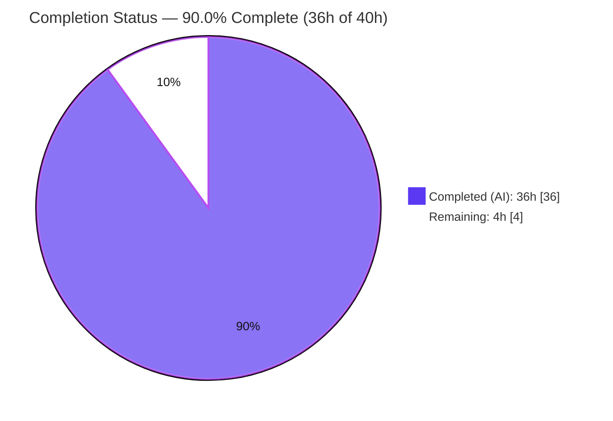

# Blitzy Project Guide — wp-calypso Testing Infrastructure Q&A

> **Deliverable:** `blitzy/documentation/wp-calypso_be7e5cc64162.md`
> **Task type:** Read-only investigative Question-and-Answer documentation (rule `SWE-AtlasQnA-Repo`)
> **Branch:** `blitzy-e01523bf-2171-49e9-97cf-3dfcfc8250c2` · **Base:** `be7e5cc64162`

---

## 1. Executive Summary

### 1.1 Project Overview

This project produces a single, evidence-backed onboarding document that explains how the `Automattic/wp-calypso` testing infrastructure behaves at runtime, written **run-first** — the relevant code paths were built and executed, real output captured, and only then transcribed with `file:line` citations and observed-vs-inferred labels. The target reader is a newly onboarding developer. The document answers seven explicit questions (Q1–Q7) spanning the dev-server bring-up, the Jest harness, test-only globals/polyfills, network isolation, a mocked-API dispatch trace, and feature-flag/config resolution divergence between tests and development. The task is strictly read-only: the source repository must remain byte-for-byte unchanged, with the answer document the only artifact added.

### 1.2 Completion Status



<sub>**Color key:** Completed work = Dark Blue `#5B39F3` · Remaining work = White `#FFFFFF` (violet `#B23AF2` outline).</sub>

| Metric | Hours |
|--------|-------|
| **Total Hours** | **40** |
| **Completed Hours (AI + Manual)** | **36** (AI: 36 · Manual: 0) |
| **Remaining Hours** | **4** |
| **Percent Complete** | **90.0%** |

> Completion % (PA1, AAP-scoped) = Completed ÷ (Completed + Remaining) = 36 ÷ 40 = **90.0%**.

### 1.3 Key Accomplishments

- ✅ Canonical runtime established and verified — Node v22.23.1 (satisfies `^v22.9.0`), yarn 4.0.2 via the pinned `.yarn/releases/yarn-4.0.2.cjs` release.
- ✅ All **seven** sub-questions (Q1–Q7) answered with executed commands and **unedited** captured output.
- ✅ Run-first evidence reproduces **byte-for-byte** on re-execution (env resolver, config divergence, nock error, `5 passed, 5 total`).
- ✅ Primary **and** edge paths exercised — un-mocked network error, `/ca` 500 failure edge, missing-key `ReferenceError` edge.
- ✅ Deliverable authored at the mandated path `blitzy/documentation/wp-calypso_be7e5cc64162.md` (633 lines) with 67 observed/inferred labels and zero elision.
- ✅ Every `file:line` citation across the 25 referenced files verified accurate.
- ✅ Read-only guarantee preserved — repository byte-for-byte unchanged apart from the single added document.
- ✅ Autonomous validation complete — Final Validator's five production-readiness gates all passed with zero defects, independently corroborated during this assessment.

### 1.4 Critical Unresolved Issues

| Issue | Impact | Owner | ETA |
|-------|--------|-------|-----|
| None blocking release | The deliverable is complete, validated across 5 gates, and read-only-safe. No issue blocks merge. | — | — |
| (Advisory, non-blocking) Node/yarn toolchain conflict documented but not fixed (read-only) | Onboarding devs on Node 20 hit the `check-node-version` guard; no impact on the document itself | Platform/Tooling team | Team decision |
| (Advisory, non-blocking) `config/README.md` selection wording differs from resolver | Docs-only nuance; resolver is authoritative and noted in the deliverable | Docs owner | Optional |

> No item in this table blocks validation or merge. The two advisory rows are pre-existing repository discrepancies the AAP explicitly scoped **out** (read-only); they are documented in the deliverable, not fixed.

### 1.5 Access Issues

| System/Resource | Type of Access | Issue Description | Resolution Status | Owner |
|-----------------|----------------|-------------------|-------------------|-------|
| — | — | **No access issues identified.** Repository, canonical toolchain (Node 22.x, yarn 4.0.2), and `node_modules` were all fully available; no external credentials or third-party APIs are required (network is disabled in tests by design). | N/A | — |

### 1.6 Recommended Next Steps

1. **[High]** Have an SME perform a technical accuracy review of the Q&A document — spot-check a representative sample of the embedded observation commands and `file:line` citations against live source (≈2h).
2. **[Medium]** Approve the PR and merge to `trunk` after confirming the read-only diff (`A blitzy/documentation/wp-calypso_be7e5cc64162.md`, 633 insertions / 0 deletions) (≈0.5h).
3. **[Low]** Route the document to the actual onboarding developer for an end-to-end read-through and capture any clarity feedback (≈1.5h).
4. **[Advisory]** Separately decide whether to standardize the toolchain (Node `^v22.9.0` manifests vs Node 20 container setup) — out of scope for this read-only task.
5. **[Advisory]** Optionally align `config/README.md` with the actual resolver precedence — out of scope for this read-only task.

---

## 2. Project Hours Breakdown

### 2.1 Completed Work Detail

| Component | Hours | Description |
|-----------|-------|-------------|
| Canonical runtime establishment & harness smoke test | 2 | Stood up Node `^v22.9.0` + yarn@4.0.2 toolchain; verified `yarn install`/`node_modules`; ran country-states as a smoke test (5/5). |
| Q1 investigation — dev server bring-up | 1.5 | Canonical `yarn start` entry, env resolution to `development`, real-entry-vs-standin analysis, citations. |
| Q2 investigation — test vs. dev environment boot | 2 | Preset chain (base `testEnvironment: node`), 4 suite configs, jsdom opt-in, `NODE_ENV` divergence run. |
| Q3 investigation — test-only globals/env/polyfills | 3 | Authored a self-contained Jest harness capturing 15 live `typeof` values; full enumeration of setup-test-framework + config globals + resolver + asset transform. |
| Q4 investigation — network isolation (primary + edge) | 2 | Triggered un-mocked request → `NetConnectNotAllowedError`; primary mocked path; integration-suite contrast; cleanup semantics. |
| Q5 investigation — mocked API trace | 3 | Ran country-states x2; traced dispatch sequence before/during/after; `useNock` helper; `/ca` 500 failure edge. |
| Q6 investigation — config/flag divergence | 2 | `moduleNameMapper` alias pivot; parser behavior; both-environment run; anchor flag diff. |
| Q7 investigation — test config control + proofs | 2.5 | `config()`/`isEnabled()` semantics; PROOF #1 (flag differs); PROOF #2 (missing-key `ReferenceError` vs `undefined` edge); bypassed browser reader. |
| Answer document authoring | 8 | 633-line structured Markdown: preamble, per-question sections (command + unedited output + citations + labels), mermaid trace, coverage tables. |
| Exhaustiveness & coverage pass | 2 | Named-item checklist, edge-path coverage, final coverage table, honest deviation reporting. |
| Evidence grounding & citation accuracy | 2 | `file:line` citations across 25 files; observed/inferred labeling; no `// ...` elision. |
| Read-only guarantee & temp-script cleanup | 1 | Removed temporary spec + Jest cache artifacts; git verification; byte-for-byte preservation. |
| Autonomous validation (Final Validator, 5 gates) | 5 | Re-executed every observation command, re-verified every citation, ran the test suite, re-confirmed read-only. |
| **Total Completed** | **36** | |

> The Total of the Hours column (**36h**) equals Completed Hours in Section 1.2. All completed hours are autonomous (AI); Manual = 0.

### 2.2 Remaining Work Detail

| Category | Hours | Priority |
|----------|-------|----------|
| Human technical accuracy review of the Q&A document (SME) | 2 | High |
| Onboarding-developer validation & feedback loop (optional per AAP) | 1.5 | Low |
| PR approval & merge to `trunk` | 0.5 | Medium |
| **Total Remaining** | **4** | |

> The Total of the Hours column (**4h**) equals Remaining Hours in Section 1.2 and the "Remaining Work" value in Section 7. Fixing the two documented conflicts (R6/R7) is **out of AAP scope** (read-only rule) and therefore carries **0 counted hours**.

### 2.3 Basis of Estimate

Hours are derived with the PA2 framework, calibrated to a read-only documentation/investigation task: investigation dominates (16h across seven subsystems), authoring a 633-line evidence-backed document is substantial (8h), and full autonomous re-validation adds 5h. Remaining hours reflect the genuine human path-to-production for a documentation deliverable — there is **no software to deploy**, so no CI/infra/deployment hours exist. Confidence: **High** for completed work (all commands reproduce byte-for-byte); **High** for remaining work (well-defined human review/merge, narrow scope).

---

## 3. Test Results

All tests below originate from Blitzy's autonomous validation logs for this project (the run-first investigation and the Final Validator re-execution). This is a documentation task; test executions are **targeted runtime observations** that back the document's claims, not a full-suite coverage campaign.

| Test Category | Framework | Total Tests | Passed | Failed | Coverage % | Notes |
|---------------|-----------|-------------|--------|--------|-----------|-------|
| Data-layer unit — `country-states` action creators | Jest 29.7.0 | 5 | 5 | 0 | N/A* | Canonical client suite (Q5): 1 `receiveCountryStates` + 4 `requestCountryStates` (incl. `/ca` 500 failure edge). PASS 5/5, stable across 2 validator runs and re-confirmed during this assessment (exit 0). |
| Observation harness — Q3 live-globals spec | Jest 29.7.0 | 1 | 1 | 0 | N/A* | Temporary self-contained spec printing 15 live global `typeof` values; deleted after run (read-only preserved). "1 passed, 1 total". |
| **Totals** | **Jest 29.7.0** | **6** | **6** | **0** | **N/A*** | **100% pass rate** across all autonomous observation runs. |

<sub>*Coverage is Not Applicable — the deliverable is a Markdown document. Test runs are evidence-generating observations executed against the real harness, not a coverage effort. Only the Jest `Time` line varies run-to-run; every stable anchor (pass counts, error strings, env values) reproduces byte-for-byte.</sub>

**Invocation (canonical):** `node .yarn/releases/yarn-4.0.2.cjs jest -c=test/client/jest.config.js client/state/country-states/test/actions.js`

---

## 4. Runtime Validation & UI Verification

**Runtime health** (each item executed; ✅ = reproduced byte-for-byte):

- ✅ **Operational** — Environment resolver `client/server/config/index.js`: with no env vars, `env_id = development`, `typeof isEnabled = function`.
- ✅ **Operational** — Config parser divergence: `NODE_ENV=test` → `checkout/checkout-version`, `google-my-business`, `individual-subscriber-stats` all **false**; `NODE_ENV=development` → all **true**.
- ✅ **Operational** — Network isolation (`nock.disableNetConnect()`): un-mocked request throws `NetConnectNotAllowedError` / `ENETUNREACH` / `Nock: Disallowed net connect for "public-api.wordpress.com:80/rest/v1.1/me"`.
- ✅ **Operational** — Mocked transport (wpcom via nock): country-states dispatch sequence passes 5/5.
- ✅ **Operational** — Canonical toolchain: Node v22.23.1 (satisfies `^v22.9.0`); yarn 4.0.2 pinned release (2,733,890 bytes).

**API integration:**

- ✅ **Operational (mocked)** — WordPress.com REST transport exercised through `nock` interception in the country-states trace; no real network egress.
- ⚠ **Partial (by design)** — Real external network is intentionally blocked in client tests; the un-mocked path is exercised only to capture the expected error, never to reach a live API.

**UI verification:**

- ❕ **Not Applicable** — The deliverable is a Markdown answer document. No user interface, component, or screen is produced or modified; the Design System Alignment Protocol does not apply (AAP §0.5.3).

---

## 5. Compliance & Quality Review

Cross-map of the governing rule (`SWE-AtlasQnA-Repo`) and quality benchmarks to observed evidence:

| Benchmark / Rule | Requirement | Status | Evidence |
|------------------|-------------|--------|----------|
| Output location | Doc at `blitzy/documentation/<source_branch>.md` | ✅ PASS | `blitzy/documentation/wp-calypso_be7e5cc64162.md` created |
| Run-first methodology | Build/run first; write from observation | ✅ PASS | All 7 questions backed by executed commands + unedited output |
| Grounding | Every claim → `file:line` or observed output | ✅ PASS | Citations spot-verified exact (e.g., `index.js:6`, `jest-preset.js:11`, `jest.config.js:11`) |
| Observed vs. inferred labeling | Label each claim | ✅ PASS | 45 "observed" + 22 "inferred" labels |
| Exhaustiveness | Primary + edge paths; every named item | ✅ PASS | Un-mocked network, `/ca` 500 failure, missing-key `ReferenceError`; named-item checklist |
| Evidence completeness | Full unedited output; no `// ...` elision | ✅ PASS | 0 elision markers; 23 balanced code blocks |
| Read-only scope | No source change; temp scripts removed | ✅ PASS | `git diff` = 1 file added; working tree clean |
| Canonical runtime | Default config; exact commands stated | ✅ PASS | Node 22.x + yarn 4.0.2; every command recorded |
| Zero placeholders | No TODO/FIXME/stub | ✅ PASS | 0 TODO/FIXME/placeholder markers |
| Autonomous validation | Re-execute + verify citations | ✅ PASS | Final Validator 5 gates + this guide's independent re-verification |

**Fixes applied during autonomous validation:** the review-fixes commit `06d4e710c9` addressed review findings (honest deviation reporting for the observed Node version, the parser function signature, and the `config/client.json` line count). The Final Validator subsequently required **zero** further edits (zero defects).

**Outstanding compliance items:** none within AAP scope. The two documented-but-unfixed conflicts (R6 toolchain, R7 README) are out of scope by the read-only rule and are correctly documented rather than fixed.

---

## 6. Risk Assessment

| Risk | Category | Severity | Probability | Mitigation | Status |
|------|----------|----------|-------------|------------|--------|
| R1 Documentation drift — `file:line`/output may go stale as the codebase evolves | Technical | Low | Medium | Precise citations enable fast re-verification; re-run observation commands after upstream changes | Open (inherent) |
| R2 Run-to-run timing variance in Jest `Time` line | Technical | Low | High | Doc flags timing as the sole variable; anchors on `5 passed, 5 total` | Mitigated / Documented |
| R3 Read-only guarantee integrity (scripts could modify repo) | Security | Medium | Low | Temp scripts removed; `git status` clean; only 1 file added; validator + this assessment confirm byte-for-byte | Closed |
| R4 Secrets/credentials leakage in captured output | Security | Low | Low | Outputs are config flags/env/nock errors; wpcom mocked; no real API calls | Closed |
| R5 Command reproducibility requires canonical runtime | Operational | Medium | Medium | Prerequisites documented in the doc and in Section 9; exact versions stated | Documented / Open |
| R6 Node/yarn toolchain conflict (Node 20 setup vs Node `^v22.9.0`/yarn@4.0.2 manifests) | Integration | Medium | Medium | Documented; manifests authoritative; validated on Node 22.x; not fixed (read-only) | Open (human decision) |
| R7 `config/README.md` selection wording vs resolver precedence | Integration | Low | Low | Documented; resolver (`CALYPSO_ENV \|\| NODE_ENV \|\| 'development'`) authoritative | Documented / Open |

> Overall risk posture is **Low**. As a read-only documentation deliverable there is no production software surface; the two Medium-severity integration items (R6/R7) require a human decision but neither blocks validation or merge.

---

## 7. Visual Project Status


<sub>**Color key:** Completed Work = Dark Blue `#5B39F3` · Remaining Work = White `#FFFFFF`. "Remaining Work" (4h) equals Section 1.2 Remaining Hours and the sum of the Section 2.2 Hours column.</sub>

**Remaining work by priority (4h total):**

| Priority | Hours | Share |
|----------|-------|-------|
| High (SME accuracy review) | 2.0 | 50% |
| Low (onboarding validation) | 1.5 | 37.5% |
| Medium (PR merge) | 0.5 | 12.5% |
| **Total** | **4.0** | **100%** |

---

## 8. Summary & Recommendations

**Achievements.** The project delivers a complete, run-first, evidence-backed onboarding document at the mandated path. Every one of the seven questions is answered with an executed command, its unedited output, precise `file:line` citations, and an observed-vs-inferred label. Primary and edge paths were both exercised (un-mocked network error, `/ca` 500 failure, missing-key `ReferenceError`), and the source repository is byte-for-byte unchanged apart from the single added file.

**Completion.** Using the AAP-scoped PA1 methodology, the project is **90.0% complete** — **36h** of autonomous work delivered against **4h** of remaining human path-to-production, for **40h** total. Because the deliverable is documentation, there is no deployment/CI/infrastructure work; the remaining 10% is purely human acceptance.

**Remaining gaps / critical path to production.** (1) SME technical accuracy review → (2) onboarding-developer read-through → (3) PR approval and merge. None is blocking, and the critical path is short (≈4h of human effort).

**Success metrics (all met autonomously).** 100% of observation commands reproduce byte-for-byte; 100% of `file:line` citations accurate; representative suite passes 5/5 stably; repository read-only guarantee preserved (`A blitzy/documentation/wp-calypso_be7e5cc64162.md`).

**Production readiness assessment.** **Ready for human review and merge.** The autonomous deliverable is validated and defect-free within its scope. Two pre-existing repository discrepancies (toolchain versions; README wording) are documented — not fixed — per the read-only rule and are advisory only.

| Metric | Value |
|--------|-------|
| AAP-scoped completion | 90.0% |
| Completed hours (AI + Manual) | 36 (36 + 0) |
| Remaining hours | 4 |
| Total hours | 40 |
| Blocking issues | 0 |
| Read-only guarantee | Preserved |

---

## 9. Development Guide

This guide lets a human reviewer **reproduce the evidence** in the deliverable and read/use the document. Every command below was tested in the canonical runtime.

### 9.1 System Prerequisites

- **OS:** Linux or macOS (validated on Ubuntu 25.10).
- **Node.js:** `^v22.9.0` (`package.json` → `engines.node`); `.nvmrc` pins `22.9.0`. Observed: `v22.23.1`.
- **Package manager:** `yarn@4.0.2` (`package.json` → `packageManager`) via the pinned release `.yarn/releases/yarn-4.0.2.cjs` (`.yarnrc.yml` → `yarnPath`).
- **Git** and roughly **3.4 GB** free disk (working tree + `node_modules`).

### 9.2 Environment Setup

```bash
# From the repository root, on branch blitzy-e01523bf-2171-49e9-97cf-3dfcfc8250c2
nvm use            # reads .nvmrc -> 22.9.0 (or ensure your Node satisfies ^v22.9.0)
node --version     # expect: v22.9.0+ (validated on v22.23.1)
```

> No environment variables are required for the canonical dev/config resolution. With `CALYPSO_ENV` and `NODE_ENV` unset, the resolver returns `development`.

### 9.3 Dependency Installation

```bash
# Use the repo-pinned yarn release (NOT `corepack yarn@stable`, which mismatches)
node .yarn/releases/yarn-4.0.2.cjs --version   # expect: 4.0.2
node .yarn/releases/yarn-4.0.2.cjs install     # node_modules is already complete in this environment
```

### 9.4 Reproduce the Investigation (the "run" that backs the doc)

```bash
# Q1 — dev-server env resolution (expect: env_id = development)
env -u NODE_ENV -u CALYPSO_ENV node -e "console.log('env_id =', require('./client/server/config/index.js')('env_id'))"

# Q6/Q7 PROOF #1 — config divergence (test = false, development = true)
NODE_ENV=test        node -e "const c=require('./client/server/config/index.js'); console.log('test  google-my-business:', c.isEnabled('google-my-business'))"
NODE_ENV=development node -e "const c=require('./client/server/config/index.js'); console.log('dev   google-my-business:', c.isEnabled('google-my-business'))"

# Q4 — un-mocked network under nock (expect: NetConnectNotAllowedError / ENETUNREACH)
node -e "const nock=require('nock');nock.disableNetConnect();require('http').get('http://public-api.wordpress.com/rest/v1.1/me',()=>{}).on('error',e=>console.log(e.name,e.code,e.message))"

# Q5 — mocked API trace suite (expect: Tests: 5 passed, 5 total; exit 0)
node .yarn/releases/yarn-4.0.2.cjs jest -c=test/client/jest.config.js client/state/country-states/test/actions.js
```

### 9.5 Verification Steps (expected output)

| Command | Expected output |
|---------|-----------------|
| Q1 env resolver | `env_id = development` |
| Q6/Q7 test flag | `test  google-my-business: false` |
| Q6/Q7 dev flag | `dev   google-my-business: true` |
| Q4 network edge | `NetConnectNotAllowedError ENETUNREACH Nock: Disallowed net connect for "public-api.wordpress.com:80/rest/v1.1/me"` |
| Q5 suite | `Tests: 5 passed, 5 total` (exit 0) |

### 9.6 Example Usage — read the deliverable & confirm read-only

```bash
# Open / inspect the answer document (633 lines, 57,797 bytes)
wc -l blitzy/documentation/wp-calypso_be7e5cc64162.md
less blitzy/documentation/wp-calypso_be7e5cc64162.md

# Confirm the read-only guarantee (expect exactly one added file, clean tree)
git diff --name-status be7e5cc64162..HEAD          # -> A  blitzy/documentation/wp-calypso_be7e5cc64162.md
git status --porcelain --untracked-files=no        # -> (empty)
```

### 9.7 Troubleshooting

- **`yarn start` fails a version check.** The `start` script runs `check-node-version --package`; Node 20 is rejected. Use Node `^v22.9.0`.
- **corepack picks a different yarn.** Do not use `corepack yarn@stable`; invoke the pinned release `.yarn/releases/yarn-4.0.2.cjs`.
- **A test "makes a network error."** That is expected — client tests call `nock.disableNetConnect()`; an un-mocked request is *supposed* to throw `NetConnectNotAllowedError`.
- **The Jest `Time:` value differs from the doc.** Only the timing line varies run-to-run; anchor on the pass counts and error strings, which are stable.

---

## 10. Appendices

### Appendix A — Command Reference

| Purpose | Command |
|---------|---------|
| Node version | `node --version` |
| Yarn version (pinned) | `node .yarn/releases/yarn-4.0.2.cjs --version` |
| Install deps | `node .yarn/releases/yarn-4.0.2.cjs install` |
| Env resolution (Q1) | `env -u NODE_ENV -u CALYPSO_ENV node -e "require('./client/server/config/index.js')('env_id')"` |
| Config divergence (Q6/Q7) | `NODE_ENV=<env> node -e "require('./client/server/config/index.js').isEnabled('<flag>')"` |
| Network edge (Q4) | `node -e "const nock=require('nock');nock.disableNetConnect();…http.get(…)"` |
| Country-states suite (Q5) | `node .yarn/releases/yarn-4.0.2.cjs jest -c=test/client/jest.config.js client/state/country-states/test/actions.js` |
| Read-only check | `git diff --name-status be7e5cc64162..HEAD` |

### Appendix B — Port / URL Reference

| Context | Value | Source |
|---------|-------|--------|
| Dev server configured port | `3000` | `config/_shared.json:25`, `config/development.json:8` (observed in config; the read-only investigation observed env resolution, not a bound socket) |
| jsdom test URL (client suite) | `https://example.com` | `test/client/jest.config.js:17-18` (`testEnvironmentOptions.url`) |
| Mocked API host (intercepted by nock) | `public-api.wordpress.com` | `client/state/country-states/test/actions.js` (nock scope) |

### Appendix C — Key File Locations

| Category | Files |
|----------|-------|
| **Deliverable (only added file)** | `blitzy/documentation/wp-calypso_be7e5cc64162.md` |
| Manifests & runtime | `package.json`, `.nvmrc`, `.yarnrc.yml` |
| Jest harness | `packages/calypso-jest/jest-preset.js`, `packages/calypso-jest/src/{setup,module-resolver,asset-transform}.js`, `test/client/jest.config.js`, `test/client/setup-test-framework.js`, `test/server/jest.config.js`, `test/integration/jest.config.js` |
| Configuration | `client/server/config/{index,parser}.js`, `packages/create-calypso-config/src/index.ts`, `packages/calypso-config/src/index.ts`, `config/{_shared,development,test,client}.json`, `config/README.md` |
| Data layer / transport | `client/state/country-states/{actions.js,test/actions.js}`, `client/lib/wp/{browser.js,index.d.ts}`, `client/test-helpers/use-nock/index.js` |

### Appendix D — Technology Versions

| Component | Version | Source |
|-----------|---------|--------|
| Node.js (required) | `^v22.9.0` | `package.json` → `engines.node` |
| Node.js (observed) | `v22.23.1` | runtime |
| Yarn | `4.0.2` | `package.json` → `packageManager`; `.yarn/releases/yarn-4.0.2.cjs` |
| Jest | `29.7.0` (`^29.7.0`) | `package.json` / installed |
| nock | `13.5.6` (`^13.5.6`) | `package.json` / installed |
| redux-thunk | `^3.1.0` | `client/package.json` |
| wpcom | `6.0.0` (`workspace:^`) | `client/package.json` / installed |
| enhanced-resolve | `5.9.3` | `package.json` |

### Appendix E — Environment Variable Reference

| Variable | Role | Notes |
|----------|------|-------|
| `CALYPSO_ENV` | Highest-priority environment selector | `client/server/config/index.js:6` — precedence `CALYPSO_ENV \|\| NODE_ENV \|\| 'development'` |
| `NODE_ENV` | Secondary selector; Jest forces `test` | `test` → `config/test.json`; unset (dev) → `development` |
| `ENABLE_FEATURES` | Comma-list to force-enable flags | Consumed by `client/server/config/index.js` / `parser.js` |
| `DISABLE_FEATURES` | Comma-list to force-disable flags | Consumed by `client/server/config/index.js` / `parser.js` |

### Appendix F — Developer Tools Guide

- **Reproduce evidence:** use Section 9.4 commands; each maps to a question (Q1, Q4, Q5, Q6/Q7) and prints a stable anchor.
- **Confirm read-only:** `git diff --name-status be7e5cc64162..HEAD` must show exactly `A blitzy/documentation/wp-calypso_be7e5cc64162.md`.
- **Inspect the harness:** `test/client/jest.config.js` (preset spread, `moduleNameMapper` alias at `:11`, globals at `:22-25`) and `test/client/setup-test-framework.js` (network isolation, injected globals).

### Appendix G — Glossary

| Term | Meaning |
|------|---------|
| **nock** | HTTP mocking library; `disableNetConnect()` blocks all real connections so un-mocked requests throw `NetConnectNotAllowedError`. |
| **thunk** | A `redux-thunk` action creator that returns a function receiving `dispatch`; used by `requestCountryStates` to sequence REQUEST → SUCCESS/RECEIVE (or FAILURE). |
| **moduleNameMapper** | Jest config that remaps `@automattic/calypso-config` to `client/server/config/index.js`, so tests read config from JSON files instead of the browser `window.configData` path. |
| **jsdom** | Browser-like DOM environment; opt-in per file via a `@jest-environment jsdom` docblock (base preset is `node`). |
| **feature flag** | Boolean config key resolved per environment (e.g., `google-my-business`: `false` in test, `true` in development). |
| **env_id** | The resolved environment identifier (`development` by default, `test` under Jest). |
| **run-first** | Methodology mandated by `SWE-AtlasQnA-Repo`: execute the code and capture real output before writing the answer. |