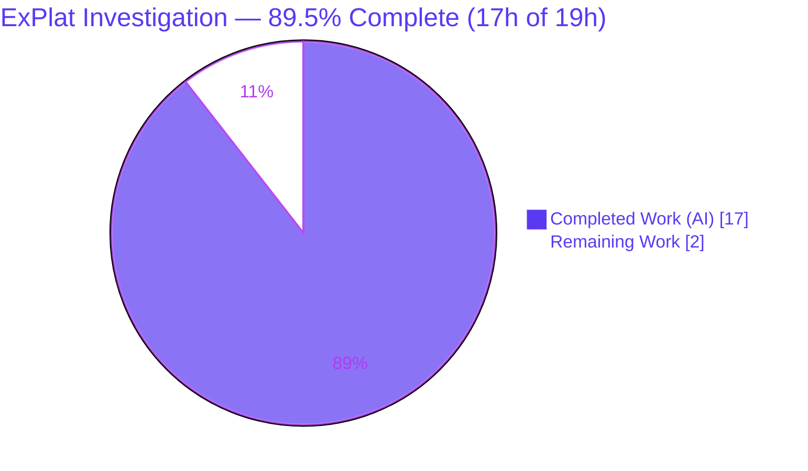

# Blitzy Project Guide — ExPlat Client Behavioral Investigation

> **Deliverable:** `blitzy/documentation/wp-calypso_be7e5cc64162.md`
> **Repository:** wp-calypso monorepo · **Baseline HEAD:** `be7e5cc641622d153040491fd5625c6cb83e12eb` · **Branch:** `blitzy-d95d8264-2dea-42ac-a192-de4c9c530734` @ `7ccd76f1e3`
> **Task type:** Read-only, evidence-driven Documentation (SWE-AtlasQnA)

---

## 1. Executive Summary

### 1.1 Project Overview

This project answers a repository-onboarding request against the `@automattic/explat-client` v0.1.0 experiment-assignment client in the wp-calypso monorepo. The objective was to confirm the client's package tests pass and then produce **one** comprehensive, evidence-backed answer document resolving five behavioral questions (never-throws guarantee, server-unavailable/timeout behavior, concurrent-request de-duplication, caching/TTL, and synchronous-getter-before-load). Every answer was produced **run-first** — building and executing the real code paths via the public `createExPlatClient` API with an injected configuration, capturing actual output, and only then writing prose. It is a strict read-only task: the single markdown deliverable is the only retained artifact; no product code changed.

### 1.2 Completion Status



| Metric | Hours |
|--------|-------|
| **Total Hours** | **19** |
| **Completed Hours (AI + Manual)** | **17** (AI: 17 · Manual: 0) |
| **Remaining Hours** | **2** |
| **Percent Complete** | **89.5%** (17 / 19) |

> Completion is computed on an **AAP-scoped hours basis** (PA1): all 10 AAP deliverables are complete (17h); the 2h remaining is standard path-to-production for a documentation deliverable (human review + merge). Colors: Completed = Dark Blue `#5B39F3`, Remaining = White `#FFFFFF`.

### 1.3 Key Accomplishments

- ✅ **Precondition met:** the `@automattic/explat-client` Jest suite is green — **9 suites / 81 tests / 23 snapshots** (independently re-run this session, exit 0).
- ✅ **All five questions answered from observed runtime behavior** through the real public `createExPlatClient` API using dependency injection — the live wpcom network was never called.
- ✅ **Q1 never-throws** confirmed for success/failure/invalid/timeout; the single genuine throw (`"Running outside of a browser context."`) isolated and explained.
- ✅ **Q2 fallback shape** captured (`{ variationName: null, ttl: 60, isFallbackExperimentAssignment: true }`, logged-not-thrown) and the **5000/10000 ms timeout distribution** reproduced at scale (N=60 × 3 runs).
- ✅ **Q3 single-network-call** guarantee verified at **N=100** concurrent callers for both success and failure.
- ✅ **Q4 cache-hit within TTL** (0 extra calls over 100 reloads) and **exactly-one refetch after a real 61-second expiry**, including the `minimumTtl` floor (server `ttl:1` → 60).
- ✅ **Q5 graceful degradation** of the synchronous getter (null-variation fallback, dev-logs vs prod-silent); the stale docstring **reported, not fixed**.
- ✅ **Read-only integrity preserved:** exactly one file added (325 insertions), clean working tree, all temporary observation scripts deleted.
- ✅ **Every claim carries an exact command, unedited captured output, and a `path:line` citation** — 100% of spot-checked citations verified accurate against source at HEAD.

### 1.4 Critical Unresolved Issues

| Issue | Impact | Owner | ETA |
|-------|--------|-------|-----|
| None | No critical or blocking issues. Tests are green, read-only integrity is intact, and every documented claim is backed by captured runtime output and a verified citation. | — | — |

### 1.5 Access Issues

| System/Resource | Type of Access | Issue Description | Resolution Status | Owner |
|-----------------|----------------|-------------------|-------------------|-------|
| — | — | **No access issues identified.** The repository, toolchain (Yarn 4.0.2, Node ≥ 22.9.0), and Jest suite are fully accessible; the investigation used dependency injection and required no service credentials or third-party API access (the live wpcom endpoint was never called). | N/A | — |

### 1.6 Recommended Next Steps

1. **[Medium]** Perform a human technical review of `blitzy/documentation/wp-calypso_be7e5cc64162.md` — confirm each of the five verbatim questions plus the precondition is answered with command + unedited output + citation; optionally re-run the listed commands to independently reproduce Q1–Q5 before relying on the findings for feature integration. *(~1.5h)*
2. **[Medium]** Approve and merge the PR to trunk after confirming `git diff` shows exactly the one added file (read-only integrity). *(~0.5h)*
3. **[Low · out of scope]** Optionally open a **separate** ticket to correct the stale docstring on `dangerouslyGetExperimentAssignment` (`packages/explat-client/src/create-explat-client.ts:L32`) that the document reports. This is explicitly out of scope for this read-only task and carries no hours here.

---

## 2. Project Hours Breakdown

### 2.1 Completed Work Detail

| Component | Hours | Description |
|-----------|-------|-------------|
| A1 — Environment setup & workspace install | 0.5 | `corepack enable`, `yarn install` under Yarn 4.0.2 / Node ≥ 22.9.0; verified lockfile clean. |
| A2 — Precondition: package test suite (green) | 0.5 | Ran `yarn workspace @automattic/explat-client test`; captured full unedited output (9 suites / 81 tests / 23 snapshots). |
| A3 — Q1 answer: never-throws guarantee | 2.0 | Observed `loadExperimentAssignment` resolving for success/failure/invalid/timeout; isolated the one construction-time throw; wrote answer with citations. |
| A4 — Q2 answer: unavailable/slow + timeout distribution | 3.0 | Observed reject + real-timer timeout; captured fallback shape and logged error; reproduced the 5000/10000 ms distribution at N=60 across 3 runs. |
| A5 — Q3 answer: concurrency call-count | 2.0 | Fired N=100 simultaneous callers; observed exactly one network call for success AND failure; confirmed byte-identical across 2 runs. |
| A6 — Q4 answer: caching / TTL | 2.5 | Observed within-TTL cache hits (0 extra calls over 100 reloads) and a real 61-second expiry → one refetch; documented the `minimumTtl` floor. |
| A7 — Q5 answer: sync-getter before/during load | 2.0 | Observed dev/prod × before/during behavior (null-variation fallback, never throws); captured the `null`-returning sibling getter contrast. |
| A8 — Document assembly | 2.0 | Methodology section, 1:1 question sections, 18-row coverage checklist, Node-version discrepancy note, scope statement. |
| A9 — Citation accuracy + captured output | 1.5 | ~50 `path:line` citations plus command + raw output for every claim; verified against source at HEAD. |
| A10 — Read-only integrity, cleanup, commit | 1.0 | Deleted all temporary observation specs; verified clean tree; Prettier-formatted; committed. |
| **Total** | **17.0** | **Matches Completed Hours in Section 1.2.** |

### 2.2 Remaining Work Detail

| Category | Hours | Priority |
|----------|-------|----------|
| Human technical review of the answer document (verify accuracy/completeness; optionally reproduce Q1–Q5) | 1.5 | Medium |
| Approve & merge PR to trunk (confirm read-only integrity, squash-merge) | 0.5 | Medium |
| **Total** | **2.0** | **Matches Remaining Hours in Section 1.2 and Section 7 pie chart.** |

> **Cross-check:** Section 2.1 (17.0h) + Section 2.2 (2.0h) = **19.0h** = Total Project Hours in Section 1.2. ✔

### 2.3 Notes on Estimation Methodology

Estimates follow PA2: hours are assigned per discrete AAP deliverable and per path-to-production activity, then summed. Because this is a read-only documentation task, there is **no** deployment, CI/CD, environment-configuration, or runtime-service work — path-to-production consists solely of human review and merge. Confidence is High for all items except A4 and A6 (Medium), which involved real-timer observation at scale (a randomized timeout distribution and a real 61-second cache-expiry wait).

---

## 3. Test Results

All tests below originate from **Blitzy's autonomous validation logs** — re-executed independently in this session.

| Test Category | Framework | Total Tests | Passed | Failed | Coverage % | Notes |
|---------------|-----------|-------------|--------|--------|------------|-------|
| ExPlat client — unit + behavioral | Jest 29.7.0 | 81 | 81 | 0 | Not collected¹ | **The precondition gate.** 9 suites, 23 snapshots. Run: `CI=1 yarn workspace @automattic/explat-client test` → exit 0, ~2.4 s. Suites map 1:1 to `requests`, `validations`, `experiment-assignment-store`, `timing`, `experiment-assignments`, `local-storage` (internal) + `index`, `create-ssr-safe-dummy-explat-client`, `create-explat-client` (behavioral). |
| React helpers — consumption context (Q5) | Jest 29.7.0 + @testing-library/react | 5 | 5 | 0 | Not collected¹ | Optional per AAP. `CI=1 yarn workspace @automattic/explat-client-react-helpers test` → exit 0. Exercises the `useExperiment` async-load + sync-get pattern relevant to Q5. |
| **Total** | — | **86** | **86** | **0** | — | 100% pass across both suites. |

¹ *Coverage instrumentation was not part of the AAP scope. The precondition requirement is "package tests passing," which is satisfied (9/81/23). No coverage percentage is invented.*

**Observed console noise (benign, does not affect results):** the Browserslist "caniuse-lite is 17 months old" notice (emitted once per worker) and Jest's "A worker process has failed to exit gracefully…" message (active timers in the timing tests). Both are shown verbatim in the deliverable's Section 1 and neither affects the pass result.

---

## 4. Runtime Validation & UI Verification

This is a **headless library investigation** — the subject package has no UI surface. "Runtime validation" here means the behavioral code paths were driven at runtime through the real public API and their actual output captured.

**Runtime behavior (all driven via `createExPlatClient` + injected `Config`; live network never called):**

- ✅ **Operational** — Package test suite: 9 suites / 81 tests / 23 snapshots pass (exit 0).
- ✅ **Operational** — Q1 never-throws: `loadExperimentAssignment` resolves for success / network-failure / invalid-name / timeout; observed `Q1_FAILURE_THREW false`.
- ✅ **Operational** — Q1 single genuine throw: construction outside a browser context throws `"Running outside of a browser context."` (captured as `Q1_THROW`).
- ✅ **Operational** — Q2 unavailable/slow: fallback `{ variationName: null, ttl: 60, isFallbackExperimentAssignment: true }`; error logged with source `loadExperimentAssignment-initialError`; 5000/10000 ms timeout distribution reproduced across 3 runs.
- ✅ **Operational** — Q3 concurrency: `Q3_SUCCESS N=100 fetchCount=1`; `Q3_FAILURE N=100 fetchCount=1` — exactly one network call, stable across 2 runs.
- ✅ **Operational** — Q4 caching/TTL: `Q4_WITHIN_TTL afterFirstLoad=1 after_100_more_reloads=1`; `Q4_AFTER_TTL … countAfterExpiry=2` after a real 61 s wait; server `ttl:1` floored to 60.
- ✅ **Operational** — Q5 sync-getter: graceful null-variation fallback before/during load; dev logs (`dangerouslyGetExperimentAssignment-error`), prod silent; `dangerouslyGetMaybeLoadedExperimentAssignment` returns literal `null`.

**UI verification:** ⚠ **Not applicable** — there is no rendered UI component in scope. The React helpers package was exercised only in the Node Jest environment as Q5 consumption context.

**API integration:** ✅ **By design, the live wpcom API was intentionally not called.** Dependency injection replaced `fetchExperimentAssignment` throughout, which is the client's canonical extension point (mirroring how Calypso wires the client). There is therefore no external-service dependency or network side effect.

---

## 5. Compliance & Quality Review

Cross-mapping the governing AAP rules (§0.7 / §0.8) to observed status:

| Benchmark / Rule | Status | Progress | Notes |
|------------------|--------|----------|-------|
| Read-only source — no tracked file modified or deleted | ✅ Pass | 100% | `git diff baseline..HEAD` = 1 file added only. |
| Single retained deliverable at the correct path/name | ✅ Pass | 100% | `blitzy/documentation/wp-calypso_be7e5cc64162.md` (named after source branch). |
| Run-first methodology — output captured before prose | ✅ Pass | 100% | Every answer includes the exact command and unedited captured output. |
| Exercise real public API via DI (no private internals) | ✅ Pass | 100% | All observations drive `createExPlatClient` with an injected `Config`. |
| No live network call | ✅ Pass | 100% | Injected `fetchExperimentAssignment`; wpcom endpoint never invoked. |
| Observe magnitude/timing at scale, stable across ≥2 runs | ✅ Pass | 100% | N=100 concurrency, N=60 timeout distribution, real 61 s expiry. |
| Reproduce 5000/10000 ms variability (not engineered away) | ✅ Pass | 100% | Distribution reported across 3 runs; both branches every run. |
| Coverage pass — every question + named item answered | ✅ Pass | 100% | 5 verbatim questions + 18-row coverage checklist. |
| `path:line` citation + captured output per claim | ✅ Pass | 100% | ~50 citations; 100% of spot-checks verified accurate. |
| Stale docstring reported, not fixed | ✅ Pass | 100% | Reported in the deliverable's Q5 section per read-only rule. |
| Temporary observation scripts deleted | ✅ Pass | 100% | No `zz-obs*` files; clean working tree. |
| Repo Prettier convention on the deliverable | ✅ Pass | 100% | `prettier --check` passes (evidence-preserving `--write` applied). |
| Precondition tests green | ✅ Pass | 100% | 9 suites / 81 tests / 23 snapshots. |

**Fixes applied during autonomous validation:** code-review findings addressed (commit `b77474d371`); Prettier formatting applied to the deliverable (commit `7ccd76f1e3`, code-fence content byte-identical, only prose/table cosmetics changed). **Outstanding compliance items:** none.

---

## 6. Risk Assessment

| Risk | Category | Severity | Probability | Mitigation | Status |
|------|----------|----------|-------------|------------|--------|
| Exact timeout tally numbers are not bit-reproducible (governed by `Math.random() > 0.5`) | Technical | Low | Medium | Document reports a **distribution** across ≥2 runs (both 5000 ms and 10000 ms branches appear every run, ~50/50), never a single fixed value; the *behavior* was reproduced independently. | Mitigated |
| Citation line numbers could drift if `explat-client` source later changes | Technical | Low | Low | All citations are pinned to HEAD `be7e5cc641`; findings scoped to v0.1.0; every claim is independently re-verifiable via the listed commands. | Mitigated |
| Node-version setup-instruction discrepancy (docs mention 20.x; repo pins ≥ 22.9.0) | Operational | Low | Low | Documented in the deliverable's Section 7; repo-canonical Node v22.23.1 used; Yarn `engines` gate enforces ≥ 22.9.0. | Mitigated |
| Behavioral findings are valid only for `@automattic/explat-client` v0.1.0 at HEAD | Technical | Low | Low | Scope explicitly stated in the deliverable; re-observe if the package is upgraded. | Accepted |
| Human review required before production reliance on the answers | Process / Operational | Low | High | Every claim carries an exact command + unedited output + `path:line` citation enabling independent re-verification in ~1.5h. | Open (path-to-production) |
| Security exposure from shipped changes | Security | None | N/A | Zero product code shipped; live wpcom network never called (DI only); no credentials, secrets, or attack surface introduced. | No risk |
| Operational / runtime failure | Operational | None | N/A | No runtime service, deployment, or monitoring change; the deliverable is a markdown document. | No risk |
| Integration failure with wpcom or external services | Integration | None | N/A | Dependency injection used throughout; live endpoint never invoked; no API keys or webhooks. | No risk |

**Risk profile:** Exceptionally low. As a read-only documentation deliverable that shipped zero product code with the live network never called, there are **no** security, operational, or integration risks. The remaining technical/process items are Low severity and either mitigated or accepted, alongside the standard human-review-before-production gate.

---

## 7. Visual Project Status


> **Integrity check:** "Remaining Work" = **2h**, identical to Section 1.2 Remaining Hours and the sum of the Section 2.2 "Hours" column. "Completed Work" = **17h** = Section 2.1 total. Colors: Completed = Dark Blue `#5B39F3`, Remaining = White `#FFFFFF`.

**Remaining work by priority (Section 2.2 breakdown):**

| Priority | Hours | Share of Remaining |
|----------|-------|--------------------|
| Medium (human review 1.5h + merge 0.5h) | 2.0 | 100% |
| High (blocking) | 0.0 | 0% |
| Low | 0.0 | 0% |

**Completed work distribution (Section 2.1, for reference):** the five question-answers (A3–A7) account for **11.5h** of the 17h completed; environment + precondition (A1–A2) 1.0h; document assembly, citations, and cleanup (A8–A10) 4.5h.

---

## 8. Summary & Recommendations

**Achievements.** The project is **89.5% complete** (17h of 19h) on an AAP-scoped basis. Every AAP deliverable is finished: the precondition test suite is green (9/81/23), and all five behavioral questions are answered from observed runtime behavior with exact commands, unedited output, and verified `path:line` citations. The single required artifact — `blitzy/documentation/wp-calypso_be7e5cc64162.md` — exists at the correct location, and the hard read-only constraint is fully satisfied (one file added, clean tree, all temporary scripts removed).

**Remaining gaps & critical path to production.** The remaining ~2 hours are entirely standard path-to-production for a documentation deliverable: (1) a human technical review of the answers (~1.5h) and (2) PR approval and merge (~0.5h). There is no code to deploy, no environment to configure, and no runtime service to operate.

**Success metrics.** Precondition green ✔ · all five verbatim questions answered ✔ · every magnitude/timing claim observed at scale and stable across ≥2 runs ✔ · run-to-run timeout variability reproduced as a distribution ✔ · 100% citation accuracy on spot-checks ✔ · read-only integrity preserved ✔.

**Production readiness assessment.** **Ready for human review and merge.** The deliverable is accurate, complete, internally consistent, and independently reproducible. No blockers exist. Confidence is High. The only advisory is that the behavioral findings pertain to `@automattic/explat-client` v0.1.0 at HEAD `be7e5cc641` and should be re-observed if the package is later upgraded.

---

## 9. Development Guide

All commands below were **executed and verified** in this session. Run from the repository root unless noted.

### 9.1 System Prerequisites

- **Node.js** ≥ 22.9.0 (repo-pinned via `.nvmrc` = `22.9.0` and `engines.node` = `^v22.9.0`). Observed working version: **v22.23.1**. *Node 20.x will fail the `engines` gate.*
- **Yarn** 4.0.2 (repo-pinned via `packageManager`; activated by Corepack).
- **Git** (with the branch checked out).
- Disk: the wp-calypso monorepo `node_modules` is multi-gigabyte; ensure adequate space.
- **No environment variables are required** — the client uses dependency injection and the live network is never contacted.

### 9.2 Environment Setup

```bash
# Activate the repo-pinned Yarn (4.0.2) via Corepack
corepack enable

# Confirm the toolchain
node --version   # => v22.9.0 or newer (observed: v22.23.1)
yarn --version   # => 4.0.2
```

### 9.3 Dependency Installation

```bash
# From the repository root — installs the workspace; --immutable verifies the lockfile
CI=1 yarn install --immutable
```

Expected: completes without lockfile changes (observed: `Done in ~6s`). Tests run against untranspiled TypeScript via the `calypso:src` resolver, so **no build step is required**.

### 9.4 Run the Precondition Test Suite

```bash
# The package test suite (the precondition) — CI=1 disables watch mode
CI=1 yarn workspace @automattic/explat-client test
```

Expected tail:

```text
Test Suites: 9 passed, 9 total
Tests:       81 passed, 81 total
Snapshots:   23 passed, 23 total
Ran all test suites.
```

Optional (Q5 consumption context — React binding):

```bash
CI=1 yarn workspace @automattic/explat-client-react-helpers test
# => Test Suites: 1 passed, 1 total | Tests: 5 passed, 5 total
```

### 9.5 Verification Steps

```bash
# Read-only integrity: exactly ONE file should differ from the baseline
git diff be7e5cc641622d153040491fd5625c6cb83e12eb..HEAD --stat
# => blitzy/documentation/wp-calypso_be7e5cc64162.md | 325 +++...
#    1 file changed, 325 insertions(+)

# Working tree must be clean (no stray temp scripts)
git status --porcelain    # (empty output = clean)
```

### 9.6 Example Usage — Reproducing the Observations

The answers were produced with temporary Jest specs (since deleted) placed under `packages/explat-client/src/test/` that drive the **public** factory with an injected configuration — the canonical, non-synthetic path:

```ts
import { createExPlatClient } from '@automattic/explat-client';

// Inject a controlled fetch to simulate success / failure / slowness / concurrency.
const client = createExPlatClient( {
  fetchExperimentAssignment: async ( { experimentName } ) => { /* return / reject / delay */ },
  getAnonId: async () => 'anon',
  logError: ( e ) => { /* capture, do not throw */ },
  isDevelopmentMode: false,
} );

// Q1/Q2/Q3/Q4: drive the async load and observe returned objects, log lines, call counts, timings.
const assignment = await client.loadExperimentAssignment( 'experiment_name_a' );

// Q5: call the synchronous getter before/while the async load is in flight.
const sync = client.dangerouslyGetExperimentAssignment( 'experiment_name_a' );
```

To read the deliverable itself:

```bash
sed -n '1,60p' blitzy/documentation/wp-calypso_be7e5cc64162.md   # methodology + precondition
```

### 9.7 Troubleshooting

- **`This project requires Node ^v22.9.0` / engines error:** you are on the wrong Node line (e.g., 20.x). Use Node ≥ 22.9.0 (`nvm use` honors `.nvmrc` = 22.9.0).
- **`yarn` is not version 4.0.2:** run `corepack enable` first so the pinned `packageManager` activates.
- **`Browserslist: caniuse-lite is 17 months old`:** benign; printed once per Jest worker; does not affect results.
- **`A worker process has failed to exit gracefully … force exited`:** benign; caused by active timers in the timing tests; the suite still reports green.
- **Tests appear to hang:** ensure `CI=1` is set to disable Jest watch mode.

---

## 10. Appendices

### A. Command Reference

| Purpose | Command |
|---------|---------|
| Activate pinned Yarn | `corepack enable` |
| Check toolchain | `node --version` · `yarn --version` |
| Install workspace | `CI=1 yarn install --immutable` |
| Run precondition suite | `CI=1 yarn workspace @automattic/explat-client test` |
| Run React-helpers suite (optional) | `CI=1 yarn workspace @automattic/explat-client-react-helpers test` |
| Read-only diff check | `git diff be7e5cc641622d153040491fd5625c6cb83e12eb..HEAD --stat` |
| Clean-tree check | `git status --porcelain` |
| View deliverable | `sed -n '1,120p' blitzy/documentation/wp-calypso_be7e5cc64162.md` |

### B. Port Reference

**Not applicable** — this is a headless library investigation. No server is started and no ports are used (the live wpcom network is never contacted).

### C. Key File Locations

| Path | Role |
|------|------|
| `blitzy/documentation/wp-calypso_be7e5cc64162.md` | **The deliverable** (only retained new file). |
| `packages/explat-client/src/create-explat-client.ts` | Client factory: never-throws catch, browser guard, timeout A/B, dedup wrapper, load flow, sync getters. |
| `packages/explat-client/src/index.ts` | Public entry — SSR-vs-browser switch. |
| `packages/explat-client/src/internal/timing.ts` | `asyncOneAtATime` dedup, `timeoutPromise`, `monotonicNow`. |
| `packages/explat-client/src/internal/experiment-assignments.ts` | `isAlive` TTL gate, `minimumTtl`, `createFallbackExperimentAssignment`. |
| `packages/explat-client/src/internal/requests.ts` | Fetch orchestration + TTL floor. |
| `packages/explat-client/src/internal/experiment-assignment-store.ts` | LocalStorage cache + race guard. |
| `packages/explat-client/README.md` · `CHANGELOG.md` | Behavior contract; sync-getter "now logs and won't throw" history. |
| `packages/explat-client-react-helpers/src/index.tsx` | `useExperiment` — Q5 consumption context. |
| `client/lib/explat/index.ts` | Real Calypso wiring via `createExPlatClient({...})` (reference only). |

### D. Technology Versions

| Component | Version | Source |
|-----------|---------|--------|
| `@automattic/explat-client` | 0.1.0 | `packages/explat-client/package.json` |
| Node.js | ≥ v22.9.0 (observed v22.23.1) | `.nvmrc` = 22.9.0 · `engines.node` = `^v22.9.0` |
| Yarn | 4.0.2 | `packageManager` |
| Jest | 29.7.0 | package devDependencies |
| TypeScript | ^5.8.2 | package devDependencies (source used directly via `calypso:src`) |
| tslib | ^2.3.0 | the client's only runtime dependency |
| @testing-library/react | ^16.2.0 | React-helpers test dependency |

### E. Environment Variable Reference

**None required.** The client is configured entirely through the injected `Config` object (`fetchExperimentAssignment`, `getAnonId`, `logError`, `isDevelopmentMode`). The only shell variable used during testing is `CI=1`, which disables Jest watch mode.

### F. Developer Tools Guide

- **Package manager:** Yarn 4.0.2 (Berry) with `nodeLinker: node-modules`, activated by Corepack.
- **Test runner:** Jest 29.7.0 via the shared preset `test/packages/jest-preset.js` → `@automattic/calypso-jest`; `testEnvironment: 'node'`. A custom resolver maps `calypso:src` so tests run against untranspiled TypeScript (no build step).
- **Mocking convention:** dependency injection — the client's `Config` is the intended extension point, which is exactly how observations were driven without touching the network.
- **Formatting:** Prettier governs the repository; the deliverable passes `prettier --check`.

### G. Glossary

| Term | Meaning |
|------|---------|
| **ExPlat** | Automattic's Experimentation Platform; `@automattic/explat-client` consumes its assignment API. |
| **ExperimentAssignment** | The object returned for an experiment: `{ experimentName, variationName, retrievedTimestamp, ttl, isFallbackExperimentAssignment? }`. |
| **Fallback assignment** | A safe default `{ variationName: null, ttl: 60, isFallbackExperimentAssignment: true }` returned on failure; `variationName: null` = default/control experience. |
| **`asyncOneAtATime`** | Promise-sharing primitive that ensures concurrent callers for the same experiment share a single in-flight fetch (→ one network call). |
| **`isAlive` / TTL** | Cache-freshness gate: a stored assignment is reused while `monotonicNow() < ttl*1000 + retrievedTimestamp`. |
| **`minimumTtl`** | 60-second floor applied to the server-returned TTL (caps request rate per experiment). |
| **DI (dependency injection)** | Supplying `fetchExperimentAssignment` (and friends) via `Config` so the real client runs against controlled inputs — the canonical observation path. |
| **AAP** | Agent Action Plan — the governing task specification. |
| **Precondition** | The requirement that the package Jest suite passes (9 suites / 81 tests / 23 snapshots) before answering the questions. |

---

*Completion basis (PA1): 17 completed hours ÷ 19 total hours = **89.5%**. All figures are consistent across Sections 1.2, 2.1, 2.2, and 7. Brand colors applied: Completed = `#5B39F3`, Remaining = `#FFFFFF`.*