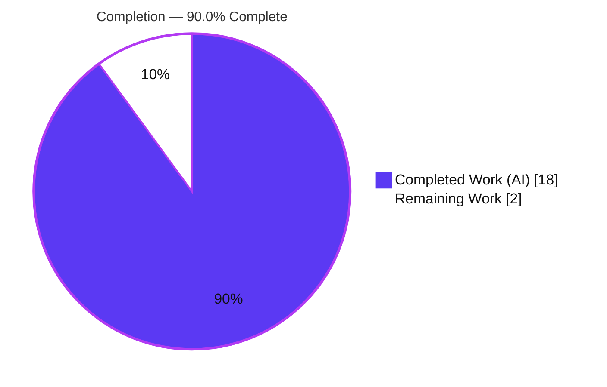
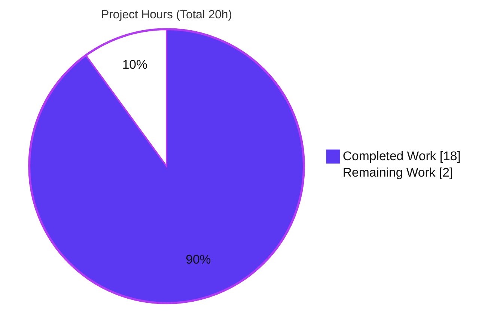
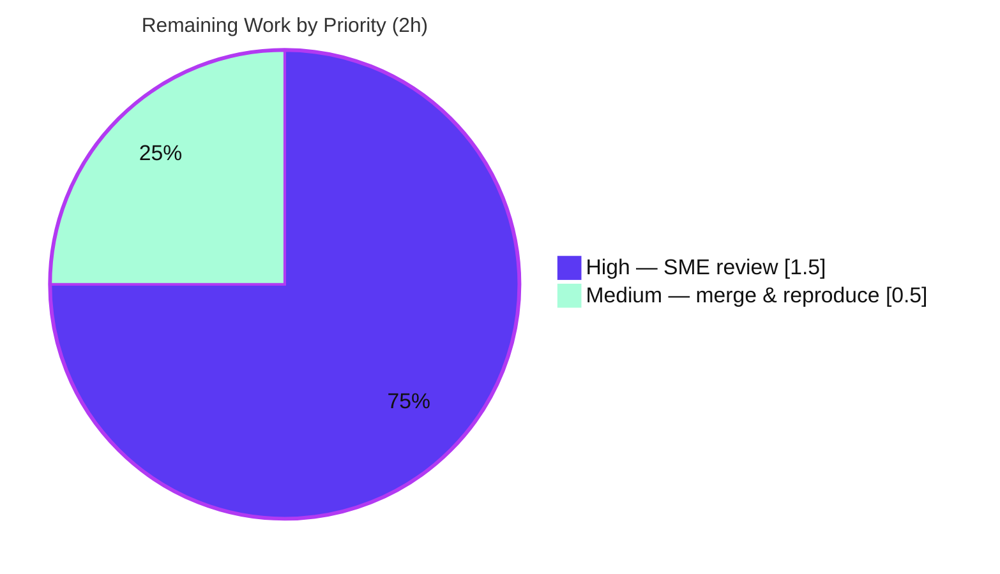

# Blitzy Project Guide — ExPlat Client Behavioral Q&A Documentation

> **Project:** Code-grounded behavioral reference for `@automattic/explat-client`
> **Repository:** `Automattic/wp-calypso` · **Branch:** `blitzy-86b6541e-bd86-49c9-af4b-20bd42f39086`
> **Base:** `be7e5cc641622d153040491fd5625c6cb83e12eb` · **HEAD:** `a476a67f4660c38cfccb7c26a033a41dadaa3878`
> **Brand legend:** <span style="color:#5B39F3">**Completed / AI Work = Dark Blue `#5B39F3`**</span> · Remaining / Not Completed = White `#FFFFFF`

---

## 1. Executive Summary

### 1.1 Project Overview

This project delivers a single, authoritative, code-grounded markdown document that answers five specific behavioral questions about the `@automattic/explat-client` (the ExPlat experiment-assignment client at `packages/explat-client`). The target audience is an engineer onboarding to the `wp-calypso` monorepo who must understand how the client behaves under failure, slow responses, concurrency, caching/TTL, and synchronous misuse before integrating it into a feature. The technical scope is read-only source analysis plus execution of the package's existing Jest suite — no production code is authored or altered. Business impact: it de-risks an integration decision by replacing assumptions with verified, citation-backed behavior.

### 1.2 Completion Status



| Metric | Hours |
|--------|-------|
| **Total Hours** | **20** |
| Completed Hours (AI + Manual) | 18 (AI: 18 · Manual: 0) |
| Remaining Hours | 2 |
| **Percent Complete** | **90.0%** |

> Completion is computed using AAP-scoped methodology: `Completed ÷ (Completed + Remaining) = 18 ÷ 20 = 90.0%`. The work universe is the AAP-specified deliverable plus standard path-to-production activities (human review and merge). All 11 AAP-specified requirements are complete; the remaining 2 hours are path-to-production only.

### 1.3 Key Accomplishments

- ✅ **Sole AAP deliverable created and committed:** `blitzy/documentation/wp-calypso_be7e5cc64162.md` (340 lines), named after the source branch and placed under `blitzy/documentation/` per project rule "SWE-AtlasQnA-Repo".
- ✅ **Test prerequisite verified (Q1):** `cd packages/explat-client && yarn jest` → **9 suites, 81 tests, 23 snapshots — all passing**, exit 0 (re-confirmed independently during this assessment).
- ✅ **All five questions answered verbatim** as section headings, each with explicit "How it works / thinking" rationale and inline `[<path>:<locator>]` citations (66 citations total).
- ✅ **Failure / never-throws (Q2):** documented the `try/catch` recovery ladder (stale → fallback → last-resort fallback), the SSR boundary nuance, the response shape (`variationName: null`, `isFallbackExperimentAssignment: true`), and the `null = default/control` contract.
- ✅ **Concurrency (Q3):** documented single-flight via `asyncOneAtATime` + per-experiment map → exactly **one** network call for N concurrent same-experiment loads.
- ✅ **Caching/TTL (Q4):** documented the `isAlive` short-circuit, monotonic clock, and 60-second minimum TTL.
- ✅ **Async-vs-sync (Q5):** documented graceful degradation of both synchronous getters (`dangerouslyGetExperimentAssignment` → control; `dangerouslyGetMaybeLoadedExperimentAssignment` → `null`).
- ✅ **Zero source/config/lockfile modifications** — git diff is exactly one added markdown file; constraint fully honored; temporary observation scripts cleaned up.
- ✅ **Runtime-validated** behaviors (build `dist/`, observe Q2–Q5) and a complete "Evidence from the test suite" mapping linking each behavior to exact suites and test names.

### 1.4 Critical Unresolved Issues

| Issue | Impact | Owner | ETA |
|-------|--------|-------|-----|
| _None_ — no compilation errors, no failing tests, no missing AAP functionality | None — the deliverable is complete, accurate, and committed | — | — |

> There are no critical unresolved issues. The build is clean (`tsc --build` strict, exit 0), the full suite passes (81/81), and all 11 AAP-specified requirements are complete. The only remaining work is path-to-production human review and merge (Section 2.2).

### 1.5 Access Issues

| System/Resource | Type of Access | Issue Description | Resolution Status | Owner |
|-----------------|----------------|-------------------|-------------------|-------|
| _N/A_ | — | No access issues identified | Resolved | — |

> **No access issues identified.** The repository was cloned, the branch checked out, dependencies installed (root `node_modules` ≈ 3.1 GB), the test suite executed, and the deliverable committed. As a read-only documentation task, it requires no external service credentials, API keys, or third-party access.

### 1.6 Recommended Next Steps

1. **[High]** Perform SME technical review of `blitzy/documentation/wp-calypso_be7e5cc64162.md`: read the five answers and spot-check a representative sample of the 66 citations against pinned HEAD `be7e5cc641…`. (≈1.5h)
2. **[Medium]** Approve and merge the documentation PR into the target branch. (part of ≈0.5h)
3. **[Medium]** Optionally reproduce the green baseline independently: `cd packages/explat-client && yarn jest` (expect 9/81/23, exit 0). (part of ≈0.5h)
4. **[Low]** Add a calendar reminder to re-validate the document if `@automattic/explat-client` is upgraded beyond `0.1.0` (the analysis is pinned to the current HEAD).

---

## 2. Project Hours Breakdown

### 2.1 Completed Work Detail

| Component | Hours | Description |
|-----------|-------|-------------|
| Test Execution & Q1 Prerequisite Verification | 2 | Provision Node 22 / Yarn 4 via corepack, install workspaces, run the package suite, and discover + document the root-vs-package invocation pitfall (maps to AAP Q1). |
| Read-Only Source-Code Analysis | 6 | Trace 10 `explat-client` modules + the `react-helpers` consumer across all five behaviors (try/catch ladder, timeout + A/B, single-flight, isAlive/TTL, both getters, SSR swap); cross-check README/CHANGELOG vs. implementation (maps to AAP Q2–Q5 + methodology). |
| Runtime Behavioral Verification | 3 | Build `dist/{esm,cjs,types}` and observe Q2–Q5 at runtime (4 concurrent → 1 fetch; repeat-within-TTL → 1 fetch; failure → no-throw fallback; sync getter before load → graceful); clean up all temporary scripts. |
| Documentation Authoring | 5 | Author the 340-line deliverable: 5 verbatim question sections + introduction, reproduction guide, response-shape, evidence mapping, and verdict; include a mermaid recovery-ladder diagram and 66 inline `[path:locator]` citations. |
| Validation & Correction Pass | 2 | Q2 failure-handling/never-throw correction commit (`a476a67f46`) and a citation-by-citation cross-check of every line number/constant/type shape against source (zero corrections required at final). |
| **Total Completed** | **18** | |

### 2.2 Remaining Work Detail

| Category | Hours | Priority |
|----------|-------|----------|
| SME Technical Review of the Q&A Document (read deliverable; spot-check citations vs. pinned HEAD; confirm verdict nuances acceptable for the integration decision) | 1.5 | High |
| PR Merge + Optional Independent Reproduction of the Green Test Baseline (9/81/23) | 0.5 | Medium |
| **Total Remaining** | **2** | |

### 2.3 Hours Reconciliation

| Quantity | Hours |
|----------|-------|
| Section 2.1 — Completed total | 18 |
| Section 2.2 — Remaining total | 2 |
| **Sum (= Total Project Hours in §1.2)** | **20** |
| Completion % = 18 ÷ 20 | **90.0%** |

> **Cross-section integrity:** Remaining = **2h** is identical in §1.2, §2.2, and §7. Completed (18h) + Remaining (2h) = Total (20h). ✔

---

## 3. Test Results

All tests below originate from Blitzy's autonomous validation of this project — the existing `@automattic/explat-client` Jest suite, executed from inside the package (`cd packages/explat-client && yarn jest`) and independently re-confirmed during this assessment.

| Test Category | Framework | Total Tests | Passed | Failed | Coverage % | Notes |
|---------------|-----------|-------------|--------|--------|------------|-------|
| Unit — internal modules (`src/internal/test/`) | Jest 29.7.0 | 57 | 57 | 0 | N/A (not collected) | 6 suites: `timing` (10), `requests` (15), `experiment-assignment-store` (13), `validations` (8), `local-storage` (6), `experiment-assignments` (5) |
| Behavioral / Integration — client factory & entrypoint (`src/test/`) | Jest 29.7.0 | 24 | 24 | 0 | N/A (not collected) | 3 suites: `create-explat-client` (20), `create-ssr-safe-dummy-explat-client` (2), `index` (2) |
| **Total** | **Jest 29.7.0** | **81** | **81** | **0** | **N/A** | **9 suites · 23 snapshots · exit 0** |

**Notes:**
- The suite must be run **from inside the package**; running `yarn jest packages/explat-client` from the repository root matches **0 tests** ("No tests found, exiting with code 1") because the root `testMatch` targets `__tests__/` and `*.(spec|test)` files, whereas this package keeps tests under `src/test/` and `src/internal/test/`.
- A benign `"A worker process has failed to exit gracefully…"` message appears at the end of the run (timer teardown); the authoritative result is **exit 0** with 81/81 passing.
- Coverage was not collected: the suite was run as a pass/fail prerequisite verification (per AAP Q1), not with `--coverage`. No coverage threshold is configured by the package, and the AAP does not request coverage measurement.

---

## 4. Runtime Validation & UI Verification

This is a read-only documentation task with **no UI surface**; "runtime validation" refers to the behavioral observations that back the document's claims. All observations were performed against the package's built `dist/` output.

- ✅ **Build** — `cd packages/explat-client && yarn build` (`tsc --build`, strict) → **exit 0**; emits `dist/{esm,cjs,types}` (20 files each). **Operational.**
- ✅ **Test suite** — 9 suites / 81 tests / 23 snapshots passing, exit 0. **Operational.**
- ✅ **Q2 — Failure path** — on simulated fetch failure the client does **not** throw; it returns a fallback `{ variationName: null, isFallbackExperimentAssignment: true, ttl: 60 }`. **Operational.**
- ✅ **Q2 — Timeout/slow** — fetch is raced against a 10000 ms timeout (A/B-shortened to 5000 ms ~50% of the time); on timeout the call resolves to the fallback while the underlying fetch continues in the background. **Operational.**
- ✅ **Q3 — Concurrency** — 4 simultaneous loads of the same experiment produced exactly **one** network fetch (single-flight). **Operational.**
- ✅ **Q4 — Caching/TTL** — a repeat load within TTL produced **no** additional network fetch (served from store). **Operational.**
- ✅ **Q5 — Async vs. sync** — `dangerouslyGetExperimentAssignment` before load returned a fallback (no throw to caller); `dangerouslyGetMaybeLoadedExperimentAssignment` returned `null`. **Operational.**
- ⚠ **SSR dummy edge case** — the SSR-safe dummy calls `config.logError` directly (not via `safeLogError`), so a *throwing* injected logger can propagate server-side. **Partial / documented as a caveat** in the deliverable's verdict; not a defect in scope.
- ❌ _No failing runtime checks._

---

## 5. Compliance & Quality Review

The "deliverables" here are the AAP requirements; the table below maps each to its quality/compliance status.

| Benchmark / Deliverable | Status | Progress | Evidence |
|--------------------------|--------|----------|----------|
| Branch-named doc in `blitzy/documentation/` | ✅ Pass | 100% | `blitzy/documentation/wp-calypso_be7e5cc64162.md` present & committed |
| Q1 — Tests passing & reproducible | ✅ Pass | 100% | 9/81/23 exit 0; root-vs-package pitfall documented & reproduced |
| Q2 — Failure handling & "never throws" | ✅ Pass | 100% | Recovery ladder + SSR nuance + response shape, cited to source |
| Q2 — Slow server / timeout | ✅ Pass | 100% | 10000 ms timeout, A/B 5000 ms, background continuation documented |
| Q3 — Concurrency / dedup | ✅ Pass | 100% | `asyncOneAtATime` + per-experiment map; runtime-verified 4→1 |
| Q4 — Caching / TTL | ✅ Pass | 100% | `isAlive` + monotonic clock + 60s floor; runtime-verified |
| Q5 — Async vs. sync getter | ✅ Pass | 100% | Both getters' graceful degradation documented & verified |
| Evidence-first methodology (citations + rationale) | ✅ Pass | 100% | 66 inline `[path:locator]` citations; "thinking" per answer |
| Verbatim question preservation | ✅ Pass | 100% | All 5 headings match AAP §0.1.1 exactly |
| No source/config/lockfile modification | ✅ Pass | 100% | `git diff` = 1 added markdown file; working tree clean |
| Temp-script cleanup / hygiene | ✅ Pass | 100% | No temp artifacts in repo; `dist/` gitignored |
| SME human review & merge | ⏳ Pending | 0% | Path-to-production; tracked in §2.2 |

**Fixes applied during autonomous validation:** the Q2 failure-handling/never-throw analysis was corrected in commit `a476a67f46` (refining the stale-vs-fallback distinction and the SSR `config.logError` caveat). The final citation-by-citation cross-check required **zero** additional corrections.

---

## 6. Risk Assessment

| Risk | Category | Severity | Probability | Mitigation | Status |
|------|----------|----------|-------------|------------|--------|
| Citation / line-number drift if source files change later | Technical | Low | Low | Document pins to HEAD `be7e5cc641…` and version `0.1.0`; reviewer re-verifies against the pinned commit | Mitigated |
| Benign Jest "worker failed to exit gracefully" warning misread as failure | Technical | Low | Low | Exit code 0 is authoritative; warning is timer-teardown only; called out in §3/§9 | Open (informational) |
| Inline A/B timeout nondeterminism (`Math.random() > 0.5` → 5000 vs 10000 ms) confuses empirical timeout testing | Technical | Low | Low | Document explicitly explains the A/B branch (L134–138) | Mitigated |
| No security exposure | Security | None | — | Read-only markdown; zero code/dependency/lockfile changes; no secrets or runtime surface | N/A |
| Reproducibility requires correct toolchain (Node ^v22.9.0 / Yarn 4.0.2) | Operational | Low | Medium | Reproduction Guide pins versions; `.nvmrc` = `22.9.0`; corepack instructions provided | Mitigated |
| Documentation staleness over time (pinned to client `0.1.0` / HEAD) | Operational | Low | Medium | Version + HEAD pin stated; recommend re-validate on client upgrade | Open (informational) |
| Integrator misreads `null` semantics (control vs. "loading" from maybe-loaded getter) | Integration | Low | Low | Verdict explicitly disambiguates the two `null` meanings | Mitigated |
| Markdown not covered by CI lint (prettier/eslint/stylelint) | Integration | Low | Low | Intentional — markdown is outside enforced lint scope; commits cleanly via pre-commit file-type filter | Accepted |

> **Overall risk posture: VERY LOW.** No High or Critical risks; no security risks; no access issues. The dominant remaining item (SME review) is tracked as remaining work, not a risk.

---

## 7. Visual Project Status

**Project Hours Breakdown** (Completed = Dark Blue `#5B39F3`, Remaining = White `#FFFFFF`):



**Remaining Hours by Priority** (sums to the 2h Remaining in §1.2 / §2.2):



> **Integrity:** the "Remaining Work" value (2) equals the Remaining Hours in §1.2 and the sum of the §2.2 "Hours" column. The "Completed Work" value (18) equals Completed Hours in §1.2 and the §2.1 total.

---

## 8. Summary & Recommendations

**Achievements.** The project is **90.0% complete** (18 of 20 hours). The single AAP-scoped deliverable — a 340-line, code-grounded behavioral Q&A document for `@automattic/explat-client` — has been authored, runtime-validated, citation-checked, and committed. All five user questions are answered verbatim with explicit rationale and 66 inline source citations, and the test prerequisite (9 suites / 81 tests / 23 snapshots, exit 0) was independently re-confirmed. All 11 AAP-specified requirements are complete, with zero modifications to any source, configuration, or lockfile.

**Remaining gaps (path-to-production).** Only 2 hours remain, and none of it is engineering rework: (1) SME technical review of the document (1.5h), and (2) PR merge plus optional independent reproduction of the green baseline (0.5h). There are no compilation errors, no failing tests, and no missing functionality.

**Critical path to production.** SME review → approve → merge. Because the deliverable is documentation (not runtime code), there is no deployment, migration, or infrastructure step.

**Success metrics.**

| Metric | Target | Actual | Status |
|--------|--------|--------|--------|
| AAP-specified requirements complete | 11/11 | 11/11 | ✅ |
| Test suite green | 81/81 | 81/81 | ✅ |
| Build clean (strict) | exit 0 | exit 0 | ✅ |
| Source files modified | 0 | 0 | ✅ |
| Questions answered verbatim | 5/5 | 5/5 | ✅ |
| Inline citations | — | 66 | ✅ |

**Production-readiness assessment.** The deliverable is **production-ready pending human sign-off**. Confidence is **High** — the scope is well-defined, every claim is code-cited, behaviors were runtime-verified, and the result was independently reproduced during this assessment. Recommended action: assign an SME reviewer and merge.

---

## 9. Development Guide

This guide explains how to build, run, and verify the environment that backs the deliverable. Every command was executed successfully in the assessment environment (Linux, Node v22.23.1, Yarn 4.0.2).

### 9.1 System Prerequisites

- **OS:** Linux or macOS (CI uses Linux).
- **Node.js:** `^v22.9.0` (repository `engines.node`; `.nvmrc` pins `22.9.0`; verified on `v22.23.1`).
- **Yarn:** `4.0.2` (repository `packageManager`), provisioned via Corepack.
- **Git:** any recent version.
- **Disk:** ≈ 3.5 GB free (root `node_modules` is ≈ 3.1 GB across 96 workspaces).

### 9.2 Environment Setup

```bash
# Install Node 22.x (one option; nvm/asdf also fine)
curl -fsSL https://deb.nodesource.com/setup_22.x | bash - && apt-get install -y nodejs

# Activate the repo-pinned Yarn via Corepack
corepack enable && corepack prepare yarn@4.0.2 --activate

# Verify toolchain
node -v   # expect v22.x (>= 22.9.0)
yarn -v   # expect 4.0.2
```

### 9.3 Dependency Installation

```bash
# From the repository root — installs all 96 workspaces (yarn.lock is unchanged)
yarn install --immutable
```

### 9.4 Build (optional — only needed to inspect runtime behavior)

```bash
cd packages/explat-client
yarn build      # tsc --build (strict) → exit 0; emits dist/{esm,cjs,types}
```

### 9.5 Run the Test Suite (Q1 prerequisite / verification)

```bash
# CRITICAL: run from INSIDE the package directory
cd packages/explat-client
yarn jest
```

Expected output (abridged):

```text
Test Suites: 9 passed, 9 total
Tests:       81 passed, 81 total
Snapshots:   23 passed, 23 total
```

### 9.6 Verification Steps

- **Build:** exit code `0`; `dist/esm`, `dist/cjs`, and `dist/types` each contain 20 files.
- **Tests:** `9 passed / 9`, `81 passed / 81`, `23 passed / 23`, exit `0`.
- **Deliverable:** `blitzy/documentation/wp-calypso_be7e5cc64162.md` exists (340 lines).
- **Hygiene:** `git status --porcelain` is empty after a build (`dist/` is gitignored).

### 9.7 View the Deliverable

```bash
# From the repository root
less blitzy/documentation/wp-calypso_be7e5cc64162.md
```

### 9.8 Troubleshooting

| Symptom | Cause | Resolution |
|---------|-------|------------|
| `No tests found, exiting with code 1` | You ran Jest from the repository root | `cd packages/explat-client` first, then `yarn jest` |
| `yarn install` / tests fail unexpectedly | Wrong Node major version | Use Node 22 (`nvm use` or reinstall); confirm `node -v` ≥ 22.9.0 |
| `A worker process has failed to exit gracefully…` | Benign timer teardown in Jest | Ignore — exit code `0` and `81 passed` are authoritative |
| `Browserslist: browsers data … is 16 months old` | Stale `caniuse-lite` data | Benign; no action required for this task |
| `The lockfile would have been modified…` | Yarn version mismatch | Use Corepack-pinned `yarn@4.0.2`; do not edit `yarn.lock` |

---

## 10. Appendices

### Appendix A — Command Reference

| Purpose | Command |
|---------|---------|
| Activate Yarn | `corepack enable && corepack prepare yarn@4.0.2 --activate` |
| Install deps | `yarn install --immutable` |
| Build package | `cd packages/explat-client && yarn build` |
| Run tests (correct) | `cd packages/explat-client && yarn jest` |
| Clean build | `cd packages/explat-client && yarn clean` |
| View deliverable | `less blitzy/documentation/wp-calypso_be7e5cc64162.md` |
| Confirm scope | `git diff be7e5cc641622d153040491fd5625c6cb83e12eb..HEAD --name-status` |

### Appendix B — Port Reference

| Port | Service |
|------|---------|
| _None_ | This task starts no server or long-running service; no ports are used. |

### Appendix C — Key File Locations

| Path | Role |
|------|------|
| `blitzy/documentation/wp-calypso_be7e5cc64162.md` | **The deliverable** (created) |
| `packages/explat-client/src/create-explat-client.ts` | Client factory — load/getters, timeout+A/B, single-flight, recovery ladder, SSR throw |
| `packages/explat-client/src/index.ts` | Public entrypoint — browser vs. SSR-safe dummy swap |
| `packages/explat-client/src/types.ts` | `ExperimentAssignment` / `Config` shapes (response shape) |
| `packages/explat-client/src/internal/timing.ts` | `monotonicNow`, `timeoutPromise`, `asyncOneAtATime` |
| `packages/explat-client/src/internal/requests.ts` | Fetch, response validation, TTL floor, anon-id cache |
| `packages/explat-client/src/internal/experiment-assignments.ts` | `isAlive` / TTL, `minimumTtl`, fallback factory |
| `packages/explat-client/src/internal/experiment-assignment-store.ts` | LocalStorage store/retrieve/purge |
| `packages/explat-client-react-helpers/src/index.tsx` | Consumer `useExperiment` (load + maybe-loaded getter) |
| `packages/explat-client/{README.md,CHANGELOG.md}` | Documented contract & version history |

### Appendix D — Technology Versions

| Technology | Version | Source |
|------------|---------|--------|
| Node.js | `^v22.9.0` (verified `v22.23.1`) | root `engines.node`, `.nvmrc` |
| Yarn | `4.0.2` | root `packageManager` |
| Jest | `^29.7.0` | `packages/explat-client/package.json` |
| TypeScript | `^5.8.2` | `packages/explat-client/package.json` |
| `@automattic/explat-client` | `0.1.0` | `packages/explat-client/package.json` |
| `tslib` (runtime dep) | `^2.3.0` | `packages/explat-client/package.json` |

### Appendix E — Environment Variable Reference

| Variable | Required | Notes |
|----------|----------|-------|
| _None_ | — | No environment variables are required to build, test, or read the deliverable. |

### Appendix F — Developer Tools Guide

- **Browser/DevTools:** not applicable — this task has no UI and renders no web page; no browser automation, screenshots, or Lighthouse audits were warranted.
- **Static analysis:** the package builds under `tsc --build` (strict) with exit 0; the markdown deliverable is intentionally outside the repo's prettier/eslint/stylelint scope and commits cleanly via the pre-commit file-type filter.

### Appendix G — Glossary

| Term | Meaning |
|------|---------|
| ExPlat | Automattic's experiment-platform; assigns users to experiment variations |
| `ExperimentAssignment` | The returned object: `{ experimentName, variationName, retrievedTimestamp, ttl, isFallbackExperimentAssignment }` |
| Fallback assignment | A control result with `variationName: null` and `isFallbackExperimentAssignment: true`, returned when retrieval fails and nothing is stored |
| Single-flight | Pattern where concurrent callers for one key share a single in-flight promise (one network call) |
| TTL | Time-to-live; an assignment is "alive" while `monotonicNow() < retrievedTimestamp + ttl·1000` (60s floor) |
| Stale-on-failure | Serving a previously stored assignment when a fresh fetch fails, instead of surfacing an error |
| SSR-safe dummy | The server-side client substituted by the entrypoint when `window` is undefined |

---

*Generated by the Blitzy autonomous project-assessment agent. Completion (90.0%) reflects AAP-scoped and path-to-production work only.*