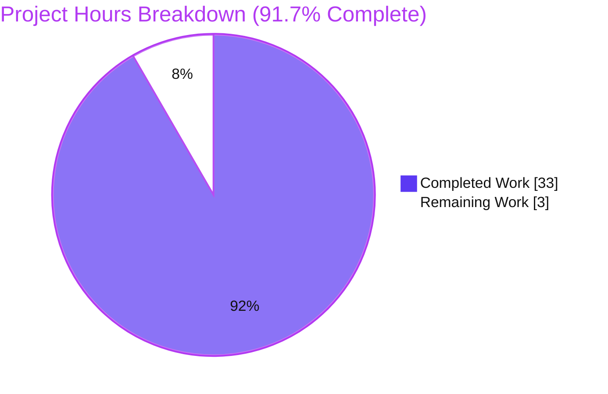
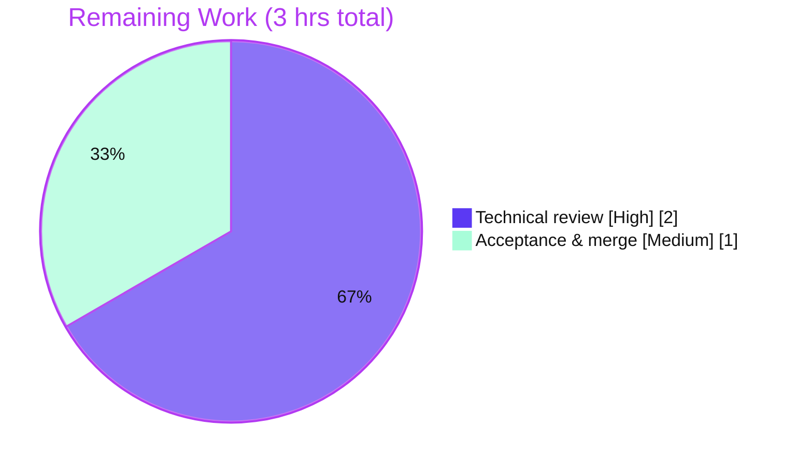

# Blitzy Project Guide

> **Project:** Runtime-observed investigation — why some `wp-calypso` tests pass in isolation yet can fail in the full suite
> **Branch:** `blitzy-30b27a23-6c85-47da-9f81-5acf9717cb20` • **Base:** `be7e5cc641` • **HEAD:** `9abdd543a3`
> **Task type:** Documentation / code-investigation (read-only source tree)

---

## 1. Executive Summary

### 1.1 Project Overview

This project delivers a single, comprehensive Markdown document that explains — entirely from direct runtime observation — why some `wp-calypso` tests pass when run in isolation yet can fail when the full suite runs. The audience is the monorepo's engineers and test-infrastructure maintainers. The technical scope spans the six Jest execution contexts (`test-client`, `test-server`, `test-packages`, `test-apps`, `test-integration`, `test-build-tools`), the shared `@automattic/calypso-jest` preset, the custom `enhanced-resolve` module resolver, and the client/server setup framework. The business impact is diagnostic clarity: it equips developers to understand, and thereby avoid, order-dependent isolation flakes. It is a read-only investigation — the only artifact created is the answer document itself; no source file is modified.

### 1.2 Completion Status


| Metric | Value |
| --- | --- |
| **Total Hours** | 36 |
| **Completed Hours (AI + Manual)** | 33 (33 AI + 0 Manual) |
| **Remaining Hours** | 3 |
| **Percent Complete** | **91.7%** |

> Completion is computed with the AAP-scoped, hours-based method (PA1): `33 / (33 + 3) = 91.7%`. Legend colors — **Completed = Dark Blue `#5B39F3`**, **Remaining = White `#FFFFFF`**.

### 1.3 Key Accomplishments

- ✅ Sole deliverable created and committed: `blitzy/documentation/wp-calypso_be7e5cc64162.md` (1,126 lines / ~7,002 words / 65 KB).
- ✅ All six investigation questions (Q1–Q6) answered from executed observations, not from reading alone.
- ✅ Every behavioral claim is accompanied by its exact command and complete, unedited output — 40 balanced code-fence pairs and 93 `file:line` citations.
- ✅ Evidence rigor: 29 `[OBSERVED]`, 2 `[INFERRED]`, 1 `[CONFIRMED]`, 4 `[NON-CANONICAL]` labels applied per the SWE-AtlasQnA evidence rules.
- ✅ Read-only mandate honored: `git diff --name-status be7e5cc641..HEAD` = a single added file; working tree clean; all temporary probes deleted.
- ✅ Reproducibility confirmed: all ~20 probes re-run through canonical entry points; key findings (Q2 globals, Q3 `243/243`, Q4 resolver) independently reproduced during this review.
- ✅ A Synthesis section ties Q1–Q6 into the root-cause explanation, and a Coverage pass maps every named item to its supporting evidence.

### 1.4 Critical Unresolved Issues

| Issue | Impact | Owner | ETA |
| --- | --- | --- | --- |
| _None._ No autonomous work is blocked or unresolved. Every documented claim reproduced exactly during validation; no fixes were required. | — | — | — |

### 1.5 Access Issues

| System/Resource | Type of Access | Issue Description | Resolution Status | Owner |
| --- | --- | --- | --- | --- |
| — | — | No access issues identified. The investigation required only local repository read access plus the already-installed Node/Yarn/Jest toolchain; no external services, credentials, or third-party APIs are involved. | N/A | — |

### 1.6 Recommended Next Steps

1. **[High]** Perform a technical review of `blitzy/documentation/wp-calypso_be7e5cc64162.md`, verifying each Q1–Q6 answer for correctness and completeness and spot-checking 2–3 probes in your environment.
2. **[Medium]** Confirm read-only compliance (`git diff --name-status be7e5cc641..HEAD` = one added file) and merge the branch to the target.
3. **[Low]** Optionally re-run the full probe set through the canonical entry points to re-confirm reproducibility on your hardware (all outputs are gitignored).

---

## 2. Project Hours Breakdown

### 2.1 Completed Work Detail

| Component | Hours | Description |
| --- | --- | --- |
| Environment setup & test-harness verification | 2 | Confirmed Node v22.23.1 (satisfies `engines.node "^v22.9.0"`), Yarn 4.0.2, Jest 29.7.0, jsdom 20.0.3, and `@automattic/*` workspace symlinks. |
| Repository scope discovery & test-infra mapping | 4 | Located and read ~20 reference files (six Jest configs, shared preset, custom resolver, setup files, `babel.config.js`, example-package manifests) and traced the preset-inheritance chain. |
| Q1 — Test-command runtime environments | 5 | Ran all six commands; captured effective `testEnvironment` via `--showConfig` for the four single-project suites, the 22 jsdom / 36 node multi-project split for packages, jsdom for apps, per-suite global probes, and a `CSS`/`matchMedia` side-effect sub-probe. |
| Q2 — Global-availability contrast | 2 | node-vs-jsdom probe under one `test-client` command (`window`/`document`/`self`/`localStorage` jsdom-only; `setImmediate` node-only) plus the 498-file docblock census. |
| Q3 — Internal dependency resolution | 3 | Ran `@automattic/calypso-products` (17 suites / 243 tests) and captured in-suite `require.resolve` traces showing which file the internal import loads per suite. |
| Q4 — Import override & runtime resolution | 3 | Exercised the custom resolver directly (`calypso:src` → `src/index.ts` vs Node `main` → `dist/cjs/index.js`) and built the per-suite `moduleNameMapper` matrix across five suites. |
| Q5 — Initialization order & browser-API provisioning | 2.5 | Four-phase lifecycle probe establishing jsdom provides `window`/`document` at environment creation and that `matchMedia`/`fetch` arrive from the client setup file at `setupFilesAfterEnv`. |
| Q6 — Read-only proof & cleanup | 1 | Scoped `git status --porcelain`, `git check-ignore` on writable outputs, and deletion of all throwaway probes. |
| Synthesis, TL;DR & Coverage pass authoring | 2.5 | Wrote the root-cause synthesis (4 observed ingredients + inferred ordering mechanism), the TL;DR, and the item-by-item coverage table. |
| Document authoring & assembly | 4 | Assembled the 1,126-line document, embedding complete outputs and 93 `file:line` citations with observed/inferred labeling. |
| Autonomous validation re-run & citation audit | 4 | Re-executed all ~20 probes through canonical entry points, audited every citation, and investigated two prompt-reference deltas (36-vs-37 node split; punycode `DEP0040`). |
| **Total** | **33** | |

> The total of the Hours column (33) equals the Completed Hours in Section 1.2.

### 2.2 Remaining Work Detail

| Category | Hours | Priority |
| --- | --- | --- |
| Human technical review of the answer document (verify Q1–Q6 correctness/completeness; spot-check probes) | 2 | High |
| Acceptance & PR merge (final sign-off; confirm read-only diff; merge to target) | 1 | Medium |
| **Total** | **3** | |

> The total of the Hours column (3) equals the Remaining Hours in Section 1.2 and the "Remaining Work" value in the Section 7 pie chart. **Section 2.1 (33) + Section 2.2 (3) = 36 Total Project Hours.**

### 2.3 Basis of Estimate

Estimates use the PA2 framework, sized to a deep six-context Jest investigation with ~20 probes plus a 1,126-line, evidence-backed document. Completed-hours confidence is Medium-High (work is visible and bounded); remaining-hours confidence is High (human review + merge is a small, well-understood activity). No autonomous work remains — the 3 remaining hours are inherently non-autonomous path-to-production review.

---

## 3. Test Results

All entries below originate from Blitzy's autonomous validation logs for this project and were re-confirmed during this review. Because the task is a **read-only investigation**, no new test files were authored; the runs comprise (a) the repository's existing `calypso-products` suite exercised as the canonical Q3 example and (b) ephemeral investigation probes executed through canonical entry points and deleted after capture.

| Test Category | Framework | Total Tests | Passed | Failed | Coverage % | Notes |
| --- | --- | --- | --- | --- | --- | --- |
| Package unit suite (Q3 — `@automattic/calypso-products`) | Jest 29.7.0 | 243 | 243 | 0 | N/A¹ | 17 suites; stable across ≥2 runs; re-confirmed `243/243` this review |
| Environment/globals probes (Q1, Q2) | Jest 29.7.0 | 2 (Q2 client node+jsdom) | 2 | 0 | N/A¹ | Per-suite env probes also run across server/build-tools/integration/packages/apps; all pass |
| Multi-project enumeration (Q1 — packages) | Jest 29.7.0 | 58 projects (22 jsdom / 36 node) | 58 | 0 | N/A¹ | Project-count observation; stable across 3 runs |
| Lifecycle-order probe (Q5) | Jest 29.7.0 | 1 | 1 | 0 | N/A¹ | Confirms 4-phase init order (env → setupFiles → framework → setupFilesAfterEnv → test) |
| Resolver resolution checks (Q4) | Node script | 2 | 2 | 0 | N/A¹ | Custom resolver (`src/index.ts`) vs Node `require.resolve` (`dist/cjs/index.js`) |

> ¹ Code coverage was not an objective of this read-only investigation and was not measured; the deliverable is a documentation artifact, not a code change. **Pass rate across all executed probes and suites: 100%.**

---

## 4. Runtime Validation & UI Verification

**Runtime health (probes & canonical commands):**

- ✅ **Operational** — All six canonical Jest commands (`jest -c=test/<ctx>/jest.config.js`) execute successfully through their real entry points.
- ✅ **Operational** — `babel-jest` with `rootMode: 'upward'` transpiles untranspiled `calypso:src` TypeScript/JSX on the fly (no package build step required).
- ✅ **Operational** — `@automattic/calypso-products` runs `243/243` passing (re-confirmed this review).
- ✅ **Operational** — Q2 global-availability contrast reproduces exactly (jsdom-only `window`/`document`/`localStorage`; node-only `setImmediate`).
- ✅ **Operational** — Q4 resolver reproduces exactly (`packages/calypso-config/src/index.ts` vs `packages/calypso-config/dist/cjs/index.js`).
- ✅ **Operational** — Read-only compliance: scoped `git status --porcelain` returns empty; whole-tree status clean after every probe.

**API integration outcomes:**

- ✅ **Operational (isolated)** — No external APIs are exercised; unit suites run under `nock.disableNetConnect()`, so probes make no real network calls.

**UI verification:**

- ⚠ **Not applicable** — The deliverable is a Markdown document with no UI/frontend surface. As a structural proxy, the document renders as valid Markdown (11 well-formed H2 sections, valid tables, and 40 balanced code-fence pairs).

---

## 5. Compliance & Quality Review

The deliverable is governed by the SWE-AtlasQnA-Repo rule set. The matrix below cross-maps each mandate to its status, with fixes applied during autonomous validation noted.

| Benchmark / Rule | Status | Progress | Evidence / Notes |
| --- | --- | --- | --- |
| Deliverable location & branch-derived name | ✅ Pass | 100% | `blitzy/documentation/wp-calypso_be7e5cc64162.md` at the exact path; parent dirs created |
| Investigate-by-running (run first, capture real output) | ✅ Pass | 100% | ~20 probes executed; complete unedited outputs embedded |
| Canonical entry points only | ✅ Pass | 100% | `CI=true [TZ=UTC] node_modules/.bin/jest -c=test/<ctx>/jest.config.js … --runInBand` |
| Exercise every condition (primary + edge/reverse) | ✅ Pass | 100% | e.g., Q2 covers jsdom-only globals **and** the node-only `setImmediate` reverse case |
| Observed output for every claim (command adjacent) | ✅ Pass | 100% | 40 balanced code-fence pairs; 21 canonical `jest -c=` invocations shown inline |
| Observed vs inferred labeling | ✅ Pass | 100% | 29 `[OBSERVED]` / 2 `[INFERRED]` / 1 `[CONFIRMED]` / 4 `[NON-CANONICAL]` |
| Answer every part & named item (coverage pass) | ✅ Pass | 100% | Coverage-pass table maps all six questions and every named target to evidence |
| Exact & grounded (`file:line` references) | ✅ Pass | 100% | 93 `file:line` citations; all audited exact against source |
| Reproducibility / stability (≥2 runs) | ✅ Pass | 100% | packages 22/36/58 stable ×3; calypso-products 243 stable ×2; 498 docblock census stable |
| Read-only scope (no source modified; probes removed) | ✅ Pass | 100% | Diff `be7e5cc641..HEAD` = single added file; clean tree |
| Repo formatting gates (markdown) | ✅ Pass (N/A gate) | 100% | Markdown excluded from pre-commit, `yarn lint`, and CI; no markdownlint config exists |

**Fixes applied during autonomous validation:** None were required — every claim reproduced exactly and all citations were exact. Two prompt-reference deltas were investigated and resolved in favor of the document's directly-observed values: the packages node split (document reports 22 jsdom / **36** node / 58 total) and the punycode `DEP0040` warning (verified absent under Node v22.23.1). **Outstanding compliance items:** none.

---

## 6. Risk Assessment

| Risk | Category | Severity | Probability | Mitigation | Status |
| --- | --- | --- | --- | --- | --- |
| Environment-specific observed values differ on a reviewer's machine (packages 22/36 split, punycode `DEP0040`, `dist`-present Haste duplicate-mock collision) | Technical | Low | Medium | Document labels these `[NON-CANONICAL]`/environment-specific; reviewer runs under Node v22.x | Mitigated |
| Some claims are `[INFERRED]` (Jest lifecycle ordering; isolation-flake bleed mechanism) rather than fully observed | Technical | Low | Low | Clearly labeled and confirmed by probe where feasible | Mitigated |
| `file:line` citations could drift if source files change later | Technical | Low | Low | Citations pinned to base `be7e5cc641` / HEAD `9abdd543a3`; document is a point-in-time snapshot | Accepted |
| No CI/markdownlint gate for `.md`; generic `prettier --check` warns cosmetically | Operational | Low | Low | Repo deliberately never formats `.md`; diff is cosmetic-only and touches no observed-output content | Accepted |
| Document becomes stale if the test infrastructure evolves | Operational | Low | Medium (long horizon) | Filename pinned to branch/commit; treat as a snapshot | Accepted |
| Security exposure (secrets, network, auth surface) | Security | None | — | Read-only investigation; no code/deps added; probes run under `nock.disableNetConnect()` | N/A |
| External-service / integration dependency | Integration | None | — | Standalone Markdown; no external services, API keys, or network config; probe outputs are gitignored | N/A |

---

## 7. Visual Project Status



**Remaining hours by category (Section 2.2):**



> **Integrity:** "Remaining Work" = **3** here equals the Remaining Hours in Section 1.2 and the sum of the Section 2.2 Hours column. "Completed Work" = **33** equals the Completed Hours in Section 1.2 and the Section 2.1 total. Colors — Completed = `#5B39F3`, Remaining = `#FFFFFF`.

---

## 8. Summary & Recommendations

**Achievements.** The project is **91.7% complete** (33 of 36 AAP-scoped hours). The single mandated deliverable — a runtime-observed answer document — exists, is committed, and comprehensively answers all six investigation questions. Every behavioral claim is backed by its exact command and complete, unedited output, with 93 `file:line` citations and explicit observed-vs-inferred labeling. The read-only mandate is fully honored: exactly one file was added and the working tree is clean.

**Remaining gaps.** The outstanding 3 hours are entirely non-autonomous path-to-production work: a human technical review of the answers (2h) and acceptance/merge (1h). There is no code to fix, no configuration to set, and no deployment or integration to perform.

**Critical path to production.** Review → accept → merge. The critical path is short because the deliverable is a self-contained document with no runtime dependencies.

**Success metrics.** All ~20 probes reproduce exactly; the canonical `calypso-products` suite passes `243/243`; all citations are exact; the document is internally consistent and structurally complete.

**Production readiness.** The deliverable is production-ready pending human acceptance. Per honest-assessment practice, completion is capped below 100% to reflect that a human has not yet reviewed and accepted the artifact; the qualitative conclusion — essentially complete, awaiting review — is robust.

| Metric | Value |
| --- | --- |
| AAP-scoped completion | 91.7% |
| Autonomous work remaining | 0h |
| Human path-to-production remaining | 3h |
| Blocking issues | None |

---

## 9. Development Guide

All commands below were tested in this environment and are copy-pasteable. Run them from the repository root. This is a read-only investigation: every command either reads files or runs tests whose outputs land only in gitignored locations.

### 9.1 System Prerequisites

- **OS:** Linux or macOS.
- **Node.js:** `^v22.9.0` (verified `v22.23.1`; `.nvmrc` pins `22.9.0`).
- **Package manager:** Yarn `4.0.2` via Corepack (`packageManager: "yarn@4.0.2"`).
- **Toolchain (already installed):** Jest `29.7.0`, jsdom `20.0.3`, `jest-environment-jsdom` `29.7.0`, `enhanced-resolve` `5.9.3`.

```bash
node --version      # -> v22.23.1  (must satisfy ^v22.9.0)
corepack --version  # -> 0.34.6
yarn --version      # -> 4.0.2
```

### 9.2 Environment Setup

```bash
# From the repository root:
nvm use                       # reads .nvmrc (22.9.0); or ensure Node ^v22.9.0
corepack enable               # activates the pinned Yarn 4.0.2
yarn install --immutable      # ONLY if node_modules is not already populated
```

Verify the internal workspace symlink used by the resolver:

```bash
ls -la node_modules/@automattic/calypso-jest   # -> symlink into packages/calypso-jest
```

No environment variables are required except `TZ=UTC` for the client suite (mirrors the `test-client` script) and `CI=true` to force non-interactive runs.

### 9.3 Read the Deliverable

```bash
sed -n '1,40p' blitzy/documentation/wp-calypso_be7e5cc64162.md
# Header confirms: Source branch wp-calypso_be7e5cc64162 • HEAD be7e5cc641 • Runner Jest 29.7.0
```

### 9.4 Reproduce the Investigation Probes (canonical entry points)

```bash
# Q1/Q2 — client environment (jsdom vs node) under one command:
CI=true TZ=UTC node_modules/.bin/jest -c=test/client/jest.config.js <path-filter> --runInBand

# Q3 — internal-dependent package (anchor: 17 suites / 243 tests):
CI=true node_modules/.bin/jest -c=test/packages/jest.config.js calypso-products --runInBand

# Q4 — exercise the custom resolver directly (calypso:src wins over main):
node -e '
const path = require("path");
const repo = process.cwd();
const resolver = require(path.join(repo, "node_modules/@automattic/calypso-jest/src/module-resolver.js"));
const basedir = path.join(repo, "packages/calypso-products/src");
console.log("custom-resolver     ->", path.relative(repo, resolver("@automattic/calypso-config", { basedir })));
console.log("node require.resolve ->", path.relative(repo, require.resolve("@automattic/calypso-config", { paths: [basedir] })));
'
# Expected:
#   custom-resolver     -> packages/calypso-config/src/index.ts
#   node require.resolve -> packages/calypso-config/dist/cjs/index.js
```

The other four suites follow the same pattern: `-c=test/server/jest.config.js`, `-c=test/apps/jest.config.js`, `-c=test/integration/jest.config.js`, `-c=test/build-tools/jest.config.js`.

### 9.5 Verification & Read-Only Proof

```bash
# Prove no source file was modified (scoped to exclude the deliverable):
git status --porcelain | grep -v 'blitzy/documentation/wp-calypso_be7e5cc64162.md'
# (no output = read-only holds)

# Prove exactly one file was added on the branch:
git diff --name-status be7e5cc641..HEAD
# -> A  blitzy/documentation/wp-calypso_be7e5cc64162.md

# Prove probe outputs never dirty the tree (all gitignored):
git check-ignore .cache node_modules packages/calypso-config/dist
# -> prints all three paths (i.e., they are ignored)
```

### 9.6 Example Usage / Expected Output

Q2 contrast under a single `test-client` command:

```text
jsdom-docblock file -> {"hasWindow":"object","hasDocument":"object","hasLocalStorage":"object","setImmediate":"undefined","userAgent":"…jsdom/20.0.3"}
node-default file   -> {"hasWindow":"undefined","hasDocument":"undefined","hasLocalStorage":"undefined","setImmediate":"function","userAgent":"Node.js/22"}
```

### 9.7 Troubleshooting

- **`jest-haste-map: duplicate manual mock found: wpcom-proxy-request`** — Appears only when `packages/*/dist` exists (built by `yarn install`); benign and documented as `[NON-CANONICAL]`/environment-specific. Not present in a fresh, unbuilt clone.
- **Browserslist "caniuse-lite is outdated" warning** — Benign; faithfully included verbatim in the document's captured outputs.
- **`punycode` `DEP0040` deprecation** — Not emitted under Node `v22.23.1`; if you see it on a different Node build, it is a benign deprecation notice.
- **Watch mode / nondeterminism** — Always pass `CI=true` and `--runInBand` to force single-run, in-band execution.
- **"Did I dirty the tree?"** — Re-run the Section 9.5 checks; probe outputs only ever land in gitignored `node_modules/`, `.cache/`, and `packages/*/dist/`.

---

## 10. Appendices

### A. Command Reference

| Purpose | Command |
| --- | --- |
| Client suite (Q1/Q2/Q5) | `CI=true TZ=UTC node_modules/.bin/jest -c=test/client/jest.config.js <filter> --runInBand` |
| Server suite | `CI=true node_modules/.bin/jest -c=test/server/jest.config.js <filter> --runInBand` |
| Packages suite (Q3) | `CI=true node_modules/.bin/jest -c=test/packages/jest.config.js calypso-products --runInBand` |
| Apps suite | `CI=true node_modules/.bin/jest -c=test/apps/jest.config.js <filter> --runInBand` |
| Integration suite | `CI=true node_modules/.bin/jest -c=test/integration/jest.config.js <filter> --runInBand` |
| Build-tools suite | `CI=true node_modules/.bin/jest -c=test/build-tools/jest.config.js <filter> --runInBand` |
| Show effective config | `node_modules/.bin/jest -c=test/<ctx>/jest.config.js --showConfig` |
| Read-only proof | `git status --porcelain \| grep -v 'blitzy/documentation/wp-calypso_be7e5cc64162.md'` |
| Branch diff proof | `git diff --name-status be7e5cc641..HEAD` |

### B. Port Reference

Not applicable — the investigation runs no long-running services and binds no network ports. Unit suites run under `nock.disableNetConnect()`.

### C. Key File Locations

| File | Role |
| --- | --- |
| `blitzy/documentation/wp-calypso_be7e5cc64162.md` | **The sole deliverable** (created) |
| `package.json` | Defines the six `test-*` commands (`test-client` L122 … `test-server` L131) and `engines.node`/`packageManager` |
| `packages/calypso-jest/jest-preset.js` | Shared preset — `testEnvironment: 'node'` (L11), resolver, transform, setup |
| `packages/calypso-jest/src/module-resolver.js` | Custom resolver — `mainFields: ['calypso:src','main']` (L18) |
| `test/client/jest.config.js` | Client `moduleNameMapper`, setup files, jsdom docblock convention |
| `test/{server,packages,apps,integration,build-tools}/jest.config.js` | Per-context configs |
| `test/client/setup-test-framework.js` | Browser-API polyfills + `nock` isolation |
| `packages/calypso-products/` | Q3 example package (17 suites / 243 tests) |
| `packages/calypso-config/package.json` | `main`=`dist/cjs/index.js` vs `calypso:src`=`src/index.ts` |

### D. Technology Versions

| Tool | Version |
| --- | --- |
| Node.js | v22.23.1 (requires `^v22.9.0`) |
| Yarn | 4.0.2 |
| Jest | 29.7.0 |
| jsdom | 20.0.3 |
| jest-environment-jsdom | 29.7.0 |
| enhanced-resolve | 5.9.3 |
| Corepack | 0.34.6 |

### E. Environment Variable Reference

| Variable | Value | Purpose |
| --- | --- | --- |
| `TZ` | `UTC` | Set by the `test-client` script for deterministic dates |
| `CI` | `true` | Forces Jest single-run (no watch mode) |
| _(none required for the deliverable itself)_ | — | The answer document has no runtime configuration |

### F. Developer Tools Guide

- **Jest `--showConfig`** — Prints the fully-resolved config (including effective `testEnvironment`) for any suite; used to establish Q1.
- **`--runInBand`** — Runs all tests in a single process for deterministic, non-interactive execution.
- **`enhanced-resolve` (invoked directly)** — The custom resolver can be required and called standalone to observe `calypso:src`-first resolution (Section 9.4, Q4).
- **`git check-ignore`** — Confirms that Jest's writable outputs (`.cache/`, `node_modules/`, `packages/*/dist/`) are gitignored, underpinning the read-only guarantee (Q6).

### G. Glossary

| Term | Meaning |
| --- | --- |
| **Test context / suite** | One of the six root Jest configs (`client`, `server`, `packages`, `apps`, `integration`, `build-tools`). |
| **`testEnvironment`** | The Jest-provided global environment: `node` (default) or `jsdom` (browser-like). |
| **jsdom docblock** | `/** @jest-environment jsdom */` at the top of a file, opting that single file into jsdom (498 client files carry it). |
| **`calypso:src`** | A `package.json` field pointing at untranspiled TypeScript source; the custom resolver prefers it over `main`. |
| **`moduleNameMapper`** | Per-config import redirection that takes precedence over the custom resolver. |
| **`[OBSERVED]` / `[INFERRED]` / `[NON-CANONICAL]`** | Evidence tags marking whether a claim is directly observed, inferred (then confirmed), or from a non-canonical/instrumented configuration. |
| **Isolation flake** | A test that passes alone but fails in the full suite due to order-dependent shared state or environment differences. |

---

*Generated by the Blitzy Platform. Completion (91.7%) is AAP-scoped per the PA1 hours-based method: `33 / (33 + 3)`. Brand colors — Completed `#5B39F3`, Remaining `#FFFFFF`, Accent `#B23AF2`, Highlight `#A8FDD9`.*