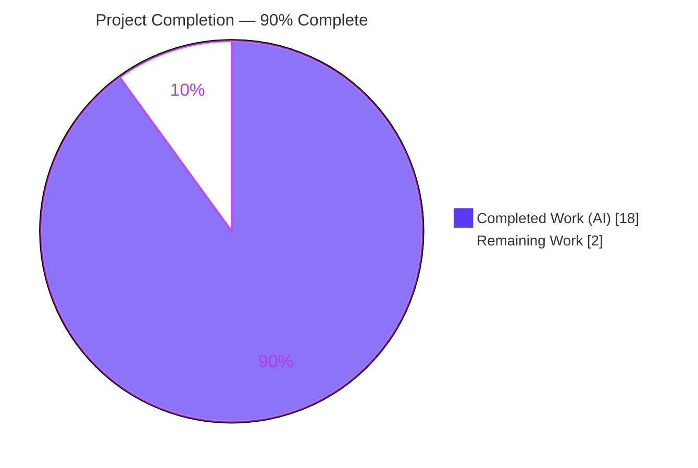
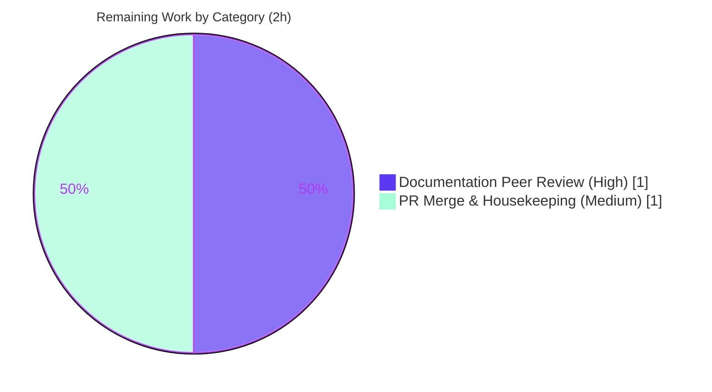

# Blitzy Project Guide

> **Project:** Empirical investigation of `client/state/data-layer` Jest cold-vs-warm test timing — `Automattic/wp-calypso`
> **Branch:** `blitzy-bc99994b-43dc-413a-9432-87e7c9eff4d6` · **HEAD:** `9272982efb` · **Base:** `be7e5cc641`
> **Task type:** Read-only empirical investigation → single Markdown deliverable (rule `SWE-AtlasQnA-Repo`)

---

## 1. Executive Summary

### 1.1 Project Overview

This project answers a four-part investigation question about the `Automattic/wp-calypso` monorepo: **why do `client/state/data-layer` Jest tests run inconsistently between a first ("cold") and a subsequent ("warm") run?** The audience is wp-calypso engineers and CI maintainers. The deliverable is a single, empirically-grounded Markdown document — every number produced by running the code first and pasting complete, unedited output next to the command that produced it, with `file:line` references. No product behavior changes: the technical scope spans Jest's client runner, the `babel-jest` transform pipeline, the `calypso:src` module resolver, the `.cache/jest` transform cache, and the `nock` HTTP-mocking layer. It is a strictly read-only knowledge artifact.

### 1.2 Completion Status



| Metric | Hours |
| --- | --- |
| **Total Hours** | **20** |
| Completed Hours (AI) | 18 |
| Completed Hours (Manual) | 0 |
| **Completed Hours (AI + Manual)** | **18** |
| **Remaining Hours** | **2** |
| **Percent Complete** | **90.0%** |

**Calculation (PA1, AAP-scoped):** Completion % = Completed ÷ (Completed + Remaining) × 100 = 18 ÷ (18 + 2) × 100 = **90.0%**.

### 1.3 Key Accomplishments

- ✅ **All four question parts answered with measured evidence** — timing ratio, cache mechanics, HTTP mocking, and `--no-cache` dominant step.
- ✅ **Part 1:** cold/warm ratio measured at **~2.5× wall-clock (2.51–2.58×)** / **~2.9× Jest `Time`**, stable across 3 back-to-back pairs.
- ✅ **Part 2:** identified **`cacheDirectory`** (`test/client/jest.config.js:L7`) → `<repo-root>/.cache/jest`; enumerated the 4 cached artifact types with empty-before/populated-after evidence.
- ✅ **Part 3:** identified **`nock` 13.5.6**, traced its global + deprecated-helper wiring, and bounded its first-run contribution to **~0.2%** (not dominant).
- ✅ **Part 4:** measured **`--no-cache` at ~2.6× warm** and proved **`babel-jest` transpilation** is the dominant step (amplified by the `calypso:src` resolver).
- ✅ **798-line answer document** authored at the mandated path with a causal model, coverage pass, and reproduce steps.
- ✅ **Read-only constraint honored** — exactly 1 file added (798 insertions, 0 deletions); temp scripts removed; `.cache/jest` gitignored.
- ✅ **QA-corrected and independently re-validated** — 3 factual/fidelity fixes applied; Final Validator re-ran the whole investigation (5 gates PASS); assessor re-ran both test targets (all PASS).

### 1.4 Critical Unresolved Issues

| Issue | Impact | Owner | ETA |
| --- | --- | --- | --- |
| _None._ No unresolved issues block release or validation. The deliverable is complete, validated, and reproducible. | — | — | — |

### 1.5 Access Issues

| System/Resource | Type of Access | Issue Description | Resolution Status | Owner |
| --- | --- | --- | --- | --- |
| _No access issues identified._ | — | The investigation is fully self-contained: no external services, no API keys, and all network access is blocked by `nock.disableNetConnect()`. `yarn install --immutable` completed successfully from the lockfile. | Resolved / N/A | — |

### 1.6 Recommended Next Steps

1. **[High]** Conduct a technical peer review of `blitzy/documentation/wp-calypso_be7e5cc64162.md` — confirm all four parts are answered and spot-check reproducibility with the §8 reproduce commands.
2. **[Medium]** Approve and merge the PR to the target branch, confirming read-only integrity (`git diff` shows exactly one added file).
3. **[Low]** Optionally capture the reviewer's own cold/warm ratio on their hardware and append it as a corroborating data point (absolute times are machine-dependent; the ratio is the stable signal).

---

## 2. Project Hours Breakdown

### 2.1 Completed Work Detail

| Component | Hours | Description |
| --- | --- | --- |
| Environment establishment (AAP prerequisite) | 2 | Corepack enable + `yarn install --immutable` restoring `node_modules` for an 18,879-file monorepo; Node/Yarn version reconciliation (Node v22.23.1 satisfies engines `^v22.9.0`; Yarn 4.0.2) and verification. |
| Part 1 — Cold/warm timing ratio | 2 | Cold-cache protocol design, 3 cold/warm pairs + extra warm run, `time`-keyword caveat discovery (no `/usr/bin/time`), verbatim `real`/`user`/`sys` capture; ratio 2.51–2.58× wall / 2.89–2.94× Jest `Time`. |
| Part 2 — Transform-cache investigation | 2 | Located `cacheDirectory` (`jest.config.js:L7`), resolved `<repo-root>/.cache/jest`, captured empty-before/populated-after, enumerated + counted 4 artifact types over 2759 files, analyzed `transformIgnorePatterns` and the asset-stub discrepancy. |
| Part 3 — HTTP mocking (nock) investigation | 2 | Identified `nock` 13.5.6, traced global wiring (`setup-test-framework.js`) + deprecated `use-nock` helper, ran the `wpcom-http` example, measured `require('nock')` ×3, proved 0 nock modules transpiled via cache search, computed ~0.2% contribution. |
| Part 4 — `--no-cache` + dominant step | 2 | Uncached runs ×2, comparison table, transform-map analysis, `calypso:src`-resolver amplification proof (`state-utils` `dist/cjs` absent), per-file Babel measurement harness (261.6 ms → ~6–7 ms), preset/plugin stack enumeration. |
| Empirical-first methodology rigor | 1 | Complete-unedited-output discipline, `(inferred from code)` labeling, exact canonical commands, and the `TZ=UTC … time` reproducibility caveat. |
| Answer document authoring | 4 | 798-line dense technical write-up: TL;DR, environment tables, four detailed parts with embedded verbatim output, Mermaid causal model, §8 coverage pass, and reproduce steps. |
| Read-only compliance + cleanup | 1 | Temporary-script removal, `.cache/jest` gitignore confirmation, and clean-tree verification (byte-for-byte unchanged apart from the doc). |
| QA re-verification + corrections | 2 | 3 factual/fidelity corrections (commit `9272982efb`: §3.2 JSDOM→`jest-environment-node`; §6.2 `--no-cache` still writes cache; §4.1 complete `sed` output) + Final Validator's full independent re-run (5 gates PASS). |
| **Total** | **18** | |

_Total of the Hours column = **18**, matching Completed Hours in Section 1.2._

### 2.2 Remaining Work Detail

| Category | Hours | Priority |
| --- | --- | --- |
| Documentation Peer Review — human sign-off on accuracy, completeness, and reproducibility of the answer document | 1 | High |
| PR Merge & Read-Only Housekeeping — approve/merge to target branch; confirm 1-file diff, `.cache/jest` uncommitted, no stray temp scripts | 1 | Medium |
| **Total** | **2** | |

_Total of the Hours column = **2**, matching Remaining Hours in Section 1.2 and the "Remaining Work" value in the Section 7 pie chart._

### 2.3 Reconciliation

| Check | Value | Status |
| --- | --- | --- |
| Section 2.1 (Completed) | 18h | ✅ |
| Section 2.2 (Remaining) | 2h | ✅ |
| 2.1 + 2.2 = Total (Section 1.2) | 18 + 2 = 20h | ✅ |
| Completion % = 18 ÷ 20 | 90.0% | ✅ |

---

## 3. Test Results

All tests below originate from Blitzy's autonomous validation logs for this project and were **independently re-executed during this assessment**. Because the task is read-only, no new tests were authored; the existing data-layer suite is the *instrument* of the investigation. Runs used the canonical entry point `TZ=UTC yarn jest -c=test/client/jest.config.js <test>` under Jest 29.7.0.

| Test Category | Framework | Total Tests | Passed | Failed | Coverage % | Notes |
| --- | --- | --- | --- | --- | --- | --- |
| Unit / Snapshot (`data-layer/wpcom/jetpack-install`) | Jest 29.7.0 | 5 (+1 snapshot) | 5 (+1 snapshot) | 0 | N/A* | Primary timing target (Parts 1, 2, 4). PASS cold, warm, and `--no-cache`. Warm: `real 5.972s` / Jest `Time 4.612s`. |
| Integration / HTTP-mock (`data-layer/wpcom-http`, `nock`) | Jest 29.7.0 | 2 | 2 | 0 | N/A* | Exercises `nock` interceptors via `useNock()` (Part 3). PASS: `real 2.459s` / Jest `Time 1.007s`. |
| **Totals** | Jest 29.7.0 | **7 (+1 snapshot)** | **7 (+1 snapshot)** | **0** | — | 100% pass rate across all conditions. |

\* *Coverage was not measured: the investigation used pass/fail as its reliability instrument, not line coverage. `--coverage` was intentionally not run (it would add transform work irrelevant to the timing question). Reported as N/A rather than fabricated.*

**Timing conditions observed (jetpack-install target):**

| Condition | `real` | Jest `Time` | vs Warm |
| --- | --- | --- | --- |
| Warm (cached) | ~6.0s | ~4.66s | 1.0× |
| Cold (empty cache) | ~15.2–15.5s | ~13.45–13.68s | ~2.5× |
| `--no-cache` | ~15.4–16.1s | ~13.57–14.24s | ~2.6× |

---

## 4. Runtime Validation & UI Verification

This is a Node/CLI investigation with **no UI surface**; runtime validation focuses on the Jest client runner and the transform/cache/mock pipeline.

- ✅ **Operational — Dependency install:** `yarn install --immutable` completes (lockfile-faithful, zero tracked-file change).
- ✅ **Operational — Jest client runner (warm):** `jetpack-install` PASS 5/5 + snapshot; `wpcom-http` PASS 2/2.
- ✅ **Operational — Cold run:** genuine cold cache (`rm -rf .cache/jest`) → PASS at ~15s, populating `.cache/jest`.
- ✅ **Operational — `--no-cache` run:** PASS at ~15.4s (`real`), reproducing the uncached cost (~2.6× warm).
- ✅ **Operational — Transform cache:** `.cache/jest` created on demand (29 MB) with the 4 documented artifact types; gitignored.
- ✅ **Operational — HTTP mocking:** `nock.disableNetConnect()` active; interceptors in the `wpcom-http` test resolve and the suite passes with zero real network.
- ✅ **Operational — `file:line` citations:** all references in the document resolve accurately against the working tree.
- ⚠ **Partial — Absolute timing portability:** absolute `real` times are machine/load dependent (the validator observed marginally higher absolutes); the **ratio** is the stable, portable signal — documented as ranges.
- 🟦 **N/A — UI verification:** no web/UI component in scope.

---

## 5. Compliance & Quality Review

Cross-mapping of AAP deliverables and `SWE-AtlasQnA-Repo` rule directives to observed evidence.

| Requirement / Benchmark | Status | Progress | Evidence |
| --- | --- | --- | --- |
| Deliverable at `blitzy/documentation/wp-calypso_be7e5cc64162.md` | ✅ Pass | 100% | 798-line file present; branch = `wp-calypso_be7e5cc64162`. |
| Investigate by running code first, then write | ✅ Pass | 100% | Verbatim command output embedded throughout; methodology note at top of doc. |
| Confirm timing stability across ≥2 runs; state scale | ✅ Pass | 100% | 3 cold/warm pairs + extra warm run; ratio stable 2.51–2.58× (§3.2). |
| Reproduce reported inconsistency directly | ✅ Pass | 100% | Same unchanged input run repeatedly; distribution reported, not stabilized. |
| Exercise the real path / real entry point | ✅ Pass | 100% | Real `test/client/jest.config.js` via the `test-client` invocation; no synthetic harness. |
| Report canonical values + exact commands | ✅ Pass | 100% | Node 22.9.0+ canonical; exact commands in §2.2, §8. |
| Exercise every condition (cold/warm/`--no-cache`; empty/populated cache) | ✅ Pass | 100% | All conditions run with verbatim output; transitional cache states shown. |
| Complete, unedited output next to each command | ✅ Pass | 100% | Full Jest output blocks, no truncation before the relevant result. |
| Answer every part + every named item; coverage pass | ✅ Pass | 100% | §8 coverage checklist maps all 4 parts + each named item. |
| Be exact & grounded (`file:line`, named function) | ✅ Pass | 100% | Every claim carries a value + `file:line`; `babel-jest` transform named at `jest-preset.js:L14`. |
| Label inferred-vs-observed claims | ✅ Pass | 100% | `(inferred from code)` labels applied where runtime observation was not the source. |
| Read-only: no repo file modified except the doc; temp scripts removed | ✅ Pass | 100% | `git diff` = 1 file / 798 ins / 0 del; 0 stray scripts; `.cache/jest` gitignored. |
| Zero placeholders / TODOs in deliverable | ✅ Pass | 100% | Document is complete prose + data; no stubs or deferred sections. |
| Human peer review + merge | ⏳ Pending | 0% | Path-to-production gate (Section 2.2). |

**Fixes applied during autonomous validation:** three corrections in commit `9272982efb` — (1) §3.2 replaced an incorrect "JSDOM setup" attribution with the resolved Node test-environment (`jest-environment-node`, `jest-preset.js:L11`); (2) §6.2 corrected the `--no-cache` mechanism (disables cache *reads* but still *writes* transforms + haste-map); (3) §4.1 made the `sed` block show its complete 8-line output. **Outstanding:** human peer review and merge only.

---

## 6. Risk Assessment

Risk surface is inherently low: a read-only investigation with no product code, no dependency changes, no auth/data handling, and network disabled.

| Risk | Category | Severity | Probability | Mitigation | Status |
| --- | --- | --- | --- | --- | --- |
| Absolute timing is machine/load dependent; a reviewer sees different absolutes | Technical | Low | Medium | Report **ratios** + ranges and state machine conditions; ratio stable 2.51–2.58× across 3 pairs | Mitigated |
| Cache artifact counts drift if other tests are run (isolated-run figures vs multi-run) | Technical | Low | Low | Doc states figures are from a "single, isolated cold run"; hash prefix noted as checkout-specific | Mitigated |
| Divergence from commonly-cited 20–30× community figures (observed ~2.5×) | Technical | Low | Low | Divergence reported honestly with the causal reason (fixed ~6s startup floor for a small test) | Documented |
| No security surface (no code/secrets/auth); `--immutable` leaves deps unchanged | Security | None | — | No new vulnerability surface introduced | N/A |
| Environment-specific absolute path embedded in verbatim `perf-cache` output | Security | Informational | — | Non-sensitive; expected in a reproduction artifact | Accepted |
| Reproduction requires Node 22.9.0+/Corepack Yarn 4/full install; `time`-keyword & browserslist gotchas | Operational | Low | Medium | §2.3 documents the `time` caveat; §8 provides exact copy-paste reproduce steps | Mitigated |
| Persistent `.cache/jest` (29 MB) after runs | Operational | Low | Low | Gitignored (`.gitignore:L15`), never committed; cleanup verified | Mitigated |
| No external integration (self-contained; network blocked) | Integration | None | — | Nothing to integrate or credential | N/A |
| Documented values could drift from live codebase | Integration | Low | Low | Final Validator full re-run + assessor re-runs + all `file:line` citations verified | Mitigated |

**Overall risk posture: LOW.** No High/Critical risks; no blocking issues.

---

## 7. Visual Project Status


**Remaining hours by category (Section 2.2):**



> **Integrity:** "Remaining Work" = **2h** matches Section 1.2 Remaining Hours and the Section 2.2 Hours total. "Completed Work" = **18h** matches Section 1.2 Completed Hours. Colors: Completed = Dark Blue `#5B39F3`, Remaining = White `#FFFFFF`.

---

## 8. Summary & Recommendations

**Achievements.** The project delivers a complete, empirically-grounded answer to all four parts of the timing question. Every quantitative claim was produced by running the code first and pasting unedited output: the cold run is **~2.5× slower (wall-clock)** than the warm run because the first run pays the full **`babel-jest` transpilation** cost of ~1,400+ untranspiled source modules — pulled in by the `calypso:src` resolver — and persists the results under **`<repo-root>/.cache/jest`** (the `cacheDirectory` option); the warm run reuses that cache. **`nock`** is the HTTP mock library but is a negligible ~0.2% of the overhead, and **`--no-cache`** reverts every run to cold-run cost, confirming the cache is the entire mechanism.

**Remaining gaps & critical path to production.** The deliverable is fully authored, QA-corrected, and independently re-validated. The critical path is short and entirely human: **(1)** peer-review the document, **(2)** merge the PR. There is no code to fix, no dependency to configure, and no environment to provision beyond the documented Node 22.9.0+/Yarn 4 prerequisites.

**Success metrics.**

| Metric | Target | Actual | Status |
| --- | --- | --- | --- |
| All 4 question parts answered with evidence | 4/4 | 4/4 | ✅ |
| Test pass rate (investigation instrument) | 100% | 100% (7 tests + 1 snapshot) | ✅ |
| Read-only compliance (files changed) | 1 (doc only) | 1 (798 ins, 0 del) | ✅ |
| `file:line` citation accuracy | 100% | 100% verified | ✅ |
| Production-readiness gates (validator) | 5/5 | 5/5 | ✅ |

**Production readiness assessment.** At **90.0% complete**, the project is production-ready pending human sign-off. The 10% remaining reflects the human peer-review-and-merge gate that, per policy, is never auto-completed — not any deficiency in the deliverable. **Recommendation: approve and merge after a brief technical review.**

---

## 9. Development Guide

How to reproduce every measurement in the answer document. All commands were tested during this assessment and are copy-pasteable. Run from the repository root.

### 9.1 System Prerequisites

- **Node.js** `^v22.9.0` (`.nvmrc` pins `22.9.0`; assessment used `v22.23.1`).
- **Yarn** `4.0.2` via **Corepack** (`package.json` → `"packageManager": "yarn@4.0.2"`).
- **Git** (assessment used `2.51.0`).
- **OS:** Linux or macOS. **Disk:** ~2–3 GB free (`node_modules` + a 29 MB `.cache/jest`).

### 9.2 Environment Setup

```bash
# From the repository root
corepack enable                 # activates the pinned Yarn 4 (via .yarnrc.yml yarnPath)

# (optional) align Node to the pinned version if you use nvm
nvm use                         # reads .nvmrc (22.9.0)

# Verify the toolchain
node --version                  # -> v22.x (>= 22.9.0)   e.g. v22.23.1
yarn --version                  # -> 4.0.2
yarn jest --version             # -> 29.7.0
```

### 9.3 Dependency Installation

```bash
yarn install --immutable        # lockfile-faithful; introduces NO manifest/lockfile change
```

*Expected:* completes with exit code 0 and a populated `node_modules/` (node-modules linker). Zero tracked files are modified by the install.

### 9.4 Run & Reproduce (cold / warm / `--no-cache`)

```bash
export TZ=UTC                   # keep TZ=UTC; export first so bash's `time` keyword parses (see Troubleshooting)

# --- Part 1: cold vs warm ---
rm -rf .cache/jest              # force a genuine cold cache
time yarn jest -c=test/client/jest.config.js client/state/data-layer/wpcom/jetpack-install/test/index.js   # COLD  (~15s)
time yarn jest -c=test/client/jest.config.js client/state/data-layer/wpcom/jetpack-install/test/index.js   # WARM  (~6s)

# --- Part 2: inspect the transform cache ---
ls -R .cache/jest               # 3 entries: haste-map-*, jest-transform-cache-* (sharded 00..ff), perf-cache-*

# --- Part 4: uncached run ---
time yarn jest -c=test/client/jest.config.js client/state/data-layer/wpcom/jetpack-install/test/index.js --no-cache   # ~16s, ~2.6x warm
```

### 9.5 Verification Steps

- **Pass lines:** each run prints `Tests: 5 passed, 5 total` and `Snapshots: 1 passed, 1 total` (jetpack-install).
- **Ratio:** COLD `real` ÷ WARM `real` ≈ **2.5×** (assessment: 15.37s `--no-cache` ÷ 5.97s warm ≈ 2.57×).
- **Cache populated:** after a run, `find .cache/jest -type f | wc -l` ≈ 2759 and `du -sh .cache/jest` ≈ `29M`.
- **Cached types:** `ls .cache/jest` shows `haste-map-*`, `jest-transform-cache-*`, `perf-cache-*`.

### 9.6 Example Usage

```bash
# Part 3: the nock-based data-layer test (HTTP mocking)
export TZ=UTC
yarn jest -c=test/client/jest.config.js client/state/data-layer/wpcom-http/test/index.js
# -> PASS, Tests: 2 passed, 2 total

# Read the full answer document
less blitzy/documentation/wp-calypso_be7e5cc64162.md
```

### 9.7 Troubleshooting

- **`time: command not found`** — There is no `/usr/bin/time` binary; `time` is only a bash *keyword*. Prefixing `TZ=UTC` directly before `time` makes bash try to exec `time` as a program. **Fix:** `export TZ=UTC` first, then use `time yarn jest …` (documented in doc §2.3).
- **`Browserslist: browsers data … is 17 months old`** — Benign warning; does not affect timing or correctness. Ignore (or run `npx update-browserslist-db@latest` if desired).
- **`node_modules` missing / module-not-found** — Run `yarn install --immutable` first.
- **Engines error (`node ^v22.9.0` unsatisfied)** — Your Node is < 22.9.0. Use `nvm use` (reads `.nvmrc`) or install Node 22.9.0+.
- **Second run is much faster** — Expected: that is the transform cache working. To force cold again, `rm -rf .cache/jest`.
- **`--no-cache` stays slow every run** — By design: it disables cache reads, re-transpiling the source graph on every invocation.

---

## 10. Appendices

### A. Command Reference

| Purpose | Command |
| --- | --- |
| Enable Yarn 4 | `corepack enable` |
| Install deps | `yarn install --immutable` |
| Version checks | `node --version` · `yarn --version` · `yarn jest --version` |
| Force cold cache | `rm -rf .cache/jest` |
| Cold/warm run | `export TZ=UTC; time yarn jest -c=test/client/jest.config.js <test>` |
| Uncached run | `… <test> --no-cache` |
| Inspect cache | `ls -R .cache/jest` |
| Cache file count | `find .cache/jest -type f \| wc -l` |
| Read-only check | `git diff --stat be7e5cc641..HEAD` |

### B. Port Reference

Not applicable — the investigation runs the Jest CLI locally and starts no server or listening port. (`testEnvironmentOptions.url` is set to `https://example.com` for jsdom URL context only; no port is opened.)

### C. Key File Locations

| Path | Role |
| --- | --- |
| `blitzy/documentation/wp-calypso_be7e5cc64162.md` | **The deliverable** (answer document, 798 lines) |
| `test/client/jest.config.js` | Client Jest config — `cacheDirectory` (L7), `transformIgnorePatterns` (L14-16), `setupFilesAfterEnv` (L21) |
| `packages/calypso-jest/jest-preset.js` | Shared preset — `babel-jest` transform (L14), resolver, `testEnvironment: 'node'` (L11) |
| `packages/calypso-jest/src/module-resolver.js` | `calypso:src` → untranspiled-source resolver (L16-20) |
| `packages/calypso-jest/src/asset-transform.js` | Asset stub transformer (L3-6) |
| `babel.config.js` · `packages/calypso-babel-config/{config.js,presets/default.js}` | Babel pipeline (preset-env/react/typescript + plugins) |
| `test/client/setup-test-framework.js` | Global `nock` wiring (L6/L9/L11-22) |
| `client/test-helpers/use-nock/index.js` | Deprecated per-test `nock` helper |
| `client/state/data-layer/wpcom/jetpack-install/test/index.js` | Primary timing target (99 lines) |
| `client/state/data-layer/wpcom-http/test/index.js` | `nock`-based target (56 lines) |
| `.cache/jest/` | Gitignored transform cache (created on demand) |

### D. Technology Versions

| Component | Version | Source |
| --- | --- | --- |
| Node.js | v22.23.1 (canonical `^v22.9.0`) | `node --version`; `package.json:L57`; `.nvmrc` |
| Yarn | 4.0.2 | Corepack; `package.json:L422` |
| Corepack | 0.34.6 | `corepack --version` |
| Jest | 29.7.0 | `package.json:L290` |
| `@babel/core` | ^7.26.10 | `package.json:L242` |
| `nock` | 13.5.6 | `package.json:L299` |
| `enhanced-resolve` | ^5.8.3 (installed 5.9.3) | `packages/calypso-jest/package.json:L25` |
| Git | 2.51.0 | `git --version` |

### E. Environment Variable Reference

| Variable | Value | Purpose |
| --- | --- | --- |
| `TZ` | `UTC` | Canonical timezone for reproducible runs (mirrors the `test-client` npm script). Export before invoking `time`. |
| `BROWSERSLIST_ENV` | (unset) | When `= server`, `babel.config.js` flips `isBrowser`; left unset for the client suite. |

### F. Developer Tools Guide

- **Cache introspection:** `head -6 .cache/jest/jest-transform-cache-*/<shard>/<file>` shows a transformed module (32-hex integrity line + transpiled CJS); the sibling `.map` is its source map.
- **Per-file Babel cost harness:** transpile a single module with `envName='test'` and the `babel-jest` caller to observe the one-time preset warm-up (~261 ms) vs amortized per-file cost (~6–7 ms).
- **Resolver verification:** `node -e "const p=require('@automattic/state-utils/package.json'); console.log(p['calypso:src'], p.main)"` confirms `calypso:src` → `src/index.ts` while the `main`/`dist/cjs` target is absent.
- **Read-only audit:** `git status --porcelain` (should show nothing) and `git diff --name-status be7e5cc641..HEAD` (one added file).

### G. Glossary

| Term | Definition |
| --- | --- |
| Cold run | First Jest run with an empty/absent `.cache/jest`; pays full transpilation cost. |
| Warm run | Subsequent identical run that reuses the populated transform cache. |
| `cacheDirectory` | Jest option that sets where transformed modules + maps are cached (here `<repo-root>/.cache/jest`). |
| `babel-jest` | Jest's Babel-based transformer; the dominant cost on cold/uncached runs. |
| `calypso:src` | `package.json` field pointing to untranspiled monorepo source, used first by the custom resolver. |
| Haste map | Jest's serialized module-name→file-path map (`haste-map-*`). |
| `perf-cache` | Tiny JSON of last-observed per-test durations; drives Jest's `estimated Ns`. |
| `nock` | HTTP mocking library; globally disables real network in the client suite. |
| `--no-cache` | Jest flag that disables transform-cache reads, forcing re-transpilation every run. |
| `transformIgnorePatterns` | Regexes for paths Jest will not transform (excludes most of `node_modules`). |

---

_Prepared by the Blitzy autonomous assessment agent. Completion is measured strictly against AAP-scoped and path-to-production work (PA1). Colors: Completed = Dark Blue `#5B39F3`, Remaining = White `#FFFFFF`._