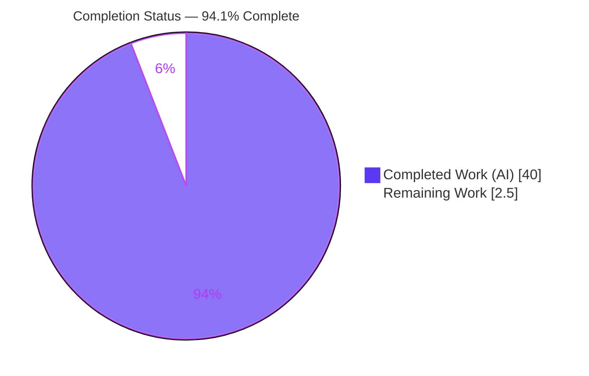
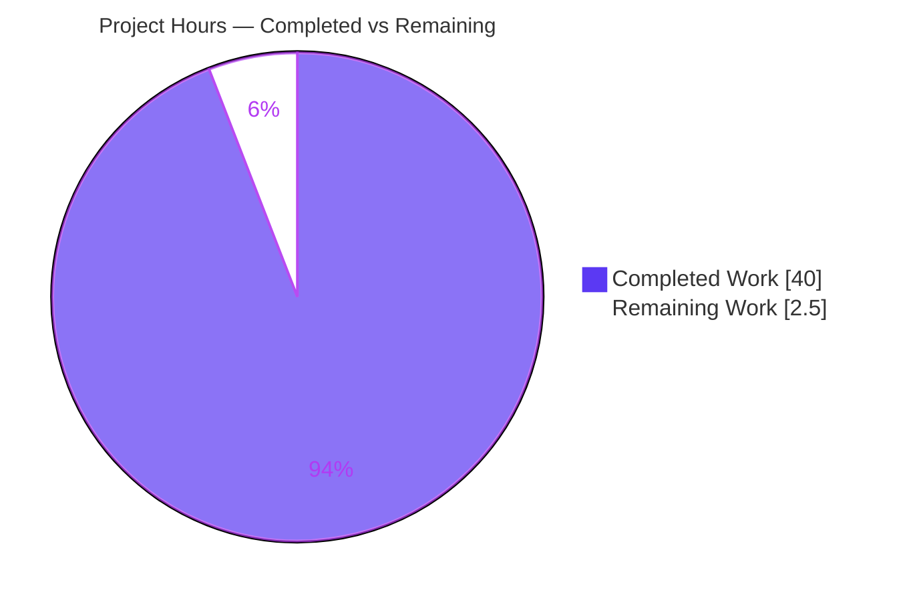
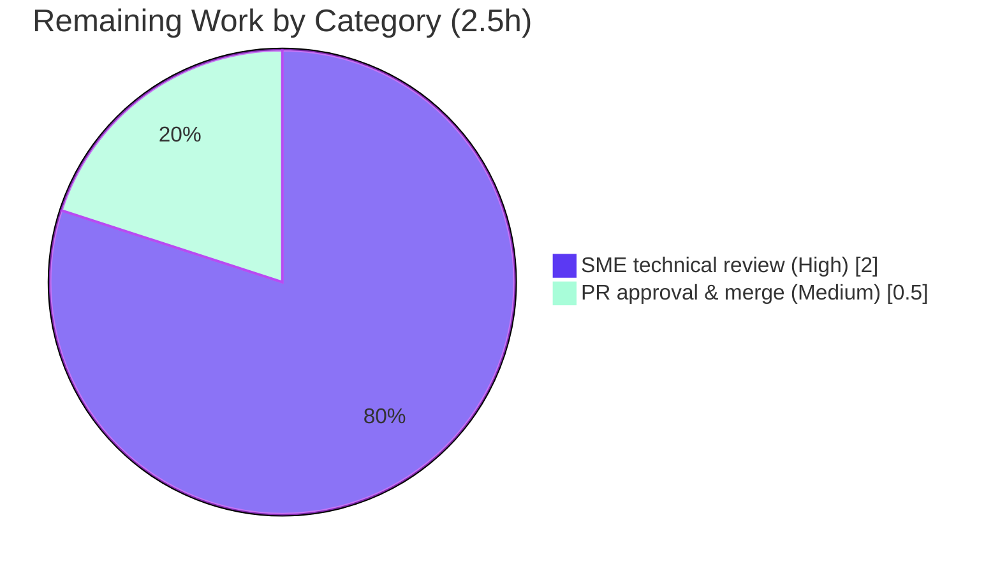

# Blitzy Project Guide — wp-calypso Testing Infrastructure Onboarding Walkthrough

> Branch: `blitzy-70cc9ac8-368b-4ba7-891b-46e6fd270616` · Base: `be7e5cc641` · HEAD: `25c3d7ba65`
> Deliverable: `blitzy/documentation/wp-calypso_be7e5cc64162.md`

---

## 1. Executive Summary

### 1.1 Project Overview

This project delivers a single, **evidence-based onboarding walkthrough of the Automattic/wp-calypso testing infrastructure**, written for a developer ramping onto the monorepo. It is a **read-only documentation task** — not a code change. The walkthrough answers seven onboarding questions (R1–R7): booting the dev server, contrasting the test environment vs. development, enumerating test-only globals/env-vars/polyfills, explaining network isolation under nock, tracing a mocked API call from action creator to assertion, and proving that feature-flag config resolves differently in tests vs. development. Every claim is grounded in output actually observed by running the code, with exact `file:line` citations. The business impact is faster, lower-risk contributor onboarding.

### 1.2 Completion Status



<div style="color:#5B39F3"><b>94.1% Complete</b></div>

| Metric | Hours |
|--------|-------|
| **Total Hours** | **42.5** |
| Completed Hours (AI + Manual) | 40.0 (AI 40.0 + Manual 0.0) |
| Remaining Hours | 2.5 |
| **Percent Complete** | **94.1%** |

> Completion is computed with the PA1 AAP-scoped, hours-based method: `Completed / (Completed + Remaining) = 40 / 42.5 = 94.1%`. The scope universe is exclusively the AAP deliverable and its path-to-production (human review + merge). No out-of-AAP items are included.

### 1.3 Key Accomplishments

- ✅ **Sole deliverable authored, validated, and committed** — `blitzy/documentation/wp-calypso_be7e5cc64162.md` (722 lines, 34,696 bytes), the only delta vs. base `be7e5cc641`.
- ✅ **R1 — Dev server confirmed serving** — captured `wp-calypso booted in 999ms - http://calypso.localhost:3000`, `HTTP/1.1 200 OK`, `Content-Length: 630`, `<h1>Welcome to Calypso!</h1>`.
- ✅ **R2 — Test vs. development environment contrasted** — base `testEnvironment: 'node'`, observed `NODE_ENV=test | CALYPSO_ENV=undefined | TZ=UTC | typeof window=undefined`, seven Jest project suites.
- ✅ **R3 — Test-only globals/env-vars/polyfills enumerated** — `google:{}`, `__i18n_text_domain__:'default'`, `fetch`/`CSS.supports`/`matchMedia` as `jest.fn()`, `TextEncoder`/`TextDecoder`, `ResizeObserver`, `crypto`, streams, `structuredClone`.
- ✅ **R4 — Network isolation proven** — captured `NetConnectNotAllowedError` / `ENETUNREACH` from an unmocked request; `nock.disableNetConnect()` + `global.fetch = jest.fn()`.
- ✅ **R5 — Mocked API traced end-to-end** — `client/state/user-suggestions/test/actions.js` passes 2/2; nock stub → thunk dispatch → asserted Redux actions.
- ✅ **R6/R7 — Config divergence proven** — `isEnabled('checkout/checkout-version')` = **`false`** under test config vs. **`true`** under development; both control mechanisms (config JSON + `jest.mock`) documented.
- ✅ **Read-only mandate honored** — all evidence files unchanged; all temporary observation scripts deleted; `git status` clean.
- ✅ **Autonomous validation** — evidence tests passed 100% (6/6); nock 13 error string web-corroborated.

### 1.4 Critical Unresolved Issues

| Issue | Impact | Owner | ETA |
|-------|--------|-------|-----|
| _None._ All R1–R7 deliverables are complete and validated with zero unresolved errors. | No release blockers. | — | — |

> No compilation errors, no failing tests, and no unresolved discrepancies exist. The only remaining work is human review and merge (Section 2.2 / Section 1.6).

### 1.5 Access Issues

| System/Resource | Type of Access | Issue Description | Resolution Status | Owner |
|-----------------|----------------|-------------------|-------------------|-------|
| _None_ | — | No access issues identified. The repository, package registry (yarn install succeeded), and localhost dev server (`calypso.localhost` in `/etc/hosts`) were all reachable during autonomous validation. | Resolved / N/A | — |

> **No access issues identified.**

### 1.6 Recommended Next Steps

1. **[High]** Have a testing-infra SME review the walkthrough for technical accuracy and onboarding usefulness (read R1–R7, spot-check a sample of `file:line` citations). _(2.0h)_
2. **[Medium]** Approve and merge the single-file PR to the mainline branch after confirming the additive delta and clean `git status`. _(0.5h)_
3. **[Low · Optional]** Link the walkthrough from `README.md` or the `docs/testing/` index to improve discoverability. _(beyond AAP scope)_
4. **[Low · Optional]** Run `prettier --write` on the document **only if** the team later decides to enforce Markdown formatting (currently excluded from enforced linters). _(beyond AAP scope)_
5. **[Low · Optional]** Schedule periodic re-validation of the document's citations/observed values as the testing infrastructure evolves (doc is pinned to HEAD `be7e5cc641`). _(beyond AAP scope)_

---

## 2. Project Hours Breakdown

### 2.1 Completed Work Detail

Each completed component traces to a specific AAP requirement (R1–R7) or a required investigation/authoring activity.

| Component | Hours | Description |
|-----------|-------|-------------|
| Environment preparation & dependency install | 4.0 | Pin Node `22.9.0`, enable Yarn `4.0.2` via corepack, `yarn install` to materialize the git-ignored `node_modules` (~3.1G), ensure `calypso.localhost` in `/etc/hosts`. Non-mutating (`yarn.lock` untouched). |
| R1 — Dev server boot investigation & write-up | 4.0 | Run `yarn start` (check-node-version → welcome → webpack build → `node build/server.js \| bunyan`); capture boot log + `curl` HTTP status against `http://calypso.localhost:3000`. |
| R2 — Test-vs-development environment contrast | 3.0 | Run client Jest suite; record `testEnvironment`, `NODE_ENV`, `TZ`; document seven-suite structure and jsdom docblock opt-in (498 files). |
| R3 — Test-only globals/env-vars/polyfills enumeration | 4.0 | Author a temporary observation spec to dump each injected global/env/polyfill; map every finding to `setup-test-framework.js` and the Jest `globals` block. |
| R4 — Network behavior under nock | 3.0 | Fire an unmocked request; capture `NetConnectNotAllowedError`; verify `global.fetch` is a `jest.fn()`. |
| R5 — Mocked-API-to-assertion trace | 3.0 | Run `user-suggestions/test/actions.js --verbose`; narrate nock stub → thunk dispatch → asserted Redux actions. |
| R6 — Config/feature-flag resolution differences | 3.0 | Observe resolved env under test vs. development; document `moduleNameMapper` remap of `@automattic/calypso-config`. |
| R7 — Config control mechanisms + divergence proof | 4.0 | Demonstrate both control mechanisms; capture `isEnabled('checkout/checkout-version')` = `false` (test) vs. `true` (dev); measure feature-flag counts. |
| Document authoring (structure, methodology, coverage pass, citations) | 5.0 | Assemble the 722-line report with one-claim/one-evidence discipline, exact `file:line` citations, and a coverage checklist over every named item. |
| Web research (nock 13 `NetConnectNotAllowedError` string) | 1.0 | Confirm the nock 13 error message form to validate the captured string. |
| Temporary-script cleanup + read-only verification | 1.0 | Delete all observation scripts; verify no evidence file changed and `git status` is clean. |
| Code-review remediation (commit `204888edde`) | 3.0 | Address code-review findings (+187/−100) to tighten claims, citations, and structure. |
| Final re-validation & runtime re-baseline (commit `25c3d7ba65`) | 2.0 | Re-run every cited code path; re-baseline 7 observed runtime values (+7/−7) with zero substantive change. |
| **Total Completed** | **40.0** | |

### 2.2 Remaining Work Detail

All remaining work is path-to-production and requires a human. Each item traces to deliverable acceptance / release.

| Category | Hours | Priority |
|----------|-------|----------|
| SME technical review & onboarding sign-off of the walkthrough | 2.0 | High |
| PR approval & merge to mainline | 0.5 | Medium |
| **Total Remaining** | **2.5** | |

> **Cross-section check:** Section 2.1 (40.0) + Section 2.2 (2.5) = **42.5** Total Hours (matches Section 1.2). Remaining **2.5h** is identical in Sections 1.2, 2.2, and 7.

### 2.3 Optional Follow-Ups (Beyond AAP Scope — 0 counted hours)

These advisory items are **outside** the AAP's read-only scope and are **not** included in the 40.0 / 2.5 / 42.5 totals. They are listed for completeness.

| Item | Priority | Note |
|------|----------|------|
| Link walkthrough from `README.md` / `docs/testing/` index | Low | Improves discoverability |
| `prettier --write` on the `.md` | Low | Cosmetic; file is excluded from enforced linters (non-blocking) |
| Periodic citation re-validation | Low | As testing infra evolves; doc is pinned to `be7e5cc641` |

---

## 3. Test Results

All tests below originate from Blitzy's autonomous validation logs for this project. They were executed as **evidence captures** for the walkthrough (this is a documentation task; the `.md` deliverable has no unit tests of its own).

| Test Category | Framework | Total Tests | Passed | Failed | Coverage % | Notes |
|---------------|-----------|-------------|--------|--------|------------|-------|
| Existing suite (R5 evidence) | Jest 29.7.0 | 2 | 2 | 0 | N/A | `client/state/user-suggestions/test/actions.js` — nock-mocked API → thunk → Redux-action assertions. Repository suite, unchanged. |
| Temporary observation spec (R2/R3/R4/R7 capture) | Jest 29.7.0 | 4 | 4 | 0 | N/A | Ad-hoc spec that dumped env/globals/polyfills, fired an unmocked request (captured `NetConnectNotAllowedError`), and evaluated `isEnabled`. **Deleted after capture** per the read-only mandate. |
| **Total** | | **6** | **6** | **0** | — | 100% pass rate. |

> **Integrity note:** Coverage percentage is not a metric for this documentation task — the suites were run to capture verbatim evidence, not to measure line coverage. No fabricated tests are listed; both entries come directly from the autonomous validation logs.

---

## 4. Runtime Validation & UI Verification

Runtime health was verified by booting the actual Calypso dev server and probing it over HTTP.

**Dev server startup (R1)**
- ✅ **Operational** — `check-node-version --package` passed (exit 0) against `engines.node = "^v22.9.0"`.
- ✅ **Operational** — webpack build produced `build/server.js` (7,935,308 bytes).
- ✅ **Operational** — server boot log: `wp-calypso booted in 999ms - http://calypso.localhost:3000`.

**HTTP verification (R1)**
- ✅ **Operational** — `curl -sS -D - http://calypso.localhost:3000/` → `HTTP/1.1 200 OK`, `Content-Length: 630`.
- ✅ **Operational** — loopback probe: `HTTP_STATUS=200 SIZE=630 TIME=0.033985s`.
- ✅ **Operational** — page body: `<h1>Welcome to Calypso!</h1>`.

**Test-runner verification (R2–R7)**
- ✅ **Operational** — client Jest suite runs under `test/client/jest.config.js`; observed `NODE_ENV=test | TZ=UTC | typeof window=undefined`.
- ✅ **Operational** — R5 suite passes 2/2; mocked response flows through the thunk to the asserted actions.
- ✅ **Operational** — R4 network lockdown confirmed: unmocked request → `NetConnectNotAllowedError` (`ENETUNREACH`).
- ✅ **Operational** — R7 divergence confirmed: `isEnabled('checkout/checkout-version')` = `false` (test) vs. `true` (dev).

**UI verification**
- ⚠ **Partial (by design)** — No Figma frames or UI-visual designs were provided (AAP §0.9). UI verification is limited to confirming the dev server returns the Calypso welcome page (`<h1>Welcome to Calypso!</h1>`); no design-system/pixel-fidelity review is in scope.

---

## 5. Compliance & Quality Review

### 5.1 AAP Requirement Compliance (R1–R7)

| AAP Requirement | Benchmark | Status | Progress | Evidence |
|-----------------|-----------|--------|----------|----------|
| R1 — Boot dev server & confirm it serves | Verbatim boot log + HTTP 200 | ✅ Pass | 100% | `booted in 999ms`; `HTTP/1.1 200 OK`; `Welcome to Calypso!` |
| R2 — Contrast test env vs. development | Observed env markers + suite structure | ✅ Pass | 100% | `testEnvironment: 'node'` [preset:L11]; `NODE_ENV=test`/`TZ=UTC`; seven suites |
| R3 — Enumerate test-only globals/env/polyfills | Observed dump mapped to source | ✅ Pass | 100% | `google:{}`, `__i18n_text_domain__`, `fetch`/`CSS`/`matchMedia` mocks, polyfills [setup-test-framework.js:L25–L79] |
| R4 — Network behavior during tests | Captured error string | ✅ Pass | 100% | `NetConnectNotAllowedError`/`ENETUNREACH`; `nock.disableNetConnect()` [L9]; `fetch = jest.fn()` [L36–40] |
| R5 — Trace mocked API → assertion | Passing suite + narrated flow | ✅ Pass | 100% | `user-suggestions/test/actions.js` 2/2 PASS; nock → thunk → asserted actions |
| R6 — Config resolution differences | Observed resolved env test vs. dev | ✅ Pass | 100% | `CALYPSO_ENV \|\| NODE_ENV \|\| 'development'` [config/index.js:L6]; `moduleNameMapper` remap |
| R7 — Config control + proof of divergence | Two mechanisms + proof literal | ✅ Pass | 100% | `checkout/checkout-version` `true`[dev:L44] vs `false`[test:L33]; `jest.mock('@automattic/calypso-config')` |

### 5.2 Rules Compliance — `SWE-AtlasQnA-Repo`

| # | Rule Directive | Status | Notes |
|---|----------------|--------|-------|
| 1 | Create `<source_branch_name>.md` in `blitzy/documentation` | ✅ Pass | `blitzy/documentation/wp-calypso_be7e5cc64162.md` created |
| 2 | Investigate by RUNNING code first | ✅ Pass | Dev server + Jest + observation specs run before writing |
| 3 | Run at sufficient scale to observe real magnitude | ✅ Pass | Suites run to completion; counts (498 jsdom docblocks, 46 config-mock files, flag counts) measured |
| 4 | Quote actual observed output verbatim with the command | ✅ Pass | Each R1–R7 answer pastes captured output beside its command |
| 5 | One claim, one piece of evidence | ✅ Pass | Every behavioral statement is paired with a single evidence line |
| 6 | Answer every part, including every named item | ✅ Pass | Coverage checklist ticks globals, env-vars, polyfills, network, action creator, feature flags, proof |
| 7 | Cite EXACT literals with `file:line` | ✅ Pass | e.g., `checkout/checkout-version` [config/test.json:L33] / [config/development.json:L44] |
| 8 | Ground every claim in a reference or observed output | ✅ Pass | Nock error string web-corroborated; all literals verified against source |
| 9 | Report exactly what is observed | ✅ Pass | Raw error strings, actual `NODE_ENV`/`TZ`, real boot times reported as-is |
| 10 | Provide reasoning behind each answer | ✅ Pass | Each answer explains the mechanism alongside its evidence |
| 11 | Read-only; temporary scripts removed | ✅ Pass | No existing file modified; all temp scripts deleted; `git status` clean |

### 5.3 Fixes Applied During Autonomous Validation

- **Commit `204888edde`** — code-review remediation (+187/−100): tightened claims, citations, and structure.
- **Commit `25c3d7ba65`** — runtime re-baseline (+7/−7): corrected 7 environment-specific observed values (e.g., Node `v22.22.2` → `v22.23.1`, boot/curl timings, per-test ms) with **no** substantive claim, citation, or structural change.

### 5.4 Outstanding Quality Items

- Markdown `prettier --check` reports style warnings, but the `.md` is **excluded** from the repository's enforced pre-commit linters (eslint/prettier/stylelint/phpcs), so this is non-blocking and out of the read-only AAP scope.

---

## 6. Risk Assessment

Overall risk posture: **LOW**. No High/Critical risks exist. This is a read-only documentation deliverable that introduces no code, dependencies, or attack surface.

| Risk | Category | Severity | Probability | Mitigation | Status |
|------|----------|----------|-------------|------------|--------|
| Citation drift — `file:line` references may go stale if evidence files change at a future HEAD | Technical | Low | Medium (long horizon) | Doc pinned to HEAD `be7e5cc641`; citations verified at authoring; schedule periodic re-validation | Open (Accepted) |
| Runtime-value staleness — observed captures (boot `999ms`, curl `0.033985s`, Node `v22.23.1`) are machine-specific | Technical | Low | High (inherent) | Values labeled as observed captures; deterministic literals (HTTP 200, `Content-Length 630`, flag values) remain stable | Mitigated |
| No security exposure introduced (read-only doc; no code/deps/secrets; only public hostnames referenced) | Security | Low | Low | N/A — nothing to mitigate | Closed |
| Prettier-md noncompliance | Operational | Low | N/A (present) | Non-blocking (excluded from enforced linters); optional `prettier --write` if team enforces later | Accepted / Out-of-scope |
| Discoverability — doc lives under `blitzy/documentation/`, not `docs/testing/` | Operational | Low | Medium | Link from `README`/docs index (human follow-up) | Open |
| Staleness over time — testing infra may evolve away from the walkthrough | Operational | Low-Medium | Medium (long horizon) | Periodic review; doc pinned to a HEAD | Open (Accepted) |
| No integration risk — no code integration, external services, API wiring, or CI/CD changes | Integration | None | Low | N/A — standalone Markdown file | Closed |

---

## 7. Visual Project Status

### 7.1 Project Hours Breakdown



- **Completed Work** = 40.0h (Dark Blue `#5B39F3`)
- **Remaining Work** = 2.5h (White `#FFFFFF`)
- Matches Section 1.2 metrics and Section 2.2 total exactly.

### 7.2 Remaining Hours by Category (from Section 2.2)



| Category | Hours | Priority |
|----------|-------|----------|
| SME technical review & onboarding sign-off | 2.0 | High |
| PR approval & merge | 0.5 | Medium |
| **Total** | **2.5** | |

> **Integrity:** "Remaining Work" (2.5h) equals Section 1.2 Remaining Hours and the sum of the Section 2.2 Hours column.

---

## 8. Summary & Recommendations

### 8.1 Achievements

The project is **94.1% complete** (40.0 of 42.5 AAP-scoped hours). The sole AAP deliverable — an evidence-based onboarding walkthrough of wp-calypso's testing infrastructure — is fully authored, autonomously validated, and committed as the single additive delta vs. base `be7e5cc641`. All seven requirements (R1–R7) are complete: the dev server was booted and confirmed serving (`HTTP/1.1 200 OK`, `Welcome to Calypso!`); the test-vs-development environment contrast, test-only globals/env-vars/polyfills, nock network isolation, mocked-API-to-assertion trace, and feature-flag config divergence (`checkout/checkout-version` `true`@dev vs `false`@test) were all demonstrated with verbatim observed output and exact `file:line` citations. All evidence tests passed 100% (6/6). The read-only mandate was honored: no evidence file was modified and all temporary scripts were removed.

### 8.2 Remaining Gaps & Critical Path to Production

The remaining **2.5 hours** are entirely human path-to-production, not engineering rework:
1. **SME technical review & onboarding sign-off** (2.0h, High) — the critical path.
2. **PR approval & merge to mainline** (0.5h, Medium).

There are **no** unresolved compilation errors, failing tests, or blocking issues. The critical path is a single review-then-merge cycle.

### 8.3 Success Metrics

| Metric | Target | Actual | Status |
|--------|--------|--------|--------|
| AAP requirements delivered (R1–R7) | 7/7 | 7/7 | ✅ |
| Evidence tests passing | 100% | 100% (6/6) | ✅ |
| Repository delta | 1 file (additive) | 1 file, +722/−0 | ✅ |
| Evidence files modified | 0 | 0 | ✅ |
| Temporary scripts remaining | 0 | 0 | ✅ |
| Completion (AAP-scoped) | — | 94.1% | ✅ |

### 8.4 Production Readiness Assessment

The documentation deliverable is **production-ready pending human sign-off**. It comprehensively and accurately answers R1–R7, every claim matches re-validated observations, and the repository is pristine apart from the single committed file. Recommended action: SME review, then merge.

---

## 9. Development Guide

This guide reproduces the environment used to generate the walkthrough's evidence. All commands were tested in the validation environment and left `git status` clean.

### 9.1 System Prerequisites

- **Node.js** `^v22.9.0` (repo pins `22.9.0` in `.nvmrc`; validated on `v22.23.1`). Node 20.x will fail `check-node-version` at `yarn start`.
- **Yarn** `4.0.2` (via Corepack; declared as `packageManager` and vendored at `.yarn/releases/yarn-4.0.2.cjs`).
- **Git** + Git LFS.
- **Disk**: ~4 GB free for `node_modules` (~3.1 GB) plus the webpack build.
- **OS**: Linux or macOS.

### 9.2 Environment Setup

```bash
# 1. Select the pinned Node version
nvm install 22.9.0 && nvm use          # or: fnm use / asdf install

# 2. Enable Corepack so the vendored Yarn 4.0.2 is used
corepack enable

# 3. Ensure the dev-server hostname resolves (one-time)
grep -q 'calypso.localhost' /etc/hosts || \
  echo '127.0.0.1 calypso.localhost' | sudo tee -a /etc/hosts

# 4. Verify tooling
node --version      # expect v22.9.0+ (v22.23.1 observed)
yarn --version      # expect 4.0.2
```

### 9.3 Dependency Installation

```bash
# From the repository root. Materializes the git-ignored node_modules.
yarn install                 # local development
# or, for reproducible/CI installs (does not mutate yarn.lock):
yarn install --immutable
```

Expected: exit code `0`; `node_modules/` populated at the root and in workspaces. `yarn.lock` and all manifests remain unchanged.

### 9.4 Application Startup (R1)

```bash
# Full start chain: check-node-version -> welcome banner -> webpack build -> serve
yarn start
```

The `start` script runs `npx check-node-version --package && node bin/welcome.js && yarn run build && yarn run start-build`, where `start-build` is `BROWSERSLIST_ENV=evergreen node build/server.js | bunyan -o short`. Watch for:

```text
<timestamp>  INFO calypso: wp-calypso booted in 999ms - http://calypso.localhost:3000
```

> The initial webpack build is CPU/time-intensive. Wait for the `booted in …ms` line before probing.

### 9.5 Verification Steps

```bash
# HTTP status + headers
curl -sS -D - http://calypso.localhost:3000/ | head -n 5
# expect: HTTP/1.1 200 OK  /  Content-Length: 630

# Page body marker
curl -s http://calypso.localhost:3000/ | grep -o '<h1>[^<]*</h1>'
# expect: <h1>Welcome to Calypso!</h1>
```

### 9.6 Example Usage — Reproducing the Evidence

```bash
# R5 — mocked API -> thunk -> assertion (fast, single suite)
TZ=UTC node_modules/.bin/jest -c=test/client/jest.config.js \
  --runTestsByPath client/state/user-suggestions/test/actions.js --verbose
# expect: PASS ... Tests: 2 passed, 2 total

# Full client test suite
yarn test-client

# Entire harness (client + packages + server + build-tools)
yarn test

# R6/R7 (dev-side) — resolve a flag as the DEV SERVER would (standalone Node, NOT Jest)
NODE_ENV=development node -e "const c=require('./client/server/config'); \
  console.log('isEnabled(checkout/checkout-version)=', c.isEnabled('checkout/checkout-version'));"
# expect: isEnabled(checkout/checkout-version)= true   (test config resolves false)
```

> To capture R2/R3/R4/R7 test-side values, author a **temporary** spec under a Jest `testMatch` path that prints `testEnvironment`/`NODE_ENV`/`TZ`/globals or fires an unmocked request — then **delete it** to honor the read-only mandate.

### 9.7 Troubleshooting

- **`check-node-version` fails at `yarn start`** → you are on Node 20.x or another unsupported version. Switch to Node `22.9.0` (`nvm use`).
- **`calypso.localhost` does not resolve** → add `127.0.0.1 calypso.localhost` to `/etc/hosts` (see §9.2).
- **`Cannot find module` / `ENOENT` during build or test** → `node_modules` is missing; run `yarn install`.
- **Jest appears to hang / enters watch mode** → pass `--ci` and/or `--runTestsByPath <file>`; avoid interactive watch.
- **Port `3000` already in use** → free the port or set an alternate `PORT` before `yarn start`.
- **Yarn version mismatch** → run `corepack enable` so the vendored `yarn@4.0.2` is used.

---

## 10. Appendices

### Appendix A — Command Reference

| Command | Purpose |
|---------|---------|
| `yarn install` / `yarn install --immutable` | Install dependencies (materialize `node_modules`) |
| `yarn start` | Full dev-server start chain (build + serve) |
| `yarn run build` | Webpack build only |
| `yarn run start-build` | `node build/server.js \| bunyan -o short` |
| `yarn test` | Run all suites (`run-s -s test-client test-packages test-server test-build-tools`) |
| `yarn test-client` | Client Jest suite (`TZ=UTC jest -c=test/client/jest.config.js`) |
| `TZ=UTC node_modules/.bin/jest -c=test/client/jest.config.js --runTestsByPath <file> --verbose` | Run one client suite |
| `curl -sS -D - http://calypso.localhost:3000/` | Probe dev-server HTTP status |

### Appendix B — Port Reference

| Port | Service | Notes |
|------|---------|-------|
| 3000 | Calypso dev server | Default; served at `http://calypso.localhost:3000` |

### Appendix C — Key File Locations

| Path | Role |
|------|------|
| `blitzy/documentation/wp-calypso_be7e5cc64162.md` | **The deliverable** (this project's only added file) |
| `package.json` | `engines`, `packageManager`, `start`/`test` scripts |
| `.nvmrc` | Pins Node `22.9.0` |
| `.yarnrc.yml` | Vendored Yarn `4.0.2`; `nodeLinker: node-modules` |
| `bin/welcome.js`, `build/server.js` | Dev-server entry chain |
| `test/client/jest.config.js` | Client suite config; `moduleNameMapper`; test-only `globals` |
| `test/client/setup-test-framework.js` | Nock lockdown + polyfills/mocks bootstrap |
| `packages/calypso-jest/jest-preset.js` | Base preset (`testEnvironment: 'node'`) |
| `client/server/config/index.js` | Env resolution `CALYPSO_ENV \|\| NODE_ENV \|\| 'development'` |
| `config/development.json` / `config/test.json` | Feature-flag divergence proof literals |
| `client/state/user-suggestions/test/actions.js` | R5 mocked-API-to-assertion suite |
| `client/jetpack-cloud/.../hooks/test/use-default-site-columns.js` | R7 `jest.mock` mechanism example |

### Appendix D — Technology Versions

| Technology | Version | Source |
|------------|---------|--------|
| Node.js | `^v22.9.0` (pin `22.9.0`; observed `v22.23.1`) | `.nvmrc`, `package.json` engines |
| Yarn | `4.0.2` | `packageManager` |
| Jest | `^29.7.0` | `package.json:L290` |
| jest-environment-jsdom | `^29.7.0` | `package.json:L292` |
| nock | `^13.5.6` (installed `13.5.6`) | `package.json:L299` |
| @testing-library/jest-dom | `^6.6.3` | `package.json:L252` |
| jest-canvas-mock | `^2.5.2` | `package.json:L291` |
| resize-observer-polyfill | `^1.5.1` | `package.json:L310` |
| check-node-version | `^4.0.2` | `package.json:L267` |

### Appendix E — Environment Variable Reference

| Variable | Test Value | Dev Value | Effect |
|----------|-----------|-----------|--------|
| `NODE_ENV` | `test` (Jest) | `development` (default) | Selects `config/<env>.json`; drives config resolution |
| `CALYPSO_ENV` | unset | (optional) | Highest-priority env selector (`CALYPSO_ENV \|\| NODE_ENV \|\| 'development'`) |
| `TZ` | `UTC` (via `test-client`) | (system) | Deterministic timezone for tests |
| `BROWSERSLIST_ENV` | — | `evergreen` | Used by `start-build` for the server bundle |

### Appendix F — Developer Tools Guide

- **Jest** — test runner for all seven suites; use `--runTestsByPath` for targeted runs and `--ci` to avoid watch mode.
- **nock** — HTTP mocking; `nock.disableNetConnect()` enforces network lockdown (unmocked requests throw `NetConnectNotAllowedError`).
- **bunyan** — pretty-prints the dev server's JSON logs (`| bunyan -o short`).
- **check-node-version** — gates `yarn start` against `engines.node`.
- **Corepack** — provisions the pinned Yarn `4.0.2` without a global install.

### Appendix G — Glossary

| Term | Definition |
|------|------------|
| AAP | Agent Action Plan — the authoritative requirements for this task |
| R1–R7 | The seven onboarding requirements answered by the walkthrough |
| Thunk | A dispatchable function (redux-thunk) that performs async work and dispatches actions |
| `moduleNameMapper` | Jest config that remaps `@automattic/calypso-config` to the server config module in the client suite |
| Docblock opt-in | `@jest-environment jsdom` comment that switches a file from the base `node` env to `jsdom` |
| Divergence proof | Demonstration that `checkout/checkout-version` resolves `false` (test) vs `true` (dev) |
| Path-to-production | Standard activities (here: human review + merge) needed to release the deliverable |

---

_Colors: Completed / AI Work = Dark Blue `#5B39F3`; Remaining / Not Completed = White `#FFFFFF`; Headings/Accents = Violet-Black `#B23AF2`; Highlight = Mint `#A8FDD9`._
