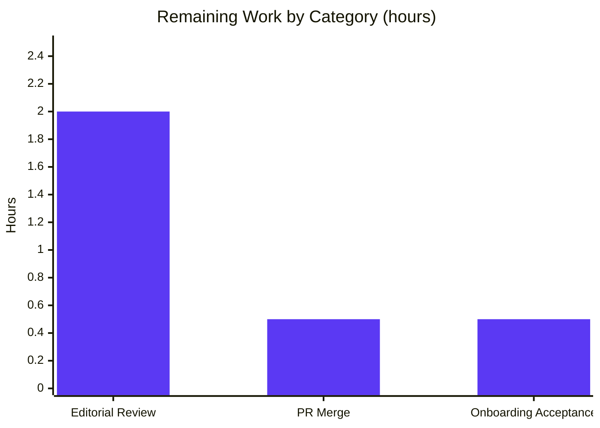

# Blitzy Project Guide

> **Project:** Behavioral Investigation & Documentation of `@automattic/explat-client`
> **Repository:** Automattic/wp-calypso (monorepo)
> **Branch:** `blitzy-61d951c6-a41e-4f0f-9378-67e594d212dc`
> **Base commit:** `be7e5cc641` · **HEAD:** `2e74991784`
> **Deliverable:** `blitzy/documentation/wp-calypso_be7e5cc64162.md`

---

## 1. Executive Summary

### 1.1 Project Overview

This project is a **read-only documentation deliverable** that answers five behavioral onboarding questions (Q0–Q4) about the standalone `@automattic/explat-client@0.1.0` experiment-assignment client. An onboarding developer wants the client's runtime contract confirmed before depending on it. The single output — `blitzy/documentation/wp-calypso_be7e5cc64162.md` — captures, for each question, the exact command run, complete verbatim output, responsible function with `file:line` references, and explicit OBSERVED/INFERRED labels. Every claim is grounded in the client's **real code paths exercised through its canonical public entry point**, not from reading source alone. The technical scope is deliberately isolated: one new Markdown file, zero changes to any source, test, config, or build file.

### 1.2 Completion Status

The project is **92.5% complete** on an AAP-scoped, hours-based basis. All eleven AAP deliverables are fully delivered and independently validated; the only remaining work is the human review/acceptance/merge tail that constitutes path-to-production for a documentation artifact.


| Metric | Hours |
|--------|-------|
| **Total Hours** | **40.0** |
| Completed Hours (AI: 37.0 + Manual: 0.0) | 37.0 |
| **Remaining Hours** | **3.0** |
| **Percent Complete** | **92.5%** |

> Formula: `Completed / (Completed + Remaining) × 100 = 37.0 / 40.0 × 100 = 92.5%`
> Legend colors — Completed = Dark Blue `#5B39F3`; Remaining = White `#FFFFFF`.

### 1.3 Key Accomplishments

- ✅ **Q0 baseline verified** — package Jest suite passes cleanly: 9 suites / 81 tests / 23 snapshots, exit 0 (independently reproduced this session).
- ✅ **Q1 "never throws" proven** — both server-unavailable (reject) and slow-server (timeout) paths return a null-variation (control) fallback with no exception escaping; timeout non-determinism (5000/10000 ms) reported as a 20-run distribution.
- ✅ **Q2 concurrency measured** — N simultaneous same-experiment loads collapse to exactly one network call (single-flight + per-name registry); multi-instance and multi-name cross-checks captured.
- ✅ **Q3 caching/TTL characterized** — cache hits serve repeats (1 fetch for 3 quick loads); post-TTL refetch confirmed; `isAlive` strict-`<` boundary and `minimumTtl` = 60 s exercised.
- ✅ **Q4 sync-getter-before-load characterized** — `dangerouslyGetExperimentAssignment` returns a null-variation fallback without breaking the app across the full getter × state × mode cross-product.
- ✅ **2,438-line answer document authored** — 107 OBSERVED / 25 INFERRED / 6 non-canonical labels, 66 balanced code blocks, 0 TODO/FIXME/placeholder.
- ✅ **18 prior QA review findings resolved** across two rework commits.
- ✅ **Read-only scope preserved** — net diff is exactly 1 file, +2,438 / −0; working tree pristine; zero dependency drift (yarn.lock immutable).

### 1.4 Critical Unresolved Issues

| Issue | Impact | Owner | ETA |
|-------|--------|-------|-----|
| _None_ | No blocking issues. All tests pass, all behaviors reproduced, code compiles, tree git-clean, no placeholders. | — | — |

### 1.5 Access Issues

| System/Resource | Type of Access | Issue Description | Resolution Status | Owner |
|-----------------|----------------|-------------------|-------------------|-------|
| _n/a_ | — | No access issues identified. The investigation ran entirely against the local workspace using an injected fetch stub (the client's canonical DI seam); the production assignment server is never contacted, and no credentials, API keys, or repository permissions were required. | Resolved / N/A | — |

**No access issues identified.**

### 1.6 Recommended Next Steps

1. **[Medium]** Technical/editorial review of `blitzy/documentation/wp-calypso_be7e5cc64162.md` for accuracy and onboarding usefulness (spot-check a few `file:line` references and verbatim outputs against source). — 2.0h
2. **[Medium]** Review the PR and merge the deliverable to trunk. — 0.5h
3. **[Low]** Onboarding-developer acceptance — confirm the document answers the five integration questions well enough to depend on the client. — 0.5h
4. **[Low]** _(Optional, out-of-scope)_ If integrating via Calypso, separately investigate consumers `client/lib/explat/**` and `packages/explat-client-react-helpers/**` (excluded by AAP §0.5.2).
5. **[Low]** _(Optional, out-of-scope)_ Re-verify `file:line` references if `@automattic/explat-client` source changes after revision `be7e5cc641` (doc-drift mitigation).

---

## 2. Project Hours Breakdown

### 2.1 Completed Work Detail

Every completed component traces to a specific AAP requirement (question, methodology, deliverable authoring, environment, cleanup, or QA resolution).

| Component | Hours | Description |
|-----------|-------|-------------|
| A. Environment & toolchain provisioning | 1.5 | Corepack + Yarn 4.0.2 activation, Node 22.x reconciliation, `CI=true yarn install`; runtime-version reconciliation documented. |
| B. Q0 test-baseline verification | 1.0 | Ran package Jest suite; recorded verbatim 9 suites / 81 tests / 23 snapshots pass. |
| C. Q1 never-throw investigation | 6.0 | Reject (empty store), reject (stale cache → stale kept), and timeout paths; 20-run timeout distribution; response-shape capture. Largest section (612 lines). |
| D. Q2 concurrency/dedup investigation | 4.0 | N=8 → 1 fetch; per-name registry; 2-instance → 2 fetches; shared error blast-radius (457 lines). |
| E. Q3 caching/TTL investigation | 3.0 | 3 quick loads → 1 fetch; past-TTL refetch; strict-`<` boundary; `minimumTtl` = 60 s (254 lines). |
| F. Q4 async-load-vs-sync-getter | 5.0 | Full getter × state × dev/prod-mode cross-product; in-flight → null fallback; maybe-getter → null (581 lines). |
| G. Methodology & canonical harness | 3.0 | `setBrowserContext`, DI-seam injection, canonical-entry probe, no-pre-build resolver explanation (~211 lines). |
| H. Answer-document authoring & synthesis | 6.0 | Authoring the 2,438-line branch-named Markdown with per-Q commands, verbatim outputs, `file:line`, labels, coverage pass. |
| I. Open-handle demo + Response-shape/Config contract | 1.5 | `--detectOpenHandles` leaked-timer demo (timing.ts:30); `ExperimentAssignment`/`Config` shape documentation. |
| J. Cleanup & repository hygiene | 1.0 | Deleted all temporary observation specs; confirmed `git status --porcelain` empty. |
| K. QA review-findings resolution | 5.0 | Resolved 18 review findings (F1–F18) across two rework commits (+865 / −102 net final commit). |
| **Total Completed** | **37.0** | **Matches Completed Hours in Section 1.2.** |

### 2.2 Remaining Work Detail

Each remaining item is path-to-production work (human review/acceptance/merge) for a documentation deliverable.

| Category | Hours | Priority |
|----------|-------|----------|
| Human technical/editorial review of the document (accuracy + onboarding usefulness) | 2.0 | Medium |
| PR review & merge to trunk | 0.5 | Medium |
| Onboarding-developer acceptance (confirm it answers integration questions) | 0.5 | Low |
| **Total Remaining** | **3.0** | — |

> **Integrity:** Section 2.1 (37.0) + Section 2.2 (3.0) = **40.0** = Total Project Hours in Section 1.2. Section 2.2 total (3.0) = Section 1.2 Remaining = Section 7 "Remaining Work".

### 2.3 Notes

No manual (human) hours have been logged yet; all 37.0 completed hours are autonomous (AI) work. The remaining 3.0h are anticipated human hours not yet performed.

---

## 3. Test Results

All tests below originate from Blitzy's autonomous validation logs for this project. Framework: **Jest 29.7.0** under the shared `@automattic/calypso-jest` preset (resolver maps `calypso:src` → untranspiled TypeScript, `testEnvironment: node`), so tests run directly against `.ts` with no pre-build.

| Test Category | Framework | Total Tests | Passed | Failed | Coverage % | Notes |
|---------------|-----------|-------------|--------|--------|------------|-------|
| Unit — Q0 package baseline suite | Jest 29.7.0 | 81 | 81 | 0 | Not instrumented¹ | 9 suites / 23 snapshots; exit 0; independently re-run this session with identical totals. |
| Behavioral observation specs (Q1–Q4 + open-handle) | Jest 29.7.0 | 17 | 17 | 0 | N/A² | 8 temporary specs exercising the canonical entry + DI seam; run to capture output, then deleted (read-only scope). |
| **Total** | **Jest 29.7.0** | **98** | **98** | **0** | — | No failing or blocked tests. |

**Q0 baseline — 9 passing suites:** `requests`, `index`, `experiment-assignment-store`, `timing`, `create-ssr-safe-dummy-explat-client`, `local-storage`, `experiment-assignments`, `validations`, `create-explat-client`.

¹ Coverage was not instrumented because this is a behavioral Q&A investigation, not a coverage-driven task; the package's own suite exercises all 10 source modules.
² Observation specs were ephemeral (created → run → deleted) and are not part of the committed tree; their purpose was runtime observation, not coverage.

**Benign notices (do not fail any test):** a Browserslist "17 months old" data notice, and one "A worker process has failed to exit gracefully" warning caused by a leaked `setTimeout` in `Timing.timeoutPromise` (timing.ts:30), demonstrated with `--detectOpenHandles` in the deliverable.

---

## 4. Runtime Validation & UI Verification

This project has **no UI surface** — the subject is a Node.js library and the deliverable is a static Markdown document. Runtime validation therefore consists of exercising the client's real code paths through its canonical public entry point and confirming each documented behavior.

**Runtime behavioral validation:**

- ✅ **Operational** — Canonical entry point exercised: `setBrowserContext()` sets `global.window = {}` before `require('../index')`, ensuring the real browser client (not the SSR dummy) runs. Guard confirmed at `create-explat-client.ts:72-74`; entry gate at `index.ts:8-9`.
- ✅ **Operational** — Q1a: fetch rejects (empty store) → null-variation fallback `{ ttl: 60, isFallbackExperimentAssignment: true }`, exactly 1 fetch, no throw.
- ✅ **Operational** — Q1a-stale: failed refetch returns the stale stored assignment (not a fresh fallback).
- ✅ **Operational** — Q1b: timeout → null fallback; message `Promise has timed-out after (5000|10000)ms.`; distribution over 20 runs confirms both arms occur.
- ✅ **Operational** — Q2: N=8 same-name concurrent → exactly 1 fetch; 2 instances → 2 fetches; 4 callers / 2 names → 2 fetches; rejecting in-flight → all callers get the same fallback.
- ✅ **Operational** — Q3: 3 quick loads → 1 fetch; load past TTL → 2nd fetch; exact-boundary strict-`<` in `isAlive`.
- ✅ **Operational** — Q4: `dangerouslyGetExperimentAssignment` never throws across the full mode × state cross-product; in-flight → null fallback; `dangerouslyGetMaybeLoadedExperimentAssignment` → `null`; dev-mode logs only.
- ✅ **Operational** — Open-handle demo: `--detectOpenHandles` shows 1 leaked `Timeout` at `timing.ts:30` (benign; source of the worker-exit warning).

**API integration:** ✅ Operational via the dependency-injection seam `config.fetchExperimentAssignment` (requests.ts:87-90) — the client's intended, canonical observation boundary. No live external API was contacted (by design).

**UI verification:** ⚠ N/A — no web UI exists for this package; no browser screenshots or Lighthouse audits are applicable.

---

## 5. Compliance & Quality Review

AAP deliverables cross-mapped to Blitzy quality/compliance benchmarks. All items pass.

| AAP Deliverable / Benchmark | Requirement | Status | Progress | Notes |
|------------------------------|-------------|--------|----------|-------|
| Q0 — test baseline | Suite passes, totals recorded verbatim | ✅ Pass | 100% | 9/81/23, exit 0; independently reproduced. |
| Q1 — never-throw contract | Reject + timeout paths, response shape, assigned variation | ✅ Pass | 100% | Null-variation control fallback; 20-run timeout distribution. |
| Q2 — concurrency/dedup | Count network calls under concurrent loads | ✅ Pass | 100% | Exactly 1 fetch per name/instance; single-flight verified. |
| Q3 — caching/TTL | Cache hits vs refetch after TTL | ✅ Pass | 100% | 1 fetch for 3 loads; refetch past TTL; strict-`<` boundary. |
| Q4 — async load vs sync getter | Sync getter before load resolves | ✅ Pass | 100% | Null fallback, no crash; full cross-product. |
| Investigate-then-write rule | Answers from observed output, not reading alone | ✅ Pass | 100% | Every claim has command + verbatim output. |
| Read-only scope | No existing file modified; only the doc added | ✅ Pass | 100% | Diff = 1 file, +2,438 / −0. |
| Canonical entry point | Exercise real browser client, label non-canonical | ✅ Pass | 100% | 6 non-canonical labels applied where relevant. |
| Run-to-run inconsistency | Report distribution, not a stabilized variant | ✅ Pass | 100% | Timeout reported as 20-run distribution. |
| Verbatim output for every claim | Complete, unedited output included | ✅ Pass | 100% | 66 balanced code blocks. |
| Observed vs inferred labeling | Label inferred statements | ✅ Pass | 100% | 107 OBSERVED / 25 INFERRED labels. |
| Coverage pass | Every named mechanism addressed by name | ✅ Pass | 100% | Dedicated coverage-pass section. |
| Cleanup / git-clean | Temp specs removed; tree pristine | ✅ Pass | 100% | `git status --porcelain` empty. |
| Zero dependency drift | No packages added/changed | ✅ Pass | 100% | yarn.lock checksum unchanged after immutable install. |
| Zero placeholders | No TODO/FIXME/stub | ✅ Pass | 100% | 0 placeholder markers. |

**Fixes applied during autonomous validation:** 18 prior QA review findings (F1–F18) were resolved across two rework commits, progressing the deliverable from initial draft → byte-exact canonical rewrite → finding resolution. **Outstanding compliance items:** none.

---

## 6. Risk Assessment

| Risk | Category | Severity | Probability | Mitigation | Status |
|------|----------|----------|-------------|------------|--------|
| T1 — Q1b timeout non-determinism (5000/10000 ms via `Math.random`) could be misread as deterministic | Technical | Low | Low | Documented explicitly as a 20-run distribution with both arms observed, plus the randomization rationale | Mitigated |
| T2 — Documentation-source drift: `file:line` references pinned to revision `be7e5cc641` may go stale if source changes | Technical | Low | Medium | Investigated revision labeled in the document header; refs verifiable against that commit | Open / Accepted (inherent to code-referencing docs) |
| T3 — Benign "worker failed to exit gracefully" Jest warning (leaked `setTimeout`) could be mistaken for a failure | Technical | Low | Low | Dedicated `--detectOpenHandles` demo shows the leak at `timing.ts:30` and confirms it fails nothing | Mitigated |
| _None_ | Security | — | — | Read-only doc; no production code/deps/credentials introduced or changed; assignment server never contacted (DI stub); yarn.lock immutable | No risk identified |
| O1 — Temporary observation specs could be left behind | Operational | Low | Low | `rm -v` cleanup + `git status --porcelain` empty independently confirmed | Closed |
| I1 — Calypso consumers (`client/lib/explat/**`, `packages/explat-client-react-helpers/**`) not covered | Integration | Low | N/A | Explicitly out of scope per AAP §0.5.2; document scoped to the standalone client only; consumers labeled out-of-scope | Accepted (scope boundary by design) |

There is **no CI/CD, deployment, or monitoring surface** — the artifact is a static Markdown file with nothing to deploy or operate at runtime.

---

## 7. Visual Project Status


**Remaining hours by category (Section 2.2):**



> **Integrity:** Pie "Remaining Work" = **3.0h** = Section 1.2 Remaining = Section 2.2 total. Pie "Completed Work" = **37.0h** = Section 1.2 Completed = Section 2.1 total. Colors: Completed = Dark Blue `#5B39F3`, Remaining = White `#FFFFFF`.

---

## 8. Summary & Recommendations

**Achievements.** The project delivers a rigorous, code-grounded behavioral investigation of `@automattic/explat-client@0.1.0`. All five questions (Q0–Q4) are answered from observed runtime behavior exercised through the client's canonical public entry point, with verbatim outputs and `file:line` references throughout. The Q0 baseline (9 suites / 81 tests / 23 snapshots) was independently reproduced, all Q1–Q4 behaviors were reproduced via temporary observation specs, and 18 prior QA findings were resolved. The repository remains git-clean with a diff of exactly one file (+2,438 / −0) and zero dependency drift.

**Remaining gaps.** None technical. The outstanding 3.0h is entirely human review/acceptance/merge — the path-to-production tail for a documentation artifact.

**Critical path to production.** (1) Technical/editorial review of the document → (2) onboarding-developer acceptance → (3) PR review & merge. No engineering rework, configuration, or deployment is required.

**Production readiness assessment.** The project is **92.5% complete** (37.0h of 40.0h). The autonomous deliverable is complete, validated, and byte-accurate; per Blitzy honesty principles, completion is capped below 100% pending human review. This deliverable is **ready for review and merge**.

| Success Metric | Target | Actual | Status |
|----------------|--------|--------|--------|
| Q0 suite passing | 9/81/23 | 9/81/23, exit 0 | ✅ |
| Q1–Q4 behaviors reproduced | 4/4 | 4/4 | ✅ |
| Read-only scope (files changed) | 1 (doc only) | 1 (+2,438 / −0) | ✅ |
| Dependency drift | 0 | 0 (yarn.lock unchanged) | ✅ |
| Placeholders / TODOs | 0 | 0 | ✅ |
| Working tree clean | Yes | Yes (pristine) | ✅ |

---

## 9. Development Guide

All commands below were executed and verified this session. Run from the repository root unless noted. The repository root is the directory containing the top-level `package.json` (name `wp-calypso`).

### 9.1 System Prerequisites

- **Node.js 22.x** — repository `engines` requires `^v22.9.0`; `.nvmrc` pins `22.9.0` (verified running `v22.23.1`).
- **Yarn 4.0.2** — pinned via root `packageManager: "yarn@4.0.2"`; `engines` requires `yarn ^4.0.0`.
- **Corepack** — ships with Node; used to activate the pinned Yarn (verified `0.34.6`).
- **Git** — any recent version (verified `2.51.0`).
- **OS:** Linux/macOS (developed and validated on Linux).

### 9.2 Environment Setup

```bash
# From the repository root. Pin Node to the repo's version if using nvm:
nvm use            # reads .nvmrc (22.9.0); or: nvm install 22

# Activate the exact Yarn version pinned by packageManager (yarn@4.0.2):
corepack enable

# Verify toolchain:
node --version     # -> v22.x (e.g., v22.23.1)
yarn --version     # -> 4.0.2
```

The client is configured entirely through dependency injection (its `Config` object), not environment variables. The only environment variable used during validation is `CI=true` to prevent interactive/watch modes in Node tooling.

### 9.3 Dependency Installation

```bash
# From the repository root. Immutable install verifies zero lockfile drift:
CI=true yarn install --immutable
# Expected tail:
#   ➤ YN0000: · Done in ~6s
# Exit code 0. yarn.lock checksum is unchanged (no dependency drift).
```

`node_modules/` and `packages/*/dist/` are gitignored build/install artifacts; their presence does not affect the tracked tree.

### 9.4 Verify the Q0 Baseline (application "startup" for a library)

No pre-build is required — the `@automattic/calypso-jest` resolver maps `calypso:src` to untranspiled TypeScript, so tests run directly against `.ts` source.

```bash
cd packages/explat-client
CI=true yarn jest --ci
# Expected tail:
#   Test Suites: 9 passed, 9 total
#   Tests:       81 passed, 81 total
#   Snapshots:   23 passed, 23 total
#   Time:        ~2.4 s
# Exit code 0.
```

**Expected benign notices (do NOT indicate failure):**
- `Browserslist: browsers data (caniuse-lite) is 17 months old.` — a data-freshness notice.
- `A worker process has failed to exit gracefully ...` — a leaked `setTimeout` in `Timing.timeoutPromise` (timing.ts:30); it fails no test.

### 9.5 (Optional) Build the Package

```bash
cd packages/explat-client
yarn build          # tsc --build ./tsconfig.json ./tsconfig-cjs.json ; exit 0
# Emits dist/{cjs,esm,types} — all gitignored.
```

### 9.6 Reproduce the Q1–Q4 Observations (methodology)

The behavioral answers were produced with temporary Jest specs placed under `packages/explat-client/src/test/` (the preset's `testMatch` `**/test/*.[jt]s?(x)` discovers them). Each spec follows this canonical pattern:

```ts
// packages/explat-client/src/test/blitzy_tmp_observation.ts  (TEMPORARY — delete after use)
import { setBrowserContext } from '../internal/test-common';

it( 'observes client behavior through the canonical entry', async () => {
    // MANDATORY: define window BEFORE requiring the client, otherwise
    // index.ts:8-9 returns the SSR dummy (non-canonical) and
    // create-explat-client.ts:72-74 would throw 'Running outside of a browser context.'
    setBrowserContext();                       // sets global.window = {}
    const { createExPlatClient } = require( '../index' );  // canonical public entry

    // Inject the canonical DI seam to drive/count network behavior:
    const fetchStub = jest.fn().mockRejectedValue( new Error( 'server unavailable' ) );
    const client = createExPlatClient( {
        fetchExperimentAssignment: fetchStub,
        getAnonId: async () => 'anon',
        logError: () => undefined,
        isDevelopmentMode: false,
    } );

    const result = await client.loadExperimentAssignment( 'experiment_name' );
    console.log( JSON.stringify( result ) );   // observe the returned object
    console.log( 'fetch calls:', fetchStub.mock.calls.length );
} );
```

Run it, capture the output, then **delete the spec** and confirm the tree is clean:

```bash
cd packages/explat-client
CI=true yarn jest --ci src/test/blitzy_tmp_observation.ts
rm -v src/test/blitzy_tmp_observation.ts
cd -                    # back to repo root
git status --porcelain --untracked-files=all   # -> empty (pristine)
```

### 9.7 Verify Read-Only Scope / Git Cleanliness

```bash
git status --porcelain --untracked-files=all    # -> empty (working tree pristine)
git diff --check be7e5cc641..HEAD               # -> clean, exit 0 (no whitespace/EOF errors)
git diff --stat be7e5cc641..HEAD                # -> 1 file changed, 2438 insertions(+)
```

### 9.8 View the Deliverable

```bash
# 2,438 lines / 134,870 bytes:
less blitzy/documentation/wp-calypso_be7e5cc64162.md
```

### 9.9 Troubleshooting

- **`Error: Running outside of a browser context.`** — You required the client before defining `window`. Call `setBrowserContext()` (or set `global.window = {}`) **before** `require('../index')`.
- **Methods silently return null-variation fallbacks with no error** — `window` was undefined, so the SSR dummy (index.ts:8-9) is active; its values are non-canonical. Set `global.window` to exercise the real browser client.
- **`A worker process has failed to exit gracefully`** — Benign leaked timer from `Timing.timeoutPromise` (timing.ts:30). Diagnose with `CI=true yarn jest --ci --detectOpenHandles`; it fails no test.
- **`yarn --version` is not 4.0.2** — Run `corepack enable` to activate the version pinned by `packageManager`.
- **Node version mismatch** — Use Node 22.x (`nvm use` reads `.nvmrc`); the client is validated at the repository-authoritative Node 22.x.
- **Install reports lockfile changes** — Use `CI=true yarn install --immutable`; a non-empty diff indicates unintended dependency drift and should be reverted.

---

## 10. Appendices

### A. Command Reference

| Purpose | Command |
|---------|---------|
| Check Node version | `node --version` |
| Check Yarn version | `yarn --version` |
| Activate pinned Yarn | `corepack enable` |
| Install (immutable) | `CI=true yarn install --immutable` |
| Q0 baseline suite | `cd packages/explat-client && CI=true yarn jest --ci` |
| Build package (optional) | `cd packages/explat-client && yarn build` |
| Find open handles | `CI=true yarn jest --ci --detectOpenHandles` |
| Tree cleanliness | `git status --porcelain --untracked-files=all` |
| Whitespace/EOF check | `git diff --check be7e5cc641..HEAD` |
| Diff stat vs base | `git diff --stat be7e5cc641..HEAD` |
| View deliverable | `less blitzy/documentation/wp-calypso_be7e5cc64162.md` |

### B. Port Reference

**N/A.** This project starts no server and binds no ports. The client makes outbound assignment requests only through the injected `config.fetchExperimentAssignment` boundary, which is stubbed during observation; nothing listens on a port.

### C. Key File Locations

| Path | Role |
|------|------|
| `blitzy/documentation/wp-calypso_be7e5cc64162.md` | **The deliverable** (2,438 lines / 134,870 bytes). |
| `packages/explat-client/src/index.ts` | Public entry gate: SSR dummy vs browser client (`:8-9`). |
| `packages/explat-client/src/create-explat-client.ts` | Core factory: load/dangerous getters, timeout A/B, per-name registry, browser guard (`:72-74`). |
| `packages/explat-client/src/internal/timing.ts` | `asyncOneAtATime` single-flight (`:44-54`), `timeoutPromise` (`:23-36`), leaked timer (`:30`). |
| `packages/explat-client/src/internal/experiment-assignments.ts` | `isAlive` (`:8-14`), `minimumTtl`=60 (`:21`), `createFallbackExperimentAssignment` (`:29-38`). |
| `packages/explat-client/src/internal/requests.ts` | DI network boundary `config.fetchExperimentAssignment` (`:87-90`). |
| `packages/explat-client/src/internal/experiment-assignment-store.ts` | localStorage-backed cache (`explat-experiment--<name>`). |
| `packages/explat-client/src/internal/test-common.ts` | `setBrowserContext` (`:22-26`) — canonical observation harness. |
| `packages/explat-client/src/types.ts` | `ExperimentAssignment` / `Config` shapes (39 lines). |
| `packages/explat-client/README.md` / `CHANGELOG.md` | Documented contract ("never throw", TTL) and history. |
| `test/packages/jest-preset.js` | `@automattic/calypso-jest` preset (calypso:src → .ts resolver). |

### D. Technology Versions

| Technology | Version | Source |
|------------|---------|--------|
| Node.js | v22.23.1 (engines `^v22.9.0`; `.nvmrc` `22.9.0`) | verified |
| Yarn | 4.0.2 (`packageManager`) | verified |
| Corepack | 0.34.6 | verified |
| Git | 2.51.0 | verified |
| Jest | ^29.7.0 | `packages/explat-client/package.json` |
| TypeScript | ^5.8.2 | `packages/explat-client/package.json` |
| tslib | ^2.3.0 | `packages/explat-client/package.json` (only runtime dep) |
| `@automattic/explat-client` | 0.1.0 | package under investigation |

### E. Environment Variable Reference

| Variable | Value | Purpose |
|----------|-------|---------|
| `CI` | `true` | Prevents interactive/watch modes in Node tooling and Jest. |

> The client itself takes **no environment variables**. Its runtime behavior is configured through the injected `Config` object (`fetchExperimentAssignment`, `getAnonId`, `logError`, `isDevelopmentMode`) — the canonical dependency-injection seam.

### F. Developer Tools Guide

| Tool | Use |
|------|-----|
| **Jest** (`yarn jest --ci`) | Run the Q0 baseline suite and temporary observation specs; `--detectOpenHandles` to diagnose the benign leaked timer. |
| **tsc** (`yarn build`, `tsc --noEmit`) | Optional type-check/build; emits gitignored `dist/`. |
| **git** | Verify read-only scope: `git status --porcelain`, `git diff --check`, `git diff --stat`. |
| Chrome DevTools / Lighthouse | **N/A** — no web UI in scope. |

### G. Glossary

| Term | Definition |
|------|------------|
| **Single-flight** | Request-coalescing pattern where multiple identical concurrent requests are merged into one backend call; all callers await the shared result. Implemented by `asyncOneAtATime` (timing.ts:44-54). |
| **Fallback assignment** | The control-experience result returned on failure: `{ variationName: null, isFallbackExperimentAssignment: true, ttl: ≥60 }`. `variationName: null` denotes the default (control) experience. |
| **TTL / `isAlive`** | Time-to-live gate; a stored assignment is served without a network call while `monotonicNow() < ttl*1000 + retrievedTimestamp` (strict `<`). `minimumTtl` floor = 60 s. |
| **SSR-safe dummy** | The non-canonical client returned by `index.ts:8-9` when `window` is undefined; logs and returns fallbacks for every method. Must be avoided for canonical observation. |
| **DI seam** | The dependency-injection boundary `config.fetchExperimentAssignment` (requests.ts:87-90) — the client's intended, canonical point for observing/counting network behavior. |
| **Canonical entry point** | The real browser client obtained via the public `createExPlatClient` export when `window` exists; values from the dummy/fallback/synthetic stand-ins are labeled non-canonical. |
| **OBSERVED / INFERRED** | Labels distinguishing claims backed by captured runtime output (OBSERVED) from code-derived reasoning (INFERRED). |
| **Open handle** | A leaked async resource (here, a `setTimeout` at timing.ts:30) that keeps a Jest worker alive, producing the benign "worker failed to exit gracefully" warning. |

---

*Cross-section integrity verified before submission: Remaining hours = 3.0h identical across Sections 1.2, 2.2, and 7; Section 2.1 (37.0) + Section 2.2 (3.0) = 40.0h Total; all tests originate from Blitzy autonomous validation logs; no access issues; brand colors applied (Completed `#5B39F3`, Remaining `#FFFFFF`).*