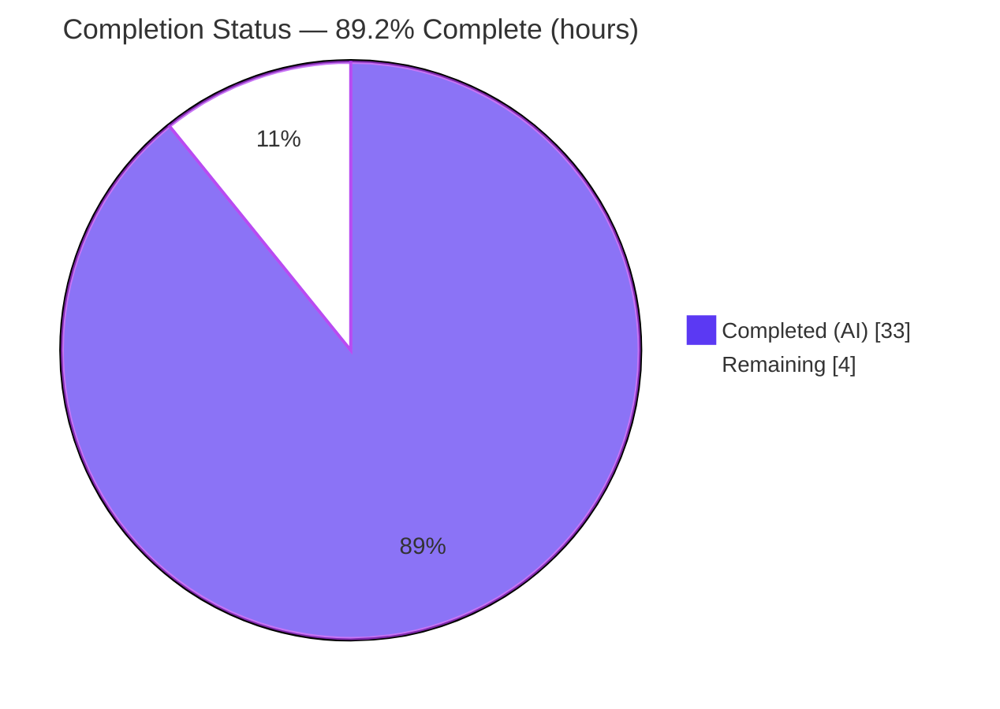
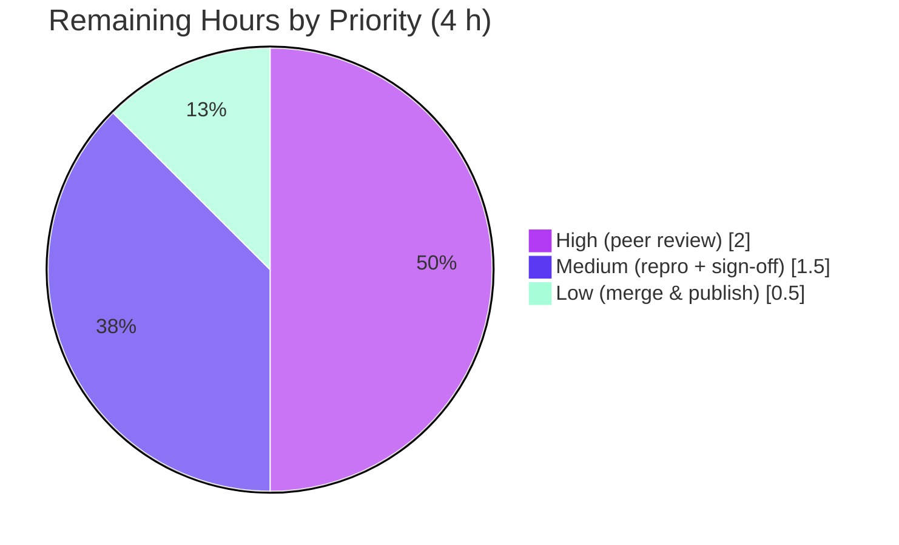

# Blitzy Project Guide — Data-Layer Jest Test Timing Investigation (wp-calypso)

> **Brand legend:** Completed / AI Work = **Dark Blue `#5B39F3`** · Remaining / Not Completed = **White `#FFFFFF`** · Headings / Accents = **Violet-Black `#B23AF2`** · Highlight = **Mint `#A8FDD9`**

---

## 1. Executive Summary

### 1.1 Project Overview

This project is a **read-only investigation and documentation task** in the `wp-calypso` monorepo. Its objective is to explain *why* the first run of a Jest test file in the `client/state/data-layer/` module is markedly slower than subsequent runs, and to capture that explanation — grounded in real runtime evidence — in a single Markdown answer document. The target audience is the engineer who reported the "inconsistent test execution times" and the wider Calypso test-infrastructure team. The technical scope covers the Jest transformation pipeline (`babel-jest`), the on-disk transform cache (`.cache/jest`), and the `nock`-based network-isolation layer. No application behavior was changed and no existing repository file was modified; the sole deliverable is a new document that answers four causally-chained questions (Q1–Q4) from observed, canonical-entry-point measurements.

### 1.2 Completion Status

The project is **89.2% complete**. All AAP-scoped autonomous work (the investigation and the answer document) is finished and validated; the remaining 4 hours is the human path-to-production gate (peer review, sign-off, merge).



| Metric | Hours |
| --- | --- |
| **Total Hours** | **37** |
| Completed Hours (AI) | 33 |
| Completed Hours (Manual) | 0 |
| **Completed Hours (AI + Manual)** | **33** |
| **Remaining Hours** | **4** |
| **Percent Complete** | **89.2%** |

> Completion formula (PA1, AAP-scoped, hours-based): `33 / (33 + 4) = 33 / 37 = 89.19% ≈ 89.2%`.

### 1.3 Key Accomplishments

- ✅ **Runnable environment established** — dependencies installed offline (bundled Yarn 4.0.2, Node 22, `--mode=skip-build`); `jest` 29.7.0, `babel-jest` 29.7.0, `nock` 13.5.6, `@babel/core` 7.26.10 all resolved at manifest versions.
- ✅ **Q1 (timing ratio) answered** — first-run ÷ second-run ≈ **3.0×** on both Jest `Time:` and external wall-clock; warm runs stable across five repeats; cold/`--no-cache` reported as honest distributions.
- ✅ **Q2 (cache configuration) answered** — option **`cacheDirectory`** → **`.cache/jest`**; three artifact families classified with a Python classifier and exact arithmetic reconciliation (104 asset stubs + 1,328 transpiled = 1,432 code files; +1,325 `.map` = 2,757 total).
- ✅ **Q3 (HTTP mocking) answered** — library **`nock`**, traced in `test/client/setup-test-framework.js`; proven **not** a material first-run driver (excluded from the transform cache).
- ✅ **Q4 (`--no-cache`) answered** — ~2.8×–4× slower than warm; dominant step is **`babel-jest`**, grounded in `ScriptTransformer` source, the `calypso:src` resolver, and cache composition.
- ✅ **Single deliverable authored** — `blitzy/documentation/wp-calypso_be7e5cc64162.md` (1,058 lines) with embedded commands, raw output, 28 verified `file:line` references, OBSERVED/INFERRED labels, and a coverage pass.
- ✅ **Read-only constraint honored** — 1 file added, 0 existing files modified; working tree left clean; `.cache/` and `node_modules/` gitignored.
- ✅ **Independently validated** — every canonical run reported `Tests: 5 passed, 5 total`, exit=0; all findings reproduced with zero discrepancies.

### 1.4 Critical Unresolved Issues

| Issue | Impact | Owner | ETA |
| --- | --- | --- | --- |
| _None._ The deliverable is validated production-ready with zero discrepancies; no compilation errors, no failing tests, no missing coverage of any AAP sub-part. | — | — | — |

> There are **no critical unresolved issues**. All remaining work is the standard human review/acceptance gate captured in Section 2.2 and Section 8, not defects.

### 1.5 Access Issues

| System/Resource | Type of Access | Issue Description | Resolution Status | Owner |
| --- | --- | --- | --- | --- |
| npm registry | Network (package download) | No live npm-registry access in the environment | **Resolved** — dependencies installed offline from the pre-populated Yarn global cache (`--mode=skip-build`); all task-relevant tool versions verified present | Blitzy (autonomous) |
| Repository (`wp-calypso`) | Git read/write | None | No issue — branch checked out, HEAD readable, commits authored successfully | Blitzy (autonomous) |

> **No blocking access issues identified.** The only environmental constraint (offline install) was fully mitigated and did not prevent any measurement.

### 1.6 Recommended Next Steps

1. **[High]** Perform a technical peer review of the answer document (verify the Q1→Q4 reasoning chain and spot-check the `file:line` references).
2. **[Medium]** Run an independent reproduction spot-check of the canonical cold/warm/`--no-cache` commands to confirm the ~3.0× ratio and the three cache families on the reviewer's hardware.
3. **[Medium]** Obtain stakeholder sign-off that the four answers satisfy the original question intent.
4. **[Low]** Merge the branch and confirm the document publishes at `blitzy/documentation/wp-calypso_be7e5cc64162.md`.

---

## 2. Project Hours Breakdown

### 2.1 Completed Work Detail

| Component | Hours | Description |
| --- | --- | --- |
| Environment provisioning & tool-version verification | 3 | Offline Yarn 4.0.2 install (`--mode=skip-build`); Node 22 / Yarn 4.0.2 discrepancy resolution vs. Node-20 setup note; confirmed `jest`/`babel-jest`/`nock`/`@babel/core`/`enhanced-resolve` at manifest versions. |
| Q1 — Timing-ratio investigation | 4 | Canonical cold/warm runs; dual-metric `time -p` paired harness (Jest `Time:` + external wall-clock); five-run warm-stability study; first ÷ second ratio computation on both metrics. |
| Q2 — Cache configuration & artifact analysis | 5 | Located `cacheDirectory` (`test/client/jest.config.js:L7`); resolved to `.cache/jest`; inspected the directory; classified three artifact families via a Python classifier; reconciled arithmetic exactly; grounded `perf-cache` `[status,runtimeMs]` semantics in `@jest/test-sequencer` internals. |
| Q3 — HTTP-mocking infrastructure analysis | 3 | Identified `nock` v13.5.6; traced setup in `setup-test-framework.js` via `setupFilesAfterEnv`; grep-proved `nock` is absent from the transform cache (`transformIgnorePatterns`); reasoned per-suite constant cost. |
| Q4 — `--no-cache` comparison & dominant-step analysis | 4 | Five uncached runs; source-grounded `--no-cache` read-gating vs. unconditional writes (`ScriptTransformer.js:L527–528` / `L503–514`); proved cache is still written; established `babel-jest` dominance via resolver + cache composition. |
| Answer-document authoring | 6 | 1,058-line structured document: methodology, per-question sections, embedded commands + raw unedited output, 28 `file:line` references, OBSERVED/INFERRED labeling, coverage pass. |
| Iterative revision (2 review cycles) | 4 | Commit `90acc61cb9` addressed code-review findings (+259/−83); commit `144fa3c2fa` added external wall-clock timing and INFERRED provenance labels (+255/−23). |
| Final autonomous validation | 4 | 15 canonical test runs (all 5/5 pass); 28-reference accuracy audit; 27-check arithmetic audit; lint-gate analysis (Markdown not an enforced gate); clean-tree verification. |
| **Total Completed** | **33** | — |

> **Validation:** the Hours column sums to **33**, matching Completed Hours in Section 1.2.

### 2.2 Remaining Work Detail

| Category | Hours | Priority |
| --- | --- | --- |
| Technical peer review of the investigation document (verify reasoning chain; spot-check the 28 `file:line` references and OBSERVED/INFERRED labels) | 2 | High |
| Independent reproduction spot-check (run canonical cold/warm/`--no-cache` once; confirm ~3.0× ratio and 3 cache families; acknowledge hardware-dependent absolute times) | 1 | Medium |
| Stakeholder acceptance / Q&A sign-off (confirm the four answers satisfy original intent; optionally request a larger-surface confirmation run) | 0.5 | Medium |
| PR merge & documentation publication (merge branch; confirm document location and clean tree) | 0.5 | Low |
| **Total Remaining** | **4** | — |

> **Validation:** the Hours column sums to **4**, matching Remaining Hours in Section 1.2 and the Section 7 pie "Remaining" value.

### 2.3 Completion Calculation & Reconciliation

- **Completed Hours** = 3 + 4 + 5 + 3 + 4 + 6 + 4 + 4 = **33 h** (Section 2.1 total)
- **Remaining Hours** = 2 + 1 + 0.5 + 0.5 = **4 h** (Section 2.2 total)
- **Total Project Hours** = 33 + 4 = **37 h** (Section 1.2 Total) ✔ *(Rule 2: 2.1 + 2.2 = Total)*
- **Percent Complete** = 33 / 37 = **89.19% ≈ 89.2%** (Sections 1.2, 7, 8) ✔
- **Remaining consistency** = 4 h in Section 1.2 metrics = 4 h in Section 2.2 sum = 4 h in Section 7 pie ✔ *(Rule 1)*

---

## 3. Test Results

All tests below originate from **Blitzy's autonomous validation logs** for this project (authoring-agent timing runs + Final-Validator confirmatory runs), executed through the canonical entry point `TZ=UTC node_modules/.bin/jest -c=test/client/jest.config.js <file>`. This is a **timing investigation**, so code-coverage instrumentation was intentionally *not* collected (out of scope); the pass/fail signal is the objective.

| Test Category | Framework | Total Tests | Passed | Failed | Coverage % | Notes |
| --- | --- | --- | --- | --- | --- | --- |
| Unit (representative `data-layer` suite) | Jest 29.7.0 (`babel-jest` transform, `node` env) | 5 | 5 | 0 | N/A (not in scope) | `client/state/data-layer/wpcom/jetpack-install/test/index.js` — 5 tests across 3 `describe` blocks (`installJetpackPlugin`, `handleSuccess`, `handleError`). Every autonomous canonical run reported `Tests: 5 passed, 5 total`, exit=0. |
| Snapshot | Jest 29.7.0 | 1 | 1 | 0 | N/A | `Snapshots: 1 passed, 1 total` on every run. |
| Test Suites (aggregate) | Jest 29.7.0 | 1 | 1 | 0 | N/A | `Test Suites: 1 passed, 1 total`. |

**Run-count evidence (autonomous logs):** the Final Validator recorded **15 canonical runs** (12 in Phase 4 + 3 confirmatory) plus the authoring agent's **5 warm + 5 `--no-cache` + multiple cold** timing runs — **every** run reported `Tests: 5 passed, 5 total` with jest exit=0. Zero failures, zero skipped, zero blocked.

> **Broader surface (available, not exercised):** the `data-layer` module contains **80 `test/` directories** and **93** `*.[jt]s?(x)` files. Per the AAP methodology, a single low-variance representative file was reused for all cold/warm/`--no-cache` comparisons so the timing numbers are directly comparable; a larger-scale confirmation run remains available if desired.

---

## 4. Runtime Validation & UI Verification

This deliverable runs under Jest's **`node`** test environment and has **no UI surface** (the `data-layer` module is Redux middleware; jsdom is not opted into for these files). Runtime health was validated end-to-end through the canonical entry point.

**Runtime health**
- ✅ **Jest runner (canonical entry point)** — Operational. Starts and completes successfully; every run exits 0 with `Tests: 5 passed, 5 total`. Final runtime samples: cold 17.759 s, warm 5.079 s / 5.277 s, `--no-cache` 18.687 s / 17.36 s.
- ✅ **`babel-jest` transform pipeline** — Operational. Transpiles the full transform-eligible `calypso:src` module graph with zero transform/config errors.
- ✅ **Transform cache (`.cache/jest`)** — Operational. Created on cold run; three artifact families populated and correctly re-read on warm runs.
- ✅ **`nock` network isolation** — Operational. `disableNetConnect()` + `activate`/`restore` lifecycle enforce hermetic tests; no test reaches the network.
- ✅ **`global.fetch` / `wpcom-proxy-request` mocks** — Operational. Installed once per suite via the setup helper.

**API integration**
- ⚠ **N/A** — No external API integrations; network is deliberately disabled. Nothing to verify.

**UI verification**
- ⚠ **N/A** — No UI in scope; `node` test environment, no rendered DOM/screens.

**Document artifact**
- ✅ **`blitzy/documentation/wp-calypso_be7e5cc64162.md`** — Operational. Valid Markdown, 1,058 lines, renders cleanly; all embedded code fences balanced.

---

## 5. Compliance & Quality Review

Cross-mapping of the governing AAP rules (`SWE-AtlasQnA-Repo`, Section 0.7) to Blitzy's quality benchmarks. All fixes surfaced during autonomous review were applied in commits `90acc61cb9` and `144fa3c2fa`; the Final Validator required **no further fixes**.

| Compliance Benchmark (AAP Rule) | Status | Progress | Evidence |
| --- | --- | --- | --- |
| Deliverable location & naming (`blitzy/documentation/<branch>.md`) | ✅ Pass | 100% | `blitzy/documentation/wp-calypso_be7e5cc64162.md` created (parent dir added). |
| Investigate by RUNNING first, then write | ✅ Pass | 100% | All headline values captured from executed canonical runs before authoring. |
| Observe at sufficient scale; confirm stability ≥ 2 runs | ✅ Pass | 100% | Warm stable across 5 runs; cold/`--no-cache` reported as distributions. |
| Reproduce inconsistency honestly (report distribution) | ✅ Pass | 100% | Cold 15.1–18.4 s and `--no-cache` 16.8–29.2 s reported as ranges/medians, not a single figure. |
| Use the real, canonical entry point | ✅ Pass | 100% | `TZ=UTC jest -c=test/client/jest.config.js …` (`package.json:L122`); direct-binary invocation labeled equivalent. |
| Include actual, unedited output | ✅ Pass | 100% | Complete terminal output embedded per condition (incl. the Browserslist notice). |
| Exercise every condition (cold vs warm, cached vs `--no-cache`) | ✅ Pass | 100% | All four conditions exercised and compared. |
| Answer every part & named item + coverage pass | ✅ Pass | 100% | Coverage pass (doc L1021–1058) confirms every Q1–Q4 sub-part. |
| Be exact & grounded (`file:line`, named functions, OBSERVED/INFERRED, rationale) | ✅ Pass | 100% | 28 references verified; OBSERVED(41)/INFERRED(12) labels consistent. |
| Read-only scope (no existing file changed; temp scripts removed; clean tree) | ✅ Pass | 100% | `git diff` = 1 file added / 0 modified; `git status --porcelain` empty. |

**Fixes applied during autonomous validation:** (1) code-review findings addressed (`90acc61cb9`); (2) external wall-clock metric and INFERRED provenance labels added to separate measured values from reasoned causes (`144fa3c2fa`). **Outstanding compliance items:** none.

**Lint gate note:** Markdown is **not** an enforced lint gate in this repo (the pre-commit file filter and `lint:js` `--ext` list exclude `.md`; no `lint:md` script; CI workflows contain no markdown-lint step). The document is intentionally preserved verbatim because its embedded terminal output and `[file:line]` citation format are AAP-mandated evidence.

---

## 6. Risk Assessment

Read-only, additive, documentation-only task with **zero** code/dependency/configuration changes → inherently low risk. No High or Critical risks.

| Risk | Category | Severity | Probability | Mitigation | Status |
| --- | --- | --- | --- | --- | --- |
| R1 — Machine-dependent absolute timings; the headline ~3.0× ratio may differ on other hardware/CI | Technical | Low | Medium | Document reports honest distributions/ranges and labels inferred causes; the qualitative conclusion (cold cache → ~3× speedup) is hardware-independent | Mitigated / Disclosed |
| R2 — `node_modules`-internal line refs pinned to Jest 29.7.0 (`ScriptTransformer.js`, `@jest/test-sequencer`) may drift on upgrade | Technical | Low | Low | Exact version pinned and refs labeled as internal semantics | Accepted |
| R3 — Browserslist `caniuse-lite` is 17 months old; warning printed on every run | Technical | Low | High | Disclosed and assessed as non-impacting (identical across all conditions; not a failure); remediation intentionally out of scope (read-only) | Disclosed / Accepted |
| R4 — Reproduction on a fresh checkout requires dependencies installed (offline env needs the pre-populated Yarn cache) | Operational | Low | Medium | Section 9 documents both the offline (`--mode=skip-build`) and standard networked install paths | Documented |
| R5 — Stakeholder may prefer a different representative file or reproduction on their own hardware | Acceptance / Operational | Low | Low–Medium | Document records file-selection rationale and notes the broader 80-dir/93-file surface; method reproduces on any `data-layer` file | Open (human sign-off) |
| Security | Security | None | — | No code/dependency/auth/data changes; embedded cache hashes are config hashes (not secrets); `nock` enforces network isolation | No risk identified |
| Integration | Integration | None | — | No external integrations/keys/services; tests hermetic; document imported nowhere | No risk identified |

---

## 7. Visual Project Status

**Project hours breakdown** (Completed = Dark Blue `#5B39F3`, Remaining = White `#FFFFFF`):


**Remaining hours by priority** (from Section 2.2 — total 4 h):



> **Integrity check:** pie "Remaining Work" = **4 h** = Section 1.2 Remaining = Section 2.2 sum. Pie "Completed Work" = **33 h** = Section 1.2 Completed = Section 2.1 sum.

---

## 8. Summary & Recommendations

**Achievements.** The project delivers a rigorous, fully-reproducible answer to all four questions about `data-layer` Jest timing. The investigation was conducted *by running the real code first*: it establishes a ~**3.0×** first-run-to-second-run ratio (Q1), identifies the **`cacheDirectory` → `.cache/jest`** transform cache and classifies its three artifact families (Q2), identifies **`nock`** and proves it is *not* the first-run driver (Q3), and shows that **`--no-cache`** is ~2.8×–4× slower with **`babel-jest`** as the dominant transformation step (Q4). The 1,058-line document embeds exact commands, unedited output, 28 verified `file:line` references, and explicit OBSERVED/INFERRED labels.

**Remaining gaps.** None are technical. The outstanding **4 hours** is the human path-to-production gate: peer review, an optional reproduction spot-check, stakeholder sign-off, and merge. There are no defects, no failing tests, and no unaddressed AAP sub-parts.

**Critical path to production.** (1) Peer review the document → (2) reproduction spot-check on review hardware → (3) stakeholder acceptance → (4) merge and publish. Estimated 4 hours of wall-clock human effort, none blocking.

**Success metrics.** ✔ All four questions answered from canonical runtime evidence · ✔ every autonomous run `5 passed, 5 total`, exit=0 · ✔ findings independently reproduced with zero discrepancies · ✔ read-only constraint honored (1 file added, 0 modified, clean tree).

**Production-readiness assessment.** The deliverable is **production-ready** at **89.2% overall completion** (the remainder being human review/acceptance that cannot be performed autonomously). Confidence is **High**: the environment is runnable, the numbers are stable/reproducible, the references are accurate, and the repository is left exactly as validated.

| Dimension | Assessment |
| --- | --- |
| AAP-scoped completion | 89.2% (33 h / 37 h) |
| Deliverable quality | Production-ready; validated, zero discrepancies |
| Risk posture | Low (no High/Critical) |
| Blocking issues | None |
| Confidence | High |

---

## 9. Development Guide

How to reproduce the investigation and re-verify the findings. Every command is copy-pasteable and was tested during validation. Run all commands from the repository root.

### 9.1 System Prerequisites

- **OS:** Linux or macOS (validated on Ubuntu 25.10).
- **Node.js:** `^v22.9.0` (`.nvmrc` pins `22.9.0`; `package.json` `engines.node` = `^v22.9.0`). Validated on `v22.23.1`.
- **Package manager:** Yarn `4.0.2` (bundled at `.yarn/releases/yarn-4.0.2.cjs`; `packageManager` = `yarn@4.0.2`).
- **Disk:** ~4 GB for the monorepo working tree plus `node_modules`.

### 9.2 Environment Setup

```bash
# From the repository root
node --version     # expect v22.x (>= 22.9.0)
corepack enable    # activates the repo-pinned Yarn 4.0.2 (optional if already enabled)
yarn --version     # expect 4.0.2
```

### 9.3 Dependency Installation

```bash
# Preferred on a networked machine:
yarn install

# Offline / no-registry environment (uses the pre-populated Yarn global cache,
# skips native builds not needed for the data-layer Jest suite):
yarn install --mode=skip-build
```

Verify the toolchain resolved at manifest versions:

```bash
TZ=UTC node_modules/.bin/jest --version          # 29.7.0
node -e "console.log(require('nock/package.json').version)"        # 13.5.6
node -e "console.log(require('babel-jest/package.json').version)"  # 29.7.0
node -e "console.log(require('@babel/core/package.json').version)" # 7.26.10
```

### 9.4 Run Sequence (Q1, Q2, Q4)

```bash
# --- Cold run (Q1): clear the gitignored cache first ---
rm -rf .cache/jest
TZ=UTC node_modules/.bin/jest -c=test/client/jest.config.js \
  client/state/data-layer/wpcom/jetpack-install/test/index.js

# --- Warm run (Q1): repeat WITHOUT clearing the cache ---
TZ=UTC node_modules/.bin/jest -c=test/client/jest.config.js \
  client/state/data-layer/wpcom/jetpack-install/test/index.js

# --- Uncached run (Q4): append --no-cache (do NOT use --clearCache) ---
TZ=UTC node_modules/.bin/jest -c=test/client/jest.config.js \
  client/state/data-layer/wpcom/jetpack-install/test/index.js --no-cache
```

### 9.5 Verification Steps

- Each run must print `Test Suites: 1 passed, 1 total`, `Tests: 5 passed, 5 total`, `Snapshots: 1 passed, 1 total`, and exit `0`.
- Cold `Time:` (~15–18 s) should be roughly **~3×** the warm `Time:` (~5 s).
- `--no-cache` `Time:` should land in the same regime as the cold run (well above warm).
- Confirm the three cache families after a run:

```bash
ls -1 .cache/jest | sed -E 's/-[0-9a-f].*$//' | sort -u
# expected:
#   haste-map
#   jest-transform
#   perf
```

- Confirm the repository is unchanged (the cache is gitignored, so it must not appear):

```bash
git status --porcelain --untracked-files=all   # expect NO output (clean tree)
git check-ignore .cache/jest                    # expect: .cache/jest
```

### 9.6 Example Usage — Dual-Metric Timing Harness

Capture Jest's internal `Time:` and the external process wall-clock (`real`) from the *same* invocation:

```bash
{ time -p env TZ=UTC node_modules/.bin/jest -c=test/client/jest.config.js \
  client/state/data-layer/wpcom/jetpack-install/test/index.js \
  >/dev/null 2>/tmp/jest.log ; } 2>/tmp/time.log
grep -E "Tests:|Time:" /tmp/jest.log     # Jest summary (Tests + internal Time:)
grep -E "real|user|sys" /tmp/time.log    # external wall-clock (real ≈ Time: + ~0.6 s overhead)
```

Decode the `perf-cache` per-file timing record (`[status, runtimeMs]`, status `1` = SUCCESS):

```bash
cat .cache/jest/perf-cache-* | sed "s|$PWD/||g"
# e.g. {"client/state/data-layer/wpcom/jetpack-install/test/index.js":[1,5061]}
```

### 9.7 Troubleshooting

- **`jest: command not found`** — Jest is not on `PATH`; always invoke `node_modules/.bin/jest` directly (equivalent to the canonical script).
- **`Browserslist: browsers data (caniuse-lite) is N months old`** — Benign. It is emitted by Babel's Browserslist integration, appears identically on every run, and is not a test failure. Do **not** run `update-browserslist-db` (it would modify lockfile state and violate the read-only scope).
- **Offline install fails on native builds** — Use `yarn install --mode=skip-build`; electron/playwright/swc/esbuild builds are unnecessary for the `data-layer` Jest suite.
- **"First" run is unexpectedly fast** — A pre-existing cache made it warm; run `rm -rf .cache/jest` before the cold measurement.
- **Timezone-dependent variance** — Always prefix with `TZ=UTC`, exactly as the canonical `test-client` script does.
- **Timings differ from the document** — Absolute cold/`--no-cache` times are hardware-dependent (Risk R1); the qualitative ~3× ratio and cache behavior are what reproduce.

---

## 10. Appendices

### A. Command Reference

| Purpose | Command |
| --- | --- |
| Canonical test entry (script) | `TZ=UTC jest -c=test/client/jest.config.js` (`package.json:L122`) |
| Cold run | `rm -rf .cache/jest && TZ=UTC node_modules/.bin/jest -c=test/client/jest.config.js <file>` |
| Warm run | `TZ=UTC node_modules/.bin/jest -c=test/client/jest.config.js <file>` |
| Uncached run | `TZ=UTC node_modules/.bin/jest -c=test/client/jest.config.js <file> --no-cache` |
| Cache families | `ls -1 .cache/jest \| sed -E 's/-[0-9a-f].*$//' \| sort -u` |
| Transform-cache file count | `find .cache/jest/jest-transform-cache-* -type f \| wc -l` |
| Clean-tree check | `git status --porcelain --untracked-files=all` |
| Dual-metric harness | `{ time -p env TZ=UTC node_modules/.bin/jest -c=test/client/jest.config.js <file> >/dev/null 2>jest.log ; } 2>time.log` |

### B. Port Reference

**Not applicable.** This project runs no server or service and binds no ports (Jest `node` test environment; network disabled via `nock`).

### C. Key File Locations

| File | Role |
| --- | --- |
| `blitzy/documentation/wp-calypso_be7e5cc64162.md` | **The deliverable** (answer document) |
| `package.json` | Canonical entry point (`L122`); dependency versions (`L242`, `L290`, `L299`); `engines.node` (`L57`); `packageManager` (`L422`) |
| `test/client/jest.config.js` | `cacheDirectory` → `.cache/jest` (`L7`); preset extension (`L2`); `setupFilesAfterEnv` (`L21`); `transformIgnorePatterns` (`L14–16`) |
| `packages/calypso-jest/jest-preset.js` | Transform map (`L13–16`); `testEnvironment: 'node'` (`L11`); `testMatch` (`L12`); resolver (`L9`) |
| `packages/calypso-jest/src/asset-transform.js` | Trivial one-line asset stub (`L3–6`) |
| `packages/calypso-jest/src/module-resolver.js` | `calypso:src` → untranspiled-source resolution (`L18–19`) |
| `test/client/setup-test-framework.js` | `nock` config (`L6`, `L9`, `L11–22`); `global.fetch` mock (`L36–40`); `wpcom-proxy-request` mock (`L44–49`) |
| `babel.config.js` | Babel config `babel-jest` applies (delegates to `@automattic/calypso-babel-config`) |
| `client/state/data-layer/wpcom/jetpack-install/test/index.js` | Representative test file (5 tests) |
| `.cache/jest/` | Runtime transform/haste/perf cache (gitignored, `.gitignore:L15`) |

### D. Technology Versions

| Technology | Version | Source |
| --- | --- | --- |
| Node.js | `^v22.9.0` (validated `v22.23.1`) | `.nvmrc` = `22.9.0`; `package.json:L57` |
| Yarn | 4.0.2 | `package.json:L422`; `.yarn/releases/yarn-4.0.2.cjs` |
| Jest | 29.7.0 | `package.json:L290` |
| babel-jest | 29.7.0 | `packages/calypso-jest/package.json:L24` |
| @babel/core | 7.26.10 | `package.json:L242` |
| nock | 13.5.6 | `package.json:L299` |
| enhanced-resolve | 5.9.3 (range `^5.8.3`) | `packages/calypso-jest/package.json:L25` |

### E. Environment Variable Reference

| Variable | Value | Purpose |
| --- | --- | --- |
| `TZ` | `UTC` | Eliminates timezone-dependent variation; matches the canonical `test-client` script. Required on every run. |

> No secrets, API keys, or `.env` files are required — the tests are hermetic (network disabled).

### F. Developer Tools Guide

- **Jest CLI flags used:** `-c=<config>` (select the client project config); `--no-cache` (skip reading/reusing cached transforms — note it still *writes* the cache in Jest 29.7); `--version` (confirm resolved runner version).
- **Cache hygiene:** `rm -rf .cache/jest` for a genuine cold run. Prefer `--no-cache` over `--clearCache` for the uncached comparison so the run neither reads a warm cache nor requires a separate clear step.
- **Timing:** the Bash `time -p` builtin (POSIX `real`/`user`/`sys`) is used because `/usr/bin/time` is not installed; capture Jest and process metrics from one invocation via group redirection.

### G. Glossary

| Term | Meaning |
| --- | --- |
| **Cold run** | First run after clearing `.cache/jest`; Jest must transpile the whole transform-eligible graph. |
| **Warm run** | Subsequent run that reads transformed modules from `.cache/jest` (fast). |
| **`cacheDirectory`** | Jest option controlling the on-disk cache location; here `.cache/jest` at the repo root. |
| **`jest-transform-cache-*`** | Cache family holding Babel-transformed module output plus `.map` source-map sidecars. |
| **`haste-map-*`** | Binary module-resolution map so Jest need not re-crawl the filesystem each run. |
| **`perf-cache-*`** | JSON per-file timing map (`[status, runtimeMs]`) used to distribute suites across workers. |
| **`babel-jest`** | Default transformer for `.[jt]sx?` files; the dominant cold/uncached cost. |
| **`nock`** | HTTP-mocking library; `disableNetConnect()` enforces network isolation per suite. |
| **`calypso:src`** | Package field the custom resolver honors so imports resolve to untranspiled source (no pre-build). |
| **OBSERVED / INFERRED** | Labels distinguishing directly-measured values (OBSERVED) from reasoned conclusions (INFERRED). |
