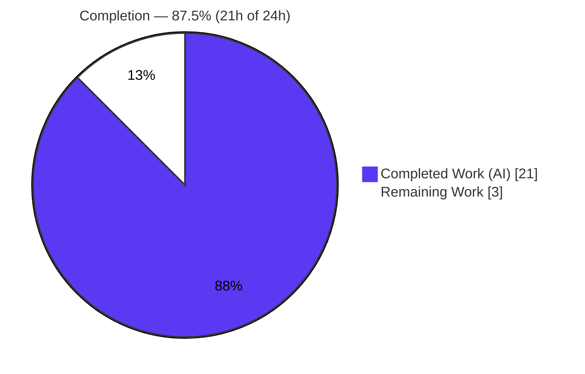
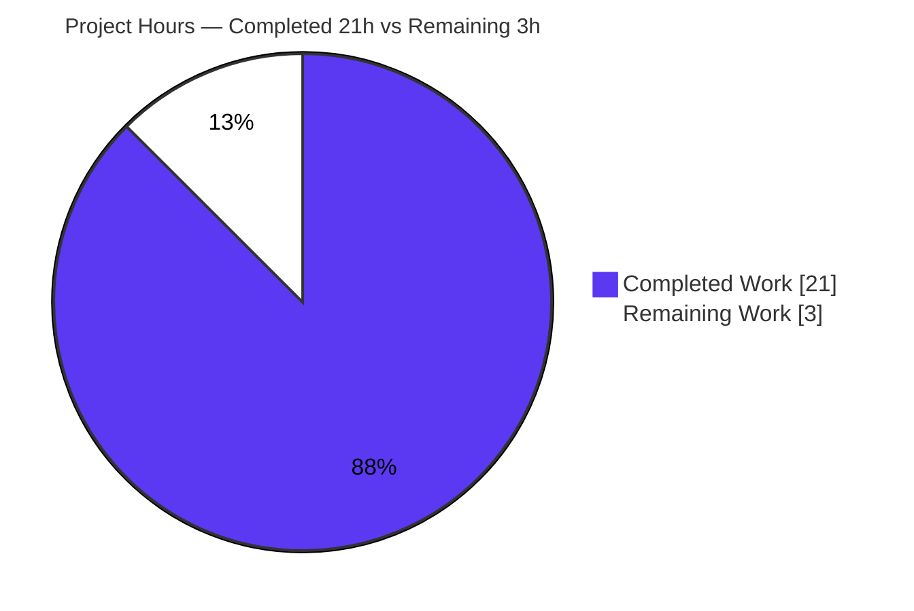
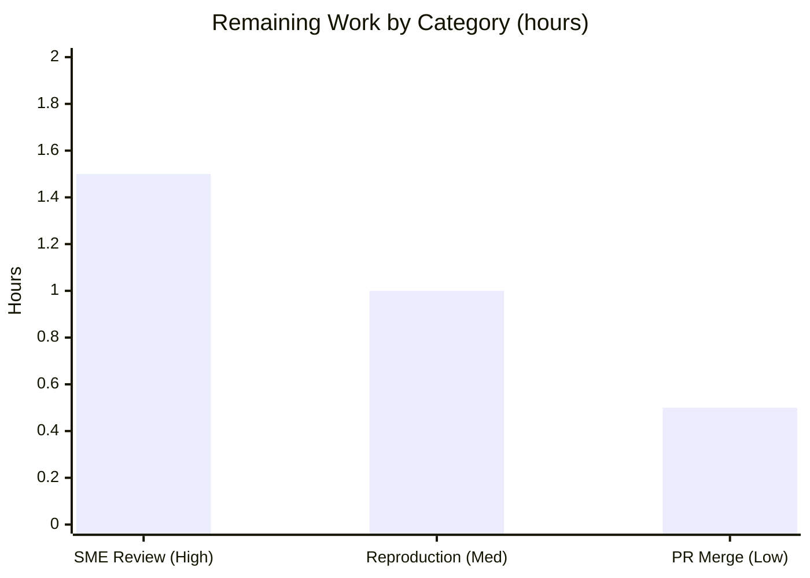

# Blitzy Project Guide

> **Project:** WordPress Calypso — Logged-out Reader "like" intent auth-boundary investigation
> **Branch:** `blitzy-686353a2-3647-4ebf-aaa7-312a4acb3dc7` · **Source commit under investigation:** `be7e5cc641`
> **Deliverable:** `blitzy/documentation/wp-calypso_be7e5cc64162.md` (single file, read-only investigation)
> **Color key:** <span style="color:#5B39F3">■</span> Completed / AI Work = Dark Blue `#5B39F3` · □ Remaining = White `#FFFFFF` · Accents = Violet-Black `#B23AF2` · Highlight = Mint `#A8FDD9`

---

## 1. Executive Summary

### 1.1 Project Overview

This project delivers a single, evidence-backed investigation document that explains — from WordPress Calypso source code **and observed runtime behavior** — how a logged-out Reader "like" intent is supposed to cross the authentication boundary and precisely why it currently disappears after a user signs up or logs in. It is a strictly read-only, documentation-only task governed by the SWE-AtlasQnA-Repo ruleset: no source file is created, modified, or deleted. The audience is Calypso Reader engineers and product owners who need a grounded root-cause explanation (with `file:line` citations and captured runtime output) before deciding whether to remediate the defect. Technical scope spans the Redux `reader-ui` state slice, the shared like-button flow, and the logged-out layout/auth-dialog path.

### 1.2 Completion Status



| Metric | Hours |
|---|---|
| **Total Hours** | **24.0** |
| **Completed Hours (AI + Manual)** | **21.0** (21.0 AI · 0.0 manual) |
| **Remaining Hours** | **3.0** |
| **Percent Complete** | **87.5%** |

> Completion is computed with the PA1 AAP-scoped hours methodology: `21.0 / (21.0 + 3.0) = 87.5%`. Every AAP-specified autonomous deliverable is complete; the remaining 3.0h is exclusively human path-to-production work.

### 1.3 Key Accomplishments

- ✅ **Single deliverable created and committed** — `blitzy/documentation/wp-calypso_be7e5cc64162.md` (983 lines), named after the source branch, in a newly created `blitzy/documentation/` directory.
- ✅ **All five sub-questions answered** — each leads with a direct answer, then cause → effect reasoning, a `file:line` citation, and complete unedited runtime output.
- ✅ **Run-first methodology honored** — real entry points exercised (real connected `LikeButtonContainer` DOM click, real reducer SERIALIZE/deserialize, real join-conversation dialog + `useLoginWindow` postMessage, real `logged-out.jsx` default export).
- ✅ **Exhaustive condition coverage** — like/unlike, `reader/login-window` flag ON/OFF, tag-embed vs standard page, dialog `onClose` vs `onLoginSuccess`, `redirectTo` present/absent, and pending-action state before/during/after the auth round-trip.
- ✅ **Read-only guarantee upheld** — `git diff --name-status be7e5cc641..HEAD` shows exactly one addition; the tree is byte-for-byte identical to the source commit apart from the document; all temporary observation scripts removed.
- ✅ **Validation clean** — Reader UI core 10/10 tests, broader sample 52/52 tests, `tsc --project client` exit 0 (independently re-run by the assessor).

### 1.4 Critical Unresolved Issues

| Issue | Impact | Owner | ETA |
|---|---|---|---|
| Root-cause conclusion ("intent lost; not a timing race; no replay exists") awaits human SME sign-off before it is treated as authoritative | **Low** — the conclusion is evidence-backed and reproduced; this is a standard review gate, not a defect or a build blocker | Reviewing engineer / Reader SME | Within HT-1 (~1.5h) |

> There are **no build-blocking or validation-blocking issues.** The single deliverable is complete and passes all five production-readiness gates.

### 1.5 Access Issues

**No access issues identified.** The repository was fully accessible; `node_modules` was installed (3.1G); Git operations, the Jest harness, and the type checker all executed without permission or credential problems. No third-party API, service credential, or repository-permission barrier applies to this read-only documentation task.

| System/Resource | Type of Access | Issue Description | Resolution Status | Owner |
|---|---|---|---|---|
| WordPress Calypso repo (branch `blitzy-686353a2…`) | Read/Write (git) | None | ✅ No issue | — |
| npm/Yarn registry (for `yarn install`) | Network read | None (deps already installed; `yarn.lock` pinned) | ✅ No issue | — |

### 1.6 Recommended Next Steps

1. **[High]** Perform SME technical review of the answer document — validate the root-cause conclusion and spot-check a sample of `file:line` citations against source at `be7e5cc641`. *(HT-1, 1.5h)*
2. **[Medium]** Independently reproduce the run-first observations by executing the two documented `yarn jest` commands and `yarn run typecheck`. *(HT-2, 1.0h)*
3. **[Low]** Approve and merge/publish the single-file documentation PR. *(HT-3, 0.5h)*
4. **[Low — out of scope]** Convene a product/engineering decision on whether to remediate the documented defect (e.g., add a logged-in-side replay, attach `redirectTo` to the like payload, or persist the intent) across the 9 producer sites — a separate initiative, explicitly out of AAP scope.

---

## 2. Project Hours Breakdown

### 2.1 Completed Work Detail

| Component | Hours | Description |
|---|---|---|
| Environment setup & baseline test harness | 1.5 | Install/confirm canonical toolchain (Node 22.x, Yarn 4.0.2), `yarn install`, run existing `reader-ui` specs to confirm harness + initial reducer state (`null`). Maps to AAP F1/F2. |
| Run-first observation harness (7 real-entry-point specs) | 4.0 | Author 7 temporary Jest specs driving the **real** connected components/reducer/dialog and capturing unedited output. Maps to AAP C1–C4. |
| Q1 — click → boundary code-path tracing | 2.5 | Trace `button.jsx toggleLiked` → `index.jsx handleLikeToggle` logged-out early-return dispatch; observe `{type,siteId,postId}` (no `redirectTo`). Maps to AAP B1. |
| Q3 — source-of-truth SERIALIZE/deserialize proof | 2.0 | Prove in-memory-only storage: `lastActionRequiresLogin` dropped from persisted payload while sibling `lastPath` survives. Maps to AAP B3. |
| Q2 & Q4 — return-path & consumer tracing | 2.5 | Locate the sole consumer (`logged-out.jsx`); observe `onLoginSuccess` reload-vs-redirect branch and the analytics-only dialog. Maps to AAP B2/B4. |
| Edge/alternate branch coverage | 2.0 | Exercise tag-embed `window.open`, `reader/login-window` ON/OFF, dialog `onClose` cleanup, and the bypassed reader-wrapper branch. Maps to AAP D1–D5. |
| Before/during/after state observation & condition matrix | 1.5 | Capture pending-action state across the round-trip (`null` → intent → `null`) and assemble the 14-row conditions matrix. Maps to AAP D6. |
| Answer-document authoring (983 lines) | 3.5 | Write TL;DR, restated question, environment/commands, Q1–Q5 sections, matrix, and root-cause synthesis with mermaid diagram. Maps to AAP A1/B. |
| Sibling-mechanism analysis, caveats & final coverage pass | 1.0 | Document the 8 sibling producers (same defect class), honesty caveats, and the two coverage-pass tables. Maps to AAP E1–E4. |
| Cleanup, git hygiene & validation rework | 0.5 | Remove all temporary specs, verify clean tree, and apply the one validation fix (self-referential git-state block correction). Maps to AAP G1–G3. |
| **Total Completed** | **21.0** | |

### 2.2 Remaining Work Detail

| Category | Hours | Priority |
|---|---|---|
| SME technical review of the investigation & root-cause conclusion (HT-1) | 1.5 | High |
| Independent reproduction of run-first observations (HT-2) | 1.0 | Medium |
| PR review & merge/publish of the single-file documentation change (HT-3) | 0.5 | Low |
| **Total Remaining** | **3.0** | |

### 2.3 Hours Reconciliation & Basis of Estimate

| Check | Value | Result |
|---|---|---|
| Section 2.1 completed rows sum | 21.0h | ✅ |
| Section 2.2 remaining rows sum | 3.0h | ✅ |
| 2.1 + 2.2 = Total (Section 1.2) | 21.0 + 3.0 = 24.0h | ✅ |
| Completion % = 21.0 / 24.0 | 87.5% | ✅ |
| Section 2.2 == Section 1.2 Remaining == Section 7 "Remaining Work" | 3.0h | ✅ |

**Basis of estimate / confidence:** Estimates use the PA2 framework calibrated for a run-first investigation + documentation deliverable (LOC and captured-evidence volume as proxies for effort). Confidence is **High** — the scope is a single, well-defined document; the autonomous work is fully complete and validated; the remaining items are standard, bounded human-acceptance activities.

---

## 3. Test Results

All tests below originate from Blitzy's autonomous validation logs for this project and were **independently re-executed by the assessor** in the working environment (identical results).

| Test Category | Framework | Total Tests | Passed | Failed | Coverage % | Notes |
|---|---|---|---|---|---|---|
| Unit — Reader UI state slice (`client/state/reader-ui`) | Jest | 10 | 10 | 0 | Not measured | Core intent harness (reducer/actions/selectors + card-expansions). Assessor re-run: 4 suites, 1.006s, exit 0. |
| Unit — Supporting modules (`client/lib/paths`, `client/state/posts/likes`) | Jest | 42 | 42 | 0 | Not measured | `createAccountUrl` + `like`/`unlike` actions/reducers. Deduped union with core = 8 suites / 52 tests; assessor re-run 1.684s, exit 0. |
| Run-first observation specs (ephemeral) | Jest | 7 specs | 7 | 0 | n/a | Real-entry-point runtime evidence (`logged_out_click`, `intent_lifecycle`, `edge_branches`, `return_path`, `reader_wrapper`, `tag_embed`, `dialog_close`); reproduced byte-for-byte, then **removed** per read-only scope. |
| Static type check | `tsc --project client` | 1 project | pass | 0 | n/a | `yarn run typecheck` exit 0; forced full pass ~2m21s, zero `error TS`. |

**Summary:** **52 standing Jest unit tests (8 suites) — all passing**, with the 10-test Reader UI subset and the full 52 both re-executed by the assessor. Seven ephemeral run-first observation specs were reproduced and then removed. The type checker exits 0.

> **Coverage note:** Coverage instrumentation (`--coverage`) was not part of the read-only validation scope and no coverage percentage was measured; the cells above honestly report "Not measured" rather than a fabricated figure.
>
> **Integrity:** All listed tests derive from Blitzy's autonomous test-execution logs; none are invented.

---

## 4. Runtime Validation & UI Verification

**Runtime validation (run-first observations via real entry points):**

- ✅ **Real DOM "like" click** on the connected `LikeButtonContainer` while logged out → dispatches `READER_REGISTER_LAST_ACTION_REQUIRES_LOGIN` with `{type:'like'|'unlike', siteId, postId}` and **no `redirectTo`**; the real like/unlike is never reached (early return).
- ✅ **Real reducer SERIALIZE/deserialize** → `lastActionRequiresLogin` is dropped from the persisted bucket while sibling `readerUi.lastPath` survives (proves in-memory-only source of truth).
- ✅ **Real join-conversation dialog + `useLoginWindow` postMessage** → `onLoginSuccess()` fires through the genuine popup/message path.
- ✅ **Real `createAccountUrl`** → `/start/account?redirect_to=<path>&ref=<ref>` (token carries the page path, never the like).
- ✅ **Real `logged-out.jsx` default export — tag-embed branch** → `window.open("/start/account?redirect_to=/tag/cats&ref=reader-lp","_blank")`, no dialog.
- ✅ **`onLoginSuccess` closure** → `window.location.reload()` when no `redirectTo` (contrast: `window.location = redirectTo` when present).
- ✅ **Before/during/after state** → `null` → `{type,siteId,postId}` → `null` after the reload round-trip (deterministic; stable across repeated runs — not a race).
- ✅ **Feature flag** → `reader/login-window` resolves `false` by default (absent from `config/`); flag-ON behavior observed at runtime via `config.enable(...)`; the reader-wrapper branch is bypassed for standard clicks (container returns early).

**API integration outcomes:** ✅ No external API calls are part of this deliverable; the only cross-boundary token (`redirect_to`) was verified programmatically.

**UI verification:** ⚠ **Not applicable as visual verification** — this is a documentation-only deliverable that creates and modifies **no UI**. No Figma frames or design system were provided. The only UI element in the flow (the existing `ReaderJoinConversationDialog`) was verified **programmatically** at runtime via `@testing-library` (render + `onLoginSuccess`/`onClose` behavior), not via visual regression. No web application was built or served, so no browser screenshots apply.

---

## 5. Compliance & Quality Review

Cross-mapping of governing requirements (SWE-AtlasQnA-Repo ruleset + AAP scope) to their delivered status. Fixes applied during autonomous validation are noted.

| Benchmark / Requirement | Status | Evidence / Notes |
|---|---|---|
| **Run-first methodology** (build/run + capture real output before writing) | ✅ Pass | 7 observation specs; complete unedited Jest output embedded next to each claim. |
| **Real entry point only** (DOM click, not debug hook) | ✅ Pass | Real connected `LikeButtonContainer` clicked via `user-event`; real reducer/dialog/postMessage. |
| **Exhaustive condition coverage** | ✅ Pass | 14-row conditions matrix; like/unlike, flag ON/OFF, tag-embed/standard, close/success, `redirectTo` ±. |
| **Before/during/after state observation** | ✅ Pass | `null` → intent → `null`; sibling `lastPath` survives. |
| **Evidence for every claim** (`file:line` + unedited output) | ✅ Pass | Coverage-pass tables map every claim to value + `file:line` + evidence source. |
| **Answer every named sub-question & option** | ✅ Pass | 5 sub-questions RESOLVED; 19 named options COVERED (all observed). |
| **Observed-vs-inferred labeling** | ✅ Pass | Explicit labels; previously-inferred flag-ON now observed. |
| **Read-only scope** (no source modified) | ✅ Pass | `git diff be7e5cc641..HEAD` = single doc ADD; source tree byte-for-byte identical. |
| **Cleanup of temporary scripts** | ✅ Pass | All `blitzy_adhoc_test_*` specs removed; jest cache under gitignored `.cache/`. |
| **Canonical toolchain honored** (Node 22.x, Yarn 4.0.2) | ✅ Pass | Generic Node-20 note correctly superseded; exact commands documented. |
| **Deliverable naming & location** | ✅ Pass | `blitzy/documentation/wp-calypso_be7e5cc64162.md` (named after source branch). |
| **Type safety** | ✅ Pass | `tsc --project client` exit 0; zero `error TS`. |
| **Commit hygiene** | ✅ Pass | 3 commits, all `agent@blitzy.com`; clean tree; no submodules. |
| **Fix applied during validation** | ✅ Resolved | Corrected a self-referential git-state block in the doc (3 insertions / 5 deletions) to a stable, verifiable invariant. |
| **Root-cause conclusion accepted as authoritative** | ⬜ Pending | Requires human SME sign-off (HT-1) — the one open, non-blocking review item. |

**Overall compliance:** All hard ruleset and AAP-scope requirements are satisfied; the only non-pass item is the standard human acceptance gate.

---

## 6. Risk Assessment

| Risk | Category | Severity | Probability | Mitigation | Status |
|---|---|---|---|---|---|
| **R1** — `file:line` citation drift if the source tree ever advances past `be7e5cc641` | Technical | Low | Low | Citations explicitly pinned to `be7e5cc641`; branch is documentation-only, source tree unchanged | ✅ Mitigated |
| **R2** — Root-cause conclusion needs human SME confirmation before authoritative | Technical | Medium | Low | Exhaustive coverage pass; single-consumer grep; real-entry-point evidence for every claim; HT-1 review + HT-2 reproduction planned | ⬜ Open (non-blocking) |
| **R3** — Observations run under jsdom/`env_id="test"`; browser reload teardown partly inferred | Technical | Low | Low | Real entry points exercised; the inferred portion is explicitly labeled "(inferred from reading)"; reproducible in a real build | ✅ Mitigated (labeled) |
| **R4** — Deliverable documents a pre-existing product UX defect (logged-out intents lost across 9 producer sites) | Operational (informational) | Low | n/a | Remediation is explicitly out of AAP scope; doc supplies exact `file:line` + root cause to enable a future fix decision | ℹ️ Informational |
| **R5** — Temporary Jest transform-cache residue under `.cache/` | Operational / Process | Low | Low | `.cache` is gitignored **and** untracked; `git status --porcelain`/`--untracked-files=all` both empty; tree byte-for-byte clean | ✅ Mitigated |
| **R6** — Independent reproduction depends on `yarn install --immutable` from the registry | Integration | Low | Low | `yarn.lock` pinned; `node_modules` already installed; toolchain satisfies declared engines | ✅ Mitigated |

**Overall risk posture: LOW.** No High-severity or High-probability risks; zero security or integration blockers. The one Open item (R2) is inherent to any investigation deliverable and is directly addressed by the two highest-priority remaining tasks. **No security risks were identified** — this read-only change introduces no code, dependencies, credentials, or attack surface.

---

## 7. Visual Project Status

**Project hours breakdown** (Completed `#5B39F3` · Remaining `#FFFFFF`):



**Remaining hours by category** (from Section 2.2; sums to 3.0h):



> **Integrity check:** the "Remaining Work" pie value (3) equals Section 1.2 Remaining Hours (3.0h) and the sum of the Section 2.2 Hours column (1.5 + 1.0 + 0.5 = 3.0h). ✅

---

## 8. Summary & Recommendations

**Achievements.** The project is **87.5% complete (21h of 24h)**. Every AAP-specified autonomous deliverable is finished and validated: the single answer document exists (983 lines), all five sub-questions are answered with a direct answer + cause → effect reasoning + `file:line` + complete unedited runtime output, every implied condition is exercised, and the read-only guarantee is upheld (the tree is byte-for-byte identical to `be7e5cc641` apart from the document). All five production-readiness gates passed, and the assessor independently re-ran the two documented test commands (10/10 and 52/52) and confirmed the type checker exits 0.

**Remaining gaps.** The outstanding 3.0h is entirely human path-to-production: an SME technical review of the root-cause conclusion (1.5h), an independent reproduction of the run-first observations (1.0h), and PR merge (0.5h). None of these are build- or validation-blockers.

**Critical path to production.** SME review → reproduction → merge. Because the deliverable is a self-contained Markdown document with no runtime footprint, there is no deployment, CI/CD, or environment configuration on the critical path.

**Success metrics.** (1) All 5 sub-questions answered with grounded evidence — ✅ met. (2) Repository unchanged apart from the document — ✅ met. (3) Tests and type check green — ✅ met. (4) SME acceptance of the root-cause conclusion — ⬜ pending (HT-1).

**Production readiness assessment.** **Ready for review.** The single deliverable is complete, accurate, and internally consistent. Recommended before merge: confirm the root-cause conclusion and reproduce the two `yarn jest` commands. The documented defect itself (lost logged-out intents) is a separate, out-of-scope product decision that this document is designed to inform.

| Metric | Value |
|---|---|
| Completion | 87.5% |
| Completed / Total hours | 21.0 / 24.0 |
| Remaining hours | 3.0 |
| Blocking issues | 0 |
| Standing tests passing | 52 / 52 |
| Overall risk | Low |

---

## 9. Development Guide

All commands below were executed in the working environment and produced the stated output. They are copy-pasteable and assume the repository root as the working directory.

### 9.1 System Prerequisites

- **OS:** Linux (Ubuntu) or macOS.
- **Node.js:** `^v22.9.0` (`.nvmrc` pins `22.9.0`; verified with `v22.23.1`).
- **Yarn:** `4.0.2` via Corepack (`packageManager: yarn@4.0.2`; engines `^4.0.0`).
- **Git**, and ~5 GB free disk (repo ≈ 4.3G + `node_modules` ≈ 3.1G).

```bash
node --version    # -> v22.23.1  (must satisfy ^v22.9.0)
yarn --version    # -> 4.0.2
```

### 9.2 Environment Setup & Dependency Installation

```bash
corepack enable
export COREPACK_ENABLE_DOWNLOAD_PROMPT=0
COREPACK_ENABLE_DOWNLOAD_PROMPT=0 yarn install --immutable
```

> `--immutable` enforces the committed `yarn.lock`. In the validated environment `node_modules` is already present, so this is a fast no-op / verification step.

### 9.3 View the Deliverable

```bash
wc -l blitzy/documentation/wp-calypso_be7e5cc64162.md    # -> 983
less blitzy/documentation/wp-calypso_be7e5cc64162.md      # or any Markdown viewer
```

### 9.4 Verify Repository Invariant (read-only guarantee)

```bash
git rev-parse --abbrev-ref HEAD
# -> blitzy-686353a2-3647-4ebf-aaa7-312a4acb3dc7
git diff --name-status be7e5cc641..HEAD
# -> A	blitzy/documentation/wp-calypso_be7e5cc64162.md   (ONLY)
```

### 9.5 Reproduce the Run-First Observations (verification)

```bash
# Core Reader UI harness (assessor re-run: 4 suites / 10 tests, ~1.0s)
TZ=UTC CI=true yarn jest -c=test/client/jest.config.js client/state/reader-ui
# -> Test Suites: 4 passed, 4 total ; Tests: 10 passed, 10 total ; exit 0

# Broader sample (assessor re-run: 8 suites / 52 tests, ~1.7s)
TZ=UTC CI=true yarn jest -c=test/client/jest.config.js \
    client/state/reader-ui client/lib/paths client/state/posts/likes
# -> Test Suites: 8 passed, 8 total ; Tests: 52 passed, 52 total ; exit 0

# Type safety (full pass ~2m21s, zero "error TS")
yarn run typecheck    # runs: tsc --project client ; exit 0
```

### 9.6 Post-Run Hygiene (confirm tree stays clean)

```bash
git status --porcelain --untracked-files=all
# -> (empty) ; Jest writes only to the gitignored .cache/ directory
```

### 9.7 Example Usage

This is a documentation deliverable — "usage" means reading the answer document and, optionally, reproducing its observations with §9.5. The document's *Environment* section lists the seven exact per-spec `yarn jest` commands originally used; those temporary specs were removed after capture (per read-only scope), so re-running those exact spec paths will report "no tests found" **by design** — the captured output is embedded verbatim in the document.

### 9.8 Troubleshooting

- **`Browserslist: caniuse-lite is 17 months old`** — benign informational warning on every Jest run; does **not** affect results. Do not run the suggested update (read-only scope).
- **`yarn: command not found`** — run `corepack enable` first (Yarn ships via Corepack, not an npm global).
- **Engines error** — ensure Node `^v22.9.0`; `nvm use` picks up `.nvmrc` (`22.9.0`).
- **Spot-checking citations** — view source at the pinned commit, e.g. `git show be7e5cc641:client/blocks/like-button/index.jsx`.

---

## 10. Appendices

### A. Command Reference

| Command | Purpose |
|---|---|
| `node --version` / `yarn --version` | Confirm toolchain (`v22.23.1` / `4.0.2`) |
| `corepack enable` | Activate Corepack-managed Yarn |
| `yarn install --immutable` | Install deps from pinned `yarn.lock` |
| `git diff --name-status be7e5cc641..HEAD` | Verify only the doc changed |
| `TZ=UTC CI=true yarn jest -c=test/client/jest.config.js client/state/reader-ui` | Core harness (10 tests) |
| `TZ=UTC CI=true yarn jest -c=test/client/jest.config.js client/state/reader-ui client/lib/paths client/state/posts/likes` | Broader sample (52 tests) |
| `yarn run typecheck` | `tsc --project client` (exit 0) |
| `git status --porcelain --untracked-files=all` | Confirm clean tree |
| `git show be7e5cc641:<path>` | Inspect a source file at the pinned commit |

### B. Port Reference

**Not applicable.** This documentation deliverable and its verification use **no network services or ports** — Jest runs in-process and no development server is started.

### C. Key File Locations

| Path | Role |
|---|---|
| `blitzy/documentation/wp-calypso_be7e5cc64162.md` | **The deliverable** (only new/changed file) |
| `client/blocks/like-button/button.jsx` | DOM click entry point (`toggleLiked`) |
| `client/blocks/like-button/index.jsx` | Container `handleLikeToggle` — logged-out early-return dispatch (`:33-39`) |
| `client/reader/like-button/index.jsx` | Alternate/bypassed logged-out branch + `reader/login-window` gate |
| `client/state/reader-ui/reducer.js` | Source of truth: plain `lastActionRequiresLogin` (`:45-54`) vs persisted `lastPath` (`:19`) |
| `client/state/reader-ui/{actions,action-types,selectors}.js` | Intent create/clear + read |
| `client/layout/logged-out.jsx` | Sole consumer; `onLoginSuccess` reload/redirect (`:303-315`), `onClose` clear (`:304`) |
| `client/blocks/reader-join-conversation/dialog.jsx` | Login-prompt dialog (analytics-only use of the intent) |
| `client/data/reader/use-login-window.ts` | Popup login + postMessage success path |
| `client/lib/paths/index.js` | `createAccountUrl` — the `redirect_to` token (`:24-26`) |
| `test/client/jest.config.js` | Jest configuration used for all runs |

### D. Technology Versions

| Component | Version | Source |
|---|---|---|
| Node.js | `v22.23.1` (satisfies `^v22.9.0`) | `.nvmrc` = `22.9.0`; `package.json` engines |
| Yarn | `4.0.2` | `packageManager: yarn@4.0.2`; engines `^4.0.0` |
| Jest | as pinned in `yarn.lock` | Existing dev dependency; config `test/client/jest.config.js` |
| TypeScript (`tsc`) | as pinned in `yarn.lock` | `yarn run typecheck` → `tsc --project client` |
| Source commit under investigation | `be7e5cc641` | "Reader: Show login prompts on all logged out reader streams" |

### E. Environment Variable Reference

| Variable | Value used | Purpose |
|---|---|---|
| `TZ` | `UTC` | Deterministic timestamps in test output |
| `CI` | `true` | Non-interactive Jest (no watch mode) |
| `NO_COLOR` / `FORCE_COLOR` | `1` / `0` | Plain-ASCII output for pasted evidence |
| `COREPACK_ENABLE_DOWNLOAD_PROMPT` | `0` | Non-interactive Corepack/Yarn provisioning |

> No application secrets, API keys, or service credentials are required for this documentation task or its verification.

### F. Developer Tools Guide

- **Jest** — run targeted suites with `-c=test/client/jest.config.js <path>`; add `TZ=UTC CI=true` for deterministic, non-interactive runs.
- **TypeScript** — `yarn run typecheck` performs a read-only `tsc --project client` (no emit); use to confirm zero `error TS`.
- **Git** — `git show <commit>:<path>` inspects any file at the pinned source commit for citation spot-checks; `git diff --name-status be7e5cc641..HEAD` proves the read-only invariant.
- **Corepack** — manages the pinned Yarn version; run `corepack enable` before any `yarn` command.

### G. Glossary

| Term | Definition |
|---|---|
| **Logged-out intent** | A user action (e.g., a "like") taken while signed out that the system records to (ideally) replay after authentication. |
| **`lastActionRequiresLogin`** | The Redux state key (in `readerUi`) holding the pending intent `{type, siteId, postId}`; a **plain**, non-persisted reducer. |
| **`withPersistence`** | Calypso's opt-in wrapper that makes a reducer's state survive serialization; applied to `lastPath` but **not** to `lastActionRequiresLogin`. |
| **`redirect_to`** | The only cross-boundary handoff token (built by `createAccountUrl`); carries the page path, never the like. |
| **`onLoginSuccess` reload path** | On authenticated return with no `redirectTo`, `window.location.reload()` runs and tears down the in-memory store — where the intent is lost. |
| **Sibling producers** | The 8 other logged-out interactions (follows, comments, subscriptions, tag actions) that register the same intent and share the same defect class. |
| **Run-first** | The methodology of building/running the code and capturing real output *before* writing the answer. |
| **`be7e5cc641`** | The source commit under investigation; all `file:line` citations are pinned to it. |

---

*Generated by the Blitzy Platform · Completion 87.5% (21h of 24h) · Overall risk: Low · Deliverable validated across 5 production-readiness gates.*