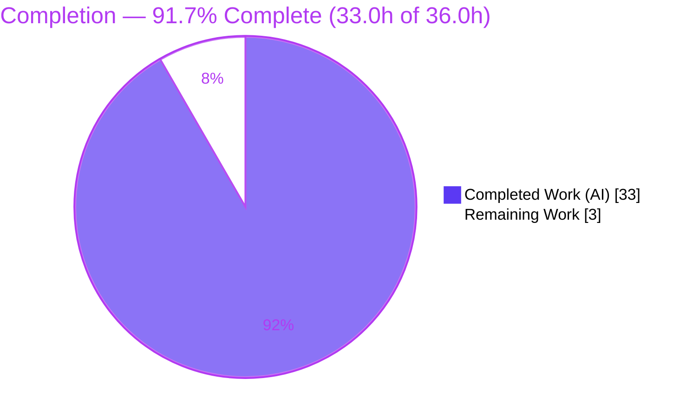
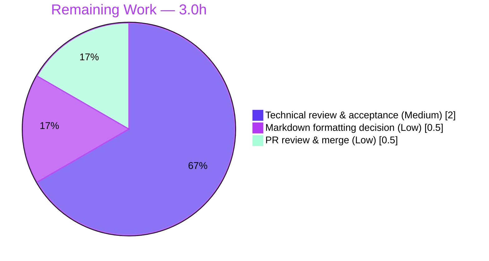

# Blitzy Project Guide — wp-calypso Testing-Infrastructure Onboarding Documentation

> **Project type:** Documentation (investigative Q&A / repository onboarding analysis)
> **Branch:** `blitzy-ba2ef443-b90a-4428-87fd-aa16f83199a9` · **Base:** `be7e5cc641622d153040491fd5625c6cb83e12eb` · **HEAD:** `908db836ede7798e7cc36b4618f12e9094d8adc8`
> **Brand legend:** <span style="color:#5B39F3">■ Completed / AI Work (Dark Blue #5B39F3)</span> · <span style="color:#B23AF2">■ Remaining / Not Completed (White #FFFFFF, outlined Violet-Black #B23AF2)</span>

---

## 1. Executive Summary

### 1.1 Project Overview

This project delivers a single, evidence-based onboarding document explaining the **testing infrastructure** of the `Automattic/wp-calypso` monorepo to developers about to contribute. The target audience is new engineers who need to understand how the test environment boots, how it differs from running the dev server, and how configuration/feature-flags resolve differently under test. The business impact is reduced onboarding time and fewer test-environment misunderstandings on a very large codebase. Technical scope is intentionally narrow: a read-only investigation (statically reading Jest configs, setup files, and the config-resolution chain; dynamically booting the dev server and running representative Jest tests) culminating in one Markdown artifact — with **zero** source, dependency, or configuration changes.

### 1.2 Completion Status



> **Center label:** **91.7% Complete**

| Metric | Hours |
|--------|-------|
| **Total Hours** | **36.0** |
| **Completed Hours (AI + Manual)** | **33.0** (AI: 33.0 · Manual: 0.0) |
| **Remaining Hours** | **3.0** |
| **Completion** | **91.7%** (33.0 ÷ 36.0) |

### 1.3 Key Accomplishments

- ✅ **Sole AAP deliverable authored and committed** — `blitzy/documentation/wp-calypso_be7e5cc64162.md` (601 lines, 5,653 words); filename equals the source branch name as required.
- ✅ **All seven questions answered** with inline code citations (`path:Lstart-Lend`) **and** rationale, plus a "How to read" intro and a "How this was verified" closing section.
- ✅ **Dev server booted and verified** — `curl :3000` returned **HTTP 200** with request log `env=development` (NODE_ENV/CALYPSO_ENV unset).
- ✅ **Representative tests pass 100%** — client country-states 20/20, server config parser 7/7, packages create-calypso-config 13/13 (independently re-confirmed: country-states actions 5/5).
- ✅ **Config-divergence proof reproduced exactly** — `178 101 183 97` (97 feature flags differ between `config/development.json` and `config/test.json`); `env_id` = `development` vs `test`.
- ✅ **Line-by-line accuracy audit** across Q1–Q7; one wording inaccuracy (Q4 `fetch` mock) found and corrected (commit `908db836ed`).
- ✅ **Repository left pristine** — diff vs. base contains only the added document; working tree clean; no temporary scripts remain; `build/` artifacts gitignored.

### 1.4 Critical Unresolved Issues

| Issue | Impact | Owner | ETA |
|-------|--------|-------|-----|
| _None_ — no blocking issues identified | The single deliverable is complete, accurate, and committed; build/run verification passed; tree is pristine | n/a | n/a |

> There are **no critical unresolved issues**. All remaining work is non-blocking human path-to-production acceptance (see §1.6 and §2.2).

### 1.5 Access Issues

| System/Resource | Type of Access | Issue Description | Resolution Status | Owner |
|-----------------|----------------|-------------------|-------------------|-------|
| _n/a_ | _n/a_ | **No access issues identified** | n/a | n/a |

> Build validation succeeded end-to-end: the npm/registry was reachable for `yarn install`, the Node `^v22.9.0` / Yarn `4.0.2` toolchain was available, the dev server booted, and representative Jest projects executed. No repository-permission, credential, or third-party API access issue prevented validation.

### 1.6 Recommended Next Steps

1. **[Medium]** Conduct a human **technical review & acceptance** of the onboarding document — spot-check a sample of citations against current source, confirm onboarding value, and assign a documentation owner (optionally linking it from `test/README.md`). _(2.0h)_
2. **[Low]** Make the **markdown-formatting policy decision** — accept the file as-is (consistent with the repo's deliberate no-markdown-formatting convention) or run file-scoped `prettier --write`. _(0.5h)_
3. **[Low]** **Review, approve, and merge** the single-file pull request to publish the briefing. _(0.5h)_

---

## 2. Project Hours Breakdown

### 2.1 Completed Work Detail

All completed components are AAP-specified autonomous work. Each traces to a specific AAP requirement (Q1–Q7, build/run verification, authoring, accuracy validation).

| Component | Hours | Description |
|-----------|-------|-------------|
| Environment setup & build verification | 4.0 | Established documented runtime (Node `^v22.9.0`, Yarn `4.0.2` via Corepack), `yarn install --immutable`, `build-server` webpack step, and dev-server boot returning HTTP 200 (AAP A1) |
| Q1 — Dev-server confirmation | 2.0 | Documented the `yarn start` chain, `check-node-version` runtime gate, build→run ordering, and `development` env resolution; observed actual boot (AAP A2) |
| Q2 — Test-environment characterization | 3.5 | Read all seven Jest project configs + shared `@automattic/calypso-jest` preset; documented jsdom opt-in, `calypso:src` resolver, and the boot-vs-dev contrast table (AAP A3) |
| Q3 — Test-only globals/env/polyfills inventory | 3.0 | Cataloged every global/polyfill/env assignment across `setup-test-framework.js`, base & packages setup, and config-level globals (AAP A4) |
| Q4 — Network behavior under test | 1.5 | Documented `nock.disableNetConnect()`, the `fetch` mock, and `NetConnectNotAllowedError` for unmocked requests (AAP A5) |
| Q5 — API-mock trace (country-states) | 4.0 | Traced test → thunk action creator → `wpcom` HTTP layer to the assertion; built the Mermaid flow diagram; resolved the `node.js`/`browser.js` resolver nuance; ran the test (AAP A6) |
| Q6 — Config resolution dev-vs-test | 4.0 | Documented the two implementations behind `@automattic/calypso-config`, the per-project `moduleNameMapper`, the parser cascade, the config factory, and the `NODE_ENV` edge case (AAP A7) |
| Q7 — Config control + proof of divergence | 3.0 | Documented the four control mechanisms; reproduced the 97-flag diff proof; verified the shim under each environment (AAP A8) |
| Document authoring & assembly | 4.5 | Authored the 601-line Markdown (intro, "How to read", verification section, tables, code blocks); correct name/location; committed (AAP A9) |
| Accuracy validation & QA cycles | 3.5 | Line-by-line citation audit across Q1–Q7; four review/accuracy-fix iterations; one inaccuracy corrected; repository-hygiene verification (AAP A10/A11) |
| **Total** | **33.0** | **Sum matches Completed Hours in §1.2** |

### 2.2 Remaining Work Detail

All remaining work is path-to-production and **human-only** (cannot be completed autonomously — it requires review judgment, a policy decision, and merge authority).

| Category | Hours | Priority |
|----------|-------|----------|
| Human technical review & acceptance of the onboarding document (spot-check citations, confirm onboarding value, assign docs owner) | 2.0 | Medium |
| Markdown formatting policy decision (accept-as-is per repo convention vs. file-scoped prettier) | 0.5 | Low |
| Pull request review, approval & merge (publish sign-off) | 0.5 | Low |
| **Total** | **3.0** | — |

> **Cross-section check:** §2.2 total (3.0h) = §1.2 Remaining (3.0h) = §7 pie "Remaining Work" (3). §2.1 (33.0h) + §2.2 (3.0h) = 36.0h = §1.2 Total.

### 2.3 Hours Reconciliation & Methodology

Completion is measured strictly on **AAP-scoped + path-to-production** work using the PA1 hours-based formula:

```
Completion % = Completed Hours ÷ (Completed Hours + Remaining Hours)
             = 33.0 ÷ (33.0 + 3.0)
             = 33.0 ÷ 36.0
             = 91.67%  →  91.7%
```

| Reconciliation Check | Result |
|----------------------|--------|
| §2.1 rows sum to Completed Hours | 33.0 = 33.0 ✅ |
| §2.2 rows sum to Remaining Hours | 3.0 = 3.0 ✅ |
| §2.1 + §2.2 = Total (§1.2) | 33.0 + 3.0 = 36.0 ✅ |
| §1.2 ↔ §2.2 ↔ §7 Remaining identical | 3.0 = 3.0 = 3.0 ✅ |

---

## 3. Test Results

All tests below originate from Blitzy's autonomous validation logs for this project. Because this is a documentation task, tests were executed as **targeted representative verification** of the document's claims (not for coverage targets). Frameworks/versions are read from the manifests: Jest `29.7.0`, nock `13.5.6`.

| Test Category | Framework | Total Tests | Passed | Failed | Coverage % | Notes |
|---------------|-----------|-------------|--------|--------|------------|-------|
| Client state — country-states (3 suites) | Jest 29.7.0 | 20 | 20 | 0 | N/A (targeted) | Backs Q5 API-mock trace; nock-mocked endpoints |
| Server config — parser cascade/overrides | Jest 29.7.0 | 7 | 7 | 0 | N/A (targeted) | Backs Q6/Q7 cascade + `ENABLE_FEATURES`/`DISABLE_FEATURES` |
| Packages — create-calypso-config | Jest 29.7.0 | 13 | 13 | 0 | N/A (targeted) | Backs Q6/Q7 config factory (`config`/`isEnabled`/`enable`/`disable`) |
| **Durable total** | **Jest 29.7.0** | **40** | **40** | **0** | **100% pass** | All representative suites green |
| Transient Q3/Q4 runtime probe | Jest 29.7.0 | 5 | 5 | 0 | N/A | **Deleted** after verification per the cleanup constraint (not retained in the tree) |

**Independent re-confirmation (this session):** `TZ=UTC yarn jest -c=test/client/jest.config.js client/state/country-states/test/actions.js` → **5 passed / 5 total**, exit 0 — consistent with the autonomous logs.

---

## 4. Runtime Validation & UI Verification

This is a backend/tooling documentation task with **no UI surface**; runtime validation focused on the dev server and the test runtime that the document describes.

- ✅ **Operational** — Runtime gate: `npx check-node-version --package` exits `0` against Node `v22.12.0` / Yarn `4.0.2`.
- ✅ **Operational** — Server bundle build: `yarn run build-server` emits the gitignored `build/server.js` (~7.9 MB).
- ✅ **Operational** — Dev server boot: `node build/server.js` logs `wp-calypso booted`; `curl -sI http://localhost:3000` → **HTTP/1.1 200 OK** (Express "waiting for webpack" placeholder, expected when only the server bundle is built).
- ✅ **Operational** — Environment resolution: with `NODE_ENV`/`CALYPSO_ENV` unset, `config('env_id')` = `development`; under Jest (`NODE_ENV=test`) = `test`.
- ✅ **Operational** — Network isolation: unmocked request raises `NetConnectNotAllowedError`; nock-mocked request returns `200` + body (Q4/Q5).
- ✅ **Operational** — Config divergence: `isEnabled('checkout/checkout-version')` = `true` (dev) vs `false` (test); flag diff `178 101 183 97`.
- ⚠ **Partial (by design)** — `HTTP 200` is the placeholder page because only the server bundle was built; a full `yarn start` additionally builds the client bundle. This is expected and documented in Q1, not a defect.
- ❌ **Failing** — None.
- **UI Verification:** Not applicable — the deliverable is a Markdown document with no rendered UI. (The document's Mermaid diagram renders in any Mermaid-aware Markdown viewer, e.g. GitHub.)

---

## 5. Compliance & Quality Review

Cross-mapping the AAP rules/deliverables to Blitzy's quality benchmarks. Fixes applied during autonomous validation are noted.

| AAP Requirement / Quality Benchmark | Status | Progress | Notes |
|-------------------------------------|--------|----------|-------|
| Single document named after source branch (`wp-calypso_be7e5cc64162.md`) | ✅ Pass | 100% | Filename equals branch name; in `blitzy/documentation/` |
| Comprehensively answers all questions (Q1–Q7) | ✅ Pass | 100% | Seven Q&A sections + intro + verification section |
| Every claim evidence-based with citations | ✅ Pass | 100% | Inline `path:Lstart-Lend` citations throughout |
| Rationale/thinking provided (not just conclusions) | ✅ Pass | 100% | Each answer carries a "Rationale" block |
| Build & run to substantiate answers | ✅ Pass | 100% | Dev server booted; representative Jest projects run; proof reproduced |
| "Do not make assumptions" — code as source of truth | ✅ Pass | 100% | Line-by-line audit confirmed citations against source |
| Do not modify any existing repository file | ✅ Pass | 100% | `git diff` vs base = only the added document |
| Do not add any other code | ✅ Pass | 100% | Zero source/dependency/config changes |
| Clean up temporary investigation scripts | ✅ Pass | 100% | Transient probe deleted; working tree clean; `build/` gitignored |
| Documented runtime (Node `^v22.9.0`, Yarn `4.0.2`) | ✅ Pass | 100% | Runtime gate passes; toolchain documented in Q1 |
| Accuracy of `fetch`-mock description (Q4) | ✅ Pass (fixed) | 100% | One wording inaccuracy corrected in commit `908db836ed` |
| Markdown formatting (prettier) | ⚠ Accepted | n/a | Repo excludes `.md` from `reformat-files`/pre-commit; intentionally not reformatted |

**Outstanding compliance items:** none blocking. The markdown-formatting item is a human policy decision (§2.2), consistent with the repository's deliberate convention.

---

## 6. Risk Assessment

| Risk | Category | Severity | Probability | Mitigation | Status |
|------|----------|----------|-------------|------------|--------|
| Citation drift — line-number citations pinned to HEAD `be7e5cc64` go stale as code evolves | Technical | Low | Medium | Document pins branch+commit in its header; re-verify on major test-infra changes or convert to symbolic anchors | Mitigated (commit-pinned) |
| Reliance on Jest framework defaults (`NODE_ENV='test'`, default `testEnvironment=node`) | Technical | Low | Low | Cited from Jest docs **and** corroborated with repo evidence; defaults stable across Jest 29 | Mitigated |
| No security exposure — Markdown artifact, zero code/deps, no secrets leaked | Security | None | Low | Verified the document references config **keys**/flags & a public host, never secret values | No action needed |
| Onboarding accuracy depends on human acceptance (a subtle gap could mislead) | Operational | Low | Low | Heavily QA'd (5 commits, line-by-line audit, independent re-verification); pending human review | Pending review |
| Maintenance ownership undefined — no owner to update the doc as test infra changes | Operational | Low | Medium | Assign a docs owner; optionally link from `test/README.md` for discoverability | Open (human) |
| Standalone document — no imports/wiring other files must satisfy | Integration | None | Low | n/a (AAP §0.4.3 confirms no cross-file dependencies) | No action needed |
| Runtime reproducibility — dynamic claims assume Node `^v22.9.0`/Yarn `4.0.2`; Node 20.x fails the gate | Integration | Low | Low | Document explicitly states the required runtime and explains the `check-node-version` gate (Q1) | Mitigated (documented) |

**Overall posture:** **LOW** across all categories — the expected profile for a complete, committed, read-only documentation deliverable with zero source/dependency changes. No High or Critical risks; no blockers.

---

## 7. Visual Project Status


**Remaining hours by category (from §2.2):**



> **Integrity:** "Remaining Work" = **3.0h**, identical to §1.2 Remaining Hours and the sum of the §2.2 Hours column. "Completed Work" = **33.0h** = §1.2 Completed Hours. Brand colors applied: Completed = Dark Blue `#5B39F3`, Remaining = White `#FFFFFF` (outlined Violet-Black `#B23AF2`).

---

## 8. Summary & Recommendations

**Achievements.** The project is **91.7% complete** (33.0h of 36.0h). The single AAP deliverable — `blitzy/documentation/wp-calypso_be7e5cc64162.md` — is authored, committed, and independently verified accurate. It answers all seven onboarding questions with inline citations and rationale, includes a Mermaid trace of the country-states API-mock flow, and closes with a reproducible "How this was verified" section. Dynamic verification confirmed the dev server boots (HTTP 200, `env=development`), representative Jest suites pass 100% (40/40 durable tests), and the config-divergence proof reproduces exactly (`178 101 183 97`).

**Remaining gaps.** The outstanding **3.0h** is entirely human path-to-production: a technical review/acceptance of the document (2.0h), a markdown-formatting policy decision (0.5h), and PR review/merge (0.5h). None is blocking, and none can be completed autonomously.

**Critical path to production.** Technical review & acceptance → formatting decision → merge. The highest-value action is the human technical review, which converts "validated" into "accepted onboarding material" and addresses the only Low operational risks (accuracy acceptance and maintenance ownership).

**Success metrics.** ✅ One file added, zero source changes (clean `git diff`); ✅ all seven questions answered with verified citations; ✅ build/run verification green; ✅ proof reproduced; ✅ working tree pristine, no temp scripts.

**Production-readiness assessment.** **Ready for human review and merge.** The deliverable meets every AAP requirement and hard constraint. The repository is left pristine apart from the one intended documentation artifact. Confidence is **High** for the AAP-specified work (well-defined scope, verified evidence) and the remaining items are low-risk, well-understood human acceptance steps.

| Metric | Value |
|--------|-------|
| Completion | 91.7% |
| Completed / Total Hours | 33.0 / 36.0 |
| Remaining Hours | 3.0 |
| Blocking issues | 0 |
| Source files modified | 0 |
| Files added | 1 |
| Representative tests passing | 40 / 40 (100%) |

---

## 9. Development Guide

How to set up the environment, reproduce the document's verification, and confirm the repository is pristine. Every command was tested in this session (the long-running build/boot step is sourced from the autonomous validation logs).

### 9.1 System Prerequisites

- **OS:** Linux or macOS (validated on Ubuntu 25.10).
- **Node.js:** `^v22.9.0` (required by `package.json` `engines`; `.nvmrc` pins `22.9.0`). Validated on **v22.12.0**. A Node 20.x toolchain will **fail** the `yarn start` runtime gate.
- **Yarn:** `4.0.2` via **Corepack** (`package.json` `packageManager`).
- **Git** (+ Git LFS). **Disk:** `node_modules` ≈ 3.1 GB.

### 9.2 Environment Setup

```bash
# Use the documented runtime
node --version          # expect v22.x (>= 22.9.0)

# Activate the pinned Yarn via Corepack
corepack enable
yarn --version          # expect 4.0.2

# No env vars are required for the documentation task.
# Dev-server baseline: leave NODE_ENV / CALYPSO_ENV unset -> config resolves 'development'.
# Jest auto-sets NODE_ENV='test'.
```

### 9.3 Dependency Installation

```bash
# Deterministic install; documentation-only task changes ZERO dependencies
yarn install --immutable      # expect exit 0, no lockfile change
```

### 9.4 Build & Run (reproduce the dev-server verification)

```bash
# 1) Runtime gate (engines check)
npx check-node-version --package          # expect exit 0

# 2) Build the server bundle (emits gitignored build/server.js, ~7.9 MB)
yarn run build-server

# 3) Boot the dev server exactly as `start-build` does (run in the background)
BROWSERSLIST_ENV=evergreen node build/server.js | bunyan -o short &
SERVER_PID=$!                              # capture the PID you spawned

# 4) Verify it serves HTTP 200
curl -sI http://localhost:3000            # expect: HTTP/1.1 200 OK

# 5) Stop the server you started (terminate by the specific PID only)
kill "$SERVER_PID"

# Full dev start (additionally builds the client bundle):
#   yarn start
```

### 9.5 Verification Steps (all tested)

```bash
# Inspect the deliverable
wc -l blitzy/documentation/wp-calypso_be7e5cc64162.md      # expect 601

# Confirm the tree is pristine (only the doc added vs base)
git status --porcelain                                      # expect empty
git diff be7e5cc641622d153040491fd5625c6cb83e12eb --name-status
#   expect: A  blitzy/documentation/wp-calypso_be7e5cc64162.md

# Reproduce the config-divergence proof (Q7)
node -e 'const d=require("./config/development.json").features,t=require("./config/test.json").features;
const u=new Set([...Object.keys(d),...Object.keys(t)]);let n=0;for(const k of u)if(d[k]!==t[k])n++;
console.log(Object.keys(d).length,Object.keys(t).length,u.size,n);'
#   expect: 178 101 183 97

# env_id under each environment
node -e 'console.log(require("./config/development.json").env_id, require("./config/test.json").env_id)'
#   expect: development test

# Run the canonical API-mock test (Q5)
TZ=UTC CI=true yarn jest -c=test/client/jest.config.js \
  client/state/country-states/test/actions.js --ci --watchAll=false
#   expect: Tests: 5 passed, 5 total
```

### 9.6 Example Usage

- Open `blitzy/documentation/wp-calypso_be7e5cc64162.md` in a Mermaid-aware Markdown viewer (e.g., GitHub) to render the Q5 API-mock flow diagram.
- Suggested read order: **How to read** → **Q1** (dev baseline) → **Q2–Q7** (test environment). Each answer = *answer* + *citations* (`path:Lstart-Lend`) + *rationale*. The closing **How this was verified** table lists the exact commands and observed results.

### 9.7 Troubleshooting

| Symptom | Cause | Resolution |
|---------|-------|------------|
| `check-node-version` fails | Node not in `^v22.9.0` range | Switch to Node ≥ 22.9.0 (`.nvmrc` pins `22.9.0`) |
| `yarn: command not found` / wrong version | Corepack not enabled | `corepack enable` (repo pins `yarn@4.0.2`) |
| `node build/server.js` — file missing | `build/server.js` is a generated, gitignored artifact | Run `yarn run build-server` first |
| Test throws `NetConnectNotAllowedError` | `nock.disableNetConnect()` blocks real network (by design) | Declare a `nock` interceptor for the endpoint under test |
| `prettier --check` flags the `.md` | Repo deliberately excludes markdown from `reformat-files`/pre-commit | Leave as-is (intended) or run file-scoped `prettier --write` |

---

## 10. Appendices

### A. Command Reference

| Purpose | Command |
|---------|---------|
| Node version | `node --version` |
| Enable Corepack / Yarn | `corepack enable && yarn --version` |
| Runtime gate | `npx check-node-version --package` |
| Install deps | `yarn install --immutable` |
| Build server bundle | `yarn run build-server` |
| Boot dev server | `BROWSERSLIST_ENV=evergreen node build/server.js | bunyan -o short` |
| Full dev start | `yarn start` |
| Run all tests | `yarn test` |
| Run client tests | `yarn test-client` (`TZ=UTC jest -c=test/client/jest.config.js`) |
| Canonical API-mock test | `TZ=UTC yarn jest -c=test/client/jest.config.js client/state/country-states/test/actions.js` |
| Config-divergence proof | see §9.5 `node -e` snippet → `178 101 183 97` |
| Diff vs base | `git diff be7e5cc641622d153040491fd5625c6cb83e12eb --name-status` |

### B. Port Reference

| Port | Service | Notes |
|------|---------|-------|
| 3000 | Calypso dev server | `node build/server.js`; `curl -sI http://localhost:3000` → HTTP 200 (placeholder until client built) |

### C. Key File Locations

| Path | Role |
|------|------|
| `blitzy/documentation/wp-calypso_be7e5cc64162.md` | **The deliverable** — onboarding Q&A document |
| `package.json` | Dev/test scripts, `engines`, `packageManager` |
| `.nvmrc` | Pinned Node version `22.9.0` |
| `packages/calypso-jest/jest-preset.js` | Shared base Jest preset (`testEnvironment: 'node'`, resolver, setup) |
| `test/client/jest.config.js` · `test/client/setup-test-framework.js` | Client project config + test-only globals / `nock` lifecycle |
| `test/server/setup-test-framework.js` | Server network isolation + `wpcom-proxy-request` mock |
| `client/state/country-states/{test/actions.js,actions.js}` | Q5 API-mock test + thunk action creator |
| `client/lib/wp/browser.js` | `wpcom` HTTP client layer |
| `packages/calypso-config/src/index.ts` | Browser config implementation (dev/prod) |
| `client/server/config/{index.js,parser.js}` | Test/server config shim + cascade parser |
| `packages/create-calypso-config/src/index.ts` | Config factory (`config`/`isEnabled`/`enable`/`disable`) |
| `config/{_shared,development,test,production}.json` | Environment config / feature flags (proof source) |

### D. Technology Versions

| Component | Version | Source |
|-----------|---------|--------|
| Node.js | `^v22.9.0` (ran v22.12.0) | `package.json` `engines`, `.nvmrc` |
| Yarn | `4.0.2` (Corepack) | `package.json` `packageManager` |
| Jest | `^29.7.0` (ran 29.7.0) | `package.json` devDependencies |
| nock | `^13.5.6` | `package.json` devDependencies |
| @testing-library/jest-dom | `^6.6.3` | `package.json` devDependencies |
| resize-observer-polyfill | `^1.5.1` | `package.json` devDependencies |
| jest-canvas-mock | `^2.5.2` | `package.json` devDependencies |
| enhanced-resolve | `5.9.3` | `package.json` devDependencies |

### E. Environment Variable Reference

| Variable | Effect | Where |
|----------|--------|-------|
| `NODE_ENV` | Unset → config env `development`; Jest auto-sets `test`; literal `development` makes a missing config key throw `ReferenceError` | `client/server/config/index.js`, `packages/create-calypso-config/src/index.ts` |
| `CALYPSO_ENV` | Highest-precedence config-environment selector (`CALYPSO_ENV || NODE_ENV || 'development'`) | `client/server/config/index.js` |
| `ENABLE_FEATURES` / `DISABLE_FEATURES` | Force individual feature flags on/off during config parse | `client/server/config/parser.js` |
| `ACTIVE_FEATURE_FLAGS` | Comma-separated list short-circuiting `isEnabled` to `true` | `packages/create-calypso-config/src/index.ts` |
| `TZ=UTC` | Set by `test-client` script for deterministic dates | `package.json` `scripts.test-client` |
| `BROWSERSLIST_ENV=evergreen` | Browser target for the dev-server run | `package.json` `scripts.start-build` |

### F. Developer Tools Guide

- **Markdown viewer with Mermaid** (e.g., GitHub) — required to render the Q5 flow diagram in the deliverable.
- **bunyan** — pretty-prints the dev server's JSON logs (`| bunyan -o short`); the `"env":"development"` field confirms environment resolution.
- **nock** — HTTP interception powering the test network isolation; `disableNetConnect()` blocks all un-mocked requests.
- **check-node-version** — enforces the `engines` runtime gate at the start of `yarn start`.

### G. Glossary

| Term | Meaning |
|------|---------|
| **AAP** | Agent Action Plan — the authoritative project specification |
| **Jest project** | One of seven test configurations (client, server, packages, apps, build-tools, integration, e2e) |
| **Base preset** | `@automattic/calypso-jest` — shared Jest config spread by projects |
| **`calypso:src` resolver** | Custom `enhanced-resolve` resolver that loads untranspiled monorepo source |
| **jsdom opt-in** | Per-file browser-like environment selected via a `@jest-environment jsdom` docblock |
| **Disk shim** | `client/server/config/index.js` — the disk-reading `@automattic/calypso-config` implementation used under test |
| **Config divergence** | The 97-flag difference between `config/development.json` and `config/test.json` |
| **Path-to-production** | Standard deploy/acceptance activities beyond AAP-specified autonomous work |
