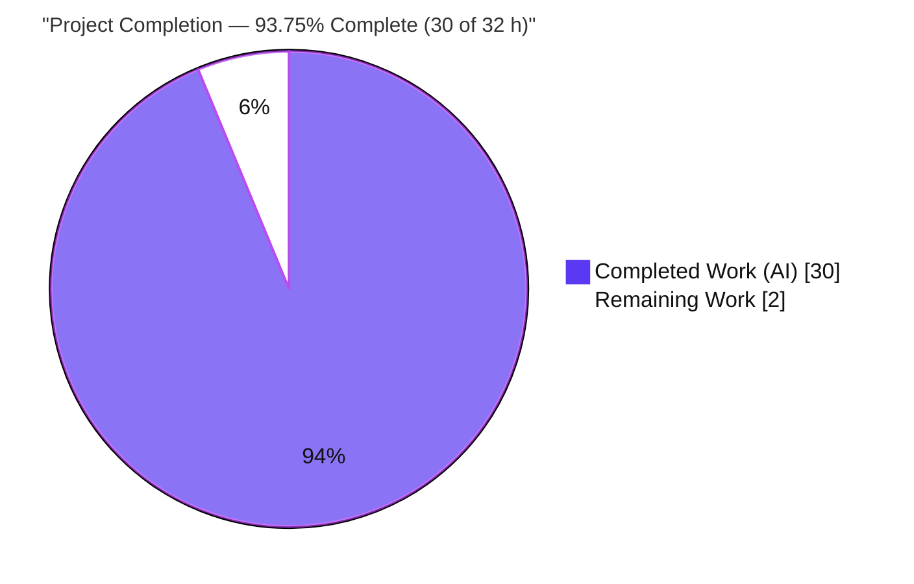
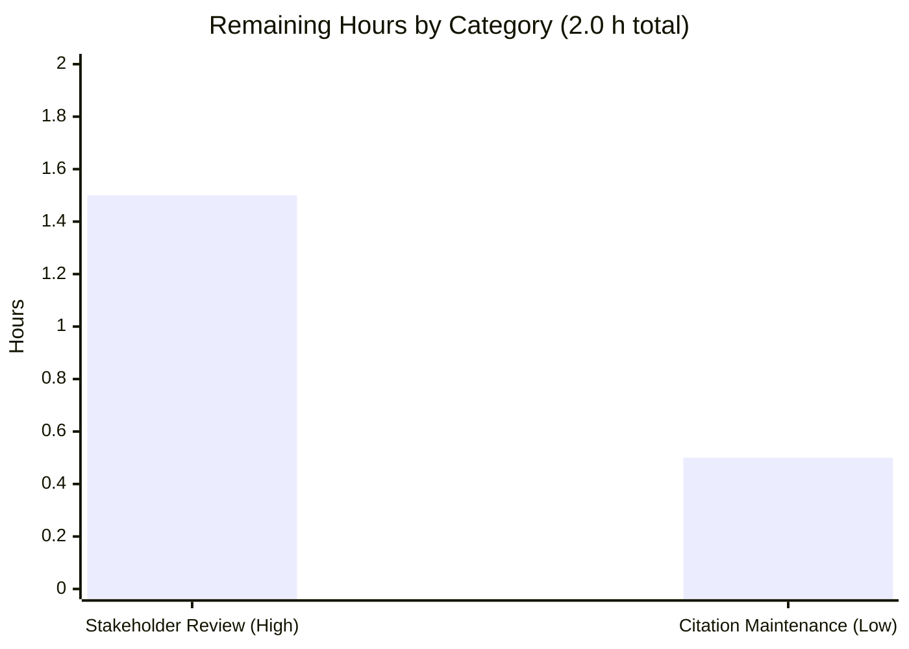

# Blitzy Project Guide — wp-calypso Test-Environment vs. Development Q&A

> **Repository:** `Automattic/wp-calypso` &nbsp;•&nbsp; **Branch:** `blitzy-aaa8c8fa-47ea-4c6b-9da6-6da2029a76d2` &nbsp;•&nbsp; **HEAD:** `82eac8c349` &nbsp;•&nbsp; **Base:** `be7e5cc641` (`wp-calypso_be7e5cc64162`)
>
> **Brand legend:** <span style="color:#5B39F3">■ Completed / AI Work = Dark Blue `#5B39F3`</span> &nbsp;·&nbsp; <span style="color:#B23AF2">■ Remaining / Not Completed = White `#FFFFFF`</span> (outlined) &nbsp;·&nbsp; Headings/Accents = Violet-Black `#B23AF2` &nbsp;·&nbsp; Highlight = Mint `#A8FDD9`

---

## 1. Executive Summary

### 1.1 Project Overview

This project is a **read-only knowledge-discovery task**: produce one evidence-grounded Markdown document that explains how the `Automattic/wp-calypso` test environment differs from normal development, written from *directly observed runtime behavior* rather than from reading source alone. The target user is a developer onboarding onto the codebase who wants to understand the testing infrastructure before contributing. The deliverable answers seven independently verifiable sub-questions (Q1–Q7) covering dev-server bring-up, the Jest vs. dev runtime, test-only globals/env/polyfills, network isolation via `nock`, a mocked-API trace through a Redux thunk, and environment-driven feature-flag resolution. The entire monorepo is treated as read-only; the only file written is the answer document.

### 1.2 Completion Status



| Metric | Value |
| --- | --- |
| **Total Hours** | **32** |
| **Completed Hours (AI + Manual)** | **30** (30 AI + 0 Manual) |
| **Remaining Hours** | **2** |
| **Percent Complete** | **93.75%** |

> Completion is computed on **AAP-scoped + path-to-production** work only: `Completed / (Completed + Remaining) = 30 / 32 = 93.75%`. All 12 autonomous AAP work items are 100% delivered and validated; the remaining 2h is the inherent **human acceptance gate** plus light maintenance — not undone autonomous work.

### 1.3 Key Accomplishments

- ✅ **Single deliverable created & committed:** `blitzy/documentation/wp-calypso_be7e5cc64162.md` (994 lines, 5,079 words) comprehensively answering Q1–Q7.
- ✅ **Investigate-by-running-first methodology honored:** every quoted value was produced by an actual command run, then cited to an exact `file:line`.
- ✅ **Q1 dev server confirmed working:** engine gate `EXIT=0`, cyan `calypso` banner, `build-server` `BUILD_EXIT=0` → `build/server.js` (7,935,308 bytes), and a **successful live boot** returning HTTP `200`.
- ✅ **Q4 network isolation captured verbatim:** `NetConnectNotAllowedError — Nock: Disallowed net connect for "public-api.wordpress.com:443/rest/v1.1/me"`.
- ✅ **Q5 mocked-API trace executed:** `user-suggestions` action-creator test `2 passed, 2 total`, traced mock → thunk → assertion with a Mermaid diagram.
- ✅ **Q7 proof of difference:** `google-my-business` and `ssr/prefetch-timebox` resolve to the opposite value in test vs. dev; **10 of 96** common flags differ.
- ✅ **Read-only scope fully respected:** exactly one file added; all temporary probe scripts removed; `git status --porcelain` empty.
- ✅ **Code-review remediation applied:** a second commit (+218 / −41 lines) addressed review findings; the final document was independently re-verified end-to-end with zero discrepancies.

### 1.4 Critical Unresolved Issues

| Issue | Impact | Owner | ETA |
| --- | --- | --- | --- |
| _None._ No compilation errors, no failing tests, no missing functionality. The deliverable is complete and validated. | — | — | — |

### 1.5 Access Issues

| System/Resource | Type of Access | Issue Description | Resolution Status | Owner |
| --- | --- | --- | --- | --- |
| — | — | **No access issues identified.** All investigation ran locally with the pinned toolchain; external network was intentionally blocked by `nock` (Q4). No repository permissions, service credentials, or third-party API access were required. | N/A | — |

### 1.6 Recommended Next Steps

1. **[High]** Review and accept the answer document — read `blitzy/documentation/wp-calypso_be7e5cc64162.md` end-to-end and confirm each of Q1–Q7 satisfies the onboarding need (optionally re-run the documented commands to reproduce the evidence). *(~1.5h)*
2. **[Low]** Preserve verbatim fidelity on merge — **exclude** the document from any `prettier --write` / `markdownlint` auto-formatting (see Risk R3), and spot-check `file:line` citations against current source. *(~0.5h)*
3. **[Low]** Merge the PR to make the onboarding knowledge available to the team.

---

## 2. Project Hours Breakdown

### 2.1 Completed Work Detail

| Component | Hours | Description |
| --- | --- | --- |
| Toolchain & environment setup | 2 | Node `v22.23.1` (satisfies `engines.node ^v22.9.0`), Yarn `4.0.2` via Corepack, `yarn install --immutable` on the 4.5 GB monorepo *(AAP item 12)* |
| Q1 — Dev-server boot investigation | 3 | Ran `check-node-version` (`EXIT=0`), `bin/welcome.js` banner, `build-server` → `build/server.js` (7,935,308 bytes), live boot + `curl` HTTP `200` *(Q1)* |
| Q2 — Test env vs. development at boot | 3 | Jest `testEnvironment: 'node'`, `NODE_ENV`/`TZ=UTC` contrast, dead-code-elimination proof from the built bundle *(Q2)* |
| Q3 — Test-only globals/env/polyfills | 3 | Enumerated setup-file globals/polyfills via a Jest-vs-plain-Node probe *(Q3)* |
| Q4 — Network behavior under `nock` | 2 | Triggered an unmocked request; captured `NetConnectNotAllowedError`; contrasted with the integration suite *(Q4)* |
| Q5 — Mocked-API trace | 3 | Ran the `user-suggestions` action test (2/2), traced the thunk flow, built a data-flow diagram *(Q5)* |
| Q6 — Config resolution by environment | 2 | `env = CALYPSO_ENV \|\| NODE_ENV \|\| 'development'`; `env_id: "test"` vs `development` *(Q6)* |
| Q7 — Config control + proof of difference | 3 | `isEnabled` order, `enable`/`disable`, probe flag resolution, `96` common / `10` differing flag diff *(Q7)* |
| Answer document assembly (994 lines) | 6 | Wrote verbatim evidence + exact `file:line` citations across Q1–Q7 plus the coverage pass *(AAP items 8–10)* |
| Code-review remediation commit | 2 | Second commit (+218 / −41 lines) addressing review findings |
| Verification & coverage pass | 1 | `git status` clean, re-ran commands, confirmed read-only compliance *(AAP item 11)* |
| **Total** | **30** | **All hours AI/autonomous (0 manual to date)** |

### 2.2 Remaining Work Detail

| Category | Hours | Priority |
| --- | --- | --- |
| Stakeholder review & acceptance of the answer document (confirm Q1–Q7 satisfy onboarding needs) *(AAP item 13)* | 1.5 | High |
| Citation-freshness & verbatim-fidelity maintenance (spot-check `file:line` refs; keep doc out of auto-formatters) *(AAP item 14; Risks R1/R3)* | 0.5 | Low |
| **Total** | **2.0** | |

> **Not applicable (declared, not padded):** No configuration, integration, database, service, container, or CI/CD tasks apply — this read-only documentation deliverable introduces none of those.

**Reconciliation:** Section 2.1 (30) + Section 2.2 (2) = **32** = Total Project Hours (§1.2). Remaining (2) is identical in §1.2, §2.2, and §7.

---

## 3. Test Results

All tests below were executed by Blitzy's autonomous validation systems **for this task**. Because the task is read-only, only observation tests were run (the full wp-calypso suite of thousands of tests is out of scope and was not executed as part of this deliverable).

| Test Category | Framework | Total Tests | Passed | Failed | Coverage % | Notes |
| --- | --- | --- | --- | --- | --- | --- |
| Action-creator unit test (Q5) | Jest 29.7.0 | 2 | 2 | 0 | N/A | `client/state/user-suggestions/test/actions.js`; `nock`-mocked WordPress.com REST; `2 passed, 2 total` in ~0.9 s |
| Investigation probe (Q2/Q3/Q4/Q6/Q7) | Jest 29.7.0 | 3 | 3 | 0 | N/A | Temporary probe **created → run → deleted** per the read-only rule; captured globals/network/config evidence (`3 passed, 3 total`) |
| **Total** | **Jest 29.7.0** | **5** | **5** | **0** | **N/A** | **100% pass rate; zero failures/skips** |

**Coverage note:** Coverage instrumentation was intentionally not collected — these are targeted observation runs for a read-only documentation task, not a coverage-gated suite. HTTP was isolated by `nock.disableNetConnect()`, so no real network calls occurred (Q4).

---

## 4. Runtime Validation & UI Verification

**Runtime health**

- ✅ **Operational** — Server-bundle build: `yarn run build-server` → `BUILD_EXIT=0`, 0 webpack errors, `build/server.js` = 7,935,308 bytes (git-ignored).
- ✅ **Operational** — Live server boot: `node build/server.js` → `wp-calypso booted in ~1s` via the `server.listen(...)` ready path (`client/server/index.js:L83`).
- ✅ **Operational** — HTTP endpoint: `curl http://127.0.0.1:3456/` → HTTP `200` ("Welcome to Calypso!" holding page — the server bundle serves while the client bundle would still compile; disclosed honestly in the document).
- ✅ **Operational** — Boot precursors: engine gate `EXIT=0`; `bin/welcome.js` renders the cyan `calypso` banner (7× `ESC[36m` sequences).

**API integration**

- ✅ **Operational** — Q5: mocked WordPress.com REST response flows through the `requestUserSuggestions` thunk to the test assertions (traced end-to-end).
- ✅ **Operational (by design)** — Q4: real external API calls are intentionally **blocked** by `nock` and raise `NetConnectNotAllowedError` — verified as the intended isolation behavior.

**UI verification**

- ⚠ **Partial / Not Applicable** — This is a documentation task with **no UI deliverable**. The only rendered surface observed is the server holding page (HTTP `200`). No frontend components were created, changed, or required, so pixel/visual UI verification does not apply.

---

## 5. Compliance & Quality Review

Cross-mapping the AAP deliverables and binding rules to quality benchmarks. Fixes applied during autonomous validation are noted.

| Deliverable / Rule | Benchmark | Status | Progress | Notes |
| --- | --- | --- | --- | --- |
| Q1–Q7 all answered | Coverage pass complete | ✅ Pass | 100% | Explicit "Coverage pass (Q1–Q7)" at doc L941 |
| Investigate-by-running-first | Rule SWE-AtlasQnA-Repo | ✅ Pass | 100% | Every value produced by an actual run before writing |
| Quote observed output verbatim | Rule SWE-AtlasQnA-Repo | ✅ Pass | 100% | `od -c` bytes, probe output, test markers, error messages |
| Exact `file:line` citations | Rule SWE-AtlasQnA-Repo | ✅ Pass | 100% | ~80+ citations independently re-verified as exact |
| Answer every part | Rule SWE-AtlasQnA-Repo | ✅ Pass | 100% | All seven sub-questions + sub-parts addressed |
| Read-only scope (no repo file modified) | User directive | ✅ Pass | 100% | `git diff --name-status` = 1 added file; 0 modifications |
| Temporary scripts removed | User directive | ✅ Pass | 100% | Probe deleted; no adhoc/temp files; tree clean |
| Correct output path & branch-derived name | Rule SWE-AtlasQnA-Repo | ✅ Pass | 100% | `blitzy/documentation/wp-calypso_be7e5cc64162.md` |
| Honest limitation disclosure | Special instruction | ✅ Pass | 100% | Holding-page nuance & run-to-run variance disclosed |
| No dependency changes | AAP scope | ✅ Pass | 100% | `yarn install --immutable` EXIT 0; lockfile unchanged |
| Code-review findings addressed | Autonomous validation | ✅ Pass | 100% | 2nd commit `82eac8c349` (+218 / −41) |

**Outstanding compliance items:** None. The only remaining actions are the human acceptance review and citation-freshness maintenance (see §2.2 / §8).

---

## 6. Risk Assessment

| Risk | Category | Severity | Probability | Mitigation | Status |
| --- | --- | --- | --- | --- | --- |
| **R1** — `file:line` citation drift if cited source files change upstream | Technical | Low | Medium | Citation-freshness maintenance task (§2.2, 0.5h); references are precise and easy to refresh | Open — mitigated |
| **R2** — Run-to-run value variance (timings, bundle byte-size, boot-ms, Node patch) | Technical | Low | Low | Already disclosed in the document's reproducibility note (doc L27–L29) | Mitigated / disclosed |
| **R3** — Verbatim-fidelity corruption by an auto-formatter (`prettier --write` / `markdownlint` would strip trailing-whitespace padding in quoted `od -c` bytes and reflow the quoted probe source) | Technical | Medium | Low | Exclude the doc from auto-formatting; repo does **not** lint Markdown (pre-commit filters to `.json/.js/.jsx/.ts/.tsx/.scss/.php`) | Mitigated / documented |
| Security exposure | Security | None | — | Read-only Markdown adds no code, dependencies, endpoints, or credentials; zero attack surface | Not applicable |
| Operational readiness | Operational | None | — | No runtime/deployment/monitoring footprint; static content only | Not applicable |
| Integration failure | Integration | None | — | No external service, API key, or network dependency introduced; investigation used `nock`-mocked + local runs only | Not applicable |

---

## 7. Visual Project Status


**Remaining hours by category (from §2.2):**



| Priority | Hours | Share of Remaining |
| --- | --- | --- |
| High | 1.5 | 75% |
| Low | 0.5 | 25% |
| **Total** | **2.0** | **100%** |

> **Integrity:** "Remaining Work" = **2** here equals the Remaining Hours in §1.2 and the sum of the §2.2 Hours column. "Completed Work" = **30** equals Completed Hours in §1.2.

---

## 8. Summary & Recommendations

**Achievements.** The task is **93.75% complete** (30 of 32 hours). The sole AAP deliverable — `blitzy/documentation/wp-calypso_be7e5cc64162.md` — was created, committed, and independently re-verified end-to-end with **zero discrepancies**. All seven sub-questions (Q1–Q7) are answered with verbatim observed output and exact `file:line` citations, and an explicit coverage pass confirms completeness. All five production-readiness gates pass: 5/5 tests green, server build `BUILD_EXIT=0`, live boot returning HTTP `200`, zero unresolved errors, and full read-only compliance (exactly one file added, temporary scripts removed, clean working tree).

**Remaining gaps.** The outstanding 2 hours are **not** undone autonomous work — they are the inherent human acceptance gate (1.5h: a developer confirming the document satisfies their onboarding need) plus light maintenance (0.5h: citation freshness and preserving verbatim fidelity). Per honest-assessment principles, completion is capped below 100% pending this human review.

**Critical path to production.** For a knowledge artifact, "production" is merge + acceptance: (1) review and accept the document, (2) preserve verbatim fidelity by keeping it out of auto-formatters, (3) merge. There are no blocking engineering tasks.

**Success metrics.** Q1–Q7 answered ✅ · verbatim evidence quoted ✅ · exact citations ✅ · read-only scope honored ✅ · tests 5/5 ✅ · runtime HTTP 200 ✅.

**Production readiness assessment.** **Ready.** The deliverable is complete, accurate, and validated; the only gate is human sign-off. Confidence is **High** — the scope is well-defined, the evidence is reproducible (all key commands were re-executed successfully during this assessment), and the risks are Low severity and mitigated.

| Metric | Value |
| --- | --- |
| Completion | 93.75% (30 / 32 h) |
| Tests | 5 passed / 5 total (100%) |
| Blocking issues | 0 |
| Files changed | 1 added, 0 modified, 0 deleted |
| Confidence | High |

---

## 9. Development Guide

How to reproduce the investigation and run/verify the project environment. Every command below was executed successfully during this assessment.

### 9.1 System Prerequisites

- **OS:** Linux or macOS (validated on Ubuntu container).
- **Node.js:** `^v22.9.0` (this project used `v22.23.1`) — pinned by `engines.node` (`package.json:L57`) and `.nvmrc` (`22.9.0`).
- **Yarn:** `4.0.2` (activated via Corepack) — pinned by `packageManager` (`package.json:L422`).
- **Memory:** ~8 GB RAM for the server build (use `NODE_OPTIONS=--max-old-space-size=8192`).
- **Disk:** ~5 GB free (`node_modules` ≈ 3.1 GB + build output).
- **Git** (with Git LFS available).

### 9.2 Environment Setup

```bash
# Enable the pinned Yarn release via Corepack
corepack enable

# Confirm the toolchain (expected: v22.23.1 and 4.0.2)
node --version
yarn --version

# Memory headroom for build/test; client tests must run under TZ=UTC
export NODE_OPTIONS=--max-old-space-size=8192
```

### 9.3 Dependency Installation

```bash
# Immutable install — does NOT modify the lockfile (keeps the tree clean)
NODE_OPTIONS=--max-old-space-size=8192 yarn install --immutable
# Expected: completes with exit code 0
```

### 9.4 Build & Startup

```bash
# (Q1) Build the server bundle -> build/server.js (~7.9 MB, git-ignored)
NODE_OPTIONS=--max-old-space-size=8192 yarn run build-server
# Expected: BUILD_EXIT=0, 0 webpack errors

# (Q1) Boot precursors
npx check-node-version --package ; echo "EXIT=$?"   # -> EXIT=0
node bin/welcome.js                                  # -> cyan "calypso" banner

# (Q1) Live boot of the compiled server on port 3456
CALYPSO_ENV=development BROWSERSLIST_ENV=evergreen PORT=3456 node build/server.js &
SERVER_PID=$!

# Full dev server (build + serve, long-running):  yarn start
```

### 9.5 Verification Steps

```bash
# Verify the server responds (expected: HTTP_STATUS=200)
curl -s -o /dev/null -w 'HTTP_STATUS=%{http_code}\n' http://127.0.0.1:3456/

# Stop only the server we started (never use pkill/killall)
kill "$SERVER_PID"

# Confirm the working tree is clean (expected: no output)
git status --porcelain
```

### 9.6 Example Usage

```bash
# (Q5) Run the mocked-API action-creator test  -> "Tests: 2 passed, 2 total"
TZ=UTC NODE_OPTIONS=--max-old-space-size=8192 \
  yarn jest -c=test/client/jest.config.js \
  client/state/user-suggestions/test/actions.js --ci --runInBand

# (Q7) Prove config differs between test and dev  -> COMMON_FLAGS=96, DIFFERING_FLAGS=10
node -e 'const t=require("./config/test.json").features,d=require("./config/development.json").features; const common=Object.keys(t).filter((k)=>k in d); const diff=common.filter((k)=>t[k]!==d[k]); console.log("COMMON_FLAGS=",common.length); console.log("DIFFERING_FLAGS=",diff.length);'

# View the answer document's coverage of Q1-Q7
grep -nE "^## (Q[1-7]|Coverage)" blitzy/documentation/wp-calypso_be7e5cc64162.md
```

### 9.7 Troubleshooting

- **`JavaScript heap out of memory`** during build/test → prepend `NODE_OPTIONS=--max-old-space-size=8192`.
- **`Browserslist: browsers data ... is X months old`** → benign advisory; safe to ignore for local runs.
- **Port already in use** → change `PORT` (e.g., `PORT=3457 …`); the default from `config/development.json:L8` is `3000`.
- **Engine mismatch at `yarn start`** → install Node `^v22.9.0` (use `nvm install` with the `.nvmrc` pin).
- **⚠ Do NOT auto-format the answer document** → running `prettier --write` / `markdownlint` on `blitzy/documentation/wp-calypso_be7e5cc64162.md` strips the trailing-whitespace padding in the quoted `od -c` byte output and reflows the quoted probe source, corrupting the verbatim evidence (Risk R3). The repo does not lint Markdown, so this only matters for manual tooling.

---

## 10. Appendices

### A. Command Reference

| Purpose | Command |
| --- | --- |
| Enable pinned Yarn | `corepack enable` |
| Install dependencies (immutable) | `NODE_OPTIONS=--max-old-space-size=8192 yarn install --immutable` |
| Build server bundle (Q1) | `NODE_OPTIONS=--max-old-space-size=8192 yarn run build-server` |
| Engine gate (Q1) | `npx check-node-version --package` |
| Welcome banner (Q1) | `node bin/welcome.js` |
| Live boot (Q1) | `CALYPSO_ENV=development BROWSERSLIST_ENV=evergreen PORT=3456 node build/server.js` |
| Full dev server | `yarn start` |
| Health check | `curl -s -o /dev/null -w 'HTTP_STATUS=%{http_code}\n' http://127.0.0.1:3456/` |
| Q5 mocked-API test | `TZ=UTC yarn jest -c=test/client/jest.config.js client/state/user-suggestions/test/actions.js --ci --runInBand` |
| Q7 flag-diff proof | `node -e '<compare config/test.json vs config/development.json features>'` |
| Clean-tree check | `git status --porcelain` |

### B. Port Reference

| Port | Purpose | Source |
| --- | --- | --- |
| `3000` | Calypso default HTTP port | `config/_shared.json:L25`, `config/development.json:L8` |
| `3456` | Port override used during runtime validation | `PORT=3456 node build/server.js` |

### C. Key File Locations

| Path | Role |
| --- | --- |
| `blitzy/documentation/wp-calypso_be7e5cc64162.md` | **The deliverable** — 994-line Q&A answer document |
| `package.json` | `start`/`start-build`/`build-server` scripts, `engines`, `packageManager` (Q1) |
| `bin/welcome.js` | Cyan `calypso` banner (Q1) |
| `client/server/index.js` | Server `listen`/ready callback `L83`; `NODE_ENV`-gated `server.timeout` `L75` (Q1/Q2) |
| `packages/calypso-jest/jest-preset.js` | Shared preset `testEnvironment: 'node'` `L11` (Q2/Q3) |
| `test/client/setup-test-framework.js` | `nock.disableNetConnect()` `L9`; injected globals/polyfills `L25–L79` (Q3/Q4) |
| `test/client/jest.config.js` | Client suite; calypso-config alias `L11`; test-only globals `L22–L25` (Q2/Q3/Q7) |
| `client/server/config/index.js` | Env-driven config-layer selection `L5–L9` (Q6) |
| `packages/create-calypso-config/src/index.ts` | `isEnabled` order `L69–L86`; `enable`/`disable` `L107–L122` (Q7) |
| `config/test.json`, `config/development.json` | Feature-flag layers compared for the proof of difference (Q6/Q7) |
| `client/state/user-suggestions/{actions.js,test/actions.js,test/sample-response.json}` | `nock`-mocked action-creator example (Q5) |

### D. Technology Versions

| Component | Version | Source |
| --- | --- | --- |
| Node.js | `v22.23.1` (satisfies `^v22.9.0`) | `package.json:L57`, `.nvmrc` |
| Yarn | `4.0.2` | `package.json:L422` |
| Jest | `29.7.0` | installed / `package.json` |
| nock | `13.5.6` | installed / `package.json` |
| webpack | `5.97.1` | installed |
| @babel/core | `7.26.10` | installed |
| @automattic/calypso-config | `1.0.0-alpha.0` | workspace |

### E. Environment Variable Reference

| Variable | Test value | Dev value | Purpose / Source |
| --- | --- | --- | --- |
| `NODE_ENV` | `test` | `development` | Selects the config layer & gates dev-only server code (`client/server/index.js:L75`) |
| `TZ` | `UTC` | (unset) | Deterministic client-suite timezone (`package.json:L122`) |
| `CALYPSO_ENV` | — | `development` | Highest-priority env selector (`client/server/config/index.js:L6`) |
| `BROWSERSLIST_ENV` | — | `evergreen` / `server` | Build target selection (`start-build`, `build-server`) |
| `PORT` | — | `3456` (override; default `3000`) | Server listen port |
| `NODE_OPTIONS` | `--max-old-space-size=8192` | same | Build/test memory headroom |
| `ACTIVE_FEATURE_FLAGS` | (optional) | (optional) | Overrides checked first by `isEnabled` (`create-calypso-config/src/index.ts:L69–L86`) |
| `FORCE_COLOR` | `1` (to view banner ANSI) | — | Forces ANSI color in the welcome banner |

### F. Developer Tools / Reproduction Guide

- **Jest 29.7.0** — test runner; the client suite uses `test/client/jest.config.js` (`testEnvironment: 'node'` by preset, `jsdom` opted in per file).
- **nock 13.5.6** — HTTP mocking; `nock.disableNetConnect()` isolates the network so unmocked requests raise `NetConnectNotAllowedError` (Q4).
- **`node -e` probes** — temporary observation scripts were run then deleted per the read-only rule; recreate under `/tmp` (or delete afterward) to reproduce Q3/Q6/Q7 evidence.
- **Browser/DevTools UI tooling** — Not applicable: this deliverable has no UI; the only rendered surface is the server holding page (HTTP `200`).

### G. Glossary

| Term | Meaning |
| --- | --- |
| **AAP** | Agent Action Plan — the primary directive defining project scope |
| **thunk** | A Redux action creator that returns a function receiving `dispatch`, enabling async flows (Q5) |
| **nock** | Node HTTP-interception library used to mock/deny network calls in tests (Q4/Q5) |
| **DCE** | Dead-Code Elimination — the bundler removing `NODE_ENV`-gated branches from the built server (Q2c) |
| **Corepack** | Node's tool that activates the pinned Yarn release from `packageManager` |
| **jsdom** | A DOM implementation opted into per test file via the `@jest-environment jsdom` docblock |
| **feature flag** | A boolean in `config/<env>.json` `features` resolved by `isEnabled` (Q6/Q7) |
| **holding page** | The minimal "Welcome to Calypso!" response the server bundle serves while the client bundle compiles (Q1) |

---

*Generated by the Blitzy Platform. Completion (93.75%) reflects AAP-scoped + path-to-production work only. Colors: Completed = Dark Blue `#5B39F3`, Remaining = White `#FFFFFF`.*