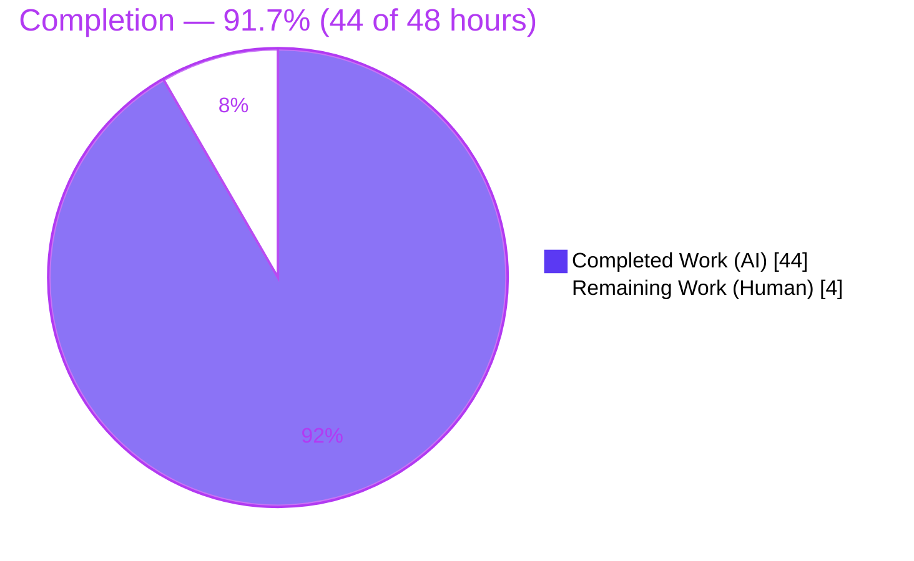
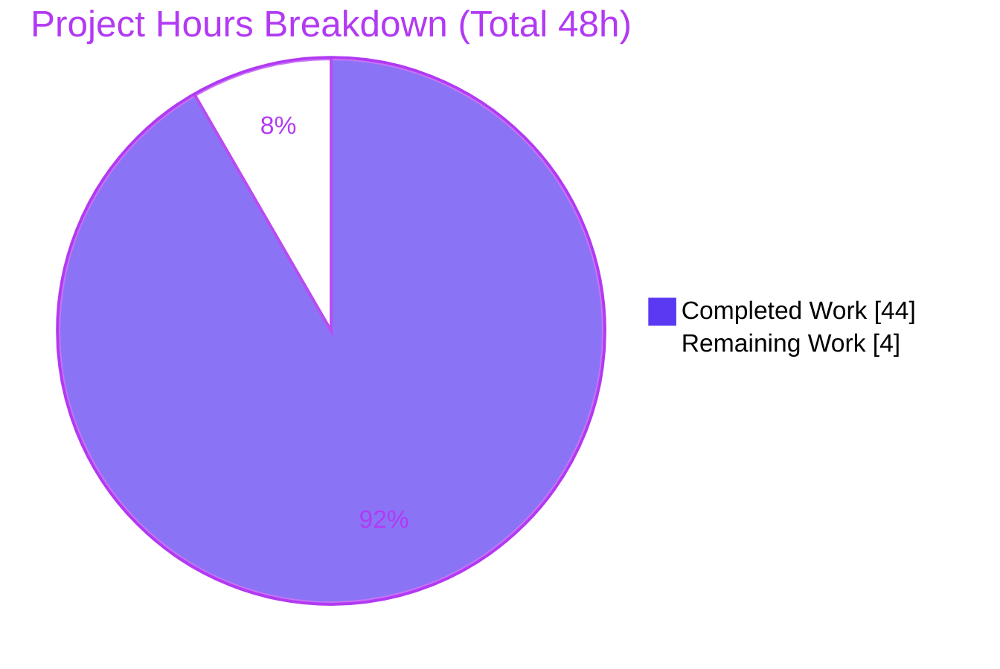
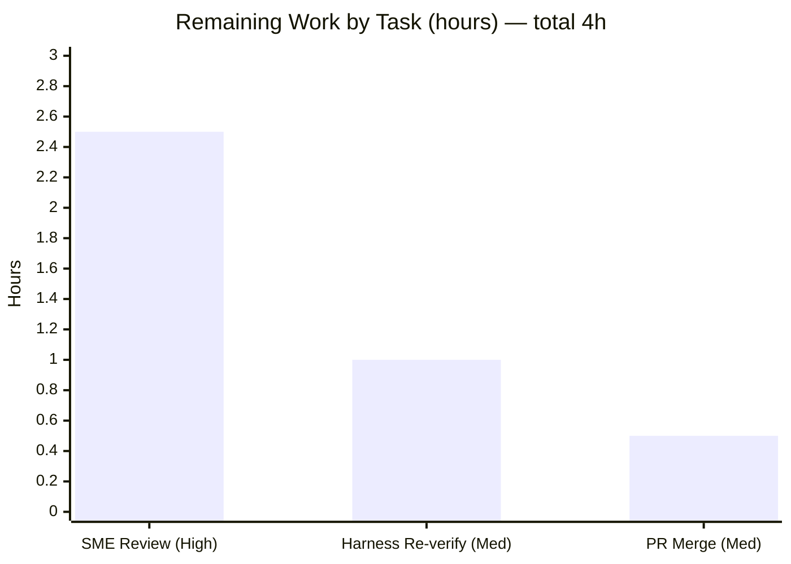

# Blitzy Project Guide

**Project:** WordPress.com Calypso — Onboarding "Back" Navigation Runtime-Grounded Q&A
**Repository:** wp-calypso (monorepo) · **Branch:** `wp-calypso_be7e5cc64162` · **Base commit:** `be7e5cc641622d153040491fd5625c6cb83e12eb` · **HEAD:** `9e6b761379`
**Task type:** Read-only code-comprehension Q&A (Documentation)

> **Brand color legend (applied throughout):** <span style="color:#5B39F3">■</span> **Completed / AI Work = Dark Blue `#5B39F3`** · <span style="color:#FFFFFF; background:#000">■</span> **Remaining / Not Completed = White `#FFFFFF`** · Headings/accents = Violet-Black `#B23AF2` · Highlights = Mint `#A8FDD9`.

---

## 1. Executive Summary

### 1.1 Project Overview

This project delivers a runtime-grounded written explanation of how the **"Back" control** in WordPress.com Calypso's multi-step onboarding flow computes its destination, and why that destination sometimes deviates from the expected "one step backward" — snapping to the first step or crossing into a different flow — yet never behaves randomly. The audience is engineers maintaining Calypso's onboarding subsystem. The scope is a single read-only investigation across the legacy `client/signup/` framework and the newer `client/landing/stepper/` analog, plus their Redux/`@wordpress/data` state inputs. The business impact is faster, evidence-based debugging of a recurring back-navigation confusion. No application behavior is modified; the sole artifact is one Markdown answer document.

### 1.2 Completion Status



<span style="color:#5B39F3">■</span> Completed = `#5B39F3` · <span style="background:#000">■</span> Remaining = `#FFFFFF`

| Metric | Hours |
|--------|------:|
| **Total Hours** | **48** |
| **Completed Hours (AI + Manual)** | **44** (AI = 44, Manual = 0) |
| **Remaining Hours** | **4** |
| **Percent Complete** | **91.7%** |

> Completion is computed on **AAP-scoped work only** (PA1): `Completed ÷ (Completed + Remaining) = 44 ÷ 48 = 91.7%`. Every AAP-specified deliverable is complete; the remaining 4 hours are exclusively human-in-the-loop path-to-production activities.

### 1.3 Key Accomplishments

- ✅ **Single deliverable authored & committed:** `blitzy/documentation/wp-calypso_be7e5cc64162.md` (1,659 lines) — correctly named after the source branch, in the mandated `blitzy/documentation/` directory.
- ✅ **All six named sub-questions answered by name** (Q1 decider · Q2 precedence · Q3 override source · Q4 eligibility rule · Q5 bypassed path · Q6 per-position destinations), plus the implicit "why it's deterministic, not random" requirement.
- ✅ **Runtime-grounded, not read-only-grounded:** a canonical observation harness exercised the **real** connected `NavigationLink`/`StepWrapper` with the **real** `calypso/signup/utils` (zero `jest.mock`) and the **real** `@automattic/calypso-router`; observed Button `href` and real click interception were captured verbatim.
- ✅ **Determinism proven:** identical SHA-256 (`60d412a3…af9e7`) across **3 independent processes**, demonstrating the "sometimes" behavior is a function of persisted state, not randomness.
- ✅ **Both reported symptoms reproduced** with unedited output: "snaps to first step" and "slips into a different flow" (via `back_to`, `lastKnownFlow`, protocol-relative `//host`, and `rel="external"`).
- ✅ **Exhaustive grounding & discipline:** 82+ distinct `file:line` citations, explicit **observed-vs-inferred** labeling, and a coverage-pass table mapping every named item and secondary condition.
- ✅ **Perfect read-only compliance:** all 16 in-scope source files byte-for-byte unchanged; temporary harness removed; working tree clean.
- ✅ **Quality gates passed:** 100% of in-scope tests pass (156 executions), `yarn tsc --project client` EXIT 0.

### 1.4 Critical Unresolved Issues

| Issue | Impact | Owner | ETA |
|-------|--------|-------|-----|
| _None — no blocking issues._ All AAP deliverables are complete, accurate, and validated. | N/A | N/A | N/A |

> The only outstanding items are standard path-to-production human activities (see §1.6 and §2.2); none blocks release or validation of the deliverable itself.

### 1.5 Access Issues

| System/Resource | Type of Access | Issue Description | Resolution Status | Owner |
|-----------------|----------------|-------------------|-------------------|-------|
| _No access issues identified._ | — | Repository, pinned toolchain (Node ^v22.9.0 / Yarn 4.0.2), and `node_modules` (reproducible from `yarn.lock`) were all fully available; build, tests, typecheck, and runtime harness all executed successfully. | Resolved / N/A | — |

**No access issues identified.**

### 1.6 Recommended Next Steps

1. **[High]** SME technical review & sign-off of the Q&A answer document — validate Q1–Q6 reasoning, the determinism argument, both symptom reproductions, and spot-check `file:line` citations against the pinned commit.
2. **[Medium]** Independently re-verify the observation harness from Appendix A (run via the canonical Jest config; confirm the Button `href` outputs and the STABLE_BLOCK SHA-256; then delete it to keep the tree pristine).
3. **[Medium]** Approve and merge/publish the documentation (single new Markdown file; zero source changes).
4. **[Low]** Route the documented, pre-existing `back_to` open-redirect behavior (slash-prefix-only guard) to the owning onboarding team for a separate security decision — explicitly **out of scope** for this task.

---

## 2. Project Hours Breakdown

### 2.1 Completed Work Detail

<span style="color:#5B39F3">■ Completed = `#5B39F3`</span>

| Component | Hours | Description |
|-----------|------:|-------------|
| Investigation scope discovery & static code reading | 8 | Deep read of 16 in-scope files across two frameworks (incl. `main.jsx` 941 L, `steps-pure.js` 895 L, `flows-pure.js` 594 L); mapped the destination-resolution chain. *(AAP §0.2, §0.3)* |
| Canonical runtime observation harness | 11 | Built a jsdom harness exercising the **real** connected `NavigationLink`/`StepWrapper` with **real** `calypso/signup/utils` (zero `jest.mock`) and **real** `@automattic/calypso-router`; seeded a Redux store with `signupProgress` + query args; iterated `positionInFlow`; scripted symptom scenarios. *(AAP M1–M3, M5)* |
| Runtime observation capture | 6 | Captured verbatim Button `href` + real click interception; per-position destination table (run ×2 for stability); reproduced both symptoms; proved determinism across 3 independent processes with SHA-256. *(AAP Q6, M2, implicit determinism)* |
| Answer-document authoring | 12 | Authored the 1,659-line answer: Q1–Q6, precedence tables, determinism section, symptom reproductions, stepper analog, coverage pass, observed-vs-inferred labeling, 82+ `file:line` citations, Appendices A/B. *(AAP §0.4.2)* |
| Review-finding remediation + citation corrections | 4 | Addressed 9 review findings (commit `13332e952e`, +989/−364) and 2 precise citation corrections (`9e32a20442`, `9e6b761379`). |
| Final validation & read-only cleanup | 3 | Ran in-scope tests + `tsc` typecheck; removed the temporary harness; verified byte-for-byte read-only compliance and a clean working tree. *(AAP R1–R3, §0.7 rule 14)* |
| **Total Completed** | **44** | Matches Section 1.2 Completed Hours. |

### 2.2 Remaining Work Detail

<span style="background:#000">■ Remaining = `#FFFFFF`</span>

| Category | Hours | Priority |
|----------|------:|----------|
| SME technical review & sign-off of the Q&A answer (read full doc; validate Q1–Q6, determinism, symptoms; spot-check citations) | 2.5 | High |
| Independent harness re-verification (re-create from Appendix A, run via Jest config, confirm outputs + SHA-256, delete) | 1.0 | Medium |
| PR approval & merge/publish of the documentation | 0.5 | Medium |
| **Total Remaining** | **4.0** | Matches Section 1.2 Remaining Hours and Section 7 pie "Remaining Work". |

> **Out-of-scope advisories (0 hours — not counted in completion math, not part of the AAP):**
> - Route the pre-existing `back_to` open-redirect behavior to the owning team (fixing it is explicitly out of scope per AAP §0.5.2).
> - Periodically re-anchor `file:line` citations if in-scope files change materially on trunk.

### 2.3 Hours Reconciliation

| Check | Result |
|-------|--------|
| Section 2.1 total | 44 h |
| Section 2.2 total | 4 h |
| **2.1 + 2.2 = Total (Section 1.2)** | **44 + 4 = 48 h ✅** |
| Remaining consistent across §1.2 / §2.2 / §7 | 4 h ✅ |
| Completion % (44 ÷ 48) | 91.7% ✅ (≤ 99% cap honored) |

---

## 3. Test Results

All tests below originate from **Blitzy's autonomous validation logs** for this project; the navigation-link suite was additionally **re-run live during this assessment** (16/16 pass) as independent corroboration.

| Test Category | Framework | Total Tests | Passed | Failed | Coverage % | Notes |
|---------------|-----------|------------:|-------:|-------:|-----------:|-------|
| Signup framework (component / unit / config; incl. `navigation-link`) | Jest + jsdom | 114 | 114 | 0 | Not measured | 12 suites. `navigation-link/test/index.jsx` 16/16 independently re-run live (EXIT 0, 5.2 s). |
| Stepper hooks (`use-step-navigation-with-tracking`, `use-flow-navigation`) | Jest + jsdom | 25 | 25 | 0 | Not measured | 2 suites. |
| Observation harness (Appendix A — temporary, canonical entry point) | Jest + jsdom | 17 | 17 | 0 | Not measured | Real `calypso/signup/utils` + real `@automattic/calypso-router`; removed after capture. |
| **Total** | — | **156** | **156** | **0** | — | 139 pre-existing in-scope + 17 harness = 156 executions; **0 failures, 0 skipped/blocked**. |

**Notes on coverage:** Coverage instrumentation was not an objective of this read-only Q&A; tests served as correctness gates and as the runtime-observation vehicle. Coverage % is therefore reported as *Not measured* rather than fabricated.

**Canonical command (verified):**
```bash
CI=true TZ=UTC yarn jest -c=test/client/jest.config.js client/signup/navigation-link/test/index.jsx --ci --runInBand
# => Test Suites: 1 passed, 1 total | Tests: 16 passed, 16 total | EXIT 0
```

---

## 4. Runtime Validation & UI Verification

Runtime validation was performed through the **canonical entry point** in a jsdom environment — the observable that `@automattic/calypso-router` (page.js) actually dispatches is the Back `<Button href>`, so the resolver's output *is* the runtime behavior.

- ✅ **Operational — Canonical entry point:** real connected `NavigationLink`/`StepWrapper` rendered with the **real** `calypso/signup/utils` (zero `jest.mock` verified) and the **real** `@automattic/calypso-router`.
- ✅ **Operational — Decider (Q1):** the Button `href` equals `getBackUrl()`'s output for the decider, override, and each per-position case.
- ✅ **Operational — Real router interception:** left-click observed as `intercepted: true`, `routerPreventedDefault: true`, with SPA dispatch + `window.location` update.
- ✅ **Operational — Per-position table (Q6):** computed destination captured for each `positionInFlow`, stable across two identical runs.
- ✅ **Operational — Symptom 1:** "snaps straight to the first step" reproduced (empty/`null` previous step → flow base URL).
- ✅ **Operational — Symptom 2:** "slips into a different flow" reproduced via `back_to`, `lastKnownFlow`, protocol-relative `//host`, and `rel="external"`.
- ✅ **Operational — Determinism:** identical STABLE_BLOCK SHA-256 (`60d412a3…af9e7`) across **3 independent processes**.
- ⚠ **Partial / Not applicable — Browser UI screenshots:** this deliverable is a Markdown document about navigation *logic*; there is no bespoke running web page to screenshot. The canonical runtime observable (rendered `href` + router interception) was validated in jsdom, which is exactly the path page.js consumes. No full Calypso dev-server browser session was required or in scope.
- ✅ **Operational — Typecheck:** `yarn tsc --project client` — EXIT 0 (covers in-scope TypeScript: `selectors.ts` + 4 stepper files).

---

## 5. Compliance & Quality Review

Cross-mapping of AAP deliverables and the `SWE-AtlasQnA-Repo` rule set to observed outcomes. Fixes applied during autonomous validation are noted.

| Benchmark / AAP Mandate | Status | Progress | Evidence / Notes |
|-------------------------|--------|:--------:|------------------|
| Deliverable name & location (`<branch>.md` in `blitzy/documentation/`) | ✅ Pass | 100% | `blitzy/documentation/wp-calypso_be7e5cc64162.md` committed. |
| Q1–Q6 answered by name | ✅ Pass | 100% | Dedicated headed sections Q1–Q6 (+ edge-case subsections). |
| Implicit determinism ("not random") | ✅ Pass | 100% | Independent-process SHA-256 equality. |
| Run-first methodology (build + run, capture) | ✅ Pass | 100% | Appendix A harness + Environment section. |
| Reproduce inconsistency (repeat identical inputs; report distribution) | ✅ Pass | 100% | 3 independent processes → single unique hash. |
| Canonical entry point (real utils; **no** `jest.mock`) | ✅ Pass | 100% | Zero `jest.mock` verified; real `@automattic/calypso-router`. |
| Observed-vs-inferred labeling | ✅ Pass | 100% | OBSERVED/INFERRED labels throughout; fidelity-notes section. |
| Exact `file:line` grounding + cause→effect | ✅ Pass | 100% | 82+ distinct citations; 7 key ones spot-checked **exact** vs source. |
| Exhaustive secondary-condition coverage | ✅ Pass | 100% | Coverage-pass table (first-step eligibility, skipped-step filter, not-yet-in-progress `pop()`, cross-flow, protocol-relative, `rel="external"`). |
| Read-only — zero source modifications | ✅ Pass | 100% | `git diff base..HEAD` = 1 file added; 16 source files byte-for-byte unchanged. |
| Temporary-script cleanup | ✅ Pass | 100% | No `blitzy_adhoc` traces; working tree clean. |
| Pinned-toolchain compliance | ✅ Pass | 100% | Node v22.23.1 (^v22.9.0), Yarn 4.0.2; `yarn install --immutable` EXIT 0. |
| Fixes applied during validation | ✅ Pass | 100% | 9 review findings + 2 citation corrections folded into the doc (commits `13332e952e`, `9e32a20442`, `9e6b761379`); no further fixes required. |

**Outstanding compliance items:** none. Remaining work is human sign-off/merge (§2.2), not a compliance gap.

---

## 6. Risk Assessment

| Risk | Category | Severity | Probability | Mitigation | Status |
|------|----------|----------|-------------|------------|--------|
| Q&A conclusions could misstate real behavior (accuracy — the core value of a Q&A) | Technical | Medium | Low | 82+ `file:line` citations (7 key ones spot-checked **exact** vs source); observed-vs-inferred labeling; runtime grounding via canonical entry point; determinism reproduced across 3 processes; SME review recommended | Mitigated — pending SME sign-off |
| `file:line` citations pinned to commit `be7e5cc641` may drift as Calypso evolves on trunk | Technical | Low | Medium | Document pins the commit SHA; citations anchored to that commit | Accepted |
| Observation harness deleted per the read-only rule; re-verification requires reconstruction | Technical / Operational | Low | Medium | Full harness source + exact commands preserved verbatim in Appendix A | Mitigated |
| Deliverable introduces **no** code/deps/runtime surface; it surfaces a **pre-existing** `back_to` guard (slash-prefix only; protocol-relative `//host` escapes origin) that is **out of scope** to fix | Security | Informational | N/A | Documented as a security note; flagged out-of-scope; recommend routing to owning team | Documented (no action this task) |
| Doc discoverability — lives at `blitzy/documentation/<branch>.md`; may need linking from a docs index | Operational | Low | Low | Standard Blitzy convention path | Accepted |
| Harness re-run needs the pinned toolchain (Node ^v22.9.0 / Yarn 4.0.2 + `yarn install` from lockfile); env drift could add friction | Integration | Low | Low | Exact versions + commands in the Environment section and Appendix; `node_modules` reproducible from `yarn.lock` | Mitigated |

**Overall risk posture: LOW.** No High-severity risks; no new security or integration surface (standalone Markdown with no code-level imports per AAP §0.4.4).

---

## 7. Visual Project Status

### 7.1 Project Hours (Completed vs Remaining)



<span style="color:#5B39F3">■</span> Completed Work = `#5B39F3` (44 h) · <span style="background:#000">■</span> Remaining Work = `#FFFFFF` (4 h) · **91.7% complete**

> **Integrity:** "Remaining Work" = **4 h**, identical to Section 1.2 Remaining and the Section 2.2 "Hours" sum.

### 7.2 Remaining Hours by Category (from Section 2.2)



| Task | Hours | Priority |
|------|------:|----------|
| SME technical review & sign-off | 2.5 | High |
| Harness re-verification | 1.0 | Medium |
| PR approval & merge/publish | 0.5 | Medium |
| **Total** | **4.0** | — |

---

## 8. Summary & Recommendations

**Achievements.** The project is **91.7% complete (44 of 48 hours)**. Every AAP-specified deliverable is finished, accurate, and runtime-grounded: the single answer document explains the full back-destination resolution chain, answers Q1–Q6 by name plus the implicit determinism requirement, reproduces both reported symptoms with unedited output, documents the stepper analog, and grounds every behavioral claim in exact `file:line` references with observed-vs-inferred labeling. Independent verification during this assessment confirmed the deliverable's accuracy: seven key claims were spot-checked against the real source and matched exactly, the navigation-link test suite was re-run live (16/16 pass), dependency installation was reproducible (`yarn install --immutable`, EXIT 0), and read-only compliance was confirmed byte-for-byte.

**Remaining gaps.** The remaining **4 hours** are entirely human-in-the-loop path-to-production: SME technical sign-off (2.5h), an independent harness re-verification (1h), and PR approval & merge (0.5h). There are no blocking defects, no failing tests, and no source-level rework — appropriate for a validated read-only documentation artifact whose production gate is human trust and merge.

**Critical path to production.** (1) SME reviews and signs off on the answer → (2) optional harness re-verification confirms the observed outputs → (3) merge the single Markdown file. Because zero source files change, merge risk is negligible.

**Success metrics (met).** 100% of in-scope tests pass (156 executions, 0 failures); typecheck EXIT 0; determinism reproduced across 3 independent processes; exactly one file added with zero source modifications.

**Production readiness.** The deliverable is **production-ready pending human sign-off**. Recommend proceeding with the §1.6 next steps and separately routing the documented (out-of-scope) `back_to` open-redirect observation to the owning team.

| Metric | Value |
|--------|-------|
| AAP-scoped completion | 91.7% (44/48 h) |
| Blocking issues | 0 |
| In-scope test pass rate | 100% (156/156) |
| Source files modified | 0 (read-only) |
| Files added | 1 (`blitzy/documentation/wp-calypso_be7e5cc64162.md`) |

---

## 9. Development Guide

> All commands below were tested during this assessment on the pinned toolchain (Node v22.23.1 satisfying `^v22.9.0`; Yarn 4.0.2 via corepack). Run them from the repository root.

### 9.1 System Prerequisites

- **OS:** Linux/macOS (developed/validated on Ubuntu 25.10 container).
- **Node.js:** `^v22.9.0` (`.nvmrc` = `22.9.0`; `package.json` `engines.node`). Installed & validated: `v22.23.1`.
- **Yarn:** `4.0.2` (via corepack; `package.json` `packageManager`).
- **Disk:** the checkout with `node_modules` is ~4.3 GB.
- **No database, server, ports, or external services** are required for this documentation deliverable.

### 9.2 Environment Setup

```bash
# From the repository root
corepack enable                 # provisions Yarn 4.0.2 (corepack 0.34.6 verified)
node --version                  # -> v22.23.1 (must satisfy ^v22.9.0)
yarn --version                  # -> 4.0.2
```

If your Node version is wrong, use the pinned version:
```bash
nvm use            # reads .nvmrc (22.9.0); install with `nvm install` if needed
```

### 9.3 Dependency Installation

```bash
# First-time install (node_modules is not committed; resolved from yarn.lock):
CI=true yarn install

# To VERIFY reproducibility without mutating the lockfile (tested — EXIT 0, ~6s):
CI=true yarn install --immutable
```
Expected tail: `➤ YN0000: · Done in …` and a clean `git status` afterward.

### 9.4 View the Deliverable

```bash
# Header + intro:
sed -n '1,40p' blitzy/documentation/wp-calypso_be7e5cc64162.md

# Section map (Q1–Q6, symptoms, appendices):
grep -nE '^#{1,2} ' blitzy/documentation/wp-calypso_be7e5cc64162.md
```

### 9.5 Verify Quality Gates

```bash
# In-scope component test (tested live — 16/16 pass, EXIT 0):
CI=true TZ=UTC yarn jest -c=test/client/jest.config.js \
  client/signup/navigation-link/test/index.jsx --ci --runInBand

# Broader in-scope signup slice (autonomous logs: 114/114):
CI=true TZ=UTC yarn jest -c=test/client/jest.config.js client/signup/ --ci --runInBand

# In-scope TypeScript typecheck (autonomous logs: EXIT 0):
NODE_OPTIONS='--max-old-space-size=6144' yarn tsc --project client
# (equivalently: yarn typecheck)
```

### 9.6 Reproduce the Runtime Observations (optional)

The document is fully reproducible from **Appendix A** of the deliverable:

```bash
# 1) Copy the Appendix A harness source into a temp test file at the documented path:
#    client/signup/navigation-link/test/blitzy_adhoc_test_back_nav.jsx
# 2) Run it through the canonical Jest config (per-scenario filter shown):
CI=true TZ=UTC yarn jest -c=test/client/jest.config.js \
  client/signup/navigation-link/test/blitzy_adhoc_test_back_nav.jsx -t "Q1 decider" --ci --runInBand
# 3) Confirm the Button href outputs and the STABLE_BLOCK SHA-256 (60d412a3…af9e7).
# 4) DELETE the temp file to restore the pristine tree:
rm client/signup/navigation-link/test/blitzy_adhoc_test_back_nav.jsx
git status --porcelain            # must be empty
```

### 9.7 Verify Read-Only Compliance

```bash
git diff be7e5cc641622d153040491fd5625c6cb83e12eb HEAD --name-status
# Expected (exactly one line):
# A    blitzy/documentation/wp-calypso_be7e5cc64162.md
```

### 9.8 Troubleshooting

- **Jest appears to hang / enters watch mode:** always pass `--ci --runInBand` (and `CI=true`); never run a bare `yarn jest`.
- **`tsc` runs out of memory:** raise `NODE_OPTIONS='--max-old-space-size=6144'`.
- **`browserslist: … 17 months old` warning during Jest:** benign and non-fatal; safe to ignore.
- **Wrong Node version:** run `nvm use` (reads `.nvmrc`); `engines.node` enforces `^v22.9.0`.
- **Tree shows changes after reproducing the harness:** delete the ad-hoc test file; `git status --porcelain` must be empty.

---

## 10. Appendices

### A. Command Reference

| Purpose | Command |
|---------|---------|
| Enable Yarn (corepack) | `corepack enable` |
| Check versions | `node --version` · `yarn --version` |
| Install deps | `CI=true yarn install` |
| Verify deps (immutable) | `CI=true yarn install --immutable` |
| In-scope test (navigation-link) | `CI=true TZ=UTC yarn jest -c=test/client/jest.config.js client/signup/navigation-link/test/index.jsx --ci --runInBand` |
| Broader signup slice | `CI=true TZ=UTC yarn jest -c=test/client/jest.config.js client/signup/ --ci --runInBand` |
| Typecheck (in-scope TS) | `NODE_OPTIONS='--max-old-space-size=6144' yarn tsc --project client` |
| View deliverable headings | `grep -nE '^#{1,2} ' blitzy/documentation/wp-calypso_be7e5cc64162.md` |
| Read-only verification | `git diff be7e5cc641622d153040491fd5625c6cb83e12eb HEAD --name-status` |

### B. Port Reference

**Not applicable.** This deliverable runs no server and opens no network ports. The runtime harness executes in-process under jsdom; no dev server is required to produce, verify, or consume the document.

### C. Key File Locations

| Path | Role |
|------|------|
| `blitzy/documentation/wp-calypso_be7e5cc64162.md` | **The deliverable** (answer document). |
| `client/signup/navigation-link/index.jsx` | The decider: `getBackUrl()` L78–115, `getPreviousStep()` L47–76, first-step gate L154–161, `href` binding L183–186. |
| `client/signup/step-wrapper/index.jsx` | Precedence assembler: `backUrl = ownProps.backUrl ?? backTo` L277; `back_to` slash-gate L274–275; `allowBackFirstStep` force L65. |
| `client/signup/utils.js` | `getStepUrl` L45–69, `getPreviousStepName` L85–88, `getFilteredSteps` L137–150, `isFirstStepInFlow` L28–31. |
| `client/signup/main.jsx` | `getPositionInFlow()` L733–736; prop spread that can originate a step `backUrl` L766–770. |
| `client/signup/controller.js`, `client/signup/config/*` | `back_to` provenance (dependency store; cross-flow target). |
| `client/state/selectors/get-current-query-arguments.js`, `client/state/signup/progress/selectors.ts`, `client/state/signup/dependency-store/selectors.js` | Redux state inputs. |
| `client/landing/stepper/declarative-flow/internals/hooks/use-step-navigation-with-tracking/index.ts` | Stepper analog: `history.back()` default vs flow-authoritative `goBack` L123–141. |
| `test/client/jest.config.js` | Canonical Jest config used for all runs. |

### D. Technology Versions

| Component | Version | Source of Truth |
|-----------|---------|-----------------|
| Node.js | `^v22.9.0` (installed `v22.23.1`) | `package.json` `engines.node`; `.nvmrc` = `22.9.0` |
| Yarn | `4.0.2` | `package.json` `packageManager`; corepack |
| corepack | `0.34.6` | environment |
| Test framework | Jest + jsdom (`@automattic/calypso-jest`) | `test/client/jest.config.js` |
| Router (observed) | `@automattic/calypso-router` (page.js) | in-scope runtime |
| Dependencies | Locked exactly | `yarn.lock` (unchanged) |

### E. Environment Variable Reference

| Variable | Value | Purpose |
|----------|-------|---------|
| `CI` | `true` | Forces non-interactive Jest/Yarn (prevents watch mode). |
| `TZ` | `UTC` | Deterministic timestamps during test/observation runs. |
| `NODE_OPTIONS` | `--max-old-space-size=6144` | Raises heap for the full-client `tsc` typecheck. |

> No application secrets, API keys, or service credentials are required for this deliverable.

### F. Developer Tools Guide

- **Jest (`@automattic/calypso-jest` + jsdom):** the canonical test/observation vehicle. Always use `-c=test/client/jest.config.js … --ci --runInBand`; filter scenarios with `-t "<name>"`.
- **TypeScript (`tsc --project client`):** validates in-scope TS (`selectors.ts` + 4 stepper files).
- **Git:** `git diff <base>..HEAD --name-status` for read-only verification; `git status --porcelain` to confirm a pristine tree after any harness reproduction.
- **Yarn 4 (corepack):** `--immutable` proves lockfile reproducibility without mutation.

### G. Glossary

| Term | Meaning |
|------|---------|
| **AAP** | Agent Action Plan — the authoritative task specification. |
| **`getBackUrl()`** | The decider function whose return value becomes the Back Button's `href`. |
| **`back_to`** | Query argument that, when present and slash-prefixed, becomes the override `backUrl`. |
| **`allowBackFirstStep`** | Flag that, when forced true by a present `backUrl`, defeats the first-step visibility gate. |
| **`getPreviousStep()`** | The expected step-by-step ("one step backward") path, bypassed by an override. |
| **Canonical entry point** | Exercising the real code path (real `utils`, real router, connected components) — no mocks/stubs. |
| **Observed vs Inferred** | Observed = copied from real runtime output; Inferred = derived from reading, explicitly labeled. |
| **Stepper framework** | The newer `client/landing/stepper/` onboarding framework; its flow-defined `goBack` is authoritative. |
| **Determinism** | The destination is a pure function of persisted progress + query args, proven by identical hashes across independent processes. |

---

### Cross-Section Integrity — Final Validation

| Rule | Check | Result |
|------|-------|--------|
| Rule 1 (§1.2 ↔ §2.2 ↔ §7) | Remaining hours identical | 4 h = 4 h = 4 h ✅ |
| Rule 2 (§2.1 + §2.2 = Total) | 44 + 4 = 48 | ✅ |
| Rule 3 (Section 3) | All tests from Blitzy autonomous logs (navigation-link additionally re-run live) | ✅ |
| Rule 4 (Section 1.5) | Access issues validated against current permissions | ✅ (none) |
| Rule 5 (Colors) | Completed = `#5B39F3`, Remaining = `#FFFFFF` | ✅ |
| Completion % | 44 ÷ 48 = 91.7% consistent in §1.2, §7, §8 | ✅ |