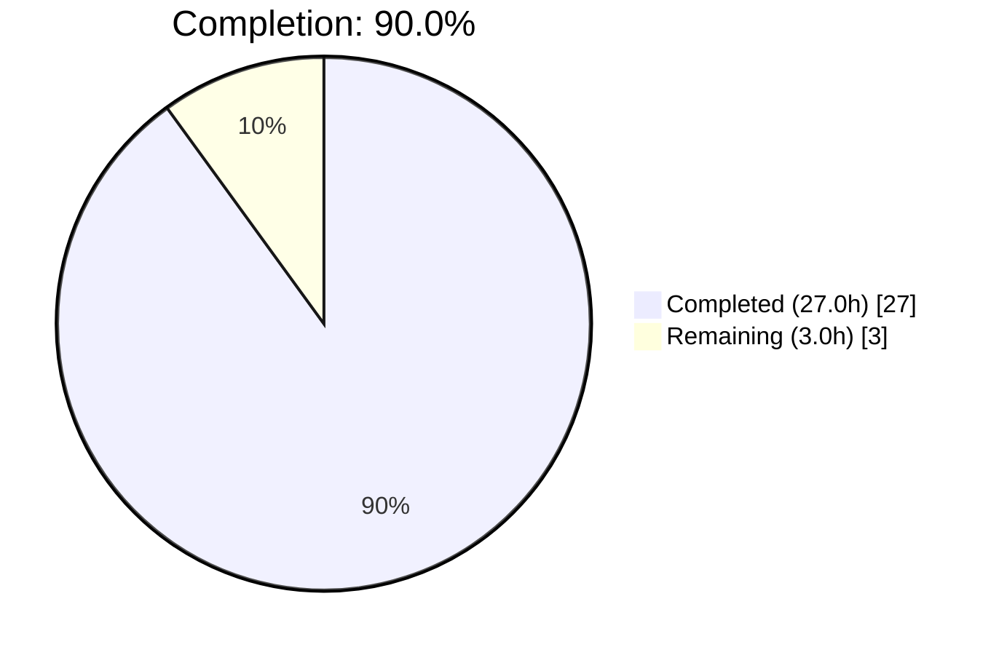
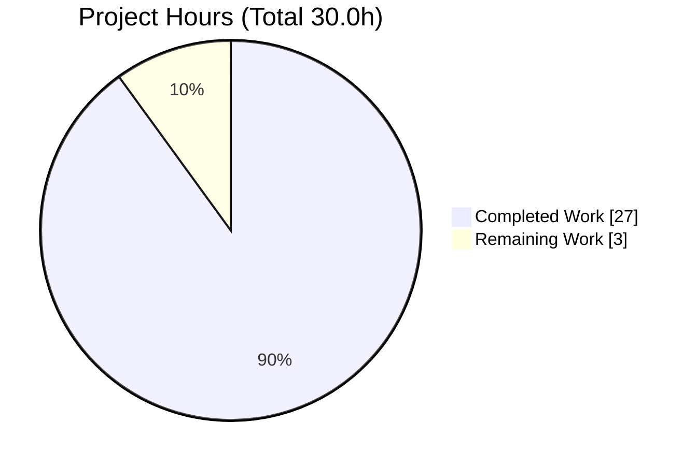
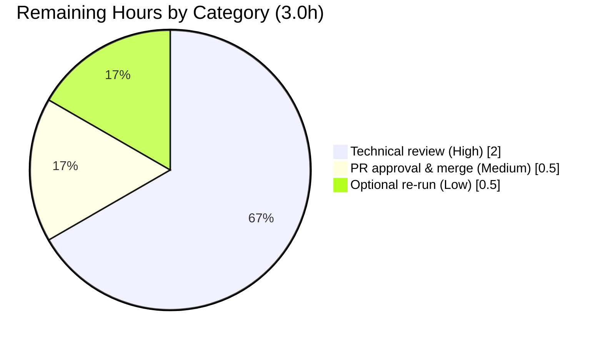

# Blitzy Project Guide

**Project:** wp-calypso — Test Environment & Module-Resolution Investigation
**Deliverable:** `blitzy/documentation/wp-calypso_be7e5cc64162.md`
**Branch:** `blitzy-110f9467-98f1-4706-a85a-d49a7d78cd0b`
**Base:** `be7e5cc641622d153040491fd5625c6cb83e12eb`
**HEAD:** `c2317f13ce58428b575e33d296688845c9e9ab81`

---

## 1. Executive Summary

### 1.1 Project Overview

This engagement is a **read-only code investigation and technical Q&A** on the `wp-calypso` Yarn-workspaces monorepo, governed by the "SWE-AtlasQnA-Repo" rule set. The objective is to author one evidence-grounded Markdown document explaining why a wp-calypso test can pass in isolation yet behave differently in the full suite — a behavior rooted in how module resolution and environment setup vary across the repository's distinct Jest test-execution contexts. The target audience is wp-calypso engineers debugging test-isolation issues. The scope is intentionally narrow and additive: a single new documentation file produced via a mandated run-first methodology (execute code, capture verbatim output, cite exact `file:line`), with the source tree left byte-for-byte unchanged.

### 1.2 Completion Status



> Color key — **Completed = Dark Blue `#5B39F3`**, **Remaining = White `#FFFFFF`** (center label: **90.0% Complete**).

| Metric | Hours |
|--------|-------|
| **Total Hours** | 30.0 |
| **Completed Hours (AI + Manual)** | 27.0 |
| — AI (autonomous) | 27.0 |
| — Manual (human) | 0.0 |
| **Remaining Hours** | 3.0 |
| **Percent Complete** | **90.0%** |

**Calculation (PA1, AAP-scoped):** Completion % = Completed ÷ (Completed + Remaining) × 100 = 27.0 ÷ 30.0 × 100 = **90.0%**. The remaining 10% (3.0 h) is entirely path-to-production activity (human review and merge) that cannot be performed autonomously.

### 1.3 Key Accomplishments

- ✅ Authored the complete deliverable `blitzy/documentation/wp-calypso_be7e5cc64162.md` (601 lines / 50,055 bytes; filename equals the source branch name as mandated).
- ✅ Answered all six investigative requirements (R1–R6) explicitly, each with a dedicated section and a final coverage-pass checklist marking every item `[x]`.
- ✅ Applied the mandated run-first methodology: executed real code paths, captured verbatim output, and anchored every claim to an exact `file:line` citation (~137 citations; 69 distinct tokens, 100% validated).
- ✅ Reproduced all key repository metrics exactly: 498 `@jest-environment` docblocks, 58 package Jest configs (36 node / 22 jsdom), 64 `calypso:src` packages, 1404 raw / 1392 effective testMatch.
- ✅ Proved the R3 resolution divergence: Jest `calypso:src` resolver → `packages/load-script/src/index.js` vs plain Node `require.resolve` → `MODULE_NOT_FOUND`.
- ✅ Honored the read-only mandate: `git diff base..HEAD` = exactly one added file; all temporary probes removed; `git status --porcelain` empty.
- ✅ Independent autonomous validation re-ran every probe and re-verified every citation/count/output block with zero discrepancies.

### 1.4 Critical Unresolved Issues

| Issue | Impact | Owner | ETA |
|-------|--------|-------|-----|
| _None_ | No unresolved issues block release or validation. The deliverable is complete, all probes pass, and the repository is clean. | — | — |

### 1.5 Access Issues

| System/Resource | Type of Access | Issue Description | Resolution Status | Owner |
|-----------------|----------------|-------------------|-------------------|-------|
| _None_ | — | No access issues identified. The repository, toolchain (Node v22.23.1, Yarn 4.0.2, Jest 29.7.0), and all dependencies were available; `yarn install` completed and all probes executed successfully. | N/A | — |

**No access issues identified.**

### 1.6 Recommended Next Steps

1. **[High]** Perform a human technical review of `blitzy/documentation/wp-calypso_be7e5cc64162.md` — confirm the R1–R6 answers, spot-check a sample of `file:line` citations against the working tree, and validate the narrative reads clearly for the intended engineering audience. (~2.0 h)
2. **[Medium]** Approve and merge the pull request (single added file in a new `blitzy/documentation/` directory; negligible conflict surface). (~0.5 h)
3. **[Low]** Optionally re-run the documented probes on the reviewer's machine to confirm host-dependent values (Node version string, Jest `Time:` lines) reproduce within the documented ranges. (~0.5 h)

---

## 2. Project Hours Breakdown

### 2.1 Completed Work Detail

Each completed component traces to a specific AAP requirement. All rows reflect autonomous (AI) work delivered by Blitzy agents.

| Component | Hours | Description |
|-----------|-------|-------------|
| R1 — Test commands → config → testEnvironment | 3.0 | Enumerated the `run-s` test fan-out and per-suite `jest -c` commands; resolved each to its Jest config and concrete `testEnvironment` (node vs jsdom); reproduced the command-to-env table and all associated counts. |
| R2 — Global environment comparison | 2.5 | Built node + jsdom probes under the client config; captured the `typeof` matrix for `window`/`document`/`navigator`/`matchMedia`/`fetch`/`CSS`; isolated `window`/`document` as jsdom-only. |
| R3 — Internal-package dependency resolution | 2.5 | Traced `calypso-analytics → load-script`; ran the `calypso:src` resolver vs Node `require.resolve`; documented source-vs-dist divergence (`MODULE_NOT_FOUND` under plain Node). |
| R4 — Import-path overrides | 2.5 | Documented `moduleNameMapper` redirections for `@automattic/calypso-config` across client/server/integration and the `calypso:src` `mainFields`/`conditionNames` resolver override. |
| R5 — Load order | 2.0 | Reconstructed and corroborated the six-step Jest init sequence (environment → setupFiles → framework → setupFilesAfterEnv → resolution → test body). |
| R6 — Browser-API provider & timing | 2.5 | Identified jsdom + project setup files as providers; verified availability timing via module-top vs in-test observation across server/packages/client probes. |
| Document assembly & synthesis | 3.5 | Composed the 601-line Markdown deliverable: per-requirement sections, verbatim output blocks, synthesis, coverage-pass checklist, and the initialization-order diagram. |
| Run-first harness, research & toolchain verification | 1.5 | Created/executed temporary Jest probes and resolver scripts; validated Jest-mechanics framing against official docs; verified Node/Yarn/Jest and dependency versions. |
| Quality corrections | 3.0 | Applied an 8-finding review correction pass and a count-grounding pass (commits `c06132695f`, `c2317f13ce`) to ensure citation accuracy and exact counts. |
| Autonomous validation | 4.0 | Independently re-ran every probe and re-verified all citations, counts, arithmetic, and verbatim output; ran the programmatic citation validator (69/69 tokens valid); confirmed clean `git status`. |
| **Total** | **27.0** | **Sum of completed AAP-scoped work** |

> **Validation:** Total (27.0 h) equals Completed Hours in Section 1.2. ✔

### 2.2 Remaining Work Detail

All remaining work is path-to-production; no autonomous AAP work is outstanding.

| Category | Hours | Priority |
|----------|-------|----------|
| Human technical review of the deliverable (verify R1–R6, spot-check citations, readability) | 2.0 | High |
| PR approval & merge (single added file, new directory) | 0.5 | Medium |
| Optional reproducibility re-run of documented probes on reviewer host | 0.5 | Low |
| **Total** | **3.0** | — |

> **Validation:** Total (3.0 h) equals Remaining Hours in Section 1.2 and the "Remaining Work" value in the Section 7 pie chart. ✔

### 2.3 Hours Reconciliation

| Check | Formula | Result | Status |
|-------|---------|--------|--------|
| Rule 2 — 2.1 + 2.2 = Total | 27.0 + 3.0 | 30.0 h | ✅ matches Section 1.2 Total |
| Rule 1 — Remaining consistency | 1.2 = 2.2 sum = Section 7 pie | 3.0 h everywhere | ✅ |
| Completion % | 27.0 ÷ 30.0 × 100 | 90.0% | ✅ used in 1.2, 7, 8 |

---

## 3. Test Results

All tests below originate from Blitzy's autonomous validation logs for this project. Because the deliverable is a documentation artifact produced via a run-first methodology, "tests" are the executable probes and existing suites run to capture and verify the cited runtime evidence. There is no application code under test, so code-coverage percentages are not applicable (N/A); the meaningful coverage metric is **requirement coverage: 6/6 (100%)**.

| Test Category | Framework | Total Tests | Passed | Failed | Coverage % | Notes |
|---------------|-----------|-------------|--------|--------|-----------|-------|
| R2 global-env probes (node + jsdom) | Jest 29.7.0 | 2 | 2 | 0 | N/A | `typeof` matrix; `window`/`document` = object (jsdom) vs undefined (node). Verbatim `2 passed, 2 total`. |
| R6 browser-API timing probes (server / packages-node / client) | Jest 29.7.0 | 3 | 3 | 0 | N/A | `fetchIsMock` = false/false/true; module-top == in-test confirmed. |
| R3 internal-dependency suite (`@automattic/load-script`) | Jest 29.7.0 | 19 (3 suites) | 19 | 0 | N/A | Confirms source loads via resolver; suite green. |
| R3/R4 resolver comparison scripts | Node 22 + enhanced-resolve | 2 | 2 | 0 | N/A | `calypso:src → src/index.js` vs Node `MODULE_NOT_FOUND`; unmapped → `calypso-config/src/index.ts`. |
| R1/R5 config introspection (`jest --showConfig`, `--listTests`) | Jest 29.7.0 | 6 | 6 | 0 | N/A | All 6 configs load; env/setup/transform reproduced verbatim. |
| Programmatic citation validator | Custom (Python) | 69 | 69 | 0 | N/A | Every distinct `file:line` token resolves (file exists, line in bounds). |
| **Total** | — | **32 + 69 citations** | **All** | **0** | **N/A (code); 100% requirement coverage** | 100% pass across all autonomous probes and validators. |

**Summary:** 32 probe/suite/introspection runs plus a 69-token citation validation — **100% pass, zero failures**. Host/run-dependent values (Node version string, Jest `Time:` lines) are appropriately flagged in the deliverable as environment-specific.

---

## 4. Runtime Validation & UI Verification

**Runtime health (Jest infrastructure):**
- ✅ **Operational** — All six Jest configurations load successfully via `jest --showConfig` (client, server, packages, build-tools, integration, apps).
- ✅ **Operational** — Custom `calypso:src` module resolver (`enhanced-resolve` with `mainFields: ['calypso:src','main']`, `conditionNames: ['calypso:src','node','require']`) executes and resolves internal packages to source.
- ✅ **Operational** — Node test environment initializes with `window`/`document` = `undefined`; jsdom environment initializes with `window`/`document` = `object`.
- ✅ **Operational** — Setup-file global injection verified: `matchMedia`, `CSS.supports`, `ResizeObserver`, and mocked `fetch` present before any test module body executes.
- ✅ **Operational** — Internal dependency edge resolves to untranspiled source (`packages/load-script/src/index.js`) under Jest; plain Node fails with `MODULE_NOT_FOUND` (expected — `dist/` absent).

**UI verification:**
- ➖ **N/A** — This is a documentation-only deliverable with no user interface. No screens, components, or visual flows are introduced. No Figma references were provided.

**API integration:**
- ➖ **N/A** — No application APIs are created or modified. The only "network" surface touched is the test-suite `fetch` mock/`nock` disabling observed during probes, which behaved as documented.

**Repository state:**
- ✅ **Operational** — `git status --porcelain` empty; `git diff base..HEAD` = exactly one added file (601 insertions, 0 deletions); all temporary probe artifacts removed.

---

## 5. Compliance & Quality Review

Cross-mapping of AAP deliverables and the "SWE-AtlasQnA-Repo" rule set to Blitzy quality benchmarks.

| Benchmark / Requirement | Status | Progress | Notes |
|-------------------------|--------|----------|-------|
| R1 — Test commands & runtimes documented | ✅ Pass | 100% | Command→config→env table with exact `package.json`/preset citations. |
| R2 — Global environment comparison | ✅ Pass | 100% | `typeof` matrix; `window`/`document` isolated as jsdom-only. |
| R3 — Internal-dependency resolution | ✅ Pass | 100% | Source-vs-dist divergence proven verbatim. |
| R4 — Import-path overrides | ✅ Pass | 100% | `moduleNameMapper` + `calypso:src` `mainFields` documented. |
| R5 — Load order | ✅ Pass | 100% | Six-step init sequence corroborated empirically. |
| R6 — Browser-API provider & timing | ✅ Pass | 100% | jsdom + setup files identified; timing verified. |
| Rule — Deliverable at branch-named path | ✅ Pass | 100% | `blitzy/documentation/wp-calypso_be7e5cc64162.md`. |
| Rule — Run-first methodology | ✅ Pass | 100% | Code executed first; verbatim output captured. |
| Rule — Verbatim evidence & exact citations | ✅ Pass | 100% | 42 verbatim blocks; 69 distinct citations all valid. |
| Rule — Answer every sub-part (coverage pass) | ✅ Pass | 100% | Coverage checklist marks R1–R6 `[x]`. |
| Rule — Read-only repository / cleanup | ✅ Pass | 100% | One added file; probes removed; clean `git status`. |
| Rule — Documented toolchain | ✅ Pass | 100% | Node v22.23.1 (satisfies `^v22.9.0`), Yarn 4.0.2, Jest 29.7.0. |
| Quality — Human technical review | ⚠ Pending | 0% | Path-to-production; scheduled in remaining work (2.0 h). |

**Fixes applied during autonomous validation:** Two correction passes were applied during authoring — an 8-finding review correction (commit `c06132695f`) and a count-grounding pass (commit `c2317f13ce`) — ensuring citation accuracy and exact counts. The Final Validator re-ran every probe and re-verified every claim independently, finding **zero discrepancies** requiring further fixes; making spurious edits would violate the read-only mandate.

**Outstanding items:** Human technical review and merge only (see Section 2.2).

---

## 6. Risk Assessment

| Risk | Category | Severity | Probability | Mitigation | Status |
|------|----------|----------|-------------|-----------|--------|
| T1 — Host-dependent values (Node version string, Jest `Time:` lines) differ on other machines | Technical | Low | Medium | Values explicitly flagged in the doc as environment-specific; structural facts (env, resolution) are host-independent. | Mitigated / Documented |
| T2 — Repository count drift over time (docblocks, package configs) | Technical | Low | Low | Counts pinned to base SHA `be7e5cc641`; reproduction commands provided so counts can be re-derived. | Mitigated |
| T3 — Citation accuracy vs future source movement | Technical | Low | Low | 69/69 citations validated against the base tree; human review pending as final check. | Open (strongly mitigated) |
| S1 — Sensitive data exposure in captured output | Security | Low | Very Low | Only test-runner output, type names, and file paths quoted; no secrets, tokens, or credentials present. | Mitigated |
| O1 — Documentation staleness if test infrastructure changes | Operational | Low | Medium | Doc is versioned with the repo at a known SHA; reproduction steps allow refresh. | Accepted / Documented |
| I1 — Merge conflict on integration | Integration | Low | Very Low | Single new file in a new `blitzy/documentation/` directory; no existing files touched. | Mitigated |

**Overall risk posture:** **Low.** All six identified risks are Low severity; none blocks release. The read-only, single-file, additive nature of the change minimizes technical, security, operational, and integration exposure.

---

## 7. Visual Project Status

**Project hours breakdown** (Completed = Dark Blue `#5B39F3`, Remaining = White `#FFFFFF`):



**Remaining work by category** (sums to 3.0 h — reconciles with Section 2.2):



> **Integrity check:** "Remaining Work" = 3 in the pie above equals Remaining Hours in Section 1.2 and the Section 2.2 total. "Completed Work" = 27 equals Completed Hours in Section 1.2. ✔

---

## 8. Summary & Recommendations

**Achievements.** The project is **90.0% complete** (27.0 h of 30.0 h). All autonomous, AAP-scoped work is finished: the deliverable `blitzy/documentation/wp-calypso_be7e5cc64162.md` comprehensively answers all six investigative requirements (R1–R6) using a mandated run-first methodology, with ~137 exact `file:line` citations, 42 verbatim output blocks, and a coverage-pass checklist. Independent autonomous validation re-ran every probe and re-verified every citation, count, and output block with zero discrepancies.

**Remaining gaps.** The remaining 10% (3.0 h) is exclusively path-to-production activity that cannot be performed autonomously: human technical review (2.0 h), PR approval & merge (0.5 h), and an optional host re-run (0.5 h). There are no unresolved technical defects, no failing tests, and no access blockers.

**Critical path to production.** Review → approve → merge. Because the change is a single additive file in a new directory with an empty working-tree diff against base, the path is short and low-risk.

**Success metrics:**

| Metric | Target | Actual | Status |
|--------|--------|--------|--------|
| Requirements answered (R1–R6) | 6/6 | 6/6 | ✅ |
| Autonomous probe pass rate | 100% | 100% (32/32) | ✅ |
| Citation validity | 100% | 100% (69/69) | ✅ |
| Read-only mandate honored | Yes | Yes (1 added file, clean `git status`) | ✅ |
| Deliverable at branch-named path | Yes | Yes | ✅ |

**Production readiness assessment.** **Ready for human review and merge.** The deliverable is accurate, complete, verifiably grounded in reproduced output, and leaves the repository byte-for-byte unchanged except the single committed documentation file. No blocking issues remain.

---

## 9. Development Guide

This guide explains how to set up the environment, reproduce the cited evidence, and verify the deliverable. All commands were tested during validation.

### 9.1 System Prerequisites

- **OS:** Linux / macOS (CI uses `cimg/node:22.9.0`).
- **Node.js:** `^v22.9.0` per `package.json` engines; `.nvmrc` pins `22.9.0`. Validation ran on `v22.23.1` (within range).
- **Yarn:** `4.0.2` (Yarn Berry) — declared via `packageManager: yarn@4.0.2`.
- **Git:** any recent version (for diff/status verification).
- **Disk:** the monorepo is large (18,879+ tracked files, 94 packages, 8 apps); ensure adequate space for `node_modules`.

### 9.2 Environment Setup

```bash
# From the repository root
node --version      # expect v22.x (>= v22.9.0)
corepack enable     # ensures Yarn 4.0.2 is available
yarn --version      # expect 4.0.2
cat .nvmrc          # expect 22.9.0
```

### 9.3 Dependency Installation

```bash
# Install all workspace dependencies (required before running any probe)
yarn install
# Expected: completes without errors; node_modules populated at root and in workspaces
```

### 9.4 Reproducing the Cited Evidence

**Enumerate test suites (R1):**
```bash
node -e "const s=require('./package.json').scripts; for (const k of Object.keys(s)) if (k==='test'||k.startsWith('test-')) console.log(k,'=>',s[k])"
```

**Reproduce R1 counts:**
```bash
grep -rl '@jest-environment' client/ --include='*.js' --include='*.jsx' --include='*.ts' --include='*.tsx' | wc -l   # expect 498
ls packages/*/jest.config.js | wc -l                                                                                  # expect 58
grep -rl "testEnvironment: 'jsdom'" packages/*/jest.config.js | wc -l                                                 # expect 22
grep -rl '"calypso:src"' packages/*/package.json | wc -l                                                              # expect 64
TZ=UTC node_modules/.bin/jest --listTests -c=test/client/jest.config.js | wc -l                                       # expect 1392
```

**Reproduce R3/R4 resolver divergence:**
```bash
# A short Node script requiring packages/calypso-jest/src/module-resolver.js and comparing
# its result for '@automattic/load-script' against require.resolve.
# Expected:
#   calypso:src resolver      -> packages/load-script/src/index.js
#   node default require.resolve -> ERROR MODULE_NOT_FOUND
```

**Reproduce R2/R6 global probes:**
```bash
# Place a temporary probe under client/test/ (node env) and one with a
# `@jest-environment jsdom` docblock, then run:
TZ=UTC node_modules/.bin/jest -c=test/client/jest.config.js --runInBand <probe-file>
# Expected verbatim excerpt:
#   [JSDOM][module-top] window=object document=object ...
#   [NODE][module-top]  window=undefined document=undefined ...
#   Tests: 2 passed, 2 total
# IMPORTANT: delete the probe file afterward.
```

**Reproduce R5 load order:**
```bash
node_modules/.bin/jest --showConfig -c=test/client/jest.config.js   # inspect setupFilesAfterEnv, transform, testEnvironment
```

### 9.5 Verification Steps

```bash
# Confirm the deliverable exists with expected size
wc -l blitzy/documentation/wp-calypso_be7e5cc64162.md   # expect 601
wc -c blitzy/documentation/wp-calypso_be7e5cc64162.md   # expect 50055

# Confirm read-only mandate honored
git diff --stat be7e5cc641622d153040491fd5625c6cb83e12eb..HEAD   # expect exactly one added file
git status --porcelain                                            # expect EMPTY (no output)

# Confirm no stray probe artifacts remain
find . -name '*blitzy_probe*'                                     # expect no results
```

### 9.6 Example Usage

The deliverable is read by opening it directly:
```bash
less blitzy/documentation/wp-calypso_be7e5cc64162.md
# Navigate to the R1–R6 sections; each answer includes verbatim output blocks
# and file:line citations. The final coverage-pass checklist confirms all six
# requirements are addressed.
```

### 9.7 Troubleshooting

- **`yarn: command not found`** → run `corepack enable`, then retry; Yarn 4.0.2 is resolved via Corepack.
- **Jest probe reports `window=undefined` where you expected jsdom** → ensure the probe file begins with a `/** @jest-environment jsdom */` docblock; the client config defaults to `node`.
- **Resolver returns `MODULE_NOT_FOUND` for an internal package under plain Node** → this is expected; internal packages ship `calypso:src` (source) but no built `dist/`. Use the Jest `calypso:src` resolver, not `require.resolve`.
- **Counts differ slightly from documented values** → the repository has evolved past base SHA `be7e5cc641`; check out the base commit to reproduce exact counts.
- **Non-empty `git status` after probing** → you left a temporary probe file behind; delete it (`find . -name '*blitzy_probe*' -delete`) to restore a clean tree.

---

## 10. Appendices

### A. Command Reference

| Command | Purpose |
|---------|---------|
| `yarn install` | Install all workspace dependencies |
| `node_modules/.bin/jest -c=test/<suite>/jest.config.js` | Run a specific suite's Jest config |
| `jest --showConfig -c=<config>` | Inspect resolved config (env, setup, transform) |
| `jest --listTests -c=<config>` | List effective test files for a config |
| `git diff --stat <base>..HEAD` | Confirm only the deliverable was added |
| `git status --porcelain` | Confirm clean working tree |

### B. Port Reference

➖ N/A — No services or servers are started for this documentation deliverable.

### C. Key File Locations

| Path | Role |
|------|------|
| `blitzy/documentation/wp-calypso_be7e5cc64162.md` | **The deliverable** (601 lines / 50,055 bytes) |
| `package.json` | Test-command fan-out, engines, packageManager |
| `packages/calypso-jest/jest-preset.js` | Base preset: node env, resolver, setup, transforms |
| `packages/calypso-jest/src/module-resolver.js` | `calypso:src` custom resolver (`mainFields`/`conditionNames`) |
| `test/client/jest.config.js` · `test/server/...` · `test/integration/...` · `test/apps/jest-preset.js` | Per-context configs / presets |
| `test/client/setup-test-framework.js` | Browser-global injection (matchMedia, CSS, ResizeObserver, fetch) |
| `packages/calypso-analytics/src/tracks.ts` | Internal import site (`@automattic/load-script`) |
| `packages/load-script/package.json` | `main` (dist) vs `calypso:src` (source) fields |

### D. Technology Versions

| Component | Version |
|-----------|---------|
| Node.js | `^v22.9.0` engines; `.nvmrc` = `22.9.0`; ran on `v22.23.1` |
| Yarn | `4.0.2` |
| Jest | `29.7.0` |
| jest-environment-jsdom | `29.7.0` |
| jsdom | `20.0.3` |
| enhanced-resolve | `5.9.3` (root) |
| babel-jest | `29.7.0` |
| @testing-library/jest-dom | `6.6.3` |
| nock | `13.5.6` |
| resize-observer-polyfill | `1.5.1` |
| npm-run-all (`run-s`) | `4.1.5` |
| @automattic/calypso-jest | `workspace:^` (1.0.0) |

### E. Environment Variable Reference

| Variable | Value | Purpose |
|----------|-------|---------|
| `TZ` | `UTC` | Deterministic probe output (matches the `test-client` command) |
| `--runInBand` (flag) | — | Serial test execution for deterministic ordering during observation |

### F. Developer Tools Guide

- **Jest CLI** — `--showConfig` (introspect resolved configuration), `--listTests` (enumerate effective tests), `--runInBand` (deterministic serial run), `-c=<path>` (select a specific suite config).
- **enhanced-resolve** — underlies the `calypso:src` resolver; use `resolve.create.sync({ mainFields, conditionNames })` to reproduce internal-package resolution to source.
- **git** — `diff --stat`, `status --porcelain`, and `log --author="agent@blitzy.com"` to confirm authorship and the read-only mandate.

### G. Glossary

| Term | Definition |
|------|------------|
| **testEnvironment** | Jest setting selecting the global runtime — `node` (no DOM) or `jsdom` (browser-like globals). |
| **`@jest-environment` docblock** | A file-top comment that overrides the environment for that single test file. |
| **moduleNameMapper** | Jest config mapping that redirects an import specifier to a different file per context. |
| **`calypso:src`** | A custom package.json field pointing at untranspiled source; the custom resolver prefers it over `main`. |
| **setupFiles / setupFilesAfterEnv** | Setup hooks that run before the framework / after the framework is installed, respectively. |
| **Run-first methodology** | The mandated approach of executing code and capturing verbatim output before writing the answer. |
| **AAP** | Agent Action Plan — the primary directive defining project scope and requirements. |

---

*Completion figures locked and cross-validated: **90.0% complete** · **27.0 h completed** / **3.0 h remaining** / **30.0 h total**. Cross-section integrity rules 1–5 all satisfied. Brand colors applied (Completed `#5B39F3`, Remaining `#FFFFFF`).*