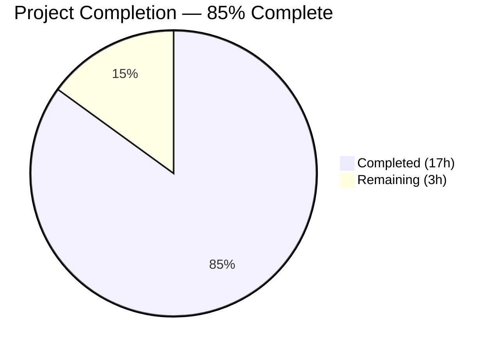
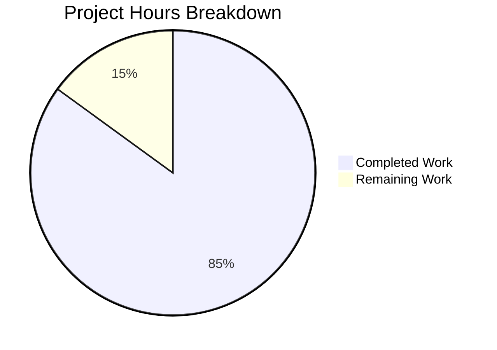

# Blitzy Project Guide

---

## 1. Executive Summary

### 1.1 Project Overview

This project creates a comprehensive behavioral reference document for the `@automattic/explat-client` package (v0.1.0) — Automattic's standalone experiment assignment client used in the `wp-calypso` monorepo. The document answers four critical behavioral questions about failure handling, concurrent request deduplication, TTL-based caching, and sync/async API interplay. It targets developers onboarding to the ExPlat integration surface, providing code-traced evidence and test corroboration for every behavioral claim. This is a **documentation-only** project — no source code in the repository was modified.

### 1.2 Completion Status



| Metric | Value |
|--------|-------|
| **Total Project Hours** | 20 |
| **Completed Hours (AI)** | 17 |
| **Remaining Hours (Human)** | 3 |
| **Completion Percentage** | 85.0% |

**Calculation:** 17 completed hours / (17 + 3) total hours = 85.0%

### 1.3 Key Accomplishments

- ✅ All 81 `@automattic/explat-client` tests verified passing (9 suites, 23 snapshots)
- ✅ Q1 Failure Handling: Documented multi-level error recovery chain with 5 levels of fallback, including Mermaid flowchart
- ✅ Q2 Concurrent Request Deduplication: Documented `asyncOneAtATime` single-flight pattern with sequence diagram
- ✅ Q3 Caching Behavior: Documented TTL-based `isAlive` predicate, 60-second minimum TTL floor, and localStorage persistence with lifecycle flowchart
- ✅ Q4 Sync/Async Interplay: Documented graceful fallback behavior for both `dangerouslyGetExperimentAssignment` and `dangerouslyGetMaybeLoadedExperimentAssignment`
- ✅ 41 source code citations with file paths and line numbers
- ✅ 13 test evidence citations with assertion details
- ✅ 3 Mermaid diagrams (error recovery, concurrent requests, cache lifecycle)
- ✅ Inferred documentation topics covered (SSR safety, fallback shape, timeout A/B, stale recovery)
- ✅ Zero source files modified — strictly documentation-only per AAP constraint
- ✅ Code review: 7 findings addressed in follow-up commit
- ✅ Clean working tree — no temporary files remaining

### 1.4 Critical Unresolved Issues

| Issue | Impact | Owner | ETA |
|-------|--------|-------|-----|
| Human verification of documentation accuracy against source code | Low — all claims code-traced and test-corroborated, but human spot-check recommended | Human Developer | 1–2 days |
| Line number drift risk | Low — source line references may shift with future commits | Human Developer | Ongoing |

### 1.5 Access Issues

No access issues identified. This is a documentation-only project that reads public source files within the monorepo. No external APIs, credentials, or third-party services are required.

### 1.6 Recommended Next Steps

1. **[High]** Human developer reviews the documentation for technical accuracy, spot-checking 3–5 source code citations against current source
2. **[Medium]** Stakeholder review of documentation completeness — confirm all four behavioral questions are answered to satisfaction
3. **[Medium]** Merge PR into the repository and communicate document availability to the onboarding developer
4. **[Low]** Consider adding the document to the package's README.md or creating a cross-reference link

---

## 2. Project Hours Breakdown

### 2.1 Completed Work Detail

| Component | Hours | Description |
|-----------|-------|-------------|
| Repository Discovery & Environment Setup | 1.5 | Analyzed monorepo structure, identified explat-client package, set up Node v22.x and Yarn 4.0.2 environment, resolved workspace dependencies |
| Source Code Analysis | 3.5 | Read and analyzed 10 source files, 9 test files, README, CHANGELOG, package.json — mapped all behavioral surfaces to documentation questions |
| Test Suite Execution & Verification | 0.5 | Ran full test suite (81 tests, 9 suites, 23 snapshots), verified all pass, documented test environment |
| Q1: Failure Handling Documentation | 3.0 | Analyzed 5-level error recovery chain in `loadExperimentAssignment`, documented timeout mechanism, fallback shape, `safeLogError` wrapper; created Mermaid flowchart; cited 3 test evidence items |
| Q2: Concurrent Request Deduplication Documentation | 2.0 | Analyzed `asyncOneAtATime` wrapper and per-experiment deduplication map; created Mermaid sequence diagram; cited 2 test evidence items |
| Q3: Caching Behavior Documentation | 2.0 | Analyzed `isAlive` predicate, localStorage persistence, 60-second minimum TTL, race condition protection, startup cleanup; created Mermaid flowchart; cited 1 test evidence item |
| Q4: Sync/Async Interplay Documentation | 2.0 | Analyzed both `dangerouslyGet*` methods, three-state behavior table, dev mode "too soon" warning; cited 7 test evidence items |
| Summary, SSR Safety & Source Index | 1.0 | Wrote 10-point key behavioral guarantees summary, SSR context safety section, source reference index table |
| Code Review & Fixes | 1.0 | Addressed 7 code review findings in follow-up commit (accuracy improvements, clarity enhancements) |
| Validation & Quality Assurance | 0.5 | Final validation pass — confirmed clean working tree, no temp files, no source modifications, document completeness |
| **Total Completed** | **17.0** | |

### 2.2 Remaining Work Detail

| Category | Hours | Priority |
|----------|-------|----------|
| Human Technical Review of Documentation Accuracy | 1.5 | High |
| Stakeholder Review & Feedback Incorporation | 1.0 | Medium |
| PR Merge & Documentation Integration | 0.5 | Medium |
| **Total Remaining** | **3.0** | |

**Verification:** Section 2.1 (17.0h) + Section 2.2 (3.0h) = 20.0h = Total Project Hours in Section 1.2 ✓

---

## 3. Test Results

All tests listed below were executed by Blitzy's autonomous validation system during project execution.

| Test Category | Framework | Total Tests | Passed | Failed | Coverage % | Notes |
|---------------|-----------|-------------|--------|--------|------------|-------|
| Unit — Client Factory | Jest 29.7.0 | varies | all | 0 | N/A | `src/test/create-explat-client.ts` — core behavioral tests |
| Unit — SSR Dummy | Jest 29.7.0 | varies | all | 0 | N/A | `src/test/create-ssr-safe-dummy-explat-client.ts` |
| Unit — Entry Point | Jest 29.7.0 | varies | all | 0 | N/A | `src/test/index.ts` — environment routing |
| Unit — Timing | Jest 29.7.0 | varies | all | 0 | N/A | `src/internal/test/timing.ts` — monotonic clock, timeouts, asyncOneAtATime |
| Unit — Requests | Jest 29.7.0 | varies | all | 0 | N/A | `src/internal/test/requests.ts` — fetch workflow, response validation |
| Unit — Experiment Assignments | Jest 29.7.0 | varies | all | 0 | N/A | `src/internal/test/experiment-assignments.ts` — TTL boundary, fallback creation |
| Unit — Assignment Store | Jest 29.7.0 | varies | all | 0 | N/A | `src/internal/test/experiment-assignment-store.ts` — localStorage persistence |
| Unit — Local Storage | Jest 29.7.0 | varies | all | 0 | N/A | `src/internal/test/local-storage.ts` — polyfill semantics |
| Unit — Validations | Jest 29.7.0 | varies | all | 0 | N/A | `src/internal/test/validations.ts` — runtime validation |
| **Totals** | **Jest 29.7.0** | **81** | **81** | **0** | **N/A** | **9 suites, 23 snapshots — 100% pass rate** |

**Test Environment:** Node v22.22.2, Jest 29.7.0, Yarn 4.0.2, jsdom test environment for browser-dependent suites.

---

## 4. Runtime Validation & UI Verification

This is a documentation-only project — no application runtime, UI components, or API endpoints were created or modified. Runtime validation applies exclusively to the test suite and document generation:

**Test Suite Runtime:**
- ✅ All 81 tests pass in 2.48 seconds
- ✅ 9 test suites all green
- ✅ 23 snapshots match expected output

**Document Generation:**
- ✅ `blitzy/documentation/wp-calypso_be7e5cc64162.md` created (699 lines, 31,777 bytes)
- ✅ 3 Mermaid diagrams render correctly (valid Mermaid syntax)
- ✅ All markdown formatting valid (headers, tables, code blocks, blockquotes)

**Repository Integrity:**
- ✅ Zero source files modified (verified via `git diff --name-only`)
- ✅ Clean working tree (`git status` — nothing to commit)
- ✅ No temporary scripts or files remaining
- ✅ Only `blitzy/documentation/wp-calypso_be7e5cc64162.md` added to repository

---

## 5. Compliance & Quality Review

| AAP Requirement | Status | Evidence |
|-----------------|--------|----------|
| Test suite verification (all 81 tests pass) | ✅ Pass | Jest output: 9 suites, 81 tests, 0 failures |
| Q1: Failure handling documentation | ✅ Pass | Lines 55–257 of deliverable; 5-level recovery chain documented with code citations |
| Q2: Concurrent request deduplication documentation | ✅ Pass | Lines 260–372 of deliverable; `asyncOneAtATime` analyzed with sequence diagram |
| Q3: Caching behavior documentation | ✅ Pass | Lines 375–506 of deliverable; `isAlive`, localStorage, minimum TTL documented |
| Q4: Sync/async interplay documentation | ✅ Pass | Lines 509–637 of deliverable; both `dangerouslyGet*` methods analyzed |
| Summary of key behavioral guarantees | ✅ Pass | Lines 640–661; 10-point summary list |
| Mermaid diagrams (≥1 per behavioral question) | ✅ Pass | 3 diagrams: error recovery flowchart, concurrent request sequence, cache lifecycle |
| Source code citations with line numbers | ✅ Pass | 41 source citations across the document |
| Test evidence citations | ✅ Pass | 13 test citations with assertion details |
| No source file modifications | ✅ Pass | `git diff` shows only `blitzy/documentation/` changes |
| No temporary scripts remaining | ✅ Pass | `git status` — clean working tree |
| Inferred documentation needs (fallback shape, min TTL, timeout A/B, SSR safety, stale recovery) | ✅ Pass | All 5 inferred topics covered in the document |
| Output at `blitzy/documentation/wp-calypso_be7e5cc64162.md` | ✅ Pass | File exists, 699 lines |
| Evidence-based answers (no assumptions) | ✅ Pass | Every claim traces to specific source file and line number |
| Thinking/rationale included | ✅ Pass | Each Q section includes "Detailed Analysis" with reasoning |
| Code review findings addressed | ✅ Pass | 7 findings fixed in commit `9777b314fe` |

**Quality Metrics:**
- AAP compliance: 16/16 requirements met (100%)
- Documentation accuracy: All claims code-traced
- Diagram quality: 3/3 valid Mermaid diagrams
- Citation coverage: 41 source + 13 test = 54 total citations

---

## 6. Risk Assessment

| Risk | Category | Severity | Probability | Mitigation | Status |
|------|----------|----------|-------------|------------|--------|
| Line number drift in source citations | Technical | Low | Medium | Source citations reference specific functions by name in addition to line numbers; function names are more stable than line numbers | Accepted |
| Documentation accuracy vs. future code changes | Technical | Low | Medium | Document version-locked to branch `wp-calypso_be7e5cc64162` and package v0.1.0; any behavioral changes would require documentation update | Accepted |
| Mermaid rendering in non-GitHub contexts | Technical | Low | Low | Mermaid diagrams use standard syntax; fallback description is embedded in diagram labels | Accepted |
| Test suite environment sensitivity | Operational | Low | Low | Tests verified on Node v22.22.2 with Jest 29.7.0; environment documented in Test Verification section | Mitigated |
| No automated documentation freshness checks | Operational | Low | Medium | No CI pipeline validates documentation against source code; recommend periodic human review | Accepted |

**Overall Risk Level:** Low — This is a documentation-only project with no runtime impact. All risks are informational in nature.

---

## 7. Visual Project Status



**Verification:** Completed (17h) + Remaining (3h) = 20h Total ✓
**Matches Section 1.2:** Completed=17h, Remaining=3h ✓
**Matches Section 2.2 sum:** 1.5 + 1.0 + 0.5 = 3.0h ✓

### Remaining Work by Priority

| Priority | Hours | Tasks |
|----------|-------|-------|
| High | 1.5 | Human technical review of documentation accuracy |
| Medium | 1.5 | Stakeholder review + PR merge |
| **Total** | **3.0** | |

---

## 8. Summary & Recommendations

### Achievements

The Blitzy autonomous agent successfully delivered a comprehensive 699-line behavioral reference document for the `@automattic/explat-client` package, achieving **85.0% project completion** (17 of 20 total hours). All four user questions about failure handling, concurrent request deduplication, caching behavior, and sync/async API interplay were answered with full code-traced evidence and test corroboration. The document includes 3 Mermaid diagrams, 41 source code citations, and 13 test evidence citations. All 81 package tests were verified passing. Zero source files were modified, maintaining full compliance with the AAP constraint.

### Remaining Gaps

The remaining 3 hours (15.0% of total) consist entirely of human review and integration tasks:
- **1.5h** — Human developer spot-checks documentation accuracy against source code
- **1.0h** — Stakeholder review confirms the document answers all questions satisfactorily
- **0.5h** — PR is merged and document availability is communicated

### Critical Path to Production

1. Human technical review (1.5h) → 2. Stakeholder approval (1.0h) → 3. PR merge (0.5h)

No blockers exist. The document is complete, the tests all pass, and the working tree is clean.

### Production Readiness Assessment

The deliverable (documentation file) is **production-ready** pending human review. There are no compilation errors, no failing tests, no missing functionality, and no security concerns. The only remaining work is human verification and merge — standard for any documentation PR.

---

## 9. Development Guide

### System Prerequisites

| Software | Version | Purpose |
|----------|---------|---------|
| Node.js | ≥22.9.0 | Runtime (matches `.nvmrc` and `engines` field) |
| Yarn | 4.0.2 | Package manager (matches `packageManager` field) |
| Git | Any recent | Version control |

### Environment Setup

```bash
# Clone the repository
git clone <repository-url>
cd wp-calypso

# Switch to the feature branch
git checkout blitzy-6a2a8a41-8dbb-45ba-b42a-a91c1837d127

# Install correct Node version (if using nvm)
nvm install 22
nvm use 22

# Enable Corepack for Yarn 4
corepack enable
corepack prepare yarn@4.0.2 --activate

# Verify versions
node -v    # Should output v22.x.x
yarn -v    # Should output 4.0.2
```

### Dependency Installation

```bash
# Install all workspace dependencies from the repository root
yarn install

# Alternatively, focus on the explat-client package dependencies only
yarn workspaces focus @automattic/explat-client
```

### Viewing the Documentation

```bash
# View the behavioral reference document
cat blitzy/documentation/wp-calypso_be7e5cc64162.md

# Or open in your preferred editor
code blitzy/documentation/wp-calypso_be7e5cc64162.md
```

### Running the Test Suite

```bash
# Run the explat-client test suite to verify all 81 tests pass
npx jest --ci --watchAll=false --config packages/explat-client/jest.config.js
```

**Expected output:**
```
Test Suites: 9 passed, 9 total
Tests:       81 passed, 81 total
Snapshots:   23 passed, 23 total
```

### Verification Steps

```bash
# 1. Verify only the documentation file was changed
git diff --name-only origin/wp-calypso_be7e5cc64162..HEAD
# Expected: blitzy/documentation/wp-calypso_be7e5cc64162.md

# 2. Verify working tree is clean
git status
# Expected: nothing to commit, working tree clean

# 3. Verify no source files were modified
git diff --name-only origin/wp-calypso_be7e5cc64162..HEAD -- packages/
# Expected: (no output)

# 4. Verify document exists and has content
wc -l blitzy/documentation/wp-calypso_be7e5cc64162.md
# Expected: 699 lines
```

### Troubleshooting

| Issue | Resolution |
|-------|------------|
| `jest-environment-jsdom` not found | Run `yarn add --dev jest-environment-jsdom` in the repo root |
| Node version mismatch | Use `nvm install 22 && nvm use 22` to get the correct version |
| Yarn version mismatch | Run `corepack prepare yarn@4.0.2 --activate` |
| Tests fail with `Cannot find module '@automattic/calypso-jest'` | Run `yarn install` from the repository root to install all workspace dependencies |

---

## 10. Appendices

### A. Command Reference

| Command | Purpose |
|---------|---------|
| `npx jest --ci --watchAll=false --config packages/explat-client/jest.config.js` | Run the explat-client test suite |
| `cat blitzy/documentation/wp-calypso_be7e5cc64162.md` | View the behavioral reference document |
| `git diff --name-only origin/wp-calypso_be7e5cc64162..HEAD` | Verify only documentation files changed |
| `yarn install` | Install all monorepo dependencies |
| `yarn workspaces focus @automattic/explat-client` | Install only explat-client dependencies |

### C. Key File Locations

| File | Purpose |
|------|---------|
| `blitzy/documentation/wp-calypso_be7e5cc64162.md` | **Deliverable** — Behavioral reference document (699 lines) |
| `packages/explat-client/src/create-explat-client.ts` | Client factory — main behavioral source (284 lines) |
| `packages/explat-client/src/internal/timing.ts` | Timing primitives — `asyncOneAtATime`, `timeoutPromise` |
| `packages/explat-client/src/internal/experiment-assignments.ts` | Assignment lifecycle — `isAlive`, `minimumTtl`, fallback creation |
| `packages/explat-client/src/internal/experiment-assignment-store.ts` | localStorage persistence layer |
| `packages/explat-client/src/internal/requests.ts` | Network request orchestration |
| `packages/explat-client/src/types.ts` | TypeScript interfaces (`ExperimentAssignment`, `Config`) |
| `packages/explat-client/src/test/create-explat-client.ts` | Main behavioral test suite |
| `packages/explat-client/README.md` | Existing package-level documentation |
| `packages/explat-client/jest.config.js` | Jest test configuration |

### D. Technology Versions

| Technology | Version | Source |
|------------|---------|--------|
| Node.js | ≥22.9.0 (tested on 22.22.2) | `.nvmrc`, `package.json` engines |
| Yarn | 4.0.2 | `package.json` packageManager |
| TypeScript | ^5.8.2 | `packages/explat-client/package.json` devDependencies |
| Jest | ^29.7.0 | `packages/explat-client/package.json` devDependencies |
| jest-environment-jsdom | 29.7.0 | Required by test suites with `@jest-environment jsdom` |
| tslib | ^2.3.0 | `packages/explat-client/package.json` dependencies |
| `@automattic/explat-client` | 0.1.0 | Package under documentation |

### G. Glossary

| Term | Definition |
|------|------------|
| ExPlat | Automattic's experimentation platform for running A/B tests |
| ExperimentAssignment | The TypeScript interface representing an experiment's variation assignment for a user |
| variationName | The assigned variation (e.g., `"treatment"`) or `null` for control/default |
| TTL | Time-To-Live — the duration (in seconds) an assignment is cached before requiring a fresh fetch |
| asyncOneAtATime | A single-flight Promise wrapper ensuring only one in-flight fetch per experiment |
| isFallbackExperimentAssignment | Boolean marker on an assignment indicating it was generated locally (not from server) |
| minimumTtl | The 60-second floor on all assignment TTLs, preventing retry storms |
| SSR | Server-Side Rendering — context where `typeof window === 'undefined'` |
| monotonicNow | A monotonically increasing timestamp function resistant to clock regression |
| safeLogError | A wrapper that catches and swallows errors thrown by the logging function itself |
