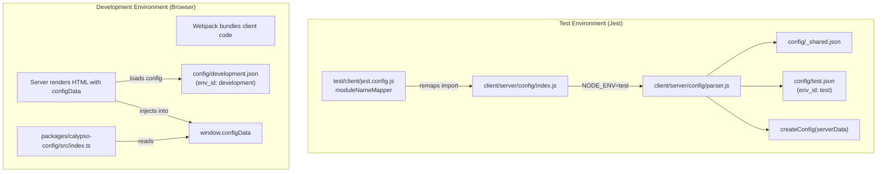

# Technical Specification

# 0. Agent Action Plan

## 0.1 Intent Clarification

### 0.1.1 Core Feature Objective

Based on the prompt, the Blitzy platform understands that the new feature requirement is to **produce a comprehensive investigative document analyzing the wp-calypso testing infrastructure**, covering the following specific areas:

- **Development Server Verification:** Start the development server to confirm the application boots and responds to HTTP requests, establishing a baseline for comparison with the test environment.
- **Test Environment Boot Comparison:** Document how the Jest-based test environment initializes compared to the Express/Webpack-based development server — specifically what globals, polyfills, module resolution strategies, and mock layers are established during test framework setup versus normal runtime.
- **Test-Only Globals and Polyfills Inventory:** Identify and catalog every global variable, environment variable, and browser-API polyfill that exists exclusively during test execution (via `test/client/setup-test-framework.js`, `packages/calypso-jest/src/setup.js`, and Jest config `globals`), and that would not be present in the production or development browser environment.
- **Network Request Interception Analysis:** Explain the mechanism by which outbound HTTP requests are blocked during unit/component tests (via `nock.disableNetConnect()` and the global `fetch` mock) and what happens when code attempts to make a request.
- **API Mock-to-Assertion Trace:** Select an actual test that mocks a WordPress.com REST API call using `nock`, then trace the mocked response data from the HTTP interception layer through the `wpcom` API client, through the Redux action creator (thunk), and back into the test assertion — proving end-to-end data flow within the mock layer.
- **Configuration and Feature Flag Divergence:** Demonstrate with concrete evidence how `@automattic/calypso-config` resolves feature flags differently in test vs development mode — specifically how `config/test.json` and `config/development.json` produce different `isEnabled()` results — and show the multiple patterns by which tests override config behavior (full `jest.mock`, `jest.spyOn`, mock module files, and the `setFeatureFlag` test helper).
- **No Modifications Rule:** The entire investigation must be read-only. No existing repository files may be modified. Temporary scripts used for investigation must be cleaned up after use.

Implicit requirements detected:

- The output must be a new Markdown document placed in `blitzy/documentation/` with a name matching the source branch convention.
- All conclusions must be evidence-based — derived from reading actual source code and running actual tests, never assumed from conventions or best practices.
- The document should serve as an onboarding guide for a new contributor unfamiliar with the Calypso test infrastructure.

### 0.1.2 Special Instructions and Constraints

- **Read-Only Constraint:** No modification of any existing repository file is permitted. This means all investigation must be performed through file inspection, running existing tests, and any temporary scripts must be cleaned up.
- **Implementation Rule — SWE-AtlasQnA-Repo:** Create a new Markdown document named `<source_branch_name>.md` that comprehensively answers all questions. Build and run the source code to analyze repository behavior. Base all answers on code evidence. Place the document in `blitzy/documentation/`.
- **Evidence Requirement:** Every claim about test behavior must be traceable to a specific file path and line range in the repository, or to actual test execution output.

### 0.1.3 Technical Interpretation

These feature requirements translate to the following technical implementation strategy:

- To **verify the development server works**, we will build the server bundle via `yarn run build-server` and start it with `node build/server.js`, then confirm it responds on `http://calypso.localhost:3000/` with HTTP 200.
- To **compare test vs development boot**, we will analyze the Jest configuration chain (`@automattic/calypso-jest` preset → suite-specific `jest.config.js` → `setupFiles` → `setupFilesAfterEnv`) and compare it against the Express server boot chain (`client/server/index.js` → `client/server/boot/index.js`).
- To **inventory test-only globals**, we will parse `test/client/setup-test-framework.js` and `packages/calypso-jest/src/setup.js` for all `global.*` assignments and `jest.mock` calls, cross-referencing with the `globals` object in `test/client/jest.config.js`.
- To **explain network interception**, we will trace the `nock.disableNetConnect()` call in `test/client/setup-test-framework.js` and the `global.fetch = jest.fn(...)` mock to show the dual-layer blocking strategy.
- To **trace a mocked API call**, we will walk through `client/state/posts/test/actions.js` → its `nock` setup intercepting `https://public-api.wordpress.com/rest/v1.1/sites/2916284/posts` → the `requestSitePosts()` thunk in `client/state/posts/actions/request-posts.js` → the `wpcom.site(siteId).postsList()` call → `nock` returning the mocked response → `dispatch(receivePosts(posts))` → the test asserting `POSTS_RECEIVE` action.
- To **prove config divergence**, we will compare `config/test.json` and `config/development.json` directly, showing flags like `rum-tracking/logstash` (dev: `true`, test: `false`) and `redirect-fallback-browsers` (dev: `false`, test: `true`), plus demonstrate the four config-mocking patterns used across the test suite.
- To **produce the deliverable**, we will create a single comprehensive Markdown document in `blitzy/documentation/` that synthesizes all findings.

## 0.2 Repository Scope Discovery

### 0.2.1 Comprehensive File Analysis

The following files and directories are directly relevant to answering the user's questions about the testing infrastructure. All paths have been verified through repository inspection.

**Test Configuration Files (Jest configs and presets):**

| File Path | Purpose | Relevance |
|---|---|---|
| `packages/calypso-jest/jest-preset.js` | Shared Jest preset for all suites — defines resolver, transforms, test match patterns | Foundation of all test environments |
| `packages/calypso-jest/src/setup.js` | Shared setup: polyfills `global.CSS.supports` | Test-only global |
| `packages/calypso-jest/src/module-resolver.js` | Custom `enhanced-resolve` resolver prioritizing `calypso:src` field | Differs from Webpack resolution |
| `packages/calypso-jest/src/asset-transform.js` | Transforms image/style imports to filenames | Test-only transform |
| `test/client/jest.config.js` | Client test config: jsdom env, `moduleNameMapper`, `globals`, `setupFilesAfterEnv` | Central to client test boot |
| `test/server/jest.config.js` | Server test config: Node.js env, separate config mapper | Server test environment |
| `test/packages/jest.config.js` | Package tests: multi-project config delegating to per-package configs | Package test organization |
| `test/packages/jest-preset.js` | Package test shared preset with `__i18n_text_domain__` global | Package-level setup |
| `test/packages/setup.js` | Package test setup: `ResizeObserver`, `matchMedia`, `crypto.randomUUID` polyfills | Package test-only globals |
| `test/apps/jest.config.js` | Application tests: multi-project config | App test organization |
| `test/integration/jest.config.js` | Integration test config: Node.js env, network access allowed | Integration environment |
| `test/build-tools/jest.config.js` | Build tools tests | Build tool environment |

**Test Framework Setup Files (globals, polyfills, mocks):**

| File Path | Purpose | Relevance |
|---|---|---|
| `test/client/setup-test-framework.js` | Client test setup: `nock.disableNetConnect()`, browser API polyfills, global `fetch` mock, `wpcom-proxy-request` mock, `matchMedia` mock, `ReadableStream`/`TransformStream` polyfills | **Primary source of test-only globals** |
| `test/server/setup-test-framework.js` | Server test setup: `nock.disableNetConnect()`, `wpcom-proxy-request` mock | Server test network isolation |
| `test/module-resolver.js` | Root-level module resolver (duplicate of calypso-jest resolver) | Resolution strategy documentation |

**Configuration System Files (feature flags and config):**

| File Path | Purpose | Relevance |
|---|---|---|
| `config/test.json` | Test environment config: 101 feature flags, `env_id: "test"` | **Config values during test** |
| `config/development.json` | Development config: 178 feature flags, `env_id: "development"` | **Config values during dev** |
| `config/_shared.json` | Base shared config merged into all environments | Baseline values |
| `client/server/config/index.js` | Server-side config loader: reads `CALYPSO_ENV || NODE_ENV` to select config file | **Config resolution logic** |
| `client/server/config/parser.js` | Config file parser: merges `_shared.json` + `{env}.json` + `{env}.local.json` | Config layering mechanism |
| `packages/calypso-config/src/index.ts` | Browser-side config: reads `window.configData`, applies flag overrides from cookies/URL | Browser config (not used in tests) |
| `packages/create-calypso-config/src/index.ts` | `createConfig()` factory: `config()`, `isEnabled()`, `enable()`, `disable()` APIs | Core config API |

**Test Helper Utilities:**

| File Path | Purpose | Relevance |
|---|---|---|
| `client/test-helpers/config/index.js` | `setFeatureFlag()` helper: `jest.spyOn(config, 'isEnabled')` wrapper | Feature flag test override pattern |
| `client/test-helpers/use-nock/index.js` | `useNock()` helper: wraps `nock` with `beforeAll`/`afterAll` cleanup | Network mock helper |
| `client/test-helpers/testing-library/index.js` | `renderWithProvider()` and `renderHookWithProvider()`: Redux store + QueryClient wrappers | Component test utilities |
| `client/test-helpers/console/index.js` | `captureConsole()` helper: captures and mocks console output | Console test helper |

**API Client and Action Creator Files (for mock trace):**

| File Path | Purpose | Relevance |
|---|---|---|
| `client/state/posts/test/actions.js` | Post action tests with `nock` mocking WordPress.com API | **Key test for API mock trace** |
| `client/state/posts/actions/request-posts.js` | `requestPosts()` thunk: dispatches request/success/failure, calls `wpcom.site(siteId).postsList()` | Action creator under test |
| `client/state/posts/actions/request-site-posts.js` | `requestSitePosts()` thunk wrapper | Entry point for site-specific requests |
| `client/state/posts/actions/receive-posts.js` | `receivePosts()` action creator | Dispatches `POSTS_RECEIVE` |
| `client/lib/wp/node.js` | Node.js `wpcom` client: `new WPCOM(wpcomXhrRequest)` | Test-time API client |
| `client/lib/wp/browser.js` | Browser `wpcom` client (uses proxy request in prod) | Dev-time API client |

**Config Mock Pattern Examples (proving test config divergence):**

| File Path | Mock Pattern Used | What It Proves |
|---|---|---|
| `client/lib/analytics/test/mocks/config/index.js` | Full mock module file replacing `@automattic/calypso-config` | Tests control exact config values |
| `client/lib/performance-tracking/test/lib.js` | `jest.mock('@automattic/calypso-config', () => ({ isEnabled: jest.fn() }))` | Tests toggle features on/off per test case |
| `client/lib/user/test/shared-utils.js` | `jest.mock` + `config.mockImplementation()` per describe block | Tests inject arbitrary config values |
| `client/lib/route/test/legacy-routes.js` | `jest.spyOn(config, 'isEnabled').mockImplementation(...)` | Tests override `isEnabled` with custom logic |
| `client/jetpack-connect/test/utils.js` | `jest.mock('@automattic/calypso-config', () => (input) => lookupTable[input])` | Tests provide lookup-table config |
| `client/state/comments/test/actions.js` | `setFeatureFlag('comments/filters-in-posts', true)` helper | Uses shared helper to override single flag |

**Development Server Files (for boot comparison):**

| File Path | Purpose |
|---|---|
| `client/server/index.js` | Server entry point: loads config, boots Express |
| `client/server/boot/index.js` | Express app setup: middleware, routing, webpack bundler |
| `client/webpack.config.js` | Client Webpack config: bundle env, plugins, loaders |
| `client/webpack.config.node.js` | Server-side Webpack config |

### 0.2.2 Web Search Research Conducted

No external web searches were required for this investigation. All findings were derived from direct repository inspection, file reading, and test execution. The Calypso repository contains comprehensive internal documentation in `docs/testing/` and self-documenting test infrastructure.

### 0.2.3 New File Requirements

Per the SWE-AtlasQnA-Repo rule, a single new file will be created:

- **`blitzy/documentation/<source_branch_name>.md`** — A comprehensive Markdown document answering all questions about the testing infrastructure, including:
  - Development server verification evidence
  - Test environment boot sequence comparison
  - Complete test-only globals inventory
  - Network interception mechanism explanation
  - API mock-to-assertion traced walkthrough
  - Feature flag divergence proof with concrete data
  - Config mocking pattern catalog

No other new source files, test files, or configuration files are required. This is a documentation-only deliverable.

## 0.3 Dependency Inventory

### 0.3.1 Key Packages Relevant to Testing Infrastructure

The following packages are directly involved in the testing infrastructure being investigated. All versions are extracted from the repository's `package.json` and workspace package manifests.

| Registry | Package | Version | Purpose |
|---|---|---|---|
| npm | `jest` | ^29.7.0 | Primary test runner for all unit, component, integration suites |
| npm | `nock` | ^13.5.6 | HTTP request interception — blocks and mocks network calls in tests |
| npm | `@testing-library/react` | ^16.2.0 | React component rendering and query API for component tests |
| npm | `@testing-library/jest-dom` | ^6.6.3 | Extended DOM assertion matchers (e.g., `toBeInTheDocument()`) |
| npm | `@testing-library/user-event` | ^14.6.1 | Realistic user interaction simulation |
| npm | `jest-canvas-mock` | (setupFiles) | Mocks HTML5 Canvas API in jsdom |
| npm | `resize-observer-polyfill` | (setup) | Polyfills `ResizeObserver` for jsdom |
| npm | `babel-jest` | ^29.7.0 | Babel transpilation for Jest test files |
| npm | `enhanced-resolve` | ^5.8.3 | Custom module resolution for `calypso:src` field |
| npm | `redux-mock-store` | ^1.5.5 | Redux store mocking for connected component tests |
| npm | `supertest` | ^7.0.0 | HTTP assertion library for Express endpoint tests |
| npm | `jest-teamcity` | ^1.12.0 | TeamCity CI reporter integration |
| workspace | `@automattic/calypso-jest` | 1.0.0 | Shared Jest preset (resolver, transforms, patterns) |
| workspace | `@automattic/calypso-config` | workspace:^ | Configuration and feature flag system |
| workspace | `@automattic/create-calypso-config` | workspace:^ | Config factory: `createConfig()`, `isEnabled()`, `enable()`, `disable()` |
| npm | `wpcom` | (dependency) | WordPress.com REST API client library (`wpcom.js`) |
| npm | `wpcom-xhr-request` | (dependency) | XHR-based API request transport layer |
| npm | `wpcom-proxy-request` | (dependency) | Proxy-based API request (mocked in tests) |

### 0.3.2 Runtime and Toolchain Versions

| Tool | Version | Source |
|---|---|---|
| Node.js | ^v22.9.0 | `.nvmrc`, `package.json` engines field |
| Yarn | ^4.0.0 (Berry) | `package.json` engines, `.yarnrc.yml` |
| TypeScript | 5.8.2 | `package.json` devDependencies |
| Babel | ^7.26.10 | `@automattic/calypso-babel-config`, `babel.config.js` |

### 0.3.3 Dependency Updates

No dependency additions, removals, or version changes are required for this task. The investigation is read-only and produces only a documentation artifact. All existing dependencies are sufficient to run the test suite, start the development server, and observe the behaviors described in the user's requirements.

## 0.4 Integration Analysis

### 0.4.1 Existing Code Touchpoints

This task is a read-only investigation producing documentation. No code modifications are made. However, understanding the integration touchpoints between the test environment and the production/development runtime is central to answering the user's questions. The following touchpoints are the key integration boundaries that behave differently during tests versus development.

**Configuration System Resolution Chain:**

The `@automattic/calypso-config` module is the single most important integration boundary between test and development environments. In the Jest test environment, the `moduleNameMapper` in `test/client/jest.config.js` remaps this import:

- Test resolution: `'^@automattic/calypso-config$': '<rootDir>/server/config/index.js'` — This loads `client/server/config/index.js`, which calls the parser with `process.env.CALYPSO_ENV || process.env.NODE_ENV || 'development'`. Since Jest sets `NODE_ENV=test`, the parser loads `config/_shared.json` + `config/test.json`.
- Development resolution: In the browser, `packages/calypso-config/src/index.ts` reads `window.configData` that was injected by the server-side rendering pipeline, which loaded `config/development.json`.

**Network Layer Integration:**

In development, the `wpcom` API client (`client/lib/wp/browser.js`) makes real HTTP requests through `wpcom-proxy-request` or `wpcom-xhr-request` to `https://public-api.wordpress.com`. In tests, this integration is severed at two layers:

- `nock.disableNetConnect()` in `test/client/setup-test-framework.js` blocks all outbound HTTP at the Node.js `http`/`https` module level.
- `global.fetch = jest.fn(...)` replaces the Fetch API with a deterministic mock returning empty JSON.
- `wpcom-proxy-request` is globally mocked via `jest.mock('wpcom-proxy-request', ...)` to prevent access to the browser `document` global.

Individual tests then use `nock('https://public-api.wordpress.com:443')` to selectively allow specific endpoints with predetermined responses.

**Module Resolution Integration:**

In development, Webpack resolves modules using its standard resolution algorithm plus aliases configured in `client/webpack.config.js`. In tests, the custom `enhanced-resolve` resolver in `packages/calypso-jest/src/module-resolver.js` resolves modules with a different priority order: `calypso:src` → `main`, using condition names `calypso:src`, `node`, `require`. This means tests run against untranspiled source code directly, whereas the dev server runs against Webpack-bundled code.

**Global Environment Integration:**

The development browser environment provides native browser APIs (`fetch`, `matchMedia`, `ResizeObserver`, `CSS.supports`, `TextEncoder`, `crypto.randomUUID`, etc.). The test environment running in jsdom or Node.js lacks these APIs and polyfills/mocks them in `test/client/setup-test-framework.js`. This means any code that depends on these APIs will interact with mock implementations during tests.

### 0.4.2 Integration Summary

| Integration Point | Development Behavior | Test Behavior |
|---|---|---|
| Config resolution | `window.configData` from SSR with `config/development.json` | `config/test.json` loaded via `NODE_ENV=test` parser |
| Feature flags | 178 flags, dev-specific flags like `dev/auth-helper: true` | 101 flags, many dev flags absent, 10 flags flipped |
| HTTP requests | Real requests via `wpcom-proxy-request` | Blocked by `nock.disableNetConnect()` + mocked `fetch` |
| Module resolution | Webpack aliases + bundled code | `enhanced-resolve` with `calypso:src` priority, untranspiled source |
| Browser APIs | Native browser implementations | Jest mocks and Node.js polyfills |
| `env_id` | `"development"` | `"test"` |
| `process.env.NODE_ENV` | `"development"` | `"test"` |

## 0.5 Technical Implementation

### 0.5.1 File-by-File Execution Plan

Since this task produces only a documentation artifact, the execution plan focuses on the investigation steps and the single output file.

**Group 1 — Development Server Verification:**
- READ: `package.json` — Extract `scripts.start`, `scripts.build-server`, `scripts.start-build`
- READ: `client/server/index.js` — Understand server boot sequence (loads config, creates Express app)
- READ: `client/server/boot/index.js` — Understand middleware chain (cookieParser, userAgent, webpack bundler)
- EXECUTE: `yarn run build-server` then `node build/server.js` — Confirm HTTP 200 on `localhost:3000`
- EVIDENCE: Capture server log output showing boot time and environment

**Group 2 — Test Environment Boot Analysis:**
- READ: `packages/calypso-jest/jest-preset.js` — Document base preset (resolver, transforms, test patterns)
- READ: `packages/calypso-jest/src/setup.js` — Document shared setup (global `CSS.supports` mock)
- READ: `packages/calypso-jest/src/module-resolver.js` — Document `calypso:src` resolution
- READ: `test/client/jest.config.js` — Document client-specific config (moduleNameMapper, globals, setupFiles)
- READ: `test/client/setup-test-framework.js` — Document all browser API mocks and nock setup
- READ: `test/server/setup-test-framework.js` — Document server test setup differences
- READ: `test/packages/setup.js` — Document package-level setup differences

**Group 3 — Network Interception Analysis:**
- READ: `test/client/setup-test-framework.js` lines with `nock.disableNetConnect()`, `global.fetch`, `wpcom-proxy-request` mock
- READ: `client/test-helpers/use-nock/index.js` — Document `useNock` helper
- READ: `client/state/posts/test/actions.js` — Trace nock usage in an actual test
- READ: `client/state/posts/actions/request-posts.js` — Trace the thunk being tested
- READ: `client/lib/wp/node.js` — Understand the wpcom client used in Node.js/test context
- EXECUTE: `npx jest --testPathPattern="client/state/posts/test/actions" --verbose` — Run the test and capture output

**Group 4 — Configuration Divergence Analysis:**
- READ: `config/test.json` — Extract all feature flags and top-level values
- READ: `config/development.json` — Extract all feature flags and top-level values
- READ: `config/_shared.json` — Understand base configuration
- READ: `client/server/config/parser.js` — Understand config file merging logic
- COMPARE: Generate diff between test.json and development.json feature flags
- READ: `client/test-helpers/config/index.js` — Document `setFeatureFlag` helper
- READ: Multiple test files demonstrating config mocking patterns
- EXECUTE: `npx jest --testPathPattern="client/lib/performance-tracking/test/lib" --verbose` — Run a test that toggles `isEnabled`

**Group 5 — Documentation Output:**
- CREATE: `blitzy/documentation/<source_branch_name>.md` — Synthesize all findings into a comprehensive document

### 0.5.2 Implementation Approach

The implementation follows a strictly investigative approach:

- **Establish baseline** by building and starting the development server, confirming it responds correctly
- **Map the test boot sequence** by reading each configuration and setup file in the Jest initialization chain
- **Inventory test-only state** by systematically parsing all `global.*` assignments in setup files
- **Analyze network isolation** by reading the nock/fetch mock code and tracing a concrete API test
- **Prove config divergence** by diffing the JSON config files and reading test files that mock config
- **Document everything** in a single comprehensive Markdown file with code excerpts, tables, and diagrams

### 0.5.3 Key Investigation Findings to Document

The document must address each of the user's questions with specific evidence:

**Question 1 — Development Server Boot:** The server booted via `yarn run build-server && BROWSERSLIST_ENV=evergreen node build/server.js`, logging `wp-calypso booted in ~1885ms - http://calypso.localhost:3000` and returning HTTP 200 with an Express-served HTML page.

**Question 2 — Test Environment Comparison:** The test environment boots through a completely different pipeline — Jest loads `@automattic/calypso-jest` preset, then `jest-canvas-mock`, then `test/client/setup-test-framework.js` — establishing a jsdom environment with mocked browser APIs instead of a real browser or Webpack-bundled application.

**Question 3 — Test-Only Globals:** At least 12 global assignments are made exclusively in test setup files: `global.TextEncoder`, `global.TextDecoder`, `global.CSS`, `global.ResizeObserver`, `global.fetch`, `global.matchMedia`, `global.crypto.randomUUID`, `global.ReadableStream`, `global.TransformStream`, `global.Worker`, `global.structuredClone`, `global.crypto.subtle`. Additionally, the Jest config injects `google: {}` and `__i18n_text_domain__: 'default'` as globals.

**Question 4 — Network Interception:** Code making network requests encounters `nock.disableNetConnect()` which causes all HTTP/HTTPS requests to fail with a `NetConnectNotAllowedError` unless a matching nock interceptor is registered. Fetch API calls hit the `global.fetch = jest.fn(...)` mock which returns `Promise.resolve({ json: () => Promise.resolve() })`.

**Question 5 — API Mock Trace:** The `requestSitePosts(2916284)` test in `client/state/posts/test/actions.js` sets up `nock('https://public-api.wordpress.com:443').get('/rest/v1.1/sites/2916284/posts').reply(200, { found: 2, posts: [...] })`. The thunk calls `wpcom.site(2916284).postsList()`, which under the hood makes an HTTP GET to the nock-intercepted URL. Nock returns the mock payload. The thunk dispatches `POSTS_RECEIVE` with the posts array, and the test asserts `dispatch` was called with exactly those posts.

**Question 6 — Config Divergence:** Concrete proof: `rum-tracking/logstash` is `true` in `development.json` and `false` in `test.json`. The test at `client/lib/performance-tracking/test/lib.js` fully mocks `config.isEnabled` and toggles this flag — proving tests control which config values are returned independently of either config file.

## 0.6 Scope Boundaries

### 0.6.1 Exhaustively In Scope

**Test Infrastructure Files (read-only analysis):**
- `packages/calypso-jest/**/*` — Shared Jest preset, module resolver, asset transform, setup
- `test/client/**/*` — Client test config and setup framework
- `test/server/**/*` — Server test config and setup framework
- `test/packages/**/*` — Package test config, preset, setup
- `test/apps/**/*` — Application test config
- `test/integration/**/*` — Integration test config
- `test/build-tools/**/*` — Build tools test config
- `test/module-resolver.js` — Root-level module resolver
- `test/README.md` — Testing documentation overview

**Configuration System Files (read-only analysis):**
- `config/test.json` — Test environment configuration (101 feature flags)
- `config/development.json` — Development environment configuration (178 feature flags)
- `config/_shared.json` — Shared base configuration
- `client/server/config/index.js` — Config loader with `NODE_ENV` resolution
- `client/server/config/parser.js` — Config file merge logic
- `packages/calypso-config/src/**/*` — Browser-side config module
- `packages/create-calypso-config/src/**/*` — Config factory API

**Test Helper Files (read-only analysis):**
- `client/test-helpers/config/index.js` — `setFeatureFlag` helper
- `client/test-helpers/use-nock/index.js` — `useNock` helper
- `client/test-helpers/testing-library/index.js` — `renderWithProvider` helper
- `client/test-helpers/console/index.js` — `captureConsole` helper

**Example Test Files (read and execute):**
- `client/state/posts/test/actions.js` — Nock-based API mocking with action creators
- `client/state/billing-transactions/test/actions.js` — Additional nock example
- `client/lib/performance-tracking/test/lib.js` — Config `isEnabled` mocking pattern
- `client/lib/user/test/shared-utils.js` — Config value mocking with `mockImplementation`
- `client/lib/route/test/legacy-routes.js` — `jest.spyOn(config, 'isEnabled')` pattern
- `client/lib/analytics/test/index.js` — Full mock module file pattern
- `client/lib/analytics/test/mocks/config/index.js` — Mock config module
- `client/jetpack-connect/test/utils.js` — Lookup-table config mock pattern
- `client/state/comments/test/actions.js` — `setFeatureFlag` helper usage

**Action Creator Source Files (read-only trace):**
- `client/state/posts/actions/request-posts.js` — Thunk with `wpcom` API call
- `client/state/posts/actions/request-site-posts.js` — Wrapper thunk
- `client/state/posts/actions/receive-posts.js` — `POSTS_RECEIVE` action creator
- `client/lib/wp/node.js` — Node.js wpcom client constructor
- `client/lib/wp/browser.js` — Browser wpcom client constructor

**Development Server Files (read and execute):**
- `client/server/index.js` — Server entry point
- `client/server/boot/index.js` — Express app boot
- `package.json` — Build and start scripts
- `client/webpack.config.js` — Webpack configuration (for comparison)

**Documentation Files (read-only):**
- `docs/testing/testing-overview.md` — Testing philosophy and suite overview
- `docs/testing/unit-tests.md` — Unit test conventions, mocking patterns, config examples
- `docs/testing/component-tests.md` — Component testing patterns
- `docs/testing/snapshot-testing.md` — Snapshot testing guidelines

**Output File (create):**
- `blitzy/documentation/<source_branch_name>.md` — Final comprehensive answer document

### 0.6.2 Explicitly Out of Scope

- **E2E tests (`test/e2e/`)** — The user's questions focus on unit/component test infrastructure, not Playwright-based end-to-end tests
- **Desktop application (`desktop/`)** — Not relevant to the testing infrastructure questions
- **Individual application packages (`apps/*/`)** — The user is asking about the main client test environment, not per-app test configs
- **CI/CD configuration** (`.teamcity/`, `.github/workflows/`, `.circleci/`) — The user is focused on local test execution behavior, not CI pipeline configuration
- **Storybook (`.storybook/`)** — Visual component testing is not part of the user's questions
- **Build output (`build/`, `public/`)** — Generated artifacts, not test infrastructure
- **Production deployment configuration** (`Dockerfile*`, `docker-compose*`) — Not relevant to test vs dev comparison
- **Code modifications** — No existing files will be modified per explicit user instruction
- **Performance optimization** — Not requested
- **New feature implementation** — This is an investigation task, not a code change
- **Webpack-config-flag-plugin** (`packages/webpack-config-flag-plugin/`) — While related to feature flags, this is a build-time optimization that replaces `isEnabled()` calls at compile time, not a test-time mechanism

## 0.7 Rules for Feature Addition

### 0.7.1 User-Specified Rules

The following rules were explicitly provided by the user and must be strictly adhered to:

- **SWE-AtlasQnA-Repo Rule:** Create a new Markdown document named `<source_branch_name>.md` that comprehensively answers the questions posed in the prompt. Build and run the source code to analyze repository behavior. Do not make assumptions — base answers on the code as the truth. Provide thinking and rationale behind the answers. Do not modify any existing files in the source repository. Do not add any other code in the source repository (besides the above requested document). Place the generated document in the `blitzy/documentation` directory in the destination repo.

- **No-Modification Constraint:** "Don't modify any repository files. If you need to create temporary scripts to investigate behavior, clean them up when done." This means:
  - No changes to any file under version control
  - Temporary investigation scripts (if created) must be deleted before task completion
  - The only persistent file created is the Markdown documentation artifact

### 0.7.2 Investigation Methodology Rules

Based on the nature of this task, the following investigation rules apply:

- **Evidence-Based Answers:** Every claim about test behavior must cite a specific file path and relevant code section. No conclusions should be based on convention or assumption.
- **Live Execution Verification:** Where the user asks "run some tests and show me," actual test execution output must be captured and included as evidence.
- **Comparison Methodology:** When comparing test vs development environments, both sides must be documented with equal specificity — showing exact file paths, line numbers, and values.
- **Traceability:** The API mock trace must follow the data through each layer (nock → HTTP client → action creator → dispatch → assertion) with file paths at each step.
- **Config Proof:** The feature flag divergence claim must include at least one concrete example where the same flag has different values in `config/test.json` versus `config/development.json`, plus evidence from a test file that demonstrates the test controlling config behavior independently.

## 0.8 References

### 0.8.1 Repository Files and Folders Searched

The following files were directly read and analyzed to derive all conclusions in this Agent Action Plan:

**Test Configuration and Setup Files:**
- `packages/calypso-jest/jest-preset.js` — Shared Jest preset defining resolver, transforms, test patterns
- `packages/calypso-jest/src/setup.js` — Shared setup establishing `global.CSS.supports` mock
- `packages/calypso-jest/src/module-resolver.js` — Custom `enhanced-resolve` resolver for `calypso:src` field
- `packages/calypso-jest/src/asset-transform.js` — Asset transform returning file basenames
- `packages/calypso-jest/package.json` — Package manifest with Jest and Babel dependencies
- `test/client/jest.config.js` — Client test configuration with moduleNameMapper, globals, setupFiles
- `test/client/setup-test-framework.js` — Client test framework: nock, fetch mock, browser API polyfills
- `test/server/jest.config.js` — Server test configuration with Node.js environment
- `test/server/setup-test-framework.js` — Server test framework: nock, wpcom-proxy-request mock
- `test/packages/jest.config.js` — Multi-project package test configuration
- `test/packages/jest-preset.js` — Package test preset with `__i18n_text_domain__` global
- `test/packages/setup.js` — Package test setup: ResizeObserver, matchMedia, crypto polyfills
- `test/apps/jest.config.js` — Multi-project application test configuration
- `test/integration/jest.config.js` — Integration test configuration with Node.js environment
- `test/build-tools/jest.config.js` — Build tools test configuration
- `test/module-resolver.js` — Root-level module resolver (mirrors calypso-jest resolver)
- `test/README.md` — Test infrastructure overview documentation

**Configuration System Files:**
- `config/test.json` — Test environment config (101 features, env_id: "test")
- `config/development.json` — Development environment config (178 features, env_id: "development")
- `config/_shared.json` — Shared base configuration
- `client/server/config/index.js` — Server-side config loader using parser with NODE_ENV
- `client/server/config/parser.js` — Config file merge logic (_shared + env + env.local)
- `packages/calypso-config/src/index.ts` — Browser-side config reading window.configData
- `packages/create-calypso-config/src/index.ts` — createConfig factory with isEnabled/enable/disable

**Test Helper Files:**
- `client/test-helpers/config/index.js` — setFeatureFlag helper with jest.spyOn
- `client/test-helpers/use-nock/index.js` — useNock helper wrapping nock with lifecycle hooks
- `client/test-helpers/testing-library/index.js` — renderWithProvider and renderHookWithProvider
- `client/test-helpers/console/index.js` — captureConsole helper

**Example Test Files (read and executed):**
- `client/state/posts/test/actions.js` — Post action tests with nock mocking (31 tests, all passed)
- `client/state/billing-transactions/test/actions.js` — Billing transaction tests with useNock (6 tests, all passed)
- `client/lib/performance-tracking/test/lib.js` — Config isEnabled mocking (13 tests, all passed)
- `client/lib/user/test/shared-utils.js` — Config mockImplementation per describe (6 tests, all passed)
- `client/lib/route/test/legacy-routes.js` — jest.spyOn config.isEnabled pattern
- `client/lib/analytics/test/index.js` — Full mock module file pattern
- `client/lib/analytics/test/mocks/config/index.js` — Mock config module with controlled values
- `client/jetpack-connect/test/utils.js` — Lookup-table config mock
- `client/state/comments/test/actions.js` — setFeatureFlag helper usage (11 tests, all passed)
- `client/state/data-layer/wpcom-http/test/index.js` — Data layer nock testing

**Action Creator and API Client Files:**
- `client/state/posts/actions/request-posts.js` — requestPosts thunk with wpcom.site().postsList()
- `client/state/posts/actions/request-site-posts.js` — requestSitePosts wrapper
- `client/state/posts/actions/receive-posts.js` — receivePosts action creator
- `client/lib/wp/node.js` — Node.js wpcom client (new WPCOM(wpcomXhrRequest))
- `client/lib/wp/browser.js` — Browser wpcom client with config-dependent initialization
- `client/lib/wp/package.json` — Package manifest with node.js/browser field mapping

**Server and Build Files:**
- `client/server/index.js` — Server entry point with config loading and Express setup
- `client/server/boot/index.js` — Express app setup with middleware chain
- `client/webpack.config.js` — Client Webpack config with DefinePlugin and config usage
- `package.json` — Root manifest with all test scripts and engine requirements
- `.nvmrc` — Node.js version specification (22.9.0)
- `babel.config.js` — Babel configuration for transpilation

**Webpack Config Flag Plugin:**
- `packages/webpack-config-flag-plugin/index.js` — Build-time feature flag replacement plugin

**Documentation Files:**
- `docs/testing/testing-overview.md` — Testing philosophy and suite descriptions
- `docs/testing/unit-tests.md` — Unit test conventions, mocking, config examples
- `README.md` — Project overview and getting started

**Folders Explored:**
- Repository root (/) — Top-level structure assessment
- `test/` — All 7 test suite directories
- `packages/calypso-jest/` — Shared Jest infrastructure
- `packages/calypso-config/` — Config module source
- `packages/create-calypso-config/` — Config factory source
- `config/` — All environment configuration files
- `client/server/config/` — Server-side config loading
- `client/test-helpers/` — All 4 test helper directories
- `client/state/posts/` — Post-related state management (for API trace)
- `client/lib/wp/` — WordPress.com API client library
- `docs/testing/` — Testing documentation
- `build/` — Built server output (verified existence after build)

### 0.8.2 Technical Specification Sections Referenced

- **Section 1.1 — Executive Summary:** Project overview, monorepo architecture context
- **Section 3.3 — Open Source Dependencies:** Package management, workspace packages, dependency versions
- **Section 6.6 — Testing Strategy:** Comprehensive testing architecture, test suite organization, mocking strategy, CI/CD integration

### 0.8.3 Attachments and External Resources

No user-provided attachments were included with this task. No Figma URLs or external design resources were referenced. All investigation was performed using the repository source code and internal documentation.

