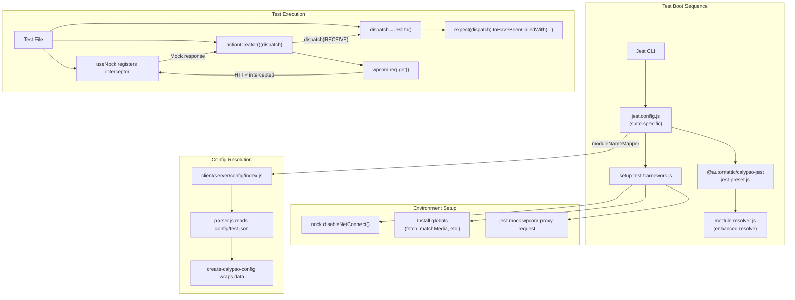

# Technical Specification

# 0. Agent Action Plan

## 0.1 Intent Clarification

### 0.1.1 Core Feature Objective

Based on the prompt, the Blitzy platform understands that the new feature requirement is to **produce a comprehensive, read-only investigation document** that answers a series of onboarding questions about the wp-calypso testing infrastructure. The deliverable is a single Markdown file placed at `blitzy/documentation/<source_branch_name>.md` that addresses the following areas:

- **Development server verification**: Start the Calypso development server (`yarn start`) to confirm the project boots correctly, establishing a baseline for comparing test-time behavior against runtime behavior.
- **Test environment characterization**: Describe how the test environment differs structurally from the development environment at boot time, including which Jest configurations load, which setup files execute, and which environment variables change.
- **Test-only globals, environment variables, and polyfills**: Identify every global object, polyfill, and mock that exists exclusively during test execution but is absent during normal development server operation — including `global.fetch`, `global.matchMedia`, `global.ResizeObserver`, `global.CSS.supports`, `global.TextEncoder`, `global.TextDecoder`, `global.ReadableStream`, `global.TransformStream`, `global.Worker`, `global.structuredClone`, `global.crypto.subtle`, `global.crypto.randomUUID`, and the `google` and `__i18n_text_domain__` Jest globals.
- **Network request interception during tests**: Explain what happens when code attempts outbound HTTP during testing, tracing through the `nock.disableNetConnect()` call in `test/client/setup-test-framework.js` and `test/server/setup-test-framework.js`, and how the `useNock` helper in `client/test-helpers/use-nock/index.js` manages interceptor lifecycle.
- **End-to-end mock tracing of an API call**: Select a concrete test (e.g., `client/state/products-list/test/actions.js`) that mocks a WordPress.com REST API endpoint, then trace the mocked response through the `nock` interceptor → the `wpcom` API client → the Redux thunk action creator → back to the `jest.fn()` dispatch spy → to the test assertion.
- **Configuration and feature flag divergence**: Show how `config/test.json` and `config/development.json` supply different values via the `@automattic/calypso-config` system, and prove that tests read from `test.json` while the development server reads from `development.json`. Demonstrate how tests can override feature flags using `jest.mock('@automattic/calypso-config')`.
- **No file modification**: Zero existing repository files may be changed. Any temporary investigation scripts must be cleaned up before completion.

### 0.1.2 Special Instructions and Constraints

- **Read-only constraint**: The implementation rule `SWE-AtlasQnA-Repo` explicitly states: "Do not modify any existing files in the source repository. Do not add any other code in the source repository (besides the above requested document)."
- **Output format**: The deliverable is a single Markdown document named `<source_branch_name>.md`, placed in the `blitzy/documentation` directory of the destination repository.
- **Evidence-based answers**: All answers must be grounded in actual source code, not assumptions. Direct code excerpts and file path citations are required.
- **Temporary script cleanup**: If any temporary scripts are created to probe runtime behavior, they must be deleted before the task is considered complete.

### 0.1.3 Technical Interpretation

These feature requirements translate to the following technical implementation strategy:

- To **verify the dev server works**, we will attempt to start the development build and confirm it initializes without error, documenting the outcome.
- To **characterize the test environment**, we will read and analyze the seven Jest configuration files under `test/`, the shared preset in `packages/calypso-jest/jest-preset.js`, and the four `setup-test-framework.js` / `setup.js` bootstrap files, comparing the globals and polyfills they install against what the development server provides natively.
- To **catalog test-only globals**, we will diff the `setup-test-framework.js` files line-by-line against the browser/Node runtime to produce a definitive list of test-exclusive shims.
- To **trace network interception**, we will walk through `nock.disableNetConnect()`, `useNock`, and a real test file (`client/state/products-list/test/actions.js`) to show the full mock lifecycle.
- To **demonstrate config divergence**, we will compare `config/test.json` versus `config/development.json` key-by-key, trace the config parser (`client/server/config/parser.js`), and show how `moduleNameMapper` in Jest redirects `@automattic/calypso-config` to the server-side config that reads `test.json` when `CALYPSO_ENV` or `NODE_ENV` is `test`.
- To **produce the deliverable**, we will create the markdown document at `blitzy/documentation/<source_branch_name>.md` containing all findings with code excerpts, tables, and diagrams.

## 0.2 Repository Scope Discovery

### 0.2.1 Comprehensive File Analysis

The investigation spans seven categories of existing files. No files are modified; all are read for analysis and cited in the documentation deliverable.

**Test Infrastructure Configuration Files**

| File Path | Purpose | Analysis Scope |
|-----------|---------|---------------|
| `test/client/jest.config.js` | Client-suite Jest config; sets jsdom, moduleNameMapper for `@automattic/calypso-config`, jest-canvas-mock, globals (`google`, `__i18n_text_domain__`) | Full read — extract environment, globals, mapper rules |
| `test/client/setup-test-framework.js` | Client-suite bootstrap; installs all test-only globals/polyfills, nock network isolation, mocks `wpcom-proxy-request` | Full read — enumerate every global, polyfill, mock |
| `test/server/jest.config.js` | Server-suite Jest config; Node environment, maps calypso-config to server config | Full read — compare with client config |
| `test/server/setup-test-framework.js` | Server-suite bootstrap; nock network isolation, mocks `wpcom-proxy-request` | Full read — note minimal polyfills vs client |
| `test/packages/jest-preset.js` | Packages-suite preset; inherits calypso-jest, adds `__i18n_text_domain__` global, loads `test/packages/setup.js` | Full read — extract globals, setup chain |
| `test/packages/setup.js` | Packages-suite bootstrap; `@testing-library/jest-dom`, `crypto.randomUUID` → `'fake-uuid'`, ResizeObserver, matchMedia | Full read — note `'fake-uuid'` vs real randomUUID |
| `test/apps/jest-preset.js` | Apps-suite preset; jsdom, jest-canvas-mock, delegates to client setup-test-framework | Full read — trace delegation chain |
| `test/build-tools/jest.config.js` | Build-tools Jest config; Node env, rootDir `build-tools/` | Full read — confirm minimal setup |
| `test/integration/jest.config.js` | Integration-suite Jest config; Node env, calypso-config mapped to server config, discovers tests in `bin/**/integration/*` and `client/**/integration/*` | Full read — note that network is NOT disabled |
| `test/module-resolver.js` | Custom `enhanced-resolve` resolver; `calypso:src` field priority, extensions `.json`, `.js`, `.jsx`, `.ts`, `.tsx` | Full read — explains how tests resolve untranspiled source |
| `test/README.md` | Documents four test groups and legacy Mocha deprecation | Full read — for documentation cross-reference |

**Shared Jest Infrastructure**

| File Path | Purpose | Analysis Scope |
|-----------|---------|---------------|
| `packages/calypso-jest/jest-preset.js` | Base preset for all suites; custom resolver, setupFilesAfterEnv, testMatch, babel transform | Full read — extract resolver, match patterns |
| `packages/calypso-jest/src/setup.js` | Minimal shared setup; only mocks `global.CSS = { supports: jest.fn() }` | Full read — baseline for all suites |
| `packages/calypso-jest/src/module-resolver.js` | Shared module resolver using `enhanced-resolve` | Summary read — confirm same as `test/module-resolver.js` |

**Configuration System Files**

| File Path | Purpose | Analysis Scope |
|-----------|---------|---------------|
| `config/_shared.json` | Shared base configuration merged into all environments | Partial read — structure and shared keys |
| `config/development.json` | Development-environment config; 178 feature flags, all service keys | Full read — baseline for comparison |
| `config/test.json` | Test-environment config; 101 feature flags, stripped-down services | Full read — diff against development.json |
| `config/README.md` | Documents config resolution algorithm, `CALYPSO_ENV`/`NODE_ENV`, feature flag overrides | Full read — cite in documentation |
| `client/server/config/index.js` | Server-side config entry point; reads `CALYPSO_ENV \|\| NODE_ENV \|\| 'development'`, creates config via `@automattic/create-calypso-config` | Full read — trace config resolution path |
| `client/server/config/parser.js` | Config parser; reads `_shared.json` → `<env>.json` → `<env>.local.json`, deep-merges `features`, applies enabledFeatures/disabledFeatures | Full read — critical for understanding cascade |
| `client/server/config/test/parser.js` | Parser unit tests; mocked-fs testing of config cascading, secrets, feature overrides | Full read — demonstrates config testing patterns |
| `packages/create-calypso-config/src/index.ts` | Config API factory; `config(key)`, `isEnabled(feature)`, `enable()`, `disable()`, `ACTIVE_FEATURE_FLAGS` env var check | Full read — runtime config API |
| `packages/calypso-config/src/index.ts` | Browser-side config; reads `window.configData`, processes cookie/sessionStorage/URL overrides in dev/staging | Full read — contrast with test-time behavior |

**API Client and Mock Pattern Files**

| File Path | Purpose | Analysis Scope |
|-----------|---------|---------------|
| `client/test-helpers/use-nock/index.js` | Deprecated `useNock` helper; wraps nock setup in beforeAll/afterAll | Full read — trace mock lifecycle |
| `client/state/products-list/test/actions.js` | Products-list action creator tests; uses `useNock` to mock `public-api.wordpress.com`, verifies dispatch spy | Full read — end-to-end trace target |
| `client/state/products-list/actions.js` | Products-list action creators; `requestProductsList` thunk using `calypso/lib/wp` | Full read — trace request path |
| `client/lib/wp/browser.js` | Browser wpcom API client setup | Summary read — understand request chain |
| `client/lib/wp/node.js` | Node wpcom API client setup | Summary read — understand server request chain |

**Documentation Files**

| File Path | Purpose | Analysis Scope |
|-----------|---------|---------------|
| `docs/testing/testing-overview.md` | Official testing documentation; server, client, integration, e2e run commands | Full read — cross-reference with findings |
| `package.json` | Root workspace config; test scripts, engine requirements (`node >=22.9`), workspace declarations | Lines 1-150 — scripts, engines, workspaces |

### 0.2.2 Integration Point Discovery

- **Config module mapper**: All seven Jest configs use `moduleNameMapper` to redirect `@automattic/calypso-config` to `client/server/config/index.js`, meaning tests resolve configuration through the server-side parser which reads `config/test.json` when `NODE_ENV=test`
- **nock network layer**: `test/client/setup-test-framework.js` and `test/server/setup-test-framework.js` both call `nock.disableNetConnect()`, intercepting all HTTP at the Node `http`/`https` module level — this means any library (`wpcom.js`, `superagent`, `axios`, raw `fetch`) is blocked
- **wpcom-proxy-request mock**: Both client and server setup files mock `wpcom-proxy-request` module-level, since it accesses browser `document` for iframe-based proxy communication
- **Redux store dispatch spy**: Action creator tests create a `jest.fn()` spy as the dispatch function, passing it to thunks that call `dispatch(actionCreator())` — the spy captures the full action sequence for assertion
- **Test-time environment variable**: `TZ=UTC` is set in the `test-client` script (`"test-client": "TZ=UTC ..."`) ensuring date-dependent tests are timezone-deterministic

### 0.2.3 New File Requirements

This task produces exactly **one new file** in the repository:

| File Path | Purpose |
|-----------|---------|
| `blitzy/documentation/<source_branch_name>.md` | Comprehensive testing infrastructure onboarding document answering all six investigation areas |

No other source files, test files, or configuration files are created or modified.

## 0.3 Dependency Inventory

### 0.3.1 Private and Public Packages

**Runtime and Toolchain**

| Registry | Package | Version | Purpose |
|----------|---------|---------|---------|
| System | Node.js | ^22.9.0 | Required runtime per `package.json` engines and `.nvmrc` |
| npm | yarn | 4.0.2 | Package manager per `packageManager` field |
| npm | typescript | 5.8.2 | TypeScript compiler used across all workspace packages |

**Testing Framework Packages**

| Registry | Package | Version | Purpose |
|----------|---------|---------|---------|
| npm | jest | ^29.7.0 | Primary test runner for all seven test suites |
| npm | jest-environment-jsdom | ^29.7.0 | jsdom environment for client and apps suites |
| npm | jest-canvas-mock | ^2.5.2 | Canvas API polyfill for jsdom (client/apps suites) |
| npm | nock | ^13.5.6 | HTTP interceptor for network isolation in tests |
| npm | @testing-library/jest-dom | ^6.6.3 | Custom Jest matchers for DOM assertions |
| npm | babel-jest | ^29.7.0 | Jest transform using Babel (via `@automattic/calypso-jest`) |
| npm | @babel/core | ^7.26.10 | Babel compiler core for test transforms |
| npm | enhanced-resolve | 5.9.3 | Webpack-compatible module resolution in tests |
| npm | resize-observer-polyfill | ^1.5.1 | ResizeObserver polyfill for test globals |

**Internal Workspace Packages**

| Registry | Package | Version | Purpose |
|----------|---------|---------|---------|
| workspace | @automattic/calypso-jest | 1.0.0 | Shared Jest preset, resolver, and base setup |
| workspace | @automattic/calypso-config | 1.0.0-alpha.0 | Browser-side config reader for `window.configData` |
| workspace | @automattic/create-calypso-config | 1.0.0-alpha.0 | Config API factory: `config()`, `isEnabled()`, `enable()`, `disable()` |
| workspace | wpcom | 6.0.0 | WordPress.com REST API JavaScript client |
| workspace | wpcom-proxy-request | workspace:^ | Browser iframe-based API proxy (mocked in tests) |

**Application Framework Packages**

| Registry | Package | Version | Purpose |
|----------|---------|---------|---------|
| npm | react | ^18.3.1 | UI framework |
| npm | react-dom | ^18.3.1 | React DOM renderer |
| npm | lodash | ^4.17.21 | Utility library; used in config parser for deep merging |
| npm | webpack | ^5.97.1 | Module bundler (dev server, build) |

### 0.3.2 Dependency Updates

This task does not add, remove, or modify any dependencies. All investigation uses existing installed packages. The only prerequisite is ensuring the correct Node.js version (^22.9.0) is active and all workspace dependencies are installed via `yarn install`.

**Import Analysis (Read-Only)**

The following import relationships are analyzed but not modified:

- `test/client/setup-test-framework.js` → imports `@testing-library/jest-dom`, `nock`, Node built-ins (`util`, `crypto`, `stream/web`, `worker_threads`)
- `test/client/jest.config.js` → imports `@automattic/calypso-jest`
- `client/server/config/index.js` → imports `./parser`, `@automattic/create-calypso-config`
- `client/server/config/parser.js` → imports `fs`, `path`, `lodash/assignWith`, `lodash/isPlainObject`
- `client/state/products-list/test/actions.js` → imports `nock`, `client/test-helpers/use-nock`, action types from `client/state/action-types`, action creators from `../actions`
- `client/state/products-list/actions.js` → imports `calypso/lib/wp` (the wpcom API client)

## 0.4 Integration Analysis

### 0.4.1 Existing Code Touchpoints

All touchpoints are read-only for analysis. No modifications are made.

**Config Resolution Chain (Test-Time)**

- `test/client/jest.config.js` → `moduleNameMapper` redirects `@automattic/calypso-config` to `client/server/config/index.js`
- `client/server/config/index.js` → evaluates `process.env.CALYPSO_ENV || process.env.NODE_ENV || 'development'` to select config file
- `client/server/config/parser.js` → reads `config/_shared.json`, then `config/<env>.json`, then optional `config/<env>.local.json`; deep-merges the `features` key; applies `enabledFeatures`/`disabledFeatures` override arrays
- `packages/create-calypso-config/src/index.ts` → wraps parsed data in callable `config(key)` with `isEnabled(feature)` checking `process.env.ACTIVE_FEATURE_FLAGS` first, then `data.features`

When `NODE_ENV=test`, the parser loads `config/test.json` with 101 feature flags. When `NODE_ENV=development`, it loads `config/development.json` with 178 flags. This is the mechanism that produces different configuration at test time.

**Network Isolation Chain (Test-Time)**

- `test/client/setup-test-framework.js` (line-level): `nock.disableNetConnect()` is called at module scope
- `nock` patches Node's `http.ClientRequest` and `https.ClientRequest` globally
- Any code calling `http.request()` or `https.request()` (including `fetch`, `superagent`, `wpcom.js`) receives a `NetConnectNotAllowedError` unless a matching `nock` interceptor is registered
- `beforeAll` lifecycle hook: `if (!nock.isActive()) nock.activate()` ensures nock is re-enabled even if a previous suite deactivated it
- `afterAll` lifecycle hook: `nock.cleanAll(); nock.restore()` removes all interceptors and restores original `http`/`https` modules

**Mock Module Chain (Test-Time)**

- `wpcom-proxy-request` is mocked at module level via `jest.mock('wpcom-proxy-request', () => ({ __esModule: true }))` in both client and server setup files
- This prevents the real module (which accesses `document.createElement('iframe')`) from crashing in non-browser environments
- `global.fetch` is replaced with `jest.fn(() => Promise.resolve({ json: () => Promise.resolve() }))` in the client setup, providing a deterministic no-op for any code that calls `fetch` directly

**Redux Dispatch Spy Chain (Test Pattern)**

- Test file creates `spy = jest.fn()` as the dispatch function
- Thunk action creator returns `(dispatch) => { dispatch(REQUEST); return wpcom.req.get(...).then(data => dispatch(RECEIVE)) }`
- `spy` receives the synchronous REQUEST action immediately
- `wpcom.req.get()` goes through Node HTTP → intercepted by nock → returns mock response
- Thunk dispatches RECEIVE with mock data → `spy` captures second call
- Test asserts: `expect(spy).toHaveBeenCalledWith({ type: PRODUCTS_LIST_RECEIVE, ... })`

### 0.4.2 Integration Point Map

### 0.4.3 Environment Variable Integration

| Variable | Dev Server Value | Test-Time Value | Resolution Mechanism |
|----------|-----------------|-----------------|---------------------|
| `NODE_ENV` | `development` | `test` | Set by Jest / test scripts |
| `CALYPSO_ENV` | unset (falls through to `NODE_ENV`) | unset (falls through to `NODE_ENV`) | `client/server/config/index.js` |
| `TZ` | system default | `UTC` | Set in root `package.json` `test-client` script |
| `ACTIVE_FEATURE_FLAGS` | unset | optionally set to override `isEnabled()` | Checked first by `create-calypso-config` `isEnabled()` |
| `ENABLE_FEATURES` | user-configurable | not typically set | Parsed by `config/parser.js` |
| `DISABLE_FEATURES` | user-configurable | not typically set | Parsed by `config/parser.js` |

## 0.5 Technical Implementation

### 0.5.1 File-by-File Execution Plan

This task produces a single new file. All other actions are read-only investigation commands executed transiently.

**Group 1 — Environment Verification (Transient)**

- READ: `package.json` — Confirm engine requirements (`node ^22.9.0`, `yarn ^4.0.0`), identify test scripts
- EXECUTE: `nvm install 22.9.0 && nvm use 22.9.0` — Install required Node.js version
- EXECUTE: `yarn install` — Install all workspace dependencies
- EXECUTE: `yarn start` (backgrounded, with timeout) — Confirm development server initializes; capture startup log output
- EXECUTE: `kill` dev server process — Clean up after verification

**Group 2 — Test Execution Investigation (Transient)**

- EXECUTE: `yarn test-client -- --listTests 2>&1 | head -20` — Show which tests Jest discovers for the client suite
- EXECUTE: `yarn test-client -- --testPathPattern="products-list" --verbose 2>&1` — Run the products-list action tests to demonstrate a real API-mocking test passing
- EXECUTE: `node -e "require('./client/server/config')('env_id')"` with `NODE_ENV=test` — Prove config resolves `test` env_id
- EXECUTE: same with `NODE_ENV=development` — Prove config resolves `development` env_id
- EXECUTE: Temporary diff script comparing `config/test.json` vs `config/development.json` feature flags — Generate evidence of divergence; delete script after

**Group 3 — Documentation Deliverable (Persistent)**

- CREATE: `blitzy/documentation/<source_branch_name>.md` — The comprehensive testing infrastructure onboarding document

### 0.5.2 Implementation Approach per File

**Phase A: Environment Bootstrap**

Establish the correct runtime environment by installing Node.js 22.9.0, activating it, and running `yarn install`. This is required because the repository's `engines` field mandates `^v22.9.0` and the current system Node (v20.20.2) does not satisfy that constraint. The dev server and test runner both depend on the correct Node version.

**Phase B: Development Server Verification**

Start the Calypso development server briefly (backgrounded with a timeout) to confirm it compiles and serves successfully. Capture the startup log output showing the listening port and initial build status. Kill the server process after confirming it works. This provides the "normal development" baseline that the documentation compares against.

**Phase C: Test Execution and Observation**

Run a targeted subset of tests (the products-list action creator tests) to capture real test output. This demonstrates:
- Jest discovering and running tests through the client suite configuration
- nock intercepting API calls successfully
- The dispatch spy pattern in action
- Test pass/fail output format

Additionally, exercise the config system from the command line with different `NODE_ENV` values to produce evidence that `config('env_id')` returns different values in test vs development.

**Phase D: Documentation Compilation**

Synthesize all findings — code excerpts, command outputs, comparison tables, and flow diagrams — into the deliverable Markdown document. Structure the document to answer each of the user's six questions in dedicated sections with supporting evidence.

**Phase E: Cleanup**

Remove any temporary investigation scripts. Verify that the only new file in the repository is `blitzy/documentation/<source_branch_name>.md`.

### 0.5.3 Investigation Areas Mapped to Source Files

| User Question | Primary Source Files | Evidence Type |
|--------------|---------------------|--------------|
| Dev server startup | `package.json` (start script), `client/server/` | Command output showing successful boot |
| Test vs dev environment boot | `test/client/jest.config.js`, `test/client/setup-test-framework.js`, `packages/calypso-jest/jest-preset.js` | Side-by-side config comparison |
| Test-only globals/polyfills | `test/client/setup-test-framework.js`, `test/packages/setup.js`, `packages/calypso-jest/src/setup.js` | Enumerated list with source line citations |
| Network request behavior | `test/client/setup-test-framework.js` (nock), `client/test-helpers/use-nock/index.js` | Code walkthrough + test execution output |
| API mock flow trace | `client/state/products-list/test/actions.js`, `client/state/products-list/actions.js`, `client/lib/wp/` | Step-by-step trace with code excerpts |
| Config/feature flag divergence | `config/test.json`, `config/development.json`, `client/server/config/parser.js`, `client/server/config/index.js` | Diff table + command-line proof |

## 0.6 Scope Boundaries

### 0.6.1 Exhaustively In Scope

**Test Infrastructure Files (Read-Only Analysis)**

- `test/client/**/*` — Client-suite Jest configuration, setup, and framework bootstrap
- `test/server/**/*` — Server-suite Jest configuration and setup
- `test/packages/**/*` — Packages-suite Jest preset and setup
- `test/apps/**/*` — Apps-suite Jest preset (delegates to client setup)
- `test/build-tools/**/*` — Build-tools Jest configuration
- `test/integration/**/*` — Integration-suite Jest configuration
- `test/module-resolver.js` — Custom enhanced-resolve module resolver
- `test/README.md` — Test infrastructure documentation

**Shared Jest Infrastructure (Read-Only Analysis)**

- `packages/calypso-jest/jest-preset.js` — Base Jest preset shared by all suites
- `packages/calypso-jest/src/setup.js` — Minimal shared setup (`CSS.supports` mock)
- `packages/calypso-jest/src/module-resolver.js` — Shared module resolution logic

**Configuration System (Read-Only Analysis)**

- `config/_shared.json` — Base configuration
- `config/development.json` — Development environment config (178 feature flags)
- `config/test.json` — Test environment config (101 feature flags)
- `config/README.md` — Config system documentation
- `client/server/config/index.js` — Server-side config entry point
- `client/server/config/parser.js` — Config file parser and merger
- `client/server/config/test/parser.js` — Parser unit tests
- `packages/create-calypso-config/src/index.ts` — Config API factory
- `packages/calypso-config/src/index.ts` — Browser-side config reader

**API Client and Mock Patterns (Read-Only Analysis)**

- `client/test-helpers/use-nock/index.js` — Nock helper wrapper
- `client/state/products-list/test/actions.js` — Example action creator test with API mocking
- `client/state/products-list/actions.js` — Action creators under test
- `client/lib/wp/browser.js` — Browser wpcom API client
- `client/lib/wp/node.js` — Node wpcom API client

**Documentation (Read-Only Reference)**

- `docs/testing/testing-overview.md` — Official testing documentation
- `package.json` — Root workspace configuration and test scripts

**Deliverable (Created)**

- `blitzy/documentation/<source_branch_name>.md` — The sole output artifact

### 0.6.2 Explicitly Out of Scope

- **Modification of any existing repository file** — The `SWE-AtlasQnA-Repo` rule prohibits this
- **E2E test infrastructure** (`test/e2e/`) — Playwright-based E2E tests use real browser environments and are architecturally distinct from the unit/integration test focus
- **Storybook configuration** (`.storybook/`) — Component development environment, not part of the test runner infrastructure
- **CI/CD pipeline files** (`.github/workflows/`) — Build and deployment pipelines; the user asked about local test execution behavior
- **Performance optimization or refactoring** — No code changes of any kind are in scope
- **Application business logic** — Only examined where necessary to trace mock patterns (e.g., products-list action creators)
- **Other state modules' tests** — Only the products-list test is traced end-to-end as a representative example; documenting every test file is not required
- **Production and staging configs** (`config/production.json`, `config/staging.json`) — Only `development.json` and `test.json` are compared

## 0.7 Rules for Feature Addition

### 0.7.1 User-Specified Rules

**SWE-AtlasQnA-Repo Implementation Rule**

- Create a new markdown document named `<source_branch_name>.md` that comprehensively answers all questions posed in the prompt
- Provide thinking and rationale behind the answers — do not make assumptions; base all answers on the code as the source of truth
- Do not modify any existing files in the source repository
- Do not add any other code in the source repository besides the requested document
- Place the generated document in the `blitzy/documentation` directory in the destination repo

**User-Specified Constraints from the Prompt**

- Do not modify any repository files; investigation must be read-only
- If temporary scripts are created to investigate behavior, clean them up when done
- Answers must be evidence-based: show actual globals, actual config values, actual test output
- The document must cover all six investigation areas: dev server verification, test vs dev environment comparison, test-only globals, network request behavior, API mock flow tracing, and config/feature flag divergence

### 0.7.2 Documentation Quality Requirements

- Every claim must cite the specific source file and, where practical, the relevant code excerpt
- Tables should be used for comparisons (e.g., globals present in test vs dev, feature flags differing)
- Mermaid diagrams should illustrate complex flows (e.g., the mock request → dispatch → assertion chain)
- Command outputs from actual test runs and server starts should be included as code blocks
- The document should be structured so a new contributor can read it sequentially and build understanding progressively

### 0.7.3 Cleanup Protocol

- Any temporary Node.js scripts created to probe config behavior or diff JSON files must be deleted before task completion
- The `blitzy/documentation/` directory should contain exactly one file: `<source_branch_name>.md`
- No leftover process artifacts (running servers, background jobs) should remain after completion

## 0.8 References

### 0.8.1 Repository Files and Folders Searched

**Test Infrastructure (7 suites)**

| Path | Type | Key Finding |
|------|------|-------------|
| `test/` | folder | Centralized test infrastructure root with suites for client, server, packages, apps, build-tools, integration, e2e |
| `test/client/jest.config.js` | file | Client Jest config; jsdom env, moduleNameMapper for calypso-config, jest-canvas-mock, globals |
| `test/client/setup-test-framework.js` | file | Client bootstrap; installs 15+ test-only globals/polyfills, nock network isolation |
| `test/server/jest.config.js` | file | Server Jest config; Node env, maps calypso-config to server config |
| `test/server/setup-test-framework.js` | file | Server bootstrap; nock isolation, wpcom-proxy-request mock |
| `test/packages/jest-preset.js` | file | Packages preset; inherits calypso-jest, adds `__i18n_text_domain__` global |
| `test/packages/setup.js` | file | Packages bootstrap; jest-dom, crypto.randomUUID → `'fake-uuid'`, ResizeObserver, matchMedia |
| `test/apps/jest-preset.js` | file | Apps preset; jsdom, jest-canvas-mock, delegates to client setup |
| `test/build-tools/jest.config.js` | file | Build-tools config; Node env, minimal setup |
| `test/integration/jest.config.js` | file | Integration config; Node env, network NOT disabled |
| `test/module-resolver.js` | file | Custom enhanced-resolve resolver with `calypso:src` field priority |
| `test/README.md` | file | Documents four test groups and Mocha deprecation |

**Shared Jest Infrastructure**

| Path | Type | Key Finding |
|------|------|-------------|
| `packages/calypso-jest/jest-preset.js` | file | Base preset with custom resolver, babel transform, test match pattern |
| `packages/calypso-jest/src/setup.js` | file | Minimal shared setup: `global.CSS = { supports: jest.fn() }` |
| `packages/calypso-jest/package.json` | file | Dependencies: jest ^29.7.0, babel-jest ^29.7.0, enhanced-resolve ^5.8.3 |

**Configuration System**

| Path | Type | Key Finding |
|------|------|-------------|
| `config/` | folder | Runtime config hub with environment-specific JSON manifests |
| `config/_shared.json` | file | Shared base config merged into all environments |
| `config/development.json` | file | 178 feature flags, full service keys, `env_id: "development"` |
| `config/test.json` | file | 101 feature flags, stripped services, `env_id: "test"` |
| `config/README.md` | file | Config resolution docs: CALYPSO_ENV/NODE_ENV, feature flag overrides |
| `client/server/config/index.js` | file | Server config entry; CALYPSO_ENV → NODE_ENV → 'development' fallback |
| `client/server/config/parser.js` | file | Parser; _shared → env → env.local cascade, deep-merge features |
| `client/server/config/test/parser.js` | file | Parser unit tests with mocked filesystem |
| `packages/create-calypso-config/src/index.ts` | file | Config API factory: config(), isEnabled(), enable(), disable() |
| `packages/calypso-config/src/index.ts` | file | Browser config: window.configData, cookie/URL overrides in dev/staging |
| `packages/calypso-config/package.json` | file | Dependencies: create-calypso-config, cookie ^0.7.2 |
| `packages/create-calypso-config/package.json` | file | Dependencies: cookie ^0.7.2, tslib ^2.3.0 |

**API Client and Mock Patterns**

| Path | Type | Key Finding |
|------|------|-------------|
| `client/test-helpers/use-nock/index.js` | file | Deprecated useNock helper wrapping nock in beforeAll/afterAll |
| `client/state/products-list/test/actions.js` | file | Products-list test; nock mock of public-api.wordpress.com, dispatch spy |
| `client/state/products-list/actions.js` | file | requestProductsList thunk using calypso/lib/wp |
| `client/lib/wp/browser.js` | file | Browser wpcom client setup |
| `client/lib/wp/node.js` | file | Node wpcom client setup |
| `packages/wpcom.js/package.json` | file | wpcom 6.0.0; depends on wpcom-proxy-request |

**Documentation and Root Config**

| Path | Type | Key Finding |
|------|------|-------------|
| `docs/testing/testing-overview.md` | file | Official testing docs: server, client, integration, e2e run commands |
| `docs/testing/` | folder | Testing documentation folder |
| `package.json` | file | Root workspace config; 7 test scripts, engines node ^22.9.0, yarn 4.0.2 |
| `.nvmrc` | file | Node version 22.9.0 |

### 0.8.2 Tech Spec Sections Retrieved

| Section | Key Information Extracted |
|---------|-------------------------|
| 6.6 Testing Strategy | Comprehensive testing strategy documentation confirming seven test suites, nock patterns, config resolution, and test-only globals |
| 3.3 OPEN SOURCE DEPENDENCIES | Package management details, workspace structure, and dependency versioning |

### 0.8.3 Attachments

No attachments were provided for this project. No Figma URLs were referenced.

