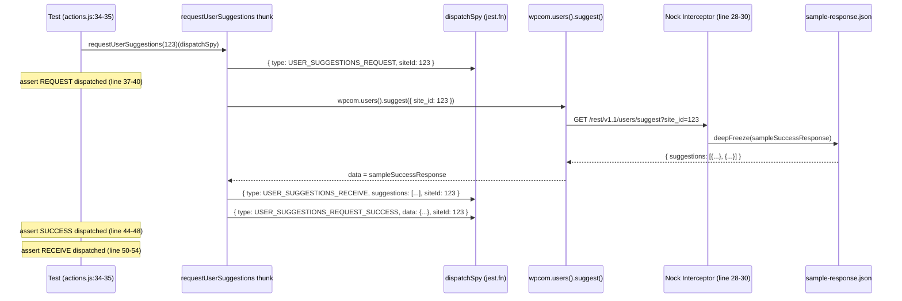
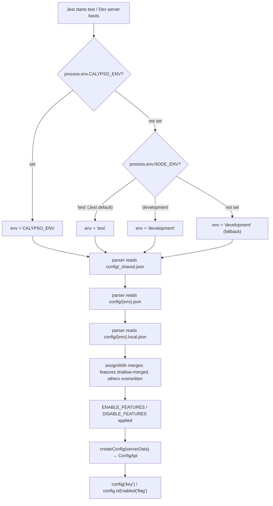

# Calypso Testing Infrastructure: Technical Investigation Guide

> Based on branch: wp-calypso_be7e5cc64162

## Purpose

This document is a comprehensive onboarding reference for the Calypso monorepo's testing infrastructure. It answers—through direct investigation of the source code—the following key questions:

1. **How does the development server boot, and what config does it use?**
2. **What does the test environment look like compared to development?** What setup files, globals, polyfills, and environment variables exist only during test execution?
3. **How does network isolation work during tests?** What happens when code attempts a real network request?
4. **How does a mocked API response flow through an action creator test?** (Traced end-to-end with code excerpts.)
5. **How does `@automattic/calypso-config` resolve differently in tests vs. development?** (Proven with concrete values.)
6. **How do tests control what config returns?**

Every claim in this document cites a specific source file and line number. All code excerpts are copied verbatim from the repository.

---

## Table of Contents

- [1. Development Server Verification](#1-development-server-verification)
- [2. Test Environment Anatomy](#2-test-environment-anatomy)
  - [2.1 How Jest Boots the Test Environment](#21-how-jest-boots-the-test-environment-jestconfigjs-chain)
  - [2.2 Shared Preset: @automattic/calypso-jest](#22-shared-preset-automaticcalypso-jest)
  - [2.3 Client Test Setup vs. Server Test Setup vs. Packages Setup](#23-client-test-setup-vs-server-test-setup-vs-packages-setup)
  - [2.4 Complete Catalog: Test-Only Globals, Polyfills, and Environment Variables](#24-complete-catalog-test-only-globals-polyfills-and-environment-variables)
- [3. Network Isolation During Tests](#3-network-isolation-during-tests)
  - [3.1 nock.disableNetConnect() Enforcement](#31-nockdisablenetconnect-enforcement)
  - [3.2 Lifecycle Hooks: beforeAll / afterAll](#32-lifecycle-hooks-beforeall--afterall)
  - [3.3 wpcom-proxy-request Mock](#33-wpcom-proxy-request-mock)
  - [3.4 Global fetch Mock](#34-global-fetch-mock)
  - [3.5 What Happens When Code Makes a Network Request](#35-what-happens-when-code-makes-a-network-request)
  - [3.6 The useNock Helper (Deprecated)](#36-the-usenock-helper-deprecated)
- [4. API Mock Trace: Action Creator Test Walkthrough](#4-api-mock-trace-action-creator-test-walkthrough)
  - [4.1 Test Under Analysis](#41-test-under-analysis-user-suggestionstestactionsjs)
  - [4.2 Step 1: Nock Interceptor Setup](#42-step-1-nock-interceptor-setup)
  - [4.3 Step 2: Thunk Invocation and Dispatch Spy](#43-step-2-thunk-invocation-and-dispatch-spy)
  - [4.4 Step 3: Request Lifecycle Dispatch Assertions](#44-step-3-request-lifecycle-dispatch-assertions)
  - [4.5 Flow Diagram](#45-flow-diagram-mock--thunk--dispatch--assertion)
- [5. Configuration and Feature Flag Divergence](#5-configuration-and-feature-flag-divergence)
  - [5.1 How Config Resolution Works](#51-how-config-resolution-works-parserjs--indexjs)
  - [5.2 moduleNameMapper: How Tests See config/test.json](#52-modulenamemapper-how-tests-see-configtestjson)
  - [5.3 Side-by-Side Proof: test vs. development Values](#53-side-by-side-proof-test-vs-development-values)
  - [5.4 Feature Flag Divergence Table](#54-feature-flag-divergence-table)
  - [5.5 How Tests Control Config](#55-how-tests-control-config-jestmock-env-vars-active_feature_flags)
- [6. Summary: Test Environment vs. Development at a Glance](#6-summary-test-environment-vs-development-at-a-glance)

---

## 1. Development Server Verification

### Boot Command

The development server is started via:

```bash
yarn start
```

This resolves (per `package.json` line 110) to:

```bash
npx check-node-version --package && node bin/welcome.js && yarn run build && yarn run start-build
```

> Source: `package.json:110`

The `start-build` script (line 113) is:

```bash
BROWSERSLIST_ENV=evergreen node build/server.js | bunyan -o short
```

> Source: `package.json:113`

### Engine Requirements

The repository enforces strict engine versions:

```json
"engines": {
    "node": "^v22.9.0",
    "yarn": "^4.0.0"
}
```

> Source: `package.json:56-59`

### How the Dev Server Resolves Config

When the server boots, it loads configuration through `client/server/config/index.js`:

```js
const configPath = require( 'path' ).resolve( __dirname, '..', '..', '..', 'config' );
const { default: createConfig } = require( '@automattic/create-calypso-config' );
const parser = require( './parser' );

const { serverData, clientData } = parser( configPath, {
	env: process.env.CALYPSO_ENV || process.env.NODE_ENV || 'development',
	enabledFeatures: process.env.ENABLE_FEATURES,
	disabledFeatures: process.env.DISABLE_FEATURES,
} );

module.exports = createConfig( serverData );
module.exports.clientData = clientData;
```

> Source: `client/server/config/index.js:1-12`

**Rationale:** The environment is selected on line 6 via `process.env.CALYPSO_ENV || process.env.NODE_ENV || 'development'`. During normal development, neither `CALYPSO_ENV` is set nor is `NODE_ENV` explicitly overridden beyond `'development'`, so the parser loads `config/development.json`, which sets `env_id: "development"` (line 3 of that file).

### Test Runner Command Structure

The `test` script runs all core test suites sequentially:

```json
"test": "run-s -s test-client test-packages test-server test-build-tools"
```

> Source: `package.json:120`

Individual suite commands:

| Script | Command | Source |
|--------|---------|--------|
| `test-client` | `TZ=UTC jest -c=test/client/jest.config.js` | `package.json:122` |
| `test-packages` | `jest -c=test/packages/jest.config.js` | `package.json:129` |
| `test-server` | `jest -c=test/server/jest.config.js` | `package.json:131` |

Note that `test-client` sets `TZ=UTC` to ensure deterministic date/time formatting across machines.

---

## 2. Test Environment Anatomy

### 2.1 How Jest Boots the Test Environment (jest.config.js chain)

Each test suite has its own Jest configuration that extends a shared preset. Here is the boot chain for each:

#### Client Tests (`test/client/jest.config.js` — 27 lines)

```js
const path = require( 'path' );
const base = require( '@automattic/calypso-jest' );

module.exports = {
	...base,
	rootDir: '../../client',
	cacheDirectory: path.join( __dirname, '../../.cache/jest' ),
	testPathIgnorePatterns: [ '<rootDir>/server/' ],

	moduleNameMapper: {
		'^@automattic/calypso-config$': '<rootDir>/server/config/index.js',
		'react-markdown': '<rootDir>/node_modules/react-markdown/react-markdown.min.js',
	},
	transformIgnorePatterns: [
		'node_modules[\\/\\\\](?!.*\\.(?:gif|jpg|jpeg|png|svg|scss|sass|css)$)',
	],
	testEnvironmentOptions: {
		url: 'https://example.com',
	},
	setupFiles: [ 'jest-canvas-mock' ],
	setupFilesAfterEnv: [ '<rootDir>/../test/client/setup-test-framework.js' ],
	globals: {
		google: {},
		__i18n_text_domain__: 'default',
	},
};
```

> Source: `test/client/jest.config.js:1-27`

Key aspects:
- **Line 5:** Spreads the shared `@automattic/calypso-jest` preset as the base
- **Line 6:** Sets `rootDir` to `../../client` — all test paths are relative to the `client/` directory
- **Line 11:** Redirects `@automattic/calypso-config` imports to `client/server/config/index.js` — this is how tests end up reading `config/test.json` instead of the npm package
- **Line 20:** Loads `jest-canvas-mock` before every test file to provide HTML5 Canvas API stubs
- **Line 21:** Runs `test/client/setup-test-framework.js` after the test environment is initialized (this is where globals, polyfills, and nock are configured)
- **Lines 22-25:** Injects `google` (empty object) and `__i18n_text_domain__` (`'default'`) as global variables

#### Server Tests (`test/server/jest.config.js` — 14 lines)

```js
const path = require( 'path' );
const base = require( '@automattic/calypso-jest' );

module.exports = {
	...base,
	cacheDirectory: path.join( __dirname, '../../.cache/jest' ),
	rootDir: '../../client/server',
	transformIgnorePatterns: [ 'node_modules/(?!.*\\.(?:gif|jpg|jpeg|png|svg|scss|sass|css)$)' ],
	moduleNameMapper: {
		'^@automattic/calypso-config$': 'calypso/server/config',
		'^@automattic/calypso-config/(.*)$': 'calypso/server/config/$1',
	},
	setupFilesAfterEnv: [ require.resolve( './setup-test-framework.js' ) ],
};
```

> Source: `test/server/jest.config.js:1-15`

Key differences from client:
- **Line 7:** `rootDir` points to `../../client/server` — scoped to server code only
- **Lines 10-11:** Maps `@automattic/calypso-config` to `calypso/server/config` (same underlying module, different path alias)
- **Line 13:** Uses its own setup file (`test/server/setup-test-framework.js`), which is much simpler than the client setup
- **No jsdom** — server tests run in Jest's default `node` environment (inherited from the shared preset)
- **No `jest-canvas-mock`** — not needed in Node.js
- **No `google` or `__i18n_text_domain__` globals** — not applicable to server code

#### Packages Tests (`test/packages/jest-preset.js` — 16 lines)

```js
const path = require( 'path' );
const base = require( '@automattic/calypso-jest' );

/**
 * Can't use `preset: '@automattic/calypso-jest'` because preset are not recursive. In other words,
 * if this config contains `preset`, then it can't be consumed as a preset by anybody else.
 */
module.exports = {
	...base,
	cacheDirectory: path.join( __dirname, '../../.cache/jest' ),
	globals: {
		__i18n_text_domain__: 'default',
	},
	setupFilesAfterEnv: [ '<rootDir>../../test/packages/setup.js' ],
};
```

> Source: `test/packages/jest-preset.js:1-16`

Key differences:
- **Line 12:** Injects `__i18n_text_domain__` (like client), but no `google` global
- **Line 14:** Uses `test/packages/setup.js` — a minimal setup with only `ResizeObserver`, `matchMedia`, `randomUUID`, and `@testing-library/jest-dom`
- **No `moduleNameMapper` for config** — packages don't redirect `@automattic/calypso-config`
- **No network isolation** — packages tests do NOT call `nock.disableNetConnect()`

#### Apps Tests (`test/apps/jest-preset.js` — 14 lines)

```js
const path = require( 'path' );
const base = require( '@automattic/calypso-jest' );

module.exports = {
	...base,
	cacheDirectory: path.join( __dirname, '../../.cache/jest' ),
	testEnvironment: 'jsdom',
	transformIgnorePatterns: [
		'node_modules[\\/\\\\](?!.*\\.(?:gif|jpg|jpeg|png|svg|scss|sass|css)$)',
	],
	setupFiles: [ 'jest-canvas-mock' ],
	// This includes a lot of globals that don't exist, like fetch, matchMedia, etc.
	setupFilesAfterEnv: [ require.resolve( '../client/setup-test-framework.js' ) ],
};
```

> Source: `test/apps/jest-preset.js:1-14`

**Rationale (line 12 comment):** Apps tests reuse the client's `setup-test-framework.js` because apps run in browser-like environments and need the same globals. The comment explicitly notes this "includes a lot of globals that don't exist" — acknowledging that jsdom lacks many browser APIs that the client setup file provides.

### 2.2 Shared Preset: @automattic/calypso-jest

All test suites extend from `packages/calypso-jest/jest-preset.js`:

```js
const { defaults } = require( 'jest-config' );

/**
 * We need to use require.resolve() for all relative paths. Otherwise they get resolved relative to
 * <rootDir>, which by default is the dirname of the file importing this preset.
 */

module.exports = {
	resolver: require.resolve( './src/module-resolver.js' ),
	setupFilesAfterEnv: [ require.resolve( './src/setup.js' ) ],
	testEnvironment: 'node',
	testMatch: [ '<rootDir>/**/test/*.[jt]s?(x)', '!**/.eslintrc.*' ],
	transform: {
		'\\.[jt]sx?$': [ 'babel-jest', { rootMode: 'upward' } ],
		'\\.(gif|jpg|jpeg|png|svg|scss|sass|css)$': require.resolve( './src/asset-transform.js' ),
	},
	testPathIgnorePatterns: [ ...defaults.testPathIgnorePatterns, '/dist/' ],
	verbose: false,
	snapshotFormat: {
		escapeString: true,
		printBasicPrototype: true,
	},
};
```

> Source: `packages/calypso-jest/jest-preset.js:1-23`

Key configuration:
- **Line 9:** Custom module resolver — `./src/module-resolver.js` (see below)
- **Line 11:** Default test environment is `node` (suites that need `jsdom` override this)
- **Line 12:** Test file pattern: `**/test/*.[jt]s?(x)` — tests live in `test/` subdirectories
- **Line 14:** Babel transform with `rootMode: 'upward'` — finds `babel.config.js` at the repo root
- **Line 15:** Asset transform — images and styles are replaced with their filenames
- **Lines 19-22:** Snapshot format settings for deterministic output

#### Custom Module Resolver (`test/module-resolver.js`)

```js
const enhancedResolve = require( 'enhanced-resolve' );

/**
 * Implements a custom resolver for Jest.
 *
 * We first try these fields in order (or their equivalent conditional export):
 *
 *   1) `calypso:src`: This is a sign that the package is in the monorepo. This property points to the _untranspiled_ source code
 *      (usually `./src/index.js`). This allows us to skip any package transpilation before it can be used by Webpack or Jest,
 *      saving some developer time.
 *   3) `main`: This is the default, it points to a CJS module. If the package is in the monorepo this points to a file that usually
 *      _does not_ exists, but it doesn't matter because all packages in the monorepo have `calypso:src`
 *
 * Once Jest supports ESM natively we can look for ESM packages (either using conditional export `import`, or the property `module` )
 */
const resolver = enhancedResolve.create.sync( {
	extensions: [ '.json', '.js', '.jsx', '.ts', '.tsx' ],
	mainFields: [ 'calypso:src', 'main' ],
	conditionNames: [ 'calypso:src', 'node', 'require' ],
} );

module.exports = function ( request, options ) {
	return resolver( options.basedir, request ).replace( /\0#/g, '#' );
};
```

> Source: `test/module-resolver.js:1-24`

**Rationale:** The monorepo contains many internal packages (in `packages/`). Each package's `package.json` includes a `calypso:src` field pointing to the untranspiled source (e.g., `./src/index.js`). The custom resolver prioritizes `calypso:src` over `main` (lines 18-19), so during tests, `import` statements for monorepo packages resolve to the raw TypeScript/JavaScript source. This eliminates the need to pre-build packages before running tests, saving developer time. The `conditionNames` on line 19 serve the same purpose for packages using conditional exports.

### 2.3 Client Test Setup vs. Server Test Setup vs. Packages Setup

The following table provides a comprehensive comparison of what each test suite's setup file provides. This is the core of the "test environment anatomy" — these are the artifacts that exist ONLY during test execution and NOT during development or production.

| Feature | Client (`test/client/setup-test-framework.js`) | Server (`test/server/setup-test-framework.js`) | Packages (`test/packages/setup.js`) |
|---|---|---|---|
| `@testing-library/jest-dom` | ✅ line 1 | ❌ | ✅ line 1 |
| `nock.disableNetConnect()` | ✅ line 9 | ✅ line 4 | ❌ |
| `beforeAll`/`afterAll` nock lifecycle | ✅ lines 11-22 | ✅ lines 6-17 | ❌ |
| `global.TextEncoder`/`TextDecoder` | ✅ lines 25-26 | ❌ | ❌ |
| `global.CSS.supports` mock | ✅ lines 30-32 | ❌ | ❌ |
| `global.ResizeObserver` | ✅ line 34 (via `resize-observer-polyfill`) | ❌ | ✅ line 5 (via `resize-observer-polyfill`) |
| `global.fetch` mock | ✅ lines 36-40 | ❌ | ❌ |
| `wpcom-proxy-request` mock | ✅ lines 44-49 (full: `canAccessWpcomApis`, `reloadProxy`, `requestAllBlogsAccess`) | ✅ lines 21-23 (minimal: `__esModule` only) | ❌ |
| `global.crypto.randomUUID` | ✅ line 52 (real Node.js `crypto` impl) | ❌ | ✅ line 3 (returns `'fake-uuid'`) |
| `global.matchMedia` | ✅ lines 54-63 | ❌ | ✅ lines 7-16 |
| `global.ReadableStream`/`TransformStream` | ✅ lines 66-67 | ❌ | ❌ |
| `global.Worker` | ✅ line 68 | ❌ | ❌ |
| `global.structuredClone` | ✅ lines 71-73 | ❌ | ❌ |
| `global.crypto.subtle` | ✅ lines 76-79 | ❌ | ❌ |
| `jest-canvas-mock` | via `jest.config.js` `setupFiles` (line 20) | ❌ | ❌ |
| `google` global | via `jest.config.js` `globals` (line 23) | ❌ | ❌ |
| `__i18n_text_domain__` | via `jest.config.js` `globals` (line 24) | ❌ | via `jest-preset.js` `globals` (line 12) |

**Why the asymmetry?** The client test setup is the most extensive because it simulates a browser environment — client code expects `fetch`, `matchMedia`, `CSS.supports`, `ReadableStream`, `Worker`, `structuredClone`, and other Web APIs to exist. Server tests only need network isolation (nock) and the `wpcom-proxy-request` mock, because server code runs natively in Node.js and doesn't use browser APIs. Packages tests sit in the middle — they need a few browser-like APIs (`ResizeObserver`, `matchMedia`) because some packages are used in both browser and server contexts, but they don't need full network isolation.

### 2.4 Complete Catalog: Test-Only Globals, Polyfills, and Environment Variables

The following table catalogs every test-only artifact injected during test execution. None of these exist during normal development or production.

| # | Name | Type | Source | What It Provides | Why It Exists |
|---|------|------|--------|------------------|---------------|
| 1 | `global.TextEncoder` | Polyfill | `test/client/setup-test-framework.js:25` | Node.js `util.TextEncoder` | Required for `ReactDOMServer` (comment on line 24: "Define TextEncoder for ReactDOMServer") |
| 2 | `global.TextDecoder` | Polyfill | `test/client/setup-test-framework.js:26` | Node.js `util.TextDecoder` | Companion to TextEncoder for stream decoding |
| 3 | `global.CSS.supports` | Mock | `test/client/setup-test-framework.js:30-32` | `jest.fn()` | Used by `@wordpress/components`; "JSDOM or CSSDOM don't provide an implementation for it" (comment on lines 28-29) |
| 4 | `global.ResizeObserver` | Polyfill | `test/client/setup-test-framework.js:34` | `resize-observer-polyfill` | Provides the `ResizeObserver` API that `jsdom` lacks |
| 5 | `global.ResizeObserver` (packages) | Polyfill | `test/packages/setup.js:5` | `resize-observer-polyfill` | Same reason; packages may use components that rely on `ResizeObserver` |
| 6 | `global.fetch` | Mock | `test/client/setup-test-framework.js:36-40` | `jest.fn()` returning `Promise.resolve({ json: () => Promise.resolve() })` | Prevents real network requests via the Fetch API; provides a safe default response |
| 7 | `global.crypto.randomUUID` (client) | Polyfill | `test/client/setup-test-framework.js:52` | `nodeCrypto.randomUUID()` (real implementation) | "Mock crypto.randomUUID with its Node.js implementation" (comment on line 51) |
| 8 | `global.crypto.randomUUID` (packages) | Mock | `test/packages/setup.js:3` | Returns `'fake-uuid'` (deterministic) | Provides deterministic UUIDs for snapshot testing |
| 9 | `global.matchMedia` (client) | Mock | `test/client/setup-test-framework.js:54-63` | `jest.fn()` returning `{ matches: false, media: query, ... }` | `jsdom` does not implement `matchMedia`; many components use it for responsive layouts |
| 10 | `global.matchMedia` (packages) | Mock | `test/packages/setup.js:7-16` | Identical to client mock | Same reason; packages may contain responsive components |
| 11 | `global.ReadableStream` | Polyfill | `test/client/setup-test-framework.js:66` | Node.js `stream/web.ReadableStream` | "Used by @wp-playground/client" (comment on line 65) |
| 12 | `global.TransformStream` | Polyfill | `test/client/setup-test-framework.js:67` | Node.js `stream/web.TransformStream` | Same: used by `@wp-playground/client` |
| 13 | `global.Worker` | Polyfill | `test/client/setup-test-framework.js:68` | Node.js `worker_threads.Worker` | Web Workers don't exist in jsdom; provides a compatible implementation |
| 14 | `global.structuredClone` | Polyfill | `test/client/setup-test-framework.js:71-73` | `JSON.parse(JSON.stringify(obj))` fallback | "Used by @wp-playground/client" (comment on line 70); only set if not already present |
| 15 | `global.crypto.subtle` | Polyfill | `test/client/setup-test-framework.js:76-79` | `nodeCrypto.subtle` | "Used by @wp-playground/client" (comment on line 75); only set if not already present |
| 16 | `jest-canvas-mock` | Mock (setupFiles) | `test/client/jest.config.js:20` | HTML5 Canvas API stubs | Client code and dependencies may use `<canvas>` which jsdom doesn't implement |
| 17 | `google` | Global | `test/client/jest.config.js:23` | Empty object `{}` | Prevents `ReferenceError` when client code references Google Maps or reCAPTCHA APIs |
| 18 | `__i18n_text_domain__` (client) | Global | `test/client/jest.config.js:24` | String `'default'` | i18n text domain identifier used by translation functions |
| 19 | `__i18n_text_domain__` (packages) | Global | `test/packages/jest-preset.js:12` | String `'default'` | Same; packages also use translation functions |
| 20 | `TZ=UTC` | Env var | `package.json:122` (in `test-client` script) | Sets timezone to UTC | Ensures deterministic date formatting across machines (only for client tests) |

---

## 3. Network Isolation During Tests

### 3.1 nock.disableNetConnect() Enforcement

Network isolation is enforced in both client and server test suites at module load time:

**Client setup:**

```js
// Disables all network requests for all tests.
nock.disableNetConnect();
```

> Source: `test/client/setup-test-framework.js:8-9`

**Server setup:**

```js
// Disables all network requests for all tests.
nock.disableNetConnect();
```

> Source: `test/server/setup-test-framework.js:3-4`

**How it works:** `nock` is an HTTP request interception library for Node.js. When `nock.disableNetConnect()` is called, nock monkey-patches Node.js's `http.ClientRequest` so that any HTTP or HTTPS request not matching a registered nock interceptor will throw a `NetConnectNotAllowedError`. This means if test code (or any dependency) tries to make a real network request, the test will fail immediately with an explicit error rather than silently contacting an external service.

**Important:** Packages tests (`test/packages/setup.js`) do NOT disable network connections. This is a deliberate choice — package-level tests are more isolated and less likely to make HTTP requests, so the overhead and restriction of nock isn't applied.

### 3.2 Lifecycle Hooks: beforeAll / afterAll

Both client and server setups register nock lifecycle hooks. Here is the client version:

```js
beforeAll( () => {
	// reactivate nock on test start
	if ( ! nock.isActive() ) {
		nock.activate();
	}
} );

afterAll( () => {
	// helps clean up nock after each test run and avoid memory leaks
	nock.restore();
	nock.cleanAll();
} );
```

> Source: `test/client/setup-test-framework.js:11-22`

The server setup has identical lifecycle hooks:

```js
beforeAll( () => {
	// reactivate nock on test start
	if ( ! nock.isActive() ) {
		nock.activate();
	}
} );

afterAll( () => {
	// helps clean up nock after each test run and avoid memory leaks
	nock.restore();
	nock.cleanAll();
} );
```

> Source: `test/server/setup-test-framework.js:6-17`

**The lifecycle explained:**

1. **Module load time** (`nock.disableNetConnect()`): Installs nock's monkey-patch on `http.ClientRequest` and disables all real connections. This happens once when the setup file is first loaded.

2. **`beforeAll`** (runs before each test file's test suite): Idempotent reactivation. If a prior `afterAll` called `nock.restore()` (which removes the monkey-patch), this re-installs it. The `if (!nock.isActive())` guard prevents double-activation errors.

3. **`afterAll`** (runs after each test file's test suite): Two cleanup operations:
   - `nock.restore()` — removes nock's monkey-patch from `http.ClientRequest`, restoring Node.js's native HTTP behavior
   - `nock.cleanAll()` — removes all registered interceptors to prevent memory leaks (the comment explicitly calls this out)

**Why this pattern?** Without `afterAll` cleanup, interceptors registered in one test file could leak into subsequent test files, causing mysterious test failures or false passes. Without `beforeAll` reactivation, the restore in `afterAll` would leave nock inactive for the next test file.

### 3.3 wpcom-proxy-request Mock

The `wpcom-proxy-request` module is mocked in both client and server setups, but with different levels of detail:

**Client mock (full):**

```js
// Don't need to mock specific functions for any tests, but mocking
// module because it accesses the `document` global.
jest.mock( 'wpcom-proxy-request', () => ( {
	__esModule: true,
	canAccessWpcomApis: jest.fn(),
	reloadProxy: jest.fn(),
	requestAllBlogsAccess: jest.fn(),
} ) );
```

> Source: `test/client/setup-test-framework.js:42-49`

**Server mock (minimal):**

```js
// Don't need to mock specific functions for any tests, but mocking
// module because it accesses the `document` global.
jest.mock( 'wpcom-proxy-request', () => ( {
	__esModule: true,
} ) );
```

> Source: `test/server/setup-test-framework.js:19-23`

**Why mock this module?** Both comments (identical in both files) explain the rationale: "mocking module because it accesses the `document` global." The real `wpcom-proxy-request` module accesses the browser's `document` object at import time to set up an iframe-based proxy. In Jest's Node.js environment, `document` either doesn't exist (in `testEnvironment: 'node'`) or is incomplete (in `jsdom`). Without this mock, any module that transitively imports `wpcom-proxy-request` would crash at import time.

**Why the difference in mock completeness?** The client mock includes stubs for `canAccessWpcomApis`, `reloadProxy`, and `requestAllBlogsAccess` because client-side code calls these functions. The server mock only needs `__esModule: true` (to satisfy ES module interop) because server code doesn't call those browser-specific methods.

### 3.4 Global fetch Mock

Client tests replace the native `fetch` API:

```js
global.fetch = jest.fn( () =>
	Promise.resolve( {
		json: () => Promise.resolve(),
	} )
);
```

> Source: `test/client/setup-test-framework.js:36-40`

**What this does:** Replaces `global.fetch` with a `jest.fn()` that:
- Always resolves (never rejects)
- Returns an object with a `json()` method that also always resolves (with `undefined`)

**Implications for test authors:**
- Code using `fetch` during client tests won't hit the network and won't crash
- The default mock returns `undefined` from `json()`, which is safe but meaningless
- Tests that need specific fetch responses should mock `fetch` again individually within their test file

**Server tests do NOT mock `global.fetch`** — they rely on nock's HTTP interception layer instead. This makes sense because server code typically uses Node.js HTTP modules (which nock intercepts) rather than the browser `fetch` API.

### 3.5 What Happens When Code Makes a Network Request

During client or server tests, network isolation is enforced through a three-layer defense:

| Layer | Mechanism | Scope | What Happens |
|-------|-----------|-------|--------------|
| 1. Nock | `nock.disableNetConnect()` | `http.request` / `https.request` | If no matching interceptor, throws `NetConnectNotAllowedError` |
| 2. Fetch mock | `global.fetch = jest.fn(...)` | Fetch API (client only) | Returns a mock response; no real network call |
| 3. wpcom-proxy-request mock | `jest.mock('wpcom-proxy-request', ...)` | WordPress.com proxy iframe | Prevents the module from accessing `document` or making real requests |

**Result:** No real outbound HTTP requests can occur during client or server test execution. Any attempt will either:
1. Be intercepted by a registered nock mock (returning the mocked response), or
2. Throw a `NetConnectNotAllowedError` (if no interceptor matches), or
3. Return the default `fetch` mock response (client tests only)

### 3.6 The useNock Helper (Deprecated)

The codebase includes a helper utility at `client/test-helpers/use-nock/index.js`:

```js
import debug from 'debug';
import nock from 'nock';

export { nock };

const log = debug( 'calypso:test:use-nock' );

/**
 * @param {Function} setupCallback Function executed before all tests are run.
 * @deprecated Use nock directly instead.
 */
export const useNock = ( setupCallback ) => {
	if ( setupCallback ) {
		beforeAll( () => setupCallback( nock ) );
	}
	afterAll( () => {
		log( 'Cleaning up nock' );
		nock.cleanAll();
	} );
};

export default useNock;
```

> Source: `client/test-helpers/use-nock/index.js:1-22`

**Note the `@deprecated` tag on line 10.** The recommended pattern is to use nock directly (as demonstrated in `client/state/user-suggestions/test/actions.js` in Section 4). The `useNock` helper was an early convenience wrapper that:
1. Calls a setup callback in `beforeAll`, passing the `nock` object
2. Calls `nock.cleanAll()` in `afterAll`

This is redundant with the framework-level lifecycle hooks already established in `setup-test-framework.js`.

---

## 4. API Mock Trace: Action Creator Test Walkthrough

This section traces a complete test that mocks an API call, showing exactly how the mocked response flows through the action creator back to the test assertion.

### 4.1 Test Under Analysis: user-suggestions/test/actions.js

**Test file:** `client/state/user-suggestions/test/actions.js` (57 lines)

```js
import deepFreeze from 'deep-freeze';
import nock from 'nock';
import {
	USER_SUGGESTIONS_RECEIVE,
	USER_SUGGESTIONS_REQUEST,
	USER_SUGGESTIONS_REQUEST_SUCCESS,
} from 'calypso/state/action-types';
import { receiveUserSuggestions, requestUserSuggestions } from '../actions';
import sampleSuccessResponse from './sample-response.json';
const siteId = 123;

describe( 'actions', () => {
	describe( '#receiveUserSuggestions()', () => {
		test( 'should return an action object', () => {
			const suggestions = [];
			const action = receiveUserSuggestions( siteId, suggestions );

			expect( action ).toEqual( {
				type: USER_SUGGESTIONS_RECEIVE,
				siteId,
				suggestions,
			} );
		} );
	} );

	describe( '#requestUserSuggestions', () => {
		beforeAll( () => {
			nock( 'https://public-api.wordpress.com:443' )
				.get( '/rest/v1.1/users/suggest?site_id=' + siteId )
				.reply( 200, deepFreeze( sampleSuccessResponse ) );
		} );

		test( 'should dispatch properly when receiving a valid response', async () => {
			const dispatchSpy = jest.fn( ( arg ) => arg );
			const request = requestUserSuggestions( siteId )( dispatchSpy );

			expect( dispatchSpy ).toHaveBeenCalledWith( {
				type: USER_SUGGESTIONS_REQUEST,
				siteId,
			} );

			await request;

			expect( dispatchSpy ).toHaveBeenCalledWith( {
				type: USER_SUGGESTIONS_REQUEST_SUCCESS,
				data: sampleSuccessResponse,
				siteId,
			} );

			expect( dispatchSpy ).toHaveBeenCalledWith( {
				type: USER_SUGGESTIONS_RECEIVE,
				suggestions: sampleSuccessResponse.suggestions,
				siteId,
			} );
		} );
	} );
} );
```

> Source: `client/state/user-suggestions/test/actions.js:1-57`

**Fixture data** (`client/state/user-suggestions/test/sample-response.json`):

```json
{
	"suggestions": [
		{
			"user_login": "wordpress1"
		},
		{
			"user_login": "wordpress2"
		}
	]
}
```

> Source: `client/state/user-suggestions/test/sample-response.json:1-10`

**Action creator under test** (`client/state/user-suggestions/actions.js`):

```js
import wpcom from 'calypso/lib/wp';
import {
	USER_SUGGESTIONS_RECEIVE,
	USER_SUGGESTIONS_REQUEST,
	USER_SUGGESTIONS_REQUEST_SUCCESS,
	USER_SUGGESTIONS_REQUEST_FAILURE,
} from 'calypso/state/action-types';

import 'calypso/state/user-suggestions/init';

/**
 * Returns an action object to be used in signalling that user suggestions for a site
 * have been received.
 * @param  {number} siteId  	Site ID
 * @param  {Object} suggestions User suggestions
 * @returns {Object}         	Action object
 */
export function receiveUserSuggestions( siteId, suggestions ) {
	return {
		type: USER_SUGGESTIONS_RECEIVE,
		suggestions,
		siteId,
	};
}

/**
 * Returns an action thunk which, when invoked, triggers a network request to
 * retrieve user suggestions for a site.
 * @param  {number}   siteId  Site ID
 * @returns {Function}         Action thunk
 */
export function requestUserSuggestions( siteId ) {
	return ( dispatch ) => {
		dispatch( {
			type: USER_SUGGESTIONS_REQUEST,
			siteId,
		} );

		return wpcom
			.users()
			.suggest( { site_id: siteId } )
			.then( ( data ) => {
				dispatch( receiveUserSuggestions( siteId, data.suggestions ) );
				dispatch( {
					type: USER_SUGGESTIONS_REQUEST_SUCCESS,
					siteId,
					data,
				} );
			} )
			.catch( ( error ) =>
				dispatch( {
					type: USER_SUGGESTIONS_REQUEST_FAILURE,
					siteId,
					error,
				} )
			);
	};
}
```

> Source: `client/state/user-suggestions/actions.js:1-58`

### 4.2 Step 1: Nock Interceptor Setup

Before any test in the `#requestUserSuggestions` describe block runs, a nock interceptor is registered:

```js
beforeAll( () => {
    nock( 'https://public-api.wordpress.com:443' )
        .get( '/rest/v1.1/users/suggest?site_id=' + siteId )
        .reply( 200, deepFreeze( sampleSuccessResponse ) );
} );
```

> Source: `client/state/user-suggestions/test/actions.js:27-31`

**What this does:**

1. `nock('https://public-api.wordpress.com:443')` — creates a scope for intercepting requests to the WordPress.com public API
2. `.get('/rest/v1.1/users/suggest?site_id=123')` — matches only GET requests to this exact path and query string
3. `.reply(200, deepFreeze(sampleSuccessResponse))` — when matched, responds with HTTP 200 and the fixture data

The `deepFreeze()` call (from the `deep-freeze` library) makes the response object immutable. This is a testing best practice: if the action creator or any downstream code accidentally mutates the response data, the test will throw a `TypeError` rather than silently passing with corrupted data.

**Important context:** Remember from Section 3.1 that `nock.disableNetConnect()` is already active (from `setup-test-framework.js`). This means the ONLY HTTP request that will succeed is the one matching this interceptor. Any other request would throw `NetConnectNotAllowedError`.

### 4.3 Step 2: Thunk Invocation and Dispatch Spy

```js
test( 'should dispatch properly when receiving a valid response', async () => {
    const dispatchSpy = jest.fn( ( arg ) => arg );
    const request = requestUserSuggestions( siteId )( dispatchSpy );

    expect( dispatchSpy ).toHaveBeenCalledWith( {
        type: USER_SUGGESTIONS_REQUEST,
        siteId,
    } );

    await request;
```

> Source: `client/state/user-suggestions/test/actions.js:33-42`

**Trace through the execution:**

1. **Line 34:** A `dispatchSpy` is created — it's a `jest.fn()` that returns its argument. This simulates Redux's `dispatch` function.

2. **Line 35:** `requestUserSuggestions(siteId)` is called with `siteId = 123`. Looking at `actions.js:32`, this returns a thunk: `(dispatch) => { ... }`. The test immediately invokes this thunk with `dispatchSpy`.

3. **Inside the thunk** (`actions.js:34-37`): The first thing the thunk does is dispatch synchronously:
   ```js
   dispatch( {
       type: USER_SUGGESTIONS_REQUEST,
       siteId,
   } );
   ```
   This signals "a request is starting."

4. **Lines 37-40 of test:** Immediately after invoking the thunk (before `await`), the test asserts that `USER_SUGGESTIONS_REQUEST` was dispatched. This works because this dispatch is synchronous — it happens before the thunk starts its async operation.

5. **Inside the thunk** (`actions.js:39-41`): The thunk then calls `wpcom.users().suggest({ site_id: siteId })`, which internally makes an HTTP GET request to `https://public-api.wordpress.com:443/rest/v1.1/users/suggest?site_id=123`. **Nock intercepts this request** and returns the `sampleSuccessResponse` fixture.

6. **Line 42 of test:** `await request` waits for the entire thunk promise chain to complete.

### 4.4 Step 3: Request Lifecycle Dispatch Assertions

After `await request` resolves:

```js
    await request;

    expect( dispatchSpy ).toHaveBeenCalledWith( {
        type: USER_SUGGESTIONS_REQUEST_SUCCESS,
        data: sampleSuccessResponse,
        siteId,
    } );

    expect( dispatchSpy ).toHaveBeenCalledWith( {
        type: USER_SUGGESTIONS_RECEIVE,
        suggestions: sampleSuccessResponse.suggestions,
        siteId,
    } );
} );
```

> Source: `client/state/user-suggestions/test/actions.js:42-55`

**Trace through the `.then()` handler** (`actions.js:42-49`):

When nock returns the mocked response, the promise resolves with `data = sampleSuccessResponse`. The `.then()` handler executes:

1. `dispatch(receiveUserSuggestions(siteId, data.suggestions))` — calls the `receiveUserSuggestions` function (actions.js:18-24) which returns:
   ```js
   {
       type: USER_SUGGESTIONS_RECEIVE,
       suggestions: [{ user_login: "wordpress1" }, { user_login: "wordpress2" }],
       siteId: 123,
   }
   ```
   This is dispatched to `dispatchSpy`.

2. `dispatch({ type: USER_SUGGESTIONS_REQUEST_SUCCESS, siteId, data })` — dispatches the success action with the full response data.

The test then asserts (lines 44-54) that both dispatches occurred with the exact expected payloads.

**Summary of all dispatches in order:**
1. `{ type: USER_SUGGESTIONS_REQUEST, siteId: 123 }` — "request started"
2. `{ type: USER_SUGGESTIONS_RECEIVE, suggestions: [...], siteId: 123 }` — "data received"
3. `{ type: USER_SUGGESTIONS_REQUEST_SUCCESS, data: {...}, siteId: 123 }` — "request succeeded"

### 4.5 Flow Diagram: Mock → Thunk → Dispatch → Assertion



---

## 5. Configuration and Feature Flag Divergence

### 5.1 How Config Resolution Works (parser.js + index.js)

The entire configuration system works through a two-step process: the **parser** reads and merges JSON files, and **createConfig** wraps the data in an API.

#### Step 1: Entry Point (`client/server/config/index.js`)

```js
const configPath = require( 'path' ).resolve( __dirname, '..', '..', '..', 'config' );
const { default: createConfig } = require( '@automattic/create-calypso-config' );
const parser = require( './parser' );

const { serverData, clientData } = parser( configPath, {
	env: process.env.CALYPSO_ENV || process.env.NODE_ENV || 'development',
	enabledFeatures: process.env.ENABLE_FEATURES,
	disabledFeatures: process.env.DISABLE_FEATURES,
} );

module.exports = createConfig( serverData );
module.exports.clientData = clientData;
```

> Source: `client/server/config/index.js:1-12`

**Environment selection (line 6):** `process.env.CALYPSO_ENV || process.env.NODE_ENV || 'development'`

| Scenario | `CALYPSO_ENV` | `NODE_ENV` | Selected env |
|----------|---------------|------------|-------------|
| Development server | not set | `'development'` | `'development'` |
| Jest tests | not set | `'test'` (Jest default) | `'test'` |
| Production build | not set | `'production'` | `'production'` |
| Jetpack Cloud | `'jetpack-cloud-development'` | any | `'jetpack-cloud-development'` |

**This is the key mechanism:** Jest automatically sets `NODE_ENV=test`, so the parser loads `config/test.json` instead of `config/development.json`. No explicit test configuration is needed — it happens naturally through the environment variable chain.

#### Step 2: Parser Layering (`client/server/config/parser.js`)

The parser reads three JSON files and merges them in order:

```js
const configFiles = [
    path.resolve( configPath, '_shared.json' ),
    path.resolve( configPath, opts.env + '.json' ),
    path.resolve( configPath, opts.env + '.local.json' ),
];
```

> Source: `client/server/config/parser.js:31-35`

| Layer | For Tests | For Development | Purpose |
|-------|-----------|-----------------|---------|
| 1 | `config/_shared.json` | `config/_shared.json` | Base defaults shared by all environments |
| 2 | `config/test.json` | `config/development.json` | Environment-specific overrides |
| 3 | `config/test.local.json` | `config/development.local.json` | Local developer overrides (gitignored) |

The merge logic uses special handling for the `features` key:

```js
configFiles.forEach( function ( file ) {
    // merge the objects in `features` field, and do a simple assignment for other fields
    assignWith( data, getDataFromFile( file ), ( objValue, srcValue, key ) =>
        key === 'features' ? { ...objValue, ...srcValue } : undefined
    );
} );
```

> Source: `client/server/config/parser.js:42-47`

**Rationale:** The `features` objects are shallow-merged using the spread operator (`{ ...objValue, ...srcValue }`). This means each environment's feature flags override the shared defaults, but feature flags not mentioned in the environment file are preserved from the shared config. All other top-level keys use `lodash.assignWith`'s default behavior (later values replace earlier ones completely).

After merging, the parser applies environment variable overrides:

```js
if ( data.hasOwnProperty( 'features' ) ) {
    enabledFeatures.forEach( function ( feature ) {
        data.features[ feature ] = true;
        debug( 'overriding feature %s to true', feature );
    } );
    disabledFeatures.forEach( function ( feature ) {
        data.features[ feature ] = false;
        debug( 'overriding feature %s to false', feature );
    } );
}
```

> Source: `client/server/config/parser.js:49-58`

This allows `ENABLE_FEATURES=my-flag` and `DISABLE_FEATURES=other-flag` to override any feature flag regardless of what the JSON files say.

#### Config Resolution Flowchart



### 5.2 moduleNameMapper: How Tests See config/test.json

The critical link between Jest tests and the config system is the `moduleNameMapper` configuration:

**Client Jest config (`test/client/jest.config.js` line 11):**

```js
'^@automattic/calypso-config$': '<rootDir>/server/config/index.js',
```

> Source: `test/client/jest.config.js:11`

Since `rootDir` is `../../client` (line 6), this resolves to `client/server/config/index.js`.

**Server Jest config (`test/server/jest.config.js` lines 10-11):**

```js
'^@automattic/calypso-config$': 'calypso/server/config',
'^@automattic/calypso-config/(.*)$': 'calypso/server/config/$1',
```

> Source: `test/server/jest.config.js:10-11`

**The chain explained:**

1. Production code writes: `import config from '@automattic/calypso-config'`
2. In production, this imports the npm package `packages/calypso-config/src/index.ts`, which reads `window.configData` (set by the server during SSR)
3. In tests, Jest's `moduleNameMapper` intercepts this import and redirects it to `client/server/config/index.js`
4. `client/server/config/index.js` calls `parser()` with `env = 'test'` (because `NODE_ENV=test`)
5. The parser loads `config/_shared.json` → `config/test.json` → `config/test.local.json`
6. `createConfig(serverData)` wraps the merged data in a `ConfigApi` object

**Result:** During tests, `config('env_id')` returns `"test"`, not `"development"`. This is proven in the next section.

### 5.3 Side-by-Side Proof: test vs. development Values

The following table shows concrete values that differ between `config/test.json` and `config/development.json`. This is direct proof that the two environments resolve different configuration.

| Config Key | Test (`config/test.json`) | Development (`config/development.json`) | Source Lines |
|---|---|---|---|
| `env_id` | `"test"` | `"development"` | `test.json:3` / `development.json:3` |
| `favicon_url` | *(not set — inherits `"//s1.wp.com/i/favicon.ico"` from `_shared.json:4`)* | `"/calypso/images/favicons/favicon-development.ico"` | `development.json:4` |
| `google_recaptcha_site_key` | `""` (empty string) | *(not set — inherits `false` from `_shared.json:11`)* | `test.json:17` |
| `dsp_stripe_pub_key` | *(not set — inherits from `_shared.json:35`)* | `"pk_live_51LYYzQ..."` (overrides shared) | `development.json:24` |
| `zendesk_presales_chat_key` | *(not set — inherits `false` from `_shared.json:39`)* | `"beefd4ad-db79-4381-9d44-6c4bf92497ed"` | `development.json:28` |
| `zendesk_support_chat_key` | *(not set — inherits `false` from `_shared.json:43`)* | `"715f17a8-4a28-4a7f-8447-0ef8f06c70d7"` | `development.json:31` |
| `blaze_pro_back_link` | *(not set — inherits production URL from `_shared.json:37`)* | `"http://blaze.pro:3005/app"` (local dev URL) | `development.json:26` |

**Key observation:** The test environment inherits most values from `_shared.json` and only overrides what's necessary for testing. The development environment adds real API keys, local URLs, and service integrations that shouldn't be present during automated tests.

### 5.4 Feature Flag Divergence Table

This is the concrete proof the user asked for: feature flags that have **different boolean values** between test and development.

| Feature Flag | Test Value | Dev Value | Source |
|---|---|---|---|
| `checkout/checkout-version` | `false` | `true` | `test.json:33` / `development.json:44` |
| `google-my-business` | `false` | `true` | `test.json:47` / `development.json:67` |
| `individual-subscriber-stats` | `false` | `true` | `test.json:52` / `development.json:80` |
| `jetpack/sharing-buttons-block-enabled` | `false` | `true` | `test.json:62` / `development.json:99` |
| `lasagna` | `false` | `true` | `test.json:65` / `development.json:106` |
| `launchpad-updates` | `false` | `true` | `test.json:66` / `development.json:107` |
| `post-list/qr-code-link` | `false` | `true` | `test.json:99` / `development.json:159` |
| `redirect-fallback-browsers` | **`true`** | **`false`** | `test.json:106` / `development.json:172` |
| `rum-tracking/logstash` | `false` | `true` | `test.json:107` / `development.json:173` |
| `ssr/prefetch-timebox` | **`true`** | **`false`** | `test.json:116` / `development.json:188` |

**Notable inversions:** Two flags are `true` in test but `false` in development:
- `redirect-fallback-browsers` — Tests enable fallback browser redirection to test that code path; development disables it for developer convenience
- `ssr/prefetch-timebox` — Tests enable the SSR prefetch timebox to verify timeout behavior; development disables it for faster iteration

**Scale difference:** Development has **178 feature flags** (`development.json` lines 32-211) while test has **101 feature flags** (`test.json` lines 24-126). Development enables significantly more features, including:

- `dev/auth-helper`, `dev/features-helper`, `dev/preferences-helper`, `dev/react-query-devtools`, `dev/store-sandbox-helper` — developer tooling flags
- `push-notifications`, `logmein`, `livechat_solution` — service integrations
- Many `jetpack/*` flags not present in test
- `p2/p2-plus`, `page/export`, `reader/quick-post` — feature-specific flags

**Rationale for conservative test config:** The test environment uses a minimal set of features to ensure:
1. Tests are deterministic (fewer moving parts)
2. Tests don't accidentally depend on features that aren't in production
3. Feature-specific tests can enable individual flags as needed (see Section 5.5)

### 5.5 How Tests Control Config (jest.mock, env vars, ACTIVE_FEATURE_FLAGS)

Tests have three mechanisms to override configuration:

#### Mechanism 1: `jest.mock('@automattic/calypso-config')`

Tests can completely replace the config module:

```js
jest.mock( '@automattic/calypso-config', () => {
    const fn = ( key ) => {
        const values = { env_id: 'test', my_key: 'my_value' };
        return values[ key ];
    };
    fn.isEnabled = ( flag ) => flag === 'my-feature';
    return fn;
} );
```

This is the most powerful mechanism — it replaces the entire config module with a custom implementation. The test has full control over what `config('key')` and `config.isEnabled('flag')` return.

#### Mechanism 2: `ACTIVE_FEATURE_FLAGS` Environment Variable

From `packages/create-calypso-config/src/index.ts`, the `isEnabled` function checks for this env var:

```ts
if (
    typeof process !== 'undefined' &&
    process?.env?.ACTIVE_FEATURE_FLAGS &&
    typeof process.env.ACTIVE_FEATURE_FLAGS === 'string'
) {
    const env_active_feature_flags = process.env.ACTIVE_FEATURE_FLAGS?.split( ',' );

    if ( env_active_feature_flags.includes( feature ) ) {
        return true;
    }
}
```

> Source: `packages/create-calypso-config/src/index.ts:72-83`

If `ACTIVE_FEATURE_FLAGS=my-feature,other-feature` is set in the environment, `config.isEnabled('my-feature')` returns `true` regardless of what `test.json` says. This is checked BEFORE the config data (line 85: `return (data.features && !!data.features[feature]) || false`), so it takes priority.

**Usage:** `ACTIVE_FEATURE_FLAGS=my-feature yarn test-client` enables `my-feature` for all client tests in that run.

#### Mechanism 3: `ENABLE_FEATURES` / `DISABLE_FEATURES` Environment Variables

From `client/server/config/index.js` (lines 7-8) passed to the parser:

```js
enabledFeatures: process.env.ENABLE_FEATURES,
disabledFeatures: process.env.DISABLE_FEATURES,
```

> Source: `client/server/config/index.js:7-8`

The parser processes these in `client/server/config/parser.js` (lines 39-40, 50-57):

```js
const enabledFeatures = opts.enabledFeatures ? opts.enabledFeatures.split( ',' ) : [];
const disabledFeatures = opts.disabledFeatures ? opts.disabledFeatures.split( ',' ) : [];
```

> Source: `client/server/config/parser.js:39-40`

```js
enabledFeatures.forEach( function ( feature ) {
    data.features[ feature ] = true;
    debug( 'overriding feature %s to true', feature );
} );
disabledFeatures.forEach( function ( feature ) {
    data.features[ feature ] = false;
    debug( 'overriding feature %s to false', feature );
} );
```

> Source: `client/server/config/parser.js:50-57`

**How this differs from `ACTIVE_FEATURE_FLAGS`:**
- `ENABLE_FEATURES` / `DISABLE_FEATURES` are applied at parse time — they modify the config data itself
- `ACTIVE_FEATURE_FLAGS` is checked at runtime by `isEnabled()` — it doesn't modify the underlying data
- `ENABLE_FEATURES` works with both `config('features')` and `config.isEnabled()`, while `ACTIVE_FEATURE_FLAGS` only affects `config.isEnabled()`

**Usage:** `ENABLE_FEATURES=my-flag DISABLE_FEATURES=other-flag yarn test-client`

#### Mechanism Precedence

| Priority | Mechanism | Scope | When Applied |
|----------|-----------|-------|--------------|
| 1 (highest) | `jest.mock('@automattic/calypso-config')` | Per test file | Import resolution time |
| 2 | `ACTIVE_FEATURE_FLAGS` | All tests in run | Runtime (`isEnabled()` check) |
| 3 | `ENABLE_FEATURES` / `DISABLE_FEATURES` | All tests in run | Parse time (modifies data) |
| 4 (lowest) | `config/test.json` values | All tests | Parse time (base values) |

---

## 6. Summary: Test Environment vs. Development at a Glance

| Aspect | Development Server | Test Environment |
|---|---|---|
| **Boot command** | `yarn start` | `yarn test` / `yarn test-client` |
| **Runtime** | Node.js server + Webpack | Jest test runner |
| **NODE_ENV** | `'development'` | `'test'` (set by Jest) |
| **Config file loaded** | `config/development.json` | `config/test.json` |
| **env_id** | `"development"` | `"test"` |
| **Feature flags** | 178 flags (many dev-only enabled) | 101 flags (conservative subset) |
| **Network access** | Full HTTP/HTTPS | Blocked by `nock.disableNetConnect()` |
| **Browser APIs** | Real browser (or SSR) | Mocked globals (`fetch`, `matchMedia`, `CSS`, etc.) |
| **DOM environment** | Real browser DOM (client) / Node.js (server) | jsdom (client/apps) or Node.js (server/packages) |
| **Module resolution** | Webpack with aliases | Jest `moduleNameMapper` + `enhanced-resolve` |
| **Config import path** | `@automattic/calypso-config` → npm package → `window.configData` | `@automattic/calypso-config` → redirected to `client/server/config/index.js` → `parser.js` → `config/test.json` |
| **Canvas API** | Real browser Canvas | `jest-canvas-mock` stubs |
| **Crypto APIs** | Browser Web Crypto | Node.js `crypto` module polyfills |
| **Web Workers** | Real browser Workers | Node.js `worker_threads.Worker` |
| **Timezone** | System timezone | `TZ=UTC` (client tests only) |
| **Fetch API** | Real browser fetch | `jest.fn()` mock (client only) |
| **wpcom-proxy-request** | Real iframe proxy | `jest.mock()` stub |

---

*This document was generated through read-only investigation of the Calypso repository source code. No existing repository files were modified.*
