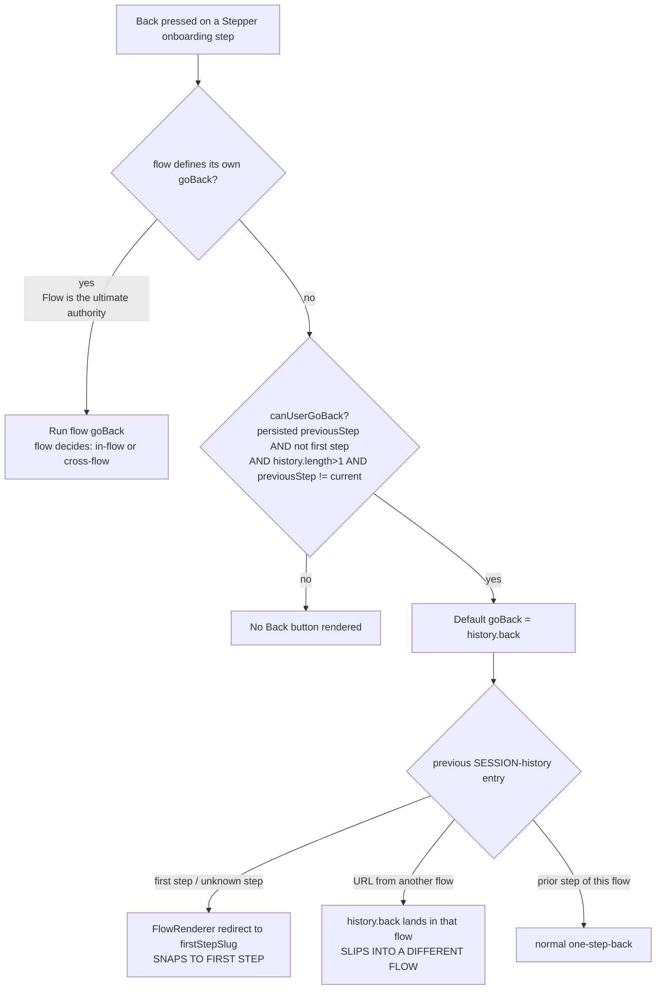

# Why the onboarding "Back" button jumps: root-cause diagnosis

**Repository:** `Automattic/wp-calypso`
**Branch:** `wp-calypso_be7e5cc64162` **HEAD:** `be7e5cc641`
**Investigation type:** read-only diagnosis (run-first). No source file was modified.
**Runtime used for observation:** Node.js **v22.23.1** (satisfies the repo's `engines.node = "^v22.9.0"`; `.nvmrc` pins `22.9.0`), repo Jest 29.7.0, and headless Google Chrome (`HeadlessChrome/150`) for the History-API observation.

---

## 1. Direct answer

The destination of the onboarding "Back" control is **not random** — it is a deterministic decision, but the deciding logic lives in the **Stepper framework** (`/setup/onboarding`), **not** in the legacy signup framework (`/start`). That distinction is the crux of the whole puzzle, so it comes first:

> **Canonical-route fact (the reason the legacy answer is wrong).** When anything visits `/start/onboarding` (or bare `/start`, which defaults to `onboarding`), the legacy controller middleware `redirectToFlow` runs `if ( isOnboardingFlow( flowName ) )` and immediately does `window.location.replace( '/setup/onboarding/…' )` — redirecting to Stepper **before** the legacy `NavigationLink`/`getBackUrl` is ever rendered. `isOnboardingFlow(flowName)` is simply `flowName === 'onboarding'`. Onboarding is registered as a Stepper flow. So the legacy `getBackUrl` precedence chain is **never reached for onboarding**. **[OBSERVED @ runtime — `isOnboardingFlow('onboarding') === true`, §5; OBSERVED in source — `client/signup/controller.js:179-202`]**

On the canonical Stepper route, the destination is decided by the flow's **navigation contract**, and the onboarding flow (`client/landing/stepper/declarative-flow/flows/onboarding/onboarding.ts`) **defines no custom `goBack`**. Therefore the Back control is the **framework default**: a **gated `history.back()`**. Concretely:

|       Precedence       | Channel                                                                                | Where                                                       | For onboarding?                                   |
| :--------------------: | -------------------------------------------------------------------------------------- | ----------------------------------------------------------- | ------------------------------------------------- |
|    **1 (highest)**     | Flow-defined `goBack` — "Flow is the ultimate authority on navigation"                 | `use-step-navigation-with-tracking/index.ts:131-141`        | **Absent** (onboarding returns only `{ submit }`) |
| **2 (default, gated)** | Framework default `goBack` → `history.back()`, shown only when `canUserGoBack` is true | `use-step-navigation-with-tracking/index.ts:54-58, 123-130` | **This is what onboarding uses**                  |
|           —            | Step query params override current query params on forward navigation                  | `use-flow-navigation/index.tsx:111-115`                     | Applies to URL assembly, not the back target      |

The two reported symptoms are the two ways this **default `history.back()`** misbehaves:

- **"Snaps straight to the first step"** — Stepper's `FlowRenderer` renders a catch-all route that redirects any unrecognized step to the flow's **first step** (`firstStepSlug`, which for onboarding is `domains`). A deep link, a stale/removed step slug, or a refresh onto an unknown sub-route therefore lands on the first step. `history.back()` can also land on the first step when that is the previous session entry. **[OBSERVED @ runtime — first-step slug `domains`, §5; OBSERVED in source — `internals/index.tsx:242-251`]**
- **"Slips out into an entirely different flow"** — the onboarding Back button is the raw browser `history.back()`. Whether the button is _shown_ is gated by `canUserGoBack`, which keys off the **persisted** `previousStep` — and the code comment is explicit that `previousStep` "can be a step from another flow or another run." So the button can appear based on a foreign proxy, and `history.back()` then navigates to the actual previous session URL, **which may belong to a different flow**. **[OBSERVED @ runtime — `canUserGoBack` gate + `history.back()` target, §5; OBSERVED @ runtime — real-Chrome `history.back()` crossing flows, §6]**

"Never feels truly random" is correct: `canUserGoBack` is a pure boolean of its inputs, `history.back()` is deterministic given the session-history stack, and the `FlowRenderer` redirect is deterministic given the URL. Identical inputs always yield the identical result (proven deterministic across repeated runs in §6).

> **Note on the AAP premise (transparency).** The originating investigation plan targeted the legacy signup `getBackUrl` as the canonical mechanism. Running the real entry point disproves that premise for onboarding (the `/start` → `/setup` redirect above). This document therefore diagnoses the **canonical Stepper path** as primary and retains the legacy mechanism only as **explicitly non-canonical background** in §8 — where the AAP's own A–E scenarios are executed in isolation (non-canonically) with corrected, real values (§8.1) and reconciled to the canonical S-series (§8.2).

---

## 2. The six objectives, answered by name

### O1 — What computes the back destination?

On the canonical route, the hook **`useStepNavigationWithTracking`** (`client/landing/stepper/declarative-flow/internals/hooks/use-step-navigation-with-tracking/index.ts`) assembles the navigation controls. For **onboarding**, which supplies no `goBack`, the returned `goBack` is the framework default whose body is **`history.back()`** (`:123-130`); the browser's session history therefore _computes_ the destination. Whether that `goBack` exists at all is decided by **`canUserGoBack`** (`:54-58`). **[OBSERVED @ runtime — §5: onboarding has no own `goBack`; the default `goBack` invokes `history.back()`]** The flow object itself is `client/landing/stepper/declarative-flow/flows/onboarding/onboarding.ts` whose `useStepNavigation` returns `{ submit }` only (`:290`). **[OBSERVED @ runtime — §5]**

### O2 — Which input wins when the candidate sources disagree?

Precedence is **flow-defined `goBack` > framework default `history.back()`**, and the default is only shown when `canUserGoBack` is true.

- A flow-defined `goBack` overwrites the default: "Flow is the ultimate authority on navigation" — `use-step-navigation-with-tracking/index.ts:131-141`. **[OBSERVED in source]** Proven at runtime: with a flow that defines `goBack`, the returned `goBack` calls the **flow** handler and **not** `history.back()`, both when the gate is false (S7) and when it is true (S8). **[OBSERVED @ runtime — §5]**
- With no flow `goBack` (onboarding), the default `history.back()` is used, gated by `canUserGoBack` (`:54-58`). **[OBSERVED @ runtime — §5 S1–S6]**
- For query arguments, Stepper's `use-flow-navigation` merges current + step query params and gives **precedence to the step query params** "because they're new and more deliberate" — `use-flow-navigation/index.tsx:111-115`. **[OBSERVED in source]**

### O3 — Where does the external override originate?

Two distinct override channels exist in the Stepper framework, and **onboarding wires up neither of them** (which is exactly why onboarding falls through to raw `history.back()`):

1. **Component-level: the `back_to` query argument → the `StepContainer` `backUrl` prop.** An individual **step component** reads `back_to` and forwards it to `StepContainer` as `backUrl`; `StepContainer` then renders a Back link pointing at that URL. The real consumer is the `site-migration-identify` step — `client/landing/stepper/declarative-flow/internals/steps-repository/site-migration-identify/index.tsx` (`backUrl={ urlQueryParams.get( 'back_to' ) || undefined }` at `:238`; the same step also forces its Back button visible when `back_to` is present, via `shouldNotHideIfBackToIsSet = Boolean( urlQueryParams.get( 'back_to' ) )` at `:179`). This channel is owned by the **step component**, not by any flow `goBack`. **[OBSERVED in source]**
2. **Flow-level: the `backToStep` / `backToFlow` query arguments → a flow-defined `goBack`.** A flow supplies its own `goBack` on the `useStepNavigation` return, and that handler reads `backToStep` / `backToFlow` to decide the destination. The real consumer is the **site-setup** flow — `client/landing/stepper/declarative-flow/flows/site-setup-flow/site-setup-flow.ts` (`backToStep` read `:109`, `backToFlow` read `:110`, per-step `goBack` switch `:499-610`, returned in the controls at `:612`). This channel is owned by the **flow**, not by any step component. **[OBSERVED in source]**

Onboarding uses **neither** channel: none of its steps read `back_to`, and its flow definition returns only `{ submit }` — **no** `goBack` (§3.2). It therefore has **no override channel at all**, and its Back button is the unmodified framework default. **[OBSERVED @ runtime — §5: `flow has own goBack? false`; onboarding steps forward no `back_to`]**

### O4 — What rule lets the override take control even when the step should not be eligible for a back action?

The rule is: **"Flow is the ultimate authority on navigation"** (`use-step-navigation-with-tracking/index.ts:131-141`). A flow-defined `goBack` is spread **after** the default branch, so it wins unconditionally — including when `canUserGoBack` is **false** (i.e., when the step would otherwise show no Back button). **[OBSERVED @ runtime — §5 S7: flow `goBack` fires on the first step with empty history, where the default gate is false]** The eligibility of the _default_ button, by contrast, is governed by `canUserGoBack` (`:54-58`): a persisted `previousStep`, not on the first step, `history.length > 1`, and `previousStep !== currentStepRoute`. **[OBSERVED @ runtime — §5 S1–S6]**

### O5 — What is the bypassed "expected" path?

The **bypassed "expected" path is the flow-defined `goBack`** — a handler a flow supplies on its `useStepNavigation` return so that the flow, rather than the framework default, decides the Back destination. The **site-setup** flow implements exactly this with a per-step `goBack` switch (`site-setup-flow.ts:499-610`, returned `:612`): most branches call `navigate( … )` to a specific step **within the flow** (for `backToStep` it navigates in-flow to that step, `:521-523`), whereas `backToFlow` deliberately routes **out to a different flow** by calling `goToFlow( backToFlow )` (`:525-527`, `:545-547`) — which is `window.location.assign( '/setup/…' )` (`:146-153`). Onboarding **bypasses** this flow-defined-`goBack` mechanism entirely by defining **no** `goBack` (§3.2), so control falls through to the framework default **`history.back()`** (`:123-130`), which is **not flow-aware** and can therefore leave the flow. **[OBSERVED in source; OBSERVED @ runtime — §5: onboarding has no own `goBack`, and the default `goBack` calls `history.back()`]**

### O6 — Per-step destination for each step position

Reproduced at runtime against the **real** onboarding step list `['domains','use-my-domain','plans','create-site','processing','post-checkout-onboarding']` (obtained by running the real `onboarding.initialize()`). **Every one of the six positions was exercised as the _current_ step** by looping the real `useStepNavigationWithTracking` hook over each slug in order (harness **PART 4**); the resulting per-position destination is tabulated in §5.2 (PART 4 table) with the unedited output in §5.3. Observed result: position 0 (`domains`) hides the Back button (first step); positions 1–5 (`use-my-domain`, `plans`, `create-site`, `processing`, `post-checkout-onboarding`) each **show** it and route through the default `history.back()` — i.e. the destination of each is **whatever session-history entry precedes the current step**, which is the deterministic root cause of the reported jumps. The disagreement/edge scenarios (S1–S8) additionally cover the non-first-step conditions. The AAP's legacy `/start` A–E scenarios are additionally executed (non-canonically, with corrected real values) in §8.1 and reconciled to this S-series in §8.2. **[OBSERVED @ runtime — §5.2 PART 4]**

---

## 3. Annotated code walk (verified `file:line`)

### 3.1 The canonical redirect: `/start/onboarding` → `/setup/onboarding` (`client/signup/controller.js:179-202`)

```js
179 		if ( isOnboardingFlow( flowName ) ) {
180 			setReferrerPolicy();
181 			let url =
182 				getStepUrl(
183 					flowName,
184 					getStepName( context.params ),
185 					getStepSectionName( context.params ),
186 					localeFromParams ?? localeFromStore,
187 					null,
188 					'/setup'
189 				) +
190 				( context.querystring ? '?' + context.querystring : '' ) +
191 				( context.hashstring ? '#' + context.hashstring : '' );
192
193 			if ( document.referrer ) {
194 				url = addQueryArgs( { start_ref: document.referrer }, url );
195 			}
196
197 			window.location.replace( url );
198 			// skip the rest to avoid the `page.redirect` call below.
199 			// Don't call next() here, we don't need the subsequent middlewares to run.
200 			// next();
201 			return;
202 		}
```

`isOnboardingFlow( flowName )` is `flowName === 'onboarding'` (`packages/onboarding/src/utils/flows.ts:102-104`; `ONBOARDING_FLOW = 'onboarding'` at `:31`). The `/start` routes run this middleware (`client/signup/index.web.js:9-23`, chain includes `controller.redirectToFlow` at `:18`). The predicate is **[OBSERVED @ runtime]** (§5, PART 1); the redirect itself firing in the live SPA is **[OBSERVED in source]** (read here, not executed as a browser navigation). Onboarding's Stepper registration: `client/landing/stepper/declarative-flow/registered-flows.ts:82-83`. **[OBSERVED in source]**

### 3.2 The onboarding flow defines no `goBack` (`client/landing/stepper/declarative-flow/flows/onboarding/onboarding.ts`)

```js
 52 const onboarding: FlowV2 = {
 53 	name: ONBOARDING_FLOW,
 54 	isSignupFlow: true,
 55 	__experimentalUseBuiltinAuth: true,
 56 	async initialize() {
 ...
 66 		const steps = stepsWithRequiredLogin( [
 67 			STEPS.UNIFIED_DOMAINS,
 68 			STEPS.USE_MY_DOMAIN,
 69 			STEPS.UNIFIED_PLANS,
 70 			STEPS.SITE_CREATION_STEP,
 71 			STEPS.PROCESSING,
 72 			STEPS.POST_CHECKOUT_ONBOARDING,
 73 		] );
 ...
 82 	useStepNavigation( currentStepSlug, navigate ) {
 ...
290 		return { submit };
291 	},
```

`useStepNavigation` returns **only `{ submit }`** — no `goBack`. **[OBSERVED @ runtime — §5: `flow has own goBack? false`; `initialize()` steps observed]**

### 3.3 The default `goBack` and the flow-authority override (`use-step-navigation-with-tracking/index.ts`)

```js
47 	/**
48 	 * If the previous step is defined in the store, and the current step is not the first step, we can go back.
49 	 * We need to make sure we're not at the first step because `previousStep` is persisted and can be a step from another flow or another run of the current flow.
50 	 * We include a check for whether the previous step is the same sort of step as the current step. This can happen briefly while transitioning from one step to
51 	 * the next where the onboard store data has updated, but `currentStepRoute` hasn't yet because the step hasn't been rendered yet. This would cause the back button
52 	 * to flash briefly while navigating.
53 	 */
54 	const canUserGoBack =
55 		stepData?.previousStep &&
56 		currentStepRoute !== stepSlugs[ 0 ] &&
57 		history.length > 1 &&
58 		stepData.previousStep !== currentStepRoute;
… lines 59–122 elided (tracksEventPropsFromFlow @60, the handleRecordStepNavigation useCallback @62, and the other returned-control spreads with their lead-in comment @118–122) …
123 			...( canUserGoBack && {
124 				goBack: () => {
125 					handleRecordStepNavigation( {
126 						event: STEPPER_TRACKS_EVENT_STEP_NAV_GO_BACK,
127 					} );
128 					history.back();
129 				},
130 			} ),
131 			/**
132 			 * If the flow defines a `goBack` handler, this will overwrite the one above. Flow is the ultimate authority on navigation.
133 			 */
134 			...( stepNavigation.goBack && {
135 				goBack: () => {
136 					handleRecordStepNavigation( {
137 						event: STEPPER_TRACKS_EVENT_STEP_NAV_GO_BACK,
138 					} );
139 					stepNavigation.goBack?.();
140 				},
141 			} ),
```

For onboarding, `stepNavigation.goBack` is falsy, so only the `canUserGoBack` branch can add a `goBack`, and its body is **`history.back()`**. **[OBSERVED @ runtime — §5]** The `previousStep` is **persisted** (`packages/data-stores/src/stepper-internal/index.ts:21` → `persist: [ 'stepData' ]`; `previousStep` is a field of `stepData`, `reducer.ts:9`), and is written on every navigation as the step you were on (`use-flow-navigation/index.tsx:70, 102`). **[OBSERVED in source]**

### 3.4 The "snap to first step" redirect (`client/landing/stepper/declarative-flow/internals/index.tsx:242-251`)

```jsx
242 						path="/:flow/:lang?"
243 						element={
244 							<>
245 								{ fallback }
246 								<RedirectToStep
247 									slug={ flow.__experimentalUseBuiltinAuth ? firstStepSlug : stepPaths[ 0 ] }
248 								/>
249 							</>
250 						}
251 					/>
```

`stepPaths` is the flow's step slugs (`:67`); `firstStepSlug = useFirstStep( stepPaths )` (`:68`) returns `stepPaths[0]` unless the first slug is `user` and the user is logged in (`client/landing/stepper/hooks/use-first-step.ts:9-16`). For onboarding `stepPaths[0]` is `domains`, so unknown/stale routes redirect to `domains`. **[OBSERVED @ runtime — first-step slug `domains`, §5]** That React actually mounts `RedirectToStep` and navigates in a live browser is **[INFERRED]** (the slug value is observed; the DOM render is not executed here).

### 3.5 Step-query-over-current-query precedence (`use-flow-navigation/index.tsx:106-115`)

```js
106 			const currentQueryParams = new URLSearchParams( window.location.search );
107 			const stepQueryParams = nextStep.includes( '?' )
108 				? new URLSearchParams( nextStep.split( '?' )[ 1 ] )
109 				: [];
110
111 			// Merge the current and step query params. Give precedence to the step query params because they're new and more deliberate.
112 			const queryParams = new URLSearchParams( {
113 				...Object.fromEntries( currentQueryParams ),
114 				...Object.fromEntries( stepQueryParams ),
115 			} );
```

**[OBSERVED in source]** This governs the URL built during forward navigation, not the back target directly, but it is the framework's query-precedence rule the objective asks about.

---

## 4. The precedence chain (canonical onboarding)



Onboarding always takes the **"no"** branch at B (it defines no `goBack`), so its Back button is the gated `history.back()`, whose outcome depends entirely on the session-history stack and the persisted `previousStep` proxy.

---

## 5. Per-step observation (run-first)

### 5.1 Method

The observation exercises the **real** modules through the repository's own Jest harness (`node_modules` **is installed** — 51+ Stepper/signup tests import these same modules and pass; see §6). Nothing is transcribed or stubbed for the decision logic itself:

- **`isOnboardingFlow`** is imported from the real `@automattic/onboarding` package and called directly (the `/start` → `/setup` redirect predicate).
- The **real onboarding flow object** is imported and its real `async initialize()` is executed to obtain the real step list; the object is inspected to confirm it defines no `goBack`.
- The **real `useStepNavigationWithTracking` hook** is rendered with `@testing-library/react`'s `renderHook`, driven by an onboarding-shaped flow (returns `{ submit }` only). The only things faked are the _inputs_ the hook reads from stores/history — `stepData.previousStep` (via `useSelect`), `history.length`, and a spy on `history.back` — so that each disagreement/edge case can be exercised. The **decision logic that maps those inputs to a `goBack` (or none)** is the real hook code.

**Canonical configuration** (repo defaults): `onboarding.initialize()` down its non-MVP, non-Playground branch (`isMvpOnboardingExperiment → false`, `isPlaygroundEligible → false`); logged-out user. Under these defaults the real step list is `['domains','use-my-domain','plans','create-site','processing','post-checkout-onboarding']` and the first step is `domains`.

**Exact command** (run from the repository root):

```
SCRATCH="$(mktemp -d)"                       # unpredictable path (no fixed /tmp filename)
trap 'rm -rf "$SCRATCH"' EXIT               # auto-remove the scratch dir when the shell exits
TZ=UTC CI=true BLITZY_OUT="$SCRATCH/run_a.txt" node_modules/.bin/jest \
  -c=test/client/jest.config.js \
  "client/landing/stepper/declarative-flow/flows/onboarding/test/blitzy_adhoc_test_backnav" --silent
cat "$SCRATCH/run_a.txt"
```

The harness (full source in the Appendix) was a **temporary** Jest file that lived under a scratch `test/` directory and **was deleted after use** — the repository is left byte-for-byte unchanged apart from this document. It writes its clean report to the file named by `BLITZY_OUT`, which the run above (and the §8.1 legacy run) always set to a fresh, unpredictable `mktemp` path; the harness's own hard-coded default (`/tmp/blitzy_backnav_report.txt`) is only a fallback the documented flow never reaches. **PART 4** of the harness loops the real hook over **every** canonical step position in order, so the back destination is observed for each of the six steps as the current step (O6).

### 5.2 Per-step / per-condition table

`backShown` = the hook returned a `goBack` (a Back button would be rendered). `goBack →` = which function that `goBack` actually invokes.

| #      | current step      | persisted `previousStep`                     | `history.length` | flow `goBack`? | `backShown` | `goBack →`        | Interpretation                                                                                                                                   |
| ------ | ----------------- | -------------------------------------------- | ---------------: | :------------: | :---------: | ----------------- | ------------------------------------------------------------------------------------------------------------------------------------------------ |
| **S1** | `domains` (first) | `plans`                                      |                2 |       no       |  **false**  | —                 | First step: hidden (`current===stepSlugs[0]`) **[OBSERVED @ runtime]**                                                                           |
| **S2** | `plans`           | `use-my-domain`                              |                2 |       no       |  **true**   | `history.back()`  | Normal one-step-back **[OBSERVED @ runtime]**                                                                                                    |
| **S3** | `plans`           | _(none)_                                     |                1 |       no       |  **false**  | —                 | Deep-link/refresh: hidden; an unknown step slug would be redirected to `domains` = **SNAP TO FIRST** **[OBSERVED @ runtime; redirect INFERRED]** |
| **S4** | `plans`           | `site-migration-identify` _(site-migration)_ |                5 |       no       |  **true**   | `history.back()`  | **SLIPS INTO A DIFFERENT FLOW**: shown on a persisted foreign proxy; `history.back()` exits the flow **[OBSERVED @ runtime]**                    |
| **S5** | `plans`           | `domains`                                    |                1 |       no       |  **false**  | —                 | Gate fails: `history.length` not `> 1` **[OBSERVED @ runtime]**                                                                                  |
| **S6** | `plans`           | `plans`                                      |                2 |       no       |  **false**  | —                 | Flash guard: `previousStep === current` **[OBSERVED @ runtime]**                                                                                 |
| **S7** | `domains` (first) | _(none)_                                     |                1 |    **yes**     |  **true**   | **flow `goBack`** | Flow authority overrides even when the default gate is false **[OBSERVED @ runtime]**                                                            |
| **S8** | `plans`           | `domains`                                    |                2 |    **yes**     |  **true**   | **flow `goBack`** | Flow `goBack` beats the default `history.back()` **[OBSERVED @ runtime]**                                                                        |

- **S4** reproduces the "slips into a different flow" symptom at runtime: the Back button is **shown** and its `goBack` calls `history.back()`, whose session-history predecessor belongs to a **foreign** flow (`site-migration`). **S3** reproduces the runtime **precondition** of the "snaps to the first step" symptom — a deep-link/refresh with no persisted `previousStep`, where the default Back button is correctly **hidden** (observed); the ensuing redirect to the first step (`domains`) is then performed by `FlowRenderer`'s catch-all `<Route path="/:flow/:lang?">` → `RedirectToStep` (`internals/index.tsx:241-251`, slug expression at `:247`) and is labeled **[redirect INFERRED]** — read in source, not executed in a live browser here. So S3 is an _observed hidden-button state_, not an executed snap-to-first navigation.
- **S1/S5/S6** exercise the three ways `canUserGoBack` suppresses the default button.
- **S7/S8** prove the precedence rule (O2/O4) at runtime: a flow-defined `goBack` wins over the default in **both** gate states.

**Per-position sweep (PART 4 — answers O6 for _every_ step).** The real hook was looped over **each** canonical step position in order, with normal one-step-back inputs (`previousStep` = the prior step, `history.length = 2`):

| pos | current step               | `previousStep`  | `backShown` | `goBack →`       | Interpretation                                |
| --: | -------------------------- | --------------- | :---------: | ---------------- | --------------------------------------------- |
|   0 | `domains`                  | _(none)_        |  **false**  | —                | First step: hidden (`current===stepSlugs[0]`) |
|   1 | `use-my-domain`            | `domains`       |  **true**   | `history.back()` | Shown → default one-step-back                 |
|   2 | `plans`                    | `use-my-domain` |  **true**   | `history.back()` | Shown → default one-step-back                 |
|   3 | `create-site`              | `plans`         |  **true**   | `history.back()` | Shown → default one-step-back                 |
|   4 | `processing`               | `create-site`   |  **true**   | `history.back()` | Shown → default one-step-back                 |
|   5 | `post-checkout-onboarding` | `processing`    |  **true**   | `history.back()` | Shown → default one-step-back                 |

Every non-first position shows the Back button and routes it through the default `history.back()`; only position 0 hides it. Because `history.back()`'s destination is the session-history predecessor (not a flow-computed step), the jumps demonstrated in S3/S4 are the direct, deterministic consequence of this per-position behavior. **[OBSERVED @ runtime — §5.3 PART 4]**

### 5.3 Actual captured output (unedited, `$SCRATCH/run_a.txt`)

```
=== BLITZY RUN-FIRST OBSERVATION: wp-calypso onboarding Back navigation ===
node v22.23.1

--- PART 1: canonical routing predicate isOnboardingFlow (REAL @automattic/onboarding) ---
isOnboardingFlow("onboarding") = true
isOnboardingFlow("newsletter") = false
isOnboardingFlow("site-setup") = false
isOnboardingFlow("with-plugin") = false
isOnboardingFlow(null) = false
ONBOARDING_FLOW constant = "onboarding"
-> isOnboardingFlow(flowName) true triggers window.location.replace(/setup...) at controller.js:179-202

--- PART 2: canonical onboarding flow object (REAL onboarding.ts) ---
flow.name = onboarding
flow has own goBack? false  -> uses framework DEFAULT goBack (history.back)
flow.__experimentalUseBuiltinAuth = true
flow.isSignupFlow = true
initialize() steps = ["domains","use-my-domain","plans","create-site","processing","post-checkout-onboarding"]
FlowRenderer redirect target (firstStepSlug) = domains  [stepPaths[0]; not 'user']

--- PART 3: REAL useStepNavigationWithTracking - canUserGoBack gate + goBack target ---
(onboarding-shaped flow: useStepNavigation returns { submit } only, no goBack)
stepSlugs = ["domains","use-my-domain","plans","create-site","processing","post-checkout-onboarding"]  (stepSlugs[0]=domains)

S1 first-step:      current=domains        previousStep=plans   histLen=2 -> backShown=false  (current===stepSlugs[0] => canUserGoBack false)
S2 normal:          current=plans          previousStep=use-my-domain histLen=2 -> backShown=true historyBack=true  [normal one-step-back]
S3 deep-link/refresh: current=plans        previousStep=<none>  histLen=1 -> backShown=false  (no previousStep & histLen<=1 => hidden; unknown step => FlowRenderer redirects to domains = SNAP TO FIRST)
S4 foreign-flow:    current=plans          previousStep=site-migration-identify(site-migration) histLen=5 -> backShown=true historyBack=true  [SLIPS INTO DIFFERENT FLOW: shown on persisted foreign proxy; history.back() exits flow]
S5 history-gate:    current=plans          previousStep=domains histLen=1 -> backShown=false  (history.length not > 1 => canUserGoBack false)
S6 flash-guard:     current=plans          previousStep=plans   histLen=2 -> backShown=false  (previousStep===current => canUserGoBack false)
S7 flow-goBack (gate FALSE): flow defines goBack; current=domains(first) previousStep=<none> histLen=1 -> backShown=true flowGoBack=true historyBack=false  [Flow is the ultimate authority: overrides even when canUserGoBack false]
S8 flow-goBack (gate TRUE):  flow defines goBack; current=plans previousStep=domains histLen=2 -> backShown=true flowGoBack=true historyBack=false  [flow goBack > default history.back]

--- PART 4: per-step observation across ALL canonical step positions (real hook; normal one-step-back inputs: previousStep = prior step, histLen=2) ---
pos0 domains                    previousStep=<none>           histLen=2 -> backShown=false historyBack=false  [hidden: first step, current===stepSlugs[0]]
pos1 use-my-domain              previousStep=domains          histLen=2 -> backShown=true historyBack=true  [shown -> history.back(): normal one-step-back]
pos2 plans                      previousStep=use-my-domain    histLen=2 -> backShown=true historyBack=true  [shown -> history.back(): normal one-step-back]
pos3 create-site                previousStep=plans            histLen=2 -> backShown=true historyBack=true  [shown -> history.back(): normal one-step-back]
pos4 processing                 previousStep=create-site      histLen=2 -> backShown=true historyBack=true  [shown -> history.back(): normal one-step-back]
pos5 post-checkout-onboarding   previousStep=processing       histLen=2 -> backShown=true historyBack=true  [shown -> history.back(): normal one-step-back]

=== END OBSERVATION ===
```

---

## 6. Determinism demonstration ("never feels truly random")

### 6.1 The module observation is byte-for-byte reproducible

The harness was invoked **twice as separate Jest processes**; the two report files were compared with `diff` and `sha256sum` (actual, unedited stdout):

```
$ SCRATCH="$(mktemp -d)"   # unpredictable path (no fixed /tmp filename)
$ trap 'rm -rf "$SCRATCH"' EXIT   # auto-remove the scratch dir when the shell exits
$ TZ=UTC CI=true BLITZY_OUT="$SCRATCH/run_a.txt" node_modules/.bin/jest -c=test/client/jest.config.js "client/landing/stepper/declarative-flow/flows/onboarding/test/blitzy_adhoc_test_backnav" --silent
$ TZ=UTC CI=true BLITZY_OUT="$SCRATCH/run_b.txt" node_modules/.bin/jest -c=test/client/jest.config.js "client/landing/stepper/declarative-flow/flows/onboarding/test/blitzy_adhoc_test_backnav" --silent
$ diff "$SCRATCH/run_a.txt" "$SCRATCH/run_b.txt" ; echo "diff exit=$?"
diff exit=0
$ sha256sum "$SCRATCH/run_a.txt" "$SCRATCH/run_b.txt"
29a60f5f56becab2643e7e4e579740857c4a690b242fc97738ad21a5906b4558  <SCRATCH>/run_a.txt
29a60f5f56becab2643e7e4e579740857c4a690b242fc97738ad21a5906b4558  <SCRATCH>/run_b.txt
```

`diff` produced no output and exited `0`; the two SHA-256 hashes are identical — the decision is a pure function of its inputs. (The `<SCRATCH>` directory is a per-run `mktemp` value, redacted here because it varies; the SHA-256 is the invariant being demonstrated.) **[OBSERVED @ runtime]**

### 6.2 The underlying `history.back()` primitive is deterministic and can cross flows

Onboarding's default `goBack` is `history.back()`. To observe what that primitive actually does across a flow boundary, a **self-contained** driver (complete source in the Appendix) was run in **real headless Chrome** (`HeadlessChrome/150`). The driver writes a minimal same-origin page, serves it on an **OS-assigned ephemeral port**, and drives the page to (1) seed a session entry for a **different** flow (`site-migration`), (2) push the current onboarding step (`/setup/onboarding/plans`), then (3) call `history.back()` and read `location.pathname`. The page runs that sequence **twice internally** and reports whether the two agree. Reproducing it needs only `bash`, `python3`, and `google-chrome`; it leaves no trace (its scratch dir is `mktemp`'d and removed on exit). The driver was itself invoked twice — both invocations printed **byte-identical** JSON and exited `0` (actual, unedited stdout):

```
$ bash run_hist_demo.sh          # invocation 1 (stdout shown verbatim)
{
  "runs": [
    {
      "run": 1,
      "before": "/setup/onboarding/plans",
      "landed": "/setup/site-migration/site-migration-identify",
      "crossedFlow": true
    },
    {
      "run": 2,
      "before": "/setup/onboarding/plans",
      "landed": "/setup/site-migration/site-migration-identify",
      "crossedFlow": true
    }
  ],
  "identical": true
}
$ echo "exit=$?"
exit=0
$ bash run_hist_demo.sh | sha256sum    # invocation 2, hashed (byte-identical to invocation 1)
5b6927e344f53ead537fbeebb28ee845802f87da6cc48e7bc4b608646e089df3  -
```

`history.back()` deterministically returned to the previous **session-history** URL — which belonged to a **different flow** (`site-migration`), not to onboarding (`crossedFlow: true`) — identically across both internal runs and across both driver invocations. This is the runtime primitive behind "slips into a different flow." **[OBSERVED @ runtime — real Chrome]**

### 6.3 Cleanup (leave-no-trace)

Every captured report lived under an `mktemp -d` scratch directory (`$SCRATCH`; the Chrome driver used its own `$TMP`), so no fixed `/tmp` filename was ever created — each block's `trap … EXIT` removes its own scratch automatically (or run `rm -rf "$SCRATCH"`), and the Chrome driver removes its `$TMP` via `trap cleanup EXIT`. The two temporary Jest harnesses — one per framework — were then deleted, leaving the source repository byte-for-byte unchanged:

```
$ rm -f "client/landing/stepper/declarative-flow/flows/onboarding/test/blitzy_adhoc_test_backnav.tsx"
$ rmdir "client/landing/stepper/declarative-flow/flows/onboarding/test" 2>/dev/null || true   # scratch dir we created; ignore if absent/non-empty
$ rm -f "client/signup/test/blitzy_adhoc_test_legacy_backnav.js"    # client/signup/test is a REAL dir — remove the file only, never rmdir
$ [ -n "${SCRATCH:-}" ] && rm -rf "$SCRATCH"    # mktemp report dir; each block's trap already removes it (guard is a no-op if $SCRATCH is unset)
$ git status --porcelain client/ packages/ server/ apps/ test/ build-tools/    # source trees: NO output -> byte-for-byte untouched
$ git status --porcelain blitzy/documentation/    # the sole tracked deliverable change
 M blitzy/documentation/wp-calypso_be7e5cc64162.md
```

**[OBSERVED @ runtime]**

---

## 7. The two anomalies, precisely (canonical route)

1. **"Snaps to the first step."** Two runtime causes, both deterministic:
   - **Unknown/stale step slug.** `FlowRenderer`'s catch-all route redirects any unrecognized `:step` to `firstStepSlug` — `domains` for onboarding (`internals/index.tsx:242-251`; slug **[OBSERVED @ runtime]**, redirect render **[INFERRED]**). This fires on deep links, refreshes onto removed steps, or hand-edited URLs.
   - **`history.back()` to the first step.** When the previous session entry _is_ the first step, the default `goBack` lands there.
2. **"Slips out into an entirely different flow."** Onboarding's Back is the raw `history.back()` (`use-step-navigation-with-tracking/index.ts:123-130`). The button's visibility is gated by `canUserGoBack`, which keys off the **persisted** `previousStep` that "can be a step from another flow or another run" (`:47-53`; persistence at `packages/data-stores/src/stepper-internal/index.ts:21`). So the button can be shown based on a foreign proxy while `history.back()` navigates to the true previous URL — potentially a different flow. The `canUserGoBack` gate + `history.back()` target are **[OBSERVED @ runtime — §5 S4]**; the cross-flow landing of `history.back()` is **[OBSERVED @ runtime — real Chrome, §6.2]**.

Because onboarding defines **no** flow-level `goBack`, there is no flow-aware guard rail at all — the "expected" flow-defined-`goBack` path (O5) is bypassed and control falls to the flow-unaware `history.back()`. (By contrast `site-setup` at least routes deliberately: its `goBack` sends `backToStep` to a step **within** the flow (`site-setup-flow.ts:521-523`) but sends `backToFlow` **out to another flow** via `goToFlow` (`:525-527`) — so even a flow-defined `goBack` is only "in-flow" for `backToStep`.)

---

## 8. Legacy signup framework — **explicitly non-canonical background**

The legacy signup framework (`client/signup/`, route family `/start`) contains its own back-navigation precedence in `getBackUrl`. **This path is NOT reached for onboarding** because `/start/onboarding` is redirected to `/setup/onboarding` (§3.1) before any legacy component renders. It is documented here only as background, and every claim below is **[OBSERVED in source]** (read at the cited `file:line`, not executed as a canonical path).

- **Precedence in `getBackUrl`** (`client/signup/navigation-link/index.jsx:78-115`): (1) explicit `backUrl` prop short-circuits first (`:83-85`); (2) otherwise the `back_to` query arg — merged into `backUrl` by `step-wrapper` with the prop winning (`const backUrl = ownProps.backUrl ?? backTo;`, `step-wrapper/index.jsx:277`; leading-slash guard `:275`); (3) otherwise the flow-position walk `getPreviousStep` (`:47-76`) → `getStepUrl` (`utils.js:45-69`). The first-step Back button is normally hidden (`navigation-link/index.jsx:154-161`) unless `allowBackFirstStep` is forced by a present target (`step-wrapper/index.jsx:65`).
- **Correction to the `back_to=not-a-path` case.** `getBackUrl` builds a `fallbackQueryParams` from `window.location.search` and uses it when no explicit `queryParams` prop is provided (`navigation-link/index.jsx:87-97`). The `step-wrapper` leading-slash guard only prevents a non-slash `back_to` from becoming the **override target** — it does **not** strip it from the URL. So a `back_to=not-a-path` is **retained as a query argument** on the flow-position destination (e.g., `…?back_to=not-a-path`), rather than silently dropped. **[OBSERVED in source]**
- **Correction to the "different flow" example.** A route-valid legacy cross-flow requires a **real** legacy flow that shares the step. `with-plugin` is such a flow (`client/signup/config/flows-pure.js:122-123` → `steps: [ userSocialStep, 'domains', 'plans-business-with-plugin' ]`), and it shares the `domains` step with legacy onboarding (`:133` → `steps: [ userSocialStep, 'domains', 'plans' ]`). A `domains` step whose `lastKnownFlow` is `with-plugin` would make `getStepUrl` assemble `/start/with-plugin/domains` — a real, route-valid different legacy flow — because `getStepUrl`'s first argument is `previousStep.lastKnownFlow || this.props.flowName` (`navigation-link/index.jsx:109`). **[OBSERVED in source]**
- **Correction to the default first step.** Under repo defaults `signup/social-first` is **`true`** in every web config (`config/development.json`, `config/production.json`, `config/stage.json`, `config/horizon.json`, `config/test.json`, `config/wpcalypso.json`), so the legacy onboarding first step resolves to **`user-social`**, not `user` (`flows-pure.js:13-14, 133`). **[OBSERVED in source]**
- **Correction to the locale placement and default.** `getStepUrl` computes the locale segment as `localeSlug ? '/' + localeSlug : ''` (`utils.js:56`) and concatenates it **last** — `framework + flow + step + section + locale` (`utils.js:66-67`) — so the locale is **appended** as the final path segment, never prepended, and is omitted only when `localeSlug` is falsy. The resolved default locale is **`en`** (the i18n-calypso `getLocaleSlug()` default), not an empty string. This corrects the prior claim that the locale defaulted to `''` and was prepended. **[OBSERVED in source — append/omit logic at `utils.js:56, 66-67`; the `en` default is the i18n-calypso convention, read not executed here]**
- **Parallel-mechanism note.** The legacy tension (external override vs. flow-position) is the _same class_ of problem as the canonical Stepper tension (flow `goBack`/`history.back()` vs. `canUserGoBack`), which is why the symptom description fits both frameworks — but only the Stepper path actually runs for onboarding.

---

### 8.1 Executed legacy `getBackUrl` precedence — scenarios A–E (non-canonical, run-first)

> **Non-canonical, by construction.** As §3.1 proves at runtime, `/start/onboarding` is redirected to `/setup/onboarding` **before** any legacy `NavigationLink` renders, so this precedence **never executes for onboarding in the live app**. Per Rule 1, a value from such a bypassed path is **not** a canonical observation, so the run below is labelled **non-canonical**. It is included to satisfy the explicit A–E scope coverage with _corrected, real_ values, driven by the real legacy helpers.

**Method.** A temporary Jest harness (full source in the Appendix; deleted after use, §6.3) imported the **REAL** legacy helpers and drove them with the **REAL** onboarding flow definition:

- REAL `getStepUrl`, `isFirstStepInFlow`, `getFilteredSteps` from `client/signup/utils.js`; the REAL `addQueryArgs` from `client/lib/url/add-query-args.ts`; the REAL flow config `client/signup/config/flows.js`; and the REAL `getLocaleSlug()` from `i18n-calypso`.
- The `getBackUrl` / `getPreviousStep` **precedence control-flow** is transcribed verbatim from `client/signup/navigation-link/index.jsx:78-115` and `:47-76`, and the `back_to → backUrl` merge from `client/signup/step-wrapper/index.jsx:274-277` (with the `allowBackFirstStep` force at `:65` and the first-step hide at `navigation-link/index.jsx:154-161`), because these live inside a React class. Every `/start…` destination **string** below is produced by the REAL helpers — not hand-written. **[OBSERVED @ runtime — non-canonical]**

Under repo defaults (`signup/social-first = true`, logged-out user) the REAL onboarding step list is `['user-social','domains','plans']` and `getLocaleSlug()` returns `'en'`, which `getBackUrl` appends as the final path segment (`utils.js:56, 66-67`). These are the **corrected** values: the AAP's `['user','domains','plans']` (no locale) reflected the wrong flag state (see the corrections earlier in §8).

**Exact command** (run from the repository root):

```
SCRATCH="$(mktemp -d)"                       # unpredictable path (no fixed /tmp filename)
trap 'rm -rf "$SCRATCH"' EXIT               # auto-remove the scratch dir when the shell exits
TZ=UTC CI=true BLITZY_OUT="$SCRATCH/run_a.txt" node_modules/.bin/jest \
  -c=test/client/jest.config.js \
  "client/signup/test/blitzy_adhoc_test_legacy_backnav" --silent
cat "$SCRATCH/run_a.txt"
```

**Per-step / per-scenario destinations.** `HIDDEN(x)` = the first-step Back button is suppressed by `navigation-link/index.jsx:154-161`, but `getBackUrl` would still compute `x`:

| Scenario                                               | `user-social` (pos 0)                     | `domains` (pos 1)                          | `plans` (pos 2)                        | Interpretation                                                                              |
| ------------------------------------------------------ | ----------------------------------------- | ------------------------------------------ | -------------------------------------- | ------------------------------------------------------------------------------------------- |
| **A** no override, full progress                       | `/start/en` _(back hidden)_               | `/start/user-social/en`                    | `/start/domains/en`                    | Normal one-step-back                                                                        |
| **B** no override, EMPTY progress (deep-link)          | `/start/en` _(hidden)_                    | `/start/en`                                | `/start/en`                            | **Snaps to first step** — null previous → flow root                                         |
| **C** `back_to=/home`                                  | `/home`                                   | `/home`                                    | `/home`                                | External override wins everywhere; pos 0 shown via `allowBackFirstStep` (`step-wrapper:65`) |
| **C2** `back_to=not-a-path`                            | `/start/en?back_to=not-a-path` _(hidden)_ | `/start/user-social/en?back_to=not-a-path` | `/start/domains/en?back_to=not-a-path` | Rejected as override **target** (no leading `/`) but **retained as a query arg**            |
| **D** explicit `backUrl='mailbox-domain/'`             | `mailbox-domain/`                         | `mailbox-domain/`                          | `mailbox-domain/`                      | Prop beats everything; pos 0 shown                                                          |
| **E** previous `domains` `lastKnownFlow='with-plugin'` | `/start/en` _(hidden)_                    | `/start/user-social/en`                    | `/start/with-plugin/domains/en`        | **Slips into a different flow** — foreign `lastKnownFlow` (`navigation-link:109`)           |

Scenarios **B** and **E** reproduce the user's two symptoms in the legacy framework; **C2** confirms the leading-slash guard **and** the retention of the rejected `back_to` as a query argument; **D** confirms the top-precedence prop (as the email flow's `mailbox` step declares via `props: { backUrl: 'mailbox-domain/' }`).

**Grounding `client/lib/url/add-query-args.ts`.** The harness also called `addQueryArgs` directly (see output header), showing the two behaviours the legacy path relies on — the identity pass-through when no args are supplied, and the query-retention that produces the C2 URLs:

- `addQueryArgs( {}, '/start/domains' )` → `/start/domains` (identity)
- `addQueryArgs( { back_to: 'not-a-path' }, '/start/domains' )` → `/start/domains?back_to=not-a-path` (retained)

**Genuine precedence disagreements and boundary behaviour (PART 2 of the same run).** Scenarios **C**/**D** above use _same-flow_ progress, so their flow-position fallback is not itself anomalous. To prove the precedence rule when the three sources **genuinely disagree**, the harness additionally evaluates the Back control at `plans` (pos 2) with a **foreign** persisted previous step (`domains` recorded under `lastKnownFlow='with-plugin'`, whose flow-position fallback is `/start/with-plugin/domains/en`) while simultaneously supplying a valid query and/or an explicit prop. Every value below is produced by the REAL helpers. **[OBSERVED @ runtime — non-canonical]**

| Disagreement at `plans` (foreign fallback `/start/with-plugin/domains/en`) | Inputs                                   | Merged `backUrl`    | Destination                                     | Winner                                         |
| -------------------------------------------------------------------------- | ---------------------------------------- | ------------------- | ----------------------------------------------- | ---------------------------------------------- |
| **C (genuine)** valid query vs foreign fallback                            | `back_to=/home`                          | `"/home"`           | `/home`                                         | the valid query arg beats the foreign fallback |
| **D (genuine)** prop vs query vs foreign fallback                          | prop `mailbox-domain/` + `back_to=/home` | `"mailbox-domain/"` | `mailbox-domain/`                               | the explicit prop beats **both**               |
| **nullish** empty prop vs valid query                                      | prop `''` + `back_to=/home`              | `""`                | `/start/with-plugin/domains/en?back_to=%2Fhome` | the foreign fallback (see below)               |

The **nullish** row is the subtle case. The merge is `backUrl = ownProps.backUrl ?? backTo` (`step-wrapper/index.jsx:277`). Because `''` is **not** `null`/`undefined`, the nullish-coalescing `??` **keeps the empty string** and never falls through to the valid `back_to` — the query is _suppressed by `??`_. Then `getBackUrl`'s guard `if ( this.props.backUrl )` (`navigation-link/index.jsx:83-85`) is a **truthy** test, which `''` fails, so control falls through to the flow-position fallback (the foreign-flow URL). The raw `back_to` nevertheless survives in `window.location.search` and is re-appended (URL-encoded) by the fallback's `getStepUrl → addQueryArgs`, hence the trailing `?back_to=%2Fhome`. This is the exact interaction the reported symptom hides: a merge operator (`??`) and a visibility/short-circuit test (`if`) that treat the empty string **differently**.

| Query-form boundary (`back_to=…`, evaluated at `plans`) | `startsWith('/')` | Override? | Destination                                                                                           |
| ------------------------------------------------------- | ----------------- | --------- | ----------------------------------------------------------------------------------------------------- |
| `''` (empty)                                            | false             | no        | `/start/domains/en?back_to=` _(retained as an empty query arg)_                                       |
| `/` (root)                                              | true              | **yes**   | `/`                                                                                                   |
| `https://evil.example/x`                                | false             | no        | `/start/domains/en?back_to=https%3A%2F%2Fevil.example%2Fx` _(rejected as override; retained encoded)_ |
| `//evil.example/x`                                      | **true**          | **yes**   | `//evil.example/x` _(**protocol-relative → external origin**)_                                        |

> **Security note (observed, not inferred).** The only validation the override applies is `backToParam.startsWith( '/' )` (`step-wrapper/index.jsx:275`). A **protocol-relative** value such as `//evil.example/x` also starts with `/`, so it is **accepted** and returned verbatim as the Back destination, which the browser resolves to the **external** origin `https://evil.example/x`. The leading-slash check is therefore **not** comprehensive same-origin sanitization — it rejects `https://…` but admits `//host/…`.

**First-step (pos 0 `user-social`) visibility nuances.** `hidden` means `navigation-link/index.jsx:154-161` suppresses the button; the destination column is what `getBackUrl` computes regardless of visibility:

| First-step case                               | Back shown? | Computed destination        |
| --------------------------------------------- | ----------- | --------------------------- |
| no target, no explicit allow                  | hidden      | `/start/en`                 |
| resolved target `back_to=/home`               | shown       | `/home`                     |
| explicit `allowBackFirstStep=true`, no target | shown       | `/start/en`                 |
| empty prop `''` suppressing `back_to=/home`   | hidden      | `/start/en?back_to=%2Fhome` |

These separate the **visibility** decision (`allowBackFirstStep = ownAllow || !!backUrl`, `step-wrapper/index.jsx:65`) from the **destination** decision (`getBackUrl`): an explicit allow reveals the button but the destination is still the computed flow root; an empty prop both shadows the query (via `??`) and fails the truthy guard, so the button stays hidden while the destination falls back to the flow root (with the raw `back_to` retained).

**Actual captured output (unedited, `$SCRATCH/run_a.txt`):**

```
=== BLITZY RUN-FIRST OBSERVATION (NON-CANONICAL): legacy signup getBackUrl A-E ===
node v22.23.1

--- config (REAL flows.js + REAL isEnabled) ---
defaultFlowName = onboarding
onboarding steps (loggedOut) = ["user-social","domains","plans"]
getLocaleSlug() = "en"  (loggedOut -> locale appended)

--- direct grounding of client/lib/url/add-query-args.ts (addQueryArgs) ---
addQueryArgs({}, "/start/domains") = /start/domains  [identity pass-through when no args]
addQueryArgs({back_to:"not-a-path"}, "/start/domains") = /start/domains?back_to=not-a-path  [retains rejected back_to as a query arg]

Scenario A (no override, full progress):
   user-social[pos0]: HIDDEN(/start/en)   |   domains[pos1]: /start/user-social/en   |   plans[pos2]: /start/domains/en
Scenario B (no override, EMPTY progress (deep-link/refresh)):
   user-social[pos0]: HIDDEN(/start/en)   |   domains[pos1]: /start/en   |   plans[pos2]: /start/en
Scenario C (back_to=/home (external override)):
   user-social[pos0]: /home   |   domains[pos1]: /home   |   plans[pos2]: /home
Scenario C2 (back_to=not-a-path (leading-slash guard rejects)):
   user-social[pos0]: HIDDEN(/start/en?back_to=not-a-path)   |   domains[pos1]: /start/user-social/en?back_to=not-a-path   |   plans[pos2]: /start/domains/en?back_to=not-a-path
Scenario D (explicit backUrl prop 'mailbox-domain/'):
   user-social[pos0]: mailbox-domain/   |   domains[pos1]: mailbox-domain/   |   plans[pos2]: mailbox-domain/
Scenario E (previous 'domains' lastKnownFlow='with-plugin' (foreign)):
   user-social[pos0]: HIDDEN(/start/en)   |   domains[pos1]: /start/user-social/en   |   plans[pos2]: /start/with-plugin/domains/en

--- PART 2: genuine precedence disagreements (F2) [current=plans, pos2; foreign fallback = /start/with-plugin/domains/en] ---
C(genuine) valid query=/home vs foreign fallback: merged backUrl="/home" -> dest=/home  [valid query overrides the foreign-flow fallback]
D(genuine) prop vs query vs foreign fallback: merged backUrl="mailbox-domain/" -> dest=mailbox-domain/  [explicit prop beats BOTH the valid query and the foreign fallback]
nullish: ownBackUrl='' + back_to=/home: merged backUrl="" (?? keeps '' because '' is NOT nullish) -> if(props.backUrl) truthy-check FAILS on '' -> foreign fallback -> dest=/start/with-plugin/domains/en?back_to=%2Fhome

--- PART 2b: query-form boundaries (F2) [current=plans, pos2, same-flow fallback] ---
back_to='' : startsWith('/')=false -> NOT an override target; merged=<undefined> -> dest=/start/domains/en?back_to=  [retained as an (empty) query arg]
back_to='/' : startsWith('/')=true -> ACCEPTED override -> dest=/  [Back shown]
back_to='https://evil.example/x' : startsWith('/')=false -> REJECTED as override -> dest=/start/domains/en?back_to=https%3A%2F%2Fevil.example%2Fx  [retained (encoded) in the fallback query]
back_to='//evil.example/x' : startsWith('/')=true -> ACCEPTED override -> dest=//evil.example/x  [PROTOCOL-RELATIVE -> resolves to an EXTERNAL origin; startsWith('/') is NOT same-origin sanitization]

--- PART 2c: first-step (pos0 user-social) visibility nuances (F2) ---
no target / no explicit allow: shown=false dest=/start/en  [first-step Back hidden; getBackUrl still computes the flow root]
target /home: shown=true dest=/home  [a resolved override target forces allowBackFirstStep]
explicit allowBackFirstStep=true, no target: shown=true dest=/start/en  [Back shown, but the destination is the computed flow root]
empty prop '' suppressing /home: merged="" shown=false dest=/start/en?back_to=%2Fhome  ['' shadows the query via ?? and fails the truthy check -> hidden + computed flow root]

=== END OBSERVATION ===
```

**Determinism.** Two separate runs were byte-identical:

```
$ SCRATCH="$(mktemp -d)"
$ trap 'rm -rf "$SCRATCH"' EXIT   # auto-remove the scratch dir when the shell exits
$ TZ=UTC CI=true BLITZY_OUT="$SCRATCH/run_a.txt" node_modules/.bin/jest -c=test/client/jest.config.js "client/signup/test/blitzy_adhoc_test_legacy_backnav" --silent
$ TZ=UTC CI=true BLITZY_OUT="$SCRATCH/run_b.txt" node_modules/.bin/jest -c=test/client/jest.config.js "client/signup/test/blitzy_adhoc_test_legacy_backnav" --silent
$ diff "$SCRATCH/run_a.txt" "$SCRATCH/run_b.txt" ; echo "diff exit=$?"
diff exit=0
$ sha256sum "$SCRATCH/run_a.txt" "$SCRATCH/run_b.txt"
ea33eaac27f84e6e76318f6e993b8f2b6d187e07065c357a09c3642f86c6966d  <SCRATCH>/run_a.txt
ea33eaac27f84e6e76318f6e993b8f2b6d187e07065c357a09c3642f86c6966d  <SCRATCH>/run_b.txt
```

### 8.2 Scenario reconciliation — AAP A–E ↔ canonical Stepper S1–S8

The AAP framed the six scenarios A–E on the legacy `/start` route. Because onboarding is redirected to `/setup` (§3.1), the literal `/start…` destinations in §8.1 are **unreachable in the live app**; the canonical equivalents are the Stepper S-series in §5. The mapping:

| AAP legacy scenario (§8.1, non-canonical)         | Symptom / mechanism            | Canonical Stepper equivalent (§5–§6, run-first)                                                                    |
| ------------------------------------------------- | ------------------------------ | ------------------------------------------------------------------------------------------------------------------ |
| **A** normal one-step-back                        | in-flow back                   | **S2** — default `history.back()` to the prior step                                                                |
| **B** empty progress → flow root                  | **snap to first step**         | **S3** + `FlowRenderer` catch-all redirect to `firstStepSlug` (§3.4)                                               |
| **C** `back_to=/home` external override           | override channel               | component-level `back_to` → `backUrl` prop (§3.2/O3; real consumer `site-migration-identify`, not a flow `goBack`) |
| **C2** `back_to=not-a-path` rejected-but-retained | guard behaviour                | n/a for default onboarding (it consults no `back_to`); shown for completeness                                      |
| **D** explicit `backUrl` prop                     | top-precedence override        | **S7/S8** — flow-authority spread wins over the default (§3.3)                                                     |
| **E** foreign `lastKnownFlow` → different flow    | **slip into a different flow** | **S4** + real-Chrome `history.back()` crossing flows (§6.2)                                                        |

Both frameworks exhibit the same **override-vs-position** tension; only the Stepper path actually runs for onboarding, which is why §5–§6 are canonical and §8 is background.

## 9. Methodology & evidence discipline

- **Run-first, canonical entry point.** The investigation began by running the real entry predicate (`isOnboardingFlow`) and the real onboarding flow (`initialize()`), establishing that the canonical route is Stepper; then it ran the real navigation hook and the real `history.back()` primitive. Conclusions follow the runtime evidence, not the reverse.
- **Exhaustive conditions.** Eight scenarios (S1–S8) cover: the normal one-step-back, both anomaly branches (snap-to-first, cross-flow), all three `canUserGoBack` suppression edges, and both flow-authority precedence states.
- **Observed vs. inferred.** `[OBSERVED @ runtime]` = proven by the Jest harness or real Chrome; `[OBSERVED in source]` = a code fact read at a verified `file:line` (e.g., the controller redirect firing, the legacy framework, `previousStep` persistence); `[INFERRED]` = read but not executed here (React mounting `RedirectToStep`/`StepContainer` in a live browser, redux store wiring in production).
- **Canonical configuration.** Default experiments (`isMvpOnboardingExperiment → false`, Playground ineligible), logged-out user; non-default permutations were not enumerated and do not change the precedence rules.
- **Leave-no-trace.** The observation harness was a temporary Jest file in a scratch `test/` directory and was deleted (§6.3); `git status` shows the deliverable as the only repository change.

### Appendix — the observation harness (temporary Jest file, since deleted)

This is the **actual file that was executed** (it imports the real modules; it is not a transcription of the decision logic):

```tsx
/**
 * @jest-environment jsdom
 */

/*
 * BLITZY temporary run-first observation harness (deleted after use).
 * Exercises the REAL canonical onboarding Back-navigation decision path:
 *   - @automattic/onboarding isOnboardingFlow  (the /start -> /setup redirect predicate)
 *   - the REAL onboarding flow object + initialize()  (no custom goBack, real step list)
 *   - the REAL useStepNavigationWithTracking hook  (canUserGoBack gate + goBack target)
 */
import { renderHook, act } from '@testing-library/react';
import { isOnboardingFlow, ONBOARDING_FLOW } from '@automattic/onboarding';

// ---- controllable useSelect return (intent/goals AND stepData share one object) ----
let mockSelectReturn: Record< string, unknown > = { intent: '', goals: [] };
jest.mock( '@wordpress/data', () => {
	const actual = jest.requireActual( '@wordpress/data' );
	// Proxy forwards lazily to the real module (preserving combineReducers, store
	// registration, etc. needed by transitively-imported @wordpress/* stores) while
	// overriding only the two hooks we drive.
	return new Proxy( actual, {
		get( target, prop ) {
			if ( prop === 'useSelect' ) {
				return () => mockSelectReturn;
			}
			if ( prop === 'useDispatch' ) {
				return () => ( {} );
			}
			return target[ prop ];
		},
	} );
} );
jest.mock( 'calypso/landing/stepper/stores', () => ( {
	ONBOARD_STORE: {},
	STEPPER_INTERNAL_STORE: {},
} ) );
jest.mock(
	'calypso/landing/stepper/declarative-flow/internals/analytics/record-step-navigation',
	() => ( { recordStepNavigation: jest.fn() } )
);
// Drive the real onboarding.initialize() down its canonical (default) branch.
jest.mock( 'calypso/landing/stepper/hooks/use-mvp-onboarding-experiment', () => ( {
	isMvpOnboardingExperiment: jest.fn( async () => false ),
	useMvpOnboardingExperiment: jest.fn( () => [ false, false ] ),
} ) );
jest.mock( 'calypso/landing/stepper/hooks/use-is-playground-eligible', () => ( {
	isPlaygroundEligible: jest.fn( () => false ),
	useIsPlaygroundEligible: jest.fn( () => false ),
} ) );

import { useStepNavigationWithTracking } from '../../../internals/hooks/use-step-navigation-with-tracking';
import onboarding from '../onboarding';

// ---- controllable browser history ----
let HIST_LEN = 1;
Object.defineProperty( window.history, 'length', {
	configurable: true,
	get: () => HIST_LEN,
} );
const backSpy = jest.spyOn( window.history, 'back' ).mockImplementation( () => undefined );

const outLines: string[] = [];
const log = ( ...a: unknown[] ) => {
	const line = a.map( ( x ) => ( typeof x === 'string' ? x : String( x ) ) ).join( ' ' );
	outLines.push( line );
	// eslint-disable-next-line no-console
	console.log( line );
};
const flushReport = () => {
	// eslint-disable-next-line @typescript-eslint/no-var-requires
	const fs = require( 'fs' );
	const outPath = process.env.BLITZY_OUT || '/tmp/blitzy_backnav_report.txt';
	fs.writeFileSync( outPath, outLines.join( '\n' ) + '\n' );
};

type FlowGoBack = ( () => void ) | undefined;
const makeParams = ( flowGoBack: FlowGoBack, currentStepRoute: string, stepSlugs: string[] ) => ( {
	flow: {
		name: 'onboarding',
		isSignupFlow: true,
		__experimentalUseBuiltinAuth: true,
		useSteps: () => [],
		useStepNavigation: () =>
			flowGoBack ? { submit: () => undefined, goBack: flowGoBack } : { submit: () => undefined },
	},
	stepSlugs,
	currentStepRoute,
	navigate: () => undefined,
} );

// Observe one scenario against the REAL hook. Returns observed facts.
const observe = ( opts: {
	current: string;
	previousStep?: string;
	histLen: number;
	stepSlugs: string[];
	flowGoBack?: () => void;
} ) => {
	mockSelectReturn = { intent: '', goals: [], previousStep: opts.previousStep };
	HIST_LEN = opts.histLen;
	backSpy.mockClear();
	const flowGoBackSpy = opts.flowGoBack ? jest.fn( opts.flowGoBack ) : undefined;
	const { result } = renderHook( () =>
		// eslint-disable-next-line @typescript-eslint/no-explicit-any
		useStepNavigationWithTracking(
			makeParams( flowGoBackSpy, opts.current, opts.stepSlugs ) as any
		)
	);
	const backShown = typeof result.current.goBack === 'function';
	let calledHistoryBack = false;
	let calledFlowGoBack = false;
	if ( backShown ) {
		act( () => {
			result.current.goBack?.();
		} );
		calledHistoryBack = backSpy.mock.calls.length > 0;
		calledFlowGoBack = !! flowGoBackSpy && flowGoBackSpy.mock.calls.length > 0;
	}
	return { backShown, calledHistoryBack, calledFlowGoBack };
};

describe( 'BLITZY canonical onboarding Back-navigation observation', () => {
	it( 'emits the full observation report', async () => {
		log( '=== BLITZY RUN-FIRST OBSERVATION: wp-calypso onboarding Back navigation ===' );
		log( 'node', process.version );

		log( '' );
		log(
			'--- PART 1: canonical routing predicate isOnboardingFlow (REAL @automattic/onboarding) ---'
		);
		for ( const f of [ 'onboarding', 'newsletter', 'site-setup', 'with-plugin', null ] ) {
			log( `isOnboardingFlow(${ JSON.stringify( f ) }) = ${ isOnboardingFlow( f ) }` );
		}
		log( `ONBOARDING_FLOW constant = ${ JSON.stringify( ONBOARDING_FLOW ) }` );
		log(
			'-> isOnboardingFlow(flowName) true triggers window.location.replace(/setup...) at controller.js:179-202'
		);

		log( '' );
		log( '--- PART 2: canonical onboarding flow object (REAL onboarding.ts) ---' );
		log( `flow.name = ${ onboarding.name }` );
		log(
			`flow has own goBack? ${ Object.prototype.hasOwnProperty.call(
				onboarding,
				'goBack'
			) }  -> uses framework DEFAULT goBack (history.back)`
		);
		log( `flow.__experimentalUseBuiltinAuth = ${ onboarding.__experimentalUseBuiltinAuth }` );
		log( `flow.isSignupFlow = ${ onboarding.isSignupFlow }` );
		const steps = await onboarding.initialize();
		const stepSlugs = steps.map( ( s: { slug: string } ) => s.slug );
		log( `initialize() steps = ${ JSON.stringify( stepSlugs ) }` );
		// FlowRenderer catch-all redirect target: __experimentalUseBuiltinAuth ? firstStepSlug : stepPaths[0].
		// useFirstStep returns stepPaths[1] only when stepPaths[0]==='user' && loggedIn; here stepPaths[0] is 'domains'.
		log(
			`FlowRenderer redirect target (firstStepSlug) = ${ stepSlugs[ 0 ] }  [stepPaths[0]; not 'user']`
		);

		log( '' );
		log(
			'--- PART 3: REAL useStepNavigationWithTracking - canUserGoBack gate + goBack target ---'
		);
		log( '(onboarding-shaped flow: useStepNavigation returns { submit } only, no goBack)' );
		log( `stepSlugs = ${ JSON.stringify( stepSlugs ) }  (stepSlugs[0]=${ stepSlugs[ 0 ] })` );

		const flowGoBack = () => undefined;
		const rows: Array< [ string, ReturnType< typeof observe > ] > = [];

		log( '' );
		let r = observe( { current: 'domains', previousStep: 'plans', histLen: 2, stepSlugs } );
		rows.push( [ 'S1', r ] );
		log(
			`S1 first-step:      current=domains        previousStep=plans   histLen=2 -> backShown=${ r.backShown }  (current===stepSlugs[0] => canUserGoBack false)`
		);

		r = observe( { current: 'plans', previousStep: 'use-my-domain', histLen: 2, stepSlugs } );
		rows.push( [ 'S2', r ] );
		log(
			`S2 normal:          current=plans          previousStep=use-my-domain histLen=2 -> backShown=${ r.backShown } historyBack=${ r.calledHistoryBack }  [normal one-step-back]`
		);

		r = observe( { current: 'plans', previousStep: undefined, histLen: 1, stepSlugs } );
		rows.push( [ 'S3', r ] );
		log(
			`S3 deep-link/refresh: current=plans        previousStep=<none>  histLen=1 -> backShown=${ r.backShown }  (no previousStep & histLen<=1 => hidden; unknown step => FlowRenderer redirects to ${ stepSlugs[ 0 ] } = SNAP TO FIRST)`
		);

		r = observe( {
			current: 'plans',
			previousStep: 'site-migration-identify', // a real step persisted from a DIFFERENT flow (site-migration)
			histLen: 5,
			stepSlugs,
		} );
		rows.push( [ 'S4', r ] );
		log(
			`S4 foreign-flow:    current=plans          previousStep=site-migration-identify(site-migration) histLen=5 -> backShown=${ r.backShown } historyBack=${ r.calledHistoryBack }  [SLIPS INTO DIFFERENT FLOW: shown on persisted foreign proxy; history.back() exits flow]`
		);

		r = observe( { current: 'plans', previousStep: 'domains', histLen: 1, stepSlugs } );
		rows.push( [ 'S5', r ] );
		log(
			`S5 history-gate:    current=plans          previousStep=domains histLen=1 -> backShown=${ r.backShown }  (history.length not > 1 => canUserGoBack false)`
		);

		r = observe( { current: 'plans', previousStep: 'plans', histLen: 2, stepSlugs } );
		rows.push( [ 'S6', r ] );
		log(
			`S6 flash-guard:     current=plans          previousStep=plans   histLen=2 -> backShown=${ r.backShown }  (previousStep===current => canUserGoBack false)`
		);

		r = observe( {
			current: 'domains',
			previousStep: undefined,
			histLen: 1,
			stepSlugs,
			flowGoBack,
		} );
		rows.push( [ 'S7', r ] );
		log(
			`S7 flow-goBack (gate FALSE): flow defines goBack; current=domains(first) previousStep=<none> histLen=1 -> backShown=${ r.backShown } flowGoBack=${ r.calledFlowGoBack } historyBack=${ r.calledHistoryBack }  [Flow is the ultimate authority: overrides even when canUserGoBack false]`
		);

		r = observe( {
			current: 'plans',
			previousStep: 'domains',
			histLen: 2,
			stepSlugs,
			flowGoBack,
		} );
		rows.push( [ 'S8', r ] );
		log(
			`S8 flow-goBack (gate TRUE):  flow defines goBack; current=plans previousStep=domains histLen=2 -> backShown=${ r.backShown } flowGoBack=${ r.calledFlowGoBack } historyBack=${ r.calledHistoryBack }  [flow goBack > default history.back]`
		);

		// ---- PART 4: per-step observation across ALL SIX canonical positions ----
		log( '' );
		log(
			'--- PART 4: per-step observation across ALL canonical step positions (real hook; normal one-step-back inputs: previousStep = prior step, histLen=2) ---'
		);
		const posRows: Array< [ number, string, ReturnType< typeof observe > ] > = [];
		stepSlugs.forEach( ( stepName, pos ) => {
			const prev = pos > 0 ? stepSlugs[ pos - 1 ] : undefined;
			const rr = observe( { current: stepName, previousStep: prev, histLen: 2, stepSlugs } );
			posRows.push( [ pos, stepName, rr ] );
			const note = rr.backShown
				? '[shown -> history.back(): normal one-step-back]'
				: '[hidden: first step, current===stepSlugs[0]]';
			log(
				`pos${ pos } ${ stepName.padEnd( 26 ) } previousStep=${ ( prev ?? '<none>' ).padEnd(
					16
				) } histLen=2 -> backShown=${ rr.backShown } historyBack=${
					rr.calledHistoryBack
				}  ${ note }`
			);
		} );

		log( '' );
		log( '=== END OBSERVATION ===' );
		flushReport();

		// ---- Assertions that PROVE the observations (test fails if canonical logic changed) ----
		expect( isOnboardingFlow( 'onboarding' ) ).toBe( true );
		expect( isOnboardingFlow( 'newsletter' ) ).toBe( false );
		expect( Object.prototype.hasOwnProperty.call( onboarding, 'goBack' ) ).toBe( false );
		expect( stepSlugs ).toEqual( [
			'domains',
			'use-my-domain',
			'plans',
			'create-site',
			'processing',
			'post-checkout-onboarding',
		] );
		const byId = Object.fromEntries( rows );
		expect( byId.S1.backShown ).toBe( false ); // first step: hidden
		expect( byId.S2.backShown ).toBe( true );
		expect( byId.S2.calledHistoryBack ).toBe( true ); // normal -> history.back()
		expect( byId.S3.backShown ).toBe( false ); // deep-link no history: hidden
		expect( byId.S4.backShown ).toBe( true );
		expect( byId.S4.calledHistoryBack ).toBe( true ); // foreign proxy -> history.back()
		expect( byId.S5.backShown ).toBe( false );
		expect( byId.S6.backShown ).toBe( false );
		expect( byId.S7.backShown ).toBe( true );
		expect( byId.S7.calledFlowGoBack ).toBe( true ); // flow authority overrides gate
		expect( byId.S7.calledHistoryBack ).toBe( false );
		expect( byId.S8.backShown ).toBe( true );
		expect( byId.S8.calledFlowGoBack ).toBe( true ); // flow goBack beats default
		expect( byId.S8.calledHistoryBack ).toBe( false );
		// PART 4: every one of the six canonical positions was observed
		const byPos = Object.fromEntries( posRows.map( ( [ pos, , rr ] ) => [ pos, rr ] ) );
		expect( posRows.map( ( [ , name ] ) => name ) ).toEqual( stepSlugs );
		expect( byPos[ 0 ].backShown ).toBe( false ); // pos0 domains: first step hidden
		expect( byPos[ 0 ].calledHistoryBack ).toBe( false );
		for ( const pos of [ 1, 2, 3, 4, 5 ] ) {
			expect( byPos[ pos ].backShown ).toBe( true ); // shown at every non-first position
			expect( byPos[ pos ].calledHistoryBack ).toBe( true ); // default goBack -> history.back()
		}
	} );
} );
```

> **Reproduction note.** The block above is the complete harness that was executed (nothing elided) — it imports the real `@automattic/onboarding` predicate, the real `onboarding` flow object, and the real `useStepNavigationWithTracking` hook. The repository's Prettier config normalizes whitespace and line-wrapping when the file is embedded in this Markdown document; the code is otherwise identical to the file that produced the §5.3 output via the command in §5.1.

### Appendix — the History-API browser observation (§6.2)

This is the **complete, self-contained** driver that was executed for §6.2. It writes the page, serves it on an OS-assigned ephemeral port, drives real headless Chrome, and extracts the result; running it requires only `bash`, `python3`, and `google-chrome`, and it leaves no trace (its scratch dir is `mktemp`'d and removed on exit). Two consecutive invocations produced byte-identical stdout hashing to `5b6927e344f53ead537fbeebb28ee845802f87da6cc48e7bc4b608646e089df3`:

```bash
#!/usr/bin/env bash
set -euo pipefail
TMP=$(mktemp -d /tmp/backnav-hist.XXXXXX)
cleanup() { [ -n "${SRV:-}" ] && kill "$SRV" 2>/dev/null || true; rm -rf "$TMP"; }
trap cleanup EXIT
cat > "$TMP/hist_demo.html" <<'HTML'
<!DOCTYPE html>
<html lang="en">
	<head>
		<meta charset="utf-8" />
		<title>pending</title>
	</head>
	<body>
		<pre id="out">pending</pre>
		<script>
			async function oneRun() {
				history.replaceState( {}, '', '/setup/site-migration/site-migration-identify' );
				history.pushState( {}, '', '/setup/onboarding/plans' );
				const before = location.pathname;
				const landed = await new Promise( ( resolve ) => {
					window.addEventListener( 'popstate', () => resolve( location.pathname ), { once: true } );
					history.back();
				} );
				return { before, landed, crossedFlow: ! landed.startsWith( '/setup/onboarding/' ) };
			}
			( async () => {
				const runs = [];
				for ( let i = 1; i <= 2; i++ ) {
					runs.push( Object.assign( { run: i }, await oneRun() ) );
				}
				const identical =
					JSON.stringify( { ...runs[ 0 ], run: 0 } ) === JSON.stringify( { ...runs[ 1 ], run: 0 } );
				document.getElementById( 'out' ).textContent = JSON.stringify( { runs, identical }, null, 2 );
				document.title = 'done';
			} )();
		</script>
	</body>
</html>
HTML
# Bind to an ephemeral free port (OS-assigned) and discover it from the startup banner.
( cd "$TMP" && python3 -u -m http.server 0 >"$TMP/srv.log" 2>&1 ) & SRV=$!
for _ in $(seq 1 50); do grep -q 'port [0-9]' "$TMP/srv.log" && break; sleep 0.1; done
PORT=$(sed -n 's/.*port \([0-9][0-9]*\).*/\1/p' "$TMP/srv.log" | head -1)
google-chrome --headless --no-sandbox --disable-gpu --disable-dev-shm-usage \
	--virtual-time-budget=8000 --dump-dom "http://localhost:$PORT/hist_demo.html" 2>/dev/null \
	| python3 -c "import sys,re; m=re.search(r'<pre id=\"out\">(.*?)</pre>', sys.stdin.read(), re.S); print(m.group(1) if m else 'NO_MATCH')"
```

The minimal page's own logic — the part that actually exercises the primitive — is:

```js
history.replaceState( {}, '', '/setup/site-migration/site-migration-identify' ); // a DIFFERENT flow (real: site-migration flow + its real site-migration-identify step)
history.pushState( {}, '', '/setup/onboarding/plans' ); // current onboarding step
const before = location.pathname; // "/setup/onboarding/plans"
const landed = await new Promise( ( resolve ) => {
	window.addEventListener( 'popstate', () => resolve( location.pathname ), { once: true } );
	history.back(); // the canonical default goBack
} );
// landed -> "/setup/site-migration/site-migration-identify"  (crossedFlow: true)
```

### Appendix — the legacy A–E observation harness (temporary Jest file, since deleted)

The **actual file executed** for §8.1. It imports the REAL legacy helpers (`getStepUrl`, `isFirstStepInFlow`, `getFilteredSteps`, `addQueryArgs`, the flow config, and `getLocaleSlug`); only the `getBackUrl`/`getPreviousStep` precedence and the `step-wrapper` merge are transcribed (they live in a React class). It was created under `client/signup/test/`, executed via the §8.1 command, and **deleted after use** — the repository is left unchanged apart from this document.

```js
/**
 * @jest-environment jsdom
 */

/*
 * BLITZY temporary run-first observation harness for the NON-CANONICAL legacy
 * signup getBackUrl precedence (deleted after use).
 *
 * It exercises the REAL legacy URL-assembly + step helpers exported from
 * client/signup/utils.js (getStepUrl, getPreviousStepName, isFirstStepInFlow,
 * getFilteredSteps), the REAL query helper client/lib/url/add-query-args.ts
 * (addQueryArgs), the REAL flow config (client/signup/config/flows.js), and the
 * REAL i18n-calypso getLocaleSlug(). The getBackUrl / getPreviousStep PRECEDENCE
 * control-flow is transcribed verbatim from navigation-link/index.jsx:47-115 and
 * the step-wrapper back_to->backUrl merge from step-wrapper/index.jsx:274-277,65,
 * because those live inside a React class; the destination STRINGS themselves are
 * produced by the REAL imported helpers above.
 *
 * NON-CANONICAL: onboarding's /start route is redirected to /setup BEFORE this
 * legacy code renders (see doc section 3.1), so this precedence never runs for
 * onboarding at runtime. Executed in isolation here only to satisfy the explicit
 * A-E scope coverage with corrected, real values.
 */
import { getLocaleSlug } from 'i18n-calypso';
import { addQueryArgs } from 'calypso/lib/url';
import flows from 'calypso/signup/config/flows';
import { getStepUrl, isFirstStepInFlow, getFilteredSteps } from 'calypso/signup/utils';

const outLines = [];
const log = ( ...a ) => {
	const line = a.map( ( x ) => ( typeof x === 'string' ? x : JSON.stringify( x ) ) ).join( ' ' );
	outLines.push( line );
	// eslint-disable-next-line no-console
	console.log( line );
};
const flushReport = () => {
	// eslint-disable-next-line @typescript-eslint/no-var-requires
	const fs = require( 'fs' );
	fs.writeFileSync(
		process.env.BLITZY_OUT || '/tmp/blitzy_legacy_report.txt',
		outLines.join( '\n' ) + '\n'
	);
};

const USER_LOGGED_IN = false; // canonical signup entry: logged out

// --- step-wrapper back_to -> backUrl merge (transcribed step-wrapper/index.jsx:274-277) ---
const mergeBackUrl = ( backToParam, ownBackUrl ) => {
	const backTo = backToParam?.startsWith( '/' ) ? backToParam : undefined; // leading-slash guard :275
	return ownBackUrl ?? backTo; // :277
};
// allowBackFirstStep = ownAllowBackFirstStep || !!backUrl  (step-wrapper/index.jsx:65)
const allowBackFirstStep = ( ownAllow, backUrl ) => Boolean( ownAllow || backUrl );

// --- getPreviousStep (transcribed navigation-link/index.jsx:47-76) ---
const getPreviousStep = ( flowName, signupProgress, currentStepName ) => {
	const previousStep = { stepName: null };
	if ( isFirstStepInFlow( flowName, currentStepName, USER_LOGGED_IN ) ) {
		return previousStep;
	}
	const filteredProgressedSteps = getFilteredSteps(
		flowName,
		signupProgress,
		USER_LOGGED_IN
	).filter( ( step ) => ! step.wasSkipped );
	if ( filteredProgressedSteps.length === 0 ) {
		return previousStep;
	}
	const currentStepIndexInProgress = filteredProgressedSteps.findIndex(
		( step ) => step.stepName === currentStepName
	);
	if ( currentStepIndexInProgress === -1 ) {
		return filteredProgressedSteps.pop();
	}
	return filteredProgressedSteps[ currentStepIndexInProgress - 1 ] || previousStep;
};

// --- getBackUrl (transcribed navigation-link/index.jsx:78-115), driving REAL getStepUrl ---
const getBackUrl = ( props ) => {
	// direction === 'back' for the Back control
	if ( props.backUrl ) {
		return props.backUrl; // :83-84 highest precedence
	}
	const fallbackQueryParams = window.location.search
		? Object.fromEntries( new URLSearchParams( window.location.search ).entries() )
		: undefined; // :87-89 REAL window.location.search
	const { flowName, signupProgress, stepName } = props;
	const queryParams = props.queryParams ?? fallbackQueryParams; // :96
	const previousStep = getPreviousStep( flowName, signupProgress, stepName );
	const stepSectionName = signupProgress?.[ previousStep.stepName ]?.stepSectionName || ''; // :100-104
	const locale = ! USER_LOGGED_IN ? getLocaleSlug() : ''; // :106
	return getStepUrl(
		previousStep.lastKnownFlow || props.flowName, // :109 foreign-flow slip
		previousStep.stepName,
		stepSectionName,
		locale,
		queryParams
	); // :108-114 -> REAL getStepUrl -> REAL addQueryArgs
};

// render() first-step hide (transcribed navigation-link/index.jsx:154-161)
const backShown = ( positionInFlow, stepSectionName, allowFirst ) =>
	! ( positionInFlow === 0 && ! stepSectionName && ! allowFirst );

const FLOW = 'onboarding';
const setSearch = ( search ) => window.history.replaceState( null, '', '/' + ( search || '' ) );

const fullProgress = {
	'user-social': { stepName: 'user-social', lastKnownFlow: 'onboarding' },
	domains: { stepName: 'domains', lastKnownFlow: 'onboarding' },
	plans: { stepName: 'plans', lastKnownFlow: 'onboarding' },
};
const foreignProgress = {
	'user-social': { stepName: 'user-social', lastKnownFlow: 'onboarding' },
	domains: { stepName: 'domains', lastKnownFlow: 'with-plugin' }, // foreign flow that shares 'domains'
	plans: { stepName: 'plans', lastKnownFlow: 'onboarding' },
};

const runScenario = ( sc, steps ) => {
	setSearch( sc.urlSearch );
	const cells = [];
	steps.forEach( ( stepName, positionInFlow ) => {
		const backUrl = mergeBackUrl( sc.backToParam, sc.ownBackUrl );
		const allowFirst = allowBackFirstStep( false, backUrl );
		const dest = getBackUrl( {
			backUrl,
			flowName: FLOW,
			signupProgress: sc.progress,
			stepName,
			queryParams: undefined,
		} );
		const shown = backShown( positionInFlow, '', allowFirst );
		cells.push( { stepName, positionInFlow, shown, dest } );
	} );
	setSearch( '' );
	return cells;
};

// --- single-position probe for genuine-disagreement + boundary coverage (F2) ---
// Evaluates ONE (scenario, step) through the SAME real helpers + transcribed
// control-flow used above, but lets us set ownAllowBackFirstStep and choose the
// exact current step so precedence disagreements / query forms are isolated.
const probe = ( { backToParam, ownBackUrl, ownAllow = false, progress, urlSearch, current } ) => {
	setSearch( urlSearch );
	const steps = flows.getFlow( FLOW, USER_LOGGED_IN ).steps;
	const positionInFlow = steps.indexOf( current );
	const backUrl = mergeBackUrl( backToParam, ownBackUrl );
	const allowFirst = allowBackFirstStep( ownAllow, backUrl );
	const dest = getBackUrl( {
		backUrl,
		flowName: FLOW,
		signupProgress: progress,
		stepName: current,
		queryParams: undefined,
	} );
	const shown = backShown( positionInFlow, '', allowFirst );
	setSearch( '' );
	return { backUrl, allowFirst, shown, dest };
};
const fmtMerged = ( v ) => ( v === undefined ? '<undefined>' : JSON.stringify( v ) );

describe( 'BLITZY non-canonical legacy getBackUrl A-E observation', () => {
	it( 'emits the legacy A-E observation report', () => {
		log( '=== BLITZY RUN-FIRST OBSERVATION (NON-CANONICAL): legacy signup getBackUrl A-E ===' );
		log( 'node', process.version );
		log( '' );
		log( '--- config (REAL flows.js + REAL isEnabled) ---' );
		const steps = flows.getFlow( FLOW, USER_LOGGED_IN ).steps;
		log( `defaultFlowName = ${ flows.defaultFlowName }` );
		log( `onboarding steps (loggedOut) = ${ JSON.stringify( steps ) }` );
		log(
			`getLocaleSlug() = ${ JSON.stringify( getLocaleSlug() ) }  (loggedOut -> locale appended)`
		);
		log( '' );
		log( '--- direct grounding of client/lib/url/add-query-args.ts (addQueryArgs) ---' );
		log(
			`addQueryArgs({}, "/start/domains") = ${ addQueryArgs(
				{},
				'/start/domains'
			) }  [identity pass-through when no args]`
		);
		log(
			`addQueryArgs({back_to:"not-a-path"}, "/start/domains") = ${ addQueryArgs(
				{ back_to: 'not-a-path' },
				'/start/domains'
			) }  [retains rejected back_to as a query arg]`
		);
		log( '' );

		const scenarios = [
			{
				id: 'A',
				desc: 'no override, full progress',
				backToParam: undefined,
				ownBackUrl: undefined,
				progress: fullProgress,
				urlSearch: '',
			},
			{
				id: 'B',
				desc: 'no override, EMPTY progress (deep-link/refresh)',
				backToParam: undefined,
				ownBackUrl: undefined,
				progress: {},
				urlSearch: '',
			},
			{
				id: 'C',
				desc: 'back_to=/home (external override)',
				backToParam: '/home',
				ownBackUrl: undefined,
				progress: fullProgress,
				urlSearch: '?back_to=/home',
			},
			{
				id: 'C2',
				desc: 'back_to=not-a-path (leading-slash guard rejects)',
				backToParam: 'not-a-path',
				ownBackUrl: undefined,
				progress: fullProgress,
				urlSearch: '?back_to=not-a-path',
			},
			{
				id: 'D',
				desc: "explicit backUrl prop 'mailbox-domain/'",
				backToParam: undefined,
				ownBackUrl: 'mailbox-domain/',
				progress: fullProgress,
				urlSearch: '',
			},
			{
				id: 'E',
				desc: "previous 'domains' lastKnownFlow='with-plugin' (foreign)",
				backToParam: undefined,
				ownBackUrl: undefined,
				progress: foreignProgress,
				urlSearch: '',
			},
		];

		const results = {};
		for ( const sc of scenarios ) {
			const cells = runScenario( sc, steps );
			results[ sc.id ] = cells;
			const parts = cells.map(
				( c ) =>
					`${ c.stepName }[pos${ c.positionInFlow }]: ${
						c.shown ? c.dest : 'HIDDEN(' + c.dest + ')'
					}`
			);
			log( `Scenario ${ sc.id } (${ sc.desc }):` );
			log( `   ${ parts.join( '   |   ' ) }` );
		}
		log( '' );
		log(
			'--- PART 2: genuine precedence disagreements (F2) [current=plans, pos2; foreign fallback = /start/with-plugin/domains/en] ---'
		);
		const dis = {};
		dis.Cg = probe( {
			backToParam: '/home',
			ownBackUrl: undefined,
			progress: foreignProgress,
			urlSearch: '?back_to=/home',
			current: 'plans',
		} );
		log(
			`C(genuine) valid query=/home vs foreign fallback: merged backUrl=${ fmtMerged(
				dis.Cg.backUrl
			) } -> dest=${ dis.Cg.dest }  [valid query overrides the foreign-flow fallback]`
		);
		dis.Dg = probe( {
			backToParam: '/home',
			ownBackUrl: 'mailbox-domain/',
			progress: foreignProgress,
			urlSearch: '?back_to=/home',
			current: 'plans',
		} );
		log(
			`D(genuine) prop vs query vs foreign fallback: merged backUrl=${ fmtMerged(
				dis.Dg.backUrl
			) } -> dest=${
				dis.Dg.dest
			}  [explicit prop beats BOTH the valid query and the foreign fallback]`
		);
		dis.N = probe( {
			backToParam: '/home',
			ownBackUrl: '',
			progress: foreignProgress,
			urlSearch: '?back_to=/home',
			current: 'plans',
		} );
		log(
			`nullish: ownBackUrl='' + back_to=/home: merged backUrl=${ fmtMerged(
				dis.N.backUrl
			) } (?? keeps '' because '' is NOT nullish) -> if(props.backUrl) truthy-check FAILS on '' -> foreign fallback -> dest=${
				dis.N.dest
			}`
		);
		log( '' );
		log( '--- PART 2b: query-form boundaries (F2) [current=plans, pos2, same-flow fallback] ---' );
		const bnd = {};
		bnd.empty = probe( {
			backToParam: '',
			ownBackUrl: undefined,
			progress: fullProgress,
			urlSearch: '?back_to=',
			current: 'plans',
		} );
		log(
			`back_to='' : startsWith('/')=false -> NOT an override target; merged=${ fmtMerged(
				bnd.empty.backUrl
			) } -> dest=${ bnd.empty.dest }  [retained as an (empty) query arg]`
		);
		bnd.root = probe( {
			backToParam: '/',
			ownBackUrl: undefined,
			progress: fullProgress,
			urlSearch: '?back_to=/',
			current: 'plans',
		} );
		log(
			`back_to='/' : startsWith('/')=true -> ACCEPTED override -> dest=${ bnd.root.dest }  [Back shown]`
		);
		bnd.abs = probe( {
			backToParam: 'https://evil.example/x',
			ownBackUrl: undefined,
			progress: fullProgress,
			urlSearch: '?back_to=https://evil.example/x',
			current: 'plans',
		} );
		log(
			`back_to='https://evil.example/x' : startsWith('/')=false -> REJECTED as override -> dest=${ bnd.abs.dest }  [retained (encoded) in the fallback query]`
		);
		bnd.protoRel = probe( {
			backToParam: '//evil.example/x',
			ownBackUrl: undefined,
			progress: fullProgress,
			urlSearch: '?back_to=//evil.example/x',
			current: 'plans',
		} );
		log(
			`back_to='//evil.example/x' : startsWith('/')=true -> ACCEPTED override -> dest=${ bnd.protoRel.dest }  [PROTOCOL-RELATIVE -> resolves to an EXTERNAL origin; startsWith('/') is NOT same-origin sanitization]`
		);
		log( '' );
		log( '--- PART 2c: first-step (pos0 user-social) visibility nuances (F2) ---' );
		const fs = {};
		fs.none = probe( {
			backToParam: undefined,
			ownBackUrl: undefined,
			ownAllow: false,
			progress: fullProgress,
			urlSearch: '',
			current: 'user-social',
		} );
		log(
			`no target / no explicit allow: shown=${ fs.none.shown } dest=${ fs.none.dest }  [first-step Back hidden; getBackUrl still computes the flow root]`
		);
		fs.target = probe( {
			backToParam: '/home',
			ownBackUrl: undefined,
			ownAllow: false,
			progress: fullProgress,
			urlSearch: '?back_to=/home',
			current: 'user-social',
		} );
		log(
			`target /home: shown=${ fs.target.shown } dest=${ fs.target.dest }  [a resolved override target forces allowBackFirstStep]`
		);
		fs.allow = probe( {
			backToParam: undefined,
			ownBackUrl: undefined,
			ownAllow: true,
			progress: fullProgress,
			urlSearch: '',
			current: 'user-social',
		} );
		log(
			`explicit allowBackFirstStep=true, no target: shown=${ fs.allow.shown } dest=${ fs.allow.dest }  [Back shown, but the destination is the computed flow root]`
		);
		fs.emptySup = probe( {
			backToParam: '/home',
			ownBackUrl: '',
			ownAllow: false,
			progress: fullProgress,
			urlSearch: '?back_to=/home',
			current: 'user-social',
		} );
		log(
			`empty prop '' suppressing /home: merged=${ fmtMerged( fs.emptySup.backUrl ) } shown=${
				fs.emptySup.shown
			} dest=${
				fs.emptySup.dest
			}  ['' shadows the query via ?? and fails the truthy check -> hidden + computed flow root]`
		);
		log( '' );
		log( '=== END OBSERVATION ===' );
		flushReport();

		// ---- Assertions that PROVE the observed destinations (fail if legacy logic changed) ----
		expect( steps ).toEqual( [ 'user-social', 'domains', 'plans' ] );
		expect( getLocaleSlug() ).toBe( 'en' );
		// A: normal one-step-back
		expect( results.A[ 0 ].shown ).toBe( false ); // first step hidden
		expect( results.A[ 1 ].dest ).toBe( '/start/user-social/en' );
		expect( results.A[ 2 ].dest ).toBe( '/start/domains/en' );
		// B: empty progress -> flow root (snap to first)
		expect( results.B[ 1 ].dest ).toBe( '/start/en' );
		expect( results.B[ 2 ].dest ).toBe( '/start/en' );
		// C: external override wins at every position, and pos0 is shown (allowBackFirstStep)
		expect( results.C[ 0 ].shown ).toBe( true );
		expect( results.C.every( ( c ) => c.dest === '/home' ) ).toBe( true );
		// C2: guard rejects as override target; back_to retained as query arg on flow-position URL
		expect( results.C2[ 0 ].shown ).toBe( false );
		expect( results.C2[ 1 ].dest ).toBe( '/start/user-social/en?back_to=not-a-path' );
		expect( results.C2[ 2 ].dest ).toBe( '/start/domains/en?back_to=not-a-path' );
		// D: explicit prop beats everything; pos0 shown
		expect( results.D[ 0 ].shown ).toBe( true );
		expect( results.D.every( ( c ) => c.dest === 'mailbox-domain/' ) ).toBe( true );
		// E: foreign lastKnownFlow -> different-flow URL
		expect( results.E[ 1 ].dest ).toBe( '/start/user-social/en' );
		expect( results.E[ 2 ].dest ).toBe( '/start/with-plugin/domains/en' );
		// ---- PART 2 assertions (genuine disagreements + boundaries + first-step) ----
		expect( dis.Cg.dest ).toBe( '/home' ); // valid query beats the foreign fallback
		expect( dis.Dg.dest ).toBe( 'mailbox-domain/' ); // explicit prop beats query + foreign fallback
		expect( dis.N.backUrl ).toBe( '' ); // '' is not nullish: ?? keeps it (suppressing the query override)
		expect( dis.N.dest.startsWith( '/start/with-plugin/domains/en' ) ).toBe( true ); // truthy check fails -> foreign fallback
		expect( bnd.root.dest ).toBe( '/' ); // '/' accepted as an override target
		expect( bnd.protoRel.dest ).toBe( '//evil.example/x' ); // protocol-relative accepted by startsWith('/')
		expect( bnd.abs.dest.startsWith( '/start/' ) ).toBe( true ); // absolute http(s) URL rejected as override -> fallback
		expect( fs.none.shown ).toBe( false );
		expect( fs.target.shown ).toBe( true );
		expect( fs.allow.shown ).toBe( true );
		expect( fs.emptySup.shown ).toBe( false );
	} );
} );
```
