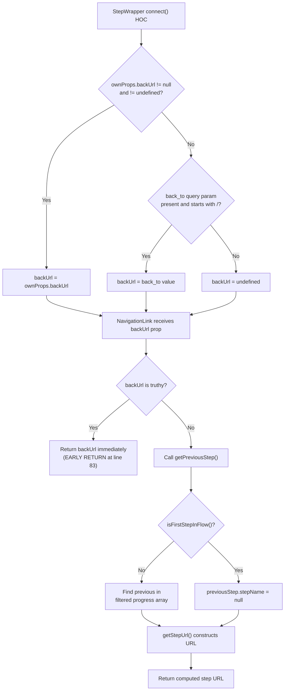
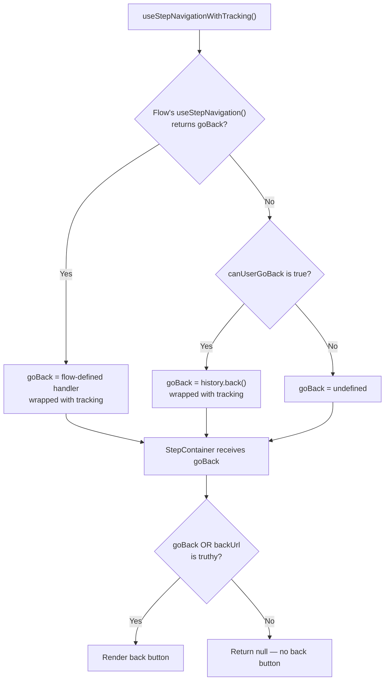
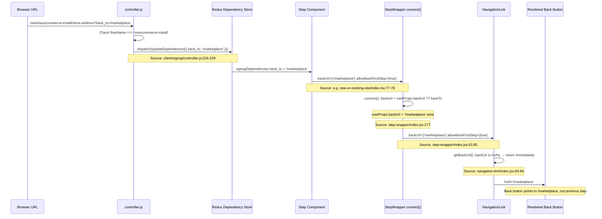
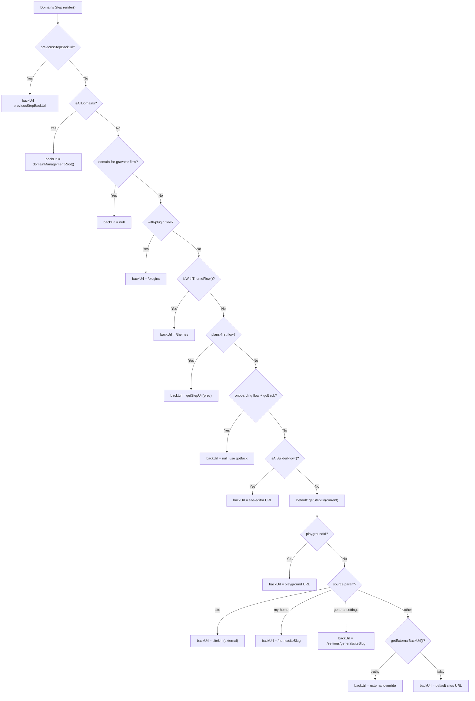

# Back-Navigation Investigation: Calypso Multi-Step Onboarding/Signup Flows

## 1. Summary

This document investigates why the Back button in Calypso's multi-step onboarding/signup flows sometimes jumps to the first step or exits the flow entirely instead of retreating one step at a time.

Calypso has **two independent multi-step navigation architectures**:

- The **classic signup system** (`/start/`, powered by `client/signup/`) — a Redux-connected, imperative flow engine where steps are defined in configuration objects and rendered via a controller pipeline.
- The **declarative stepper system** (`/setup/`, powered by `client/landing/stepper/`) — a hook-based, React Router–driven framework where flows declare navigation behaviour via `useStepNavigation()`.

**Root cause:** In the classic signup system, a `back_to` query-parameter override, when present in the URL, is injected into the Redux dependency store and propagated as a `backUrl` prop to `StepWrapper`. This `backUrl` short-circuits the normal step-by-step back-navigation computation (`getPreviousStep()`), causing the Back button to point to an external target (such as the first step of the flow or an entirely different page) rather than the immediately preceding step. Additionally, when `backUrl` is truthy, `StepWrapper` forces `allowBackFirstStep` to `true`, which makes the Back button appear even at step position 0 — a position where it would normally be hidden.

This document answers five discrete questions:

| # | Question |
|---|----------|
| **Q1** | What actually decides the destination for the Back button at a given step? |
| **Q2** | Which inputs win when flow position, component props, and query-string arguments disagree? |
| **Q3** | Where does the external back-target override come from? |
| **Q4** | What precedence rule lets the override take control, and what code path handles the expected step-by-step navigation that is being bypassed? |
| **Q5** | Can we observe the computed destination for each step position to confirm the pattern? |

---

## 2. Two Navigation Systems Overview

### 2.1 Classic Signup System (/start/)

Routes at `/start/:flowName/:stepName` are handled by the signup controller at `client/signup/controller.js`. The controller resolves the flow name, loads the step component module, dispatches Redux state updates, and renders the step wrapped in the signup layout.

The back-navigation decision chain involves four key modules:

1. **`StepWrapper`** (`client/signup/step-wrapper/index.jsx`) — Wraps every step component. Connects to Redux via a `connect()` HOC (lines 273–283) that reads the `back_to` query parameter from the current URL via `getCurrentQueryArguments(state)?.back_to`, validates it starts with `/`, and applies nullish coalescing: `ownProps.backUrl ?? backTo`. This merged `backUrl` is passed down to `NavigationLink`.

   ```jsx
   // Source: client/signup/step-wrapper/index.jsx:273-283
   export default connect( ( state, ownProps ) => {
       const backToParam = getCurrentQueryArguments( state )?.back_to?.toString();
       const backTo = backToParam?.startsWith( '/' ) ? backToParam : undefined;

       const backUrl = ownProps.backUrl ?? backTo;

       return {
           backUrl,
           userLoggedIn: isUserLoggedIn( state ),
       };
   } )( localize( StepWrapper ) );
   ```

2. **`NavigationLink`** (`client/signup/navigation-link/index.jsx`) — Renders the actual Back (or Skip) button. Key methods:
   - `getBackUrl()` (lines 78–115): If `this.props.backUrl` is truthy, returns it immediately (early return at line 83–84), bypassing all step-computation logic.
   - `getPreviousStep()` (lines 47–76): Finds the previous step in the filtered signup progress array, then calls `getStepUrl()` to construct the URL. Only reached when `backUrl` is falsy.
   - `handleClick()` (lines 117–132): Dispatches forward/back actions and records analytics.

3. **Signup utilities** (`client/signup/utils.js`) — Provides the step-computation functions:
   - `getFilteredSteps()` (lines 137–148): Filters the signup progress to only include steps belonging to the current flow, sorted by flow step order.
   - `getStepUrl()` (lines 45–69): Constructs a URL path from flow name, step name, section name, locale, and query parameters.
   - `isFirstStepInFlow()` (lines 28–31): Returns `true` if the given step name is at index 0 in the flow's steps array.
   - `getPreviousStepName()` (lines 85–88): Returns the step name at `indexOf(currentStepName) - 1` in the flow's steps array.

4. **Flow configurations** (`client/signup/config/flows-pure.js`) — Declare `providesDependenciesInQuery` arrays that may include `back_to`, enabling the signup framework to automatically extract the `back_to` query parameter and store it in the Redux dependency store.

### 2.2 Declarative Stepper System (/setup/)

Routes at `/setup/:flowName/:stepName` are handled by the `FlowRenderer` at `client/landing/stepper/declarative-flow/internals/index.tsx`. The `FlowRenderer` assembles React Router routes for every step, calls each flow's `useStepNavigation()` hook, and passes the resulting navigation controls (wrapped with analytics tracking) to each step component.

> Source: `client/landing/stepper/README.md:5` — "The stepper framework is a new framework for quickly spinning up sign-up flows. This is a non-linear solution that doesn't sacrifice agility."

The back-navigation decision chain involves three key modules:

1. **`useStepNavigationWithTracking` hook** (`client/landing/stepper/declarative-flow/internals/hooks/use-step-navigation-with-tracking/index.ts`) — Wraps each flow's `useStepNavigation()` return value with Tracks analytics recording. It computes `canUserGoBack` (lines 54–58) — a boolean that is `true` when: a `previousStep` exists in the stepper internal store, the current step is not the first step in the flow, `history.length > 1`, and the previous step is not the same as the current step route. The hook applies a conditional spread pattern where a flow-defined `goBack` handler (lines 134–141) overwrites the `history.back()` fallback (lines 123–130) because it appears later in the spread chain.

   ```ts
   // Source: use-step-navigation-with-tracking/index.ts:54-58
   const canUserGoBack =
       stepData?.previousStep &&
       currentStepRoute !== stepSlugs[ 0 ] &&
       history.length > 1 &&
       stepData.previousStep !== currentStepRoute;
   ```

2. **`StepContainer`** (`packages/onboarding/src/step-container/index.tsx`) — The `renderBackButton()` function (lines 106–122) renders the back button **only** if `goBack` or `backUrl` is truthy:

   ```tsx
   // Source: packages/onboarding/src/step-container/index.tsx:106-110
   function renderBackButton() {
       // Hide back button if goBack is falsy, it won't do anything in that case.
       if ( shouldHideNavButtons || ( ! goBack && ! backUrl ) ) {
           return null;
       }
       // ... render StepNavigationLink
   }
   ```

3. **`StepNavigationLink`** (`packages/onboarding/src/step-navigation-link/index.tsx`) — A stateless functional component that renders a `<Button>` with `href={backUrl}` and an `onClick` handler that calls `recordClick?.()` then `handleClick?.()` (which is the `goBack` function passed from the flow).

---

## 3. What Decides the Back Destination (Q1)

### 3.1 Classic System Precedence Chain

The following precedence chain determines the Back button's destination in the classic signup system, ordered from highest to lowest priority:

**Priority 1 — `ownProps.backUrl` (step-component explicit prop)**

If a step component explicitly passes a `backUrl` prop to `StepWrapper`, it wins unconditionally. This is because the `connect()` HOC in `StepWrapper` uses the nullish coalescing operator:

```jsx
// Source: client/signup/step-wrapper/index.jsx:277
const backUrl = ownProps.backUrl ?? backTo;
```

The `??` operator only falls through to `backTo` if `ownProps.backUrl` is `null` or `undefined`. Any other value — including an empty string `""` — takes precedence.

**Priority 2 — `back_to` query parameter (via Redux)**

If `ownProps.backUrl` is `null` or `undefined`, the `back_to` query parameter (read from the Redux state via `getCurrentQueryArguments(state)?.back_to` at line 274) becomes the `backUrl` prop. The value is validated to start with `/` at line 275 — only absolute paths are accepted; external URLs or relative paths are discarded:

```jsx
// Source: client/signup/step-wrapper/index.jsx:274-275
const backToParam = getCurrentQueryArguments( state )?.back_to?.toString();
const backTo = backToParam?.startsWith( '/' ) ? backToParam : undefined;
```

**Priority 3 — `NavigationLink.getBackUrl()` early return**

Once `NavigationLink` receives the merged `backUrl` prop, `getBackUrl()` checks it first:

```jsx
// Source: client/signup/navigation-link/index.jsx:83-84
if ( this.props.backUrl ) {
    return this.props.backUrl;
}
```

If `backUrl` is truthy (from either Priority 1 or 2 above), it is returned immediately. All subsequent computation is skipped.

**Priority 4 — `getPreviousStep()` computation**

Only reached when `backUrl` is falsy. `getPreviousStep()` (lines 47–76) performs the following:

1. Checks `isFirstStepInFlow()` — if `true`, returns `{ stepName: null }`.
2. Calls `getFilteredSteps()` to get progressed steps filtered to the current flow and sorted by flow definition order, excluding skipped steps.
3. Finds `currentStepIndexInProgress` in the filtered array.
4. If the current step is not found in progress (index === -1), returns the last progressed step via `.pop()`.
5. Otherwise, returns the step at `currentStepIndexInProgress - 1`.
6. The resulting step object is passed to `getStepUrl()` (from `client/signup/utils.js:45-69`) to construct the URL path.

**Priority 5 — First step / empty progress fallback**

If `isFirstStepInFlow()` returns `true` or the filtered progress array is empty, `previousStep` retains its default `{ stepName: null }`. When `getStepUrl()` receives `stepName: null`, it produces a URL pointing to the flow root (e.g., `/start/woocommerce-install`).



### 3.2 Stepper System Precedence Chain

The declarative stepper system uses a different precedence model based on JavaScript's object spread semantics:

**Priority 1 — Flow-defined `goBack`**

If the flow's `useStepNavigation()` hook returns an object with a `goBack` property, it is wrapped with analytics tracking and used as the final `goBack` handler. This works because the conditional spread `...( stepNavigation.goBack && { goBack: ... } )` at lines 134–141 appears **after** the `canUserGoBack` spread at lines 123–130 in the `useMemo` return object. In JavaScript, later spreads overwrite earlier properties with the same key.

```ts
// Source: use-step-navigation-with-tracking/index.ts:131-141
/**
 * If the flow defines a `goBack` handler, this will overwrite the one above.
 * Flow is the ultimate authority on navigation.
 */
...( stepNavigation.goBack && {
    goBack: () => {
        handleRecordStepNavigation( {
            event: STEPPER_TRACKS_EVENT_STEP_NAV_GO_BACK,
        } );
        stepNavigation.goBack?.();
    },
} ),
```

**Priority 2 — `canUserGoBack` + `history.back()` fallback**

If the flow does NOT define `goBack`, but `canUserGoBack` is `true`, a `goBack` function that calls `history.back()` is provided:

```ts
// Source: use-step-navigation-with-tracking/index.ts:123-130
...( canUserGoBack && {
    goBack: () => {
        handleRecordStepNavigation( {
            event: STEPPER_TRACKS_EVENT_STEP_NAV_GO_BACK,
        } );
        history.back();
    },
} ),
```

The `canUserGoBack` conditions are (Source: lines 54–58):
- `stepData?.previousStep` is defined (a previous step exists in the stepper internal store)
- `currentStepRoute !== stepSlugs[0]` (current step is not the first step)
- `history.length > 1` (browser history has entries to go back to)
- `stepData.previousStep !== currentStepRoute` (prevents flash during transitions)

**Priority 3 — No back button**

If neither condition is met, `goBack` is `undefined`, and `StepContainer.renderBackButton()` returns `null` (line 108), so no back button is rendered.



### 3.3 Precedence Comparison Table

| Priority | Classic Signup System (`/start/`) | Declarative Stepper System (`/setup/`) |
|:--------:|-----------------------------------|----------------------------------------|
| 1 (Highest) | `ownProps.backUrl` passed to `StepWrapper` | Flow-defined `goBack` from `useStepNavigation()` |
| 2 | `back_to` query parameter (via Redux) | `canUserGoBack` → `history.back()` fallback |
| 3 | `getPreviousStep()` computation | (No back button rendered) |
| 4 (Lowest) | First-step / empty-progress fallback | — |

**Rationale:** The classic system has a deeper precedence chain because it supports external entry points (e.g., marketplace → WooCommerce install) that need to override the back-target. The stepper system is simpler because flows explicitly declare their back-navigation behaviour via hooks, and the framework only provides `history.back()` as a generic fallback.

---

## 4. Input Conflict Resolution (Q2)

### 4.1 StepWrapper connect() Resolution

The sole arbitration point for conflicting inputs in the classic system is the `connect()` HOC in `StepWrapper`:

```jsx
// Source: client/signup/step-wrapper/index.jsx:273-283
export default connect( ( state, ownProps ) => {
    const backToParam = getCurrentQueryArguments( state )?.back_to?.toString();
    const backTo = backToParam?.startsWith( '/' ) ? backToParam : undefined;

    const backUrl = ownProps.backUrl ?? backTo;

    return {
        backUrl,
        userLoggedIn: isUserLoggedIn( state ),
    };
} )( localize( StepWrapper ) );
```

**Key semantics of the nullish coalescing operator (`??`):**

- `ownProps.backUrl ?? backTo` evaluates to `ownProps.backUrl` if it is **not** `null` and **not** `undefined`.
- This means even an empty string `""` from `ownProps.backUrl` would win over `backTo`.
- Only `null` or `undefined` fall through to the `back_to` query parameter.

This distinction matters in practice. For example, the domains step for the `domain-for-gravatar` flow explicitly sets `backUrl = null` (Source: `client/signup/steps/domains/index.jsx:1397`), which allows the `back_to` query parameter to take over if present. But if a step sets `backUrl` to any truthy string, the query parameter is completely ignored regardless of its value.

**Validation of `back_to`:** The `backToParam?.startsWith('/')` check (line 275) ensures only absolute paths are accepted from the query string. If someone passes `back_to=https://evil.com`, it will fail the validation and `backTo` will be `undefined`. This is a security-relevant guard against open redirect via the back button.

### 4.2 NavigationLink.getBackUrl() Early Return

After `StepWrapper`'s `connect()` HOC resolves the merged `backUrl`, it is passed as a prop to `NavigationLink`. The `getBackUrl()` method contains a critical early-return gate:

```jsx
// Source: client/signup/navigation-link/index.jsx:78-85
getBackUrl() {
    if ( this.props.direction !== 'back' ) {
        return;
    }

    if ( this.props.backUrl ) {
        return this.props.backUrl;
    }

    // ... getPreviousStep computation follows below
}
```

When `backUrl` is truthy (from either `ownProps.backUrl` or the `back_to` query parameter), the entire `getPreviousStep()` code path is **bypassed**. The back button destination becomes the override URL — not the previous step in the flow. This is the direct mechanism by which the back button "jumps" to an unexpected destination.

### 4.3 getPreviousStep() Fallback Path

The `getPreviousStep()` method (Source: `client/signup/navigation-link/index.jsx:47-76`) is the code path responsible for normal step-by-step back-navigation. It is **only reached when `backUrl` is falsy**:

```jsx
// Source: client/signup/navigation-link/index.jsx:47-76
getPreviousStep( flowName, signupProgress, currentStepName ) {
    const previousStep = { stepName: null };

    if ( isFirstStepInFlow( flowName, currentStepName, this.props.userLoggedIn ) ) {
        return previousStep;
    }

    const filteredProgressedSteps = getFilteredSteps(
        flowName,
        signupProgress,
        this.props.userLoggedIn
    ).filter( ( step ) => ! step.wasSkipped );

    if ( filteredProgressedSteps.length === 0 ) {
        return previousStep;
    }

    const currentStepIndexInProgress = filteredProgressedSteps.findIndex(
        ( step ) => step.stepName === currentStepName
    );

    // Current step isn't finished, so isn't part of the progress array yet
    if ( currentStepIndexInProgress === -1 ) {
        return filteredProgressedSteps.pop();
    }

    return filteredProgressedSteps[ currentStepIndexInProgress - 1 ] || previousStep;
}
```

The algorithm:

1. **First-step guard:** If `isFirstStepInFlow()` returns `true` (Source: `client/signup/utils.js:28-31` — checks if `stepName` is at index 0 in the flow's `steps` array), returns `{ stepName: null }`.
2. **Filter and sort progress:** `getFilteredSteps()` (Source: `client/signup/utils.js:137-148`) filters the global signup progress object to only include steps belonging to the current flow, sorted by the flow's step definition order. Skipped steps are further excluded.
3. **Empty progress guard:** If no progressed steps remain after filtering, returns `{ stepName: null }`.
4. **Find current position:** Searches for `currentStepName` in the filtered array.
5. **Not-in-progress handling:** If the current step hasn't been completed yet (index === -1), returns the last step in the progress array (the most recently completed step).
6. **Normal case:** Returns the step at `currentStepIndexInProgress - 1`.

The returned step object is then fed to `getStepUrl()` (Source: `client/signup/utils.js:45-69`), which constructs the full URL path (e.g., `/start/woocommerce-install/store-address`).

---

## 5. The External Override: back_to (Q3)

### 5.1 Lifecycle Diagram

The following sequence diagram traces the `back_to` query parameter from the browser URL through the entire system to the rendered Back button destination:



### 5.2 Flow Configurations Declaring back_to

The following flows declare `back_to` in their `providesDependenciesInQuery` array, which tells the signup framework to automatically extract the `back_to` query parameter from the URL and store it in the Redux dependency store:

| Flow Name | File Location | Line | `providesDependenciesInQuery` value |
|-----------|---------------|:----:|-------------------------------------|
| `do-it-for-me` (`DIFM_FLOW`) | `client/signup/config/flows-pure.js` | 410 | `[ 'coupon', 'back_to' ]` |
| `website-design-services` | `client/signup/config/flows-pure.js` | 446 | `[ 'siteSlug', 'back_to' ]` |
| `woocommerce-install` | `client/signup/config/flows-pure.js` | 478 | `[ 'siteSlug', 'back_to' ]` |

**Notable absence:** The `do-it-for-me-store` (`DIFM_FLOW_STORE`) flow (line 437) does **not** declare `back_to` in its `providesDependenciesInQuery` — it only declares `[ 'coupon' ]`. This means the `back_to` query parameter is ignored in the `do-it-for-me-store` flow even if present in the URL, unlike the regular `do-it-for-me` flow.

### 5.3 Controller Dispatch

For the `woocommerce-install` flow, there is an additional explicit dispatch in the controller that force-updates the `back_to` dependency on every step transition:

```js
// Source: client/signup/controller.js:226-232
if ( 'woocommerce-install' === flowName ) {
    if ( context?.query?.back_to ) {
        // forces back_to update
        context.store.dispatch( updateDependencies( { back_to: context.query.back_to } ) );
    }

    initialContext = context;
}
```

**Rationale:** This force-dispatch exists because the `woocommerce-install` flow supports site-switching (the comment at line 225 reads "Update initialContext to help woocommerce-install support site switching"). When the user switches sites, the controller needs to re-inject `back_to` into the Redux store, even if it was already injected by the `providesDependenciesInQuery` mechanism. The `initialContext = context` assignment on line 232 also ensures subsequent steps see the updated context.

For other flows that declare `back_to` (like `do-it-for-me` and `website-design-services`), the `providesDependenciesInQuery` mechanism handles extraction automatically — the signup framework reads the declared dependency names from the flow configuration and populates the Redux dependency store from the URL query parameters during flow initialization.

### 5.4 Step Consumption Pattern

Steps that need to support the `back_to` override follow a consistent pattern: they destructure `back_to` from `signupDependencies` and pass it as `backUrl` (plus `allowBackFirstStep={!!backUrl}`) to `StepWrapper`:

- **`new-or-existing-site/index.tsx`** (line 31):
  ```tsx
  const { back_to: backUrl } = signupDependencies;
  ```
  Passes to StepWrapper at lines 77–78:
  ```tsx
  backUrl={ backUrl }
  allowBackFirstStep={ !! backUrl }
  ```
  Source: `client/signup/steps/new-or-existing-site/index.tsx:31,77-78`

- **`difm-site-picker/index.tsx`** (line 43):
  ```tsx
  const { back_to: backUrl } = signupDependencies;
  ```
  Same pattern: passes `backUrl` and `allowBackFirstStep={!!backUrl}` to StepWrapper.
  Source: `client/signup/steps/difm-site-picker/index.tsx:43,124-125`

- **`site-options/index.tsx`** (line 27):
  ```tsx
  const { siteTitle, tagline, siteId, back_to: backUrl } = signupDependencies;
  ```
  Same pattern: passes `backUrl` and `allowBackFirstStep={!!backUrl}` to StepWrapper.
  Source: `client/signup/steps/site-options/index.tsx:27,129-130`

- **`woocommerce-install/step-store-address/index.tsx`** (lines 61–64) — Uses a **different pattern** with additional validation:
  ```tsx
  const backPath = signupDependencies?.back_to;
  // Check for a valid back path, otherwise go back to the WooCommerce install landing page.
  const backUrl =
      backPath && backPath.match( /^\/(?!\/)/ ) ? backPath : `/woocommerce-installation/${ domain }`;
  ```
  The regex `/^\/(?!\/)/` ensures the path starts with a single `/` (not `//`, which could be a protocol-relative URL). If validation fails, it falls back to `/woocommerce-installation/{domain}`. The step always passes `allowBackFirstStep` as `true` (line 216).
  Source: `client/signup/steps/woocommerce-install/step-store-address/index.tsx:61-64,216-217`

---

## 6. Precedence Rule and Bypassed Code Path (Q4)

### 6.1 The Nullish Coalescing Gate

The nullish coalescing operator (`??`) at `client/signup/step-wrapper/index.jsx:277` is the sole arbitration point between `ownProps.backUrl` and the `back_to` query parameter:

```jsx
const backUrl = ownProps.backUrl ?? backTo;
```

**Critical distinction between `??` and `||`:**

- `??` (nullish coalescing): Falls through only if the left operand is `null` or `undefined`.
- `||` (logical OR): Falls through if the left operand is any falsy value (`null`, `undefined`, `""`, `0`, `false`, `NaN`).

This means:
- If `ownProps.backUrl` is explicitly `null` (as in the domains step for the `domain-for-gravatar` flow, where `backUrl = null` is set at line 1397 of `client/signup/steps/domains/index.jsx`), then `back_to` **does** take over.
- If `ownProps.backUrl` is any truthy string (e.g., `/marketplace`, `/plugins`), the `back_to` query parameter is **completely ignored**, regardless of its value.
- If `ownProps.backUrl` is `undefined` (the default when a step doesn't pass it), the `back_to` query parameter takes over if present and valid.

### 6.2 allowBackFirstStep Side-Effect

When `backUrl` is truthy, `StepWrapper`'s `renderBack()` method produces a critical side-effect:

```jsx
// Source: client/signup/step-wrapper/index.jsx:65
allowBackFirstStep={ this.props.allowBackFirstStep || !! this.props.backUrl }
```

This forces `allowBackFirstStep` to `true` whenever `backUrl` is truthy, regardless of the step's position in the flow.

In `NavigationLink.render()`, there is a guard that normally hides the back button at step position 0:

```jsx
// Source: client/signup/navigation-link/index.jsx:154-161
if (
    this.props.positionInFlow === 0 &&
    this.props.direction === 'back' &&
    ! this.props.stepSectionName &&
    ! this.props.allowBackFirstStep
) {
    return null;
}
```

When `allowBackFirstStep` is `true`, this guard is bypassed, and the back button is rendered **even at step position 0**.

**This is a key part of the observed behaviour:** When a user enters a flow with `?back_to=/some/path`, the Back button appears on the very first step (which would normally have no back button) and points to the external target. This creates the impression that the back button "jumps to the first step or exits the flow entirely" — because it literally navigates away from the flow rather than to the previous step.

Additionally, many step components that support `back_to` explicitly pass `allowBackFirstStep={!!backUrl}` to `StepWrapper` (see Section 5.4). This is technically redundant with the `|| !! this.props.backUrl` in `renderBack()`, but it makes the intent explicit at the step level.

### 6.3 The Bypassed getPreviousStep()

`NavigationLink.getPreviousStep()` (Source: `client/signup/navigation-link/index.jsx:47-76`) is the method responsible for normal step-by-step back-navigation — walking through the filtered progress array and returning the step at `index - 1`.

This method is **never called** when `backUrl` is truthy, because `getBackUrl()` returns early at lines 83–84:

```jsx
// Source: client/signup/navigation-link/index.jsx:83-84
if ( this.props.backUrl ) {
    return this.props.backUrl;
}
```

The entire step-by-step retreat logic — `isFirstStepInFlow()` check, `getFilteredSteps()` filtering, progress array traversal, `getStepUrl()` URL construction — is completely bypassed. The back button destination is determined solely by the override URL, with no consideration of the user's actual position in the flow.

**The result:** When `back_to=/marketplace` is active, pressing Back at step 3 does not go to step 2 — it goes to `/marketplace`. Pressing Back at step 1 does not go to step 0 — it goes to `/marketplace`. The step-by-step behaviour the user expects is entirely absent for any step that receives a truthy `backUrl`.

### 6.4 Domains Step Special Cases

The domains step (`client/signup/steps/domains/index.jsx`, lines 1352–1441) has the most complex back-URL computation in the codebase. It does **not** rely on the standard `getPreviousStep()` path. Instead, it builds `backUrl` via an extensive if/else chain that considers:

1. `previousStepBackUrl` (from `this.getPreviousStepUrl()`) — if defined, used directly
2. `isAllDomains` flag → `domainManagementRoot()`
3. Flow name `'domain-for-gravatar'` → `null` (allows `back_to` to take over)
4. Flow name `'with-plugin'` → `/plugins`
5. `isWithThemeFlow()` check → `/themes`
6. Flow name `'plans-first'` → `getStepUrl(flowName, previousStepName)`
7. `isOnboardingFlow()` with `goBack` → `null` (uses stepper `goBack` callback)
8. `isAIBuilderFlow()` → site-editor URL
9. Default: `getStepUrl(flowName, stepName)` with additional overrides for:
   - `playgroundId` → playground URL
   - `source === 'site'` → site URL (external)
   - `source === 'my-home'` → `/home/{siteSlug}`
   - `source === 'general-settings'` → `/settings/general/{siteSlug}`
   - URL matches current path → default sites back URL
   - `getExternalBackUrl(source, stepSectionName)` → external back URL from override maps

The `getExternalBackUrl()` function (Source: `client/signup/steps/domains/utils.js:14-31`) checks:

```js
// Source: client/signup/steps/domains/utils.js:9-11
export const backUrlSourceOverrides = {
    'business-name-generator': '/business-name-generator',
    domains: '/domains',
};
```

These map specific `source` query parameter values to known paths. For external URLs, it checks `backUrlExternalSourceStepsOverrides` (only `['use-your-domain']` at line 6) and validates via `validUrl.isWebUri(source)`.



---

## 7. Per-Step Destination Observation (Q5)

### 7.1 Diagnostic Approach

The following approaches allow observing back-navigation targets at runtime **without modifying the repository**:

**Approach 1 — Browser DevTools conditional breakpoint:**

1. Open Chrome DevTools → Sources panel.
2. Navigate to `client/signup/navigation-link/index.jsx`, line 78 (`getBackUrl()` start).
3. Right-click the line number → "Add conditional breakpoint".
4. Enter the expression:
   ```js
   (console.log('Back-nav debug:', { step: this.props.stepName, backUrl: this.props.backUrl, positionInFlow: this.props.positionInFlow }), false)
   ```
   The `, false` ensures execution continues (the breakpoint condition evaluates to `false`, so the debugger doesn't pause).
5. Navigate through the flow and observe the console output at each step.

**Approach 2 — Redux DevTools inspection:**

1. Install the Redux DevTools browser extension.
2. Navigate to a flow with `?back_to=/some/path`.
3. At each step transition, inspect `state.signup.dependencyStore.back_to` in the Redux state tree.
4. This reveals when the override is active and what value it holds.

**Approach 3 — Temporary console.log (described, not committed):**

For a more comprehensive trace, temporarily add logging at the start of `getBackUrl()`:

```jsx
// TEMPORARY — DO NOT COMMIT
console.log('getBackUrl() called', {
    stepName: this.props.stepName,
    backUrl: this.props.backUrl,
    positionInFlow: this.props.positionInFlow,
    allowBackFirstStep: this.props.allowBackFirstStep,
    previousStep: this.props.backUrl ? 'SKIPPED' : this.getPreviousStep(this.props.flowName, this.props.signupProgress, this.props.stepName),
});
```

Remove after observation and verify with `git diff` and `git status`.

### 7.2 Expected Destination Table

#### `woocommerce-install` flow (classic signup system)

This flow explicitly declares `back_to` in `providesDependenciesInQuery` and has a controller force-dispatch.

Source: `client/signup/config/flows-pure.js:471-482`

| Step Position | Step Name | `back_to` present? | `backUrl` prop | Expected Back Destination | Mechanism |
|:---:|-----------|:---:|----------------|---------------------------|-----------|
| 0 | `store-address` | Yes | `signupDependencies.back_to` (validated, fallback to `/woocommerce-installation/{domain}`) | External URL from `back_to` (e.g., `/marketplace`) | `StepWrapper` → `NavigationLink` early return; `allowBackFirstStep` forced `true` |
| 0 | `store-address` | No | `/woocommerce-installation/{domain}` (hardcoded fallback) | WooCommerce installation page | Explicit `backUrl` prop; `allowBackFirstStep` always `true` (line 216) |
| 1 | `business-info` | — | `undefined` (step doesn't pass `backUrl`) | `/start/woocommerce-install/store-address` | `getPreviousStep()` → `getStepUrl()` |
| 2 | `confirm` | — | `undefined` | `/start/woocommerce-install/business-info` | `getPreviousStep()` → `getStepUrl()` |
| 3 | `transfer` | — | `undefined` | `/start/woocommerce-install/confirm` | `getPreviousStep()` → `getStepUrl()` |

**Key observation:** Only `store-address` (step 0) is affected by the `back_to` override. The subsequent steps (`business-info`, `confirm`, `transfer`) do not consume `back_to` from `signupDependencies`, so they rely on `getPreviousStep()` and navigate step-by-step normally.

#### `do-it-for-me` flow (classic signup system)

This flow declares `back_to` in `providesDependenciesInQuery`, but **multiple** steps consume it.

Source: `client/signup/config/flows-pure.js:385-412`

| Step Position | Step Name | `back_to` present? | Expected Back Destination | Mechanism |
|:---:|-----------|:---:|---------------------------|-----------|
| 0 | `user-social` | N/A (first step) | No back button | `positionInFlow === 0` hides button unless `allowBackFirstStep` |
| 1 | `new-or-existing-site` | Yes (if `back_to` in URL) | External URL from `back_to` | `signupDependencies.back_to` → `backUrl` → early return |
| 1 | `new-or-existing-site` | No | Previous step via `getPreviousStep()` | Normal step-by-step computation |
| 2 | `difm-site-picker` | Yes (if `back_to` in URL) | External URL from `back_to` | Same override pattern via `signupDependencies.back_to` |
| 2 | `difm-site-picker` | No | Previous step via `getPreviousStep()` | Normal step-by-step computation |

**Key observation:** In the `do-it-for-me` flow, both `new-or-existing-site` and `difm-site-picker` consume `back_to`. If a user enters the flow with `?back_to=/marketplace`, pressing Back at step 1 or step 2 would both navigate to `/marketplace` — not to the preceding step.

#### `onboarding` flow (declarative stepper system)

This flow's `useStepNavigation()` returns only `{ submit }` — no `goBack` handler is defined.

Source: `client/landing/stepper/declarative-flow/flows/onboarding/onboarding.ts:290`

| Step Position | Step Name | `goBack` defined? | `canUserGoBack`? | Expected Back Destination | Mechanism |
|:---:|-----------|:---:|:---:|---------------------------|-----------|
| 0 | `domains` | No | No (first step, `currentStepRoute === stepSlugs[0]`) | No back button | Neither condition met → `goBack` is `undefined` |
| 1 | `use-my-domain` | No | Yes (if navigated via stepper, `previousStep` exists) | Previous page via `history.back()` | `canUserGoBack` fallback |
| 2 | `plans` | No | Yes | Previous page via `history.back()` | `canUserGoBack` fallback |
| 3 | `create-site` | No | Yes | Previous page via `history.back()` | `canUserGoBack` fallback |

**Key observation:** The `onboarding` flow relies entirely on the stepper's `canUserGoBack` → `history.back()` fallback. Because `history.back()` navigates to the browser's previous history entry (which is typically the preceding stepper step), this produces step-by-step back-navigation as expected. However, if the user entered a step via a deep link (skipping earlier steps), `history.back()` would go to whatever page was visited before — potentially outside the flow.

### 7.3 Cleanup Checklist

After diagnostic observation, ensure the repository remains unmodified:

- [ ] Remove any temporary conditional breakpoints from DevTools
- [ ] Remove any temporary `console.log` statements if added to source files
- [ ] Run `git diff` to verify no files were modified
- [ ] Run `git status` to verify no untracked files were created
- [ ] Confirm the output of both commands shows a clean working tree

---

## 8. Source Files Referenced

| File Path | Role in Back-Navigation |
|-----------|------------------------|
| `client/signup/navigation-link/index.jsx` | Back button component: `getPreviousStep()`, `getBackUrl()`, early-return override, `allowBackFirstStep` guard |
| `client/signup/step-wrapper/index.jsx` | Step wrapper: `connect()` HOC reading `back_to`, nullish coalescing gate, `allowBackFirstStep` forcing |
| `client/signup/utils.js` | Signup utilities: `getFilteredSteps()`, `getStepUrl()`, `isFirstStepInFlow()`, `getPreviousStepName()` |
| `client/signup/steps/domains/utils.js` | External back-URL overrides: `getExternalBackUrl()`, `backUrlSourceOverrides`, `backUrlExternalSourceStepsOverrides` |
| `client/signup/steps/domains/index.jsx` | Domains step: complex back-URL computation chain with flow-specific branching |
| `client/signup/config/flows-pure.js` | Flow configurations declaring `back_to` in `providesDependenciesInQuery` |
| `client/signup/controller.js` | Controller: force-dispatch of `back_to` into Redux for `woocommerce-install` |
| `client/signup/steps/new-or-existing-site/index.tsx` | Step consuming `back_to` as `backUrl` prop to `StepWrapper` |
| `client/signup/steps/woocommerce-install/step-store-address/index.tsx` | Step consuming `back_to` with regex path validation and fallback |
| `client/signup/steps/difm-site-picker/index.tsx` | Step consuming `back_to` as `backUrl` prop to `StepWrapper` |
| `client/signup/steps/site-options/index.tsx` | Step consuming `back_to` as `backUrl` prop to `StepWrapper` |
| `client/landing/stepper/declarative-flow/internals/hooks/use-step-navigation-with-tracking/index.ts` | Stepper tracking hook: `canUserGoBack` computation, flow-defined `goBack` priority, `history.back()` fallback |
| `packages/onboarding/src/step-container/index.tsx` | Stepper step container: `renderBackButton()` visibility gated on `goBack \|\| backUrl` |
| `packages/onboarding/src/step-navigation-link/index.tsx` | Stepper navigation link: stateless button with `href={backUrl}` and `onClick` |
| `client/landing/stepper/declarative-flow/flows/onboarding/onboarding.ts` | Onboarding flow: returns only `{ submit }` — no `goBack`, triggering stepper `history.back()` fallback |
| `client/landing/stepper/declarative-flow/flows/onboarding/README.md` | Onboarding flow documentation: minimal README with manual testing URL (`/setup/onboarding`) and ownership metadata |
| `client/landing/stepper/declarative-flow/internals/index.tsx` | FlowRenderer: assembles step routes, calls `useStepNavigationWithTracking`, passes navigation to steps |
| `client/landing/stepper/README.md` | Stepper framework documentation: `useStepNavigation` hook design, non-linearity, reusability contract |
| `client/signup/navigation-link/test/index.jsx` | Test suite validating back-navigation URL computation, `getPreviousStep()` edge cases, `backUrl` override |
| `packages/onboarding/src/step-container-v2/components/buttons/BackButton/BackButton.tsx` | V2 back button: analytics-decorated `<Button>` with `chevronLeft` icon (simpler pattern, no override chain) |
