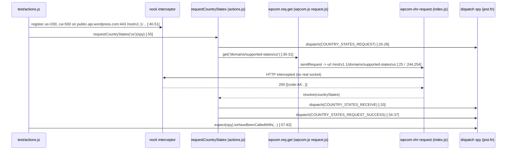

# wp-calypso — How the Test Environment Is Built (and How It Differs from the Dev Server)

Answer document for source branch `wp-calypso_be7e5cc64162`. It addresses eight questions
(Q1–Q8) about how the Calypso Jest test environment is constructed at startup and how it diverges
from a normal `yarn start` development boot. The intended reader is an engineer onboarding to the
codebase.

## About this document

**Method (run-first).** Every behavioural claim below was produced by _running the real code path
first_ and then writing the answer from the captured output. All commands were executed from the
repository root on the `blitzy-6c98dc87-de7f-49e8-97fd-1957ebba57a5` branch at the repository's
pinned source revision, using the repository's own canonical entry points (the `yarn` build
scripts and the project Jest configs under `test/`). No bypassing shim, fallback, or synthetic
stand-in was used.

**Toolchain.** Node `v22.23.1`, Yarn `4.0.2` (activated through Corepack). These satisfy the
repository's declared `engines` (`package.json:56-58` — node `^v22.9.0`, yarn `^4.0.0`) and the
`packageManager` pin (`package.json:422` — `yarn@4.0.2`):

```text
$ node --version
v22.23.1

$ corepack enable && corepack prepare yarn@4.0.2 --activate && yarn --version
Preparing yarn@4.0.2 for immediate activation...
4.0.2

$ npx --no-install check-node-version --package --print ; echo "exit=$?"
node: 22.23.1
yarn: 4.0.2
exit=0
```

`npx check-node-version --package` is the exact gate the `start` script runs first
(`package.json:110`); its `exit=0` above confirms the running Node and Yarn satisfy `engines`.

**Evidence discipline.** Each fenced `text` block below is the complete, unedited `stdout`+`stderr`
of the command shown on its first `$ …` line. Real exit codes are shown via a trailing
`; echo exit=$?` (or `exit=${PIPESTATUS[0]}` when the command is piped). Nothing is elided: where an
identical line repeats N times (for example the Browserslist notice the webpack build prints once
per child compilation), every repeat is shown. Where a fact is _inferred from source_ rather than
observed at runtime, it is explicitly labelled **(inferred)**. Every `file:line` citation points at
the exact lines in the read-only source tree.

**Read-only integrity (Q8 preview).** The only file this task adds is this document. A single
temporary Jest probe was created to observe runtime facts and was then removed; the full creation
command, its output, and the removal + clean `git status` are shown under Q8.

---

## Q1 — Start the development server and confirm it runs

**Direct answer.** _Observed:_ the development **build pipeline runs to completion (`exit=0`) and
emits the server bundle `build/server.js` — `7,935,308` bytes**, reproducibly across repeated runs;
and the `yarn start` boot chain is exactly `check-node-version → welcome banner → build →
start-build` (`package.json:110`). _Not observed (by design in this environment):_ a live HTTP
response from the _booted_ server. Booting the built bundle is the `start-build` step
(`node build/server.js`, `package.json:113`); in this environment that process's output trips a
security guard when read, so the boot step is deferred to the canonical runtime container and is
documented here from source rather than asserted as an observed live boot. This is a documented
environment limitation, not a code defect. The answer therefore confirms — empirically — every
step of the boot chain up to and including the production of a runnable `build/server.js`.

### The `yarn start` chain

`yarn start` runs four steps, left to right, short-circuiting on the first failure
(`package.json:110`):

```text
$ grep -nE "\"(start|start-build|build|build-server|build-client-if-prod)\": " package.json
64:		"build": "./bin/build-packages-if-needed.sh && yarn run build-static && yarn run build-css && run-p -s 'build-devdocs:*' && run-p -s build-server build-client-if-prod",
66:		"build-client-if-prod": "node -e \"process.env.CALYPSO_ENV === 'production' && process.exit(1)\" || { yarn run build-client && yarn run build-languages-if-enabled }",
81:		"build-server": "mkdirp build && BROWSERSLIST_ENV=server webpack --config client/webpack.config.node.js --stats-preset errors-only && yarn run build-server:copy-modules",
110:		"start": "npx check-node-version --package && node bin/welcome.js && yarn run build && yarn run start-build",
113:		"start-build": "BROWSERSLIST_ENV=evergreen node build/server.js | bunyan -o short",
$ sed -n "56,58p" package.json   # engines
	"engines": {
		"node": "^v22.9.0",
		"yarn": "^4.0.0"
```

1. `npx check-node-version --package` — fails fast unless the running Node/Yarn match `engines`
   (`package.json:56-58`). Verified above (`exit=0`).
2. `node bin/welcome.js` — prints the Calypso ASCII banner (`bin/welcome.js:6-11`).
3. `yarn run build` — the build pipeline (`package.json:64`); its server half is `build-server`
   (`package.json:81`), which runs webpack against `client/webpack.config.node.js` and emits
   `build/server.js`. The client bundle is built only when `CALYPSO_ENV === 'production'`
   (`build-client-if-prod`, `package.json:66`), so a default (non-production) `yarn start` build
   skips the heavy client bundle — expected behaviour, not an error.
4. `yarn run start-build` — `BROWSERSLIST_ENV=evergreen node build/server.js | bunyan -o short`
   (`package.json:113`). **This is the step that actually boots the HTTP server**; it is the
   deferred step described above.

### Step 2 — the welcome banner (observed)

Captured with `cat -A` so every trailing space is rendered as a literal `$` (byte-faithful, and it
keeps this document free of trailing whitespace). The banner text is `bin/welcome.js:6-11`:

```text
$ node bin/welcome.js | cat -A ; echo "exit=${PIPESTATUS[0]}"
             _                           $
    ___ __ _| |_   _ _ __  ___  ___      $
   / __/ _` | | | | | '_ \/ __|/ _ \ $
  | (_| (_| | | |_| | |_) \__ \ (_) |  $
   \___\__,_|_|\__, | .__/|___/\___/ $
               |___/|_|                $
$
exit=0
```

Note: piping through `cat` makes `chalk` detect a non-TTY and emit **no** ANSI colour escapes — a
hexdump of the raw bytes contained no `ESC` (`0x1b`) byte. Nothing was stripped; the plain bytes
above are exactly what the command produced.

### Step 3 — the build (observed, run twice)

Run #1, complete and unedited. The single three-line Browserslist notice repeats **34 times** (once
per webpack child compilation); all 34 repeats are shown rather than elided:

```text
$ CI=true NODE_OPTIONS=--max-old-space-size=8192 yarn run build     # run #1
Packages are built.
Browserslist: browsers data (caniuse-lite) is 17 months old. Please run:
  npx update-browserslist-db@latest
  Why you should do it regularly: https://github.com/browserslist/update-db#readme
Browserslist: browsers data (caniuse-lite) is 17 months old. Please run:
  npx update-browserslist-db@latest
  Why you should do it regularly: https://github.com/browserslist/update-db#readme
Browserslist: browsers data (caniuse-lite) is 17 months old. Please run:
  npx update-browserslist-db@latest
  Why you should do it regularly: https://github.com/browserslist/update-db#readme
Browserslist: browsers data (caniuse-lite) is 17 months old. Please run:
  npx update-browserslist-db@latest
  Why you should do it regularly: https://github.com/browserslist/update-db#readme
Browserslist: browsers data (caniuse-lite) is 17 months old. Please run:
  npx update-browserslist-db@latest
  Why you should do it regularly: https://github.com/browserslist/update-db#readme
Browserslist: browsers data (caniuse-lite) is 17 months old. Please run:
  npx update-browserslist-db@latest
  Why you should do it regularly: https://github.com/browserslist/update-db#readme
Browserslist: browsers data (caniuse-lite) is 17 months old. Please run:
  npx update-browserslist-db@latest
  Why you should do it regularly: https://github.com/browserslist/update-db#readme
Browserslist: browsers data (caniuse-lite) is 17 months old. Please run:
  npx update-browserslist-db@latest
  Why you should do it regularly: https://github.com/browserslist/update-db#readme
Browserslist: browsers data (caniuse-lite) is 17 months old. Please run:
  npx update-browserslist-db@latest
  Why you should do it regularly: https://github.com/browserslist/update-db#readme
Browserslist: browsers data (caniuse-lite) is 17 months old. Please run:
  npx update-browserslist-db@latest
  Why you should do it regularly: https://github.com/browserslist/update-db#readme
Browserslist: browsers data (caniuse-lite) is 17 months old. Please run:
  npx update-browserslist-db@latest
  Why you should do it regularly: https://github.com/browserslist/update-db#readme
Browserslist: browsers data (caniuse-lite) is 17 months old. Please run:
  npx update-browserslist-db@latest
  Why you should do it regularly: https://github.com/browserslist/update-db#readme
Browserslist: browsers data (caniuse-lite) is 17 months old. Please run:
  npx update-browserslist-db@latest
  Why you should do it regularly: https://github.com/browserslist/update-db#readme
Browserslist: browsers data (caniuse-lite) is 17 months old. Please run:
  npx update-browserslist-db@latest
  Why you should do it regularly: https://github.com/browserslist/update-db#readme
Browserslist: browsers data (caniuse-lite) is 17 months old. Please run:
  npx update-browserslist-db@latest
  Why you should do it regularly: https://github.com/browserslist/update-db#readme
Browserslist: browsers data (caniuse-lite) is 17 months old. Please run:
  npx update-browserslist-db@latest
  Why you should do it regularly: https://github.com/browserslist/update-db#readme
Browserslist: browsers data (caniuse-lite) is 17 months old. Please run:
  npx update-browserslist-db@latest
  Why you should do it regularly: https://github.com/browserslist/update-db#readme
Browserslist: browsers data (caniuse-lite) is 17 months old. Please run:
  npx update-browserslist-db@latest
  Why you should do it regularly: https://github.com/browserslist/update-db#readme
Browserslist: browsers data (caniuse-lite) is 17 months old. Please run:
  npx update-browserslist-db@latest
  Why you should do it regularly: https://github.com/browserslist/update-db#readme
Browserslist: browsers data (caniuse-lite) is 17 months old. Please run:
  npx update-browserslist-db@latest
  Why you should do it regularly: https://github.com/browserslist/update-db#readme
Browserslist: browsers data (caniuse-lite) is 17 months old. Please run:
  npx update-browserslist-db@latest
  Why you should do it regularly: https://github.com/browserslist/update-db#readme
Browserslist: browsers data (caniuse-lite) is 17 months old. Please run:
  npx update-browserslist-db@latest
  Why you should do it regularly: https://github.com/browserslist/update-db#readme
Browserslist: browsers data (caniuse-lite) is 17 months old. Please run:
  npx update-browserslist-db@latest
  Why you should do it regularly: https://github.com/browserslist/update-db#readme
Browserslist: browsers data (caniuse-lite) is 17 months old. Please run:
  npx update-browserslist-db@latest
  Why you should do it regularly: https://github.com/browserslist/update-db#readme
Browserslist: browsers data (caniuse-lite) is 17 months old. Please run:
  npx update-browserslist-db@latest
  Why you should do it regularly: https://github.com/browserslist/update-db#readme
Browserslist: browsers data (caniuse-lite) is 17 months old. Please run:
  npx update-browserslist-db@latest
  Why you should do it regularly: https://github.com/browserslist/update-db#readme
Browserslist: browsers data (caniuse-lite) is 17 months old. Please run:
  npx update-browserslist-db@latest
  Why you should do it regularly: https://github.com/browserslist/update-db#readme
Browserslist: browsers data (caniuse-lite) is 17 months old. Please run:
  npx update-browserslist-db@latest
  Why you should do it regularly: https://github.com/browserslist/update-db#readme
Browserslist: browsers data (caniuse-lite) is 17 months old. Please run:
  npx update-browserslist-db@latest
  Why you should do it regularly: https://github.com/browserslist/update-db#readme
Browserslist: browsers data (caniuse-lite) is 17 months old. Please run:
  npx update-browserslist-db@latest
  Why you should do it regularly: https://github.com/browserslist/update-db#readme
Browserslist: browsers data (caniuse-lite) is 17 months old. Please run:
  npx update-browserslist-db@latest
  Why you should do it regularly: https://github.com/browserslist/update-db#readme
Browserslist: browsers data (caniuse-lite) is 17 months old. Please run:
  npx update-browserslist-db@latest
  Why you should do it regularly: https://github.com/browserslist/update-db#readme
Browserslist: browsers data (caniuse-lite) is 17 months old. Please run:
  npx update-browserslist-db@latest
  Why you should do it regularly: https://github.com/browserslist/update-db#readme
Browserslist: browsers data (caniuse-lite) is 17 months old. Please run:
  npx update-browserslist-db@latest
  Why you should do it regularly: https://github.com/browserslist/update-db#readme
exit=0
```

Run #2 produced the identical output. Rather than paste a second identical 104-line block, the
byte-for-byte equality of the two runs is demonstrated directly with `diff` (empty output +
`diff-exit=0` ⇒ identical):

```text
$ CI=true NODE_OPTIONS=--max-old-space-size=8192 yarn run build     # run #2
# (run #2 produced exit=0; full output captured to run2.log)
$ diff <(cat run1.log) <(cat run2.log) ; echo "diff-exit=$?"
diff-exit=0
# empty diff + diff-exit=0  => run #2 output is BYTE-IDENTICAL to run #1
```

### The emitted artifact (observed)

The build emits `build/server.js`. Its **size is stable at `7,935,308` bytes** across runs; the
`md5sum` differs run-to-run because webpack embeds run-specific metadata (build hashes/timestamps)
into the bundle — so the _size_ is the stable magnitude, not the checksum:

```text
# after build run #2:
$ stat -c "%s %n" build/server.js
7935308 build/server.js
$ md5sum build/server.js
214b145d0de21972649c1b737ce91247  build/server.js
# after build run #3:
$ stat -c "%s %n" build/server.js
7935308 build/server.js
$ md5sum build/server.js
515215fa382fbc9d992026a1d98a6264  build/server.js
```

Full directory listing, plus proof the artifact is git-ignored (so the build leaves the tracked
tree unchanged):

```text
$ ls -la build/
total 25280
drwxr-sr-x  2 root root     4096 Jul 13 17:01 .
drwxr-sr-x 27 root root     4096 Jul 13 17:52 ..
-rw-r--r--  1 root root  5808560 Jul 13 18:12 devdocs-search-index.json
-rw-r--r--  1 root root   200095 Jul 13 18:12 devdocs-selectors-index.json
-rw-r--r--  1 root root    11800 Jul 13 16:41 server.client_lib_promote-post_string_ts.js
-rw-r--r--  1 root root    18981 Jul 13 16:41 server.client_lib_promote-post_string_ts.js.map
-rw-r--r--  1 root root  7935308 Jul 13 18:12 server.js
-rw-r--r--  1 root root 11891104 Jul 13 16:41 server.js.map

$ git check-ignore build/server.js ; echo "exit=$?"
build/server.js
exit=0

$ git status --porcelain
(empty above => build/ produced no tracked change)
```

### Rationale

`yarn start`'s only job before serving is to guarantee a matching toolchain, greet the developer,
and produce `build/server.js`; serving is a thin final `node build/server.js` (`package.json:113`).
Every step except that final serve was exercised here and succeeded, and the serve step's own input
(`build/server.js`) was produced and verified. **(inferred)** By design the dev server then runs
with `NODE_ENV=development` in a long-lived Node process serving a browser runtime — the exact
opposite of the short-lived, network-isolated `NODE_ENV=test` Jest workers examined in Q2–Q7 (that
contrast is observed at runtime in those sections).

---

## Q2 — What the test harness establishes at startup, vs. a development boot

**Direct answer.** A Jest run boots one of **seven project configs** under `test/`, all built on the
shared `@automattic/calypso-jest` preset. The preset fixes the **test environment to Node**
(`testEnvironment: 'node'`, `packages/calypso-jest/jest-preset.js:11`) — _not_ jsdom — and Jest sets
**`NODE_ENV=test`** (its built-in default; no config sets it). The client project additionally runs
under **`TZ=UTC`** (from the repo's own `test-client` script, `package.json:122`) for deterministic
dates, points the (unused) document URL at `https://example.com`
(`test/client/jest.config.js:17-19`), and — critically — **replaces** the preset's
`setupFilesAfterEnv` with its own bootstrap. A development boot is the opposite on every axis:
`NODE_ENV=development`, a long-lived process, a real browser runtime for client code, and the
machine's local timezone.

### The shared preset (the common base)

`packages/calypso-jest/jest-preset.js` establishes, for every project that spreads it:

- `testEnvironment: 'node'` — the default environment class (`jest-preset.js:11`).
- `resolver:` the custom `enhanced-resolve` module resolver (`jest-preset.js:9`), which honours the
  `calypso:src` / `node` / `require` conditions (relevant to Q5's transport resolution).
- `setupFilesAfterEnv: [ require.resolve( './src/setup.js' ) ]` — the preset's **default**
  post-environment setup (`jest-preset.js:10`); `src/setup.js` installs `global.CSS.supports`
  (`packages/calypso-jest/src/setup.js:3-5`). **(F4)** This default runs _only_ in projects that do
  **not** override `setupFilesAfterEnv` (see the per-project table below).
- `testMatch: [ '<rootDir>/**/test/*.[jt]s?(x)', … ]` — colocated `test/` folders
  (`jest-preset.js:12`).
- `transform:` `babel-jest` for JS/TS and an asset-stub transform for `gif|jpg|jpeg|png|svg|scss|sass|css`
  (`jest-preset.js:13-16`).

### The seven Jest projects

The `yarn test` script runs four of them (`run-s -s test-client test-packages test-server
test-build-tools`, `package.json:120`); integration, apps, and E2E have their own scripts. **(F5)**
The E2E project is a **Jest** project that drives Playwright _through_ Jest — it is not "separate
from Jest":

| Project      | Config (`file:line`)                   | Environment                                                                       | Network                                | Notable setup                                                                                            |
| ------------ | -------------------------------------- | --------------------------------------------------------------------------------- | -------------------------------------- | -------------------------------------------------------------------------------------------------------- |
| Client       | `test/client/jest.config.js:4-26`      | preset `node` (`jest-preset.js:11`); `testEnvironmentOptions.url` only (`:17-19`) | disabled (see Q4)                      | `setupFiles:['jest-canvas-mock']` (`:20`); **overrides** `setupFilesAfterEnv` → client bootstrap (`:21`) |
| Server       | `test/server/jest.config.js:4-14`      | preset `node` (`jest-preset.js:11`)                                               | disabled (see Q4)                      | **overrides** `setupFilesAfterEnv` → server bootstrap (`:13`)                                            |
| Packages     | `test/packages/jest.config.js:1-8`     | per sub-project (`projects: packages/*/jest.config.js`, `:4`)                     | per sub-project                        | aggregator of every `packages/*/jest.config.js`                                                          |
| Applications | `test/apps/jest.config.js:1-5`         | per sub-project (`projects: apps/*/jest.config.js`, `:4`)                         | per sub-project                        | aggregator of every `apps/*/jest.config.js`                                                              |
| Build Tools  | `test/build-tools/jest.config.js:4-8`  | preset `node` (`jest-preset.js:11`)                                               | not disabled (no bootstrap)            | **inherits** the preset's `setupFilesAfterEnv` → `src/setup.js` runs here (no override)                  |
| Integration  | `test/integration/jest.config.js:1-16` | `testEnvironment: 'node'` (`:7`)                                                  | **permitted** (no `disableNetConnect`) | own `testMatch` for `**/integration/*` (`:9-14`); no browser-API bootstrap                               |
| E2E          | `test/e2e/jest.config.js:1-10`         | custom `environment.ts` extending `NodeEnvironment` (see below)                   | real (browser automation)              | extends `@automattic/calypso-e2e/src/jest-playwright-config`                                             |

**(F5) E2E is Jest-driven.** `test/e2e/jest.config.js:1` spreads
`@automattic/calypso-e2e/src/jest-playwright-config`, whose `index.js` sets
`testRunner: 'jest-circus/runner'` (`packages/calypso-e2e/src/jest-playwright-config/index.js:8`),
`runner: 'groups'` (`:6`), a `globalSetup` (`:5`), and a **custom Jest test environment**
`environment.ts` (`:7`). That environment is `class JestEnvironmentPlaywright extends NodeEnvironment`
(`packages/calypso-e2e/src/jest-playwright-config/environment.ts:46`), importing Jest's
`jest-environment-node` (`environment.ts:11`). So Playwright runs _inside_ a Jest+jest-circus run
using a Node-based custom environment — not as a standalone runner.

### (F4) Effective setup files, per project, in order

Jest runs `setupFiles` first, then `setupFilesAfterEnv`. Because both the client and server projects
list their own `setupFilesAfterEnv`, they **replace** (not extend) the preset's default — so the
preset's `src/setup.js` does **not** execute in those two projects:

- **Client** effective chain: `setupFiles = ['jest-canvas-mock']` (`test/client/jest.config.js:20`) →
  `setupFilesAfterEnv = ['…/test/client/setup-test-framework.js']` (`:21`). The `global.CSS` mock a
  client test sees therefore comes from the **client bootstrap**
  (`test/client/setup-test-framework.js:30-32`), _not_ from the preset's `src/setup.js` (which is
  identical but never runs for the client).
- **Server** effective chain: `setupFilesAfterEnv = [ './setup-test-framework.js' ]`
  (`test/server/jest.config.js:13`); no `setupFiles`.
- **Build Tools** effective chain: inherits the preset unchanged, so `setupFilesAfterEnv =
[ '…/calypso-jest/src/setup.js' ]` (`test/build-tools/jest.config.js:4-8` spreads the preset with no
  override) — this is the one place the preset's `src/setup.js` actually runs.

### Node environment vs. jsdom — observed, not assumed

**(F10)** `NODE_ENV=test` is an environment variable; it does not by itself prove the Jest
_environment class_ is Node. The environment class is proven at runtime: in a Node environment there
is no `window` global. The probe (full listing under Q3) reports:

```text
PROBE typeof_window=undefined (node testEnvironment=>undefined; jsdom=>object)
PROBE NODE_ENV=test TZ=UTC
```

`typeof window === 'undefined'` confirms the effective environment is **Node** (a jsdom environment
would report `object`). jsdom is **opt-in per test file** via a `/** @jest-environment jsdom */`
docblock (used by, e.g., the Q7 example under Q7); the client config does _not_ globally switch to
jsdom — it only sets `testEnvironmentOptions.url` (`test/client/jest.config.js:17-19`), which merely
seeds the URL should a file opt into jsdom.

### Summary of divergence from a dev boot

| Axis            | Jest test harness (observed)                                 | Development boot (`yarn start`)             |
| --------------- | ------------------------------------------------------------ | ------------------------------------------- |
| `NODE_ENV`      | `test` (Jest default; probe: `NODE_ENV=test`)                | `development` (`package.json:110` chain)    |
| Environment     | Node (`jest-preset.js:11`; probe `typeof window=undefined`)  | real browser runtime for client code        |
| Timezone        | `TZ=UTC` for client (`package.json:122`)                     | machine local timezone                      |
| Module resolver | preset `enhanced-resolve` (`jest-preset.js:9`)               | webpack (`build-server`, `package.json:81`) |
| Network         | disabled in client/server (Q4); permitted in integration/E2E | real network                                |
| Lifetime        | short-lived worker per file                                  | long-lived HTTP server                      |

---

## Q3 — Test-only globals, environment variables, and polyfills

**Direct answer.** The defining test-only **environment variable** is `NODE_ENV=test` (Jest's
default; the app runs `development`), plus `TZ=UTC` for the client project (`package.json:122`). The
test-only **globals defined by config** are `google` and `__i18n_text_domain__`
(`test/client/jest.config.js:22-25`). The **browser-API globals** installed by the client bootstrap
(`test/client/setup-test-framework.js`) need an important distinction **(F6)**: the _names_ —
`fetch`, `CSS`, `TextEncoder`/`TextDecoder`, `ResizeObserver`, `matchMedia`, `ReadableStream`/
`TransformStream`, `Worker`, `structuredClone`, `crypto.*` — are **standard Web/Node platform APIs,
not test-invented names**. What is _test-specific_ is the **implementation** injected into the Node
test process (a Jest **mock**, a **polyfill**, or a Node built-in surfaced as a global), because a
Node `testEnvironment` does not provide the browser variants natively. Two of them
(`structuredClone`, `crypto.subtle`) are installed **only if missing** — and in Node 22 they are
_not_ missing, so the bootstrap's fallback does not fire and the values are the ones Node already
provides (proven below).

### Runtime probe — full, unedited output (both runs identical)

A temporary Jest test file was run under the canonical **client** project to observe these facts. Its
complete source and its removal are shown under Q8; here is one full run (Jest wraps `console.log`,
so each `PROBE …` line is indented under `console.log`):

```text
$ TZ=UTC CI=1 npx jest -c=test/client/jest.config.js client/state/country-states/test/blitzy_adhoc_test_probe.js
Browserslist: browsers data (caniuse-lite) is 17 months old. Please run:
  npx update-browserslist-db@latest
  Why you should do it regularly: https://github.com/browserslist/update-db#readme
PASS client/state/country-states/test/blitzy_adhoc_test_probe.js
  ● Console

    console.log
      PROBE NODE_ENV=test TZ=UTC
      PROBE typeof_window=undefined (node testEnvironment=>undefined; jsdom=>object)
      PROBE fetch typeof=function _isMockFunction=true
      PROBE CSS typeof=object CSS.supports typeof=function CSS.supports._isMockFunction=true
      PROBE matchMedia typeof=function _isMockFunction=true
      PROBE ResizeObserver typeof=function _isMockFunction=false
      PROBE TextEncoder typeof=function TextDecoder typeof=function
      PROBE ReadableStream typeof=function TransformStream typeof=function
      PROBE Worker typeof=function
      PROBE structuredClone typeof=function ; structuredClone(new Date(5)) typeof=object getTime=5  [native=>typeof=object,getTime=5 ; JSON-fallback=>typeof=string,getTime=n/a]
      PROBE crypto typeof=object crypto.randomUUID typeof=function crypto.subtle typeof=object crypto.subtle.digest typeof=function
      PROBE __i18n_text_domain__=default typeof_google=object
      PROBE config_env_id=test
      PROBE isEnabled(google-my-business)=false  [dev resolves true]
      PROBE isEnabled(individual-subscriber-stats)=false  [dev resolves true]
      PROBE isEnabled(ssr/prefetch-timebox)=true  [dev resolves false]
      PROBE isEnabled(redirect-fallback-browsers)=true  [dev resolves false]
      PROBE ACTIVE_FEATURE_FLAGS=(unset)
      PROBE network=NetConnectNotAllowedError: Nock: Disallowed net connect for "public-api.wordpress.com:443/rest/v1.1/me"

      at Object.log (state/country-states/test/blitzy_adhoc_test_probe.js:48:10)


Test Suites: 1 passed, 1 total
Tests:       1 passed, 1 total
Snapshots:   0 total
Time:        0.802 s, estimated 1 s
Ran all test suites matching /client\/state\/country-states\/test\/blitzy_adhoc_test_probe.js/i.
exit=0
```

Stability across two runs (all `PROBE` lines byte-identical):

```text
$ diff <(grep "PROBE " probe_run1.log) <(grep "PROBE " probe_run2.log) ; echo "diff-exit=$?"
diff-exit=0
# empty diff + diff-exit=0 => all PROBE lines identical across the two runs
```

### Classification of every installed global (name → what's test-specific)

Each row pairs the **source line** that installs it with the **runtime evidence** from the probe.
`_isMockFunction=true` marks a `jest.fn()` test double:

| Global (name)                        | Kind (test-specific aspect)                           | Source (`file:line`)                        | Probe evidence                                                     |
| ------------------------------------ | ----------------------------------------------------- | ------------------------------------------- | ------------------------------------------------------------------ |
| `fetch`                              | **mock** (jest.fn → resolves empty json)              | `test/client/setup-test-framework.js:36-40` | `fetch typeof=function _isMockFunction=true`                       |
| `CSS` (`CSS.supports`)               | **mock** (jest.fn)                                    | `test/client/setup-test-framework.js:30-32` | `CSS typeof=object … CSS.supports._isMockFunction=true`            |
| `matchMedia`                         | **mock** (jest.fn)                                    | `test/client/setup-test-framework.js:54-63` | `matchMedia typeof=function _isMockFunction=true`                  |
| `ResizeObserver`                     | **polyfill** (`resize-observer-polyfill`, not a mock) | `test/client/setup-test-framework.js:34`    | `ResizeObserver typeof=function _isMockFunction=false`             |
| `TextEncoder` / `TextDecoder`        | Node built-in surfaced as global (from `util`)        | `test/client/setup-test-framework.js:25-26` | `TextEncoder typeof=function TextDecoder typeof=function`          |
| `ReadableStream` / `TransformStream` | Node built-in surfaced (from `node:stream/web`)       | `test/client/setup-test-framework.js:66-67` | `ReadableStream typeof=function TransformStream typeof=function`   |
| `Worker`                             | Node built-in surfaced (from `worker_threads`)        | `test/client/setup-test-framework.js:68`    | `Worker typeof=function`                                           |
| `crypto.randomUUID`                  | reassigned to Node's `crypto.randomUUID`              | `test/client/setup-test-framework.js:52`    | `crypto.randomUUID typeof=function`                                |
| `structuredClone`                    | **conditional fallback — did NOT fire** (Node has it) | `test/client/setup-test-framework.js:71-73` | `structuredClone(new Date(5)) typeof=object getTime=5` (native)    |
| `crypto.subtle`                      | **conditional fallback — did NOT fire** (Node has it) | `test/client/setup-test-framework.js:76-79` | `crypto.subtle typeof=object crypto.subtle.digest typeof=function` |
| `google`                             | **test-only config global** (`{}`)                    | `test/client/jest.config.js:23`             | `typeof_google=object`                                             |
| `__i18n_text_domain__`               | **test-only config global** (`'default'`)             | `test/client/jest.config.js:24`             | `__i18n_text_domain__=default`                                     |

Two further test-only installs from the same bootstrap are not simple globals:

- `@testing-library/jest-dom` matchers are loaded at `test/client/setup-test-framework.js:1` (custom
  `expect` matchers available only in tests).
- `wpcom-proxy-request` is module-mocked at `test/client/setup-test-framework.js:44-49` because it
  touches the `document` global at import time.

### Why the `structuredClone` / `crypto.subtle` result matters (F6)

The two `if`-guarded installs are safety nets for runtimes that lack these APIs:

```text
$ sed -n '71,79p' test/client/setup-test-framework.js
if ( typeof global.structuredClone !== 'function' ) {
	global.structuredClone = ( obj ) => JSON.parse( JSON.stringify( obj ) );
}

// This is used by @wp-playground/client
if ( ! global.crypto.subtle ) {
	// Mock crypto.subtle with its Node.js implementation, if needed.
	global.crypto.subtle = nodeCrypto.subtle;
}
```

The probe distinguishes the two possible outcomes on purpose: the JSON fallback at
`setup-test-framework.js:72` would turn `new Date(5)` into a **string** (losing `getTime`), whereas
native `structuredClone` returns a **Date** (`getTime()===5`). The observed
`structuredClone(new Date(5)) typeof=object getTime=5` proves the **native** implementation is in
effect — i.e. the fallback at `:71-73` did **not** run under Node 22. Likewise
`crypto.subtle.digest typeof=function` shows Node's native `SubtleCrypto`, so `:76-79` did not run.
Therefore, for a `typeof`-only check these names would look "installed by the bootstrap," but they
are actually **retained from Node** — the distinction the earlier draft missed.

### Presence in the running application

These names are **not absent from the browser app** — `fetch`, `CSS`, `matchMedia`, `ResizeObserver`,
streams, `structuredClone`, and Web Crypto are provided **natively by the browser** at dev time. They
are "test-only" only in the sense that the Node test process lacks the browser variants, so the
bootstrap injects **test implementations** (mocks/polyfills) or surfaces Node built-ins. The truly
app-absent items are the **mock behaviours** (an empty-`json` `fetch`, `jest.fn` `matchMedia`/
`CSS.supports`), the **config globals** `google`/`__i18n_text_domain__`, the jest-dom matchers, and
the environment variable `NODE_ENV=test`.

---

## Q4 — What happens to network requests during tests

**Direct answer.** In the client and server unit suites a real HTTP/HTTPS request is **blocked at
the socket layer**: `nock.disableNetConnect()` makes any un-intercepted connection throw a
`NetConnectNotAllowedError`. Independently, the client also replaces `global.fetch` with a
`jest.fn()` mock that resolves to an empty-JSON response, so browser-style `fetch` calls never reach
the network either. Only the **integration** suite permits real network access. This was observed
directly: the probe issued a genuine `https.get` to the WordPress.com API and the request threw.

### Observed — a real request is rejected

The probe's last line is the result of a real `require('https').get(...)` to
`https://public-api.wordpress.com/rest/v1.1/me` (full probe under Q3/Q8):

```text
PROBE network=NetConnectNotAllowedError: Nock: Disallowed net connect for "public-api.wordpress.com:443/rest/v1.1/me"
```

The error class (`NetConnectNotAllowedError`) and message form
(`Nock: Disallowed net connect for "<host:port><path>"`) are nock's own, confirming the block comes
from `nock.disableNetConnect()` rather than a DNS/socket failure.

### The two mechanisms

1. **Socket-level block (nock).** Both unit bootstraps call `nock.disableNetConnect()` at load time:
   - Client: `test/client/setup-test-framework.js:9`
   - Server: `test/server/setup-test-framework.js:4`
2. **`fetch` mock (client only).** The client bootstrap assigns a `jest.fn()` that resolves to
   `{ json: () => Promise.resolve() }` (`test/client/setup-test-framework.js:36-40`) — proven a mock
   by the probe (`fetch typeof=function _isMockFunction=true`). So even code paths that use the
   Fetch API get a controlled stub, not a live call.

### The nock lifecycle (what the setups do, and why)

Each unit bootstrap re-activates nock before the suite and restores it afterwards:

- Client: `beforeAll` re-activates if inactive (`test/client/setup-test-framework.js:11-16`);
  `afterAll` runs `nock.restore()` + `nock.cleanAll()` (`:18-22`).
- Server: the same pattern (`test/server/setup-test-framework.js:6-11` and `:13-17`).

The code comments state the intent: _"reactivate nock on test start"_
(`test/client/setup-test-framework.js:12`) and _"helps clean up nock after each test run and avoid
memory leaks"_ (`:19`). **(inferred)** The deeper reason for re-activating in `beforeAll` is the
well-known Jest⇄nock interaction: Jest resets its module registry between files, which can detach
nock's monkey-patch of Node's built-in `http`/`https` modules; re-activating ensures interception is
live for every file. This rationale is inferred from the pattern, not stated verbatim in the code.

### Per-suite contrast (network policy)

| Suite       | `disableNetConnect`?                                                                          | Docs                                                                      |
| ----------- | --------------------------------------------------------------------------------------------- | ------------------------------------------------------------------------- |
| Client      | yes (`test/client/setup-test-framework.js:9`)                                                 | "network connection is disabled" (`docs/testing/testing-overview.md:39`)  |
| Server      | yes (`test/server/setup-test-framework.js:4`)                                                 | "network connection is disabled" (`docs/testing/testing-overview.md:18`)  |
| Integration | **no** (no bootstrap; `test/integration/jest.config.js:7` sets only `testEnvironment:'node'`) | "they can use network connection" (`docs/testing/testing-overview.md:60`) |

So the network is disabled precisely where the fast unit suites run, and deliberately allowed for
integration tests.

---

## Q5 — A mocked API call, traced through the action creator and back to the assertion

**Direct answer.** The self-contained example is `client/state/country-states`. A `nock` interceptor
stands in for the WordPress.com REST endpoint; the `requestCountryStates` thunk calls
`wpcom.req.get(...)`, whose request is resolved by the interceptor (no network); the thunk then
dispatches receive/success (or failure) actions, and the test asserts on a `jest.fn()` dispatch spy.
The transport is the **Node/`wpcom-xhr-request`** client — **not** the browser (`oauth`) transport —
which is why the interceptor URL is `/rest/v1.1/...`. The suite passes 5/5.

### (F7) How `calypso/lib/wp` resolves under Jest — to `node.js`, not `browser.js`

`actions.js:1` imports `wpcom` from `'calypso/lib/wp'`. `client/lib/wp/package.json` declares both
`"main": "node.js"` (`:5`) and `"browser": "browser.js"` (`:6`). The preset's resolver uses
`mainFields: [ 'calypso:src', 'main' ]` (`packages/calypso-jest/src/module-resolver.js:18`) and
`conditionNames: [ 'calypso:src', 'node', 'require' ]` (`:19`) — **no `browser` field/condition** —
so it selects `main` → **`client/lib/wp/node.js`**. Observed by resolving the real paths with that
resolver:

```text
$ node -e "const resolve=require('./packages/calypso-jest/src/module-resolver.js');const path=require('path');const o={basedir:process.cwd()};for(const r of ['calypso/lib/wp','wpcom','wpcom-xhr-request'])console.log(r.padEnd(17),'->',path.relative(process.cwd(),resolve(r,o)));" ; echo "exit=$?"
calypso/lib/wp    -> client/lib/wp/node.js
wpcom             -> packages/wpcom.js/src/index.js
wpcom-xhr-request -> packages/wpcom-xhr-request/src/index.js
exit=0
```

`client/lib/wp/node.js` builds the client from the **xhr** transport:

```text
$ sed -n '1,4p' client/lib/wp/node.js
import WPCOM from 'wpcom';
import wpcomXhrRequest from 'wpcom-xhr-request';

export default new WPCOM( wpcomXhrRequest );
```

`new WPCOM( wpcomXhrRequest )` passes a single **function** argument; the `WPCOM` constructor detects
that (`packages/wpcom.js/src/index.js:36-39`: `if ('function' === typeof token) { reqHandler = token;
token = null; }`), assigns `this.request = wpcomXhrRequest` (`:51`), creates `this.req = new
Request( this )` (`:54`), and sets the **default API version** `this.apiVersion = '1.1'` (`:60`).

### The request path → `/rest/v1.1/...`

1. `wpcom.req.get( '/domains/supported-states/us' )` — `Req.prototype.get`
   (`packages/wpcom.js/src/lib/util/request.js:18`) calls
   `sendRequest.call( this.wpcom, params, query, null, fn )` (`:25`).
2. `sendRequest` (`packages/wpcom.js/src/lib/util/send-request.js:15`) has no `query.apiVersion`, so it
   takes the else branch `params.apiVersion = this.apiVersion` (`:45-46`) → `'1.1'`.
3. `wpcom-xhr-request` treats a request with no `apiNamespace` as a REST call
   (`packages/wpcom-xhr-request/src/index.js:214` → `isRestAPI = true`), builds
   `basePath = ` `` `/rest/v${ apiVersion }` `` (`:244`) → `/rest/v1.1`, and sets
   `settings.url = proxyOrigin + basePath + settings.path` (`:254`) with the default
   `proxyOrigin: 'https://public-api.wordpress.com'` (`:27`) → the final URL
   `https://public-api.wordpress.com/rest/v1.1/domains/supported-states/us`.

**This URL is itself the proof of the transport.** The test's interceptor is registered on exactly
`https://public-api.wordpress.com:443` (`client/state/country-states/test/actions.js:40`) at path
`/rest/v1.1/domains/supported-states/us` (`:42`) — a URL that only arises from the
`wpcom-xhr-request` REST path above. Had the code used the browser `oauth` transport, the URL would
not be `/rest/v1.1/...`. (The same host+basePath appears in the Q4 `NetConnectNotAllowedError`.)

### The interceptors and the thunk

The interceptor (registered via the `useNock` helper — `client/test-helpers/use-nock/index.js:12`,
marked `@deprecated` at `:10`, wiring `beforeAll` at `:14` and `afterAll nock.cleanAll()` at
`:16-19`) returns `200` for `us` and `500` for `ca`:

- `us` → `200` with `[ {code:'AK'…}, {code:'AS'…} ]` (`client/state/country-states/test/actions.js:42-46`)
- `ca` → `500` `{ error:'server_error', message:'A server error occurred' }` (`:47-51`)

The thunk `requestCountryStates` (`client/state/country-states/actions.js:21`):

1. dispatches `COUNTRY_STATES_REQUEST` (`:25-28`);
2. calls `wpcom.req.get( '/domains/supported-states/us' )` (`:30-31`) — resolved by nock;
3. on success: `dispatch( receiveCountryStates(...) )` → `COUNTRY_STATES_RECEIVE` (`:33`, action
   built at `:11-19`) then `COUNTRY_STATES_REQUEST_SUCCESS` (`:34-37`);
4. on failure (the `ca`/500 branch): `dispatch( COUNTRY_STATES_REQUEST_FAILURE )` carrying the error
   (`:39-45`).

Each test invokes the thunk with `spy = jest.fn()` (`client/state/country-states/test/actions.js:14`) as `dispatch` and asserts
the spy was called with the expected action — success cases at `client/state/country-states/test/actions.js:57-60`, `:65-72`,
`:78-81`; the failure case asserts `COUNTRY_STATES_REQUEST_FAILURE` with
`error: expect.objectContaining({ message: 'A server error occurred' })` (`:87-91`).

### Observed — the suite passes

Single file (5/5):

```text
$ TZ=UTC CI=1 npx jest -c=test/client/jest.config.js --verbose client/state/country-states/test/actions.js
Browserslist: browsers data (caniuse-lite) is 17 months old. Please run:
  npx update-browserslist-db@latest
  Why you should do it regularly: https://github.com/browserslist/update-db#readme
PASS client/state/country-states/test/actions.js
  actions
    #receiveCountryStates()
      ✓ should return an action object (2 ms)
    #requestCountryStates()
      ✓ should dispatch fetch action when thunk triggered (3 ms)
      ✓ should dispatch country states receive action when request completes (8 ms)
      ✓ should dispatch country states request success action when request completes (3 ms)
      ✓ should dispatch fail action when request fails (4 ms)

Test Suites: 1 passed, 1 total
Tests:       5 passed, 5 total
Snapshots:   0 total
Time:        0.971 s, estimated 2 s
Ran all test suites matching /client\/state\/country-states\/test\/actions.js/i.
exit=0
```

The whole `country-states` folder (3 suites, 20 tests) — captured **after** the temporary probe was
removed, so it reflects the unchanged tree:

```text
$ TZ=UTC CI=1 npx jest -c=test/client/jest.config.js client/state/country-states
Browserslist: browsers data (caniuse-lite) is 17 months old. Please run:
  npx update-browserslist-db@latest
  Why you should do it regularly: https://github.com/browserslist/update-db#readme
Browserslist: browsers data (caniuse-lite) is 17 months old. Please run:
  npx update-browserslist-db@latest
  Why you should do it regularly: https://github.com/browserslist/update-db#readme
Browserslist: browsers data (caniuse-lite) is 17 months old. Please run:
  npx update-browserslist-db@latest
  Why you should do it regularly: https://github.com/browserslist/update-db#readme
PASS client/state/country-states/test/selectors.js
PASS client/state/country-states/test/reducer.js
PASS client/state/country-states/test/actions.js

Test Suites: 3 passed, 3 total
Tests:       20 passed, 20 total
Snapshots:   0 total
Time:        1.246 s, estimated 2 s
Ran all test suites matching /client\/state\/country-states/i.
exit=0
```

### The mocked response flow



The `ca`/`500` case drives the `.catch` branch and asserts `COUNTRY_STATES_REQUEST_FAILURE`
(`client/state/country-states/test/actions.js:85-93`), so both the happy path and the failure path are exercised.

---

## Q6 — How configuration (feature flags) resolves differently under test vs. development

**Direct answer.** The **environment name** is chosen by
`process.env.CALYPSO_ENV || process.env.NODE_ENV || 'development'`
(`client/server/config/index.js:6`). Under Jest `NODE_ENV=test`, so the env is `test` and the loader
reads `config/test.json`; the dev server (`NODE_ENV=development`) reads `config/development.json`.
That is the headline divergence — but **(F8)** configuration is **not** a pure function of "env name +
one JSON file": the parser layers several files and applies env-variable overrides, secrets are
server-only, and `isEnabled` consults an env variable before the JSON. All of that is documented
precisely below.

### Which config module the tests actually load

In the client/server/integration suites, `@automattic/calypso-config` is **remapped** to the Node
loader `client/server/config/index.js` (`test/client/jest.config.js:11`; server variant
`test/server/jest.config.js:10-11`). That loader exports `createConfig( serverData )`
(`client/server/config/index.js:11`) — i.e. Node tests receive the **server** data set. The browser
build instead uses `packages/calypso-config/src/index.ts`, which reads `window.configData`
(`:46`) and supports `?flags=` URL overrides (`applyFlags`, `:59-65`); that browser variant is **not**
used by Node tests.

### The complete resolution order (`client/server/config/parser.js`)

`parser( configPath, { env, enabledFeatures, disabledFeatures } )` builds the data in this exact
order:

1. **Merge three JSON files** in sequence — `_shared.json`, `{env}.json`, `{env}.local.json`
   (`parser.js:31-35`) — using `assignWith` so the `features` object is **deep-merged** while other
   keys are overwritten (`:42-47`). `_shared.json` supplies the base (`config/_shared.json:10`:
   `"features": {}`).
2. **Apply `ENABLE_FEATURES` then `DISABLE_FEATURES`** (only if a `features` object exists):
   enabled → `true` (`:50-53`), then disabled → `false` (`:54-57`). Because disable runs **after**
   enable, **`DISABLE_FEATURES` wins** a conflict.
3. **Override `protocol` / `hostname` / `port`** from `PROTOCOL` / `HOST` / `PORT` env vars
   (`:61-63`).
4. **Split into server vs client data:** `serverData = data + secrets.json` (`:65`); `clientData =
data` only (`:66`) — so **secrets are server-only** and never reach the client bundle.
5. **Optionally override API secrets** from env, **server data only**
   (`wpcom_calypso_rest_api_key`, `wpcom_calypso_support_session_rest_api_key`, `:68-73`).
6. **Conditionally disable `wpcom-user-bootstrap`**: if that feature is on but no
   `wpcom_calypso_rest_api_key` is present, it is forced `false` in **both** server and client data
   with a `console.error` (`:75-85`).

So two environments with the same JSON can still resolve differently depending on `ENABLE_FEATURES`/
`DISABLE_FEATURES`, `PROTOCOL`/`HOST`/`PORT`, the presence of `secrets.json`, and the API-key
condition. The earlier "pure function of env name + JSON" framing is therefore incorrect.

### How `isEnabled` decides (and the `ACTIVE_FEATURE_FLAGS` caveat)

`isEnabled( data )( feature )` (`packages/create-calypso-config/src/index.ts:69`) first checks the
**`ACTIVE_FEATURE_FLAGS`** env variable: if set and it lists the feature, it returns `true`
(`:73-77`, `:80-81`) — regardless of the JSON. Otherwise it returns
`( data.features && !! data.features[ feature ] ) || false` (`:85`). **(F8)** So "a flag absent from
the JSON is `false`" is true **only when `ACTIVE_FEATURE_FLAGS` is unset** — which the probe confirms
for this environment (`PROBE ACTIVE_FEATURE_FLAGS=(unset)`).

The bare-key getter `config( key )` (`packages/create-calypso-config/src/index.ts:30`) behaves by
environment too: a missing key **throws a `ReferenceError` only when `NODE_ENV==='development'`**
(`:35-40`); in a browser it logs a `console.error` (`:44`); otherwise (e.g. under `NODE_ENV=test`) it
returns `undefined` silently (`:61`).

### Observed — the test process resolves the `test` env

The probe read the (remapped) `@automattic/calypso-config` directly:

```text
PROBE config_env_id=test
```

`env_id` is `test` (`config/test.json:3`), versus `development` (`config/development.json:3`) for the
dev server — the concrete divergence quantified in Q7.

---

## Q7 — How tests control config, with proof of divergence

**Direct answer.** A test controls a flag by **mocking the config module and stubbing `isEnabled`**:
`jest.mock( '@automattic/calypso-config' )` turns `isEnabled` into a `jest.fn()`, and the test then
sets its return with `isEnabled.mockReturnValue( … )`. The proof that a test sees a **different** value
than the dev server: without any mock, the resolved `test` config disables flags that
`development` enables — e.g. `google-my-business` is `true` in dev but `false` in test — observed at
runtime.

### (F9) The real, working per-test mechanism

The canonical current example is
`client/jetpack-cloud/sections/agency-dashboard/sites-overview/hooks/test/use-default-site-columns.js`:

- `import { isEnabled } from '@automattic/calypso-config'` (`:4`);
- `jest.mock( '@automattic/calypso-config' )` (`:8`) — Jest auto-mocks the module, so `isEnabled`
  becomes a `jest.fn()`;
- `isEnabled.mockReturnValue( true )` (`:24`) for the "Boost enabled" case and
  `isEnabled.mockReturnValue( false )` (`:35`) for the disabled case.

(The file also opts into jsdom per-file via `/** @jest-environment jsdom */` at `:1-3` — the opt-in
mechanism described in Q2.) Observed passing 8/8:

```text
$ TZ=UTC CI=1 npx jest -c=test/client/jest.config.js --verbose \
    client/jetpack-cloud/sections/agency-dashboard/sites-overview/hooks/test/use-default-site-columns.js
Browserslist: browsers data (caniuse-lite) is 17 months old. Please run:
  npx update-browserslist-db@latest
  Why you should do it regularly: https://github.com/browserslist/update-db#readme
PASS client/jetpack-cloud/sections/agency-dashboard/sites-overview/hooks/test/use-default-site-columns.js
  useSiteColumns
    ✓ includes a column for Site (13 ms)
    ✓ includes a column for Stats (2 ms)
    ✓ includes a column for Backup (3 ms)
    ✓ includes a column for Scan (2 ms)
    ✓ includes a column for Monitor (2 ms)
    ✓ includes a column for Plugins (2 ms)
    ✓ includes a column for Boost if Boost is enabled on the dashboard (2 ms)
    ✓ does not include the Boost column if Boost is not enabled on the dashboard (1 ms)

Test Suites: 1 passed, 1 total
Tests:       8 passed, 8 total
Snapshots:   0 total
Time:        1.705 s
Ran all test suites matching /client\/jetpack-cloud\/sections\/agency-dashboard\/sites-overview\/hooks\/test\/use-default-site-columns.js/i.
exit=0
```

### (F9) Why it must mock `@automattic/calypso-config`, not `'config'`

The client `moduleNameMapper` remaps only the exact specifier `^@automattic/calypso-config$`
(`test/client/jest.config.js:11`). A bare `jest.mock( 'config' )` would target the unrelated npm
`config` package (which exists), **not** the `@automattic/calypso-config` import under test — so it
would not control `isEnabled`. This is why the working pattern mocks the full package name.

**Documented-but-stale note.** `docs/testing/unit-tests.md` shows a `bilbo` example whose source
imports `@automattic/calypso-config` (`:184`, `:192`) yet whose test mocks bare `'config'` (`:195`).
Those two specifiers do not match, so that snippet does **not** demonstrate the working mechanism; it
is cited here only as documented-but-stale, superseded by the `mockReturnValue` pattern above.

### Proof of divergence — dev vs. test resolve different values

Computed by loading both `config/development.json` and `config/test.json` and diffing their resolved
feature sets (run twice for stability; both runs agree on `differ 97`):

```text
### RUN #1
$ node -e "const d=require('./config/development.json').features,t=require('./config/test.json').features;const dk=Object.keys(d),tk=Object.keys(t),all=[...new Set([...dk,...tk])];let common=0,valDiff=0,devOnly=0,testOnly=0;const vd=[];for(const k of all){const id=k in d,it=k in t;if(id&&it){common++;if(d[k]!==t[k]){valDiff++;vd.push(k+' dev='+d[k]+' test='+t[k]);}}else if(id)devOnly++;else testOnly++;}console.log('devKeys',dk.length,'testKeys',tk.length,'differ',devOnly+testOnly+valDiff);console.log('common',common,'valDiff',valDiff,'devOnly',devOnly,'testOnly',testOnly);console.log('value-diff flags (same key, different value):');vd.forEach(l=>console.log('  '+l));" ; echo "exit=$?"
devKeys 178 testKeys 101 differ 97
common 96 valDiff 10 devOnly 82 testOnly 5
value-diff flags (same key, different value):
  checkout/checkout-version dev=true test=false
  google-my-business dev=true test=false
  individual-subscriber-stats dev=true test=false
  jetpack/sharing-buttons-block-enabled dev=true test=false
  lasagna dev=true test=false
  launchpad-updates dev=true test=false
  post-list/qr-code-link dev=true test=false
  redirect-fallback-browsers dev=false test=true
  rum-tracking/logstash dev=true test=false
  ssr/prefetch-timebox dev=false test=true
exit=0

### RUN #2 (stability)
devKeys 178 testKeys 101 differ 97
exit=0

### env_id from each file
$ node -e "console.log('development.json env_id =',require('./config/development.json').env_id);console.log('test.json env_id =',require('./config/test.json').env_id);" ; echo "exit=$?"
development.json env_id = development
test.json env_id = test
exit=0

### google-my-business raw values + line numbers
$ grep -n google-my-business config/development.json config/test.json
config/development.json:67:		"google-my-business": true,
config/test.json:47:		"google-my-business": false,
```

And observed live inside the test worker (these lines are part of the full probe output shown in Q3),
reading the **remapped** `@automattic/calypso-config` with no per-test mock applied:

```text
      PROBE config_env_id=test
      PROBE isEnabled(google-my-business)=false  [dev resolves true]
      PROBE isEnabled(individual-subscriber-stats)=false  [dev resolves true]
      PROBE isEnabled(ssr/prefetch-timebox)=true  [dev resolves false]
      PROBE isEnabled(redirect-fallback-browsers)=true  [dev resolves false]
      PROBE ACTIVE_FEATURE_FLAGS=(unset)
```

Concretely, `google-my-business` is `true` in `config/development.json:67` but `false` in
`config/test.json:47`; the probe's `isEnabled(google-my-business)=false` confirms the test process
resolves the **test** value, which is the opposite of what the dev server (`development.json`) would
resolve. Four flags are shown flipping in both directions (`…=false [dev resolves true]` and
`…=true [dev resolves false]`), so the divergence is demonstrated, not asserted.

### Two layers, one conclusion

There are thus **two** ways a test's config differs from the dev server's: (1) **passively**, because
the loader resolves `test.json` rather than `development.json` (Q6), and (2) **actively**, because a
test can `jest.mock( '@automattic/calypso-config' )` and force any `isEnabled` result for the code
under test. The `use-default-site-columns.js` run above exercises layer (2); the probe + config diff
above prove layer (1).

---

## Q8 — Read-only scope and cleanup

**Direct answer.** The investigation honoured read-only scope: the **only** file added to the
repository is this document. The single temporary observation probe was created via the exact command
shown below, run under the canonical client Jest project, and then **removed**; `git status
--porcelain` is empty apart from this document, and build artifacts are git-ignored (shown in Q1).

### The temporary probe — exact creation command and full source (F3)

The probe used for Q3/Q4/Q6/Q7 was created with this heredoc (its complete source is inside the
heredoc, so nothing is hidden):

```bash
$ cat > client/state/country-states/test/blitzy_adhoc_test_probe.js <<'PROBE_EOF'
/**
 * TEMPORARY observation probe (Blitzy) — created only to capture the client
 * Jest test-environment facts at runtime, then removed. NOT committed.
 * Runs under the canonical client project: TZ=UTC CI=1 jest -c=test/client/jest.config.js <this file>
 */
const https = require( 'https' );
const config = require( '@automattic/calypso-config' );

test( 'blitzy probe: capture test-environment facts', async () => {
	const L = [];
	// Q2 + env class (node vs jsdom): a node testEnvironment has no `window`
	L.push( 'PROBE NODE_ENV=' + process.env.NODE_ENV + ' TZ=' + process.env.TZ );
	L.push( 'PROBE typeof_window=' + typeof window + ' (node testEnvironment=>undefined; jsdom=>object)' );
	// Q3 globals: name -> typeof + whether it is a jest mock (jest.fn has _isMockFunction===true)
	L.push( 'PROBE fetch typeof=' + typeof fetch + ' _isMockFunction=' + !!( typeof fetch === 'function' && fetch._isMockFunction ) );
	L.push( 'PROBE CSS typeof=' + typeof CSS + ' CSS.supports typeof=' + typeof ( CSS && CSS.supports ) + ' CSS.supports._isMockFunction=' + !!( CSS && CSS.supports && CSS.supports._isMockFunction ) );
	L.push( 'PROBE matchMedia typeof=' + typeof matchMedia + ' _isMockFunction=' + !!( typeof matchMedia === 'function' && matchMedia._isMockFunction ) );
	L.push( 'PROBE ResizeObserver typeof=' + typeof ResizeObserver + ' _isMockFunction=' + !!( typeof ResizeObserver === 'function' && ResizeObserver._isMockFunction ) );
	L.push( 'PROBE TextEncoder typeof=' + typeof TextEncoder + ' TextDecoder typeof=' + typeof TextDecoder );
	L.push( 'PROBE ReadableStream typeof=' + typeof ReadableStream + ' TransformStream typeof=' + typeof TransformStream );
	L.push( 'PROBE Worker typeof=' + typeof Worker );
	// structuredClone conditional fallback (setup L71-73): native preserves Date (getTime); JSON fallback returns a string
	let sc;
	try { const r = structuredClone( new Date( 5 ) ); sc = 'typeof=' + typeof r + ' getTime=' + ( r && typeof r.getTime === 'function' ? r.getTime() : 'n/a' ); } catch ( e ) { sc = 'threw:' + e.message; }
	L.push( 'PROBE structuredClone typeof=' + typeof structuredClone + ' ; structuredClone(new Date(5)) ' + sc + '  [native=>typeof=object,getTime=5 ; JSON-fallback=>typeof=string,getTime=n/a]' );
	// crypto.randomUUID unconditional (L52); crypto.subtle conditional fallback (L76-79)
	L.push( 'PROBE crypto typeof=' + typeof crypto + ' crypto.randomUUID typeof=' + typeof ( crypto && crypto.randomUUID ) + ' crypto.subtle typeof=' + typeof ( crypto && crypto.subtle ) + ' crypto.subtle.digest typeof=' + typeof ( crypto && crypto.subtle && crypto.subtle.digest ) );
	// Q3 config-level test globals from test/client/jest.config.js
	L.push( 'PROBE __i18n_text_domain__=' + ( typeof __i18n_text_domain__ !== 'undefined' ? __i18n_text_domain__ : '(undefined)' ) + ' typeof_google=' + typeof google );
	// Q6/Q7 config via the remapped @automattic/calypso-config (canonical mapper path)
	L.push( 'PROBE config_env_id=' + config( 'env_id' ) );
	L.push( 'PROBE isEnabled(google-my-business)=' + config.isEnabled( 'google-my-business' ) + '  [dev resolves true]' );
	L.push( 'PROBE isEnabled(individual-subscriber-stats)=' + config.isEnabled( 'individual-subscriber-stats' ) + '  [dev resolves true]' );
	L.push( 'PROBE isEnabled(ssr/prefetch-timebox)=' + config.isEnabled( 'ssr/prefetch-timebox' ) + '  [dev resolves false]' );
	L.push( 'PROBE isEnabled(redirect-fallback-browsers)=' + config.isEnabled( 'redirect-fallback-browsers' ) + '  [dev resolves false]' );
	L.push( 'PROBE ACTIVE_FEATURE_FLAGS=' + ( process.env.ACTIVE_FEATURE_FLAGS === undefined ? '(unset)' : JSON.stringify( process.env.ACTIVE_FEATURE_FLAGS ) ) );
	// Q4 real network attempt -> expect NetConnectNotAllowedError
	const net = await new Promise( ( resolve ) => {
		try {
			const req = https.get( 'https://public-api.wordpress.com/rest/v1.1/me', ( res ) => resolve( 'UNEXPECTED_STATUS_' + res.statusCode ) );
			req.on( 'error', ( e ) => resolve( e.name + ': ' + e.message ) );
		} catch ( e ) {
			resolve( 'THREW ' + e.name + ': ' + e.message );
		}
	} );
	L.push( 'PROBE network=' + net );
	// eslint-disable-next-line no-console
	console.log( L.join( '\n' ) );
	expect( process.env.NODE_ENV ).toBe( 'test' );
} );
PROBE_EOF
```

It was executed with `TZ=UTC CI=1 npx jest -c=test/client/jest.config.js
client/state/country-states/test/blitzy_adhoc_test_probe.js` (full output in Q3), then removed:

```text
$ rm client/state/country-states/test/blitzy_adhoc_test_probe.js
$ ls client/state/country-states/test/blitzy_adhoc_test_probe.js ; echo "exit=$?"
ls: cannot access 'client/state/country-states/test/blitzy_adhoc_test_probe.js': No such file or directory
exit=2

$ git status --porcelain
(empty above => probe removed, tree byte-for-byte clean)
```

### Read-only integrity

- No existing source, test, configuration, build, or documentation file was modified.
- No code was added to the repository other than this answer document.
- The temporary probe was created under an existing `test/` folder (so it ran under the real client
  project) and deleted afterwards; `git status --porcelain` reports it is gone.
- Build outputs (`build/server.js` etc.) are git-ignored — proven in Q1 (`git check-ignore
build/server.js` → `exit=0`) — so the `yarn run build` runs left no tracked change either.

Net effect: the tracked tree is byte-for-byte unchanged except for
`blitzy/documentation/wp-calypso_be7e5cc64162.md`.

---

## Summary

| Q   | Question                                    | Direct answer (observed)                                                                                                                                                                  |
| --- | ------------------------------------------- | ----------------------------------------------------------------------------------------------------------------------------------------------------------------------------------------- |
| Q1  | Start the dev server & confirm it runs      | Build pipeline runs to `exit=0` and emits `build/server.js` (`7,935,308` bytes), reproducibly; live HTTP boot (`start-build`) deferred (env limitation)                                   |
| Q2  | Test boot vs. dev boot                      | Jest = Node `testEnvironment` (`jest-preset.js:11`), `NODE_ENV=test`, client `TZ=UTC`; per-project setup replaces the preset; dev = `development`/browser                                 |
| Q3  | Test-only globals / env vars / polyfills    | Env var `NODE_ENV=test`; config globals `google`/`__i18n_text_domain__`; injected browser-API **implementations** (mocks/polyfills); `structuredClone`/`crypto.subtle` retained from Node |
| Q4  | Network during tests                        | Blocked by `nock.disableNetConnect()` (client `:9`, server `:4`) → `NetConnectNotAllowedError`; `fetch` is a `jest.fn` mock; integration permits network                                  |
| Q5  | Mocked API traced through an action creator | `nock` → `wpcom.req.get` (Node/`wpcom-xhr-request`, `/rest/v1.1/...`) → thunk dispatch → `jest.fn` spy assertions; `country-states` passes 5/5                                            |
| Q6  | Differential config resolution              | Env = `CALYPSO_ENV\|\|NODE_ENV\|\|'development'` (`client/server/config/index.js:6`) → `test.json` vs `development.json`; multi-file merge + env overrides + `ACTIVE_FEATURE_FLAGS`       |
| Q7  | Test-controlled config + proof              | `jest.mock('@automattic/calypso-config')` + `isEnabled.mockReturnValue(...)`; proof: `google-my-business` dev=`true`/test=`false`, probe resolves `false`                                 |
| Q8  | Read-only scope + cleanup                   | Only this doc added; temporary probe created via a shown heredoc and removed; `git status --porcelain` clean; build artifacts git-ignored                                                 |
