# wp-calypso Testing Infrastructure — Onboarding Q&A

This document answers seven onboarding questions about how **wp-calypso**'s Jest
test environment is constructed and how it diverges from the normal development
runtime. Every behavioral claim is backed by an **actual command** and its
**complete, unedited output**, plus a `file:line` citation into the source. The
investigation is strictly **read-only**: the only file written to the repository
is this document. All investigative probes were created **outside the source
tree** — each in a private `mktemp -d` directory under `/tmp`, created with
`umask 077` — and removed when done. The working tree was verified clean after
every probe: because the deliverable is already committed at `HEAD`,
`git status --porcelain --untracked-files=all` is **empty** throughout the
investigation (shown in the Environment section below).

Statements that could not be observed at runtime and are derived from reading
code are explicitly labelled **(inferred)**.

---

## Environment

All observations were captured on the repository's canonical toolchain. The
repository requires Node `^v22.9.0` (`package.json:57`) and yarn `4.0.2`
(`package.json:422`); the `yarn start` chain runs `npx check-node-version
--package`, which fails on Node 20, so Node 22.x is authoritative.

```
$ node --version
v22.23.1

$ yarn --version
4.0.2

$ npx check-node-version --package; echo "EXIT=$?"
EXIT=0
```

`check-node-version` v4 is **silent on success**, so the `EXIT=0` is itself the
gate-pass signal. (`check-node-version` is a devDependency at
`package.json:267`; the `engines.node "^v22.9.0"` requirement is at
`package.json:56-57` and `packageManager "yarn@4.0.2"` at `package.json:422`.)

Workspace dependencies are installed with the immutable (CI) install, which
verifies the lockfile without mutating it:

```
$ CI=true yarn install --immutable
➤ YN0000: · Yarn 4.0.2
➤ YN0000: ┌ Resolution step
➤ YN0000: └ Completed in 0s 488ms
➤ YN0000: ┌ Fetch step
➤ YN0000: └ Completed in 4s 430ms
➤ YN0000: ┌ Link step
➤ YN0000: └ Completed in 1s 3ms
➤ YN0000: · Done in 6s 451ms
$ echo "EXIT=$?"
EXIT=0
```

**True baseline.** This deliverable
(`blitzy/documentation/wp-calypso_be7e5cc64162.md`) is already committed at
`HEAD` (`777248bf54`), so the working tree is byte-for-byte clean — the
exhaustive untracked-file listing and the diff are both empty:

```
$ git status --porcelain --untracked-files=all
$ echo "EXIT=$?"
EXIT=0

$ git diff --stat
$ echo "EXIT=$?"
EXIT=0
```

Every probe below is created under a private `/tmp` directory and removed
afterwards, so this empty status holds after each probe (re-verified per
section). `node_modules` is installed (git-ignored) and `build/server.js`
(7.9 MB) is pre-built by `yarn run build` (`package.json:64`).

Key dependency versions (from `package.json`): `jest ^29.7.0`
(`package.json:290`), `nock ^13.5.6` (`package.json:299`), and `bunyan ^1.8.15`
(`package.json:265`).

---

## Investigation methodology — outside-tree Jest probe harness

Several answers below require running code **inside Jest** to observe test-only
behaviour (injected globals, the custom module resolver, the config swap, mocked
network). To keep the source tree byte-for-byte unchanged, none of these probes
live in the repository. Each is run through a small **external harness** created
in a private `mktemp -d` directory under `/tmp` (`umask 077`) and removed by a
`trap` on exit. The harness reuses the repository's _real_ wiring, so what it
observes is exactly what the client suite sees:

- the base preset (`packages/calypso-jest/jest-preset.js`) supplies the custom
  `resolver` (line 9) and the babel `transform` (lines 13-16) and defaults
  `testEnvironment` to `node` (line 11);
- `setupFilesAfterEnv` points at the **real** client setup framework
  (`test/client/setup-test-framework.js`), mirroring `test/client/jest.config.js:21`;
- `moduleNameMapper`, `testEnvironmentOptions.url`, `setupFiles`, and `globals`
  mirror `test/client/jest.config.js:10-25`;
- `rootDir` is the repo `client/` dir (so every `<rootDir>`-relative repo path
  resolves), while `roots`/`testMatch` point **only** at the `/tmp` dir, so Jest
  discovers just the probe files and writes nothing under the repository.

**Harness config** (`REPO` = absolute path to the repository root; in the run
below it was `/tmp/blitzy/wp-calypso/blitzy-e67e617f-30bf-4353-8b16-286c2ccf3ffe_db96c2`):

```
const path = require( 'path' );
const REPO = '<repo root>';
const base = require( path.join( REPO, 'packages/calypso-jest/jest-preset.js' ) );
module.exports = {
	...base,
	rootDir: path.join( REPO, 'client' ),
	roots: [ __dirname ],
	testMatch: [ path.join( __dirname, '*.probe.js' ) ],
	moduleNameMapper: { '^@automattic/calypso-config$': path.join( REPO, 'client/server/config/index.js' ) },
	transformIgnorePatterns: [ 'node_modules[\\/\\\\](?!.*\\.(?:gif|jpg|jpeg|png|svg|scss|sass|css)$)' ],
	testEnvironmentOptions: { url: 'https://example.com' },
	setupFiles: [ 'jest-canvas-mock' ],
	setupFilesAfterEnv: [ path.join( REPO, 'test/client/setup-test-framework.js' ) ],
	globals: { google: {}, __i18n_text_domain__: 'default' },
	cacheDirectory: path.join( __dirname, '.jestcache' ),
};
```

**Hardened lifecycle.** The directory is private (owner-only) and self-cleaning
(`mktemp` picks a fresh random suffix on each invocation, so the exact name
differs between the illustration below and the proof run that follows):

```
$ umask 077
$ TMPD="$(mktemp -d /tmp/blitzy_probe.XXXXXX)"
$ stat -c '%A %U:%G %n' "$TMPD"
drwx--S--- root:root /tmp/blitzy_probe.fjl6TI
$ trap 'rm -rf "$TMPD"' EXIT        # removes ONLY the created dir, on any exit
```

**Proof run.** Two trivial probes — one in the default `node` environment, one
opting into `jsdom` via a `/** @jest-environment jsdom */` docblock
([Jest test environment docs](https://jestjs.io/docs/test-environment)) —
confirm the harness loads the real setup framework and resolver. The `node`
probe:

```
// sanity-node.probe.js  (no docblock -> default 'node' env)
test( 'node-env sanity', () => {
	console.log( 'NODE_PROBE=' + JSON.stringify( {
		NODE_ENV: process.env.NODE_ENV, TZ: process.env.TZ,
		typeof_window: typeof window,
		ResizeObserver: typeof global.ResizeObserver,
		fetch_isMock: !! ( global.fetch && global.fetch.mock ),
		CSS_supports: typeof ( global.CSS && global.CSS.supports ),
	} ) );
	expect( process.env.NODE_ENV ).toBe( 'test' );
} );
```

The `jsdom` probe (sets the page URL via `testEnvironmentOptions.url`,
[Jest testEnvironmentOptions docs](https://jestjs.io/docs/configuration#testenvironmentoptions-object)):

```
/** @jest-environment jsdom */
const path = require( 'path' );
test( 'jsdom-env sanity + resolver', () => {
	const resolved = require.resolve( path.join( process.env.PROBE_REPO, 'client/lib/wp' ) );
	console.log( 'JSDOM_PROBE=' + JSON.stringify( {
		typeof_window: typeof window, typeof_document: typeof document,
		page_url: window.location.href, wp_resolved: resolved,
	} ) );
	expect( typeof window ).toBe( 'object' );
} );
```

Running both through the harness (the identical 3-line `Browserslist` advisory is
emitted twice, once per project bootstrap; `HARNESS_DIR` is the `mktemp -d` path):

```
$ TZ=UTC PROBE_REPO="$REPO" node_modules/.bin/jest -c "$TMPD/jest.config.js" --verbose
HARNESS_DIR=/tmp/blitzy_probe.O3hwIE
Browserslist: browsers data (caniuse-lite) is 17 months old. Please run:
  npx update-browserslist-db@latest
  Why you should do it regularly: https://github.com/browserslist/update-db#readme
Browserslist: browsers data (caniuse-lite) is 17 months old. Please run:
  npx update-browserslist-db@latest
  Why you should do it regularly: https://github.com/browserslist/update-db#readme
  console.log
    NODE_PROBE={"NODE_ENV":"test","TZ":"UTC","typeof_window":"undefined","ResizeObserver":"function","fetch_isMock":true,"CSS_supports":"function"}

      at Object.log (../../../../blitzy_probe.O3hwIE/sanity-node.probe.js:11:10)

PASS ../../../blitzy_probe.O3hwIE/sanity-node.probe.js
  ✓ node-env sanity: NODE_ENV/TZ set and test-only globals injected by setup framework (20 ms)

  console.log
    JSDOM_PROBE={"typeof_window":"object","typeof_document":"object","page_url":"https://example.com/","wp_resolved":"/tmp/blitzy/wp-calypso/blitzy-e67e617f-30bf-4353-8b16-286c2ccf3ffe_db96c2/client/lib/wp/node.js"}

      at Object.log (../../../../blitzy_probe.O3hwIE/sanity-jsdom.probe.js:14:10)

PASS ../../../blitzy_probe.O3hwIE/sanity-jsdom.probe.js
  ✓ jsdom-env sanity: window present + custom resolver picks main over browser (21 ms)

Test Suites: 2 passed, 2 total
Tests:       2 passed, 2 total
Snapshots:   0 total
Time:        1.191 s
Ran all test suites.
```

The `node` probe shows the setup framework's globals are present even in the
default `node` environment (`ResizeObserver`, the `fetch` mock, `CSS.supports`)
while `window` is `undefined`; the `jsdom` probe shows `window`/`document` exist,
the page URL is the configured `https://example.com/`, and the custom resolver
resolves `client/lib/wp` to **`node.js`** (not `browser.js`) — the mechanism
revisited in Q5. After the run the `trap` removes the directory and the tree is
unchanged:

```
$ ls -d "$TMPD"
ls: cannot access '/tmp/blitzy_probe.O3hwIE': No such file or directory
$ git status --porcelain --untracked-files=all
$ echo "EXIT=$?"
EXIT=0
```

Every probe in the sections below is created and run exactly this way; only the
probe file's contents change, so those sections show just the probe and its
output.

---

## Q1 — Does the development server boot?

**Direct answer: Yes.** The dev server boots at the default
`CALYPSO_ENV=development` and listens on **port 3000**. Observed listening log
from the canonical final step (`start-build`):

```
21:01:11.764Z  INFO calypso: wp-calypso booted in 991ms - http://calypso.localhost:3000
```

### Mechanism (cause → effect)

`yarn start` chains four steps (`package.json:110`):

```
start = npx check-node-version --package && node bin/welcome.js && yarn run build && yarn run start-build
```

1. **Version gate** — `npx check-node-version --package` (exits 0 on Node 22.x, above).
2. **Welcome banner** — `node bin/welcome.js` prints a cyan "calypso" ASCII banner
   via `console.log( chalk.cyan( ... ) )` (`bin/welcome.js:6-11`).
3. **Build** — `yarn run build` (`package.json:64`) produces `build/server.js`
   (it does not exist before a build; here it was pre-built at 7.9 MB).
4. **Serve** — `yarn run start-build` (`package.json:113`) =
   `BROWSERSLIST_ENV=evergreen node build/server.js | bunyan -o short`, i.e. it
   launches the Express SSR server and formats its JSON logs through `bunyan`.

The listening port comes from `config/development.json` (`"port": 3000`), which
matches the boot URL above.

> Note: the `MOCK_WORDPRESSDOTCOM` branch in `bin/welcome.js:13-34` only runs when
> that env var equals `'1'`; it was **not** triggered here (**inferred**, from the
> `if` guard).

### Evidence

**1. Version gate + welcome banner.** `check-node-version` is silent on success;
`bin/welcome.js` prints the cyan "calypso" banner (plain text here because stdout
is piped to a non-TTY; trailing padding trimmed):

```
$ npx check-node-version --package; echo "EXIT=$?"
EXIT=0

$ node bin/welcome.js; echo "EXIT=$?"
             _
    ___ __ _| |_   _ _ __  ___  ___
   / __/ _` | | | | | '_ \/ __|/ _ \
  | (_| (_| | | |_| | |_) \__ \ (_) |
   \___\__,_|_|\__, | .__/|___/\___/
               |___/|_|

EXIT=0
```

**2. Full canonical `yarn start` chain.** Run end-to-end (version gate -> banner ->
`yarn run build` -> `yarn run start-build`, `package.json:110`). The webpack build
of the Node server is the heavy step (~162 s). The complete output is 247 lines,
of which the identical 3-line Browserslist advisory below repeats **67 times**
(201 lines); those repeats are collapsed with an explicit count and every other
line is verbatim:

```
$ CALYPSO_ENV=development yarn start
             _
    ___ __ _| |_   _ _ __  ___  ___
   / __/ _` | | | | | '_ \/ __|/ _ \
  | (_| (_| | | |_| | |_) \__ \ (_) |
   \___\__,_|_|\__, | .__/|___/\___/
               |___/|_|

Packages are built.
Browserslist: browsers data (caniuse-lite) is 17 months old. Please run:
  npx update-browserslist-db@latest
  Why you should do it regularly: https://github.com/browserslist/update-db#readme
[... the 3-line Browserslist advisory above appears 67 times in total ...]
Failed to load ./.env.
20:51:23.277Z  INFO calypso: wp-calypso booted in 982ms - http://calypso.localhost:3000
[... emitted during the build phase, before the webpack build finishes ...]
webpack built 506c5efc991cc5e8a7c5 in 162040ms
37 WARNINGS in child compilations (Use 'stats.children: true' resp. '--stats-children' for more details)
webpack 5.97.1 compiled with 37 warnings in 162040 ms

Ready! You can load http://calypso.localhost:3000/ now. Have fun!
```

The final `Ready!` line is emitted by the long-running Express SSR server
(`yarn run start-build`, `package.json:113`). The earlier bunyan `booted in 982ms`
line is **not** that server: it appears before the webpack build finishes, so it
is a transient server booted during the build phase to generate the docs index
(`build-devdocs:search-index` = `node bin/generate-devdocs-search-index.js`,
`package.json`) (**inferred** from the log ordering and the build script).

**3. Unambiguous listening signal + health check + safe shutdown.** To capture a
listening line attributable to the SSR server alone, the canonical final step was
run on the already-built `build/server.js`, health-checked, then shut down by its
exact PID (no process-group guesswork):

```
$ umask 077
$ CALYPSO_ENV=development yarn run start-build > /tmp/g1_startbuild_clean.log 2>&1 &
$ # (poll the log until the bunyan listening line appears)
$ grep -E "booted in" /tmp/g1_startbuild_clean.log
21:01:11.764Z  INFO calypso: wp-calypso booted in 991ms - http://calypso.localhost:3000

$ curl -sSI --max-time 20 http://127.0.0.1:3000/ | head -8
HTTP/1.1 200 OK
X-Powered-By: Express
Content-Type: text/html; charset=utf-8
Content-Length: 630
ETag: W/"276-y4FD3FW7f3NaD0Hx62TOsuGEP2M"
Date: Tue, 14 Jul 2026 21:02:09 GMT
Connection: keep-alive
Keep-Alive: timeout=5

$ SRV=$(pgrep -f 'node build/server.js' | head -1); echo "server_pid=$SRV"
server_pid=75611
$ kill -TERM "$SRV"       # SIGTERM to the exact spawned server pid
$ sleep 2
$ curl -sS -o /dev/null -w "POST_SHUTDOWN_HTTP=%{http_code}\n" --max-time 5 http://127.0.0.1:3000/
POST_SHUTDOWN_HTTP=000
$ ss -ltnp | grep ':3000' || echo "(nothing on :3000)"
(nothing on :3000)
```

`HTTP/1.1 200 OK` with `X-Powered-By: Express` confirms the SSR server served a
real request on port **3000** (matching `config/development.json:8`
`"port": 3000`). After `kill -TERM` on the exact server PID,
`POST_SHUTDOWN_HTTP=000` (connection refused) and the empty `:3000` listener set
confirm it was that server. The benign `Browserslist ... 17 months old` advisory
and the non-fatal `Failed to load ./.env.` notice accompany every boot.

The working tree is unchanged after the run:

```
$ git status --porcelain --untracked-files=all
$ echo "EXIT=$?"
EXIT=0
```

---

## Q2 — What does the test runtime look like vs. the dev server?

**Direct answer.** When Jest boots a suite, the runtime differs from the dev
server in four observable ways: (1) the **test environment** is Node by default
(`jsdom` only when a file opts in via docblock) — the dev server is a real
browser + Node SSR process; (2) Jest injects **setup files** — for the client
suite `jest-canvas-mock` (`setupFiles`) and `setup-test-framework.js`
(`setupFilesAfterEnv`), the latter **replacing** the preset's base `setup.js`
rather than adding to it — that the dev server never loads; (3) **environment
variables** `NODE_ENV=test` (Jest's default) and, for the client suite, `TZ=UTC`
are present only under Jest, whereas the dev server runs `CALYPSO_ENV=development`
with no forced `TZ`; and (4) a **config-module swap** (`moduleNameMapper`)
redirects `@automattic/calypso-config` to the server config module — this never
happens for the dev server (full detail in Q6).

### Mechanism (cause → effect)

- **Test-environment selection.** The shared preset sets
  `testEnvironment: 'node'` (`packages/calypso-jest/jest-preset.js:11`) and
  `testMatch: '<rootDir>/**/test/*.[jt]s?(x)'` (`:12`). The client config does
  **not** override `testEnvironment` (`test/client/jest.config.js` has no such
  key) so it **inherits `node`**. Component tests opt into a browser-like
  environment **per file** with a docblock, e.g.
  `client/jetpack-cloud/sections/partner-portal/credit-card-fields/test/credit-card-submit-button.jsx:2`
  (`* @jest-environment jsdom`). This matches Jest's documented behaviour: the
  [default `testEnvironment` is `node`](https://jestjs.io/docs/configuration#testenvironment-string),
  and a [per-file `@jest-environment` docblock](https://jestjs.io/docs/test-environment)
  overrides it.
- **Injected setup (replace, not merge).** The base preset declares
  `setupFilesAfterEnv: [ require.resolve( './src/setup.js' ) ]`
  (`packages/calypso-jest/jest-preset.js:10`). The client config spreads the
  preset with `...base` (`test/client/jest.config.js:5`) but then **re-declares**
  `setupFilesAfterEnv: [ '<rootDir>/../test/client/setup-test-framework.js' ]`
  (`:21`); because the later key wins in an object spread, the client's array
  _replaces_ the base one — so `src/setup.js` does **not** run in the client
  suite (`jest --showConfig` confirms this in Evidence). The client also adds
  `setupFiles: [ 'jest-canvas-mock' ]` (`:20`). The server suite replaces the
  array the same way (`test/server/jest.config.js:13`); only suites that do not
  re-declare `setupFilesAfterEnv` — e.g. build-tools
  (`test/build-tools/jest.config.js`, no override) — inherit the base
  `src/setup.js`. (Consequently the `global.CSS.supports` shim used in client
  tests comes from `setup-test-framework.js:30-32`, not the identical shim in the
  unused base `src/setup.js:3-5`.)
- **Environment variables.** `TZ=UTC` comes from the `test-client` script
  (`package.json:122`: `TZ=UTC jest -c=test/client/jest.config.js`); `NODE_ENV=test`
  is Jest's default.
- **Config-module swap.** Client `moduleNameMapper` maps
  `^@automattic/calypso-config$` → `<rootDir>/server/config/index.js`
  (`test/client/jest.config.js:10-13`, mapping at `:11`); the server suite maps
  it → `calypso/server/config` (`test/server/jest.config.js:10`).

The seven Jest suites, with the **effective** test environment, setup framework,
and config swap for each (the setup-framework column for client/server/build-tools
is verified via `jest --showConfig` in Evidence):

| Suite       | Config                            | Test env                                                                | Effective `setupFilesAfterEnv`                                            | `@automattic/calypso-config` →          | `TZ`                       |
| ----------- | --------------------------------- | ----------------------------------------------------------------------- | ------------------------------------------------------------------------- | --------------------------------------- | -------------------------- |
| **client**  | `test/client/jest.config.js`      | `node` (jsdom per-file docblock)                                        | `test/client/setup-test-framework.js` (replaces base)                     | `client/server/config/index.js` (`:11`) | `UTC` (`package.json:122`) |
| server      | `test/server/jest.config.js`      | `node`                                                                  | `test/server/setup-test-framework.js` (replaces base)                     | `calypso/server/config` (`:10-11`)      | — (`package.json:131`)     |
| packages    | `test/packages/jest.config.js`    | per sub-project                                                         | multi-project: `projects: ['<rootDir>/packages/*/jest.config.js']` (`:4`) | per sub-project                         | — (`package.json:129`)     |
| apps        | `test/apps/jest.config.js`        | per sub-project                                                         | multi-project: `projects: ['<rootDir>/apps/*/jest.config.js']` (`:4`)     | per sub-project                         | —                          |
| build-tools | `test/build-tools/jest.config.js` | `node`                                                                  | `packages/calypso-jest/src/setup.js` (inherits base)                      | — (no swap; inherits base)              | — (`package.json:121`)     |
| integration | `test/integration/jest.config.js` | `node` (`:7`)                                                           | **none** → **real network** (see Q4)                                      | `client/server/config/index.js` (`:3`)  | — (`package.json:125`)     |
| e2e         | `test/e2e/jest.config.js`         | Playwright (`@automattic/calypso-e2e/src/jest-playwright-config`, `:1`) | Playwright base                                                           | Playwright base                         | —                          |

Only the `test-client` script sets `TZ=UTC` (`package.json:122`); the other
`test-*` scripts do not force `TZ`. The rest of this answer focuses on the
**client** suite (the one a front-end contributor runs most often); the other
suites differ only as the table notes.

### Evidence

**Effective config (proves the setup-file replacement).** `jest --showConfig`
prints the fully-resolved config as JSON; the relevant keys for the client suite
(excerpted from that JSON, paths shown relative to the repo root) are:

```
$ TZ=UTC node_modules/.bin/jest -c=test/client/jest.config.js --showConfig
testEnvironment:        node_modules/jest-environment-node/build/index.js
testEnvironmentOptions: {"url": "https://example.com"}
setupFiles:             ["node_modules/jest-canvas-mock/lib/index.js"]
setupFilesAfterEnv:     ["test/client/setup-test-framework.js"]
globals:                {"google": {}, "__i18n_text_domain__": "default"}
moduleNameMapper[0]:    ["^@automattic/calypso-config$", "client/server/config/index.js"]
```

`setupFilesAfterEnv` resolves to **only** `setup-test-framework.js` — the base
`src/setup.js` is absent, confirming the replace-not-merge behaviour above. The
same key for the other two base-extending suites shows the contrast (server also
replaces; build-tools, with no override, inherits the base):

```
$ node_modules/.bin/jest -c=test/server/jest.config.js --showConfig
test/server/jest.config.js  setupFilesAfterEnv: ["test/server/setup-test-framework.js"]
$ node_modules/.bin/jest -c=test/build-tools/jest.config.js --showConfig
test/build-tools/jest.config.js  setupFilesAfterEnv: ["packages/calypso-jest/src/setup.js"]
```

**Boot environment (node vs jsdom).** Two probes run through the outside-tree
harness (see methodology) — one in the default `node` env (no docblock), one
opting into `jsdom`:

```
// boot-node.probe.js  (default 'node' env)
test( 'boot: node env', () => {
	console.log( 'BOOT_NODE=' + JSON.stringify( {
		NODE_ENV: process.env.NODE_ENV, TZ: process.env.TZ,
		typeof_window: typeof window, typeof_document: typeof document,
		typeof_navigator: typeof navigator, typeof_matchMedia: typeof matchMedia,
	} ) );
} );

// boot-jsdom.probe.js  (/** @jest-environment jsdom */)
test( 'boot: jsdom env', () => {
	console.log( 'BOOT_JSDOM=' + JSON.stringify( {
		NODE_ENV: process.env.NODE_ENV, TZ: process.env.TZ,
		typeof_window: typeof window, typeof_document: typeof document,
		typeof_navigator: typeof navigator, typeof_matchMedia: typeof matchMedia,
		location_href: window.location.href,
	} ) );
} );
```

```
$ TZ=UTC PROBE_REPO="$REPO" node_modules/.bin/jest -c "$TMPD/jest.config.js" --verbose
HARNESS_DIR=/tmp/blitzy_probe.eq7Ha1
Browserslist: browsers data (caniuse-lite) is 17 months old. Please run:
  npx update-browserslist-db@latest
  Why you should do it regularly: https://github.com/browserslist/update-db#readme
Browserslist: browsers data (caniuse-lite) is 17 months old. Please run:
  npx update-browserslist-db@latest
  Why you should do it regularly: https://github.com/browserslist/update-db#readme
  console.log
    BOOT_NODE={"NODE_ENV":"test","TZ":"UTC","typeof_window":"undefined","typeof_document":"undefined","typeof_navigator":"object","typeof_matchMedia":"function"}

      at Object.log (../../../../blitzy_probe.eq7Ha1/boot-node.probe.js:3:10)

PASS ../../../blitzy_probe.eq7Ha1/boot-node.probe.js
  ✓ boot: node env (21 ms)

  console.log
    BOOT_JSDOM={"NODE_ENV":"test","TZ":"UTC","typeof_window":"object","typeof_document":"object","typeof_navigator":"object","typeof_matchMedia":"function","location_href":"https://example.com/"}

      at Object.log (../../../../blitzy_probe.eq7Ha1/boot-jsdom.probe.js:4:10)

PASS ../../../blitzy_probe.eq7Ha1/boot-jsdom.probe.js
  ✓ boot: jsdom env (22 ms)

Test Suites: 2 passed, 2 total
Tests:       2 passed, 2 total
Snapshots:   0 total
Time:        1.221 s
Ran all test suites.
```

The `node` probe has `window`/`document` `undefined` (no browser global set)
while `navigator` is `object` (Node 22 provides a global `navigator`) and
`matchMedia` is `function` (injected by the setup framework, not the
environment). The `jsdom` probe has `window`/`document` as `object` and
`window.location.href` = `https://example.com/`, reflecting
`testEnvironmentOptions.url` (`test/client/jest.config.js:17-19`). Both show
`NODE_ENV=test` and `TZ=UTC`.

**Contrast — a plain Node process** (no Jest) has neither variable set:

```
$ node -e "console.log(process.env.NODE_ENV, process.env.TZ)"
undefined undefined
```

The probe files lived only under the private `/tmp` harness dir and were removed
by its `trap`; the working tree stayed clean afterwards (`git status --porcelain
--untracked-files=all` empty — only this deliverable shows as modified).

---

## Q3 — Which globals, environment variables, and polyfills exist only during tests?

**Direct answer.** The client suite adds a set of globals, two environment
variables, one module mock, and one jsdom-only stub that do not exist in a plain
Node process or the dev server. Because Node 22 already provides several of these
natively, the honest split is: **(A)** genuinely test-only globals, **(B)**
natives that Jest **replaces/reassigns**, **(C)** natives the setup touches
redundantly (a "no difference"), plus a **module mock** and a **jsdom-only**
stub. Every cell below is read from the three-baseline probe in Evidence (plain
Node vs Jest `node` env vs Jest `jsdom` env); source lines are in
`test/client/setup-test-framework.js` unless noted.

**Environment variables (test-only):** `NODE_ENV=test` (Jest's default) and — for
the client suite — `TZ=UTC` (`package.json:122`). Both are `undefined` in plain
Node.

| Item                                       | Plain node            | Jest `node`             | Jest `jsdom`            | Category            | Source                                                             |
| ------------------------------------------ | --------------------- | ----------------------- | ----------------------- | ------------------- | ------------------------------------------------------------------ |
| `CSS` / `CSS.supports`                     | `undefined` / n/a     | `object` / `function`   | `object` / `function`   | A injected          | `:30-32`                                                           |
| `ResizeObserver`                           | `undefined`           | `function`              | `function`              | A injected          | `:34` (`resize-observer-polyfill`)                                 |
| `matchMedia`                               | `undefined`           | `function`              | `function`              | A injected          | `:54-63` (`jest.fn`)                                               |
| `Worker`                                   | `undefined`           | `function`              | `function`              | A injected          | `:68` (`worker_threads`)                                           |
| `google`                                   | `undefined`           | `object`                | `object`                | A injected (global) | `test/client/jest.config.js:22-25`                                 |
| `__i18n_text_domain__`                     | `undefined`           | `string`                | `string`                | A injected (global) | `test/client/jest.config.js:22-25`                                 |
| jest-dom `toBeInTheDocument`               | `no-expect`           | `function`              | `function`              | A matcher           | `:1` (`@testing-library/jest-dom`)                                 |
| `fetch`                                    | `function` (not-mock) | `function` (**mock**)   | `function` (**mock**)   | B replaced          | `:36-40`                                                           |
| `crypto.randomUUID`                        | `function` (native)   | `function` (reassigned) | `function` (reassigned) | B reassigned        | `:52`                                                              |
| `TextEncoder` / `TextDecoder`              | `function`            | `function`              | `function`              | C redundant         | `:25-26`                                                           |
| `crypto` / `crypto.subtle`                 | `object` / `object`   | `object` / `object`     | `object` / `object`     | C redundant (guard) | `:76-78`                                                           |
| `ReadableStream` / `TransformStream`       | `function`            | `function`              | `function`              | C redundant         | `:66-67`                                                           |
| `structuredClone`                          | `function`            | `function`              | `function`              | C redundant (guard) | `:71-73`                                                           |
| `wpcom-proxy-request` `canAccessWpcomApis` | error / real          | `function` (**mock**)   | `function` (**mock**)   | module mock         | `:44-49` (`jest.mock`)                                             |
| canvas `getContext('2d')`                  | `no-document`         | `no-document`           | `function` (**stub**)   | **jsdom-only**      | `test/client/jest.config.js:20` `setupFiles: ['jest-canvas-mock']` |

Two rows warrant emphasis:

- **`jest-canvas-mock` is jsdom-only.** Although registered via `setupFiles` for
  every client test, it only takes effect when an `HTMLCanvasElement` exists. In
  the default `node` env there is no `document`, so `getContext` is never reached
  (`no-document`); only under a `jsdom` docblock does `canvas.getContext('2d')`
  return the stubbed context (`function`). It is a **jsdom-only** effect, not a
  generic "under Jest" global.
- **`wpcom-proxy-request` is a module mock, not a global.** The setup replaces the
  entire module with `jest.mock(...)` (`:44-49`) because the real module touches
  the `document` global at import time; under Jest `require('wpcom-proxy-request')`
  returns `{ canAccessWpcomApis, reloadProxy, requestAllBlogsAccess }` as
  `jest.fn`s (observed `function (mock)`), whereas plain Node loads (or, as here,
  fails to load the built `main` of) the real package.

### Mechanism (cause → effect)

All the injected client globals/polyfills come from
`test/client/setup-test-framework.js`, which Jest loads via the client
`setupFilesAfterEnv` (`test/client/jest.config.js:21`). As shown in Q2 that array
**replaces** the base preset's `src/setup.js`, so the `global.CSS` shim in client
tests is the one at `setup-test-framework.js:30-32` (the identical shim in
`packages/calypso-jest/src/setup.js:3-5` is **not** loaded for the client suite).
`google` and `__i18n_text_domain__` are injected via the Jest `globals` key
(`test/client/jest.config.js:22-25`). `jest-canvas-mock` is registered via
`setupFiles` (`:20`) but patches `HTMLCanvasElement.prototype.getContext`, so it
stays inert until a `jsdom` document exists. None of these files run in a plain
Node process or in the dev server — hence the `undefined`/`no-*` plain-Node
column.

### Evidence

One checks module records the type/state of every named item; it is run three
ways — directly under plain Node, and through the outside-tree harness in the
`node` and `jsdom` environments. The relevant checks:

```
// each of the three runs executes the same checks:
out.CSS = typeof globalThis.CSS;                       // + CSS.supports
out.ResizeObserver = typeof globalThis.ResizeObserver;
out.matchMedia = typeof globalThis.matchMedia;
out.fetch = typeof globalThis.fetch + (globalThis.fetch?._isMockFunction ? ' (mock)' : ' (not-mock)');
out.Worker = typeof globalThis.Worker;
out.crypto_randomUUID = typeof globalThis.crypto?.randomUUID;   // + subtle, Text*, streams, structuredClone
out.google = typeof globalThis.google;                 // + __i18n_text_domain__
out.jestDom_toBeInTheDocument = (typeof expect === 'function') ? typeof expect(null).toBeInTheDocument : 'no-expect';
out.canvas_getContext = (typeof document !== 'undefined') ? typeof document.createElement('canvas').getContext('2d').fillRect : 'no-document';
const w = require(REPO + '/node_modules/wpcom-proxy-request');
out.wpcomProxy_canAccessWpcomApis = typeof w.canAccessWpcomApis + (w.canAccessWpcomApis?._isMockFunction ? ' (mock)' : ' (real)');
```

**Baseline (a) — plain Node** (no Jest); run the checks module directly:

```
$ PROBE_REPO="$REPO" node globals-plain.js
PLAIN3={"window":"undefined","document":"undefined","navigator":"object","CSS":"undefined","CSS.supports":"n/a","ResizeObserver":"undefined","matchMedia":"undefined","fetch":"function (not-mock)","TextEncoder":"function","TextDecoder":"function","crypto":"object","crypto.randomUUID":"function","crypto.subtle":"object","ReadableStream":"function","TransformStream":"function","Worker":"undefined","structuredClone":"function","google":"undefined","__i18n_text_domain__":"undefined","jestDom_toBeInTheDocument":"no-expect","canvas_getContext":"no-document","wpcomProxy_canAccessWpcomApis":"err:Cannot find module '/tmp/blitzy/wp-calypso/blitzy-e67e617f-30bf-4353-8b16-286c2ccf3ffe_db96c2/node_modules/wpcom-proxy-request/dist/cjs/index.js'. Please verify that the package.json has a valid \"main\" entry"}
```

**Baselines (b) `node` env and (c) `jsdom` env** — the same checks through the
outside-tree harness (the identical `Browserslist` advisory is emitted twice):

```
$ TZ=UTC PROBE_REPO="$REPO" node_modules/.bin/jest -c "$TMPD/jest.config.js" --verbose
HARNESS_DIR=/tmp/blitzy_probe.ogS00q
Browserslist: browsers data (caniuse-lite) is 17 months old. Please run:
  npx update-browserslist-db@latest
  Why you should do it regularly: https://github.com/browserslist/update-db#readme
Browserslist: browsers data (caniuse-lite) is 17 months old. Please run:
  npx update-browserslist-db@latest
  Why you should do it regularly: https://github.com/browserslist/update-db#readme
  console.log
    NODE3={"NODE_ENV":"test","TZ":"UTC","window":"undefined","document":"undefined","navigator":"object","CSS":"object","CSS.supports":"function","ResizeObserver":"function","matchMedia":"function","fetch":"function (mock)","TextEncoder":"function","TextDecoder":"function","crypto":"object","crypto.randomUUID":"function","crypto.subtle":"object","ReadableStream":"function","TransformStream":"function","Worker":"function","structuredClone":"function","google":"object","__i18n_text_domain__":"string","jestDom_toBeInTheDocument":"function","canvas_getContext":"no-document","wpcomProxy_canAccessWpcomApis":"function (mock)"}

      at Object.log (../../../../blitzy_probe.ogS00q/globals-node.probe.js:39:10)

PASS ../../../blitzy_probe.ogS00q/globals-node.probe.js
  ✓ globals: node env (21 ms)

  console.log
    JSDOM3={"NODE_ENV":"test","TZ":"UTC","window":"object","document":"object","navigator":"object","CSS":"object","CSS.supports":"function","ResizeObserver":"function","matchMedia":"function","fetch":"function (mock)","TextEncoder":"function","TextDecoder":"function","crypto":"object","crypto.randomUUID":"function","crypto.subtle":"object","ReadableStream":"function","TransformStream":"function","Worker":"function","structuredClone":"function","google":"object","__i18n_text_domain__":"string","jestDom_toBeInTheDocument":"function","canvas_getContext":"function","wpcomProxy_canAccessWpcomApis":"function (mock)"}

      at Object.log (../../../../blitzy_probe.ogS00q/globals-jsdom.probe.js:40:10)

PASS ../../../blitzy_probe.ogS00q/globals-jsdom.probe.js
  ✓ globals: jsdom env (23 ms)

Test Suites: 2 passed, 2 total
Tests:       2 passed, 2 total
Snapshots:   0 total
Time:        1.246 s
Ran all test suites.
```

Reading across the three baselines: `CSS`/`CSS.supports`, `ResizeObserver`,
`matchMedia`, `Worker`, `google`, `__i18n_text_domain__`, and the jest-dom
matcher flip from absent in plain Node to present in **both** Jest envs (group
**A**); `fetch` flips from native `not-mock` to a `jest.fn` `mock` (group **B**);
`crypto.randomUUID` stays `function` but is reassigned to Node's implementation
at `:52` (group **B**); `TextEncoder`/`TextDecoder`, `crypto`/`crypto.subtle`,
`ReadableStream`/`TransformStream`, and `structuredClone` are identical across
all three — group **C** "no difference" (Node 22 provides them, and the guarded
assignments at `:71-73`/`:76-78` are not taken). `wpcom-proxy-request` is a
`jest.fn` mock under Jest only. `canvas.getContext` is stubbed **only** in the
`jsdom` env — the `node` env reports `no-document`, proving `jest-canvas-mock` is
jsdom-specific. `NODE_ENV`/`TZ` are `test`/`UTC` under Jest and `undefined` in
plain Node.

The probe files lived only under the private `/tmp` harness dir (and a plain
`.js` beside it) and were removed by the harness `trap`; the working tree stayed
clean afterwards.

---

## Q4 — What happens when code makes a network request during a test?

**Direct answer.** Non-intercepted network requests are **blocked**, by two
independent mechanisms:

1. **`nock.disableNetConnect()`** (`test/client/setup-test-framework.js:9`; server
   suite at `test/server/setup-test-framework.js:4`) makes any request to a host
   without a matching interceptor throw a **`NetConnectNotAllowedError`**.
2. **`global.fetch` is replaced by a Jest mock**
   (`test/client/setup-test-framework.js:36-40`) that resolves to
   `{ json: () => Promise.resolve() }` — an empty JSON body — so `fetch` never
   touches the network.

This matches nock's documented behavior: after `disableNetConnect()`, a request
to a non-intercepted host throws `NetConnectNotAllowedError` and the returned
`http.ClientRequest` emits an `error` event; nock works by overriding Node's
`http.request`/`http.ClientRequest`
([nock — disabling requests](https://github.com/nock/nock#disabling-requests)).

### Mechanism (cause → effect)

The client setup calls `nock.disableNetConnect()` at load
(`test/client/setup-test-framework.js:9`) and manages the nock lifecycle:
`beforeAll` re-activates nock if inactive (`:11-16`), `afterAll` calls
`nock.restore()` + `nock.cleanAll()` (`:18-22`). Because nock overrides the HTTP
client, an unmatched request never leaves the process — it is converted into a
`NetConnectNotAllowedError` originating in `node_modules/nock/lib/intercept.js`.

The **integration** suite is the deliberate exception: `test/integration/jest.config.js`
declares **no** `setupFilesAfterEnv`, so `nock.disableNetConnect()` is never
called and real network access is permitted. This is corroborated by the repo's
own testing docs (`docs/testing/testing-overview.md`): the client and server
suites disable the network connection (`:18`, `:39`) while integration/e2e may use
it (`:60`).

### Evidence

Both probes below run through the outside-tree harness (Investigation
methodology), which loads the **real** client setup framework
(`setupFilesAfterEnv: [ …/test/client/setup-test-framework.js ]`), so
`nock.disableNetConnect()` and the `global.fetch` mock are installed exactly as
in a real client test. Neither probe registers a `nock` interceptor, so every
request is unmatched.

**(a) Error path (caught) + the fetch mock.** The probe issues an unmocked
`https.get`, catches the error, then exercises the `fetch` mock:

```js
// netblock.probe.js — runs in the default `node` env
const https = require( 'https' );
test( 'unmocked request is blocked; fetch mock returns empty JSON body', async () => {
	let caught;
	await new Promise( ( resolve ) => {
		const req = https.get( 'https://public-api.wordpress.com/rest/v1.1/me', () => resolve() );
		req.on( 'error', ( err ) => {
			caught = err;
			resolve();
		} );
	} );
	console.log( 'error.name=' + ( caught && caught.name ) );
	console.log( 'error.message=' + ( caught && caught.message ) );
	console.log( 'fetch._isMockFunction=' + ( global.fetch && global.fetch._isMockFunction ) );
	const res = await global.fetch( 'https://public-api.wordpress.com/rest/v1.1/me' );
	console.log( 'fetch.mock.calls.length=' + global.fetch.mock.calls.length );
	const body = await res.json();
	console.log( 'awaited body=' + body );
} );
```

```
$ REPO="$(pwd)" /tmp/blitzy_harness/run_probe.sh "$CAUGHT" --verbose
HARNESS_DIR=/tmp/blitzy_probe.tZOHfb
Browserslist: browsers data (caniuse-lite) is 17 months old. Please run:
  npx update-browserslist-db@latest
  Why you should do it regularly: https://github.com/browserslist/update-db#readme
  console.log
    error.name=NetConnectNotAllowedError

      at Object.log (../../../../blitzy_probe.tZOHfb/netblock.probe.js:13:10)

  console.log
    error.message=Nock: Disallowed net connect for "public-api.wordpress.com:443/rest/v1.1/me"

      at Object.log (../../../../blitzy_probe.tZOHfb/netblock.probe.js:14:10)

  console.log
    fetch._isMockFunction=true

      at Object.log (../../../../blitzy_probe.tZOHfb/netblock.probe.js:17:10)

  console.log
    fetch.mock.calls.length=1

      at Object.log (../../../../blitzy_probe.tZOHfb/netblock.probe.js:19:10)

  console.log
    awaited body=undefined

      at Object.log (../../../../blitzy_probe.tZOHfb/netblock.probe.js:21:10)

PASS ../../../blitzy_probe.tZOHfb/netblock.probe.js
  ✓ unmocked request is blocked; fetch mock returns empty JSON body (14 ms)

Test Suites: 1 passed, 1 total
Tests:       1 passed, 1 total
Snapshots:   0 total
Time:        0.832 s
Ran all test suites.
```

Cause → effect: the unmocked `https.get` produced a `NetConnectNotAllowedError`
(`error.name`/`error.message`), confirming `nock.disableNetConnect()`
(`test/client/setup-test-framework.js:9`) blocked it. Independently,
`global.fetch` is the Jest mock (`fetch._isMockFunction=true`), it recorded the
one call (`fetch.mock.calls.length=1`), and awaiting its `.json()` yielded the
empty body `undefined` — the mock at `test/client/setup-test-framework.js:36-40`
never touched the network.

**(b) Error path (uncaught).** Letting the same error propagate (no `catch`)
shows how Jest renders a real unmocked request as a test failure:

```js
// netfail.probe.js — runs in the default `node` env
const https = require( 'https' );
test( 'unmocked https.get rejects the test with NetConnectNotAllowedError', async () => {
	await new Promise( ( resolve, reject ) => {
		const req = https.get( 'https://public-api.wordpress.com/rest/v1.1/me', resolve );
		req.on( 'error', reject );
	} );
} );
```

```
$ REPO="$(pwd)" FORCE_COLOR=0 /tmp/blitzy_harness/run_probe.sh "$FAIL" --verbose
HARNESS_DIR=/tmp/blitzy_probe.jMQTr2
Browserslist: browsers data (caniuse-lite) is 17 months old. Please run:
  npx update-browserslist-db@latest
  Why you should do it regularly: https://github.com/browserslist/update-db#readme
FAIL ../../../blitzy_probe.jMQTr2/netfail.probe.js
  ✕ unmocked https.get rejects the test with NetConnectNotAllowedError (2 ms)

  ● unmocked https.get rejects the test with NetConnectNotAllowedError

    NetConnectNotAllowedError: Nock: Disallowed net connect for "public-api.wordpress.com:443/rest/v1.1/me"

      3 | test( 'unmocked https.get rejects the test with NetConnectNotAllowedError', async () => {
      4 | 	await new Promise( ( resolve, reject ) => {
    > 5 | 		const req = https.get( 'https://public-api.wordpress.com/rest/v1.1/me', resolve );
        | 		                  ^
      6 | 		req.on( 'error', reject );
      7 | 	} );
      8 | } );

      at ../node_modules/nock/lib/intercept.js:432:23
      at Object.module.get (../node_modules/nock/lib/common.js:99:19)
      at get (../../../../blitzy_probe.jMQTr2/netfail.probe.js:5:21)
      at Object.<anonymous> (../../../../blitzy_probe.jMQTr2/netfail.probe.js:4:8)

Test Suites: 1 failed, 1 total
Tests:       1 failed, 1 total
Snapshots:   0 total
Time:        0.793 s
Ran all test suites.
```

The stack confirms the error originates inside nock
(`node_modules/nock/lib/intercept.js:432`). Both probes lived only under private
`/tmp` harness dirs (auto-removed by the harness `trap` — see the two
`HARNESS_DIR` values, which differ because `mktemp` picks a fresh suffix per
run); afterward `git status --porcelain` reported only the intended deliverable
edit and **no** untracked files in the source tree:

```
$ git status --porcelain --untracked-files=all
 M blitzy/documentation/wp-calypso_be7e5cc64162.md
```

---

## Q5 — Trace a mocked API call from the interceptor to the assertion

**Direct answer.** `client/state/user-suggestions/test/actions.js` mocks the
WordPress.com REST endpoint with `nock`, invokes the `requestUserSuggestions`
Redux thunk, and asserts the dispatched actions. Running it passes **2/2**:

```
$ TZ=UTC yarn jest -c=test/client/jest.config.js client/state/user-suggestions/test/actions.js --verbose
Browserslist: browsers data (caniuse-lite) is 17 months old. Please run:
  npx update-browserslist-db@latest
  Why you should do it regularly: https://github.com/browserslist/update-db#readme
PASS client/state/user-suggestions/test/actions.js
  actions
    #receiveUserSuggestions()
      ✓ should return an action object (2 ms)
    #requestUserSuggestions
      ✓ should dispatch properly when receiving a valid response (13 ms)

Test Suites: 1 passed, 1 total
Tests:       2 passed, 2 total
Snapshots:   0 total
Time:        0.938 s, estimated 1 s
Ran all test suites matching /client\/state\/user-suggestions\/test\/actions.js/i.
```

(The three-line Browserslist warning is benign stderr noise emitted before the
Jest result.)

### The four action types (all named)

From `client/state/action-types.ts`:

- `USER_SUGGESTIONS_RECEIVE` — `client/state/action-types.ts:1094`
- `USER_SUGGESTIONS_REQUEST` — `client/state/action-types.ts:1095`
- `USER_SUGGESTIONS_REQUEST_FAILURE` — `client/state/action-types.ts:1096`
- `USER_SUGGESTIONS_REQUEST_SUCCESS` — `client/state/action-types.ts:1097`

### Mechanism (cause → effect)

1. **Interceptor.** In `beforeAll`, the test intercepts the REST call and replies
   with a deep-frozen fixture
   (`client/state/user-suggestions/test/actions.js:27-31`):
   `nock( 'https://public-api.wordpress.com:443' ).get(
'/rest/v1.1/users/suggest?site_id=123' ).reply( 200, deepFreeze(
sampleSuccessResponse ) )`. The fixture
   (`client/state/user-suggestions/test/sample-response.json`) is
   `{"suggestions":[{"user_login":"wordpress1"},{"user_login":"wordpress2"}]}`.
2. **Invocation.** The test calls the thunk with a `jest.fn` dispatch spy
   (`:34-35`): `requestUserSuggestions( 123 )( dispatchSpy )`.
3. **Thunk.** `client/state/user-suggestions/actions.js:32-57`:
   - dispatches `USER_SUGGESTIONS_REQUEST` **synchronously** (`:34-37`);
   - calls `wpcom.users().suggest({ site_id: siteId })` (`:39-41`) — `wpcom` is
     imported from `calypso/lib/wp` (`:1`);
   - on resolve, dispatches `receiveUserSuggestions(...)` =
     `USER_SUGGESTIONS_RECEIVE` (`:43`, factory at `:18-24`) then
     `USER_SUGGESTIONS_REQUEST_SUCCESS` with `{ siteId, data }` (`:44-48`);
   - on error, the `.catch` dispatches `USER_SUGGESTIONS_REQUEST_FAILURE`
     (`:50-56`) — the error path.
4. **Data layer — why nock intercepts.** `calypso/lib/wp` has
   `main: "node.js"` / `browser: "browser.js"` (`client/lib/wp/package.json:5-6`).
   The custom resolver's `mainFields: ['calypso:src', 'main']`
   (`packages/calypso-jest/src/module-resolver.js:18`) does **not** include
   `browser`, so under Jest the module resolves to
   `client/lib/wp/node.js`, which is `new WPCOM( wpcomXhrRequest )`
   (`client/lib/wp/node.js:4`) — a client that issues a **real** HTTP GET that
   nock intercepts. (`browser.js` instead uses the `wpcom-proxy-request` transport
   at `client/lib/wp/browser.js:21`, which is separately mocked at
   `test/client/setup-test-framework.js:44-49`.)
5. **Assertions.** The test asserts `USER_SUGGESTIONS_REQUEST` **before**
   `await` (`:37-40`), then after `await request` (`:42`) asserts
   `USER_SUGGESTIONS_REQUEST_SUCCESS` (`:44-48`) and `USER_SUGGESTIONS_RECEIVE`
   (`:50-54`). Because `toHaveBeenCalledWith` is order-independent, the test can
   assert SUCCESS before RECEIVE even though the thunk dispatches RECEIVE first.

### Evidence — the resolver picks `node.js`, and the failure branch

Two outside-tree probes (Investigation methodology) establish the two claims that
code-reading alone cannot: **(1)** which `wp` entrypoint Jest actually loads, and
**(2)** what the thunk dispatches when the request fails. Both run in the default
`node` env — the same env as the real test, which carries no `@jest-environment`
docblock.

`wpresolve.probe.js` invokes the repo's **own** custom resolver with a basedir
inside the repo (the thunk's directory), exactly as Jest resolves the thunk's
`import wpcom from 'calypso/lib/wp'`, then requires `node.js` directly:

```js
const customResolver = require( REPO + '/packages/calypso-jest/src/module-resolver.js' );
test( 'calypso/lib/wp resolves to node.js via the repo custom resolver', () => {
	const resolved = customResolver( 'calypso/lib/wp', {
		basedir: REPO + '/client/state/user-suggestions',
	} );
	console.log( 'RESOLVED_PATH=' + resolved );
	console.log( 'ends_node_js=' + resolved.endsWith( '/client/lib/wp/node.js' ) );
	console.log( 'ends_browser_js=' + resolved.endsWith( '/client/lib/wp/browser.js' ) );
	const node = require( REPO + '/client/lib/wp/node.js' );
	console.log( 'node_has_wpcomJetpackLicensing=' + typeof node.wpcomJetpackLicensing );
} );
```

`failtrace.probe.js` invokes the real thunk with **no** interceptor registered,
so `nock.disableNetConnect()` blocks the request and the thunk's `.catch` runs:

```js
const { requestUserSuggestions } = require(
	process.env.PROBE_REPO + '/client/state/user-suggestions/actions.js'
);
test( 'failed request dispatches REQUEST then REQUEST_FAILURE (no RECEIVE/SUCCESS)', async () => {
	const types = [];
	const dispatchSpy = jest.fn( ( arg ) => {
		types.push( arg.type );
		return arg;
	} );
	const request = requestUserSuggestions( 123 )( dispatchSpy );
	const settled = await request.then(
		() => 'resolved',
		() => 'rejected'
	);
	console.log( 'thunk_promise=' + settled );
	console.log( 'dispatched_types=' + JSON.stringify( types ) );
	const failure = dispatchSpy.mock.calls
		.map( ( c ) => c[ 0 ] )
		.find( ( a ) => a.type === 'USER_SUGGESTIONS_REQUEST_FAILURE' );
	console.log( 'failure_error_name=' + ( failure && failure.error && failure.error.name ) );
	console.log( 'saw_RECEIVE=' + types.includes( 'USER_SUGGESTIONS_RECEIVE' ) );
	console.log( 'saw_SUCCESS=' + types.includes( 'USER_SUGGESTIONS_REQUEST_SUCCESS' ) );
} );
```

Both pass in one harness run:

```
$ REPO="$(pwd)" FORCE_COLOR=0 /tmp/blitzy_harness/run_probe.sh "$Q5DIR" --verbose
HARNESS_DIR=/tmp/blitzy_probe.Tkx7AG
Browserslist: browsers data (caniuse-lite) is 17 months old. Please run:
  npx update-browserslist-db@latest
  Why you should do it regularly: https://github.com/browserslist/update-db#readme
Browserslist: browsers data (caniuse-lite) is 17 months old. Please run:
  npx update-browserslist-db@latest
  Why you should do it regularly: https://github.com/browserslist/update-db#readme
  console.log
    RESOLVED_PATH=/tmp/blitzy/wp-calypso/blitzy-e67e617f-30bf-4353-8b16-286c2ccf3ffe_db96c2/client/lib/wp/node.js

      at Object.log (../../../../blitzy_probe.Tkx7AG/wpresolve.probe.js:11:10)

  console.log
    ends_node_js=true

      at Object.log (../../../../blitzy_probe.Tkx7AG/wpresolve.probe.js:12:10)

  console.log
    ends_browser_js=false

      at Object.log (../../../../blitzy_probe.Tkx7AG/wpresolve.probe.js:13:10)

  console.log
    node_has_wpcomJetpackLicensing=object

      at Object.log (../../../../blitzy_probe.Tkx7AG/wpresolve.probe.js:16:10)

PASS ../../../blitzy_probe.Tkx7AG/wpresolve.probe.js
  ✓ calypso/lib/wp resolves to node.js via the repo custom resolver (515 ms)

  console.log
    thunk_promise=resolved

      at Object.log (../../../../blitzy_probe.Tkx7AG/failtrace.probe.js:19:10)

  console.log
    dispatched_types=["USER_SUGGESTIONS_REQUEST","USER_SUGGESTIONS_REQUEST_FAILURE"]

      at Object.log (../../../../blitzy_probe.Tkx7AG/failtrace.probe.js:20:10)

  console.log
    failure_error_name=NetConnectNotAllowedError

      at Object.log (../../../../blitzy_probe.Tkx7AG/failtrace.probe.js:25:10)

  console.log
    saw_RECEIVE=false

      at Object.log (../../../../blitzy_probe.Tkx7AG/failtrace.probe.js:26:10)

  console.log
    saw_SUCCESS=false

      at Object.log (../../../../blitzy_probe.Tkx7AG/failtrace.probe.js:27:10)

PASS ../../../blitzy_probe.Tkx7AG/failtrace.probe.js
  ✓ failed request dispatches REQUEST then REQUEST_FAILURE (no RECEIVE/SUCCESS) (26 ms)

Test Suites: 2 passed, 2 total
Tests:       2 passed, 2 total
Snapshots:   0 total
Time:        1.969 s
Ran all test suites.
```

**Which entrypoint loaded.** `RESOLVED_PATH` ends in `client/lib/wp/node.js`
(`ends_node_js=true`, `ends_browser_js=false`) — the custom resolver's
`mainFields: ['calypso:src', 'main']`
(`packages/calypso-jest/src/module-resolver.js:18`) picks `main` = `node.js`
(`client/lib/wp/package.json:5`), never the `browser` field. **The resolved
`node.js` path is the discriminator; `wpcomJetpackLicensing` is not**, because it
is exported by **both** entrypoints — a plain source check confirms it:

```
$ grep -n 'export const wpcomJetpackLicensing' client/lib/wp/node.js client/lib/wp/browser.js
client/lib/wp/node.js:9:export const wpcomJetpackLicensing = new WPCOM( wpcomXhrRequest );
client/lib/wp/browser.js:61:export const wpcomJetpackLicensing = new WPCOM( wpcomXhrWrapper );
```

**Failure branch (cause → effect).** With no interceptor, the thunk dispatched
exactly `["USER_SUGGESTIONS_REQUEST","USER_SUGGESTIONS_REQUEST_FAILURE"]` — and
**neither** `USER_SUGGESTIONS_RECEIVE` nor `USER_SUGGESTIONS_REQUEST_SUCCESS`
(`saw_RECEIVE=false`, `saw_SUCCESS=false`). The failure action carried the
`NetConnectNotAllowedError` (`failure_error_name=NetConnectNotAllowedError`) as
its `error` field (`client/state/user-suggestions/actions.js:50-56`). Crucially,
`thunk_promise=resolved`: because the `.catch` **returns** the `dispatch(...)`
result instead of rethrowing (`actions.js:50-56`), the promise the thunk returns
**resolves** even though the request failed — so a caller `await`-ing it never
sees a rejection.

Both probes lived only under a private `/tmp` harness dir (auto-removed by the
`trap`); `git status --porcelain` afterward showed only the deliverable edit.

### Flow diagram

```mermaid
sequenceDiagram
    participant T as test/actions.js
    participant N as nock interceptor
    participant AC as requestUserSuggestions thunk
    participant W as wpcom (client/lib/wp/node.js)
    participant D as dispatchSpy
    T->>N: intercept GET /rest/v1.1/users/suggest?site_id=123
    T->>AC: requestUserSuggestions(123)(dispatchSpy)
    AC->>D: dispatch USER_SUGGESTIONS_REQUEST (sync)
    AC->>W: wpcom.users().suggest({ site_id: 123 })
    W->>N: HTTP GET (intercepted, no real network)
    N-->>W: 200 + full response body (sample-response.json)
    W-->>AC: resolves full data object
    AC->>D: dispatch USER_SUGGESTIONS_RECEIVE (suggestions = data.suggestions)
    AC->>D: dispatch USER_SUGGESTIONS_REQUEST_SUCCESS ({ siteId, data })
    T->>D: assert REQUEST, REQUEST_SUCCESS, RECEIVE
    Note over AC,D: Failure branch (no interceptor): dispatch REQUEST then<br/>REQUEST_FAILURE only — no RECEIVE/SUCCESS; promise still resolves
```

---

## Q6 — How does config (e.g. feature flags) resolve differently in tests vs. development?

**Direct answer.** In **tests**, `@automattic/calypso-config` is swapped (via
`moduleNameMapper`) for the server config module, which resolves the environment
from `NODE_ENV=test` and loads `config/test.json`. On the **dev server**, the
browser bundle's `@automattic/calypso-config` reads `window.configData`, which the
server builds from `config/development.json`. Both paths ultimately run the same
core factory; only the **data** differs.

### Mechanism (cause → effect)

**Test path:**

1. `moduleNameMapper` maps `^@automattic/calypso-config$` →
   `<rootDir>/server/config/index.js` (`test/client/jest.config.js:10-13`, mapping
   at `:11`). (Server suite → `calypso/server/config`,
   `test/server/jest.config.js:10`; integration →
   `<rootDir>/client/server/config/index.js`, `test/integration/jest.config.js:3`.)
2. `client/server/config/index.js` resolves the env as
   `process.env.CALYPSO_ENV || process.env.NODE_ENV || 'development'`
   (`client/server/config/index.js:6`) → under Jest, `NODE_ENV=test` → env =
   `test`. It calls `parser(configPath, {...})` (`:5-9`) then
   `module.exports = createConfig( serverData )` (`:11`).
3. `parser.js` merges, in order, `_shared.json`, `<env>.json`, `<env>.local.json`
   (`client/server/config/parser.js:31-35`), deep-merging the `features` object
   and simple-assigning other fields (`:42-47`). So tests read `config/test.json`.

**Dev path** — the dev server resolves config **server-side**, serializes it into
the HTML, and the browser bundle reads it back. The full injection chain:

1. **Server resolves and builds `clientData`.** The same
   `client/server/config/index.js` runs server-side; `parser.js` builds a
   browser-safe copy `clientData = Object.assign( {}, data )`
   (`client/server/config/parser.js:66`), adjusts a flag or two (e.g.
   `wpcom-user-bootstrap`, `:84`), and returns `{ serverData, clientData }`
   (`:87`). `index.js` re-exports it as `module.exports.clientData`
   (`client/server/config/index.js:12`). With `CALYPSO_ENV` unset the env is
   `development`, so `clientData` is built from `config/development.json`.
2. **Render attaches it to the response context.** The SSR renderer copies it onto
   the render context: `context.clientData = config.clientData`
   (`client/server/render/index.js:284`).
3. **Document injects it as a global `<script>`.** The HTML document template
   serializes it into an inline script — `var configData = ${ jsonStringifyForHtml(
clientData ) };` — emitted into the page head
   (`client/document/index.jsx:92`; the `clientData` prop is destructured at
   `:40`).
4. **Browser reads it back.** In the browser, `packages/calypso-config/src/index.ts`
   throws if there is no `window` (`:17-19`), then reads the injected global:
   `configData = window.configData` (`:46`; `Window.configData` declared `:6-11`;
   `{}` fallback `:36`). It may apply runtime flag overrides from
   cookies/sessionStorage/URL when `NODE_ENV=development`, the `env_id` is a flag
   environment, or the host is `*.calypso.live` (`:78-110`, via `applyFlags`
   `:59-76`).
5. **Same core factory.** It calls `createConfig( configData )` (`:111`) and
   exports `isEnabled`, `enabledFeatures`, `enable`, `disable` (`:113-116`).

**Shared core factory** — only the data differs, not the code:
`packages/create-calypso-config/src/index.ts` provides the `config(key)` getter
(`:28-62`; it throws a `ReferenceError` for a missing key only when
`NODE_ENV=development`, `:35-40`) and `isEnabled(feature)` (`:69-86`, which reads
`data.features[feature]` at `:85`). The default export currys all helpers onto
the API object (`:132-140`).

### Evidence

**Assumptions** (the default a normal contributor sees): `CALYPSO_ENV` is unset,
so the dev server env is `development` and the Jest env is `test`; no
`config/<env>.local.json` files exist (`ls config/*.local.json` → none), so that
merge layer is empty; and no runtime flag override (cookie/URL/`*.calypso.live`)
is applied.

Feature-key counts and top-level identity for the three config files, read at
runtime:

```
$ node -e '
const fs = require( "fs" );
for ( const f of [ "_shared", "development", "test" ] ) {
  const j = JSON.parse( fs.readFileSync( "config/" + f + ".json", "utf8" ) );
  console.log(
    f + ".json: env=" + JSON.stringify( j.env ) +
    " env_id=" + JSON.stringify( j.env_id ) +
    " port=" + j.port +
    " feature_keys=" + Object.keys( j.features || {} ).length
  );
}
'
_shared.json: env="shared" env_id="shared" port=3000 feature_keys=0
development.json: env="development" env_id="development" port=3000 feature_keys=178
test.json: env="development" env_id="test" port=3000 feature_keys=101
```

**Dev-side observation (the injected global, from the live server).** With the
canonical dev server running (`yarn start`, Q1), the served HTML for a
server-rendered route contains the `var configData` global built from
`config/development.json` — confirming hops 1–4 of the dev path end to end:

```
$ curl -sS -o /tmp/q6_login.html -w 'HTTP_STATUS=%{http_code} bytes=%{size_download}\n' http://calypso.localhost:3000/log-in
HTTP_STATUS=200 bytes=42397
$ grep -o 'var configData = {.*' /tmp/q6_login.html | head -c 120
var configData = {"env":"development","env_id":"development","favicon_url":"\x2Fcalypso\x2Fimages\x2Ffavicons\x2Ffavicon
```

Parsing the injected object (un-escaping the HTML-safe `\xNN` sequences that
`jsonStringifyForHtml` emits) shows it carries the **development** values —
`env_id=development`, **178** feature keys (the same count as
`config/development.json` above), and dev-side flag values that are the opposite
of the test path:

```
$ python3 -c '
import re, json
html = open("/tmp/q6_login.html", encoding="utf-8").read()
raw = re.search(r"var configData = (\{.*?\});\n", html, re.S).group(1)
data = json.loads(re.sub(r"\\x([0-9A-Fa-f]{2})", lambda m: chr(int(m.group(1),16)), raw))
feats = data["features"]
print("env_id         =", data["env_id"])
print("features_count =", len(feats))
for k in ["checkout/checkout-version","google-my-business","individual-subscriber-stats","layout/site-level-user-profile"]:
    print(f"  features[{k!r}] = {feats.get(k)}")
'
env_id         = development
features_count = 178
  features['checkout/checkout-version'] = True
  features['google-my-business'] = True
  features['individual-subscriber-stats'] = True
  features['layout/site-level-user-profile'] = None
```

(`True`/`None` are Python's rendering of the JSON `true` and of an absent key.)

The first two flags are `false` in `config/test.json`, and
`layout/site-level-user-profile` is **absent** in dev (`None`) yet enabled in
test — the exact divergence proven flag-by-flag in Q7.

Note the **"no difference" on `env`**: both `development.json` and `test.json`
set top-level `"env": "development"`, so `config('env')` returns `"development"`
in **both** runtimes. The distinguishing top-level key is `env_id`
(`development` vs `test`). The concrete proof that flag _values_ differ is in Q7.

The divergence at a glance:

```mermaid
graph TD
    subgraph TEST["Test runtime (Jest)"]
        A["NODE_ENV=test"] --> B["moduleNameMapper swaps<br/>@automattic/calypso-config"]
        B --> C["client/server/config/index.js"]
        C --> D["parser.js merges config/test.json"]
        D --> E["isEnabled('flag') -> TEST value"]
    end
    subgraph DEV["Dev server runtime"]
        F["CALYPSO_ENV=development"] --> G["packages/calypso-config<br/>reads window.configData"]
        G --> H["built from config/development.json"]
        H --> I["isEnabled('flag') -> DEV value"]
    end
```



---

## Q7 — How do tests control config values, and can you prove divergence?

**Direct answer: Yes.** A test resolves **different feature-flag values** than the
dev server would. Using the very same canonical server-config module, two
runtime-verified flags flip: `checkout/checkout-version` and `google-my-business`
are both **`false`** under `NODE_ENV=test` and both **`true`** under
`CALYPSO_ENV=development`. Overall, **82 feature flags resolve differently**
between the two runtimes (computed below). Tests control values via four
mechanisms: `config.enable()`/`config.disable()`, the `ENABLE_FEATURES` /
`DISABLE_FEATURES` env vars, the `ACTIVE_FEATURE_FLAGS` env var, and
`jest.mock('@automattic/calypso-config', …)`.

### PROOF #1 — the same module, two runtimes, different values

The probes in this section live in a private `mktemp -d` directory under `/tmp`
(`Q7DIR`, created with `umask 077`) and are removed afterward; `REPO` is the
absolute repository root. `config-probe.js` requires the canonical server-config
module and prints `config('env')`, `config('env_id')`, and two flags:

```
// config-probe.js
const REPO = process.env.PROBE_REPO;
const config = require( REPO + '/client/server/config' );
console.log( JSON.stringify( {
	resolved_by: process.env.CALYPSO_ENV ? 'CALYPSO_ENV=' + process.env.CALYPSO_ENV : 'NODE_ENV=' + process.env.NODE_ENV,
	'config(env)': config( 'env' ),
	'config(env_id)': config( 'env_id' ),
	'isEnabled(checkout/checkout-version)': config.isEnabled( 'checkout/checkout-version' ),
	'isEnabled(google-my-business)': config.isEnabled( 'google-my-business' ),
}, null, 2 ) );
```

It is run once per runtime in **separate processes** — a fresh module load each
time, because `client/server/config/index.js` reads the environment at `require`
time (`:6-8`):

```
$ env -u CALYPSO_ENV NODE_ENV=test PROBE_REPO="$REPO" node "$Q7DIR/config-probe.js"
{
  "resolved_by": "NODE_ENV=test",
  "config(env)": "development",
  "config(env_id)": "test",
  "isEnabled(checkout/checkout-version)": false,
  "isEnabled(google-my-business)": false
}

$ env -u NODE_ENV CALYPSO_ENV=development PROBE_REPO="$REPO" node "$Q7DIR/config-probe.js"
{
  "resolved_by": "CALYPSO_ENV=development",
  "config(env)": "development",
  "config(env_id)": "development",
  "isEnabled(checkout/checkout-version)": true,
  "isEnabled(google-my-business)": true
}
```

Both flags differ (test `false` vs dev `true`). `config('env')` is identical
(`"development"`) — an explicit **"no difference"** — because both files set the
top-level `env: "development"` (`config/test.json:2`, `config/development.json:2`);
the distinguishing key is `config('env_id')`, which differs (`test` vs
`development`).

### PROOF #2 — exact count of flags that resolve differently

`flag-diff.js` reads the `features` maps of `config/development.json` and
`config/test.json` and applies the same "absent key ⇒ disabled" rule that
`isEnabled()` itself uses (`packages/create-calypso-config/src/index.ts:85`,
`return ( data.features && !! data.features[ feature ] ) || false`), then
partitions — over the **union** of keys — the flags that resolve differently:

```
// flag-diff.js
const REPO = process.env.PROBE_REPO;
const fs = require( 'fs' );
const read = ( f ) => JSON.parse( fs.readFileSync( REPO + '/config/' + f + '.json', 'utf8' ) ).features || {};
const dev = read( 'development' );
const test = read( 'test' );
const union = new Set( [ ...Object.keys( dev ), ...Object.keys( test ) ] );
const bool = ( m, k ) => !! m[ k ];               // absent key -> disabled (false)
const opposite = [];        // present in BOTH files, differing boolean
const devOnlyEnabled = [];  // enabled in dev, absent in test
const testOnlyEnabled = []; // enabled in test, absent in dev
for ( const k of union ) {
	const d = bool( dev, k ), t = bool( test, k );
	if ( d === t ) continue;                        // resolves the same -> skip
	const inDev = Object.prototype.hasOwnProperty.call( dev, k );
	const inTest = Object.prototype.hasOwnProperty.call( test, k );
	if ( inDev && inTest ) opposite.push( k );
	else if ( d && ! inTest ) devOnlyEnabled.push( k );
	else if ( t && ! inDev ) testOnlyEnabled.push( k );
}
// prints the counts + lists shown below
```

```
$ PROBE_REPO="$REPO" node "$Q7DIR/flag-diff.js"
dev_feature_keys=178
test_feature_keys=101
union_feature_keys=183
opposite_in_both=10
opposite_list=["checkout/checkout-version","google-my-business","individual-subscriber-stats","jetpack/sharing-buttons-block-enabled","lasagna","launchpad-updates","post-list/qr-code-link","redirect-fallback-browsers","rum-tracking/logstash","ssr/prefetch-timebox"]
dev_only_enabled=71
test_only_enabled=1
test_only_enabled_list=["layout/site-level-user-profile"]
resolve_differently_total=82
```

So **82** flags resolve differently, composed as **10 + 71 + 1**:

- **10** are present in _both_ files with **opposite** boolean values (the
  `opposite_list` above — e.g. `checkout/checkout-version` and
  `google-my-business`, both `true` in `development.json` / `false` in
  `test.json`);
- **71** are enabled in `development.json` but **absent** from `test.json`
  (absent ⇒ disabled), so they are on for the dev server and off in tests;
- **1** is the reverse — `layout/site-level-user-profile` is enabled in
  `test.json` but **absent** from `development.json`, so it is on in tests and
  off for the dev server.

The remaining `183 − 82 = 101` union keys resolve **identically** in both
runtimes.

### PROOF #3 — the swap is observed inside Jest (ties Q6 + Q7)

Run through the external harness (§ Investigation methodology) — whose
`moduleNameMapper` mirrors `test/client/jest.config.js:10` by mapping
`^@automattic/calypso-config$` to `client/server/config/index.js` — this probe
confirms that inside a test, `@automattic/calypso-config` **is** the server
config module reading `config/test.json`:

```
// cfg-swap.probe.js
test( '@automattic/calypso-config is swapped for the server config reading test.json', () => {
	const resolved = require.resolve( '@automattic/calypso-config' );
	const config = require( '@automattic/calypso-config' );
	console.log( 'RESOLVED=' + resolved );
	console.log( 'is_server_config=' + resolved.endsWith( '/client/server/config/index.js' ) );
	console.log( 'config(env)=' + config( 'env' ) );
	console.log( 'config(env_id)=' + config( 'env_id' ) );
	console.log( 'isEnabled(checkout/checkout-version)=' + config.isEnabled( 'checkout/checkout-version' ) );
	console.log( 'isEnabled(google-my-business)=' + config.isEnabled( 'google-my-business' ) );
} );
```

```
$ TZ=UTC PROBE_REPO="$REPO" node_modules/.bin/jest -c "$TMPD/jest.config.js" --verbose
HARNESS_DIR=/tmp/blitzy_probe.ihvZs2
Browserslist: browsers data (caniuse-lite) is 17 months old. Please run:
  npx update-browserslist-db@latest
  Why you should do it regularly: https://github.com/browserslist/update-db#readme
  console.log
    RESOLVED=/tmp/blitzy/wp-calypso/blitzy-e67e617f-30bf-4353-8b16-286c2ccf3ffe_db96c2/client/server/config/index.js

      at Object.log (../../../../blitzy_probe.ihvZs2/cfg-swap.probe.js:4:10)

  console.log
    is_server_config=true

      at Object.log (../../../../blitzy_probe.ihvZs2/cfg-swap.probe.js:5:10)

  console.log
    config(env)=development

      at Object.log (../../../../blitzy_probe.ihvZs2/cfg-swap.probe.js:6:10)

  console.log
    config(env_id)=test

      at Object.log (../../../../blitzy_probe.ihvZs2/cfg-swap.probe.js:7:10)

  console.log
    isEnabled(checkout/checkout-version)=false

      at Object.log (../../../../blitzy_probe.ihvZs2/cfg-swap.probe.js:8:10)

  console.log
    isEnabled(google-my-business)=false

      at Object.log (../../../../blitzy_probe.ihvZs2/cfg-swap.probe.js:9:10)

PASS ../../../blitzy_probe.ihvZs2/cfg-swap.probe.js
  ✓ @automattic/calypso-config is swapped for the server config reading test.json (185 ms)

Test Suites: 1 passed, 1 total
Tests:       1 passed, 1 total
Snapshots:   0 total
Time:        0.99 s
Ran all test suites.
```

The mapped module is the server config (`is_server_config=true`), and its values
match the `NODE_ENV=test` column of PROOF #1 exactly (`config(env_id)=test`, both
flags `false`). The `/tmp` harness dir is removed by its `trap` on exit.

### Control mechanisms (each demonstrated at runtime)

`config-toggle.js` loads the canonical module, reads the current value of
`google-my-business`, then calls `config.enable()` and `config.disable()`,
printing the value at each step alongside the active env vars:

```
// config-toggle.js
const REPO = process.env.PROBE_REPO;
const config = require( REPO + '/client/server/config' );
const F = 'google-my-business';
const label =
	( process.env.CALYPSO_ENV ? 'CALYPSO_ENV=' + process.env.CALYPSO_ENV + ' ' : '' ) +
	( process.env.NODE_ENV ? 'NODE_ENV=' + process.env.NODE_ENV : '' );
const atLoad = config.isEnabled( F );
config.enable( F );
const afterEnable = config.isEnabled( F );
config.disable( F );
const afterDisable = config.isEnabled( F );
console.log( JSON.stringify( {
	runtime: label.trim(),
	ENABLE_FEATURES: process.env.ENABLE_FEATURES || null,
	DISABLE_FEATURES: process.env.DISABLE_FEATURES || null,
	ACTIVE_FEATURE_FLAGS: process.env.ACTIVE_FEATURE_FLAGS || null,
	'config(env_id)': config( 'env_id' ),
	isEnabled_at_load: atLoad,
	after_config_enable: afterEnable,
	after_config_disable: afterDisable,
} ) );
```

Five separate processes (each a fresh module load) exercise every mechanism:

```
$ # Run A — baseline NODE_ENV=test
$ env -u CALYPSO_ENV -u ENABLE_FEATURES -u DISABLE_FEATURES -u ACTIVE_FEATURE_FLAGS \
    NODE_ENV=test PROBE_REPO="$REPO" node "$Q7DIR/config-toggle.js"
{"runtime":"NODE_ENV=test","ENABLE_FEATURES":null,"DISABLE_FEATURES":null,"ACTIVE_FEATURE_FLAGS":null,"config(env_id)":"test","isEnabled_at_load":false,"after_config_enable":true,"after_config_disable":false}

$ # Run B — ENABLE_FEATURES=google-my-business
$ env -u CALYPSO_ENV -u DISABLE_FEATURES -u ACTIVE_FEATURE_FLAGS \
    NODE_ENV=test ENABLE_FEATURES=google-my-business PROBE_REPO="$REPO" node "$Q7DIR/config-toggle.js"
{"runtime":"NODE_ENV=test","ENABLE_FEATURES":"google-my-business","DISABLE_FEATURES":null,"ACTIVE_FEATURE_FLAGS":null,"config(env_id)":"test","isEnabled_at_load":true,"after_config_enable":true,"after_config_disable":false}

$ # Run C — ENABLE_FEATURES + DISABLE_FEATURES on the same key (DISABLE wins)
$ env -u CALYPSO_ENV -u ACTIVE_FEATURE_FLAGS \
    NODE_ENV=test ENABLE_FEATURES=google-my-business DISABLE_FEATURES=google-my-business PROBE_REPO="$REPO" node "$Q7DIR/config-toggle.js"
{"runtime":"NODE_ENV=test","ENABLE_FEATURES":"google-my-business","DISABLE_FEATURES":"google-my-business","ACTIVE_FEATURE_FLAGS":null,"config(env_id)":"test","isEnabled_at_load":false,"after_config_enable":true,"after_config_disable":false}

$ # Run D — ACTIVE_FEATURE_FLAGS=google-my-business (call-time short-circuit)
$ env -u CALYPSO_ENV -u ENABLE_FEATURES -u DISABLE_FEATURES \
    NODE_ENV=test ACTIVE_FEATURE_FLAGS=google-my-business PROBE_REPO="$REPO" node "$Q7DIR/config-toggle.js"
{"runtime":"NODE_ENV=test","ENABLE_FEATURES":null,"DISABLE_FEATURES":null,"ACTIVE_FEATURE_FLAGS":"google-my-business","config(env_id)":"test","isEnabled_at_load":true,"after_config_enable":true,"after_config_disable":true}

$ # Run E — CALYPSO_ENV=development beats NODE_ENV=test
$ env -u ENABLE_FEATURES -u DISABLE_FEATURES -u ACTIVE_FEATURE_FLAGS \
    CALYPSO_ENV=development NODE_ENV=test PROBE_REPO="$REPO" node "$Q7DIR/config-toggle.js"
{"runtime":"CALYPSO_ENV=development NODE_ENV=test","ENABLE_FEATURES":null,"DISABLE_FEATURES":null,"ACTIVE_FEATURE_FLAGS":null,"config(env_id)":"development","isEnabled_at_load":true,"after_config_enable":true,"after_config_disable":false}
```

Mapping each run to its mechanism (cause → effect), with `file:line`:

- **`config.enable()` / `config.disable()`** mutate `data.features[feature]` in
  place (`packages/create-calypso-config/src/index.ts:107-111` for `enable` —
  `data.features[ feature ] = true`; `:118-122` for `disable` —
  `data.features[ feature ] = false`). **Run A** shows the full cycle on the
  `test.json` default: `false → enable → true → disable → false`.
- **`ENABLE_FEATURES`** is read at config **load** time
  (`client/server/config/index.js:7`), split on commas
  (`client/server/config/parser.js:39`) and applied as
  `data.features[ feature ] = true` (loop at `parser.js:50-53`). **Run B** shows
  `isEnabled_at_load=true`, overriding the `test.json` default of `false`.
- **`DISABLE_FEATURES`** is likewise read at load time
  (`client/server/config/index.js:8`, split at `parser.js:40`) and applied as
  `data.features[ feature ] = false` (loop at `parser.js:54-57`). Because the
  **disable loop runs _after_ the enable loop** (`parser.js:50-57`),
  **`DISABLE_FEATURES` wins** when the same key appears in both: **Run C** sets
  both env vars to `google-my-business` and resolves `isEnabled_at_load=false`.
- **`ACTIVE_FEATURE_FLAGS`** is checked at `isEnabled()` **call** time and
  short-circuits with `return true` **before** the `data.features` read
  (`packages/create-calypso-config/src/index.ts:73-83`; the `includes` check is
  `:80-82`, the normal read is `:85`). **Run D** shows the flag stays `true`
  **even after `config.disable()`** — proving it is a distinct, call-time
  mechanism that ignores the mutated `data.features`.
- **`CALYPSO_ENV` beats `NODE_ENV`** in env resolution
  (`client/server/config/index.js:6`,
  `env: process.env.CALYPSO_ENV || process.env.NODE_ENV || 'development'`).
  **Run E** sets both `CALYPSO_ENV=development` and `NODE_ENV=test`; the module
  resolves `config('env_id')="development"` and `google-my-business=true` — i.e.
  it loads `development.json`, not `test.json`.
- **`jest.mock('@automattic/calypso-config', …)`** replaces the module at the
  test-module level. Real examples in the suite:
  `client/jetpack-cloud/sections/agency-dashboard/sites-overview/hooks/test/use-default-site-columns.js:8`
  (auto-mock) and
  `client/jetpack-cloud/sections/agency-dashboard/downtime-monitoring/toggle-activate-monitoring/test/toggle-activate-monitoring.tsx:14`
  (factory form). A representative `config.enable`/`config.disable` pair inside a
  test is
  `client/landing/stepper/declarative-flow/internals/steps-repository/site-migration-identify/test/index.tsx:49` (enable)
  and `:51` (disable).

All `/tmp` probes were deleted after use; afterward `git status --porcelain`
reported only the intended deliverable edit and **no** untracked files in the
source tree:

```
$ git status --porcelain --untracked-files=all
 M blitzy/documentation/wp-calypso_be7e5cc64162.md
```

---

## Coverage summary

| Question | Direct answer                                                                                                                                                                                                                                                                          |
| -------- | -------------------------------------------------------------------------------------------------------------------------------------------------------------------------------------------------------------------------------------------------------------------------------------- |
| Q1       | Dev server boots at `CALYPSO_ENV=development` on port 3000 (observed listening log + HTTP 200).                                                                                                                                                                                        |
| Q2       | Test runtime differs by env selection (`node` default / `jsdom` opt-in), injected setup files, `NODE_ENV=test`+`TZ=UTC`, and the config-module swap.                                                                                                                                   |
| Q3       | Test-only: `CSS`/`CSS.supports`, `ResizeObserver`, `matchMedia`, `Worker`, `google`, `__i18n_text_domain__`, jest-dom matchers, jest-canvas-mock; `fetch`+`crypto.randomUUID` replaced; `NODE_ENV`/`TZ` env vars. Several Node-22 natives are re-assigned redundantly (no difference). |
| Q4       | Non-intercepted requests are blocked — `nock.disableNetConnect()` → `NetConnectNotAllowedError`, and `global.fetch` is a mock returning empty JSON. Integration suite is the exception.                                                                                                |
| Q5       | `user-suggestions` test passes 2/2; nock reply flows through the `requestUserSuggestions` thunk (`REQUEST` → `RECEIVE` + `REQUEST_SUCCESS`; `FAILURE` on error) back to order-independent assertions; `calypso/lib/wp` resolves to `node.js`.                                          |
| Q6       | Tests swap `@automattic/calypso-config` → server config reading `config/test.json`; dev reads `window.configData` from `config/development.json`; same factory, different data.                                                                                                        |
| Q7       | Proven: `checkout/checkout-version` & `google-my-business` are `false` in test / `true` in dev; 82 flags differ overall; controlled via `enable`/`disable`, `ENABLE_FEATURES`/`DISABLE_FEATURES`, `ACTIVE_FEATURE_FLAGS`, and `jest.mock`.                                             |
