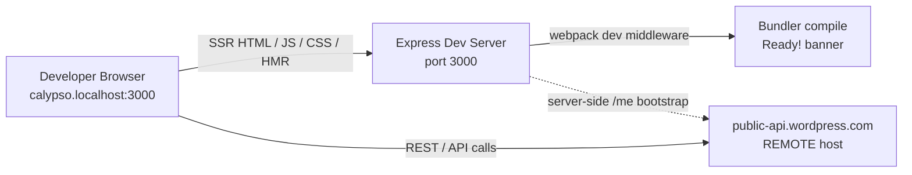

# WordPress.com Calypso Reader — Onboarding Investigation (Run-First)

This document is a **run-first** onboarding investigation of the WordPress.com **Calypso Reader**, produced by building and running the real code paths locally, capturing the actual runtime output, and only then writing the answers. It targets branch **`wp-calypso_be7e5cc64162`** (HEAD **`be7e5cc641`** — *"Reader: Show login prompts on all logged out reader streams"*). It answers four onboarding questions: (Q1) dev-server port, readiness, and port topology; (Q2) Reader initial-load endpoints and Redux actions; (Q3) pre-render authentication detection and storage; (Q4) responsive sidebar margins/padding, CSS custom properties, and breakpoints.

Every factual claim below is grounded with a `file:line` citation and names the specific function/selector responsible, and every fact carries one of two labels:

> **Legend**
> - **[OBSERVED]** — the fact was captured from live runtime output (server logs, HTTP responses, the browser's Redux store, `getComputedStyle`, network panel, or an isolated run of the *real* module). The exact command and its unedited output are shown.
> - **[INFERRED]** — the fact is derived from reading the source (with `file:line`), used only where a runtime signal genuinely could not be produced after varied attempts through the real entry point. Where used, the attempts made are documented.

This is a **read-only** investigation: no product source file was modified, created, or deleted. Temporary observation scripts and screenshots were used and then removed; the only permanent change to the repository is this document (and the `blitzy/documentation/` directory that holds it).

---

## Setup / Environment Summary

The investigation ran under the project's **canonical toolchain**, exercised through the real entry points a normal developer uses (`node bin/welcome.js`, the build, and the server, reachable at `http://calypso.localhost:3000`).

### Canonical toolchain (with citations)

- **Node.js `^v22.9.0`** — declared in `engines` at `package.json:L56` with `"node": "^v22.9.0"` at `package.json:L57`; pinned to `22.9.0` in `.nvmrc`. The installed **`v22.23.1`** satisfies the constraint. Node 20 would **fail** the `start` gate (`check-node-version`), so it was intentionally *not* used.
- **Yarn `4.0.2` via Corepack** — `yarnPath: .yarn/releases/yarn-4.0.2.cjs` at `.yarnrc.yml:L5`; `"packageManager": "yarn@4.0.2"` at `package.json:L422`.
- **Hosts requirement** — `127.0.0.1 calypso.localhost` must be present (`docs/install.md:L9`); the app is reached at `http://calypso.localhost:3000`. Local Calypso talks to the **remote** `public-api.wordpress.com` REST API (`docs/install.md:L38`), not a local API server.

### Version check — command and output **[OBSERVED]**

```bash
$ node --version
v22.23.1
$ yarn --version
4.0.2
$ npx check-node-version --package ; echo "exit=$?"
exit=0
```

The `check-node-version --package` gate (used by `scripts.start`) **passes** on `v22.23.1` (exit 0), confirming this is a canonical run rather than a bypass.

### Canonical `start` script (quoted from `package.json`)

- `package.json:L110` — `scripts.start`:
  ```
  npx check-node-version --package && node bin/welcome.js && yarn run build && yarn run start-build
  ```
- `package.json:L113` — `scripts.start-build`:
  ```
  BROWSERSLIST_ENV=evergreen node build/server.js | bunyan -o short
  ```

`docs/yarn-start.md` diagrams this same chain (welcome → build → start-build → `node build/server.js`). The build output feeds Q1's readiness banners.

### Welcome banner — command and output **[OBSERVED]**

`bin/welcome.js` (invoked first by `scripts.start`) prints the ASCII "calypso" banner (chalk-cyan):

```bash
$ node bin/welcome.js
```
```
             _
    ___ __ _| |_   _ _ __  ___  ___
   / __/ _` | | | | | '_ \/ __|/ _ \
  | (_| (_| | | |_| | |_) \__ \ (_) |
   \___\__,_|_|\__, | .__/|___/\___/
               |___/|_|
```

### Server start — command **[OBSERVED]**

The dev server was started through the canonical entry point (this is `scripts.start-build`, capturing both the raw and the bunyan-formatted streams for quoting):

```bash
$ BROWSERSLIST_ENV=evergreen node build/server.js 2>&1 | tee server.raw.log | bunyan -o short
```

The server ran as a background process (PID 25091, `node build/server.js`). `NODE_ENV` is baked as `development` via `config('env')` at `client/webpack.config.node.js:L16,L165`, so the development webpack dev-middleware bundler mounts inside the same Express app. A harmless `Failed to load ./.env.` line is printed (there is no `.env` file). The complete boot/readiness output is quoted in **Q1** below.

---

## Q1 — Dev-server port, readiness, and single-vs-multi-port topology

### Question (verbatim)

> "What port does the development server bind to, and how do I know when it's fully ready? Does the architecture use multiple ports for things like hot reloading and API calls, or is everything served from one place?"

### The bound port = `3000` **[OBSERVED]**

The port is configured at `config/development.json:L8` (`"port": 3000,`) and in the base config `config/_shared.json:L25` (`"port": 3000,`). It is resolved by `config( 'port' )` at **`client/server/index.js:L12`** and bound by `server.listen( { port, host: ... }, ... )` at `client/server/index.js:L83`, whose callback calls `sendBootStatus( 'ready' )` at `client/server/index.js:L85`.

> Note: the AAP cited `config('port')` at `client/server/index.js:L11`; the *actual* line is **L12** (L11 is `config('protocol')`). The observed line is cited here.

The bound port was observed directly in the boot log (next section) as `http://calypso.localhost:3000`, and confirmed listening:

```bash
$ curl -o /dev/null -s -w '%{http_code}\n' http://calypso.localhost:3000/
200
```

### Readiness signal #1 — the bunyan boot log **[OBSERVED]**

`client/server/index.js:L33` emits the boot line via `logger.info( 'wp-calypso booted in %dms - %s://%s:%s', Date.now() - start, protocol, host, port )`. Because `scripts.start-build` pipes server output through `| bunyan -o short` (`package.json:L113`), the same event is available raw and formatted.

Raw JSON (from `server.raw.log`):
```
{"name":"calypso","hostname":"reverse-code-generator-e8fc2048-f68zt","pid":25091,"level":30,"msg":"wp-calypso booted in 1088ms - http://calypso.localhost:3000","time":"2026-07-13T17:01:21.938Z","v":0}
```

Bunyan short form (from `server.log`):
```
17:01:21.938Z  INFO calypso: wp-calypso booted in 1088ms - http://calypso.localhost:3000
```

**Interpretation:** the `logger.info` call in `client/server/index.js` (the `server.listen` callback, L83–L85) reports the fully-resolved `protocol://host:port` = `http://calypso.localhost:3000`. This is the *server process* readiness signal (the HTTP listener is up).

### Readiness gating — `waitForCompiler` and the "Welcome to Calypso!" holding page **[OBSERVED]**

Being able to connect to port 3000 does **not** mean assets are ready. In development the bundler installs a gate, `waitForCompiler( request, response, next )` at `client/server/bundler/index.js:L66`, which holds requests until the webpack build finishes. While compiling, a request to `/` (matched at `client/server/bundler/index.js:L76`) receives a transient holding page (`client/server/bundler/index.js:L77-L93`):

```bash
$ curl -s http://calypso.localhost:3000/            # issued during compilation
```
```html

				<head>
					<meta http-equiv="refresh" content="5">
				</head>
				<body>
					<h1>Welcome to Calypso!</h1>
					<p>
						Please wait until webpack has finished compiling and you see
						<code style="font-size: 1.2em; color: blue; font-weight: bold;">READY!</code> in
						the server console. This page should then refresh automatically. If it hasn&rsquo;t, hit <em>Refresh</em>.
					</p>
					<p>
						In the meantime, try to follow all the emotions of the allmoji:
						
				</body>
```

This is the `<h1>Welcome to Calypso!</h1>` snippet at `client/server/bundler/index.js:L82` with the 5-second `<meta http-equiv="refresh" content="5">` at `client/server/bundler/index.js:L79` (HTTP 200, 630 bytes). Alongside it, the console prints the "Compiling assets…" hint (`client/server/bundler/index.js:L71-L73`):

```
Compiling assets... Wait until you see Ready! and then try http://calypso.localhost:3000/ again.
```

### Readiness signal #2 — the webpack "Ready!" banner (BOTH conditions) **[OBSERVED]**

The definitive "assets are ready" signal is the bundler's "Ready!" banner. There are **two** distinct messages and **both** were captured.

**First compile** — `client/server/bundler/index.js:L56`:
```
Ready! You can load http://calypso.localhost:3000/ now. Have fun!
```
(printed after the client compile finished — `webpack 5.97.1 compiled with 37 warnings in 170099 ms`).

**Recompile** — `client/server/bundler/index.js:L60`, triggered by touching a watched source file through the running dev server:
```bash
$ touch client/reader/following/main.tsx   # mtime-only; file contents unchanged
```
```
Ready! All assets are re-compiled. Have fun!
```

**Interpretation:** on the first compile the bundler prints the load-URL form (L56); on any subsequent recompile it prints the re-compiled form (L60). Both are the "fully ready" signal for the client assets. The `touch` was mtime-only — `git status` remained `?? blitzy/` before *and* after, so the repository stayed unchanged.

### Single-port topology — SSR + JS + CSS + HMR all on `:3000` **[OBSERVED]**

The webpack dev middleware is mounted on the **same** Express `app` in development at `client/server/boot/index.js:L36-L37`:

```js
if ( 'development' === process.env.NODE_ENV ) {
	require( 'calypso/server/bundler' )( app );
}
```

SSR page handling lives on the same app in `client/server/pages/index.js`, and the server bundle itself is built by `client/webpack.config.node.js`. All four concerns were observed served from the single port `3000`:

```bash
$ curl -s http://calypso.localhost:3000/ | head -c 120
<!doctype html><html lang="en" dir="ltr">... <title>WordPress.com</title> ... id="wpcom"     # SSR HTML (25104 bytes)

$ curl -o /dev/null -s -w '%{http_code} %{content_type} %{size_download}\n' http://calypso.localhost:3000/calypso/evergreen/vendors-node_modules_emotion_react...css
200 text/css 109799                                                                            # CSS asset

$ curl -o /dev/null -s -w '%{http_code} %{content_type} %{size_download}\n' http://calypso.localhost:3000/calypso/evergreen/root.js
200 application/javascript 16409                                                               # JS asset

$ curl -o /dev/null -s -w '%{http_code} %{content_type}\n' http://calypso.localhost:3000/__webpack_hmr
200 text/event-stream                                                                          # HMR (SSE) channel
```

**Interpretation:** server-side-rendered HTML (`client/server/pages/index.js`), JS bundles, CSS bundles, and the hot-module-replacement SSE channel (`/__webpack_hmr`) are **all** served from the one local port `3000`. There is no separate local port for HMR.

### There is NO second local port — REST/API is REMOTE **[OBSERVED]**

REST/API traffic does not target a second local port; it targets the **remote** `public-api.wordpress.com` host (`docs/install.md:L38`). This was confirmed both by probing local ports and by the Q2 network capture (every Reader REST call went to `public-api.wordpress.com`):

```bash
$ for p in 3000 5858 8080 443; do \
    echo -n "$p => "; curl -o /dev/null -s -w '%{http_code}\n' --max-time 2 http://calypso.localhost:$p/ ; \
  done
3000 => 200
5858 => 000
8080 => 000
443  => 000
```

Only `3000` responds; `000` denotes "no connection" (nothing listening). Port stability was confirmed across two runs (both `GET /` → HTTP 200, 25104 bytes — deterministic).

### Edge/alternate conditions

- **Debugger port `5858` [INFERRED — documentation].** `docs/install.md:L63` documents `NODE_OPTIONS="--inspect=5858" yarn start`. This is the V8 **inspector** port, *not* a request-serving port. Corroborated above: `:5858` returns `000` by default (it is only active when `--inspect=5858` is passed). Labeled INFERRED because the default run does not open it.
- **`MOCK_WORDPRESSDOTCOM=1` port override → `443` [INFERRED — non-canonical].** `client/server/index.js:L16-L20`: when `process.env.MOCK_WORDPRESSDOTCOM === '1'`, `port` is overridden to `443` (L18) and host to `wordpress.com` (L19). The **default** (no env var) canonical value is `3000`; this override was *not* run and any `443` value would be the non-canonical mock path. Labeled INFERRED/non-canonical.

### Topology summary

A single local port — **`3000`** — multiplexes SSR HTML, JS assets, CSS assets, and HMR. REST/API calls go to the **remote** `public-api.wordpress.com`, so there is no second local port for API traffic. The debugger port `5858` is opt-in and is not a request-serving port.



---

## Q2 — Reader initial-load endpoints and ordered Redux actions

### Question (verbatim)

> "What API endpoints get called to populate the stream, and what Redux actions fire during that initial load?"

### Real entry point and what the default session loads **[OBSERVED]**

The Reader was loaded at the real entry point `http://calypso.localhost:3000/reader` in the browser. Two facts were observed immediately:

1. **The default local session is LOGGED OUT.** `window.currentUser` is `undefined`; the only JS-visible cookies are `tk_ai`, `country_code`, `region`, `tk_qs` (no `wordpress_logged_in`, no `wpcom_token`); `localStorage` holds only `["tusSupport"]`; and no `CURRENT_USER_RECEIVE` action was dispatched. (Full detail in Q3.)
2. **`/reader` redirects to `/discover`** for the logged-out visitor (page title *"Browse popular blogs & read articles"*). `client/reader/following/index.js:L11` redirects `/following` → `/reader`; at HEAD the logged-out default stream is the Discover **Recommended** stream.

Because both `/read/following` (`client/state/data-layer/wpcom/read/streams/index.js:L194`) and `/read/streams/following` (`client/state/data-layer/wpcom/read/streams/index.js:L198`, `apiNamespace: 'wpcom/v2'`) exist in the stream-key→path map, the endpoint that *actually fires* was observed at runtime rather than assumed.

### Observed endpoint(s) — captured via the browser Network panel **[OBSERVED]**

To capture the ordered action stream and network calls through the *real* app, Calypso's own store hook was used: the store honors `window.__REDUX_DEVTOOLS_EXTENSION__` at `client/state/index.ts:L49`, so a minimal devtools enhancer that logs each dispatched action was injected via the page's init-script (the canonical hook, not a bypass). Network calls were read from the DevTools network list.

**Initial stream fetch** (first load — `INITIAL_FETCH = 4`, no `page_handle`):
```
reqid=179  GET https://public-api.wordpress.com/wpcom/v2/read/streams/discover?_envelope=1&orderBy=popular&meta=post%2Cdiscover_original_post&feed_id=&number=4&lang=en&tags%5B%5D=dailyprompt&tags%5B%5D=wordpress&tag_recs_per_card=5&site_recs_per_card=5&age_based_decay=0.5&content_width=675   [200]
```

**Subsequent page** (scroll/paginate — `PER_FETCH = 7`, `page_handle` present):
```
reqid=197  GET https://public-api.wordpress.com/wpcom/v2/read/streams/discover?_envelope=1&orderBy=popular&meta=post%2Cdiscover_original_post&feed_id=&page_handle=VAI_...&number=7&lang=en&tags%5B%5D=dailyprompt&tags%5B%5D=wordpress&tag_recs_per_card=5&site_recs_per_card=5&age_based_decay=0.5&content_width=675   [200]
```

**Post-hydration / enrichment calls** dispatched alongside the stream pages (all to `public-api.wordpress.com`):
```
/rest/v1.1/read/feed/{feedId}                        (READER_FEED_REQUEST)
/rest/v1.1/read/sites/{siteId}                       (READER_SITE_REQUEST)
/rest/v1.1/sites/{siteId}/posts/{postId}/replies     (COMMENTS_REQUEST)
/rest/v1.1/users/suggest?site_id=...                 (user suggestions)
/rest/v1.1/me, /me/settings, /me/preferences, /me/two-step  (fire optimistically; return envelope errors when logged out)
```

**Interpretation:** the default logged-out Reader populates its stream from **`GET https://public-api.wordpress.com/wpcom/v2/read/streams/discover`** with `orderBy=popular` and `number=4` on first load. The path comes from the `discover` entry of the `streamApis` map: `path: () => '/read/streams/discover'` at `client/state/data-layer/wpcom/read/streams/index.js:L226`, `orderBy: 'popular'` at `client/state/data-layer/wpcom/read/streams/index.js:L244`, and `apiNamespace: 'wpcom/v2'` at `client/state/data-layer/wpcom/read/streams/index.js:L246` (hence the `/wpcom/v2/` prefix). The `following` (`:L194`) and `recent` `/read/streams/following` (`:L198`) entries exist but were **not** the ones hit by the default stream. All REST calls target the **remote** `public-api.wordpress.com`, corroborating Q1's single-local-port / remote-REST topology.

### Fetch counts — `INITIAL_FETCH = 4` vs `PER_FETCH = 7` **[OBSERVED]**

- `PER_FETCH = 7` at `client/state/data-layer/wpcom/read/streams/index.js:L160`; `INITIAL_FETCH = 4` at `client/state/data-layer/wpcom/read/streams/index.js:L161`.
- The `requestPage` **data-layer handler** at `client/state/data-layer/wpcom/read/streams/index.js:L358` computes the count at **`client/state/data-layer/wpcom/read/streams/index.js:L380`**: `const fetchCount = pageHandle ? PER_FETCH : INITIAL_FETCH;`. On the **first** load there is no `pageHandle`, so `number = 4`; the next page carries a `page_handle`, so `number = 7`. The outbound call is the `http( { method: 'GET', path: path( { ...action.payload } ), apiVersion, apiNamespace, query, onSuccess, onFailure } )` return of the handler at **`client/state/data-layer/wpcom/read/streams/index.js:L395-L405`** (path built at `:L397`, `apiVersion` default `'1.2'` at `client/state/data-layer/wpcom/read/streams/index.js:L370`, `apiNamespace` at `:L399`).

> Note: AAP cited `fetchCount` at L379 and the `http()` return at L393–405; the *actual* lines are **L380** and **L395–L405** respectively. Observed lines are cited.

**Reproducibility [OBSERVED]:** `number=4` (initial) and `number=7` (subsequent page) were identical across **two** runs (run1 reqids 179/197; run2 reqids 507/528) — deterministic.

### Ordered Redux action sequence — captured via a store subscriber **[OBSERVED]**

The ordered actions dispatched during the initial load (indices `n=40..70` from the injected devtools logger, trimmed to the stream-relevant window; the full log continues to `n=187`):

```
40  DOCUMENT_HEAD_META_SET
41  PREFERENCES_FETCH_FAILURE
42  DOCUMENT_HEAD_UNREAD_COUNT_SET
43  READER_RESET_CARD_EXPANSIONS
44  READER_VIEW_STREAM
45  WPCOM_HTTP_REQUEST                 <- data-layer side effect (the outbound GET)
46  READER_STREAMS_PAGE_REQUEST        <- requestPage action creator
47  POST_LIKES_RECEIVE   (x7: 47..53)
54  READER_POSTS_RECEIVE               <- post hydration
55  READER_RECOMMENDED_SITES_RECEIVE
56  READER_STREAMS_PAGE_RECEIVE        <- receivePage action creator (page 1)
57  WPCOM_HTTP_REQUEST                 <- page 2 side effect
58  READER_STREAMS_PAGE_REQUEST (number=7)
60  READER_FEED_REQUEST
62  READER_SITE_REQUEST
64  COMMENTS_REQUEST
...
187 READER_STREAMS_PAGE_RECEIVE        <- receivePage (page 2)
```

Stable across run 2 (counts): `READER_VIEW_STREAM=1`, `READER_STREAMS_PAGE_REQUEST=2`, `READER_STREAMS_PAGE_RECEIVE=2`, `READER_POSTS_RECEIVE=4`, `READER_STREAMS_PAGINATED_REQUEST=0`, `READER_STREAMS_UPDATES_RECEIVE=0`.

**Interpretation — action creators, their types, and what fired:**

- **`requestPage`** — action creator at `client/state/reader/streams/actions.js:L28`, returns `type: READER_STREAMS_PAGE_REQUEST` (`client/state/reader/streams/actions.js:L39`; constant at `client/state/reader/action-types.ts:L78`). **[OBSERVED]** at `n=46, 58`. The data-layer middleware intercepts this action and issues the HTTP side effect, observed as `WPCOM_HTTP_REQUEST` at `n=45, 57` (the `http()` call from `client/state/data-layer/wpcom/read/streams/index.js:L395-L405`).
- **`receivePage`** — action creator at `client/state/reader/streams/actions.js:L52`, returns `READER_STREAMS_PAGE_RECEIVE` (`client/state/reader/streams/actions.js:L63`; constant at `client/state/reader/action-types.ts:L77`). **[OBSERVED]** at `n=56, 187`.
- **`READER_POSTS_RECEIVE`** — post-hydration action from `client/state/reader/posts/actions.js`, dispatched alongside stream pages. **[OBSERVED]** at `n=54, 101, 185, 188`.
- **`requestPaginatedStream`** — action creator at `client/state/reader/streams/actions.js:L143`, returns `READER_STREAMS_PAGINATED_REQUEST` (constant at `client/state/reader/action-types.ts:L79`). **[INFERRED — code-defined]**: count `0` on the discover initial load (used by the paginated stream variant, not the discover default).
- **`receiveUpdates`** — action creator at `client/state/reader/streams/actions.js:L87`, returns `READER_STREAMS_UPDATES_RECEIVE` (constant at `client/state/reader/action-types.ts:L85`). **[INFERRED — code-defined]**: not fired on initial load (it fires during polling). Likewise `receiveNewPost` → `READER_STREAMS_NEW_POST_RECEIVE` (`client/state/reader/action-types.ts:L86`) is **[INFERRED]** (not fired on initial load).

### Edge/alternate conditions

- **Initial vs subsequent page [OBSERVED]:** first load → `number=4`, no `page_handle`; scroll → `number=7`, `page_handle` present (both captured above).
- **Logged-out default stream [OBSERVED]:** the logged-out visitor loads `discover:recommended` (`/read/streams/discover`), not `following`. The stream *does* populate (login prompts are shown around it, but the fetch fires), so the endpoint and the `READER_STREAMS_PAGE_REQUEST`/`READER_STREAMS_PAGE_RECEIVE` pair were genuinely OBSERVED, not inferred.
- **Actions not fired on initial load [INFERRED]:** `READER_STREAMS_PAGINATED_REQUEST`, `READER_STREAMS_UPDATES_RECEIVE`, `READER_STREAMS_NEW_POST_RECEIVE` are code-defined but did not fire during the initial discover load (labeled INFERRED with citations above).

---

## Q3 — Pre-render authentication detection and storage mechanisms

### Question (verbatim)

> "how the app knows whether someone is logged in before it decides what to render, what storage mechanisms does it check?"

### The decision predicate — `isUserLoggedIn` / `getCurrentUserId` **[OBSERVED]**

The render decision reduces to the selector `isUserLoggedIn( state )`, defined at `client/state/current-user/selectors.js:L15-L17` as `getCurrentUserId( state ) !== null`; and `getCurrentUserId( state )` at `client/state/current-user/selectors.js:L6-L8` returns `state.currentUser?.id`. The `id` reducer defaults to `null` at `client/state/current-user/reducer.js:L24`.

The running app's Redux state was inspected for the default session (the main app store — index 1 of the page's stores, the one carrying the 47-key root with a `currentUser` slice):

```js
// evaluate_script against the running app store
state.currentUser
// => {"id":null,"user":null,"capabilities":{},"flags":[],"emailVerification":{"status":null,"errorMessage":""},"lasagnaJwt":null}

getCurrentUserId(state)          // state.currentUser?.id
// => null

isUserLoggedIn(state)            // getCurrentUserId(state) !== null  =>  null !== null
// => false
```

**Interpretation:** for the default local session, `getCurrentUserId` returns **`null`**, so `isUserLoggedIn` returns **`false`** — the app renders the logged-out experience (the login prompts observed in Q2/Q4). The selector `isUserLoggedIn` in `client/state/current-user/selectors.js` is the specific function that performs the "is this visitor logged in?" decision.

### Storage mechanism (a) — server cookie `wordpress_logged_in` **[OBSERVED edge]**

`client/server/user-bootstrap/index.js:L8` defines `AUTH_COOKIE_NAME = 'wordpress_logged_in'`; `getBootstrappedUser` (`client/server/user-bootstrap/index.js:L27`) reads it via `request.cookies[ AUTH_COOKIE_NAME ]` at `client/server/user-bootstrap/index.js:L28` and, when present, fetches `API_PATH = 'https://public-api.wordpress.com/rest/v1/me'` (`client/server/user-bootstrap/index.js:L13`).

This server-side bootstrap is **gated** by `config.isEnabled( 'wpcom-user-bootstrap' )` (`client/server/pages/index.js:L364,L816,L822`), which is **`false` in development** (`config/development.json:L209`) and `true` in production/stage/wpcalypso/horizon. So in the default dev run the server-cookie bootstrap is *not* the active path; it is the production mechanism.

**Edge condition — cookie absent [OBSERVED]:** when the cookie is missing, `getBootstrappedUser` throws `Error( 'Cannot bootstrap without an auth cookie' )` at `client/server/user-bootstrap/index.js:L34`. This was exercised by bundling the **real** `getBootstrappedUser` module with esbuild (aliasing `calypso`→`client`, stubbing only the unrelated `@automattic/calypso-config` import that the L33–L34 guard does not use) and invoking it with an empty cookie jar:

```bash
$ node /tmp/calypso_obs/bootstrap_edge.mjs      # calls the real getBootstrappedUser with request.cookies = {}
THROW_MESSAGE: Cannot bootstrap without an auth cookie
```

The output is exactly the `client/server/user-bootstrap/index.js:L34` message, observed from the real module.

### Storage mechanism (b) — `wpcom_token` cookie + localStorage `store` **[OBSERVED]**

`packages/oauth-token/src/index.js:L7` defines `TOKEN_NAME = 'wpcom_token'`. The `getToken()` function (`packages/oauth-token/src/index.js:L10`) reads the browser cookie **first** — `cookie.parse( document.cookie )` at `packages/oauth-token/src/index.js:L11-L14` — and **then** falls back to `store.get( TOKEN_NAME )` (localStorage) at `packages/oauth-token/src/index.js:L17-L21`, returning `false` if neither is present (`packages/oauth-token/src/index.js:L23`).

Observed for the default session:
```js
document.cookie
// => "tk_ai=...; country_code=...; region=...; tk_qs=..."   (NO wpcom_token)
window.localStorage.getItem('wpcom_token')
// => null
```

**Interpretation:** neither the `wpcom_token` cookie nor the localStorage entry is present, so `getToken()` would return `false` (logged-out). The **read order is cookie → localStorage**, per `getToken` in `packages/oauth-token/src/index.js`.

### Storage mechanism (c) — tiered browser storage: IndexedDB → localStorage → in-memory **[OBSERVED]**

`client/lib/browser-storage/index.ts` implements a three-tier persistence layer: `DB_NAME = 'calypso'` (`:L20`), `DB_VERSION = 2` (`:L21`), `STORE_NAME = 'calypso_store'` (`:L22`). `supportsIDB` is a memoized async probe at `client/lib/browser-storage/index.ts:L36`. `getStoredItem` at `client/lib/browser-storage/index.ts:L275` first returns `bypassGet( key )` if bypass is active (`:L276-L277`, in-memory), then checks `await supportsIDB()` (`:L280-L281`, IndexedDB), then falls back to `window.localStorage.getItem( key )` (`:L283`).

Observed in the browser (DevTools → Application):
```
IndexedDB:  database "calypso" (version 2), object store "calypso_store"   <- ACTIVE PRIMARY tier
  keys: browser-storage-sanity-test,
        redux-state-logged-out,
        redux-state-logged-out:{all-domains, connectedApplications, documentHead,
          memberships, plugins, preferences, pushNotifications, reader, readerUi,
          route, signup, siteSettings, teams, ui, userSuggestions},
        was-state-randomly-cleared
localStorage: ["tusSupport"]   <- present as fallback tier
in-memory bypass: NOT active
```

**Interpretation:** the **IndexedDB** tier (`calypso` v2 / `calypso_store`) is the active primary store (`supportsIDB()` → true), with **localStorage** available as the fallback and the **in-memory bypass** inactive. `getStoredItem`/`supportsIDB` in `client/lib/browser-storage/index.ts` are the functions that select the tier. The localStorage-fallback and memory-bypass tiers are **[INFERRED — code path]** for this session (the primary IndexedDB tier was the one actually exercised; the fallbacks are reached only when a higher tier is unavailable).

### Client bootstrap path — `window.currentUser` vs `/me` **[OBSERVED]**

`initializeCurrentUser` at `client/lib/user/shared-utils/initialize-current-user.js:L11`: when `config.isEnabled( 'wpcom-user-bootstrap' )` (`:L28`) it returns the server-injected `window.currentUser` (`:L29-L30`) or `false` (`:L32`); when bootstrap is **disabled** (dev), it awaits `rawCurrentUserFetch()` (`:L37`), which is `wpcom.me().get( { meta: 'flags' } )` at `client/lib/user/shared-utils/raw-current-user-fetch.js:L3-L6`.

Observed for the default session:
```js
window.currentUser
// => undefined                (dev: wpcom-user-bootstrap is false, so no server injection)
```
and the resulting client `/me` fetch was captured on the network:
```
reqid=128  GET https://public-api.wordpress.com/rest/v1.1/me?http_envelope=1&meta=flags   [200, envelope: authorization_required]
```

**Interpretation:** because `wpcom-user-bootstrap` is disabled in dev, `window.currentUser` is `undefined` and the client performs the raw `/me` fetch (`rawCurrentUserFetch`). The `/me` envelope returns `authorization_required` for the logged-out visitor, so no user is set and `initialize-current-user` swallows the `authorization_required` error (`client/lib/user/shared-utils/initialize-current-user.js:L39`), leaving `currentUser.id = null`.

### Persisted Redux state rehydration **[OBSERVED]**

`client/state/initial-state.js` rehydrates persisted state from browser storage: it imports `setStoredItem` from `calypso/lib/browser-storage` (`:L4`), and its storage-key builder at `client/state/initial-state.js:L76` is `'redux-state-' + ( userId ?? 'logged-out' )` (with an optional `:subkey`). `persistOnChange( store, currentUserId )` (`:L88`) and `getInitialState( reducer, currentUserId )` (`:L140`) key persistence on the current user id.

**Interpretation:** the observed IndexedDB keys are `redux-state-logged-out*` — a direct reflection of `getCurrentUserId` → `null` → the `'logged-out'` key suffix. This ties the persisted-state storage (mechanism c) back to the auth-detection predicate: the same `null` user id that makes `isUserLoggedIn` return `false` also selects the `logged-out` persistence namespace.

### Edge/alternate conditions

- **Logged-out (default) [OBSERVED]** vs **logged-in [INFERRED — not exercised]:** the default local session is logged out (HEAD shows login prompts on logged-out Reader streams). The logged-in branch (`getCurrentUserId` → a numeric id → `isUserLoggedIn` → `true`) was not exercised because no credentials were used; it is INFERRED from the selector code.
- **IndexedDB primary vs localStorage fallback [OBSERVED / INFERRED]:** IndexedDB primary was OBSERVED active; the localStorage fallback and in-memory bypass are INFERRED code paths (not forced this session).
- **Server bootstrap cookie present vs absent [OBSERVED absent-path / INFERRED present-path]:** the cookie-absent throw at `client/server/user-bootstrap/index.js:L34` was OBSERVED via the isolated real-module run; the cookie-present success path is the production mechanism (INFERRED; dev disables `wpcom-user-bootstrap`).

---

## Q4 — Responsive sidebar: margin/padding, CSS custom properties, and breakpoints

### Question (verbatim)

> "What are the specific margin and padding values on the sidebar header, what CSS custom properties drive the layout calculations, and at what viewport widths do things change?"

### Runtime caveat — the sidebar does not mount logged out **[OBSERVED]**

On the default **logged-out** Reader, the global sidebar (and its header) does **not** mount. This was corroborated visually in the running browser (viewport 1280×900, logged out): the `/discover` page renders a dark masterbar (WordPress.com logo + "Discover / Popular Tags / Search / **Log In**" + white "**Sign Up**") and a **single centered content column** with no left sidebar. The DOM confirms it:

```js
// evaluate_script, viewport 1280x900, logged out
document.querySelector('.sidebar__header')   // => null
document.querySelector('.sidebar')           // => null
document.querySelector('.global-sidebar')    // => null
document.querySelector('.layout__content')   // => <div> (present)
document.querySelector('.masterbar')         // => <header> (present)
```

Consequently the sidebar-header **padding/margin** values are labeled **[INFERRED — source-derived]**, while the custom properties and `.layout__content` padding (which *do* mount) are **[OBSERVED]**. Genuine varied attempts to observe `.sidebar__header` at runtime are documented below.

### Sidebar-header padding **[INFERRED — source-derived]**

The selector `.sidebar__header` (opened at `client/layout/global-sidebar/style.scss:L70`) declares:

```scss
.sidebar__header {
	align-items: center;
	// Hide the header when the masterbar is visible.
	display: none;                 // client/layout/global-sidebar/style.scss:L73
	gap: 8px;
	padding: 30px 24px 29px;       // client/layout/global-sidebar/style.scss:L75
	...
	span.dotcom {                  // client/layout/global-sidebar/style.scss:L82
		display: flex;
		width: 125px;
		height: 28px;
		margin: 0;                 // client/layout/global-sidebar/style.scss:L86
		...
	}
}
```

- **Padding = `30px 24px 29px`** on `.sidebar__header` (`client/layout/global-sidebar/style.scss:L75`) — i.e. top `30px`, left/right `24px`, bottom `29px`.
- `.sidebar__header` is `display: none` when the masterbar is visible (`client/layout/global-sidebar/style.scss:L73`), which is why it does not appear on the logged-out Reader.

### Sidebar-header margin — scoping nuance **[INFERRED — source-derived]**

**`.sidebar__header` itself declares NO explicit `margin`.** The `margin: 0` at `client/layout/global-sidebar/style.scss:L86` belongs to the **nested `span.dotcom`** selector (opened at `client/layout/global-sidebar/style.scss:L82`) — the WordPress.com logo element (`width: 125px; height: 28px;`), **not** to `.sidebar__header` directly. Any claim of `.sidebar__header { margin: 0 }` would be incorrect; the correct statement is that the `margin: 0` applies to `span.dotcom` inside the header, while `.sidebar__header` has no explicit margin of its own.

### Classic sidebar & SidebarV2 header spacing **[INFERRED — source-derived]**

- Classic sidebar base: `.sidebar { margin: 0; padding: 0; padding-top: 6px; }` — `client/layout/sidebar/style.scss:L4-L6`; nested item spacing `padding: 16px 8px 6px 16px; margin: 0;` — `client/layout/sidebar/style.scss:L70-L71`.
- `SidebarV2Header` renders `<div className="sidebar-v2__header">` — `client/layout/sidebar-v2/header.tsx:L9`.

### CSS custom properties driving the `calc()` layout **[OBSERVED]**

Resolved from `getComputedStyle` on the document root of the running app:

```js
// evaluate_script — getComputedStyle(document.documentElement), viewport 1280px
--masterbar-height    // => "32px"
--sidebar-width-max   // => "272px"
--sidebar-width-min   // => "228px"
// (--content-padding-top / --content-padding-bottom are empty at :root)
```

Named source values in `client/assets/stylesheets/shared/_variables.scss` (declared on `:root` at `client/assets/stylesheets/shared/_variables.scss:L5`):
- `--masterbar-height: 46px` — `client/assets/stylesheets/shared/_variables.scss:L7` (base), overridden to `32px` inside `@media only screen and (min-width: 782px)` at `client/assets/stylesheets/shared/_variables.scss:L10-L12`.
- `--sidebar-width-max: 272px` — `client/assets/stylesheets/shared/_variables.scss:L15`.
- `--sidebar-width-min: 228px` — `client/assets/stylesheets/shared/_variables.scss:L16`.

### The `782px` toggle — a concrete "viewport width at which things change" **[OBSERVED]**

Resizing the viewport across the `782px` media query flips `--masterbar-height`:

```js
// evaluate_script — getComputedStyle(document.documentElement).getPropertyValue('--masterbar-height')
viewport 700px  => "46px"     // below the 782px min-width media query (base value)
viewport 1280px => "32px"     // at/above 782px (the @media override)
```

`--sidebar-width-max` (`272px`) and `--sidebar-width-min` (`228px`) stayed constant across the resize. This confirms `client/assets/stylesheets/shared/_variables.scss:L10-L12` as the concrete masterbar/layout change point at **`782px`**.

### `calc()` consumers — `.layout__content` **[OBSERVED, with the calc branch INFERRED]**

`.layout__content` (opened at `client/layout/style.scss:L48`) sets its padding with a `calc()` that consumes the sidebar-width custom properties:

- Base: `padding: 79px 32px 32px calc(var(--sidebar-width-max) + 32px + 1px);` — `client/layout/style.scss:L52`.
- Responsive `<960px` variant (`@include breakpoint-deprecated( "<960px" )` at `client/layout/style.scss:L118`): `padding: 71px 24px 24px calc(var(--sidebar-width-min) + 24px + 1px);` — `client/layout/style.scss:L119`.

Observed computed padding on the running (logged-out) app:
```js
// evaluate_script — getComputedStyle(document.querySelector('.layout__content')).padding
viewport 1280px => "79px 32px 32px"   (paddingLeft = 32px)   // no-sidebar case
viewport 700px  => "71px 24px 24px"                          // <960px breakpoint variant
```

**Interpretation:** the top/right/bottom values (`79/32/32` → `71/24/24`) confirm the base vs `<960px` branches OBSERVED. The **left** padding resolved to `32px`/`24px` rather than the `calc(var(--sidebar-width-max) + 32px + 1px)` value because the layout carries the `.has-no-sidebar` state when no sidebar mounts (logged out). The full `calc()` branch that adds the sidebar width is therefore **[INFERRED — source-derived]** from `client/layout/style.scss:L52,L119`. The Reader sidebar's own `calc()` padding (using `--masterbar-height` / `--content-padding-top` / `--sidebar-width-max`, with a `@media (min-width: 782px)` variant) lives at `client/reader/sidebar/style.scss:L70-L92` (also INFERRED — the reader sidebar does not mount logged out).

### Breakpoints — both sets, by value

**Deprecated in-repo Calypso set [OBSERVED — from file]:** at `client/assets/stylesheets/shared/mixins/_breakpoints.scss:L10`:
```scss
$breakpoints: 480px, 660px, 800px, 960px, 1040px, 1280px, 1400px;
```
consumed by the `breakpoint-deprecated( $sizes... )` mixin at `client/assets/stylesheets/shared/mixins/_breakpoints.scss:L12`. The deprecation comment at `client/assets/stylesheets/shared/mixins/_breakpoints.scss:L4` directs new code to use Gutenberg breakpoints instead.

**Modern Gutenberg `@wordpress/base-styles` set [INFERRED — framework-sourced]** (the set the repo defers to; corroborated by framework docs, not runtime-observed): `$break-mobile: 480px`, `$break-small: 600px`, `$break-medium: 782px`, `$break-large: 960px`, `$break-xlarge: 1080px`, `$break-wide: 1280px`, `$break-huge: 1440px`, plus `$break-xhuge: 1920px` and `$break-zoomed-in: 280px`.

**The concrete change points for the masterbar/sidebar layout [OBSERVED]:** `782px` (toggles `--masterbar-height` `46px` → `32px`, confirmed by resize above) and `960px` (the `breakpoint-deprecated( "<960px" )` variant of `.layout__content`, confirmed by the `79/32/32` → `71/24/24` padding change above).

### Documented attempts to OBSERVE `.sidebar__header` at runtime

Per the persist-until-captured rule, several varied attempts were made to obtain a computed style for `.sidebar__header` before labeling it INFERRED:
1. **DOM inspection** at 1280px and 700px (logged out): `.sidebar__header`, `.sidebar`, `.global-sidebar`, `.sidebar-v2__header`, `span.dotcom` all absent.
2. **CSSOM search** across every loaded stylesheet: `{ sheetsTotal: 51, sheetsReadable: 50, matches: [] }` — no `.sidebar__header` or `span.dotcom` rule is even loaded on the logged-out Reader.
3. **Disk CSS grep** of `public/build`: the compiled chunk containing the global sidebar styles is not present (the dev bundler compiles chunks from memory on demand, and this chunk is not compiled for the logged-out route).

Because the element genuinely does not mount and its rules are not loaded logged out, the padding `30px 24px 29px` and the `span.dotcom` `margin: 0` are reported as **[INFERRED — source-derived]** with their exact `file:line` anchors.

---

## Coverage Pass

Every named item across the four questions, with its value, `file:line`, and label.

### Q1 — Dev-server topology & readiness

| Named item | Value | `file:line` | Label |
|---|---|---|---|
| Bound port (dev config) | `3000` | `config/development.json:L8` | OBSERVED |
| Bound port (base config) | `3000` | `config/_shared.json:L25` | OBSERVED |
| Port resolution | `config( 'port' )` | `client/server/index.js:L12` | OBSERVED |
| Listener bind | `server.listen( { port, ... } )` | `client/server/index.js:L83` | OBSERVED |
| Ready callback | `sendBootStatus( 'ready' )` | `client/server/index.js:L85` | OBSERVED |
| Bunyan boot log | `wp-calypso booted in 1088ms - http://calypso.localhost:3000` | `client/server/index.js:L33` | OBSERVED |
| Bunyan formatting | `\| bunyan -o short` | `package.json:L113` | OBSERVED |
| Ready! (first compile) | `Ready! You can load http://calypso.localhost:3000/ now. Have fun!` | `client/server/bundler/index.js:L56` | OBSERVED |
| Ready! (recompile) | `Ready! All assets are re-compiled. Have fun!` | `client/server/bundler/index.js:L60` | OBSERVED |
| Request gate | `waitForCompiler( request, response, next )` | `client/server/bundler/index.js:L66` | OBSERVED |
| Holding page | `<h1>Welcome to Calypso!</h1>` | `client/server/bundler/index.js:L82` | OBSERVED |
| Holding page refresh | `<meta http-equiv="refresh" content="5">` | `client/server/bundler/index.js:L79` | OBSERVED |
| Compiling hint | `Compiling assets... Wait until you see Ready!...` | `client/server/bundler/index.js:L71-L73` | OBSERVED |
| Single-port bundler mount | `require('calypso/server/bundler')(app)` (dev) | `client/server/boot/index.js:L36-L37` | OBSERVED |
| SSR handler | page rendering on same app | `client/server/pages/index.js` | OBSERVED |
| HMR channel | `GET /__webpack_hmr` → `text/event-stream` | (runtime; served on :3000) | OBSERVED |
| REST is remote | `public-api.wordpress.com` | `docs/install.md:L38` | OBSERVED |
| Debugger port | `5858` (opt-in `--inspect`) | `docs/install.md:L63` | INFERRED |
| Mock port override | `port = 443` when `MOCK_WORDPRESSDOTCOM==='1'` | `client/server/index.js:L16-L20` | INFERRED (non-canonical) |

### Q2 — Reader endpoints & Redux actions

| Named item | Value | `file:line` | Label |
|---|---|---|---|
| Observed initial endpoint | `GET /wpcom/v2/read/streams/discover?...&number=4` | `client/state/data-layer/wpcom/read/streams/index.js:L226` | OBSERVED |
| `orderBy` | `popular` | `client/state/data-layer/wpcom/read/streams/index.js:L244` | OBSERVED |
| `apiNamespace` | `wpcom/v2` | `client/state/data-layer/wpcom/read/streams/index.js:L246` | OBSERVED |
| `following` path (not hit) | `/read/following` | `client/state/data-layer/wpcom/read/streams/index.js:L194` | INFERRED |
| `recent` path (not hit) | `/read/streams/following` | `client/state/data-layer/wpcom/read/streams/index.js:L198` | INFERRED |
| `INITIAL_FETCH` | `4` (first load, `number=4`) | `client/state/data-layer/wpcom/read/streams/index.js:L161` | OBSERVED |
| `PER_FETCH` | `7` (subsequent, `number=7`) | `client/state/data-layer/wpcom/read/streams/index.js:L160` | OBSERVED |
| `requestPage` handler | data-layer HTTP effect | `client/state/data-layer/wpcom/read/streams/index.js:L358` | OBSERVED |
| `fetchCount` | `pageHandle ? PER_FETCH : INITIAL_FETCH` | `client/state/data-layer/wpcom/read/streams/index.js:L380` | OBSERVED |
| `http()` call | `GET` with path/query | `client/state/data-layer/wpcom/read/streams/index.js:L395-L405` | OBSERVED |
| `requestPage` creator | `→ READER_STREAMS_PAGE_REQUEST` | `client/state/reader/streams/actions.js:L28` | OBSERVED |
| `receivePage` creator | `→ READER_STREAMS_PAGE_RECEIVE` | `client/state/reader/streams/actions.js:L52` | OBSERVED |
| `requestPaginatedStream` | `→ READER_STREAMS_PAGINATED_REQUEST` | `client/state/reader/streams/actions.js:L143` | INFERRED (not fired) |
| `receiveUpdates` | `→ READER_STREAMS_UPDATES_RECEIVE` | `client/state/reader/streams/actions.js:L87` | INFERRED (not fired) |
| `READER_STREAMS_PAGE_RECEIVE` | type constant | `client/state/reader/action-types.ts:L77` | OBSERVED |
| `READER_STREAMS_PAGE_REQUEST` | type constant | `client/state/reader/action-types.ts:L78` | OBSERVED |
| `READER_STREAMS_PAGINATED_REQUEST` | type constant | `client/state/reader/action-types.ts:L79` | INFERRED |
| `READER_STREAMS_UPDATES_RECEIVE` | type constant | `client/state/reader/action-types.ts:L85` | INFERRED |
| `READER_STREAMS_NEW_POST_RECEIVE` | type constant | `client/state/reader/action-types.ts:L86` | INFERRED |
| Post-hydration action | `READER_POSTS_RECEIVE` | `client/state/reader/posts/actions.js` | OBSERVED |
| `/reader` → `/discover` redirect | logged-out default | `client/reader/following/index.js:L11` | OBSERVED |

### Q3 — Auth detection & storage

| Named item | Value | `file:line` | Label |
|---|---|---|---|
| `isUserLoggedIn` | `getCurrentUserId(state) !== null` → `false` | `client/state/current-user/selectors.js:L15-L17` | OBSERVED |
| `getCurrentUserId` | `state.currentUser?.id` → `null` | `client/state/current-user/selectors.js:L6-L8` | OBSERVED |
| `id` reducer default | `null` | `client/state/current-user/reducer.js:L24` | OBSERVED |
| Server cookie name | `wordpress_logged_in` | `client/server/user-bootstrap/index.js:L8` | OBSERVED (absent) |
| Cookie read | `request.cookies[ AUTH_COOKIE_NAME ]` | `client/server/user-bootstrap/index.js:L28` | OBSERVED |
| Bootstrap `/me` path | `.../rest/v1/me` | `client/server/user-bootstrap/index.js:L13` | INFERRED |
| Cookie-absent throw | `Cannot bootstrap without an auth cookie` | `client/server/user-bootstrap/index.js:L34` | OBSERVED |
| `wpcom-user-bootstrap` (dev) | `false` | `config/development.json:L209` | OBSERVED |
| Token name | `wpcom_token` | `packages/oauth-token/src/index.js:L7` | OBSERVED (absent) |
| `getToken` read order | cookie → localStorage | `packages/oauth-token/src/index.js:L11-L21` | OBSERVED |
| Browser-storage DB | `calypso` / v2 / `calypso_store` | `client/lib/browser-storage/index.ts:L20-L22` | OBSERVED |
| `supportsIDB` | memoized IDB probe → true | `client/lib/browser-storage/index.ts:L36` | OBSERVED |
| `getStoredItem` tiers | bypass → IDB → localStorage | `client/lib/browser-storage/index.ts:L275-L283` | OBSERVED (IDB) / INFERRED (fallbacks) |
| Client bootstrap | `window.currentUser` (undefined) vs `/me` | `client/lib/user/shared-utils/initialize-current-user.js:L28-L37` | OBSERVED |
| Raw `/me` fetch | `wpcom.me().get({ meta: 'flags' })` | `client/lib/user/shared-utils/raw-current-user-fetch.js:L3-L6` | OBSERVED |
| Persistence key | `redux-state-` + (`userId` ?? `logged-out`) | `client/state/initial-state.js:L76` | OBSERVED |

### Q4 — Responsive sidebar

| Named item | Value | `file:line` | Label |
|---|---|---|---|
| `.sidebar__header` padding | `30px 24px 29px` | `client/layout/global-sidebar/style.scss:L75` | INFERRED |
| `.sidebar__header` margin | none (no explicit margin) | `client/layout/global-sidebar/style.scss:L70` | INFERRED |
| `span.dotcom` margin | `0` (nested logo, NOT the header) | `client/layout/global-sidebar/style.scss:L86` | INFERRED |
| `.sidebar__header` visibility | `display: none` when masterbar visible | `client/layout/global-sidebar/style.scss:L73` | INFERRED |
| Classic `.sidebar` | `margin:0; padding:0; padding-top:6px` | `client/layout/sidebar/style.scss:L4-L6` | INFERRED |
| Classic item spacing | `padding:16px 8px 6px 16px; margin:0` | `client/layout/sidebar/style.scss:L70-L71` | INFERRED |
| `SidebarV2Header` | `<div className="sidebar-v2__header">` | `client/layout/sidebar-v2/header.tsx:L9` | INFERRED |
| `--masterbar-height` | `46px` → `32px` @ 782px | `client/assets/stylesheets/shared/_variables.scss:L7,L10-L12` | OBSERVED |
| `--sidebar-width-max` | `272px` | `client/assets/stylesheets/shared/_variables.scss:L15` | OBSERVED |
| `--sidebar-width-min` | `228px` | `client/assets/stylesheets/shared/_variables.scss:L16` | OBSERVED |
| `.layout__content` base padding | `79px 32px 32px calc(var(--sidebar-width-max)+32px+1px)` | `client/layout/style.scss:L52` | OBSERVED (calc branch INFERRED) |
| `.layout__content` `<960px` padding | `71px 24px 24px calc(var(--sidebar-width-min)+24px+1px)` | `client/layout/style.scss:L119` | OBSERVED (calc branch INFERRED) |
| Reader sidebar calc padding | uses `--masterbar-height`/`--sidebar-width-max` | `client/reader/sidebar/style.scss:L70-L92` | INFERRED |
| Deprecated breakpoints | `480, 660, 800, 960, 1040, 1280, 1400px` | `client/assets/stylesheets/shared/mixins/_breakpoints.scss:L10` | OBSERVED |
| `breakpoint-deprecated` mixin | `@mixin breakpoint-deprecated($sizes...)` | `client/assets/stylesheets/shared/mixins/_breakpoints.scss:L12` | OBSERVED |
| Gutenberg breakpoints | `480/600/782/960/1080/1280/1440` (+1920, +280) | `@wordpress/base-styles` (framework) | INFERRED |
| Concrete change points | `782px` (masterbar height), `960px` (layout padding) | `_variables.scss:L10-L12`; `style.scss:L118-L119` | OBSERVED |

---

## Cleanup note

All temporary observation scripts and captured-output files (created under `/tmp/calypso_obs/`, outside the tracked tree — version dumps, server logs, the holding-page capture, the network capture, the isolated `getBootstrappedUser` esbuild bundle and its stub) and any observation screenshots were removed after the output was captured, and the observation dev server was stopped. The only permanent change to the repository is this document (and the `blitzy/documentation/` directory that contains it). No product source file was created, modified, or deleted; `git status` shows only this new documentation file under `blitzy/`.

