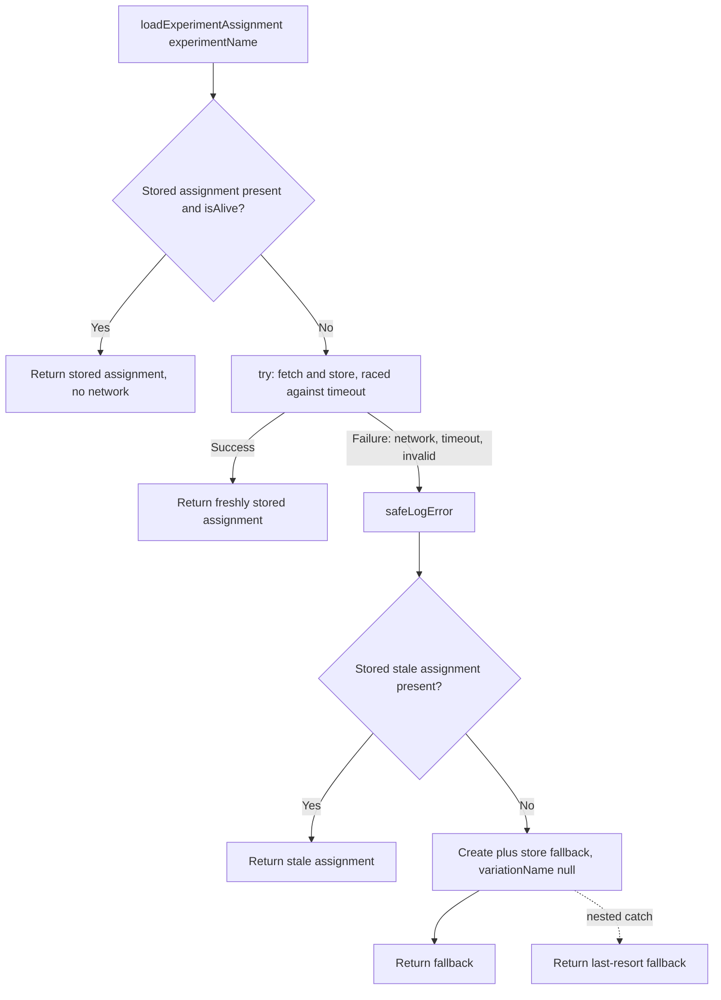

# ExPlat Client — Behavioral Reference & Code-Grounded Q&A

**Package:** `@automattic/explat-client` (the "experiment assignment client")
**Location:** `packages/explat-client`
**Version:** `0.1.0` `[packages/explat-client/package.json:L3]`
**Repository / branch:** `Automattic/wp-calypso` @ branch `wp-calypso_be7e5cc64162`
**Analysis pinned to HEAD:** `be7e5cc641622d153040491fd5625c6cb83e12eb`

## Introduction

This document is a definitive, code-grounded behavioral reference for an engineer who is about to integrate the `@automattic/explat-client` experiment-assignment client into a feature. It answers five specific questions about how the client behaves under **failure**, **slow responses**, **concurrency**, **caching/TTL**, and **misuse** (calling the synchronous getter before the async load completes).

**Methodology (evidence-first).** Every behavioral claim below is grounded in the actual source code at the pinned HEAD and is accompanied by an inline citation of the form `[<path>:<locator>]`. Documented-contract claims from the package's `README.md` / `CHANGELOG.md` are cross-checked against the implementation rather than taken at face value. The analysis was performed by:

1. **Read-only static analysis** of the `packages/explat-client` source tree (the public entrypoint, the client factory, the type definitions, and the `internal/*` modules) plus the React consumer in `packages/explat-client-react-helpers`.
2. **Execution of the package's existing Jest test suite** to establish a verified green baseline before drawing any behavioral conclusions.

**No source code was modified.** This is a documentation-only artifact; no production file, test, or configuration was changed, and no runtime behavior was altered. (The only file added to the repository is this document.)

**A note on terminology used below.** The client's request-coalescing behavior is a textbook instance of the *single-flight* pattern (only one execution per key is "in flight" at a time, and duplicate callers share that one promise) — the standard mitigation for cache-stampede / thundering-herd on a cache miss. Its behavior of serving a previously stored value when a fresh fetch fails is in the *stale-on-failure* family of cache-resilience tactics. These names are used only to frame the discussion; every concrete behavior is anchored to the code.

---

## Reproduction Guide / Environment

| Concern | Value |
|---------|-------|
| Node.js | `^v22.9.0` (repo `engines.node`); `.nvmrc` pins `22.9.0`; analysis/tests verified on Node `v22.22.2`+ |
| Package manager | Yarn `4.0.2`, provisioned via `corepack` (`packageManager: yarn@4.0.2`) |
| Test runner | `jest ^29.7.0` `[packages/explat-client/package.json:L33]` |
| TypeScript | `^5.8.2` `[packages/explat-client/package.json:L34]` |
| Package test script | `"test": "yarn jest"` `[packages/explat-client/package.json:L25]` |

**To run the package's test suite, run it from *inside* the package directory:**

```bash
cd packages/explat-client && yarn jest
```

> ⚠️ **Critical pitfall:** running `yarn jest packages/explat-client` from the **repository root** matches **0 tests**. The reason is explained in detail in the "Test status" section below — in short, this package keeps its tests in `test/` directories with plainly-named files, which the root/default Jest `testMatch` does not match.

---

## first make sure the package tests are passing

**Direct answer: the suite passes — `9 suites, 81 tests, 23 snapshots — all passing`.** This is the verified baseline on which every downstream behavioral conclusion rests.

The exact runner output (from `cd packages/explat-client && yarn jest`):

```text
PASS src/internal/test/requests.ts
PASS src/internal/test/validations.ts
PASS src/internal/test/timing.ts
PASS src/internal/test/experiment-assignment-store.ts
PASS src/test/create-ssr-safe-dummy-explat-client.ts
PASS src/internal/test/experiment-assignments.ts
PASS src/test/index.ts
PASS src/internal/test/local-storage.ts
PASS src/test/create-explat-client.ts

Test Suites: 9 passed, 9 total
Tests:       81 passed, 81 total
Snapshots:   23 passed, 23 total
```

The 9 suites are **3** under `src/test/` (`create-explat-client.ts`, `create-ssr-safe-dummy-explat-client.ts`, `index.ts`) plus **6** under `src/internal/test/` (`timing.ts`, `experiment-assignments.ts`, `requests.ts`, `experiment-assignment-store.ts`, `local-storage.ts`, `validations.ts`).

### How it works / thinking — and why the repo root finds "0 tests"

This is the single most important reproduction detail, because an engineer who runs the suite "the obvious way" from the repo root will be surprised to see zero tests.

- The package's own Jest config is just a preset reference: `module.exports = { preset: '../../test/packages/jest-preset.js' }` `[packages/explat-client/jest.config.js:L1-L3]`.
- That intermediate preset re-exports the shared base preset — `const base = require( '@automattic/calypso-jest' )` and then spreads `...base` `[test/packages/jest-preset.js:L2,L8-L9]`.
- The base `@automattic/calypso-jest` preset sets `testMatch: [ '<rootDir>/**/test/*.[jt]s?(x)', '!**/.eslintrc.*' ]` `[packages/calypso-jest/jest-preset.js:L12]`. With `<rootDir>` resolving to the **package directory**, this pattern matches files inside any `test/` directory — i.e., the package's tests under `src/test/` and `src/internal/test/`. Note the convention: the directory is named `test/`, and the files are **not** suffixed `.test`/`.spec`.

By contrast, when you invoke a **bare** `yarn jest packages/explat-client` from the repository root:

- There is **no** root-level `jest.config.js` and **no** `"jest"` key in the root `package.json`, so Jest falls back to its **built-in default** `testMatch`: `[ '**/__tests__/**/*.[jt]s?(x)', '**/?(*.)+(spec|test).[jt]s?(x)' ]`.
- This package's plainly-named files living inside `**/test/` directories match **neither** of those default patterns, so Jest reports **0 matches** for the `packages/explat-client` path and exits with "No tests found".

This was confirmed empirically — running from the repo root produced:

```text
No tests found, exiting with code 1
...
testMatch: **/__tests__/**/*.[jt]s?(x), **/?(*.)+(spec|test).[tj]s?(x) - 204 matches
Pattern: packages/explat-client - 0 matches
```

Phrased simply: *the root/default `testMatch` targets `__tests__/` and `*.(spec|test)` files, whereas this package keeps its tests under `src/test/` and `src/internal/test/` with plain names.* (Monorepo-wide package testing is instead performed via `jest -c=test/packages/jest.config.js`, which loads each package's own `jest.config.js` as a Jest "project.")

**Benign warnings.** If the package has been **built** (a `dist/` directory is present), Jest may emit `jest-haste-map` "duplicate manual mock" / Haste-collision warnings while scanning the monorepo (e.g., duplicate `wpcom-proxy-request` mocks under other packages' `dist/`). These warnings are unrelated to and do **not** affect this package's own test run; a freshly checked-out tree without `dist/` will not show them.

**Thinking:** The "0 tests" surprise is purely a test-discovery/config nuance, not a code defect. Because the package customizes `testMatch` to `**/test/*`, Jest only discovers the tests when its `rootDir` resolves to the package — which is exactly why the suite must be run from inside the package directory.

**Evidence:** `[packages/explat-client/package.json:L25]` (test script), `[packages/explat-client/package.json:L33-L34]` (jest / typescript versions), `[packages/explat-client/jest.config.js:L1-L3]`, `[test/packages/jest-preset.js:L2,L8-L9]`, `[packages/calypso-jest/jest-preset.js:L12]`, and the 9 suites enumerated above.

---

## The client is reputed to "never throw exceptions" — verify this. What actually happens when the server is unavailable or takes too long to respond? What does the response look like in that situation, and what variation would a user be assigned to?

**Direct answer.** The public client API is **designed never to throw** in production. On any failure during a load — an invalid experiment name, a network/server error, or a timeout — the client **logs** the error and **returns an `ExperimentAssignment` fallback** rather than throwing. The returned fallback object has `variationName: null` and `isFallbackExperimentAssignment: true`, and per the documented contract a `null` variation means the user receives the **default / control** experience. The one genuine throw site is at **browser-client *construction*** when `window` is undefined, but the package's public entrypoint substitutes an SSR-safe dummy client server-side, so the *package boundary* upholds the "never throw" guarantee.

### How it works / thinking — the failure-recovery ladder

`loadExperimentAssignment` wraps its **entire** body in a `try/catch` `[packages/explat-client/src/create-explat-client.ts:L114-L157]`. Errors are reported through a **safe** error logger that itself swallows any exception the injected logger might throw — `safeLogError` `[packages/explat-client/src/create-explat-client.ts:L96-L100]` — so even a broken logger cannot turn into a thrown error.

After the initial `catch`, the client walks a deliberate **recovery ladder**:

1. **Return a previously stored (stale) assignment if one exists.** This is explicitly important for offline users `[packages/explat-client/src/create-explat-client.ts:L160-L165]`.
2. **Otherwise create + store + return a fallback assignment.** Storing the fallback synchronously means concurrent/subsequent `loadExperimentAssignment` calls reuse it, preventing repeated work `[packages/explat-client/src/create-explat-client.ts:L167-L172]`.
3. **As a last resort**, a **nested** `catch` returns a fallback **without** storing it `[packages/explat-client/src/create-explat-client.ts:L173-L182]`.



**The SSR nuance (the only true throw).** The only place the browser factory throws is at **creation** when `typeof window === 'undefined'` `[packages/explat-client/src/create-explat-client.ts:L72-L74]`. The package's public entrypoint avoids ever hitting that path on the server by swapping in an SSR-safe dummy: `const createExPlatClient = typeof window === 'undefined' ? createSsrSafeDummyExPlatClient : createBrowserExPlatClient` `[packages/explat-client/src/index.ts:L8-L9]`. The dummy client's methods simply log and return a fallback `[packages/explat-client/src/create-explat-client.ts:L258-L283]`. So although the browser factory *can* throw, an integrator using the package's public export never sees it.

### Response shape (what the returned object looks like)

The returned value is an `ExperimentAssignment` `[packages/explat-client/src/types.ts:L3-L24]`:

```ts
interface ExperimentAssignment {
  experimentName: string;
  variationName: string | null;          // [packages/explat-client/src/types.ts:L11]
  retrievedTimestamp: number;             // [packages/explat-client/src/types.ts:L15]
  ttl: number;                            // [packages/explat-client/src/types.ts:L19]
  isFallbackExperimentAssignment?: boolean; // [packages/explat-client/src/types.ts:L23]
}
```

The fallback factory produces exactly this shape with the fallback markers set:

```ts
// createFallbackExperimentAssignment
{
  experimentName,
  variationName: null,
  retrievedTimestamp: Timing.monotonicNow(),
  ttl: Math.max( minimumTtl /* 60 */, ttl ),
  isFallbackExperimentAssignment: true,
}
```

`[packages/explat-client/src/internal/experiment-assignments.ts:L29-L38]`. Its doc comment underscores the contract: this function "must never throw" `[packages/explat-client/src/internal/experiment-assignments.ts:L25]`.

### Which variation does the user get on failure?

`variationName === null`. Per the documented contract this means **serve the default experience**: the README states "`variationName === null`: This means you should return the default experience." `[packages/explat-client/README.md:L22]`. This is cross-checked against the README's "Designed to never throw" `[packages/explat-client/README.md:L44]` and the in-code interface doc "Will never throw in production, it will return the default assignment" `[packages/explat-client/src/create-explat-client.ts:L25]`.

### Slow server / timeout behavior

When the server is **slow** (rather than erroring), the load is bounded by a timeout:

- The fetch-and-store is raced against a timeout via `Timing.timeoutPromise(...)` `[packages/explat-client/src/create-explat-client.ts:L142-L145]`. `timeoutPromise` is implemented as `Promise.race([ promise, <setTimeout that rejects> ])`; on timeout it **rejects** with a `"Promise has timed-out after <N>ms."` error `[packages/explat-client/src/internal/timing.ts:L23-L36]`. That rejection is caught by the surrounding `try/catch` and routed straight into the recovery ladder above (→ stale-or-fallback, i.e., control).
- The default timeout is `EXPERIMENT_FETCH_TIMEOUT = 10000` ms `[packages/explat-client/src/create-explat-client.ts:L16]`. An inline A/B test shortens it to `5000` ms roughly half the time: `if ( Math.random() > 0.5 ) { experimentFetchTimeout = 5000; }` `[packages/explat-client/src/create-explat-client.ts:L134-L138]`.
- **Crucially, the timeout is applied to the *awaited* promise, not to the underlying fetch.** The fetch-and-store therefore **continues in the background** after a timeout, so a later `loadExperimentAssignment` call can use the eventual result. The code comment makes this explicit: "We time out the request here and not above so the fetch-and-store continues and can be returned by future uses of loadExperimentAssignment." `[packages/explat-client/src/create-explat-client.ts:L140-L141]`.

**Thinking:** A slow or unavailable server therefore never surfaces an error to the caller. The current call resolves to the **control/fallback** after the timeout (or immediately on a hard error), while — in the slow case — the real result may still land in the store and be served on the next call. This is the "stale-on-failure / serve-control-meanwhile" resilience posture, implemented purely through `try/catch` + the fallback factory, with no throw escaping the public API.

---

## If multiple parts of the app request the SAME experiment assignment at the exact same time, how many network calls actually get made?

**Direct answer: exactly ONE.** If multiple callers request the **same** experiment name simultaneously, the client makes a single network request; all concurrent callers share the same in-flight promise. Distinct experiment names are independent — each gets its own single in-flight request.

### How it works / thinking — single-flight via `asyncOneAtATime` + a per-experiment map

The fetch-and-store operation is wrapped with `Timing.asyncOneAtATime`:

```ts
const createWrappedExperimentAssignmentFetchAndStore = ( experimentName: string ) =>
  Timing.asyncOneAtATime( async () => {
    const fetchedExperimentAssignment = await Request.fetchExperimentAssignment( config, experimentName );
    storeExperimentAssignment( fetchedExperimentAssignment );
    return fetchedExperimentAssignment;
  } );
```

`[packages/explat-client/src/create-explat-client.ts:L82-L90]`.

`asyncOneAtATime` is the canonical **single-flight** primitive. It stores the in-flight promise in a closure variable `lastPromise` and returns that **same** promise to every subsequent caller until it settles, then resets `lastPromise` to `null` via `.finally(...)`:

```ts
export function asyncOneAtATime< T >( f: () => Promise< T > ): () => Promise< T > {
  let lastPromise: Promise< T > | null = null;
  return () => {
    if ( ! lastPromise ) {
      lastPromise = f().finally( () => { lastPromise = null; } );
    }
    return lastPromise;
  };
}
```

`[packages/explat-client/src/internal/timing.ts:L44-L54]`.

To make this per-experiment (so that two *different* experiments don't block each other), the client keeps a **map** of these wrappers keyed by experiment name `[packages/explat-client/src/create-explat-client.ts:L91-L94]` and lazily creates exactly one wrapper per experiment name the first time it is loaded `[packages/explat-client/src/create-explat-client.ts:L127-L132]`:

```ts
if ( experimentNameToWrappedExperimentAssignmentFetchAndStore[ experimentName ] === undefined ) {
  experimentNameToWrappedExperimentAssignmentFetchAndStore[ experimentName ] =
    createWrappedExperimentAssignmentFetchAndStore( experimentName );
}
```

So for *N* simultaneous `loadExperimentAssignment('foo')` calls, the first call creates the wrapper and starts the single fetch; the remaining `N-1` calls hit the already-populated map entry and `await` the **same** in-flight promise. The result: **one** network call, shared by all *N* callers.

**Thinking:** This is the standard mitigation for the cache-stampede / thundering-herd problem on a cache miss — instead of letting *N* concurrent callers each fire a request, duplicate callers `await` a single shared `Promise`. The terminology ("single-flight") is just framing; the guarantee comes directly from `asyncOneAtATime` holding one promise per experiment until it settles. Note that the wrapper resets only **after** the promise settles, so a brand-new request will be made for a subsequent (non-overlapping) load once the cached assignment is no longer alive — see the caching section next.

---

## When requesting the same experiment multiple times in quick succession, does each request go to the network? What happens after enough time passes for the cache to expire (TTL)?

**Direct answer.** No — repeated loads of the same experiment **within its TTL** are served from local storage with **no network request**. Once the TTL elapses, the cached assignment is no longer "alive," and the next load performs a fresh fetch.

### How it works / thinking — the `isAlive` short-circuit and a monotonic TTL

`loadExperimentAssignment` **first** retrieves any stored assignment and checks `ExperimentAssignments.isAlive`; if it is alive, it returns the stored value immediately, with **no** network request `[packages/explat-client/src/create-explat-client.ts:L119-L125]`:

```ts
const storedExperimentAssignment = retrieveExperimentAssignment( experimentName );
if ( storedExperimentAssignment && ExperimentAssignments.isAlive( storedExperimentAssignment ) ) {
  return storedExperimentAssignment;
}
```

Liveness is a simple TTL check against a monotonic clock:

```ts
export function isAlive( experimentAssignment: ExperimentAssignment ): boolean {
  return (
    Timing.monotonicNow() <
    experimentAssignment.ttl * Timing.MILLISECONDS_PER_SECOND + experimentAssignment.retrievedTimestamp
  );
}
```

i.e., `monotonicNow() < retrievedTimestamp + ttl * 1000` `[packages/explat-client/src/internal/experiment-assignments.ts:L8-L14]`.

The clock is deliberately **monotonic** (strictly increasing) to guard against system-clock changes — `monotonicNow` returns `Date.now()` but never less than the last value it returned `[packages/explat-client/src/internal/timing.ts:L10-L16]`. This means a backwards jump in the user's system clock cannot artificially extend or invalidate a TTL.

**TTL is server-driven with a 60-second floor.** The minimum TTL is `minimumTtl = 60` seconds `[packages/explat-client/src/internal/experiment-assignments.ts:L21]`, applied on fetch via `const ttl = Math.max( ExperimentAssignments.minimumTtl, responseTtl )` `[packages/explat-client/src/internal/requests.ts:L93]`. The README notes the production TTL is ~3600 seconds at the time of writing `[packages/explat-client/README.md:L42]`. The floor limits how often the server can be hit per experiment even if the server returns a very small (or zero-ish) TTL.

**Where the cache lives.** State persists in `window.localStorage` when available, otherwise in an in-memory polyfill `[packages/explat-client/src/internal/local-storage.ts:L33-L38]`; the store/retrieve/purge logic lives in `experiment-assignment-store.ts` — `storeExperimentAssignment` `[packages/explat-client/src/internal/experiment-assignment-store.ts:L21-L40]` (including a write race-condition guard that rejects storing an older assignment over a newer one `[packages/explat-client/src/internal/experiment-assignment-store.ts:L27-L34]`) and `retrieveExperimentAssignment` `[packages/explat-client/src/internal/experiment-assignment-store.ts:L46-L57]`. The README confirms: "Stores state in LocalStorage if available otherwise in memory" `[packages/explat-client/README.md:L16]`.

**Thinking:** The cache key is per experiment name; the alive-check short-circuits *before* any of the fetch machinery, so within the TTL there is zero network I/O regardless of how many times you call `loadExperimentAssignment`. Once the assignment expires, `isAlive` returns `false`, the short-circuit is skipped, and control falls through to the (single-flighted) fetch path described in the previous section — so even the post-expiry refresh is deduplicated across concurrent callers.

---

## The client has an async loading method and a synchronous getter. What happens if the synchronous getter is called BEFORE the async load has finished? Will it break the application or be handled gracefully?

**Direct answer: it is handled gracefully — it does NOT break the application.** Calling the synchronous getter `dangerouslyGetExperimentAssignment` before the async `loadExperimentAssignment` has completed will, internally, throw a "hasn't loaded" error — but that throw is **caught within the same function**, logged (in development mode), and a **fallback (control)** assignment is returned. There is also a companion getter, `dangerouslyGetMaybeLoadedExperimentAssignment`, which returns `null` (instead of a fallback) when nothing is loaded; that is the variant the React `useExperiment` hook uses.

### How it works / thinking — two getters, both graceful

**`dangerouslyGetExperimentAssignment` — degrades to control.** It retrieves the stored assignment, and if none is present it throws `"Trying to dangerously get an ExperimentAssignment that hasn't loaded."` `[packages/explat-client/src/create-explat-client.ts:L191-L195]`. But the whole body is inside a `try/catch`: the catch logs the error **only in development mode** and then returns `createFallbackExperimentAssignment(...)` `[packages/explat-client/src/create-explat-client.ts:L214-L223]`. So a premature synchronous read resolves to the **control/fallback** experience rather than propagating an exception.

Additionally, in development mode the getter **warns** if it is called within 1000 ms of a load — `Timing.monotonicNow() - storedExperimentAssignment.retrievedTimestamp < 1000` — to flag the "called too soon after loading" anti-pattern `[packages/explat-client/src/create-explat-client.ts:L198-L211]`.

**`dangerouslyGetMaybeLoadedExperimentAssignment` — returns `null` when not loaded.** This companion getter returns `null` (not a fallback) when nothing is loaded `[packages/explat-client/src/create-explat-client.ts:L225-L238]`. This is the getter the React `useExperiment` hook relies on: the hook calls `exPlatClient.loadExperimentAssignment( experimentName )` inside a `useEffect` `[packages/explat-client-react-helpers/src/index.tsx:L75]` and then reads with `exPlatClient.dangerouslyGetMaybeLoadedExperimentAssignment( experimentName )` `[packages/explat-client-react-helpers/src/index.tsx:L100]`, mapping a `null` result to an "is loading" state (`return [ ! maybeExperimentAssignment, maybeExperimentAssignment ]`).

**SSR.** The SSR-safe dummy client always logs and returns a fallback for all three methods `[packages/explat-client/src/create-explat-client.ts:L258-L283]`, so synchronous reads are safe server-side too.

**Cross-checking the documented contract.** The README confirms the change of contract for the dangerous getter: "~~MUST be wrapped in a try-catch block.~~ It now logs and won't throw." `[packages/explat-client/README.md:L65]`, and the `CHANGELOG` records it under `0.0.2`: "Change dangerouslyGetExperimentAssignment to log rather than throw" `[packages/explat-client/CHANGELOG.md:L21]`. Note the important contract nuance that a *missing* assignment does **not** mean the default experience — "A missing experiment assignment _does not_ mean the default experience" `[packages/explat-client/README.md:L25]` — which is exactly why the `Maybe`-loaded variant returns `null` so React can render a loading state rather than prematurely committing to control.

**Thinking:** The two getters serve distinct callers and degrade differently, both gracefully:
- `dangerouslyGetExperimentAssignment` is the *"synchronous escape hatch"* (intended for synchronous code such as `/lib`) that **degrades to control** on premature use, after logging.
- `dangerouslyGetMaybeLoadedExperimentAssignment` is the *React-oriented* variant that signals "not yet loaded" via `null`, enabling a proper loading UI.

Either way, calling the synchronous getter before the async load completes is handled gracefully and cannot break the application at the package boundary.


---

## Evidence from the test suite

Each documented behavior is exercised by one or more tests in the package's own (passing) suite. Suites are listed relative to `packages/explat-client`. Test names below are reproduced exactly as they appear in the source.

| Behavior (and the question it answers) | Suite | Test name(s) |
|----------------------------------------|-------|--------------|
| **Q2** — the only throw is browser-client construction with no `window` | `src/test/create-explat-client.ts` | `'should throw if initialized outside of a browser context'` |
| **Q2** — re-construction does not throw | `src/test/create-explat-client.ts` | `"shouldn't throw if initialized multiple times"` |
| **Q2** — invalid name → fallback + log (no throw) | `src/test/create-explat-client.ts` | `'Invalid experimentName: should return fallback and log'` |
| **Q2** — network failure → store + return fallback + log | `src/test/create-explat-client.ts` | `'Could not fetch ExperimentAssignment: should store and return fallback, and log'` |
| **Q2** — timeout → fallback + log | `src/test/create-explat-client.ts` | `'Timed-out fetch: should return fallback and log'` |
| **Q2** — logger throwing is itself handled (safe logger) | `src/test/create-explat-client.ts` | `'logError throws/secondary error: should attempt to log secondary error and return fallback'` |
| **Q2** — `timeoutPromise` rejects on timeout | `src/internal/test/timing.ts` | `'should throw if promise gets timed-out'` |
| **Q2** — fallback factory shape (`variationName: null`, ttl floor) | `src/internal/test/experiment-assignments.ts` | `'createFallbackExperimentAssignment'` block: `'creates a fallback ExperimentAssignment'`, `'...with a provided ttl under the minimum'`, `'...over the minimum'` |
| **Q2** — public entrypoint selects real vs. SSR dummy client | `src/test/index.ts` | `'should return the real client when run in a browser context'`, `'should return the mock client when run outside of a browser context'` |
| **Q2** — SSR dummy `loadExperimentAssignment` logs + returns fallback | `src/test/create-ssr-safe-dummy-explat-client.ts` | `loadExperimentAssignment` → `'should behave as expected'` |
| **Q3** — single-flight: one call returns the same promise to all callers | `src/internal/test/timing.ts` | `'should return the same promise when called multiple times, only calling the original function once'` (+ its rejection variant) |
| **Q3** — wrapper resets after settle (new promise next time) | `src/internal/test/timing.ts` | `'should return a different promise after the last has resolved, calling the orignal function twice'` (+ its rejection variant) |
| **Q3 / Q4** — one request even on failure, until TTL is over | `src/test/create-explat-client.ts` | `'should only make one request even if it fails, returning the same fallback - until ttl is over with successful next'` |
| **Q4** — `isAlive` TTL boundary | `src/internal/test/experiment-assignments.ts` | `isAlive` → `'returns true for ExperimentAssignments within ttl'`, `'returns false for ExperimentAssignments outside of ttl'` |
| **Q4** — repeated loads respect TTL (incl. development mode) | `src/test/create-explat-client.ts` | `'should respect the ttl (including developmentMode)'` |
| **Q4** — server TTL floored at the minimum | `src/internal/test/requests.ts` | `'should return an experiment assignment with a ttl as the maximum of the ttl provided from the server and the set minimum ttl'` |
| **Q4** — expired/invalid assignments purged from storage | `src/internal/test/experiment-assignment-store.ts` | `removeExpiredExperimentAssignments` block: `'should remove all stored ExperimentAssignments that are past their ttl'`, `'...that are invalid'` |
| **Q4** — monotonic clock | `src/internal/test/timing.ts` | `monotonicNow` → `'should be strictly monotonic'` |
| **Q5** — `dangerouslyGet`: not-loaded → log + fallback | `src/test/create-explat-client.ts` | `"should log and return fallback when the matching experiment hasn't loaded yet"`, `"...but is currently loading"` |
| **Q5** — `dangerouslyGet`: loaded → returns the assignment | `src/test/create-explat-client.ts` | `'should return a loaded ExperimentAssignment'` |
| **Q5** — `dangerouslyGet`: dev-mode "too soon" warning | `src/test/create-explat-client.ts` | `'[developerMode] should log error when run too soon after loading an ExperimentAssignment'` |
| **Q5** — `dangerouslyGetMaybeLoaded`: not-loaded → `null` | `src/test/create-explat-client.ts` | `"return null when the matching experiment hasn't loaded yet"`, `"...but is currently loading"` |
| **Q5** — `dangerouslyGetMaybeLoaded`: loaded → returns the assignment | `src/test/create-explat-client.ts` | `'should return a loaded ExperimentAssignment'` |
| **Q5** — SSR dummy `dangerouslyGetExperimentAssignment` logs + returns fallback | `src/test/create-ssr-safe-dummy-explat-client.ts` | `dangerouslyGetExperimentAssignment` → `'should behave as expected'` |

---

## Verdict

**The "never throws" reputation holds at the package boundary.** Every public-API runtime path on the browser client funnels failures into *logging plus a control/fallback* `ExperimentAssignment`:

- **Failure / slow server (Q2):** invalid names, network errors, and timeouts are all caught and converted to a fallback via the recovery ladder (stale → create-and-store fallback → last-resort fallback); the response is an `ExperimentAssignment` with `variationName: null` and `isFallbackExperimentAssignment: true`, which means the user is served the **default / control** experience.
- **Concurrency (Q3):** *N* simultaneous loads of the same experiment produce exactly **one** network call thanks to the `asyncOneAtATime` single-flight wrapper held in a per-experiment map.
- **Caching / TTL (Q4):** repeated loads within the TTL are served from local storage with no network I/O; liveness uses a **monotonic** clock with a **60-second** minimum TTL, and a fresh (still deduplicated) fetch occurs only after expiry.
- **Async-load vs. sync-getter (Q5):** the synchronous getters degrade gracefully — `dangerouslyGetExperimentAssignment` catches, logs (in dev), and returns control; `dangerouslyGetMaybeLoadedExperimentAssignment` returns `null` so React can render a loading state.

The single genuine `throw` is browser-client **construction** when `window` is undefined `[packages/explat-client/src/create-explat-client.ts:L72-L74]`, and the public entrypoint avoids it by swapping in the SSR-safe dummy server-side `[packages/explat-client/src/index.ts:L8-L9]`.

**Bottom line for an integrator:** you can rely on the client **never throwing in production** — just remember the contract that **`variationName === null` means "serve the default/control experience,"** and (for synchronous React reads) that a `null` from `dangerouslyGetMaybeLoadedExperimentAssignment` means "not loaded yet," which is a *loading* state and not the same as control.

