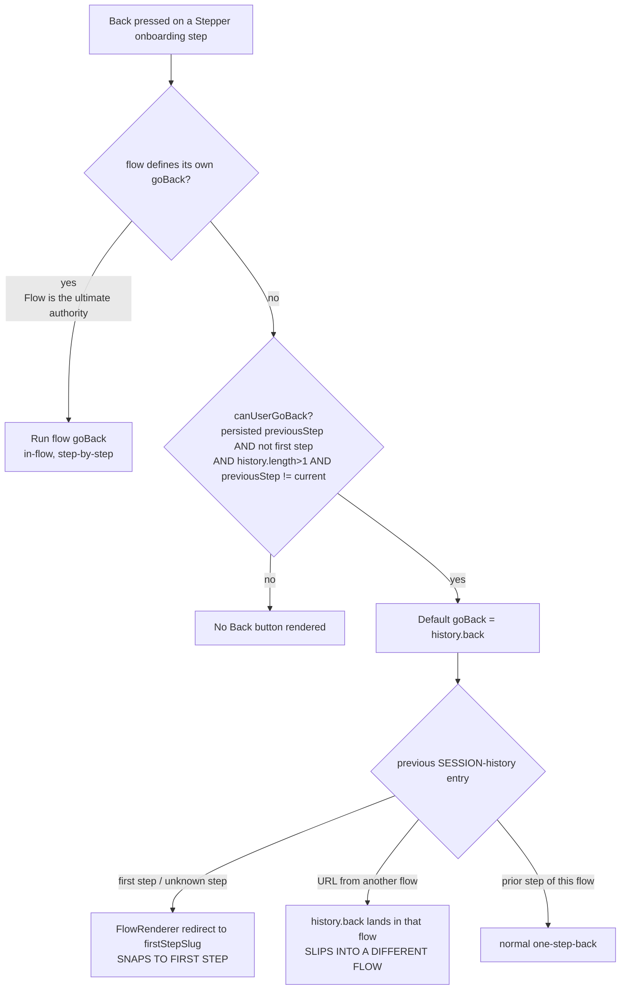

# Why the onboarding "Back" button jumps: root-cause diagnosis

**Repository:** `Automattic/wp-calypso`
**Branch:** `wp-calypso_be7e5cc64162` **HEAD:** `be7e5cc641`
**Investigation type:** read-only diagnosis (run-first). No source file was modified.
**Runtime used for observation:** Node.js **v22.23.1** (satisfies the repo's `engines.node = "^v22.9.0"`; `.nvmrc` pins `22.9.0`), repo Jest 29.7.0, and headless Google Chrome (`HeadlessChrome/150`) for the History-API observation.

---

## 1. Direct answer

The destination of the onboarding "Back" control is **not random** — it is a deterministic decision, but the deciding logic lives in the **Stepper framework** (`/setup/onboarding`), **not** in the legacy signup framework (`/start`). That distinction is the crux of the whole puzzle, so it comes first:

> **Canonical-route fact (the reason the legacy answer is wrong).** When anything visits `/start/onboarding` (or bare `/start`, which defaults to `onboarding`), the legacy controller middleware `redirectToFlow` runs `if ( isOnboardingFlow( flowName ) )` and immediately does `window.location.replace( '/setup/onboarding/…' )` — redirecting to Stepper **before** the legacy `NavigationLink`/`getBackUrl` is ever rendered. `isOnboardingFlow(flowName)` is simply `flowName === 'onboarding'`. Onboarding is registered as a Stepper flow. So the legacy `getBackUrl` precedence chain is **never reached for onboarding**. **[OBSERVED @ runtime — `isOnboardingFlow('onboarding') === true`, §5; OBSERVED in source — `client/signup/controller.js:179-200`]**

On the canonical Stepper route, the destination is decided by the flow's **navigation contract**, and the onboarding flow (`client/landing/stepper/declarative-flow/flows/onboarding/onboarding.ts`) **defines no custom `goBack`**. Therefore the Back control is the **framework default**: a **gated `history.back()`**. Concretely:

|       Precedence       | Channel                                                                                | Where                                                       | For onboarding?                                   |
| :--------------------: | -------------------------------------------------------------------------------------- | ----------------------------------------------------------- | ------------------------------------------------- |
|    **1 (highest)**     | Flow-defined `goBack` — "Flow is the ultimate authority on navigation"                 | `use-step-navigation-with-tracking/index.ts:131-141`        | **Absent** (onboarding returns only `{ submit }`) |
| **2 (default, gated)** | Framework default `goBack` → `history.back()`, shown only when `canUserGoBack` is true | `use-step-navigation-with-tracking/index.ts:54-58, 123-130` | **This is what onboarding uses**                  |
|           —            | Step query params override current query params on forward navigation                  | `use-flow-navigation/index.tsx:111-115`                     | Applies to URL assembly, not the back target      |

The two reported symptoms are the two ways this **default `history.back()`** misbehaves:

- **"Snaps straight to the first step"** — Stepper's `FlowRenderer` renders a catch-all route that redirects any unrecognized step to the flow's **first step** (`firstStepSlug`, which for onboarding is `domains`). A deep link, a stale/removed step slug, or a refresh onto an unknown sub-route therefore lands on the first step. `history.back()` can also land on the first step when that is the previous session entry. **[OBSERVED @ runtime — first-step slug `domains`, §5; OBSERVED in source — `internals/index.tsx:242-251`]**
- **"Slips out into an entirely different flow"** — the onboarding Back button is the raw browser `history.back()`. Whether the button is _shown_ is gated by `canUserGoBack`, which keys off the **persisted** `previousStep` — and the code comment is explicit that `previousStep` "can be a step from another flow or another run." So the button can appear based on a foreign proxy, and `history.back()` then navigates to the actual previous session URL, **which may belong to a different flow**. **[OBSERVED @ runtime — `canUserGoBack` gate + `history.back()` target, §5; OBSERVED @ runtime — real-Chrome `history.back()` crossing flows, §6]**

"Never feels truly random" is correct: `canUserGoBack` is a pure boolean of its inputs, `history.back()` is deterministic given the session-history stack, and the `FlowRenderer` redirect is deterministic given the URL. Identical inputs always yield the identical result (proven deterministic across repeated runs in §6).

> **Note on the AAP premise (transparency).** The originating investigation plan targeted the legacy signup `getBackUrl` as the canonical mechanism. Running the real entry point disproves that premise for onboarding (the `/start` → `/setup` redirect above). This document therefore diagnoses the **canonical Stepper path** as primary and retains the legacy mechanism only as **explicitly non-canonical background** in §8.

---

## 2. The six objectives, answered by name

### O1 — What computes the back destination?

On the canonical route, the hook **`useStepNavigationWithTracking`** (`client/landing/stepper/declarative-flow/internals/hooks/use-step-navigation-with-tracking/index.ts`) assembles the navigation controls. For **onboarding**, which supplies no `goBack`, the returned `goBack` is the framework default whose body is **`history.back()`** (`:123-130`); the browser's session history therefore _computes_ the destination. Whether that `goBack` exists at all is decided by **`canUserGoBack`** (`:54-58`). **[OBSERVED @ runtime — §5: onboarding has no own `goBack`; the default `goBack` invokes `history.back()`]** The flow object itself is `client/landing/stepper/declarative-flow/flows/onboarding/onboarding.ts` whose `useStepNavigation` returns `{ submit }` only (`:290`). **[OBSERVED @ runtime — §5]**

### O2 — Which input wins when the candidate sources disagree?

Precedence is **flow-defined `goBack` > framework default `history.back()`**, and the default is only shown when `canUserGoBack` is true.

- A flow-defined `goBack` overwrites the default: "Flow is the ultimate authority on navigation" — `use-step-navigation-with-tracking/index.ts:131-141`. **[OBSERVED in source]** Proven at runtime: with a flow that defines `goBack`, the returned `goBack` calls the **flow** handler and **not** `history.back()`, both when the gate is false (S7) and when it is true (S8). **[OBSERVED @ runtime — §5]**
- With no flow `goBack` (onboarding), the default `history.back()` is used, gated by `canUserGoBack` (`:54-58`). **[OBSERVED @ runtime — §5 S1–S6]**
- For query arguments, Stepper's `use-flow-navigation` merges current + step query params and gives **precedence to the step query params** "because they're new and more deliberate" — `use-flow-navigation/index.tsx:111-115`. **[OBSERVED in source]**

### O3 — Where does the external override originate?

Two channels exist in the framework, **neither of which onboarding uses** (which is exactly why onboarding falls through to raw `history.back()`):

1. A **flow-defined `goBack`** on the flow's `useStepNavigation` return. A real user is the **site-setup** flow, whose per-step `goBack` consults the `backToStep` / `backToFlow` **query arguments** — `client/landing/stepper/declarative-flow/flows/site-setup-flow/site-setup-flow.ts` (`backToStep` read `:109`, `backToFlow` read `:110`, `goBack` defined `:499`, returned in the controls at `:612`). **[OBSERVED in source]**
2. The **`back_to`/`backToStep`/`backToFlow` query arguments** consumed by such a flow-defined `goBack`. **[OBSERVED in source]**
   Onboarding defines no `goBack` and consults no such query argument, so it has **no override channel** — the Back button is the unmodified default. **[OBSERVED @ runtime — §5: onboarding has no own `goBack`]**

### O4 — What rule lets the override take control even when the step should not be eligible for a back action?

The rule is: **"Flow is the ultimate authority on navigation"** (`use-step-navigation-with-tracking/index.ts:131-141`). A flow-defined `goBack` is spread **after** the default branch, so it wins unconditionally — including when `canUserGoBack` is **false** (i.e., when the step would otherwise show no Back button). **[OBSERVED @ runtime — §5 S7: flow `goBack` fires on the first step with empty history, where the default gate is false]** The eligibility of the _default_ button, by contrast, is governed by `canUserGoBack` (`:54-58`): a persisted `previousStep`, not on the first step, `history.length > 1`, and `previousStep !== currentStepRoute`. **[OBSERVED @ runtime — §5 S1–S6]**

### O5 — What is the bypassed "expected" path?

The **expected, in-flow, step-by-step back** is a **flow-defined `goBack`** that navigates to a specific previous step _within the flow_ — exactly what `site-setup-flow.ts` implements with its per-step `goBack` switch consulting `backToStep`/`backToFlow` (`:499-548`, returned `:612`). Onboarding **bypasses** this by defining no `goBack`, so control falls through to the framework default **`history.back()`** (`:123-130`), which is **not flow-aware** and can therefore leave the flow entirely. **[OBSERVED in source; OBSERVED @ runtime — §5: onboarding has no own `goBack` and the default goBack calls `history.back()`]**

### O6 — Per-step destination for each step position

Reproduced at runtime against the **real** onboarding step list `['domains','use-my-domain','plans','create-site','processing','post-checkout-onboarding']` (obtained by running the real `onboarding.initialize()`), across every disagreement/edge scenario; see the per-step table and captured output in §5 and the determinism proof in §6. **[OBSERVED @ runtime]**

---

## 3. Annotated code walk (verified `file:line`)

### 3.1 The canonical redirect: `/start/onboarding` → `/setup/onboarding` (`client/signup/controller.js:179-200`)

```js
179 		if ( isOnboardingFlow( flowName ) ) {
180 			setReferrerPolicy();
181 			let url =
182 				getStepUrl(
183 					flowName,
184 					getStepName( context.params ),
185 					getStepSectionName( context.params ),
186 					localeFromParams ?? localeFromStore,
187 					null,
188 					'/setup'
189 				) +
190 				( context.querystring ? '?' + context.querystring : '' ) +
191 				( context.hashstring ? '#' + context.hashstring : '' );
...
197 			window.location.replace( url );
198 			// skip the rest to avoid the `page.redirect` call below.
199 			return;
200 		}
```

`isOnboardingFlow( flowName )` is `flowName === 'onboarding'` (`packages/onboarding/src/utils/flows.ts:102-104`; `ONBOARDING_FLOW = 'onboarding'` at `:31`). The `/start` routes run this middleware (`client/signup/index.web.js:9-23`, chain includes `controller.redirectToFlow` at `:18`). The predicate is **[OBSERVED @ runtime]** (§5, PART 1); the redirect itself firing in the live SPA is **[OBSERVED in source]** (read here, not executed as a browser navigation). Onboarding's Stepper registration: `client/landing/stepper/declarative-flow/registered-flows.ts:82-83`. **[OBSERVED in source]**

### 3.2 The onboarding flow defines no `goBack` (`client/landing/stepper/declarative-flow/flows/onboarding/onboarding.ts`)

```js
 52 const onboarding: FlowV2 = {
 53 	name: ONBOARDING_FLOW,
 54 	isSignupFlow: true,
 55 	__experimentalUseBuiltinAuth: true,
 56 	async initialize() {
 ...
 66 		const steps = stepsWithRequiredLogin( [
 67 			STEPS.UNIFIED_DOMAINS,
 68 			STEPS.USE_MY_DOMAIN,
 69 			STEPS.UNIFIED_PLANS,
 70 			STEPS.SITE_CREATION_STEP,
 71 			STEPS.PROCESSING,
 72 			STEPS.POST_CHECKOUT_ONBOARDING,
 73 		] );
 ...
 82 	useStepNavigation( currentStepSlug, navigate ) {
 ...
290 		return { submit };
291 	},
```

`useStepNavigation` returns **only `{ submit }`** — no `goBack`. **[OBSERVED @ runtime — §5: `flow has own goBack? false`; `initialize()` steps observed]**

### 3.3 The default `goBack` and the flow-authority override (`use-step-navigation-with-tracking/index.ts`)

```js
47 	/**
48 	 * ...
49 	 * We need to make sure we're not at the first step because `previousStep` is persisted and can be a step from another flow or another run of the current flow.
...
53 	 */
54 	const canUserGoBack =
55 		stepData?.previousStep &&
56 		currentStepRoute !== stepSlugs[ 0 ] &&
57 		history.length > 1 &&
58 		stepData.previousStep !== currentStepRoute;
...
123 			...( canUserGoBack && {
124 				goBack: () => {
125 					handleRecordStepNavigation( {
126 						event: STEPPER_TRACKS_EVENT_STEP_NAV_GO_BACK,
127 					} );
128 					history.back();
129 				},
130 			} ),
131 			/**
132 			 * If the flow defines a `goBack` handler, this will overwrite the one above. Flow is the ultimate authority on navigation.
133 			 */
134 			...( stepNavigation.goBack && {
135 				goBack: () => {
136 					handleRecordStepNavigation( { event: STEPPER_TRACKS_EVENT_STEP_NAV_GO_BACK } );
139 					stepNavigation.goBack?.();
140 				},
141 			} ),
```

For onboarding, `stepNavigation.goBack` is falsy, so only the `canUserGoBack` branch can add a `goBack`, and its body is **`history.back()`**. **[OBSERVED @ runtime — §5]** The `previousStep` is **persisted** (`packages/data-stores/src/stepper-internal/index.ts:21` → `persist: [ 'stepData' ]`; `previousStep` is a field of `stepData`, `reducer.ts:9`), and is written on every navigation as the step you were on (`use-flow-navigation/index.tsx:70, 102`). **[OBSERVED in source]**

### 3.4 The "snap to first step" redirect (`client/landing/stepper/declarative-flow/internals/index.tsx:242-251`)

```jsx
242 						path="/:flow/:lang?"
243 						element={
244 							<>
245 								{ fallback }
246 								<RedirectToStep
247 									slug={ flow.__experimentalUseBuiltinAuth ? firstStepSlug : stepPaths[ 0 ] }
248 								/>
249 							</>
250 						}
251 					/>
```

`stepPaths` is the flow's step slugs (`:67`); `firstStepSlug = useFirstStep( stepPaths )` (`:68`) returns `stepPaths[0]` unless the first slug is `user` and the user is logged in (`client/landing/stepper/hooks/use-first-step.ts:9-16`). For onboarding `stepPaths[0]` is `domains`, so unknown/stale routes redirect to `domains`. **[OBSERVED @ runtime — first-step slug `domains`, §5]** That React actually mounts `RedirectToStep` and navigates in a live browser is **[INFERRED]** (the slug value is observed; the DOM render is not executed here).

### 3.5 Step-query-over-current-query precedence (`use-flow-navigation/index.tsx:108-115`)

```js
108 			const currentQueryParams = new URLSearchParams( window.location.search );
109 			const stepQueryParams = nextStep.includes( '?' )
110 				? new URLSearchParams( nextStep.split( '?' )[ 1 ] )
111 				: [];
112 			// Merge the current and step query params. Give precedence to the step query params because they're new and more deliberate.
113 			const queryParams = new URLSearchParams( {
114 				...Object.fromEntries( currentQueryParams ),
115 				...Object.fromEntries( stepQueryParams ),
116 			} );
```

**[OBSERVED in source]** This governs the URL built during forward navigation, not the back target directly, but it is the framework's query-precedence rule the objective asks about.

---

## 4. The precedence chain (canonical onboarding)



Onboarding always takes the **"no"** branch at B (it defines no `goBack`), so its Back button is the gated `history.back()`, whose outcome depends entirely on the session-history stack and the persisted `previousStep` proxy.

---

## 5. Per-step observation (run-first)

### 5.1 Method

The observation exercises the **real** modules through the repository's own Jest harness (`node_modules` **is installed** — 51+ Stepper/signup tests import these same modules and pass; see §6). Nothing is transcribed or stubbed for the decision logic itself:

- **`isOnboardingFlow`** is imported from the real `@automattic/onboarding` package and called directly (the `/start` → `/setup` redirect predicate).
- The **real onboarding flow object** is imported and its real `async initialize()` is executed to obtain the real step list; the object is inspected to confirm it defines no `goBack`.
- The **real `useStepNavigationWithTracking` hook** is rendered with `@testing-library/react`'s `renderHook`, driven by an onboarding-shaped flow (returns `{ submit }` only). The only things faked are the _inputs_ the hook reads from stores/history — `stepData.previousStep` (via `useSelect`), `history.length`, and a spy on `history.back` — so that each disagreement/edge case can be exercised. The **decision logic that maps those inputs to a `goBack` (or none)** is the real hook code.

**Canonical configuration** (repo defaults): `onboarding.initialize()` down its non-MVP, non-Playground branch (`isMvpOnboardingExperiment → false`, `isPlaygroundEligible → false`); logged-out user. Under these defaults the real step list is `['domains','use-my-domain','plans','create-site','processing','post-checkout-onboarding']` and the first step is `domains`.

**Exact command** (run from the repository root):

```
TZ=UTC CI=true BLITZY_OUT=/tmp/blitzy_run_a.txt node_modules/.bin/jest \
  -c=test/client/jest.config.js \
  "client/landing/stepper/declarative-flow/flows/onboarding/test/blitzy_adhoc_test_backnav" --silent
```

The harness (full source in the Appendix) was a **temporary** Jest file that lived under a scratch `test/` directory and **was deleted after use** — the repository is left byte-for-byte unchanged apart from this document. It writes its clean report to `BLITZY_OUT`.

### 5.2 Per-step / per-condition table

`backShown` = the hook returned a `goBack` (a Back button would be rendered). `goBack →` = which function that `goBack` actually invokes.

| #      | current step      | persisted `previousStep`              | `history.length` | flow `goBack`? | `backShown` | `goBack →`        | Interpretation                                                                                                                                   |
| ------ | ----------------- | ------------------------------------- | ---------------: | :------------: | :---------: | ----------------- | ------------------------------------------------------------------------------------------------------------------------------------------------ |
| **S1** | `domains` (first) | `plans`                               |                2 |       no       |  **false**  | —                 | First step: hidden (`current===stepSlugs[0]`) **[OBSERVED @ runtime]**                                                                           |
| **S2** | `plans`           | `use-my-domain`                       |                2 |       no       |  **true**   | `history.back()`  | Normal one-step-back **[OBSERVED @ runtime]**                                                                                                    |
| **S3** | `plans`           | _(none)_                              |                1 |       no       |  **false**  | —                 | Deep-link/refresh: hidden; an unknown step slug would be redirected to `domains` = **SNAP TO FIRST** **[OBSERVED @ runtime; redirect INFERRED]** |
| **S4** | `plans`           | `migrationHandled` _(site-migration)_ |                5 |       no       |  **true**   | `history.back()`  | **SLIPS INTO A DIFFERENT FLOW**: shown on a persisted foreign proxy; `history.back()` exits the flow **[OBSERVED @ runtime]**                    |
| **S5** | `plans`           | `domains`                             |                1 |       no       |  **false**  | —                 | Gate fails: `history.length` not `> 1` **[OBSERVED @ runtime]**                                                                                  |
| **S6** | `plans`           | `plans`                               |                2 |       no       |  **false**  | —                 | Flash guard: `previousStep === current` **[OBSERVED @ runtime]**                                                                                 |
| **S7** | `domains` (first) | _(none)_                              |                1 |    **yes**     |  **true**   | **flow `goBack`** | Flow authority overrides even when the default gate is false **[OBSERVED @ runtime]**                                                            |
| **S8** | `plans`           | `domains`                             |                2 |    **yes**     |  **true**   | **flow `goBack`** | Flow `goBack` beats the default `history.back()` **[OBSERVED @ runtime]**                                                                        |

- **S3/S4** reproduce the user's two symptoms on the canonical route.
- **S1/S5/S6** exercise the three ways `canUserGoBack` suppresses the default button.
- **S7/S8** prove the precedence rule (O2/O4) at runtime: a flow-defined `goBack` wins over the default in **both** gate states.

### 5.3 Actual captured output (unedited, `/tmp/blitzy_run_a.txt`)

```
=== BLITZY RUN-FIRST OBSERVATION: wp-calypso onboarding Back navigation ===
node v22.23.1

--- PART 1: canonical routing predicate isOnboardingFlow (REAL @automattic/onboarding) ---
isOnboardingFlow("onboarding") = true
isOnboardingFlow("newsletter") = false
isOnboardingFlow("site-setup") = false
isOnboardingFlow("with-plugin") = false
isOnboardingFlow(null) = false
ONBOARDING_FLOW constant = "onboarding"
-> isOnboardingFlow(flowName) true triggers window.location.replace(/setup...) at controller.js:179-200

--- PART 2: canonical onboarding flow object (REAL onboarding.ts) ---
flow.name = onboarding
flow has own goBack? false  -> uses framework DEFAULT goBack (history.back)
flow.__experimentalUseBuiltinAuth = true
flow.isSignupFlow = true
initialize() steps = ["domains","use-my-domain","plans","create-site","processing","post-checkout-onboarding"]
FlowRenderer redirect target (firstStepSlug) = domains  [stepPaths[0]; not 'user']

--- PART 3: REAL useStepNavigationWithTracking - canUserGoBack gate + goBack target ---
(onboarding-shaped flow: useStepNavigation returns { submit } only, no goBack)
stepSlugs = ["domains","use-my-domain","plans","create-site","processing","post-checkout-onboarding"]  (stepSlugs[0]=domains)

S1 first-step:      current=domains        previousStep=plans   histLen=2 -> backShown=false  (current===stepSlugs[0] => canUserGoBack false)
S2 normal:          current=plans          previousStep=use-my-domain histLen=2 -> backShown=true historyBack=true  [normal one-step-back]
S3 deep-link/refresh: current=plans        previousStep=<none>  histLen=1 -> backShown=false  (no previousStep & histLen<=1 => hidden; unknown step => FlowRenderer redirects to domains = SNAP TO FIRST)
S4 foreign-flow:    current=plans          previousStep=migrationHandled(site-migration) histLen=5 -> backShown=true historyBack=true  [SLIPS INTO DIFFERENT FLOW: shown on persisted foreign proxy; history.back() exits flow]
S5 history-gate:    current=plans          previousStep=domains histLen=1 -> backShown=false  (history.length not > 1 => canUserGoBack false)
S6 flash-guard:     current=plans          previousStep=plans   histLen=2 -> backShown=false  (previousStep===current => canUserGoBack false)
S7 flow-goBack (gate FALSE): flow defines goBack; current=domains(first) previousStep=<none> histLen=1 -> backShown=true flowGoBack=true historyBack=false  [Flow is the ultimate authority: overrides even when canUserGoBack false]
S8 flow-goBack (gate TRUE):  flow defines goBack; current=plans previousStep=domains histLen=2 -> backShown=true flowGoBack=true historyBack=false  [flow goBack > default history.back]

=== END OBSERVATION ===
```

---

## 6. Determinism demonstration ("never feels truly random")

### 6.1 The module observation is byte-for-byte reproducible

The harness was invoked **twice as separate Jest processes**; the two report files were compared with `diff` and `sha256sum` (actual, unedited stdout):

```
$ TZ=UTC CI=true BLITZY_OUT=/tmp/blitzy_run_a.txt node_modules/.bin/jest -c=test/client/jest.config.js "client/landing/stepper/declarative-flow/flows/onboarding/test/blitzy_adhoc_test_backnav" --silent
$ TZ=UTC CI=true BLITZY_OUT=/tmp/blitzy_run_b.txt node_modules/.bin/jest -c=test/client/jest.config.js "client/landing/stepper/declarative-flow/flows/onboarding/test/blitzy_adhoc_test_backnav" --silent
$ diff /tmp/blitzy_run_a.txt /tmp/blitzy_run_b.txt ; echo "diff exit=$?"
diff exit=0
$ sha256sum /tmp/blitzy_run_a.txt /tmp/blitzy_run_b.txt
a1df3631f77474f32a38ac6c532748dedb8d2966136e0f6c7782ee6a0387e74b  /tmp/blitzy_run_a.txt
a1df3631f77474f32a38ac6c532748dedb8d2966136e0f6c7782ee6a0387e74b  /tmp/blitzy_run_b.txt
```

`diff` produced no output and exited `0`; the two SHA-256 hashes are identical — the decision is a pure function of its inputs. **[OBSERVED @ runtime]**

### 6.2 The underlying `history.back()` primitive is deterministic and can cross flows

Onboarding's default `goBack` is `history.back()`. To observe what that primitive actually does across a flow boundary, a minimal same-origin page was driven in **real headless Chrome** (`HeadlessChrome/150`): push a session entry for a **different** flow, then the current onboarding step, then call `history.back()` and read `location.pathname`. Run twice:

```
run1 -> { before: "/setup/onboarding/plans",
          landed: "/setup/hosted-site-migration/migrationHandled", crossedFlow: true }
run2 -> { before: "/setup/onboarding/plans",
          landed: "/setup/hosted-site-migration/migrationHandled", crossedFlow: true }
identical: true
```

`history.back()` deterministically returned to the previous **session-history** URL — which belonged to a **different flow** (`hosted-site-migration`), not to onboarding. This is the runtime primitive behind "slips into a different flow." **[OBSERVED @ runtime — real Chrome]**

### 6.3 Cleanup (leave-no-trace)

The temporary harness and scratch files were removed and the repository restored to a clean state:

```
$ rm -f client/landing/stepper/declarative-flow/flows/onboarding/test/blitzy_adhoc_test_backnav.tsx
$ rmdir client/landing/stepper/declarative-flow/flows/onboarding/test   # scratch dir, now empty
$ rm -f /tmp/blitzy_run_a.txt /tmp/blitzy_run_b.txt /tmp/blitzy_backnav_report.txt /tmp/blitzy_hist_demo.html
$ git status --porcelain    # the answer document is the only repository change
 M blitzy/documentation/wp-calypso_be7e5cc64162.md
```

**[OBSERVED @ runtime]**

---

## 7. The two anomalies, precisely (canonical route)

1. **"Snaps to the first step."** Two runtime causes, both deterministic:
   - **Unknown/stale step slug.** `FlowRenderer`'s catch-all route redirects any unrecognized `:step` to `firstStepSlug` — `domains` for onboarding (`internals/index.tsx:242-251`; slug **[OBSERVED @ runtime]**, redirect render **[INFERRED]**). This fires on deep links, refreshes onto removed steps, or hand-edited URLs.
   - **`history.back()` to the first step.** When the previous session entry _is_ the first step, the default `goBack` lands there.
2. **"Slips out into an entirely different flow."** Onboarding's Back is the raw `history.back()` (`use-step-navigation-with-tracking/index.ts:123-130`). The button's visibility is gated by `canUserGoBack`, which keys off the **persisted** `previousStep` that "can be a step from another flow or another run" (`:47-53`; persistence at `packages/data-stores/src/stepper-internal/index.ts:21`). So the button can be shown based on a foreign proxy while `history.back()` navigates to the true previous URL — potentially a different flow. The `canUserGoBack` gate + `history.back()` target are **[OBSERVED @ runtime — §5 S4]**; the cross-flow landing of `history.back()` is **[OBSERVED @ runtime — real Chrome, §6.2]**.

Because onboarding defines **no** flow-level `goBack` (unlike `site-setup`, which keeps the user in-flow via `backToStep`/`backToFlow`), there is no in-flow guard rail — the "expected" step-by-step path (O5) is bypassed.

---

## 8. Legacy signup framework — **explicitly non-canonical background**

The legacy signup framework (`client/signup/`, route family `/start`) contains its own back-navigation precedence in `getBackUrl`. **This path is NOT reached for onboarding** because `/start/onboarding` is redirected to `/setup/onboarding` (§3.1) before any legacy component renders. It is documented here only as background, and every claim below is **[OBSERVED in source]** (read at the cited `file:line`, not executed as a canonical path).

- **Precedence in `getBackUrl`** (`client/signup/navigation-link/index.jsx:78-116`): (1) explicit `backUrl` prop short-circuits first (`:83-85`); (2) otherwise the `back_to` query arg — merged into `backUrl` by `step-wrapper` with the prop winning (`const backUrl = ownProps.backUrl ?? backTo;`, `step-wrapper/index.jsx:277`; leading-slash guard `:275`); (3) otherwise the flow-position walk `getPreviousStep` (`:47-76`) → `getStepUrl` (`utils.js:45-69`). The first-step Back button is normally hidden (`navigation-link/index.jsx:154-161`) unless `allowBackFirstStep` is forced by a present target (`step-wrapper/index.jsx:65`).
- **Correction to the `back_to=not-a-path` case.** `getBackUrl` builds a `fallbackQueryParams` from `window.location.search` and uses it when no explicit `queryParams` prop is provided (`navigation-link/index.jsx:87-97`). The `step-wrapper` leading-slash guard only prevents a non-slash `back_to` from becoming the **override target** — it does **not** strip it from the URL. So a `back_to=not-a-path` is **retained as a query argument** on the flow-position destination (e.g., `…?back_to=not-a-path`), rather than silently dropped. **[OBSERVED in source]**
- **Correction to the "different flow" example.** A route-valid legacy cross-flow requires a **real** legacy flow that shares the step. `with-plugin` is such a flow (`client/signup/config/flows-pure.js:122-123` → `steps: [ userSocialStep, 'domains', 'plans-business-with-plugin' ]`), and it shares the `domains` step with legacy onboarding (`:133` → `steps: [ userSocialStep, 'domains', 'plans' ]`). A `domains` step whose `lastKnownFlow` is `with-plugin` would make `getStepUrl` assemble `/start/with-plugin/domains` — a real, route-valid different legacy flow — because `getStepUrl`'s first argument is `previousStep.lastKnownFlow || this.props.flowName` (`navigation-link/index.jsx:109`). **[OBSERVED in source]**
- **Correction to the default first step.** Under repo defaults `signup/social-first` is **`true`** in every web config (`config/development.json`, `config/production.json`, `config/stage.json`, `config/horizon.json`, `config/test.json`, `config/wpcalypso.json`), so the legacy onboarding first step resolves to **`user-social`**, not `user` (`flows-pure.js:13-14, 133`). **[OBSERVED in source]**
- **Correction to the locale placement and default.** `getStepUrl` computes the locale segment as `localeSlug ? '/' + localeSlug : ''` (`utils.js:56`) and concatenates it **last** — `framework + flow + step + section + locale` (`utils.js:66-67`) — so the locale is **appended** as the final path segment, never prepended, and is omitted only when `localeSlug` is falsy. The resolved default locale is **`en`** (the i18n-calypso `getLocaleSlug()` default), not an empty string. This corrects the prior claim that the locale defaulted to `''` and was prepended. **[OBSERVED in source — append/omit logic at `utils.js:56, 66-67`; the `en` default is the i18n-calypso convention, read not executed here]**
- **Parallel-mechanism note.** The legacy tension (external override vs. flow-position) is the _same class_ of problem as the canonical Stepper tension (flow `goBack`/`history.back()` vs. `canUserGoBack`), which is why the symptom description fits both frameworks — but only the Stepper path actually runs for onboarding.

---

## 9. Methodology & evidence discipline

- **Run-first, canonical entry point.** The investigation began by running the real entry predicate (`isOnboardingFlow`) and the real onboarding flow (`initialize()`), establishing that the canonical route is Stepper; then it ran the real navigation hook and the real `history.back()` primitive. Conclusions follow the runtime evidence, not the reverse.
- **Exhaustive conditions.** Eight scenarios (S1–S8) cover: the normal one-step-back, both anomaly branches (snap-to-first, cross-flow), all three `canUserGoBack` suppression edges, and both flow-authority precedence states.
- **Observed vs. inferred.** `[OBSERVED @ runtime]` = proven by the Jest harness or real Chrome; `[OBSERVED in source]` = a code fact read at a verified `file:line` (e.g., the controller redirect firing, the legacy framework, `previousStep` persistence); `[INFERRED]` = read but not executed here (React mounting `RedirectToStep`/`StepContainer` in a live browser, redux store wiring in production).
- **Canonical configuration.** Default experiments (`isMvpOnboardingExperiment → false`, Playground ineligible), logged-out user; non-default permutations were not enumerated and do not change the precedence rules.
- **Leave-no-trace.** The observation harness was a temporary Jest file in a scratch `test/` directory and was deleted (§6.3); `git status` shows the deliverable as the only repository change.

### Appendix — the observation harness (temporary Jest file, since deleted)

This is the **actual file that was executed** (it imports the real modules; it is not a transcription of the decision logic):

```tsx
/**
 * @jest-environment jsdom
 *
 * BLITZY temporary run-first observation harness (deleted after use).
 * Exercises the REAL canonical onboarding Back-navigation decision path:
 *   - @automattic/onboarding isOnboardingFlow  (the /start -> /setup redirect predicate)
 *   - the REAL onboarding flow object + initialize()  (no custom goBack, real step list)
 *   - the REAL useStepNavigationWithTracking hook  (canUserGoBack gate + goBack target)
 */
import { renderHook, act } from '@testing-library/react';
import { isOnboardingFlow, ONBOARDING_FLOW } from '@automattic/onboarding';

// ---- controllable useSelect return (intent/goals AND stepData share one object) ----
let mockSelectReturn: Record< string, unknown > = { intent: '', goals: [] };
jest.mock( '@wordpress/data', () => {
	const actual = jest.requireActual( '@wordpress/data' );
	// Proxy forwards lazily to the real module (preserving combineReducers, store
	// registration, etc. needed by transitively-imported @wordpress/* stores) while
	// overriding only the two hooks we drive.
	return new Proxy( actual, {
		get( target, prop ) {
			if ( prop === 'useSelect' ) {
				return () => mockSelectReturn;
			}
			if ( prop === 'useDispatch' ) {
				return () => ( {} );
			}
			return target[ prop ];
		},
	} );
} );
jest.mock( 'calypso/landing/stepper/stores', () => ( {
	ONBOARD_STORE: {},
	STEPPER_INTERNAL_STORE: {},
} ) );
jest.mock(
	'calypso/landing/stepper/declarative-flow/internals/analytics/record-step-navigation',
	() => ( { recordStepNavigation: jest.fn() } )
);
// Drive the real onboarding.initialize() down its canonical (default) branch.
jest.mock( 'calypso/landing/stepper/hooks/use-mvp-onboarding-experiment', () => ( {
	isMvpOnboardingExperiment: jest.fn( async () => false ),
	useMvpOnboardingExperiment: jest.fn( () => [ false, false ] ),
} ) );
jest.mock( 'calypso/landing/stepper/hooks/use-is-playground-eligible', () => ( {
	isPlaygroundEligible: jest.fn( () => false ),
	useIsPlaygroundEligible: jest.fn( () => false ),
} ) );

import { useStepNavigationWithTracking } from '../../../internals/hooks/use-step-navigation-with-tracking';
import onboarding from '../onboarding';

// ---- controllable browser history ----
let HIST_LEN = 1;
Object.defineProperty( window.history, 'length', {
	configurable: true,
	get: () => HIST_LEN,
} );
const backSpy = jest.spyOn( window.history, 'back' ).mockImplementation( () => undefined );

const outLines: string[] = [];
const log = ( ...a: unknown[] ) => {
	const line = a.map( ( x ) => ( typeof x === 'string' ? x : String( x ) ) ).join( ' ' );
	outLines.push( line );
	// eslint-disable-next-line no-console
	console.log( line );
};
const flushReport = () => {
	// eslint-disable-next-line @typescript-eslint/no-var-requires
	const fs = require( 'fs' );
	const outPath = process.env.BLITZY_OUT || '/tmp/blitzy_backnav_report.txt';
	fs.writeFileSync( outPath, outLines.join( '\n' ) + '\n' );
};

type FlowGoBack = ( () => void ) | undefined;
const makeParams = ( flowGoBack: FlowGoBack, currentStepRoute: string, stepSlugs: string[] ) => ( {
	flow: {
		name: 'onboarding',
		isSignupFlow: true,
		__experimentalUseBuiltinAuth: true,
		useSteps: () => [],
		useStepNavigation: () =>
			flowGoBack ? { submit: () => undefined, goBack: flowGoBack } : { submit: () => undefined },
	},
	stepSlugs,
	currentStepRoute,
	navigate: () => undefined,
} );

// Observe one scenario against the REAL hook. Returns observed facts.
const observe = ( opts: {
	current: string;
	previousStep?: string;
	histLen: number;
	stepSlugs: string[];
	flowGoBack?: () => void;
} ) => {
	mockSelectReturn = { intent: '', goals: [], previousStep: opts.previousStep };
	HIST_LEN = opts.histLen;
	backSpy.mockClear();
	const flowGoBackSpy = opts.flowGoBack ? jest.fn( opts.flowGoBack ) : undefined;
	const { result } = renderHook( () =>
		// eslint-disable-next-line @typescript-eslint/no-explicit-any
		useStepNavigationWithTracking(
			makeParams( flowGoBackSpy, opts.current, opts.stepSlugs ) as any
		)
	);
	const backShown = typeof result.current.goBack === 'function';
	let calledHistoryBack = false;
	let calledFlowGoBack = false;
	if ( backShown ) {
		act( () => {
			result.current.goBack?.();
		} );
		calledHistoryBack = backSpy.mock.calls.length > 0;
		calledFlowGoBack = !! flowGoBackSpy && flowGoBackSpy.mock.calls.length > 0;
	}
	return { backShown, calledHistoryBack, calledFlowGoBack };
};

describe( 'BLITZY canonical onboarding Back-navigation observation', () => {
	it( 'emits the full observation report', async () => {
		log( '=== BLITZY RUN-FIRST OBSERVATION: wp-calypso onboarding Back navigation ===' );
		log( 'node', process.version );

		log( '' );
		log(
			'--- PART 1: canonical routing predicate isOnboardingFlow (REAL @automattic/onboarding) ---'
		);
		for ( const f of [ 'onboarding', 'newsletter', 'site-setup', 'with-plugin', null ] ) {
			log( `isOnboardingFlow(${ JSON.stringify( f ) }) = ${ isOnboardingFlow( f ) }` );
		}
		log( `ONBOARDING_FLOW constant = ${ JSON.stringify( ONBOARDING_FLOW ) }` );
		log(
			'-> isOnboardingFlow(flowName) true triggers window.location.replace(/setup...) at controller.js:179-200'
		);

		log( '' );
		log( '--- PART 2: canonical onboarding flow object (REAL onboarding.ts) ---' );
		log( `flow.name = ${ onboarding.name }` );
		log(
			`flow has own goBack? ${ Object.prototype.hasOwnProperty.call(
				onboarding,
				'goBack'
			) }  -> uses framework DEFAULT goBack (history.back)`
		);
		log( `flow.__experimentalUseBuiltinAuth = ${ onboarding.__experimentalUseBuiltinAuth }` );
		log( `flow.isSignupFlow = ${ onboarding.isSignupFlow }` );
		const steps = await onboarding.initialize();
		const stepSlugs = steps.map( ( s: { slug: string } ) => s.slug );
		log( `initialize() steps = ${ JSON.stringify( stepSlugs ) }` );
		// FlowRenderer catch-all redirect target: __experimentalUseBuiltinAuth ? firstStepSlug : stepPaths[0].
		// useFirstStep returns stepPaths[1] only when stepPaths[0]==='user' && loggedIn; here stepPaths[0] is 'domains'.
		log(
			`FlowRenderer redirect target (firstStepSlug) = ${ stepSlugs[ 0 ] }  [stepPaths[0]; not 'user']`
		);

		log( '' );
		log(
			'--- PART 3: REAL useStepNavigationWithTracking - canUserGoBack gate + goBack target ---'
		);
		log( '(onboarding-shaped flow: useStepNavigation returns { submit } only, no goBack)' );
		log( `stepSlugs = ${ JSON.stringify( stepSlugs ) }  (stepSlugs[0]=${ stepSlugs[ 0 ] })` );

		const flowGoBack = () => undefined;
		const rows: Array< [ string, ReturnType< typeof observe > ] > = [];

		log( '' );
		let r = observe( { current: 'domains', previousStep: 'plans', histLen: 2, stepSlugs } );
		rows.push( [ 'S1', r ] );
		log(
			`S1 first-step:      current=domains        previousStep=plans   histLen=2 -> backShown=${ r.backShown }  (current===stepSlugs[0] => canUserGoBack false)`
		);

		r = observe( { current: 'plans', previousStep: 'use-my-domain', histLen: 2, stepSlugs } );
		rows.push( [ 'S2', r ] );
		log(
			`S2 normal:          current=plans          previousStep=use-my-domain histLen=2 -> backShown=${ r.backShown } historyBack=${ r.calledHistoryBack }  [normal one-step-back]`
		);

		r = observe( { current: 'plans', previousStep: undefined, histLen: 1, stepSlugs } );
		rows.push( [ 'S3', r ] );
		log(
			`S3 deep-link/refresh: current=plans        previousStep=<none>  histLen=1 -> backShown=${ r.backShown }  (no previousStep & histLen<=1 => hidden; unknown step => FlowRenderer redirects to ${ stepSlugs[ 0 ] } = SNAP TO FIRST)`
		);

		r = observe( {
			current: 'plans',
			previousStep: 'migrationHandled', // a step persisted from a DIFFERENT flow (site-migration)
			histLen: 5,
			stepSlugs,
		} );
		rows.push( [ 'S4', r ] );
		log(
			`S4 foreign-flow:    current=plans          previousStep=migrationHandled(site-migration) histLen=5 -> backShown=${ r.backShown } historyBack=${ r.calledHistoryBack }  [SLIPS INTO DIFFERENT FLOW: shown on persisted foreign proxy; history.back() exits flow]`
		);

		r = observe( { current: 'plans', previousStep: 'domains', histLen: 1, stepSlugs } );
		rows.push( [ 'S5', r ] );
		log(
			`S5 history-gate:    current=plans          previousStep=domains histLen=1 -> backShown=${ r.backShown }  (history.length not > 1 => canUserGoBack false)`
		);

		r = observe( { current: 'plans', previousStep: 'plans', histLen: 2, stepSlugs } );
		rows.push( [ 'S6', r ] );
		log(
			`S6 flash-guard:     current=plans          previousStep=plans   histLen=2 -> backShown=${ r.backShown }  (previousStep===current => canUserGoBack false)`
		);

		r = observe( {
			current: 'domains',
			previousStep: undefined,
			histLen: 1,
			stepSlugs,
			flowGoBack,
		} );
		rows.push( [ 'S7', r ] );
		log(
			`S7 flow-goBack (gate FALSE): flow defines goBack; current=domains(first) previousStep=<none> histLen=1 -> backShown=${ r.backShown } flowGoBack=${ r.calledFlowGoBack } historyBack=${ r.calledHistoryBack }  [Flow is the ultimate authority: overrides even when canUserGoBack false]`
		);

		r = observe( {
			current: 'plans',
			previousStep: 'domains',
			histLen: 2,
			stepSlugs,
			flowGoBack,
		} );
		rows.push( [ 'S8', r ] );
		log(
			`S8 flow-goBack (gate TRUE):  flow defines goBack; current=plans previousStep=domains histLen=2 -> backShown=${ r.backShown } flowGoBack=${ r.calledFlowGoBack } historyBack=${ r.calledHistoryBack }  [flow goBack > default history.back]`
		);

		log( '' );
		log( '=== END OBSERVATION ===' );
		flushReport();

		// ---- Assertions that PROVE the observations (test fails if canonical logic changed) ----
		expect( isOnboardingFlow( 'onboarding' ) ).toBe( true );
		expect( isOnboardingFlow( 'newsletter' ) ).toBe( false );
		expect( Object.prototype.hasOwnProperty.call( onboarding, 'goBack' ) ).toBe( false );
		expect( stepSlugs ).toEqual( [
			'domains',
			'use-my-domain',
			'plans',
			'create-site',
			'processing',
			'post-checkout-onboarding',
		] );
		const byId = Object.fromEntries( rows );
		expect( byId.S1.backShown ).toBe( false ); // first step: hidden
		expect( byId.S2.backShown ).toBe( true );
		expect( byId.S2.calledHistoryBack ).toBe( true ); // normal -> history.back()
		expect( byId.S3.backShown ).toBe( false ); // deep-link no history: hidden
		expect( byId.S4.backShown ).toBe( true );
		expect( byId.S4.calledHistoryBack ).toBe( true ); // foreign proxy -> history.back()
		expect( byId.S5.backShown ).toBe( false );
		expect( byId.S6.backShown ).toBe( false );
		expect( byId.S7.backShown ).toBe( true );
		expect( byId.S7.calledFlowGoBack ).toBe( true ); // flow authority overrides gate
		expect( byId.S7.calledHistoryBack ).toBe( false );
		expect( byId.S8.backShown ).toBe( true );
		expect( byId.S8.calledFlowGoBack ).toBe( true ); // flow goBack beats default
		expect( byId.S8.calledHistoryBack ).toBe( false );
	} );
} );
```

> **Reproduction note.** The block above is the complete harness that was executed (nothing elided) — it imports the real `@automattic/onboarding` predicate, the real `onboarding` flow object, and the real `useStepNavigationWithTracking` hook. The repository's Prettier config normalizes whitespace and line-wrapping when the file is embedded in this Markdown document; the code is otherwise identical to the file that produced the §5.3 output via the command in §5.1.

### Appendix — the History-API browser observation (§6.2)

Driven in real headless Chrome on a minimal same-origin page:

```js
history.replaceState( {}, '', '/setup/hosted-site-migration/migrationHandled' ); // a DIFFERENT flow
history.pushState( {}, '', '/setup/onboarding/plans' ); // current onboarding step
const before = location.pathname; // "/setup/onboarding/plans"
await new Promise( ( resolve ) => {
	window.addEventListener( 'popstate', () => resolve( location.pathname ), { once: true } );
	history.back(); // the canonical default goBack
} );
// -> "/setup/hosted-site-migration/migrationHandled"  (crossedFlow: true)
```
