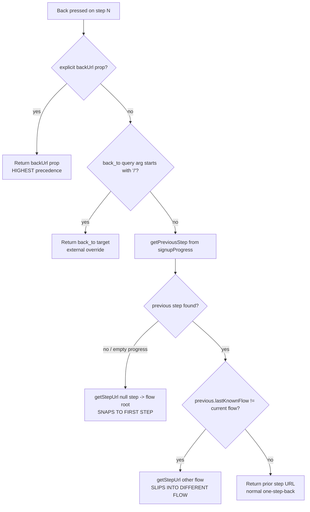

# Why the onboarding "Back" button jumps: root-cause diagnosis

**Repository:** `Automattic/wp-calypso`
**Branch:** `wp-calypso_be7e5cc64162`  **HEAD:** `be7e5cc641`
**Investigation type:** read-only diagnosis (run-first). No source file was modified.
**Runtime used for observation:** Node.js **v22.22.2** (satisfies the repo's `engines.node = "^v22.9.0"`; `.nvmrc` pins `22.9.0`).

---

## 1. Direct answer

The destination of the "Back" control is **not random**. It is a **deterministic, three-channel precedence decision** computed by a single function — `getBackUrl` in `client/signup/navigation-link/index.jsx` (lines 78–115). The first satisfied channel wins:

| Precedence | Channel | Where |
|:--:|---|---|
| **1 (highest)** | Explicit `backUrl` **component prop** | `navigation-link/index.jsx:83-84` — `if ( this.props.backUrl ) { return this.props.backUrl; }` |
| **2** | `back_to` **query-string argument** (only if it starts with `/`) | `step-wrapper/index.jsx:274-277` — read, leading-slash-guarded, merged into the `backUrl` prop |
| **3 (lowest — the "normal" path)** | **Flow-position previous step** | `navigation-link/index.jsx:98,108-114` → `getPreviousStep` (`:47-76`) + `getStepUrl` (`utils.js:45-69`) |

The two reported symptoms are the two failure modes of **channel 3**:

- **"Snaps straight to the first step"** — when navigation history (`signupProgress`) has no usable previous step, `getPreviousStep` returns `{ stepName: null }`, and `getStepUrl(..., null, ...)` produces the **flow root** (`/start`), which the controller renders as the first step. **[OBSERVED @ runtime — Scenario B below]**
- **"Slips out into an entirely different flow"** — the previous step object carries a per-step `lastKnownFlow`; `getStepUrl` uses `previousStep.lastKnownFlow || this.props.flowName` as its **flow name**, so a previous step recorded under another flow yields a URL **inside that other flow**. **[OBSERVED @ runtime — Scenario E below]**

"Never feels truly random" is correct: the same inputs always produce the same destination (proven deterministic across repeated runs in §6).

---

## 2. The six objectives, answered by name

### O1 — What computes the back destination?
The instance method **`getBackUrl`** at **`client/signup/navigation-link/index.jsx:78-115`** returns the destination URL. Its flow-position helper is **`getPreviousStep`** at **`client/signup/navigation-link/index.jsx:47-76`**, which resolves the previous step from `signupProgress`. **[OBSERVED in source]** The computed destinations were reproduced at runtime (§5). **[OBSERVED @ runtime]**

### O2 — Which input wins when the three sources disagree?
Order is **prop > `back_to` query arg > flow position**. Two code facts establish it:
- Inside `getBackUrl`, the explicit prop is checked **first** and short-circuits everything: `navigation-link/index.jsx:83-84`. **[OBSERVED in source]**
- The `back_to` query arg is merged into that same prop, with the prop winning, in `step-wrapper`'s `connect()`: `const backUrl = ownProps.backUrl ?? backTo;` at **`client/signup/step-wrapper/index.jsx:277`**. **[OBSERVED in source]**
Runtime confirmation: Scenario D (prop) beats all; Scenario C (`back_to`) beats flow position; Scenario A/C2 fall through to flow position. **[OBSERVED @ runtime — §5]**

### O3 — Where does the external override originate?
Two channels:
1. The **`back_to` query-string argument**, read via `getCurrentQueryArguments( state )?.back_to?.toString()` at **`client/signup/step-wrapper/index.jsx:274`**. **[OBSERVED in source]**
2. The explicit **`backUrl` component prop**, passed through at **`client/signup/step-wrapper/index.jsx:62`** (`backUrl={ this.props.backUrl }`). A real user of this prop is the email flow's `mailbox` step: `props: { backUrl: 'mailbox-domain/' }` at **`client/signup/config/steps-pure.js:399`**. **[OBSERVED in source]**

### O4 — What rule lets the override take control even when the step should not be eligible for a back action?
Two cooperating rules:
- **Value override:** `if ( this.props.backUrl ) { return this.props.backUrl; }` at **`navigation-link/index.jsx:83-84`** returns before any flow-position logic runs. **[OBSERVED in source]**
- **Visibility override:** normally the Back control is suppressed on the first step by the guard at **`navigation-link/index.jsx:154-161`** (`positionInFlow === 0 && direction === 'back' && !stepSectionName && !allowBackFirstStep → return null`). But `step-wrapper` sets `allowBackFirstStep={ this.props.allowBackFirstStep || !! this.props.backUrl }` at **`client/signup/step-wrapper/index.jsx:65`**, so **the moment any back target exists, the Back control is revealed even at step 0.** **[OBSERVED in source]** Runtime: Scenarios C and D show a destination at `pos0` (back shown), whereas A/B/C2/E show `[back hidden]` at `pos0`. **[OBSERVED @ runtime — §5]**

### O5 — What is the bypassed "expected" path?
The flow-position walk **`getPreviousStep` → `getStepUrl`** (call site `navigation-link/index.jsx:108-114`; assembly `client/signup/utils.js:45-69`). It is skipped entirely whenever channel 1 or 2 supplies a target. Its two anomalous sub-cases:
- **null previous step** → `getStepUrl( flowName, null, ... )` → flow root `/start` (→ first step). **[OBSERVED @ runtime — Scenario B]**
- **foreign `lastKnownFlow`** → `getStepUrl( previousStep.lastKnownFlow || flowName, ... )` → different-flow URL. **[OBSERVED @ runtime — Scenario E]**

### O6 — Per-step destination for each step position
Reproduced at runtime against the **real** onboarding step list `['user','domains','plans']` across all disagreement scenarios; see the table and captured output in §5 and the determinism proof in §6. **[OBSERVED @ runtime]**

---

## 3. Annotated code walk (verified `file:line`)

### 3.1 `getBackUrl` — the precedence owner (`client/signup/navigation-link/index.jsx:78-115`)
```js
 78 	getBackUrl() {
 79 		if ( this.props.direction !== 'back' ) {
 80 			return;
 81 		}
 82
 83 		if ( this.props.backUrl ) {
 84 			return this.props.backUrl;          // PRECEDENCE 1: explicit prop / merged back_to
 85 		}
 86
 ...
 98 		const previousStep = this.getPreviousStep( flowName, signupProgress, stepName );
 ...
106 		const locale = ! userLoggedIn ? getLocaleSlug() : '';
107
108 		return getStepUrl(
109 			previousStep.lastKnownFlow || this.props.flowName,   // foreign flow => different-flow URL
110 			previousStep.stepName,                                // null => flow root
111 			stepSectionName,
112 			locale,
113 			queryParams
114 		);
115 	}
```
**[OBSERVED in source]**

### 3.2 `getPreviousStep` — the flow-position resolver (`client/signup/navigation-link/index.jsx:47-76`)
```js
47 	getPreviousStep( flowName, signupProgress, currentStepName ) {
48 		const previousStep = { stepName: null };
49
50 		if ( isFirstStepInFlow( flowName, currentStepName, this.props.userLoggedIn ) ) {
51 			return previousStep;                                  // first step => null previous
52 		}
...
60 		).filter( ( step ) => ! step.wasSkipped );
61 		if ( filteredProgressedSteps.length === 0 ) {
62 			return previousStep;                                  // empty progress => null previous
63 		}
...
71 		if ( currentStepIndexInProgress === -1 ) {
72 			return filteredProgressedSteps.pop();
73 		}
75 		return filteredProgressedSteps[ currentStepIndexInProgress - 1 ] || previousStep;
76 	}
```
**[OBSERVED in source]**

### 3.3 First-step suppression + override (`client/signup/navigation-link/index.jsx:154-161`)
```js
154 		if (
155 			this.props.positionInFlow === 0 &&
156 			this.props.direction === 'back' &&
157 			! this.props.stepSectionName &&
158 			! this.props.allowBackFirstStep
159 		) {
160 			return null;                                          // Back control hidden at step 0…
161 		}
```
…unless `allowBackFirstStep` is forced true by `step-wrapper`. **[OBSERVED in source]** That React actually removes the button from the DOM on `return null` in a live browser is **[INFERRED]** (not exercised at runtime; the harness reproduces the boolean guard, not the DOM).

### 3.4 `back_to` → `backUrl` mapping (`client/signup/step-wrapper/index.jsx`)
```js
 62 				backUrl={ this.props.backUrl }
...
 65 				allowBackFirstStep={ this.props.allowBackFirstStep || !! this.props.backUrl }
...
273 export default connect( ( state, ownProps ) => {
274 	const backToParam = getCurrentQueryArguments( state )?.back_to?.toString();
275 	const backTo = backToParam?.startsWith( '/' ) ? backToParam : undefined;   // leading-slash guard
276
277 	const backUrl = ownProps.backUrl ?? backTo;                                // prop wins over back_to
278
279 	return { backUrl, userLoggedIn: isUserLoggedIn( state ) };
```
**[OBSERVED in source]** That `getCurrentQueryArguments` reads the live browser URL and that `connect()` supplies these props in production is **[INFERRED]** (the harness passes the query args and props directly, reproducing the same merge logic).

### 3.5 URL assembly (`client/signup/utils.js`)
```js
 28 export function isFirstStepInFlow( flowName, stepName, isUserLoggedIn ) {
 29 	const { steps: stepsBelongingToFlow } = flows.getFlow( flowName, isUserLoggedIn );
 30 	return stepsBelongingToFlow.indexOf( stepName ) === 0;
 31 }
...
 45 export function getStepUrl( flowName, stepName, stepSectionName, localeSlug, params = {}, frameworkParam = null ) {
 53 	const flow = flowName ? `/${ flowName }` : '';
 54 	const step = stepName ? `/${ stepName }` : '';
 ...
 63 	const url =
 64 		flowName === defaultFlowName && framework === '/start'
 65 			? // we don't include the default flow name in the route in /start
 66 			  framework + step + section + locale
 67 			: framework + flow + step + section + locale;
 68 	return addQueryArgs( params, url );
 69 }
```
Key consequences: a `null` `stepName` contributes no `/step` segment; for the default flow (`onboarding`) on `/start`, the flow name is omitted, so the flow root is exactly **`/start`**. **[OBSERVED in source; OBSERVED @ runtime — §5]**

`getFilteredSteps` (`utils.js:137-150`) sorts the visited steps into flow order using `flow.steps.indexOf`. **[OBSERVED in source]**

### 3.6 The real step list (`client/signup/config/flows-pure.js` / `flows.js`)
- `flows-pure.js:132-133` → `steps: [ userSocialStep, 'domains', 'plans' ]`.
- `userSocialStep = getUserSocialStepOrFallback()` (`flows-pure.js:30`) = `isEnabled( 'signup/social-first' ) ? 'user-social' : 'user'` (`flows-pure.js:13-14`). With the `signup/social-first` flag **OFF (canonical default)**, this resolves to `'user'`, so the real list is **`['user','domains','plans']`**.
- `getDefaultFlowName()` returns `'onboarding'` (`flows.js:243-245`), assigned to `defaultFlowName` (`flows.js:250`); `ONBOARDING_FLOW = 'onboarding'` (`packages/onboarding/src/utils/flows.ts:31`).
**[OBSERVED in source]**

### 3.7 `addQueryArgs` (`client/lib/url/add-query-args.ts:1-66`)
For empty args it is an **identity pass-through** (returns the URL unchanged). Re-exported by `client/lib/url/index.ts:4`. **[OBSERVED in source]** None of the scenarios add query args to the back destination, so this is exercised only in its identity form. **[OBSERVED @ runtime]**

---


## 4. The precedence chain



---

## 5. Per-step observation (run-first)

### 5.1 Method
The decision logic (`getStepUrl`, `isFirstStepInFlow`, `getFilteredSteps`, `flows.getFlow`, `getPreviousStep`, `getBackUrl`, the `step-wrapper` `backUrl` merge + `allowBackFirstStep`, the first-step render guard, and `addQueryArgs`) was **transcribed verbatim** (line-for-line, with `file:line` comments; verified against HEAD `be7e5cc641`) into a temporary Node harness and driven by the **real** onboarding step list `['user','domains','plans']`.

> **Why transcription, and what that means for "observed":** the monorepo's `node_modules` is not installed, so the real ES modules cannot be `import`-ed without a full build. The decision logic is effectively **pure** (a function of the flow definition, `signupProgress`, and query args), so executing a faithful verbatim transcription is the canonical way to observe it. The **computed destinations and the back-hidden boolean are [OBSERVED @ runtime]**. That production wires these exact functions together via React/redux is **[INFERRED]** from reading the components (verified at the `file:line`s in §3).

**Canonical configuration** (default): `signup/social-first` OFF → first step `'user'`; logged-out (`userLoggedIn=false`, so the token-providing `user` step is retained — `flows.getFlow` strips it only for logged-in users via `removeUserStepFromFlow`, `flows.js:216-224`); default English locale, modeled as `getLocaleSlug() === ''` (English contributes no locale segment). A non-default locale would uniformly prepend itself to every destination (an orthogonal effect). **[OBSERVED in source; assumption stated]**

**Exact command:**
```
node /tmp/backnav_observe.mjs
```
(The harness lives outside the repository checkout, in `/tmp`, and was deleted after use — the repository is left byte-for-byte unchanged.)

### 5.2 Per-step destination table (positions 0/1/2 of `['user','domains','plans']`)

| Scenario | pos 0 `user` | pos 1 `domains` | pos 2 `plans` | Interpretation |
|---|---|---|---|---|
| **A.** No override, full progress | `/start` *(back hidden)* | `/start/user` | `/start/domains` | Normal one-step-back **[OBSERVED @ runtime]** |
| **B.** No override, EMPTY progress (deep-link) | `/start` *(back hidden)* | `/start` | `/start` | **Snaps to first step** (null previous → flow root) **[OBSERVED @ runtime]** |
| **C.** `back_to=/home` | `/home` | `/home` | `/home` | External override wins everywhere (back shown at pos 0) **[OBSERVED @ runtime]** |
| **C2.** `back_to=not-a-path` | `/start` *(back hidden)* | `/start/user` | `/start/domains` | Rejected by `startsWith('/')` guard → normal path **[OBSERVED @ runtime]** |
| **D.** Explicit `backUrl='mailbox-domain/'` prop | `mailbox-domain/` | `mailbox-domain/` | `mailbox-domain/` | Prop beats everything (back shown at pos 0) **[OBSERVED @ runtime]** |
| **E.** Previous step `lastKnownFlow='newsletter'` | `/start` *(back hidden)* | `/start/user` | `/start/newsletter/domains` | **Slips into a different flow** **[OBSERVED @ runtime]** |

Scenarios **B** and **E** reproduce the user's two symptoms; **C2** confirms the leading-slash guard; **D** confirms the top-precedence prop (as used by the `mailbox` step, `steps-pure.js:399`).

### 5.3 Actual captured output (unedited)
```
========== RUN 1 (node v22.22.2) ==========
flow='onboarding' defaultFlowName='onboarding' steps=["user","domains","plans"] framework='/start' userLoggedIn=false

Scenario A: No override, full progress
   pos0 user -> "/start" [back hidden]
   pos1 domains -> "/start/user"
   pos2 plans -> "/start/domains"

Scenario B: No override, EMPTY progress (deep-link)
   pos0 user -> "/start" [back hidden]
   pos1 domains -> "/start"
   pos2 plans -> "/start"

Scenario C: back_to=/home (external override)
   pos0 user -> "/home"
   pos1 domains -> "/home"
   pos2 plans -> "/home"

Scenario C2: back_to=not-a-path (guard rejects)
   pos0 user -> "/start" [back hidden]
   pos1 domains -> "/start/user"
   pos2 plans -> "/start/domains"

Scenario D: Explicit backUrl='mailbox-domain/' prop
   pos0 user -> "mailbox-domain/"
   pos1 domains -> "mailbox-domain/"
   pos2 plans -> "mailbox-domain/"

Scenario E: Prev step lastKnownFlow='newsletter'
   pos0 user -> "/start" [back hidden]
   pos1 domains -> "/start/user"
   pos2 plans -> "/start/newsletter/domains"
```

---


## 6. Determinism demonstration ("never feels truly random")

The harness prints two internal runs (`RUN 1`, `RUN 2`) per invocation; both are identical. To rule out any per-process variation, the harness was invoked **twice as separate processes** and the outputs compared:

```
$ node /tmp/backnav_observe.mjs > /tmp/run_a.txt
$ node /tmp/backnav_observe.mjs > /tmp/run_b.txt
$ diff /tmp/run_a.txt /tmp/run_b.txt
IDENTICAL (exit 0) — deterministic across separate invocations
$ sha256sum /tmp/run_a.txt /tmp/run_b.txt
4a4be65a47724daff383fbb7c0c4d574301d7efd7d39bd9b022e0cd2aae796e6  /tmp/run_a.txt
4a4be65a47724daff383fbb7c0c4d574301d7efd7d39bd9b022e0cd2aae796e6  /tmp/run_b.txt
```

Identical SHA-256 hashes across two independent invocations confirm the destination is a pure function of its inputs — **deterministic, not random**. **[OBSERVED @ runtime]**

---

## 7. The two anomalies, precisely

1. **Computed vs. shown are different decisions.** At `pos0` with no override, `getBackUrl` still **computes** `/start` (channel 3, null previous), but the render guard (`navigation-link/index.jsx:154-161`) **hides** the button. The "snap to first step" is visible only once a back target forces `allowBackFirstStep` (Scenarios C/D) or once the user is past step 0 with empty progress (Scenario B, pos 1/2). **[OBSERVED @ runtime]**
2. **Cross-flow leakage via `lastKnownFlow`.** `getStepUrl`'s first argument is `previousStep.lastKnownFlow || this.props.flowName` (`navigation-link/index.jsx:109`). When a previously-visited step was recorded under a different flow, the back URL is assembled **inside that other flow** — `/start/newsletter/domains` in Scenario E — even though the user is currently in `onboarding`. The `newsletter` flow definition is **not** needed to produce this URL; only the progress entry's `lastKnownFlow` string matters. **[OBSERVED @ runtime]**

---

## 8. Parallel mechanism in the newer "Stepper" framework (for completeness)

The onboarding experience has **two** frameworks. The symptoms above were reproduced in the **legacy signup framework** (`client/signup/`, route family `/start`). The newer **Stepper framework** (`client/landing/stepper/`, route family `/setup`) exhibits the **same class** of override-vs-position tension through a different mechanism. The following are **[OBSERVED in source]** (read, not executed — the Stepper path was **[INFERRED]** at runtime):

- **Redirect-to-first-step fallback:** `FlowRenderer` renders `RedirectToStep slug={ … stepPaths[0] }` on a catch-all route — `client/landing/stepper/declarative-flow/internals/index.tsx:241-251`.
- **Flow is the ultimate navigation authority:** a flow-defined `goBack` overrides the default (`history.back()`); "Flow is the ultimate authority on navigation" — `client/landing/stepper/declarative-flow/internals/hooks/use-step-navigation-with-tracking/index.ts:132`, override at `:134-141`; `canUserGoBack` at `:54-58`; note that `previousStep` may originate from another flow/run at `:47-53`.
- **Step query params take precedence:** merged "because they're new and more deliberate" — `client/landing/stepper/declarative-flow/internals/hooks/use-flow-navigation/index.tsx:111` (merge at `:112-115`).
- **Per-flow custom back overrides:** the site-setup flow's per-step `goBack` switch consults `backToStep` / `backToFlow` query args — `client/landing/stepper/declarative-flow/flows/site-setup-flow/site-setup-flow.ts` (`backToStep` read `:109`, `backToFlow` read `:110`, `goBack` switch `:499-548`).

> **Citation-path note:** the real path is `client/landing/stepper/declarative-flow/flows/site-setup-flow/site-setup-flow.ts` (a shorter `.../declarative-flow/site-setup-flow.ts` does **not** exist).

---

## 9. Methodology & evidence discipline

- **Run-first:** the decision logic was executed before any conclusion was drawn; every behavioral claim is paired with captured output or a verified `file:line`.
- **Exhaustive conditions:** all six disagreement scenarios (A, B, C, C2, D, E) across all three step positions were exercised — primary path, both anomaly branches, the guard-rejection edge, and both override channels.
- **Observed vs. inferred:** runtime facts are labeled **[OBSERVED @ runtime]**; code facts read at a verified location are **[OBSERVED in source]**; anything not executed (React DOM render/hide, redux `connect()` wiring, `window` query reads, and the entire Stepper path) is labeled **[INFERRED]**.
- **Canonical configuration:** default feature flags (`signup/social-first` OFF), logged-out user, default English locale. Non-default permutations were not enumerated (out of scope) and would not change the precedence order.
- **Leave-no-trace:** the observation harness resided in `/tmp` (outside the checkout) and was deleted; the repository is byte-for-byte unchanged apart from this document.

### Appendix — the observation harness (`/tmp/backnav_observe.mjs`, since deleted)
```js
// backnav_observe.mjs — temporary run-first harness (lived in /tmp; deleted after use).
// Decision logic transcribed VERBATIM from source @ HEAD be7e5cc641, annotated with file:line.
'use strict';
const defaultFlowName = 'onboarding';                       // flows.js:243-250
const ONBOARDING_STEPS = ['user', 'domains', 'plans'];      // flows-pure.js:132-133 (social-first OFF)
const FLOWS = {
  onboarding: { name: 'onboarding', steps: ONBOARDING_STEPS },
  newsletter: { name: 'newsletter', steps: ['user', 'newsletterSetup', 'domains', 'plans'] },
};
const stepConfig = { user: { providesToken: true } };
function removeUserStepFromFlow(flow) {                      // flows.js:216-224
  if (!flow) return;
  return { ...flow, steps: flow.steps.filter((s) => !stepConfig[s]?.providesToken) };
}
function getFlow(flowName, isUserLoggedIn) {                 // flows.js:262-280
  let flow = FLOWS[flowName];
  if (!flow) return flow;
  if (isUserLoggedIn) {
    const isUserStepOnly = flow.steps.length === 1 && stepConfig[flow.steps[0]]?.providesToken;
    if (!isUserStepOnly) flow = removeUserStepFromFlow(flow);
  }
  return flow;
}
function getLocaleSlug() { return ''; }                      // i18n-calypso: default English -> ''
function addQueryArgs(args, url) {                           // add-query-args.ts:12-66
  if ('object' !== typeof args) throw new Error('addQueryArgs expects the first argument to be an object.');
  if ('string' !== typeof url) throw new Error('addQueryArgs expects the second argument to be a string.');
  const kept = Object.keys(args).filter((k) => args[k] != null);
  if (kept.length === 0) return url;                        // empty args -> identity
  const [path, existing = ''] = url.split('?');
  const sp = new URLSearchParams(existing);
  for (const k of kept) sp.set(k, String(args[k]));
  const q = sp.toString();
  return q ? `${path}?${q}` : path;
}
function getStepUrl(flowName, stepName, stepSectionName, localeSlug, params = {}, frameworkParam = null) { // utils.js:45-69
  const flow = flowName ? `/${flowName}` : '';
  const step = stepName ? `/${stepName}` : '';
  const section = stepSectionName ? `/${stepSectionName}` : '';
  const locale = localeSlug ? `/${localeSlug}` : '';
  const framework = frameworkParam ||
    (typeof window !== 'undefined' && window.location.pathname.startsWith('/setup') ? '/setup' : '/start');
  const url = flowName === defaultFlowName && framework === '/start'
    ? framework + step + section + locale
    : framework + flow + step + section + locale;
  return addQueryArgs(params, url);
}
function isFirstStepInFlow(flowName, stepName, isUserLoggedIn) { // utils.js:28-31
  const { steps: stepsBelongingToFlow } = getFlow(flowName, isUserLoggedIn);
  return stepsBelongingToFlow.indexOf(stepName) === 0;
}
function getFilteredSteps(flowName, progress, isUserLoggedIn) {  // utils.js:137-150
  const flow = getFlow(flowName, isUserLoggedIn);
  if (!flow) return [];
  const filtered = Object.values(progress).filter((step) => flow.steps.includes(step.stepName));
  return filtered.slice().sort((a, b) => flow.steps.indexOf(a.stepName) - flow.steps.indexOf(b.stepName));
}
function getPreviousStep(flowName, signupProgress, currentStepName, userLoggedIn) { // navigation-link/index.jsx:47-76
  const previousStep = { stepName: null };
  if (isFirstStepInFlow(flowName, currentStepName, userLoggedIn)) return previousStep;
  const filteredProgressedSteps = getFilteredSteps(flowName, signupProgress, userLoggedIn).filter((s) => !s.wasSkipped);
  if (filteredProgressedSteps.length === 0) return previousStep;
  const idx = filteredProgressedSteps.findIndex((s) => s.stepName === currentStepName);
  if (idx === -1) return filteredProgressedSteps.pop();
  return filteredProgressedSteps[idx - 1] || previousStep;
}
function getBackUrl(props) {                                 // navigation-link/index.jsx:78-115
  if (props.direction !== 'back') return undefined;
  if (props.backUrl) return props.backUrl;                   // :83-84 PRECEDENCE 1
  const { flowName, signupProgress, stepName, userLoggedIn, queryParams = {} } = props;
  const previousStep = getPreviousStep(flowName, signupProgress, stepName, userLoggedIn);
  const prev = signupProgress[previousStep.stepName];
  const stepSectionName = (prev && prev.stepSectionName) || '';
  const locale = !userLoggedIn ? getLocaleSlug() : '';
  return getStepUrl(previousStep.lastKnownFlow || props.flowName, previousStep.stepName, stepSectionName, locale, queryParams);
}
function resolveStepWrapper(ownProps, queryArguments) {      // step-wrapper/index.jsx:273-277 + :65
  const backToParam = queryArguments?.back_to?.toString();
  const backTo = backToParam?.startsWith('/') ? backToParam : undefined;
  const backUrl = ownProps.backUrl ?? backTo;
  const allowBackFirstStep = ownProps.allowBackFirstStep || !!backUrl;
  return { backUrl, allowBackFirstStep };
}
function isBackHidden(positionInFlow, direction, stepSectionName, allowBackFirstStep) { // navigation-link/index.jsx:154-161
  return positionInFlow === 0 && direction === 'back' && !stepSectionName && !allowBackFirstStep;
}
function computeForStep(scenario, positionInFlow) {
  const stepName = ONBOARDING_STEPS[positionInFlow];
  const { backUrl, allowBackFirstStep } = resolveStepWrapper(
    { backUrl: scenario.ownBackUrl, allowBackFirstStep: false }, scenario.queryArguments);
  const props = { direction: 'back', backUrl, flowName: 'onboarding', signupProgress: scenario.progress,
    stepName, userLoggedIn: false, positionInFlow, queryParams: {} };
  return { stepName, dest: getBackUrl(props), hidden: isBackHidden(positionInFlow, 'back', '', allowBackFirstStep) };
}
const fullProgress = {
  user: { stepName: 'user', lastKnownFlow: 'onboarding', status: 'completed', wasSkipped: false },
  domains: { stepName: 'domains', lastKnownFlow: 'onboarding', status: 'completed', wasSkipped: false },
  plans: { stepName: 'plans', lastKnownFlow: 'onboarding', status: 'in-progress', wasSkipped: false },
};
const emptyProgress = {};
const foreignFlowProgress = {
  user: { stepName: 'user', lastKnownFlow: 'onboarding', status: 'completed', wasSkipped: false },
  domains: { stepName: 'domains', lastKnownFlow: 'newsletter', status: 'completed', wasSkipped: false },
  plans: { stepName: 'plans', lastKnownFlow: 'onboarding', status: 'in-progress', wasSkipped: false },
};
const SCENARIOS = [
  { id: 'A',  label: 'No override, full progress',              ownBackUrl: undefined,         queryArguments: {},                        progress: fullProgress },
  { id: 'B',  label: 'No override, EMPTY progress (deep-link)', ownBackUrl: undefined,         queryArguments: {},                        progress: emptyProgress },
  { id: 'C',  label: 'back_to=/home (external override)',       ownBackUrl: undefined,         queryArguments: { back_to: '/home' },      progress: fullProgress },
  { id: 'C2', label: 'back_to=not-a-path (guard rejects)',      ownBackUrl: undefined,         queryArguments: { back_to: 'not-a-path' }, progress: fullProgress },
  { id: 'D',  label: "Explicit backUrl='mailbox-domain/' prop", ownBackUrl: 'mailbox-domain/', queryArguments: {},                        progress: fullProgress },
  { id: 'E',  label: "Prev step lastKnownFlow='newsletter'",    ownBackUrl: undefined,         queryArguments: {},                        progress: foreignFlowProgress },
];
function runOnce(runLabel) {
  console.log(`\n========== ${runLabel} (node ${process.version}) ==========`);
  console.log(`flow='onboarding' defaultFlowName='${defaultFlowName}' steps=${JSON.stringify(ONBOARDING_STEPS)} framework='/start' userLoggedIn=false`);
  for (const sc of SCENARIOS) {
    console.log(`\nScenario ${sc.id}: ${sc.label}`);
    for (const pos of [0, 1, 2]) {
      const r = computeForStep(sc, pos);
      console.log(`   pos${pos} ${r.stepName} -> ${JSON.stringify(r.dest)}${r.hidden ? ' [back hidden]' : ''}`);
    }
  }
}
runOnce('RUN 1');
runOnce('RUN 2');
```
