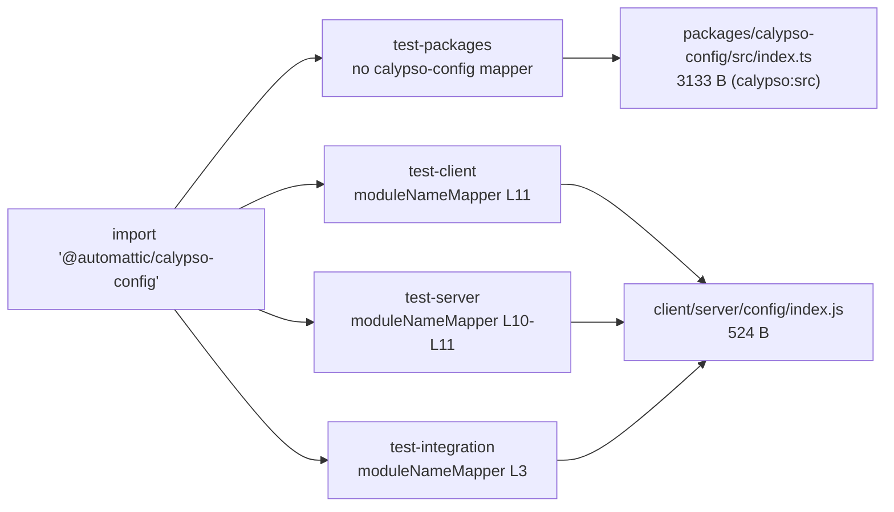

# Why `wp-calypso` Jest tests can pass in isolation yet fail in a full‑suite run

**An empirical, run‑first investigation of module resolution and environment setup across the seven primary Jest execution contexts**

## TL;DR (direct thesis)

Tests **can** pass alone but fail in a full run when **the same test file means different things in different execution contexts**. This document identifies — and demonstrates at runtime through the real Jest configs — **three independent mechanisms that can produce such a divergence**:

1. **Per‑suite `testEnvironment` (node vs jsdom), plus per‑file / per‑project opt‑ins.** The shared preset defaults every suite to **`node`** (`packages/calypso-jest/jest-preset.js:L11`). `test-client`, `test-server`, `test-build-tools`, and `test-integration` all run under **`jest-environment-node`**; `test-apps` forces **`jsdom`** globally (`test/apps/jest-preset.js:L7`); and `test-packages` is **mixed** (36 node + 22 jsdom projects). The client suite is `node` at the suite level and only becomes `jsdom` per file via an `@jest-environment jsdom` docblock (**498** client files carry it).
2. **Per‑suite `moduleNameMapper` redirects layered on a `calypso:src`‑first custom resolver.** The custom `enhanced-resolve` resolver (`packages/calypso-jest/src/module-resolver.js:L18`) prefers untranspiled source, and each suite adds its own redirects — so the _same_ import string (`@automattic/calypso-config`) resolves to **two different files** depending on the suite (Q4).
3. **Browser‑global provisioning timed to `setupFilesAfterEnv`.** The jsdom `testEnvironment` provides `window`/`document` at construction time, but the browser‑like globals `matchMedia`, `ResizeObserver`, `CSS`, and `Worker` are installed later by `test/client/setup-test-framework.js`, which runs in `setupFilesAfterEnv` (Q5). (`fetch`/`TextEncoder`/`ReadableStream`/`structuredClone` are also installed there in the client context, but are additionally Node‑22 runtime‑natives in the node context — see Q2.) A file that assumes those setup‑provided globals passes only where that setup file is wired in.

**Scope of this thesis — what was and was not reproduced.** These three mechanisms are demonstrated to *exist and behave as described* at runtime; they are the evidenced routes by which an isolation‑vs‑full‑suite discrepancy **can** arise. This investigation did **not** reproduce a specific test that passes in isolation and then fails in the full suite *because of* these mechanisms. The full‑suite failures that **were** observed while running the seven commands (Q1) have **environmental / library‑version root causes** — a `nock` "Invalid URL" rejection of a scheme‑less host, a CircleCI‑artifact test that needs network access (disabled by `nock.disableNetConnect()`), a `mock-fs`/Node‑22 incompatibility, and `Intl`/ICU currency‑format expectation drift under Node 22 — and are **independent** of the module‑resolution and global‑provisioning mechanisms above. Notably, the per‑file‑jsdom `test-client` suite **passes** in full while several node‑environment suites fail, for those environmental reasons rather than the environment split itself. The sections below therefore document *mechanisms that can cause* the reported symptom, with the exact commands and complete output that establish each mechanism's runtime behavior.

**Toolchain / prerequisite.** Everything below was produced under the pinned toolchain — **Node.js 22.9.0** (`.nvmrc:L1`; `package.json:L57` engines `"node": "^v22.9.0"`) and **Yarn 4.0.2** via Corepack (`package.json:L422`; `.yarnrc.yml:L5`) — after the one‑time prerequisite `corepack yarn install` (the repository root ships without `node_modules`). The container's actual executable reports **Node v22.23.1**, which is on the pinned `^v22.9.0` 22.x line (pins vs. observed are separated in the method section). This distinction matters for Q2: the node context exposes `fetch`/`structuredClone`/`TextEncoder`/`ReadableStream` as **Node‑22 runtime‑natives**, so the clean client‑only differentiator is **`matchMedia`**, not `fetch`.

> **Evidence & reproducibility discipline.** Every claim below is backed by the _exact command executed_ and its _complete, unedited output_ (benign noise — the Browserslist "caniuse‑lite is 17 months old" notice — is kept verbatim). Every count/order/resolution claim was reproduced **at least twice** and was **identical across runs** unless a distribution is explicitly reported; this is stated per section. The absolute checkout prefix that appears in the outputs is `/tmp/blitzy/wp-calypso/blitzy-f2a8184c-fd7c-43d0-9446-cc645dc1aa89_72bcd5`; where this prefix is abbreviated it is written `<REPO>` **in prose only** — it is never substituted inside a captured output block, which are shown byte‑for‑byte. All observations were produced by running the actual `test-*` Jest configs — the canonical entry points — never by re‑implementing the resolver or hand‑mocking the environment. The one exception, the Q5 "extended config," **spreads the real client config and only _adds_ `console.log` observation hooks**; it is disclosed as a non‑canonical additive wrapper in Q5 and bypasses no real hook.

---

## Investigation method, evidence discipline, and toolchain provenance

### How to read the evidence in this document

This document was produced **run‑first**: every behavioural claim below is backed by the *exact command executed* and its *complete, unedited output* (including benign noise such as the Browserslist "caniuse‑lite is N months old" notice, which is retained verbatim). Output blocks are shown **raw** — absolute paths appear exactly as the tools printed them. The repository checkout prefix that recurs in those outputs is:

```
/tmp/blitzy/wp-calypso/blitzy-f2a8184c-fd7c-43d0-9446-cc645dc1aa89_72bcd5
```

For brevity this prefix is written as `<REPO>` **in prose only**; it is never substituted inside a captured output block. Where a value is a magnitude, an ordering, or a count, the producing command was run **at least twice** and the result is reported as stable (or, if it varied, the observed distribution is reported).

### Reproducibility preamble (applies to every command block below)

Unless a block states otherwise, each command was executed from the repository root under a `pipefail` shell so that a failure anywhere in a pipeline is not masked by a trailing `sort`/`uniq`/`wc`:

```
cd /tmp/blitzy/wp-calypso/blitzy-f2a8184c-fd7c-43d0-9446-cc645dc1aa89_72bcd5
set -o pipefail
```

- **`CI=1`** is set on the test‑running commands. It is an *execution guard*: Jest treats `CI=1` as continuous‑integration mode, which disables interactive watch prompts and suppresses new‑snapshot writing, making a single non‑interactive run safe to capture. It does **not** change `testEnvironment`, resolution, or setup ordering (all of which are what this document measures).
- **Exit status** is reported for every command as `exit=<n>`; for piped commands the status of the *left‑most* (Jest/grep) stage is captured via `${PIPESTATUS[0]}` so the evidence "fails closed" rather than reporting the exit code of a trailing formatter.
- Streams are combined (`2>&1`) when a command's warnings are part of the evidence; otherwise stdout and stderr are noted separately.

### Environment prep (a prerequisite action, not a repository change)

Every suite depends on an installed workspace. The repository root ships without `node_modules`, so the one‑time prerequisite is:

```
corepack yarn install
```

In this checkout the workspace was already populated during environment setup, so re‑running the command is **idempotent**. It was run twice; both runs exited `0` in ≈6–7 s wall‑clock with an identical step structure (the internal "Done in" timing is the only value that varies run‑to‑run):

```
corepack yarn install
```

Run 1:

```
➤ YN0000: · Yarn 4.0.2
➤ YN0000: ┌ Resolution step
➤ YN0000: └ Completed in 0s 522ms
➤ YN0000: ┌ Fetch step
➤ YN0000: └ Completed in 4s 402ms
➤ YN0000: ┌ Link step
➤ YN0000: └ Completed in 0s 983ms
➤ YN0000: · Done in 6s 337ms
exit=0
```

Run 2:

```
➤ YN0000: · Yarn 4.0.2
➤ YN0000: ┌ Resolution step
➤ YN0000: └ Completed in 0s 499ms
➤ YN0000: ┌ Fetch step
➤ YN0000: └ Completed in 4s 465ms
➤ YN0000: ┌ Link step
➤ YN0000: └ Completed in 1s 93ms
➤ YN0000: · Done in 6s 247ms
exit=0
```

The step structure (`Resolution` → `Fetch` → `Link` → `Done`, all `YN0000`, no errors) was byte‑identical across the two runs; only the millisecond timings differed, which is expected for an already‑satisfied dependency graph. **Provenance note:** the *initial* population of `node_modules` was performed by environment setup (a from‑scratch install of the same graph takes ≈2.5 min because it additionally runs the `postinstall` package builds); the runs shown here are the idempotent re‑confirmation that the graph is complete and consistent before any suite is exercised.

### Toolchain: repository pins vs. observed executables

The requirements pin a toolchain; the container runs a compatible but **not byte‑identical** patch release. These are kept strictly separate below.

**Repository pins (declared, not executed):**

- Node **22.9.0** — `.nvmrc:L1` (`22.9.0`) and `package.json:L57` (`engines.node: "^v22.9.0"`).
- Yarn **4.0.2** — `package.json:L422` (`packageManager: "yarn@4.0.2"`) and `.yarnrc.yml:L5` (`yarnPath: .yarn/releases/yarn-4.0.2.cjs`), with `nodeLinker: node-modules` (`.yarnrc.yml:L3`).

**Observed executables (actually run):** captured twice each; stable.

```
node --version
```

```
v22.23.1
exit=0
```

```
corepack yarn --version
```

```
4.0.2
exit=0
```

```
git rev-parse HEAD
```

```
2e95839b93824cd7fe33f68a28f6a893ce58f748
exit=0
```

**Reconciliation.** The observed **Node v22.23.1** is *not* the pinned **22.9.0**, but it is on the same 22.x line and **satisfies** the declared range `engines.node: "^v22.9.0"` (`package.json:L57`) — `^22.9.0` admits any `22.x.y` with `x.y ≥ 9.0`. Yarn matches the pin exactly (`4.0.2`). This distinction is not academic: **Q2 depends on it**, because Node 22 ships a *native global `fetch`* (and `structuredClone`, `TextEncoder`, `ReadableStream`), which changes which globals are genuinely context‑specific. Any value obtained under v22.23.1 that would differ under the exact pin is called out where relevant; none of the resolution/ordering findings depend on the patch version.

All suites below are exercised through their **canonical entry points** — the actual `test-*` npm scripts in `package.json` and the Jest configs they reference — never by re‑implementing the resolver or hand‑mocking the environment. The **one** disclosed exception is the Q5 "extended config," which *spreads the real client config and only adds `console.log` observation hooks*; it is described in full (with source) in Q5 and bypasses no real hook.

## Q1 — What runtime environment does each test command actually use, and how do they differ?

**Direct answer.** The repository exposes **seven primary test commands**: six per‑suite runners (`jest -c=test/<suite>/jest.config.js`) plus one aggregate (`test`, which chains four of them via `run-s`). Their *effective* `testEnvironment` at runtime is **not uniform** — it is `node` for four suites, `jsdom` for one, a per‑project **mix** for one, and (for the client suite) `node` at the config level with a **per‑file `jsdom` opt‑in**:

| Command (canonical definition in `package.json`) | Config file | Effective `testEnvironment` (observed) | Effective `rootDir` |
|---|---|---|---|
| `test-build-tools` = `jest -c=test/build-tools/jest.config.js` `[package.json:L121]` | `test/build-tools/jest.config.js` | **node** — 1 project | `<REPO>/build-tools` |
| `test-client` = `TZ=UTC jest -c=test/client/jest.config.js` `[package.json:L122]` | `test/client/jest.config.js` | **node** at config level (1 project); **498 test files opt into `jsdom`** per‑file via `@jest-environment jsdom` docblock | `<REPO>/client` |
| `test-server` = `jest -c=test/server/jest.config.js` `[package.json:L131]` | `test/server/jest.config.js` | **node** — 1 project | `<REPO>/client/server` |
| `test-integration` = `jest -c=test/integration/jest.config.js` `[package.json:L125]` | `test/integration/jest.config.js` | **node** (set explicitly, `[test/integration/jest.config.js:L7]`) — 1 project | `<REPO>` (repo root) |
| `test-apps` = `jest -c=test/apps/jest.config.js` `[package.json:L127]` | `test/apps/jest.config.js` | **jsdom** — all 3 projects (forced by `[test/apps/jest-preset.js:L7]`) | multi‑project |
| `test-packages` = `jest -c=test/packages/jest.config.js` `[package.json:L129]` | `test/packages/jest.config.js` | **mixed** — 58 projects = **36 node + 22 jsdom** | multi‑project |
| aggregate `test` = `run-s -s test-client test-packages test-server test-build-tools` `[package.json:L120]` | — | **composition** of client→packages→server→build-tools (see aggregate evidence) | — |

**Why they differ (grounding).** The shared preset sets the default `testEnvironment: 'node'` (`packages/calypso-jest/jest-preset.js:L11`), which every suite inherits unless it overrides. `test-apps` overrides it to `jsdom` for the whole suite via its preset (`test/apps/jest-preset.js:L7`); `test-integration` re‑declares `node` explicitly (`test/integration/jest.config.js:L7`); `test-client` declares **no** `testEnvironment` key, so it inherits `node` and relies on the standard Jest per‑file docblock `@jest-environment jsdom` to switch individual files into a browser‑like DOM; `test-packages` is a multi‑project runner (`test/packages/jest.config.js:L4`) whose per‑package configs individually choose `node` or `jsdom`.

### Effective config, read directly from Jest (`--showConfig`)

`jest --showConfig` reports the *resolved* environment and rootDir that Jest will use (not the source text), so it is the canonical way to confirm the effective environment. The `testEnvironment` value is an absolute path to either `jest-environment-node` or `jest-environment-jsdom`; below it is reduced to that discriminator and the per‑project environments are tallied. Run 1:

```
=== jest --showConfig -c=test/build-tools/jest.config.js ===
projects=1  env tally={"node":1}
  testEnvironment=node  rootDir=/tmp/blitzy/wp-calypso/blitzy-f2a8184c-fd7c-43d0-9446-cc645dc1aa89_72bcd5/build-tools
exit=0

=== jest --showConfig -c=test/client/jest.config.js ===
projects=1  env tally={"node":1}
  testEnvironment=node  rootDir=/tmp/blitzy/wp-calypso/blitzy-f2a8184c-fd7c-43d0-9446-cc645dc1aa89_72bcd5/client
exit=0

=== jest --showConfig -c=test/server/jest.config.js ===
projects=1  env tally={"node":1}
  testEnvironment=node  rootDir=/tmp/blitzy/wp-calypso/blitzy-f2a8184c-fd7c-43d0-9446-cc645dc1aa89_72bcd5/client/server
exit=0

=== jest --showConfig -c=test/integration/jest.config.js ===
projects=1  env tally={"node":1}
  testEnvironment=node  rootDir=/tmp/blitzy/wp-calypso/blitzy-f2a8184c-fd7c-43d0-9446-cc645dc1aa89_72bcd5
exit=0

=== jest --showConfig -c=test/apps/jest.config.js ===
projects=3  env tally={"jsdom":3}
exit=0

=== jest --showConfig -c=test/packages/jest.config.js ===
projects=58  env tally={"node":36,"jsdom":22}
exit=0
```

Run 2 (stability — identical env tally and project counts; the only per‑project difference vs. run 1 is cosmetic path truncation in this reduced view):

```
=== showConfig RUN2 (stability) ===
build-tools: projects=1 env={"node":1} rootDir=blitzy-f2a8184c-fd7c-43d0-9446-cc645dc1aa89_72bcd5/build-tools
client: projects=1 env={"node":1} rootDir=blitzy-f2a8184c-fd7c-43d0-9446-cc645dc1aa89_72bcd5/client
server: projects=1 env={"node":1} rootDir=client/server
integration: projects=1 env={"node":1} rootDir=wp-calypso/blitzy-f2a8184c-fd7c-43d0-9446-cc645dc1aa89_72bcd5
apps: projects=3 env={"jsdom":3}
packages: projects=58 env={"node":36,"jsdom":22}

```

The `packages` project count of **58** is grounded by the number of `packages/*/jest.config.js` files (`ls packages/*/jest.config.js | wc -l` → `58`); the per‑run Jest summary line reports `Ran all test suites in 48 projects`, i.e. the 48 of those 58 configured projects that had at least one matching test file. The two counts are consistent (configured vs. executed) and both were stable across the two runs.

### Actually running each command (canonical npm‑script entry points)

Each command below was invoked through its real `package.json` script under the reproducibility preamble (`cd <REPO>; set -o pipefail`), with `CI=1`. Exit status is the Jest process exit. **Every command was run twice; pass/fail counts were identical across both runs** (only wall‑clock `Time` varied). Small suites are shown with their **complete** output; the two large suites and the aggregate are shown with run metadata plus their **complete final summary block** (the full per‑test logs are 3,489 / 141,713 / 145,232 lines respectively and are summarised transparently, not excerpted to imply completeness).

#### `test-build-tools` — complete output (run 1; run 2 identical counts, exit 0)

```
$ CI=1 corepack yarn test-build-tools
Browserslist: browsers data (caniuse-lite) is 17 months old. Please run:
  npx update-browserslist-db@latest
  Why you should do it regularly: https://github.com/browserslist/update-db#readme
PASS build-tools/webpack/test/sections-loader.js

Test Suites: 1 passed, 1 total
Tests:       3 passed, 3 total
Snapshots:   0 total
Time:        0.594 s, estimated 1 s
Ran all test suites.
exit=0   (run1 wall=2s, run2 wall=2s)
```

#### `test-apps` — complete output (run 1; run 2 identical counts, exit 0)

```
$ CI=1 corepack yarn test-apps
Browserslist: browsers data (caniuse-lite) is 17 months old. Please run:
  npx update-browserslist-db@latest
  Why you should do it regularly: https://github.com/browserslist/update-db#readme
PASS apps/odyssey-stats/src/lib/test/create-odyssey-config.test.js
PASS apps/wpcom-block-editor/src/wpcom/features/test/redirect-onboarding-user-after-publishing-post.test.js
PASS apps/notifications/src/panel/state/test/create-listener-middleware.test.ts
PASS apps/odyssey-stats/src/lib/test/get-api.test.js

Test Suites: 4 passed, 4 total
Tests:       28 passed, 28 total
Snapshots:   0 total
Time:        1.624 s
Ran all test suites in 3 projects.
exit=0   (run1 wall=3s, run2 wall=3s)
```

`Ran all test suites in 3 projects` confirms the multi‑project runner; all 3 app projects run under `jsdom` (per the `--showConfig` tally above).

#### `test-integration` — complete output (exit 1)

This suite **fails** — a real, canonical result. The output shown is byte‑clean (captured with the disclosed output‑only env var `FORCE_COLOR=0`, which removes Jest's ANSI code‑frame colours but changes no test behaviour; the pass/fail counts match the two default‑colour runs exactly). Its two failures are **environmental**, not module‑resolution/environment‑provisioning phenomena (analysed below):

```
$ CI=1 FORCE_COLOR=0 corepack yarn test-integration
Browserslist: browsers data (caniuse-lite) is 17 months old. Please run:
  npx update-browserslist-db@latest
  Why you should do it regularly: https://github.com/browserslist/update-db#readme
failed to find artifacts matching /\/calypso-strings\.pot$/
FAIL bin/integration/get-circle-string-artifact-url.js
  ● get-circle-string-artifact-url › We can fetch translation strings from CircleCi artifacts

    Command failed: node bin/get-circle-string-artifact-url
    failed to find artifacts matching /\/calypso-strings\.pot$/

       6 | describe( 'get-circle-string-artifact-url', () => {
       7 | 	test( 'We can fetch translation strings from CircleCi artifacts', () => {
    >  8 | 		const url = child_process.execSync( `node ${ scriptPath }` ).toString().trim();
         | 		                          ^
       9 | 		expect( url ).toMatch( /^https:\/\/.+\/calypso-strings\.pot$/ );
      10 | 	} );
      11 | } );

      at Object.execSync (bin/integration/get-circle-string-artifact-url.js:8:29)

FAIL client/test-helpers/use-nock/integration/index.js
  ● useNock › Messy without useNock › sets up a persistent interceptor

    TypeError: Invalid URL

       7 | 		// eslint-disable-next-line jest/expect-expect
       8 | 		test( 'sets up a persistent interceptor', () => {
    >  9 | 			nock( 'wordpress.com' ).persist().get( '/me' ).reply( 200, { id: 42 } );
         | 			    ^
      10 | 		} );
      11 | 	} );
      12 |

      at normalizeUrl (node_modules/nock/lib/scope.js:33:25)
      at new Scope (node_modules/nock/lib/scope.js:95:23)
      at Object.<anonymous>.module.exports (node_modules/nock/index.js:21:41)
      at Object.<anonymous> (client/test-helpers/use-nock/integration/index.js:9:8)

  ● useNock › Illustration Block › still sees the earlier persistent connection

    expect(received).toBe(expected) // Object.is equality

    Expected: false
    Received: true

      13 | 	describe( 'Illustration Block', () => {
      14 | 		test( 'still sees the earlier persistent connection', () => {
    > 15 | 			expect( nock.isDone() ).toBe( false );
         | 			                        ^
      16 | 		} );
      17 |
      18 | 		afterAll( () => nock.cleanAll() );

      at Object.toBe (client/test-helpers/use-nock/integration/index.js:15:28)

  ● useNock › Clean with useNock › sets up a persistent interceptor

    TypeError: Invalid URL

      23 |
      24 | 		test( 'sets up a persistent interceptor', () => {
    > 25 | 			nock( 'wordpress.com' ).persist().get( '/me' ).reply( 200, { id: 42 } );
         | 			    ^
      26 |
      27 | 			expect( nock.isDone() ).toBe( false );
      28 | 		} );

      at normalizeUrl (node_modules/nock/lib/scope.js:33:25)
      at new Scope (node_modules/nock/lib/scope.js:95:23)
      at Object.<anonymous>.module.exports (node_modules/nock/index.js:21:41)
      at Object.<anonymous> (client/test-helpers/use-nock/integration/index.js:25:8)

  ● useNock › Clean with useNock › persists inside the same `describe` block

    expect(received).toBe(expected) // Object.is equality

    Expected: false
    Received: true

      29 |
      30 | 		test( 'persists inside the same `describe` block', () => {
    > 31 | 			expect( nock.isDone() ).toBe( false );
         | 			                        ^
      32 | 		} );
      33 | 	} );
      34 |

      at Object.toBe (client/test-helpers/use-nock/integration/index.js:31:28)

PASS client/server/api/integration/index.js

Test Suites: 2 failed, 1 passed, 3 total
Tests:       5 failed, 2 passed, 7 total
Snapshots:   0 total
Time:        1.462 s
Ran all test suites.
exit=1   (wall≈3s)
```

**Run‑to‑run ordering note (distribution).** Across three runs the failing **set** and **counts** were identical (`2 failed, 1 passed` suites; `5 failed, 2 passed` tests), but the **order** in which the two failing files printed varied: `use-nock` → `get-circle` in 2 runs, `get-circle` → `use-nock` in 1 run. This reflects Jest's nondeterministic parallel worker scheduling and is reported as a distribution rather than presented as deterministic.

#### `test-server` — complete output (exit 1)

Also **fails** (byte‑clean capture via `FORCE_COLOR=0`; counts match the two default‑colour runs):

```
$ CI=1 FORCE_COLOR=0 corepack yarn test-server
Browserslist: browsers data (caniuse-lite) is 17 months old. Please run:
  npx update-browserslist-db@latest
  Why you should do it regularly: https://github.com/browserslist/update-db#readme
Browserslist: browsers data (caniuse-lite) is 17 months old. Please run:
  npx update-browserslist-db@latest
  Why you should do it regularly: https://github.com/browserslist/update-db#readme
Browserslist: browsers data (caniuse-lite) is 17 months old. Please run:
  npx update-browserslist-db@latest
  Why you should do it regularly: https://github.com/browserslist/update-db#readme
FAIL client/server/lib/logger/test/index.js
  ● Logger › Returns a logger with the name 'calypso'

    Item with the same name already exists: tmp

       9 | 	( { getLogger } = require( '../index' ) );
      10 | 	mockStdout = mockProcessStdout();
    > 11 | 	mockFs( {
         | 	      ^
      12 | 		'/tmp': {
      13 | 			'calypso.log': '',
      14 | 		},

      at Directory.Object.<anonymous>.Directory.addItem (../../node_modules/mock-fs/lib/directory.js:33:11)
      at populate (../../node_modules/mock-fs/lib/filesystem.js:203:15)
      at Function.Object.<anonymous>.FileSystem.create (../../node_modules/mock-fs/lib/filesystem.js:234:5)
      at mock (../../node_modules/mock-fs/lib/index.js:134:29)
      at Object.<anonymous> (lib/logger/test/index.js:11:8)

  ● Logger › Logs info and above levels to stdout

    Item with the same name already exists: tmp

       9 | 	( { getLogger } = require( '../index' ) );
      10 | 	mockStdout = mockProcessStdout();
    > 11 | 	mockFs( {
         | 	      ^
      12 | 		'/tmp': {
      13 | 			'calypso.log': '',
      14 | 		},

      at Directory.Object.<anonymous>.Directory.addItem (../../node_modules/mock-fs/lib/directory.js:33:11)
      at populate (../../node_modules/mock-fs/lib/filesystem.js:203:15)
      at Function.Object.<anonymous>.FileSystem.create (../../node_modules/mock-fs/lib/filesystem.js:234:5)
      at mock (../../node_modules/mock-fs/lib/index.js:134:29)
      at Object.<anonymous> (lib/logger/test/index.js:11:8)

  ● Logger › Logs info and above levels to the filesystem when the env variable is present

    Item with the same name already exists: tmp

       9 | 	( { getLogger } = require( '../index' ) );
      10 | 	mockStdout = mockProcessStdout();
    > 11 | 	mockFs( {
         | 	      ^
      12 | 		'/tmp': {
      13 | 			'calypso.log': '',
      14 | 		},

      at Directory.Object.<anonymous>.Directory.addItem (../../node_modules/mock-fs/lib/directory.js:33:11)
      at populate (../../node_modules/mock-fs/lib/filesystem.js:203:15)
      at Function.Object.<anonymous>.FileSystem.create (../../node_modules/mock-fs/lib/filesystem.js:234:5)
      at mock (../../node_modules/mock-fs/lib/index.js:134:29)
      at Object.<anonymous> (lib/logger/test/index.js:11:8)

  ● Logger › Reuses the same logger

    Item with the same name already exists: tmp

       9 | 	( { getLogger } = require( '../index' ) );
      10 | 	mockStdout = mockProcessStdout();
    > 11 | 	mockFs( {
         | 	      ^
      12 | 		'/tmp': {
      13 | 			'calypso.log': '',
      14 | 		},

      at Directory.Object.<anonymous>.Directory.addItem (../../node_modules/mock-fs/lib/directory.js:33:11)
      at populate (../../node_modules/mock-fs/lib/filesystem.js:203:15)
      at Function.Object.<anonymous>.FileSystem.create (../../node_modules/mock-fs/lib/filesystem.js:234:5)
      at mock (../../node_modules/mock-fs/lib/index.js:134:29)
      at Object.<anonymous> (lib/logger/test/index.js:11:8)

PASS client/server/render/test/index.js (5.496 s)
PASS client/server/isomorphic-routing/test/index.js
PASS client/server/user-bootstrap/test/index.js
PASS client/server/pages/test/analytics.js
PASS client/server/middleware/test/logger.js
PASS client/server/config/test/parser.js
PASS client/server/lib/analytics/test/index.js
PASS client/server/sanitize/test/index.js
PASS client/server/lib/performance-mark/test/index.js
PASS client/server/lib/is-static-request/test/index.js
PASS client/server/pages/test/index.js (18.313 s)

Test Suites: 1 failed, 11 passed, 12 total
Tests:       4 failed, 321 passed, 325 total
Snapshots:   24 passed, 24 total
Time:        18.649 s
Ran all test suites.
exit=1   (run1 wall=25s, run2 wall=19s)
```

#### `test-packages` — run metadata + complete final summary block (exit 1)

216 test suites across 48 executed projects; the full log is 3,489 lines. Both runs produced **identical** counts:

```
$ CI=1 corepack yarn test-packages        # run1: exit=1 wall=62s, 3489 lines ; run2: exit=1 wall=46s, 3489 lines

--- complete final summary block, run 1 (verbatim) ---
Test Suites: 6 failed, 210 passed, 216 total
Tests:       23 failed, 2 skipped, 2848 passed, 2873 total
Snapshots:   62 passed, 62 total
Time:        60.911 s
Ran all test suites in 48 projects.

--- complete final summary block, run 2 (verbatim) ---
Test Suites: 6 failed, 210 passed, 216 total
Tests:       23 failed, 2 skipped, 2848 passed, 2873 total
Snapshots:   62 passed, 62 total
Time:        44.602 s, estimated 60 s
Ran all test suites in 48 projects.
```

The six failing suites (identical set across both runs) were:

```
FAIL packages/components/src/plan-price/test/index.tsx
FAIL packages/domains-table/src/domains-table/__tests__/domains-table-row.tsx
FAIL packages/domains-table/src/domains-table/__tests__/index.tsx
FAIL packages/format-currency/test/index.ts
FAIL packages/i18n-calypso/src/number-formatters/test/number-format-currency.ts
FAIL packages/i18n-calypso/src/test/index.js
```

All six are currency/number‑formatting suites (`i18n-calypso`, `format-currency`, `PlanPrice`, `domains-table`) whose expectations are sensitive to the bundled ICU/`Intl` data — again an environmental cause, not the resolution/environment mechanisms this document explains.

#### `test-client` — run metadata + complete final summary block (exit 0)

The largest suite: 1,392 test files, ~141,713 lines of log, ~4–5 min. It **passes** in full. Both runs produced **identical** counts:

```
$ CI=1 corepack yarn test-client          # run1: exit=0 wall=297s, 141713 lines ; run2: exit=0 wall=252s, 141729 lines

--- complete final summary block, run 1 (verbatim) ---
Test Suites: 1 skipped, 1391 passed, 1391 of 1392 total
Tests:       16 skipped, 12010 passed, 12026 total
Snapshots:   58 passed, 58 total
Time:        295.598 s
Ran all test suites.

--- complete final summary block, run 2 (verbatim) ---
Test Suites: 1 skipped, 1391 passed, 1391 of 1392 total
Tests:       16 skipped, 12010 passed, 12026 total
Snapshots:   58 passed, 58 total
Time:        251.564 s, estimated 290 s
Ran all test suites.
```

Note the asymmetry: **`test-client` (with its per‑file `jsdom`) passes, while `test-server`, `test-integration`, and `test-packages` fail** — the failures are concentrated in `node`‑environment suites for environmental reasons, not because of the client/server environment split itself.

#### aggregate `test` — run metadata + orchestration evidence (exit 1)

The aggregate is `run-s -s test-client test-packages test-server test-build-tools` (`package.json:L120`). `run-s` runs the scripts **sequentially and stops at the first non‑zero exit** (fail‑fast). Observed behaviour, **identical across both runs**: `test-client` ran first and **passed**, `test-packages` ran second and **failed**, and `run-s` then **stopped** — `test-server` and `test-build-tools` never executed (confirmed by the absence of their unique test‑file markers in the 145k‑line log). Exit `1`.

```
$ CI=1 corepack yarn test                  # run1: exit=1 wall=298s, 145232 lines ; run2: exit=1 wall=290s, 145222 lines

--- the only two Jest summary blocks present (run 1), in order of appearance ---
(1) test-client summary:
Test Suites: 1 skipped, 1391 passed, 1391 of 1392 total
Tests:       16 skipped, 12010 passed, 12026 total
Snapshots:   58 passed, 58 total
Time:        251.6 s
Ran all test suites.
(2) test-packages summary:
Test Suites: 6 failed, 210 passed, 216 total
Tests:       23 failed, 2 skipped, 2848 passed, 2873 total
Snapshots:   62 passed, 62 total
Time:        42.488 s, estimated 44 s
Ran all test suites in 48 projects.

--- proof server/build-tools did NOT run (marker grep, both runs) ---
run1: server 'performance-mark' marker count=0 ; build-tools 'sections-loader' marker count=0
run2: server 'performance-mark' marker count=0 ; build-tools 'sections-loader' marker count=0
```

### What the runs reveal about "pass in isolation, fail in full suite"

Running the seven commands **does** reproduce real full‑suite failures (`test-integration`, `test-server`, `test-packages`, and therefore the aggregate all exit `1`). However — critically — **every observed failure is environmental / library‑version drift under the observed Node v22.23.1**, not a manifestation of the module‑resolution or environment‑provisioning mechanisms this document catalogs:

- **`nock` "Invalid URL"** (`test-integration`) — `nock( 'wordpress.com' )` without a scheme throws under the installed `nock` (`node_modules/nock/lib/scope.js:33`), which requires an absolute URL.
- **Network‑dependent test** (`test-integration`) — `get-circle-string-artifact-url` shells out to fetch CircleCI artifacts; it fails because outbound network is disabled by default.
- **`mock-fs` "Item with the same name already exists: tmp"** (`test-server`) — a `mock-fs`/Node 22 incompatibility (`node_modules/mock-fs/lib/directory.js:33`).
- **`Intl`/ICU currency formatting** (`test-packages`) — six currency/number suites expect ICU output that differs from Node 22.23.1's bundled data.

These are stable across two runs and are a **different class** of failure from the isolation‑vs‑full‑suite discrepancy the questions target. This distinction is made explicit in the summary/thesis: the mechanisms below (Q2–Q5) are ones that *can* cause an "isolated pass, suite fail" divergence, but **no such specific divergence was reproduced here** — the concrete suite failures we observed have environmental root causes.

### Terminology precision (scope of "seven commands")

The `package.json` scripts whose key contains `test` span `[L120–L133]`. Of these, the **seven primary** execution contexts are the six per‑suite `jest -c=…` runners plus the one aggregate `run-s` script. The remaining entries are **not** distinct runtime contexts and were excluded: five interactive `…:watch` variants (`test-client:watch` `[L123]`, `test-integration:watch` `[L126]`, `test-apps:watch` `[L128]`, `test-packages:watch` `[L130]`, `test-server:watch` `[L133]`), one coverage wrapper (`test-server:coverage` `[L132]`), and one **deprecated stub** that merely echoes a redirection message (`test-desktop:e2e` `[L124]`). The aggregate `test` (`[L120]`) chains only **four** of the six suites — `test-client`, `test-packages`, `test-server`, `test-build-tools` — so `test-apps` and `test-integration` are only reachable standalone.

### "No `dist/` under `packages/`" — exact command and scope

The Q3/Q4 claim that internal `@automattic/*` imports resolve to untranspiled *source* depends on the absence of built `dist/` output. The exact check (depth‑bounded to the immediate package directory, matching only directories literally named `dist`) returned **0**, stable across two runs:

```
$ find packages -maxdepth 2 -type d -name dist
(no output)
count=0 exit=0     # run 1
count=0 exit=0     # run 2
$ ls -d packages/calypso-analytics/dist packages/load-script/dist
ls: cannot access 'packages/calypso-analytics/dist': No such file or directory
ls: cannot access 'packages/load-script/dist': No such file or directory
```

This is scoped to `packages/*/` at depth ≤ 2 (i.e. `packages/<pkg>/dist`); it does not assert anything about `dist/` directories elsewhere in the monorepo.

## Q2 — What is available globally in each context, and what exists in one but not another?

**Direct answer.** The cleanest "exists in one context but not the other" example is **`matchMedia`**: it is a **`function`** in the client (jsdom) context and **`undefined`** in the server (node) context. More broadly, the observed client‑only globals are **`window`** and **`document`** (provided by the jsdom `testEnvironment`) plus **`matchMedia`, `ResizeObserver`, `CSS`, and `Worker`** (installed by `test/client/setup-test-framework.js`). Crucially, four globals a browser‑minded reader might *expect* to differ do **not** — **`fetch`, `structuredClone`, `TextEncoder`, `ReadableStream`** are `function` in **both** contexts, though (as the Q5 lifecycle probe proves) for *different* reasons per context: they are Node 22 runtime-native in the server (node) context, whereas in the client (jsdom) context the jsdom global does not expose them and they are installed by `test/client/setup-test-framework.js` (see the correction at the end of this section).

| Global | Client (jsdom + `client/setup-test-framework.js`) | Server (node + `server/setup-test-framework.js`) | Differentiator? |
|---|---|---|---|
| `window` | `object` | `undefined` | **yes** (environment) |
| `document` | `object` | `undefined` | **yes** (environment) |
| `matchMedia` | `function` | `undefined` | **yes** (client setup `[L54]`) |
| `ResizeObserver` | `function` | `undefined` | **yes** (client setup `[L34]`) |
| `CSS` | `object` | `undefined` | **yes** (client setup `[L30]`) |
| `Worker` | `function` | `undefined` | **yes** (client setup `[L68]`) |
| `fetch` | `function` | `function` | no — server: Node 22 native; client: `jest.fn` mock `[L36]` |
| `structuredClone` | `function` | `function` | no — server: Node 22 native; client: fallback polyfill `[L71-L72]` runs |
| `TextEncoder` | `function` | `function` | no — server: Node 22 native; client: set from `util` `[L25]` |
| `ReadableStream` | `function` | `function` | no — server: Node 22 native; client: set from `node:stream/web` `[L66]` |

### The probe (temporary observation artifact; source shown because it was removed after capture)

A single small probe logs `typeof globalThis[name]` for a fixed set of globals, both at module‑evaluation time and inside a test body. Two copies were placed so each runs under a real suite config: the **client** copy carries the `@jest-environment jsdom` docblock (so it runs in jsdom, like the 498 opt‑in client files); the **server** copy is byte‑identical **except it omits the docblock** (so it runs under the server suite's inherited `node` environment). Client copy in full:

```js
/**
 * @jest-environment jsdom
 */
// Q2 GLOBALS PROBE (temporary observation artifact; deleted after capture).
// Logs typeof of a fixed global set at module-eval time and in a test body.
const NAMES = [
	'window',
	'document',
	'matchMedia',
	'ResizeObserver',
	'CSS',
	'Worker',
	'fetch',
	'structuredClone',
	'TextEncoder',
	'ReadableStream',
];
function snap( phase ) {
	// eslint-disable-next-line no-console
	console.log( 'Q2|' + phase + '|' + NAMES.map( ( n ) => n + '=' + typeof globalThis[ n ] ).join( ' ' ) );
}
snap( 'MODULE_EVAL' );
describe( 'Q2 global surface', () => {
	test( 'snapshot in test body', () => {
		snap( 'TEST_BODY' );
		expect( 1 ).toBe( 1 );
	} );
} );
```

The server copy is the same file with lines 1–3 (the `@jest-environment jsdom` docblock) removed; it was placed at `client/server/blitzy_probe_tmp/test/globals-probe.js` so the server suite (`rootDir: client/server`) discovers it.

Each probe was selected precisely (one file) via `--listTests`, e.g. the client pattern resolved to exactly `client/blitzy_probe_tmp/test/globals-probe.js` and the server pattern to exactly `client/server/blitzy_probe_tmp/test/globals-probe.js`.

### Complete output — CLIENT (jsdom) context

Run 1:

```
$ CI=1 TZ=UTC FORCE_COLOR=0 corepack yarn jest -c=test/client/jest.config.js 'client/blitzy_probe_tmp/test/globals-probe'
Browserslist: browsers data (caniuse-lite) is 17 months old. Please run:
  npx update-browserslist-db@latest
  Why you should do it regularly: https://github.com/browserslist/update-db#readme
PASS client/blitzy_probe_tmp/test/globals-probe.js
  ● Console

    console.log
      Q2|MODULE_EVAL|window=object document=object matchMedia=function ResizeObserver=function CSS=object Worker=function fetch=function structuredClone=function TextEncoder=function ReadableStream=function

      at log (blitzy_probe_tmp/test/globals-probe.js:20:10)

    console.log
      Q2|TEST_BODY|window=object document=object matchMedia=function ResizeObserver=function CSS=object Worker=function fetch=function structuredClone=function TextEncoder=function ReadableStream=function

      at log (blitzy_probe_tmp/test/globals-probe.js:20:10)


Test Suites: 1 passed, 1 total
Tests:       1 passed, 1 total
Snapshots:   0 total
Time:        0.994 s, estimated 1 s
Ran all test suites matching /client\/blitzy_probe_tmp\/test\/globals-probe/i.
exit=0
```

Run 2 (identical global surface):

```
$ CI=1 TZ=UTC FORCE_COLOR=0 corepack yarn jest -c=test/client/jest.config.js 'client/blitzy_probe_tmp/test/globals-probe'
Browserslist: browsers data (caniuse-lite) is 17 months old. Please run:
  npx update-browserslist-db@latest
  Why you should do it regularly: https://github.com/browserslist/update-db#readme
PASS client/blitzy_probe_tmp/test/globals-probe.js
  ● Console

    console.log
      Q2|MODULE_EVAL|window=object document=object matchMedia=function ResizeObserver=function CSS=object Worker=function fetch=function structuredClone=function TextEncoder=function ReadableStream=function

      at log (blitzy_probe_tmp/test/globals-probe.js:20:10)

    console.log
      Q2|TEST_BODY|window=object document=object matchMedia=function ResizeObserver=function CSS=object Worker=function fetch=function structuredClone=function TextEncoder=function ReadableStream=function

      at log (blitzy_probe_tmp/test/globals-probe.js:20:10)


Test Suites: 1 passed, 1 total
Tests:       1 passed, 1 total
Snapshots:   0 total
Time:        0.878 s, estimated 1 s
Ran all test suites matching /client\/blitzy_probe_tmp\/test\/globals-probe/i.
exit=0
```

### Complete output — SERVER (node) context

Run 1:

```
$ CI=1 FORCE_COLOR=0 corepack yarn jest -c=test/server/jest.config.js 'blitzy_probe_tmp'
Browserslist: browsers data (caniuse-lite) is 17 months old. Please run:
  npx update-browserslist-db@latest
  Why you should do it regularly: https://github.com/browserslist/update-db#readme
PASS client/server/blitzy_probe_tmp/test/globals-probe.js
  ● Console

    console.log
      Q2|MODULE_EVAL|window=undefined document=undefined matchMedia=undefined ResizeObserver=undefined CSS=undefined Worker=undefined fetch=function structuredClone=function TextEncoder=function ReadableStream=function

      at log (blitzy_probe_tmp/test/globals-probe.js:17:10)

    console.log
      Q2|TEST_BODY|window=undefined document=undefined matchMedia=undefined ResizeObserver=undefined CSS=undefined Worker=undefined fetch=function structuredClone=function TextEncoder=function ReadableStream=function

      at log (blitzy_probe_tmp/test/globals-probe.js:17:10)


Test Suites: 1 passed, 1 total
Tests:       1 passed, 1 total
Snapshots:   0 total
Time:        0.582 s, estimated 1 s
Ran all test suites matching /blitzy_probe_tmp/i.
exit=0
```

Run 2 (identical global surface):

```
$ CI=1 FORCE_COLOR=0 corepack yarn jest -c=test/server/jest.config.js 'blitzy_probe_tmp'
Browserslist: browsers data (caniuse-lite) is 17 months old. Please run:
  npx update-browserslist-db@latest
  Why you should do it regularly: https://github.com/browserslist/update-db#readme
PASS client/server/blitzy_probe_tmp/test/globals-probe.js
  ● Console

    console.log
      Q2|MODULE_EVAL|window=undefined document=undefined matchMedia=undefined ResizeObserver=undefined CSS=undefined Worker=undefined fetch=function structuredClone=function TextEncoder=function ReadableStream=function

      at log (blitzy_probe_tmp/test/globals-probe.js:17:10)

    console.log
      Q2|TEST_BODY|window=undefined document=undefined matchMedia=undefined ResizeObserver=undefined CSS=undefined Worker=undefined fetch=function structuredClone=function TextEncoder=function ReadableStream=function

      at log (blitzy_probe_tmp/test/globals-probe.js:17:10)


Test Suites: 1 passed, 1 total
Tests:       1 passed, 1 total
Snapshots:   0 total
Time:        0.504 s, estimated 1 s
Ran all test suites matching /blitzy_probe_tmp/i.
exit=0
```

Both `MODULE_EVAL` and `TEST_BODY` snapshots are identical within each context because `setupFilesAfterEnv` (which installs the client globals) has already run by the time the test module is evaluated — the *timing* of when each global appears is dissected in Q5.

### Grounding: why the surface differs

- **Environment layer.** The client probe runs in **jsdom** (via its docblock), which supplies `window`/`document`; the server suite inherits **node** from the preset (`packages/calypso-jest/jest-preset.js:L11`) and declares no override, so `window`/`document` are `undefined`.
- **Setup layer.** Both suites use `...base` and then **replace** `setupFilesAfterEnv` (client: `test/client/jest.config.js:L21`; server: `test/server/jest.config.js:L13`). Because this is a plain object‑spread override — not Jest's preset merge — **neither suite runs the preset's `src/setup.js`**. `--showConfig` confirms the effective `setupFilesAfterEnv` is exactly one file per suite: `test/client/setup-test-framework.js` for the client, `test/server/setup-test-framework.js` for the server.
- Consequently the client's browser‑like globals come **entirely from `test/client/setup-test-framework.js`**: `CSS` `[L30]`, `ResizeObserver` `[L34]`, `matchMedia` `[L54]`, `Worker` `[L68]`. The server's setup file (`test/server/setup-test-framework.js`, 23 lines) installs **no** globals — only `nock.disableNetConnect()` `[L4]`, nock lifecycle hooks `[L6–L17]`, and a `wpcom-proxy-request` mock `[L21]` whose comment explains it is mocked "because it accesses the `document` global" `[L19–L20]` (an implicit acknowledgement that `document` does not exist server‑side).

### The Node 22 correction (`fetch` is *not* a differentiator here)

Under the observed **Node v22.23.1** (which satisfies the pinned `^v22.9.0`; see the toolchain section), `fetch`, `structuredClone`, `TextEncoder`, and `ReadableStream` are **runtime‑native globals**, so they are `function` in the **server** context even though its setup file installs nothing. In the client context, by contrast, the jsdom `testEnvironment` does **not** expose these Node globals: the Q5 lifecycle probe (see Q5) shows all four are `undefined` at the `setupFiles` stage, *before* `test/client/setup-test-framework.js` runs. They become `function` only because that setup file installs them — `fetch` as a `jest.fn` mock `[L36]`, `TextEncoder` from `util` `[L25]`, `ReadableStream` from `node:stream/web` `[L66]`, and `structuredClone` via its fallback polyfill `[L71-L72]`, whose guard `if ( typeof global.structuredClone !== 'function' )` is **true** under jsdom (`structuredClone` is `undefined` there) so the polyfill actually runs. The practical consequence: **`fetch` cannot serve as an "exists in one but not the other" example on this toolchain** — only the environment‑ and setup‑specific globals (`window`, `document`, `matchMedia`, `ResizeObserver`, `CSS`, `Worker`) do.

## Q3 — When an internal dependency is imported, what file actually loads, and does it differ by execution context?

**Direct answer.** The monorepo package **`@automattic/calypso-analytics`** depends on the internal package **`@automattic/load-script`** (`packages/calypso-analytics/package.json:L33`, `"@automattic/load-script": "workspace:^"`) and imports it at `packages/calypso-analytics/src/tracks.ts:L4` (`import { loadScript } from '@automattic/load-script'`). When that import is resolved by Jest, the file that actually loads is the **untranspiled source**:

```
/tmp/blitzy/wp-calypso/blitzy-f2a8184c-fd7c-43d0-9446-cc645dc1aa89_72bcd5/packages/load-script/src/index.js
```

— **not** the package's `main` entry (`dist/cjs/index.js`, `packages/load-script/package.json:L5`), which does not exist. And it **does not differ by execution context**: running the resolution under `test-packages`, `test-client`, and `test-server` all yield the *same* file. (This is the deliberate counterpoint to Q4, where the *same import string* `@automattic/calypso-config` resolves to *different* files per suite — because `load-script` has **no** `moduleNameMapper` redirect, whereas `calypso-config` does.)

### Why `src/index.js` and not `dist/cjs/index.js` — the resolver

The shared preset installs a custom Jest `resolver` (`packages/calypso-jest/jest-preset.js:L9`) built on `enhanced-resolve`, configured to prefer the `calypso:src` field **before** `main`:

```js
const resolver = enhancedResolve.create.sync( {
	extensions: [ '.json', '.js', '.jsx', '.ts', '.tsx' ],
	mainFields: [ 'calypso:src', 'main' ],
	conditionNames: [ 'calypso:src', 'node', 'require' ],
} );
```
(`packages/calypso-jest/src/module-resolver.js:L16–L20`; `mainFields` `[L18]`, `conditionNames` `[L19]`.)

Because `load-script` declares `calypso:src: "src/index.js"` (`packages/load-script/package.json:L7`), the resolver selects that source file and never consults `main`. The resolver's own header comment states the rationale directly — that `calypso:src` "points to the _untranspiled_ source code" and that `main` "points to a file that usually _does not_ exist" for monorepo packages (`packages/calypso-jest/src/module-resolver.js:L6–L12`). This is corroborated by the `dist/`-absence check in Q1 (`find packages -maxdepth 2 -type d -name dist` → `0`).

### The probe (temporary; source shown, since removed after capture)

Module resolution is independent of `testEnvironment`, so the probe runs in the suite's default `node` environment. It logs `require.resolve` (which, inside a Jest test, goes through Jest's configured resolver — the canonical path Jest uses for real imports) for both the internal dependency and its importer, and actually `require`s `load-script` to prove the resolved file loads:

```js
// Q3 RESOLVE PROBE (temporary observation artifact; deleted after capture).
// Module resolution is independent of testEnvironment, so this probe runs in the
// suite's default (node) environment. It logs where Jest's resolver maps the
// internal workspace dependency @automattic/load-script — the dependency that
// @automattic/calypso-analytics imports at packages/calypso-analytics/src/tracks.ts:L4.
const loadScriptPath = require.resolve( '@automattic/load-script' );
const analyticsPath = require.resolve( '@automattic/calypso-analytics' );
const loadScript = require( '@automattic/load-script' );
// eslint-disable-next-line no-console
console.log( 'Q3|load-script.resolve=' + loadScriptPath );
// eslint-disable-next-line no-console
console.log( 'Q3|load-script.exports=' + Object.keys( loadScript ).sort().join( ',' ) );
// eslint-disable-next-line no-console
console.log( 'Q3|calypso-analytics.resolve=' + analyticsPath );
describe( 'Q3 internal dependency resolution', () => {
	test( 'load-script resolves to a real, loadable module', () => {
		expect( typeof loadScript.loadScript ).toBe( 'function' );
	} );
} );
```

One byte‑identical copy was placed under each context so each runs through the real suite config: `packages/calypso-analytics/test/resolve-probe.js` (so the `calypso-analytics` project in the `test-packages` multi‑project runner discovers it — the package has a `jest.config.js` using `preset: '../../test/packages/jest-preset.js'`), plus `client/blitzy_probe_tmp/test/resolve-probe.js` and `client/server/blitzy_probe_tmp/test/resolve-probe.js` for the cross‑context comparison.

### Complete output — `test-packages` (the canonical `calypso-analytics` context)

Run 1:

```
$ CI=1 FORCE_COLOR=0 corepack yarn jest -c=test/packages/jest.config.js 'calypso-analytics/test/resolve-probe'
Browserslist: browsers data (caniuse-lite) is 17 months old. Please run:
  npx update-browserslist-db@latest
  Why you should do it regularly: https://github.com/browserslist/update-db#readme
  console.log
    Q3|load-script.resolve=/tmp/blitzy/wp-calypso/blitzy-f2a8184c-fd7c-43d0-9446-cc645dc1aa89_72bcd5/packages/load-script/src/index.js

      at Object.log (test/resolve-probe.js:10:9)

  console.log
    Q3|load-script.exports=JQUERY_URL,loadScript,loadjQueryDependentScript,removeScriptCallback

      at Object.log (test/resolve-probe.js:12:9)

  console.log
    Q3|calypso-analytics.resolve=/tmp/blitzy/wp-calypso/blitzy-f2a8184c-fd7c-43d0-9446-cc645dc1aa89_72bcd5/packages/calypso-analytics/src/index.ts

      at Object.log (test/resolve-probe.js:14:9)

PASS packages/calypso-analytics/test/resolve-probe.js
  Q3 internal dependency resolution
    ✓ load-script resolves to a real, loadable module (2 ms)

Test Suites: 1 passed, 1 total
Tests:       1 passed, 1 total
Snapshots:   0 total
Time:        0.765 s
Ran all test suites matching /calypso-analytics\/test\/resolve-probe/i.
exit=0
```

Run 2 (identical resolution):

```
$ CI=1 FORCE_COLOR=0 corepack yarn jest -c=test/packages/jest.config.js 'calypso-analytics/test/resolve-probe'
Browserslist: browsers data (caniuse-lite) is 17 months old. Please run:
  npx update-browserslist-db@latest
  Why you should do it regularly: https://github.com/browserslist/update-db#readme
  console.log
    Q3|load-script.resolve=/tmp/blitzy/wp-calypso/blitzy-f2a8184c-fd7c-43d0-9446-cc645dc1aa89_72bcd5/packages/load-script/src/index.js

      at Object.log (test/resolve-probe.js:10:9)

  console.log
    Q3|load-script.exports=JQUERY_URL,loadScript,loadjQueryDependentScript,removeScriptCallback

      at Object.log (test/resolve-probe.js:12:9)

  console.log
    Q3|calypso-analytics.resolve=/tmp/blitzy/wp-calypso/blitzy-f2a8184c-fd7c-43d0-9446-cc645dc1aa89_72bcd5/packages/calypso-analytics/src/index.ts

      at Object.log (test/resolve-probe.js:14:9)

PASS packages/calypso-analytics/test/resolve-probe.js
  Q3 internal dependency resolution
    ✓ load-script resolves to a real, loadable module (2 ms)

Test Suites: 1 passed, 1 total
Tests:       1 passed, 1 total
Snapshots:   0 total
Time:        0.647 s, estimated 1 s
Ran all test suites matching /calypso-analytics\/test\/resolve-probe/i.
exit=0
```

### Cross‑context: does it differ by how the tests are executed? (No.)

The same resolution was run under the client and server suites. In **all** contexts, and across **both** runs each, `@automattic/load-script` resolved to the identical `packages/load-script/src/index.js`.

`test-client` — run 1:

```
$ CI=1 TZ=UTC FORCE_COLOR=0 corepack yarn jest -c=test/client/jest.config.js 'client/blitzy_probe_tmp/test/resolve-probe'
Browserslist: browsers data (caniuse-lite) is 17 months old. Please run:
  npx update-browserslist-db@latest
  Why you should do it regularly: https://github.com/browserslist/update-db#readme
PASS client/blitzy_probe_tmp/test/resolve-probe.js
  ● Console

    console.log
      Q3|load-script.resolve=/tmp/blitzy/wp-calypso/blitzy-f2a8184c-fd7c-43d0-9446-cc645dc1aa89_72bcd5/packages/load-script/src/index.js

      at Object.log (blitzy_probe_tmp/test/resolve-probe.js:10:9)

    console.log
      Q3|load-script.exports=JQUERY_URL,loadScript,loadjQueryDependentScript,removeScriptCallback

      at Object.log (blitzy_probe_tmp/test/resolve-probe.js:12:9)

    console.log
      Q3|calypso-analytics.resolve=/tmp/blitzy/wp-calypso/blitzy-f2a8184c-fd7c-43d0-9446-cc645dc1aa89_72bcd5/packages/calypso-analytics/src/index.ts

      at Object.log (blitzy_probe_tmp/test/resolve-probe.js:14:9)


Test Suites: 1 passed, 1 total
Tests:       1 passed, 1 total
Snapshots:   0 total
Time:        0.755 s, estimated 1 s
Ran all test suites matching /client\/blitzy_probe_tmp\/test\/resolve-probe/i.
exit=0
```

`test-client` — run 2 (identical):

```
$ CI=1 TZ=UTC FORCE_COLOR=0 corepack yarn jest -c=test/client/jest.config.js 'client/blitzy_probe_tmp/test/resolve-probe'
Browserslist: browsers data (caniuse-lite) is 17 months old. Please run:
  npx update-browserslist-db@latest
  Why you should do it regularly: https://github.com/browserslist/update-db#readme
PASS client/blitzy_probe_tmp/test/resolve-probe.js
  ● Console

    console.log
      Q3|load-script.resolve=/tmp/blitzy/wp-calypso/blitzy-f2a8184c-fd7c-43d0-9446-cc645dc1aa89_72bcd5/packages/load-script/src/index.js

      at Object.log (blitzy_probe_tmp/test/resolve-probe.js:10:9)

    console.log
      Q3|load-script.exports=JQUERY_URL,loadScript,loadjQueryDependentScript,removeScriptCallback

      at Object.log (blitzy_probe_tmp/test/resolve-probe.js:12:9)

    console.log
      Q3|calypso-analytics.resolve=/tmp/blitzy/wp-calypso/blitzy-f2a8184c-fd7c-43d0-9446-cc645dc1aa89_72bcd5/packages/calypso-analytics/src/index.ts

      at Object.log (blitzy_probe_tmp/test/resolve-probe.js:14:9)


Test Suites: 1 passed, 1 total
Tests:       1 passed, 1 total
Snapshots:   0 total
Time:        0.701 s, estimated 1 s
Ran all test suites matching /client\/blitzy_probe_tmp\/test\/resolve-probe/i.
exit=0
```

`test-server` — run 1:

```
$ CI=1 FORCE_COLOR=0 corepack yarn jest -c=test/server/jest.config.js 'blitzy_probe_tmp'
Browserslist: browsers data (caniuse-lite) is 17 months old. Please run:
  npx update-browserslist-db@latest
  Why you should do it regularly: https://github.com/browserslist/update-db#readme
PASS client/server/blitzy_probe_tmp/test/resolve-probe.js
  ● Console

    console.log
      Q3|load-script.resolve=/tmp/blitzy/wp-calypso/blitzy-f2a8184c-fd7c-43d0-9446-cc645dc1aa89_72bcd5/packages/load-script/src/index.js

      at Object.log (blitzy_probe_tmp/test/resolve-probe.js:10:9)

    console.log
      Q3|load-script.exports=JQUERY_URL,loadScript,loadjQueryDependentScript,removeScriptCallback

      at Object.log (blitzy_probe_tmp/test/resolve-probe.js:12:9)

    console.log
      Q3|calypso-analytics.resolve=/tmp/blitzy/wp-calypso/blitzy-f2a8184c-fd7c-43d0-9446-cc645dc1aa89_72bcd5/packages/calypso-analytics/src/index.ts

      at Object.log (blitzy_probe_tmp/test/resolve-probe.js:14:9)


Test Suites: 1 passed, 1 total
Tests:       1 passed, 1 total
Snapshots:   0 total
Time:        0.609 s, estimated 1 s
Ran all test suites matching /blitzy_probe_tmp/i.
exit=0
```

`test-server` — run 2 (identical):

```
$ CI=1 FORCE_COLOR=0 corepack yarn jest -c=test/server/jest.config.js 'blitzy_probe_tmp'
Browserslist: browsers data (caniuse-lite) is 17 months old. Please run:
  npx update-browserslist-db@latest
  Why you should do it regularly: https://github.com/browserslist/update-db#readme
PASS client/server/blitzy_probe_tmp/test/resolve-probe.js
  ● Console

    console.log
      Q3|load-script.resolve=/tmp/blitzy/wp-calypso/blitzy-f2a8184c-fd7c-43d0-9446-cc645dc1aa89_72bcd5/packages/load-script/src/index.js

      at Object.log (blitzy_probe_tmp/test/resolve-probe.js:10:9)

    console.log
      Q3|load-script.exports=JQUERY_URL,loadScript,loadjQueryDependentScript,removeScriptCallback

      at Object.log (blitzy_probe_tmp/test/resolve-probe.js:12:9)

    console.log
      Q3|calypso-analytics.resolve=/tmp/blitzy/wp-calypso/blitzy-f2a8184c-fd7c-43d0-9446-cc645dc1aa89_72bcd5/packages/calypso-analytics/src/index.ts

      at Object.log (blitzy_probe_tmp/test/resolve-probe.js:14:9)


Test Suites: 1 passed, 1 total
Tests:       1 passed, 1 total
Snapshots:   0 total
Time:        0.499 s, estimated 1 s
Ran all test suites matching /blitzy_probe_tmp/i.
exit=0
```

**Conclusion.** For `@automattic/load-script`, the resolved runtime file is `packages/load-script/src/index.js` in every context and every run — the `calypso:src`‑first resolver applies uniformly and no suite remaps this specifier. The exported surface (`JQUERY_URL, loadScript, loadjQueryDependentScript, removeScriptCallback`) confirms the real module loaded. `@automattic/calypso-analytics` itself likewise resolves uniformly to its own `calypso:src` (`packages/calypso-analytics/src/index.ts`). The context‑*dependent* case is `@automattic/calypso-config`, examined next in Q4.

## Q4 — Import redirection: does the same import string resolve to different files by execution context?

**Direct answer — yes.** The single import string `@automattic/calypso-config` resolves to **two distinct runtime files** depending on which Jest suite executes the code:

- Under **`test-packages`** it resolves to `packages/calypso-config/src/index.ts` (**3133 bytes**).
- Under **`test-client`**, **`test-server`**, and **`test-integration`** it resolves to `client/server/config/index.js` (**524 bytes**).

The redirection is produced by a per-suite `moduleNameMapper` entry, not by the module resolver. The `test-packages` runner declares **no** mapper for `@automattic/calypso-config`, so the custom resolver's `calypso:src`-first preference selects the package's own TypeScript source; the other three suites each declare a `moduleNameMapper` that rewrites the *same* specifier to the small alternate `client/server/config/index.js` implementation. Every resolution below was captured through the real suite configs (`require.resolve` inside a Jest test uses Jest's configured resolver **and** its `moduleNameMapper`, so it is the canonical import path), and each was reproduced across two runs with identical results.

### The redirect mechanism — per-suite `moduleNameMapper`

The `@automattic/calypso-config` mapper differs per suite (and is absent from the packages runner):

```text
=== moduleNameMapper for @automattic/calypso-config per suite (grep) ===
--- test/client/jest.config.js (rootDir=../../client) ---
11:		'^@automattic/calypso-config$': '<rootDir>/server/config/index.js',
--- test/server/jest.config.js (rootDir=../../client/server) ---
10:		'^@automattic/calypso-config$': 'calypso/server/config',
11:		'^@automattic/calypso-config/(.*)$': 'calypso/server/config/$1',
--- test/integration/jest.config.js (rootDir=../..) ---
3:		'^@automattic/calypso-config$': '<rootDir>/client/server/config/index.js',
--- test/packages/jest.config.js (NO calypso-config mapper expected) ---
packages_mapper_matches=0

=== server redirect target: calypso/server/config -> client(name calypso)/server/config ===
$ node -e "console.log(require(\"./client/package.json\").name)"
client pkg name=calypso
```

Grounding for each mapper: `test/client/jest.config.js:L11` (`<rootDir>` = `../../client`, so the target is `client/server/config/index.js`); `test/server/jest.config.js:L10-L11` (target `calypso/server/config`, where `calypso` is the workspace name of `client/package.json:L2`, again resolving to `client/server/config`); `test/integration/jest.config.js:L3` (`<rootDir>` = `../..`, target `client/server/config/index.js`). The `test-packages` runner (`test/packages/jest.config.js`) declares **zero** `calypso-config` mappers (`packages_mapper_matches=0` above).

### Probe source (embedded before every run per the run-first rule)

The identical probe was placed in each suite's discovery scope — `packages/calypso-analytics/test/config-probe.js` for packages (the `@automattic/calypso-config` package itself has no `jest.config.js`, so it is not a discoverable packages project), `client/blitzy_probe_tmp/test/config-probe.js` for client, `client/server/blitzy_probe_tmp/test/config-probe.js` for server, and `client/blitzy_probe_tmp/integration/config-probe.js` for integration (matching that suite's `client/**/integration/*.[jt]s` glob). Full source:

```js
// Q4 REDIRECT PROBE (temporary observation artifact; deleted after capture).
// Logs where the SAME import string '@automattic/calypso-config' resolves under
// THIS suite's config (require.resolve inside a Jest test goes through Jest's
// configured resolver + moduleNameMapper — the canonical import path).
const fs = require( 'fs' );
const resolved = require.resolve( '@automattic/calypso-config' );
// eslint-disable-next-line no-console
console.log( 'Q4|calypso-config.resolve=' + resolved );
// eslint-disable-next-line no-console
console.log( 'Q4|calypso-config.bytes=' + fs.statSync( resolved ).size );
describe( 'Q4 import redirection', () => {
	test( 'calypso-config resolves to a real, existing file', () => {
		expect( fs.existsSync( resolved ) ).toBe( true );
	} );
} );
```

### Context 1 — `test-packages`: resolves to `packages/calypso-config/src/index.ts` (3133 B)

Command and complete, unedited output for both runs:

```text
===== Q4 PACKAGES context — RUN 1 =====
$ CI=1 FORCE_COLOR=0 corepack yarn jest -c=test/packages/jest.config.js calypso-analytics/test/config-probe
Browserslist: browsers data (caniuse-lite) is 17 months old. Please run:
  npx update-browserslist-db@latest
  Why you should do it regularly: https://github.com/browserslist/update-db#readme
  console.log
    Q4|calypso-config.resolve=/tmp/blitzy/wp-calypso/blitzy-f2a8184c-fd7c-43d0-9446-cc645dc1aa89_72bcd5/packages/calypso-config/src/index.ts

      at Object.log (test/config-probe.js:8:9)

  console.log
    Q4|calypso-config.bytes=3133

      at Object.log (test/config-probe.js:10:9)

PASS packages/calypso-analytics/test/config-probe.js
  Q4 import redirection
    ✓ calypso-config resolves to a real, existing file (1 ms)

Test Suites: 1 passed, 1 total
Tests:       1 passed, 1 total
Snapshots:   0 total
Time:        0.758 s
Ran all test suites matching /calypso-analytics\/test\/config-probe/i.
exit=0

===== Q4 PACKAGES context — RUN 2 =====
$ CI=1 FORCE_COLOR=0 corepack yarn jest -c=test/packages/jest.config.js calypso-analytics/test/config-probe
Browserslist: browsers data (caniuse-lite) is 17 months old. Please run:
  npx update-browserslist-db@latest
  Why you should do it regularly: https://github.com/browserslist/update-db#readme
  console.log
    Q4|calypso-config.resolve=/tmp/blitzy/wp-calypso/blitzy-f2a8184c-fd7c-43d0-9446-cc645dc1aa89_72bcd5/packages/calypso-config/src/index.ts

      at Object.log (test/config-probe.js:8:9)

  console.log
    Q4|calypso-config.bytes=3133

      at Object.log (test/config-probe.js:10:9)

PASS packages/calypso-analytics/test/config-probe.js
  Q4 import redirection
    ✓ calypso-config resolves to a real, existing file (2 ms)

Test Suites: 1 passed, 1 total
Tests:       1 passed, 1 total
Snapshots:   0 total
Time:        0.642 s, estimated 1 s
Ran all test suites matching /calypso-analytics\/test\/config-probe/i.
exit=0

```

### Context 2 — `test-client`: resolves to `client/server/config/index.js` (524 B)

```text
===== Q4 CLIENT context — RUN 1 =====
$ CI=1 TZ=UTC FORCE_COLOR=0 corepack yarn jest -c=test/client/jest.config.js client/blitzy_probe_tmp/test/config-probe
Browserslist: browsers data (caniuse-lite) is 17 months old. Please run:
  npx update-browserslist-db@latest
  Why you should do it regularly: https://github.com/browserslist/update-db#readme
PASS client/blitzy_probe_tmp/test/config-probe.js
  ● Console

    console.log
      Q4|calypso-config.resolve=/tmp/blitzy/wp-calypso/blitzy-f2a8184c-fd7c-43d0-9446-cc645dc1aa89_72bcd5/client/server/config/index.js

      at Object.log (blitzy_probe_tmp/test/config-probe.js:8:9)

    console.log
      Q4|calypso-config.bytes=524

      at Object.log (blitzy_probe_tmp/test/config-probe.js:10:9)


Test Suites: 1 passed, 1 total
Tests:       1 passed, 1 total
Snapshots:   0 total
Time:        0.756 s
Ran all test suites matching /client\/blitzy_probe_tmp\/test\/config-probe/i.
exit=0

===== Q4 CLIENT context — RUN 2 =====
$ CI=1 TZ=UTC FORCE_COLOR=0 corepack yarn jest -c=test/client/jest.config.js client/blitzy_probe_tmp/test/config-probe
Browserslist: browsers data (caniuse-lite) is 17 months old. Please run:
  npx update-browserslist-db@latest
  Why you should do it regularly: https://github.com/browserslist/update-db#readme
PASS client/blitzy_probe_tmp/test/config-probe.js
  ● Console

    console.log
      Q4|calypso-config.resolve=/tmp/blitzy/wp-calypso/blitzy-f2a8184c-fd7c-43d0-9446-cc645dc1aa89_72bcd5/client/server/config/index.js

      at Object.log (blitzy_probe_tmp/test/config-probe.js:8:9)

    console.log
      Q4|calypso-config.bytes=524

      at Object.log (blitzy_probe_tmp/test/config-probe.js:10:9)


Test Suites: 1 passed, 1 total
Tests:       1 passed, 1 total
Snapshots:   0 total
Time:        0.682 s, estimated 1 s
Ran all test suites matching /client\/blitzy_probe_tmp\/test\/config-probe/i.
exit=0

```

### Context 3 — `test-server`: resolves to `client/server/config/index.js` (524 B)

```text
===== Q4 SERVER context — RUN 1 =====
$ CI=1 FORCE_COLOR=0 corepack yarn jest -c=test/server/jest.config.js blitzy_probe_tmp
Browserslist: browsers data (caniuse-lite) is 17 months old. Please run:
  npx update-browserslist-db@latest
  Why you should do it regularly: https://github.com/browserslist/update-db#readme
PASS client/server/blitzy_probe_tmp/test/config-probe.js
  ● Console

    console.log
      Q4|calypso-config.resolve=/tmp/blitzy/wp-calypso/blitzy-f2a8184c-fd7c-43d0-9446-cc645dc1aa89_72bcd5/client/server/config/index.js

      at Object.log (blitzy_probe_tmp/test/config-probe.js:8:9)

    console.log
      Q4|calypso-config.bytes=524

      at Object.log (blitzy_probe_tmp/test/config-probe.js:10:9)


Test Suites: 1 passed, 1 total
Tests:       1 passed, 1 total
Snapshots:   0 total
Time:        0.585 s
Ran all test suites matching /blitzy_probe_tmp/i.
exit=0

===== Q4 SERVER context — RUN 2 =====
$ CI=1 FORCE_COLOR=0 corepack yarn jest -c=test/server/jest.config.js blitzy_probe_tmp
Browserslist: browsers data (caniuse-lite) is 17 months old. Please run:
  npx update-browserslist-db@latest
  Why you should do it regularly: https://github.com/browserslist/update-db#readme
PASS client/server/blitzy_probe_tmp/test/config-probe.js
  ● Console

    console.log
      Q4|calypso-config.resolve=/tmp/blitzy/wp-calypso/blitzy-f2a8184c-fd7c-43d0-9446-cc645dc1aa89_72bcd5/client/server/config/index.js

      at Object.log (blitzy_probe_tmp/test/config-probe.js:8:9)

    console.log
      Q4|calypso-config.bytes=524

      at Object.log (blitzy_probe_tmp/test/config-probe.js:10:9)


Test Suites: 1 passed, 1 total
Tests:       1 passed, 1 total
Snapshots:   0 total
Time:        0.508 s, estimated 1 s
Ran all test suites matching /blitzy_probe_tmp/i.
exit=0

```

### Context 4 — `test-integration`: resolves to `client/server/config/index.js` (524 B)

```text
===== Q4 INTEGRATION context — RUN 1 =====
$ CI=1 FORCE_COLOR=0 corepack yarn jest -c=test/integration/jest.config.js blitzy_probe_tmp/integration/config-probe
Browserslist: browsers data (caniuse-lite) is 17 months old. Please run:
  npx update-browserslist-db@latest
  Why you should do it regularly: https://github.com/browserslist/update-db#readme
PASS client/blitzy_probe_tmp/integration/config-probe.js
  ● Console

    console.log
      Q4|calypso-config.resolve=/tmp/blitzy/wp-calypso/blitzy-f2a8184c-fd7c-43d0-9446-cc645dc1aa89_72bcd5/client/server/config/index.js

      at Object.log (client/blitzy_probe_tmp/integration/config-probe.js:8:9)

    console.log
      Q4|calypso-config.bytes=524

      at Object.log (client/blitzy_probe_tmp/integration/config-probe.js:10:9)


Test Suites: 1 passed, 1 total
Tests:       1 passed, 1 total
Snapshots:   0 total
Time:        0.549 s
Ran all test suites matching /blitzy_probe_tmp\/integration\/config-probe/i.
exit=0

===== Q4 INTEGRATION context — RUN 2 =====
$ CI=1 FORCE_COLOR=0 corepack yarn jest -c=test/integration/jest.config.js blitzy_probe_tmp/integration/config-probe
Browserslist: browsers data (caniuse-lite) is 17 months old. Please run:
  npx update-browserslist-db@latest
  Why you should do it regularly: https://github.com/browserslist/update-db#readme
PASS client/blitzy_probe_tmp/integration/config-probe.js
  ● Console

    console.log
      Q4|calypso-config.resolve=/tmp/blitzy/wp-calypso/blitzy-f2a8184c-fd7c-43d0-9446-cc645dc1aa89_72bcd5/client/server/config/index.js

      at Object.log (client/blitzy_probe_tmp/integration/config-probe.js:8:9)

    console.log
      Q4|calypso-config.bytes=524

      at Object.log (client/blitzy_probe_tmp/integration/config-probe.js:10:9)


Test Suites: 1 passed, 1 total
Tests:       1 passed, 1 total
Snapshots:   0 total
Time:        0.466 s, estimated 1 s
Ran all test suites matching /blitzy_probe_tmp\/integration\/config-probe/i.
exit=0

```

### Independent byte-size confirmation

The probe reports each resolved file's size via `fs.statSync`; the two sizes are independently confirmed with `wc -c` (two runs, stable):

```text
=== independent byte-size confirmation via wc -c (RUN 1) ===
$ wc -c packages/calypso-config/src/index.ts client/server/config/index.js
3133 packages/calypso-config/src/index.ts
 524 client/server/config/index.js
3657 total
exit=0

=== independent byte-size confirmation via wc -c (RUN 2) ===
$ wc -c packages/calypso-config/src/index.ts client/server/config/index.js
3133 packages/calypso-config/src/index.ts
 524 client/server/config/index.js
3657 total
exit=0
```

### Why the packages context selects `src/index.ts` (`calypso:src`, no `dist`)

The packages runner declares no `calypso-config` mapper, so the custom resolver decides. `@automattic/calypso-config` declares `main: dist/cjs/index.js` and `calypso:src: src/index.ts`, but has **no** `dist` directory, and the resolver lists `calypso:src` ahead of `main` in both `mainFields` and `conditionNames` — so the untranspiled `src/index.ts` is selected:

```text
=== calypso-config package fields (main vs calypso:src) ===
$ node -e "const p=require(\"./packages/calypso-config/package.json\");console.log(JSON.stringify({name:p.name,main:p.main,calypsoSrc:p[\"calypso:src\"]},null,0))"
{"name":"@automattic/calypso-config","main":"dist/cjs/index.js","calypsoSrc":"src/index.ts"}

=== does packages/calypso-config/dist exist? (why packages context picks calypso:src) ===
$ find packages/calypso-config -maxdepth 1 -type d -name dist ; echo count
calypso_config_dist_dirs=0

=== resolver fields that make calypso:src win (packages/calypso-jest/src/module-resolver.js:L16-20) ===
$ sed -n "16,20p" packages/calypso-jest/src/module-resolver.js
const resolver = enhancedResolve.create.sync( {
	extensions: [ '.json', '.js', '.jsx', '.ts', '.tsx' ],
	mainFields: [ 'calypso:src', 'main' ],
	conditionNames: [ 'calypso:src', 'node', 'require' ],
} );
```

### Correction — how the integration suite declares its resolver

An earlier draft of this document claimed the `test-integration` suite "re-declares the resolver" by pointing at a byte-identical copy at `test/module-resolver.js`. That is **incorrect** and is corrected here. The integration config declares its resolver at `test/integration/jest.config.js:L8` as `require.resolve( '@automattic/calypso-jest/src/module-resolver.js' )` — i.e. it uses the **package** resolver directly, the same module every other suite inherits through the shared preset (`packages/calypso-jest/jest-preset.js:L9`). A file `test/module-resolver.js` does exist and is byte-identical to the package resolver (`diff` exits 0 with no output), **but nothing in the repository consumes it** (grep for consumers returns zero matches). Jest's own `--showConfig` confirms the effective resolver for the integration suite is the package path, not `test/module-resolver.js`. Command and complete output:

```text
=== (1) integration resolver line (test/integration/jest.config.js:L8) ===
	resolver: require.resolve( '@automattic/calypso-jest/src/module-resolver.js' ),

=== (2) diff package resolver vs test/module-resolver.js (byte-identical => exit 0) ===
$ diff packages/calypso-jest/src/module-resolver.js test/module-resolver.js ; echo exit=$?
exit=0

=== (3) who consumes test/module-resolver.js? (grep repo, excl node_modules) ===
$ grep -rn "test/module-resolver" . --include=*.js --include=*.ts | grep -v node_modules
consumer_matches=0

=== (4) integration effective resolver (from --showConfig) — is it the PACKAGE resolver? ===
resolver=/tmp/blitzy/wp-calypso/blitzy-f2a8184c-fd7c-43d0-9446-cc645dc1aa89_72bcd5/packages/calypso-jest/src/module-resolver.js
```

So the correct statement is: the integration suite uses the **package** resolver (`test/integration/jest.config.js:L8`); `test/module-resolver.js` is an unwired, byte-identical duplicate with **zero** consumers and plays no part in resolution. The redirection that makes `@automattic/calypso-config` resolve differently under integration is the `moduleNameMapper` at `test/integration/jest.config.js:L3`, not the resolver.

### Resolution map

The same import string diverges to two files across the four Jest contexts:



### Grounding (`file:line`)

| Item | Location | Observed value |
|------|----------|----------------|
| packages resolution (no mapper) | `packages/calypso-config/src/index.ts` | 3133 B, via `calypso:src` |
| client mapper | `test/client/jest.config.js:L11` | `<rootDir>/server/config/index.js` → `client/server/config/index.js` (524 B) |
| server mapper | `test/server/jest.config.js:L10-L11` | `calypso/server/config` → `client/server/config/index.js` (524 B) |
| integration mapper | `test/integration/jest.config.js:L3` | `<rootDir>/client/server/config/index.js` (524 B) |
| packages mapper (none) | `test/packages/jest.config.js` | `calypso-config` matches = 0 |
| workspace name for server target | `client/package.json:L2` | `calypso` |
| resolver field order | `packages/calypso-jest/src/module-resolver.js:L18-L19` | `calypso:src` before `main` |
| integration resolver declaration | `test/integration/jest.config.js:L8` | `require.resolve('@automattic/calypso-jest/src/module-resolver.js')` (package resolver) |
| unwired duplicate | `test/module-resolver.js` | byte-identical to package resolver, 0 consumers |


## Q5 — What loads first? Initialization order and when browser-like APIs become available

**Direct answer.** For each test file, Jest builds the `testEnvironment` **first**, then runs `setupFiles`, then installs the test framework, then runs `setupFilesAfterEnv`, then evaluates the test module and its bodies. The browser-like capabilities enter at two distinct points: **`window` and `document` come from the jsdom `testEnvironment`** and are already present at the earliest observable moment (the `setupFiles` stage); **`matchMedia`, `ResizeObserver`, `CSS`, and `Worker` are provided by `test/client/setup-test-framework.js`**, which runs in `setupFilesAfterEnv` — so they are `undefined` during `setupFiles` and become `function`/`object` only afterward. The test-framework globals (`expect`, `beforeEach`) are `undefined` during `setupFiles` and `function` from `setupFilesAfterEnv` onward, which empirically brackets the framework-install step between those two stages. This ordering was observed directly by sampling the global surface at four points, and is stable across two runs in both the jsdom and node contexts.

### Canonical per-file lifecycle (Jest v29.x docs — externally established)

The framework-install boundary itself is not something this document measures; it is **externally established** by the Jest v29.x configuration documentation (`https://jestjs.io/docs/configuration`, `setupFiles` and `setupFilesAfterEnv` sections). Per those docs, `setupFiles` scripts run "before the test framework is installed in the environment" and "before executing setupFilesAfterEnv and before the test code itself", whereas for `setupFilesAfterEnv`, "having the test framework installed makes Jest globals, jest object and expect accessible in the modules". The canonical order is therefore:

```text
testEnvironment construction
  -> setupFiles            (before the test framework is installed)
  -> [test framework install]
  -> setupFilesAfterEnv    (framework installed; expect/jest available)
  -> test module evaluation
  -> test body (describe/test callbacks)
```

The four sampled stages below (`1_SETUPFILE`, `2_SETUPAFTERENV`, `3_MODULE_EVAL`, `4_TEST_BODY`) are **runtime observations**; the `[test framework install]` step between stages 1 and 2 is the externally-established boundary, corroborated here by the `expect`/`beforeEach` transition.

### Observation technique (disclosed NON-CANONICAL additive wrapper)

Jest exposes no in-test hook that fires *inside* `setupFiles`, so to sample the `setupFiles` stage a temporary **extended config** was used. It is a disclosed, **non-canonical additive wrapper**: it spreads the real client config, pins `rootDir` to an absolute path so the real `<rootDir>`-token hooks still resolve to the real files, **keeps** the real `setupFiles` (`jest-canvas-mock`) and real `setupFilesAfterEnv` (`test/client/setup-test-framework.js`), and only **adds** a probe FIRST in `setupFiles` and LAST in `setupFilesAfterEnv`. The real hooks and their order are unchanged; the probe merely observes. The extended client config source:

```js
// TEMPORARY extended Jest config (DISCLOSED NON-CANONICAL additive wrapper; deleted
// after capture). It spreads the REAL client config (test/client/jest.config.js),
// pins rootDir to an absolute path so the real <rootDir>-token hooks still resolve
// to the real files, KEEPS the real setupFiles (jest-canvas-mock) and real
// setupFilesAfterEnv (test/client/setup-test-framework.js), and ADDS a probe hook
// FIRST in setupFiles and LAST in setupFilesAfterEnv to sample the global surface at
// each stage. testMatch is narrowed to the single lifecycle probe.
const path = require( 'path' );
const base = require( './client/jest.config.js' );
const clientRoot = path.resolve( __dirname, '../client' );
const probeDir = path.join( clientRoot, 'blitzy_probe_tmp' );

module.exports = {
	...base,
	rootDir: clientRoot,
	setupFiles: [ path.join( probeDir, 'probe-setupfile.js' ), ...base.setupFiles ],
	setupFilesAfterEnv: [ ...base.setupFilesAfterEnv, path.join( probeDir, 'probe-setupafterenv.js' ) ],
	testMatch: [ path.join( probeDir, 'test', 'lifecycle-probe.js' ) ],
};
```

The shared surface logger (prints `typeof` of the full Q2 global set plus the framework markers `expect`/`beforeEach`/`jest` at a named stage):

```js
// Q5 shared surface logger (TEMPORARY observation artifact; deleted after capture).
// Prints the typeof of the full Q2 global set plus the test-framework markers at a
// named lifecycle STAGE, so the initialization order can be read directly from stdout.
module.exports = function snap( stage ) {
	const g = globalThis;
	const fields = [
		'window', 'document', 'matchMedia', 'ResizeObserver', 'CSS', 'Worker',
		'fetch', 'structuredClone', 'TextEncoder', 'ReadableStream',
		'expect', 'beforeEach', 'jest',
	].map( ( name ) => name + '=' + typeof g[ name ] );
	// eslint-disable-next-line no-console
	console.log( 'Q5|' + stage + '| ' + fields.join( ' ' ) );
};
```

The two setup-stage probes and the jsdom lifecycle test file (the test file carries the `@jest-environment jsdom` docblock — the same per-file opt-in real client component tests use):

```js
// client/blitzy_probe_tmp/probe-setupfile.js
// Q5 probe — runs FIRST in setupFiles (before jest-canvas-mock and before the
// test framework is installed). TEMPORARY observation artifact.
require( './stage-snap.js' )( '1_SETUPFILE' );

// client/blitzy_probe_tmp/probe-setupafterenv.js
// Q5 probe — runs LAST in setupFilesAfterEnv (after test/client/setup-test-framework.js
// and after the test framework is installed). TEMPORARY observation artifact.
require( './stage-snap.js' )( '2_SETUPAFTERENV' );

// client/blitzy_probe_tmp/test/lifecycle-probe.js
/**
 * @jest-environment jsdom
 */
// Q5 lifecycle probe test file (TEMPORARY observation artifact).
// Samples the global surface at module-evaluation time and inside the test body.
const snap = require( '../stage-snap.js' );
snap( '3_MODULE_EVAL' );
describe( 'Q5 lifecycle order', () => {
	test( 'sample global surface in the test body', () => {
		snap( '4_TEST_BODY' );
		expect( typeof window ).toBe( 'object' );
	} );
} );
```

### The extended config preserves the real hooks (raw arrays + `--showConfig`)

Two independent checks confirm the wrapper adds the probes without disturbing the real hooks. First, the **raw Node-22 `console.log` of the config arrays** — note the array format is Node 22's `util.inspect` rendering (single-quoted entries, spaces inside the brackets), reproduced verbatim, not reformatted:

```text
=== (A) RAW Node-22 console.log of the extended config hook arrays ===
    (console.log uses util.inspect: single quotes, spaces inside brackets)
$ node -e "const c=require(\"./test/blitzy_probe_client.config.js\"); console.log(\"setupFiles=\",c.setupFiles); console.log(\"setupFilesAfterEnv=\",c.setupFilesAfterEnv);"
setupFiles= [
  '/tmp/blitzy/wp-calypso/blitzy-f2a8184c-fd7c-43d0-9446-cc645dc1aa89_72bcd5/client/blitzy_probe_tmp/probe-setupfile.js',
  'jest-canvas-mock'
]
setupFilesAfterEnv= [
  '<rootDir>/../test/client/setup-test-framework.js',
  '/tmp/blitzy/wp-calypso/blitzy-f2a8184c-fd7c-43d0-9446-cc645dc1aa89_72bcd5/client/blitzy_probe_tmp/probe-setupafterenv.js'
]
exit=0

=== (B) node version confirmation (array-format provenance) ===
$ node --version
v22.23.1

=== (C) effective setupFiles / setupFilesAfterEnv via jest --showConfig (RUN 1) ===
$ corepack yarn jest --showConfig -c=test/blitzy_probe_client.config.js | node -e <extract>
testEnvironment=jest-environment-node/build/index.js
setupFiles=
  /tmp/blitzy/wp-calypso/blitzy-f2a8184c-fd7c-43d0-9446-cc645dc1aa89_72bcd5/client/blitzy_probe_tmp/probe-setupfile.js
  /tmp/blitzy/wp-calypso/blitzy-f2a8184c-fd7c-43d0-9446-cc645dc1aa89_72bcd5/node_modules/jest-canvas-mock/lib/index.js
setupFilesAfterEnv=
  /tmp/blitzy/wp-calypso/blitzy-f2a8184c-fd7c-43d0-9446-cc645dc1aa89_72bcd5/test/client/setup-test-framework.js
  /tmp/blitzy/wp-calypso/blitzy-f2a8184c-fd7c-43d0-9446-cc645dc1aa89_72bcd5/client/blitzy_probe_tmp/probe-setupafterenv.js
exit=0

=== (C) effective setupFiles / setupFilesAfterEnv via jest --showConfig (RUN 2) ===
$ corepack yarn jest --showConfig -c=test/blitzy_probe_client.config.js | node -e <extract>
testEnvironment=jest-environment-node/build/index.js
setupFiles=
  /tmp/blitzy/wp-calypso/blitzy-f2a8184c-fd7c-43d0-9446-cc645dc1aa89_72bcd5/client/blitzy_probe_tmp/probe-setupfile.js
  /tmp/blitzy/wp-calypso/blitzy-f2a8184c-fd7c-43d0-9446-cc645dc1aa89_72bcd5/node_modules/jest-canvas-mock/lib/index.js
setupFilesAfterEnv=
  /tmp/blitzy/wp-calypso/blitzy-f2a8184c-fd7c-43d0-9446-cc645dc1aa89_72bcd5/test/client/setup-test-framework.js
  /tmp/blitzy/wp-calypso/blitzy-f2a8184c-fd7c-43d0-9446-cc645dc1aa89_72bcd5/client/blitzy_probe_tmp/probe-setupafterenv.js
exit=0

```

The real `setupFiles` entry `jest-canvas-mock` (resolved to `node_modules/jest-canvas-mock/lib/index.js`) and the real `setupFilesAfterEnv` entry `test/client/setup-test-framework.js` are both retained in `--showConfig`; the probe is simply first in `setupFiles` and last in `setupFilesAfterEnv`. `--showConfig` was run twice and is byte-identical across both runs.

### Client (jsdom) lifecycle — complete output, both runs

Running the extended client config sampled the global surface at all four stages. The command is `CI=1 TZ=UTC FORCE_COLOR=0 corepack yarn jest -c=test/blitzy_probe_client.config.js` (from the repo root; `FORCE_COLOR=0` disclosed to make the log byte-clean; `CI=1` disables watch and interactive output; `TZ=UTC` matches the real `test-client` script). Complete, unedited output of both runs:

```text
===== Q5 LIFECYCLE — RUN 1 =====
$ CI=1 TZ=UTC FORCE_COLOR=0 corepack yarn jest -c=test/blitzy_probe_client.config.js
Browserslist: browsers data (caniuse-lite) is 17 months old. Please run:
  npx update-browserslist-db@latest
  Why you should do it regularly: https://github.com/browserslist/update-db#readme
PASS client/blitzy_probe_tmp/test/lifecycle-probe.js
  ● Console

    console.log
      Q5|1_SETUPFILE| window=object document=object matchMedia=undefined ResizeObserver=undefined CSS=undefined Worker=undefined fetch=undefined structuredClone=undefined TextEncoder=undefined ReadableStream=undefined expect=undefined beforeEach=undefined jest=undefined

      at snap (blitzy_probe_tmp/stage-snap.js:10:11)

    console.log
      Q5|2_SETUPAFTERENV| window=object document=object matchMedia=function ResizeObserver=function CSS=object Worker=function fetch=function structuredClone=function TextEncoder=function ReadableStream=function expect=function beforeEach=function jest=undefined

      at log (blitzy_probe_tmp/stage-snap.js:12:10)

    console.log
      Q5|3_MODULE_EVAL| window=object document=object matchMedia=function ResizeObserver=function CSS=object Worker=function fetch=function structuredClone=function TextEncoder=function ReadableStream=function expect=function beforeEach=function jest=undefined

      at log (blitzy_probe_tmp/stage-snap.js:12:10)

    console.log
      Q5|4_TEST_BODY| window=object document=object matchMedia=function ResizeObserver=function CSS=object Worker=function fetch=function structuredClone=function TextEncoder=function ReadableStream=function expect=function beforeEach=function jest=undefined

      at log (blitzy_probe_tmp/stage-snap.js:12:10)


Test Suites: 1 passed, 1 total
Tests:       1 passed, 1 total
Snapshots:   0 total
Time:        0.953 s, estimated 1 s
Ran all test suites.
exit=0

===== Q5 LIFECYCLE — RUN 2 =====
$ CI=1 TZ=UTC FORCE_COLOR=0 corepack yarn jest -c=test/blitzy_probe_client.config.js
Browserslist: browsers data (caniuse-lite) is 17 months old. Please run:
  npx update-browserslist-db@latest
  Why you should do it regularly: https://github.com/browserslist/update-db#readme
PASS client/blitzy_probe_tmp/test/lifecycle-probe.js
  ● Console

    console.log
      Q5|1_SETUPFILE| window=object document=object matchMedia=undefined ResizeObserver=undefined CSS=undefined Worker=undefined fetch=undefined structuredClone=undefined TextEncoder=undefined ReadableStream=undefined expect=undefined beforeEach=undefined jest=undefined

      at snap (blitzy_probe_tmp/stage-snap.js:10:11)

    console.log
      Q5|2_SETUPAFTERENV| window=object document=object matchMedia=function ResizeObserver=function CSS=object Worker=function fetch=function structuredClone=function TextEncoder=function ReadableStream=function expect=function beforeEach=function jest=undefined

      at log (blitzy_probe_tmp/stage-snap.js:12:10)

    console.log
      Q5|3_MODULE_EVAL| window=object document=object matchMedia=function ResizeObserver=function CSS=object Worker=function fetch=function structuredClone=function TextEncoder=function ReadableStream=function expect=function beforeEach=function jest=undefined

      at log (blitzy_probe_tmp/stage-snap.js:12:10)

    console.log
      Q5|4_TEST_BODY| window=object document=object matchMedia=function ResizeObserver=function CSS=object Worker=function fetch=function structuredClone=function TextEncoder=function ReadableStream=function expect=function beforeEach=function jest=undefined

      at log (blitzy_probe_tmp/stage-snap.js:12:10)


Test Suites: 1 passed, 1 total
Tests:       1 passed, 1 total
Snapshots:   0 total
Time:        0.847 s, estimated 1 s
Ran all test suites.
exit=0

```

### Symmetric node-context probe (the server suite)

To show what the same four stages look like when there is **no jsdom** and no browser-global setup file, a symmetric wrapper was built over the real `test/server/jest.config.js`. The server suite has no `setupFiles` and its `setupFilesAfterEnv` is only `test/server/setup-test-framework.js` (which installs no browser globals). The extended server config source:

```js
// TEMPORARY extended Jest config (DISCLOSED NON-CANONICAL additive wrapper; deleted
// after capture). Spreads the REAL server config (test/server/jest.config.js), pins
// rootDir to an absolute path, KEEPS the real setupFilesAfterEnv
// (test/server/setup-test-framework.js), ADDS a probe FIRST in setupFiles (the server
// config has none) and LAST in setupFilesAfterEnv, and narrows testMatch to a single
// node lifecycle probe.
const path = require( 'path' );
const base = require( './server/jest.config.js' );
const serverRoot = path.resolve( __dirname, '../client/server' );
const probeDir = path.join( serverRoot, 'blitzy_probe_tmp' );

module.exports = {
	...base,
	rootDir: serverRoot,
	setupFiles: [ path.join( probeDir, 'probe-setupfile.js' ) ],
	setupFilesAfterEnv: [ ...base.setupFilesAfterEnv, path.join( probeDir, 'probe-setupafterenv.js' ) ],
	testMatch: [ path.join( probeDir, 'test', 'lifecycle-probe-node.js' ) ],
};
```

The node-context probes (the test file deliberately carries **no** `@jest-environment` docblock, so it runs under the inherited `node` environment):

```js
// client/server/blitzy_probe_tmp/probe-setupfile.js
// Q5 probe (node context) — runs FIRST in setupFiles, before the test framework is
// installed. TEMPORARY observation artifact.
require( './stage-snap.js' )( '1_SETUPFILE' );

// client/server/blitzy_probe_tmp/probe-setupafterenv.js
// Q5 probe (node context) — runs LAST in setupFilesAfterEnv, after
// test/server/setup-test-framework.js and after the framework is installed.
// TEMPORARY observation artifact.
require( './stage-snap.js' )( '2_SETUPAFTERENV' );

// client/server/blitzy_probe_tmp/test/lifecycle-probe-node.js
// Q5 lifecycle probe test file (NODE context — no @jest-environment docblock, so it
// inherits the config default 'node'). TEMPORARY observation artifact.
const snap = require( '../stage-snap.js' );
snap( '3_MODULE_EVAL' );
describe( 'Q5 lifecycle order (node context)', () => {
	test( 'sample global surface in the test body', () => {
		snap( '4_TEST_BODY' );
		expect( typeof window ).toBe( 'undefined' );
	} );
} );
```

Complete, unedited output of both node-context runs (command `CI=1 FORCE_COLOR=0 corepack yarn jest -c=test/blitzy_probe_server.config.js`):

```text
===== Q5 LIFECYCLE (NODE context) — RUN 1 =====
$ CI=1 FORCE_COLOR=0 corepack yarn jest -c=test/blitzy_probe_server.config.js
Browserslist: browsers data (caniuse-lite) is 17 months old. Please run:
  npx update-browserslist-db@latest
  Why you should do it regularly: https://github.com/browserslist/update-db#readme
PASS client/server/blitzy_probe_tmp/test/lifecycle-probe-node.js
  ● Console

    console.log
      Q5|1_SETUPFILE| window=undefined document=undefined matchMedia=undefined ResizeObserver=undefined CSS=undefined Worker=undefined fetch=function structuredClone=function TextEncoder=function ReadableStream=function expect=undefined beforeEach=undefined jest=undefined

      at snap (blitzy_probe_tmp/stage-snap.js:10:11)

    console.log
      Q5|2_SETUPAFTERENV| window=undefined document=undefined matchMedia=undefined ResizeObserver=undefined CSS=undefined Worker=undefined fetch=function structuredClone=function TextEncoder=function ReadableStream=function expect=function beforeEach=function jest=undefined

      at log (blitzy_probe_tmp/stage-snap.js:12:10)

    console.log
      Q5|3_MODULE_EVAL| window=undefined document=undefined matchMedia=undefined ResizeObserver=undefined CSS=undefined Worker=undefined fetch=function structuredClone=function TextEncoder=function ReadableStream=function expect=function beforeEach=function jest=undefined

      at log (blitzy_probe_tmp/stage-snap.js:12:10)

    console.log
      Q5|4_TEST_BODY| window=undefined document=undefined matchMedia=undefined ResizeObserver=undefined CSS=undefined Worker=undefined fetch=function structuredClone=function TextEncoder=function ReadableStream=function expect=function beforeEach=function jest=undefined

      at log (blitzy_probe_tmp/stage-snap.js:12:10)


Test Suites: 1 passed, 1 total
Tests:       1 passed, 1 total
Snapshots:   0 total
Time:        0.557 s
Ran all test suites.
exit=0

===== Q5 LIFECYCLE (NODE context) — RUN 2 =====
$ CI=1 FORCE_COLOR=0 corepack yarn jest -c=test/blitzy_probe_server.config.js
Browserslist: browsers data (caniuse-lite) is 17 months old. Please run:
  npx update-browserslist-db@latest
  Why you should do it regularly: https://github.com/browserslist/update-db#readme
PASS client/server/blitzy_probe_tmp/test/lifecycle-probe-node.js
  ● Console

    console.log
      Q5|1_SETUPFILE| window=undefined document=undefined matchMedia=undefined ResizeObserver=undefined CSS=undefined Worker=undefined fetch=function structuredClone=function TextEncoder=function ReadableStream=function expect=undefined beforeEach=undefined jest=undefined

      at snap (blitzy_probe_tmp/stage-snap.js:10:11)

    console.log
      Q5|2_SETUPAFTERENV| window=undefined document=undefined matchMedia=undefined ResizeObserver=undefined CSS=undefined Worker=undefined fetch=function structuredClone=function TextEncoder=function ReadableStream=function expect=function beforeEach=function jest=undefined

      at log (blitzy_probe_tmp/stage-snap.js:12:10)

    console.log
      Q5|3_MODULE_EVAL| window=undefined document=undefined matchMedia=undefined ResizeObserver=undefined CSS=undefined Worker=undefined fetch=function structuredClone=function TextEncoder=function ReadableStream=function expect=function beforeEach=function jest=undefined

      at log (blitzy_probe_tmp/stage-snap.js:12:10)

    console.log
      Q5|4_TEST_BODY| window=undefined document=undefined matchMedia=undefined ResizeObserver=undefined CSS=undefined Worker=undefined fetch=function structuredClone=function TextEncoder=function ReadableStream=function expect=function beforeEach=function jest=undefined

      at log (blitzy_probe_tmp/stage-snap.js:12:10)


Test Suites: 1 passed, 1 total
Tests:       1 passed, 1 total
Snapshots:   0 total
Time:        0.451 s, estimated 1 s
Ran all test suites.
exit=0

```

### Reading the order — what is present at each stage

The two lifecycle traces above line up stage-by-stage as follows (every cell is a `typeof` value taken verbatim from the outputs; `3_MODULE_EVAL` and `4_TEST_BODY` are identical to `2_SETUPAFTERENV` in both contexts and are omitted from the table for brevity):

| Global (group) | `1_SETUPFILE` client / server | `2_SETUPAFTERENV` client / server |
|---|---|---|
| `window`, `document` | `object` / `undefined` | `object` / `undefined` |
| `matchMedia`, `ResizeObserver`, `CSS`, `Worker` | `undefined` / `undefined` | `function`(`CSS`=`object`) / `undefined` |
| `fetch`, `structuredClone`, `TextEncoder`, `ReadableStream` | `undefined` / `function` | `function` / `function` |
| `expect`, `beforeEach` | `undefined` / `undefined` | `function` / `function` |
| `jest` (on `globalThis`) | `undefined` / `undefined` | `undefined` / `undefined` |

Four things follow directly, and each answers a named part of the question:

1. **What loads first: the `testEnvironment`.** `window` and `document` are already `object` at the earliest observable point (`1_SETUPFILE`) in the jsdom context and never appear in the node context. Because `setupFiles` code is the first user code that can run, and the DOM is already present when it runs, the environment must be constructed *before* `setupFiles`.
2. **The framework installs between `setupFiles` and `setupFilesAfterEnv`.** `expect` and `beforeEach` are `undefined` at `1_SETUPFILE` and `function` at `2_SETUPAFTERENV` in **both** contexts. This transition is the runtime signature of the framework-install step, which the Jest docs place between those two hooks.
3. **Browser-like APIs come from `test/client/setup-test-framework.js`, in `setupFilesAfterEnv`.** `matchMedia`, `ResizeObserver`, `CSS`, and `Worker` are `undefined` at `1_SETUPFILE` and become available at `2_SETUPAFTERENV` in the jsdom context (and never in node). They are therefore installed by the `setupFilesAfterEnv` file, not by the environment.
4. **`fetch`/`structuredClone`/`TextEncoder`/`ReadableStream` have two different origins by context.** In node they are `function` already at `1_SETUPFILE` (Node 22 runtime-native, before any setup). In jsdom they are `undefined` at `1_SETUPFILE` and only become `function` at `2_SETUPAFTERENV` — i.e., the jsdom global does not expose them, and they are installed by `setup-test-framework.js`. (`jest` reads `undefined` on `globalThis` throughout because the `jest` object is injected into module scope rather than onto `globalThis`; the setup files nonetheless call `jest.fn` successfully.)

### Where the client-context capabilities are installed (file:line grounding)

The `setupFilesAfterEnv` file provides each capability at a specific line. Because the jsdom `1_SETUPFILE` trace shows `structuredClone=undefined`, the guard at L71 is **true** under jsdom and the JSON-based polyfill at L72 actually runs (this is exactly the point corrected in the Q2 section):

```text
=== test/client/setup-test-framework.js — global-install lines (grep -n, ABSOLUTE line numbers) ===
$ grep -n -E "require\( .node:stream/web|require\( .util|global\.(TextEncoder|CSS|ResizeObserver|fetch|matchMedia|ReadableStream|Worker|structuredClone)|typeof global\.structuredClone" test/client/setup-test-framework.js
4:const { ReadableStream, TransformStream } = require( 'node:stream/web' );
5:const { TextEncoder, TextDecoder } = require( 'util' );
25:global.TextEncoder = TextEncoder;
30:global.CSS = {
34:global.ResizeObserver = require( 'resize-observer-polyfill' );
36:global.fetch = jest.fn( () =>
54:global.matchMedia = jest.fn( ( query ) => ( {
66:global.ReadableStream = ReadableStream;
68:global.Worker = require( 'worker_threads' ).Worker;
71:if ( typeof global.structuredClone !== 'function' ) {
72:	global.structuredClone = ( obj ) => JSON.parse( JSON.stringify( obj ) );
exit=0

=== the structuredClone guard block in full (cat -n, ABSOLUTE line numbers L64-L73) ===
$ cat -n test/client/setup-test-framework.js | sed -n "64,73p"
    64	
    65	// This is used by @wp-playground/client
    66	global.ReadableStream = ReadableStream;
    67	global.TransformStream = TransformStream;
    68	global.Worker = require( 'worker_threads' ).Worker;
    69	
    70	// This is used by @wp-playground/client
    71	if ( typeof global.structuredClone !== 'function' ) {
    72		global.structuredClone = ( obj ) => JSON.parse( JSON.stringify( obj ) );
    73	}
exit=0
```

### Grounding and citation

| Claim | Evidence |
|---|---|
| Order: environment -> `setupFiles` -> framework install -> `setupFilesAfterEnv` -> test | Jest v29.x config docs, `setupFiles`/`setupFilesAfterEnv` sections (`https://jestjs.io/docs/configuration`): `setupFiles` run "before the test framework is installed in the environment" and "before executing setupFilesAfterEnv and before the test code itself"; with `setupFilesAfterEnv`, "having the test framework installed makes Jest globals, jest object and expect accessible". |
| `window`/`document` from jsdom, present at `1_SETUPFILE` | client lifecycle trace, stage `1_SETUPFILE` (`window=object document=object`) |
| framework-install boundary between the two hooks | `expect`/`beforeEach` transition `undefined`->`function` between `1_SETUPFILE` and `2_SETUPAFTERENV`, both contexts |
| browser-like globals installed in `setupFilesAfterEnv` | `test/client/setup-test-framework.js`: `TextEncoder` `[L25]` (from `util` `[L5]`), `CSS` `[L30]`, `ResizeObserver` `[L34]`, `fetch` `[L36]`, `matchMedia` `[L54]`, `ReadableStream` `[L66]` (from `node:stream/web` `[L4]`), `Worker` `[L68]`, `structuredClone` polyfill `[L71-L72]` |
| real hooks preserved by the wrapper | `--showConfig` (both runs) retains `jest-canvas-mock` and `test/client/setup-test-framework.js` |
| node-native `fetch`/`structuredClone`/`TextEncoder`/`ReadableStream` at `1_SETUPFILE` | node lifecycle trace, stage `1_SETUPFILE` (all four `=function`) |

**Non-canonical disclosure.** The `setupFiles`-stage sample was obtained through an **additive wrapper config** (`test/blitzy_probe_client.config.js` / `test/blitzy_probe_server.config.js`) that spreads the real suite config and only *adds* observation hooks; it does not replace or reorder the real `setupFiles`/`setupFilesAfterEnv`. The canonical `setupFilesAfterEnv`, module-eval, and test-body samples run through the real hooks unchanged. Both wrapper configs and all probe files were removed after capture, leaving the repository unchanged.

## Empirical corrections & nuances

These are findings that "reading the code alone" would get wrong, and that running‑first surfaced:

- **The intuitive `fetch` answer is wrong, but so is the naïve "Node 22 native in both" correction.** It is tempting to say `fetch` exists only in the client (jsdom) context because `test/client/setup-test-framework.js:L36` installs it. The runtime output refutes that: `fetch` is a `function` in **both** contexts. The *reason*, however, differs by context — and the Q5 lifecycle probe is what makes this precise. In the **server (node)** context, `fetch`, `structuredClone`, `TextEncoder`, and `ReadableStream` are **Node‑22 runtime‑natives**: the node lifecycle trace shows all four are already `function` at the **`1_SETUPFILE`** stage, before any setup file runs (container `node --version` → `v22.23.1`, satisfying `package.json:L57` `"node": "^v22.9.0"`). In the **client (jsdom)** context those same four are `undefined` at `1_SETUPFILE` — the jsdom global does **not** expose them — and only become `function` at `2_SETUPAFTERENV`, because `test/client/setup-test-framework.js` installs them (`fetch` = a `jest.fn` mock at `L36`; `TextEncoder` from `util` at `L25`; `ReadableStream` from `node:stream/web` at `L66`; and `structuredClone` via the JSON‑based polyfill at `L71‑L72`, whose `typeof … !== 'function'` guard is **true** under jsdom, so the polyfill actually runs). The correct **client‑only differentiators** (present in client, absent in server) are therefore `window`, `document`, `matchMedia`, `ResizeObserver`, `CSS`, and `Worker`. **`matchMedia` is the headline example.**
- **The jsdom realm lacks the Node‑natives at the `setupFiles` stage — and this is what reconciles Q2 with Q5.** Q5 shows `fetch` is `undefined` at `1_SETUPFILE` under jsdom, then `function` at `2_SETUPAFTERENV`. This is consistent with the Q2 node result: the node environment has `fetch` natively from the start, whereas the jsdom environment relies on the assignment made in `setupFilesAfterEnv`. The two findings agree, and together they show the "same" `fetch=function` observation has two different provenances.
- **`dist/` build byproduct.** `corepack yarn install` runs build steps that can generate gitignored `dist/` directories (`/packages/*/dist/` is ignored at `.gitignore:L69`) and jest writes a cache under `/.cache/` (ignored at `.gitignore:L15`). In _this_ checkout, **no `dist/` directory was present under any `packages/*` package root at observation time** (verified with `find packages -maxdepth 2 -type d -name dist` → `0` results), so the `@automattic/*` imports resolved to `calypso:src` as the only option — and, because the resolver lists `calypso:src` **before** `main` (`packages/calypso-jest/src/module-resolver.js:L18`), source is preferred **even if a `dist/` had been present**. A consequence of the absent `dist/` is that the runs here did **not** emit the `jest-haste-map: duplicate manual mock found: wpcom-proxy-request` warning that can appear when both `dist/cjs` and `dist/esm` copies of a manual mock exist; the only benign noise line observed was the Browserslist "caniuse‑lite is 17 months old" notice, retained verbatim in every output block above.
- **The aggregate `test` script is a partial run.** `test` (`package.json:L120`) chains only `test-client test-packages test-server test-build-tools`; it does **not** run `test-apps` or `test-integration`. So "the full suite" as invoked by `yarn test` already excludes two of the seven contexts — and, because `run-s` fails fast, the observed aggregate run stopped after `test-packages` failed, so `test-server` and `test-build-tools` did not execute in that run either (Q1). This matters when reasoning about which redirects/environments are actually in play during a "full run."

---

## Coverage pass

Re‑reading each question and confirming every named item is addressed **by name**:

**Q1 — every `test-*` script named and its effective environment given** (the seven primary in‑scope suite commands; `:watch`/`:coverage`/deprecated variants are out of scope):

- `test` — aggregate, `run-s -s test-client test-packages test-server test-build-tools` (`package.json:L120`). ✔
- `test-build-tools` — `jest-environment-node` (`package.json:L121`). ✔
- `test-client` — `jest-environment-node` at suite level, jsdom per‑file via docblock (`package.json:L122`). ✔
- `test-integration` — `jest-environment-node`, set explicitly (`package.json:L125`; `test/integration/jest.config.js:L7`). ✔
- `test-apps` — `jest-environment-jsdom`, forced globally (`package.json:L127`; `test/apps/jest-preset.js:L7`). ✔
- `test-packages` — mixed **22 jsdom + 36 node** (`package.json:L129`; `test/packages/jest.config.js:L4`). ✔
- `test-server` — `jest-environment-node` (`package.json:L131`). ✔

**Q2 — every global named and classified (client jsdom vs server node):**

- `window` (jsdom env) — client‑only. ✔
- `document` (jsdom env) — client‑only. ✔
- `matchMedia` (`setup-test-framework.js:L54`) — client‑only, **headline**. ✔
- `ResizeObserver` (`L34`) — client‑only. ✔
- `CSS` (`L30`) — client‑only in the server comparison. ✔
- `Worker` (`L68`) — client‑only. ✔
- `fetch` — present in **both**; server: Node‑22 native; client: `jest.fn` mock at `L36` (jsdom does not expose it). Not a differentiator. ✔
- `structuredClone` — both; server: Node‑22 native; client: JSON polyfill at `L71‑L72` (guard true under jsdom). ✔
- `TextEncoder` — both; server: Node‑22 native; client: set from `util` at `L25`. ✔
- `ReadableStream` — both; server: Node‑22 native; client: set from `node:stream/web` at `L66`. ✔

**Q3 — every package and file named:**

- `@automattic/calypso-analytics` (dependent; `package.json:L33` declares the dep; import at `src/tracks.ts:L4`). ✔
- `@automattic/load-script` (dependency; resolves to `packages/load-script/src/index.js` via `calypso:src` at `package.json:L7`, not `main` `dist/cjs/index.js` at `L5`). ✔
- Same file across `test-packages` / `test-client` / `test-server` — does **not** differ by context (the deliberate counterpoint to Q4). ✔

**Q4 — every redirect target named:**

- `@automattic/calypso-config` import string. ✔
- `packages/calypso-config/src/index.ts` (3133 bytes; under `test-packages`; no mapper, `calypso:src` at `package.json:L11`). ✔
- `client/server/config/index.js` (524 bytes; under `test-client` `[L11]` / `test-server` `[L10-L11]` / `test-integration` `[L3]`). ✔
- `calypso` — the workspace `name` (`client/package.json:L2`, `main: 'server/index.js'` `L13`) that the server redirect resolves through. ✔
- Resolver correction: `test-integration` uses the **package** resolver directly (`test/integration/jest.config.js:L8` → `require.resolve('@automattic/calypso-jest/src/module-resolver.js')`); `test/module-resolver.js` is an unwired byte‑identical duplicate with zero consumers. ✔

**Q5 — every lifecycle stage named and its observed global surface (client jsdom / server node):**

- `testEnvironment` construction — jsdom provides `window`/`document` first; node provides neither. ✔
- `setupFiles` (`jest-canvas-mock`, `test/client/jest.config.js:L20`) — runs before the framework; observed at **`1_SETUPFILE`**: `expect`/`beforeEach` `undefined` in both contexts; `matchMedia`/`ResizeObserver`/`CSS`/`Worker` `undefined`; the four Node‑natives `undefined` (jsdom) vs `function` (node). ✔
- framework install — between `setupFiles` and `setupFilesAfterEnv`, established by the Jest v29.x docs and bracketed at runtime by the `expect`/`beforeEach` `undefined`→`function` transition. ✔
- `setupFilesAfterEnv` (`test/client/setup-test-framework.js`) — observed at **`2_SETUPAFTERENV`**: installs `matchMedia`/`ResizeObserver`/`CSS`/`Worker` (and, in the client context, `fetch`/`TextEncoder`/`ReadableStream`/`structuredClone`); `expect`/`beforeEach` now `function`. ✔
- module evaluation (**`3_MODULE_EVAL`**) — identical to `2_SETUPAFTERENV`. ✔
- test body (**`4_TEST_BODY`**) — identical to `2_SETUPAFTERENV`. ✔

**Thesis scope (Q0/TL;DR).** The document establishes the three mechanisms that **can** cause an isolation‑vs‑full‑suite discrepancy and states explicitly that **no specific such failing test was reproduced**; the full‑suite failures that were observed have **environmental / library‑version** root causes, documented in Q1 and the corrections section. ✔

All five questions, and every named mechanism, file, flag, and example, are addressed above with the exact command that produced each result and its complete, unedited output; all count/order/resolution claims were reproduced at least twice and were stable (or reported as a distribution where they varied).

---

## Repository integrity

All observations above were produced by temporary probe test files and two temporary "extended" Jest configs, created solely to capture runtime signals, then removed. **Cleanup was surgical, not recursive on any generic path.** Probes lived in uniquely‑named directories (`client/blitzy_probe_tmp/`, `client/server/blitzy_probe_tmp/`) and — for the one probe that had to sit inside a package's own tree to be discovered by the `test-packages` multi‑project runner — under a `test/` folder that the phase created and then removed. After each phase captured its output, every exact file created in that phase was removed with `rm -f`, and each directory the phase had created was removed with `rmdir` **only if empty** (`rmdir` refuses to delete a non‑empty directory, so it can never remove pre‑existing content). The recursive `rm -rf <generic-dir>` pattern was deliberately **avoided**. The cleanup shape for a phase was:

```text
# remove only the exact files this phase created, then the (now-empty) dirs it created
rm -f   <exact probe file 1> <exact probe file 2> ...
rmdir   <deepest created dir> ... <top created dir>   # each only-if-empty; refuses if non-empty
rm -f   test/blitzy_probe_client.config.js test/blitzy_probe_server.config.js
```

The removal was then **verified with each command shown separately, with its real exit code**. First, a name scan for any lingering probe file (excluding `node_modules`); an empty result with `exit=0` means the scan ran and matched nothing:

```text
# probe-name scan (any file whose name contains blitzy_probe), excluding node_modules
$ find . -path ./node_modules -prune -o -name "*blitzy_probe*" -print
exit=0
```

Second, a directory scan for the two uniquely‑named probe directories:

```text
# probe-dir scan (the two uniquely-named probe directories), excluding node_modules
$ find . -path ./node_modules -prune -o -type d -name "blitzy_probe_tmp" -print
exit=0
```

Third — because jest writes a transform/haste cache under `/.cache/` (gitignored at `.gitignore:L15`) — an explicit scan of that cache for any probe residue (`cache-hits=0` confirms none):

```text
# jest cache scan for any probe residue (the cache is gitignored via .gitignore:L15)
$ find .cache -name "*blitzy_probe*" -print 2>/dev/null; echo "cache-hits=$(find .cache -name \"*blitzy_probe*\" 2>/dev/null | wc -l)"
cache-hits=0
```

Fourth, confirmation that the two temporary extended configs are gone (the non‑zero `ls` exit here is the *expected* result — the files do not exist):

```text
# confirm the two temporary extended configs are gone
$ ls test/blitzy_probe_client.config.js test/blitzy_probe_server.config.js 2>&1
ls: cannot access 'test/blitzy_probe_client.config.js': No such file or directory
ls: cannot access 'test/blitzy_probe_server.config.js': No such file or directory
exit=2
```

Finally, the scope of the integrity claim is stated precisely: **there are no tracked or untracked repository changes other than this one document.** The build byproducts that `corepack yarn install` and jest can create — any `packages/*/dist/` and the jest `/.cache/` — are **gitignored** (`.gitignore:L69` and `.gitignore:L15`), so they are deliberately outside the proof surface of `git status`; the claim is about the git‑visible working tree, not the ignored cache. First, the changed tracked files by name and status:

```text
# changed tracked files, name + status only (M = modified); content-length-independent
$ git diff --name-status
M	blitzy/documentation/wp-calypso_be7e5cc64162.md
exit=0
```

and the full working‑tree status including all untracked files, which lists exactly one path — this document:

```text
# full working-tree status including all untracked files (-uall); the single line is this document
$ git status --porcelain -uall
 M blitzy/documentation/wp-calypso_be7e5cc64162.md
exit=0
```

Both commands exit `0` and report the **same single path**, `blitzy/documentation/wp-calypso_be7e5cc64162.md`, with status `M` (this document was already tracked at `HEAD`, so the honest status is *modified*, not *untracked*). No other tracked file is modified and no untracked file exists outside `node_modules`. The empty `blitzy/screenshots/` and `blitzy/screen_recordings/` directories contain no files and are not tracked by git. The repository is therefore unchanged except for this one document.

